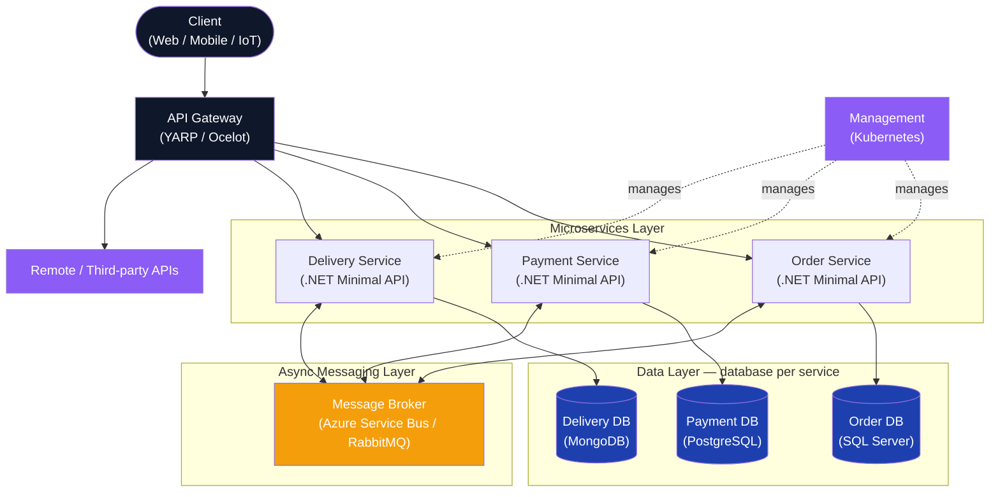
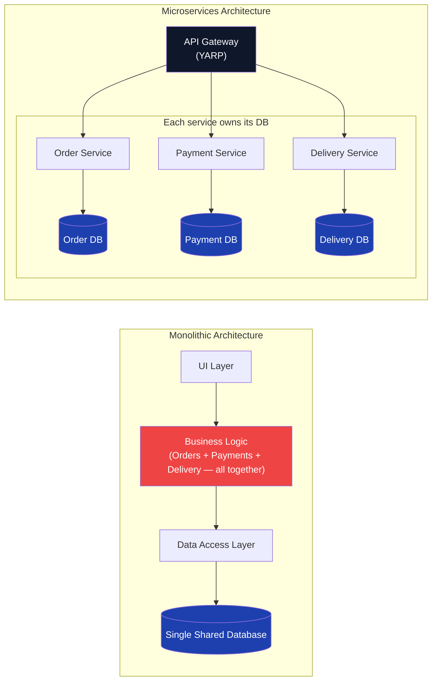
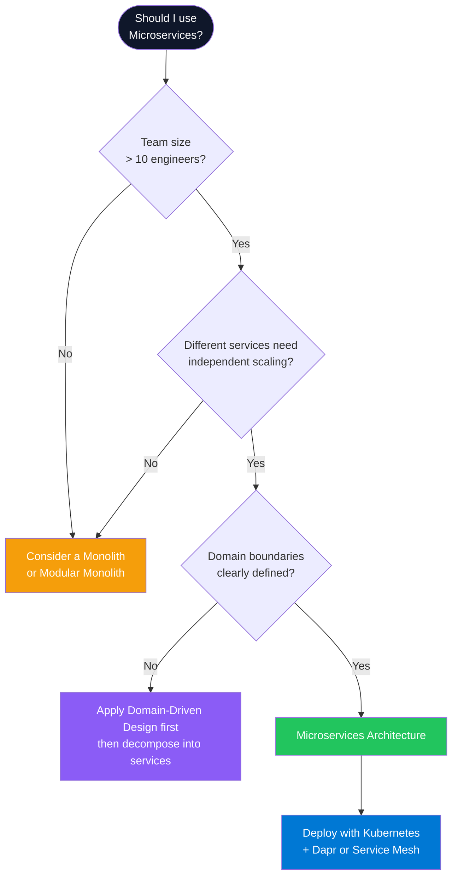
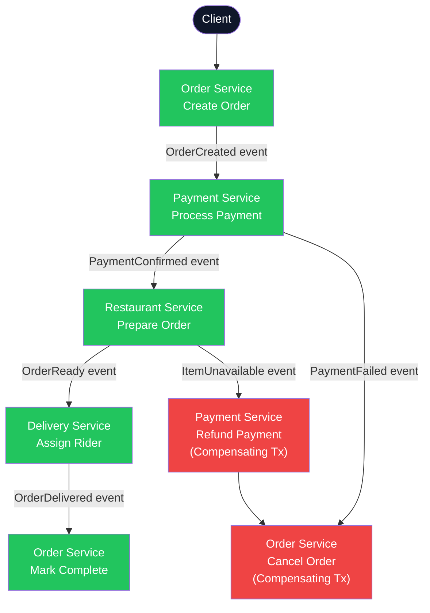
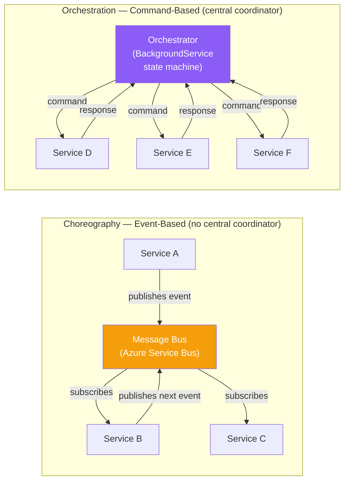
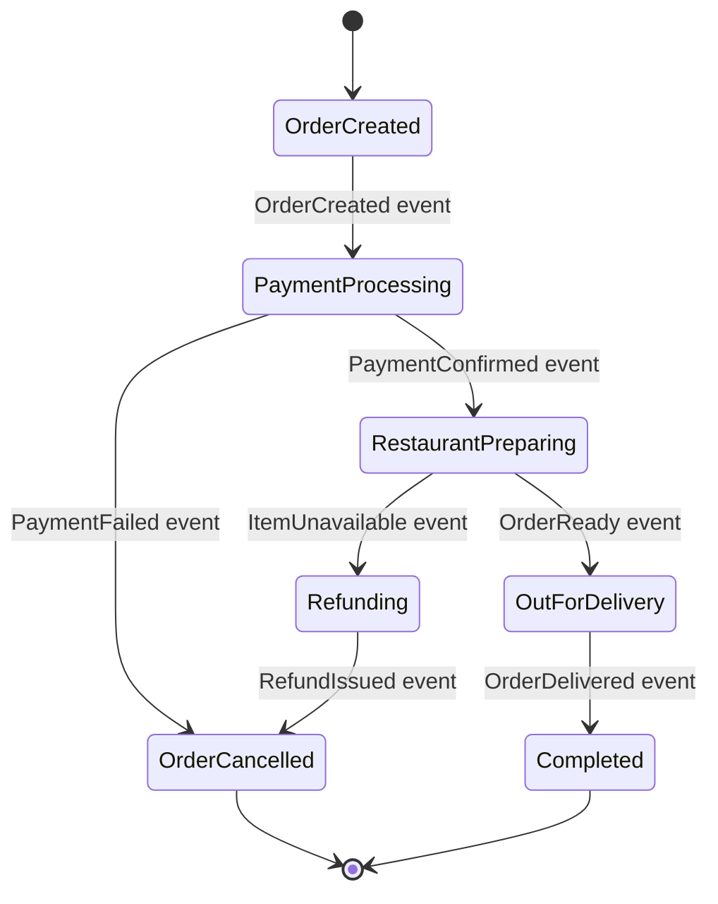
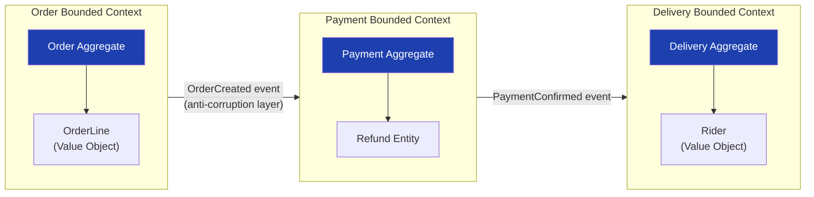
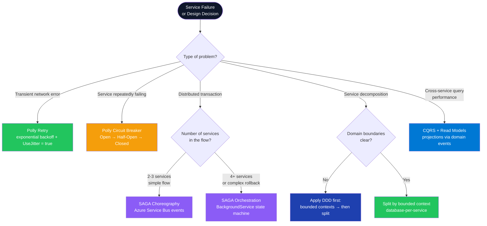

# Microservices Architecture (.NET)

---

## Table of Contents

1. [Introduction to Microservices](#1-introduction-to-microservices)
2. [Monolith vs Microservices](#2-monolith-vs-microservices)
3. [Pros and Cons of Microservices](#3-pros-and-cons-of-microservices)
4. [SAGA Pattern](#4-saga-pattern)
5. [Microservice Design Principles](#5-microservice-design-principles)

---

## 1. Introduction to Microservices

### Overview

Microservices is an architectural style that structures an application as a collection of small, independently deployable services each responsible for a single business capability. Services communicate through well-defined APIs (HTTP/REST, gRPC, or async messaging) and can be developed, deployed, and scaled independently of one another. This approach enables teams to release features faster, scale specific services under load, and adopt the best technology stack for each domain problem.

### Architecture Diagram



### Service 1 — Minimal Microservice (ASP.NET Core)

**Tech Stack:** ASP.NET Core Minimal API, `Microsoft.Extensions.Diagnostics.HealthChecks`, EF Core

```csharp
var builder = WebApplication.CreateBuilder(args);

builder.Services.AddDbContext<OrderDbContext>(opts =>
    opts.UseSqlServer(builder.Configuration.GetConnectionString("OrderDb")));

builder.Services
    .AddHealthChecks()
    .AddSqlServer(builder.Configuration.GetConnectionString("OrderDb")!);

builder.Services.AddScoped<IOrderRepository, OrderRepository>();
builder.Services.AddScoped<IOrderService, OrderService>();

var app = builder.Build();

app.MapGet("/orders/{id:guid}", async (Guid id, IOrderService svc, CancellationToken ct) =>
{
    var order = await svc.GetByIdAsync(id, ct);
    return order is null ? Results.NotFound() : Results.Ok(order);
});

app.MapPost("/orders", async (CreateOrderRequest req, IOrderService svc, CancellationToken ct) =>
{
    var order = await svc.CreateAsync(req, ct);
    return Results.Created($"/orders/{order.Id}", order);
});

// Kubernetes liveness and readiness probes
app.MapHealthChecks("/healthz/live", new HealthCheckOptions { Predicate = _ => false });
app.MapHealthChecks("/healthz/ready");

app.Run();

public record CreateOrderRequest(Guid CustomerId, IReadOnlyList<OrderLineItem> Items);
public record OrderLineItem(Guid ProductId, int Quantity, decimal UnitPrice);
```

### Service 2 — API Gateway with YARP

**Tech Stack:** `Yarp.ReverseProxy`, `Microsoft.AspNetCore.Authentication.JwtBearer`

```csharp
var builder = WebApplication.CreateBuilder(args);

builder.Services
    .AddReverseProxy()
    .LoadFromConfig(builder.Configuration.GetSection("ReverseProxy"));

builder.Services
    .AddAuthentication(JwtBearerDefaults.AuthenticationScheme)
    .AddJwtBearer();

var app = builder.Build();

app.UseAuthentication();
app.UseAuthorization();
app.MapReverseProxy();

app.Run();
```

```json
// appsettings.json — YARP route and cluster configuration
{
  "ReverseProxy": {
    "Routes": {
      "orders-route": {
        "ClusterId": "orders-cluster",
        "AuthorizationPolicy": "default",
        "Match": { "Path": "/api/orders/{**catch-all}" }
      },
      "payments-route": {
        "ClusterId": "payments-cluster",
        "Match": { "Path": "/api/payments/{**catch-all}" }
      }
    },
    "Clusters": {
      "orders-cluster": {
        "Destinations": {
          "d1": { "Address": "http://order-service:8080/" }
        }
      },
      "payments-cluster": {
        "Destinations": {
          "d1": { "Address": "http://payment-service:8080/" }
        }
      }
    }
  }
}
```

### Interview Talking Points

| Question | Answer |
|---|---|
| What is an API Gateway and why use one? | Single entry point that handles cross-cutting concerns — auth, rate limiting, SSL termination, routing — so clients are decoupled from service topology |
| How do microservices communicate? | Synchronously via HTTP/REST or gRPC; asynchronously via Azure Service Bus, RabbitMQ, or Kafka |
| What is the role of Kubernetes in microservices? | Manages service placement, health checks, auto-scaling, rolling updates, and secret injection — replaces manual orchestration |
| How do you handle API versioning in microservices? | URL path versioning (`/v1/orders`), header versioning, or content negotiation; YARP can route by version prefix |
| What is a service mesh? | Infrastructure layer (Dapr, Istio, Linkerd) that handles mTLS, service discovery, retries, and observability without code changes |

---

## 2. Monolith vs Microservices

### Overview

A monolithic architecture packages all components into a single deployable unit; any change requires redeploying the entire system, making independent scaling impossible. Microservices decompose the application into independently deployable services aligned with business domains, enabling teams to own, release, and scale their service autonomously. The right choice depends on team size, domain clarity, and operational maturity.

### Architecture Comparison Diagram



### Service 1 — Database-per-Service Pattern

**Tech Stack:** Entity Framework Core, Dapper, MongoDB Driver — each service chooses independently

```csharp
// Order Service — SQL Server via EF Core
public class OrderDbContext : DbContext
{
    public OrderDbContext(DbContextOptions<OrderDbContext> opts) : base(opts) { }
    public DbSet<Order> Orders => Set<Order>();
    public DbSet<OrderLine> OrderLines => Set<OrderLine>();
}

builder.Services.AddDbContext<OrderDbContext>(opts =>
    opts.UseSqlServer(builder.Configuration.GetConnectionString("OrderDb")));

// Payment Service — PostgreSQL via Dapper (completely independent choice)
builder.Services.AddNpgsqlDataSource(builder.Configuration.GetConnectionString("PaymentDb")!);
builder.Services.AddScoped<IPaymentRepository, DapperPaymentRepository>();

// Delivery Service — MongoDB (different tech, same principle)
builder.Services.AddSingleton<IMongoClient>(_ =>
    new MongoClient(builder.Configuration.GetConnectionString("DeliveryDb")));
```

### Interview Talking Points

| Question | Answer |
|---|---|
| When should you choose microservices over a monolith? | When team exceeds 15-20 engineers, when services need different scaling profiles, or when polyglot persistence is needed |
| What is the Strangler Fig pattern? | Migrate a monolith incrementally by routing new features to microservices; the monolith is replaced module by module without a big-bang rewrite |
| What is "database per service" and why does it matter? | Each service owns its data store, preventing schema coupling — enables independent schema changes and technology choices |
| What is the biggest operational risk of microservices? | Distributed system complexity: network failures, eventual consistency, distributed tracing, and N-fold infrastructure overhead |
| How do you share data across services without a shared DB? | Through domain events (async publish/subscribe) or API calls — never a shared schema |

---

## 3. Pros and Cons of Microservices

### Overview

Microservices offer scalability, team autonomy, fault isolation, and polyglot freedom, but introduce distributed system complexity, higher operational overhead, and cross-service testing challenges. Knowing both sides is critical for interviews and for making the right architectural decision in real projects.

### Decision Flowchart — Should You Use Microservices?



### Fault Tolerance — Polly Resilience Pipeline

**Tech Stack:** `Polly v8 (AddResilienceHandler)`, `Microsoft.Extensions.Http.Resilience`

```csharp
builder.Services.AddHttpClient<IPaymentServiceClient, PaymentServiceClient>()
    .AddResilienceHandler("payment-pipeline", pipeline =>
    {
        // Timeout per individual attempt
        pipeline.AddTimeout(TimeSpan.FromSeconds(5));

        // Retry: 3 attempts, exponential backoff, jitter prevents thundering herd
        pipeline.AddRetry(new HttpRetryStrategyOptions
        {
            MaxRetryAttempts = 3,
            Delay = TimeSpan.FromSeconds(1),
            BackoffType = DelayBackoffType.Exponential,
            UseJitter = true,
            ShouldHandle = new PredicateBuilder<HttpResponseMessage>()
                .Handle<HttpRequestException>()
                .HandleResult(r => r.StatusCode >= HttpStatusCode.InternalServerError)
        });

        // Circuit breaker: open when 50% of calls fail in a 30-second window
        pipeline.AddCircuitBreaker(new HttpCircuitBreakerStrategyOptions
        {
            FailureRatio = 0.5,
            SamplingDuration = TimeSpan.FromSeconds(30),
            MinimumThroughput = 5,
            BreakDuration = TimeSpan.FromSeconds(60)
        });
    });
```

### Interview Talking Points

| Question | Answer |
|---|---|
| What is the main benefit of independent deployment? | Teams release at their own cadence without cross-team coordination — each service has its own CI/CD pipeline |
| How do you handle failure in a downstream service? | Polly retry with exponential backoff for transient errors; circuit breaker for systemic failures; DLQ + alerting for unrecoverable errors |
| Why is global testing harder in microservices? | Each service must be tested in isolation, then in integration; contract testing (Pact) verifies API contracts without full environment spin-up |
| What operational overhead does microservices add? | Each service needs its own pipeline, logging, health checks, service discovery, and potentially its own database — multiply by N services |
| When is a modular monolith a better choice? | When domain boundaries are unclear, team is small, or the operational overhead of microservices would exceed the benefits |

---

## 4. SAGA Pattern

### Overview

The SAGA pattern solves distributed transaction management across microservices where ACID transactions spanning multiple databases are not possible. A SAGA breaks a distributed transaction into a sequence of local transactions; each step publishes an event or receives a command, and on failure, compensating transactions undo previously completed steps to maintain eventual consistency. There are two implementation styles: choreography (event-driven, decentralized) and orchestration (command-driven, centralized state machine).

### SAGA Flow Architecture Diagram



### Choreography vs Orchestration



### SAGA State Machine



### Service 1 — Choreography SAGA with Azure Service Bus

**Tech Stack:** `Azure.Messaging.ServiceBus`, `BackgroundService`, `System.Text.Json`

```csharp
// Publisher — Order Service emits OrderCreated event
public class OrderService : IOrderService
{
    private readonly ServiceBusSender _sender;
    private readonly OrderDbContext _db;

    public OrderService(ServiceBusClient client, OrderDbContext db)
    {
        _sender = client.CreateSender("order-events");
        _db = db;
    }

    public async Task<Order> CreateAsync(CreateOrderRequest req, CancellationToken ct)
    {
        var order = new Order { Id = Guid.NewGuid(), CustomerId = req.CustomerId, Status = OrderStatus.Created };
        _db.Orders.Add(order);
        await _db.SaveChangesAsync(ct);

        var payload = JsonSerializer.Serialize(new OrderCreatedEvent(order.Id, req.CustomerId, req.Items));
        var message = new ServiceBusMessage(payload)
        {
            MessageId = order.Id.ToString(),
            Subject = "OrderCreated"
        };
        await _sender.SendMessageAsync(message, ct);
        return order;
    }
}

// Consumer — Payment Service subscribes to OrderCreated
public class PaymentEventConsumer : BackgroundService
{
    private readonly ServiceBusProcessor _processor;
    private readonly IServiceScopeFactory _scopeFactory;

    public PaymentEventConsumer(ServiceBusClient client, IServiceScopeFactory scopeFactory)
    {
        _processor = client.CreateProcessor("order-events", "payment-subscription");
        _scopeFactory = scopeFactory;
    }

    protected override async Task ExecuteAsync(CancellationToken ct)
    {
        _processor.ProcessMessageAsync += OnMessageAsync;
        _processor.ProcessErrorAsync += OnErrorAsync;
        await _processor.StartProcessingAsync(ct);
        await Task.Delay(Timeout.Infinite, ct);
        await _processor.StopProcessingAsync();
    }

    private async Task OnMessageAsync(ProcessMessageEventArgs args)
    {
        using var scope = _scopeFactory.CreateScope();
        var svc = scope.ServiceProvider.GetRequiredService<IPaymentService>();
        var evt = JsonSerializer.Deserialize<OrderCreatedEvent>(args.Message.Body)!;
        await svc.ProcessPaymentAsync(evt, args.CancellationToken);
        await args.CompleteMessageAsync(args.Message);
    }

    private Task OnErrorAsync(ProcessErrorEventArgs args)
    {
        // Dead-lettered automatically after MaxDeliveryCount — alert team via DLQ monitor
        return Task.CompletedTask;
    }
}

public record OrderCreatedEvent(Guid OrderId, Guid CustomerId, IReadOnlyList<OrderLineItem> Items);
```

### Service 2 — Orchestration SAGA with BackgroundService State Machine

**Tech Stack:** `BackgroundService`, EF Core for saga state persistence

```csharp
public class OrderSagaOrchestrator : BackgroundService
{
    private readonly IOrderSagaRepository _repo;
    private readonly IPaymentClient _paymentClient;
    private readonly IRestaurantClient _restaurantClient;
    private readonly IDeliveryClient _deliveryClient;
    private readonly ILogger<OrderSagaOrchestrator> _logger;

    protected override async Task ExecuteAsync(CancellationToken ct)
    {
        while (!ct.IsCancellationRequested)
        {
            var pending = await _repo.GetPendingAsync(ct);
            foreach (var saga in pending)
                await AdvanceSagaAsync(saga, ct);

            await Task.Delay(TimeSpan.FromSeconds(5), ct);
        }
    }

    private async Task AdvanceSagaAsync(OrderSaga saga, CancellationToken ct)
    {
        try
        {
            saga.State = saga.State switch
            {
                SagaState.Created      => await ProcessPaymentAsync(saga, ct),
                SagaState.PaymentDone  => await PrepareRestaurantAsync(saga, ct),
                SagaState.FoodReady    => await AssignDeliveryAsync(saga, ct),
                SagaState.Delivered    => SagaState.Completed,
                SagaState.Failed       => await CompensateAsync(saga, ct),
                _                      => saga.State
            };
            await _repo.UpdateAsync(saga, ct);
        }
        catch (Exception ex)
        {
            _logger.LogError(ex, "SAGA step failed for order {OrderId}", saga.OrderId);
            saga.State = SagaState.Failed;
            await _repo.UpdateAsync(saga, ct);
        }
    }

    private async Task<SagaState> CompensateAsync(OrderSaga saga, CancellationToken ct)
    {
        if (saga.PaymentId.HasValue)
            await _paymentClient.RefundAsync(saga.PaymentId.Value, ct);
        return SagaState.Compensated;
    }
}

public class OrderSaga
{
    public Guid OrderId { get; init; }
    public SagaState State { get; set; }
    public Guid? PaymentId { get; set; }
}

public enum SagaState { Created, PaymentDone, FoodReady, Delivered, Failed, Compensated, Completed }
```

### Interview Talking Points

| Question | Answer |
|---|---|
| What problem does SAGA solve? | Distributed transactions across services that each have their own database — ACID is impossible, so SAGA uses local transactions + compensating transactions for eventual consistency |
| Choreography vs Orchestration — when to use which? | Choreography for simple 2-3 service flows (lower coupling, no SPoF); Orchestration for complex 4+ service flows where visibility and rollback control is critical |
| What is a compensating transaction? | A business operation that undoes a previously completed step — e.g., issuing a refund to compensate a processed payment when a later step fails |
| How do you handle idempotency in SAGA? | Each message carries a unique ID; consumers use the outbox pattern or an idempotency key table to deduplicate replayed messages |
| What is the outbox pattern? | Write the domain event to an "outbox" table in the same DB transaction as business data, then a relay publishes it — guarantees at-least-once delivery without two-phase commit |

---

## 5. Microservice Design Principles

### Overview

Eight foundational principles guide production-grade microservice design: autonomy, resilience, observability, discoverability, domain-driven boundaries, decentralization, high cohesion, and single source of truth. Together they ensure services remain independently deployable, operationally manageable, and organizationally aligned with business domains.

### Design Principles Overview Diagram

```mermaid
flowchart TD
    CORE(["Microservice\nDesign Principles"])
    CORE --> P1["1. Independent / Autonomous\nOwn code, DB, and deployment pipeline"]
    CORE --> P2["2. Resilient / Fault Tolerant\nPolly retry + circuit breaker + DLQ"]
    CORE --> P3["3. Observable\nOpenTelemetry + Serilog + health checks"]
    CORE --> P4["4. Discoverable\nKubernetes DNS / Azure Service Discovery"]
    CORE --> P5["5. Domain Driven\nBounded contexts — one service per domain"]
    CORE --> P6["6. Decentralized\nNo shared DB, no shared governance"]
    CORE --> P7["7. High Cohesion\nSingle responsibility per service"]
    CORE --> P8["8. Single Source of Truth\nOne authoritative owner per data entity"]

    style CORE fill:#0f172a,color:#fff
    style P1 fill:#22c55e,color:#fff
    style P2 fill:#ef4444,color:#fff
    style P3 fill:#8b5cf6,color:#fff
    style P4 fill:#0078D4,color:#fff
    style P5 fill:#1e40af,color:#fff
    style P6 fill:#f59e0b,color:#fff
    style P7 fill:#22c55e,color:#fff
    style P8 fill:#8b5cf6,color:#fff
```



### Principle 1 — Independent / Autonomous

Each service is owned by a small autonomous team with full control over its code, database, and deployment pipeline. No shared startup projects, no shared DbContexts across service boundaries.

```csharp
// Each service has its own Program.cs — zero shared infrastructure code
var builder = WebApplication.CreateBuilder(args);

builder.Services.AddDbContext<OrderDbContext>(opts =>
    opts.UseSqlServer(builder.Configuration.GetConnectionString("OrderDb")));

builder.Services.AddScoped<IOrderRepository, OrderRepository>();
builder.Services.AddScoped<IOrderService, OrderService>();

var app = builder.Build();
app.MapGet("/orders/{id:guid}", async (Guid id, IOrderService svc, CancellationToken ct) =>
{
    var order = await svc.GetByIdAsync(id, ct);
    return order is null ? Results.NotFound() : Results.Ok(order);
});
app.Run();
```

### Principle 2 — Resilient / Fault Tolerant / Design For Failure

**Tech Stack:** `Polly v8 (Microsoft.Extensions.Http.Resilience)`, `Microsoft.Extensions.Diagnostics.HealthChecks`

Assume any remote call can fail. Design explicitly for transient errors (retry), systemic failures (circuit breaker), and unrecoverable errors (DLQ).

```csharp
builder.Services.AddHttpClient<IInventoryClient, InventoryClient>()
    .AddResilienceHandler("inventory-pipeline", pipeline =>
    {
        pipeline.AddTimeout(TimeSpan.FromSeconds(5));

        pipeline.AddRetry(new HttpRetryStrategyOptions
        {
            MaxRetryAttempts = 3,
            Delay = TimeSpan.FromMilliseconds(300),
            BackoffType = DelayBackoffType.Exponential,
            UseJitter = true,
            ShouldHandle = new PredicateBuilder<HttpResponseMessage>()
                .Handle<HttpRequestException>()
                .HandleResult(r => r.StatusCode >= HttpStatusCode.InternalServerError)
        });

        pipeline.AddCircuitBreaker(new HttpCircuitBreakerStrategyOptions
        {
            FailureRatio = 0.5,
            SamplingDuration = TimeSpan.FromSeconds(30),
            BreakDuration = TimeSpan.FromSeconds(30),
            MinimumThroughput = 10
        });
    });

builder.Services
    .AddHealthChecks()
    .AddSqlServer(builder.Configuration.GetConnectionString("OrderDb")!)
    .AddCheck<ExternalApiHealthCheck>("inventory-api");
```

### Principle 3 — Observable

**Tech Stack:** `OpenTelemetry`, `Serilog`, `ApplicationInsights`

Observability requires three pillars: distributed tracing, structured logging, and metrics.

```csharp
builder.Services
    .AddOpenTelemetry()
    .WithTracing(tracing => tracing
        .AddAspNetCoreInstrumentation()
        .AddHttpClientInstrumentation()
        .AddSqlClientInstrumentation()
        .AddOtlpExporter())   // Jaeger / Azure Monitor
    .WithMetrics(metrics => metrics
        .AddAspNetCoreInstrumentation()
        .AddHttpClientInstrumentation()
        .AddRuntimeInstrumentation()
        .AddOtlpExporter());  // Prometheus / Grafana

builder.Host.UseSerilog((ctx, cfg) => cfg
    .ReadFrom.Configuration(ctx.Configuration)
    .Enrich.WithCorrelationId()
    .WriteTo.Console(new JsonFormatter())
    .WriteTo.ApplicationInsights(
        TelemetryConfiguration.CreateDefault(),
        TelemetryConverter.Traces));
```

### Principle 4 — Discoverable

**Tech Stack:** Kubernetes Service DNS, `IOptions<T>`, Azure App Configuration

Services find each other through Kubernetes DNS names — no hardcoded IPs.

```csharp
// appsettings.json — K8s Service names resolve via internal DNS
{
  "ServiceUrls": {
    "PaymentService": "http://payment-service:8080",
    "RestaurantService": "http://restaurant-service:8080"
  }
}

public record ServiceUrlOptions
{
    public string PaymentService { get; init; } = "";
    public string RestaurantService { get; init; } = "";
}

builder.Services.Configure<ServiceUrlOptions>(
    builder.Configuration.GetSection("ServiceUrls"));

// Consumed via constructor injection — no ServiceLocator
public class OrderService(IOptions<ServiceUrlOptions> urls, HttpClient http)
{
    public Task NotifyPaymentAsync(Guid orderId, CancellationToken ct) =>
        http.PostAsJsonAsync($"{urls.Value.PaymentService}/payments/notify", orderId, ct);
}
```

### Principle 5 — Domain Driven Design (Bounded Contexts)

Each microservice maps to exactly one bounded context. Domain models do not leak across context boundaries — integration happens through events with an anti-corruption layer.



```csharp
// Aggregate root enforces invariants — no business logic leaks outside Order context
public class Order
{
    private readonly List<OrderLine> _lines = new();

    public Guid Id { get; private init; } = Guid.NewGuid();
    public OrderStatus Status { get; private set; } = OrderStatus.Draft;
    public IReadOnlyList<OrderLine> Lines => _lines.AsReadOnly();

    public void AddLine(Guid productId, int qty, decimal unitPrice)
    {
        if (Status != OrderStatus.Draft)
            throw new DomainException("Cannot modify a confirmed order");
        _lines.Add(new OrderLine(productId, qty, unitPrice));
    }

    public void Confirm()
    {
        if (!_lines.Any()) throw new DomainException("Order must have at least one line item");
        Status = OrderStatus.Confirmed;
    }
}
```

### Principle 6 — Decentralization

No shared databases, no shared governance. Each team chooses its own persistence technology independently.

```csharp
// Order Service — SQL Server + EF Core (CQRS-oriented, complex queries)
builder.Services.AddDbContext<OrderDbContext>(opts =>
    opts.UseSqlServer(builder.Configuration.GetConnectionString("OrderDb")));

// Payment Service — PostgreSQL + Dapper (lightweight, high-throughput writes)
builder.Services.AddNpgsqlDataSource(builder.Configuration.GetConnectionString("PaymentDb")!);
builder.Services.AddScoped<IPaymentRepository, DapperPaymentRepository>();

// Delivery Service — MongoDB (flexible schema for route documents)
builder.Services.AddSingleton<IMongoClient>(_ =>
    new MongoClient(builder.Configuration.GetConnectionString("DeliveryDb")));
builder.Services.AddScoped<IDeliveryRepository, MongoDeliveryRepository>();
```

### Principle 7 — High Cohesion

Each service is responsible for exactly one business capability. Payment logic does not belong in OrderService — it crosses a bounded context boundary.

```csharp
// Bad — OrderService reaches into Payment domain
public class OrderService
{
    public async Task<Order> CreateAsync(CreateOrderRequest req, CancellationToken ct)
    {
        await _paymentGateway.ChargeAsync(req.PaymentDetails, ct); // ❌ wrong bounded context
        var order = new Order(req.CustomerId);
        return order;
    }
}

// Good — OrderService publishes an event; PaymentService responds in its own context
public class OrderService(ServiceBusSender bus, OrderDbContext db)
{
    public async Task<Order> CreateAsync(CreateOrderRequest req, CancellationToken ct)
    {
        var order = new Order(req.CustomerId);
        db.Orders.Add(order);
        await db.SaveChangesAsync(ct);
        await bus.SendMessageAsync(
            new ServiceBusMessage(JsonSerializer.Serialize(new OrderCreatedEvent(order.Id))), ct);
        return order; // ✅ Payment Service handles payment asynchronously
    }
}
```

### Principle 8 — Single Source of Truth

One service is the authoritative owner of each data entity. Other services maintain local read-model projections — they never write into another service's data store.

```csharp
// ProductService is the authoritative owner of product data.
// OrderService stores only productId in its order lines.
// For display, it projects a cached snapshot updated via events.
public class ProductSnapshotConsumer : BackgroundService
{
    private readonly ServiceBusProcessor _processor;
    private readonly IProductSnapshotRepository _repo;

    protected override async Task ExecuteAsync(CancellationToken ct)
    {
        _processor.ProcessMessageAsync += async args =>
        {
            var evt = JsonSerializer.Deserialize<ProductUpdatedEvent>(args.Message.Body)!;
            // Local projection — ProductService is the true source; this is a read cache only
            await _repo.UpsertSnapshotAsync(evt.ProductId, evt.Name, evt.Price, ct);
            await args.CompleteMessageAsync(args.Message);
        };
        await _processor.StartProcessingAsync(ct);
        await Task.Delay(Timeout.Infinite, ct);
    }
}
```

### Interview Talking Points

| Question | Answer |
|---|---|
| What does "Design for Failure" mean practically? | Assume any downstream call can fail or be slow; code Polly retry, circuit breakers, timeouts, and dead-letter handling rather than assuming the happy path |
| How do you implement observability in microservices? | Three pillars: distributed tracing (OpenTelemetry + Jaeger), structured logging (Serilog + App Insights), and metrics (Prometheus + Grafana) — with W3C trace context propagation |
| What is a bounded context in DDD? | A logical boundary within which a domain model is defined and applicable — each microservice should map to exactly one bounded context |
| How do you avoid data coupling between services? | Database-per-service, events for async data sharing, read models for query-side projections, never a shared schema or direct cross-service DB access |
| What is the difference between high cohesion and low coupling? | High cohesion = all the logic inside a service is strongly related to one domain; low coupling = services are independent and communicate through stable contracts only |

---

## Cross-Cutting Themes

### Pattern Selection Guide



### Common Interview Red Flags to Avoid

| Red Flag | Why It's Wrong | Correct Answer |
|---|---|---|
| "We share a database across microservices" | Tight schema coupling — any schema change breaks multiple services simultaneously | Database-per-service; share data via domain events or read APIs only |
| "We retry in a tight loop" | Thundering herd — hammers a recovering service and causes cascading failures | Polly exponential backoff with jitter (`UseJitter = true`) |
| "SAGA replaces ACID transactions" | SAGA gives eventual consistency, not ACID — compensating transactions are best-effort, not atomic | Use SAGA for eventual consistency; keep ACID within a single service's database |
| "We use choreography for everything" | Complex multi-step flows with 6+ services become impossible to trace and debug | Use orchestration with a state machine for complex workflows with multiple rollback scenarios |
| "Microservices are always better than a monolith" | Distributed system overhead is high — wrong choice for small teams or unclear domain boundaries | Start with a modular monolith; migrate to microservices as teams and domains mature |
| "We just add correlation IDs in logs" | Partial observability — distributed tracing requires propagated trace context (spans) across every HTTP and message hop | OpenTelemetry with W3C Trace Context propagation across all HTTP clients and message consumers |
| "We deploy all services together in one pipeline" | Creates a distributed monolith — defeats the independence benefit of microservices | Each service has its own independent CI/CD pipeline with its own deployment cadence |
| "No compensating transactions defined for failures" | Leaves data in an inconsistent state across services with no recovery path | Every SAGA step must have a corresponding compensating transaction defined before the step is deployed |
