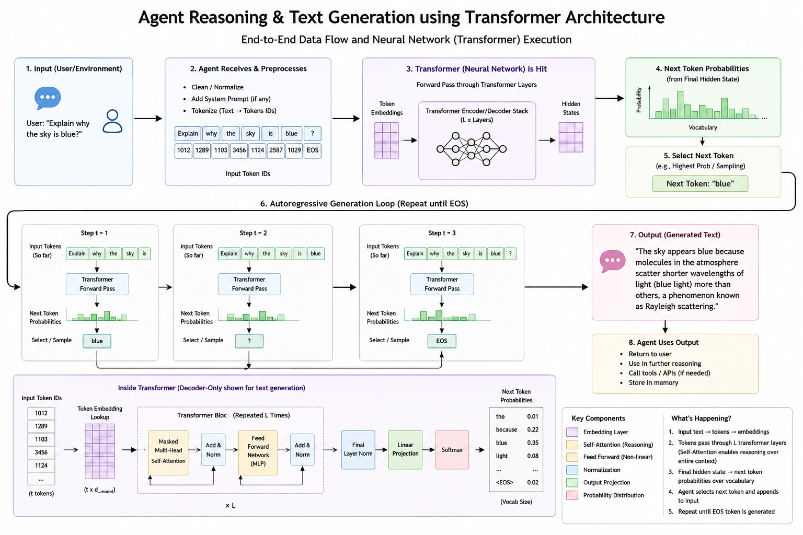
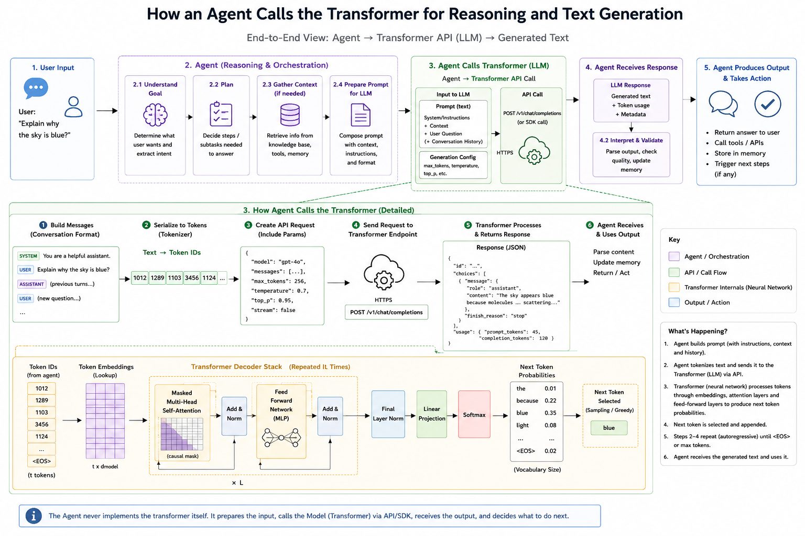

# 3.5 Memory Architecture

> **Navigation**
>
> - [1 — Agent Memory and the Four Types](#1--agent-memory-and-the-four-types)
>   - [1a — Semantic Memory vs RAG](#1a--semantic-memory-vs-rag)
>   - [1b — Managing the Context Window](#1b--managing-the-context-window)
> - [2 — RAG and Its Details](#2--rag-and-its-details)
>   - [2a — RAG, Semantic Memory, and Chunking](#2a--rag-semantic-memory-and-chunking)
> - [3 — Neural Networks and Transformers](#3--neural-networks-and-transformers)
>   - [What Is a Neuron?](#what-is-a-neuron)
>   - [The Perceptron and Geoffrey Hinton](#the-perceptron-and-geoffrey-hinton)
>   - [3.1 Weights](#31-weights)
>   - [3.2 Structure — Layers and Neuron Counts](#32-structure)
>   - [3.3 How It Learns](#33-how-it-learns)
>     - [3.3.1 Activation Functions (Sigmoid, ReLU)](#331--activation-functions)
>     - [3.3.2 EPOCH](#332--epoch)
>     - [3.3.3 Loss Function vs Cost Function](#333--loss-function-vs-cost-function)
>     - [3.3.4 Optimizer](#334--optimizer)
>     - [3.3.5 Chain Rule and Backpropagation to Global Minimum](#335--chain-rule-and-backpropagation-to-the-global-minimum)
>     - [3.3.6 Vanishing Gradient Problem](#336--vanishing-gradient-problem)
>     - [3.3.7 Exploding Gradient Problem](#337--exploding-gradient-problem)
>   - [3.4 Types of Neural Networks](#34-types-of-neural-networks)
>   - [MLP — Multi-Layer Perceptron](#mlp--multi-layer-perceptron-fully-connected-network)
>   - [LLM Inference — What Happens at Call Time](#llm-inference--what-happens-at-call-time)
>   - [Temperature and Top-k — Sampling Parameters](#temperature-and-top-k--decoding--sampling-parameters)
>   - [3a — Embeddings](#3a--embeddings)
>   - [3b — LLM Architecture](#3b--llm-architecture)
>   - [3c — Parameters and Dimensions](#3c--parameters-and-dimensions)
> - [4 — Shipping a Production-Grade RAG System](#4--shipping-a-production-grade-rag-system)
> - [Interview Questions](#interview-questions)

---

An LLM has no persistent state — every API call is stateless. An agent's apparent ability to "remember" is entirely the responsibility of the agent framework: it must decide *what* to surface into the LLM's context window at each Planning step, and *what* to write back to storage after each Observing step. Memory architecture is therefore one of the most consequential design decisions in an agentic system.

---

## 1 — Agent Memory and the Four Types

### Architecture at a Glance

```
                           ┌───────────────┐
                           │   🤖 Agent    │
                           └───────┬───────┘
          ┌──────────────┬─────────┴─────────┬──────────────┐
     Read/│         Recall/                  │         Execute
     Write│         Store│            Retrieve│              │
          ▼              ▼                   ▼              ▼
  ┌─────────────┐ ┌─────────────┐ ┌──────────────┐ ┌─────────────┐
  │ 🔵 IN-      │ │ 🟢 EPISODIC │ │ 🟡 SEMANTIC  │ │ 🔴 PROCED-  │
  │ CONTEXT     │ │             │ │              │ │ URAL        │
  │ (Working)   │ │ (Session)   │ │ (Knowledge)  │ │ (Skill)     │
  │─────────────│ │─────────────│ │──────────────│ │─────────────│
  │ Current     │ │ Past inter- │ │ Facts,       │ │ How to use  │
  │ conversation│ │ actions,    │ │ domain know- │ │ tools,      │
  │ task state, │ │ completed   │ │ ledge,       │ │ operating   │
  │ observations│ │ tasks       │ │ doc corpus   │ │ procedures  │
  │─────────────│ │─────────────│ │──────────────│ │─────────────│
  │ Lifespan:   │ │ Lifespan:   │ │ Lifespan:    │ │ Lifespan:   │
  │ Session     │ │ Days/weeks  │ │ Permanent    │ │ Permanent   │
  │─────────────│ │─────────────│ │──────────────│ │─────────────│
  │ Token window│ │ Redis /     │ │ Vector DB    │ │ System      │
  │             │ │ Cosmos DB   │ │ (AI Search)  │ │ prompt /    │
  │             │ │             │ │              │ │ plugins     │
  └─────────────┘ └─────────────┘ └──────────────┘ └─────────────┘
```

### The Memory Types

| Memory Type | Analogy | Lifespan | Read Pattern | Write Pattern | Backing Store |
| --- | --- | --- | --- | --- | --- |
| **In-Context (Working)** | Whiteboard | Current session only | Always present in prompt | Agent appends observations each iteration | Token window (128k–200k tokens) |
| **Episodic (Session)** | Notebook | Days to weeks | Retrieved by session ID or semantic similarity | Written at session end or on significant events | Redis / Cosmos DB (NoSQL) |
| **Semantic (Knowledge)** | Library | Permanent | Vector similarity search (RAG) | Updated by data pipeline, not the agent at runtime | Vector DB (Chroma, Pinecone, pgvector) |
| **Procedural (Skill)** | Muscle memory | Permanent | Injected as system prompt or plugin definition | Updated via prompt engineering / plugin deployment | System prompt, packaged skill modules |

### Read/Write Access Matrix

| Memory Type | Agent Reads | Agent Writes | Human / Pipeline Writes |
| --- | --- | --- | --- |
| In-Context | Every iteration | Every iteration (append) | At session start |
| Episodic | On recall trigger | End of session / key events | Rarely |
| Semantic | During Perceiving (RAG) | **Never at runtime** | Data ingestion pipeline |
| Procedural | Injected at agent startup | **Never at runtime** | Prompt engineering / deployment |

> **Key insight:** The agent only *writes* to in-context and episodic memory. Semantic and procedural are **read-only from the agent's perspective** — they are maintained by external processes. This separation prevents the agent from corrupting its own knowledge base.

---

### Real-World Examples

**In-Context (Working Memory)**

> **Scenario:** An IT support agent is troubleshooting a broken CI/CD pipeline for a developer.
>
> During a single session the agent: reads the developer's description of the failure → calls `get_pipeline_logs(run_id=4821)` → observes a YAML parse error → calls `get_file_content("ci-pipeline.yml")` → spots a missing closing bracket on line 47 → suggests the fix.
>
> Every tool result and every reasoning step is appended to the context window. The agent can reference the log output from step 2 when explaining the fix in step 5 — all within the same session, all within the same token window. When the session ends, none of this is automatically saved anywhere.

---

**Episodic (Session Memory)**

> **Scenario:** A financial analysis agent serves the same portfolio manager, Ana, every week.
>
> Last Monday, Ana asked: *"Analyze our emerging markets exposure."* The agent ran 6 tool calls, hit a rate-limit on the data vendor API, retried, and eventually produced a report. That outcome — including which tools failed, what the final answer was, and how long it took — was written as an episodic entry.
>
> This Monday, Ana asks: *"Compare this week's EM exposure to last week."* The agent retrieves last week's episode by `user_id + topic embedding`, pulls the prior result summary, and uses it directly in its context — skipping the 6-call data gathering phase that already ran. The agent also knows to set a longer timeout on the data vendor call because it failed last time.

---

**Semantic (Knowledge Memory)**

> **Scenario:** An HR assistant agent answers employee questions across a company of 8,000 people.
>
> An employee asks: *"How many weeks of parental leave do I get if I adopt?"*
>
> The agent does not have this answer in its system prompt — it would be impossible to enumerate every policy. Instead, during the Perceiving phase it embeds the question, runs a vector similarity search against the indexed HR policy corpus in a vector store, and retrieves the three most relevant chunks: the parental leave policy, the adoption supplement clause, and the eligibility section. Those chunks are injected into the context window, and the LLM synthesises a precise answer grounded in the actual policy document, citing the source URL.
>
> If the HR team updates the parental leave policy next month, only the data ingestion pipeline needs to re-index that document — the agent itself is unchanged.

---

**Procedural (Skill Memory)**

> **Scenario:** A customer-facing sales agent for a SaaS company.
>
> The system prompt bakes in the rules the agent must always follow:
>
> ```
> You are Aria, a sales assistant for Acme SaaS.
> ALWAYS call get_customer_account(email) before discussing pricing.
> NEVER quote a price below the list price without calling get_approval_workflow().
> If the customer mentions a competitor, call log_competitive_mention() silently.
> Escalate to a human rep if the deal value exceeds $50,000.
> ```
>
> These rules are procedural memory — the agent executes them reflexively on every call, just as a trained sales rep follows a playbook without consciously recalling it each time. The tool schemas (what `get_customer_account` accepts and returns) are also procedural: they tell the LLM exactly how to call each tool.

---

### How Each Memory Type Works at Runtime

**In-Context Memory** is the only memory the LLM can directly "see." Everything else must be explicitly loaded into this window before the Planning step. The context window has a hard token limit, so the framework must actively manage what goes in:

```
┌─────────────────────────── Context Window (e.g., 128k tokens) ───────────────────────────────┐
│  [System Prompt — Procedural]   ~1k tokens  — tool schemas, persona, rules                   │
│  [Retrieved Docs — Semantic]    ~8k tokens  — top-k chunks from vector store                 │
│  [Session History — Episodic]   ~4k tokens  — summary of prior sessions                      │
│  [Current Conversation]        ~10k tokens  — turns so far in this session                   │
│  [Iteration Scratchpad]         ~2k tokens  — current thought/action/observation chain        │
│                                                                                               │
│  Remaining budget available for tool responses → ~103k tokens                                 │
└───────────────────────────────────────────────────────────────────────────────────────────────┘
```

**Episodic Memory** gives the agent continuity across sessions — it knows what it tried before, what succeeded, and who it spoke with. The retrieval strategy is critical:

- **Exact retrieval** (by `session_id` or `user_id`): fast, used to reload a paused task
- **Semantic retrieval** (by embedding similarity): used when the agent asks "have I seen a similar problem before?"

```python
import datetime, json, redis

store = redis.Redis(host=REDIS_HOST, port=6379, db=0)

episode = {
    "session_id": session_id,
    "user_id": user_id,
    "goal": goal_text,
    "outcome": "success",
    "tools_used": ["query_sales_db", "send_email"],
    "iterations": 4,
    "summary": "Summarized Q2 EMEA anomaly and emailed the VP of Sales.",
    "timestamp": datetime.datetime.utcnow().isoformat()
}

# Expire after 30 days — episodic memory has a finite useful lifespan
store.setex(f"episode:{session_id}", 60 * 60 * 24 * 30, json.dumps(episode))
```

**Semantic Memory** is how the agent grounds itself in organizational knowledge — product documentation, policy documents, support tickets, financial reports. At runtime, the agent generates a query embedding and retrieves the top-k relevant chunks (RAG pattern):

```python
import chromadb
from sentence_transformers import SentenceTransformer

client = chromadb.HttpClient(host=VECTOR_STORE_HOST, port=8000)
collection = client.get_collection("knowledge-base")

encoder = SentenceTransformer("all-MiniLM-L6-v2")
query_vector = encoder.encode(user_query).tolist()

results = collection.query(
    query_embeddings=[query_vector],
    n_results=5,
    include=["documents", "metadatas"]
)

retrieved_chunks = results["documents"][0]   # top-k chunks injected into context window
```

**Procedural Memory** is the only memory type the agent cannot update itself at runtime — it is defined by the engineer. It includes:

- The **system prompt** (agent persona, operating rules, safety guardrails)
- **Tool schemas** (function name, description, parameter types) — the LLM reads these to know what it can do
- **Plugins / skills** (packaged skill modules that encapsulate multi-step workflows as callable units)

---

### 1a — Semantic Memory vs RAG

A common point of confusion: **RAG is the retrieval mechanism; semantic memory is the storage concept.** They are not the same, but RAG is the standard pattern used to *read* from semantic memory.

|  | RAG | Semantic Memory |
| --- | --- | --- |
| **What it is** | A retrieval *technique* | A memory *type* (architectural concept) |
| **Defines** | *How* content moves from storage into the context window | *What* is stored and its lifecycle properties |
| **Layer** | Runtime retrieval pattern | Storage + content classification |

They diverge in two ways:

1. **RAG can query episodic memory too.** If past session summaries are embedded and stored in a vector index, RAG retrieves relevant prior interactions. That is still RAG, but it reads from episodic memory, not semantic.
2. **Semantic memory can be read without RAG.** Keyword search, direct SQL lookup, or document fetch are all valid reads from a knowledge store. RAG is just the most effective pattern for unstructured corpora.

```
Semantic Memory  =  the indexed knowledge corpus  (permanent, shared, org-wide)
RAG              =  the pattern that reads from it at runtime and loads chunks into in-context memory
```

RAG is the *verb*, semantic memory is the *noun*. When an interviewer asks "how does the agent use semantic memory?", the answer is almost always "via RAG."

---

### 1b — Managing the Context Window

As a session grows, in-context memory fills up. The three standard strategies for managing overflow:

| Strategy | Mechanism | Trade-off |
| --- | --- | --- |
| **Sliding window** | Drop oldest N turns when token count exceeds \~80% of limit | Simple; loses early context |
| **Summarization** | LLM compresses old turns into a \~300 token summary block | Retains meaning; adds one LLM call per \~20 turns |
| **Hierarchical retrieval** | Move old turns to episodic store; retrieve on demand via embedding | Most robust; adds architectural complexity |

For most enterprise agents, **summarization** is the right default: cheap enough and preserves the semantic content the agent needs to avoid repeating work.

---

## 2 — RAG and Its Details

RAG (Retrieval-Augmented Generation) is the standard runtime pattern for loading relevant knowledge into the agent's context window. Rather than embedding all organizational knowledge into the prompt, the agent embeds the current query, searches a vector index for the most relevant chunks, and injects only those chunks before calling the LLM.

```
User query  →  embed query  →  vector search (top-k)  →  inject chunks into context  →  LLM generates answer
```

---

### 2a — RAG, Semantic Memory, and Chunking

Since the agent never writes to semantic memory at runtime, a separate **data ingestion pipeline** is responsible for populating and maintaining it.

**When to write:**

| Trigger | Example | Action |
| --- | --- | --- |
| New document published | New product spec uploaded | Chunk, embed, and upsert all chunks |
| Document updated | HR policy revised | Delete old chunks for that `doc_id`, re-chunk and re-embed |
| Document deleted / expired | Policy retired | Delete all chunks for that `doc_id` from the index |
| Scheduled re-index | Nightly or weekly sweep | Re-process documents whose source hash has changed |
| Human approval gate passed | Knowledge article reviewed and approved | Trigger ingestion only after sign-off |

**How to write — the ingestion pipeline:**

```
Source Document
      │
      ▼
  Extractor ──── pulls raw text from file storage, CMS, database, or web
      │
      ▼
   Chunker ───── splits text into overlapping chunks (e.g., 512 tokens, 50-token overlap)
      │
      ▼
   Embedder ──── converts each chunk to a dense vector using an embedding model
      │
      ▼
  Vector Store ─ upserts (chunk text + vector + metadata) into the index
```

```python
from sentence_transformers import SentenceTransformer
import chromadb, datetime

encoder    = SentenceTransformer("all-MiniLM-L6-v2")
client     = chromadb.HttpClient(host=VECTOR_STORE_HOST, port=8000)
collection = client.get_or_create_collection("knowledge-base")

def chunk_document(text: str, chunk_size: int = 512, overlap: int = 50) -> list[str]:
    words = text.split()
    return [" ".join(words[i : i + chunk_size]) for i in range(0, len(words), chunk_size - overlap)]

def ingest_document(doc_id: str, title: str, content: str, source_url: str, category: str):
    # Always delete stale chunks before re-inserting — prevents outdated content coexisting with new
    collection.delete(where={"doc_id": doc_id})

    chunks      = chunk_document(content)
    embeddings  = encoder.encode(chunks).tolist()

    collection.upsert(
        ids=[f"{doc_id}::chunk_{i}" for i in range(len(chunks))],
        embeddings=embeddings,
        documents=chunks,
        metadatas=[{
            "doc_id":      doc_id,
            "title":       title,
            "source_url":  source_url,
            "category":    category,
            "chunk_index": i,
            "ingested_at": datetime.datetime.utcnow().isoformat()
        } for i in range(len(chunks))]
    )
```

**Chunking strategies:**

| Strategy | How | Best For |
| --- | --- | --- |
| **Fixed-size with overlap** | Split every N tokens; overlap last M tokens with next chunk | General-purpose task |
| **Sentence / paragraph boundary** | Split on `.` or `\n\n`; never cut mid-sentence | Narrative text, policies, articles |
| **Recursive** | Try paragraph → sentence → word; stop when small enough | Mixed-format documents |
| **Structure-aware** | Split on headings; keep section context in metadata | Technical docs, wikis, API references |

**Metadata to attach per chunk** — metadata enables filtered retrieval at query time:

| Field | Purpose |
| --- | --- |
| `doc_id` | Deterministic identifier; used to delete/replace chunks on update |
| `title` / `source_url` | Surfaced to the user as a citation |
| `category` / `topic` | Enables category-scoped retrieval |
| `ingested_at` | Used for freshness filtering |
| `security_level` | Enforces access control (only return chunks the user is authorised to see) |

> **The most common bug in semantic memory pipelines:** Skipping the delete-before-insert step on updates. Old (stale) chunks coexist with new ones, and retrieval surfaces the outdated version alongside the current one. Always delete by `doc_id` before re-inserting.

---

## 3 — Neural Networks and Transformers

These sections explain the underlying technology that makes semantic memory and RAG work.

### What Is a Neural Network?

A **neural network** is a computational system that learns to map inputs to outputs by adjusting the strength of connections (called **weights**) across layers of simple processing units.

---

#### What Is a Neuron?

A **neuron** is a single mathematical function. It takes a set of inputs, multiplies each by a weight, sums them all, adds a bias term, and passes the result through an **activation function** to produce a single output.

```
Inputs:    x₁, x₂, x₃
Weights:   w₁, w₂, w₃

Step 1 — Summation:   z  =  (x₁·w₁ + x₂·w₂ + x₃·w₃) + bias
Step 2 — Activation:  output  =  activation_function(z)
```

**Decision rule:** if output ≥ 0.5 → the neuron "fires" (positive signal). If < 0.5 → it does not fire. This is how continuous math produces discrete signals.

The output of a neuron should be between 0 and 1 — activation functions (sigmoid, ReLU) enforce this bounded range.

> **Key point:** a single neuron is just arithmetic. Intelligence emerges from millions of neurons connected in layers, all learning together.

---

#### The Perceptron and Geoffrey Hinton

**The Perceptron** (Frank Rosenblatt, 1957) is the earliest artificial neuron — a single-layer network that learns binary linear classifiers. It is the conceptual ancestor of every modern neural network.

```
Input x₁ ──(w₁)──┐
Input x₂ ──(w₂)──┤ → weighted sum → step function → output (0 or 1)
Input x₃ ──(w₃)──┘
```

The perceptron's limitation: it can only separate **linearly separable** data. It cannot learn XOR (a simple non-linear boundary). This limitation nearly ended neural network research in the 1970s.

**Geoffrey Hinton** ("Godfather of Deep Learning") demonstrated in the 1980s that **multi-layer perceptrons** — networks with hidden layers — overcome this limitation by learning hierarchical representations through **backpropagation**. His 1986 paper with Rumelhart and Williams ("Learning representations by back-propagating errors") is one of the most cited works in computer science.

Hinton spent decades at the University of Toronto and Google Brain. He won the **2024 Nobel Prize in Physics** alongside John Hopfield for foundational discoveries that enabled machine learning.

> **Why depth matters:** Adding hidden layers allows the network to learn hierarchical features. For images: edges → textures → shapes → objects. For text: characters → words → grammar → meaning. This hierarchy is what separates a shallow classifier from a general-purpose learner — and why "deep learning" means many hidden layers.

---

#### 3.1 Weights

A **weight** is a single number on a connection between two neurons. It controls how much influence one neuron's output has on the next neuron's input. Every connection in the network has its own weight.

> **Sentence example:** When the network reads the word *"bank"*, a neuron associated with *"financial institution"* has a high positive weight toward the output, while a neuron for *"river bank"* has a near-zero weight — until the surrounding words (like *"loan"* or *"river"*) shift those weights' effective influence during the forward pass.

```
Neuron A  ──(weight = 0.8)──▶  Neuron B    ← strong positive influence
Neuron C  ──(weight = -0.3)─▶  Neuron B    ← weak negative influence
Neuron D  ──(weight = 0.01)─▶  Neuron B    ← near-zero: almost ignored
```

Before training, weights are random. After training, they encode everything the network has learned — the entire "knowledge" of a 7B parameter LLM lives in 7 billion of these numbers. At inference time they are frozen; the network just does fast arithmetic.

> **Example story:**
>
> A network is learning to detect whether a restaurant review is positive or negative. Early in training, the word *"delicious"* connects to a "negative sentiment" neuron with a weight of 0.6 — the network is randomly wrong. After seeing thousands of examples where *"delicious"* always appears in positive reviews, that weight gets nudged down towards zero and eventually flips negative. Meanwhile, the weight connecting *"delicious"* to the "positive sentiment" neuron climbs to 0.92. The network never memorized a rule — it just adjusted two numbers until the pattern emerged from the data.

#### 3.2 Structure

> **Sentence example:** When you type *"The capital of France is"*, the input layer converts each word into a vector of numbers, the hidden layers progressively build up a representation of geography, country-capital relationships, and sentence structure, and the output layer uses all of that to assign the highest probability to the token *"Paris"*.

```
Input Layer        Hidden Layers           Output Layer
                  (learned features)

  [word]    →    [layer 1]  →  [layer 2]  →  [layer N]  →  [vector / prediction]
  tokens         patterns       patterns       patterns
```

**Input layer** — Converts raw data into numbers the network can process. For text, each word or sub-word token is looked up in an embedding table and turned into a vector. The input layer does no learning of its own; it is just the entry point.

```
"The cat sat"  →  tokenize  →  [token_id: 464, token_id: 3797, token_id: 3332]
                               →  look up each in embedding table
                               →  [[0.2, -0.5, ...], [0.8, 0.1, ...], [-0.3, 0.9, ...]]
```

**Hidden layers** — The layers between input and output where all the learning happens. Each layer applies a mathematical transformation (multiply by weight matrix, add bias, pass through an activation function) and passes the result forward. Early layers learn low-level patterns (word boundaries, punctuation); deeper layers learn higher-level abstractions (grammar, named entities, semantic roles). In a Transformer, each hidden layer is an attention + feed-forward block.

**Output layer** — Projects the final hidden state into a usable form:

- For an LLM: a probability distribution over the entire vocabulary (\~50,000 tokens) — the highest probability token is selected as the next word
- For an embedding model: a single dense vector representing the meaning of the whole input
- For a classifier: a probability per class label

> **Example story:**
>
> A customer types: *"What is the return policy for damaged goods?"*\*\***Input layer** — The sentence is split into tokens (`["What", "is", "the", "return", "policy", "for", "damaged", "goods", "?"]`) and each is converted to a vector of numbers via an embedding table. The network now has a row of 9 vectors — one per token. \*\***Hidden layers** — Layer 1 notices that *"return"* and *"policy"* frequently appear together and starts forming a "returns/refunds" concept. Layer 2 connects that concept to *"damaged"* and sharpens it toward warranty or defect-related queries. By layer 12, the representation has encoded: intent = information-seeking, topic = returns, sub-topic = damaged items. \*\***Output layer** — The final vector is matched against the company's FAQ categories. The output assigns 91% probability to the *"Returns & Refunds"* category and 7% to *"Product Quality"* — the agent routes the query to the correct knowledge base section.

**Counting neurons — concrete example:**

An image of an apple at 28×28 pixels in full colour (RGB):

- Pixels: 28 × 28 = **784** pixel positions
- Colour channels: 3 (Red, Green, Blue)
- **Total input neurons: 784 × 3 = 2,352**

The input layer has **2,352 neurons** — one per raw number flowing in. The neuron count at the input layer equals the feature count of the input.

```
Input image (28×28 RGB)          Input Layer       Hidden Layers     Output Layer
 pixel[0]   = R, G, B            ┌──────────┐      ┌──────────┐      ┌─────────┐
 pixel[1]   = R, G, B   ──────►  │  2,352   │ ──►  │  512     │ ──►  │  10     │
 ...                             │  neurons │      │  256     │      │ neurons │
 pixel[783] = R, G, B            └──────────┘      └──────────┘      │ (class) │
                                                                      └─────────┘
```

Each hidden layer progressively compresses and abstracts the representation. The output layer has one neuron per class (e.g. 10 neurons for 10 fruit categories). The class with the highest output value is the network's prediction.

> **General rule:** for a flat CSV row with 50 columns, the input layer has 50 neurons — one per feature. For a 224×224 RGB image (ImageNet standard): 224 × 224 × 3 = **150,528** input neurons.

---

#### 3.3 How It Learns

**Loss** — A number measuring how wrong the network's current prediction is. For a language model, if the correct next token is "Paris" but the network assigns it only 2% probability while giving "London" 60%, the loss is high. The lower the loss, the better the prediction. Training is the process of minimizing loss across millions of examples.

```
Correct next token: "Paris"
Network output:     {"London": 0.60, "Berlin": 0.25, "Paris": 0.02, ...}
Loss:               high  ← network is confidently wrong
```

**Gradient descent** — The algorithm that updates weights to reduce loss. After computing the loss, gradient descent figures out the direction to nudge each weight to make the loss a little smaller. Imagine the loss as a hilly landscape and the current weights as a position on it — gradient descent is always stepping downhill.

```
new_weight = old_weight − (learning_rate × gradient)
```

The **learning rate** controls step size — too large and training overshoots the minimum; too small and training converges very slowly.

**Backpropagation** — The mechanism that computes *how much* each weight contributed to the loss, so gradient descent knows which direction to nudge each one. Starting from the output layer, backpropagation propagates the error signal backwards through every layer using the chain rule of calculus, computing a gradient (partial derivative) for each weight.

```
Output layer error
       ↑  chain rule applied backwards
Hidden layer N gradient
       ↑
Hidden layer N-1 gradient
       ↑
  ...
Input layer gradient
```

Together, one training step is:

1. **Forward pass** — run input through the network, get a prediction
2. **Compute loss** — compare prediction to correct answer
3. **Backward pass (backpropagation)** — compute each weight's gradient
4. **Update weights (gradient descent)** — nudge every weight slightly downhill

This cycle repeats billions of times across millions of examples until the network generalizes well to unseen data.

> **Example story — one training step:**
>
> A network is being trained to predict the next word in a sentence. The training example is: *"The Eiffel Tower is in \__\_"* with the correct answer: *"Paris"*. \*\***Step 1 — Forward pass:** The sentence is tokenized and fed through the network layer by layer. Based on its current weights (still mostly random early in training), the network produces a probability distribution: `{"London": 45%, "Paris": 12%, "Berlin": 10%, ...}`. It guesses London. \*\***Step 2 — Compute loss:** The correct answer is Paris, which got only 12%. The loss function (cross-entropy) calculates a high loss score — the network was confidently wrong about the wrong city. \*\***Step 3 — Backward pass (backpropagation):** Working backwards from the output, the algorithm asks: *"Which weights caused us to over-score London and under-score Paris?"* It traces responsibility back through every layer — the attention heads, the feed-forward blocks, all the way to the token embeddings — computing a small gradient for each weight that says "nudge me this way to reduce the error." ***Step 4 — Update weights:*** *Every weight in the network is adjusted by a tiny amount in the direction that would have made Paris score higher. No single step changes much — the learning rate keeps each nudge small. But after this same cycle runs across millions of training examples ("The Louvre is in \__\_"*, *"The Seine flows through \__\_"*, *"The French capital is \__\_"*), the weights that encode Paris-France associations grow consistently stronger, and the network begins to answer geography questions correctly.

#### 3.3.1 — Activation Functions

An **activation function** transforms the raw weighted sum from a neuron into its output. Without it, stacking layers is mathematically equivalent to a single linear equation — no depth means no ability to learn non-linear patterns.

**Sigmoid:**

```
σ(z) = 1 / (1 + e⁻ᶻ)     Range: (0, 1)
```

Squashes any input to a value between 0 and 1 — directly interpretable as a probability. Historically the default activation. Problem: the gradient of sigmoid flattens toward zero at both extremes, causing the **vanishing gradient problem** in deep networks.

```
z = -10  →  σ(z) ≈ 0.00005  (gradient ≈ 0 — early layers stop learning)
z =   0  →  σ(z) = 0.5
z = +10  →  σ(z) ≈ 0.99995  (gradient ≈ 0 again)
```

**ReLU (Rectified Linear Unit):**

```
ReLU(z) = max(0, z)        Range: [0, ∞)
```

Negative input → output 0. Positive input → pass through unchanged. ReLU solved the vanishing gradient problem for hidden layers:

- Gradient is exactly **1** for all positive inputs — does not shrink across depth
- Computationally trivial (a single comparison)
- Default activation for hidden layers in all modern deep networks

Problem: **dying ReLU** — a neuron that always receives negative inputs outputs 0 and contributes nothing to learning. Leaky ReLU (`max(0.01z, z)`) and GELU/SiLU (used in GPT, LLaMA) address this.

**Activation function comparison:**

| Activation | Formula | Output range | Used in | Key property |
| --- | --- | --- | --- | --- |
| Sigmoid | 1 / (1+e⁻ᶻ) | (0, 1) | Output (binary classification) | Output = probability |
| ReLU | max(0, z) | [0, ∞) | Hidden layers | No vanishing gradient for z > 0 |
| Softmax | eᶻᵢ / Σeᶻⱼ | (0,1), sum=1 | Output (multi-class) | All outputs sum to 1 |
| GELU / SiLU | z·σ(z) (approx) | smooth | Transformer hidden layers | Smooth, better gradient flow |

---

#### 3.3.2 — EPOCH

An **epoch** is one complete pass through the entire training dataset — every training example has been seen exactly once by the network.

```
Dataset:    60,000 training examples
Batch size: 32 examples per weight update

Steps per epoch:  60,000 / 32  =  1,875 weight updates
```

Training runs for many epochs until the loss converges:

```
Epoch  1:  training loss = 2.31  |  val loss = 2.28   ← high, still learning
Epoch 10:  training loss = 0.45  |  val loss = 0.47
Epoch 50:  training loss = 0.08  |  val loss = 0.09   ← converged, loss near 0
Epoch 70:  training loss = 0.02  |  val loss = 0.18   ← overfitting begins
```

**Goal:** after sufficient epochs, the loss function should trend toward 0 on training data while validation loss also decreases. When validation loss starts rising while training loss continues to fall, stop — this is **early stopping**. Overfitting means the model has memorised training data and lost the ability to generalise.

---

#### 3.3.3 — Loss Function vs Cost Function

These terms are often used interchangeably. The precise distinction:

| Term | Scope | Definition |
| --- | --- | --- |
| **Loss function** | Per-sample | Error for a single training example |
| **Cost function** | Dataset-wide | Average (or sum) of loss over all examples |

```
Loss(yᵢ, ŷᵢ)                     — error on one example
Cost = (1/n) × Σᵢ Loss(yᵢ, ŷᵢ)  — average error over n examples
```

**Common functions:**

| Task | Function | Formula |
| --- | --- | --- |
| Binary classification | Binary Cross-Entropy | −[y·log(ŷ) + (1−y)·log(1−ŷ)] |
| Multi-class classification | Categorical Cross-Entropy | −Σᵢ yᵢ·log(ŷᵢ) |
| Regression | Mean Squared Error (MSE) | (1/n)·Σ(y − ŷ)² |

The entire point of training is to minimise the cost function. Gradient descent does the minimising; backpropagation computes the gradients that tell gradient descent which direction to step.

---

#### 3.3.4 — Optimizer

An **optimizer** is the algorithm that applies the gradients (computed by backpropagation) to update the model weights. Gradient descent defines the objective — the optimizer controls *how* you step toward it.

**Stochastic Gradient Descent (SGD):**
```
w  ←  w  −  η × ∂L/∂w
```
Simple: update each weight by its gradient times the learning rate `η`. Noisy because different mini-batches give different gradient estimates.

**Adam (Adaptive Moment Estimation)** — the standard optimizer for deep learning and LLMs:

```
mₜ = β₁·mₜ₋₁ + (1−β₁)·gₜ          ← running average of gradients (momentum)
vₜ = β₂·vₜ₋₁ + (1−β₂)·gₜ²         ← running average of squared gradients
w  ← w − η × (m̂ₜ / (√v̂ₜ + ε))    ← adaptive per-parameter update
```

Adam converges faster than SGD, handles sparse gradients, and adapts the learning rate separately for each parameter — which is why it is the default for training Transformers and fine-tuning LLMs.

| Optimizer | Key behaviour | Typical use |
| --- | --- | --- |
| SGD | Simple, high variance | CNNs (with careful tuning) |
| SGD + Momentum | Smooths noisy updates | ResNets |
| Adam | Adaptive per-weight learning rate | LLMs, Transformers, fine-tuning |
| AdamW | Adam + weight decay (L2 regularisation) | GPT-4, LLaMA, Claude pre-training |

---

#### 3.3.5 — Chain Rule and Backpropagation to the Global Minimum

**The chain rule** is the calculus rule that makes backpropagation possible. To find how the total loss changes when an early-layer weight changes, multiply together the local derivatives at every intermediate layer:

```
∂L/∂w₁  =  (∂L/∂a₃) × (∂a₃/∂a₂) × (∂a₂/∂a₁) × (∂a₁/∂w₁)
              output      layer 3     layer 2       layer 1
```

Each factor is a local derivative — easy to compute. The product gives the full gradient for `w₁` even if it sits many layers deep. Backpropagation is an efficient application of the chain rule that avoids recomputing any derivative twice.

**Forward propagation vs Backpropagation:**

```
Forward propagation:   input → hidden₁ → hidden₂ → output → prediction
Backpropagation:       output error ← hidden₂ ← hidden₁ ← input weights
```

Forward prop produces the prediction; backward prop computes how wrong the prediction was *and* attributes blame to each weight so that gradient descent knows what to fix.

**Global minimum:**

The cost function is a surface in weight-space (billions of dimensions). Gradient descent tries to find the lowest point:

```
Cost
  │
  │  ╲   local  ╲          global
  │   ╲  min     ╲         minimum
  │    ╲__╲_______╲____________╲
  └─────────────────────────────── weights
```

- **Local minimum:** gradient is zero, but it is not the lowest possible cost — the optimizer can get stuck here
- **Global minimum:** the absolute lowest achievable cost on the training data

In practice, deep networks with billions of parameters have very many nearly equivalent local minima. Adam + learning-rate scheduling + many epochs reliably finds a good-enough solution. After iterating through enough epochs, the loss function should converge toward (not necessarily reach) 0.

---

#### 3.3.6 — Vanishing Gradient Problem

**Definition:** Gradients shrink exponentially as backpropagation traverses many layers. Early layers receive near-zero gradient signals and stop learning effectively.

**Why it happens:** The sigmoid derivative maxes at 0.25. When the chain rule multiplies many such derivatives across 50 layers:

```
0.25 × 0.25 × 0.25 × ... (50 times)  ≈  10⁻³⁰   ← effectively zero
```

Early-layer weights barely update → those layers cannot learn useful features. The network behaves as though only the last few layers train.

**Solutions:**

| Solution | Mechanism |
| --- | --- |
| **ReLU activation** | Gradient = 1 for positive inputs — does not shrink with depth |
| **Batch Normalisation** | Re-centres activations at each layer, prevents saturation |
| **Residual connections (ResNet)** | Skip connections add input directly to output, preserving gradient magnitude |
| **LSTM cell state** | Long-term memory highway bypasses multiplicative decay across RNN time steps |
| **Transformer architecture** | All positions processed in parallel — no deep sequential chain |

---

#### 3.3.7 — Exploding Gradient Problem

**Definition:** The opposite of vanishing gradient. Gradients grow exponentially through backpropagation, causing weight updates so large that the model becomes numerically unstable — weights go to infinity, loss becomes NaN.

**Why it happens:** Weight matrices with eigenvalues > 1 cause repeated matrix multiplications to amplify the gradient:

```
gradient × W × W × W × ...  →  very large numbers  →  NaN loss
```

Common in deep RNNs on long sequences, or when the learning rate is set too high.

**Solutions:**

| Solution | How |
| --- | --- |
| **Gradient clipping** | Cap gradient norm before the weight update: scale `g ← g × (max_norm / ‖g‖)` |
| Careful weight initialisation | Xavier/He initialisation keeps initial activation magnitudes stable |
| Lower learning rate | Smaller `η` → smaller updates even when gradient is large |
| Batch Normalisation | Stabilises activation scale at each layer |

```python
# PyTorch: clip gradient norm to 1.0 before optimizer.step()
torch.nn.utils.clip_grad_norm_(model.parameters(), max_norm=1.0)
```

---

#### 3.4 Types of Neural Networks

**How agents, architecture, and neural networks are related**

An **agent** is a software loop — Perceive → Plan → Act → Observe. It has goals, tools, and memory. But it cannot reason, understand language, or recognise images on its own. That cognitive work is entirely delegated to **neural networks**.

A **neural network** is what provides the intelligence inside the agent. It is a trained mathematical function — billions of weights learned from data — that can map raw input (text, pixels, audio) to useful output (a decision, a vector, a generated sentence).

**Architecture** is the design blueprint of a neural network: how many layers it has, how information flows between them, and what mathematical operations each layer performs. Architecture determines *what the network is capable of*. A poorly chosen architecture — no matter how much data you throw at it — cannot solve the wrong class of problem.

The relationship flows like this:

```
Agent (the loop)
  │
  ├── needs to reason and generate text
  │         └── uses a Transformer  (decoder-only LLM)
  │
  ├── needs to search its knowledge base by meaning
  │         └── uses an Encoder-only network  (embedding model)
  │
  ├── needs to condense long documents
  │         └── uses an Encoder-Decoder  (summarization model)
  │
  └── needs to interpret images or screenshots
            └── uses a CNN  (vision model)
```

Each neural network inside the agent has its own trained weights and its own architecture. The agent framework orchestrates them — deciding when to call which network, passing outputs from one as inputs to another. The agent itself contains no weights and does no learning; it is purely the orchestration logic.

> **One-sentence summary:** A neural network is the brain cell; architecture is the type of brain cell; the agent is the organism that wires multiple brain cells together to accomplish a goal.

---

Not all neural networks are built the same way. The **architecture** — how layers are arranged and how information flows between them — determines what kind of problem the network is good at solving. A network designed to generate text token-by-token is fundamentally different from one designed to compress a sentence into a single vector, or one designed to scan an image for shapes.

In agentic systems you will encounter four (major) architectures, each playing a distinct role: the **Transformer** does the reasoning, the **Encoder-only** model measures meaning for retrieval, the **Encoder-Decoder** transforms one sequence into another, and the **CNN** handles visual perception. Understanding which architecture does what prevents the common mistake of confusing the LLM (Transformer) with the embedding model (Encoder-only) — they are different networks with different jobs.

> **Example story — all four types working together:**
>
> An employee opens a support portal and uploads a photo of a damaged laptop along with the question: *"Can I get a replacement under warranty?"*
>
> 1. **CNN** — The photo is passed through a convolutional network that scans the image for visual patterns. It detects cracked glass, a bent chassis corner, and a scorch mark near the battery port, outputting a structured label: `{ damage_type: "physical + thermal", severity: "high" }`.
>
> 2. **Encoder-only** — The employee's text question is fed into an encoder-only embedding model, which compresses it into a dense vector. That vector is used to search the warranty policy knowledge base and retrieves three relevant chunks: the physical damage clause, the thermal damage exclusion, and the replacement eligibility criteria.
>
> 3. **Encoder-Decoder** — The retrieved policy chunks are long and dense. An encoder-decoder model (fine-tuned for summarization) compresses them into a two-sentence policy summary that fits cleanly into the LLM's context window without consuming excessive tokens.
>
> 4. **Transformer (LLM)** — The LLM receives the full context: the CNN's damage labels, the policy summary, and the employee's original question. It reasons across all of it simultaneously via self-attention and generates the final response: *"Based on the damage assessment, the thermal damage near the battery port falls under the accidental damage exclusion in Section 4.2. Physical damage replacement is covered if purchased within 12 months — please submit claim form WR-7."*
>
> Each architecture did only what it was designed for. None of them could have done the other's job.

**Types relevant to agents:**

| Type | What it does | Example use in agents |
| --- | --- | --- |
| **Transformer** | Models relationships between all tokens simultaneously via self-attention | The LLM itself (GPT-4, Claude, Gemini) |
| **Encoder-only** | Compresses input into a dense vector capturing its meaning | Embedding models for semantic memory / RAG |
| **Encoder-Decoder** | Translates or transforms one sequence into another | Summarization, machine translation |
| **CNN** | Detects local patterns in grids by sliding filters over the input | Image understanding in multimodal agents |

**Transformer**

The backbone of every modern LLM. Its key innovation is **self-attention**: instead of processing tokens one at a time left-to-right (like older RNNs), a Transformer lets every token look at every other token simultaneously and decide which ones are most relevant to its own meaning.

```
Input:  "The trophy didn't fit in the suitcase because it was too big."
                                                              ↑
         Self-attention asks: what does "it" refer to?
         "trophy" scores high  ✓   "suitcase" scores low  ✗
```

This resolves ambiguity that positional models could not. The LLM your agent uses is a **decoder-only** Transformer — it generates the next token conditioned on all previous tokens, one at a time, until it produces a complete response.

> **Agent relevance:** Every Planning step your agent takes is a Transformer doing self-attention across the full context window — instructions, retrieved documents, tool results, and conversation history — all at once.

---

**Encoder-only**

Reads the entire input bidirectionally (left-to-right *and* right-to-left context simultaneously) and compresses it into a single dense vector. It never generates new text — its only job is to produce a rich numerical fingerprint of meaning.

```
Input:  "parental leave for adoption"
         ↓  (read all tokens, attend in both directions)
Output: [0.12, -0.87, 0.34, 0.91, ...]   ← single vector, 768 numbers
```

Trained using **masked language modelling** — randomly hide 15% of tokens and train the model to predict them using context from both sides. This forces bidirectional understanding.

> **Agent relevance:** This is the embedding model inside your RAG pipeline. When a user asks a question, an encoder-only model converts it to a vector; the vector store finds the closest document vectors; those chunks are injected into the LLM's context. The encoder never "answers" — it just measures meaning distance.

---

**Encoder-Decoder**

Two networks in sequence: an **encoder** compresses the input into a fixed representation (the bottleneck), then a **decoder** generates a new sequence from that representation token by token. The decoder attends to both its own generated output so far *and* the encoder's compressed representation.

```
Input (encoder):   "Summarize: The quarterly revenue grew 12% driven by cloud..."
                         ↓  compress to context vector
Output (decoder):  "Revenue up 12%, cloud was the primary growth driver."  (generated token by token)
```

> **Agent relevance:** Less common in modern agent stacks because decoder-only LLMs (GPT-4, Claude) handle summarization and translation well enough without needing a separate encoder stage. You will encounter encoder-decoder models (T5, BART) mainly in specialized fine-tuned pipelines for structured document transformation.

---

**CNN (Convolutional Neural Network)**

Designed for **grid-like data** (images, audio spectrograms). Instead of attending to all positions at once, a CNN slides small filters (kernels) across the input, detecting local patterns — edges and textures in early layers, complex shapes in deeper layers. Computationally efficient because the same filter weights are reused at every position.

```
Image pixels  →  [Conv layer: edges]  →  [Conv layer: shapes]  →  [FC layer: "button" / "text field"]
```

> **Agent relevance:** CNNs handle the *perception* layer when an agent's input is visual. A computer-use agent reading a screenshot runs a CNN to detect UI elements (buttons, input fields, menus) before passing those detected regions to a Transformer for reasoning and action planning.

---

**One-line mental model:**

| Type | Mental model |
| --- | --- |
| **Transformer** | Reads everything at once, reasons about token relationships |
| **Encoder-only** | Reads → compresses to a point (for search / retrieval) |
| **Encoder-Decoder** | Reads → compresses → writes something new |
| **CNN** | Slides a window over a grid, finds local spatial patterns |

---

#### 3.4.1 — How the Agent Calls a Model (Not an Architecture)

The agent usually does **not** decide whether to use Transformer, CNN, Encoder-only, or Encoder–Decoder. The model/API it calls has already been built with a particular architecture baked in.

> **Think of the agent as an orchestrator, not as the component that selects the neural-network architecture.**

```
┌──────────────────────────┐
│         AI Agent         │
│  User ──────────────────►│  Reason / Plan / Decide
└────────────┬─────────────┘
             │  "I need an LLM"
             ▼
┌──────────────────────────┐
│      Model Selection     │
│  Which MODEL/API to call?│
└────────────┬─────────────┘
             │
   ┌─────────┼─────────┐
   ▼         ▼         ▼
GPT-like   BERT-like  Vision
  LLM       Model     Model
Decoder-  Encoder-   CNN/ViT
  only      only
   │         │         │
   ▼         ▼         ▼
  Text    Embeddings  Image
generation classific. processing
```

When the agent calls the model, the internal flow is:

```
Agent
 │  Prompt + Context + Instructions
 ▼
┌──────────────────────────────────┐
│  Model API                       │
│  model = "some-LLM"              │
│  messages = [...]                │
│  temperature = 0.2               │
└───────────────┬──────────────────┘
                │  API request
                ▼
        ┌───────────────────┐
        │    LLM Service    │
        └─────────┬─────────┘
                  ▼
        ┌────────────────────────┐
        │    Pre-trained Model   │
        │    Decoder-only        │
        │    Transformer         │
        │    Attention           │
        │    Feed Forward        │
        │    Layer Norm  ...     │
        └───────────┬────────────┘
                    ▼
             Generated text  →  Agent
```

> **Key distinction:** The agent sends data to the model. It doesn't construct or choose internal neural-network layers at runtime.

---

#### 3.4.2 — Where the Architecture Decision Actually Happens

Three decisions are easy to confuse:

| Decision | Who makes it | When |
| --- | --- | --- |
| **A — Which model?** | Agent / orchestration layer | At runtime |
| **B — What architecture does that model use?** | Engineers who built the model | Before deployment / training |
| **C — Which expert (MoE)?** | Router inside the model | During the forward pass |

**Decision A — the agent can choose the model:**

```
Agent
 ├── Simple question      →  Small / cheap LLM
 ├── Complex reasoning    →  More capable LLM
 └── Image analysis       →  Vision-capable model
```

**Decision B — architecture is fixed at build time:**

```
Model
 └── Architecture (chosen before deployment)
       ├── Decoder-only Transformer   → GPT, Llama, Mistral
       ├── Encoder-only Transformer   → BERT
       ├── Encoder-Decoder Transformer → T5, Whisper
       └── CNN / ViT                  → Vision models
```

The agent doesn't say *"today I'll use 12 Transformer layers"*. It calls a model endpoint, and the model's architecture is already decided.

---

#### 3.4.3 — Why Different Architectures Exist

Each architecture is optimised for a fundamentally different type of problem:

| Architecture | Typical purpose | Example task |
| --- | --- | --- |
| Decoder-only Transformer | Generate sequences | Chat, reasoning, code generation |
| Encoder-only Transformer | Understand / represent input | Classification, embeddings |
| Encoder–Decoder Transformer | Transform one sequence into another | Translation, summarization |
| CNN | Spatial / local feature extraction | Image recognition |
| Vision Transformer (ViT) | Image understanding | Image classification |
| Multimodal architecture | Combine modalities | Image + text understanding |

&gt; The right question is not *"how does the agent decide which architecture to use?"* — it is **"how does the agent decide which model/tool to invoke?"**

---

#### 3.4.4 — Encoder-only vs Decoder-only vs Encoder–Decoder

**Encoder-only** — reads bidirectionally, compresses to a single vector. Never generates text.

```
Input → [Encoder: Self-Attn → FFN → Self-Attn → FFN] → Representation
```

Good for: *"What does this mean?" / "Find similar documents." / "Generate an embedding."*

---

**Decoder-only** — generates one token at a time, conditioned on all prior tokens.

```
Input tokens → [Decoder: Masked-Attn → FFN → repeat] → Next-token probability → Token → repeat
```

Why LLMs are decoder-only: `Prompt → generate token → generate next → … → complete response`

---

**Encoder–Decoder** — encoder compresses input; decoder generates output from that compression.

```
Input → [Encoder] → Context → [Decoder] → Output
```

| Input | Output |
| --- | --- |
| English | French |
| Long text | Summary |
| Question | Answer |

---

#### 3.4.5 — Model → Architecture → Agent Usage (Real Examples)

| Model / Family | Neural-network architecture | Typical use in an agent |
| --- | --- | --- |
| GPT / GPT-style | Decoder-only Transformer | Reasoning, planning, text/code generation, tool calling |
| OpenAI gpt-oss (20b/120b) | Transformer + Mixture-of-Experts (MoE) | Reasoning, tool use, agentic workflows |
| Google Gemini | Transformer decoder + multimodal components | Reasoning, text, image/audio/video understanding |
| Meta Llama | Decoder-only Transformer | Chat, reasoning, coding, agents |
| Mistral / Mixtral | Transformer; Mixtral uses MoE | Efficient reasoning, coding, agents |
| BERT | Encoder-only Transformer | Classification, embeddings, semantic understanding |
| T5 | Encoder–Decoder Transformer | Translation, summarization, text-to-text |
| Whisper | Encoder–Decoder Transformer | Speech → text, translation |
| CNN models | Convolutional Neural Network | Image/object/visual feature processing |
| Vision Transformer (ViT) | Transformer encoder | Image understanding/classification |

**The correct hierarchy:**

```
Transformer is an architecture.
GPT, Llama, Gemini, BERT, T5 are model families built using particular architectures.

Neural Network
  ├── CNN
  └── Transformer
        ├── Encoder-only    → BERT
        ├── Encoder–Decoder → T5, Whisper
        └── Decoder-only    → GPT, Llama, Mistral
```

---

#### 3.4.6 — Mixture of Experts (MoE)

MoE is a technique used **inside** some Transformer models. Instead of one huge FFN processing every token, a router selects a small subset of specialist sub-networks ("experts") per token.

**Dense model vs MoE model:**

```
Dense:  Token → Attention → FFN (all parameters) → Output

MoE:    Token → Attention → Router
                              ├──► Expert 1 ──┐
                              ├──► Expert 2 ──┤─► Combine → Output
                              └──► Expert 3 ──┘
                             (only 2-3 of N experts activate)
```

**Inside a Transformer layer:**

```
Standard layer:    Self-Attention → FFN → Output
MoE layer:         Self-Attention → Router → [Expert FFN 1 / 2 / 3 …] → Combined → Output
```

**Agent perspective:**

```
AGENT
  │  API call
  ▼
MoE LLM
  └── Router (picks experts internally)
        ├── Expert A
        ├── Expert B
        └── Expert C  →  Output  →  AGENT
```

> Agent chooses the **model**. The MoE model's **router** chooses the experts. That is a very important distinction.

**One-line mental model:**

> *Transformer = overall neural architecture; MoE = a way of giving that architecture multiple specialised expert networks with a learned router that activates only some of them.*

---

#### 3.4.7 — The Complete Agent → Model → Architecture Flow

```
┌──────────────────┐
│       USER       │
└────────┬─────────┘
         ▼
┌────────────────────────┐
│         AGENT          │
│  Understand            │
│  Plan                  │
│  Reason                │
│  Select capability     │
└───────────┬────────────┘
            │
   ┌─────────┼────────────┐
   ▼         ▼            ▼
Text/Reason Image     Embedding
   ▼         ▼            ▼
LLM API  Vision API  Embedding API
   ▼         ▼            ▼
┌──────────┐ ┌──────────┐ ┌──────────┐
│ Decoder- │ │CNN / ViT │ │ Encoder  │
│only      │ │          │ │Transformer│
│Transform.│ │          │ │          │
└────┬─────┘ └────┬─────┘ └────┬─────┘
     ▼             ▼             ▼
Generated      Image result    Vector
  text
     └─────────────┼─────────────┘
                   ▼
            Agent combines
                   ▼
            Next action / response
```

**The five abstraction layers for AI/Agent architects:**

| Layer | What it covers |
| --- | --- |
| 1\. Neural-network families | CNN, RNN, Transformer, GNN, etc. |
| 2\. Transformer configurations | Encoder-only, Decoder-only, Encoder–Decoder |
| 3\. Model | BERT, GPT-style, Llama, T5, etc. |
| 4\. Model techniques | MoE, attention variants, quantization, fine-tuning |
| 5\. Agent | Chooses models/tools, orchestrates calls, maintains state, executes workflows |

**The technically accurate call flow for a typical LLM agent:**

```
Agent
  ▼
GPT / Llama / etc.
  ▼
Decoder-only Transformer
  ├── Tokenization
  ├── Embeddings
  ├── Attention
  ├── FFN / MoE
  └── Output probabilities
  ▼
Generated tokens  →  Agent
```

---

### 3a — Embeddings

#### 3a.1 — Tokens vs Embeddings — The Foundation

Tokens and embeddings are related, but they are not the same thing. The easiest way to understand them is:

```
Text  →  Tokens  →  Embeddings  →  Neural network processing
```

---

**3a.1.1 — Text**

Suppose the input is:

```
"Azure AI is powerful"
```

This is human-readable text. The neural network cannot process it directly.

---

**3a.1.2 — Tokenization**

The LLM's tokenizer breaks the text into **tokens** — the smallest meaningful units the model understands.

```
"Azure AI is powerful"
          ↓
["Azure", " AI", " is", " powerful"]
```

The exact tokens depend on the tokenizer. A single word can be split into multiple tokens (e.g. "powerful" → \["power", "ful"\]).

Each token is then mapped to a **token ID** — a number identifying that vocabulary item:

```
["Azure", " AI", " is", " powerful"]
          ↓
[18342,   9551,  374,   8056]
```

These IDs are just integers used as vocabulary indices. They carry no meaning by themselves.

---

**3a.1.3 — Embedding**

The token IDs are passed through an **embedding layer** that maps each ID to a dense vector:

```
Token ID  →  Embedding Layer  →  Vector
```

```
"Azure"    →  [0.21, -0.14,  0.87, ...]
"AI"       →  [0.45,  0.32, -0.11, ...]
"is"       →  [-0.12, 0.76,  0.33, ...]
"powerful" →  [0.67, -0.21,  0.54, ...]
```

Real LLMs have vectors with hundreds or thousands of dimensions. These vectors are what the Transformer's attention layers actually operate on.

**3a.1.4 — Text Embedding vs Vector Embedding**

The easiest way to understand it:

> **Text embedding is a type of vector embedding**.A vector embedding is the general concept; a text embedding is specifically a vector representation of text.

---

**3a.1.4.1 — Vector Embedding — The General Concept**

An embedding converts some object into a numerical vector so that a machine-learning system can compare its meaning or features mathematically.

```
"cat"  →  [0.21, -0.73, 0.44, 0.18, ...]
```

That vector might have 384, 768, 1,536, 3,072, or more dimensions. The important idea:

```
Object  →  Numerical vector
```

The object could be anything:

| Input | Embedding type |
| --- | --- |
| Text | Text embedding |
| Image | Image embedding |
| Audio | Audio embedding |
| Video | Video embedding |
| User / product | Feature embedding |
| Code | Code embedding |

So **vector embedding is the broader concept** — text embedding is one specific form of it.

**What a vector embedding actually is:**

A vector embedding is a list of floating-point numbers where no single dimension has a human-readable label. The model distributes meaning across all dimensions collectively. The **position** of the vector in N-dimensional space encodes similarity — vectors close together mean similar content.

```
                 High-dimensional semantic space (simplified to 2D)

     ▲
     │                         ● "machine learning"
     │              ● "AI"
     │         ● "neural network"
     │
     │                                        ● "cloud computing"
     │                                   ● "Azure"
     │
     │                                                     ● "weather forecast"
     │                                                ● "rain tomorrow"
     │
     └─────────────────────────────────────────────────────────────────────────►

       AI/ML cluster          Cloud/infra cluster          Weather cluster
```

Vectors in the same cluster have small cosine distance — a similarity search retrieves them together.

**Properties of vector embeddings:**

| Property | Detail |
| --- | --- |
| **Fixed size** | Always the same number of dimensions regardless of input length |
| **Dense** | Every dimension has a value (unlike sparse one-hot encodings) |
| **Learned** | Dimensions emerge from training data, not hand-crafted |
| **Geometry encodes meaning** | Cosine similarity between two vectors ≈ semantic similarity |
| **Not human-readable** | `[0.34, -0.12, 0.87, ...]` means nothing in isolation |

---

**3a.1.4.2 — Text Embedding**

A text embedding specifically converts **text** into a numerical vector that captures its semantic characteristics.

```
"How do I reset my password?"
             ↓
      Text embedding model
             ↓
[0.12, -0.45, 0.78, 0.23, ...]
```

Similarly:

```
"How can I change my password?"
             ↓
[0.11, -0.43, 0.76, 0.25, ...]
```

Although the words are different, their vectors are close together because their **meanings are similar**.

---

**3a.1.4.3 — Why Call It a Vector?**

Because the embedding is literally a point in a high-dimensional mathematical space. Imagine a simplified 2D example:

```
                  password
                     ●
                    /
                   /
     reset ●──────● change
          /
         /
      login ●
```

In reality, embeddings are hundreds or thousands of dimensions — but the principle is the same. Similarity is calculated using **cosine similarity**:

```
"How do I reset my password?"
              ↕ cosine similarity = HIGH
"How can I change my password?"

"How do I reset my password?"
              ↕ cosine similarity = LOW
"How do I bake a chocolate cake?"
```

---

**3a.1.4.4 — Text → Tokens → Embedding**

An important distinction: tokens and embeddings are different stages of the same pipeline.

```
                 TEXT
                  │
                  ▼
              TOKENIZER
                  │
                  ▼
              TOKENS
                  │
                  ▼
          EMBEDDING / MODEL
                  │
                  ▼
        NUMERICAL VECTORS
                  │
                  ▼
        SEMANTIC REPRESENTATION
```

Concretely:

```
"Azure AI is powerful"
          │
          ▼
["Azure", " AI", " is", " powerful"]   ← tokens
          │
          ▼
[18342, 9551, 374, 8056]               ← token IDs
          │
          ▼
[[0.21, ...], [0.45, ...], ...]        ← embedding vectors
          │
          ▼
High-dimensional representation        ← what the Transformer sees
```

> Token ≠ Embedding. A token is a piece of text represented by an integer ID. An embedding is a dense numerical representation of that token's meaning.

---

**3a.1.4.5 — Where RAG Fits**

```
             DOCUMENTS
                 │
                 ▼
          Split into chunks
                 │
                 ▼
        Text Embedding Model
                 │
                 ▼
         Vector Embeddings
                 │
                 ▼
          Vector Database
                 │         ◄──── User Question
                 │                    │
                 │               Text Embedding Model
                 │                    │
                 │               Query Vector
                 │                    │
                 └────────────────────┘
                          │
                          ▼
                   Similarity Search
                          │
                          ▼
                   Relevant Chunks
                          │
                          ▼
                         LLM
                          │
                          ▼
                        Answer
```

When people say *"store the documents as vectors in a vector database"* they mean:

> Convert text chunks into text embeddings (numerical vectors) and store those vectors for similarity search.

> **Example story — password reset support agent:**
>
> A support agent for a SaaS company has a knowledge base of 5,000 help articles. At ingestion, every article is chunked and passed through a text embedding model — each chunk becomes a vector stored in the vector DB.
>
> User A types: *"How do I reset my password?"* → embedding model produces `[0.12, -0.45, 0.78, ...]`
>
> User B types: *"How can I change my login credentials?"* → embedding model produces `[0.11, -0.43, 0.76, ...]`
>
> Both queries land near the same cluster in vector space — even though they share almost no exact words. The vector DB returns the same *"Password Reset Guide"* chunk for both. The LLM reads that chunk and generates a precise, grounded answer.
>
> A keyword search would have failed for User B — the article title says "reset", not "change" or "credentials". The **text embedding** caught the semantic equivalence that keyword matching missed.

---

**3a.1.4.6 — Types of Vector Embeddings**

The most useful classification is by **what is being embedded**:

| Type | What is converted | Used for | Examples |
| --- | --- | --- | --- |
| **Text** | Word, sentence, paragraph, document | RAG, semantic search, clustering, Q&A | OpenAI `text-embedding-3`, Cohere Embed, BGE, E5 |
| **Word / token** | Individual word or token | Classic NLP, contextual representations | Word2Vec, GloVe, FastText, Transformer token layers |
| **Image** | Photo, screenshot, diagram | Image search, multimodal RAG, vision agents | CLIP, ViT encoders |
| **Audio / speech** | Speech, sound | Voice agents, speaker ID, audio search | Whisper encoder, wav2vec |
| **Video** | Frame sequences | Video search, content similarity | Video Transformers |
| **Code** | Source code snippet | Code search, copilot retrieval, repo RAG | CodeBERT, code-specific embedding models |
| **Entity** | Customer, product, graph node | Recommendations, knowledge graphs | Custom trained embeddings |
| **User / item** | User profile, product | Recommendation systems, personalisation | Collaborative filtering embeddings |

**Word / token embedding note — context matters:**

```
"I went to the bank to deposit money"   →  "bank" vector ≈ [financial institution]
"I sat beside the river bank"           →  "bank" vector ≈ [riverbank]
```

Modern Transformer models produce **contextual** token embeddings — the same word gets a different vector depending on surrounding words. Classic models (Word2Vec, GloVe) produce static vectors — same word always gets the same vector.

---

**3a.1.4.7 — Dense vs Sparse Embeddings**

There is a second important classification by **how the vector is represented**:

```
                 EMBEDDINGS
                     │
        ┌────────────┴────────────┐
        │                         │
   Sparse embeddings         Dense embeddings
        │                         │
   Mostly zeros             All meaningful values
        │                         │
   Keyword-oriented          Semantic-oriented
        │                         │
   BM25 / sparse models      Transformer embeddings
```

---

**Dense Embeddings — Deep Dive**

A dense embedding is a vector where **every dimension holds a meaningful non-zero value**. The values are learned by a neural network (typically a Transformer encoder) during training on large text corpora.

```
"car"        →  [0.12, -0.45, 0.78, 0.31, -0.09, 0.55, -0.22, ...]
"automobile" →  [0.11, -0.43, 0.76, 0.29, -0.08, 0.53, -0.20, ...]
"vehicle"    →  [0.13, -0.47, 0.80, 0.33, -0.10, 0.57, -0.24, ...]
"banana"     →  [-0.62, 0.21, -0.33, 0.88, 0.41, -0.15, 0.70, ...]
```

*"car"*, *"automobile"*, and *"vehicle"* land near each other even though they share no characters — the model learned semantic equivalence from training data. *"banana"* is far away.

**How dense embeddings are created:**

```
Input text
     │
     ▼
Tokenizer  →  token IDs
     │
     ▼
Transformer encoder  (e.g. all-MiniLM-L6-v2)
     │  processes all tokens with bidirectional attention
     ▼
[CLS] token final hidden state  ←  pooled as the sentence vector
     │
     ▼
Dense vector  [0.12, -0.45, 0.78, ...]  (384 / 768 / 1536 dims)
     │
     ▼
Stored in vector DB  /  used for cosine similarity search
```

**Strengths and weaknesses:**

| Strength | Weakness |
| --- | --- |
| Finds semantically similar content even with different wording | Can miss exact rare terms (product codes, serial numbers, acronyms) |
| Handles synonyms, paraphrases, concepts | Computationally heavier to index and search at scale |
| Works well for natural language queries | Requires a trained embedding model — not zero-shot on new domains without fine-tuning |
| Language-agnostic multilingual models available | Sensitive to model choice — wrong model = poor recall |

**Common dense embedding models:**

| Model | Dimensions | Best for |
| --- | --- | --- |
| `all-MiniLM-L6-v2` | 384 | Fast general-purpose RAG |
| `all-mpnet-base-v2` | 768 | Higher quality general RAG |
| `text-embedding-3-small` (OpenAI) | 1536 | Production RAG, high quality |
| `text-embedding-3-large` (OpenAI) | 3072 | Highest quality, higher cost |
| `embed-english-v3.0` (Cohere) | 1024 | Retrieval-optimised |
| `multilingual-e5-large` | 1024 | Cross-language retrieval |

---

**Example Story — Dense Embeddings in Action**

> **Scenario:** A healthcare company builds a patient FAQ chatbot. Patients ask questions like *"Can I eat before my blood test?"*, *"Do I need to fast before bloodwork?"*, *"What food should I avoid before a lab draw?"*
>
> All three questions mean the same thing but share almost no words. \*\***With dense embeddings:** All three queries map to vectors clustered in the same region of embedding space — the model learned from training data that "fast", "eat before", and "food avoid" are semantically equivalent in a medical context. The chatbot retrieves the correct *"Fasting instructions for lab tests"* document regardless of how the patient phrased it. \*\***Without dense embeddings (keyword search alone):** Query 1 matches the article (it contains "eat"). Query 2 partially matches ("fasting"). Query 3 returns nothing — "food avoid" and "lab draw" don't appear in the document.

**When to use dense embeddings:**

- Natural language questions where users paraphrase freely
- Customer support, HR policy search, knowledge base Q&A
- Cross-language retrieval (multilingual-e5) — query in English, documents in French
- Any domain where synonyms and concept-level matching matter more than exact term hits

**Advantage over sparse**:Dense embeddings understand *meaning*, not just *words*. They generalise across paraphrase, synonyms, and even languages — making them the right default for conversational search and open-ended Q&A.

---

**Sparse Embeddings — Deep Dive**

A sparse embedding is a vector where **most values are zero** — only a small number of dimensions are active for any given input. Each active dimension typically corresponds to a specific vocabulary term.

```
Vocabulary:  ["Azure", "Functions", "serverless", "cloud", "banana", "recipe", ...]
              position: 0         1             2           3          4          5

"Azure Functions are serverless"
→  [0.8,   0.6,   0.9,   0.3,   0.0,   0.0,  ...]
    Azure  Func.  sless  cloud  banana recipe  → mostly zeros, active on relevant terms

"How to bake a banana bread"
→  [0.0,   0.0,   0.0,   0.0,   0.7,   0.6,  ...]
    Azure  Func.  sless  cloud  banana recipe  → completely different active dimensions
```

The two documents activate almost no overlapping dimensions — similarity search correctly scores them as unrelated.

---

**Example Story — Sparse Embeddings in Action**

> **Scenario:** An e-commerce platform sells 2 million products. A customer support agent searches for a defective item report using the exact model number *"SKU-AZ-4892-BLK"* and the error code *"ERR_OVERHEAT_03"*. \*\***With sparse embeddings (BM25):** The inverted index looks up `SKU-AZ-4892-BLK` and `ERR_OVERHEAT_03` as literal tokens. It finds the exact warranty claim, the product recall notice, and the returns policy for that SKU — all in milliseconds, no GPU required. \*\***With dense embeddings alone:** The model may have never seen this SKU during training. It treats the code as an out-of-vocabulary token sequence and maps it near generic "product defect" documents — returning warranty articles for *similar-sounding but different* SKUs, missing the exact defective unit.
>
> The sparse approach wins because **exact term identity matters more than semantic proximity** — a product code is not a synonym for anything else.

**When to use sparse embeddings:**

- Product catalogues, part numbers, SKU codes, serial numbers
- Error codes, log analysis, legal case IDs — anywhere exact strings are load-bearing
- Low-latency requirements with no GPU budget (BM25 is an inverted index lookup)
- Enterprise search where the corpus changes frequently (BM25 needs no re-embedding on new documents)

**Advantage over dense**:Sparse embeddings never confuse *"SKU-AZ-4892"* with *"SKU-AZ-4893"* — they match on exact token identity. They are also dramatically faster and cheaper to operate at scale: no ANN search, no GPU, just an inverted index lookup that Elasticsearch or Lucene has been doing for decades.

---

**Sparse Embedding Technologies — BM25 and SPLADE**

Both BM25 and SPLADE are **sparse embedding technologies**: they represent text as high-dimensional vectors where most values are zero, with active dimensions corresponding to vocabulary terms. They differ in how those active weights are computed — BM25 uses a classical statistical formula, SPLADE uses a trained neural model.

---

**BM25 — the most important sparse retrieval method:**

BM25 (Best Match 25) is not a neural embedding model but belongs to the same family of **lexical/sparse retrieval**. It scores documents based on term frequency, inverse document frequency, and document length normalisation:

```
BM25 score(query Q, document D) =
  Σ  IDF(qᵢ) × [ f(qᵢ, D) × (k₁ + 1) ]
  qᵢ∈Q          [ f(qᵢ, D) + k₁ × (1 - b + b × |D|/avgdl) ]

where:
  f(qᵢ, D)  =  term frequency of query term qᵢ in document D
  IDF(qᵢ)   =  inverse document frequency of qᵢ (rare terms score higher)
  k₁        =  term frequency saturation parameter (typically 1.2–2.0)
  b         =  length normalisation parameter (typically 0.75)
  |D|       =  document length in words
  avgdl     =  average document length across corpus
```

**SPLADE — neural sparse embeddings (a true sparse embedding model):**

SPLADE (Sparse Lexical and Expansion) is a **Transformer-based sparse embedding model** — unlike BM25 which uses a scoring formula, SPLADE actually produces a learned sparse vector for each input. It combines the interpretability of sparse retrieval with the semantic power of Transformers:

```
"How do I reset my password?"
     │
     ▼
SPLADE model
     │
     ▼
{
  "password": 2.1,
  "reset":    1.8,
  "account":  1.4,   ← expansion: model infers related terms
  "login":    1.2,   ← even though "login" wasn't in the query
  "forgot":   0.9,
  ...all other vocab terms: 0.0
}
```

SPLADE expands the query with semantically related terms — so a search for "reset password" also implicitly searches for "forgot login", "account recovery" etc., without needing a full dense vector.

**Strengths and weaknesses of sparse:**

| Strength | Weakness |
| --- | --- |
| Exact term matching — never misses a specific product code or model number | Fails on synonyms if the exact word isn't in the index |
| Fast and scalable — inverted index lookup is O(1) per term | Pure keyword match — no understanding of meaning |
| Highly interpretable — you can see exactly which terms drove the score | Struggles with paraphrasing and concept-level queries |
| No GPU required for BM25 | SPLADE requires inference, adds latency |
| Works out-of-the-box without fine-tuning | Poor cross-language support |

**BM25 internals — how each parameter shapes the score:**

- **k₁ (1.2–2.0):** Term frequency saturation. A word appearing 100× is not 100× more relevant than appearing 10× — k₁ controls how quickly TF saturates. Higher k₁ = more weight to raw frequency.
- **b (0.75):** Length normalisation strength. A 5-word doc mentioning "timeout" once is a stronger signal than a 5,000-word doc mentioning it once. b=1.0 = full normalisation; b=0.0 = none.
- **IDF:** Rare terms score higher — "Python" in a corpus about cooking matters more than "the". This is what makes BM25 punish common stop-words automatically without a stop-word list.

**SPLADE internals — how query expansion works:**

SPLADE is fine-tuned (usually on MS-MARCO or similar passage retrieval datasets) with two loss components:

1. **Ranking loss:** the sparse vectors must retrieve relevant documents correctly
2. **FLOPS regularisation loss:** penalises non-zero activations, forcing the model to be sparse

The result is a model that learns *which vocabulary terms are semantically related* — so at inference time, the query `"reset password"` activates `"forgot"`, `"account"`, `"login"` without those words appearing in the query.

---

**Head-to-head comparison:**

|  | Dense | Sparse (BM25) | Neural Sparse (SPLADE) |
| --- | --- | --- | --- |
| **Representation** | All dims non-zero | Mostly zeros, term-aligned | Mostly zeros, learned expansion |
| **Captures** | Semantic meaning | Exact keyword match | Keyword + semantic expansion |
| **Query: "car accident"** | Finds "vehicle collision" ✓ | Misses "vehicle collision" ✗ | Finds "vehicle collision" ✓ |
| **Query: "SKU-AZ-4892"** | May miss exact code ✗ | Finds exact code ✓ | Finds exact code ✓ |
| **Speed** | Slower (ANN search) | Very fast (inverted index) | Medium |
| **Storage** | High (all dims × float32) | Low (only non-zero terms) | Low-medium |
| **Examples** | all-MiniLM, text-embedding-3 | Elasticsearch BM25, Lucene | SPLADE, uniCOIL |

**When to choose which sparse technology:**

| Use case | Recommended |
| --- | --- |
| SKU codes, error codes, serial numbers | BM25 — exact match, no inference cost |
| Synonyms and paraphrasing at scale | SPLADE — learned expansion handles it |
| No GPU budget / low latency requirement | BM25 — inverted index only |
| Hybrid RAG (dense + sparse) | BM25 for the sparse lane; SPLADE if GPU available |
| Cross-language retrieval | Dense (multilingual-e5) — both sparse options struggle |
| Production maturity / battle-tested | BM25 — decades in Elasticsearch, Lucene, Solr |

> **Key mental model:** BM25 and SPLADE both live in the **sparse embedding family** — they produce vectors where only vocabulary-aligned dimensions are active. BM25 computes those weights with a formula; SPLADE learns them from data. In a hybrid RAG system, either can fill the **exact-match lane** alongside dense embeddings for the **semantic lane**.

---

**Hybrid Retrieval — combining both in production:**

> **Note:** This section is in the Embeddings chapter because embeddings are the *mechanism* — but retrieval is the *goal* those embeddings serve. Hybrid retrieval is where dense and sparse embeddings are put to work together in a real RAG pipeline. The two concepts are inseparable in production.

---

**HR.1 — Why "Retrieval" and Not "Embedding"?**

Embeddings and retrieval are two distinct stages in a RAG pipeline:

| Stage | What it does | When it runs | Output |
| --- | --- | --- | --- |
| **Embedding** | Converts text (query or document) into a vector | Index time (documents) + Query time (query) | A float vector |
| **Retrieval** | Uses those vectors to *find* the most relevant chunks from a large corpus | Query time only | A ranked list of chunks |

Embeddings are the *representation mechanism*. Retrieval is the *search operation* that uses them. You embed documents once at index time; at query time you embed the query and run retrieval. "Hybrid Retrieval" means the retrieval *strategy* is hybrid — it runs two parallel search pipelines (dense vector search + sparse/BM25 keyword search) and merges their results. The embeddings themselves are just inputs to that strategy.

> **Analogy:** A library has both a card catalogue (sparse/keyword) and a librarian who understands context (dense/semantic). Hybrid retrieval consults both and combines their recommendations. The "retrieval" is the act of finding books — the catalogue and the librarian's knowledge are the representations, not the retrieval itself.

---

**HR.2 — The Full Hybrid Retrieval Pipeline (Overview)**

```
User query: "Azure Function cold start latency issue"
     │
     ├─── HR.3  EMBED the query (dense + sparse representations)
     │
     ├─── HR.4  SEARCH in parallel (dense ANN + sparse BM25)
     │
     ├─── HR.5  MERGE ranked lists with Reciprocal Rank Fusion (RRF)
     │
     ├─── HR.6  RERANK with cross-encoder (optional, recommended)
     │
     └─── HR.7  INJECT top-k chunks into LLM context window
```

Each stage is detailed in the subsections below.

---

**HR.3 — Stage 1: Query Embedding**

Before any search can happen, the query must be converted into the representation(s) each retrieval lane expects:

```
User query: "Azure Function cold start latency issue"
     │
     ├──► Dense embedding model (e.g. text-embedding-3-small)
     │         → dense vector [0.12, -0.45, 0.78, ...]  (1536 dims, all non-zero)
     │
     └──► Sparse tokenizer / SPLADE model (or BM25 — no embedding needed)
               → sparse weights {Azure:1.8, cold:1.4, start:1.2, latency:1.1, ...}
                                  (30k+ vocab dims, mostly zero)
```

For BM25 specifically, no query embedding is computed — BM25 extracts query terms directly and looks them up in an inverted index at search time. SPLADE produces an actual sparse vector here.

---

**HR.4 — Stage 2: Parallel Search (Dense + Sparse)**

Both lanes run simultaneously and independently:

```
Dense lane                              Sparse lane
──────────────────────────────          ──────────────────────────────
ANN search in vector database           Inverted index lookup
(HNSW or IVF index)                    (Elasticsearch / Lucene / BM25)

Query vector → cosine similarity        Query terms → BM25 term scoring
against all indexed doc vectors         against posting lists

Returns: top-k docs by                  Returns: top-k docs by
cosine similarity score                 BM25 score

Finds: "serverless performance          Finds: docs containing exact
tuning", "function execution            "cold start", "Azure Function",
delay" — semantic neighbours            "latency" tokens
```

**Why ANN (Approximate Nearest Neighbor) for dense search, not exact?**

Dense vectors are 768–3072 dimensions. Exact cosine similarity over millions of documents is O(n × d) — prohibitively slow at query time. ANN algorithms trade a tiny loss in recall for orders-of-magnitude speed:

| ANN algorithm | How it works | Typical use |
| --- | --- | --- |
| **HNSW** (Hierarchical Navigable Small World) | Layered graph — navigate from coarse to fine | Weaviate, Qdrant, pgvector |
| **IVF** (Inverted File Index) | Cluster docs, search only nearest clusters | FAISS, Pinecone |
| **ScaNN** | Anisotropic quantisation + tree search | Google-scale search |

In practice: HNSW at ef=128 recovers \~99% of exact results in &lt;10ms on millions of vectors.

---

**HR.5 — Stage 3: Merge with Reciprocal Rank Fusion (RRF)**

The two lanes return ranked lists with incompatible scores — cosine similarity (−1 to 1) and BM25 (0 to ∞) cannot be averaged directly. RRF solves this by working on *rank positions*, not raw scores:

```
RRF_score(doc) = Σ  1 / (k + rank_in_retriever_i)
               i

where k = 60  (constant — dampens the advantage of very top ranks)
```

**Example:**

| Document | Dense rank | Sparse rank | RRF score |
| --- | --- | --- | --- |
| "Cold start deep dive" | #1 | #3 | 1/(60+1) + 1/(60+3) = 0.0164 + 0.0159 = **0.0323** |
| "Azure Function timeout fix" | #5 | #1 | 1/(60+5) + 1/(60+1) = 0.0154 + 0.0164 = **0.0318** |
| "Serverless warm-up guide" | #2 | #8 | 1/(60+2) + 1/(60+8) = 0.0161 + 0.0147 = **0.0308** |

A document ranked highly by *either* retriever surfaces near the top — and a document ranked highly by *both* wins decisively.

**Alpha weighting — an alternative to pure RRF:**

Some implementations use a weighted score fusion instead:

```
hybrid_score = α × dense_score_normalised + (1 − α) × sparse_score_normalised

α = 1.0  →  pure dense  (conversational Q&A, no exact codes in corpus)
α = 0.75 →  dense-heavy (general knowledge + some technical terms)
α = 0.5  →  equal weight (safe default for mixed corpora)
α = 0.25 →  sparse-heavy (technical docs, lots of product codes / error codes)
α = 0.0  →  pure sparse  (inventory lookup, log search)
```

Azure AI Search names this `semantic_weight`; Weaviate names it `alpha`. Tune against a labelled evaluation set for your specific corpus.

---

**HR.6 — Stage 4: Reranker (Cross-Encoder)**

RRF produces a merged ranked list, but scores are still based on embedding similarity — a bi-encoder approximation. A **cross-encoder reranker** adds a second, far more accurate scoring pass over the merged top-N:

```
RRF merged top-20 chunks
     │
     ▼
Cross-encoder reranker
(e.g. Cohere Rerank 3, ms-marco-MiniLM-L-6-v2)
     │
     Unlike bi-encoders (query and doc embedded separately),
     a cross-encoder attends to BOTH query AND document text
     in a single forward pass — captures exact relevance signals
     that embedding similarity misses
     │
     ▼
Reranked top-5 chunks  →  proceed to LLM context
```

**Why not rerank the full corpus?**

Cross-encoder inference is expensive. Running it on 1M documents at query time is impractical. The standard pattern: ANN + BM25 recall top-100 cheaply, RRF merges to top-20, reranker re-scores the 20 accurately.

| Stage | Latency | Accuracy | GPU cost | Scales to |
| --- | --- | --- | --- | --- |
| Dense ANN search | \~5ms | Good | Low | Billions of docs |
| BM25 lookup | \~2ms | Good for exact | None | Billions of docs |
| RRF merge | &lt;1ms | Depends on retriever quality | None | N/A |
| Cross-encoder rerank | 100–500ms | Best | Medium | Top-100 only |

---

**HR.7 — Stage 5: LLM Context Injection**

The reranked top-k chunks (typically 3–10) are assembled into the LLM prompt:

```
System prompt
+ Retrieved chunk 1  (highest relevance)
+ Retrieved chunk 2
+ ...
+ Retrieved chunk k
+ User question

→  LLM generates grounded, factual answer
```

The quality of this final answer is directly determined by retrieval quality — the LLM can only work with what retrieval surfaces. A hallucination in a RAG system is often a retrieval failure, not an LLM failure.

---

**HR.8 — Production Platform Implementations**

| Platform | Dense lane | Sparse lane | RRF/Hybrid support | Reranker |
| --- | --- | --- | --- | --- |
| Azure AI Search | Vector index (HNSW) | BM25 (built-in) | Native hybrid + RRF | Built-in semantic reranker |
| Elasticsearch | `dense_vector` field | BM25 (native) | `rrf` query (8.x+) | External (Cohere, etc.) |
| Weaviate | HNSW vectors | BM25 module | `hybrid` query + alpha | External |
| Pinecone | Dense index | Sparse-dense index | Native hybrid search | External |
| Qdrant | HNSW vectors | Sparse vectors | `Query` API with fusion | External |

---

**HR.9 — Example Story: Azure Functions Cold Start**

> A support agent indexes 50,000 documentation pages for a cloud platform. A developer asks:

*> *"Why does my Azure Function time out on the first request after being idle for 10 minutes?"*
> ****Dense-only retrieval** finds semantically related articles — *"serverless cold start behaviour"*, *"function warm-up strategies"* — because those concepts are semantically close. But it ranks conceptual warm-up articles higher than the specific *"Azure Function Premium Plan — Always Ready Instances"* fix page.
> ****Sparse-only (BM25) retrieval** locks on to the exact terms *"Azure Function"* + *"idle"* + *"time out"*, finding the specific troubleshooting article directly. But it completely misses *"serverless cold start"* docs because those exact words weren't in the query.
> ****Hybrid retrieval (dense + BM25 via RRF + reranker)** gets the best of both:
>
> - Dense brings in the conceptually related cold start articles
> - BM25 pins the exact "Azure Function idle timeout" troubleshooting doc
> - RRF merges both ranked lists
> - Cross-encoder reranker re-scores the top-20, surfacing the most directly relevant 5
> - The LLM receives chunks covering both the conceptual explanation AND the specific fix
>
> The agent responds: *"This is a cold start issue. Azure Functions on the Consumption plan spin down after \~10 minutes of inactivity. Solutions: (1) Use Premium Plan with Always Ready Instances, (2) implement a keep-alive ping, (3) increase the function timeout setting in host.json."*
>
> Neither dense nor sparse alone would have assembled that complete answer. Hybrid retrieval did.

---

**HR.10 — When to Use Which**

| Scenario | Recommended approach |
| --- | --- |
| General knowledge Q&A, HR policies, documentation | Dense only |
| Product catalogues, SKU codes, serial numbers, error codes | Sparse / BM25 only |
| Mixed corpus (natural language + technical identifiers) | Hybrid (dense + sparse) |
| Multilingual content | Dense with multilingual model |
| Low latency, no GPU budget | Sparse / BM25 only |
| Highest retrieval quality, production enterprise RAG | Hybrid + cross-encoder reranker |

---

**3a.1.4.8 — The Complete Hierarchy**

```
Embedding
   │
   ├── By what is embedded
   │       ├── Text Embedding  →  Text → Vector
   │       ├── Image Embedding →  Image → Vector
   │       ├── Audio Embedding →  Audio → Vector
   │       └── Code Embedding  →  Code → Vector
   │
   └── By how it is represented
           ├── Dense  →  all dimensions meaningful
           └── Sparse →  mostly zeros, keyword-focused
```

**The RAG path that matters most:**

```
Document
   ↓  split
Text chunks
   ↓  encode
Text embedding model
   ↓  store
Dense vectors in vector database
   ↓  search
Similarity search (cosine)
   ↓  retrieve
Relevant chunks
   ↓  inject
LLM
   ↓  generate
Answer
```

> **One-line mental model:** Token embeddings help the model process text internally. Text embeddings turn semantic information into storable vectors. RAG uses those vectors to retrieve relevant information. The LLM uses the retrieved text to generate the answer.

> **One subtle but important point:** LLM token embeddings and RAG text embeddings are not the same thing. Token embeddings are internal representations used during generation; text-embedding models produce vectors specifically designed for semantic retrieval tasks.

---

**3a.1.5 — Token vs Embedding — Side by Side**

|  | Token | Embedding |
| --- | --- | --- |
| **What is it?** | Piece of text | Numerical vector |
| **Example** | `"Azure"` | `[0.21, -0.14, 0.87, ...]` |
| **Representation** | Token ID (integer) | Floating-point numbers |
| **Purpose** | Identify text pieces | Represent information numerically |
| **Used by** | Tokenizer / model input | Neural network layers |
| **Captures meaning?** | Not by itself | Represents semantic/syntactic information |

---

#### 3a.1.6 — Formulas — Text Length, Tokenization, Context Window, Token Chaining

**3a.1.6a — Text Length → Token Count**

English text averages roughly 0.75 tokens per word (or \~4 characters per token). The standard approximation:

```
token_count ≈ word_count × 0.75
token_count ≈ char_count ÷ 4
```

Examples:

| Text | Words | Approx tokens |
| --- | --- | --- |
| `"Azure AI is powerful"` | 4 | \~3–4 |
| A typical paragraph (100 words) | 100 | \~75 |
| A full page (500 words) | 500 | \~375 |
| A short book chapter (5,000 words) | 5,000 | \~3,750 |

> Exact token counts depend on the tokenizer. Use `tiktoken` (OpenAI) or `transformers` (HuggingFace) for precise counts. Sub-word tokenization means technical terms and rare words often cost more tokens than common words.

---

**3a.1.6b — Token Length (per token)**

Each token maps to exactly one embedding vector. The size of that vector is the **embedding dimension** of the model:

```
token_embedding_size = 1 token × d_model dimensions × 4 bytes (float32)
```

| Model class | d_model (hidden size) | Bytes per token embedding |
| --- | --- | --- |
| Small (GPT-2 small) | 768 | 3,072 bytes (\~3 KB) |
| Medium (GPT-3 6.7B) | 4,096 | 16,384 bytes (\~16 KB) |
| Large (GPT-3 175B) | 12,288 | 49,152 bytes (\~48 KB) |

> `d_model` is the internal embedding dimension — separate from the output embedding dimension used in RAG. The LLM's `d_model` stays inside the model; it is never exposed to the vector DB.

---

**3a.1.6c — Context Window**

The context window defines the maximum number of tokens the model can process in a single call — across the system prompt, retrieved chunks, conversation history, and the new user message combined:

```
context_window = system_prompt_tokens
               + retrieved_chunks_tokens
               + conversation_history_tokens
               + user_message_tokens
               + generation_budget_tokens
               ≤ max_context_length
```

| Model | Max context (tokens) | Approx equivalent |
| --- | --- | --- |
| GPT-3.5-turbo | 16,384 | \~20 pages |
| GPT-4o | 128,000 | \~160 pages |
| Claude 3.5 Sonnet | 200,000 | \~250 pages |
| Gemini 1.5 Pro | 1,000,000 | \~1,250 pages |

Practical budget allocation example for a 128k context window:

```
┌─────────────────────────── 128,000 tokens ───────────────────────────────┐
│  System prompt          ~1,000   tokens  (persona, rules, tool schemas)  │
│  RAG chunks             ~8,000   tokens  (top-k retrieved documents)     │
│  Conversation history   ~4,000   tokens  (prior turns, summarised)       │
│  Current user message   ~500     tokens                                  │
│  Generation reserve     ~2,000   tokens  (space for model's response)    │
│                                                                           │
│  Remaining / buffer    ~112,500  tokens                                  │
└───────────────────────────────────────────────────────────────────────────┘
```

> **Key constraint:** every token in the context window is paid for on every LLM call. A 128k context at $X per million tokens costs 128× more per call than a 1k context.

---

**3a.1.6d — Token Chaining (Autoregressive Generation)**

Decoder-only LLMs generate text by chaining token predictions — each new token is appended to the context and fed back in for the next prediction:

```
Step 1:  Input: ["The", "capital", "of", "France", "is"]
         → predict: "Paris"   (probability: 0.91)

Step 2:  Input: ["The", "capital", "of", "France", "is", "Paris"]
         → predict: "."       (probability: 0.87)

Step 3:  Input: ["The", "capital", "of", "France", "is", "Paris", "."]
         → predict: <EOS>     (end of sequence — stop)
```

Formula for the generation cost:

```
total_tokens_billed = input_tokens + generated_tokens

latency ∝ generated_tokens          (each token requires one forward pass)
cost    = (input_tokens  × price_per_input_token)
        + (output_tokens × price_per_output_token)
```

Output tokens are typically priced 3–5× higher than input tokens because each requires a full model forward pass, whereas input tokens are processed in parallel in a single pass.

```
Example — GPT-4o:
  Input:  1,000 tokens × $2.50 / 1M  =  $0.0025
  Output:   200 tokens × $10.00 / 1M =  $0.0020
  Total call cost                     =  $0.0045
```

> **Agent design implication:** minimise generated tokens (use structured outputs, concise prompts) and cap conversation history to control cost. Long chains of tool calls accumulate input tokens rapidly — each iteration re-sends the full context.

---

**3a.1.6e — Tokenizers and Types**

A **tokenizer** converts raw text into tokens — the atomic units that LLMs process. Tokenization is the very first step in any LLM pipeline: before embedding, before the forward pass, before BM25 lookup, text must be tokenized. The choice of tokenizer directly determines vocabulary size, sequence length, and which languages the model handles well.

```
Raw text:  "Azure Functions are serverless."
     │
     ▼
Tokenizer
     │
     ▼
Token IDs:  [62502, 25090, 527, 4382, 1285, 13]
     │
     ▼
Each token ID → embedding vector → Transformer processes the sequence
```

---

**Tokenizer Type 1 — Word-level**

Splits on whitespace and punctuation. Each whole word is one token.

```
"unhappiness is contagious"
→  ["unhappiness", "is", "contagious"]   (3 tokens)
```

| Characteristic | Detail |
| --- | --- |
| Vocabulary size | Very large (500k+ to cover all words) |
| OOV problem | Severe — rare words, names, typos map to `[UNK]` |
| Used by | Early NLP: Word2Vec, GloVe, early RNNs |
| Status | Obsolete for modern LLMs |

**Problem:** "unhappiness", "unhappy", and "unhappily" are three unrelated tokens despite sharing morphology. Vocabulary explodes for agglutinative languages (Finnish, Turkish, Hungarian).

---

**Tokenizer Type 2 — Character-level**

Each individual character is one token.

```
"Hello"
→  ["H", "e", "l", "l", "o"]   (5 tokens)
```

| Characteristic | Detail |
| --- | --- |
| Vocabulary size | Tiny (256 ASCII / ~100k Unicode code points) |
| OOV problem | None — any text is representable |
| Sequence length | Very long — 5× longer than word-level |
| Used by | Character-level RNNs, some early LMs |
| Status | Rarely used for production LLMs |

**Problem:** Sequences are far too long for Transformer attention (quadratic in sequence length). "unhappiness" becomes 11 tokens where a subword model uses 2–3.

---

**Tokenizer Type 3 — Subword Tokenization (dominant for modern LLMs)**

Subword tokenizers split words into statistically common subword units — balancing vocabulary size against sequence length. Frequent words stay whole; rare words split into known pieces.

```
"unhappiness"  →  ["un", "happiness"]          (2 tokens)
"tokenization" →  ["token", "ization"]         (2 tokens)
"GPT-4o"       →  ["G", "PT", "-", "4", "o"]  (5 tokens — less efficient!)
"走る"  (Japanese: "to run") →  ["走", "る"]   (2 tokens in SentencePiece)
```

Three main subword algorithms:

---

**3a.1.6e-i — BPE (Byte Pair Encoding)**

> Used by: **GPT-2, GPT-3, GPT-4, Claude (all versions), LLaMA 2, Falcon**

BPE starts with individual characters as the vocabulary, then iteratively merges the most frequently co-occurring adjacent pair until the target vocabulary size is reached:

```
Training corpus fragment: "low low low lower lower newest newest"

Step 1 — start with characters:
  l o w   l o w e r   n e w e s t

Step 2 — most frequent pair: "l" + "o" → merge to "lo"
  lo w   lo w e r   n e w e s t

Step 3 — most frequent pair: "lo" + "w" → merge to "low"
  low   low e r   n e w e s t

Step 4 — "e" + "s" → "es", then "es" + "t" → "est"
  low   lower   newest
```

At inference time, the same merge rules are applied to new text — producing the same subword units the model was trained on.

| Property | Value |
| --- | --- |
| Vocabulary size | 50k (GPT-2), 100k (GPT-4 / cl100k_base) |
| Byte-level variant | GPT-2 uses raw bytes (256 base units) — zero OOV on any Unicode |
| Library | `tiktoken` (OpenAI), `tokenizers` (HuggingFace) |

---

**3a.1.6e-ii — WordPiece**

> Used by: **BERT, DistilBERT, RoBERTa (variant), ALBERT, all BERT-family models**

Similar to BPE but merges based on **likelihood improvement** rather than raw co-occurrence frequency. Tokens that appear mid-word are prefixed with `##` to signal continuation:

```
"playing"   →  ["play", "##ing"]
"unrelated" →  ["un", "##related"]
"GPT"       →  ["G", "##P", "##T"]    (rare token, splits aggressively)
```

The `##` prefix is a BERT convention visible in the tokenizer output — it matters when you use BERT for token classification (NER, POS tagging) because you must re-align `##` sub-tokens back to their original words.

| Property | Value |
| --- | --- |
| Vocabulary size | 30,522 (BERT-base), 28,996 (BERT-large) |
| OOV handling | `[UNK]` for characters outside vocabulary |
| Special tokens | `[CLS]`, `[SEP]`, `[MASK]`, `[PAD]`, `[UNK]` |
| Library | `transformers` (HuggingFace) |

---

**3a.1.6e-iii — SentencePiece / Unigram**

> Used by: **T5, LLaMA 3, Gemma, mT5, ALBERT, XLNet, PaLM, Mistral**

SentencePiece is **language-agnostic** — it treats the raw byte stream as input without any language-specific pre-tokenization (no whitespace splitting). Word boundaries are marked with a `▁` (underscore) prefix:

```
"Hello world"  →  ["▁Hello", "▁world"]
"don't"        →  ["▁don", "'", "t"]
"走る"          →  ["▁走", "る"]          (Japanese — no spaces needed)
```

Because it works on raw bytes with no language assumptions, the same tokenizer handles English, Chinese, Arabic, and code equally well — critical for multilingual models.

**Unigram Language Model variant:** instead of greedy merging (BPE), Unigram starts with a large vocabulary and iteratively *removes* the tokens that least reduce likelihood. The result is a probabilistic tokenizer — multiple segmentations are possible, with the most likely chosen at inference (or stochastically sampled during training for regularisation).

| Property | Value |
| --- | --- |
| Vocabulary size | 32,100 (T5), 128,256 (LLaMA 3), 256,128 (Gemma) |
| Language support | Any — no pre-tokenization required |
| Special tokens | `<s>`, `</s>`, `<pad>`, `<unk>` |
| Library | `sentencepiece`, `transformers` |

---

**Vocabulary Size Comparison:**

| Model | Tokenizer algorithm | Vocab size | Notes |
| --- | --- | --- | --- |
| BERT-base | WordPiece | 30,522 | English-focused |
| GPT-2 | Byte-level BPE | 50,257 | Byte base — no OOV |
| GPT-4 / Claude | BPE (cl100k_base) | 100,277 | Efficient on code + multilingual |
| T5 | SentencePiece Unigram | 32,100 | Multilingual |
| LLaMA 3 | SentencePiece BPE | 128,256 | Byte-level, multilingual |
| Gemma | SentencePiece | 256,128 | Largest common vocabulary |

Larger vocabularies = fewer tokens per sentence = shorter sequences = faster inference and lower cost. The tradeoff is a larger embedding table.

---

**Special Tokens — Every Tokenizer Adds Them:**

Special tokens are reserved IDs that signal structure to the model — not part of natural text:

| Token | Meaning | Used by |
| --- | --- | --- |
| `[CLS]` | Classification token — pooled as sentence embedding | BERT family |
| `[SEP]` | Separator between two sequences | BERT family |
| `[MASK]` | Masked position for MLM training | BERT family |
| `<\|endoftext\|>` | End of document | GPT-2, GPT-3 |
| `<s>` / `</s>` | Start / end of sequence | LLaMA, T5, Mistral |
| `<\|im_start\|>` / `<\|im_end\|>` | Chat message delimiters (ChatML format) | GPT-4, Qwen, LLaMA-chat |
| `<pad>` | Padding to batch variable-length sequences | Most models |

---

**Why Tokenization Matters for RAG and Agents:**

```
Practical implications:

1. Token cost is not proportional to word count
   "GPT-4o"     →  5 tokens  (looks like one word, costs 5×)
   "car"        →  1 token
   "走る"        →  2 tokens in SentencePiece, 6 bytes if byte-level BPE

2. Code is expensive
   Python indentation, braces, semicolons — each character can be a token
   A 100-line function often costs 300–500 tokens

3. Chunking in RAG must respect token boundaries
   Splitting chunks by character count ≠ splitting by token count
   Use tiktoken or transformers tokenizer to measure chunk size accurately

4. Cross-model token counts differ for identical text
   "Azure Functions" = 3 tokens (GPT-4), 4 tokens (BERT), 2 tokens (LLaMA 3)
   A chunk that fits in GPT-4's window may not fit in BERT's classifier head

5. Multilingual efficiency gap
   English: ~0.75 tokens/word (BPE on common English text)
   Chinese: ~1.5–2 tokens/character (cl100k_base, less trained on Chinese)
   → Same semantic content costs more tokens in non-English languages
```

---

#### 3a.2 — Where Does Embedding Fit with RAG?

There are two related but different uses of embeddings — this is where most confusion arises.

**A — LLM's internal token embeddings**

When you send `"Explain Azure Functions"` to an LLM:

```
                     LLM APPLICATION
                           │
                           ▼
                    User's Text
                           │
                           ▼
                     TOKENIZER
                           │
                      Token IDs
                           │
                           ▼
                  Token Embedding Layer
                           │
                           ▼
                    TRANSFORMER
                           │
                    ┌──────┴──────┐
                    │             │
                    ▼             ▼
                Attention       FFN
                    │
                    └──────┬──────┘
                           │
                           ▼
                      LLM Output
```

These embeddings are **part of the LLM's internal architecture** — they exist only during the forward pass and are never stored externally.

---

**B — Embeddings used by RAG**

For RAG, a **separate embedding model** converts documents and queries into vectors for storage and retrieval:

```
Documents ──→ Embedding Model ──→ Vectors ──→ Vector DB
                                                  ▲
                                                  │
User Question ─→ Embedding Model ─→ Query Vector ─┘
                                                  │
                                                  ▼
                                          Relevant Chunks
                                                  │
                                                  ▼
                                          LLM / Transformer
                                                  │
                                                  ▼
                                                Answer
```

> Do not confuse **token embeddings inside the LLM** with **document/query embeddings used for RAG retrieval** — they are different models serving different purposes.

---

**One-line mental models:**

| Term | Definition |
| --- | --- |
| **Token** | A piece of text represented by an integer ID |
| **Token embedding** | A vector representation of that token used by the neural network internally |
| **RAG embedding** | A vector representation of text/chunks used to find semantically similar information in a vector DB |

> This leads to an important chain: **token embedding → positional encoding → Transformer attention → contextual representation**. That is the bridge between tokens and how an LLM actually understands a sentence.

---

An **embedding model** is a specialized neural network that converts text into a fixed-size list of numbers called a **vector**. This maps meaning into a measurable, coordinate-based space — texts with similar meanings land close together; unrelated texts land far apart.

\#### 3a.3 — Cosine Similarity

The core principle: distance in this space is measured by **cosine similarity** — the angle between two vectors. A small angle means semantically related; a large angle means unrelated. This allows a search engine to match *concepts*, not just exact keywords.

```
"parental leave policy"    →  [0.12, -0.87, 0.34, 0.91, ...]   (768 numbers)
"maternity and paternity"  →  [0.11, -0.85, 0.36, 0.89, ...]   ← small angle  (related)
"quarterly sales report"   →  [-0.54, 0.23, -0.71, 0.04, ...]  ← large angle  (unrelated)
```

**Encoder-only** — Reads and compresses to a single dense vector. Trained to predict masked words (bidirectional context). This is how semantic memory works: encode query → find nearest stored vectors. Never generates text.

**Where it fits in the pipeline:**

```
Ingestion:   document chunk  →  embedding model  →  vector  →  stored in vector index
Retrieval:   user query      →  embedding model  →  vector  →  find nearest vectors in index
```

The same model must be used for both. Mixing models corrupts retrieval — the vector spaces do not align.

#### 3a.4 — The Dimension Trade-Off

A vector's length (dimensions) dictates how much semantic nuance it can hold:

| Dimensions | Storage per vector | Characteristic |
| --- | --- | --- |
| 384 | \~1.5 KB | Fast, low cost — may miss subtle domain context |
| 768 | \~3 KB | Good general-purpose balance |
| 1536 | \~6 KB | Captures fine-grained differences; higher storage and compute cost |
| 3072 | \~12 KB | Highest quality; diminishing returns past \~1536 |

More dimensions = higher retrieval quality, but more storage, slower search, and higher cost. For most production RAG systems, **768–1536 dimensions** is the right balance.

**Common embedding models:**

| Model | Dimensions | Type | Best for |
| --- | --- | --- | --- |
| `all-MiniLM-L6-v2` | 384 | Open-source | Fast, low-cost, general purpose |
| `all-mpnet-base-v2` | 768 | Open-source | Better quality, still self-hostable |
| `text-embedding-3-small` | 1536 | API | High quality, low cost per token |
| `text-embedding-3-large` | 3072 | API | Highest retrieval quality, higher cost |
| `embed-english-v3.0` (Cohere) | 1024 | API | Strong for retrieval-specific tasks |

#### 3a.5 — Crucial Architecture Note

**Your embedding model is a long-term commitment.** If you change models later, every single stored vector becomes invalid — they exist in different coordinate spaces and cannot be compared. You would need to re-embed your entire document corpus.

> Treat the embedding model like a database primary key. Switching it is like migrating every row and foreign key from UUID to BIGINT — enormously expensive. Choose before you build.

---

#### 3a.6 — If the LLM Already Has a Neural Network, How Is the Embedding Model Used?

This is one of the most common points of confusion. The answer is that **two completely different types of embedding exist**, serving completely different purposes.

**1. Embeddings *inside* the LLM**

Every LLM (decoder-only Transformer) has a **token embedding table** as its very first layer. When a token arrives, it is looked up in this table and converted to a vector so the attention layers can process it.

```
"Paris"  →  token_id: 3042  →  LLM's internal embedding table  →  [0.8, -0.3, 0.5, ...]
                                                                      │
                                                          fed into attention layers
```

This embedding is **internal, temporary, and private to the LLM**. It is never stored anywhere — it exists only during the forward pass to produce the next token. The LLM uses it to reason, not to search.

**2. Embeddings from a *separate* embedding model**

The embedding model used in RAG is a **completely separate neural network** — an encoder-only Transformer. Its job is to compress a whole sentence or document into a single vector that is **stored in a vector database** and used for similarity search.

```
"parental leave for adoption"  →  Encoder-only model  →  [0.12, -0.87, ...]  →  stored in vector DB
```

**How they fit together in an agent:**

```
User query: "How much parental leave do I get?"
         │
         ▼
┌─────────────────────────┐
│  Embedding Model        │  ← separate encoder-only network
│  (e.g. all-MiniLM)     │     converts query to a vector
└────────────┬────────────┘
             │  query vector
             ▼
     Vector DB search
     (find closest stored chunks)
             │  top-k chunks retrieved
             ▼
┌─────────────────────────┐
│  LLM                    │  ← decoder-only Transformer
│  (e.g. GPT / Llama)    │     reads chunks + query,
│                         │     generates the answer
└─────────────────────────┘
             │
             ▼
    "You are entitled to 12 weeks..."
```

**Side-by-side comparison:**

|  | LLM's Internal Embedding | External Embedding Model |
| --- | --- | --- |
| **Type** | Token lookup table inside the LLM | Separate encoder-only neural network |
| **Input** | One token at a time | Full sentence or document |
| **Output** | Vector fed into attention layers | Single vector stored in vector DB |
| **Purpose** | Let the LLM process and generate language | Semantic similarity search (RAG) |
| **Stored?** | No — exists only during the forward pass | Yes — persisted in vector index |
| **Example** | Internal to GPT / Llama / Claude | `all-MiniLM-L6-v2`, `text-embedding-3-small` |

> **One-line answer:** The LLM uses embeddings internally to process tokens during generation. The external embedding model converts full documents and queries into searchable vectors for RAG. They are two different networks doing two different jobs — the LLM never touches the vector DB directly.

---

### 3b — LLM Architecture

The LLM your agent uses is a **decoder-only Transformer**. Self-attention lets every token attend to every other token simultaneously, resolving context-dependent meaning:

```
"The bank was steep"  →  "bank" attends strongly to "steep"
"The bank was closed" →  "bank" attends strongly to "closed"
```

A decoder-only Transformer generates the next token one at a time, conditioned on everything before it. (Encoder-Decoder variants — used for summarization and translation — read and compress first, then generate; less common in modern agent stacks since decoder-only LLMs handle these tasks well enough.)

**Parameters** — A parameter is a single learnable weight inside the network. After training, weights are fixed. When people say "7 billion parameters," this is what they mean.

Where parameters live inside an LLM:

```
├── Token embedding table       — maps each token to a starting vector
├── Attention layers (×N)
│       Q matrix  — "what am I looking for?"
│       K matrix  — "what do I contain?"
│       V matrix  — "what do I return if matched?"
│       O matrix  — "how do I combine the matches?"
├── Feed-forward layers (×N)    — where factual "knowledge" is stored
└── Output projection           — maps final vector back to vocabulary probabilities
```

---

### 3c — Parameters and Dimensions

---

**3c.1 — What is a Parameter in an LLM?**

A **parameter** is a single learnable floating-point number stored inside the model. It is a weight — a number that gets multiplied, added, or otherwise applied to data as it flows through the network. The model has billions of these numbers. Together they encode everything the model knows: grammar, facts, reasoning patterns, coding syntax, language structure.

```
"Parameter" = one float32 number, e.g.  0.00412
                                         -0.18730
                                          0.91204

A 7B model has 7,000,000,000 such numbers.
A 70B model has 70,000,000,000 such numbers.
```

Parameters are **learned during training** by gradient descent — the model adjusts each weight slightly after seeing each training example, nudging weights in the direction that reduces prediction error. After training, the weights are frozen; they do not change during inference.

> **Parameters ≠ Hyperparameters.** Parameters are learned from data (weights). Hyperparameters are set by the engineer before training (learning rate, batch size, number of layers, context window size). Confusing the two is a common interview mistake.

---

**3c.1a — What a Parameter Actually Does (Intuition)**

A parameter's job is simple: it scales or shifts a number. What makes billions of parameters collectively powerful is that the scaling and shifting is applied in structured patterns — layer by layer — so the composed effect can represent almost any function.

Think of it like a mixing board:

```
Sound input:  drums, bass, vocals, guitar  (raw signal)
Mixing board: each dial is a parameter — it scales the contribution
              of each instrument to the final mix
Output:       a song that sounds balanced, clear, beautiful

The engineer (gradient descent) turns each dial slightly after
each rehearsal until the song sounds right.
An LLM has 7 billion such dials.
```

Three roles parameters play:

| Role | Where | What it means |
| --- | --- | --- |
| **Scale** | Attention weight matrices (W_Q, W_K, W_V) | "How much should I emphasise this relationship between tokens?" |
| **Route** | Feed-forward weight matrices (W1, W2) | "What information should pass through to the next layer?" |
| **Threshold** | Layer norm scale (γ) and bias (β) | "How loud or quiet should this signal be before it moves on?" |

---

**3c.1b — Working Example: One Neuron, Three Parameters**

Let's build the simplest possible "network" — a single neuron — and trace what the parameters do step by step.

**Setup:** A neuron has 2 inputs, 2 weights, and 1 bias. It decides whether a word is "positive" or "negative" sentiment.

```
Inputs (features of the word "excellent"):
  x₁ = 0.9   (high frequency in positive reviews: 1=always positive, 0=never)
  x₂ = 0.1   (frequency in negative reviews)

Parameters (learned from training data):
  w₁ = 2.5   (weight for positive-frequency feature)
  w₂ = -3.0  (weight for negative-frequency feature — negative = suppress)
  b  = -0.5  (bias — shifts the decision boundary)
```

**Forward pass (inference — parameters are frozen):**

```
Step 1 — Linear transform:
  z = w₁ × x₁ + w₂ × x₂ + b
  z = 2.5 × 0.9 + (-3.0) × 0.1 + (-0.5)
  z = 2.25  +  (-0.30)  +  (-0.5)
  z = 1.45

Step 2 — Activation (sigmoid, to get a 0–1 probability):
  a = 1 / (1 + e^(-z))
  a = 1 / (1 + e^(-1.45))
  a = 1 / (1 + 0.235)
  a ≈ 0.81

Output: 0.81 → 81% probability this word is positive sentiment ✓
```

Now let's try the word "terrible" (x₁=0.05, x₂=0.95):

```
z = 2.5 × 0.05 + (-3.0) × 0.95 + (-0.5)
z = 0.125  +  (-2.85)  +  (-0.5)
z = -3.225

a = 1 / (1 + e^(3.225))  ≈  0.038

Output: 0.038 → 3.8% probability positive → correctly classified as negative ✓
```

**The parameters (w₁=2.5, w₂=-3.0, b=-0.5) encode the decision boundary learned from thousands of training examples.** Before training they might be random: w₁=0.1, w₂=0.2, b=0.0 — wrong answers everywhere. After training they become the values above — consistently correct.

**Scaling up:** An LLM is millions of such neurons, chained in layers, with weights learned from trillions of tokens. The principle is identical — just the scale is different.

---

**3c.1c — Working Example: How Training Changes a Parameter**

Let's watch a single parameter get updated during one training step.

**Task:** predict the next word after "The Eiffel Tower is in ___"
**Correct answer:** "Paris"

```
Current state of one parameter w = 0.15   (randomly initialised — wrong)

Forward pass:
  → model predicts "London" with probability 0.42
  → "Paris" gets probability only 0.08

Loss (cross-entropy):
  L = -log(P("Paris")) = -log(0.08) = 2.53   (high loss = wrong answer)

Backpropagation computes: ∂L/∂w = -1.7
  (this parameter needs to increase to raise P("Paris"))

Gradient descent update (learning rate lr = 0.01):
  w_new = w - lr × ∂L/∂w
  w_new = 0.15 - 0.01 × (-1.7)
  w_new = 0.15 + 0.017
  w_new = 0.167

After this update, w is slightly better calibrated.
After millions of such updates across billions of parameters
and trillions of training tokens:

  → model predicts "Paris" with probability 0.94  ✓
```

This process — forward pass, measure loss, backpropagate, update every weight — is repeated billions of times during training. Each parameter adjusts by tiny amounts. Collectively, those tiny adjustments encode all the knowledge the model has.

---

**3c.1d — Example Story: The Chef's Recipe Book**

> **Scenario:** Imagine a head chef who wants to teach a kitchen robot to cook any dish from a description — "make a rich, creamy pasta" — without giving it an explicit recipe.
>
> The robot starts as a blank slate. Its "brain" is a network of 7 billion dials (parameters), all set to random positions. When asked for "a rich creamy pasta", it produces terrible output — too salty, wrong texture, wrong ingredients.
>
> Every time the robot produces a dish, a tasting panel gives it a score. The robot's trainer uses that score to calculate: which dials contributed most to the bad result? Turn those dials slightly in the right direction. Repeat with 10 million dishes.
>
> After training:
> - Some dials have settled at values that mean *"heavy cream increases richness"*
> - Others mean *"salt and pasta water should emulsify the sauce"*
> - Others encode *"al dente requires exactly 8 minutes not 12"*
>
> None of these facts are stored in a lookup table. They are distributed across billions of dial positions. The robot does not "know" it has learned these facts — the knowledge is implicit in the weights.
>
> **Now a customer asks:** *"Make something like a carbonara but without eggs."*
>
> The robot has never seen this exact instruction. But its 7 billion parameters — calibrated across millions of training dishes — combine in ways that produce cream-based pasta with guanciale, parmesan, and black pepper. It generalises from what it learned.
>
> This is exactly what an LLM does. Parameters = dials. Training = calibration. Inference = the robot cooking a new dish for the first time, guided entirely by the positions of its 7 billion learned dials.

**The key insight:** parameters do not store facts as entries in a database. They store the *accumulated statistical patterns* of everything the model was trained on, encoded as billions of floating-point numbers. When you ask "What is the capital of France?", no parameter says "Paris". Instead, the composition of billions of weight operations, layer by layer, produces a probability distribution where "Paris" lands at the top.

---

**3c.1e — Training = Tuning Parameters for Correctness: Is That Right?**

**Yes — and here is the precise picture.**

Training is the process of finding the parameter values that make the model produce correct outputs. But "correct" means different things at different training stages:

| Training stage | What "correct" means | What the parameters learn |
| --- | --- | --- |
| **Pre-training** | Predict the next token — the actual token that came next in the training text | Language structure, grammar, facts, world knowledge, reasoning patterns |
| **Supervised Fine-Tuning (SFT)** | Produce the response a human expert wrote for this instruction | How to follow instructions, respond helpfully, use a specific format |
| **RLHF / DPO (Alignment)** | Score higher than the rejected response on human preference | Helpfulness, harmlessness, honesty — which answers humans actually prefer |

So the same parameter values are tuned *three times*, each time toward a progressively richer definition of "correct." Pre-training builds the raw language model. SFT makes it instruction-following. Alignment makes it safe and helpful.

```
Pre-training corpus (trillions of tokens):
  "The capital of France is Paris."
  "Paris is located in northern France."
  → Parameters adjust so P("Paris" | "The capital of France is") → high

SFT data (millions of prompt-response pairs):
  Prompt:  "What is the capital of France?"
  Response: "The capital of France is Paris."
  → Parameters adjust so model responds in the expected format

RLHF (human preference pairs):
  Response A: "Paris."                         ← preferred
  Response B: "It's Paris, obviously, duh."   ← rejected
  → Parameters adjust so A scores higher than B
```

---

**3c.1e-i — RLHF: Reinforcement Learning from Human Feedback**

**Full form:** Reinforcement Learning from Human Feedback

RLHF is the alignment technique pioneered by OpenAI (used in InstructGPT → ChatGPT) that teaches the model to produce responses humans actually prefer — not just responses that are statistically likely next tokens.

**Why it was needed:** After SFT, the model follows instructions but may still produce responses that are verbose, evasive, subtly wrong, or unhelpful in ways that are hard to express as a loss function. Human preference is the signal that SFT cannot capture.

**The three-stage RLHF pipeline:**

```
Stage 1 — Collect human preference data
─────────────────────────────────────────
  For each prompt, generate 2–4 responses from the SFT model.
  Human annotators rank them: "Response A > Response C > Response B"

  Prompt: "Explain quantum entanglement simply."
  Response A: "Two particles link so measuring one instantly tells you
               about the other, no matter how far apart."   ← ranked 1st
  Response B: "It's when particles are entangled quantum mechanically
               via superposition states..."                  ← ranked 2nd
  Response C: "Quantum physics is complex."                 ← ranked 3rd

Stage 2 — Train a Reward Model (RM)
─────────────────────────────────────────
  Train a separate neural network (the Reward Model) to predict
  human preference scores from (prompt, response) pairs.

  Input:  prompt + response → RM forward pass → scalar reward score

  RM(prompt, Response A) = 8.2   (high — humans preferred this)
  RM(prompt, Response B) = 5.1
  RM(prompt, Response C) = 1.4   (low — humans disliked this)

  Loss used to train RM (Bradley-Terry ranking loss):
  L = -log σ( RM(preferred) - RM(rejected) )
  "Penalise the RM whenever the rejected response scores higher"

Stage 3 — Fine-tune the LLM using RL (PPO)
─────────────────────────────────────────
  Use the frozen Reward Model as a "judge" to provide reward signals
  while fine-tuning the LLM's parameters via PPO (Proximal Policy Optimisation).

  For each prompt:
    1. LLM generates a response (the "policy")
    2. RM scores the response → reward r
    3. PPO updates LLM parameters to maximise expected reward
    4. KL-divergence penalty prevents the model drifting too far from the SFT baseline
       (without this, the model learns to "game" the RM with weird outputs)

  PPO objective:
  maximise: E[ r(prompt, response) - β × KL(π_LLM || π_SFT) ]

  where:
    r             = reward from the Reward Model
    β             = KL penalty coefficient (typically 0.01–0.1)
    π_LLM         = current LLM policy (what it generates)
    π_SFT         = SFT baseline policy
    KL divergence = how far the LLM has drifted from the SFT baseline
```

**The full RLHF parameter flow:**

```
SFT model weights (starting point)
     │
     ▼
PPO training loop:
  Generate response → Reward Model scores it → PPO gradient
     │
     ▼
LLM parameters updated to maximise RM score
     │                               │
     └── KL penalty keeps model ─────┘
         from collapsing into
         reward-hacking behaviour

Result: aligned LLM — helpful, harmless, honest
```

**RLHF strengths and weaknesses:**

| Strength | Weakness |
| --- | --- |
| Captures nuanced human preferences that rules cannot express | Requires a separately trained Reward Model (costly) |
| PPO has strong theoretical grounding | PPO is unstable and sensitive to hyperparameters |
| KL penalty prevents reward hacking | Human annotation is expensive and slow |
| Used by GPT-4, Claude 2/3, Gemini | RM can be "gamed" — model finds responses RM scores high but humans don't actually like |

---

**3c.1e-ii — DPO: Direct Preference Optimisation**

**Full form:** Direct Preference Optimisation

DPO (introduced by Stanford, 2023) achieves the same alignment goal as RLHF but **eliminates the Reward Model entirely**. It reformulates the alignment problem so the LLM is trained directly on preference pairs using a simple classification-style loss — no separate RL loop needed.

**The key insight:** The optimal policy (what RLHF would converge to) can be expressed in closed form. DPO rearranges the RLHF objective so the LLM itself implicitly represents the reward, without needing a separate model to compute it.

**The DPO pipeline:**

```
Stage 1 — Same as RLHF Stage 1: collect human preference pairs
─────────────────────────────────────────
  (prompt, preferred_response, rejected_response)

  Prompt:    "How do I sort a list in Python?"
  Preferred: "Use list.sort() for in-place, or sorted() for a new list."  ← human chose this
  Rejected:  "You can sort using various sorting algorithms like..."       ← human rejected this

Stage 2 — Train the LLM directly (NO Reward Model)
─────────────────────────────────────────
  DPO loss:

  L_DPO = -E[ log σ( β × log π_θ(preferred|prompt) / π_ref(preferred|prompt)
                   - β × log π_θ(rejected|prompt)  / π_ref(rejected|prompt) ) ]

  Where:
    π_θ    = the model being trained (parameters we're updating)
    π_ref  = the reference model (SFT baseline, frozen — not updated)
    β      = temperature parameter (controls how far model moves from reference)
    σ      = sigmoid function

  Plain English translation:
  "Increase the probability of the preferred response
   RELATIVE TO the reference model,
   and decrease the probability of the rejected response
   RELATIVE TO the reference model,
   in a single gradient step."
```

**DPO vs RLHF — the mechanics side by side:**

```
RLHF:                              DPO:
────────────────────────────       ────────────────────────────
Data → Train Reward Model          Data (same format)
     → Use RM in PPO loop                │
     → RM scores each response           ▼
     → PPO gradient updates LLM    Single training loss on LLM
                                   No RM, no PPO, no RL loop

4 stages, 2 models trained         2 stages, 1 model trained
```

**DPO strengths and weaknesses:**

| Strength | Weakness |
| --- | --- |
| No Reward Model to train — simpler pipeline | Less flexible than RL — cannot do multi-turn reward shaping |
| Stable training — just gradient descent, no PPO instability | Sensitive to quality of preference data |
| Same final alignment quality as RLHF in practice | No explicit reward signal — harder to inspect what the model "values" |
| Cheaper compute — one model, one loss | Requires high-quality preference pairs (RLHF can use noisier rankings) |
| Used by LLaMA 3, Mistral, Phi-3, Gemma | Less battle-tested than RLHF at frontier scale |

---

**3c.1e-iii — RLHF vs DPO: When to Use Which**

| Dimension | RLHF | DPO |
| --- | --- | --- |
| **Pipeline complexity** | High (3 stages, 2 models, PPO loop) | Low (2 stages, 1 model, standard loss) |
| **Compute cost** | High | Low–Medium |
| **Training stability** | Unstable (PPO is sensitive) | Stable (standard gradient descent) |
| **Alignment quality at scale** | State-of-the-art (GPT-4, Claude 3) | Competitive (LLaMA 3, Mistral, Gemma) |
| **Online vs offline** | Online (generates new responses during training) | Offline (trains on fixed preference dataset) |
| **Best for** | Frontier models with large annotation budgets | Production fine-tuning, open-source models |

**Both ultimately tune the same thing:** the LLM's parameters. RLHF does it through a Reward Model + PPO loop. DPO does it through a direct closed-form loss. The goal — parameters that make the model prefer helpful, harmless, honest responses over unhelpful or harmful ones — is identical.

```
Final result either way:

Before alignment:
  Prompt:  "How do I whittle a knife?"
  Output:  "First sharpen the blade, then carve the handle..."  ← fine
  
  Prompt:  "How do I whittle a knife to hurt someone?"
  Output:  "First sharpen the blade..."  ← dangerous, should refuse

After RLHF or DPO:
  Prompt:  "How do I whittle a knife to hurt someone?"
  Output:  "I can explain knife whittling as a craft, but I won't
            provide guidance intended to harm someone."  ← aligned ✓
```

---

**3c.1f — How Training is Linked to Neural Networks**

Training and neural networks are inseparable — one cannot exist without the other. Here is the precise relationship:

```
The neural network  =  the structure (architecture) + the parameter values

Architecture alone (no trained parameters)  →  a blank function — outputs garbage
Parameter values alone (no architecture)     →  a list of numbers — means nothing
Together, after training                     →  an LLM that understands language
```

**Three things the neural network provides that make training possible:**

**1. A differentiable computation graph**

Every operation in a neural network — matrix multiply, add bias, apply activation — is mathematically differentiable. This means you can compute exactly how much each parameter contributed to the final loss. Without this property, gradient descent (the training algorithm) cannot work.

```
Loss L  →  backpropagation computes ∂L/∂w for every w

This is only possible because the computation graph (the neural network)
is a chain of smooth, differentiable functions.
```

**2. Structured parameter sharing (architecture as inductive bias)**

The architecture does not just provide a container for parameters — it constrains *how* they are shared and reused. This is called **inductive bias**: the architecture bakes in assumptions about what kinds of patterns are worth learning.

| Architecture | Inductive bias | What it makes easier to learn |
| --- | --- | --- |
| CNN | Same filter applied at every spatial position | Translation-invariant features (an edge is an edge wherever it appears) |
| Transformer | Every position attends to every other position | Long-range dependencies between tokens |
| RNN | Hidden state carries sequential context | Sequential order matters |

Without architecture-imposed structure, you would need far more parameters and far more data to learn the same patterns.

**3. A forward pass that produces a measurable output**

The neural network transforms input → output in a single forward pass. That output can be compared to the ground truth (the correct answer), producing a loss value. The loss is the signal that drives training. Without the forward pass, there is nothing to measure, nothing to optimise.

```
Neural network roles during training:

  Input  →  [Architecture: structured computation]  →  Predicted output
                                                              │
                                              Compare to ground truth
                                                              │
                                                           Loss
                                                              │
                                         Backpropagation through architecture
                                                              │
                                            ∂Loss/∂(every parameter)
                                                              │
                                         Gradient descent updates parameters
```

---

**3c.1g — What are the Functionalities of a Neural Network?**

A neural network is a **universal function approximator** — given enough parameters and training data, it can learn to approximate any function from input to output. In practice it serves five concrete roles:

---

**Functionality 1 — Feature Extraction**

Raw input (pixels, tokens, audio samples) is not directly useful for a decision. A neural network transforms raw input into progressively more abstract, useful *features* — layer by layer.

```
Image of a cat:

Layer 1 (early):  detects edges, gradients, colour blobs
Layer 2:          combines edges into shapes — curves, corners
Layer 3:          combines shapes into parts — ear, eye, whisker
Layer 4 (deep):   combines parts into "cat face" concept
Output layer:     "cat: 0.97, dog: 0.02, car: 0.01"
```

In an LLM:
```
Token "bank":

Layer 1:   sub-word morphology
Layer 5:   part-of-speech (noun)
Layer 12:  word sense — financial institution or riverbank?
           (resolved by attending to surrounding tokens)
Layer 24:  semantic role in the sentence — subject/object/context
```

---

**Functionality 2 — Pattern Recognition**

A neural network learns which combinations of input features reliably indicate which outputs. This is generalised pattern matching — not rule-based, not lookup-based.

```
Seen during training:
  "Azure Functions timeout"     → cold start issue
  "Lambda cold start"           → cold start issue
  "serverless first request slow" → cold start issue

Never seen during training:
  "GCP Cloud Run initial latency" → model correctly identifies: cold start issue

Because the underlying PATTERN (serverless + first-request + slow) was learned,
not the exact phrase.
```

---

**Functionality 3 — Knowledge Compression**

Training on trillions of tokens is equivalent to reading the entire internet. The neural network compresses the statistical regularities of all that text into its parameter values. A 70B model compresses petabytes of training data into ~140 GB of weights (70B × 2 bytes in bfloat16).

```
Petabytes of training text  →  training  →  140 GB of parameters

The parameters encode:
  - Grammatical rules of dozens of languages
  - Scientific facts, historical events, mathematical relationships
  - Code syntax for hundreds of programming languages
  - Reasoning patterns and logical structures
  - Cultural context, idioms, metaphors
```

This compression is lossy — the model does not perfectly memorise every training example. It extracts and encodes the *patterns* that generalised across many examples.

---

**Functionality 4 — Generalisation**

Because parameters encode patterns (not memorised answers), the model can apply what it learned to inputs it has never seen before.

```
Training data contained:
  "2 + 2 = 4"
  "5 + 3 = 8"
  "12 + 7 = 19"
  ... (many arithmetic examples)

At inference:
  "What is 847 + 293?"  →  model answers: "1140"

The model was not trained on this specific sum. It learned the
PATTERN of addition from many examples and generalises to new ones.
```

---

**Functionality 5 — Composition of Learned Representations**

The deepest and most powerful functionality: later layers *compose* the features learned by earlier layers into increasingly complex abstractions. No single layer solves the problem — the solution emerges from the stack.

```
LLM answering: "Who painted the Mona Lisa and what technique did he use?"

Layer 1–4:    tokenise, identify entities: "Mona Lisa", "painted", "technique"
Layer 5–12:   associate "Mona Lisa" → "painting" → "Renaissance" → "Leonardo"
Layer 13–20:  retrieve that Leonardo used sfumato technique
Layer 21–32:  compose into a complete, grammatically correct answer
              that connects the entity (Leonardo) to the technique (sfumato)
```

No single parameter knows the answer. The answer emerges from billions of parameters composing their small contributions — scaling, routing, thresholding — layer by layer.

---

**3c.1h — The Complete Picture: Training + Parameters + Neural Network**

```
┌─────────────────────────────────────────────────────────────────────┐
│                      WHAT EACH PIECE IS                             │
│                                                                     │
│  Neural Network  =  The STRUCTURE                                   │
│                     (how layers are arranged, how data flows,       │
│                      which operations are applied where)            │
│                                                                     │
│  Parameters      =  The VALUES inside that structure                │
│                     (what the network has learned — the knowledge)  │
│                                                                     │
│  Training        =  The PROCESS of finding the right parameter      │
│                     values for the given task                       │
└─────────────────────────────────────────────────────────────────────┘

┌─────────────────────────────────────────────────────────────────────┐
│                   HOW THEY RELATE                                   │
│                                                                     │
│  Architecture defines the shape of the parameter space              │
│       (a 32-layer Transformer has ~7B parameter slots)             │
│                                                                     │
│  Training fills those slots with values that minimise loss          │
│       (gradient descent tunes all 7B numbers simultaneously)       │
│                                                                     │
│  The trained parameter values ARE the model's intelligence          │
│       (at inference, the architecture + values → outputs)           │
└─────────────────────────────────────────────────────────────────────┘

┌─────────────────────────────────────────────────────────────────────┐
│                    ANALOGY: THE BRAIN                               │
│                                                                     │
│  Neural network architecture  ≈  the physical structure of neurons  │
│                                  and how they connect (synapses)   │
│                                                                     │
│  Parameters                   ≈  the synaptic strengths — how       │
│                                  strongly each neuron fires         │
│                                                                     │
│  Training                     ≈  learning and experience that       │
│                                  rewire and strengthen synapses     │
│                                                                     │
│  Inference                    ≈  recalling and applying what        │
│                                  was learned — without rewiring     │
└─────────────────────────────────────────────────────────────────────┘
```

> **One-sentence answer to your question:** Yes — training is the process of tuning all the parameter values so the neural network's outputs match the correct answers as closely as possible. The neural network is the mathematical structure that makes this tunable: it provides a differentiable computation graph so gradients can flow backward, structured parameter sharing so generalisation is possible, and a forward pass that produces measurable outputs that can be compared to ground truth.

---

**3c.2 — Where Do Parameters Live? (Transformer Architecture Breakdown)**

A Transformer LLM is a stack of identical layers. Each layer has several components, and each component contributes its own parameters:

```
Input text: "The capital of France is"
     │
     ▼
┌─────────────────────────────────────────────────────────┐
│  Token Embedding Table                                  │
│  vocab_size × d_model  parameters                       │
│  (maps each token ID → a d_model-dim vector)            │
└────────────────────────┬────────────────────────────────┘
                         │
              ┌──────────▼──────────┐
              │   Transformer Layer │  × N layers
              │                     │
              │  ┌───────────────┐  │
              │  │ Self-Attention │  │  4 weight matrices: Q, K, V, O
              │  │               │  │  each d_model × d_model
              │  └───────┬───────┘  │
              │          │          │
              │  ┌───────▼───────┐  │
              │  │  Layer Norm   │  │  2 × d_model parameters (scale + bias)
              │  └───────┬───────┘  │
              │          │          │
              │  ┌───────▼───────┐  │
              │  │  Feed-Forward │  │  2 weight matrices: d_model → 4×d_model → d_model
              │  │  Network (FFN)│  │
              │  └───────┬───────┘  │
              │          │          │
              │  ┌───────▼───────┐  │
              │  │  Layer Norm   │  │  2 × d_model parameters
              │  └───────────────┘  │
              └──────────┬──────────┘
                         │
              ┌──────────▼──────────┐
              │  Output (LM Head)   │
              │  d_model × vocab_size│
              │  (projects to next- │
              │   token logits)     │
              └─────────────────────┘
```

---

**3c.3 — The Four Attention Weight Matrices (Q, K, V, O)**

The most important parameters in a Transformer are the four weight matrices inside each attention head:

| Matrix | Name | Shape | Role |
| --- | --- | --- | --- |
| **W_Q** | Query projection | d_model × d_head | "What am I looking for?" — encodes what this token wants to attend to |
| **W_K** | Key projection | d_model × d_head | "What do I offer?" — encodes what each token can be matched against |
| **W_V** | Value projection | d_model × d_head | "What information do I carry?" — the actual content retrieved when attended to |
| **W_O** | Output projection | d_head × d_model | Combines all attention head outputs back into d_model space |

```
For each token position i:
  Query(i) = token_i × W_Q           ← what position i is asking
  Key(j)   = token_j × W_K           ← what position j can answer
  Value(j) = token_j × W_V           ← the content position j provides

  Attention weight(i,j) = softmax( Query(i) · Key(j) / √d_head )
  Output(i) = Σⱼ  Attention_weight(i,j) × Value(j)
```

Each of these four matrices is a block of parameters. In a model with d_model=4096, each matrix is 4096 × 4096 = **16.7 million parameters** — just for one matrix in one layer.

---

**3c.4 — Feed-Forward Network (FFN) Parameters**

The FFN follows attention in each layer and contains the *majority* of parameters in a standard Transformer:

```
FFN(x) = activation( x × W1 + b1 ) × W2 + b2

W1:  d_model → 4 × d_model    (expand)
W2:  4 × d_model → d_model    (compress back)
```

For d_model = 4096:
- W1: 4096 × 16384 = **67M parameters**
- W2: 16384 × 4096 = **67M parameters**
- Total FFN per layer: **~134M parameters**

The FFN is widely believed to act as a **key-value memory store** — it recalls factual associations learned during training. Experiments have shown that factual knowledge (e.g. "Paris is the capital of France") is encoded in the FFN weights, while the attention mechanism handles in-context reasoning.

---

**3c.5 — Parameter Count Formula**

For a standard decoder-only LLM with N layers, d_model dimensions, and vocabulary size V:

```
Attention parameters per layer:
  4 matrices × d_model²  =  4 × d_model²

FFN parameters per layer:
  W1 + W2  =  d_model × (4 × d_model) + (4 × d_model) × d_model
           =  8 × d_model²

Layer Norm parameters per layer:
  2 norms × 2 × d_model  ≈  negligible

Per layer total  ≈  12 × d_model²

Full model:
  total_params  ≈  N × 12 × d_model²  +  2 × V × d_model
                                          (embedding table, shared with LM head)
```

**Real examples:**

| Model | N layers | d_model | Vocab | Formula estimate | Actual params |
| --- | --- | --- | --- | --- | --- |
| GPT-2 small | 12 | 768 | 50,257 | 12×12×768² + 2×50k×768 ≈ 117M | 117M ✓ |
| LLaMA 3 8B | 32 | 4,096 | 128,256 | 32×12×4096² + 2×128k×4096 ≈ 6.4B + 1.0B | ~8B ✓ |
| LLaMA 3 70B | 80 | 8,192 | 128,256 | 80×12×8192² ≈ 64B + embed | ~70B ✓ |

---

**3c.6 — What Knowledge Do Parameters Encode?**

Parameters are not a lookup table of facts. They encode distributed statistical patterns:

| What the model "knows" | Where it's encoded |
| --- | --- |
| Factual associations ("Paris → France capital") | FFN weight matrices (mid-to-late layers) |
| Syntactic structure, grammar | Early layer attention weights |
| Coreference ("she" refers to "Marie Curie") | Attention patterns across positions |
| Reasoning chains, logic | Deep layer FFN + attention interactions |
| Token probability distribution | LM head (output projection) weights |
| Language-specific patterns | Distributed across all layers |

This is why **more parameters ≠ simply more storage** — it is more *expressive capacity* to represent complex relationships between concepts.

---

**3c.7 — Parameters vs. Hyperparameters — The Key Distinction**

| | Parameters | Hyperparameters |
| --- | --- | --- |
| **What** | Learned weights inside the model | Engineering choices made before/during training |
| **Set by** | Gradient descent (training) | The engineer / researcher |
| **Examples** | W_Q, W_K, W_V, W_O, FFN weights | Learning rate, batch size, d_model, N layers, context length |
| **Change at inference?** | Never | Not applicable (fixed before training) |
| **Scale** | Billions | Tens to hundreds of choices |

> **Interview trap:** "How many parameters does GPT-4 have?" — the answer "~1 trillion" refers to *model parameters* (learned weights). The *hyperparameters* are things like the learning rate schedule, context window, and number of attention heads — those are never "1 trillion."

---

**Parameter scale and capability:**

| Parameters | Capability | Example models |
| --- | --- | --- |
| \~100M | Basic grammar, common facts | Early BERT, GPT-2 |
| \~7B | Strong reasoning, broad knowledge | Llama 3 8B, Mistral 7B |
| \~70B | Expert-level on most tasks | Llama 3 70B, Qwen 72B |
| \~175B+ | Near-human across diverse domains | GPT-3 class |
| 1T+ | Mixture-of-Experts; only a fraction active per call | GPT-4 class (estimated) |

**Parameters vs. Dimensions — side by side:**

|  | LLM Parameters | Embedding Dimensions |
| --- | --- | --- |
| **What it is** | Count of learnable weights | Size of the output vector |
| **Typical range** | 7M – 1T+ | 384 – 3072 |
| **Affects** | Reasoning quality, VRAM, inference cost | Retrieval quality, storage, search speed |
| **Changed at runtime?** | No | No |

**Dimensions — What They Are and Why They Matter**

A **dimension** is a single number in the output vector. An embedding of 768 dimensions is a list of 768 floats — no single one has a human-readable meaning. The model distributes semantic information across all of them collectively.

Think of it as **coordinates in semantic space**: just as GPS uses 3 numbers to locate any point on Earth, an embedding uses N numbers to locate a piece of text in an N-dimensional meaning space. Texts with similar meaning land close together; unrelated texts land far apart.

**Storage cost per vector:**

Each dimension is stored as a 32-bit float = 4 bytes:

```
384  dims × 4 bytes = 1,536  bytes ≈ 1.5 KB
768  dims × 4 bytes = 3,072  bytes ≈ 3 KB
1536 dims × 4 bytes = 6,144  bytes ≈ 6 KB
3072 dims × 4 bytes = 12,288 bytes ≈ 12 KB
```

At scale:

| Corpus size | 384-dim index | 768-dim index | 1536-dim index |
| --- | --- | --- | --- |
| 100K chunks | 150 MB | 300 MB | 600 MB |
| 1M chunks | 1.5 GB | 3 GB | 6 GB |
| 10M chunks | 15 GB | 30 GB | 60 GB |

For large corpora, the dimension choice determines whether the index fits in RAM (fast) or must be paged from disk (slow).

**Search cost:** At query time, cosine similarity is computed between the query vector and every vector in the index — one multiplication per dimension per comparison. 3072 dims = 8× more compute per pair than 384 dims. At 1M chunks, that is 3 billion multiplications per query. Even with approximate nearest-neighbour algorithms (HNSW, IVF), higher dimensions slow index build time and query latency.

**Quality vs. dimensions (diminishing returns):**

```
384  →  768   :  large quality jump
768  →  1536  :  moderate improvement
1536 →  3072  :  small improvement, rarely worth the storage/compute cost
```

Beyond a certain point, the **curse of dimensionality** sets in — in very high-dimensional spaces, distances between vectors converge, which actually hurts retrieval precision.

**The embedding model is a long-lived dependency.** Every stored chunk is a vector in the coordinate space of the model that created it. Switching models invalidates every stored vector — you must re-chunk, re-embed, and re-upsert the entire corpus.

---

**3c.8 — LLM and Neural Networks: The Relationship**

An LLM is not a separate concept from a neural network — it *is* a neural network, specifically a very large decoder-only Transformer. The hierarchy is:

```
Neural Network  (the general class — any system of layers with learned weights)
     │
     └── Transformer  (a specific NN architecture using self-attention)
               │
               ├── Encoder-only Transformer   (BERT, all-MiniLM — for understanding)
               ├── Encoder-Decoder Transformer (T5, Whisper — for transformation)
               └── Decoder-only Transformer   (GPT, Claude, LLaMA — for generation)
                         │
                         └── LLM  (a decoder-only Transformer that has been:
                                    • pre-trained on large text corpora
                                    • instruction-tuned (SFT) on prompt-response pairs
                                    • aligned via RLHF or DPO
                                    • wrapped with a tokenizer, system prompt, and API)
```

**What makes an LLM more than "just a Transformer":**

| Layer | What it adds |
| --- | --- |
| Pre-training | Billions of tokens of text; model learns language, facts, reasoning |
| Instruction fine-tuning (SFT) | Teaches the model to follow instructions, not just predict next tokens |
| Alignment (RLHF / DPO) | Teaches it to be helpful, harmless, honest — not just accurate |
| Tokenizer | Converts raw text ↔ token IDs (the vocabulary boundary) |
| System prompt | Runtime persona and rules injected at inference, not baked into weights |
| Context window | The maximum tokens the model can attend to in one call |

The weights — the billions of parameters described in 3c.1–3c.7 — are the neural network. Everything else (tokenizer, system prompt, API) is infrastructure around it.

---

**3c.9 — How Neural Networks Work: The Fundamental Flow**

Every neural network, regardless of architecture, executes the same fundamental sequence:

```
┌─────────────────────────────────────────────────────────────────────┐
│                         TRAINING PHASE                              │
│                                                                     │
│  Raw input  →  [Tokenize / Normalise]  →  Input representation      │
│       │                                                             │
│       ▼                                                             │
│  Layer 1:  output = activation( W₁ × input + b₁ )                  │
│  Layer 2:  output = activation( W₂ × layer1 + b₂ )                 │
│    ...                                                              │
│  Layer N:  output = activation( Wₙ × layerN₋₁ + bₙ )               │
│       │                                                             │
│       ▼                                                             │
│  Predicted output  →  Compare to ground truth  →  Loss value        │
│       │                                                             │
│       ▼                                                             │
│  Backpropagation: compute ∂Loss/∂W for every weight                │
│  Gradient descent: W ← W − lr × ∂Loss/∂W   (nudge each weight)    │
│       │                                                             │
│       └──── repeat for millions of training examples ────────┐     │
│                                                              │     │
└──────────────────────────────────────────────────────────────┘     │
                                                                      │
┌─────────────────────────────────────────────────────────────────────┐
│                         INFERENCE PHASE                             │
│                                                                     │
│  New input  →  same forward pass (Layer 1 → Layer N)               │
│             →  weights are FROZEN — no backprop                     │
│             →  output is the model's prediction                     │
└─────────────────────────────────────────────────────────────────────┘
```

**The three operations every layer performs:**

```
Step 1 — Linear transform:   z = W × x + b
          (weighted sum of inputs — W and b are the parameters)

Step 2 — Activation function: a = f(z)
          Introduces non-linearity so the network can learn complex patterns.
          Without this, stacking layers collapses to a single linear function.

          Common activations:
          ReLU:   f(z) = max(0, z)              — simple, fast, most used in CNNs
          GELU:   f(z) = z × Φ(z)              — smoother, used in GPT/BERT
          SiLU:   f(z) = z × sigmoid(z)        — used in LLaMA, Mistral
          Softmax: f(zᵢ) = eᶻⁱ / Σeᶻʲ         — final layer for probabilities

Step 3 — Normalisation (optional but standard in Transformers):
          LayerNorm: normalise activations to mean=0, std=1 per token
          Prevents activations from exploding or vanishing across deep layers
```

**Loss functions by task:**

| Task | Loss function | What it measures |
| --- | --- | --- |
| Next-token prediction (LLM pre-training) | Cross-entropy | How wrong the predicted token distribution is vs the true next token |
| Classification | Cross-entropy | Predicted class vs true class |
| Regression | Mean squared error | Predicted value vs true value |
| Embedding / retrieval | Contrastive loss | Whether similar pairs are close and dissimilar pairs are far |
| RLHF reward model | Ranking loss | Whether preferred response scores higher than rejected |

**Backpropagation in one sentence:** apply the chain rule to compute how much each weight contributed to the loss, then adjust each weight by a small step in the direction that reduces the loss.

---

**3c.10 — Data Flow by Architecture**

---

**3c.10-A — Decoder-only Transformer (LLM: GPT-4, Claude, LLaMA, Mistral)**

**Purpose:** Generate sequences one token at a time, conditioned on all previous tokens.

```
Input: "The capital of France is"
  │
  ▼
Tokenize:  ["The", "capital", "of", "France", "is"]
  │         → IDs:  [464,    3139,   286,    4881,   318]
  ▼
Token Embedding:  each ID → d_model-dim vector  (from embedding table)
  +
Position Encoding: add position information (sinusoidal or RoPE)
  │
  ▼
┌──────────────────────────────────────────┐
│  Transformer Layer  ×  N  (e.g. 32)      │
│                                          │
│  Causal Self-Attention:                  │
│  Each token attends to ITSELF and all    │
│  PREVIOUS tokens only (future masked)   │
│                                          │
│    "is"   can see:  "The", "capital",   │
│                     "of", "France"       │
│    "The"  can see:  only itself          │
│                                          │
│  Feed-Forward Network                   │
│  Layer Norm                              │
└──────────────────────────────────────────┘
  │
  ▼
LM Head (linear projection):  d_model → vocab_size logits
  │
  ▼
Softmax → probability distribution over all ~100k tokens
  │
  ▼
Sample / greedy pick:  "Paris"  (p=0.91)
  │
  ▼
Append "Paris" to sequence → repeat until <EOS>

Final output: "The capital of France is Paris."
```

**Key property — causal masking:** token at position i can only attend to positions 0…i. This is what makes generation possible — the model cannot "cheat" by looking at future tokens. During training, all positions are processed in parallel (teacher forcing); during inference they are generated one by one.

---

**3c.10-B — Encoder-only Transformer (BERT, DistilBERT, all-MiniLM, sentence-transformers)**

**Purpose:** Understand and represent the full input — not generate. Used for embeddings, classification, NER.

```
Input: "Azure Functions are serverless compute."
  │
  ▼
Tokenize + prepend [CLS], append [SEP]:
  ["[CLS]", "Azure", "Functions", "are", "serverless", "compute", ".", "[SEP]"]
  │
  ▼
Token Embedding + Position Encoding + Segment Embedding
  │
  ▼
┌──────────────────────────────────────────┐
│  Transformer Layer  ×  N  (e.g. 12)      │
│                                          │
│  Bidirectional Self-Attention:           │
│  EVERY token attends to EVERY token      │
│                                          │
│    "Functions" can see: "[CLS]", "Azure",│
│    "are", "serverless", "compute", etc.  │
│                                          │
│  (No causal mask — full attention)       │
│                                          │
│  Feed-Forward Network                   │
│  Layer Norm                              │
└──────────────────────────────────────────┘
  │
  ▼
Output: one vector per token position

  ┌─────────────────────────────────────────────────────┐
  │  Use case 1 — Sentence embedding (RAG):             │
  │  Take [CLS] token's final vector → 768-dim embedding│
  │  → store in vector DB for similarity search         │
  │                                                     │
  │  Use case 2 — Classification:                       │
  │  [CLS] vector → linear layer → class label          │
  │                                                     │
  │  Use case 3 — Token classification (NER):           │
  │  Each token's vector → linear layer → entity label  │
  │  "Azure" → B-PRODUCT, "Functions" → I-PRODUCT       │
  └─────────────────────────────────────────────────────┘
```

**Key property — bidirectional attention:** every token sees the full context in both directions. This makes encoder models much better at understanding than decoder models — but they cannot generate new text.

---

**3c.10-C — Encoder-Decoder Transformer (T5, Whisper, mBART, mT5)**

**Purpose:** Transform one sequence into another — translation, summarisation, speech-to-text.

```
Input (source):  "Translate to French: Azure Functions are serverless."
  │
  ▼
ENCODER (bidirectional — same as 3c.10-B):
  Reads the full source sequence simultaneously
  Produces: Memory vectors  [m₁, m₂, ..., mₙ]
            (one per source token, rich with bidirectional context)
  │
  ▼
DECODER (autoregressive — same causal pattern as 3c.10-A):
  Starts with <BOS> (beginning of sequence token)
  │
  ▼
  ┌──────────────────────────────────────────────┐
  │  Decoder Layer  ×  N                         │
  │                                              │
  │  1. Causal Self-Attention:                   │
  │     Attend to previously generated tokens    │
  │                                              │
  │  2. Cross-Attention  ← KEY DIFFERENTIATOR    │
  │     Decoder's Query × Encoder's Key & Value  │
  │     "What part of the source am I             │
  │      translating right now?"                 │
  │                                              │
  │  3. Feed-Forward Network                     │
  └──────────────────────────────────────────────┘
  │
  ▼
Generate tokens one at a time, each attending to:
  • All previously generated output tokens (causal self-attention)
  • All source tokens via encoder memory (cross-attention)

Generated output: "Les fonctions Azure sont sans serveur."
```

**Key property — cross-attention:** the decoder's query vectors attend to the encoder's key/value vectors at every step. This is the bridge between source and target sequences. The alignment (which source tokens matter for each output token) is learned during training.

---

**3c.10-D — CNN (Convolutional Neural Network)**

**Purpose:** Extract local spatial features from grid-like data — images, audio spectrograms, time-series.

```
Input: Image  224×224×3  (height × width × RGB channels)
  │
  ▼
┌──────────────────────────────────────────────────────┐
│  Conv Layer 1  (32 filters, 3×3 kernel)              │
│                                                      │
│  Slide each filter across the image:                 │
│  Filter detects: horizontal edges, vertical edges    │
│                                                      │
│  Output: 222×222×32  feature map                     │
│  (each of 32 filters fires at every position)        │
└──────────────────────┬───────────────────────────────┘
                       │
                       ▼
┌──────────────────────────────────────────────────────┐
│  Max Pooling  (2×2)                                  │
│  Keep the strongest signal in each 2×2 region        │
│  Output: 111×111×32  (spatial resolution halved)     │
└──────────────────────┬───────────────────────────────┘
                       │
                       ▼
┌──────────────────────────────────────────────────────┐
│  Conv Layer 2  (64 filters, 3×3)                     │
│  Now detects: curves, corners, textures              │
│  Output: 109×109×64                                  │
└──────────────────────┬───────────────────────────────┘
                       │
                       ▼
              ... more conv + pool layers ...
                       │
                       ▼
┌──────────────────────────────────────────────────────┐
│  Flatten:  109×109×64  →  single vector              │
│  Fully Connected layers:  vector → class logits      │
│  Softmax → class probabilities                       │
└──────────────────────────────────────────────────────┘
                       │
                       ▼
Output:  { "cat": 0.91, "dog": 0.07, "car": 0.02 }
```

**Key property — weight sharing:** the same filter weights are applied at every spatial position. A filter that detects a horizontal edge does so everywhere in the image — which is why CNNs are so parameter-efficient for visual data. A Transformer would need to learn this relationship separately for each position pair.

**In agentic systems:** the CNN is the perception layer. A screenshot agent runs a CNN (or ViT — Vision Transformer) over the screen pixels to detect UI elements, then passes those labels to the LLM for reasoning and action planning.

---

**3c.10-E — RNN / LSTM (legacy, still used in streaming and edge)**

**Purpose:** Process sequences step-by-step, carrying a hidden state forward — the predecessor to the Transformer.

```
Input sequence:  ["The", "cat", "sat", "on", "the", "mat"]

Step 1:  input "The"  →  h₁ = RNN( "The",  h₀=zeros )
Step 2:  input "cat"  →  h₂ = RNN( "cat",  h₁ )
Step 3:  input "sat"  →  h₃ = RNN( "sat",  h₂ )
Step 4:  input "on"   →  h₄ = RNN( "on",   h₃ )
Step 5:  input "the"  →  h₅ = RNN( "the",  h₄ )
Step 6:  input "mat"  →  h₆ = RNN( "mat",  h₅ )
                                              │
                                              ▼
                                    Final hidden state h₆
                                    encodes the whole sentence
                                    (theoretically)
```

**The vanishing gradient problem:** in standard RNNs, gradients shrink exponentially as they propagate back through many time steps. By step 50, the gradient for step 1 is essentially zero — the model forgets early context. This is why long-range dependencies were impossible to learn.

**LSTM (Long Short-Term Memory) — the fix:**

```
Each LSTM cell maintains TWO states:
  hₜ — hidden state (short-term, passed to next step's output)
  Cₜ — cell state  (long-term memory highway)

Three gates control information flow:

  Forget gate:  fₜ = σ( Wf × [hₜ₋₁, xₜ] + bf )
                "How much of the old cell state should I keep?"

  Input gate:   iₜ = σ( Wi × [hₜ₋₁, xₜ] + bi )
                C̃ₜ = tanh( Wc × [hₜ₋₁, xₜ] + bc )
                "What new information should I write to cell state?"

  Output gate:  oₜ = σ( Wo × [hₜ₋₁, xₜ] + bo )
                hₜ = oₜ × tanh(Cₜ)
                "What part of the cell state do I expose as output?"

Cell state update:
  Cₜ = fₜ × Cₜ₋₁  +  iₜ × C̃ₜ
       (forget old)    (write new)
```

**Why Transformers replaced RNNs:**

| | RNN / LSTM | Transformer |
| --- | --- | --- |
| Long-range dependencies | Poor (vanishing gradient) | Excellent (direct attention) |
| Parallelisation during training | None (must process sequentially) | Full (all positions in parallel) |
| Memory of early context | Degrades with sequence length | Constant (all positions equally accessible) |
| Training speed | Slow | Fast (GPU parallelism) |
| Still used today? | Edge/streaming inference, small devices | All large-scale LLMs |

---

**3c.11 — Architecture Comparison: Data Flow Summary**

| Architecture | Input | Attention type | Output | Primary use |
| --- | --- | --- | --- | --- |
| **Decoder-only Transformer** | Token sequence | Causal (past only) | Next token probability | LLM generation (GPT, Claude, LLaMA) |
| **Encoder-only Transformer** | Token sequence + [CLS] | Bidirectional (full) | Per-token vectors / [CLS] embedding | Embeddings, classification, NER (BERT) |
| **Encoder-Decoder Transformer** | Source sequence | Encoder: bidirectional; Decoder: causal + cross | Target token sequence | Translation, summarisation (T5, Whisper) |
| **CNN** | Grid (image/audio) | None (local filter convolution) | Feature map → class label | Visual perception, image classification |
| **RNN / LSTM** | Sequential tokens | None (hidden state carry-forward) | Hidden state at each step | Legacy sequence modelling, streaming |

---

### CNN (Convolutional Neural Networks)

A CNN slides small filters called **kernels** across grid-like input (images, audio, time-series) to detect local patterns at each position — rather than connecting every input to every neuron.

**Key layers:**

| Layer | What it does |
| --- | --- |
| **Convolutional** | Slides a filter across the input; detects edges/textures in early layers, complex patterns in deeper layers |
| **Pooling** | Shrinks the spatial representation by keeping the strongest signal in each region |
| **Fully connected** | Combines all learned features to produce the final output |

**How a filter works:**

```
Input patch (3×3):      Filter (3×3):        Output (single value):
  1  0  1               0  1  0
  0  1  0      ✕        1  1  1       =    sum of element-wise products
  1  0  1               0  1  0
```

**Where CNNs appear in agentic systems:**

| Use case | What the CNN perceives |
| --- | --- |
| Multimodal agents | Screenshots, scanned documents, charts |
| Computer-use agents | Desktop UI — buttons, text fields, windows |
| Document intelligence | Invoice layout, form fields, table structure |
| Video understanding | Frame-by-frame scene recognition |

> CNNs are not used when the agent reasons over text — that is the Transformer's job. CNNs are the perception layer when the agent's input is **visual**.

---

### MLP — Multi-Layer Perceptron (Fully Connected Network)

A **Multi-Layer Perceptron (MLP)** is the classic deep learning architecture — a stack of fully connected layers where every neuron in one layer connects to every neuron in the next. Also called a **feedforward network** or fully connected network (FCN).

```
Input Layer        Hidden Layer 1       Hidden Layer 2       Output Layer
  [x₁]                [h₁] [h₂]            [h₃] [h₄]           [y₁]
  [x₂]   ─────────►  [h₅] [h₆]  ────────► [h₇] [h₈]  ───────► [y₂]
  [x₃]               [h₉] [h₁₀]           [h₁₁][h₁₂]
```

Every connection has a weight. A fully connected layer with `n_in` inputs and `n_out` outputs has `n_in × n_out` weights (plus `n_out` biases).

**MLP as feed-forward block in a Transformer:** The feed-forward sublayer inside each Transformer block is an MLP — two linear layers with a GELU activation in between. This is where the LLM's "factual knowledge" is stored:

```
Feed-Forward Block (per Transformer layer):
  input  →  Linear(d_model, 4·d_model)  →  GELU  →  Linear(4·d_model, d_model)  →  output
```

**MLP vs other architectures:**

| Architecture | Best at | Mechanism |
| --- | --- | --- |
| MLP | Tabular data, feed-forward sub-layers | All-to-all weight matrices |
| CNN | Grid data (images, audio spectrograms) | Local filter convolution |
| RNN / LSTM | Sequential data with order | Hidden state carry-forward |
| Transformer | Long-range reasoning, language | Self-attention |

---

### LLM Inference — What Happens at Call Time

**Inference** is using a trained LLM to generate a response. Weights are **frozen** — no learning occurs. The model does pure arithmetic.

**Single call — autoregressive token generation:**

```
Prompt tokens  →  embedding lookup  →  N Transformer layers  →  output logits
                                                                       │
                                                              sample next token
                                                                       │
                                                              append to sequence
                                                                       │
                                                              repeat until [EOS]
```

A 500-token response requires **500 separate forward passes** — one token generated per pass. This is called **autoregressive generation**.

**KV Cache:** Recomputing attention for all past tokens on every new token is expensive. The KV cache stores the Key and Value matrices for already-processed tokens:

```
Token 1 processed → K₁, V₁ cached
Token 2 processed → K₁,V₁ (from cache) + K₂,V₂ computed and cached
...
Token n:           KV₁…ₙ₋₁ (from cache) + Kₙ,Vₙ computed
```

Without KV cache: attention cost scales O(n²). With it: each new token costs O(n) — making long generations feasible.

**Multiple LLM calls in an agent loop:**

Every agent call is **completely stateless** — the LLM remembers nothing between calls. The agent framework re-assembles full context on every call:

```
Call 1: [system + user query]                                  →  LLM  →  plan
Call 2: [system + user + plan + tool_result_1]                 →  LLM  →  next action
Call 3: [system + user + plan + tool_result_1 + tool_result_2] →  LLM  →  final answer
```

Each call pays the full token cost of its entire context window. The context grows with every step. This is why context window management and call minimisation are core agentic architecture concerns.

**Inference cost levers:**

| Lever | Effect |
| --- | --- |
| Shorter prompts | Fewer input tokens → lower cost per call |
| Fewer agent steps | Fewer total calls |
| Smaller model | Lower cost per token, lower latency |
| Prefix caching | Reuse KV computation for shared system prompt prefix across calls |
| Batching | Process multiple requests on GPU simultaneously |

---

### Temperature and Top-k — Decoding / Sampling Parameters

After the LLM computes output logits (one score per vocabulary token), it converts them to a probability distribution and **samples** the next token. Temperature and Top-k control how that sampling behaves.

**Temperature:**

```
probabilities = softmax(logits / temperature)
```

- **temperature < 1.0** (e.g. 0.2): distribution sharpens — high-probability tokens dominate → deterministic, precise, repetitive
- **temperature = 1.0**: standard softmax — probabilities match the model's true confidence
- **temperature > 1.0** (e.g. 1.5): distribution flattens — low-probability tokens get more chance → creative, unpredictable, less coherent

```
Logits:         Paris=4.2,  London=3.1,  Berlin=2.8

Temp = 0.2:     Paris=99%,  London=0.8%, Berlin=0.2%   ← near-deterministic
Temp = 1.0:     Paris=63%,  London=25%,  Berlin=12%    ← balanced
Temp = 2.0:     Paris=40%,  London=33%,  Berlin=27%    ← flattened, creative
```

**Top-k sampling:**

Restrict the candidate pool to the `k` highest-probability tokens, then renormalise and sample only from those `k`:

```
All tokens:   [Paris=63%, London=25%, Berlin=12%, Madrid=0.1%, ...]
Top-k = 2:   [Paris=72%, London=28%]   ← only these two are eligible
```

Prevents sampling from the long tail of low-probability tokens, which often produce incoherent or hallucinated output.

**Top-p (nucleus) sampling** — adaptive alternative to top-k:

Keep adding tokens in descending probability order until cumulative probability ≥ p (e.g. 0.9). If one token has 91% probability, the nucleus is just 1 token. If spread is flat, more tokens qualify. Top-p adapts dynamically to the model's confidence.

**Practical settings:**

| Use case | Temperature | Sampling |
| --- | --- | --- |
| Code generation, factual Q&A | 0.1–0.3 | top-k=1 (greedy) or top-p=0.9 |
| RAG answer synthesis | 0.3–0.5 | top-p=0.9 |
| Agent reasoning (chain-of-thought) | 0.2–0.4 | top-p=0.9 |
| Creative writing, brainstorming | 0.8–1.2 | top-p=0.95 |

> **Greedy decoding** (temperature→0, top-k=1) always picks the single most probable token — fastest, most deterministic, prone to repetition loops. **Beam search** explores the top-k sequences simultaneously and returns the highest-probability complete sequence — better for structured output (code, SQL) but slower.

---

## 4 — Shipping a Production-Grade RAG System

A prototype RAG — embed text, store in a vector database, retrieve top-k, inject into LLM — works in a demo. A production RAG must handle scale, reliability, freshness, accuracy, and observability.

---

### 4.1 — Architecture Overview

```
Data Sources
  │
  ├─ Documents (PDFs, HTML, DOCX, emails)
  ├─ Databases (SQL tables, CRM records)
  └─ APIs (live feeds, ticketing systems)
          │
          ▼
  ┌─────────────────────────────────────────────────────────┐
  │  INGESTION PIPELINE  (offline / async)                  │
  │                                                         │
  │  Extract  →  Clean  →  Chunk  →  Embed  →  Index       │
  │             (PII, noise)  (strategy)  (batch)           │
  └──────────────────────────┬──────────────────────────────┘
                             │
                     Vector Store + Metadata Store
                     (Pinecone / pgvector / Weaviate)
                             │
  User Query ─────────────► Retrieval Layer
                             │
                    ┌────────┴──────────────────────────┐
                    │  Dense retrieval  (embedding)      │
                    │  Sparse retrieval (BM25 / SPLADE)  │
                    │  Hybrid + RRF merge                │
                    │  Reranker (cross-encoder)          │
                    └────────┬──────────────────────────┘
                             │  top 3–8 chunks
                    Prompt Assembly (chunks + labels)
                             │
                          LLM Call
                             │
                    Answer + Citations
```

---

### 4.2 — Ingestion Pipeline

**Data extraction:**
- Use structure-preserving parsers: Unstructured / Azure Document Intelligence for PDFs, pypandoc for DOCX, BeautifulSoup for HTML.
- Preserve metadata with every chunk: source URL, page number, section title, last-modified date.

**Cleaning:**
- Remove boilerplate (headers, footers, navigation menus, page numbers).
- Strip or redact PII **before indexing** — once in the vector store, retrieval will surface it to the LLM.
- Normalise whitespace, encoding, and special characters.

**Chunking strategy:**

| Strategy | How | When |
| --- | --- | --- |
| Fixed-size (e.g. 512 tokens, 50-token overlap) | Sliding window | General text, fast to implement |
| Paragraph / sentence boundary | Split at natural breaks | When chunks must be readable standalone |
| Semantic chunking | Split where embedding similarity drops | Narrative documents |
| Document-level | Keep whole doc, use long-context LLM | Short documents (< 4k tokens) |

**Overlap:** Use 10–15% token overlap between adjacent chunks. A sentence near a chunk boundary appears in both chunks — preventing critical context from landing only in an unretrieved chunk.

**Embedding:** Match the embedding model to the domain. Embed in batches. Store the embedding vector, the original text chunk, and all metadata together.

---

### 4.3 — Retrieval Layer

**Never single-strategy retrieval in production.**

| Lane | Method | Captures |
| --- | --- | --- |
| Dense | Embedding cosine similarity | Semantic meaning |
| Sparse | BM25 / SPLADE | Exact keyword and entity match |
| Hybrid merge | Reciprocal Rank Fusion (RRF) | Best of both lanes |
| Reranker | Cross-encoder (Cohere Rerank, BGE) | Precise relevance to the exact query |

**Retrieval depth:** Recall top-100 from the vector store → hybrid merge → rerank to top-10 → inject 3–8 chunks into the LLM context. LLMs have "lost in the middle" attention degradation — do not inject all 100 chunks.

**Query expansion:** Have the LLM rephrase the user query in multiple ways, retrieve for each rephrasing, and merge results. Addresses cases where the user's phrasing does not match the document vocabulary.

**Metadata filtering:** Apply hard filters (date range, document category, user permissions) before vector search to shrink the candidate set and enforce access control.

---

### 4.4 — LLM Prompt Assembly

```
[System prompt]
You are a {role}. Answer ONLY from the provided context below.
If the answer is not in the context, say "I don't know."
Cite the source label for each claim.

[Retrieved context — labelled chunks]
Source 1 (internal policy, updated 2024-11-01):
{chunk_1}

Source 2 (product manual, page 12):
{chunk_2}

[User question]
{user_query}
```

**Rules:**
- Always include a "ground truth only" instruction — prevents the LLM mixing retrieved facts with parametric hallucination.
- Label every chunk with its source so the LLM can cite it and you can audit faithfulness.
- Cap retrieved context at 60–70% of the token budget — leave room for a complete answer.

---

### 4.5 — Evaluation and Observability

**Offline metrics:**

| Metric | Measures | Target |
| --- | --- | --- |
| Retrieval Recall@k | Was the correct chunk in the top k? | > 90% |
| Retrieval MRR | How highly was the correct chunk ranked? | > 0.7 |
| Answer Faithfulness | Is the answer grounded in retrieved context? | > 85% |
| Answer Relevance | Does the answer address the question? | Human eval or LLM-as-judge |
| Context Precision | Fraction of retrieved chunks actually used in the answer | Track for over-retrieval |

**Online observability — log every request:**
- Query text and embedding
- Retrieved chunk IDs, retrieval scores, rerank scores
- Final chunks injected and total tokens
- LLM response + latency
- User feedback (thumbs up/down, follow-up questions)

**Tracing tools:** LangSmith, Langfuse, Phoenix (Arize), Azure AI Foundry Tracing — capture the full RAG trace (retrieve → prompt → response) in one view for debugging.

---

### 4.6 — Common Failure Modes and Fixes

| Failure | Root cause | Fix |
| --- | --- | --- |
| LLM answers from memory, not context | Missing grounding instruction | Enforce "answer only from context" + faithfulness eval |
| Wrong chunks retrieved | Semantic gap between query and doc vocabulary | Hybrid retrieval + query expansion |
| Stale answers | Knowledge base not updated | Automated ingestion with change detection |
| PII in LLM answers | PII not stripped at ingest | Redact before embedding |
| Context overflow errors | Too many chunks, token limit hit | Reranker to top-5, enforce token budget |
| Hallucinated citations | LLM invents source names | Require citation from labelled chunk list only |
| Slow latency | Re-embedding query on every call | Cache query embeddings for common queries |

---

### 4.7 — Production Checklist

```
□  Async ingestion pipeline (not inline with user request)
□  Vector store with metadata filtering support
□  Embedding model versioning (re-embed all docs when model changes)
□  Hybrid retrieval (dense + sparse)
□  Cross-encoder reranker
□  Query expansion
□  PII redaction before indexing
□  Token budget management in prompt assembly
□  Faithfulness eval on a test set before launch
□  Full trace logging (retrieve + prompt + response)
□  User feedback loop (thumbs up/down, escalation)
□  Access control (user permissions enforce which chunks are retrievable)
□  Chunk freshness TTL and scheduled re-ingestion
```

---

## Interview Questions

**Q1: What's the difference between episodic and semantic memory in an agent?**

> Episodic memory stores *what happened* — events, past interactions, and outcomes — scoped to a specific user or session. Semantic memory stores *what is known* — facts, documents, and domain knowledge — shared across all users and sessions.
>
> The critical operational difference: episodic memory is written by the agent at runtime (at session end or on key events); semantic memory is written by external data ingestion pipelines, never by the agent itself. Storage: episodic → document store or cache (Redis, DynamoDB, MongoDB); semantic → vector search index (Chroma, Pinecone, pgvector).

---

**Q2: Why is the LLM's context window described as a type of memory? What are its limitations?**

> The context window functions as **working memory** — it holds everything the model can currently "see" and reason over. It is the only memory the LLM reads directly; all other memory types must be explicitly loaded into it before a Planning step.
>
> Limitations:
>
> - **Hard token cap** (128k–200k depending on model): history cannot grow unbounded
> - **No persistence**: the window is destroyed when the session ends
> - **Cost scales with size**: every token in context costs money on every LLM call
> - **Recency bias**: LLMs attend more strongly to content near the end of the window ("lost in the middle" problem) — very long contexts may cause the model to ignore early instructions

---

**Q3: A user complains the agent doesn't remember their preferences from last week. Which memory type is missing and how would you implement it?**

> This is a missing **episodic memory** store. The agent has in-context memory for the current session and may have semantic memory for domain knowledge, but no mechanism to persist and recall *per-user, cross-session* state.
>
> Implementation:
>
> 1. At session end, serialize a summary of user preferences (tools, tone, data sources) to a document store keyed by `user_id`
> 2. At the start of each new session, retrieve that record and inject a *user profile* block into the context window above the conversation history
> 3. Optionally embed the preference summary in a vector index for semantic recall across all past sessions

---

**Q4: What are the risks of allowing an agent to write to its own semantic memory at runtime?**

> Three concrete failure modes:
>
> 1. **Hallucination propagation** — the agent writes a confident-sounding but wrong fact into the knowledge base. Future retrievals surface that wrong fact to all users.
> 2. **Prompt injection via write path** — a malicious user crafts input that causes the agent to write adversarial content into the index, poisoning future retrieval for all users.
> 3. **Drift over time** — with no human review gate, the semantic store gradually diverges from authoritative source documents.
>
> The safe pattern: agents read from semantic memory; a separate human-reviewed ingestion pipeline writes to it. Enforce at the infrastructure level with RBAC — agent service identity gets read-only access; ingestion pipeline holds write access.

---

**Q5: How would you prevent an agent from "forgetting" context mid-task when the conversation exceeds the context window limit?**

> | Strategy | How | When to use |
> | --- | --- | --- |
> | **Sliding window** | Discard oldest N turns when token count exceeds 80% of limit | Short-lived tasks where early turns are low-value |
> | **Summarization** | LLM compresses old turns into a \~300 token summary block | Most enterprise agents — good balance of cost and fidelity |
> | **Hierarchical retrieval** | Move old turns to episodic store; retrieve relevant past turns on demand | Long-running agents, complex multi-day tasks |
> | \*\***Summarization** is the right default for most production systems. Implement it as a background step: once estimated token count crosses a threshold, summarize the oldest 50% of turns and replace them with the compressed block before the next LLM call. |  |  |

---

**Q6: Compare in-context memory vs. episodic memory on cost, latency, and durability.**

> | Dimension | In-Context Memory | Episodic Memory |
> | --- | --- | --- |
> | **Cost** | High — every token is charged on every LLM call | Low — a document store key-lookup is a fraction of a cent per thousand reads |
> | **Latency** | Zero (already in the prompt) | 5–50 ms for key-based read; 50–200 ms for semantic recall |
> | **Durability** | None — destroyed when the session ends | Persistent — survives process restarts, days, weeks |
> | **Scope** | Single session, single agent instance | Cross-session, shareable across agent instances for the same user |
> | **Best for** | Current task state, tool results, active reasoning chain | User preferences, prior task outcomes, cross-session continuity |
>
> Practical rule: keep only what the current iteration *needs* in context; push everything else to episodic storage and pull it back with a targeted retrieval when needed.

---

**Q7: Does RAG represent semantic memory?**

> Mostly yes, but they are not the same — RAG is the *retrieval mechanism*, semantic memory is the *storage concept*.
>
> RAG implements access to semantic memory in the common case — it embeds the query, does a vector similarity search against the knowledge store, and injects the top-k chunks into the context window. But they diverge:
>
> 1. **RAG can also read from episodic memory.** If past session summaries are embedded in a vector index, RAG retrieves relevant prior interactions — the source is episodic memory, not semantic.
> 2. **Semantic memory can be read without RAG.** Keyword search, SQL lookup, or direct document fetch are all valid reads from a knowledge store.
>
> RAG is the *verb*, semantic memory is the *noun*. When an interviewer asks "how does the agent use semantic memory?", the answer is almost always "via RAG."

---

**Q8: When and how does content get written into semantic memory? Can the agent do it?**

> The agent **cannot and should not** write to semantic memory at runtime. It is written exclusively by an external **data ingestion pipeline**, triggered by discrete events. \*\***When:** new document published, existing document updated (delete-before-insert by `doc_id`), document retired, scheduled re-index job, or human approval gate passed. \*\***How (four steps):**
>
> 1. **Extract** — pull raw text from source (file storage, CMS, database)
> 2. **Chunk** — split into overlapping segments suited to the document type
> 3. **Embed** — convert each chunk to a dense vector using an embedding model
> 4. **Upsert** — write (chunk text + vector + metadata) into the vector index \*\***Why the agent must not write to it:** hallucinations propagate to all future users, adversarial inputs can poison the index via prompt injection, and the store drifts from authoritative sources with no human review gate. Enforce this structurally — agent service identity gets read-only access; the ingestion pipeline service account holds write access.

---