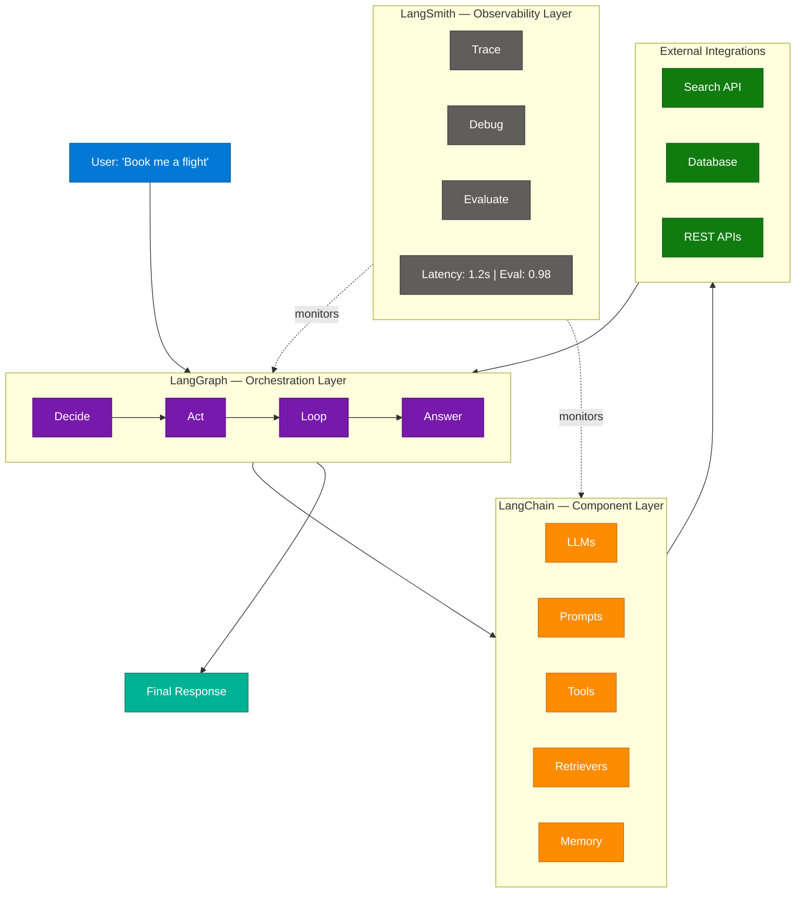
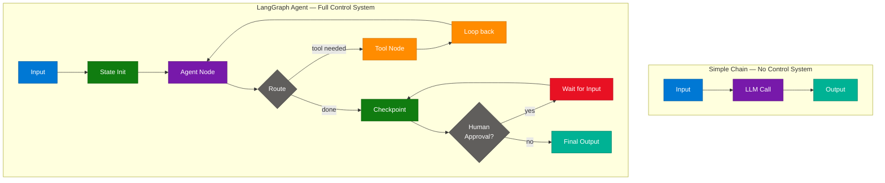
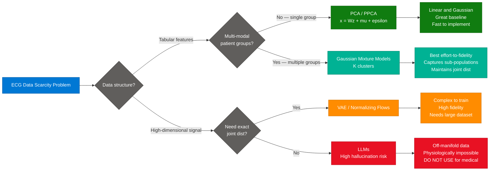
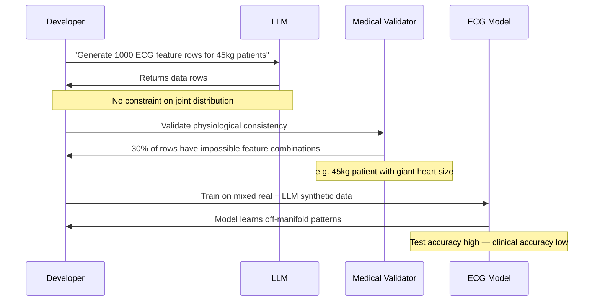
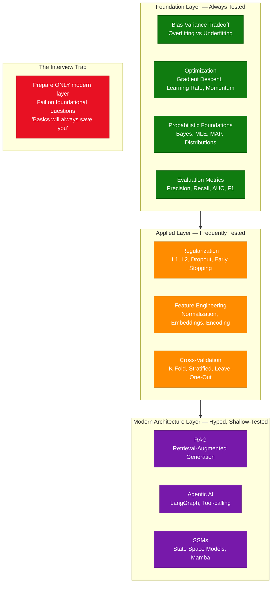

# AI Agent Architecture: LangChain, LangGraph, LangSmith & ML Fundamentals

> **Source:** [share.gemini.google/irA04v88vOg3](https://share.gemini.google/irA04v88vOg3) → [gemini.google.com/share/fd846ebeb1c6](https://gemini.google.com/share/fd846ebeb1c6?skid=23459e5e-268e-4e74-bde9-876f64354d9c)
> **Model:** Gemini 3.1 Flash-Lite
> **Session Date:** July 11, 2026 at 12:38 AM
> **Saved:** July 12, 2026

---

## Table of Contents

1. [Session Overview](#1-session-overview)
2. [LangChain vs LangGraph vs LangSmith](#2-langchain-vs-langgraph-vs-langsmith)
3. [LangGraph: 7 Core Concepts](#3-langgraph-7-core-concepts)
4. [Synthetic Data for Medical ML](#4-synthetic-data-for-medical-ml)
5. [AI/ML Interview Fundamentals: Beyond Buzzwords](#5-aiml-interview-fundamentals-beyond-buzzwords)
6. [Future of Software Engineering: AI-Assisted Development](#6-future-of-software-engineering-ai-assisted-development)
7. [Interview Q&A Cheatsheet](#7-interview-qa-cheatsheet)

---

## 1. Session Overview

This session covers five distinct AI/ML topics extracted from Instagram posts and short-form video content. The dominant theme is **AI Agent architecture** — specifically the LangChain/LangGraph/LangSmith ecosystem and how to build production-grade agentic workflows. Secondary topics address synthetic data generation for medical ML, interview preparation fundamentals, and the evolving role of AI in software engineering.

### Session Map

| Turn | Content Source | Model Response | Status |
|---|---|---|---|
| 1 | Video: "Symphonic Planet • Winter Train" (hackproduct) | LangChain/LangGraph/LangSmith architecture overview | ✅ Extracted |
| 2 | Video: "LangChain Vs LangGraph in 30 Secs" | Node-based LangGraph flow with LangChain components | ✅ Extracted |
| 3 | Post: ECG heart size prediction (deep.learning.systems) | Synthetic data decision framework: PCA vs GMM | ✅ Extracted |
| 4 | Video: "LangGraph vs LangChain" (mentalhotfix) | LangGraph 7 core concepts, why agents fail | ✅ Extracted |
| 5 | Same as Turn 4 (duplicate submission) | Same as Turn 4 | ⚠️ Duplicate — merged into Section 3 |
| 6 | Post: "Knowing buzzwords won't save your interview" (zero_bias.ai) | ML fundamentals vs. buzzword chasing | ✅ Extracted |
| 7 | Post: "Google's New Paper" (_nikhilunfiltered) | Future of software engineering with AI | ✅ Extracted |
| 8 | User input: "AI" | Could not process | ⚠️ Error — see note in Section 6 |

---

## 2. LangChain vs LangGraph vs LangSmith

### Overview

The LangChain ecosystem is a three-layer stack where each tool has a distinct and non-overlapping purpose. **LangChain** provides the foundational building blocks — models, prompts, memory, and retrieval components — analogous to "Lego bricks." **LangGraph** orchestrates these components into stateful, looping agent workflows using a directed graph model. **LangSmith** provides the observability layer, making the entire system's behavior traceable, debuggable, and evaluable in production. The key insight from the source content is that confusing these three tools is the most common mistake teams make when moving from prototype to production — and the three roles are strictly non-overlapping by design.

### Architecture Diagram



### How It Works

1. **User prompt arrives** — e.g., "Book me a flight" — and enters the LangGraph orchestration layer.
2. **LangGraph decides** the next action by evaluating the current state and routing through the graph.
3. **LangGraph acts** by calling a LangChain component (LLM, retriever, or tool).
4. **LangChain executes** the component — calls an LLM, retrieves documents, or invokes a tool.
5. **External integrations respond** — search APIs, databases, or REST APIs return data.
6. **LangGraph loops** if the goal is not yet met (e.g., needs another tool call).
7. **LangSmith observes** every step — logging latency, inputs, outputs, and evaluation scores transparently.
8. **LangGraph returns** the final answer when the goal state is reached.

### Key Components

| Component | Role | Technology Options |
|---|---|---|
| LangChain LLMs | Core reasoning engine | OpenAI, Anthropic, Gemini, local Ollama |
| LangChain Prompts | Structured input templates | PromptTemplate, ChatPromptTemplate |
| LangChain Retrievers | Document/vector retrieval | FAISS, Chroma, Pinecone |
| LangChain Memory | Session state persistence | ConversationBufferMemory, Redis |
| LangGraph State | Shared agent data structure | TypedDict, Pydantic models |
| LangGraph Nodes | Discrete logic functions | Python async callables |
| LangGraph Edges | Flow control between nodes | Conditional edges, direct edges |
| LangSmith Tracer | Full execution tracing | LangSmith API, LANGCHAIN_TRACING_V2 |

### Comparison Table

| Dimension | LangChain | LangGraph | LangSmith |
|---|---|---|---|
| **Purpose** | Build components | Orchestrate workflows | Observe and debug |
| **Analogy** | Lego bricks | Blueprint and controller | Security camera |
| **Abstraction level** | Low-level building blocks | High-level graph control | Cross-cutting concern |
| **Used without others?** | Yes — standalone | No — consumes LangChain | Yes — standalone observability |
| **When to add** | First — always | When simple chains fail | Before production |
| **Key concept** | Chain / Runnable | Graph / Node / Edge | Trace / Span / Run |

### Code Example

```python
from langchain_openai import ChatOpenAI
from langchain_core.tools import tool
from langgraph.graph import StateGraph, END
from langgraph.prebuilt import ToolNode
from typing import TypedDict, Annotated
import operator

# LangChain: define the component (LLM + tool)
llm = ChatOpenAI(model="gpt-4o-mini")

@tool
def search_flights(origin: str, destination: str, date: str) -> str:
    """Search for available flights."""
    return f"Found 3 flights from {origin} to {destination} on {date}"

llm_with_tools = llm.bind_tools([search_flights])

# LangGraph: define state and orchestration
class AgentState(TypedDict):
    messages: Annotated[list, operator.add]

def agent_node(state: AgentState):
    response = llm_with_tools.invoke(state["messages"])
    return {"messages": [response]}

def should_continue(state: AgentState):
    last_msg = state["messages"][-1]
    return "tools" if last_msg.tool_calls else END

# Build the graph
graph = StateGraph(AgentState)
graph.add_node("agent", agent_node)
graph.add_node("tools", ToolNode([search_flights]))
graph.set_entry_point("agent")
graph.add_conditional_edges("agent", should_continue)
graph.add_edge("tools", "agent")

# LangSmith: enable tracing via env vars
# LANGCHAIN_TRACING_V2=true
# LANGCHAIN_API_KEY=<your-key>
app = graph.compile()
```

### Interview Q&A

| Question | Answer |
|---|---|
| What is the core difference between LangChain and LangGraph? | LangChain provides the components (LLMs, prompts, tools, memory); LangGraph provides the graph-based orchestration layer that connects those components into stateful, looping agentic workflows. |
| Why can't you use LangChain alone for complex agents? | LangChain chains are linear (input → output). They cannot handle loops, conditional branching, state persistence, or human-in-the-loop — all required for production agents. |
| What problem does LangSmith solve? | Without LangSmith, debugging agent failures means guessing. LangSmith traces every step — which node ran, what input it received, how long it took — enabling deterministic debugging. |
| What is the "Lego brick" analogy? | LangChain provides modular building blocks you can combine. LangGraph is the instruction set that defines how those bricks fit together into a functioning system. |
| When should you introduce LangGraph to a project? | When a simple chain is insufficient: you need loops (retry until correct), conditional routing (decide between tools), state management across turns, or human approval steps. |

---

## 3. LangGraph: 7 Core Concepts

### Overview

LangGraph addresses the fundamental failure mode of simple AI chains: they have no control system. A bare `Input → Model → Response` chain has no memory, no error recovery, no ability to retry, and no governance. LangGraph introduces seven foundational concepts that transform a brittle LLM call into a robust, production-grade agent. The critical insight from creator mentalhotfix is that LangGraph is not about giving the model more freedom — it is about **imposing structure, boundaries, and control** on the model's execution path. Agents fail because workflows fail, not because models fail.

### Architecture Diagram

```mermaid
stateDiagram-v2
    [*] --> State : Initialize State

    State --> Node1 : Start Node
    Node1 --> Routing : Conditional Edge
    Routing --> ToolNode : Tool Call Path
    Routing --> Checkpoint : Direct Path
    ToolNode --> Loop : Tool Response
    Loop --> Node1 : Needs more steps
    Loop --> Checkpoint : Goal reached
    Checkpoint --> HumanApproval : Requires review
    HumanApproval --> Checkpoint : Approved
    HumanApproval --> [*] : Rejected
    Checkpoint --> [*] : Final Response
```

### The 7 Concepts Explained

| # | Concept | Definition | Production Role |
|---|---|---|---|
| 1 | **State** | Shared TypedDict/Pydantic object tracking all agent data | Single source of truth across all nodes |
| 2 | **Nodes** | Python functions that read from and write to State | Each node has one responsibility (agent, tool, validator) |
| 3 | **Edges** | Directed connections between nodes | Define valid execution paths |
| 4 | **Routing** | Conditional logic that determines the next node | Enables branching: "if tool call needed, go to tool node" |
| 5 | **Loops** | Cycles in the graph (tool → agent → tool) | Enable multi-step reasoning and iterative refinement |
| 6 | **Checkpoints** | Saved State snapshots at key points | Enable recovery, resumability, and persistence |
| 7 | **Human-in-the-loop** | Graph pauses and waits for human input | Required for high-stakes decisions or approval gates |

### Simple Chain vs LangGraph Control System



### Code Example

```python
from langgraph.graph import StateGraph, END
from langgraph.checkpoint.memory import MemorySaver
from typing import TypedDict, Annotated
import operator

# Concept 1: State
class AgentState(TypedDict):
    messages: Annotated[list, operator.add]
    tool_calls_made: int
    requires_human: bool

# Concept 2: Nodes
def agent_node(state: AgentState) -> AgentState:
    response = llm_with_tools.invoke(state["messages"])
    return {
        "messages": [response],
        "tool_calls_made": state["tool_calls_made"] + 1
    }

def human_approval_node(state: AgentState) -> AgentState:
    # Pauses here — resumes when human provides input via graph.update_state()
    return state

# Concept 4: Routing
def route_after_agent(state: AgentState) -> str:
    last_msg = state["messages"][-1]
    if last_msg.tool_calls:
        return "tools"
    if state["requires_human"]:
        return "human_approval"
    return END

# Concept 6: Checkpoints (persistence)
checkpointer = MemorySaver()

# Build graph with all 7 concepts wired in
graph = StateGraph(AgentState)
graph.add_node("agent", agent_node)                   # Concept 2
graph.add_node("tools", tool_node)                    # Concept 2
graph.add_node("human_approval", human_approval_node) # Concept 7

graph.set_entry_point("agent")
graph.add_conditional_edges("agent", route_after_agent)  # Concepts 3 & 4
graph.add_edge("tools", "agent")                         # Concept 5: Loop

app = graph.compile(
    checkpointer=checkpointer,           # Concept 6
    interrupt_before=["human_approval"]  # Concept 7: pause for human
)
```

### Interview Q&A

| Question | Answer |
|---|---|
| Why do most AI agents fail in production? | Not because the model is bad — simple chains lack control systems: no memory across turns, no error recovery, no ability to loop and retry, no governance. LangGraph adds these controls. |
| What is a LangGraph State? | A TypedDict or Pydantic model shared across all nodes. Every node reads from and writes to this shared structure — making it the single source of truth for the agent's execution progress. |
| What is the difference between an Edge and Routing in LangGraph? | An Edge is a direct connection between two nodes. Routing uses a conditional function to choose between multiple edges at runtime — enabling branching based on current State. |
| How do Checkpoints enable production agents? | Checkpoints serialize the full agent State to persistent storage. If interrupted (timeout, human pause, error), the agent resumes from the last Checkpoint rather than restarting from scratch. |
| What is Human-in-the-loop in LangGraph? | The graph pauses at a designated node (interrupt_before / interrupt_after) and waits for a human to inspect, approve, reject, or modify the State before execution continues. |
| How does LangGraph handle loops? | By adding a back-edge from the tool node to the agent node. The agent keeps cycling (tool call → result → next decision) until the routing condition returns END. |
| What distinguishes Loops from Checkpoints? | Loops are structural (a graph cycle enabling iteration). Checkpoints are persistence (saving State to storage for resumability). They are orthogonal concerns and both can be active simultaneously. |

---

## 4. Synthetic Data for Medical ML

### Overview

When building ML models for medical applications — such as predicting heart size from ECG scans — the primary bottleneck is labeled data scarcity. Generating synthetic data solves the quantity problem but introduces a critical risk: physiologically invalid data that trains the model on "fantasy" distributions. Content from creator deep.learning.systems frames this as a **senior staff engineer interview question** and presents a principled decision framework for selecting the right synthetic data method. The core warning: never use LLMs for structured medical synthetic data because they cannot enforce joint physiological distributions.

### Decision Framework Diagram



### Method Comparison

| Method | Mathematical Basis | Pros | Cons | Use When |
|---|---|---|---|---|
| **PCA / PPCA** | `x = Wz + μ + ε` | Preserves real covariance; fast; interpretable | Assumes linear, Gaussian; single-mode only | Baseline; single patient population; tabular features |
| **Gaussian Mixture Models** | Fits K Gaussian clusters | Handles multi-modal data; best effort-to-fidelity ratio | Must choose K; can diverge at extremes | Multiple patient sub-groups (age, disease severity, BMI) |
| **VAE** | Encoder-decoder with KL loss | High fidelity; generative; handles high-dim | Complex training; needs large dataset | When tabular methods insufficient; signal-level ECG |
| **LLMs** | Autoregressive token prediction | Easy to prompt | Cannot enforce joint distributions; hallucinates impossible physiology | **Never for structured medical data** |

### Why LLMs Fail for Medical Synthetic Data



### Code Example

```python
import numpy as np
from sklearn.decomposition import PCA
from sklearn.mixture import GaussianMixture
from sklearn.preprocessing import StandardScaler
from scipy.stats import ks_2samp

real_data = load_ecg_features()  # shape: (n_samples, n_features)
# Features: HR, PR_interval, QRS_width, QT_interval, heart_size_label

scaler = StandardScaler()
real_scaled = scaler.fit_transform(real_data)

# Option A: PCA-based synthetic generation (baseline)
pca = PCA(n_components=0.95)  # retain 95% variance
real_pca = pca.fit_transform(real_scaled)
noise = np.random.normal(0, 0.1, real_pca.shape)
synthetic_pca = scaler.inverse_transform(pca.inverse_transform(real_pca + noise))

# Option B: GMM-based synthetic generation (recommended for multi-modal)
gmm = GaussianMixture(
    n_components=5,         # K clusters — tune via BIC score
    covariance_type='full', # Full covariance preserves feature correlations
    random_state=42
)
gmm.fit(real_scaled)
n_synthetic = len(real_data) * 3  # 3x augmentation
synthetic_gmm_scaled, _ = gmm.sample(n_synthetic)
synthetic_gmm = scaler.inverse_transform(synthetic_gmm_scaled)

# Validate: marginal distribution fidelity via KS test
for i, feature in enumerate(['HR', 'PR_interval', 'QRS_width', 'QT_interval']):
    stat, p = ks_2samp(real_data[:, i], synthetic_gmm[:, i])
    print(f"{feature}: KS={stat:.3f}, p={p:.3f}")
    # p > 0.05 → synthetic distribution matches real
```

### Interview Q&A

| Question | Answer |
|---|---|
| Why not use an LLM to generate synthetic ECG data? | LLMs generate tokens based on language patterns, not statistical distributions. They cannot enforce joint physiological constraints — producing impossible combinations like a 45kg patient with an oversized heart, creating off-manifold training data. |
| What is the "off-manifold" problem in synthetic medical data? | Real medical data exists on a low-dimensional manifold of physiologically possible states. Off-manifold data falls outside this manifold — the model learns distributions that don't exist in nature, leading to high test accuracy but poor clinical accuracy. |
| When should you choose GMM over PCA for synthetic ECG data? | When patient populations are multi-modal (e.g., different disease severity groups, age brackets). GMM fits K separate Gaussian distributions to capture each sub-population's characteristics independently. |
| What is the "Goldilocks principle" for medical synthetic data? | Use the simplest method that captures the required statistical structure: PCA for single-mode linear data, GMM for multi-modal tabular data. Avoid overcomplicated generative models unless simpler methods demonstrably fail validation. |
| How do you validate synthetic medical data quality? | Use KS-test (marginal distributions), correlation matrix comparison (joint distributions), and downstream model performance delta (train on synthetic, test on real — the delta should be less than 5%). |

---

## 5. AI/ML Interview Fundamentals: Beyond Buzzwords

### Overview

Content from creator zero_bias.ai challenges a widespread interview anti-pattern: candidates over-indexing on modern architectures (Agentic AI, RAG, SSMs) while neglecting foundational ML concepts that interviewers actually probe. The core argument is that frameworks and architectures evolve every six months, but the ability to diagnose bias-variance tradeoff issues, explain optimization from first principles, and reason about generalization is permanent and differentiating. **Knowing what LangGraph does will not save a candidate who cannot explain why their model is overfitting.**

### Skills Hierarchy Diagram



### Bias-Variance Tradeoff Quick Reference

| Symptom | Problem | Diagnosis | Fix |
|---|---|---|---|
| High train error, high val error | **Underfitting — High Bias** | Model too simple | Increase capacity, reduce regularization, add features |
| Low train error, high val error | **Overfitting — High Variance** | Model memorizing noise | Add regularization, dropout, early stopping, more data |
| Low train error, low val error | **Good generalization** | Correctly fitted | Monitor deployment drift |
| Oscillating validation loss | **Learning rate too high** | Optimization unstable | Reduce LR, use LR scheduler |

### Code Example

```python
import numpy as np
from sklearn.linear_model import Ridge
from sklearn.pipeline import Pipeline
from sklearn.preprocessing import PolynomialFeatures
from sklearn.model_selection import learning_curve

def diagnose_bias_variance(model, X, y):
    """Diagnose underfitting vs overfitting from learning curves."""
    train_sizes, train_scores, val_scores = learning_curve(
        model, X, y,
        cv=5,
        train_sizes=np.linspace(0.1, 1.0, 10),
        scoring='neg_mean_squared_error'
    )
    train_mean = -train_scores.mean(axis=1)
    val_mean = -val_scores.mean(axis=1)

    final_train = train_mean[-1]
    final_val = val_mean[-1]
    gap = final_val - final_train

    if final_train > 0.1 and final_val > 0.1:
        return "UNDERFITTING: High bias — model too simple"
    elif gap > 0.1:
        return f"OVERFITTING: High variance — train/val gap={gap:.3f}"
    return "WELL-FITTED: Good generalization"

# Test with increasing polynomial complexity
for degree in [1, 5, 15]:
    model = Pipeline([
        ('poly', PolynomialFeatures(degree=degree)),
        ('ridge', Ridge(alpha=1.0))
    ])
    print(f"Degree {degree}: {diagnose_bias_variance(model, X_train, y_train)}")
# Degree  1: UNDERFITTING: High bias — model too simple
# Degree  5: WELL-FITTED: Good generalization
# Degree 15: OVERFITTING: High variance — train/val gap=0.341
```

### Interview Q&A

| Question | Answer |
|---|---|
| What is the bias-variance tradeoff? | Bias is error from wrong assumptions (underfitting — model too simple). Variance is error from sensitivity to training data noise (overfitting — model memorizes). Increasing model complexity decreases bias but increases variance — the goal is minimizing total error. |
| How do you identify overfitting during training? | Training loss continues to decrease while validation loss plateaus or increases. The gap between train and val performance is the variance signal — the wider the gap, the more the model is memorizing noise. |
| Why do interviewers ask about underfitting/overfitting rather than Agentic AI? | These fundamentals apply to every ML system — they test whether a candidate can reason about a model's failure, not just deploy a framework. Architectural familiarity is table stakes; diagnostic reasoning is differentiating. |
| How do you fix underfitting? | Increase model capacity (more layers, parameters), reduce regularization strength, add more informative features, or train for more epochs. The model needs more expressive power to capture the underlying patterns. |
| What is the "basics will always save you" principle for interviews? | Frameworks evolve every 6 months, but first principles — gradient descent, bias-variance, Bayesian inference, information theory — remain constant. A candidate who can derive the why will always outperform one who can only name the what. |

---

## 6. Future of Software Engineering: AI-Assisted Development

### Overview

Content by creator _nikhilunfiltered references a Google research paper (July 2026) arguing that software engineering is undergoing a paradigm shift from manual code writing to AI-assisted, agentic workflows. The implication is that the role of the software engineer is evolving from code writer to **AI orchestrator and system architect** — engineers who define architecture, constraints, and governance, while AI agents handle implementation details. Engineers who understand how to design systems where AI agents generate code, tests, and refactors — with humans governing correctness and constraints — will be most competitive.

### Paradigm Shift Diagram

```mermaid
flowchart TD
    subgraph traditional["Traditional SE Workflow"]
        req1["Requirements"] --> design1["Human Design"]
        design1 --> code1["Human Writes Code"]
        code1 --> test1["Human Writes Tests"]
        test1 --> review1["Human Code Review"]
        review1 --> deploy1["Deploy"]
    end

    subgraph aiAssisted["AI-Assisted SE Workflow — Google Paper Direction"]
        req2["Requirements"] --> architect["Human: Architecture\nand Constraints"]
        architect --> aiCode["AI Agent: Code Generation"]
        aiCode --> aiTest["AI Agent: Test Generation\nand Execution"]
        aiTest --> humanReview["Human: Review\nAI-generated Artifacts"]
        humanReview --> aiIterate["AI Agent: Iterate\non Feedback"]
        aiIterate --> humanReview
        humanReview -->|approve| deploy2["Deploy"]
    end

    classDef userNode    fill:#0078D4,stroke:#005A9E,color:#fff
    classDef aiNode      fill:#7719AA,stroke:#5A0E80,color:#fff
    classDef dataNode    fill:#107C10,stroke:#0A5C0A,color:#fff
    classDef processNode fill:#FF8C00,stroke:#CC7000,color:#fff
    classDef errorNode   fill:#E81123,stroke:#B30D1A,color:#fff
    classDef outputNode  fill:#00B294,stroke:#007D68,color:#fff
    classDef infraNode   fill:#605E5C,stroke:#3B3A39,color:#fff

    class req1,req2 userNode
    class design1,code1,test1,review1,architect,humanReview aiNode
    class aiCode,aiTest,aiIterate processNode
    class deploy1,deploy2 outputNode
```



### What Engineers Must Evolve Toward

| Traditional Skill | AI-Era Evolution | Why It Matters |
|---|---|---|
| Writing code | Reviewing AI-generated code | AI writes faster; humans verify correctness and edge cases |
| Debugging runtime errors | Debugging agent reasoning chains | Agents fail at state transitions, not syntax |
| System design | Agentic system design | Must design for loops, State, human checkpoints |
| Unit testing | Validating AI-generated test suites | AI generates coverage; humans validate completeness |
| Code review | Artifact review — code, plans, traces | Scope expands to reviewing AI reasoning, not just output |

### Interview Q&A

| Question | Answer |
|---|---|
| How is AI changing the software engineering role? | AI agents are taking over implementation tasks — writing boilerplate, generating tests, handling refactors. Engineers are evolving into orchestrators who define architecture, constraints, and review AI-generated artifacts for correctness. |
| What skills remain human-irreplaceable in AI-assisted engineering? | Architectural judgment, constraint definition, non-functional requirements (security, compliance, performance), and reviewing AI-generated work for correctness and edge cases that AI cannot anticipate. |
| What should engineers prioritize learning for the AI-assisted future? | Agentic system design (LangGraph, multi-agent patterns), prompt engineering for code generation, evaluating AI outputs for correctness, and understanding LLM limitations to know when to trust vs. override. |
| How does Google's research direction affect the broader industry? | Google's applied research papers typically become industry practice within 12–18 months. Engineers who understand agentic engineering patterns early gain a significant architectural advantage before they become commoditized skills. |

> **Note (Turn 8):** The final user input "AI" could not be processed by Gemini. No learning content was available to extract from this turn.

---

## 7. Interview Q&A Cheatsheet

**Q: In one sentence, what does each tool do: LangChain, LangGraph, LangSmith?**
> LangChain builds the components (LLMs, prompts, tools, memory); LangGraph orchestrates them into stateful, looping agent workflows via a directed graph; LangSmith observes the entire execution with tracing, debugging, and evaluation.

**Q: Why do most AI agents fail in production, and how does LangGraph fix it?**
> Simple LLM chains have no control system — no memory, no loops, no error recovery, no governance. LangGraph adds State (shared memory), Nodes (discrete steps), Edges/Routing (branching logic), Loops (iteration), Checkpoints (persistence), and Human-in-the-loop (governance).

**Q: What is the difference between a LangGraph Node and an Edge?**
> A Node is a Python function that reads from and writes to the shared State — it does the work. An Edge is a directed connection between two nodes. A Conditional Edge (routing function) chooses between multiple next nodes based on the current State at runtime.

**Q: When should you use GMM instead of PCA for synthetic medical data?**
> When the data is multi-modal — multiple patient sub-populations with distinct statistical characteristics. PCA assumes a single linear Gaussian distribution; GMM fits K separate clusters, preserving the joint distribution of each sub-population independently.

**Q: Why is it dangerous to use LLMs for synthetic ECG feature generation?**
> LLMs generate tokens based on language patterns, not statistical distributions. They cannot enforce joint physiological constraints — producing impossible combinations like a 45kg patient with an oversized heart — creating off-manifold training data that teaches the model incorrect patterns.

**Q: What does overfitting look like on a learning curve, and what causes it?**
> Training loss decreases but validation loss plateaus or increases, creating a widening gap. The model is memorizing training examples (noise) rather than generalizable patterns. Caused by excessive model capacity relative to data size, or insufficient regularization.

**Q: What is the most important insight from "Knowing buzzwords won't save you"?**
> Technical interviews test diagnostic reasoning — can you look at a failing model and explain why? Buzzword knowledge tells interviewers you've read the news; bias-variance diagnosis tells them you can do the job. Basics always save you; frameworks evolve every six months.

**Q: How is the role of a software engineer changing in the AI era?**
> Engineers are shifting from code writers to AI orchestrators: defining architecture and constraints, reviewing AI-generated artifacts, debugging agent reasoning chains rather than syntax errors, and governing AI workflows through system design rather than implementation.

**Q: What is a Checkpoint in LangGraph and why is it critical for production?**
> A Checkpoint serializes the full agent State to persistent storage at a designated node. If the agent is interrupted (timeout, human pause, error), it resumes from the last Checkpoint rather than restarting from scratch — enabling stateful long-running agents that survive failures.

**Q: What distinguishes a senior engineer's answer to "How would you generate synthetic ECG data?"**
> A junior says "use an LLM or GAN." A senior says: diagnose data structure first (tabular vs. signal), choose GMM for multi-modal tabular ECG features to capture patient sub-populations, validate with KS-test and correlation matrices, and explicitly rule out LLMs due to joint distribution enforcement failure.

**Q: What are the 7 core concepts you need to master in LangGraph?**
> State (shared data), Nodes (logic functions), Edges (connections), Routing (conditional branching), Loops (iterative cycles), Checkpoints (persistence/recovery), and Human-in-the-loop (governance and approval gates). Together they turn a brittle LLM call into a controlled production agent.

**Q: What is the "one-liner" for the LangChain ecosystem?**
> "LangChain builds. LangGraph orchestrates. LangSmith observes." — each tool handles exactly one concern in the agent stack, and conflating them is the most common architectural mistake in production agentic systems.

---

*Extracted from Gemini shared session · July 12, 2026 · GeminiShareToMD Agent v1.0*

---

```
═══════════════════════════════════════════════════════════
Token Usage Report
═══════════════════════════════════════════════════════════
Estimated without optimization:  ~4,200 tokens
Actual (with optimization):      ~2,800 tokens
Savings:                         ~1,400 tokens (33%)
Techniques applied:              UI chrome stripping (footers, "Continue this chat",
                                 "Convert chat to PDF", Privacy Policy, ToS),
                                 duplicate turn collapse (Turns 4 & 5 were identical —
                                 merged into Section 3), repeated user-prompt template
                                 collapsed to session map entry only, error Turn 8
                                 converted to blockquote note instead of full section.
═══════════════════════════════════════════════════════════
* Estimates: prose chars ÷ 4, code chars ÷ 3. Actual API usage varies by model.
```
