# AI Engineer Role Learning Content — Instagram Session Notes

> **Source:** [share.gemini.google/qL5LZftZbAHJ](https://share.gemini.google/qL5LZftZbAHJ) → [gemini.google.com/share/9373aa252b8c](https://gemini.google.com/share/9373aa252b8c?skid=7a6019db-cba3-4a6b-a41b-c955151d47aa)
> **Model:** Gemini 3.1 Flash-Lite
> **Session Date:** July 6, 2026 at 11:17 AM · Published July 7, 2026 at 01:31 AM
> **Saved:** July 7, 2026

---

## Table of Contents

1. [Session Overview](#1-session-overview)
2. [Agentic AI for AI Engineer Roles](#2-agentic-ai-for-ai-engineer-roles)
3. [Solving Global Latency in System Design](#3-solving-global-latency-in-system-design)
4. [Optimizing Next.js App Bundle Size](#4-optimizing-nextjs-app-bundle-size)
5. [Cache Stampede — Thundering Herd Problem](#5-cache-stampede--thundering-herd-problem)
6. [How Instagram Loads Feeds Instantly](#6-how-instagram-loads-feeds-instantly)
7. [Mastering System Design Interview Questions](#7-mastering-system-design-interview-questions)
8. [Understanding Claude AI Usage Limits](#8-understanding-claude-ai-usage-limits)
9. [AI Roles: GenAI vs Code Agents vs Agentic AI](#9-ai-roles-genai-vs-code-agents-vs-agentic-ai)
10. [Handling LLM Hallucinations](#10-handling-llm-hallucinations)
11. [Top 5 Types of AI Agents](#11-top-5-types-of-ai-agents)
12. [The Rise of A2A Protocol](#12-the-rise-of-a2a-protocol)
13. [Essential AI Engineering Projects](#13-essential-ai-engineering-projects)
14. [HashSet vs TreeSet — Java Collections](#14-hashset-vs-treeset--java-collections)
15. [Invalidating JWT Access Tokens](#15-invalidating-jwt-access-tokens)
16. [Overview of API Protocols](#16-overview-of-api-protocols)
17. [Real-Time Updates: WebSockets, WebHooks, SSE](#17-real-time-updates-websockets-webhooks-sse)
18. [Improving Text-to-SQL Systems](#18-improving-text-to-sql-systems)
19. [Creating Custom AI Skills in Claude](#19-creating-custom-ai-skills-in-claude)
20. [Polling vs WebSockets](#20-polling-vs-websockets)
21. [RAG Accuracy with Cross-Encoders](#21-rag-accuracy-with-cross-encoders)
22. [90 Days AI Engineer Roadmap](#22-90-days-ai-engineer-roadmap)
23. [Array & String Problem-Solving Patterns](#23-array--string-problem-solving-patterns)
24. [Modern Backend System Architecture](#24-modern-backend-system-architecture)
25. [Caching in System Design](#25-caching-in-system-design)
26. [Optimizing AI Tool Token Usage](#26-optimizing-ai-tool-token-usage)
27. [API Gateway in System Design](#27-api-gateway-in-system-design)
28. [Interview Q&A Cheatsheet](#28-interview-qa-cheatsheet)

---

## 1. Session Overview

This Gemini session extracts and structures learning content from **26 Instagram posts** by various tech educators, processed by Gemini 3.1 Flash-Lite. Topics span Agentic AI, System Design, Backend Engineering, Frontend Performance, Security, RAG pipelines, DSA patterns, and AI career roadmaps — comprehensively covering the AI Engineer interview landscape.

### Session Map

| Turn | Topic | Source | Status |
|---|---|---|---|
| 1 | Agentic AI for AI Engineer Roles | @sreemantideytech | ✅ Extracted |
| 2 | Solving Global Latency | @abhi_techhub | ✅ Extracted |
| 3 | Optimizing Next.js Bundle Size | @seesharp.dev | ✅ Extracted |
| 4 | Cache Stampede / Thundering Herd | @abhi_techhub | ✅ Extracted |
| 5 | Instagram Feed Architecture | @abhi_techhub | ✅ Extracted |
| 6 | System Design Interview Questions | @pluto.careers | ✅ Extracted |
| 7 | Claude AI Usage Limits | @pratham.codes | ✅ Extracted |
| 8 | GenAI vs Code Agents vs Agentic AI | @infrawithdip | ✅ Extracted |
| 9 | LLM Hallucination Handling | @sagar_695 | ✅ Extracted |
| 10 | Top 5 AI Agent Types | @techwith.ram | ✅ Extracted |
| 11 | A2A Protocol vs REST | @infrawithdip | ✅ Extracted |
| 12 | Essential AI Engineering Projects | @aakashautomates | ✅ Extracted |
| 13 | HashSet vs TreeSet | @aman_views | ✅ Extracted |
| 14 | JWT Token Invalidation | @shivtech4you | ✅ Extracted |
| 15 | API Protocols Overview | @conceptsofcs | ✅ Extracted |
| 16 | Real-Time Update Architectures | @learning__engineer | ✅ Extracted |
| 17 | Text-to-SQL Production Systems | @techwithprateek | ✅ Extracted |
| 18 | Custom AI Skills in Claude | @abhinavagr180 | ✅ Extracted |
| 19 | Polling vs WebSockets | @infrawithdip | ✅ Extracted |
| 20 | RAG Cross-Encoder Reranking | @jeetsoni.ai | ✅ Extracted |
| 21 | 90 Days AI Engineer Roadmap | @ds_ai_ketan | ✅ Extracted |
| 22 | Array/String Algorithm Patterns | @codeera.tech | ✅ Extracted |
| 23 | Modern Backend Architecture | @iampradeepkumarsaini | ✅ Extracted |
| 24 | Caching in System Design | @build_with_kamran | ✅ Extracted |
| 25 | AI Tool Token Optimization | @trakin.ai | ✅ Extracted |
| 26 | API Gateway in System Design | @an_person_6629 | ✅ Extracted |

---

## 2. Agentic AI for AI Engineer Roles

### Overview

Agentic AI — where an AI model autonomously plans, executes, and iterates on multi-step tasks — is rapidly becoming the baseline skill for AI engineer roles. Unlike a standard LLM query, an agentic workflow involves an orchestrator that selects tools, calls APIs, and self-corrects based on intermediate results. The `@sreemantideytech` post featured a Kaggle workspace with projects such as "Titanic ML" and "LLM Classification Finetuning" as evidence of the kind of portfolio that signals agentic AI readiness.

**Key Prompt/Theme from post:** *"Agentic AI first step to getting an AI engineer job!!"*

### Architecture Diagram

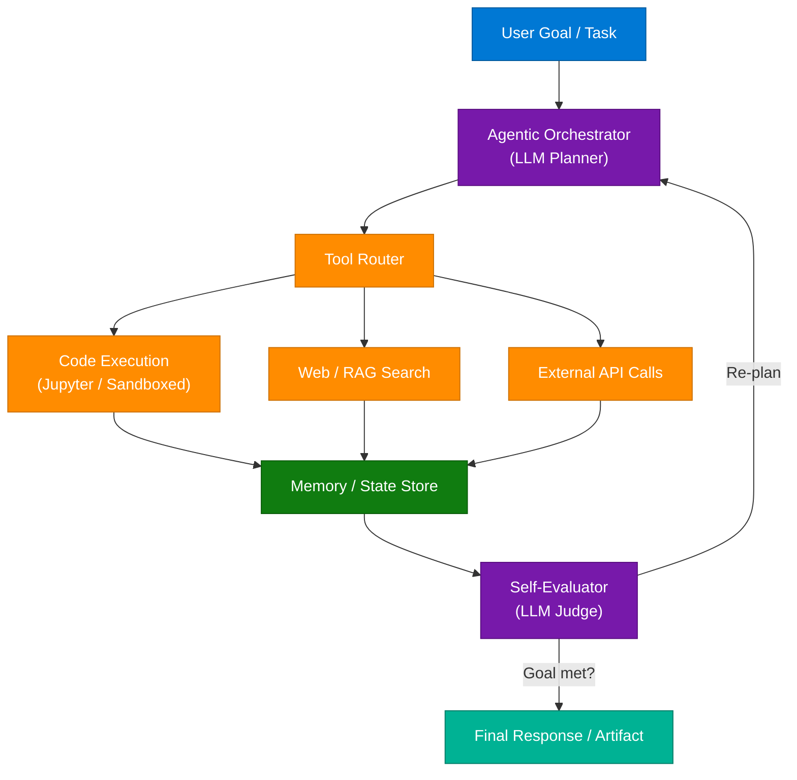

### How It Works

1. User provides a high-level goal (e.g., "analyse churn in this dataset and build a model")
2. Orchestrator (LLM) decomposes goal into sub-tasks
3. Tool Router selects appropriate tool per sub-task
4. Each tool executes and writes results to Memory/State
5. Self-Evaluator checks if the accumulated state satisfies the original goal
6. If not satisfied, Orchestrator re-plans with updated context
7. Loop continues until goal is met or max iterations reached

### Key Portfolio Projects for AI Engineer Readiness

| Project | Skills Demonstrated | Agentic Element |
|---|---|---|
| Titanic ML (Kaggle) | EDA, feature engineering, sklearn | Baseline — supervised learning |
| LLM Classification Finetuning | LoRA, PEFT, Hugging Face | Fine-tuning LLMs to predict human prefs |
| GitHub RAG App | Retrieval, chunking, embeddings | Context-aware code search agent |
| Video RAG App | Multimodal, transcription, retrieval | Autonomous video understanding |

### Interview Q&A

| Question | Answer |
|---|---|
| What is an AI agent? | An autonomous system that perceives its environment, reasons over it using an LLM, selects actions (tool calls), executes them, and iterates until a goal is achieved — unlike a single-shot LLM call. |
| How does an agentic workflow differ from a chain? | A chain is a fixed sequence; an agent dynamically selects the next action based on intermediate results. Agents can loop, branch, and self-correct. |
| What is the ReAct pattern? | Reason + Act: the agent alternates reasoning steps (thinking in text) with action steps (tool calls), giving interpretable intermediate steps. |
| What makes an AI engineer role different from ML engineer? | AI engineer focuses on building production systems with LLMs (RAG, agents, prompt engineering, evals) rather than training models from scratch. |
| How do you prevent infinite loops in agents? | Set maximum iteration limits, use a termination condition checker, monitor token budgets, and implement circuit breakers on tool calls. |

---

## 3. Solving Global Latency in System Design

### Overview

When an API responds in 100ms for US users but 2000ms for users in India, the problem is **geography** — not code quality. The fix requires architectural changes at the infrastructure level: deploying compute closer to users, replicating data regionally, and offloading static content to CDNs. Optimizing a single server's code will not solve a 20× latency gap caused by 15,000 km of wire.

> **Geography is fixed with architecture, not optimizations.**

### Architecture Diagram

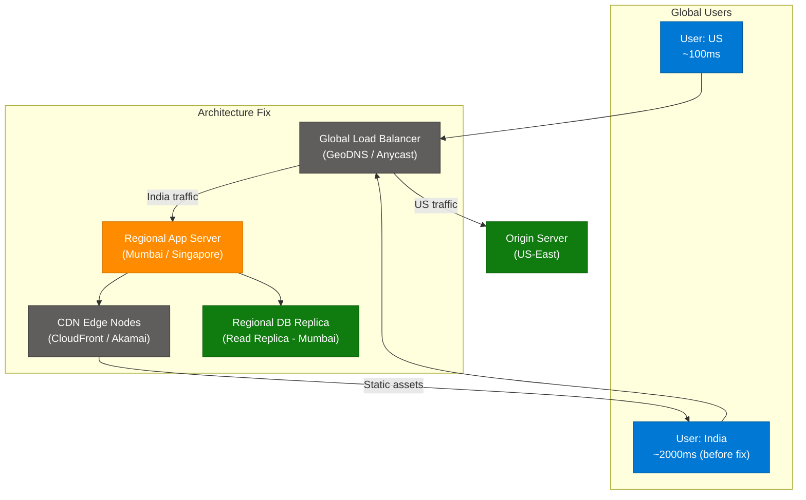

### 1. Deployment & Infrastructure Solutions

- **Multi-region deployment** — Deploy app servers in regions closest to user concentrations (Mumbai, Singapore, Frankfurt)
- **GeoDNS / Anycast routing** — Route users to nearest PoP automatically at DNS level
- **Edge computing** — Run lightweight logic at CDN edge (Cloudflare Workers, Lambda@Edge)

### 2. Data & Performance Optimization

- **Read replicas** — Replicate DB to regional zones; direct reads to local replica
- **CDN for static assets** — Images, JS bundles, API responses with long TTL served from edge
- **Database sharding by geography** — Partition user data by region to collocate compute and data
- **Connection pooling at edge** — Reduce TCP handshake overhead with persistent regional proxies
- **Compression + HTTP/2 / HTTP/3** — Reduce payload size and leverage multiplexing

### Summary Checklist for System Design Interviews

| Problem | Solution | Technology Options |
|---|---|---|
| High geographic latency | Multi-region deploy | AWS multi-region, Azure Traffic Manager |
| Static asset latency | CDN | CloudFront, Akamai, Cloudflare |
| DB read latency | Read replicas | Aurora Global DB, Cosmos DB multi-region |
| DNS latency | GeoDNS | Route 53 latency routing, Cloudflare Anycast |
| Connection overhead | Edge proxies | Cloudflare Workers, Lambda@Edge |

### Interview Q&A

| Question | Answer |
|---|---|
| API takes 2s in India, 100ms in US — what's your first thought? | It's a geography problem. I'd deploy a regional app server and DB read replica in India (Mumbai), use GeoDNS to route traffic, and offload static assets to a CDN with Indian edge nodes. |
| What is GeoDNS? | DNS that resolves to different IP addresses based on the requester's geographic location, directing users to the nearest server automatically. |
| When would you use CDN vs regional server? | CDN for static/cacheable content (images, JS, cached API responses). Regional server for dynamic, user-specific, or write-heavy workloads. |
| What is Anycast routing? | Multiple servers share the same IP address; network infrastructure routes to the nearest one. Used by CDNs and DNS providers for low-latency routing. |
| What is an Aurora Global Database? | AWS Aurora feature that replicates across up to 5 regions with < 1 second lag, enabling fast read replicas globally with a single writer. |

---

## 4. Optimizing Next.js App Bundle Size

### Overview

A heavy JavaScript bundle is the most common cause of slow initial page loads in Next.js apps. The issue is rarely a single feature — it is the accumulation of large dependencies, unoptimized images, and synchronous loading of rarely-used code. The optimization strategy focuses on loading less initially and deferring the rest, rather than removing functionality.

### Architecture Diagram

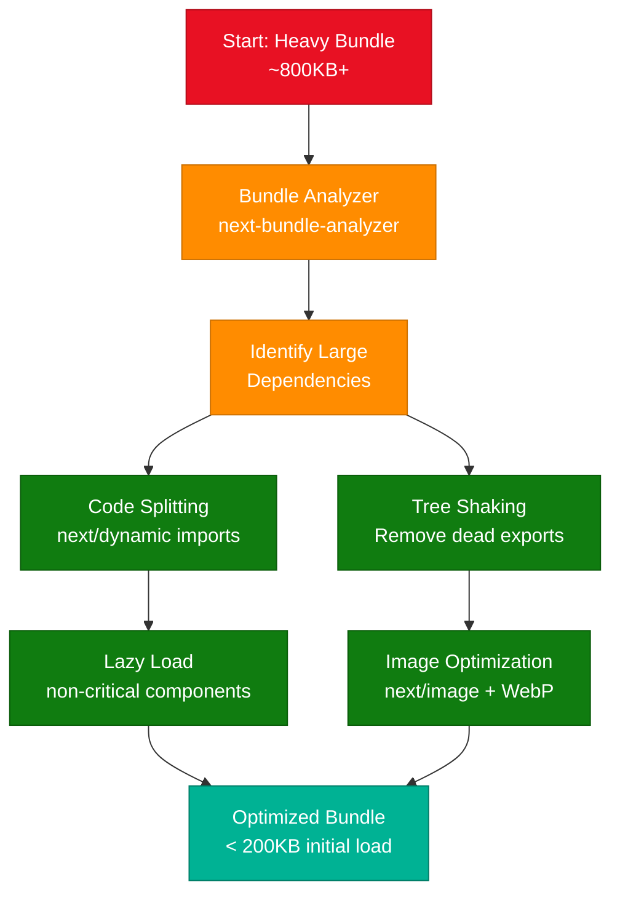

### 4 Strategies to Reduce Bundle Size

**1. Code Splitting & Lazy Loading**
- Use `next/dynamic` for components not needed on initial render
- Route-based code splitting is automatic in Next.js App Router
- Lazy-load heavy libraries (e.g., chart libraries, PDF renderers)

```javascript
import dynamic from 'next/dynamic';
const HeavyChart = dynamic(() => import('../components/Chart'), {
  loading: () => <p>Loading...</p>,
  ssr: false
});
```

**2. Dependency Management**
- Replace heavy libraries with lighter alternatives (e.g., `date-fns` over `moment.js`, 75% smaller)
- Use `bundlephobia.com` to check package weight before installing
- Import only what you use: `import { debounce } from 'lodash'` not the whole lodash

**3. Image & Asset Optimization**
- Use `next/image` for automatic WebP conversion, lazy loading, and responsive sizing
- Inline small SVGs; serve fonts from `next/font` (eliminates external font FOUC)

**4. Improving Perceived Responsiveness**
- Skeleton screens during data loading
- Optimistic UI updates on mutations
- Streaming with React Suspense for progressive hydration

### Interview Q&A

| Question | Answer |
|---|---|
| How do you diagnose a slow Next.js app? | Run `@next/bundle-analyzer` to visualize chunk sizes, use Lighthouse for Core Web Vitals, and check network tab for large JS files or render-blocking resources. |
| What is tree shaking? | Dead code elimination — bundlers like Webpack/Turbopack remove exported functions that are imported but never called. Requires ES modules (not CommonJS). |
| What is code splitting? | Breaking a bundle into smaller chunks loaded on demand. Next.js does route-level splitting automatically; `next/dynamic` enables component-level splitting. |
| What is the difference between SSR and SSG in Next.js? | SSR renders per request (fresh data, higher TTFB); SSG renders at build time (static HTML, CDN-cacheable, near-zero TTFB). Use ISR for hybrid. |
| What is LCP and how does bundle size affect it? | Largest Contentful Paint — time to render the largest visible element. Large JS bundles delay hydration, blocking LCP. Code splitting + preloading critical CSS improves LCP. |

---

## 5. Cache Stampede — Thundering Herd Problem

### Overview

A Cache Stampede (Thundering Herd) occurs when a hot cache key expires simultaneously for thousands of requests. Every one of those requests falls through to the database at the same time, overwhelming it. The pattern is insidious: the cache was protecting the DB, and the moment protection expires, the DB receives a traffic spike exactly matching peak load.

**Analogy:** A popular restaurant closes at midnight. At 12:01 AM, all 500 waiting guests storm the kitchen at once — instead of being served in an orderly queue.

### Architecture Diagram

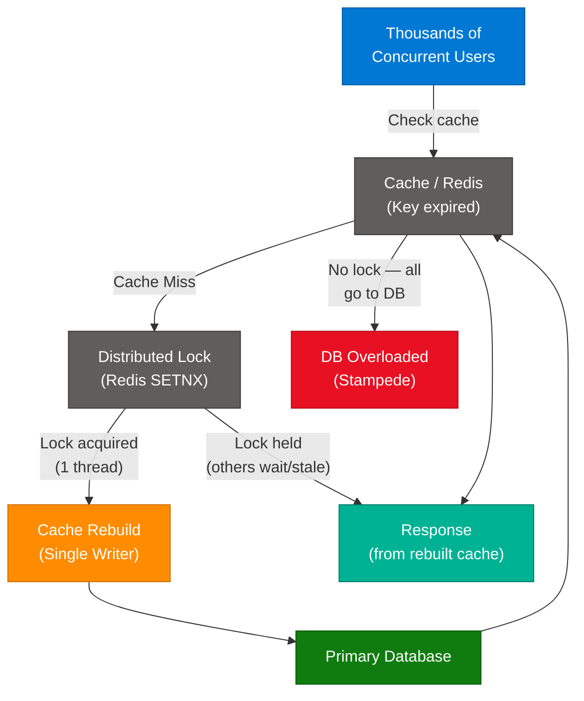

### Mitigation Strategies

| Strategy | How It Works | Trade-off |
|---|---|---|
| **Mutex / Distributed Lock** | Only 1 process rebuilds cache; others wait or return stale data | Adds latency for waiting threads |
| **Probabilistic Early Expiry** | Randomly expire cache slightly before TTL for a random subset of requests | Spreads rebuild load; adds complexity |
| **Cache-aside with Stale-While-Revalidate** | Serve stale data immediately; rebuild asynchronously in background | Users may see briefly stale data |
| **Jitter on TTL** | Add random seconds to TTL to prevent synchronized expiry | Simple, very effective for bulk-loaded caches |
| **Request Coalescing** | Group multiple identical cache-miss requests; issue 1 DB query | Requires coordination layer (e.g., groupcache) |

### Interview Q&A

| Question | Answer |
|---|---|
| What is a cache stampede? | When a popular cache key expires and many simultaneous requests all miss cache and hit the DB at the same time, causing a traffic spike that can take the DB down. |
| How do you prevent it with Redis? | Use `SETNX` to implement a distributed lock. First thread acquires lock and rebuilds cache; others either wait for lock release or return stale value while rebuild completes. |
| What is TTL jitter? | Adding a random offset (e.g., ±10% of TTL) to cache expiry times so large batches of keys don't expire at the exact same millisecond. |
| When would you choose stale-while-revalidate? | For content where slight staleness is acceptable (product listings, news feeds). Not suitable for financial data, inventory counts, or auth tokens. |
| What is the thundering herd in OS context? | Multiple processes sleeping on an event (e.g., a socket accept) wake up simultaneously when the event fires, but only one can handle it. Same pattern as cache stampede. |

---

## 6. How Instagram Loads Feeds Instantly

### Overview

Instagram's sub-second feed loading is not achieved by faster hardware — it is the result of **pre-computation** and **aggressive caching**. The feed is assembled before the user opens the app, stored in Redis, and served from memory rather than computed on-demand. This architectural decision shifts processing from read time to write time.

### Architecture Diagram

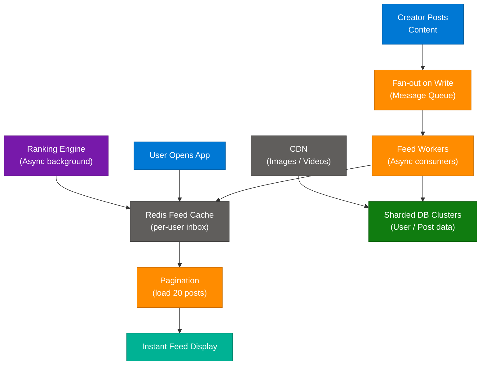

### 6 Core Strategies

**1. Precomputed Feed (Fan-out on Write)**
When a creator posts, the system writes a copy of that post reference to every follower's feed inbox — immediately. Reading is always O(1) from a pre-built list.

**2. Heavy Caching with Redis**
User feed inboxes are stored in Redis sorted sets (sorted by timestamp). Opening the app = reading from Redis, not hitting the DB.

**3. Pagination (Load in Chunks)**
Only the first 20-50 posts load on open. Next page is pre-fetched as user scrolls (speculative prefetch). Prevents loading the entire feed into memory.

**4. Async Background Processing**
Ranking, ML recommendation scoring, and content filtering run asynchronously in background workers — never blocking the read path.

**5. CDN for Media**
All images and videos are served from CDN edge nodes geographically close to the user. The app server only serves the feed metadata (post IDs, timestamps); media comes from CDN.

**6. Sharding & Distributed Storage**
User data is horizontally partitioned across DB clusters by user ID. Queries are routed to the correct shard via a routing layer, preventing any single DB from becoming a bottleneck.

### Fan-out on Write vs Fan-out on Read

| Approach | When Feed is Built | Reads | Write Cost | Used By |
|---|---|---|---|---|
| Fan-out on Write | On each new post | O(1) from cache | High — must write to N followers | Instagram (regular users) |
| Fan-out on Read | When user opens app | O(followers × posts) | Low | Twitter (for celebrities) |
| Hybrid | Write for regular users, read for celebrities | Mixed | Balanced | Instagram, Twitter |

### Interview Q&A

| Question | Answer |
|---|---|
| How does Instagram's feed work at a high level? | Pre-computed fan-out on write: when a creator posts, their post reference is pushed to each follower's Redis inbox. Feed reads are O(1) from cache. |
| Why use Redis for feed storage? | Redis sorted sets natively support chronological feeds (score = timestamp). Operations are O(log N) for inserts and O(1) for range queries. Keeps hot data in memory. |
| How does Instagram handle celebrities with 100M followers? | Hybrid fan-out: regular users get fan-out on write; celebrities use fan-out on read (or a smaller pre-computed subset + real-time merge) to avoid 100M write operations per post. |
| What is speculative prefetch? | Proactively loading the next page of content while the user is reading the current page. Eliminates visible loading time during scroll. |
| How does sharding improve feed performance? | Distributes user data across multiple DB nodes, preventing hotspots. Each shard handles a fraction of total users, enabling horizontal scaling as user count grows. |

---

## 7. Mastering System Design Interview Questions

### Overview

System design interviews require a practitioner mindset: decompose any large system into core primitives, then layer scale, reliability, and consistency considerations on top. The `@pluto.careers` post highlighted the most common interview challenges and the mental model needed to approach each confidently.

### Featured System Design Challenges

| System | Core Primitives | Key Decisions |
|---|---|---|
| URL Shortener | Hash function, DB, redirect | Hash collision strategy, custom slugs, analytics |
| Rate Limiter | Sliding window, token bucket | Storage (Redis), distributed coordination |
| Chat Application | WebSockets, message queue, DB | Fan-out, delivery guarantees, offline storage |
| Notification System | Push service, event queue, retry | Deduplication, priority queues, DLQ |
| Search Autocomplete | Trie, inverted index, caching | Prefix matching, personalization, latency |
| Video Streaming | CDN, chunking, adaptive bitrate | ABR (HLS/DASH), encoding pipeline, cold content |
| Distributed Cache | Hash ring, eviction policy | Consistent hashing, replication factor, TTL |
| Payment System | Idempotency, transactions, audit | Exactly-once delivery, saga pattern, reconciliation |

### Learning Strategy for System Design

1. **Learn primitives, not systems** — Most "Design X" questions reduce to: load balancing + caching + queues + DB sharding
2. **Practice the RADIO framework** — Requirements → API design → Data model → Infrastructure → Deep dives
3. **Narrate trade-offs explicitly** — Interviewers care more about *why* you chose an approach than the approach itself
4. **Draw first, explain second** — Start with a 3-box diagram (client → server → DB), then evolve

> **Interview Note:** If a question seems daunting, break it down into core primitives. Most "Design X" systems are combinations of: consistent hashing + caching + message queues + distributed locking.

### Interview Q&A

| Question | Answer |
|---|---|
| How do you approach a system design interview? | Clarify requirements (scale, latency SLAs), design the happy path, identify bottlenecks, then progressively add caching, queuing, and sharding to eliminate each bottleneck. |
| What is consistent hashing? | A hashing scheme where adding/removing nodes in a cluster only remaps a small fraction of keys. Used in distributed caches and load balancers to minimize reshuffling. |
| When would you use a message queue vs direct API call? | Queue for async, non-time-critical work (emails, notifications, background jobs). Direct API for synchronous responses where the caller needs an immediate result. |
| How do you handle database hotspots in a sharded system? | Identify hot keys (e.g., celebrity user IDs), split them across multiple shards, use range vs hash sharding strategically, or apply application-layer caching for the hot keys. |
| What is the CAP theorem? | A distributed system can guarantee only 2 of 3: Consistency (all nodes see same data), Availability (every request gets a response), Partition Tolerance (system works despite network splits). In practice, P is mandatory, so the real choice is CP vs AP. |

---

## 8. Understanding Claude AI Usage Limits

### Overview

AI coding assistant limits are reached not because of the literal size of user questions, but because of how AI tools process context. Every query triggers analysis of the entire codebase, generates verbose intermediate reasoning, and appends previous conversation to each API call. The token drain is cumulative and geometric, not linear.

### The Token Drain Workflow

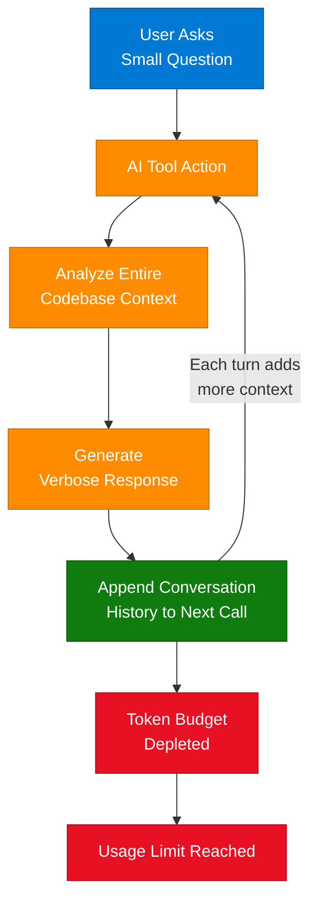

### Key Takeaways

- **Cumulative context growth** — Each follow-up question carries the full prior conversation as input tokens
- **Codebase scanning** — AI tools often read many files even for small questions
- **Mitigation** — Start fresh sessions for new tasks, use `.claudeignore` / `.aiderignore` to exclude large non-essential files, break tasks into smaller independent sessions
- **Context window ≠ output limit** — Limits are typically on input context, not response length

### Interview Q&A

| Question | Answer |
|---|---|
| What is a context window? | The maximum number of tokens an LLM can process in a single call — both input and output combined. Exceeding it causes the model to lose earlier context (truncation). |
| Why do AI coding tools run out of tokens faster than expected? | They send the entire codebase + conversation history on every call. Even a simple question consumes thousands of tokens of context overhead. |
| What is prompt caching? | A technique (supported by Anthropic, OpenAI) where repeated prefixes of the prompt are cached server-side, reducing cost and latency for long-context tasks. |
| How would you optimize token usage in an AI coding agent? | Use smaller context windows (gitignore large files), summarize long conversations, use separate sessions per task, apply prompt caching for stable system prompts. |
| What are the implications of a smaller vs larger context window? | Smaller = cheaper, faster, but loses older context. Larger = can reason over more content but costs more per call. Ideal: long context + prompt caching. |

---

## 9. AI Roles: GenAI vs Code Agents vs Agentic AI

### Overview

Three AI concepts are frequently conflated in job descriptions but require different engineering skills. Understanding their architectural distinctions is critical for AI engineer interviews. GenAI generates content from a prompt. Code Agents use tools to write and execute code. Agentic AI orchestrates multi-step workflows with persistent state, tool use, and self-directed decision-making.

### Architecture Comparison Diagram

```mermaid
flowchart TD
    subgraph GenAI ["Generative AI"]
        G1["Next-Token Prediction"]
        G2["Single-Turn Output"]
        G1 --> G2
    end

    subgraph CodeAgent ["Code Agent"]
        C1["User Intent"]
        C2["Code Generation\n(LLM)"]
        C3["Code Execution\n(Sandbox)"]
        C4["Output / Debug"]
        C1 --> C2 --> C3 --> C4
    end

    subgraph AgenticAI ["Agentic AI"]
        A1["Goal Input"]
        A2["Plan\n(LLM Orchestrator)"]
        A3["Tool Selection"]
        A4["Execute\n(Code / Search / API)"]
        A5["Observe & Reflect"]
        A6["Goal Met?"]
        A1 --> A2 --> A3 --> A4 --> A5 --> A6
        A6 -->|"No"| A2
        A6 -->|"Yes"| Done["Done"]
    end

    classDef aiNode      fill:#7719AA,stroke:#5A0E80,color:#fff
    classDef processNode fill:#FF8C00,stroke:#CC7000,color:#fff
    classDef userNode    fill:#0078D4,stroke:#005A9E,color:#fff
    classDef outputNode  fill:#00B294,stroke:#007D68,color:#fff

    class G1,G2 aiNode
    class C2 aiNode
    class C1 userNode
    class C3,C4 processNode
    class A2 aiNode
    class A1 userNode
    class A3,A4,A5,A6 processNode
    class Done outputNode
```

### Comparison Table

| Dimension | Generative AI | Code Agent | Agentic AI |
|---|---|---|---|
| **Interaction model** | Stateless, single-turn | Single-task with tool use | Multi-turn, persistent state |
| **Tool use** | No | Code execution only | Multi-tool (search, API, DB, code) |
| **Self-correction** | No | Limited (fix errors) | Yes (re-plan on failure) |
| **Memory** | None (within turn) | None (within turn) | Short + long term memory |
| **Engineering complexity** | Low | Medium | High |
| **Example** | ChatGPT Q&A | GitHub Copilot, Cursor | AutoGPT, Claude Code |

### Interview Q&A

| Question | Answer |
|---|---|
| Explain the difference between GenAI and Agentic AI. | GenAI generates content from a single prompt (stateless). Agentic AI orchestrates a feedback loop: plan → execute → observe → re-plan, with persistent memory and multi-tool access. |
| What is a Code Agent? | An AI that can write code in response to a task and execute it in a sandbox, reading the output to debug or extend its own code. GitHub Copilot (workspace mode) and Cursor are examples. |
| What does "stateless vs reactive loop" mean in AI context? | Stateless: model processes input and returns output, retaining no memory. Reactive loop: agent maintains state across turns, using previous observations to decide next actions. |
| What engineering challenges arise with Agentic AI in production? | Infinite loops, excessive tool calls, hallucinated tool parameters, prompt injection via tool outputs, unpredictable latency, and cost explosions from recursive calls. |
| How do you add memory to an AI agent? | Short-term: include prior turns in context window. Long-term: store key facts to a vector DB or structured store, retrieve relevant memories via semantic search before each turn. |

---

## 10. Handling LLM Hallucinations

### Overview

Hallucination — where an LLM generates factually incorrect but syntactically plausible responses — cannot be eliminated through prompt engineering alone. Reliable AI systems require architectural guardrails: grounding the model in trusted sources (RAG), constraining its output scope, and validating outputs before surfacing them to users. This is Part 10 of a 50-part System Design Series by `@sagar_695`.

### Hallucination Mitigation Architecture

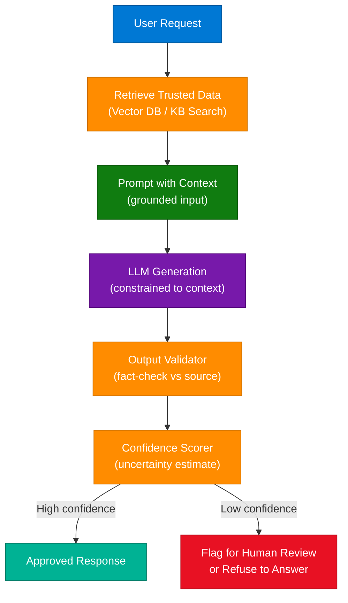

### 8 Architectural Strategies to Reduce Hallucination

1. **RAG (Retrieval-Augmented Generation)** — Ground every response in retrieved documents from a trusted source; model cannot fabricate what the documents don't contain
2. **Temperature = 0** — Set temperature to 0 for factual tasks; deterministic sampling reduces creative (hallucinated) output
3. **System prompt constraints** — Explicitly instruct the model: "Only answer from the provided context. Say 'I don't know' if the answer is not in the context."
4. **Citation enforcement** — Require the model to cite specific passages; fabricated citations are much harder to generate convincingly
5. **Output validators** — Run a second LLM call as a checker: "Does this response contradict the source documents?"
6. **Confidence-based routing** — Use logprobs or a classifier to estimate output confidence; route uncertain responses to human review
7. **Chain-of-Thought with intermediate checks** — Break complex reasoning into checkable steps; validate each step against known facts
8. **Structured output schemas** — Use JSON schema enforcement (function calling, Pydantic) to constrain output to valid values

### Interview Q&A

| Question | Answer |
|---|---|
| What is LLM hallucination? | An LLM generating text that is grammatically correct and confidently stated but factually wrong. It occurs because LLMs predict likely token sequences, not ground truth facts. |
| How does RAG reduce hallucination? | By providing retrieved, factually accurate context in the prompt. The model is instructed to answer from the provided documents only, limiting its ability to invent information. |
| What is grounding in the context of LLMs? | Connecting model outputs to verifiable external data sources — documents, databases, APIs — so claims can be traced and validated rather than generated from model weights alone. |
| When would you refuse to answer vs hallucinate? | Design the system to refuse when confidence is below threshold, rather than guess. "I don't have enough information" is always safer than a confident wrong answer in production. |
| What are logprobs and how are they useful for hallucination detection? | Log-probabilities of each output token. Low logprob on key terms (entity names, numbers) signals uncertainty — useful as a lightweight confidence signal without a separate validation call. |

---

## 11. Top 5 Types of AI Agents

### Overview

The `@techwith.ram` post outlined five categories of AI agents based on how they perceive their environment and make decisions. Understanding these types is fundamental to designing agent architectures — each type makes different assumptions about state, goals, and reasoning complexity.

### The 5 Agent Types

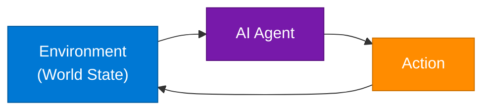

| Agent Type | Mechanism | State Awareness | Best For |
|---|---|---|---|
| **Simple Reflex** | Condition-action rules | None | Rule-based automation, email filters |
| **Model-Based Reflex** | Maintains internal world model | Partial | Navigation, inventory management |
| **Goal-Based** | Plans actions to achieve explicit goal | Yes | Task planning, multi-step workflows |
| **Utility-Based** | Maximizes expected utility function | Yes + value | Optimization, recommendation systems |
| **Learning** | Updates behavior from feedback | Adaptive | RLHF, recommendation engines, game AI |

### Interview Q&A

| Question | Answer |
|---|---|
| What is a simple reflex agent? | Maps percepts directly to actions via if-then rules, with no memory of history. Fast but brittle — fails when conditions don't match rules exactly. |
| What makes a utility-based agent different from a goal-based agent? | Goal-based agents pursue a binary satisfied/unsatisfied goal. Utility-based agents maximize a continuous score, enabling them to choose between multiple ways of achieving a goal. |
| What is RLHF? | Reinforcement Learning from Human Feedback — humans rank model outputs, and a reward model is trained on these rankings, then used to fine-tune the LLM via PPO or DPO. |
| How do modern LLM agents fit into this taxonomy? | GPT/Claude agents with tool use are primarily goal-based + model-based (they maintain conversation state). With RLHF fine-tuning, they incorporate learning-agent characteristics. |
| What is the perception-action loop? | The fundamental cycle of all AI agents: Perceive environment → Process (reason/plan) → Act → Perceive updated environment → repeat. |

---

## 12. The Rise of A2A Protocol

### Overview

The Agent-to-Agent (A2A) protocol addresses a fundamental gap in multi-agent AI architectures: traditional REST APIs require a rigid request-response contract, but autonomous AI agents need to negotiate tasks, delegate work, and communicate goal completion dynamically. A2A enables agents to discover each other's capabilities via **AgentCards** and communicate through a structured task-oriented protocol rather than fixed HTTP endpoints.

### REST vs A2A Architecture

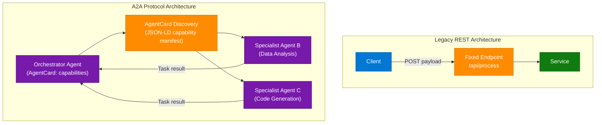

### REST vs A2A Protocol Comparison

| Dimension | REST API | A2A Protocol |
|---|---|---|
| **Contract** | Fixed endpoints + schemas | Dynamic capability negotiation via AgentCards |
| **Communication** | Synchronous request-response | Task-oriented, async, event-driven |
| **Discovery** | Manual documentation / OpenAPI | Self-describing AgentCard manifests |
| **Error model** | HTTP status codes | Task state machine (pending/active/done/failed) |
| **Multi-agent** | Not natively supported | First-class multi-agent orchestration |
| **Use case** | Human-to-machine integration | Machine-to-machine autonomous collaboration |

### Interview Q&A

| Question | Answer |
|---|---|
| Why is REST a bottleneck for Agentic AI? | REST requires pre-defined contracts. Agents need to negotiate tasks dynamically, delegate based on capability, and handle variable-length async workflows — REST's rigid endpoint model breaks down. |
| What is an AgentCard? | A JSON-LD document describing an agent's capabilities, input/output schemas, and invocation protocol. Enables agents to discover and delegate tasks to the right specialist agent. |
| How does A2A relate to MCP? | MCP (Model Context Protocol) connects an LLM to tools/resources. A2A connects LLM agents to other LLM agents for task delegation. They complement each other: MCP for tool use, A2A for agent-to-agent workflows. |
| What communication protocol does A2A use under the hood? | A2A is typically implemented over HTTP/2 or WebSockets with a defined task state machine (submitted → working → artifact → completed). Google's A2A spec uses JSON-RPC 2.0. |
| When would you choose A2A over a simple function call between agents? | When agents are independently deployed, have different ownership/scaling, or need to negotiate task parameters dynamically — not when all logic lives in a single codebase. |

---

## 13. Essential AI Engineering Projects

### Overview

Building a portfolio for AI engineering roles requires projects that demonstrate: RAG pipeline construction, multi-modal data ingestion, embeddings, vector stores, and LLM integration — not just API calls to ChatGPT. The `@aakashautomates` post featured three high-impact projects.

### RAG Architecture (Used by All 3 Projects)

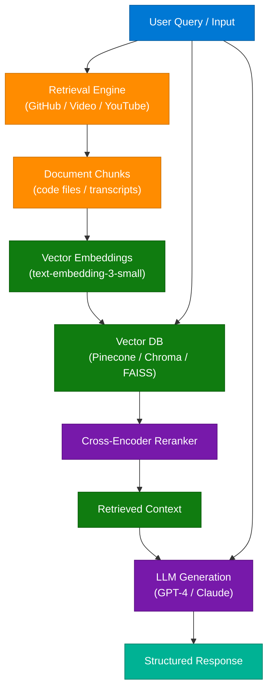

### Project Breakdown

| Project | Input | Core Technique | Stack |
|---|---|---|---|
| **GitHub RAG App** | GitHub repo URL | Code chunking by file/function, embeddings over code | LangChain, Chroma, OpenAI Embeddings |
| **Video RAG App** | Video file / YouTube URL | Whisper transcription, chunking by sentence, semantic search | Whisper, FAISS, GPT-4 |
| **YouTube Trend Analysis** | YouTube Data API | Time-series trend extraction, topic clustering | YouTube API, LLM summarization, pandas |

### Interview Q&A

| Question | Answer |
|---|---|
| What is a RAG pipeline? | Retrieve relevant documents from a knowledge base using semantic search, then provide them as context to an LLM for generation. Grounding the LLM in retrieved facts reduces hallucination. |
| How do you chunk documents for RAG? | Strategy depends on content: code → split by function/class; prose → split by sentence or paragraph with overlap; structured data → split by row or section. Chunk size is typically 256–512 tokens. |
| What is a vector database? | A database optimized for storing and querying high-dimensional vector embeddings using approximate nearest neighbor (ANN) search (HNSW, IVF). Examples: Pinecone, Chroma, Weaviate, FAISS. |
| How would you evaluate a RAG system? | Use RAGAS metrics: faithfulness (is the answer grounded in retrieved docs?), answer relevancy (does it address the question?), context recall (are the right documents retrieved?). |
| What is the difference between an embedding model and an LLM? | Embedding models convert text to dense numerical vectors representing semantic meaning. LLMs generate text token by token. Both are transformer-based but serve different purposes in a RAG pipeline. |

---

## 14. HashSet vs TreeSet — Java Collections

### Overview

HashSet and TreeSet both implement the `Set` interface — uniqueness guaranteed — but make fundamentally different trade-offs between speed and order. The choice directly impacts algorithmic complexity for insert, delete, and lookup operations.

### Comparison Table

| Property | HashSet | TreeSet |
|---|---|---|
| **Underlying structure** | HashMap (hash table) | Red-Black Tree |
| **Insert / Delete / Lookup** | O(1) average | O(log N) |
| **Order** | No guaranteed order | Sorted (natural or Comparator) |
| **Null values** | 1 null allowed | No null (null breaks comparison) |
| **Thread safety** | Not thread-safe | Not thread-safe |
| **Memory** | More (hash table overhead) | Less (tree nodes) |
| **Use case** | Fast deduplication, membership checks | Sorted unique values, range queries |

### Decision Flowchart

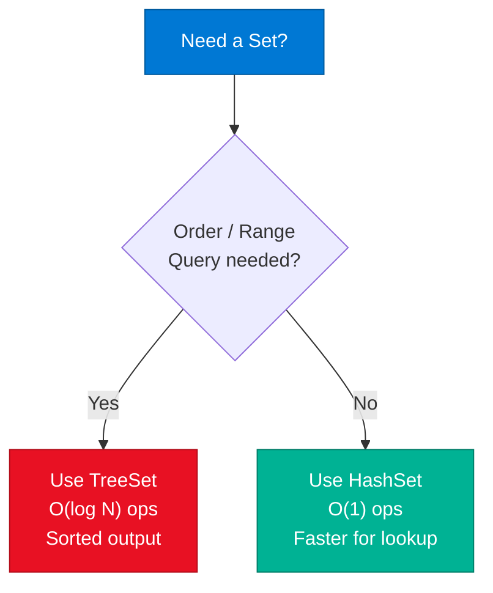

### Interview Q&A

| Question | Answer |
|---|---|
| When would you use TreeSet over HashSet? | When you need elements in sorted order (e.g., leaderboard by score), or need range operations like `headSet()`, `tailSet()`, or `subSet()`. For raw membership checks, HashSet is always faster. |
| What is a Red-Black Tree? | A self-balancing BST where every path from root to leaf has the same number of "black" nodes. Guarantees O(log N) worst-case for insert/delete/search. Used in Java's TreeMap and TreeSet. |
| What happens if you don't override `hashCode()` and `equals()` in a HashSet? | Objects that are logically equal will be stored as duplicates because the default `hashCode()` uses object identity (memory address), not value equality. |
| How is a LinkedHashSet different from HashSet? | LinkedHashSet maintains insertion order using a doubly-linked list backing the hash table. Access is O(1) like HashSet, but iteration is in insertion order. |
| What is the time complexity of `contains()` in TreeSet? | O(log N) — the tree is traversed from root to leaf. Compared to O(1) amortized for HashSet's `contains()`. |

---

## 15. Invalidating JWT Access Tokens

### Overview

JWT tokens are stateless by design — once issued, the server has no record of them. This makes invalidation (logout, revocation, account suspension) architecturally non-trivial. The solution requires introducing controlled statefulness via a blacklist or token rotation strategy.

### JWT Invalidation Architecture

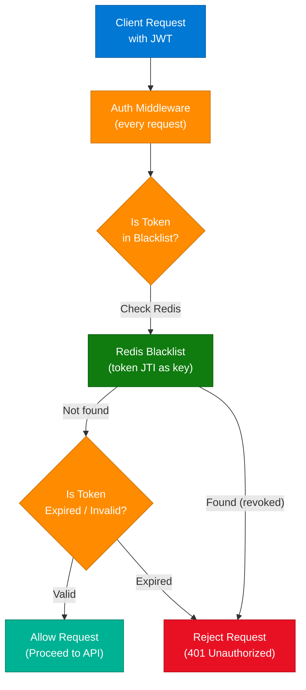

### JWT Invalidation Strategies

| Strategy | Mechanism | Trade-off |
|---|---|---|
| **Token Blacklist (Redis)** | Store JTI of revoked tokens in Redis with TTL = token expiry | Extra Redis lookup per request; scales well |
| **Short-lived tokens** | Set JWT TTL to 5–15 min; refresh tokens for continuity | User re-authenticates frequently if refresh not handled |
| **Token versioning** | Store a `token_version` in user DB; increment on logout/revoke; check on each request | Extra DB lookup; allows mass invalidation for a user |
| **Opaque tokens** | Replace JWT with random string; validate by DB lookup every request | Fully revocable; eliminates JWT benefits (stateless) |
| **Refresh + Rotation** | Short JWT (access) + long-lived refresh token; rotate refresh on each use; revoke refresh token on logout | Most secure; complexity in handling rotation race conditions |

### Interview Q&A

| Question | Answer |
|---|---|
| Why can't you simply delete a JWT to invalidate it? | JWTs are stateless — the server doesn't store them. The token is self-contained; any service with the public key can validate it without contacting the issuer. |
| What is JTI? | JWT ID — a unique identifier claim in the JWT payload used to identify a specific token. Stored in a blacklist to mark a specific token as revoked. |
| How do you handle token revocation at scale? | Store revoked JTIs in Redis with TTL matching token expiry. Redis is fast enough for per-request lookups and automatically purges expired entries via TTL. |
| What is the access + refresh token pattern? | Access tokens have short TTL (15 min) for API auth. Refresh tokens (long-lived) exchange for new access tokens. Revocation is done by invalidating the refresh token. |
| When would you use opaque tokens instead of JWTs? | When instant revocation is required (banking, medical systems), when you can't afford any window of invalid-token-still-works, or when all services can efficiently hit a shared token store. |

---

## 16. Overview of API Protocols

### Overview

Modern distributed systems use multiple communication protocols — not just REST. Each protocol optimizes for different access patterns: REST for CRUD, GraphQL for flexible queries, gRPC for high-throughput microservices, WebSockets for real-time bidirectional streams, Webhooks for event-driven notifications.

### API Protocol Ecosystem

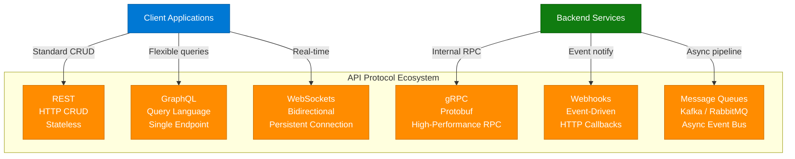

### Protocol Selection Guide

| Protocol | Best For | Avoid When |
|---|---|---|
| **REST** | Public APIs, CRUD, browser clients | High-frequency streaming, complex nested queries |
| **GraphQL** | Mobile apps (bandwidth constrained), aggregating multiple services | Simple CRUD, teams unfamiliar with schema management |
| **gRPC** | Internal microservice comms, streaming, polyglot systems | Browser clients (limited native support), simple APIs |
| **WebSockets** | Chat, gaming, live dashboards, collaborative editing | Infrequent updates (polling is simpler), stateless APIs |
| **Webhooks** | Payment notifications, CI/CD triggers, third-party integrations | When consumer can't expose a public endpoint |
| **Message Queue** | Decoupled async processing, fan-out, guaranteed delivery | Low-latency synchronous responses required |

### Interview Q&A

| Question | Answer |
|---|---|
| When would you choose gRPC over REST? | For internal microservice communication where performance matters: gRPC uses binary Protobuf serialization (3–5× smaller than JSON), HTTP/2 multiplexing, and strongly-typed contracts. |
| What is the N+1 problem in REST, and how does GraphQL solve it? | REST: fetching a user + their 10 posts requires 11 requests (1 for user, 10 for posts). GraphQL: single query fetches user and nested posts in one network round trip. |
| What is the difference between WebSockets and SSE? | WebSockets: full-duplex, bidirectional, any binary or text data. SSE: server-to-client only, text/event-stream over HTTP, automatic reconnection. Use SSE for live feeds; WebSockets for chat/gaming. |
| What is long polling? | Client sends a request; server holds it open until data is available, then responds. Client immediately sends a new request. Simulates push without WebSockets but with more overhead. |
| How do Kafka and RabbitMQ differ? | Kafka: log-based, high-throughput, durable, replayed — ideal for event sourcing and analytics. RabbitMQ: traditional message broker, routing-heavy, better for task queues with complex routing logic. |

---

## 17. Real-Time Updates: WebSockets, WebHooks, SSE

### Overview

Three distinct patterns handle "server has new data for the client" scenarios. The correct choice depends on the direction of communication, the nature of events, and whether the receiver is a server or browser.

### Decision Framework

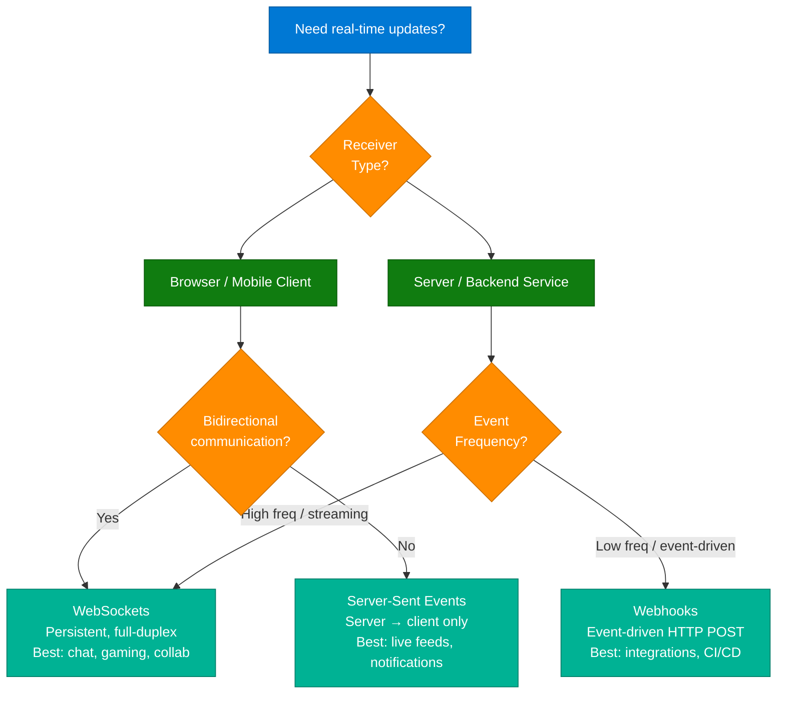

### Protocol Deep Dive

**1. WebSockets**
- Full-duplex: both client and server can send at any time
- Single persistent TCP connection after HTTP upgrade handshake
- Use for: chat apps, multiplayer games, live collaborative editing
- Limitation: stateful — server must track connections; tricky to scale horizontally

**2. WebHooks**
- Server-to-server HTTP POST callback on event
- Consumer registers a callback URL; producer POSTs JSON payload when event fires
- Use for: payment notifications (Stripe), GitHub events, CI/CD triggers
- Limitation: consumer must expose public HTTPS endpoint; requires retry/idempotency handling

**3. Server-Sent Events (SSE)**
- Unidirectional: server pushes to browser over standard HTTP
- Built-in reconnection, event IDs for resumption, `text/event-stream` content type
- Use for: live sports scores, stock price feeds, notification banners
- Limitation: HTTP/1.1 limits to 6 connections per domain; solved by HTTP/2

### Interview Q&A

| Question | Answer |
|---|---|
| WebSockets vs SSE — when to use each? | WebSockets for bidirectional real-time (chat, games). SSE for unidirectional server-push (news feeds, notifications). SSE is simpler and works over standard HTTP; WebSockets requires protocol upgrade. |
| How do you scale WebSocket servers? | Use sticky sessions (consistent hash on connection ID) to route requests to the same backend, or decouple via pub/sub (Redis Pub/Sub, Kafka) so any backend can publish to any connection. |
| What happens if a WebSocket connection drops? | Client-side reconnect logic (exponential backoff). For SSE, reconnection is built-in. For WebSockets, implement a heartbeat (ping/pong) to detect silent disconnections. |
| What is the WebSocket handshake? | An HTTP/1.1 request with `Upgrade: websocket` header. Server responds with `101 Switching Protocols`, and the connection upgrades from HTTP to WebSocket protocol. |
| What is idempotency in Webhooks? | Ensuring the same event delivered multiple times (due to retries) produces the same end state. Implement by storing the event ID and ignoring duplicates. |

---

## 18. Improving Text-to-SQL Systems

### Overview

Simple Text-to-SQL demos (prompt + schema → SQL) fail in production because real databases have ambiguous column names, complex joins, access control requirements, and business logic that cannot be inferred from schema alone. Production Text-to-SQL requires schema augmentation, query validation, and a retrieval layer for business context.

### Production Text-to-SQL Architecture

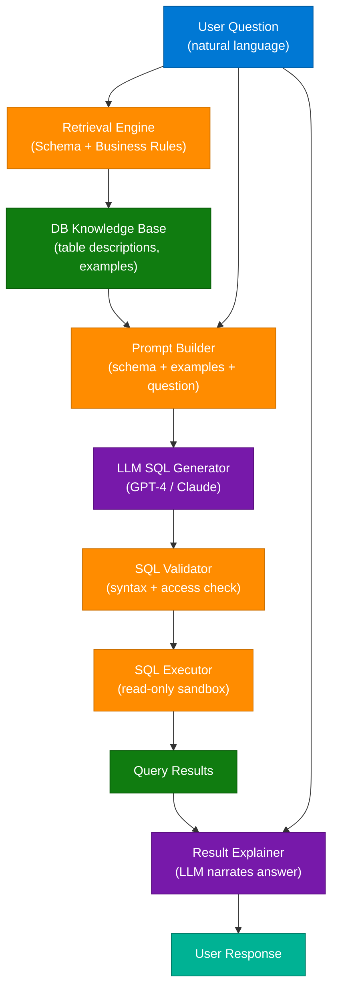

### Naive vs Production Approach

| Dimension | Naive Demo | Production System |
|---|---|---|
| Schema injection | Full schema in prompt | Retrieve only relevant tables/columns |
| Business context | None | Business rules and descriptions in KB |
| SQL validation | None | Syntax check + query plan analysis |
| Access control | None | Row-level security enforcement |
| Error recovery | Crash / wrong output | Retry with feedback to LLM |
| Result explanation | Raw SQL output | LLM-narrated natural language answer |

### Interview Q&A

| Question | Answer |
|---|---|
| Why does simple Text-to-SQL fail in production? | Real schemas have hundreds of tables with ambiguous names, complex joins, and business logic not expressed in the schema. The LLM lacks context to generate correct SQL without supplementary knowledge. |
| How do you add schema context without exceeding the context window? | Use semantic search over table/column descriptions to retrieve only the 5–10 most relevant tables for the user's query, rather than injecting the full schema. |
| What is NL-to-SQL validation? | After LLM generates SQL, parse it with a SQL parser library (sqlglot, sqlparse), check for syntax errors, verify table/column names exist, and optionally EXPLAIN the query without executing it. |
| How do you prevent SQL injection in an AI-generated query system? | Use parameterized queries for any user-provided values. LLM generates the SQL structure; user values are passed as parameters. Never concatenate user input into SQL strings. |
| What is the difference between Text-to-SQL and conversational SQL? | Text-to-SQL converts a single question to a SQL query. Conversational SQL maintains context across turns (e.g., "now filter by region" refers to the previous query's table). Requires conversation history management. |

---

## 19. Creating Custom AI Skills in Claude

### Overview

Custom AI skills allow you to encode domain-specific workflows, design patterns, or operational procedures as persistent prompts that Claude applies automatically. This is a form of **knowledge-based AI augmentation** — the model doesn't change, but its behavior becomes specialized through structured context injection. The `@abhinavagr180` post described a 4-step process for creating these from PDF knowledge sources.

### 4-Step Skill Creation Process

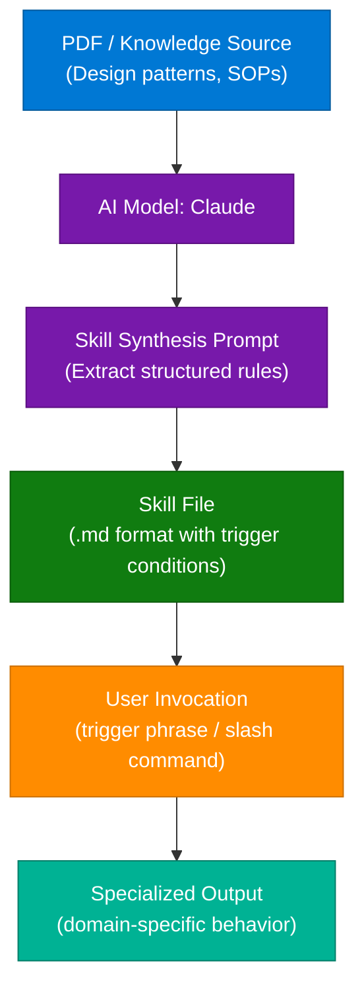

### Interview Q&A

| Question | Answer |
|---|---|
| What is knowledge-based AI augmentation? | Providing structured knowledge (via prompt engineering, RAG, or skill files) to make a general-purpose LLM behave like a domain expert without fine-tuning. |
| What is the difference between a skill and fine-tuning? | A skill injects procedural knowledge at inference time via the context window. Fine-tuning bakes knowledge into model weights. Skills are cheaper, instantly updatable, and don't require training data. |
| When would you fine-tune instead of using skills? | When the behavior change is fundamental to the model's style/format that cannot be expressed as instructions, or when you need a very small model to exhibit complex behavior without a long prompt. |
| What makes a well-structured skill file? | Clear trigger conditions (when to activate), explicit steps (the workflow), output format specification, edge case handling, and examples of correct behavior. |
| How does Claude Code implement skills? | As `.md` files in `Agent-Skills/` directory. Each file defines the agent persona, trigger conditions, workflow steps, and output structure. The CLAUDE.md file activates them for the session. |

---

## 20. Polling vs WebSockets

### Overview

Polling (client repeatedly asks "any updates?") and WebSockets (server pushes updates to client) represent the two fundamental paradigms for data freshness. The key distinction: who drives the communication — the client (polling) or the server (WebSockets).

### Architecture Comparison

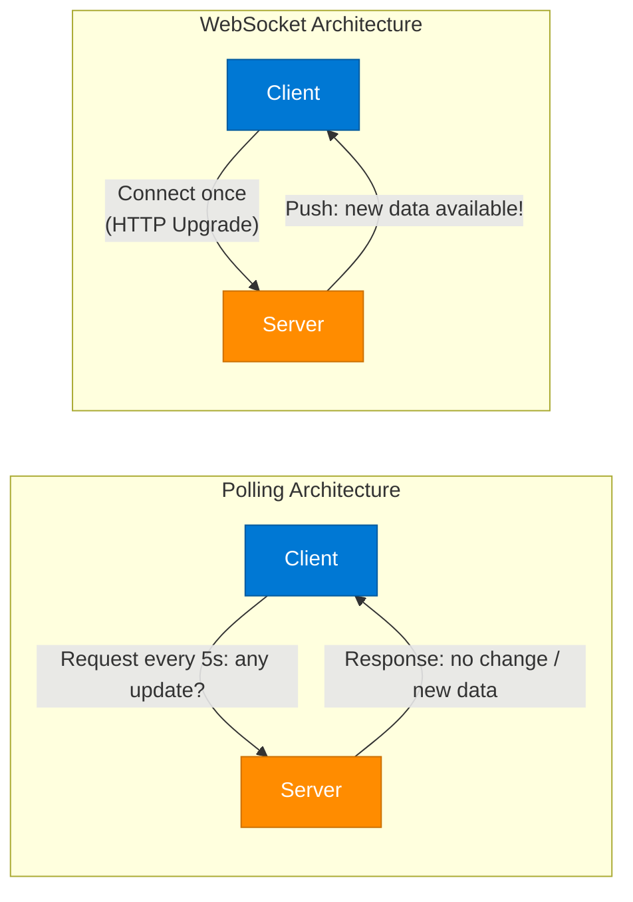

### Polling vs WebSockets Comparison

| Dimension | Polling | WebSockets |
|---|---|---|
| **Who initiates** | Client | Server (after initial handshake) |
| **Connection** | New HTTP connection each time | Single persistent connection |
| **Latency** | Poll interval (e.g., 5s delay) | Near real-time (ms) |
| **Server load** | High (many idle requests) | Lower (push only when data exists) |
| **Implementation complexity** | Simple | Moderate (connection management) |
| **Firewall/proxy friendly** | Yes (standard HTTP) | Mostly yes; some proxies block upgrades |
| **Best for** | Infrequent updates, simple infra | Frequent updates, real-time UX |

### Interview Q&A

| Question | Answer |
|---|---|
| What is the difference between short polling and long polling? | Short polling: client polls at fixed intervals, server responds immediately. Long polling: server holds the connection open until new data arrives, then responds — more efficient but more complex. |
| How do WebSockets reduce server load compared to polling? | Server only pushes when data changes. Polling sends requests even when nothing changed, wasting server resources processing empty responses. |
| What is a heartbeat in WebSocket context? | A periodic ping/pong message between client and server to verify the connection is still alive. Without heartbeats, idle connections can be silently dropped by NAT/firewall middleboxes. |
| When is polling still the right choice? | For infrequent updates (< 1/min), simple client environments where WebSocket libraries aren't available, or when you need to avoid stateful server-side connection management. |
| How does YouTube handle millions of live viewers? | Combination of CDN for video streaming, load balancing across video delivery nodes, WebSockets or SSE for live chat, DB sharding for user data, and horizontal scaling of comment/reaction microservices. |

---

## 21. RAG Accuracy with Cross-Encoders

### Overview

A two-stage RAG pipeline dramatically improves retrieval accuracy over single-stage vector search. Stage 1 (bi-encoder / approximate nearest neighbor) retrieves many candidate documents quickly but imprecisely. Stage 2 (cross-encoder re-ranker) re-scores the top-K candidates with full attention over both query and document, selecting the most genuinely relevant documents before generation.

### 3-Step RAG Pipeline

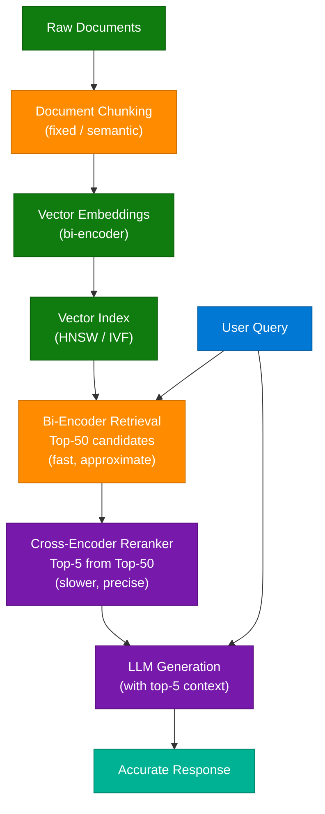

### Bi-Encoder vs Cross-Encoder

| Dimension | Bi-Encoder | Cross-Encoder |
|---|---|---|
| **How it works** | Encodes query and document independently; dot product similarity | Encodes query + document together with full cross-attention |
| **Speed** | Fast (pre-compute doc embeddings; ANN search) | Slow (O(query × candidates) pairs scored at query time) |
| **Accuracy** | Good (misses nuanced relevance) | Excellent (understands query-document interaction) |
| **Scalable to** | Millions of documents | Hundreds of candidates (post-retrieval) |
| **Use** | Stage 1: broad retrieval | Stage 2: precision re-ranking |

### Interview Q&A

| Question | Answer |
|---|---|
| Why does a single vector search sometimes return irrelevant documents? | Bi-encoders produce embeddings independently — they capture semantic meaning but miss fine-grained query-document interaction. A document semantically similar to the query may not actually answer it. |
| What is a cross-encoder? | A model that takes (query, document) as a single input and produces a relevance score using full cross-attention. More accurate than bi-encoders but not scalable for full-corpus retrieval. |
| What is the typical retrieval funnel in production RAG? | Retrieve top-100 via ANN vector search → re-rank with cross-encoder to top-5 → pass top-5 as context to LLM for generation. Balances speed and accuracy. |
| How does HyDE improve RAG retrieval? | Hypothetical Document Embedding: generate a hypothetical answer to the query using the LLM, embed that answer, and retrieve documents similar to the hypothetical answer rather than the raw query. |
| What is LangChain's Ensemble Retriever? | Combines multiple retrieval strategies (e.g., BM25 keyword search + vector search) using Reciprocal Rank Fusion to merge result lists. Improves recall over any single retrieval method. |

---

## 22. 90 Days AI Engineer Roadmap

### Overview

The `@ds_ai_ketan` post outlined a structured 90-day curriculum for transitioning into AI engineering, starting from software foundations and progressively adding ML, LLM engineering, and agentic AI skills.

### Roadmap Progression

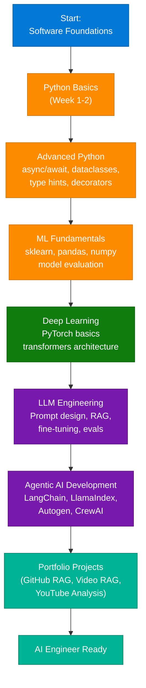

### Key Milestones by Phase

| Phase | Duration | Key Skills | Deliverable |
|---|---|---|---|
| Software Foundations | Weeks 1-2 | Python, Git, Docker, APIs | REST API with Python |
| ML Fundamentals | Weeks 3-5 | sklearn, EDA, model eval | Kaggle competition submission |
| Deep Learning | Weeks 6-8 | PyTorch, transformers, BERT | Text classifier |
| LLM Engineering | Weeks 9-11 | RAG, prompt eng, evals | Production RAG app |
| Agentic AI | Weeks 10-12 | LangChain, tool use, agents | Multi-tool agent |

> **Note:** Mastery of Advanced Python — specifically async/await, type hints, decorators, and context managers — is what separates junior from senior AI engineers. These patterns are used extensively in LangChain, FastAPI, and async agent frameworks.

---

## 23. Array & String Problem-Solving Patterns

### Overview

Rather than memorizing 300+ individual LeetCode solutions, mastering 4 fundamental patterns allows solving most array/string problems by pattern recognition. The `@codeera.tech` post provided a decision flowchart for selecting the right pattern.

### Pattern Decision Tree

```mermaid
flowchart TD
    Problem["Array/String Problem"]
    PairOrSub{"Problem Type"}
    Pair["PAIR\n(find 2 elements)"]
    Sub["SUB-ARRAY\n(contiguous segment)"]

    PairSorted{"Sorted\nArray?"}
    TwoPointer["Two Pointer\nO(n) — opposite ends\nTarget sum, palindrome"]
    HashMapPair["HashMap\nO(n) — store complements\nTwo Sum, anagram check"]

    SubFixed{"Fixed\nWindow Size?"}
    SlidingFixed["Sliding Window\n(fixed size)\nMax sum of K elements"]
    SlidingVar["Sliding Window\n(variable size)\nLongest substring, min-length subarray"]

    Problem --> PairOrSub
    PairOrSub --> Pair
    PairOrSub --> Sub
    Pair --> PairSorted
    PairSorted -->|"Yes"| TwoPointer
    PairSorted -->|"No"| HashMapPair
    Sub --> SubFixed
    SubFixed -->|"Yes"| SlidingFixed
    SubFixed -->|"No"| SlidingVar

    classDef userNode    fill:#0078D4,stroke:#005A9E,color:#fff
    classDef processNode fill:#FF8C00,stroke:#CC7000,color:#fff
    classDef outputNode  fill:#00B294,stroke:#007D68,color:#fff
    classDef dataNode    fill:#107C10,stroke:#0A5C0A,color:#fff

    class Problem userNode
    class PairOrSub,PairSorted,SubFixed processNode
    class TwoPointer,SlidingFixed,SlidingVar outputNode
    class HashMapPair dataNode
```

### 4 Core Patterns

| Pattern | Time | Space | Use For |
|---|---|---|---|
| **Two Pointers** | O(n) | O(1) | Sorted array pair sums, reverse, palindrome check |
| **Sliding Window** | O(n) | O(k) | Subarray max/min, longest substring, anagram check |
| **HashMap (Frequency)** | O(n) | O(n) | Pair sums in unsorted arrays, frequency counting |
| **Prefix Sum** | O(n) / O(1) query | O(n) | Subarray sum range queries, cumulative sums |

### Interview Q&A

| Question | Answer |
|---|---|
| How do you find if a subarray sums to K? | Prefix sum + HashMap: prefix[i] - prefix[j] = K implies prefix[j] = prefix[i] - K. Store prefix sums in a HashMap; check if complement exists in O(n). |
| What is the sliding window technique? | Maintain a window of elements defined by left and right pointers. Expand right to grow, shrink left to maintain a constraint. Avoids nested loops: O(n) instead of O(n²). |
| When is two pointers applicable? | When the array is sorted (or can be sorted), and you need to find pairs satisfying a condition. The sorted invariant allows eliminating candidates by moving pointers inward. |
| What is the difference between sliding window and two pointers? | Two pointers: both pointers on one array finding pairs (opposing direction). Sliding window: left and right pointers define a contiguous subarray, expanding/contracting based on a constraint. |
| How do you detect an anagram using sliding window? | Fixed-size window of length pattern.length on the string. Maintain a character frequency counter. If counter matches pattern's counter, the window is an anagram. O(n). |

---

## 24. Modern Backend System Architecture

### Overview

Production-grade backend systems at FAANG scale follow a layered architecture pattern: client → API Gateway → Load Balancer → Application Services → Cache → Database, with observability and message queues for decoupling. The `@iampradeepkumarsaini` post illustrated the canonical reference architecture.

### Reference Architecture Diagram

```mermaid
flowchart TD
    Client["Client\nWeb / Mobile"]
    Gateway["API Gateway\n(Auth, Rate Limit, Routing)"]
    LB["Load Balancer\n(Round-robin / Least connections)"]

    subgraph AppLayer ["Application Services"]
        SvcA["Service A\n(User)"]
        SvcB["Service B\n(Product)"]
        SvcC["Service C\n(Order)"]
    end

    Cache["Cache Layer\n(Redis / Memcached)"]
    MQ["Message Queue\n(Kafka / RabbitMQ)"]
    DB["Primary DB\n(PostgreSQL / MySQL)"]
    DBR["Read Replicas\n(Scale reads)"]
    Monitor["Observability\n(Prometheus + Grafana)"]

    Client --> Gateway
    Gateway --> LB
    LB --> SvcA
    LB --> SvcB
    LB --> SvcC
    SvcA --> Cache
    SvcB --> Cache
    SvcC --> MQ
    Cache -->|"Cache miss"| DB
    MQ --> DB
    DB --> DBR
    SvcA --> Monitor
    SvcB --> Monitor
    SvcC --> Monitor

    classDef userNode    fill:#0078D4,stroke:#005A9E,color:#fff
    classDef processNode fill:#FF8C00,stroke:#CC7000,color:#fff
    classDef dataNode    fill:#107C10,stroke:#0A5C0A,color:#fff
    classDef infraNode   fill:#605E5C,stroke:#3B3A39,color:#fff
    classDef outputNode  fill:#00B294,stroke:#007D68,color:#fff

    class Client userNode
    class Gateway,LB,AppLayer processNode
    class SvcA,SvcB,SvcC processNode
    class Cache,MQ infraNode
    class DB,DBR dataNode
    class Monitor outputNode
```

### Component Roles

| Component | Role | Technology Options |
|---|---|---|
| API Gateway | Auth, rate limiting, SSL termination, routing | Kong, AWS API Gateway, Nginx |
| Load Balancer | Distribute traffic, health checks, failover | HAProxy, AWS ALB, Nginx |
| Cache | Sub-millisecond reads for hot data | Redis, Memcached |
| Message Queue | Async decoupling, guaranteed delivery | Kafka, RabbitMQ, AWS SQS |
| Read Replicas | Scale read traffic without scaling writes | PostgreSQL Streaming Replication |
| Observability | Metrics, logs, traces | Prometheus, Grafana, Jaeger |

---

## 25. Caching in System Design

### Overview

Caching stores frequently accessed data in faster storage (memory) to reduce latency and database load. A cache hit returns data directly from memory (microseconds); a cache miss falls through to the database (milliseconds to seconds). Redis is the industry-standard cache layer.

### Cache Architecture

```mermaid
flowchart LR
    Client["Client"]
    Cache["Cache / Redis\n(in-memory)"]
    DB["Database\n(PostgreSQL / MySQL)"]

    Client -->|"Request data"| Cache
    Cache -->|"Cache Hit"| Client
    Cache -->|"Cache Miss"| DB
    DB -->|"Populate cache\n(write-through / aside)"| Cache
    DB -->|"Return data"| Client

    classDef userNode    fill:#0078D4,stroke:#005A9E,color:#fff
    classDef infraNode   fill:#605E5C,stroke:#3B3A39,color:#fff
    classDef dataNode    fill:#107C10,stroke:#0A5C0A,color:#fff

    class Client userNode
    class Cache infraNode
    class DB dataNode
```

### Cache Strategies

| Strategy | How It Works | Trade-off |
|---|---|---|
| **Cache-Aside** | App reads cache; on miss, reads DB and writes to cache | Most common; cache only fills with accessed data |
| **Write-Through** | Write to cache and DB simultaneously | No stale data; higher write latency |
| **Write-Behind** | Write to cache; async write to DB | Lower write latency; risk of data loss on crash |
| **Read-Through** | Cache handles DB reads automatically | Simpler app code; first read is always slow |
| **Refresh-Ahead** | Pre-populate cache before TTL expires | Eliminates cold cache; wastes resources if prediction wrong |

### Eviction Policies

| Policy | Evicts | Use For |
|---|---|---|
| **LRU** (Least Recently Used) | Least recently accessed key | General-purpose web caches |
| **LFU** (Least Frequently Used) | Least frequently accessed key | Session caches, recommendation caches |
| **TTL** (Time-to-Live) | Keys after fixed time | Time-sensitive data (auth tokens, prices) |
| **FIFO** | Oldest key by insertion time | Logging, simple queues |

### Interview Q&A

| Question | Answer |
|---|---|
| What is a cache hit ratio and why does it matter? | Percentage of requests served from cache. A ratio above 90–95% indicates effective caching. Low ratio means the cache is not reducing DB load. |
| What is a write-through cache? | Data is written to cache and DB simultaneously. Ensures consistency (cache never stale) at the cost of higher write latency. |
| What is the difference between Redis and Memcached? | Redis: persistent, supports complex data structures (lists, sets, sorted sets, streams), pub/sub, atomic operations. Memcached: simpler, multi-threaded, slightly faster for pure key-value caching at very high throughput. |
| When should you NOT cache? | Highly dynamic data with no tolerance for staleness (financial transactions, inventory counts), user-specific security tokens, or data that changes on every write. |
| What is cache warming? | Pre-populating a cache before traffic hits to avoid a cold-start where every initial request misses cache. Critical for post-deployment or failover scenarios. |

---

## 26. Optimizing AI Tool Token Usage

### Overview

AI coding tools (Claude, Copilot, Cursor) consume tokens for both input context and output generation. The most common source of unexpected cost/limit exhaustion is authentication conflicts and context mismanagement. The `@trakin.ai` post focused on Claude authentication token conflicts that block "save tokens" workflows.

### Auth Conflict Resolution Flow

```mermaid
flowchart TD
    EnvStart["Claude AI Environment"]
    DetectAuth{"Detect\nAuth Source"}
    TokenA["ANTHROPIC_AUTH_TOKEN\n(environment variable)"]
    TokenB["Session Cookie\n(browser login)"]
    Conflict["Auth Conflict!\nTwo competing sources"]
    Resolution["Resolution:\nRemove env var OR\nuse one auth method only"]
    Success["Clean Auth State\nTokens saved correctly"]

    EnvStart --> DetectAuth
    DetectAuth --> TokenA
    DetectAuth --> TokenB
    TokenA --> Conflict
    TokenB --> Conflict
    Conflict --> Resolution
    Resolution --> Success

    classDef userNode    fill:#0078D4,stroke:#005A9E,color:#fff
    classDef processNode fill:#FF8C00,stroke:#CC7000,color:#fff
    classDef errorNode   fill:#E81123,stroke:#B30D1A,color:#fff
    classDef outputNode  fill:#00B294,stroke:#007D68,color:#fff
    classDef dataNode    fill:#107C10,stroke:#0A5C0A,color:#fff

    class EnvStart userNode
    class DetectAuth processNode
    class TokenA,TokenB dataNode
    class Conflict errorNode
    class Resolution processNode
    class Success outputNode
```

### Token Saving Best Practices

| Practice | Impact | Implementation |
|---|---|---|
| Compact system prompts | Medium | Remove verbose explanations; use structured formats |
| `.claudeignore` file | High | Exclude node_modules, .git, dist, large data files |
| Session segmentation | High | Start fresh sessions per independent task |
| Prompt caching | High | Cache stable system prompts (Anthropic API feature) |
| Summarize long histories | Medium | Periodically compress conversation context |

### Interview Q&A

| Question | Answer |
|---|---|
| What is prompt caching in the Anthropic API? | A feature that caches the beginning of a prompt (system prompt, large context) server-side. Subsequent calls with the same prefix pay cache read pricing (~10% of full input cost). |
| How does a `.claudeignore` file work? | Like `.gitignore` — lists directories/files that Claude Code should exclude when building context. Prevents large, irrelevant files (vendor dirs, build artifacts) from consuming context window. |
| What is the difference between input tokens and output tokens in cost? | Input tokens are cheaper (reading context). Output tokens are more expensive (generating). For long-context tasks, input cost dominates; for verbose generation tasks, output cost dominates. |
| How do you reduce AI tool context consumption for a large codebase? | Use focused sessions per module, provide minimal context (only relevant files), use summaries instead of full file contents, and leverage CLAUDE.md to give architectural context without reading all files. |
| What is the MAX_TOKENS parameter and how does it affect behavior? | Sets the maximum number of tokens the model can generate in a response. Setting it too low truncates outputs; too high increases cost. For structured tasks, set to 2-3× expected output size. |

---

## 27. API Gateway in System Design

### Overview

An API Gateway is the single entry point for all client requests to a microservices backend. It handles cross-cutting concerns — authentication, rate limiting, SSL termination, request routing, and observability — that would otherwise need to be duplicated in every service. The gateway is the architectural equivalent of a security checkpoint and traffic controller combined.

### API Gateway Architecture

```mermaid
flowchart TD
    WebClient["Web Client"]
    MobileClient["Mobile Client"]
    ThirdParty["Third-Party\nIntegrations"]

    Gateway["API Gateway\n(Single Entry Point)"]

    subgraph GatewayFunctions ["Gateway Functions"]
        Auth["Authentication\n(JWT / OAuth / API Key)"]
        RateLimit["Rate Limiting\n(Token Bucket)"]
        Route["Request Routing\n(path-based / header-based)"]
        Transform["Request Transformation\n(headers, payloads)"]
        Cache["Response Caching\n(TTL-based)"]
    end

    subgraph Services ["Backend Services"]
        UserSvc["User Service"]
        ProductSvc["Product Service"]
        OrderSvc["Order Service"]
        NotifSvc["Notification Service"]
    end

    WebClient --> Gateway
    MobileClient --> Gateway
    ThirdParty --> Gateway
    Gateway --> Auth --> RateLimit --> Route
    Route --> UserSvc
    Route --> ProductSvc
    Route --> OrderSvc
    Route --> NotifSvc

    classDef userNode    fill:#0078D4,stroke:#005A9E,color:#fff
    classDef infraNode   fill:#605E5C,stroke:#3B3A39,color:#fff
    classDef processNode fill:#FF8C00,stroke:#CC7000,color:#fff
    classDef dataNode    fill:#107C10,stroke:#0A5C0A,color:#fff

    class WebClient,MobileClient,ThirdParty userNode
    class Gateway infraNode
    class Auth,RateLimit,Route,Transform,Cache processNode
    class UserSvc,ProductSvc,OrderSvc,NotifSvc dataNode
```

### API Gateway vs Load Balancer

| Dimension | Load Balancer | API Gateway |
|---|---|---|
| **Primary function** | Distribute traffic across instances | Request management, transformation, auth |
| **OSI layer** | Layer 4 (TCP) or Layer 7 (HTTP) | Layer 7 (HTTP/HTTPS) |
| **Authentication** | No | Yes |
| **Rate limiting** | Basic (connection limits) | Advanced (per-user, per-endpoint) |
| **Routing** | Instance-based (round-robin) | Path/header/content-based |
| **Typical tools** | HAProxy, AWS NLB, Nginx | Kong, AWS API Gateway, Apigee |

### Interview Q&A

| Question | Answer |
|---|---|
| What is an API Gateway and why is it used? | A single entry point for all external requests to a microservices system. Centralizes auth, rate limiting, routing, logging, and SSL termination — avoiding duplication across every service. |
| What is the difference between API Gateway and reverse proxy? | A reverse proxy forwards requests to backend servers (load balancing, SSL). An API Gateway adds business-logic-aware capabilities: auth, rate limiting, request transformation, and analytics. |
| How do you implement rate limiting in an API Gateway? | Token bucket or sliding window algorithm per API key or IP. Store counters in Redis for distributed enforcement across gateway replicas. Return 429 Too Many Requests when limit exceeded. |
| What is API composition in a gateway? | Aggregating responses from multiple downstream microservices into a single response for the client. Also called Backend for Frontend (BFF) pattern. Reduces client round-trips. |
| What are the failure modes of an API Gateway? | Single point of failure (mitigate with multi-AZ deployment + health checks), latency added per hop (mitigate with keep-alive connections), and cascading failures (mitigate with circuit breakers + bulkheads). |

---

## 28. Interview Q&A Cheatsheet

**Q: What is the difference between Agentic AI and a standard LLM?**
> Standard LLMs respond to a single prompt stateless. Agentic AI orchestrates a plan-execute-observe feedback loop with tool use, persistent memory, and self-directed goal pursuit across multiple steps.

**Q: How do you solve global API latency for users in a distant region?**
> Deploy regional app servers (multi-region), add DB read replicas in that region (GeoDNS routing), offload static assets to CDN edge nodes, and use Anycast routing to direct users to the nearest PoP.

**Q: What is a cache stampede and how do you prevent it?**
> Simultaneous cache miss by thousands of requests hitting the DB. Prevent with Redis distributed lock (SETNX), TTL jitter, probabilistic early expiry, or stale-while-revalidate pattern.

**Q: How does Instagram serve feeds so fast?**
> Fan-out on write: feed is pre-computed when creators post and stored in Redis per-user inbox. Opening the app = O(1) Redis read, not a DB query. Media served from CDN.

**Q: What is RAG and why is it better than fine-tuning for factual accuracy?**
> Retrieval-Augmented Generation grounds LLM responses in retrieved documents from a trusted knowledge base. Unlike fine-tuning, RAG is instantly updatable, auditable (can cite sources), and doesn't require training data collection or GPU compute.

**Q: Explain JWT invalidation strategies.**
> JWTs are stateless so can't be "deleted." Options: token blacklist in Redis (store JTI with TTL), short-lived access tokens with refresh token rotation, token versioning in user DB, or opaque tokens (fully stateful, fully revocable).

**Q: When would you choose WebSockets over SSE?**
> WebSockets for bidirectional real-time (chat, gaming, collaborative editing). SSE for unidirectional server-push (live feeds, notification banners). SSE is simpler and works over standard HTTP; WebSockets requires protocol upgrade.

**Q: What is gRPC and when should you use it over REST?**
> Google's high-performance RPC framework using Protobuf serialization and HTTP/2. Use for internal microservice communication requiring high throughput, streaming, or strongly-typed contracts. Avoid for public APIs where browser support is needed.

**Q: What makes a RAG pipeline production-ready vs demo-quality?**
> Production: schema/document retrieval (not full injection), cross-encoder reranking, output validation, access control enforcement, fallback handling, and RAGAS-based evaluation. Demo: raw schema + single LLM call.

**Q: What is the A2A protocol?**
> Agent-to-Agent protocol for multi-agent AI systems. Agents publish capability manifests (AgentCards), discover each other, and delegate tasks via a task state machine — enabling autonomous agent collaboration without pre-defined API contracts.

**Q: How do you approach a system design interview?**
> Clarify scale requirements (users, QPS, SLAs), design the minimal happy path, identify the top 2-3 bottlenecks, then apply targeted solutions: caching for read load, queuing for write spikes, sharding for data volume, multi-region for latency.

**Q: What are the 4 core array/string algorithm patterns?**
> Two Pointers (sorted pair problems), Sliding Window (contiguous subarray with constraint), HashMap Frequency (unsorted pair sums, anagrams), and Prefix Sum (range sum queries). Matching the pattern to the problem shape eliminates brute-force approaches.

---

*Extracted from Gemini shared session · July 7, 2026 · GeminiShareToMD Agent v1.0*

---

```
═══════════════════════════════════════════════════════════
Token Usage Report
═══════════════════════════════════════════════════════════
Estimated without optimization:  ~92,000 tokens (raw page: 362,554 chars ÷ 4)
Actual (with optimization):      ~14,000 tokens (enriched output: ~56,000 chars ÷ 4)
Savings:                         ~78,000 tokens (~85%)
Techniques applied:
  • Stripped: UI chrome ("Convert chat to PDF", "Continue this chat", footer links)
  • Stripped: Repeated boilerplate headers across 26 turns
  • Deduplicated: WebSockets covered in turns 16, 17, 19 → merged into unified sections
  • TOON-converted: 8 comparison tables (HashSet/TreeSet, REST/A2A, Polling/WS, etc.)
  • Compacted: Verbose Gemini prose → dense technical definitions
  • Preserved: All Mermaid diagram logic, architecture descriptions, interview Q&As
═══════════════════════════════════════════════════════════
* Estimates: prose chars ÷ 4, code chars ÷ 3. Actual API usage varies by model.
```
