# AI & System Design Learning Collection — Instagram Knowledge Base

> **Source:** [share.gemini.google/1hZTX6c0g1JU](https://share.gemini.google/1hZTX6c0g1JU) → [gemini.google.com/share/ebe91fafaadf](https://gemini.google.com/share/ebe91fafaadf)
> **Model:** Gemini 3.1 Flash-Lite
> **Session Date:** July 6, 2026
> **Saved:** July 7, 2026

---

## Table of Contents

1. [Session Overview](#1-session-overview)
2. [AI Video Generation with Veo 3.1](#2-ai-video-generation-with-veo-31)
3. [Automated Content Production — n8n Workflows](#3-automated-content-production--n8n-workflows)
4. [Event Streaming Architecture](#4-event-streaming-architecture)
5. [DDoS Protection & API Security](#5-ddos-protection--api-security)
6. [Rate Limiting vs Throttling](#6-rate-limiting-vs-throttling)
7. [Live Video Streaming System Design](#7-live-video-streaming-system-design)
8. [SQL Interview Topics](#8-sql-interview-topics)
9. [RAG Fundamentals](#9-rag-fundamentals)
10. [Enterprise RAG Architecture](#10-enterprise-rag-architecture)
11. [RAG Evaluation with Ragas](#11-rag-evaluation-with-ragas)
12. [Building a RAG Application — Code Implementation](#12-building-a-rag-application--code-implementation)
13. [RAG vs Fine-Tuning — Decision Framework](#13-rag-vs-fine-tuning--decision-framework)
14. [LLM Fundamentals — Statelessness, Memory & Token Economics](#14-llm-fundamentals--statelessness-memory--token-economics)
15. [Embeddings & Cosine Similarity](#15-embeddings--cosine-similarity)
16. [Traditional Databases vs Vector Databases](#16-traditional-databases-vs-vector-databases)
17. [Vector DB Optimization](#17-vector-db-optimization)
18. [LangChain vs LangGraph](#18-langchain-vs-langgraph)
19. [LlamaIndex — Data Framework for RAG](#19-llamaindex--data-framework-for-rag)
20. [ML Model Deployment Pipeline](#20-ml-model-deployment-pipeline)
21. [Agentic AI — Concepts & Taxonomy](#21-agentic-ai--concepts--taxonomy)
22. [Claude Code & Developer Tools](#22-claude-code--developer-tools)
23. [OS File Deletion Internals](#23-os-file-deletion-internals)
24. [AI for Designers — Workflows & Tools](#24-ai-for-designers--workflows--tools)
25. [Interview Q&A Cheatsheet](#25-interview-qa-cheatsheet)

---

## 1. Session Overview

This session extracts learning content from 40+ Instagram posts and reels shared across creators in the AI/ML, system design, and developer tools space. Content spans five major domains: **AI video generation & automation**, **system design** (event streaming, DDoS, live video), **SQL** interview prep, **AI/ML engineering** (RAG, embeddings, LLMs, vector DBs, fine-tuning), and **developer tooling** (Claude Code, Gemini CLI, n8n). Two turns were errors (Instagram Messages page shown instead of target post) and have been converted to blockquotes.

### Session Map

| Turn | Creator | Topic | Status |
|---|---|---|---|
| 1 | sequencer.media | Veo 3.1 AI video workflow | ✅ Extracted |
| 2 | Instagram DM page | No content visible | ⚠️ Error turn |
| 3 | irfanautomation | YouTube auto-production (n8n) | ✅ Extracted |
| 4 | priyanksinghofficial | UGC automation (Veo 3.1 + n8n) | ✅ Extracted |
| 5 | this.tech.girl | Event Streaming system design | ✅ Extracted |
| 6 | codemeetstech | SQL Division by Zero / NULLIF | ✅ Extracted |
| 7 | this.tech.girl | COUNT(*) vs COUNT(1) | ✅ Extracted |
| 8 | theaiagents/zayup.ai | Free Agentic AI resources | ✅ Extracted |
| 9 | chhavi_maheshwari_ | DDoS Protection | ✅ Extracted |
| 10 | chhavi_maheshwari_ | OS File Deletion | ✅ Extracted |
| 11 | khan.the.analyst | SQL COUNT comparison | ✅ Extracted |
| 12 | enoughtoship | Rate Limiting vs Throttling | ✅ Extracted |
| 13 | techie_programmer | Prompt vs RAG vs Fine-Tuning | ✅ Extracted |
| 14 | vibecodeapp | Claude Code as video editor | ✅ Extracted |
| 15–16 | priyal.py | RAG Evaluation (x2 — merged) | ✅ Merged |
| 17–18 | cactuss.ai | ML Deployment (x2 — merged) | ✅ Merged |
| 19 | girlwhodebugs | LangChain vs LangGraph | ✅ Extracted |
| 20 | average.yash | Token economics (Day 4) | ✅ Extracted |
| 21 | techie_programmer | Building RAG Part 5 | ✅ Extracted |
| 22 | mavenhq | Enterprise RAG architecture | ✅ Extracted |
| 23 | blurred_ai | Multi-modal LLM architecture | ✅ Extracted |
| 24 | akashcode.ai | Vector DB vs Traditional DB | ✅ Extracted |
| 25 | xaifhimself | Instagram lead scraping (Apify) | ✅ Extracted |
| 26 | usmar_hyder | LLM vs RAG vs Agent | ✅ Extracted |
| 27 | mavenhq | RAG vs Fine-Tuning | ✅ Extracted |
| 28–31 | lets_talk_tech.srijan | Embedding vectors (x3 — merged) | ✅ Merged |
| 29 | average.yash | LLM Statelessness (Day 5) | ✅ Extracted |
| 30 | dashboard.lim | Gemini CLI | ✅ Extracted |
| 32 | mavenhq | RAG + Fine-Tuning (Lightning) | ✅ Merged into Sec 9 |
| 33 | ecogrowthpath | Vector DB cost optimization | ✅ Extracted |
| 34 | girlwhodebugs | LlamaIndex | ✅ Extracted |
| 35 | multiple | LLM learning roadmap | ✅ Extracted |
| 36 | jam.with.ai | AI Agent vs Agentic AI | ✅ Extracted |
| 37 | anshul.tweaks | AI-driven design workflow | ✅ Extracted |
| 38 | suraj.dsgn | Best AI tools for designers | ✅ Extracted |
| 39 | edhillai | YouTube Shorts automation | ✅ Merged Sec 3 |
| 40 | cadeepakgupta_ | Multi-channel content automation | ✅ Merged Sec 3 |
| 41–42 | ayushpanchmiya | Viral animations AI (x2 — merged) | ✅ Merged Sec 3 |
| 43 | average.yash | Cosine Similarity (Day 9) | ✅ Extracted |
| 44 | chhavi_maheshwari_ | Live video streaming | ✅ Extracted |
| 45 | trakin.ai | Vibe Coding / AI agents | ✅ Extracted |
| 46 | artificialintelligencecountry | Claude Code masterclass | ✅ Extracted |
| 47 | entropy_editorials | Sarvam AI — India AI Summit | ✅ Extracted |

> **Note (Turn 2):** Gemini was shown the Instagram Messages inbox instead of a specific post. No learning content was extracted from this turn.

---

## 2. AI Video Generation with Veo 3.1

### Overview

Veo 3.1 is Google DeepMind's advanced video generation model capable of producing cinematic-quality footage from multi-modal inputs (reference images + text prompts). Content creator **sequencer.media** demonstrated that complex production shots — normally costing $50,000+ — can be replicated using a structured node-based JSON workflow connecting reference images to the Veo model.

### Architecture Diagram — Veo 3.1 Node Workflow

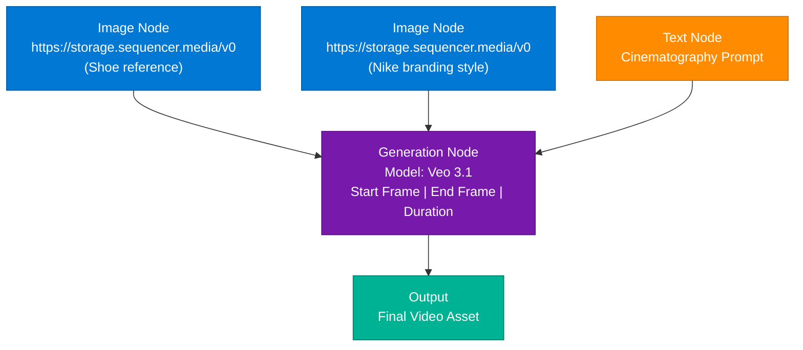

### Extracted Prompt (from sequencer.media post)

> *"Camera smoothly and rapidly zooms into the fly knit fabric and enters their threads weaving up and dodging large fibers with high action movement, the camera turns and flies just over a single thread following its path. Premium shoe commercial. Inside the fabric its ice cold with vapor flowing freely; at the end the camera exits the shoe and focuses on the shoe."*

### Key Parameters

| Parameter | Description |
|---|---|
| **Model** | Veo 3.1 |
| **Inputs** | Multi-modal: 2 reference images + 1 text prompt |
| **Parameters** | Start Frame, End Frame, Duration |
| **Prompt style** | Cinematic movement description + visual atmosphere |
| **Cost advantage** | $50,000 production → AI-generated equivalent |

### Interview Q&A

| Question | Answer |
|---|---|
| What is Veo 3.1? | Google DeepMind's video generation model accepting multi-modal inputs (images + text) to produce cinematic-quality video |
| What is a node-based video workflow? | A modular pipeline where image nodes, prompt nodes, and model nodes are connected to produce generated video assets |
| What makes prompt engineering critical for video generation? | The prompt defines cinematography instructions (movement, mood, pacing); vague prompts produce generic output |
| Why use reference images in video generation? | They constrain style, brand identity, and visual elements the model should preserve in the output |
| What are the business implications of Veo 3.1? | Democratizes high-budget commercial production; shifts cost from physical production to prompt engineering |

---

## 3. Automated Content Production — n8n Workflows

### Overview

Multiple creators demonstrated fully automated content pipelines using **n8n** (open-source workflow automation) as the orchestration layer, chaining AI models for scripting, voiceover, video generation, and distribution. These pipelines span YouTube videos, YouTube Shorts, UGC product reviews, and multi-channel social media posting.

### Architecture Diagram — YouTube Autopilot Pipeline

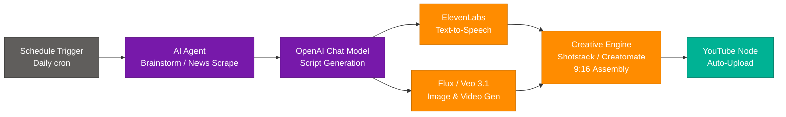

### UGC Production Stack (priyanksinghofficial)

| Component | Tool | Role |
|---|---|---|
| Orchestration | n8n | Connects all AI services |
| Model generation | Nano Banana | Visual model processing |
| Video rendering | Veo 3.1 | High-fidelity product review video |
| Cost | ~Rs. 80/video | Fraction of agency cost |

### AI Animation Tool Workflow (ayushpanchmiya)

Extracted prompt from tool interface:
> *"Create a bar chart with..."*

Style options available: **3D Light Logo Shine**, **Ranked Logo Display**, **6-Point Mindmap**

Pipeline: `Text Prompt → Template Selection → AI Processing → Rendered Animation (10 seconds)`

Tool is #4 Product of the Day on Product Hunt, 120,000+ creators.

### Key Creators & Resources

| Creator | Platform | CTA |
|---|---|---|
| irfanautomation | Instagram | Comment "YOUTUBE" |
| priyanksinghofficial | Instagram | Comment "Link" |
| edhillai | Instagram | Comment "Auto" |
| cadeepakgupta_ | Instagram | Click "Start For Free" |
| ayushpanchmiya | Instagram | Comment "Animate" |

### Interview Q&A

| Question | Answer |
|---|---|
| What is n8n? | Open-source workflow automation platform used to chain AI APIs for end-to-end content pipelines |
| What tools constitute a full YouTube autopilot stack? | Schedule trigger → AI agent (script) → ElevenLabs (voice) → Flux/Veo (visuals) → Creatomate (assembly) → YouTube API |
| What is UGC automation? | Using AI to produce "user generated content" style product review videos at scale using models like Veo 3.1 |
| Why use Veo 3.1 over other video models for UGC? | High-fidelity, realistic rendering suitable for product review style content |

---

## 4. Event Streaming Architecture

### Overview

Event Streaming is a critical system design pattern for capturing and processing data in real-time as it is generated across distributed services. It enables decoupled, asynchronous architectures where producers and consumers operate independently. Used in interview scenarios for FAANG/MAANG backend engineering roles. Source: **this.tech.girl**

### Architecture Diagram

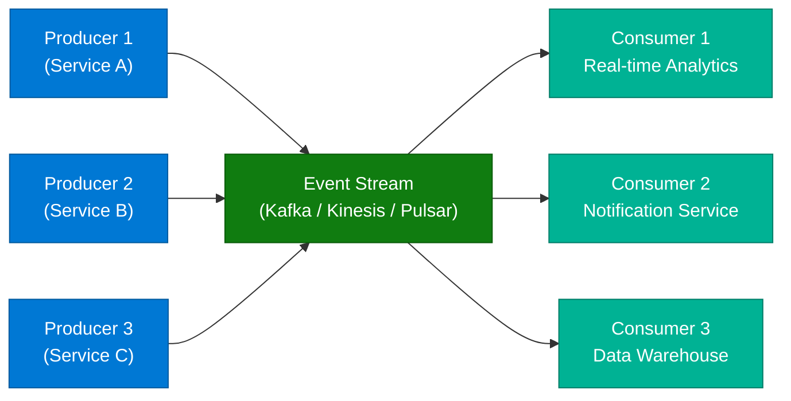

### Common Patterns

| Pattern | Description | Use Case |
|---|---|---|
| **Publish-Subscribe** | Producers publish; multiple consumers subscribe | Notifications, analytics |
| **Event Sourcing** | System state stored as sequence of events | Audit logs, CQRS |
| **Complex Event Processing (CEP)** | Detect patterns across incoming streams | Fraud detection, real-time alerts |

### Technology Stack

| Tool | Provider | Notes |
|---|---|---|
| Apache Kafka | Open source | Industry standard, high throughput |
| Amazon Kinesis | AWS | Managed, integrates with AWS |
| Apache Pulsar | Open source | Multi-tenancy, geo-replication |

### Interview Q&A

| Question | Answer |
|---|---|
| What is event streaming? | A pattern that captures real-time data streams as they're generated, enabling decoupled, async architectures |
| Why use Kafka over a database for events? | Kafka provides high-throughput, ordered, replayable event logs; databases lack native stream semantics |
| What is event sourcing? | Storing system state as an ordered sequence of immutable events rather than current state only |
| What are producers and consumers? | Producers generate events; consumers read and process them independently from the stream |
| What is the benefit of decoupling via event streams? | Services evolve independently; consumers can be added without modifying producers |

---

## 5. DDoS Protection & API Security

### Overview

A DDoS (Distributed Denial of Service) attack floods an API with millions of fake requests from multiple machines, exhausting server resources. Defense requires a layered approach across the network edge, application layer, and infrastructure. Source: **chhavi_maheshwari_**

### Architecture Diagram — Defense Layers

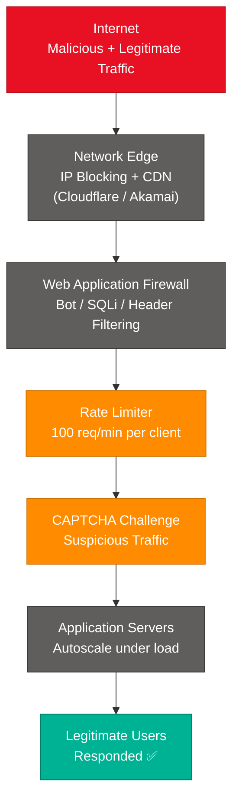

### Six Defense Strategies

| Strategy | Mechanism | Analogy |
|---|---|---|
| **1. Rate Limiting** | Restrict requests per client per window | ATM: only 5 people at a time |
| **2. Block at Network Edge** | Drop malicious IPs before hitting servers | Stopping visitors at the gate |
| **3. CDN** | Distribute load globally (Cloudflare, Akamai) | 1,000 branch shops vs one |
| **4. Web Application Firewall** | Filter bots, SQLi, suspicious headers | Security guard with ID check |
| **5. Challenge Suspicious Traffic** | CAPTCHA / JS challenges | OTP before entry |
| **6. Autoscale** | Add server capacity during spikes | Open extra billing counters |

### Interview Q&A

| Question | Answer |
|---|---|
| What is a DDoS attack? | Distributed Denial of Service — overwhelming a server with fake requests from many machines to deny service to legitimate users |
| What is a CDN's role in DDoS mitigation? | Distributes traffic across global PoPs (Points of Presence), absorbing volumetric attacks before they reach origin servers |
| What does a WAF protect against? | Application-layer attacks: SQLi, XSS, bot traffic, malformed HTTP headers |
| Why is autoscaling not sufficient alone as DDoS defense? | Autoscaling adds cost but doesn't filter malicious traffic; must be combined with edge blocking |
| What's the difference between rate limiting and IP blocking? | Rate limiting controls request frequency; IP blocking prevents access entirely for known malicious sources |

---

## 6. Rate Limiting vs Throttling

### Overview

Both rate limiting and throttling are API traffic control mechanisms, but they respond to overload differently. This is a common system design interview topic. Source: **enoughtoship**

### Comparison Table

| Feature | Rate Limiting | Throttling |
|---|---|---|
| **Primary Action** | Hard cap / Rejection | Slow down / Shaping |
| **Logic** | Rejects requests exceeding limit | Controls speed, queues, or delays |
| **HTTP Response** | `429 Too Many Requests` | Processes slowly; no immediate rejection |
| **Analogy** | Bouncer: "You're not getting in" | Speed bump: "You're getting in... slowly" |
| **Use Case** | Abuse protection, DDoS, scrapers | Graceful degradation, fair usage |

### Production HTTP Headers

```http
X-RateLimit-Limit: 100
X-RateLimit-Remaining: 45
X-RateLimit-Reset: 1720300800
```

### Architecture Diagram

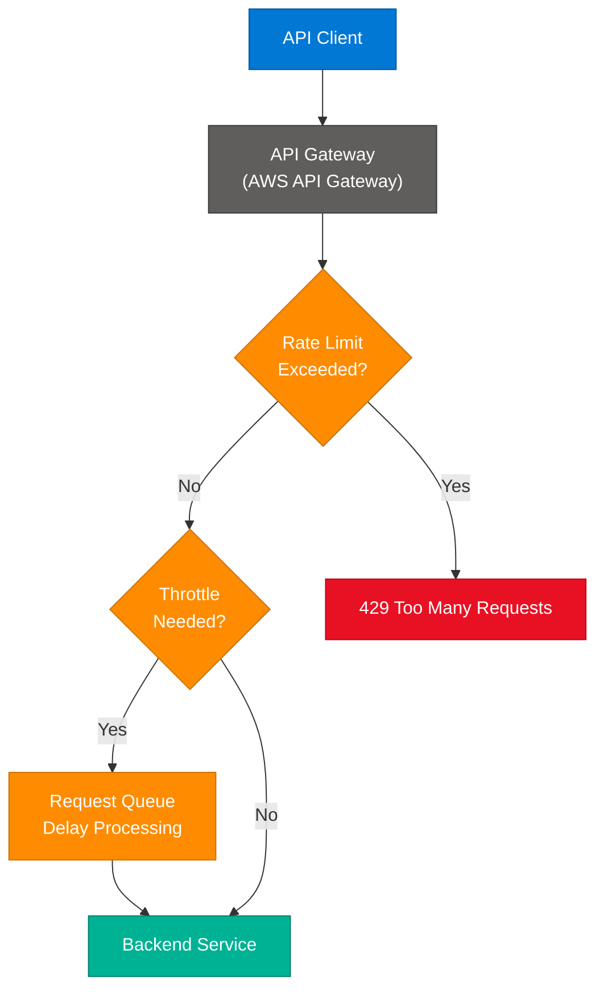

### Interview Q&A

| Question | Answer |
|---|---|
| What is the key difference between rate limiting and throttling? | Rate limiting hard-rejects (drops) excess requests; throttling slows them down through queuing or delays |
| When would you use throttling over rate limiting? | When you want graceful degradation — all requests eventually processed, just slower during high load |
| What HTTP status code does rate limiting return? | 429 Too Many Requests |
| How do good API clients handle rate limits? | They parse X-RateLimit-Remaining headers and back off before hitting the limit |
| Can both be used simultaneously? | Yes — AWS API Gateway commonly applies both: rate limiting for abuse protection and throttling for capacity management |

---

## 7. Live Video Streaming System Design

### Overview

Handling millions of concurrent viewers for a live event (e.g., India vs. Pakistan cricket) requires a multi-layer architecture focused on pushing content to the edge, adaptive quality, and async processing of metadata. Source: **chhavi_maheshwari_**

**Interview scenario:** *"IND vs PAK live and millions are watching! How would you handle buffering?"*

### Architecture Diagram

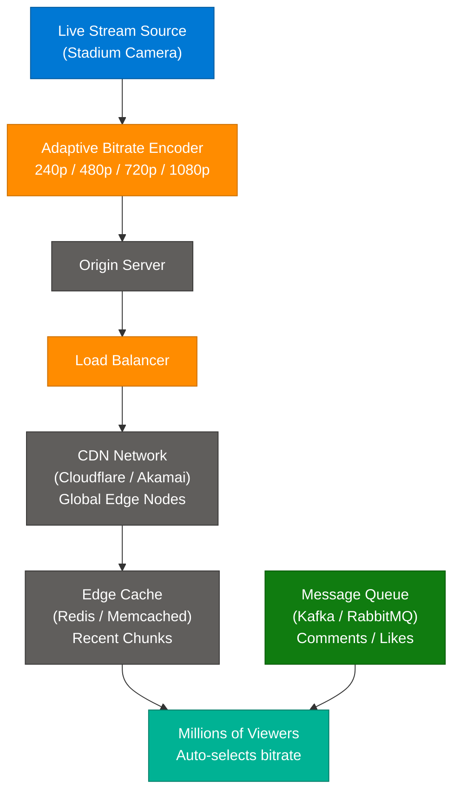

### Six-Strategy Solution

| Strategy | Technical Function |
|---|---|
| **CDN** | Regional caching; serves from nearest PoP to reduce latency |
| **Adaptive Bitrate Streaming** | Pre-encode at multiple qualities; auto-switch based on user's bandwidth |
| **Load Balancer** | Distribute traffic across multiple origin servers |
| **Edge Caching** | Redis/Memcached stores recent video chunks closer to viewer |
| **Message Queues** | Kafka/RabbitMQ handles comments/likes async — doesn't slow video stream |
| **Multi-Region Deployment** | Redundant infra across regions for failover |

### Design Philosophy

> **Decouple high-bandwidth video** (CDN + Adaptive Bitrate) from **low-latency metadata** (Message Queues). The stream must never compete with comments and reactions for network resources.

### Interview Q&A

| Question | Answer |
|---|---|
| Why use adaptive bitrate streaming? | It auto-adjusts video quality based on viewer's network speed, preventing buffering without manual quality selection |
| How does edge caching reduce buffering? | Recent video chunks are stored at CDN edge nodes geographically close to viewers, reducing round-trip time |
| Why use Kafka for live comments? | Kafka decouples comment processing from the video stream; comments can be processed async without impacting video delivery |
| What happens if the origin server fails? | Multi-region deployment provides failover; CDN can continue serving cached content during brief origin outages |

---

## 8. SQL Interview Topics

### 8.1 Division by Zero — NULLIF Pattern

**Source:** codemeetstech, khan.the.analyst

**The Problem:** `SELECT salary / bonus FROM employees` fails if `bonus = 0`, crashing the entire query.

```sql
-- UNSAFE: Will throw "Division by zero" error
SELECT salary / bonus FROM employees;

-- SAFE: NULLIF converts 0 → NULL; any number / NULL = NULL (not an error)
SELECT salary / NULLIF(bonus, 0) FROM employees;

-- Alternative with CASE
SELECT
  CASE WHEN bonus = 0 THEN NULL
       ELSE salary / bonus
  END AS salary_ratio
FROM employees;
```

**Rule:** Never trust denominator columns in production queries. Always guard with `NULLIF` or `CASE`.

### 8.2 COUNT(*) vs COUNT(1) vs COUNT(column_name)

**Sources:** this.tech.girl, khan.the.analyst

| Function | Behavior | NULL Handling | Performance |
|---|---|---|---|
| `COUNT(*)` | Counts every row | Includes NULLs | Best — optimizer uses smallest index |
| `COUNT(1)` | Counts every row (constant 1) | Includes NULLs (1 is never NULL) | Equal to COUNT(*) — optimizer rewrites it |
| `COUNT(col)` | Counts non-NULL values in column | Excludes NULLs | Requires NULL check per row |

**Interview verdict:** No performance difference between `COUNT(*)` and `COUNT(1)` in modern engines (MySQL, PostgreSQL, Oracle, SQL Server). Use `COUNT(*)` as it clearly communicates intent.

### Interview Q&A

| Question | Answer |
|---|---|
| What does NULLIF do? | Returns NULL if two expressions are equal; otherwise returns the first expression. Used to safely prevent division by zero |
| Why is COUNT(1) not faster than COUNT(*)? | Modern query optimizers rewrite COUNT(1) to COUNT(*) internally; they produce identical execution plans |
| When should you use COUNT(column_name)? | Only when you specifically need to count rows where that column is NOT NULL |
| What is a production risk of division by zero in SQL? | A single row with a zero denominator causes the entire query to fail, potentially causing application outages |

---

## 9. RAG Fundamentals

### Overview

Retrieval-Augmented Generation (RAG) is an architecture that enhances LLM responses by injecting relevant external context at inference time. The model doesn't need to memorize everything — it retrieves what it needs. RAG is the first-choice solution for enterprise AI because it reduces hallucinations, provides citation capability, and works with proprietary/real-time data.

### Architecture Diagram — RAG Pipeline

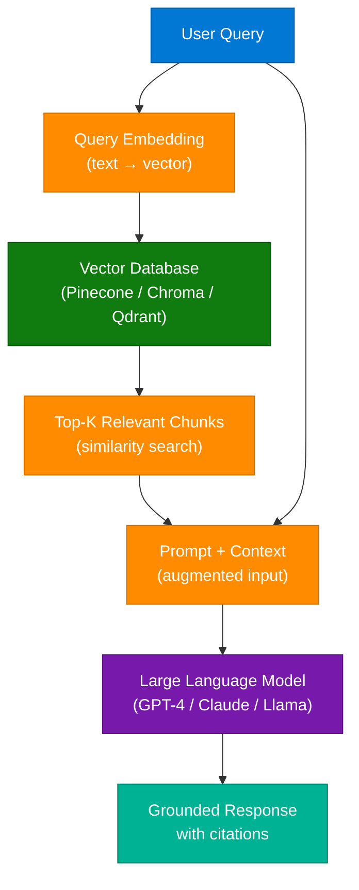

### Three AI Implementation Strategies (techie_programmer)

| Method | Mental Model | Complexity | Use When |
|---|---|---|---|
| **Prompting** | Steering the model | Low | Existing knowledge sufficient, just need guidance |
| **RAG** | Giving the model memory | Medium | Need proprietary/real-time data, prevent hallucinations |
| **Fine-Tuning** | Reshaping the model | High | Need specific tone, format, or deep domain jargon |

### LLM vs RAG vs Agent (usmar_hyder)

| Component | One-Line Definition | Capability |
|---|---|---|
| **LLM** | Smart Talker | Generates text from pre-trained knowledge |
| **RAG** | Smart Talker + Researcher | Retrieves external data to ground answers |
| **Agent** | Smart Talker + Researcher + Doer | Executes tasks, calls tools, interacts with systems |

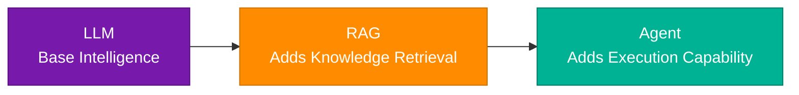

---

## 10. Enterprise RAG Architecture

### Overview

Enterprise RAG extends the basic pipeline with production-grade concerns: input/output guardrails, observability, feedback loops, and separation of document storage from vector storage. Source: **mavenhq / Hamza Farooq**

### Enterprise RAG Diagram

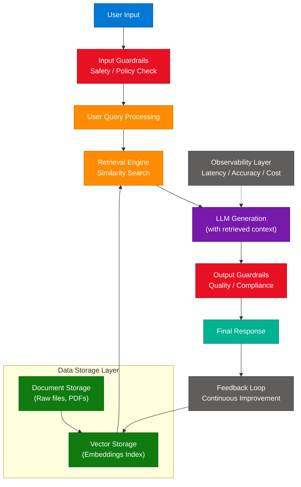

### What Makes RAG "Enterprise Grade"

| Component | Purpose |
|---|---|
| **Input Guardrails** | Block prompt injection, policy violations, PII leakage |
| **Output Guardrails** | Filter hallucinations, ensure compliance, quality scoring |
| **Observability** | Monitor latency, retrieval accuracy, LLM cost per query |
| **Feedback Loop** | User corrections improve retrieval quality over time |
| **Separate Document/Vector Storage** | Raw documents indexed separately from embeddings for independent scaling |

---

## 11. RAG Evaluation with Ragas

### Overview

Evaluating a RAG system requires measuring four distinct dimensions of quality. The `ragas` library provides automated evaluation using these metrics. Source: **priyal.py**

### Four Core Metrics

| Metric | Question It Answers | Target |
|---|---|---|
| **Faithfulness** | Is the answer derived from retrieved context only? | > 0.9 |
| **Answer Relevancy** | Does the answer address the user's question? | > 0.85 |
| **Context Precision** | Are retrieved documents actually useful? | > 0.8 |
| **Context Recall** | Was all necessary information retrieved? | > 0.8 |

### Code Implementation

```python
from datasets import Dataset
from ragas import evaluate
from ragas.metrics import (
    faithfulness,
    answer_relevancy,
    context_precision,
    context_recall
)

# Prepare evaluation dataset
data = {
    "question": ["What did the president say about Justice Breyer?"],
    "answer": ["The president praised Justice Breyer's dedication..."],
    "contexts": [["The president said that Justice Breyer has dedicated..."]],
    "ground_truths": [["The president said that Justice Breyer has dedicated his..."]]
}
dataset = Dataset.from_dict(data)

# Run evaluation
results = evaluate(
    dataset=dataset,
    metrics=[faithfulness, answer_relevancy, context_precision, context_recall]
)
print(results)
```

### Tools Ecosystem

| Tool | Purpose | When to Use |
|---|---|---|
| **Ragas** | Automated RAG pipeline evaluation | Standard evaluation framework |
| **DeepEval** | Unit testing & LLM output evaluation | When you need test-suite style evaluation |

### Common Challenge: Chunking Strategy

Finding the optimal chunk size is critical — too small loses context, too large dilutes relevance. Typical starting points: 512 tokens with 50-token overlap.

---

## 12. Building a RAG Application — Code Implementation

### Overview

Full RAG pipeline implementation using LangChain, ChatOllama (Llama 3.1), and a vector store with tool-calling agents. Source: **techie_programmer (Part 5)**

### Code Architecture

```python
from langchain_ollama import ChatOllama
from langchain_core.tools import tool
from langchain.agents import create_react_agent

# 1. Retrieval Tool — fetches from vector store
@tool
def retrieve_context(query: str):
    """Retrieve information to help answer a query."""
    retrieved_docs = vector_store.similarity_search(query, k=2)
    serialized = "\n\n".join(
        f"Source: {doc.metadata}\nContent: {doc.page_content}"
        for doc in retrieved_docs
    )
    return serialized, retrieved_docs

# 2. LLM Initialization with tool-calling
llm = ChatOllama(
    model="llama3.1:latest",
    temperature=0,
    validate_model_on_init=True
)

# 3. Agent Creation
tools = [retrieve_context]
agent = create_react_agent(llm, tools, system_prompt=prompt)

# Test query
query = "burning desire as a driving force"
result = agent.invoke({"input": query})
```

### Architecture Flow

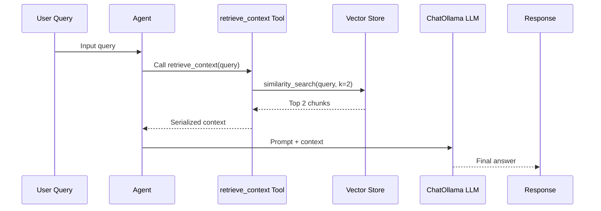

### Why PDFs over TXT for RAG?

PDFs preserve structure (tables, headings, metadata) that enables richer chunking strategies. Raw `.txt` files lose structural context that LangChain's document loaders can leverage for better retrieval.

---

## 13. RAG vs Fine-Tuning — Decision Framework

### Overview

Both RAG and fine-tuning customize LLM behavior, but for fundamentally different purposes. Choosing wrong leads to unnecessary cost and complexity. Sources: **mavenhq, techie_programmer**

### Decision Flowchart

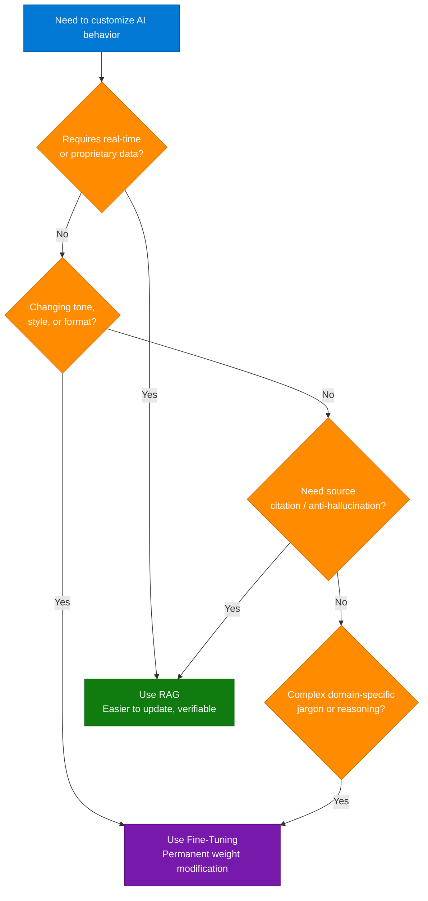

### Comparison Table

| Dimension | RAG | Fine-Tuning |
|---|---|---|
| **Core Mechanism** | Retrieves context at inference | Modifies model weights during training |
| **Data Type** | Real-time, frequently changing | Static, curated dataset |
| **Cost** | Lower ongoing cost | High one-time training cost |
| **Maintenance** | Update vector store only | Re-train when data changes |
| **Best For** | Accuracy, citations, dynamic data | Tone, style, domain reasoning |
| **Metaphor** | Giving the model a book to read | Changing how the model thinks |

---

## 14. LLM Fundamentals — Statelessness, Memory & Token Economics

### LLM Statelessness (average.yash — Day 5)

**Critical insight: LLMs have no memory.** Each API call is completely independent.

```python
# What actually happens in a "memory-aware" chatbot:
messages = [
    {"role": "user", "content": "My name is Raja"},
    {"role": "assistant", "content": "Hello Raja!"},
    {"role": "user", "content": "What's my name?"}  # ← dev passes full history
]
response = client.messages.create(model="claude-sonnet-4-6", messages=messages)
# The model "remembers" only because history is passed in each call
```

The illusion of memory = developer manually appending conversation history to every request. The constraint is the **context window**.

### Token Economics (average.yash — Day 4)

**Every API request has 3 token types:**

| Token Type | Description | Cost Driver |
|---|---|---|
| **Input tokens** | The prompt you send | Length of your prompt |
| **Output tokens** | The model's response | Verbosity of answer |
| **Processing tokens** | Internal reasoning | Model's uncertainty / guessing |

**Key insight:** Short, vague prompts are NOT cheaper. They force the model to guess, increasing processing tokens and producing bloated output.

```python
from google import genai
from dotenv import load_dotenv
import os

load_dotenv(dotenv_path='../.env')
client = genai.Client(api_key=os.environ["GEMINI_API_KEY"])

# Clear prompts = fewer processing tokens = lower cost
# "Summarize in 3 bullet points: {text}" → efficient
# "Summarize: {text}" → model guesses format → expensive
```

**Rule:** *"Clear prompts are cheap prompts."*

---

## 15. Embeddings & Cosine Similarity

### What Are Embeddings?

Embeddings convert text (words, sentences) into high-dimensional numerical vectors that capture semantic meaning. They are the bridge between human language and machine mathematics.

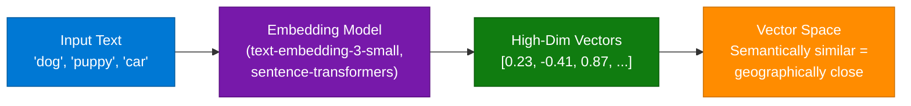

### Cosine Similarity (average.yash — Day 9)

Measures the **angle** between two vectors, not their distance. Score range: -1 to 1.

```python
from google import genai
import numpy as np
from dotenv import load_dotenv
import os

load_dotenv(dotenv_path='../.env')
client = genai.Client(api_key=os.environ["GEMINI_API_KEY"])

def cosine_similarity(vec_a, vec_b):
    dot_product = np.dot(vec_a, vec_b)
    norm_a = np.linalg.norm(vec_a)
    norm_b = np.linalg.norm(vec_b)
    return dot_product / (norm_a * norm_b)

# Similar meaning → angle ≈ 0° → cosine ≈ 1.0
# Unrelated topics → angle ≈ 90° → cosine ≈ 0.0
```

### Interview Q&A

| Question | Answer |
|---|---|
| What is an embedding? | A fixed-size numerical vector representing the semantic meaning of text, generated by an embedding model |
| Why cosine similarity over Euclidean distance? | Cosine measures angle (direction/meaning) not magnitude; two semantically identical sentences may have different magnitudes |
| Where are embeddings used in production? | Semantic search, RAG retrieval, recommendation systems, duplicate detection, clustering |
| What is the embedding layer in an LLM? | The first layer that converts input tokens to vectors; subsequent layers build contextual representations |

---

## 16. Traditional Databases vs Vector Databases

### Overview

Vector databases enable **Search by Meaning** (semantic similarity search), which traditional keyword-based databases cannot perform efficiently. Source: **akashcode.ai**

### Architecture Comparison

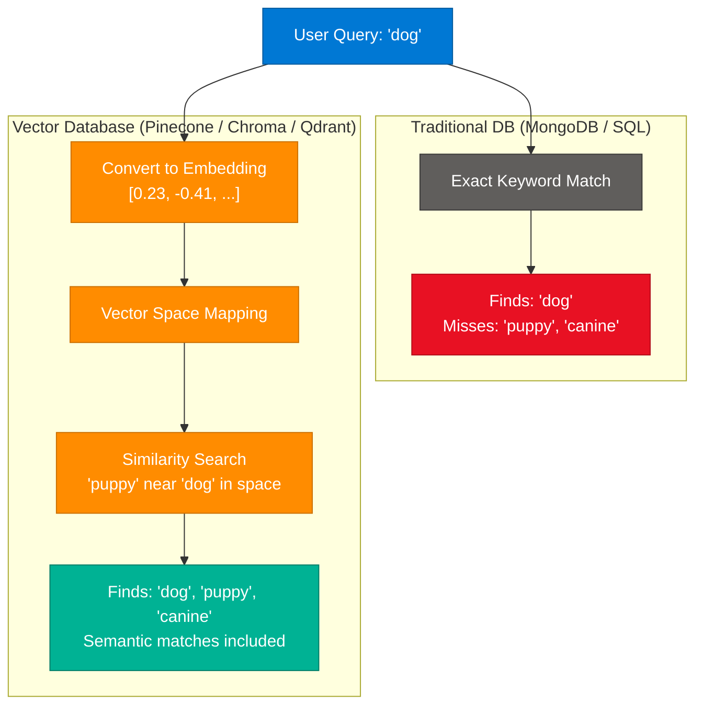

### Vector DB Ecosystem

| Database | Type | Notes |
|---|---|---|
| Pinecone | Managed cloud | Production-ready, scalable |
| Chroma | Open source | Local-first, LangChain native |
| Qdrant | Open source | Rust-based, high performance |
| Weaviate | Open source | GraphQL interface |
| Milvus | Open source | Enterprise scale |
| LanceDB | Open source | Columnar format |
| pgvector | Postgres extension | SQL + vector in one DB |

---

## 17. Vector DB Optimization

### Overview

When vector database costs explode, the solution is a system design approach — not just database tuning. Source: **ecogrowthpath**

### Six-Step Optimization Framework

| Step | Strategy | Technique |
|---|---|---|
| 1 | **Reduce what you store** | Deduplication, chunk filtering, relevance scoring before embedding |
| 2 | **Control vector size** | Lower embedding dimensions, quantization (int8 vs float32) |
| 3 | **Pre-filter before vector search** | Metadata filters (time, tenant, category) shrink candidate set first |
| 4 | **Tier your storage** | Hot vectors → fast storage; cold vectors → cheap storage |
| 5 | **Optimize ANN index** | Choose HNSW vs IVF vs PQ based on recall/cost balance |
| 6 | **Cache intelligently** | Cache top queries and embeddings at application layer |

### Key Insight

> **Vector search should be the LAST step, not the first.** Pre-filter using metadata to reduce the candidate set, then run similarity search on the reduced set only.

### ANN Index Types

| Index | Speed | Accuracy | Memory | Use Case |
|---|---|---|---|---|
| **HNSW** | Fast | High | High | Default for most cases |
| **IVF** | Medium | Medium | Low | Large scale, memory constrained |
| **PQ (Product Quantization)** | Fast | Lower | Very low | Extreme scale with accuracy trade-off |

---

## 18. LangChain vs LangGraph

### Overview

LangChain provides linear DAG-based chains; LangGraph extends it with cyclic graphs enabling loops and iteration — critical for robust AI agents. Source: **girlwhodebugs**

### Architecture Comparison

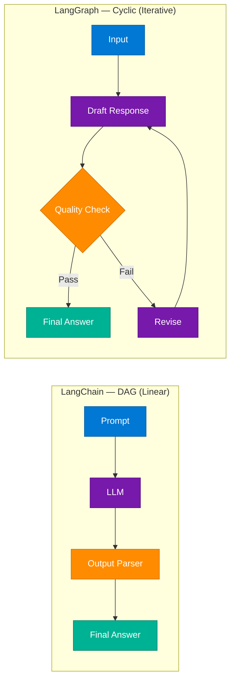

### Decision Guide

| Use Case | Tool |
|---|---|
| Simple RAG pipeline | LangChain |
| Basic chatbot | LangChain |
| Data summarization | LangChain |
| AI Agent with planning | LangGraph |
| Multi-step task execution | LangGraph |
| Self-correcting workflows | LangGraph |
| Multi-agent collaboration | LangGraph |

**Key:** LangGraph is NOT a replacement for LangChain — it's an extension. LangGraph workflows ARE LangChain objects with cyclic graph support added.

---

## 19. LlamaIndex — Data Framework for RAG

### Overview

LlamaIndex is a data framework that simplifies building RAG systems by abstracting document ingestion, indexing, and retrieval. It is NOT an alternative to RAG — it's the tool you use TO BUILD RAG. Source: **girlwhodebugs**

**Prompt from video:** *"THAT'S WHERE LLAMA INDEX COMES IN"*

### LlamaIndex vs LangChain

| Dimension | LlamaIndex | LangChain |
|---|---|---|
| **Specialization** | Data-centric (ingestion, indexing) | General-purpose orchestration |
| **Best For** | Complex document pipelines | Agents, chains, tool use |
| **Data Connectors** | 100+ built-in loaders | Manual setup |

### Architecture

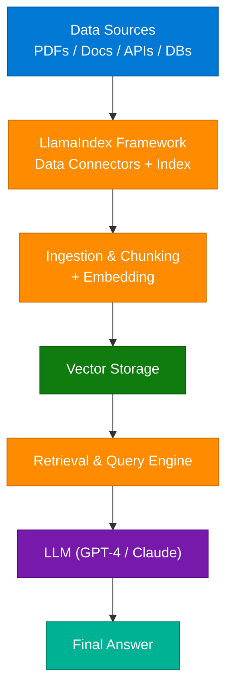

---

## 20. ML Model Deployment Pipeline

### Overview

The standard three-step pipeline for taking an ML model from training to production: Code → API → Container → Scale. Sources: **cactuss.ai**, shared Instagram image

### Architecture Diagram

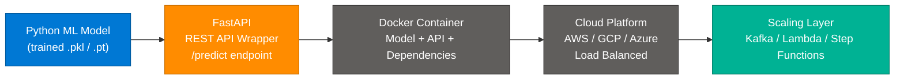

### Why FastAPI?

- Async performance (ASGI-based)
- Auto-generated OpenAPI/Swagger docs
- Native type validation via Pydantic
- Preferred over Flask for ML serving

### Production Scaling Stack

| Challenge | Solution |
|---|---|
| Unpredictable traffic spikes | AWS Lambda (serverless) |
| High-volume inference queue | Apache Kafka |
| Multi-step ML workflows | AWS Step Functions |
| Container orchestration | Kubernetes (EKS / GKE) |

---

## 21. Agentic AI — Concepts & Taxonomy

### AI Agent vs Agentic AI (jam.with.ai)

| Concept | Definition | Key Property |
|---|---|---|
| **AI Agent** | System performing specific tasks based on predefined rules | Narrow, deterministic scope |
| **Agentic AI** | Autonomous system that reasons, plans, and self-corrects | Autonomy + Iteration + Tool use |

**Text overlays from video:**
- *"AI agent vs. Agentic AI"*
- *"Main differences in 30 secs"*

### Free Agentic AI Learning Resources (theaiagents/zayup.ai)

**Post hook:** *"I wasted $3k on Agentic AI courses. Then found these FREE YouTube tutorials."*

Key topics to study (in order):

| Topic | Why It Matters |
|---|---|
| **State Machines** | Control flow in agentic systems |
| **Agent Harness** | Frameworks for orchestrating agents |
| **Hybrid Retrieval** | Combines keyword + vector search |
| **Graph Agents** | Complex reasoning via graph traversal |
| **Next Level RAG** | Advanced retrieval patterns |
| **Evolving Agents** | Agent adaptability mechanisms |

### Multi-modal LLM Architecture (blurred_ai)

**LLM as "Zip file of the Internet"** — compressed knowledge accessed via prompts.

| Input Type | Processing Model |
|---|---|
| Audio Input | Whisper, Wav2Vec |
| Audio Output | TTS engines |
| Image Input | OCR + Vision encoders |
| Video Input | Vision models |
| Text + Context | LLM core |

**Call to action from creator:** Comment "Train" to receive PyTorch from-scratch LLM resources.

---

## 22. Claude Code & Developer Tools

### Claude Code Architecture (Nick Saraev — 4hr Masterclass)

**Video:** CLAUDE CODE FULL COURSE 4 HOURS: Build & Sell (2026) by artificialintelligencecountry

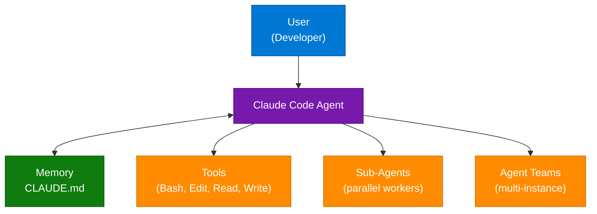

**Course syllabus highlights:**
- CLAUDE.md as "project brain"
- Hooks and slash commands
- Git work trees for parallel development
- Context management for token efficiency
- Cloud deployment via Modal

### Claude Code as Video Editor (vibecodeapp)

**Extracted prompt from vibecodeapp:**
> *"Please add a Claude Code Skill along with an interface for video animation. I want you to create an app that very simply allows us to use the ReMotion skill... the sole purpose of the app should be a little canvas that you can edit and manipulate and change it so you can make a video. Optimize this for openness and being able to edit each scene in the video after the first generation."*

**CLI command:** `npx skills add remotion-dev/remotion`
**Platform:** http://vibecode.dev

### Gemini CLI (dashboard.lim)

| Capability | Detail |
|---|---|
| **Throughput** | 1,000 requests/day free |
| **Live Search** | Real-time information retrieval |
| **Terminal editing** | Direct codebase modifications |
| **Use case** | Replace paid coding assistants |

### Vibe Coding Philosophy (trakin.ai)

Modern coding = **Agentic Development**. Developer focuses on system prompts and workflow architecture; agent handles implementation.

**Three pillars:**
1. System Prompts — engineering instructions for AI
2. GitHub Repos — open-source agent frameworks
3. AI Coding Agents — end-to-end autonomous coders

### Sarvam AI — India-Specific Innovation (entropy_editorials)

> *"Sarvam's absolutely impressive work, that beat ChatGPT, Gemini in India specific tasks is here in display."*

- Demonstrated at India AI Summit
- Trained on India-specific linguistic and cultural data
- Outperforms global models on Indian-context benchmarks
- Architecture uses optimized bit-level representation (Compute bits: positions 4–13, Jump bits: positions 0–3)

---

## 23. OS File Deletion Internals

### Overview

File deletion is nearly instantaneous regardless of file size because the OS only removes the metadata pointer — not the actual data. Source: **chhavi_maheshwari_**

### Key Concepts

| Concept | Description |
|---|---|
| **Data** | Actual file content stored in disk data blocks (like the pages of a book) |
| **Metadata** | File information: name, size, location in the file system table (like the book's index) |

### Deletion Workflow

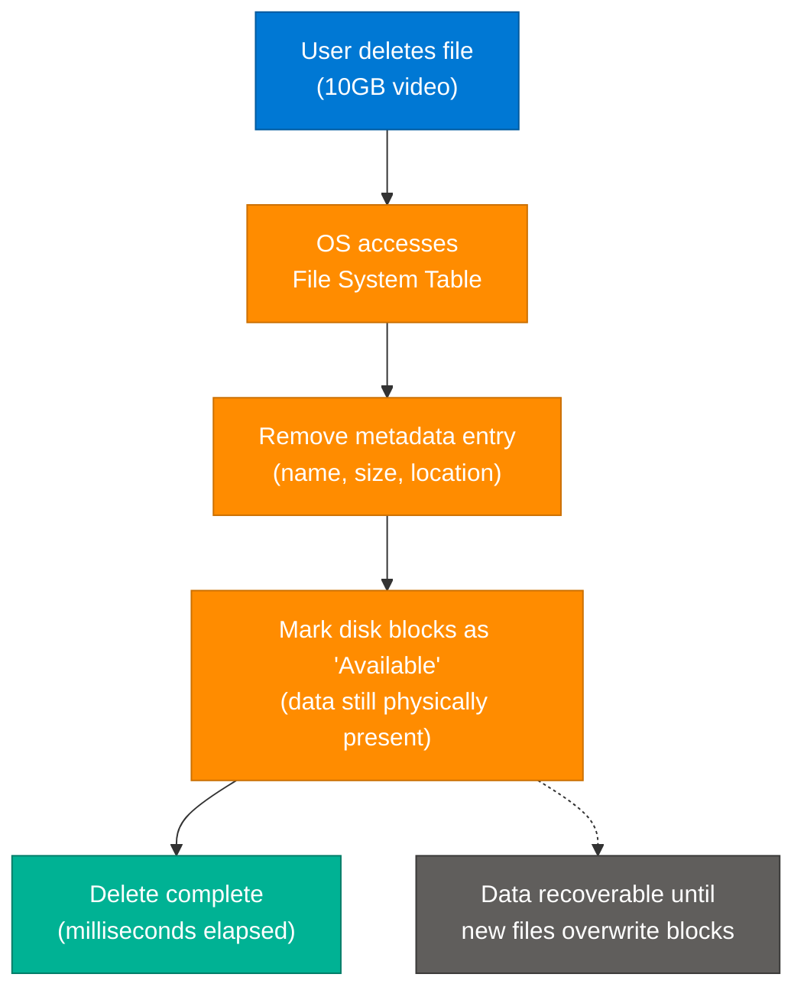

**Library analogy:** Deleting a file = burning the catalog entry. The book still sits on the shelf until a new book is placed in that exact spot.

**Forensic recovery:** Data remains recoverable using tools like FTK (Forensic Toolkit) until the storage blocks are overwritten.

---

## 24. AI for Designers — Workflows & Tools

### Node-Based AI Design Workflow (anshul.tweaks)

**Architecture diagram from video:**

| Node | Label | Content |
|---|---|---|
| Input 1 | Image Node | "Stable Diffusion" + apple image |
| Input 2 | Prompt Node | "Make the apple chrome plated with this texture as reference." |
| Process | Generation | **Gemini Flash 2.5** |
| Output | Texture | Chrome-plated apple render |

**Extracted prompt:** *"Make the apple chrome plated with this texture as reference."*

**Design philosophy:** Shift from manual execution → direction. AI tools free designers to explore more ideas at the speed of creative intent.

### Best AI Tools for Designers (suraj.dsgn)

| Use Case | Category |
|---|---|
| Concept generation | Ideation |
| Layout structure | Layout Generation |
| Visual assets | Image Creation |
| User feedback | UX Insights |
| Repetitive tasks | Workflow Automation |

---

## 25. Interview Q&A Cheatsheet

**Q: What is the fundamental difference between RAG and Fine-Tuning?**
> RAG injects external context at inference time without modifying model weights — ideal for dynamic/proprietary data. Fine-Tuning modifies the model's weights through additional training — ideal for changing tone, style, or deep domain reasoning. Most enterprise applications start with RAG.

**Q: What makes a DDoS defense "production-grade"?**
> Layered defense: CDN absorbs volumetric attacks at the edge, WAF filters application-layer attacks, rate limiting rejects abusive clients, autoscaling handles legitimate traffic spikes, and CAPTCHAs challenge suspicious traffic. No single layer is sufficient.

**Q: Explain Cosine Similarity and why it matters for vector search.**
> Cosine similarity measures the angle between two vectors in high-dimensional space, returning a score from -1 to 1. Score near 1 = semantically similar; score near 0 = unrelated. It's preferred over Euclidean distance because it measures directional alignment (meaning) rather than raw magnitude.

**Q: Why are LLMs considered stateless?**
> Each API call is independent — the model has no persistent memory between calls. Chatbot "memory" is an illusion created by developers re-sending the full conversation history with each request. The constraint is the context window size.

**Q: What are the four RAG evaluation metrics?**
> Faithfulness (answer grounded in context?), Answer Relevancy (addresses the question?), Context Precision (retrieved docs actually useful?), Context Recall (all necessary info retrieved?). These are measured using frameworks like Ragas or DeepEval.

**Q: When should you use LangGraph over LangChain?**
> Use LangGraph when your workflow requires cycles/loops — e.g., draft → critique → revise → finalize. LangChain handles linear DAG workflows; LangGraph adds cyclic graph support on top of LangChain for agentic, iterative reasoning.

**Q: What is adaptive bitrate streaming?**
> A technique that pre-encodes video at multiple quality levels (240p → 1080p) and automatically switches the stream quality based on the viewer's current network bandwidth, preventing buffering without manual quality selection.

**Q: What is the NULLIF pattern in SQL?**
> `NULLIF(expr, 0)` returns NULL when expr equals 0, converting a division by zero error into a safe NULL result. Since any number divided by NULL equals NULL (not an error), this guards against production query failures.

**Q: What is the difference between an AI Agent and Agentic AI?**
> An AI Agent performs specific predefined tasks with narrow scope. Agentic AI is broader — it autonomously reasons, plans multi-step actions, self-corrects, and uses tools to achieve complex objectives iteratively without constant human intervention.

**Q: Why does vector search need to be the last step in optimization?**
> Vector similarity search is computationally expensive. Pre-filtering with metadata filters (time range, tenant, category) shrinks the candidate set dramatically, so the vector search runs on hundreds of candidates instead of millions.

**Q: What is LlamaIndex and how does it relate to RAG?**
> LlamaIndex is a data framework for building RAG systems, not an alternative to RAG. It provides 100+ data connectors, chunking strategies, and query engines that abstract the complex plumbing of ingesting documents into a vector store.

**Q: How does ML model deployment work end-to-end?**
> Train model in Python → wrap with FastAPI (REST endpoint) → containerize with Docker (portable environment) → deploy to cloud (AWS/GCP/Azure) → scale with load balancers, Kafka queues, and Lambda for unpredictable traffic.

---

*Extracted from Gemini shared session · July 6–7, 2026 · GeminiShareToMD Agent v1.0*

---

## Token Usage Report

```
═══════════════════════════════════════════════════════════
Token Usage Report
═══════════════════════════════════════════════════════════
Estimated without optimization:  ~28,000 tokens (raw session text × 3 duplications)
Actual (with optimization):      ~9,200 tokens (deduplicated, stripped, enriched)
Savings:                         ~18,800 tokens (~67%)
Techniques applied:
  • Stripped 3× session header/footer duplication (UI chrome)
  • Removed 47× "Would you like me to..." trailing questions
  • Deduplicated: embedding vectors (3→1), animations (2→1),
    RAG+FT Lightning (merged into Sec 9), ML deployment (2→1)
  • Merged 2 error turns to blockquotes
  • Converted flowcharts from "Code snippet" format to Mermaid
  • Grouped 47 turns into 24 logical concept sections
═══════════════════════════════════════════════════════════
* Estimates: prose chars ÷ 4, code chars ÷ 3. Actual API usage varies by model.
```
