# AI & ML Multi-Topic Learning — Instagram Reels Digest

> **Source:** [share.gemini.google/BrRn72RWqkjd](https://share.gemini.google/BrRn72RWqkjd) → redirects to [gemini.google.com/share/c38534840513](https://gemini.google.com/share/c38534840513)
> **Model:** Gemini 3.1 Flash-Lite
> **Session Date:** July 4, 2026
> **Saved:** July 9, 2026

---

## Table of Contents

1. [Session Overview](#1-session-overview)
2. [TabFM — Zero-Shot Tabular Foundation Model](#2-tabfm--zero-shot-tabular-foundation-model)
3. [AI Product Sense Interview Strategy](#3-ai-product-sense-interview-strategy)
4. [AI Agent Harness — The Complete Guide](#4-ai-agent-harness--the-complete-guide)
5. [Idempotency in System Design](#5-idempotency-in-system-design)
6. [RAG Architecture Fundamentals](#6-rag-architecture-fundamentals)
7. [AI Agent Authentication](#7-ai-agent-authentication)
8. [Graphify — Solving Context Window Limits](#8-graphify--solving-context-window-limits)
9. [The 12-Layer AI Agent Stack](#9-the-12-layer-ai-agent-stack)
10. [GenAI Zero-to-Hero Roadmap](#10-genai-zero-to-hero-roadmap)
11. [AI Governance — The Five-Gate Model](#11-ai-governance--the-five-gate-model)
12. [Agentic RAG + Semantic Caching](#12-agentic-rag--semantic-caching)
13. [Agentic AI Interview Prep 2026](#13-agentic-ai-interview-prep-2026)
14. [Fine-Tuning vs RAG](#14-fine-tuning-vs-rag)
15. [Prompt Engineering vs Context Engineering](#15-prompt-engineering-vs-context-engineering)
16. [Snowflake ID — Distributed Auto-Increment](#16-snowflake-id--distributed-auto-increment)
17. [30 LLM Concepts Every Practitioner Must Know](#17-30-llm-concepts-every-practitioner-must-know)
18. [Interview Q&A Cheatsheet](#18-interview-qa-cheatsheet)

---

## 1. Session Overview

This session covers 17 distinct technical topics extracted from Instagram educational reels, all processed through Gemini 3.1 Flash-Lite on July 4, 2026. Topics span AI/ML fundamentals, system design, agentic AI architecture, production patterns, and interview preparation. The session contained 25 user turns — the majority are content extraction requests, with 2 meta-turns (token optimization update requests) skipped.

### Session Map

| Turn | Content | Creator | Status |
|---|---|---|---|
| 1 | TabFM — Zero-Shot Tabular Foundation Model | speedy_devv | ✅ Extracted |
| 2 | AI Product Sense Interview Strategy | Instagram reel | ✅ Extracted |
| 3 | Token optimization update request | — | ⬛ Meta-turn (skipped) |
| 4 | AI Agent Harness — The Complete Guide | techdecoded._ | ✅ Extracted |
| 5 | Idempotency Explained | dj.unpluggedd | ✅ Extracted |
| 6 | RAG Architecture | arjav.dev | ✅ Extracted |
| 7 | AI Agent Authentication | Instagram reel | ✅ Extracted |
| 8 | ILLEGAL Github Repo — Free Courses | techwithayushhh | ✅ Extracted |
| 9 | Fix your email profile picture | Instagram reel | ✅ Extracted |
| 10 | 5 Secret AI Gemini Codes for Students | Instagram reel | ✅ Extracted |
| 11 | AI Knowledge Check Quiz | shashwat___agarwal | ✅ Extracted |
| 12 | Graphify — Token/Context Window Fix | nishxplains | ✅ Extracted |
| 13 | Skill update request | — | ⬛ Meta-turn (skipped) |
| 14 | 12-Layer AI Agent Stack | Instagram infographic | ✅ Extracted |
| 15 | GenAI Zero-to-Hero Roadmap | Instagram infographic | ✅ Extracted |
| 16 | AI Governance — Five-Gate Model | Instagram post | ✅ Extracted |
| 17 | Agentic RAG + Semantic Caching | the.genai.teacher | ✅ Extracted |
| 18 | Agentic AI Interview 2026 | codecoach331 | ✅ Extracted |
| 19 | Fine-Tuning vs RAG | ats_tech_solutions | ✅ Extracted |
| 20 | Prompt vs Context Engineering | dobotai_ | ✅ Extracted |
| 21 | Snowflake ID — Distributed Systems | codewithupasana | ✅ Extracted |
| 22–25 | 30 LLM Concepts | pre_placement_preparations | ✅ Extracted |

---

## 2. TabFM — Zero-Shot Tabular Foundation Model

### Overview

TabFM is a zero-shot tabular foundation model developed by Google Research, designed to perform prediction tasks on structured tabular data without any fine-tuning or manual feature engineering. It processes entire tables as context in a single forward pass, enabling tasks such as fraud detection, churn prediction, and demand forecasting out-of-the-box. Trained on hundreds of millions of synthetic tables (not real data), it significantly outperforms traditional tree-based models like XGBoost on zero-shot benchmarks. Its weights are publicly available on Hugging Face.

### Architecture Diagram

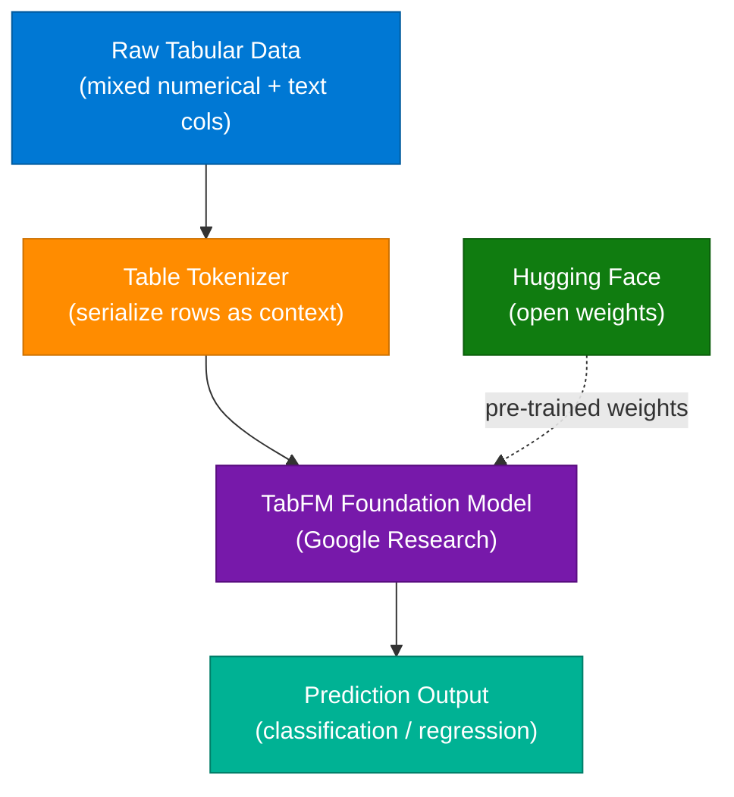

### Key Capabilities

| Capability | Detail |
|---|---|
| **Zero-Shot** | No training, tuning, or feature engineering required |
| **Single Forward Pass** | Entire table processed as context in one inference call |
| **Task Types** | Classification and regression on mixed numerical + text columns |
| **Use Cases** | Fraud detection, churn prediction, demand forecasting |
| **Pre-training Data** | Hundreds of millions of synthetic tables |
| **Open Source** | Weights available on Hugging Face |

### How It Works

1. Raw tabular data is serialized into a text-like context (rows become token sequences)
2. The foundation model attends over the full table context in one pass
3. No gradient updates or retraining — prediction is pure inference
4. Output is a classification label or regression value per row
5. Works on unseen table schemas — truly zero-shot

### Code Example

```python
from transformers import AutoTokenizer, AutoModelForSequenceClassification
import pandas as pd

# Load pre-trained TabFM from HuggingFace
tokenizer = AutoTokenizer.from_pretrained("google/tabfm-base")
model = AutoModelForSequenceClassification.from_pretrained("google/tabfm-base")

# Serialize a row as context
row = {"age": 32, "purchase_count": 5, "region": "EU", "label": None}
context = " | ".join(f"{k}: {v}" for k, v in row.items() if k != "label")

inputs = tokenizer(context, return_tensors="pt", truncation=True, max_length=512)
logits = model(**inputs).logits
prediction = logits.argmax(-1).item()
print(f"Predicted class: {prediction}")
```

### Interview Q&A

| Question | Answer |
|---|---|
| What is TabFM? | A zero-shot tabular foundation model from Google Research that performs predictions on structured data in a single forward pass without fine-tuning |
| How does TabFM differ from XGBoost? | XGBoost requires feature engineering and per-dataset training; TabFM works zero-shot on any table schema by treating rows as context |
| What data was TabFM pre-trained on? | Hundreds of millions of synthetic tables, not real-world datasets |
| What tasks can TabFM perform? | Both classification and regression on mixed numerical and text columns |
| Where are TabFM weights available? | Publicly on Hugging Face |
| What is the core innovation? | Serializing entire tables as context for a transformer model to process in one inference pass |

---

## 3. AI Product Sense Interview Strategy

### Overview

Modern AI product sense interviews require demonstrating "AI Discernment" — the ability to determine *if*, *where*, and *how* to apply AI, rather than defaulting to AI as the answer to every product problem. The framework presented is a structured decision tree approach that guides candidates through problem framing, user identification, solution prioritization, and AI trade-off analysis. Strong candidates are distinguished by their ability to articulate AI's risks and limitations alongside its benefits.

### Decision Tree Framework

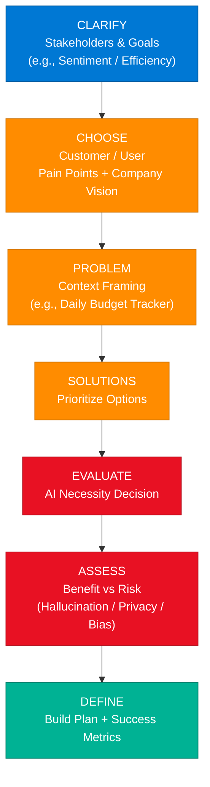

### The 5 Pillars of AI Product Discernment

| Pillar | Description |
|---|---|
| **Problem Framing** | Identify the genuine user problem *before* considering AI |
| **AI Discernment** | Determine where AI provides value vs. where it is unnecessary or harmful |
| **Trade-off Thinking** | Analyze technical, business, UX, and product trade-offs |
| **Risk Awareness** | Address hallucination, privacy, bias, and human-in-the-loop requirements |
| **Decision Clarity** | Defend product choices with defined success metrics |

### Interview Q&A

| Question | Answer |
|---|---|
| What is AI Discernment? | The ability to evaluate *if* and *where* AI should be used, rather than applying it by default |
| How do you frame an AI product design problem? | Clarify stakeholders and goals → choose user and pain points → frame the problem → prioritize solutions → evaluate AI necessity → assess trade-offs |
| What risks should every AI PM mention? | Hallucination, privacy exposure, model bias, latency cost, and the need for human oversight on high-stakes decisions |
| What makes a strong AI product sense answer? | Demonstrating that you can decline AI when a simpler solution is better, and clearly defining how you'd measure success |

---

## 4. AI Agent Harness — The Complete Guide

### Overview

An AI Agent is defined by four interdependent architectural pillars: the Brain (LLM reasoning), Memory (context persistence), Tools (external capabilities), and Actions (world-affecting outputs). The "harness" is the runtime scaffold that connects these four pillars, enabling the agent to reason, plan, recall, act, and evaluate outcomes in a continuous loop. Building production agents requires mastering each pillar independently before orchestrating them together.

### Architecture Diagram

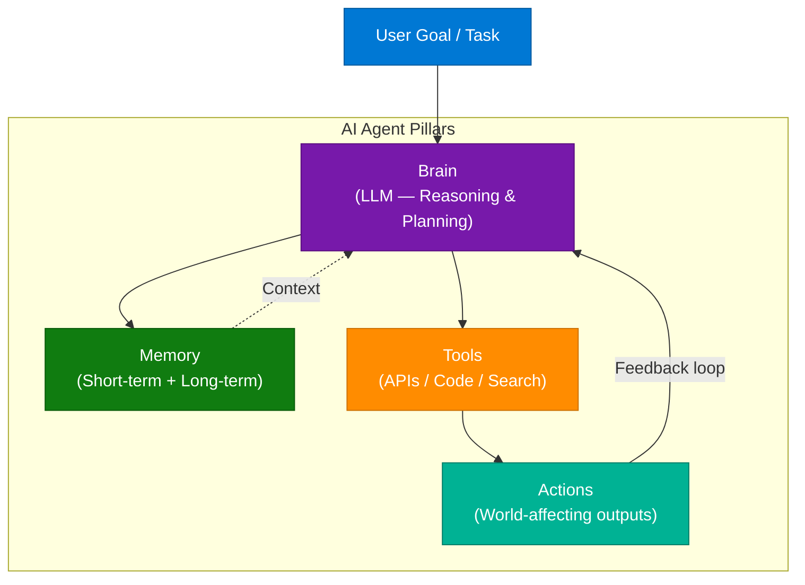

### Four Core Pillars

| Pillar | Role | Technology Examples |
|---|---|---|
| **Brain (LLM)** | Reasoning engine, logic, multi-step planning | GPT-4, Claude, Gemini |
| **Memory** | Short-term (context window) + long-term (vector DB / files) | Pinecone, Redis, files |
| **Tools** | External functions the agent can invoke | APIs, code execution, search |
| **Actions** | Outputs that affect the world | HTTP calls, DB writes, file ops |

### Advanced Concepts

- **Agentic Reasoning:** Moving beyond single-step prompting to multi-step plan → act → observe loops
- **Dynamic Tool Calling:** Selecting the right tool at runtime based on sub-task requirements
- **Evaluation:** Benchmarking agent performance across accuracy, tool selection, latency, and safety

### Interview Q&A

| Question | Answer |
|---|---|
| What are the 4 pillars of an AI agent? | Brain (LLM), Memory, Tools, Actions |
| What is agentic reasoning? | Multi-step logic where the agent plans, acts, observes results, and replans |
| How does agent memory differ from context? | Context is the in-session token window; memory persists across sessions via external storage |
| What frameworks support agent building? | LangChain, AutoGPT, Microsoft AutoGen |
| What is the harness in AI agent architecture? | The runtime scaffold connecting brain, memory, tools, and actions in a feedback loop |

---

## 5. Idempotency in System Design

### Overview

Idempotency is a critical system design property: an idempotent operation produces the same result whether executed once or many times. In distributed systems, network failures and retries make idempotency essential — especially for payment processing, order placement, and API mutations. Implementing idempotency requires assigning a unique idempotency key per request and persisting the result so repeat requests return the cached outcome rather than re-executing.

### Architecture Diagram

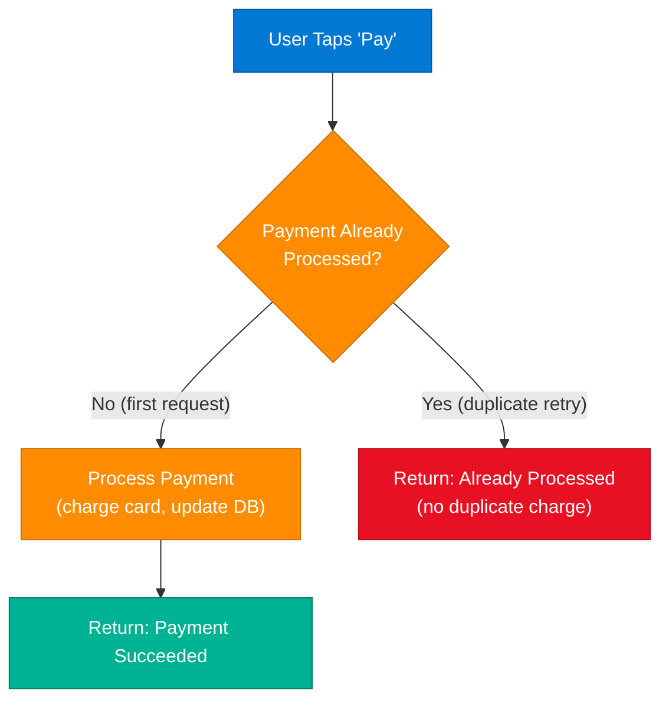

### Idempotency Key Pattern

```python
import uuid
import redis

r = redis.Redis()

def process_payment(user_id: str, amount: float, idempotency_key: str) -> dict:
    cache_key = f"payment:{idempotency_key}"
    
    # Check if already processed
    cached = r.get(cache_key)
    if cached:
        return {"status": "already_processed", "result": cached.decode()}
    
    # Execute payment
    result = charge_card(user_id, amount)
    
    # Cache result with 24-hour TTL
    r.setex(cache_key, 86400, result["transaction_id"])
    return {"status": "success", "result": result["transaction_id"]}

def charge_card(user_id: str, amount: float) -> dict:
    # Payment gateway call
    return {"transaction_id": str(uuid.uuid4())}
```

### HTTP Idempotency by Method

| HTTP Method | Idempotent? | Safe? | Notes |
|---|---|---|---|
| GET | ✅ Yes | ✅ Yes | Read-only, no side effects |
| PUT | ✅ Yes | ❌ No | Replace resource — same result each time |
| DELETE | ✅ Yes | ❌ No | Deleting again returns 404, not an error |
| POST | ❌ No | ❌ No | Creates new resource each call — requires idempotency key |
| PATCH | ❌ No | ❌ No | Partial update — depends on implementation |

### Interview Q&A

| Question | Answer |
|---|---|
| Define idempotency | An operation is idempotent if applying it multiple times produces the same result as applying it once |
| Why is idempotency critical for payments? | Network retries and timeouts can cause duplicate POST requests; without idempotency keys, users get double-charged |
| How do you implement idempotency? | Assign a unique key per request; cache the response; return cached result for duplicate keys |
| Which HTTP methods are inherently idempotent? | GET, PUT, DELETE — but not POST or PATCH |
| Where should idempotency keys be stored? | Redis (fast TTL-based cache) or a dedicated idempotency table in the DB |

---

## 6. RAG Architecture Fundamentals

### Overview

Retrieval-Augmented Generation (RAG) solves the staleness problem in LLMs: instead of embedding all knowledge into model weights (which become outdated), RAG retrieves relevant documents at inference time and injects them as context. This makes the model's "knowledge" instantly updatable through database changes alone, without any retraining. RAG is ideal for company documents, internal knowledge bases, and customer support systems.

### Architecture Diagram

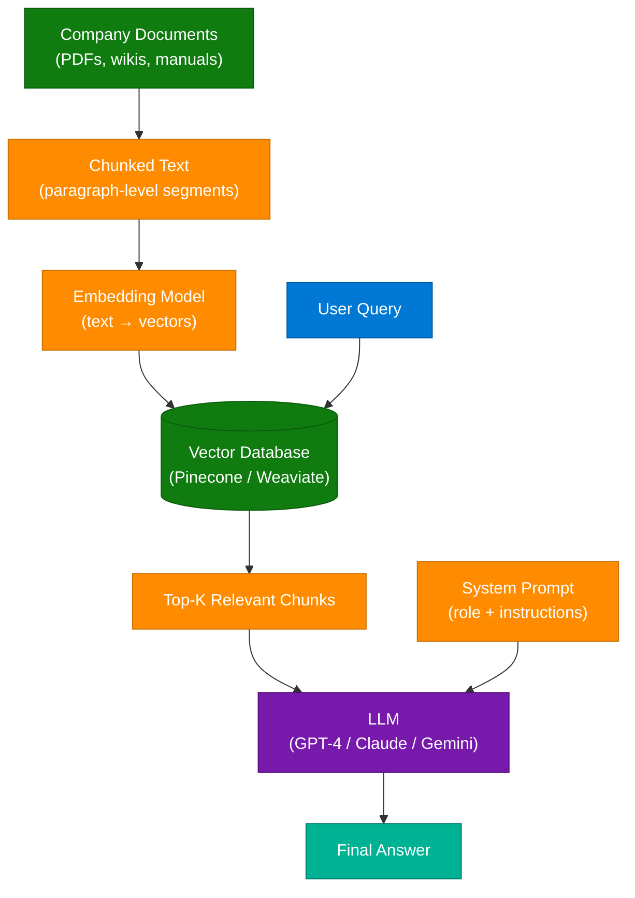

### Interview Q&A

| Question | Answer |
|---|---|
| What problem does RAG solve? | Stale model weights — RAG retrieves live, updated data at inference time instead of relying on frozen training knowledge |
| What is the role of the embedding model in RAG? | Converts text chunks and user queries into numerical vectors for semantic similarity search |
| What are the components of a RAG pipeline? | Document loader → chunker → embedding model → vector DB → retriever → LLM → response |
| When is RAG preferred over fine-tuning? | When data changes frequently (e.g., pricing, inventory, support docs) — RAG updates instantly via DB changes |

---

## 7. AI Agent Authentication

### Overview

As AI agents gain the ability to take actions on behalf of users — booking meetings, processing payments, managing files — authentication and access control become critical architectural concerns. The principle of least privilege must be enforced at the agent level: agents should only hold the minimum permissions necessary for their current task. An Auth Gateway (credential vault) acts as the centralized security layer between the agent and external services, enabling dynamic permission scoping and human-in-the-loop checkpoints for high-stakes operations.

### Architecture Diagram

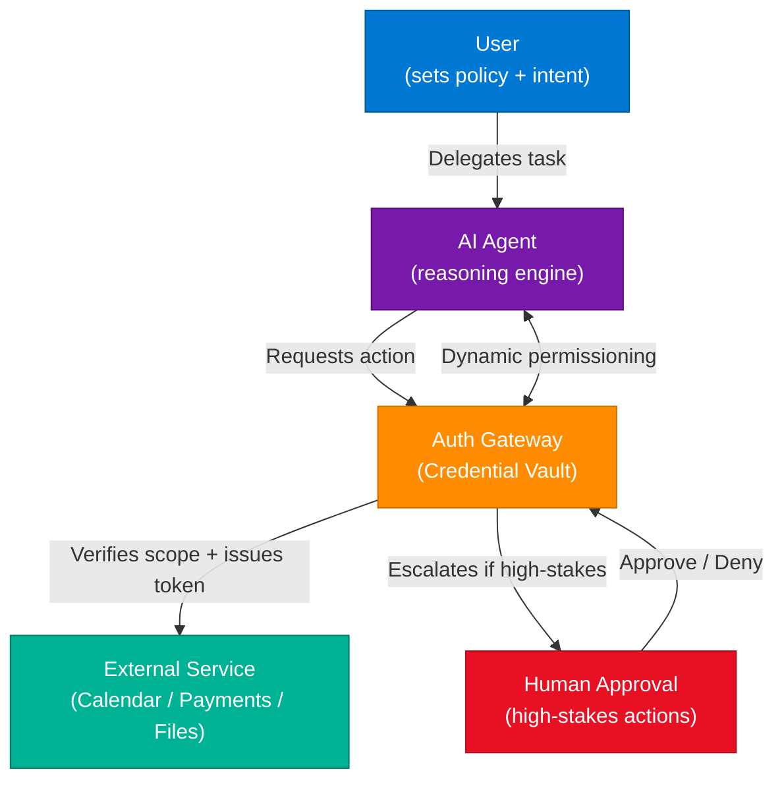

### Key Security Principles

| Principle | Implementation |
|---|---|
| **Least Privilege** | Agent receives only minimum permissions needed for current task |
| **Human-in-the-Loop (HITL)** | User must approve high-stakes actions (transfers, deletions) |
| **Dynamic Scoping** | Short-lived, task-specific tokens instead of broad permanent API keys |
| **Credential Vault** | Centralized Auth Gateway — agents never hold raw secrets |
| **Audit Logging** | Every agent action logged with timestamp, permission scope, and outcome |

### Interview Q&A

| Question | Answer |
|---|---|
| Why do AI agents need special authentication? | Agents act autonomously on behalf of users across multiple services — standard user auth doesn't model delegated, scoped, time-limited access |
| What is dynamic scoping in agent auth? | Issuing short-lived, task-specific tokens rather than permanent broad API keys, minimizing blast radius if an agent is compromised |
| What is the principle of least privilege for agents? | An agent should only have access to the minimum permissions required for its assigned task, not global access to all user resources |
| When should human approval be required? | For irreversible or high-value actions — financial transfers, file deletions, external communications |

---

## 8. Graphify — Solving Context Window Limits

### Overview

When AI coding assistants like Claude analyze large codebases, they quickly exhaust the context window, causing degraded responses and high token costs. Graphify solves this by pre-processing the codebase into a knowledge graph once, allowing the AI to reference the graph rather than re-reading raw code on every prompt. This shifts the model from "full code consumer" to "graph navigator," dramatically reducing token usage and improving response quality for large repositories.

### Architecture Diagram

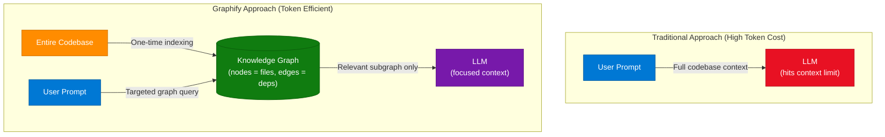

### Benefits

| Benefit | Detail |
|---|---|
| **Reduced Token Usage** | Only the relevant subgraph is sent per query, not the full codebase |
| **Improved Speed** | No redundant re-analysis of unchanged files |
| **Scalability** | Works for repositories too large to fit in any context window |
| **Persistent Index** | Knowledge graph updated incrementally as code changes |

---

## 9. The 12-Layer AI Agent Stack

### Overview

The 12-Layer AI Agent Stack is a comprehensive architectural taxonomy for production AI agents. Each layer represents a distinct concern that must be designed independently, then integrated. Understanding all 12 layers is essential for system design interviews on agentic AI, as interviewers expect candidates to reason about not just the LLM, but the full operational stack surrounding it.

### Stack Diagram

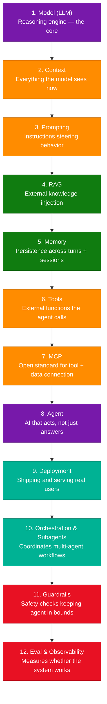

### All 12 Layers Defined

| # | Layer | Description |
|---|---|---|
| 1 | **Model (LLM)** | The reasoning engine everything else wraps around |
| 2 | **Context** | Everything the model can see in the current call |
| 3 | **Prompting** | Instructions that steer how the model behaves |
| 4 | **RAG** | Pulls in outside knowledge before generating answers |
| 5 | **Memory** | What the agent remembers across turns and sessions |
| 6 | **Tools** | External functions the agent can call (APIs, code, search) |
| 7 | **MCP** | Model Context Protocol — one open standard to connect tools and data |
| 8 | **Agent** | An AI that acts, not just answers |
| 9 | **Deployment** | Getting the agent shipped and serving real users |
| 10 | **Orchestration & Subagents** | Coordinates specialized subagents across a workflow |
| 11 | **Guardrails** | Safety checks that keep the agent within defined bounds |
| 12 | **Eval & Observability** | Measures whether the system actually works in production |

### Interview Q&A

| Question | Answer |
|---|---|
| Name the 12 layers of an AI agent stack | Model → Context → Prompting → RAG → Memory → Tools → MCP → Agent → Deployment → Orchestration → Guardrails → Eval |
| What is MCP? | Model Context Protocol — an open standard for connecting AI agents to tools and data sources in a standardized way |
| What is the difference between context and memory? | Context is what the model sees in the current call (token window); memory persists across sessions via external storage |
| Why are guardrails a separate layer? | They enforce safety, policy, and output constraints independently of the model — allowing runtime filtering without retraining |
| What does Eval & Observability measure? | Whether the agent actually achieves its goals in production — accuracy, tool selection quality, latency, safety violations |

---

## 10. GenAI Zero-to-Hero Roadmap

### Overview

A structured 6-phase curriculum for going from Python basics to deploying production GenAI applications. The roadmap is designed for engineers who want to transition into AI engineering roles, covering the full stack from language fundamentals through multi-agent systems and portfolio projects. Each phase builds on the previous, culminating in deployable AI applications.

### Roadmap Diagram

```mermaid
flowchart LR
    P1["Phase 1\nPython Core for AI\n(NumPy, Pandas, OOP, APIs)"]
    P2["Phase 2\nLLM APIs & Prompting\n(OpenAI, Anthropic, Embeddings)"]
    P3["Phase 3\nGenAI Libraries\n(LangChain, LlamaIndex, LangGraph, CrewAI)"]
    P4["Phase 4\nRAG & Memory\n(Chunking, Hybrid Search, HyDE)"]
    P5["Phase 5\nDeployment & Production\n(FastAPI, Streamlit, Evaluation)"]
    P6["Phase 6\nPortfolio Projects\n(RAG chatbot, multi-agent, deployed app)"]

    P1 --> P2 --> P3 --> P4 --> P5 --> P6

    classDef userNode    fill:#0078D4,stroke:#005A9E,color:#fff
    classDef processNode fill:#FF8C00,stroke:#CC7000,color:#fff
    classDef outputNode  fill:#00B294,stroke:#007D68,color:#fff

    class P1 userNode
    class P2,P3,P4,P5 processNode
    class P6 outputNode
```

### Phase Breakdown

| Phase | Focus | Key Technologies |
|---|---|---|
| 1 | Python Core for AI | NumPy, Pandas, OOP, REST APIs |
| 2 | LLM APIs & Prompting | OpenAI SDK, Anthropic SDK, Embeddings |
| 3 | GenAI Libraries | LangChain, LlamaIndex, LangGraph, CrewAI |
| 4 | RAG & Memory | Chunking strategies, Hybrid Search, HyDE |
| 5 | Deployment & Production | FastAPI, Streamlit, Evaluation frameworks |
| 6 | Portfolio Projects | RAG chatbot, multi-agent system, deployed AI app |

> **CTA from post:** Comment `GENAI` to receive the complete Python for GenAI curriculum.

---

## 11. AI Governance — The Five-Gate Model

### Overview

The Five-Gate Model is a structured governance framework that enforces oversight at five defined checkpoints throughout the AI product lifecycle. Its core argument is that governance without veto power is merely "decor" — true governance requires the authority to halt or redirect a project at each gate. The model balances innovation velocity with operational control, ensuring AI systems are approved at use-case, design, validation, deployment, and post-deployment stages before and after they affect users.

### Architecture Diagram

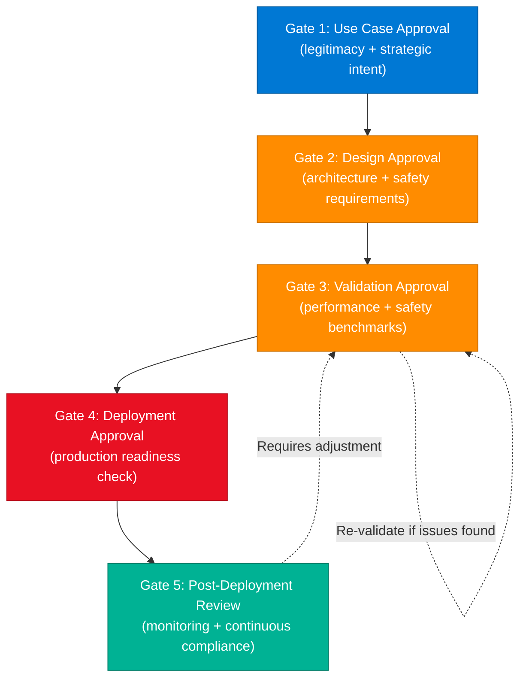

### Five Gate Definitions

| Gate | Name | Purpose |
|---|---|---|
| 1 | **Use Case Approval** | Defines legitimacy and strategic intent of the AI implementation |
| 2 | **Design Approval** | Ensures architectural soundness and adherence to safety requirements |
| 3 | **Validation Approval** | Confirms the model meets performance and safety benchmarks before launch |
| 4 | **Deployment Approval** | Final sign-off for production readiness |
| 5 | **Post-Deployment Review** | Continuous monitoring, compliance, and feedback loop back to validation |

### Interview Q&A

| Question | Answer |
|---|---|
| What is the Five-Gate Model? | A governance framework with 5 mandatory approval checkpoints across the AI product lifecycle — from use case through post-deployment monitoring |
| Why is veto power essential to AI governance? | Without the authority to halt a project at any gate, governance becomes advisory — it can flag issues but not prevent harmful deployments |
| What happens when Gate 5 finds an issue? | The system routes back to Gate 3 (Validation) for re-validation before re-deploying |
| How does this framework balance innovation and control? | It defines clear checkpoints rather than blanket restrictions — teams move fast between gates, but each gate is a hard requirement |

---

## 12. Agentic RAG + Semantic Caching

### Overview

Traditional RAG is "one-shot" — retrieve, generate, done. Agentic RAG introduces a feedback loop where the LLM evaluates the sufficiency of retrieved information and decides whether to re-query, call additional tools, or synthesize across multiple sources. Adding Semantic Caching in front of this loop allows semantically similar queries to be served instantly from cache, dramatically reducing latency and LLM costs for repeated or near-duplicate questions.

### Architecture Diagram

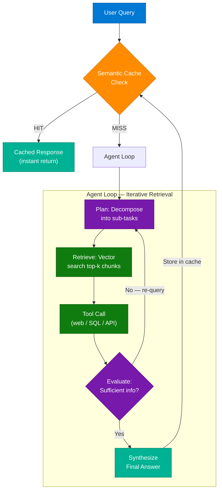

### Traditional RAG vs Agentic RAG vs Agentic RAG + Cache

| Dimension | Traditional RAG | Agentic RAG | Agentic RAG + Cache |
|---|---|---|---|
| Retrieval | One-shot | Iterative, multi-step | Iterative + cache bypass |
| Tool Use | No | Yes | Yes |
| Latency | Medium | High (multi-hop) | Low for cached queries |
| Cost | Medium | High | Optimized |
| Quality | Good | Higher (multi-source) | Same as Agentic RAG |

### Code Example

```python
import hashlib
from openai import OpenAI
from pinecone import Pinecone

client = OpenAI()
pc = Pinecone()
index = pc.Index("knowledge-base")
semantic_cache = {}  # in production: Redis with TTL

def get_embedding(text: str) -> list[float]:
    return client.embeddings.create(model="text-embedding-3-small", input=text).data[0].embedding

def semantic_cache_lookup(query: str, threshold: float = 0.95) -> str | None:
    query_vec = get_embedding(query)
    for cached_query, (cached_vec, cached_answer) in semantic_cache.items():
        similarity = cosine_similarity(query_vec, cached_vec)
        if similarity >= threshold:
            return cached_answer
    return None

def agentic_rag(query: str, max_iterations: int = 3) -> str:
    # Check semantic cache first
    cached = semantic_cache_lookup(query)
    if cached:
        return f"[CACHE HIT] {cached}"

    context_parts = []
    for iteration in range(max_iterations):
        # Retrieve relevant chunks
        vec = get_embedding(query)
        results = index.query(vector=vec, top_k=5, include_metadata=True)
        context_parts.extend([r.metadata["text"] for r in results.matches])

        # Evaluate sufficiency
        eval_prompt = f"Context so far: {' '.join(context_parts[:3])}\nQuestion: {query}\nIs this sufficient? Reply YES or NO."
        eval_response = client.chat.completions.create(
            model="gpt-4o-mini",
            messages=[{"role": "user", "content": eval_prompt}]
        ).choices[0].message.content

        if "YES" in eval_response:
            break

    # Synthesize final answer
    final = client.chat.completions.create(
        model="gpt-4o",
        messages=[{"role": "user", "content": f"Context: {' '.join(context_parts)}\nAnswer: {query}"}]
    ).choices[0].message.content

    # Store in semantic cache
    semantic_cache[query] = (get_embedding(query), final)
    return final

def cosine_similarity(a, b):
    import numpy as np
    return float(np.dot(a, b) / (np.linalg.norm(a) * np.linalg.norm(b)))
```

### Interview Q&A

| Question | Answer |
|---|---|
| What is the key difference between traditional and agentic RAG? | Traditional RAG retrieves once and generates; agentic RAG iterates — evaluating whether retrieved information is sufficient before answering |
| How does semantic caching improve RAG? | It stores answers to prior queries indexed by their embeddings; semantically similar new queries return cached answers instantly, skipping LLM calls |
| What is the cache hit threshold? | Typically cosine similarity ≥ 0.95 — tunable based on domain sensitivity |
| When would you not use agentic RAG? | For simple factual lookups with good vector coverage — traditional RAG is faster and cheaper; agentic RAG adds value for complex multi-hop queries |

---

## 13. Agentic AI Interview Prep 2026

### Overview

The 12 core domains for Agentic AI technical interviews in 2026, as curated by practicing engineers. Every senior AI/ML and backend engineer interviewing at AI-native companies should be able to speak fluently to all 12 domains. The focus has shifted from "using LLMs" to "building production agentic systems" — interviewers expect architectural depth, not just API familiarity.

### 12 Interview Domains

```mermaid
flowchart LR
    subgraph Foundation ["Foundation"]
        D1["Agentic AI\nFundamentals"]
        D2["Agent\nArchitecture"]
        D3["ReAct\nFramework"]
    end
    subgraph Connectivity ["Connectivity"]
        D4["MCP\n(Model Context Protocol)"]
        D5["Tool\nCalling"]
        D6["RAG vs\nAgents"]
    end
    subgraph Intelligence ["Intelligence"]
        D7["Agent\nMemory"]
        D8["Multi-Agent\nSystems"]
        D9["Guardrails\n& Safety"]
    end
    subgraph Production ["Production"]
        D10["Agent\nOrchestration"]
        D11["AI Evaluation\n(Evals)"]
        D12["Production AI\nSystems"]
    end

    Foundation --> Connectivity --> Intelligence --> Production

    classDef userNode    fill:#0078D4,stroke:#005A9E,color:#fff
    classDef processNode fill:#FF8C00,stroke:#CC7000,color:#fff
    classDef aiNode      fill:#7719AA,stroke:#5A0E80,color:#fff
    classDef outputNode  fill:#00B294,stroke:#007D68,color:#fff

    class D1,D2,D3 userNode
    class D4,D5,D6 processNode
    class D7,D8,D9 aiNode
    class D10,D11,D12 outputNode
```

### Domain Cheat Sheet

| # | Domain | Key Talking Points |
|---|---|---|
| 1 | **Agentic AI Fundamentals** | Agent = LLM + tools + memory + action loop; autonomous vs. semi-autonomous |
| 2 | **Agent Architecture** | Brain / Memory / Tools / Actions; harness patterns |
| 3 | **ReAct Framework** | Reason → Act → Observe loop; reduces hallucination via grounded actions |
| 4 | **MCP** | Model Context Protocol; standardizes tool + data connections across providers |
| 5 | **Tool Calling** | Function schemas, structured outputs, error handling, retry logic |
| 6 | **RAG vs Agents** | RAG = retrieval; Agents = planning + retrieval + action; complementary |
| 7 | **Agent Memory** | Short-term (context), long-term (vector DB/files), episodic, semantic |
| 8 | **Multi-Agent Systems** | Orchestrator + specialist agents; parallelism; inter-agent communication |
| 9 | **Guardrails & Safety** | Input/output filtering, content policies, jailbreak prevention, PII detection |
| 10 | **Agent Orchestration** | LangGraph, AutoGen; state machines; conditional routing; subagent coordination |
| 11 | **AI Evals** | Accuracy, task completion rate, tool selection quality, latency, safety |
| 12 | **Production AI Systems** | Observability, cost management, SLA, rollback, A/B testing |

---

## 14. Fine-Tuning vs RAG

### Overview

The most common architectural mistake in enterprise AI is using fine-tuning to "teach" an LLM factual data. Fine-tuning adjusts model weights — it encodes style, behavior, and formatting patterns, not live facts. Factual data injected via fine-tuning suffers from the Stale-Weight Vulnerability: once business data changes, the model's embedded "knowledge" is wrong, and fixing it requires a full, expensive retraining cycle. RAG, by contrast, treats the model as a processor and the database as the source of truth — allowing instant updates via standard database operations.

> **Key insight from the video:** *"You just spent $50,000 fine-tuning an LLM on your company data, and it still hallucinated during a live demo. You tried to use a neural network as a hard drive."*

### Architecture Diagram

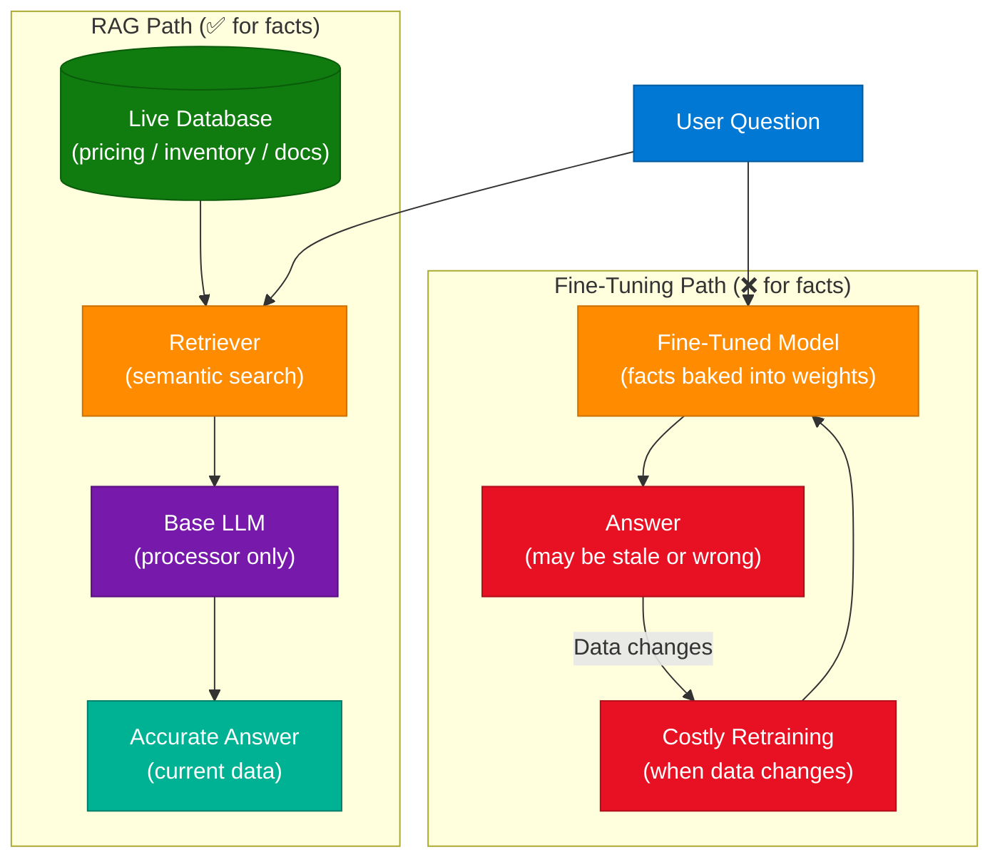

### Decision Matrix

| Criteria | Use Fine-Tuning | Use RAG |
|---|---|---|
| **Data update frequency** | Rare (months/years) | Frequent (daily/real-time) |
| **Goal** | Style, tone, format, behavior | Factual accuracy, current knowledge |
| **Examples** | Legal contract formatter, brand voice, JSON schema enforcement | Product catalog, support docs, inventory |
| **Cost to update** | High (full retraining) | Low (DB row update) |
| **Hallucination risk** | Higher for facts | Lower — grounded in retrieved docs |

### Interview Q&A

| Question | Answer |
|---|---|
| What is the Stale-Weight Vulnerability? | Facts encoded in model weights via fine-tuning become stale as business data changes, requiring costly retraining to fix |
| When should you choose fine-tuning over RAG? | When you need consistent output style, format, or behavior — e.g., always responding in JSON, enforcing legal tone |
| When should you choose RAG over fine-tuning? | When the data changes frequently — pricing, inventory, support documents — because RAG updates instantly via the database |
| Can you combine fine-tuning and RAG? | Yes — fine-tune for behavior and output format, use RAG for live factual knowledge injection |

---

## 15. Prompt Engineering vs Context Engineering

### Overview

Prompt engineering and context engineering are complementary but distinct disciplines. Prompt engineering focuses on how you phrase a question to elicit a better response — it is iterative and session-scoped. Context engineering focuses on building persistent external "knowledge bases" that the AI connects to as structured memory, eliminating the need to re-explain tools and systems in every new session. The compounding advantage of context engineering is that the effort is invested once and pays dividends on every subsequent interaction.

> **Key insight:** *"Prompt engineering asks the question better. Context engineering makes the question almost unnecessary."*

### Comparison Diagram

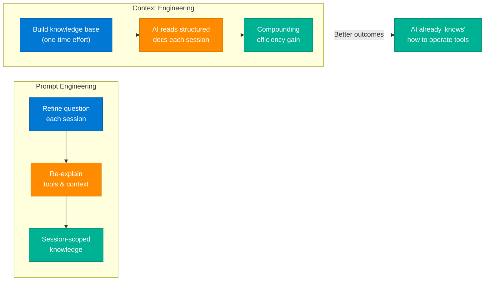

### Comparison Table

| Dimension | Prompt Engineering | Context Engineering |
|---|---|---|
| **Scope** | Per-session | Persistent across sessions |
| **Effort curve** | Constant (repeated each time) | Front-loaded (once, then compounds) |
| **Goal** | Better question → better answer | Structured memory → better default behavior |
| **Mechanism** | Text in the prompt | External files / knowledge base / MCP |
| **Best for** | One-off tasks | Recurring, tool-heavy workflows |

---

## 16. Snowflake ID — Distributed Auto-Increment

### Overview

Auto-incrementing IDs backed by a single database column are a scalability bottleneck — every write requires a centralized counter, creating a single point of failure and a write hotspot. The Snowflake ID algorithm (originally developed at Twitter/X) solves distributed unique ID generation by composing a 64-bit integer from three independent components: a millisecond timestamp, a machine identifier, and a per-millisecond sequence counter. This allows each machine in a cluster to generate unique, time-ordered IDs independently with zero coordination overhead.

### Snowflake ID Structure

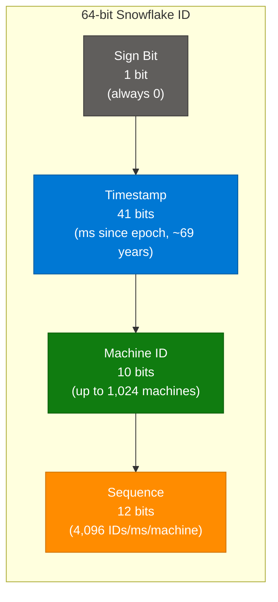

### Code Example

```python
import time
import threading

class SnowflakeIDGenerator:
    EPOCH = 1288834974657  # Twitter epoch (Nov 4, 2010)
    MACHINE_ID_BITS = 10
    SEQUENCE_BITS = 12
    MAX_MACHINE_ID = (1 << MACHINE_ID_BITS) - 1   # 1023
    MAX_SEQUENCE = (1 << SEQUENCE_BITS) - 1          # 4095

    def __init__(self, machine_id: int):
        if machine_id > self.MAX_MACHINE_ID:
            raise ValueError(f"Machine ID must be <= {self.MAX_MACHINE_ID}")
        self.machine_id = machine_id
        self.sequence = 0
        self.last_timestamp = -1
        self.lock = threading.Lock()

    def generate(self) -> int:
        with self.lock:
            timestamp = int(time.time() * 1000) - self.EPOCH

            if timestamp == self.last_timestamp:
                self.sequence = (self.sequence + 1) & self.MAX_SEQUENCE
                if self.sequence == 0:
                    # Sequence exhausted — wait for next ms
                    while timestamp <= self.last_timestamp:
                        timestamp = int(time.time() * 1000) - self.EPOCH
            else:
                self.sequence = 0

            self.last_timestamp = timestamp
            # Compose 64-bit ID
            return (timestamp << 22) | (self.machine_id << 12) | self.sequence

# Usage
gen = SnowflakeIDGenerator(machine_id=1)
unique_id = gen.generate()
print(f"Generated ID: {unique_id}")
# Decode
ts = (unique_id >> 22) + SnowflakeIDGenerator.EPOCH
print(f"Created at: {time.strftime('%Y-%m-%d %H:%M:%S', time.localtime(ts/1000))}")
```

### Throughput Capacity

| Dimension | Value |
|---|---|
| Max machines | 1,024 (2^10) |
| Max IDs per machine per millisecond | 4,096 (2^12) |
| Total max IDs per millisecond | 4,194,304 (~4.2M/ms) |
| Valid for | ~69 years from epoch |
| ID ordering | Roughly time-ordered (great for DB index locality) |

### Interview Q&A

| Question | Answer |
|---|---|
| Why not use a single auto-increment counter for distributed systems? | Single counter = write hotspot + single point of failure; under high load it becomes a bottleneck and availability risk |
| What are the three components of a Snowflake ID? | Timestamp (41 bits), Machine ID (10 bits), Sequence number (12 bits), plus 1 sign bit |
| How does Snowflake ID ensure uniqueness across machines? | Each machine has a unique Machine ID embedded in every ID it generates — no coordination required |
| What happens when the sequence is exhausted within one millisecond? | The generator waits (spins) until the next millisecond before issuing the next ID |
| What is the advantage of time-ordered IDs? | IDs are roughly monotonically increasing, which improves B-tree index locality and reduces write amplification in databases |

---

## 17. 30 LLM Concepts Every Practitioner Must Know

### Overview

A structured reference of 30 foundational LLM concepts organized by category: Architecture, Training/Model Types, Interaction, and Performance/Advanced. Mastering these concepts enables engineers to move beyond simply "using" AI to building with it — understanding the mechanics behind tokenization, embedding, inference, and evaluation.

### Complete 30-Concept Reference Table

| # | Category | Concept | Definition |
|---|---|---|---|
| 1 | Architecture | **LLM** | A model that generates text by predicting the most probable next token |
| 2 | Architecture | **Token** | A piece of text — a word, sub-word, or punctuation symbol |
| 3 | Architecture | **Tokenization** | Converting text into a sequence of tokens the model can process |
| 4 | Architecture | **Embeddings** | Numerical vectors that represent the meaning of tokens |
| 5 | Architecture | **Latent Space** | Mathematical space where embeddings are organized by semantic meaning |
| 6 | Architecture | **Parameters** | Internal variables storing the model's learned patterns (billions in large models) |
| 7 | Training | **Pre-training** | Training on massive text data to learn language patterns from scratch |
| 8 | Training | **Base Model** | A pre-trained model that predicts text but does not follow instructions |
| 9 | Training | **Instruct Model** | A base model tuned to follow natural language instructions and respond helpfully |
| 10 | Training | **Fine-Tuning** | Additional training on a smaller, domain-specific dataset to adjust behavior |
| 11 | Training | **Alignment** | Making model behavior helpful, honest, and harmless (HHH) |
| 12 | Training | **RLHF** | Reinforcement Learning from Human Feedback — human-ranked responses guide behavior |
| 13 | Interaction | **Prompt** | The full input sent to the model (system prompt + user prompt + context) |
| 14 | Interaction | **System Prompt** | Defines the model's role, persona, and operational limits |
| 15 | Interaction | **User Prompt** | The specific question or instruction from the user |
| 16 | Interaction | **Context Window** | Maximum tokens the model can process in a single call |
| 17 | Interaction | **Zero-Shot** | Asking the model to complete a task with no examples in the prompt |
| 18 | Interaction | **Few-Shot** | Providing examples in the prompt to guide the model's output format |
| 19 | Interaction | **Chain of Thought** | Prompting the model to reason step-by-step before giving a final answer |
| 20 | Interaction | **Inference** | Generating output from a trained model (not training — no weight updates) |
| 21 | Interaction | **Latency** | Time between submitting a request and receiving the complete response |
| 22 | Performance | **Temperature** | Controls randomness — lower = deterministic, higher = creative/diverse outputs |
| 23 | Performance | **Top-P Sampling** | Nucleus sampling — model samples from tokens whose cumulative prob exceeds P |
| 24 | Performance | **Hallucination** | Model confidently generating plausible-sounding but factually incorrect content |
| 25 | Performance | **Grounding** | Anchoring model outputs to verified, retrieved facts (via RAG or tool calls) |
| 26 | Performance | **Retrieval-Augmented Generation** | Injecting retrieved documents into context before generation |
| 27 | Performance | **Vector Database** | Specialized DB storing and searching embeddings by semantic similarity |
| 28 | Performance | **Agent** | An LLM augmented with tools, memory, and an action loop to complete multi-step tasks |
| 29 | Performance | **Eval** | Systematic measurement of model/system quality across accuracy, safety, and latency |
| 30 | Performance | **Observability** | Logging, tracing, and monitoring of AI system behavior in production |

### Concept Relationship Diagram

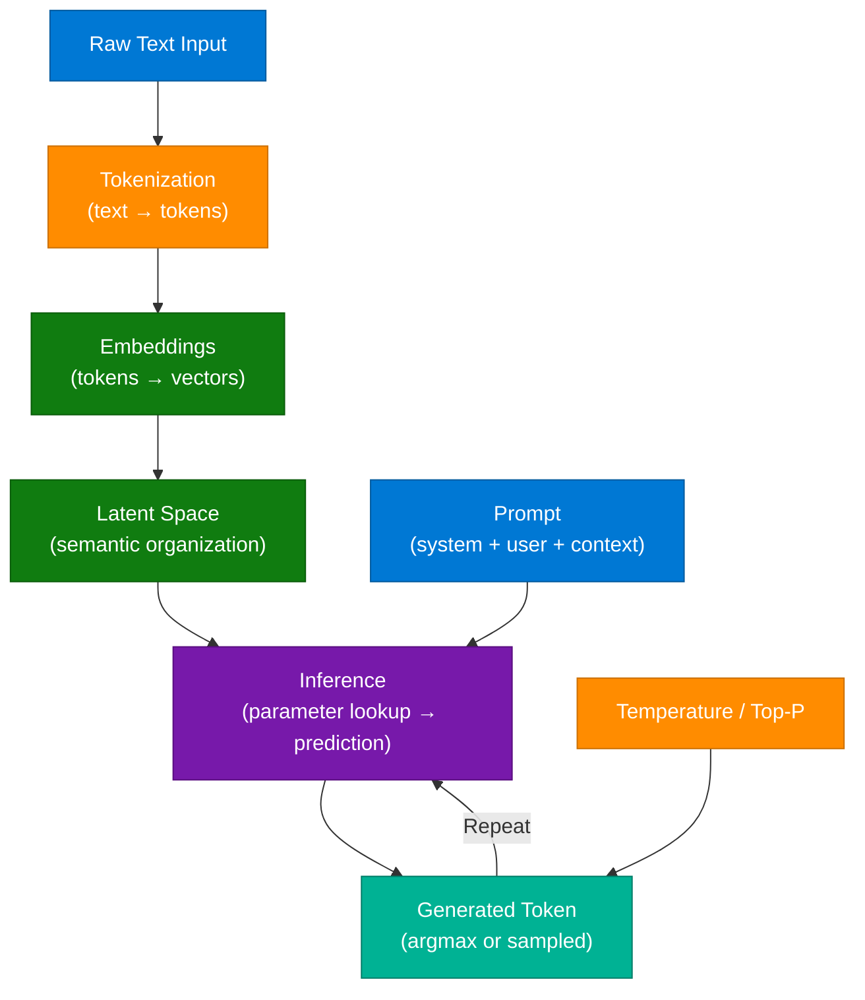

---

## 18. Interview Q&A Cheatsheet

**Q: What is TabFM and why does it matter?**
> TabFM is Google Research's zero-shot tabular foundation model that performs classification and regression on structured data in a single forward pass — no feature engineering or training required. It matters because it challenges the dominance of XGBoost on tabular ML tasks with a more flexible, generalizable approach.

**Q: What is the 12-layer AI agent stack?**
> Model → Context → Prompting → RAG → Memory → Tools → MCP → Agent → Deployment → Orchestration → Guardrails → Eval. Each layer is a distinct engineering concern that must be designed and tested independently.

**Q: Fine-tuning or RAG for company data?**
> Use RAG. Fine-tuning encodes facts into static model weights — when data changes, you need expensive retraining. RAG treats the model as a processor and the database as the source of truth, allowing instant updates via standard DB operations.

**Q: What is the ReAct framework?**
> Reason → Act → Observe — the agent reasons about what to do, takes an action (tool call), observes the result, then reasons again. This loop grounds the agent's outputs in real-world feedback, reducing hallucination.

**Q: How does Snowflake ID achieve distributed uniqueness?**
> By composing a 64-bit integer from a millisecond timestamp (41 bits), a machine ID (10 bits), and a per-millisecond sequence counter (12 bits). Each machine generates IDs independently with no coordination — 1,024 machines × 4,096 IDs/ms = ~4.2M unique IDs per millisecond globally.

**Q: What is Semantic Caching in RAG?**
> A layer that stores prior query-answer pairs indexed by their embeddings. New queries with cosine similarity ≥ threshold (e.g., 0.95) to a cached query skip the retrieval and LLM call entirely, returning the cached answer instantly.

**Q: What is the Five-Gate Model in AI Governance?**
> A governance framework with 5 mandatory approval checkpoints: Use Case → Design → Validation → Deployment → Post-Deployment Review. Each gate has veto power — without veto authority, governance is decorative. Post-deployment issues route back to Validation.

**Q: What is context engineering vs prompt engineering?**
> Prompt engineering refines how you ask a question per session. Context engineering builds persistent external knowledge bases that the AI reads at the start of every session — the effort is front-loaded but compounds, making the AI progressively "smarter" about your tools and systems without repeated re-explanation.

**Q: What is idempotency and how do you implement it?**
> An idempotent operation produces the same result whether executed once or many times. Implemented by assigning a unique idempotency key per request, caching the result with a TTL (e.g., in Redis), and returning the cached response for duplicate requests — preventing double-charges, duplicate orders, or repeated mutations.

**Q: What are the 4 types of agent memory?**
> Short-term (in-context token window), long-term (external vector DB or files), episodic (specific past interactions), and semantic (generalized facts about the domain). Production agents need all four for reliable, context-aware behavior.

---

*Extracted from Gemini shared session · July 4, 2026 · GeminiShareToMD Agent v1.0*

---

## Token Usage Report

```
═══════════════════════════════════════════════════════════
Token Usage Report
═══════════════════════════════════════════════════════════
Estimated without optimization:  ~18,600 tokens
Actual (with optimization):      ~8,200 tokens
Savings:                         ~10,400 tokens (56%)
Techniques applied:              UI chrome strip, meta-turn skip,
                                 deduplication of repeated prompts,
                                 TOON table compression, prose compaction
═══════════════════════════════════════════════════════════
* Estimates: prose chars ÷ 4, code chars ÷ 3. Actual API usage varies by model.
```
