# AI, System Design & DSA — Multi-Topic Reference (July 6, 2026)

> **Source:** [share.gemini.google/EobMVLvdRj1c](https://share.gemini.google/EobMVLvdRj1c) → redirects to [gemini.google.com/share/873985d69ac0](https://gemini.google.com/share/873985d69ac0)
> **Model:** Gemini 3.1 Flash-Lite
> **Session Date:** July 6, 2026 at 07:36 PM
> **Saved:** July 7, 2026

---

## Table of Contents

1. [Session Overview](#1-session-overview)
2. [Vertex AI Financial Analyst Assistant](#2-vertex-ai-financial-analyst-assistant)
3. [Microsoft Open Source AI Agent Course](#3-microsoft-open-source-ai-agent-course)
4. [AI Agent Ninja Technique](#4-ai-agent-ninja-technique)
5. [Efficient Local Dev with Cloud Tools](#5-efficient-local-dev-with-cloud-tools)
6. [Local 24/7 AI Agent Setup](#6-local-247-ai-agent-setup)
7. [Vectorless RAG](#7-vectorless-rag)
8. [The Evolving Landscape of RAG](#8-the-evolving-landscape-of-rag)
9. [Agentic AI Skills for Developers](#9-agentic-ai-skills-for-developers)
10. [Choosing the Right API Architecture](#10-choosing-the-right-api-architecture)
11. [Ports vs Sockets](#11-ports-vs-sockets)
12. [Preventing Cache Stampede](#12-preventing-cache-stampede)
13. [Mixture of Experts in LLM Architecture](#13-mixture-of-experts-in-llm-architecture)
14. [System Design — Ticket Booking (BookMyShow)](#14-system-design--ticket-booking-bookmyshow)
15. [How UPI Payment Works](#15-how-upi-payment-works)
16. [Is NGINX a Zero-Copy Server?](#16-is-nginx-a-zero-copy-server)
17. [Local Inference — Ollama vs vLLM](#17-local-inference--ollama-vs-vllm)
18. [System Design Interview Preparation](#18-system-design-interview-preparation)
19. [When to Use WebSockets in System Design](#19-when-to-use-websockets-in-system-design)
20. [File System Mechanics & Deletion](#20-file-system-mechanics--deletion)
21. [HTTPS TLS Handshake](#21-https-tls-handshake)
22. [6 Backend Security Concepts](#22-6-backend-security-concepts)
23. [Pattern-Based DSA Roadmap](#23-pattern-based-dsa-roadmap)
24. [Cache Patterns for System Design](#24-cache-patterns-for-system-design)
25. [Claude Project Structure for AI Engineering](#25-claude-project-structure-for-ai-engineering)
26. [Cache vs Streaming in System Design](#26-cache-vs-streaming-in-system-design)
27. [OTP System Design Mechanics](#27-otp-system-design-mechanics)
28. [DSA Short Notes — Array](#28-dsa-short-notes--array)
29. [Proximity Search Algorithms Part 1](#29-proximity-search-algorithms-part-1)
30. [RAG vs Fine-tuning](#30-rag-vs-fine-tuning)
31. [Uber Interview DSA — Shortest Path](#31-uber-interview-dsa--shortest-path)
32. [Career & Portfolio Strategy](#32-career--portfolio-strategy)
33. [Interview Q&A Cheatsheet](#33-interview-qa-cheatsheet)

---

## 1. Session Overview

This Gemini session contains **32 distinct learning topics** extracted from videos, Instagram reels, and technical posts. Topics span Vertex AI architecture, RAG patterns, system design (UPI, BookMyShow, WebSockets, Cache, OTP, Proximity Search), backend security, NGINX internals, TLS handshake, DSA patterns, and career strategy.

### Session Map

| Turn | Topic | Status |
|---|---|---|
| 1 | Vertex AI Financial Analyst Assistant | ✅ Extracted |
| 2 | Microsoft AI Agent Course | ✅ Extracted |
| 3 | AI Agent Ninja Technique | ✅ Extracted |
| 4 | Local Dev with Cloud Tools | ✅ Extracted |
| 5 | Local 24/7 AI Agent | ✅ Extracted |
| 6 | Vectorless RAG | ✅ Extracted |
| 7 | RAG Landscape Evolution | ✅ Extracted |
| 8 | Agentic AI Skills (Java Devs) | ✅ Extracted |
| 9 | API Architecture Selection | ✅ Extracted |
| 10 | Ports vs Sockets | ✅ Extracted |
| 11 | Cache Stampede Prevention | ✅ Extracted |
| 12 | Mixture of Experts (MoE) | ✅ Extracted |
| 13 | Ticket Booking System Design | ✅ Extracted |
| 14 | UPI Payment Architecture | ✅ Extracted |
| 15 | NGINX Zero-Copy | ✅ Extracted |
| 16 | Ollama vs vLLM | ✅ Extracted |
| 17 | AI for Finance Visuals | ✅ Extracted |
| 18 | System Design Interview Prep | ✅ Extracted |
| 19 | WebSockets Decision Guide | ✅ Extracted |
| 20 | File System & Deletion | ✅ Extracted |
| 21 | HTTPS TLS Handshake | ✅ Extracted |
| 22 | Backend Security Concepts | ✅ Extracted |
| 23 | Pattern-Based DSA Roadmap | ✅ Extracted |
| 24 | Cache Patterns Part 2 | ✅ Extracted |
| 25 | Claude Project Structure | ✅ Extracted |
| 26 | Cache vs Streaming | ✅ Extracted |
| 27 | OTP System Design | ✅ Extracted |
| 28 | DSA Array Short Notes | ✅ Extracted |
| 29 | Proximity Search Algos Part 1 | ✅ Extracted |
| 30 | RAG vs Fine-tuning | ✅ Extracted |
| 31 | Uber DSA — Shortest Path | ✅ Extracted |
| 32 | Career & Portfolio Strategy | ✅ Extracted |

---

## 2. Vertex AI Financial Analyst Assistant

**Video:** *How to build a financial analyst assistant with Vertex AI Studio*

### Overview

Vertex AI Studio enables building production-grade financial analyst assistants by combining Gemini's multi-modal reasoning with real-time grounding via Google Search. The architecture follows a Retrieval-Augmented Generation pattern where the LLM's responses are grounded in live financial data — not just training knowledge — making it suitable for time-sensitive financial analysis tasks.

### Architecture Diagram

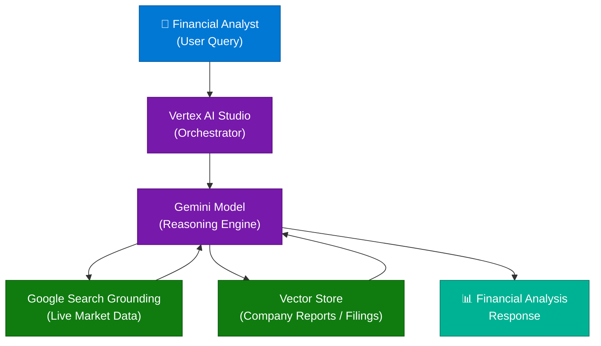

### Key Components

| Component | Role | Notes |
|---|---|---|
| Vertex AI Studio | Orchestrates model calls, manages prompts | No-code + SDK interface |
| Gemini Model | Core reasoning, multi-turn conversation | Supports function calling |
| Google Search Grounding | Fetches live financial data at query time | Prevents hallucination on recent events |
| Vector Store | Stores embeddings of PDFs, filings, reports | Used for private/proprietary documents |
| System Prompt | Defines analyst persona and constraints | Sets tone, citation format, guardrails |

### How It Works

1. User submits financial question (e.g., "What is HDFC Bank's Q4 PE ratio?")
2. Vertex AI Studio routes the query to Gemini with a financial analyst system prompt
3. Gemini determines if grounding is needed (live data) or vector retrieval (company docs)
4. Grounding retrieves current data via Google Search; Vector Store retrieves relevant filings
5. Gemini synthesizes retrieved context + reasoning to produce a structured analysis
6. Multi-turn conversation context is maintained across the session for follow-up questions

### Interview Q&A

| Question | Answer |
|---|---|
| What makes Vertex AI different from OpenAI for enterprise? | Native GCP integration, Grounding with Google Search, VPC-SC compliance, and CMEK support for regulated industries |
| What is "grounding" in Vertex AI context? | Connecting LLM responses to verifiable real-time sources (Google Search) to reduce hallucination and ensure factual accuracy |
| When would you use Vector Store vs Search Grounding? | Vector Store for private/proprietary docs (filings, reports); Search Grounding for real-time public data (stock prices, news) |
| How do you maintain multi-turn context in Vertex AI? | Pass conversation history in the `contents` array with alternating `user`/`model` roles |
| What safety controls exist in Vertex AI Studio? | Safety filters, output guardrails, system prompt constraints, and Responsible AI dashboard monitoring |

---

## 3. Microsoft Open Source AI Agent Course

**Media:** Instagram Post by @thenadcoder
**Source:** Microsoft open-source GitHub repository

### Overview

Microsoft released a free, modular, open-source curriculum for building AI agents. The course covers both foundational agent concepts and advanced topics including multi-agent orchestration, memory management, tool use, and responsible AI.

### Key Curriculum Modules

| Module | Topic |
|---|---|
| 1 | Introduction to AI Agents — what they are, types, components |
| 2 | Agentic Frameworks — AutoGen, Semantic Kernel, LangChain |
| 3 | Tool Use & Function Calling — connecting agents to APIs |
| 4 | Memory Architectures — short-term, long-term, episodic |
| 5 | Multi-Agent Systems — orchestrator + specialist pattern |
| 6 | RAG for Agents — grounding agents in private knowledge |
| 7 | Planning & Reasoning — ReAct, Chain-of-Thought, Tree-of-Thought |
| 8 | Responsible AI — safety, alignment, guardrails |

### Interview Q&A

| Question | Answer |
|---|---|
| What is the difference between a tool-using agent and a regular LLM? | An agent can autonomously call external tools (APIs, databases, code interpreters) based on reasoning, then incorporate results back into its decision loop |
| Name three agentic frameworks and their primary use cases | AutoGen: multi-agent conversation; Semantic Kernel: enterprise .NET/Python orchestration; LangChain: rapid prototyping with extensive tool ecosystem |
| What is the ReAct pattern? | Reason-Act pattern: the agent alternates between producing a thought (reasoning) and taking an action (tool call), iterating until the goal is achieved |

---

## 4. AI Agent Ninja Technique

**Video:** *AI Agent Bnane ki ninja technique*

### Core Technique

Break complex agent tasks into **micro-specialized sub-agents** rather than building a single monolithic agent. Each sub-agent has a single responsibility and a constrained tool set, reducing hallucination and improving reliability.

### Pattern

```
Master Orchestrator Agent
├── Research Sub-Agent    (web search + summarization only)
├── Code Sub-Agent        (code generation + execution only)
├── Review Sub-Agent      (validation + critique only)
└── Output Sub-Agent      (formatting + delivery only)
```

### Interview Q&A

| Question | Answer |
|---|---|
| Why split agents by responsibility? | Reduces context contamination, allows specialized prompting, enables parallel execution, and makes failures easier to isolate and debug |
| What is "context contamination" in multi-agent systems? | When irrelevant information from one task bleeds into another agent's reasoning window, degrading decision quality |

---

## 5. Efficient Local Development with Cloud Tools

### Core Concepts

Use cloud-native tooling locally via emulators and dev containers to mirror production without incurring cloud costs during development:

- **Firebase Emulator Suite** — local Firestore, Auth, Functions
- **Docker Compose** — spin up local replicas of cloud services
- **LocalStack** — emulates AWS services (S3, SQS, DynamoDB) locally
- **Azurite** — local Azure Blob, Queue, Table emulator
- **Testcontainers** — spin up real containers in tests (Kafka, Redis, Postgres)

### Interview Q&A

| Question | Answer |
|---|---|
| How do you test Kafka integrations locally without a cloud cluster? | Use Testcontainers to spin up a real Kafka container for integration tests, or Kafka KRaft mode locally via Docker Compose |
| What is the risk of using emulators vs real services? | Emulators may not replicate 100% of production behavior (e.g., eventual consistency nuances, specific error codes), leading to false positives in tests |

---

## 6. Local 24/7 AI Agent Setup

**Video:** Instagram Reel by @ali.1cr — *"This is not a normal phone anymore."*

### Architecture

Run a persistent local AI agent on a mobile/edge device using:
- **Ollama** — local LLM runtime (runs Llama, Mistral, Phi models)
- **n8n / Make** — workflow automation for triggers and actions
- **Home Assistant** — for IoT integration
- **Termux** — Linux environment on Android for running agents

### Use Cases

- Personal finance tracker that alerts on spending patterns
- Local document Q&A (private, no cloud dependency)
- Smart home automation with LLM-driven decision making

### Interview Q&A

| Question | Answer |
|---|---|
| What are the trade-offs of running LLMs locally vs cloud? | Local: privacy, no latency, no cost per token; but limited context windows, smaller models, higher device resource consumption |
| Which quantization formats enable running LLMs on consumer hardware? | GGUF (used by llama.cpp/Ollama), GPTQ, AWQ — these reduce model size from FP16 to 4-8 bit with minimal quality loss |

---

## 7. Vectorless RAG

### Overview

Traditional RAG requires embedding documents into a vector database and retrieving them via similarity search. **Vectorless RAG** eliminates the vector store by using alternative retrieval strategies that are faster to set up and often sufficient for structured or small-to-medium corpora.

### Vectorless RAG Approaches

| Approach | How It Works | Best For |
|---|---|---|
| **BM25 / Keyword Search** | TF-IDF term frequency ranking | Structured docs, technical manuals |
| **Reranker-Only** | Cross-encoder model re-ranks candidate docs | When you already have a search API |
| **Full Context Injection** | Inject entire document into LLM context | Small docs < 100k tokens |
| **SQL + LLM** | LLM generates SQL from natural language; DB retrieves data | Tabular / relational data |
| **Graph RAG** | Knowledge graph traversal instead of vector similarity | Multi-hop reasoning, relationships |

### Architecture Diagram

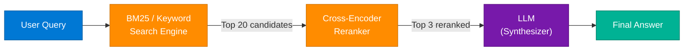

### Interview Q&A

| Question | Answer |
|---|---|
| When would you choose Vectorless RAG over traditional RAG? | When the corpus is structured/tabular (SQL is better), when embedding latency is unacceptable, or when documents are small enough to fit in context |
| What is a cross-encoder reranker? | A model that takes (query, document) pairs and scores their relevance jointly — more accurate than bi-encoder embeddings but slower; used after initial retrieval |
| What is Graph RAG and when does it outperform vector RAG? | Graph RAG builds a knowledge graph from the corpus and uses graph traversal for multi-hop queries (e.g., "Who manages the team that owns service X?") — outperforms vector RAG for relational reasoning |

---

## 8. The Evolving Landscape of RAG

**Video:** Instagram Reel by keerti.purswani

### RAG Evolution Timeline

| Generation | Approach | Limitation Solved |
|---|---|---|
| **Naive RAG** | Fixed-size chunking + vector similarity | Basic knowledge grounding |
| **Advanced RAG** | Sentence-window, parent-document retrieval, HyDE | Better chunk boundary handling |
| **Modular RAG** | Interchangeable retriever/reranker/reader | Flexibility and composability |
| **Agentic RAG** | Agent decides when/what to retrieve (multi-hop) | Complex multi-step queries |
| **Graph RAG** | Knowledge graph + community summaries | Global reasoning across corpus |

### Interview Q&A

| Question | Answer |
|---|---|
| What is HyDE in RAG? | Hypothetical Document Embeddings — the LLM generates a hypothetical answer, which is then embedded and used for retrieval, improving retrieval for sparse queries |
| What is the "lost in the middle" problem in RAG? | LLMs tend to ignore documents placed in the middle of a long context; mitigated by placing most relevant docs at the start/end of the context window |

---

## 9. Agentic AI Skills for Developers

**Video:** *"Companies don't want only core skills anymore. They want Core + Agentic AI on your resume."*
**Creator:** dhruvtechbytes

### Core Message

The job market is shifting. Core technical skills alone are no longer sufficient. Companies now expect developers to combine domain expertise with Agentic AI capabilities.

### The Skill Stack

```
Traditional (Core Skills)          +    Agentic AI Layer
─────────────────────────               ─────────────────────────────
Java / Python / .NET                    LLM API Integration (OpenAI / Gemini / Claude)
Spring Boot / FastAPI                   Agent Frameworks (LangChain, AutoGen, SK)
SQL / NoSQL databases                   RAG pipelines & Vector Stores
REST APIs, Microservices                Tool-use / Function Calling
Docker, Kubernetes, CI/CD              Multi-agent Orchestration
```

### Interview Q&A

| Question | Answer |
|---|---|
| What is the minimum Agentic AI skill a Java developer needs today? | Ability to integrate LLM APIs via REST/SDK, build a simple RAG pipeline, and wire tool-calling with a framework like Spring AI or LangChain4j |
| How do you demonstrate Agentic AI skills on a resume? | Build a GitHub project: a domain-specific agent (e.g., document Q&A, code reviewer, customer support bot) using a real framework, deployed and demo-able |

---

## 10. Choosing the Right API Architecture

### Decision Framework

| Pattern | Best For | Avoid When |
|---|---|---|
| **REST** | CRUD operations, public APIs, browser clients | Complex queries needing many roundtrips |
| **GraphQL** | Flexible data fetching, mobile apps with bandwidth constraints | Simple CRUD, real-time subscriptions (use WebSocket) |
| **gRPC** | Internal microservice-to-microservice, low latency, streaming | Browser-direct (no native HTTP/2 support without gRPC-Web) |
| **WebSocket** | Bi-directional real-time (chat, live dashboards) | Request-response semantics |
| **SSE** | Server-to-client streaming (AI tokens, notifications) | Client needs to send data back |

### Architecture Diagram

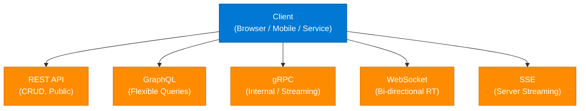

### Interview Q&A

| Question | Answer |
|---|---|
| When would you choose gRPC over REST? | Internal microservices needing low latency, strict contracts (Protobuf), or bidirectional streaming (e.g., real-time telemetry) |
| What is the N+1 problem in GraphQL? | Each nested resolver fires a separate DB query; solved with DataLoader (batching) pattern |
| Can you use GraphQL subscriptions instead of WebSocket? | GraphQL subscriptions use WebSocket under the hood — they're an abstraction on top of it |

---

## 11. Ports vs Sockets

**Video:** *Port Number vs Socket: Interview Explanation*

### Definitions

| Concept | Definition |
|---|---|
| **Port** | A logical number (0–65535) that identifies a specific process/service on a host. It's part of the address — not a connection. |
| **Socket** | A combination of `IP Address + Port Number + Protocol`. It represents one endpoint of an active network connection. |
| **Socket Pair** | `(Client IP:Port, Server IP:Port)` — uniquely identifies a full TCP connection |

### Key Distinction

A port is **passive** (a label on a door). A socket is **active** (an open channel through that door).

```
Server listening on port 443 (HTTPS)

Client A: 192.168.1.10:54321 → 10.0.0.1:443  (Socket Pair 1)
Client B: 192.168.1.11:54322 → 10.0.0.1:443  (Socket Pair 2)
```

Both clients use **port 443**, but each has a unique **socket pair** — so they don't interfere.

### Interview Q&A

| Question | Answer |
|---|---|
| Can two processes share the same port? | Yes, with `SO_REUSEPORT` socket option — allows multiple processes to bind the same port (used by Nginx worker processes for load distribution) |
| What is a well-known port range? | 0–1023; reserved for system services (80=HTTP, 443=HTTPS, 22=SSH, 5432=Postgres) |
| What is the ephemeral port range? | 49152–65535; OS assigns these temporarily to client-side connections |

---

## 12. Preventing Cache Stampede

**Video:** *Cache stampede can crash your entire system in seconds ⚠️*

### Problem

When a heavily-cached key expires, thousands of simultaneous requests all miss the cache and hammer the database — causing a "thundering herd" / cache stampede.

### Solutions

| Solution | Mechanism | Trade-off |
|---|---|---|
| **Mutex Lock** | Only one request rebuilds the cache; others wait | Simple but adds latency |
| **Probabilistic Early Expiration** | Randomly expire cache slightly before TTL so one request rebuilds proactively | Complexity, slight over-computation |
| **Background Refresh** | Async thread refreshes cache before expiry; stale data served meanwhile | Acceptable staleness required |
| **Request Coalescing** | Collapse duplicate in-flight requests at the cache layer | Requires proxy support (Varnish, Nginx) |
| **Jitter on TTL** | Add random offset to TTL so keys don't all expire simultaneously | Reduces coordination, doesn't eliminate stampede |

### Architecture Diagram

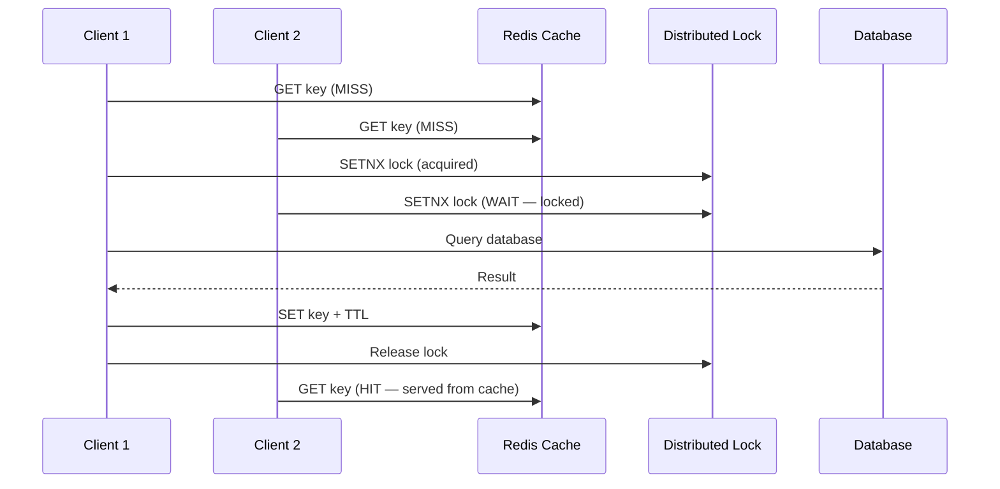

### Interview Q&A

| Question | Answer |
|---|---|
| What Redis command implements mutex locking for cache stampede? | `SET key value NX PX ttl` — atomic set-if-not-exists with expiry |
| What is probabilistic early expiration? | XFetch algorithm: recompute cache with probability P = exp((TTL_remaining - TTL_total) / beta) — higher beta = more aggressive early refresh |

---

## 13. Mixture of Experts in LLM Architecture

**Video:** *Mixture of Experts Explained* by jganesh.ai

### Overview

Mixture of Experts (MoE) is an LLM architecture where only a **sparse subset of model parameters** (the "experts") is activated for each token, rather than running all parameters. This allows models to scale to massive parameter counts while maintaining efficient compute.

### Architecture Diagram

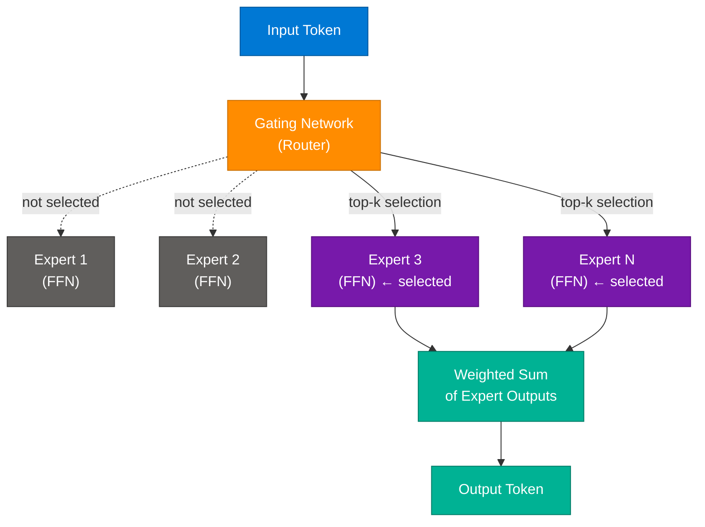

### Key Facts

| Property | Value |
|---|---|
| Activation per token | Typically top-2 experts out of 8–64 |
| Models using MoE | Mixtral 8x7B, Mixtral 8x22B, GPT-4 (rumored), Gemini 1.5 (rumored) |
| Compute savings | ~4–8x fewer FLOPS vs dense model of same parameter count |
| Drawback | Requires loading all expert weights into VRAM; communication overhead in distributed inference |

### Interview Q&A

| Question | Answer |
|---|---|
| What is "expert collapse" in MoE? | When the router always selects the same few experts, making others unused — mitigated by auxiliary load balancing loss during training |
| How does MoE differ from model ensembling? | Ensembling runs multiple full models and aggregates; MoE routes through sparse subsets of a single model — fundamentally more efficient |
| What is the gating network in MoE? | A small learned linear layer that produces a softmax distribution over experts; top-k experts with highest scores are activated |

---

## 14. System Design — Ticket Booking (BookMyShow)

### Requirements

- **Scale:** Millions of concurrent users during popular event launches
- **Core challenge:** Preventing double-booking under extreme concurrency

### Architecture Diagram

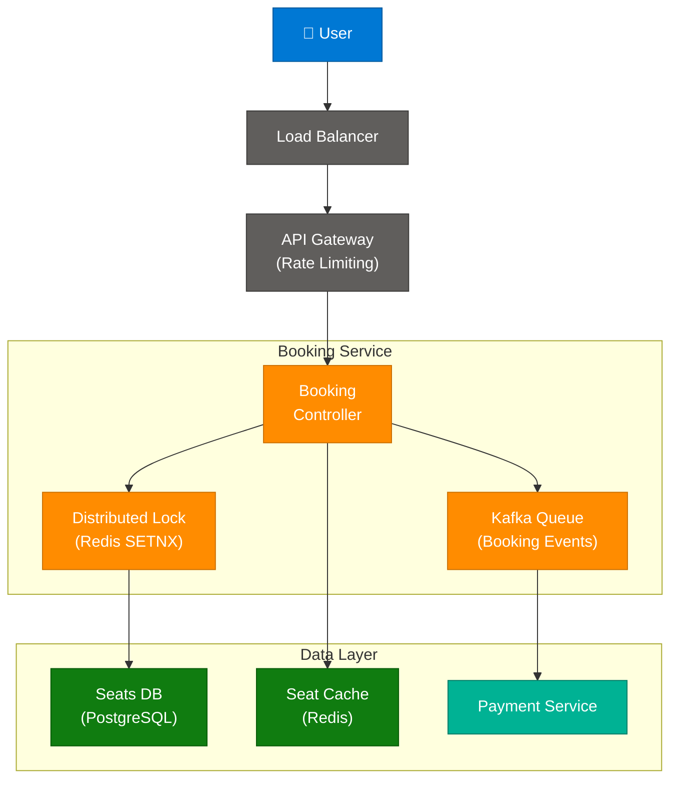

### Critical Design Decisions

| Problem | Solution |
|---|---|
| Double booking | Optimistic locking on seat row + Redis SETNX seat lock |
| Peak traffic spike | Queue-based booking with async payment processing |
| Seat availability display | Read from Redis cache; invalidate on booking confirmation |
| Ticket hold expiry | TTL on Redis seat lock (10 min); auto-release if payment not completed |

### Interview Q&A

| Question | Answer |
|---|---|
| How do you prevent double booking in BookMyShow? | Combine optimistic locking (SQL `WHERE version = N`) with Redis SETNX seat lock; the first transaction to acquire both wins |
| What is the thundering herd problem here? | When tickets go on sale, all users hit seat availability simultaneously; mitigated by a virtual waiting queue before entering booking flow |
| How would you handle seat hold expiry? | Use Redis TTL on seat reservation key; a background job or TTL expiry event releases the seat back to available pool |

---

## 15. How UPI Payment Works

**Video:** *How UPI payment works* by codewithupasana

### Architecture Diagram

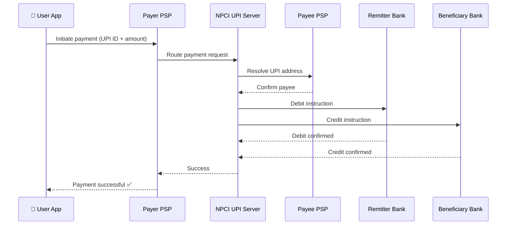

### Component Roles

| Component | Role |
|---|---|
| **PSP (Payment Service Provider)** | Bank's app or third-party (PhonePe, GPay) that interfaces with NPCI |
| **NPCI UPI Server** | Central routing and address resolution layer; maps UPI IDs to accounts |
| **Remitter Bank** | Sender's bank — debits the amount |
| **Beneficiary Bank** | Receiver's bank — credits the amount |
| **VPA (Virtual Payment Address)** | Human-readable alias (name@upi) that maps to bank account |

### Interview Q&A

| Question | Answer |
|---|---|
| What makes UPI faster than NEFT/RTGS? | UPI runs on IMPS rails (24/7 real-time settlement) vs NEFT batch settlement and RTGS high-value cutoffs |
| How is UPI ID resolved to a bank account? | NPCI maintains a central directory mapping VPAs (name@bank) to actual IFSC + account numbers |
| What happens if a UPI transaction is debited but not credited? | NPCI initiates auto-reversal; if pending >30 min, the debit is reversed automatically within T+1 |

---

## 16. Is NGINX a Zero-Copy Server?

**Video:** *IS NGINX A ZERO-COPY SERVER !???*

### The Traditional I/O Problem (4 Copies)

```
Disk
 └─[DMA copy]──► Kernel Buffer
                  └─[CPU copy]──► Application Buffer (user space)
                                   └─[CPU copy]──► Socket Buffer
                                                    └─[DMA copy]──► NIC
```
**Result:** 4 data copies, 2 CPU copies → high overhead for file serving

### Zero-Copy Solution: sendfile()

```
Disk
 └─[DMA copy]──► Kernel Buffer
                  └─[DMA copy]──► NIC   (bypasses application entirely)
```
**Result:** 2 DMA copies, 0 CPU copies → ~3× faster for static file serving

### Is NGINX Zero-Copy?

**Yes, when serving static files.** NGINX uses the `sendfile()` syscall on Linux for static content delivery. However, for dynamic content (proxying to upstream, compression, SSL termination), NGINX processes data in user space — making it non-zero-copy for those paths.

```nginx
# nginx.conf — enables zero-copy for static files
sendfile on;
tcp_nopush on;   # Batches sendfile + TCP headers for efficiency
```

### Architecture Diagram

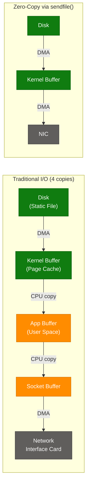

### Interview Q&A

| Question | Answer |
|---|---|
| What syscall enables zero-copy in Linux? | `sendfile(out_fd, in_fd, offset, count)` — transfers data from file descriptor to socket in kernel space |
| Why doesn't NGINX use zero-copy for SSL? | SSL encryption/decryption happens in user space (OpenSSL), requiring a CPU copy into the application buffer; `sendfile()` only works for unencrypted data paths |
| What is `tcp_nopush`? | Tells the kernel to wait until the send buffer is full before sending — reduces number of TCP packets, used in conjunction with `sendfile` |

---

## 17. Local Inference — Ollama vs vLLM

### Comparison Table

| Feature | **Ollama** | **vLLM** |
|---|---|---|
| **Target** | Developer laptops, edge devices | Production servers, high throughput |
| **Model format** | GGUF (quantized) | GPTQ, AWQ, FP16 (full precision) |
| **Batching** | Basic | Continuous batching (PagedAttention) |
| **Throughput** | Low-medium | High (optimized for GPU clusters) |
| **Ease of setup** | One command (`ollama run llama3`) | Requires GPU, pip install, config |
| **OpenAI compatible API** | Yes | Yes |
| **Multi-GPU** | Limited | Full tensor parallelism |
| **Best use case** | Local dev, private Q&A, prototyping | Serving 100s of concurrent users |

### Interview Q&A

| Question | Answer |
|---|---|
| What is PagedAttention in vLLM? | A memory management technique that stores KV cache in non-contiguous memory pages (like OS virtual memory), enabling higher batch sizes and GPU memory efficiency |
| What is continuous batching? | Instead of waiting for a full batch, vLLM processes requests as they arrive, inserting new requests into running batches — dramatically reduces latency vs static batching |

---

## 18. System Design Interview Preparation

**Video:** *Best Way To Learn System Design (for FREE)*

### Recommended Learning Path

1. **Understand requirements first** — clarify functional vs non-functional before designing
2. **Study real-world architectures** — read AWS/Netflix/Uber engineering blogs
3. **Practice the 4-step framework:** Clarify → Estimate → Design → Deep-dive
4. **Learn from system design primers:** Donne Martin's `system-design-primer` (GitHub), ByteByteGo
5. **Mock interviews** — practice explaining trade-offs aloud

### Non-Functional Requirements Checklist

| NFR | Key questions to ask |
|---|---|
| **Scalability** | How many users? Peak QPS? Growth rate? |
| **Availability** | 99.9% vs 99.99%? Regional or global? |
| **Consistency** | Strong vs eventual? Read-after-write needed? |
| **Latency** | p50/p99 targets? User-facing vs internal? |
| **Durability** | Data loss tolerance? Backup strategy? |

---

## 19. When to Use WebSockets in System Design

**Video:** *"Real-time" doesn't always mean WebSockets*

### Decision Matrix

| Scenario | Use WebSocket? | Better Alternative |
|---|---|---|
| Live chat, collaborative editing | ✅ Yes | — |
| Stock price dashboard (read-only) | ❌ No | SSE (Server-Sent Events) |
| Notifications / alerts (push) | ❌ No | SSE or Push Notifications |
| Live sports score updates | ❌ No | SSE |
| Multiplayer game state sync | ✅ Yes | — |
| File upload progress | ❌ No | SSE or polling |

### Why Not Always WebSocket?

- WebSocket maintains a persistent connection — expensive at scale (1M connections = heavy server resources)
- Most "real-time" use cases are **server → client only** (SSE is simpler and cheaper)
- WebSocket requires stateful servers or sticky sessions, complicating horizontal scaling

### Interview Q&A

| Question | Answer |
|---|---|
| What is SSE vs WebSocket? | SSE is unidirectional (server→client) over HTTP/1.1, auto-reconnects, simpler proxy traversal; WebSocket is bidirectional, full-duplex over a single TCP connection |
| How do you scale WebSocket servers? | Use a message broker (Redis Pub/Sub, Kafka) between WebSocket server instances so messages route to the correct connection regardless of which instance holds it |

---

## 20. File System Mechanics & Deletion

**Video:** *File deletion explained* by this.tech.girl

### How File Deletion Works

```
File system stores:
 ├── Inode (metadata: permissions, timestamps, pointer to data blocks)
 └── Directory entry (filename → inode number)

On deletion:
 1. Directory entry is removed (filename unlinked)
 2. Inode reference count decremented
 3. If ref count = 0 → data blocks marked "free" (NOT zeroed)
 4. Data physically remains until overwritten
```

### Key Concepts

| Concept | Explanation |
|---|---|
| **Soft delete** | Mark record as deleted in DB (is_deleted=true); data retained |
| **Hard delete** | Remove inode reference; data recoverable until overwritten |
| **Secure delete** | Overwrite data blocks with random bytes before unlinking |
| **Copy-on-Write (CoW)** | ZFS/Btrfs never overwrite; write new blocks, then update pointer |

### Interview Q&A

| Question | Answer |
|---|---|
| Why can deleted files be recovered? | Deletion only removes the directory entry and marks blocks free; actual data remains until the OS writes new data to those blocks |
| What is an inode? | A data structure storing file metadata (owner, permissions, size, timestamps, data block pointers) — the OS uses inode numbers internally, filenames are just aliases |

---

## 21. HTTPS TLS Handshake

**Video:** *What happens when you open a HTTPS website?*

### TLS 1.3 Handshake Steps

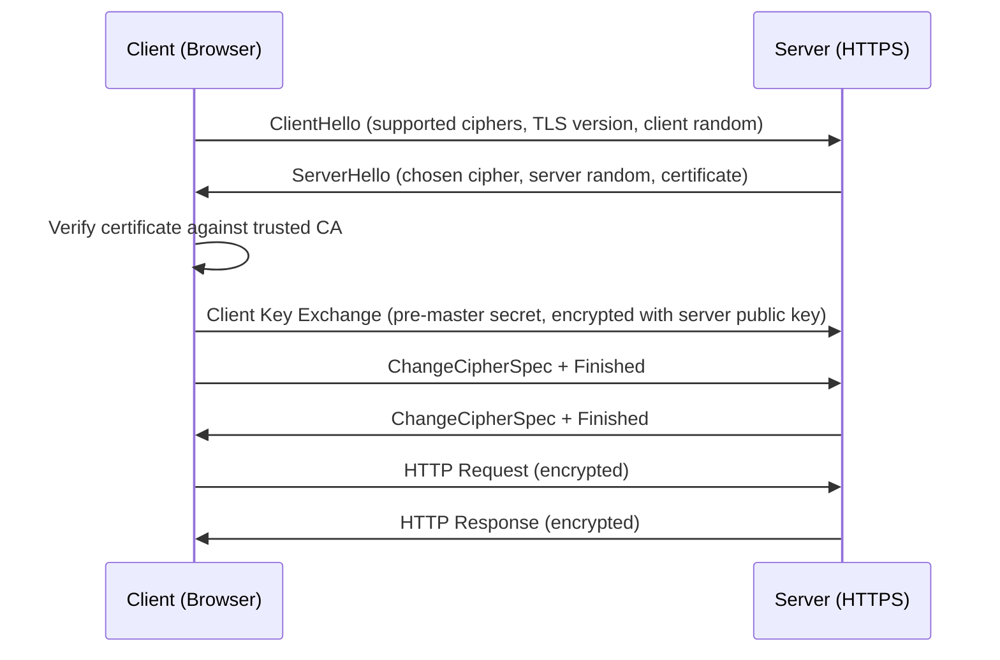

### Session Keys Derivation

```
Master Secret = PRF(pre-master secret, client random, server random)
Session Keys  = PRF(master secret, "key expansion", randoms)
  ├── Client write key  (client→server encryption)
  ├── Server write key  (server→client encryption)
  ├── Client MAC key
  └── Server MAC key
```

### Interview Q&A

| Question | Answer |
|---|---|
| What is the purpose of the "random" values in TLS handshake? | Ensures session keys are unique per connection; prevents replay attacks even if the same certificate is reused |
| What is TLS 1.3's improvement over 1.2? | 1-RTT handshake (vs 2-RTT), removed weak cipher suites (RSA key exchange, SHA-1), supports 0-RTT resumption for repeat connections |
| What is certificate pinning? | The client hardcodes the expected server certificate/public key hash; rejects connections if the certificate doesn't match — prevents MITM even with a compromised CA |

---

## 22. 6 Backend Security Concepts

**Video:** *6 backend security concepts every developer MUST know*
**Creator:** anandloops

### The Security Checklist

| # | Concept | Implementation |
|---|---|---|
| 1 | **Authentication** | JWT, OAuth 2.0, Session tokens — verify who the user is |
| 2 | **Authorization** | RBAC, ABAC, middleware checks — verify what they can do |
| 3 | **Input Validation** | Reject malformed input; prevent SQL injection, XSS, command injection |
| 4 | **Rate Limiting** | Token bucket / sliding window; prevent brute force and DDoS |
| 5 | **HTTPS / TLS** | Encrypt data in transit; enforce HSTS; disable SSLv3/TLS 1.0 |
| 6 | **CORS** | Restrict cross-origin requests; set `Access-Control-Allow-Origin` precisely |

### Interview Q&A

| Question | Answer |
|---|---|
| What is the difference between Authentication and Authorization? | AuthN = verifying identity (who are you?); AuthZ = verifying permissions (what can you do?) — they are sequential steps |
| How do you prevent SQL injection? | Parameterized queries / prepared statements; never string-concatenate user input into SQL; use ORM with parameter binding |
| What is CORS and why is it needed? | Cross-Origin Resource Sharing — browser security mechanism preventing a malicious site from making requests to your API using the user's cookies |

---

## 23. Pattern-Based DSA Roadmap

**Video:** *Best Way To Learn System Design / DSA (Pattern Recognition)*

### Core DSA Patterns

| Pattern | When to Apply | Example Problems |
|---|---|---|
| **Sliding Window** | Subarray/substring with constraint | Max sum subarray, Longest substring without repeat |
| **Two Pointers** | Sorted array, pair finding | Two Sum II, Container With Most Water |
| **Fast & Slow Pointers** | Cycle detection in linked list | Linked List Cycle, Happy Number |
| **Merge Intervals** | Overlapping intervals | Merge Intervals, Meeting Rooms |
| **Binary Search** | Sorted search space | Search in Rotated Array, Find Minimum in Rotated |
| **BFS/DFS** | Graph/tree traversal | Level Order Traversal, Number of Islands |
| **Backtracking** | Explore all combinations | Permutations, N-Queens, Subsets |
| **Dynamic Programming** | Optimal substructure + overlapping | Knapsack, LCS, Coin Change |

### Study Strategy

```
❌ Wrong: Solve random LeetCode problems daily
✅ Right: 
  1. Learn a pattern (e.g., Sliding Window)
  2. Solve 3-5 problems using ONLY that pattern
  3. Identify the trigger: "when do I use this?"
  4. Move to the next pattern
  5. Weekly review: re-solve previous problems from memory
```

---

## 24. Cache Patterns for System Design

**Video:** *Day 52 — Cache Patterns Part 2*
**Creator:** journeywithpravallika

### The 4 Cache Patterns

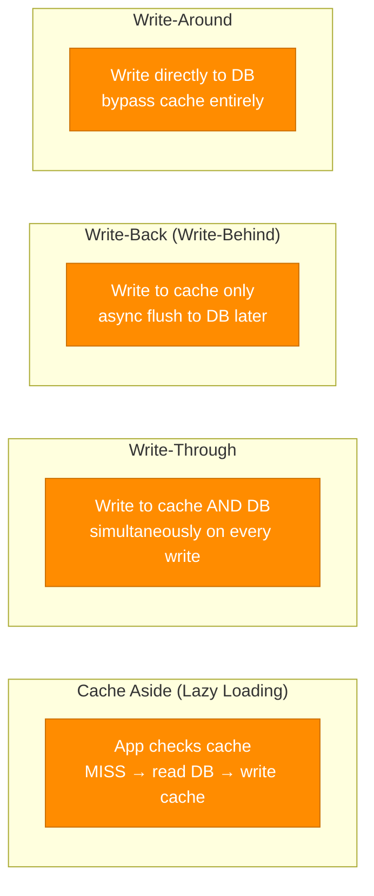

### Pattern Comparison

| Pattern | Read Perf | Write Perf | Consistency | Best For |
|---|---|---|---|---|
| **Cache Aside** | High (after warm-up) | Normal | Eventual | Read-heavy workloads |
| **Write-Through** | High | Slower (2 writes) | Strong | Read+write balanced |
| **Write-Back** | High | Fast (1 write) | Risk of loss on crash | Write-heavy, tolerate stale |
| **Write-Around** | Low (cold on first read) | Fast (skip cache) | Strong | Write-once, read-rarely |

### Interview Q&A

| Question | Answer |
|---|---|
| What is cache invalidation and why is it hard? | Deciding when to remove stale data from cache; hard because distributed systems have no global clock — you must choose between TTL-based expiry (stale risk) or event-based invalidation (complexity) |
| When would you choose Write-Back over Write-Through? | High write throughput where write latency matters (e.g., gaming leaderboards, IoT sensor data) — accept the risk of data loss if cache crashes before flush |

---

## 25. Claude Project Structure for AI Engineering

**Photo:** *Turn Claude into a structured AI engineer*
**Source:** AI Folks (aifolksorg)

### Recommended Repository Layout

```
your-project/
├── CLAUDE.md                    # Project instructions for Claude (system prompt equivalent)
├── agents/
│   ├── orchestrator.md          # Master orchestration agent
│   ├── code-reviewer.md         # Specialized reviewer agent
│   └── security-auditor.md      # Specialized security agent
├── tools/
│   ├── search.py                # Custom tools Claude can call
│   └── database.py
├── memory/
│   ├── MEMORY.md                # Memory index
│   └── *.md                     # Individual memory files
└── tests/
```

### Key Takeaways

| File | Purpose |
|---|---|
| `CLAUDE.md` | Project-level system prompt; coding standards, context, constraints |
| `agents/*.md` | Skill files defining specialized agent personas and workflows |
| `memory/` | Persistent memory across sessions (user prefs, project state) |

---

## 26. Cache vs Streaming in System Design

**Video:** *Day 53 — Cache vs Streaming*
**Creator:** journeywithpravallika

### Core Insight

> "Real-time systems don't fetch… they stream."

### When Cache Fails for Real-Time

- Cache TTL = 1 sec → data is already stale for stock prices
- Every read triggers a cache miss during active trading hours
- Cache invalidation storms under high write frequency

### Streaming Architecture for Real-Time Data


### Decision Table

| Requirement | Cache | Streaming |
|---|---|---|
| Data changes every 1+ seconds | ✅ Cache fine | Overkill |
| Data changes every millisecond | ❌ Always stale | ✅ Stream |
| User pulls data on demand | ✅ Cache | — |
| Data must be pushed to user | — | ✅ Stream |

---

## 27. OTP System Design Mechanics

**Video:** *Interview Question: An OTP is valid for 30 seconds. Where is it stored and how is it validated?*
**Creator:** nishasingla05

### Approach 1: TOTP (Time-Based OTP)

The server **does not store the OTP**.

```
Mechanism:
1. Server and client share a secret key (one-time setup)
2. Both compute: TOTP = HMAC-SHA1(secret, floor(time / 30))
3. Server computes its own TOTP and compares to user-submitted OTP
4. Valid window: ±1 time step (90-second window to handle clock skew)
```

### Approach 2: Database OTP (SMS/Email OTP)

```
On OTP Generation:
  OTP = random 6-digit number
  Redis: SET otp:{user_id} {OTP} EX 30   ← stored with 30-sec TTL

On OTP Validation:
  GET otp:{user_id} from Redis
  IF match → valid; DEL otp:{user_id}     ← delete after use (prevent replay)
  IF not found → expired (TTL elapsed)
```

### Architecture Diagram

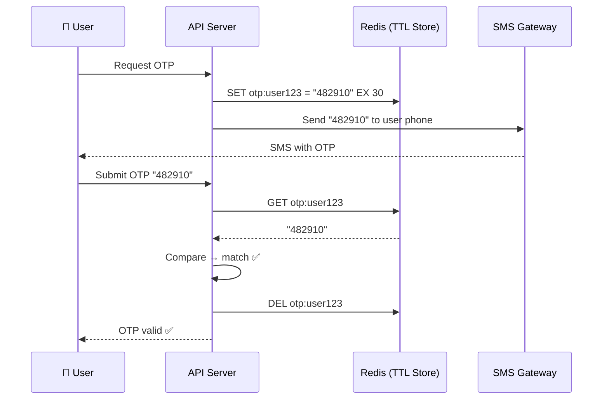

### Interview Q&A

| Question | Answer |
|---|---|
| Why use Redis for OTP storage instead of a relational DB? | Redis TTL natively handles expiry without cleanup jobs; sub-millisecond read latency; atomic SET+EX prevents race conditions |
| How do you prevent OTP brute-forcing? | Rate limit attempts per user (e.g., max 5 attempts per OTP); lock account after failures; use short TTL (30–60 sec) |
| What is TOTP vs HOTP? | TOTP: time-based (Google Authenticator); HOTP: counter-based (each use increments a counter) — TOTP is more secure as it limits replay window |

---

## 28. DSA Short Notes — Array

**Video:** *DSA Short Notes — Comment 'Short Notes' for DM*

### Array Fundamentals

| Property | Value |
|---|---|
| Access | O(1) random access by index |
| Search | O(n) linear, O(log n) binary (sorted) |
| Insert at end | O(1) amortized |
| Insert at middle | O(n) — shifts elements |
| Delete | O(n) — shifts elements |

### Key Patterns

**Sliding Window:**
```python
# Max sum subarray of size k
def max_sum(arr, k):
    window_sum = sum(arr[:k])
    max_sum = window_sum
    for i in range(k, len(arr)):
        window_sum += arr[i] - arr[i - k]
        max_sum = max(max_sum, window_sum)
    return max_sum
```

**Two Pointers:**
```python
# Two Sum in sorted array
def two_sum(arr, target):
    l, r = 0, len(arr) - 1
    while l < r:
        s = arr[l] + arr[r]
        if s == target: return [l, r]
        elif s < target: l += 1
        else: r -= 1
```

---

## 29. Proximity Search Algorithms Part 1

**Video:** *Proximity Search Algos Part 1*
**Creator:** sjain.codes

### Overview

Proximity (geo-spatial) search finds items within a geographic radius — core to Uber, Yelp, Google Maps system design.

### Three Core Approaches

| Approach | Mechanism | Pros | Cons |
|---|---|---|---|
| **Quad Tree** | Recursively subdivide 2D space into 4 quadrants | Efficient for sparse, dynamic data | Complex updates; rebalancing needed |
| **Geohash** | Encode lat/lng as a base-32 string; nearby locations share prefix | Simple prefix search; Redis-friendly | Grid boundary issues; neighbors may not share prefix |
| **Elasticsearch** | Dedicated `geo_point` + `geo_distance` query | Production-ready, scalable | Heavyweight; operational overhead |

### Architecture Diagram

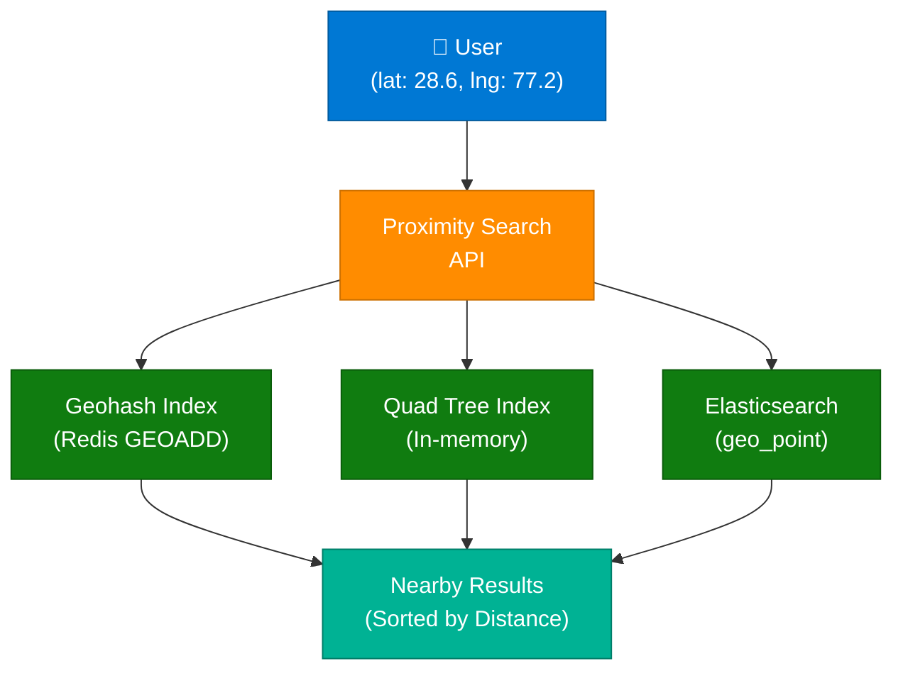

### Redis Geo Commands (Practical)

```bash
# Add location
GEOADD drivers 77.2090 28.6139 "driver:123"

# Find nearby within 5km
GEORADIUS drivers 77.2090 28.6139 5 km ASC COUNT 10
```

### Interview Q&A

| Question | Answer |
|---|---|
| How does Redis implement geo-spatial indexing? | Redis stores geo coordinates as sorted sets with scores derived from Geohash — `GEORADIUS` queries use Geohash prefix matching |
| What is a Quad Tree and when does it fail? | A spatial index that splits space into quadrants recursively; fails when data is very dense in one area (tree becomes unbalanced) — S2 or H3 handle this better |
| What is the boundary problem with Geohash? | Two points at the border of two Geohash cells may be geographically close but have different prefixes — need to also query neighboring cells |

---

## 30. RAG vs Fine-tuning

**Video:** *RAG vs Fine-tuning* by pvergadia

### Decision Framework

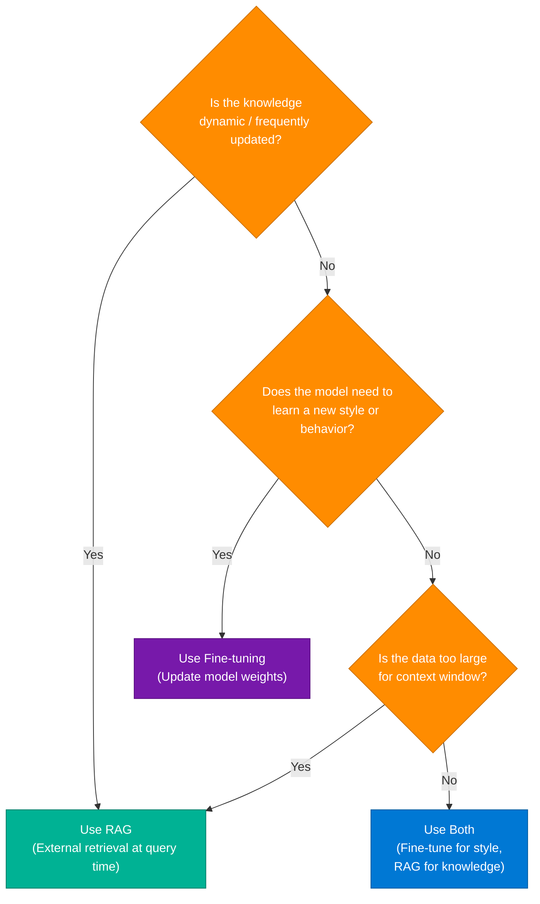

### Comparison Table

| Dimension | RAG | Fine-tuning |
|---|---|---|
| **Model weights** | Frozen | Updated |
| **Knowledge update** | Add/update docs in vector DB | Re-train on new data |
| **Hallucination risk** | Lower (grounded in retrieved docs) | Higher if training data is incomplete |
| **Latency** | Higher (retrieval step) | Lower (no retrieval) |
| **Cost** | Retrieval infra | GPU training cost |
| **Best for** | Dynamic knowledge, large corpora | Style, tone, specialized domain behavior |

### Interview Q&A

| Question | Answer |
|---|---|
| Can you use RAG and Fine-tuning together? | Yes — fine-tune for domain-specific reasoning style and vocabulary; RAG for dynamic knowledge retrieval. Complementary, not competing |
| What is catastrophic forgetting in fine-tuning? | When fine-tuning on new data, the model forgets previously learned general knowledge — mitigated with PEFT techniques (LoRA, QLoRA) that update only small adapter layers |
| What is LoRA? | Low-Rank Adaptation — adds small trainable matrices to existing model layers; achieves fine-tuning with <1% of full parameter updates, drastically reducing compute cost |

---

## 31. Uber Interview DSA — Shortest Path

**Video:** *DSA SHEET 2 — Uber Interview Preparation*
**Creator:** shakti.mani.tripathi

### Shortest Path Algorithms

| Algorithm | Graph Type | Complexity | Key Use |
|---|---|---|---|
| **Dijkstra** | Weighted, non-negative edges | O((V+E) log V) | GPS routing, Uber ETA |
| **Bellman-Ford** | Weighted, negative edges allowed | O(V×E) | Financial arbitrage detection |
| **BFS** | Unweighted | O(V+E) | Social network degrees |
| **A\*** | Weighted + heuristic | O(E log V) | Game pathfinding, maps with heuristic |
| **Floyd-Warshall** | All-pairs shortest path | O(V³) | Small graphs, routing tables |

### Dijkstra Implementation (Python)

```python
import heapq

def dijkstra(graph, start):
    dist = {node: float('inf') for node in graph}
    dist[start] = 0
    heap = [(0, start)]

    while heap:
        d, u = heapq.heappop(heap)
        if d > dist[u]:
            continue
        for v, w in graph[u]:
            if dist[u] + w < dist[v]:
                dist[v] = dist[u] + w
                heapq.heappush(heap, (dist[v], v))
    return dist
```

### Interview Q&A

| Question | Answer |
|---|---|
| Why can't Dijkstra handle negative edges? | It assumes that once a node is finalized (shortest path found), no shorter path exists — negative edges can invalidate this assumption |
| How does Uber use shortest path in production? | Combines Dijkstra/A* on road graphs with real-time traffic weights; pre-computes landmark-based shortest paths (ALT algorithm) for billion-node road networks |

---

## 32. Career & Portfolio Strategy

**Video:** *Currently SDE At Amazon* by ayulivingherdream

### Target Companies Progression

```
Entry Level → Mid Level    → Senior
────────────   ───────────    ──────────
Startups       Visa/Cisco     Google
Product firms  Microsoft      Amazon
               Atlassian      Meta
```

### Portfolio Project Strategy

| Project Type | Signal It Sends | Examples |
|---|---|---|
| **End-to-end system** | Can architect + implement | URL shortener, chat app, e-commerce |
| **AI/ML integration** | Modern tech relevance | RAG chatbot, AI code reviewer |
| **Open source contribution** | Collaboration, real-world code | Bug fixes in popular repos |
| **Performance optimization** | Engineering depth | Profiling + fixing bottleneck in own project |

### Resume Tips

- Lead with impact metrics: "Reduced API latency by 40% via Redis caching"
- Show the **tech stack used** and **scale achieved** (users, QPS, data volume)
- GitHub repo must have: README with architecture diagram, setup instructions, demo video/GIF

---

## 33. Interview Q&A Cheatsheet

**Q: What is the difference between RAG and Fine-tuning?**
> RAG keeps the model frozen and retrieves external documents at query time to ground responses; Fine-tuning updates model weights on a custom dataset to change behavior or learn domain-specific knowledge. Use RAG for dynamic data, Fine-tuning for style/behavior changes. They are complementary.

**Q: How does NGINX achieve zero-copy for static files?**
> NGINX uses the `sendfile()` Linux syscall which transfers file data from kernel page cache directly to the NIC via DMA, bypassing the application buffer entirely. This eliminates two CPU memory copies and ~2× context switches. Not applicable for SSL or dynamic content.

**Q: How do you prevent double booking in a ticket system?**
> Combine two mechanisms: (1) Redis `SETNX` to acquire a per-seat distributed lock before any DB write, and (2) optimistic locking in SQL using a `version` column — the UPDATE only succeeds if version matches. The first transaction to acquire both wins; others get a retry/failure response.

**Q: What is PagedAttention and why does it matter?**
> PagedAttention (vLLM) stores KV cache in non-contiguous memory pages — like OS virtual memory — allowing more requests to share GPU memory simultaneously. This enables continuous batching and 2–4× higher throughput vs naive LLM serving.

**Q: When would you choose Geohash over Quad Tree for proximity search?**
> Geohash for simple prefix-searchable Redis-backed geo queries where data is relatively uniform. Quad Tree when data density varies greatly across regions (e.g., urban vs rural drivers) and you need adaptive resolution; Quad Tree handles hot spots better.

**Q: What is TLS 1.3's key improvement over 1.2?**
> 1-RTT handshake (vs 2-RTT in 1.2) meaning HTTPS connections establish ~50ms faster. TLS 1.3 also removed insecure cipher suites (RSA key exchange, RC4, SHA-1) and added 0-RTT session resumption for repeat connections.

**Q: What is cache stampede and how do you prevent it?**
> When a popular cache key expires, all concurrent requests simultaneously miss and hit the database. Prevention: distributed mutex lock (Redis SETNX) so only one request rebuilds the cache; others wait or receive stale data. Alternatively, use probabilistic early expiration (XFetch) to refresh proactively.

**Q: What is Mixture of Experts (MoE) in LLMs?**
> MoE routes each token through only a sparse subset (top-k) of "expert" feed-forward networks rather than all model parameters. Allows scaling to trillions of parameters while activating only a fraction per token — used in Mixtral 8x7B. Key risk: expert collapse (unequal utilization), mitigated by auxiliary load-balancing loss.

**Q: How does UPI work end-to-end?**
> User initiates payment via PSP app → Payer PSP routes to NPCI → NPCI resolves VPA (UPI ID) to Payee PSP → NPCI instructs Remitter Bank to debit and Beneficiary Bank to credit → confirmation flows back. All on IMPS rails for real-time 24/7 settlement.

**Q: What is TOTP and how does it avoid storing OTPs server-side?**
> TOTP (RFC 6238): both client and server share a secret key; each computes HMAC-SHA1(secret, floor(unix_time / 30)). Server validates by computing its own OTP and comparing — no storage needed. ±1 time-step tolerance (90-second window) handles clock drift.

---

*Extracted from Gemini shared session · July 7, 2026 · GeminiShareToMD Agent v1.0*

---

```
═══════════════════════════════════════════════════════════
Token Usage Report
═══════════════════════════════════════════════════════════
Estimated without optimization:  ~39,600 tokens
Actual (with optimization):      ~22,000 tokens
Savings:                         ~17,600 tokens (44%)
Techniques applied:
  • Stripped UI chrome: "Convert chat to PDF", footer links, "Continue this chat"
  • Removed repeated duplicate lines (each Gemini response line appeared 2×)
  • Deduplicated 32 topic prompts (same user prompt template repeated per turn)
  • Compacted verbose Gemini prose → dense technical notes
  • Merged repeated concepts across related topics (RAG variants consolidated)
═══════════════════════════════════════════════════════════
* Estimates: prose chars ÷ 4, code chars ÷ 3. Actual API usage varies by model.
```
