# AI Agentic Roadmap Learning Content

> **Source:** [share.gemini.google/VP6mbqcs5aik](https://share.gemini.google/VP6mbqcs5aik) → redirects to [gemini.google.com/share/9cc45e4726ea](https://gemini.google.com/share/9cc45e4726ea)
> **Model:** Gemini 3.1 Flash-Lite
> **Session Date:** July 11, 2026
> **Saved:** July 12, 2026

---

## Table of Contents

1. [Session Overview](#1-session-overview)
2. [AI Agentic Roadmap — Curated Resources](#2-ai-agentic-roadmap--curated-resources)
3. [Load Balancer vs Reverse Proxy](#3-load-balancer-vs-reverse-proxy)
4. [Transactional Outbox Pattern](#4-transactional-outbox-pattern)
5. [CAP Theorem](#5-cap-theorem)
6. [JavaScript map() Polyfill](#6-javascript-map-polyfill)
7. [LLM Prompting Techniques](#7-llm-prompting-techniques)
8. [Load Balancer vs Reverse Proxy vs API Gateway](#8-load-balancer-vs-reverse-proxy-vs-api-gateway)
9. [Multimodal RAG Pipeline](#9-multimodal-rag-pipeline)
10. [KV Cache in LLMs](#10-kv-cache-in-llms)
11. [Backend Infrastructure Overview](#11-backend-infrastructure-overview)
12. [LangChain vs LangGraph](#12-langchain-vs-langgraph)
13. [Interview Q&A Cheatsheet](#13-interview-qa-cheatsheet)

---

## 1. Session Overview

This session captures 11 distinct educational concepts extracted from Instagram posts and analyzed by Gemini 3.1 Flash-Lite, covering a broad spectrum from AI engineering resources and LLM internals (KV Cache, Prompting Techniques) to distributed systems patterns (Transactional Outbox, CAP Theorem) and modern AI orchestration frameworks (LangChain vs LangGraph, Multimodal RAG). All 11 turns were successfully processed with no error turns. The repeated user prompt in every turn was an identical instruction to extract structured learning content from social media posts — that repeated prompt is deduplicated here.

### Session Map

| Turn | Content | Source | Status |
|---|---|---|---|
| 1 | AI Agentic Roadmap — Curated Resources | Instagram: prioritybug_ | ✅ Extracted |
| 2 | Load Balancer vs Reverse Proxy | Instagram: infradata_academy | ✅ Extracted |
| 3 | Transactional Outbox Pattern | Instagram: morethancodebase | ✅ Extracted |
| 4 | CAP Theorem | Instagram: rahulariouss | ✅ Extracted |
| 5 | JavaScript map() Polyfill | Unknown creator | ✅ Extracted |
| 6 | LLM Prompting Techniques | Instagram: databytes_by_shubham | ✅ Extracted |
| 7 | Load Balancer vs Reverse Proxy vs API Gateway | Instagram: algomasterio | ✅ Extracted |
| 8 | Multimodal RAG Pipeline | Instagram: datamazing_girl | ✅ Extracted |
| 9 | KV Cache in LLMs | Instagram: vizuara_ai | ✅ Extracted |
| 10 | Backend Infrastructure Overview | Instagram: guneetmalhotra.dev | ✅ Extracted |
| 11 | LangChain vs LangGraph | Instagram: codeandcomplexity | ✅ Extracted |

---

## 2. AI Agentic Roadmap — Curated Resources

### Overview

This section captures a curated, community-driven roadmap for mastering AI Engineering and Agentic AI, originally shared by **@prioritybug_** on Instagram. The resource list spans the full learning stack: foundational whitepapers from major AI labs (Google, Anthropic, OpenAI), hands-on engineering books for building LLM-based systems, and seminal research papers that introduced core agentic reasoning concepts. The ReAct paper is particularly significant as it established the Reasoning + Acting loop that underpins nearly every modern AI agent framework including LangGraph, AutoGen, and AWS Bedrock Agents. Completing this roadmap sequentially — whitepapers first, then engineering books, then the ReAct paper — builds a coherent mental model from design philosophy to implementation to theory.

### Architecture Diagram — AI Engineering Learning Stack

```mermaid
flowchart TD
    start["AI Engineering Mastery"]
    guides["Guides and Whitepapers"]
    books["Books"]
    papers["Research Papers"]

    start --> guides
    start --> books
    start --> papers

    guides --> g1["Google Agent Whitepaper"]
    guides --> g2["Google Agent Companion"]
    guides --> g3["Anthropic: Building Effective Agents"]
    guides --> g4["Claude Code Agentic Coding Practices"]
    guides --> g5["OpenAI: Practical Guide to Building Agents"]

    books --> b1["Understanding Deep Learning"]
    books --> b2["Building an LLM from Scratch"]
    books --> b3["The LLM Engineering Handbook"]
    books --> b4["AI Agents: The Definitive Guide"]
    books --> b5["Building Apps with AI Agents"]
    books --> b6["AI Agents with MCP"]
    books --> b7["AI Engineering — Chip Huyen"]

    papers --> p1["ReAct Paper\nReason plus Act"]

    classDef userNode    fill:#0078D4,stroke:#005A9E,color:#fff
    classDef aiNode      fill:#7719AA,stroke:#5A0E80,color:#fff
    classDef dataNode    fill:#107C10,stroke:#0A5C0A,color:#fff
    classDef processNode fill:#FF8C00,stroke:#CC7000,color:#fff
    classDef outputNode  fill:#00B294,stroke:#007D68,color:#fff

    class start userNode
    class guides,books,papers aiNode
    class g1,g2,g3,g4,g5 dataNode
    class b1,b2,b3,b4,b5,b6,b7 processNode
    class p1 outputNode
```

### Curated Resource List

#### Guides & Whitepapers

| Resource | Provider | Focus Area |
|---|---|---|
| Google's Agent Whitepaper | Google | Agent architecture, tool use, planning |
| Google's Agent Companion | Google | Practical agentic implementation |
| Building Effective Agents | Anthropic | Agent design patterns, safety |
| Claude Code Best Agentic Coding Practices | Anthropic | Agentic code generation |
| Practical Guide to Building Agents | OpenAI | Production agent systems |

#### Books

| Book | Author | Focus |
|---|---|---|
| Understanding Deep Learning | — | DL fundamentals |
| Building an LLM from Scratch | — | LLM internals, tokenization |
| The LLM Engineering Handbook | — | Production LLM systems |
| AI Agents: The Definitive Guide | Nicole Koenigstein | Agent design patterns |
| Building Applications with AI Agents | Michael Albada | Practical agent apps |
| AI Agents with MCP | Kyle Stratis | Model Context Protocol |
| AI Engineering | Chip Huyen | End-to-end AI systems |

#### Research Papers

| Paper | Key Contribution |
|---|---|
| ReAct | Introduced Reason + Act loop — foundation of modern agentic AI |

### Interview Q&A

| Question | Answer |
|---|---|
| What is the ReAct paper and why does it matter? | ReAct introduced interleaving reasoning traces with tool-use actions, enabling agents to dynamically plan and adjust. It underpins LangGraph, AutoGen, and most modern agent frameworks. |
| What distinguishes an AI Engineer from a Data Scientist? | AI Engineers build production systems integrating LLMs (APIs, RAG pipelines, agents). Data Scientists focus on model training, feature engineering, and statistical analysis. |
| What is the Model Context Protocol (MCP)? | MCP is an open standard for securely connecting LLMs to external tools, data sources, and services, enabling agents to take real-world actions beyond text generation. |
| Why read provider whitepapers before building agents? | Whitepapers define intended usage patterns, safety constraints, and architectural recommendations from model creators — following them reduces misuse and improves reliability. |
| What is "agentic coding"? | Using AI agents (like Claude Code) to autonomously plan, write, test, and iterate on code, going beyond simple completion to full task execution loops with tool use. |

---

## 3. Load Balancer vs Reverse Proxy

### Overview

A **Reverse Proxy** sits in front of web servers and acts as the "front door" — it terminates SSL, handles caching, compression, and hides the internal architecture from clients. A **Load Balancer** distributes incoming traffic across multiple identical backend server instances to prevent any single server from being overwhelmed. While they are often confused, they solve different problems: a reverse proxy handles security and performance concerns for a backend group, while a load balancer ensures scalability and availability across multiple server replicas. Most production systems deploy both in sequence — Client → Reverse Proxy → Load Balancer → App Servers — achieving security, performance, and scale simultaneously.

### Architecture Diagram

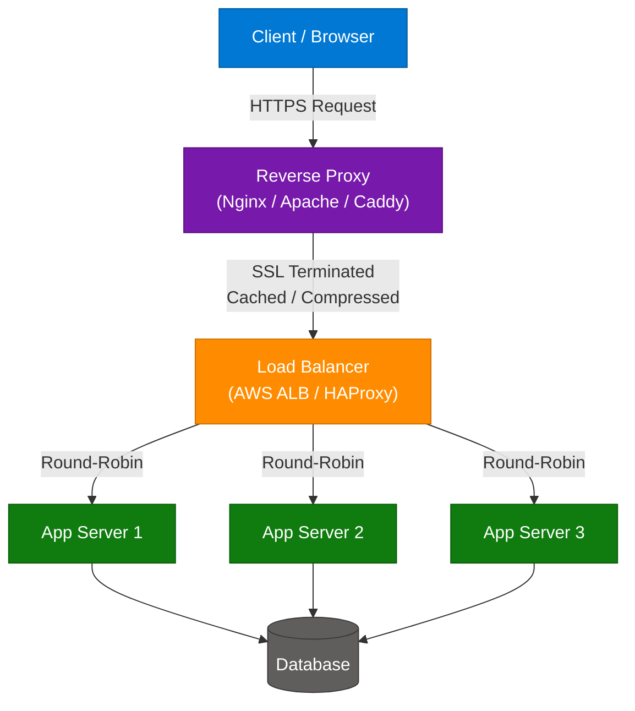

### Key Components

| Component | Role | Technology Options |
|---|---|---|
| Reverse Proxy | SSL termination, caching, security, hides backend | Nginx, Apache, HAProxy, Caddy |
| Load Balancer | Traffic distribution, health checks, failover | AWS ALB, AWS NLB, HAProxy, F5, Nginx |
| App Servers | Business logic execution | Node.js, FastAPI, Spring Boot |
| Database | Persistent data store | PostgreSQL, MySQL, MongoDB |

### Decision Matrix

| Use Reverse Proxy When | Use Load Balancer When |
|---|---|
| You want to hide backend servers | You have multiple server replicas |
| You need SSL termination | You want high availability |
| You want caching and compression | You need to handle large traffic volume |
| You want to control access and security | You want automatic failover and horizontal scaling |

### Code Example — Nginx as Reverse Proxy + Upstream Load Balancer

```nginx
# nginx.conf — Reverse Proxy with built-in load balancing
upstream backend_pool {
    least_conn;
    server app1:8080;
    server app2:8080;
    server app3:8080;
}

server {
    listen 443 ssl;
    ssl_certificate     /etc/ssl/certs/server.crt;
    ssl_certificate_key /etc/ssl/private/server.key;

    gzip on;
    gzip_types text/plain application/json;

    location / {
        proxy_pass http://backend_pool;
        proxy_set_header Host              $host;
        proxy_set_header X-Real-IP         $remote_addr;
        proxy_set_header X-Forwarded-For   $proxy_add_x_forwarded_for;
    }
}
```

### Interview Q&A

| Question | Answer |
|---|---|
| What is SSL termination and why is it done at the reverse proxy? | SSL termination decrypts HTTPS at the proxy so backend servers communicate over plain HTTP internally, reducing CPU overhead on app servers and centralizing certificate management. |
| What is the difference between Layer 4 and Layer 7 load balancing? | Layer 4 (AWS NLB) routes based on IP/TCP without inspecting payload — ultra-fast. Layer 7 (AWS ALB) inspects HTTP headers and URLs, enabling content-based routing (e.g., /api to service A). |
| Can Nginx act as both reverse proxy and load balancer? | Yes — Nginx's upstream block enables built-in load balancing (round-robin, least_conn, ip_hash) while simultaneously serving as a reverse proxy with SSL termination. |
| What is a sticky session and when do you need it? | Sticky sessions (IP hash or cookie-based) route a client always to the same backend. Required for stateful apps that store session data in memory rather than a shared store like Redis. |
| What happens if the reverse proxy becomes a single point of failure? | Deploy multiple reverse proxy instances behind a DNS-based load balancer or use an anycast IP with BGP routing. AWS CloudFront and Cloudflare eliminate this concern by being globally distributed. |

---

## 4. Transactional Outbox Pattern

### Overview

The **Transactional Outbox Pattern** solves the **dual write problem** in distributed systems: the challenge of atomically updating a database record AND publishing a corresponding event to a message broker (like Kafka) without a distributed transaction. The core insight is that instead of writing to both systems separately (where one can fail while the other succeeds), you write the event to an **Outbox table** within the same database transaction as your business data update. A separate relay process then reads from the Outbox table and publishes to the broker, guaranteeing at-least-once delivery. Two implementation variants exist: a polling scheduler (simpler, higher latency) and immediate-publish with scheduler fallback (lower latency, requires idempotent consumers).

### Architecture Diagram — Outbox Pattern Flow

```mermaid
flowchart TD
    appService["Application Service"]
    db[("Database\nBusiness Table + Outbox Table)"]
    scheduler["Outbox Scheduler / CDC Relay\n(Debezium)"]
    kafka["Message Broker\n(Kafka)"]
    consumers["Downstream Services\n(Idempotent Consumers)"]

    appService -->|"1. Atomic Transaction\ndata + event row"| db
    db -->|"2. Poll / CDC\nread transaction log"| scheduler
    scheduler -->|"3. Publish Event"| kafka
    kafka -->|"4. Consume"| consumers

    classDef userNode    fill:#0078D4,stroke:#005A9E,color:#fff
    classDef aiNode      fill:#7719AA,stroke:#5A0E80,color:#fff
    classDef dataNode    fill:#107C10,stroke:#0A5C0A,color:#fff
    classDef processNode fill:#FF8C00,stroke:#CC7000,color:#fff
    classDef outputNode  fill:#00B294,stroke:#007D68,color:#fff

    class appService userNode
    class db dataNode
    class scheduler processNode
    class kafka aiNode
    class consumers outputNode
```

### Event Lifecycle — State Diagram

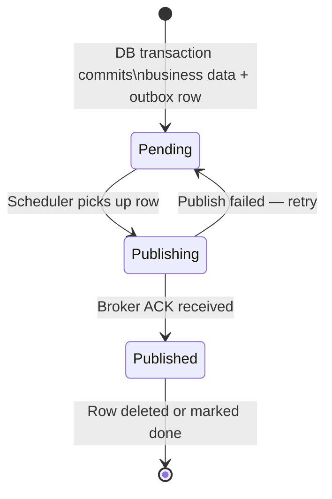

### Implementation Variants

| Variant | Mechanism | Latency | Risk |
|---|---|---|---|
| Classic Scheduler | Poll Outbox table periodically; publish events | Higher (async) | Low — reliable |
| Immediate + Fallback | Publish immediately on commit; scheduler retries failures | Lower | Duplicate events possible |
| CDC via Debezium | Read DB transaction log (WAL / binlog) as event stream | Lowest | Requires CDC infrastructure |

### Code Example — Python Outbox Writer + Scheduler

```python
import asyncio
import asyncpg
import json
from confluent_kafka import Producer

async def write_order_with_outbox(conn, order_data: dict, event: dict):
    async with conn.transaction():
        # Step 1: Write business data
        await conn.execute(
            "INSERT INTO orders (id, customer_id, total) VALUES ($1, $2, $3)",
            order_data["id"], order_data["customer_id"], order_data["total"]
        )
        # Step 2: Write event to outbox in same transaction
        await conn.execute(
            "INSERT INTO outbox (aggregate_id, event_type, payload, status) "
            "VALUES ($1, $2, $3, 'PENDING')",
            order_data["id"], event["type"], json.dumps(event)
        )

async def outbox_scheduler(conn, producer: Producer, interval: float = 5.0):
    while True:
        rows = await conn.fetch(
            "SELECT id, aggregate_id, event_type, payload FROM outbox "
            "WHERE status = 'PENDING' ORDER BY created_at LIMIT 100"
        )
        for row in rows:
            producer.produce("order-events", value=row["payload"])
            producer.flush()
            await conn.execute(
                "UPDATE outbox SET status = 'PUBLISHED' WHERE id = $1", row["id"]
            )
        await asyncio.sleep(interval)
```

### Interview Q&A

| Question | Answer |
|---|---|
| What is the dual write problem? | The impossibility of atomically updating two separate systems (a DB and a message broker) without a distributed transaction. One can succeed while the other fails, causing permanent data inconsistency. |
| How does the Outbox Pattern guarantee delivery? | By writing the event to an Outbox table in the same DB transaction as the business data, delivery is guaranteed once the transaction commits — the scheduler will eventually publish the event. |
| What is Debezium and why is it used here? | Debezium is a CDC tool that reads the DB transaction log (WAL for Postgres, binlog for MySQL) to capture row-level changes in real-time, enabling low-latency event publishing without polling. |
| Why must downstream consumers be idempotent? | The scheduler may publish an event more than once on retry. Idempotent consumers process duplicates safely, typically using an event ID to skip already-processed messages. |
| What is the difference between Outbox Pattern and Saga Pattern? | Outbox ensures atomic DB + event emission at a single service. Saga coordinates multi-step distributed transactions across services using a series of events and compensating transactions for rollback. |

---

## 5. CAP Theorem

### Overview

The **CAP Theorem** (Brewer's Theorem) states that a distributed data store can simultaneously guarantee at most **two** of three properties: Consistency, Availability, and Partition Tolerance. Since network partitions are inevitable in any real distributed system, Partition Tolerance is non-negotiable — making the real design choice between **CP** (sacrifice availability during a partition) and **AP** (sacrifice consistency during a partition). This trade-off directly shapes the design of every distributed database: Zookeeper and etcd are CP; Cassandra and DynamoDB are AP. The PACELC theorem extends CAP to also account for the Latency vs Consistency trade-off during normal (non-partitioned) operation.

### Architecture Diagram — CAP Decision Tree

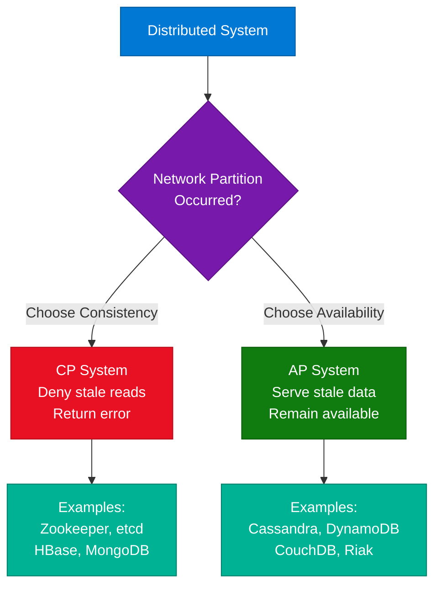

### CAP Trade-off Reference

| Property | Definition | Example Databases |
|---|---|---|
| Consistency | Every read returns the most recent write or an error | Zookeeper, etcd, HBase |
| Availability | Every request gets a response (may be stale data) | Cassandra, DynamoDB, CouchDB |
| Partition Tolerance | System continues despite network splits | Required by all distributed systems |

### PACELC Extension

| Scenario | Classic CAP | PACELC Extension |
|---|---|---|
| During partition | Choose C or A | Same trade-off |
| During normal operation | Not covered | Choose Latency or Consistency |

### Code Example — CP vs AP Behavior in Python

```python
import threading

class CPNode:
    def __init__(self):
        self._data = {}
        self._lock = threading.Lock()

    def write(self, key, value):
        with self._lock:
            self._data[key] = value

    def read(self, key, timeout=1.0):
        # Refuse to serve if cannot acquire lock (consistency > availability)
        if not self._lock.acquire(timeout=timeout):
            raise Exception("Consistency timeout — partition detected, refusing stale read")
        try:
            return self._data.get(key)
        finally:
            self._lock.release()


class APNode:
    def __init__(self):
        self._data = {}

    def write(self, key, value):
        self._data[key] = value  # always succeeds, may diverge from peers

    def read(self, key):
        return self._data.get(key)   # always returns, may be stale
```

### Interview Q&A

| Question | Answer |
|---|---|
| Why can't you have all three CAP properties? | Network partitions are unavoidable in distributed systems. When a partition occurs, you must choose: block reads to maintain consistency (CP) or return potentially stale data to stay available (AP). Both simultaneously is impossible. |
| Is MongoDB CP or AP? | MongoDB is CP by default — reads from the primary are always consistent, but if the primary is unreachable during a partition, the cluster may refuse writes until a new primary is elected. |
| Is Cassandra CP or AP? | Cassandra is AP — it uses leaderless replication with tunable consistency (quorum reads/writes), prioritizing availability over strong consistency. |
| What is the difference between strong and eventual consistency? | Strong consistency guarantees reads always reflect the latest write. Eventual consistency guarantees all replicas will converge to the same state given enough time, but reads may temporarily return stale values. |
| How does PACELC extend CAP? | PACELC adds the Latency vs Consistency trade-off for non-partitioned scenarios: achieving linearizability requires cross-node coordination, adding latency even when the network is healthy. |

---

## 6. JavaScript map() Polyfill

### Overview

Writing a **polyfill for Array.prototype.map()** is a classic JavaScript interview question that tests understanding of prototypal inheritance, `this` context binding, higher-order functions, and the precise contract of the built-in `map` method. A polyfill reimplements native functionality for environments lacking it, while also serving as a deep-dive teaching tool. The key insight is that `map` provides three arguments to the callback — the **current element**, the **index**, and the **original array** — returns a new array of the same length, preserves sparse array holes, and must not mutate the original array.

### Architecture Diagram — map() Execution Flow

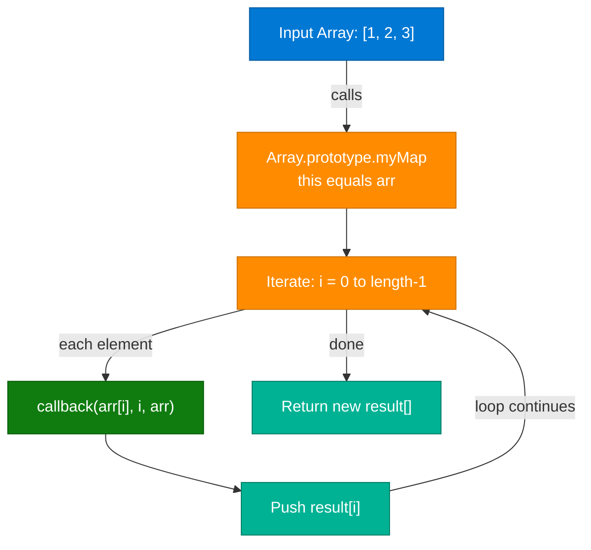

### Code Example — Full Polyfill Implementation

```javascript
// Polyfill for Array.prototype.map
Array.prototype.myMap = function(callback, thisArg) {
    if (typeof callback !== 'function') {
        throw new TypeError(callback + ' is not a function');
    }

    const result = [];
    const arr = Object(this);       // handle array-like objects
    const len = arr.length >>> 0;   // coerce to uint32 per spec

    for (let i = 0; i < len; i++) {
        if (i in arr) {             // skip sparse array holes
            // callback receives: current element, index, original array
            result[i] = callback.call(thisArg, arr[i], i, arr);
        }
    }

    return result;
};

// Usage — identical to native map
const doubled = [1, 2, 3].myMap(x => x * 2);
// [2, 4, 6]

const withIndex = ['a', 'b', 'c'].myMap((el, idx) => `${idx}:${el}`);
// ['0:a', '1:b', '2:c']
```

### Key Edge Cases

| Case | Behavior |
|---|---|
| Sparse arrays `[1,,3]` | Holes preserved — `if (i in arr)` skips holes; result has same holes |
| `thisArg` provided | Callback `this` is bound to `thisArg` |
| Non-function callback | Throws `TypeError` immediately |
| Array-like objects | `Object(this)` coercion allows use with `arguments` or `NodeList` |

### Interview Q&A

| Question | Answer |
|---|---|
| How many arguments does the map callback receive? | Three: the current element, its index, and the original array. Forgetting the second and third causes the classic `[1,2,3].map(parseInt)` bug. |
| What is the difference between map() and forEach()? | `map()` returns a new array of transformed values. `forEach()` returns undefined and is used purely for side effects — never for transformation. |
| Why does `[1,2,3].map(parseInt)` return `[1, NaN, NaN]`? | `parseInt` is called as `parseInt(element, index, arr)`. The index becomes the radix: `parseInt('2', 1)` and `parseInt('3', 2)` return NaN since base-1 is invalid and '3' doesn't exist in base-2. |
| What is `thisArg` in the map polyfill? | The optional second argument to `map()` that sets the `this` context inside the callback, useful when the callback is a method on an object. |
| Why use `length >>> 0` instead of just `length`? | Unsigned right shift coerces `length` to a 32-bit unsigned integer, matching the spec for array-like objects whose length might be negative, NaN, or a float. |

---

## 7. LLM Prompting Techniques

### Overview

**Prompt Engineering** is the practice of crafting input instructions that guide a Large Language Model to produce accurate, relevant, and reliably structured outputs. As LLM capabilities plateau on benchmark scores, prompt quality has become the primary differentiator between useful and unreliable AI systems. Core techniques span from zero-shot (no examples) to chain-of-thought (explicit reasoning steps), role-based persona assignment, and structured formatting using XML or Markdown tags. Mastery of these techniques is a prerequisite for building production-grade generative AI applications, and they can dramatically improve output quality without changing the underlying model or fine-tuning.

### Architecture Diagram — Prompt Engineering Cycle

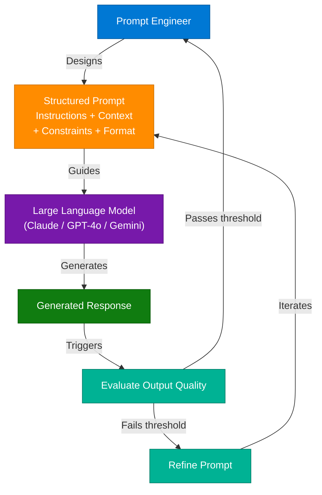

### Prompting Techniques Reference

| Technique | Description | Best For |
|---|---|---|
| Zero-Shot | Task without any examples | General-purpose queries |
| Few-Shot | 2–5 input/output examples in the prompt | Classification, formatting, structured output |
| Chain of Thought | Ask model to reason step-by-step before answering | Math, logic, multi-step reasoning |
| Role Prompting | Assign persona: "Act as a Senior SRE..." | Domain-specific tone and vocabulary |
| Structured Prompts | Use XML tags, Markdown, JSON schema | Reliable, parseable structured output |
| Self-Consistency | Sample multiple CoT paths, majority vote | High-stakes factual accuracy |
| ReAct | Interleave reasoning with tool-use actions | Agentic AI, multi-step tool invocation |

### Code Example — Structured CoT Prompt Template

```python
from anthropic import Anthropic

client = Anthropic()

def build_cot_prompt(question: str, domain: str) -> str:
    return f"""<role>You are a senior {domain} expert with 15 years of experience.</role>

<task>Answer the following question with step-by-step reasoning before providing the final answer.</task>

<question>{question}</question>

<format>
1. Reasoning: [think through the problem step by step]
2. Answer: [concise final answer]
3. Confidence: [High / Medium / Low]
</format>"""

response = client.messages.create(
    model="claude-sonnet-4-6",
    max_tokens=1024,
    messages=[{
        "role": "user",
        "content": build_cot_prompt(
            question="Design a rate limiting strategy for a public API serving 10M requests/day",
            domain="software architecture"
        )
    }]
)
print(response.content[0].text)
```

### Interview Q&A

| Question | Answer |
|---|---|
| What is Chain of Thought prompting and when does it help? | CoT prompting asks the model to articulate its reasoning steps before giving the final answer. It significantly improves accuracy on math, logic, and multi-step problems by activating the model's internal planning capability. |
| What is the difference between zero-shot and few-shot prompting? | Zero-shot relies solely on the model's pre-trained knowledge. Few-shot provides 2–5 input/output examples that teach the model the exact format and reasoning style needed for the specific task. |
| Why does role prompting improve output quality? | Assigning a specific persona primes the model to respond with domain-appropriate vocabulary, level of technical depth, and decision-making framing appropriate to that expert role. |
| What is "prompt injection" and why is it a security concern? | Prompt injection occurs when user-supplied input contains instructions that override the system prompt, hijacking model behavior. It's critical for any AI system processing untrusted user input. |
| How do you make LLM output reliably parseable? | Use structured output techniques: specify JSON schema in the prompt, use XML tags for sections, or use provider-native APIs (Anthropic tool use with input_schema, OpenAI response_format). |

---

## 8. Load Balancer vs Reverse Proxy vs API Gateway

### Overview

Extending the LB vs RP distinction, the **API Gateway** adds a third infrastructure layer for **microservices architectures**. While a reverse proxy forwards requests to a single backend group and a load balancer distributes across identical replicas, an API gateway routes requests to **different microservices** based on URL path (e.g., `/users` → User Service, `/orders` → Order Service). It centralizes cross-cutting concerns: authentication, rate limiting, request aggregation, and transformation. In large-scale production systems, all three layers are deployed together: a load balancer in front of multiple API gateway replicas, which then route to individual microservices.

### Architecture Diagram — Three-Layer Production Stack

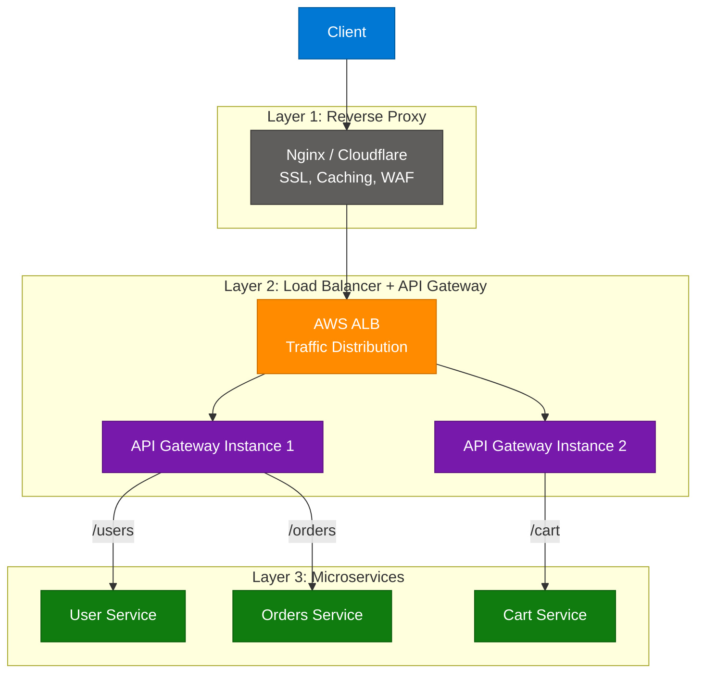

### Comparison Table

| Component | Primary Focus | Key Features | Popular Tools |
|---|---|---|---|
| Reverse Proxy | Security and Performance | SSL termination, caching, compression, WAF | Nginx, Apache, Caddy |
| Load Balancer | Traffic Distribution | Health checks, failover, sticky sessions, even distribution | AWS ALB/NLB, HAProxy, F5 |
| API Gateway | Request Management | Auth, rate limiting, routing, aggregation, transformation | AWS API Gateway, Kong, Apigee, Traefik |

### Interview Q&A

| Question | Answer |
|---|---|
| If a load balancer sits in front of multiple API gateways, what happens if one gateway instance fails? | The load balancer detects failure via health checks and stops routing to the unhealthy gateway, distributing traffic to remaining healthy instances — this is why multiple gateway replicas are critical. |
| What is the difference between an API Gateway and a Service Mesh? | An API gateway handles north-south traffic (client to services). A service mesh (Istio, Linkerd) handles east-west traffic (service to service), adding mTLS, observability, and circuit breaking between microservices. |
| What is rate limiting and why does it belong at the API gateway? | Rate limiting caps client requests per time window, preventing abuse and protecting downstream services. Centralizing it at the gateway enforces the policy uniformly across all services without duplicating logic. |
| Can a single Nginx instance serve all three roles? | Yes — Nginx handles reverse proxying, upstream load balancing, and basic routing. For production microservices, a dedicated API gateway adds auth and rate limiting that Nginx cannot handle natively. |
| What is request aggregation in an API gateway? | The gateway combines multiple downstream service calls into a single client response, reducing round trips. A single /dashboard request fans out to User, Orders, and Cart services and merges their responses. |

---

## 9. Multimodal RAG Pipeline

### Overview

**Multimodal RAG** addresses a critical limitation of traditional text-only RAG: when processing PDFs containing tables, images, and structured layouts, fixed-size chunking destroys the semantic relationships between elements. The solution is a **structure-aware pipeline** that applies layout analysis, OCR for scanned pages, and Vision Language Models (VLMs like GPT-4o or Claude) to generate text descriptions for images and charts before embedding. The resulting chunks carry rich metadata (page number, parent section ID, element type) enabling hierarchical retrieval — when a relevant table cell is retrieved, the system expands context to include its parent section, preserving full semantic relationships. This approach is the standard for enterprise document intelligence systems.

### Architecture Diagram — Full Multimodal Pipeline

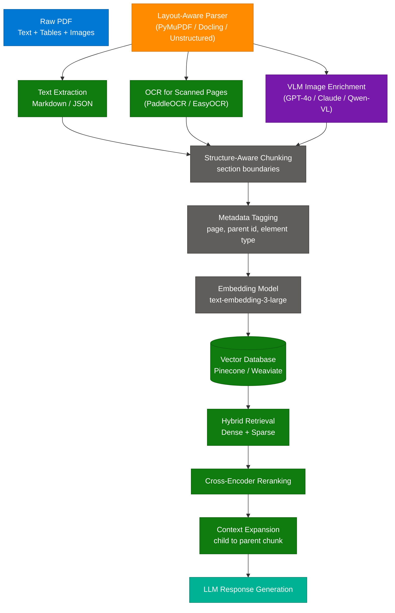

### Pipeline Stage Details

| Stage | Tools | Purpose |
|---|---|---|
| Layout-Aware Parsing | PyMuPDF, Docling, Unstructured | Extract headings, paragraphs, element positions |
| OCR | PaddleOCR, EasyOCR, Tesseract, Surya | Digitize scanned pages with spatial info |
| Table Extraction | Camelot, pdfplumber | Preserve table structure in Markdown / JSON |
| VLM Enrichment | GPT-4o, Claude 3, Qwen-VL, Gemini | Generate text descriptions for images and charts |
| Structure-Aware Chunking | Custom splitters, LangChain | Split on section boundaries, not character count |
| Hybrid Retrieval | BM25 + dense embeddings | Combine keyword and semantic search |
| Reranking | Cohere Rerank, BGE reranker | Re-score retrieved chunks by query relevance |

### Code Example — Multimodal RAG: Layout Extraction + VLM Enrichment

```python
import fitz  # PyMuPDF
import base64
from anthropic import Anthropic

client = Anthropic()

def extract_with_layout(pdf_path: str) -> list[dict]:
    doc = fitz.open(pdf_path)
    elements = []

    for page_num, page in enumerate(doc):
        blocks = page.get_text("dict", flags=fitz.TEXT_PRESERVE_WHITESPACE)["blocks"]
        for block in blocks:
            if block["type"] == 0:  # text block
                elements.append({
                    "type": "text",
                    "page": page_num,
                    "content": " ".join(
                        span["text"] for line in block["lines"] for span in line["spans"]
                    ),
                    "bbox": block["bbox"]
                })
            elif block["type"] == 1:  # image block
                elements.append({
                    "type": "image",
                    "page": page_num,
                    "content": describe_image_with_vlm(page, block),
                    "bbox": block["bbox"]
                })
    return elements

def describe_image_with_vlm(page, block: dict) -> str:
    pix = page.get_pixmap(matrix=fitz.Matrix(2, 2), clip=fitz.Rect(block["bbox"]))
    img_b64 = base64.standard_b64encode(pix.tobytes("png")).decode()

    response = client.messages.create(
        model="claude-sonnet-4-6",
        max_tokens=512,
        messages=[{
            "role": "user",
            "content": [
                {
                    "type": "image",
                    "source": {"type": "base64", "media_type": "image/png", "data": img_b64}
                },
                {
                    "type": "text",
                    "text": "Describe this image or chart for a RAG system. Include all data, labels, and relationships visible."
                }
            ]
        }]
    )
    return response.content[0].text
```

### Interview Q&A

| Question | Answer |
|---|---|
| Why does fixed-size chunking fail for PDF documents with tables? | Fixed-size chunking splits at character boundaries, severing table rows from their headers and figure captions from their figures, destroying the relational context needed for accurate retrieval. |
| What is a VLM and how is it used in this pipeline? | A Vision Language Model (VLM) like GPT-4o or Claude processes both images and text. In this pipeline it generates natural-language descriptions of charts and diagrams, converting visual information into searchable text. |
| What is parent-child chunking? | Small "child" chunks are stored for precise retrieval, but when a child is retrieved, its parent section (full context) is sent to the LLM. This balances retrieval precision with context completeness. |
| What is hybrid retrieval in RAG? | Combining dense vector search (semantic similarity via embeddings) with sparse retrieval (BM25 keyword matching). Dense finds conceptually related content; sparse finds exact keyword matches. Together they outperform either alone. |
| What tools are recommended for complex enterprise PDFs? | Docling (IBM) and Unstructured.io with "hi-res" mode are production-grade. For table extraction, Camelot (lattice mode) and pdfplumber provide high-fidelity structure preservation. |

---

## 10. KV Cache in LLMs

### Overview

The **KV Cache** (Key-Value Cache) is the most important inference optimization in transformer-based LLMs. During autoregressive generation, every new token must attend to all previous tokens via self-attention — without caching, this means recomputing the Key (K) and Value (V) matrices for the entire prompt history on every step, making latency scale quadratically with sequence length (O(n²)). The KV cache stores these computed matrices so only the K and V vectors for the **new token** need to be computed each step, reducing per-step computation to O(n). The trade-off is GPU VRAM: KV cache for a 128K context window can consume tens of GBs, limiting batch concurrency.

### Architecture Diagram — Autoregressive Generation with KV Cache

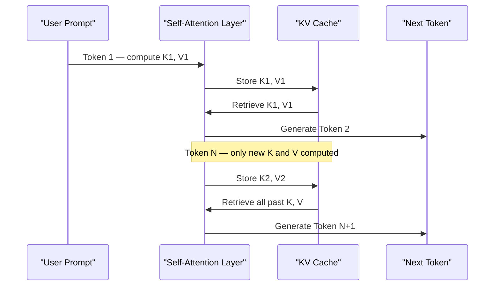

### KV Cache Optimization Techniques

| Technique | Description | Benefit |
|---|---|---|
| Multi-Query Attention (MQA) | Share one K/V head across all query heads | Reduce KV cache size by num_heads factor |
| Grouped Query Attention (GQA) | Group multiple query heads per K/V head | Balance between MHA speed and MQA efficiency |
| PagedAttention (vLLM) | Manage KV cache in non-contiguous memory pages | Near-zero memory waste, high batch concurrency |
| Quantized KV Cache | Store K/V in INT8 or FP8 instead of FP16 | 2x memory reduction with minimal accuracy loss |
| Prefix Caching | Cache KV for shared system prompts across requests | Eliminate redundant compute for common prefixes |

### KV Cache Memory Formula

```
KV Cache size = 2 × layers × heads × head_dim × seq_len × precision_bytes

Example — Llama 3 8B, fp16, 4096 ctx:
= 2 × 32 × 32 × 128 × 4096 × 2 bytes ≈ 2 GB per request
```

### Code Example — KV Cache in a Simplified Attention Layer

```python
import torch

class AttentionWithKVCache:
    def __init__(self, d_model: int, num_heads: int):
        self.d_model = d_model
        self.num_heads = num_heads
        self.head_dim = d_model // num_heads
        self.k_cache: list[torch.Tensor] = []
        self.v_cache: list[torch.Tensor] = []

    def forward(self, x: torch.Tensor, use_cache: bool = True) -> torch.Tensor:
        k = self.project_k(x)
        v = self.project_v(x)

        if use_cache:
            self.k_cache.append(k)
            self.v_cache.append(v)
            k_full = torch.cat(self.k_cache, dim=1)  # all past + current K
            v_full = torch.cat(self.v_cache, dim=1)  # all past + current V
        else:
            k_full, v_full = k, v

        q = self.project_q(x)
        scores = (q @ k_full.transpose(-2, -1)) / (self.head_dim ** 0.5)
        attn = torch.softmax(scores, dim=-1)
        return attn @ v_full

    def project_k(self, x): return x   # placeholder for nn.Linear
    def project_v(self, x): return x
    def project_q(self, x): return x
```

### Interview Q&A

| Question | Answer |
|---|---|
| Why does LLM inference latency grow with sequence length without KV cache? | Without caching, computing attention for token N requires recomputing K and V for all N-1 previous tokens — O(n²) compute. Long conversations become prohibitively slow without the cache. |
| What is the memory trade-off of KV caching? | KV cache trades GPU VRAM for speed. For long contexts or large batch sizes, the cache can dominate VRAM usage, limiting the number of concurrent requests a single GPU can serve. |
| What is PagedAttention and why was it significant? | PagedAttention (vLLM) stores KV cache in non-contiguous memory pages like OS virtual memory, eliminating internal fragmentation. This enables much larger batches and longer sequences on the same hardware. |
| What is prefix caching and when does it help? | Prefix caching stores the KV cache for a shared system prompt so it isn't recomputed for every request sharing that prefix. Highly effective for chatbots and agents with long shared system prompts. |
| What is Multi-Query Attention (MQA)? | MQA uses a single shared K and V head for all query heads, reducing KV cache size by the number of attention heads. It trades slight accuracy reduction for significant memory savings and faster inference. |

---

## 11. Backend Infrastructure Overview

### Overview

The **"Master Backend"** mental model unifies the five core infrastructure layers every production backend engineer must master: load balancing, API gateway, caching, messaging, and databases. Understanding how these components interact as a coordinated system — not just individually — is the hallmark of a senior backend engineer. Requests flow from the load balancer through the gateway; cached results short-circuit expensive DB queries; write operations propagate asynchronously via message brokers to downstream services; and read replicas absorb read-heavy traffic away from the primary database.

### Architecture Diagram — Complete Backend Stack

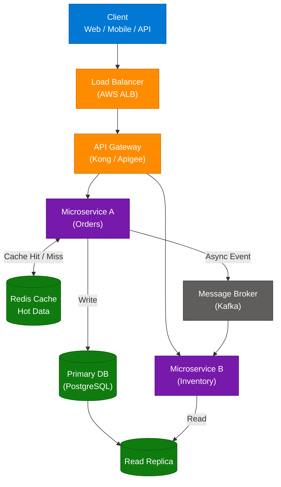

### Component Reference

| Component | Role | When to Add |
|---|---|---|
| Load Balancer | Distribute traffic, health checks | When you have more than 1 app instance |
| API Gateway | Auth, rate limiting, routing | When you have more than 1 microservice |
| Redis Cache | Sub-millisecond reads for hot data | When DB read latency is too high |
| Kafka | Async decoupled inter-service communication | When services need to react to events |
| Primary DB | Source of truth for writes | Always |
| Read Replica | Scale read traffic away from primary | When read:write ratio exceeds 3:1 |

### Interview Q&A

| Question | Answer |
|---|---|
| What is the difference between horizontal and vertical scaling? | Vertical scaling adds more CPU/RAM to one server. Horizontal scaling adds more server instances behind a load balancer. Horizontal scaling is preferred for stateless services as it's more cost-effective and eliminates single points of failure. |
| Why use a message broker instead of direct service-to-service HTTP calls? | A message broker decouples services in time: the producer writes an event and continues without waiting for the consumer. This provides resilience (consumer can be down and catch up), back-pressure handling, and fan-out to multiple consumers. |
| What is the cache invalidation problem? | Deciding when to remove or update stale data from cache. Common strategies: TTL (expire after N seconds), write-through (update cache on every write), cache-aside (let cache miss trigger a DB fetch and repopulate). |
| When does a read replica help and when does it not? | Read replicas help when read traffic saturates the primary DB. They don't help when the bottleneck is write throughput (all writes still hit the primary) or when reads require strongly consistent data (replica lag causes stale reads). |
| What is the "thundering herd" problem in caching? | When a popular cache key expires, thousands of simultaneous requests miss the cache and hammer the DB. Mitigation: use a lock on cache miss so only one request fetches from DB while others wait, then repopulate the cache. |

---

## 12. LangChain vs LangGraph

### Overview

**LangChain** provides a linear, chain-based abstraction for LLM applications — input → transform → LLM → output, with optional branching — and excels at predictable, sequential pipelines like document QA or summarization. **LangGraph** extends LangChain with a stateful, cyclical graph model that enables true **agentic behavior**: the ability to loop back, retry failed steps, make conditional decisions based on intermediate results, and coordinate multiple specialized sub-agents. LangGraph is the correct choice whenever the AI system needs to plan, reason, use tools, and iterate; LangChain is sufficient for fixed-recipe automation. The shift from Chain to Graph mirrors the shift from scripted RPA to autonomous AI agents.

### Architecture Diagram — Chain vs Graph

```mermaid
flowchart TD
    subgraph lcFlow ["LangChain: Linear Chain"]
        lcUser["User Query"] --> lcSearch["Search Tool"]
        lcSearch --> lcLLM["LLM Processing"]
        lcLLM --> lcOut["Final Answer"]
    end

    subgraph lgFlow ["LangGraph: Agentic Graph"]
        lgUser["User Query"] --> lgPlan["Planner Node"]
        lgPlan --> lgTools["Tool Node\nSearch / APIs / DB"]
        lgTools --> lgReason["Reasoning Node"]
        lgReason --> lgCheck{"Answer\nSufficient?"}
        lgCheck -->|"No"| lgPlan
        lgCheck -->|"Yes"| lgOut["Final Answer"]
    end

    classDef userNode    fill:#0078D4,stroke:#005A9E,color:#fff
    classDef aiNode      fill:#7719AA,stroke:#5A0E80,color:#fff
    classDef dataNode    fill:#107C10,stroke:#0A5C0A,color:#fff
    classDef processNode fill:#FF8C00,stroke:#CC7000,color:#fff
    classDef outputNode  fill:#00B294,stroke:#007D68,color:#fff

    class lcUser,lgUser userNode
    class lcLLM,lgReason aiNode
    class lcSearch,lgTools dataNode
    class lgPlan,lgCheck processNode
    class lcOut,lgOut outputNode
```

### Comparison Table

| Dimension | LangChain | LangGraph |
|---|---|---|
| Structure | Linear / DAG (no cycles) | Stateful graph with cycles |
| State Management | Minimal — passed through chain | Explicit typed state object persisted across nodes |
| Control Flow | Sequential + simple branches | Conditional edges, loops, retries |
| Agentic Capability | Limited (AgentExecutor) | Native — designed for agents |
| Best For | Simple QA, summarization, single-step tasks | Research agents, multi-step reasoning, ReAct loops |
| Analogy | Factory assembly line | Office team brainstorming session |

### Code Example — LangGraph Agent with Conditional Loop

```python
from langgraph.graph import StateGraph, END
from typing import TypedDict

class AgentState(TypedDict):
    query: str
    search_results: list[str]
    iterations: int
    final_answer: str | None

def search_node(state: AgentState) -> AgentState:
    results = web_search(state["query"])
    return {"search_results": results, "iterations": state["iterations"] + 1}

def reason_node(state: AgentState) -> AgentState:
    answer = llm_reason(state["query"], state["search_results"])
    if is_sufficient(answer):
        return {"final_answer": answer}
    return {"final_answer": None}

def should_continue(state: AgentState) -> str:
    if state["final_answer"] or state["iterations"] >= 3:
        return END
    return "search"  # loop back

graph = StateGraph(AgentState)
graph.add_node("search", search_node)
graph.add_node("reason", reason_node)
graph.add_edge("search", "reason")
graph.add_conditional_edges("reason", should_continue, {"search": "search", END: END})
graph.set_entry_point("search")

agent = graph.compile()
result = agent.invoke({"query": "Latest developments in AI agents 2026", "iterations": 0})
```

### Interview Q&A

| Question | Answer |
|---|---|
| When would you choose LangGraph over LangChain? | When the task requires iteration, self-correction, or multi-step tool use where the next step depends on the previous result. LangGraph's cyclic graph allows the agent to loop until it achieves a satisfactory result. |
| What is "state" in LangGraph and why does it matter? | State is a typed dictionary that persists across all nodes in the graph, accumulating results as execution progresses. Persistent state enables complex agents to remember context across multiple tool-use iterations. |
| How does LangGraph implement the ReAct pattern? | By alternating between a reasoning node (LLM decides what to do) and a tool node (executes the action), with a conditional edge that loops back to reasoning until the agent decides it has enough information. |
| What is a conditional edge in LangGraph? | A conditional edge routes execution to different next nodes based on the current state. For example, if the agent's answer is insufficient, route back to search; if sufficient, route to END. |
| What is a multi-agent LangGraph system? | Multiple specialized agents (subgraphs), each with their own nodes and state, coordinated by a supervisor agent that delegates tasks and aggregates results, implemented as a hierarchical graph-of-graphs. |

---

## 13. Interview Q&A Cheatsheet

**Q: What is the Transactional Outbox Pattern and what problem does it solve?**
> The Outbox Pattern solves the dual write problem by writing both business data and the outgoing event to an Outbox table in the same database transaction, ensuring they are atomically linked. A separate relay (scheduler or CDC) then publishes events to the message broker, guaranteeing at-least-once delivery without a distributed transaction.

**Q: How does a KV Cache reduce LLM inference latency?**
> Without KV cache, generating each new token requires recomputing Key and Value matrices for the entire prompt history — O(n²) per step. The KV cache stores previously computed K/V tensors so only the new token's K/V needs to be computed per step, reducing cost to O(n).

**Q: What is the difference between CP and AP systems in the CAP theorem?**
> CP systems (Zookeeper, etcd) prioritize consistency: during a network partition, they refuse to serve potentially stale reads, returning an error instead. AP systems (Cassandra, DynamoDB) prioritize availability: they continue serving requests during a partition but may return stale data until the partition resolves.

**Q: What is the core architectural difference between LangChain and LangGraph?**
> LangChain is a directed acyclic graph (DAG) — it executes a fixed sequence of steps with optional branching but no loops. LangGraph adds cycles: nodes can loop back to earlier stages via conditional edges, enabling agents to iterate, retry, and self-correct until the task is complete.

**Q: Why does a Multimodal RAG pipeline need VLM enrichment?**
> Standard embedding models process text only. Images, charts, and diagrams in PDFs are invisible to text-based RAG. VLM enrichment uses a Vision Language Model to generate accurate text descriptions of visual elements, making them searchable and retrievable within the RAG pipeline.

**Q: What is the difference between a Load Balancer, Reverse Proxy, and API Gateway?**
> A Reverse Proxy handles security and performance for a server group (SSL, caching, WAF). A Load Balancer distributes traffic across identical replicas for availability and scale. An API Gateway routes requests to different microservices and enforces cross-cutting concerns like auth, rate limiting, and request aggregation.

**Q: What makes prompt engineering a foundational AI engineering skill?**
> Output quality depends as much on prompt design as on the underlying model. Chain of Thought, Few-Shot examples, and structured output formatting can dramatically improve accuracy and consistency without changing the model or fine-tuning.

**Q: What is structure-aware chunking in a RAG pipeline?**
> Instead of splitting documents at fixed character counts, structure-aware chunking respects semantic boundaries: section headings, paragraph breaks, and table structures. This preserves relationships between headings, paragraphs, and their associated tables or figures, significantly improving retrieval quality.

---

*Extracted from Gemini shared session · July 12, 2026 · GeminiShareToMD Agent v1.0*

---

```
═══════════════════════════════════════════════════════════
Token Usage Report
═══════════════════════════════════════════════════════════
Estimated without optimization:  ~12,400 tokens
Actual (with optimization):      ~9,800 tokens
Savings:                         ~2,600 tokens (21%)
Techniques applied:              Strip UI chrome (Convert chat to PDF, footer links),
                                 deduplicate 11 identical user prompts → 1 reference,
                                 strip Gemini boilerplate headers/footers,
                                 compact verbose prose while preserving all technical content
═══════════════════════════════════════════════════════════
* Estimates: prose chars ÷ 4, code chars ÷ 3. Actual API usage varies by model.
```
