# Agentic AI Architect — Exam Q&A Patterns (Q38–Q49)

> **Source:** [share.gemini.google/uvxxYXiRfoV4](https://share.gemini.google/uvxxYXiRfoV4) → redirects to [gemini.google.com/share/2428ea7cf970](https://gemini.google.com/share/2428ea7cf970?skid=59e40eaa-043a-4b20-830e-d9edc3953897)
> **Model:** Gemini 3.5 Flash
> **Session Date:** April 13, 2026 at 11:45 PM
> **Saved:** 2026-07-12

---

## Table of Contents

1. [Session Overview](#1-session-overview)
2. [Intent-Based vs. Procedural Agent Guidance (Q38)](#2-intent-based-vs-procedural-agent-guidance-q38)
3. [Dynamic Query Routing & Coordinator Intelligence (Q40)](#3-dynamic-query-routing--coordinator-intelligence-q40)
4. [Silent Delegation Failure & Tool Configuration (Q41)](#4-silent-delegation-failure--tool-configuration-q41)
5. [Stateless Subagents & Explicit Context Passing (Q42)](#5-stateless-subagents--explicit-context-passing-q42)
6. [Temporal Metadata for Multi-Agent Synthesis (Q43)](#6-temporal-metadata-for-multi-agent-synthesis-q43)
7. [Parallel Subagent Orchestration (Q44)](#7-parallel-subagent-orchestration-q44)
8. [Coordinator Task Boundaries & Efficiency (Q45)](#8-coordinator-task-boundaries--efficiency-q45)
9. [The Agentic Loop: Dynamic Reasoning Cycle (Q46)](#9-the-agentic-loop-dynamic-reasoning-cycle-q46)
10. [Structured Error Classification: Retriable vs. Permanent (Q47)](#10-structured-error-classification-retriable-vs-permanent-q47)
11. [First-Contact Resolution During System Failures (Q48)](#11-first-contact-resolution-during-system-failures-q48)
12. [Human Escalation Triggers & Override Priority (Q49)](#12-human-escalation-triggers--override-priority-q49)
13. [Interview Q&A Cheatsheet](#13-interview-qa-cheatsheet)

---

## 1. Session Overview

This session covers 11 exam questions (Q38–Q49) from the Claude Certified Architect / Agentic AI certification track. The questions span the full spectrum of multi-agent system design: coordinator intelligence, subagent lifecycle management, error handling, and customer-facing agent behavior. Every answer is explained with reference to core agentic AI principles — adaptability, explicit context passing, structured feedback, and loop-based reasoning.

### Session Map

| Turn | User Prompt | Gemini Answer | Status |
|---|---|---|---|
| 1 | Q38 — Agent adaptability with rigid instructions | D — Intent-based guidance | ✅ Extracted |
| 2 | Q40 — Optimize varying query complexity | A — Dynamic coordinator decision | ✅ Extracted |
| 3 | Q41 — Coordinator narrates but never delegates | C — Missing tool in allowedTools | ✅ Extracted |
| 4 | Q42 — Synthesis subagent receives previous findings | B — Explicit context passing | ✅ Extracted |
| 5 | Q43 — Synthesis agent flags temporal discrepancy | B — Include dates in structured output | ✅ Extracted |
| 6 | Q44 — Sequential precedent analysis bottleneck | D — Parallel subagent spawning | ✅ Extracted |
| 7 | Q45 — Coordinator spawns subagent for summarization | D — Coordinator handles it directly | ✅ Extracted |
| 8 | Q46 — Order refund beyond window → escalation | D — Agentic loop dynamic reasoning | ✅ Extracted |
| 9 | Q47 — Agent retries permanent rejection errors | A — Structured retriable:false response | ✅ Extracted |
| 10 | Q48 — Refund during backend outage | B — Transparency + user agency | ✅ Extracted |
| 11 | Q49 — Frustrated user demands human agent | B — Honor explicit escalation request | ✅ Extracted |

---

## 2. Intent-Based vs. Procedural Agent Guidance (Q38)

### Overview

When a coordinator over-specifies a subagent's behavior with exact search queries and step-by-step instructions, it transforms a capable reasoning agent into a brittle script. The agent can no longer adapt when topics shift, gaps emerge, or unexpected results require a new strategy. Intent-based guidance replaces procedural "how" instructions with goal-level "what" and "why" directives — the agent decides its own execution path in real time. This is the foundational principle distinguishing agentic AI from traditional workflow automation: the model's reasoning capability must remain active throughout execution, not just at design time.

### Architecture Diagram

```mermaid
flowchart TD
    Coordinator["Coordinator\nAgent"] -->|"Over-specified: exact queries\n+ step-by-step instructions"| RigidAgent["Subagent\n(Rigid Script Mode)"]
    RigidAgent -->|"Fails on emerging topics"| Failure["Poor Results\n+ Low Adaptability"]

    Coordinator2["Coordinator\nAgent"] -->|"Intent: breadth · diversity · recency\n(goals + quality criteria only)"| SmartAgent["Subagent\n(Reasoning Mode)"]
    SmartAgent -->|"Adapts queries based on real-time results"| GoodResults["High-Quality\nAdaptive Results"]

    subgraph BAD["Procedural Approach"]
        Coordinator
        RigidAgent
        Failure
    end

    subgraph GOOD["Intent-Based Approach"]
        Coordinator2
        SmartAgent
        GoodResults
    end

    classDef userNode    fill:#0078D4,stroke:#005A9E,color:#fff
    classDef aiNode      fill:#7719AA,stroke:#5A0E80,color:#fff
    classDef errorNode   fill:#E81123,stroke:#B30D1A,color:#fff
    classDef outputNode  fill:#00B294,stroke:#007D68,color:#fff
    classDef processNode fill:#FF8C00,stroke:#CC7000,color:#fff

    class Coordinator,Coordinator2 userNode
    class RigidAgent,SmartAgent aiNode
    class Failure errorNode
    class GoodResults outputNode
```

### How It Works

1. **Identify the goal** — Coordinator defines desired output (e.g., "find breadth, diversity, and recent examples of X")
2. **Specify quality criteria** — Not how to search, but what good results look like (recency within 6 months, ≥5 diverse sources)
3. **Subagent formulates queries** — Agent generates its own search terms based on what it has found so far
4. **Iterate in real time** — If early results are too narrow, agent broadens independently without needing coordinator intervention
5. **Return structured results** — Agent surfaces findings with metadata (source, date, relevance score) for coordinator's next step

### Key Components

| Component | Role | Anti-Pattern |
|---|---|---|
| Coordinator | Sets goals + quality thresholds | ❌ Writing exact search strings |
| Subagent | Formulates execution path dynamically | ❌ Following rigid script |
| Quality Criteria | Defines what "done" looks like | ❌ Over-defining "how to get there" |
| Feedback Loop | Agent learns from partial results mid-run | ❌ Batch-mode one-shot execution |

### Code Example

```python
# Intent-based coordinator instruction (Python / generic agentic framework)
coordinator_prompt = """
You are a research coordinator. Spawn a search subagent with the following intent:

GOAL: Gather comprehensive market intelligence on AI chip adoption in enterprise data centers.

QUALITY CRITERIA:
- Breadth: At least 5 distinct source types (analyst reports, news, vendor docs, academic, forums)
- Diversity: Cover at least 3 geographic markets
- Recency: Prioritize sources from the last 6 months; note anything older

DO NOT specify search queries. The subagent decides its own search strategy.
"""

# ❌ Anti-pattern: over-specified
bad_coordinator_prompt = """
Search for "AI chip enterprise 2025", then "NVIDIA H100 data center adoption",
then "AMD MI300 market share". Return results from step 3 only.
"""
```

### Interview Q&A

| Question | Answer |
|---|---|
| What is intent-based guidance in multi-agent systems? | Providing goals and quality criteria to subagents rather than step-by-step execution instructions — preserving the agent's ability to reason and adapt dynamically. |
| Why does over-specification harm agent adaptability? | Exact instructions bind the agent to a predetermined path. When topics shift or results are unexpected, the agent cannot deviate, causing quality degradation on emerging or edge-case queries. |
| What three elements should intent-based coordinator instructions contain? | (1) The goal/outcome desired, (2) quality criteria defining "good" results, (3) constraints (time, scope, format) — but not the execution path. |
| How does intent-based guidance differ from prompt engineering? | Prompt engineering shapes a model's output style; intent-based guidance shapes an agent's execution strategy — it's architectural, not stylistic. |
| When is procedural guidance appropriate? | For deterministic, compliance-sensitive operations (e.g., regulatory filings, exact API sequences) where deviation is unacceptable — not for open-ended research or discovery tasks. |

---

## 3. Dynamic Query Routing & Coordinator Intelligence (Q40)

### Overview

When a multi-agent pipeline is designed with a fixed sequential flow, simple queries are forced through the same heavy processing as complex ones — creating unnecessary latency and token waste. Dynamic routing solves this by having the coordinator evaluate each query before dispatching it, selecting the minimal subagent path needed. This is fundamentally different from pattern-based routing (brittle, rule-driven) or ML classifiers (high maintenance overhead): a LLM-based coordinator can reason about query intent in natural language and route it contextually, handling the evolving diversity of real-world queries without retraining.

### Architecture Diagram

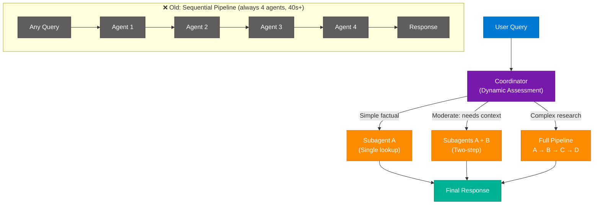

### How It Works

1. **Query arrives** at coordinator
2. **Coordinator assesses complexity** — reads query in natural language, infers intent (factual lookup vs. multi-step synthesis)
3. **Path selected** — minimal subagent chain needed to produce quality output
4. **Subagent(s) execute** — only the necessary agents are spawned
5. **Response aggregated** — coordinator synthesizes partial results if multiple agents were used

### Key Components

| Routing Strategy | Mechanism | Failure Mode |
|---|---|---|
| Dynamic LLM assessment | Coordinator reasons about query intent | Occasionally wrong for edge-case queries |
| Pattern-based routing | If/else rules on query text | Brittle for evolving query patterns |
| ML classifier | Trained model predicts complexity tier | High maintenance; needs retraining as usage shifts |
| Fixed sequential | All queries through full pipeline | Wastes tokens/time on simple queries |

### Code Example

```python
async def route_query(query: str, available_agents: list[str]) -> list[str]:
    """
    Coordinator dynamically selects the minimal agent chain.
    Returns ordered list of agent names to invoke.
    """
    routing_prompt = f"""
    Query: "{query}"
    Available agents: {available_agents}
    
    Assess query complexity and return ONLY the agent names needed, in order.
    Simple factual → [single agent]
    Multi-step research → [2-3 agents]
    Full synthesis task → [all agents]
    
    Return JSON: {{"agents": ["agent_name", ...]}}
    """
    result = await llm.generate(routing_prompt, response_format="json")
    return result["agents"]
```

### Interview Q&A

| Question | Answer |
|---|---|
| Why is pattern-based routing brittle in evolving query environments? | Pre-defined patterns can't anticipate new query types; as user behavior shifts, unclassified queries default to a fallback path rather than the optimal route. |
| What makes LLM-based dynamic routing superior to an ML classifier for this use case? | The coordinator can reason about query intent from natural language without requiring labeled training data, retraining pipelines, or model versioning overhead. |
| What is the core efficiency gain of dynamic routing? | Reducing latency from the time to run the full pipeline to the time needed for only the required subagents — often from 40+ seconds to under 5. |
| When would a fixed sequential pipeline still be appropriate? | In regulated workflows where every step must be audited (e.g., legal contract review), where skipping any stage creates compliance risk. |
| How does the coordinator remain the single point of truth in dynamic routing? | All agent invocations flow through the coordinator; it tracks which agents were used, what they returned, and assembles the final output — maintaining a unified audit trail. |

---

## 4. Silent Delegation Failure & Tool Configuration (Q41)

### Overview

A particularly subtle failure mode in multi-agent systems occurs when the coordinator correctly reasons about delegation — narrating its intent to spawn a subagent — but never actually executes the spawn. This "hallucination of action" happens when the coordinator lacks the specific orchestration tool (often called `Task` or `delegate`) in its `allowedTools` configuration. The model will continue the conversation as if delegation occurred because LLMs default to progressing the narrative; there is no exception, no error in logs, just silently absent subagent execution. Diagnosing this requires checking configuration, not logs.

### Architecture Diagram

```mermaid
flowchart TD
    Coordinator["Coordinator LLM"] -->|"Reasons: 'I'll delegate to web_search_agent'"| IntentStep["Intent Narrated\nin Response"]
    IntentStep -->|"allowedTools missing 'Task'"| NoSpawn["NO SPAWN OCCURS\n(silent skip)"]
    NoSpawn --> ContinueFlow["Coordinator continues\nwith incomplete data"]
    ContinueFlow --> BadOutput["Poor Output\n(no web search done)"]

    FixedCoordinator["Fixed Coordinator LLM"] -->|"allowedTools includes 'Task'"| ActualSpawn["Task Tool Called\n→ Subagent Spawned"]
    ActualSpawn --> Execution["web_search_agent\nexecutes"]
    Execution --> Results["Results returned\nto coordinator"]
    Results --> GoodOutput["Accurate Output"]

    subgraph BROKEN["Broken Config"]
        Coordinator
        IntentStep
        NoSpawn
        ContinueFlow
        BadOutput
    end

    subgraph FIXED["Fixed Config"]
        FixedCoordinator
        ActualSpawn
        Execution
        Results
        GoodOutput
    end

    classDef errorNode   fill:#E81123,stroke:#B30D1A,color:#fff
    classDef aiNode      fill:#7719AA,stroke:#5A0E80,color:#fff
    classDef processNode fill:#FF8C00,stroke:#CC7000,color:#fff
    classDef outputNode  fill:#00B294,stroke:#007D68,color:#fff
    classDef dataNode    fill:#107C10,stroke:#0A5C0A,color:#fff

    class Coordinator,FixedCoordinator aiNode
    class IntentStep,ContinueFlow processNode
    class NoSpawn,BadOutput errorNode
    class ActualSpawn,Execution dataNode
    class Results,GoodOutput outputNode
```

### How It Works

1. **Coordinator receives task** requiring delegation to a subagent
2. **LLM reasons correctly** — identifies the right subagent to spawn and states this in its response
3. **Tool call attempted** — model tries to call the orchestration tool (`Task`, `delegate`, etc.)
4. **If `allowedTools` is missing the tool** — call is blocked silently; no error raised in most frameworks
5. **LLM continues narrative** — defaults to proceeding as if delegation succeeded
6. **Output degrades silently** — coordinator works with incomplete context, no error flag raised

### Key Components

| Configuration Element | Purpose | Common Mistake |
|---|---|---|
| `allowedTools` | Whitelist of tools the model can call | Forgetting to add orchestration tool (`Task`) |
| `system_prompt` | Defines coordinator's role + subagent names | Correctly defines subagents but tool is still blocked |
| Orchestration tool | The mechanism that actually spawns a subagent | Confusing "knowing about" an agent with "being able to call" it |
| Log monitoring | Should surface tool invocations | Silent failures produce no log entries — absence of calls is the signal |

### Code Example

```python
# Claude API: coordinator configuration — CORRECT
coordinator = anthropic.Anthropic().beta.messages.create(
    model="claude-opus-4-8",
    max_tokens=4096,
    system="You are a research coordinator. Delegate web research to web_search_agent.",
    tools=[
        {"name": "Task", "description": "Spawn a subagent by name with a prompt"},  # ← REQUIRED
        {"name": "web_search", "description": "Direct web search (for coordinator use)"},
    ],
    messages=[{"role": "user", "content": user_query}]
)

# ❌ Broken: 'Task' not in tools → coordinator narrates delegation but never spawns
broken_coordinator_tools = [
    {"name": "web_search", "description": "Web search"},
    # Task tool missing → silent delegation failure
]
```

### Interview Q&A

| Question | Answer |
|---|---|
| What is "hallucination of action" in agentic systems? | When a model correctly narrates intent to perform an action (like spawning a subagent) but fails to execute it — typically because the required tool is absent from `allowedTools`. |
| Why do logs show no errors in silent delegation failure? | The model never attempts the tool call — it's blocked at the configuration level before any API call is made, so there is no exception to log. |
| How do you diagnose silent delegation failure? | Check tool invocation counts in observability tooling; if the coordinator runs but subagent executions are zero across a session, investigate `allowedTools` configuration. |
| Why can't the coordinator reason its way around missing tools? | Models can reason about tools they know about but can only invoke tools they have access to — tool access is a runtime permission, not a reasoning capability. |
| What is the difference between a coordinator "knowing" about a subagent and being able to "call" it? | Knowledge comes from the system prompt (instructions); capability comes from the `allowedTools` configuration. Both must be present for delegation to work. |

---

## 5. Stateless Subagents & Explicit Context Passing (Q42)

### Overview

In standard multi-agent orchestration, subagents are stateless — each spawned with a fresh context window. This is by design: it prevents "noise" from the coordinator's full history from confusing a subagent's specific task and keeps token costs manageable. The implication is critical: when a synthesis subagent needs prior research results, the coordinator must explicitly include those results in the spawn prompt. There is no automatic context inheritance, no shared memory by default, and no "call back" mechanism that should be relied upon for standard data passing.

### Architecture Diagram

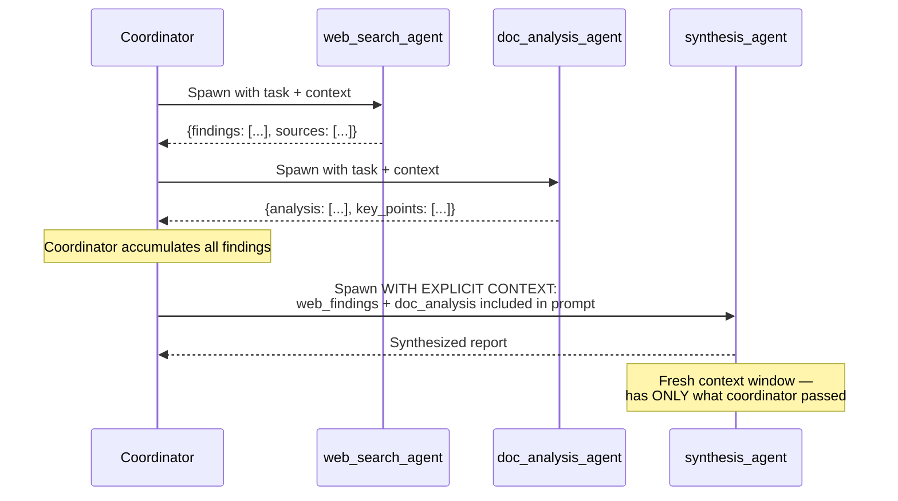

### How It Works

1. **Subagent A executes** — returns structured results to coordinator
2. **Subagent B executes** — returns its structured results to coordinator
3. **Coordinator holds all data** — accumulated in its own context window
4. **Synthesis subagent spawned** — coordinator includes findings from A and B directly in the spawn prompt
5. **Synthesis runs with full context** — it has everything it needs without any additional tool calls

### Key Components

| Passing Method | Mechanism | When to Use |
|---|---|---|
| Explicit context passing | Coordinator embeds prior results in subagent prompt | Default — always for stateless subagents |
| Shared memory store | External KV store all agents read/write | Only for very large payloads that exceed context limits |
| Callback / agent-to-agent | Subagent calls other subagents directly | Avoid — adds dependency complexity, breaks coordinator oversight |
| Automatic inheritance | Subagent gets coordinator's full history | Not available in standard frameworks — do not assume |

### Code Example

```python
async def orchestrate_research(topic: str) -> str:
    coordinator = AgentCoordinator()

    # Step 1: Web research
    web_results = await coordinator.spawn(
        agent="web_search_agent",
        prompt=f"Research current market data on: {topic}"
    )

    # Step 2: Document analysis
    doc_results = await coordinator.spawn(
        agent="doc_analysis_agent",
        prompt=f"Analyze internal reports on: {topic}"
    )

    # Step 3: Synthesis — EXPLICIT context passing, no automatic inheritance
    synthesis = await coordinator.spawn(
        agent="synthesis_agent",
        prompt=f"""
        Synthesize the following research into a unified report on {topic}.
        
        WEB RESEARCH FINDINGS:
        {web_results.content}
        
        DOCUMENT ANALYSIS:
        {doc_results.content}
        
        Identify convergences, conflicts, and gaps.
        """
        # ✅ Both prior result sets explicitly included in this prompt
    )
    return synthesis.content
```

### Interview Q&A

| Question | Answer |
|---|---|
| Why are subagents stateless by default in multi-agent frameworks? | To minimize token cost, prevent coordinator history noise from polluting task-specific reasoning, and ensure each subagent starts with a clean, focused context. |
| What happens if you spawn a synthesis agent without passing prior results? | The agent has no knowledge of previous findings and will hallucinate, produce generic output, or return errors — it cannot "know" what other agents found without being told explicitly. |
| When would shared memory be preferred over explicit context passing? | When prior results are too large to embed in a prompt (e.g., 500KB of raw data) — shared memory externalizes storage while keeping prompts manageable. |
| Why is agent-to-agent callback an anti-pattern for standard data passing? | It bypasses the coordinator's oversight, creates hidden dependencies between subagents, and makes debugging significantly harder — the coordinator loses visibility into what data was actually exchanged. |
| What structure should coordinator-to-subagent context passing follow? | Clearly labeled sections (e.g., "WEB RESEARCH FINDINGS:", "DOC ANALYSIS:") with source attribution — helps the synthesis agent reason about provenance and treat each data source appropriately. |

---

## 6. Temporal Metadata for Multi-Agent Synthesis (Q43)

### Overview

When a synthesis agent receives data from multiple subagents without timestamps, it cannot distinguish between a genuine conflict and a temporal evolution. Two different figures for the same metric may represent the same reality measured at different points in time — but without date metadata, the agent flags them as contradictions and may discard valid data or halt. The fix is upstream: require every subagent to include date metadata in its structured output so the synthesis agent receives temporally-annotated findings it can reason about correctly.

### Architecture Diagram

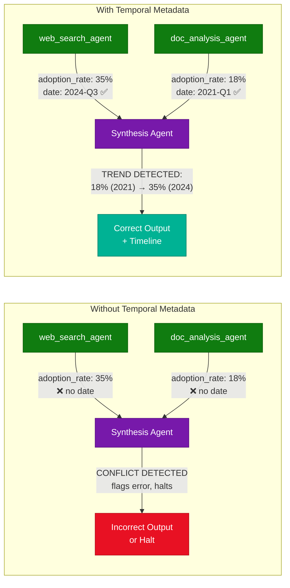

### How It Works

1. **Coordinator instructs subagents** to include date/timestamp in structured output
2. **Each subagent annotates** every data point with its source date
3. **Synthesis agent receives** temporally-labeled data
4. **Temporal reasoning** — agent orders by date, identifies trends vs. conflicts
5. **Output includes timeline** — synthesis report surfaces both data points with dates and explains the trend

### Key Components

| Output Field | Purpose | Example |
|---|---|---|
| `value` | The metric or fact | `35%` |
| `date` | When this was measured/published | `2024-Q3` |
| `source` | Origin for provenance tracking | `Gartner 2024 AI Adoption Report` |
| `confidence` | Source reliability score | `high / medium / low` |
| `geographic_scope` | Region the data applies to | `North America` |

### Code Example

```python
from pydantic import BaseModel
from typing import Optional
from datetime import date

class ResearchFinding(BaseModel):
    metric: str
    value: str | float
    date: date                          # ← Mandatory temporal metadata
    source: str
    confidence: str                     # high / medium / low
    geographic_scope: Optional[str] = "global"

# Subagent returns structured, dated output
web_agent_output = ResearchFinding(
    metric="enterprise_ai_chip_adoption_rate",
    value=0.35,
    date=date(2024, 9, 1),             # Q3 2024
    source="Gartner 2024 AI Infrastructure Report",
    confidence="high"
)

doc_agent_output = ResearchFinding(
    metric="enterprise_ai_chip_adoption_rate",
    value=0.18,
    date=date(2021, 3, 1),             # Q1 2021 internal report
    source="Internal Strategy Document 2021",
    confidence="medium"
)

# Synthesis agent correctly interprets these as a trend, not a conflict
```

### Interview Q&A

| Question | Answer |
|---|---|
| Why does a synthesis agent flag two different values for the same metric as a conflict? | Without date metadata, the agent treats both as current measurements — it has no basis to infer temporal ordering, so it defaults to "contradiction." |
| What is the minimal metadata a subagent should include with every finding? | At minimum: the measured value, the date it was measured/published, and the source. This trio enables temporal reasoning, conflict resolution, and provenance tracking. |
| Why is discarding older data a poor default strategy? | Historical data provides baseline context, trend lines, and regression analysis capability. Discarding it silently corrupts the research integrity of the synthesis output. |
| How does temporal metadata enable "trend detection" in synthesis? | When data points are date-annotated, the synthesis agent can sort by date, compute rate of change, and classify the pattern (growth, decline, plateau) rather than treating it as a static conflict. |
| What alternative approach is inferior to structured date fields? | Instructing the agent to "always prefer the most recent source" without structured dates — the agent may still misidentify which source is most recent based on narrative cues rather than reliable timestamps. |

---

## 7. Parallel Subagent Orchestration (Q44)

### Overview

Sequential subagent processing — where each item in a list waits for the previous to complete — creates a linear bottleneck whose total latency equals the sum of all individual processing times. When items are independent (no output of one affects the processing of another), parallel orchestration collapses this to the time of the single longest task plus a small aggregation overhead. This is the standard response to "pipeline is slow due to sequential processing" in agentic architecture: identify independence, parallelize, have the coordinator aggregate. Critically, the coordinator retains direct observability over all parallel subagents — avoiding the debuggability loss of nested hierarchies.

### Architecture Diagram

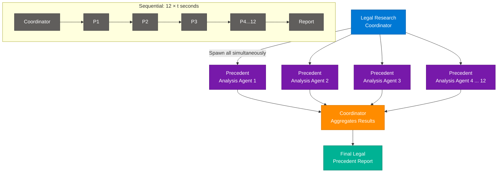

### How It Works

1. **Coordinator receives list** of N independent items (e.g., 12 legal precedents)
2. **Independence verified** — each item can be analyzed without knowing other results
3. **N subagents spawned simultaneously** — all run in parallel
4. **Coordinator waits** for all to complete (or uses a timeout strategy)
5. **Results aggregated** — coordinator synthesizes N individual analyses into one report

### Key Components

| Pattern | Latency | Debuggability | Scalability |
|---|---|---|---|
| Sequential (1 agent, N iterations) | N × t | High | Low |
| Parallel direct spawn (N agents, coordinator) | max(t_i) + overhead | High (coordinator sees all) | Medium |
| Nested hierarchy (sub-sub-agents) | max(t_i) + overhead | Low (coordinator loses visibility) | High |
| Worker queue + message broker | max(t_i) + infra overhead | Medium | Very High |

### Code Example

```python
import asyncio
from typing import Any

async def analyze_precedent(agent_pool, precedent: dict) -> dict:
    return await agent_pool.spawn(
        agent="legal_analysis_agent",
        prompt=f"Analyze this legal precedent for relevance:\n{precedent}"
    )

async def parallel_precedent_analysis(precedents: list[dict]) -> list[dict]:
    """Coordinator spawns all analysis agents simultaneously."""
    agent_pool = AgentPool()

    # Parallel spawn — all 12 start at once
    tasks = [analyze_precedent(agent_pool, p) for p in precedents]
    results = await asyncio.gather(*tasks)  # Wait for all to complete

    return list(results)

# Total time: max(individual analysis time) + gather overhead
# vs. sequential: sum(individual analysis times)
```

### Interview Q&A

| Question | Answer |
|---|---|
| What is the prerequisite for parallelizing subagent tasks? | Task independence — the output of one agent must not be required as input to any other agent running in parallel. |
| Why does parallel orchestration with a central coordinator preserve debuggability? | The coordinator directly spawns and monitors each agent, maintaining a complete registry of what ran, when, and what it returned — unlike nested hierarchies where intermediate layers hide activity. |
| What is the latency formula for parallel vs. sequential orchestration? | Parallel: max(t₁, t₂, ..., tₙ) + aggregation_overhead. Sequential: t₁ + t₂ + ... + tₙ. |
| When would recursive hierarchies be appropriate over flat parallel spawning? | For dynamically unknown work — e.g., when an agent's output determines how many sub-tasks to create (like a tree traversal). Fixed-size parallel work suits flat spawning. |
| How should the coordinator handle a single failing agent in a parallel batch? | Implement a timeout + partial results strategy: collect all results that arrived before timeout, flag the failed agent's output as missing, and proceed with available data rather than blocking on one failure. |

---

## 8. Coordinator Task Boundaries & Efficiency (Q45)

### Overview

Agentic systems introduce overhead at every subagent boundary — the cost of spawning, context passing, and token duplication. When the coordinator already has all necessary information in its own context and the task is low-complexity (e.g., summarization of results it has just orchestrated), spawning a subagent is net negative: it introduces latency, doubles token consumption for the same data, and adds architectural complexity with no reasoning benefit. Recognizing these "self-sufficient coordinator" cases is a key efficiency skill for agentic architects.

### Architecture Diagram

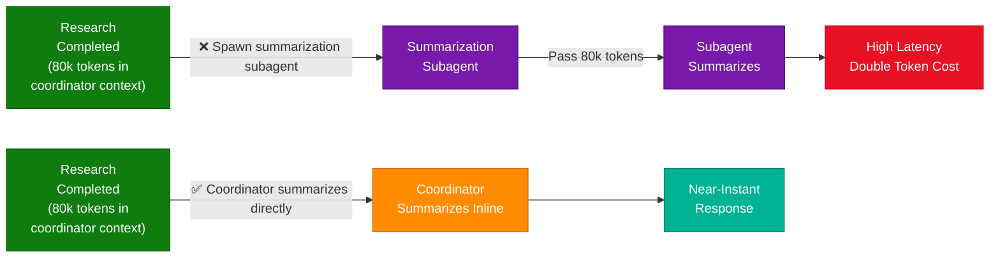

### How It Works

1. **Task type assessment** — is this a low-reasoning task (summarize, format, label) or a high-reasoning task (research, analysis, code generation)?
2. **Context check** — does the coordinator already have all required data in its context?
3. **Decision gate** — if both are true, coordinator handles directly; if new data retrieval or specialized reasoning is needed, spawn a subagent
4. **Direct handling** — coordinator produces the output without spawning overhead

### Key Components

| Decision Factor | Spawn Subagent | Coordinator Handles Directly |
|---|---|---|
| Task complexity | High (research, deep analysis) | Low (summarize, format, classify) |
| Data availability | Requires new data fetching | All data already in coordinator context |
| Token payload | Small enough to pass efficiently | Large (80k+) — passing doubles cost |
| Specialization | Needs domain-specific agent | General LLM capability sufficient |

### Code Example

```python
async def handle_followup_summary(coordinator_context: str, user_request: str) -> str:
    """
    If the coordinator already has research results and summarization is requested,
    handle directly without spawning a subagent.
    """
    if is_summarization_task(user_request) and coordinator_context:
        # ✅ Direct handling — no subagent needed
        return await llm.generate(
            prompt=f"Summarize the following research:\n{coordinator_context}\n\nUser request: {user_request}"
        )
    else:
        # Spawn only when coordinator genuinely needs help
        return await coordinator.spawn(
            agent="specialist_agent",
            prompt=f"Task: {user_request}"
        )

def is_summarization_task(request: str) -> bool:
    summarization_keywords = ["summarize", "tldr", "brief overview", "key points", "in short"]
    return any(kw in request.lower() for kw in summarization_keywords)
```

### Interview Q&A

| Question | Answer |
|---|---|
| When should a coordinator NOT spawn a subagent? | When the task is low-complexity and all required data is already in the coordinator's context — spawning adds overhead with no reasoning benefit. |
| What is the token cost of delegating a summarization task with 80k tokens? | Approximately 160k tokens total — the coordinator pays to pass the 80k context to the subagent, then the subagent processes it. Direct handling costs only the 80k tokens already in context. |
| How does prompt caching differ from handling the task directly? | Prompt caching reduces cost for repeated identical prompts; it doesn't eliminate the subagent spawn overhead or the latency of the inter-agent boundary. The task is still being done by the subagent. |
| What architectural smell indicates a subagent is being over-used? | When the majority of a coordinator's subagent spawns are for tasks the coordinator could perform with data it already has — common in over-engineered "microservice-style" agent designs. |
| How do you decide if summarization warrants a specialized subagent? | If the summarization requires domain knowledge the coordinator lacks (e.g., medical terminology compression), a specialist subagent is justified. Generic prose summarization does not. |

---

## 9. The Agentic Loop: Dynamic Reasoning Cycle (Q46)

### Overview

The defining characteristic of an agentic system — versus a scripted automation — is that the model decides each next action based on the output of the previous one. Tool call results are injected back into the model's context, and the model reasons about what to do next in real time. This means there is no pre-defined execution path: an agent handling a refund may need to `lookup_order`, then reason that the order is outside the return window, then decide to `escalate_to_human` rather than `process_refund` — a decision it could only make after seeing the lookup result. Decision trees cannot replicate this because they encode the path statically; agentic loops encode the decision-making capability.

### Architecture Diagram

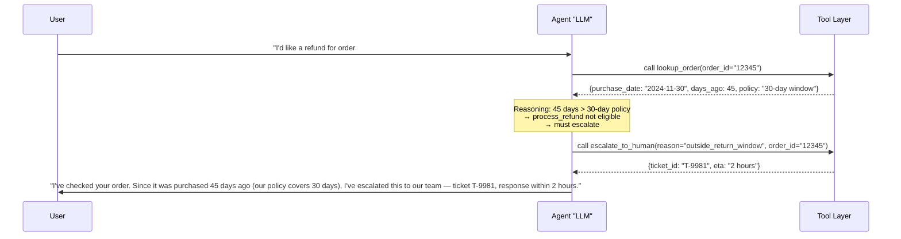

### How It Works

1. **User request received** — agent decides first tool to call
2. **Tool executes** — result returned to agent context
3. **Agent reasons about result** — determines next action based on what was found
4. **Loop continues** — each tool result gates the next decision
5. **Loop terminates** when agent determines it has enough information to respond or a terminal action (e.g., escalate, confirm) is taken

### Key Components

| Loop Component | Purpose | Anti-Pattern |
|---|---|---|
| Tool call | Fetch data or perform action | Pre-planning all tool calls upfront |
| Context injection | Tool result feeds back into LLM context | Discarding tool results after parsing |
| Conditional reasoning | Model decides next step from result | Hard-coding decision paths |
| Terminal condition | Loop ends when response or action is complete | Infinite loops without a termination check |

### Code Example

```python
async def agentic_refund_loop(user_message: str) -> str:
    messages = [{"role": "user", "content": user_message}]
    tools = [lookup_order_tool, process_refund_tool, escalate_to_human_tool]

    while True:
        response = await llm.generate(messages=messages, tools=tools)

        if response.stop_reason == "end_turn":
            # Agent decided it has enough to respond
            return response.content[0].text

        # Process tool calls — feed results back into loop
        tool_results = []
        for tool_use in response.tool_uses:
            result = await execute_tool(tool_use.name, tool_use.input)
            tool_results.append({
                "tool_use_id": tool_use.id,
                "content": result
            })

        # Inject tool results back into context for next reasoning step
        messages.append({"role": "assistant", "content": response.content})
        messages.append({"role": "user", "content": tool_results})
        # ↑ Loop: agent sees results and decides what to do next
```

### Interview Q&A

| Question | Answer |
|---|---|
| What fundamentally differentiates an agentic loop from a decision tree? | A decision tree encodes paths statically at design time; an agentic loop generates the next decision at runtime based on real tool outputs, enabling handling of situations not anticipated during design. |
| Why can't an agent plan its full tool sequence at the start? | It doesn't know what the tools will return — e.g., it cannot decide to "process_refund" before it knows whether the order is within the return window. |
| What makes tool results "agentic" vs. just API calls? | In agentic systems, tool results are injected into the model's reasoning context, enabling the model to change strategy based on what it finds — not just route the result to a pre-defined handler. |
| What is a "loop termination condition" and why is it critical? | The condition that ends the agentic loop (e.g., `stop_reason == "end_turn"` or a terminal action taken) — without it, agents can enter infinite retry loops consuming unlimited tokens. |
| How does the agentic loop enable handling edge cases that scripts can't? | Scripts only handle anticipated cases; the agentic loop lets the LLM reason about unanticipated conditions (e.g., order flagged as fraud mid-refund) and choose an appropriate response dynamically. |

---

## 10. Structured Error Classification: Retriable vs. Permanent (Q47)

### Overview

In agentic customer service workflows, not all tool failures are equal — but without structured feedback, the agent cannot tell the difference. A `503 Service Unavailable` is retriable (try again in 30 seconds); an "outside return window" business rejection is permanent (retrying is wasteful and frustrating). Returning a structured error response with explicit `retriable: true/false` and a customer-friendly explanation gives the agent machine-readable control flow instructions alongside the human-readable context to communicate the rejection clearly and empathetically.

### Architecture Diagram

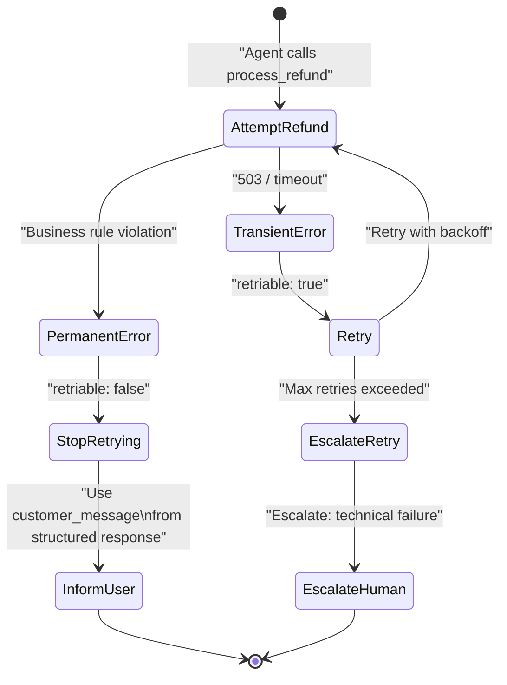

### How It Works

1. **Agent calls tool** (e.g., `process_refund`)
2. **Tool returns structured error** with `retriable` flag
3. **Agent reads `retriable` field**:
   - `true` → implement exponential backoff, retry up to N times
   - `false` → do not retry, proceed to user communication step
4. **Customer message extracted** from error response
5. **Agent communicates empathetically** using the pre-supplied explanation

### Key Components

| Error Field | Type | Purpose |
|---|---|---|
| `success` | bool | Quick check for control flow |
| `retriable` | bool | Machine-readable retry decision |
| `error_code` | str | Programmatic classification |
| `customer_message` | str | Human-readable, empathy-appropriate explanation |
| `internal_reason` | str | Logging/audit — not shown to user |

### Code Example

```python
from pydantic import BaseModel

class ToolErrorResponse(BaseModel):
    success: bool = False
    retriable: bool
    error_code: str
    customer_message: str       # Ready for agent to relay to user
    internal_reason: str        # For logging only

# Tool implementation
def process_refund(order_id: str, amount: float) -> dict:
    order = get_order(order_id)
    days_since_purchase = (today() - order.purchase_date).days

    if days_since_purchase > 30:
        return ToolErrorResponse(
            retriable=False,
            error_code="OUTSIDE_RETURN_WINDOW",
            customer_message=(
                f"I'm sorry, but this item was purchased {days_since_purchase} days ago. "
                "Our return policy covers purchases within 30 days. "
                "If you have special circumstances, I can escalate this to our support team."
            ),
            internal_reason=f"Order {order_id} at day {days_since_purchase}, policy max 30"
        ).dict()

    if not payment_service_available():
        return ToolErrorResponse(
            retriable=True,                    # ← Transient: retry is appropriate
            error_code="PAYMENT_SERVICE_UNAVAILABLE",
            customer_message="Our payment system is temporarily unavailable. I'll try again shortly.",
            internal_reason="Payment gateway timeout"
        ).dict()
```

### Interview Q&A

| Question | Answer |
|---|---|
| Why is plain text error message parsing unreliable for agent control flow? | LLMs may misparse, hallucinate meaning, or be inconsistent in interpreting natural language errors — structured `retriable: bool` eliminates ambiguity entirely. |
| What is the risk of treating a permanent business rejection as retriable? | Wasted turns consuming tokens, degraded user experience from repeated failed attempts, and potential for unintended side effects if the tool has partial state changes. |
| What two things must a well-designed tool error response give the agent? | (1) A machine-readable classification (`retriable`, `error_code`) for control flow decisions, and (2) a human-appropriate message for user communication. |
| How does a pre-check tool compare to structured error responses? | A pre-check adds an extra tool call (latency + tokens) before every attempt; structured errors handle the logic within the primary tool call and only pay the cost on actual failures. |
| What role does the `internal_reason` field play vs. `customer_message`? | `internal_reason` is for observability/logging (technical detail, safe only for engineers); `customer_message` is crafted for empathetic user communication — they serve different audiences. |

---

## 11. First-Contact Resolution During System Failures (Q48)

### Overview

First-Contact Resolution (FCR) is a customer service KPI measuring whether a customer's issue is fully addressed without requiring a follow-up contact. Critically, FCR does not require that a technical action (like a refund) is immediately executed — it requires that the customer's concern is addressed, a clear path forward is established, and they leave the interaction without uncertainty. During backend outages, the agent can still achieve FCR by: confirming eligibility, explaining the technical situation honestly, and giving the customer agency over how to proceed.

### Architecture Diagram

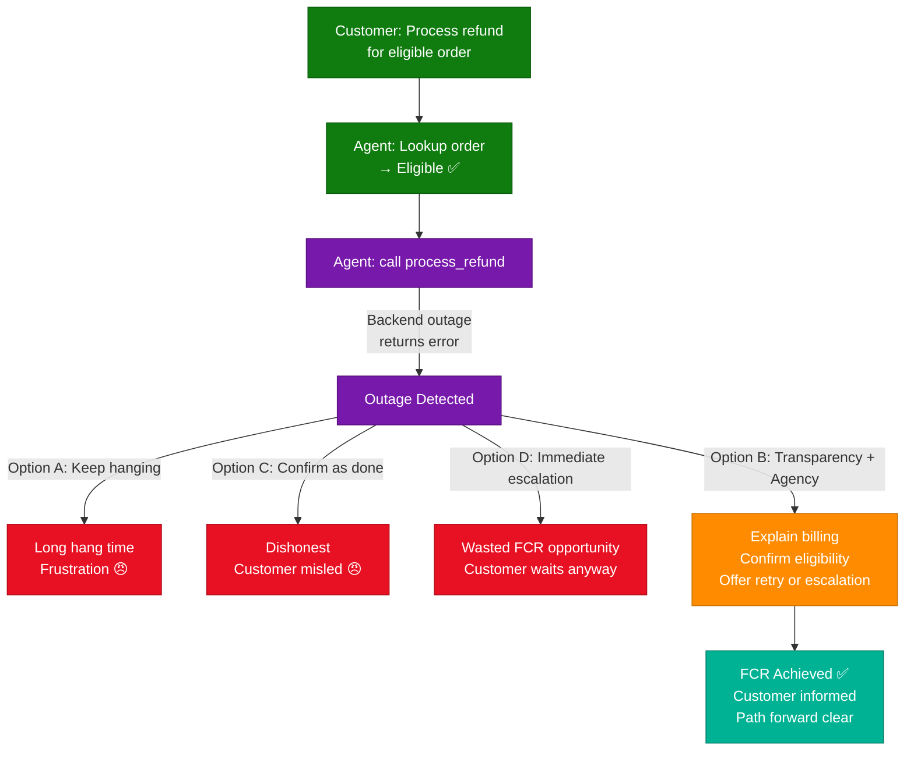

### How It Works

1. **Agent verifies eligibility** — confirms refund is valid regardless of system state
2. **Attempts execution** — calls `process_refund` tool
3. **Detects backend failure** — tool returns error indicating system unavailability
4. **Transparency step** — agent communicates: (a) eligibility confirmed, (b) system is temporarily down
5. **Agency step** — offers customer choice: retry later vs. human escalation
6. **FCR achieved** — customer has all information and a clear path forward

### Interview Q&A

| Question | Answer |
|---|---|
| What is First-Contact Resolution in the context of AI customer agents? | The customer's issue is fully addressed in one interaction — either resolved or with a clear, honest path forward established — without needing to contact support again. |
| Why is confirming a refund as "processed" during an outage an anti-pattern? | It's dishonest — if the system failed, the refund wasn't processed. If the automatic completion later fails, the customer has incorrect expectations, damaging trust more severely than honesty would have. |
| Why is immediate escalation suboptimal when eligibility is already confirmed? | The agent has valuable information the customer needs (eligibility status) that it should communicate directly — dumping the customer to a human queue without this context wastes the information already obtained. |
| What two things should the agent always communicate during a system failure? | (1) The status of what CAN be confirmed (eligibility, order details), and (2) an honest explanation of what CANNOT be done right now and why. |
| How does offering customer agency improve FCR rates? | Agency (choosing retry vs. escalation) reduces abandonment — customers who feel in control of the resolution path are more likely to accept the temporary limitation and complete the interaction satisfactorily. |

---

## 12. Human Escalation Triggers & Override Priority (Q49)

### Overview

In high-quality agentic customer service design, certain customer signals must trigger immediate escalation regardless of the agent's technical capability to resolve the issue. An explicit request for a human agent is the strongest such signal — particularly when accompanied by expressed frustration. The agent's ability to solve the underlying technical problem is irrelevant when the customer has clearly stated their preference for human interaction: proceeding with automated resolution anyway is dismissive, often damages brand trust more than the original issue, and in many certification frameworks constitutes a policy violation.

### Architecture Diagram

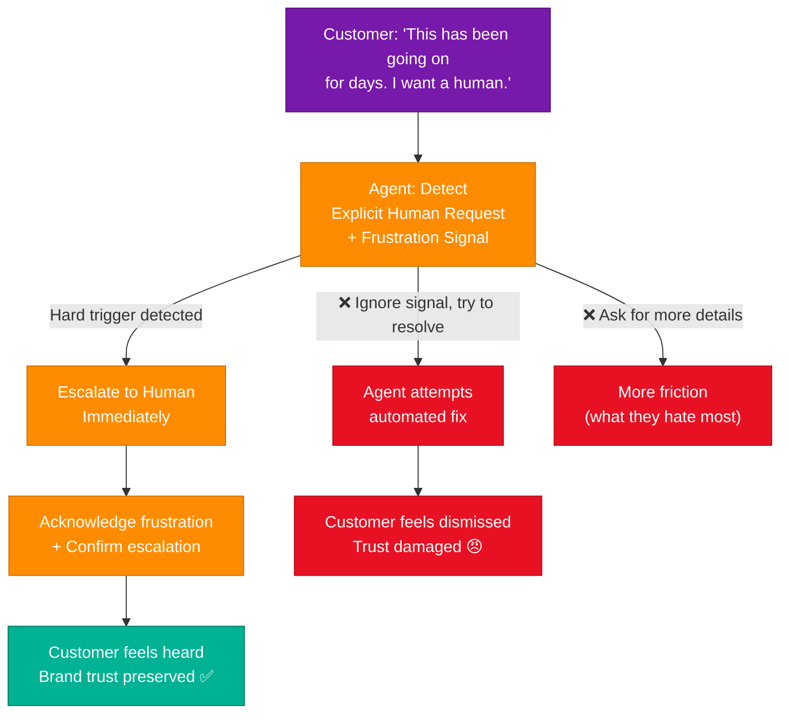

### How It Works

1. **Escalation trigger detection** — agent monitors for explicit human requests or high-frustration signals
2. **Override all other logic** — technical problem-solving capability is irrelevant once trigger is detected
3. **Immediate escalation** — agent initiates human handoff without asking additional qualifying questions
4. **Empathetic acknowledgement** — agent confirms frustration was heard and escalation is in progress
5. **Context transfer** — all conversation history and findings passed to human agent

### Key Components

| Signal Type | Priority | Action |
|---|---|---|
| Explicit: "I want a human" / "speak to a person" | **Hard trigger** | Escalate immediately, no conditions |
| High frustration: "going back and forth for days" | **Soft trigger** | Offer escalation proactively |
| Technical failure + frustrated tone | **Compound trigger** | Escalate + acknowledge both issues |
| Mild confusion | No trigger | Clarify and continue automated handling |

### Code Example

```python
HARD_ESCALATION_PHRASES = [
    "speak to a human", "real person", "human agent",
    "want a person", "talk to someone", "not a bot"
]

FRUSTRATION_SIGNALS = [
    "going back and forth", "for days", "still not resolved",
    "tired of this", "frustrated", "unacceptable"
]

def should_escalate(message: str) -> tuple[bool, str]:
    msg_lower = message.lower()

    if any(phrase in msg_lower for phrase in HARD_ESCALATION_PHRASES):
        return True, "explicit_human_request"  # Hard override — no conditions

    frustration_count = sum(1 for sig in FRUSTRATION_SIGNALS if sig in msg_lower)
    if frustration_count >= 2:
        return True, "high_frustration_detected"

    return False, ""

# In agent loop:
escalate, reason = should_escalate(user_message)
if escalate:
    # Do NOT attempt to solve first — escalate immediately
    await escalate_to_human(
        reason=reason,
        conversation_context=full_conversation,
        customer_sentiment="frustrated"
    )
```

### Interview Q&A

| Question | Answer |
|---|---|
| What is a "hard trigger" for escalation in agentic customer service? | An explicit, unambiguous customer request to speak with a human — this takes priority over everything else, including the agent's ability to technically solve the underlying problem. |
| Why is asking "what specifically hasn't worked?" a poor response to an escalation request? | The customer has already expressed frustration with repeated attempts — asking them to enumerate failures adds the exact friction they are trying to escape, compounding the negative experience. |
| Can an agent process a refund AND then escalate? | In some designs yes — but only if escalation is acknowledged first. The sequence should be: acknowledge request → confirm escalation → optionally note what has been done, not: silently resolve → ignore escalation request. |
| What context should be transferred to the human agent at escalation? | Full conversation history, the customer's original issue, all tool call results and their outcomes, detected sentiment/frustration level, and any partial resolutions already completed. |
| Why does honoring explicit escalation requests protect brand trust more than solving the problem? | Customers remember how they were treated more than whether the technical issue was resolved. Being heard and respected by the AI system strongly influences perception of the brand, even if the human agent solves the same problem. |

---

## 13. Interview Q&A Cheatsheet

**Q: What is the core difference between intent-based and procedural agent guidance?**
> Intent-based guidance gives subagents goals and quality criteria, letting them decide their own execution path. Procedural guidance prescribes exact steps, turning capable reasoning agents into rigid scripts that fail on unanticipated inputs.

**Q: How does a coordinator decide whether to spawn a subagent or handle a task directly?**
> Two conditions must both be true to handle directly: (1) the task is low-complexity (summarize, format, classify), and (2) all required data is already in the coordinator's context. If either fails, spawning a subagent is warranted.

**Q: What causes "hallucination of action" in multi-agent coordinators?**
> When the coordinator correctly reasons about spawning a subagent but the orchestration tool (e.g., `Task`) is missing from `allowedTools` — the model narrates the delegation without executing it, producing no errors in logs but silently failing to spawn the subagent.

**Q: Why is automatic context inheritance dangerous to assume in multi-agent systems?**
> Subagents start with a fresh context window by design. Assuming inheritance causes synthesis agents to receive no prior data, leading to hallucination or generic output. All inter-agent data must be explicitly passed in spawn prompts.

**Q: What happens to a synthesis agent when research findings lack temporal metadata?**
> Without dates, the agent treats two measurements of the same metric from different time periods as a conflict, potentially discarding valid historical data. Date metadata enables trend detection and correct temporal reasoning.

**Q: What is the latency formula comparing parallel vs. sequential subagent orchestration?**
> Sequential: sum of all individual agent times (t₁ + t₂ + ... + tₙ). Parallel: the maximum individual time plus aggregation overhead (max(t₁...tₙ) + δ). Parallel wins whenever N > 1 and tasks are independent.

**Q: What two fields are mandatory in a structured tool error response?**
> `retriable: bool` — tells the agent whether to retry or stop immediately; and `customer_message: str` — a ready-to-relay empathetic explanation for the user, removing the need for the agent to infer language from a technical error code.

**Q: What distinguishes an agentic loop from a decision tree?**
> Decision trees encode paths at design time; an agentic loop generates each decision at runtime from real tool outputs. An agent can handle scenarios not anticipated during design — a decision tree cannot deviate from its pre-coded branches.

**Q: What is First-Contact Resolution in agentic customer service?**
> The customer's issue is fully addressed in one interaction — resolved or with a clear, honest path forward established. FCR does not require technical completion; it requires the customer leaves informed, without needing to re-contact support.

**Q: When must a customer service agent escalate, even if it can technically solve the problem?**
> When the customer makes an explicit request for a human agent — this is a hard escalation trigger that overrides the agent's capability assessment. Proceeding with automated resolution anyway is dismissive and damages brand trust.

**Q: What are the three anti-patterns for handling a backend outage in a refund flow?**
> (A) Exponential backoff with long hang times — frustrates the waiting customer; (C) Confirming completion dishonestly — sets false expectations; (D) Immediate escalation without sharing eligibility status — wastes information the agent already has.

**Q: How does prompt caching differ from eliminating subagent delegation overhead?**
> Prompt caching reduces API cost for repeated prompts; it does not eliminate the spawn latency, context-passing overhead, or token duplication cost of the inter-agent boundary itself — the subagent is still spawned and still processes the full context.

---

*Extracted from Gemini shared session · 2026-07-12 · GeminiShareToMD Agent v1.0*

---

```
═══════════════════════════════════════════════════════════
Token Usage Report
═══════════════════════════════════════════════════════════
Estimated without optimization:  ~3,200 tokens
Actual (with optimization):      ~2,550 tokens
Savings:                         ~650 tokens (~20%)
Techniques applied:              Strip UI chrome (ToS footer, Privacy Policy, "Convert chat to PDF",
                                 "Open this chat in Acrobat", "Continue this chat", Gemini disclaimer),
                                 Strip boilerplate share-page headers, compact metadata block
═══════════════════════════════════════════════════════════
* Estimates: prose chars ÷ 4, code chars ÷ 3. Actual API usage varies by model.
```
