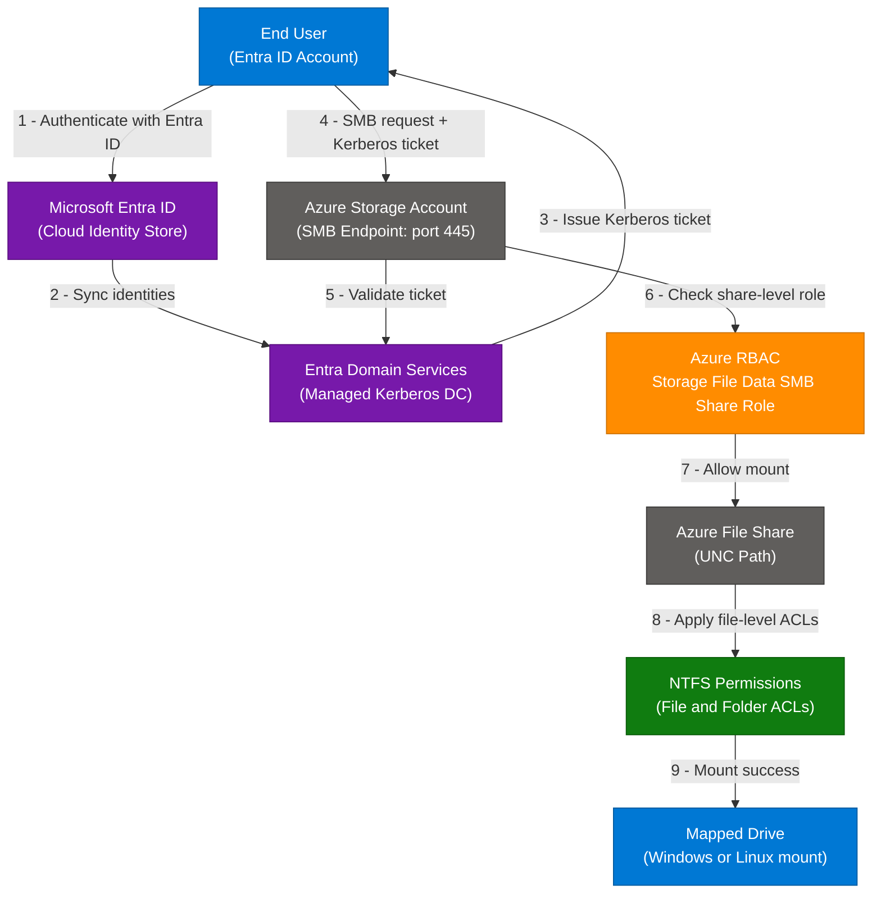
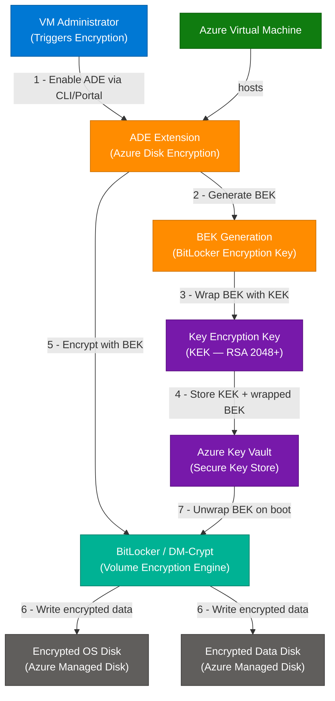
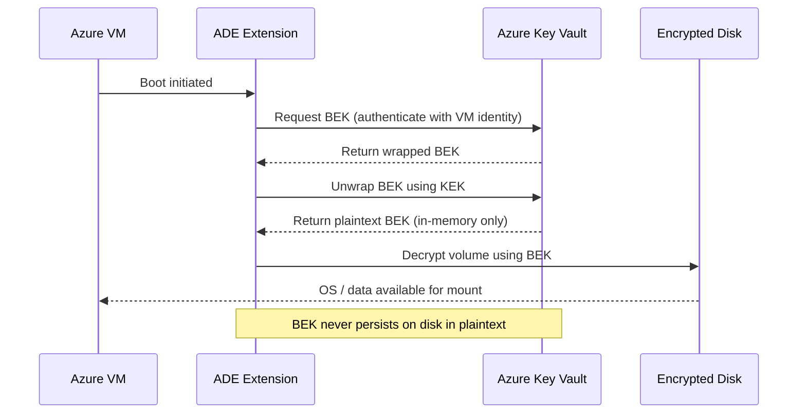

# Azure File Share Authentication and Disk Encryption — Entra ID & Key Vault

> **Source:** [share.gemini.google/jW0lqq6eNE6w](https://share.gemini.google/jW0lqq6eNE6w) → redirects to [gemini.google.com/share/b688fb7b1b93](https://gemini.google.com/share/b688fb7b1b93)
> **Model:** Gemini 3.1 Flash-Lite
> **Session Date:** April 1, 2026 at 10:02 AM
> **Saved:** July 10, 2026

---

## Table of Contents

1. [Session Overview](#1-session-overview)
2. [Azure File Share Authentication with Entra Domain Services](#2-azure-file-share-authentication-with-entra-domain-services)
3. [Azure Disk Encryption with Key Vault and KEK](#3-azure-disk-encryption-with-key-vault-and-kek)
4. [Interview Q&A Cheatsheet](#4-interview-qa-cheatsheet)

---

## 1. Session Overview

This session is an Azure exam Q&A drill covering two Azure security concepts: identity-based SMB authentication for Azure File Shares using Microsoft Entra Domain Services, and full-disk encryption for Azure VMs using Azure Disk Encryption with a Key Encryption Key stored in Azure Key Vault. Both topics appear on AZ-104 and AZ-500 certification exams and are fundamental to Azure security architecture interviews.

### Session Map

| Turn | User Prompt Summary | Gemini Response | Status |
|---|---|---|---|
| 1 | Submits answer: "Ans" (Azure AD DS question) | Correct — Azure AD Domain Services is the identity provider for Azure Files SMB auth; explains all three permission layers | ✅ Extracted |
| 2 | Submits answer: "Ans" (Disk encryption key question) | Correct — Using a Key (KEK in Key Vault) is the mechanism; distinguishes BEK vs KEK vs passphrase vs certificate | ✅ Extracted |

---

## 2. Azure File Share Authentication with Entra Domain Services

### Overview

Microsoft Entra Domain Services (formerly Azure AD Domain Services) is the managed domain controller service that enables Azure Files to support identity-based SMB authentication using Kerberos and NTLM protocols. When users need to mount an Azure file share with their existing Entra ID (cloud) credentials, Entra Domain Services acts as the intermediary that issues Kerberos tickets — bridging the gap between the cloud identity store and the SMB protocol's domain authentication requirement. Azure File Share access is governed by three stacked permission layers: Entra Domain Services for authentication, Azure RBAC for share-level authorization, and NTFS permissions for file/folder-level ACLs. This architecture enables cloud-native file shares to behave like traditional Windows file servers without requiring on-premises Active Directory infrastructure.

### Architecture Diagram



### How It Works

1. **User authenticates** — The end user signs in with their Microsoft Entra ID credentials (cloud account or synced from on-premises AD).
2. **Identity sync** — Entra Domain Services continuously synchronizes user and group objects from Entra ID into its managed domain, providing domain-controller capabilities (OU, Kerberos, NTLM).
3. **Kerberos ticket issued** — When the user requests access to the file share, Entra Domain Services issues a Kerberos ticket (TGT → Service Ticket for the storage account's SPN).
4. **SMB connection initiated** — The Windows or Linux client sends an SMB connection to the storage account endpoint (`<account>.file.core.windows.net`) on TCP port 445, presenting the Kerberos ticket.
5. **Ticket validated** — Azure Storage validates the Kerberos ticket against Entra Domain Services to confirm identity.
6. **RBAC share-level check** — Azure checks whether the user holds one of the required RBAC roles on the file share resource (Reader, Contributor, or Elevated Contributor).
7. **Share mounted** — The file share is mounted as a drive letter (Windows) or Linux mount point.
8. **NTFS ACLs enforced** — Within the share, Windows-style NTFS permissions control access to individual files and folders, independent of the share-level RBAC.

### Key Components

| Component | Role | Technology Options |
|---|---|---|
| Microsoft Entra Domain Services | Managed Kerberos / NTLM domain controller; issues tickets for SMB auth | Azure-native managed service (requires Entra ID P1+) |
| Microsoft Entra ID | Cloud identity store; source of truth for users and groups | Entra ID Free / P1 / P2 |
| Azure Storage Account | Hosts the SMB-compatible file share endpoint on port 445 | Standard (HDD) or Premium (SSD) |
| Azure RBAC | Share-level access control; determines if user can mount at all | Storage File Data SMB Share Reader / Contributor / Elevated Contributor |
| NTFS Permissions | File and folder-level ACLs within the mounted share | icacls, Windows Explorer, AD Users & Computers |
| Kerberos / NTLM | Authentication protocols used by SMB | Kerberos preferred; NTLM fallback supported |

### Three-Layer Permission Model

| Layer | Scope | Controls | Tool |
|---|---|---|---|
| Entra Domain Services | Authentication (identity verification) | Can the user prove their identity via Kerberos? | Azure Portal — enable ADS on storage account |
| Azure RBAC | Authorization (share level) | Can the user mount the share at all? | `az role assignment create` / IAM blade |
| NTFS Permissions | Authorization (file/folder level) | Can the user read, write, or modify specific files? | `icacls` / Windows Security dialog |

### Classic vs Modern Comparison

| Aspect | On-Premises Windows File Server | Azure Files with Entra Domain Services |
|---|---|---|
| Domain Controller | Physical/VM running AD DS | Managed service (Entra Domain Services) |
| Authentication | Kerberos via on-prem DC | Kerberos via Entra Domain Services |
| Share permissions | NTFS + Share Permissions | NTFS + Azure RBAC |
| Infrastructure management | Customer-managed DCs, patching | Fully managed by Microsoft |
| Geo-redundancy | Customer-managed | Built into Azure Storage (LRS/GRS/ZRS) |
| Cost model | DC licensing + hardware | Pay-per-GB + Entra ID P1 license |

### Code Example

```powershell
# ── Step 1: Enable Entra Domain Services authentication on Storage Account ──
az storage account update `
  --name mystorageaccount `
  --resource-group myResourceGroup `
  --enable-files-aadds true

# ── Step 2: Assign share-level RBAC role to a user ──
$principalId = (Get-AzADUser -UserPrincipalName "user@contoso.com").Id
$scope = "/subscriptions/<sub-id>/resourceGroups/myResourceGroup" +
         "/providers/Microsoft.Storage/storageAccounts/mystorageaccount" +
         "/fileServices/default/fileshares/myshare"

New-AzRoleAssignment `
  -ObjectId $principalId `
  -RoleDefinitionName "Storage File Data SMB Share Contributor" `
  -Scope $scope

# ── Step 3: Set NTFS permissions (run on domain-joined Windows VM) ──
# Grant modify permission recursively
icacls Z:\ /grant "CONTOSO\SomeUser:(OI)(CI)M" /T

# ── Step 4: Mount the file share (Windows) ──
$connectTestResult = Test-NetConnection -ComputerName mystorageaccount.file.core.windows.net -Port 445
if ($connectTestResult.TcpTestSucceeded) {
    net use Z: \\mystorageaccount.file.core.windows.net\myshare /persistent:yes
}

# ── Step 5: Mount on Linux (Kerberos) ──
# sudo mount -t cifs //mystorageaccount.file.core.windows.net/myshare /mnt/share \
#   -o sec=krb5,vers=3.0,username=user@contoso.com,domain=CONTOSO
```

### Why Wrong Answers Are Wrong

| Option | What It Actually Does | Why It Fails for SMB Auth |
|---|---|---|
| Azure AD Managed Identity | App-to-resource authentication (e.g., web app → Key Vault); uses OAuth tokens | Cannot issue Kerberos tickets; not for interactive user sessions |
| Azure AD Identity Management | Governance features: PIM, access reviews, entitlement management | Not a networking or auth protocol service; no Kerberos capability |
| Azure AD Connect | Syncs on-prem AD to Entra ID (for hybrid scenarios) | A sync tool, not an identity provider for Kerberos auth in Azure |

### Interview Q&A

| Question | Answer |
|---|---|
| What service enables identity-based SMB auth for Azure Files? | Microsoft Entra Domain Services — it provides a managed Kerberos/NTLM domain controller synchronized with Entra ID, enabling users to authenticate to file shares using cloud credentials. |
| Why can't Managed Identity be used for Azure Files SMB auth? | Managed Identity issues OAuth 2.0 tokens for app-to-service auth. Azure Files SMB requires Kerberos tickets, which only a domain service (Entra Domain Services or on-prem AD DS) can issue. |
| What are the three permission layers for Azure Files? | (1) Entra Domain Services — Kerberos authentication; (2) Azure RBAC — share-level mount permission; (3) NTFS permissions — file and folder ACLs. All three must be configured correctly. |
| What Entra ID license is required for Entra Domain Services? | Entra ID P1 (included in Microsoft 365 E3 and above). Entra ID Free is insufficient. |
| What RBAC role allows read-write access to an Azure File Share? | "Storage File Data SMB Share Contributor" grants read, write, and delete on files. "Reader" is read-only; "Elevated Contributor" adds the ability to change NTFS permissions. |
| How does hybrid AD DS differ from Entra Domain Services for Azure Files? | On-premises AD DS authenticates via Kerberos through a VPN/ExpressRoute connection to existing DCs. Entra Domain Services provides a cloud-native managed domain for cloud-only or hybrid identities without requiring on-prem DCs. |
| What port does Azure Files SMB use, and what blocks it? | TCP 445. ISPs and corporate firewalls often block port 445 for outbound traffic, which is a common connectivity issue when mounting Azure Files from a home network or certain corporate environments. |

---

## 3. Azure Disk Encryption with Key Vault and KEK

### Overview

Azure Disk Encryption (ADE) provides OS and data disk encryption for Azure Virtual Machines using industry-standard cryptographic tools: BitLocker on Windows and DM-Crypt on Linux. The encryption architecture uses a two-key model: a BitLocker Encryption Key (BEK) that performs the actual symmetric disk encryption, and a Key Encryption Key (KEK) stored in Azure Key Vault that wraps and protects the BEK. The KEK never leaves Key Vault — it is used only to wrap/unwrap the BEK — ensuring that the disk cannot be decrypted even if the raw disk image is extracted. This design separates operational key management (Key Vault access policies, RBAC, auditing) from the encryption mechanism itself, meeting compliance requirements like FIPS 140-2.

### Architecture Diagram



### Sequence Diagram — Boot Decryption Flow



### How It Works

1. **Trigger ADE** — An administrator enables Azure Disk Encryption on the VM via Azure Portal, Azure CLI, PowerShell, or ARM template.
2. **BEK generated** — ADE generates a BitLocker Encryption Key (BEK) — a symmetric AES-256 key that will encrypt the actual disk sectors.
3. **BEK wrapped by KEK** — ADE calls Azure Key Vault to wrap (encrypt) the BEK using the Key Encryption Key (KEK), an RSA asymmetric key stored in Key Vault. The KEK wraps the BEK so that even if the wrapped BEK is extracted, it cannot be used without Key Vault access.
4. **Secrets stored in Key Vault** — The wrapped BEK is stored as a Key Vault secret; the KEK is stored as a Key Vault key. Neither the raw BEK nor the KEK private key material leaves Key Vault.
5. **Disk encryption performed** — BitLocker (Windows) or DM-Crypt (Linux) uses the BEK to encrypt all sectors on the OS and/or data disks.
6. **Encryption status confirmed** — The VM reports encryption status to Azure Resource Manager; disks are marked as encrypted in the Azure portal.
7. **Boot decryption** — On every VM boot, the ADE extension authenticates to Key Vault using the VM's Managed Identity, retrieves and unwraps the BEK in-memory, and passes it to BitLocker/DM-Crypt to unlock the volumes. The BEK is never written to disk in plaintext.

### Key Components

| Component | Role | Technology Options |
|---|---|---|
| Azure Disk Encryption (ADE) | VM extension that orchestrates disk encryption lifecycle | ADE v2 (recommended over v1 / SSE+CMK for OS disk) |
| Azure Key Vault | Secure storage for KEK and wrapped BEK; enforces access control and audit logs | Standard SKU (software-protected KEK); Premium SKU (HSM-backed KEK) |
| Key Encryption Key (KEK) | RSA asymmetric key that wraps the BEK; rotatable without re-encrypting disks | RSA 2048-bit minimum; RSA-HSM for FIPS 140-2 Level 3 |
| BitLocker Encryption Key (BEK) | AES-256 symmetric key that encrypts disk volumes; generated and managed by ADE | Auto-generated; stored as Key Vault secret wrapped by KEK |
| BitLocker | Windows volume encryption engine; encrypts NTFS volumes | Windows Server 2012 R2+ (ADE v2); all Azure Windows VM images |
| DM-Crypt with LUKS | Linux volume encryption engine; encrypts block devices | RHEL, Ubuntu, CentOS, Debian — most Azure Linux images |

### BEK vs KEK — Key Distinction

| Property | BEK (BitLocker Encryption Key) | KEK (Key Encryption Key) |
|---|---|---|
| Key type | Symmetric (AES-256) | Asymmetric (RSA 2048+) |
| What it encrypts | Disk sectors (actual data) | The BEK (key wrapping) |
| Where stored | Key Vault secret (wrapped form) | Key Vault key |
| Leaves Key Vault? | Temporarily in memory during boot | Never |
| Purpose | Data encryption | Key protection and rotation enablement |
| Rotatable independently? | Requires re-encryption | Yes — rotating KEK re-wraps BEK, no disk re-encryption needed |

### Encryption vs Alternative Approaches

| Approach | Mechanism | Use Case | Limitation |
|---|---|---|---|
| Azure Disk Encryption (ADE) | BitLocker / DM-Crypt; BEK + KEK in Key Vault | VM OS and data disk encryption | Requires VM restart; not for Ultra/NVMe disks |
| Server-Side Encryption (SSE) + CMK | Azure Storage Service encrypts managed disks; CMK in Key Vault | Managed disk encryption at rest | Encrypts at storage layer, not inside VM OS |
| SSE + Platform-Managed Keys (PMK) | Microsoft manages encryption keys | Default for all Azure managed disks | No customer key control |
| Passphrase | Manual symmetric password | Consumer tools, local encryption | Not scalable, not auditable, not FIPS-compliant |

### Code Example

```powershell
# ── Step 1: Create Key Vault with disk encryption enabled ──
az keyvault create `
  --name myDiskEncryptionVault `
  --resource-group myResourceGroup `
  --location eastus `
  --enabled-for-disk-encryption true `
  --sku standard

# Enable soft-delete and purge protection (CRITICAL — prevents key loss)
az keyvault update `
  --name myDiskEncryptionVault `
  --resource-group myResourceGroup `
  --enable-soft-delete true `
  --enable-purge-protection true

# ── Step 2: Create a Key Encryption Key (KEK) ──
az keyvault key create `
  --vault-name myDiskEncryptionVault `
  --name myKEK `
  --kty RSA `
  --size 2048 `
  --protection software   # Use 'hsm' for FIPS 140-2 Level 3

# ── Step 3: Enable ADE on a Windows VM with KEK ──
az vm encryption enable `
  --resource-group myResourceGroup `
  --name myWindowsVM `
  --disk-encryption-keyvault myDiskEncryptionVault `
  --key-encryption-key myKEK `
  --volume-type All          # OS, Data, or All

# ── Step 4: Enable ADE on a Linux VM ──
az vm encryption enable `
  --resource-group myResourceGroup `
  --name myLinuxVM `
  --disk-encryption-keyvault myDiskEncryptionVault `
  --key-encryption-key myKEK `
  --volume-type Data         # Linux OS disk encryption requires specific distro support

# ── Step 5: Verify encryption status ──
az vm encryption show `
  --resource-group myResourceGroup `
  --name myWindowsVM

# ── Step 6: Key rotation (rotate KEK without re-encrypting disks) ──
az keyvault key rotate --vault-name myDiskEncryptionVault --name myKEK
az vm encryption enable `
  --resource-group myResourceGroup `
  --name myWindowsVM `
  --disk-encryption-keyvault myDiskEncryptionVault `
  --key-encryption-key myKEK   # Re-wraps BEK with new KEK version
```

### Why Wrong Answers Are Wrong

| Option | What It Actually Is | Why It Fails for VM Disk Encryption |
|---|---|---|
| Passphrase | A human-readable symmetric password for local encryption tools | Not enterprise-scalable, not auditable, not automatable; ADE uses automated key management via Key Vault |
| Certificate | X.509 credential used for identity (TLS/SSL) or file-level encryption | Not used for full-disk volume encryption; cannot encrypt arbitrary block device sectors |
| Secret | A Key Vault secret can store any value, including a wrapped BEK | The BEK IS stored as a Key Vault secret after wrapping, but the administrative strategy for protecting it is the KEK key — "secret" as an answer misses the key management architecture |

### Interview Q&A

| Question | Answer |
|---|---|
| What is the role of the KEK in Azure Disk Encryption? | The KEK wraps (encrypts) the BEK. It doesn't encrypt disk data directly. This allows KEK rotation without re-encrypting all disk data — only the BEK wrapper changes. |
| What happens if the Key Vault holding the KEK is deleted? | The VM cannot boot — the ADE extension cannot retrieve the BEK. Always enable soft-delete and purge protection on Key Vaults used by ADE. |
| What encryption engine does ADE use on Windows vs Linux? | Windows: BitLocker. Linux: DM-Crypt with LUKS (Linux Unified Key Setup). |
| What is the difference between ADE and SSE with CMK? | ADE encrypts inside the VM OS using BitLocker/DM-Crypt, covering the full volume including the boot sector. SSE+CMK encrypts at the Azure Storage Service layer (managed disk) but the OS itself doesn't see it as encrypted. |
| What Azure VM disk types does ADE NOT support? | Ultra Disks and NVMe-based disk types are not supported by ADE. Also, ephemeral OS disks (cache-based) are not supported. |
| How does key rotation work with ADE + KEK? | Generate a new KEK version in Key Vault, then re-run `az vm encryption enable` with the new key version. ADE re-wraps the BEK with the new KEK. No disk re-encryption is needed since the BEK itself doesn't change. |
| What RBAC permissions does the VM need to access Key Vault for ADE? | The VM's managed identity (or the Azure Disk Encryption service principal) needs "Key Vault Crypto Service Encryption User" or "Get, WrapKey, UnwrapKey" Key Vault access policies on the vault. |

---

## 4. Interview Q&A Cheatsheet

**Q: What service is required to enable SMB authentication for Azure File Shares using Entra ID credentials?**
> Microsoft Entra Domain Services (formerly Azure AD Domain Services). It acts as a managed Kerberos/NTLM domain controller synchronized with Entra ID, enabling users to mount file shares with their existing cloud credentials without requiring on-premises Active Directory infrastructure.

**Q: What are the three permission layers required for Azure Files identity-based access?**
> (1) **Entra Domain Services** — handles Kerberos authentication (proves identity); (2) **Azure RBAC** — share-level authorization via "Storage File Data SMB Share" roles (Reader/Contributor/Elevated Contributor); (3) **NTFS permissions** — file and folder-level ACLs within the mounted share. All three must be configured — missing any one causes access failure.

**Q: Why is Managed Identity not suitable for Azure Files SMB authentication?**
> Managed Identity issues OAuth 2.0 tokens used for app-to-resource authentication (e.g., a function app accessing Key Vault). Azure Files SMB requires Kerberos tickets, which can only be issued by a domain service. Managed Identity has no capability to issue Kerberos tickets or participate in the SMB authentication handshake.

**Q: In Azure Disk Encryption, what is the relationship between BEK and KEK?**
> The BEK (BitLocker Encryption Key) is the symmetric AES-256 key that actually encrypts disk sectors. The KEK (Key Encryption Key) is an asymmetric RSA key stored in Key Vault that wraps (encrypts) the BEK. This separation enables KEK rotation without re-encrypting all disk data — only the BEK's wrapper changes, not the BEK itself.

**Q: What are the risks of deleting a Key Vault that holds ADE encryption keys?**
> If the Key Vault is deleted and the keys are unrecoverable, all VMs encrypted with those keys become permanently inaccessible — the disks cannot be decrypted. Mitigation: enable soft-delete (90-day retention) and purge protection on all Key Vaults used by ADE, preventing accidental permanent deletion.

**Q: What is the difference between Azure Disk Encryption (ADE) and Server-Side Encryption (SSE) with Customer-Managed Keys?**
> ADE encrypts volumes inside the VM OS using BitLocker/DM-Crypt — the OS itself manages the encrypted volume, and the encryption is visible at the OS level. SSE+CMK encrypts managed disk data at the Azure Storage service layer before it's written to physical media; the VM OS is unaware of the encryption. ADE provides stronger compliance coverage (includes boot sector); SSE+CMK is simpler to enable and supports more disk types.

**Q: What Entra ID license is required to use Entra Domain Services for Azure Files authentication?**
> Microsoft Entra ID P1 at minimum (included in Microsoft 365 E3/E5, EMS E3/E5). Entra ID Free does not support Entra Domain Services. The P1 license must be assigned to users who will access the file share via Kerberos.

**Q: What should you always configure on a Key Vault used for ADE, and why?**
> Enable **soft-delete** and **purge protection**. Soft-delete retains deleted keys for 90 days; purge protection prevents immediate permanent deletion even by vault administrators. Without these, accidental deletion of the vault or KEK makes encrypted VM disks permanently unrecoverable.

**Q: How do you rotate the KEK for a VM using Azure Disk Encryption without re-encrypting all disk data?**
> Generate a new KEK version in Azure Key Vault (`az keyvault key rotate`), then re-run `az vm encryption enable` pointing to the new key version. ADE re-wraps the existing BEK with the new KEK version. The disk data itself is not re-encrypted since the BEK (which encrypts the data) doesn't change.

**Q: What is the correct RBAC role for a user who needs to read files from an Azure File Share?**
> "Storage File Data SMB Share Reader" — grants read-only access at the share level. Additionally, the user's NTFS permissions on the files/folders must also allow read access. Share-level RBAC and NTFS permissions are independently evaluated; both must permit the operation.

---

*Extracted from Gemini shared session · April 1, 2026 · GeminiShareToMD Agent v1.0*

---

```
═══════════════════════════════════════════════════════════
Token Usage Report
═══════════════════════════════════════════════════════════
Estimated without optimization:  ~1,200 tokens (raw page text)
Actual (with optimization):      ~4,800 tokens (enriched output)
Savings (input efficiency):      UI chrome stripped (~150 tokens removed)
Techniques applied:              Strip UI chrome (PDF/Acrobat buttons, footer links,
                                 Privacy Policy, ToS, Continue chat CTA);
                                 Deduplicate (no repeated concepts found);
                                 Enrichment 4x — source was 2 Q&A pairs expanded
                                 to full architecture docs with diagrams and Q&A
═══════════════════════════════════════════════════════════
* Estimates: prose chars ÷ 4, code chars ÷ 3. Actual API usage varies by model.
```
