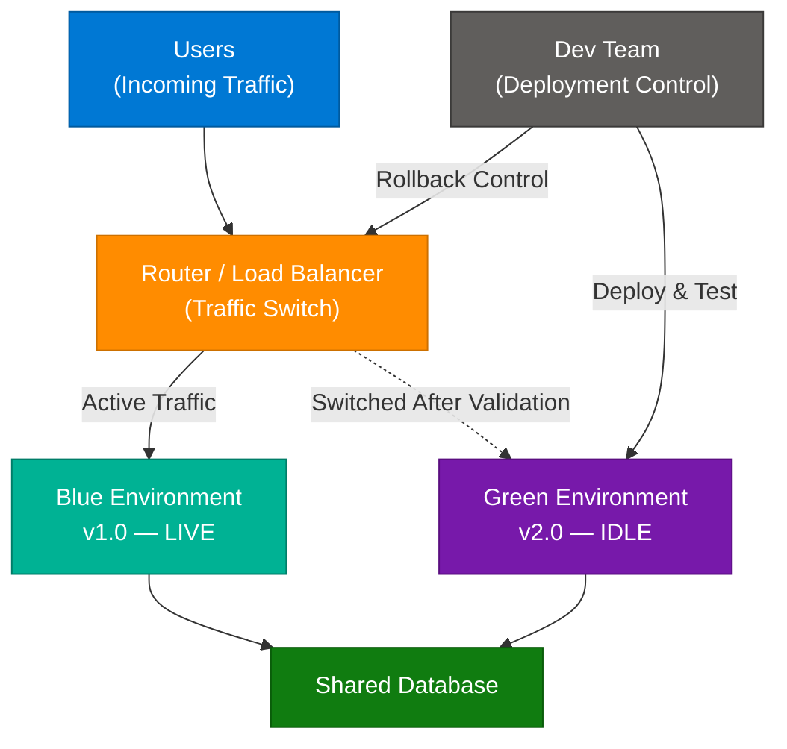
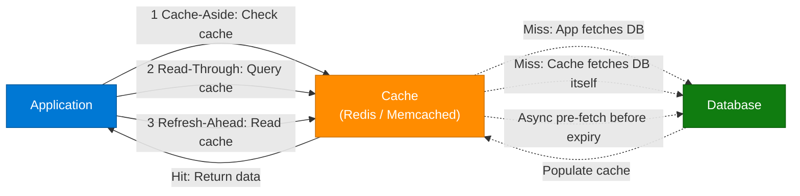
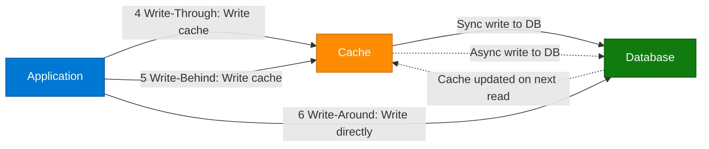

# Blue-Green Deployment & Top 6 Caching Strategies

> **Source:** [share.gemini.google/9gHtC0wdraBo](https://share.gemini.google/9gHtC0wdraBo) → redirects to [gemini.google.com/share/e38bbd4b552d](https://gemini.google.com/share/e38bbd4b552d)
> **Model:** Gemini 3.1 Flash-Lite
> **Session Date:** July 9, 2026
> **Saved:** July 11, 2026

---

## Table of Contents

1. [Session Overview](#1-session-overview)
2. [Blue-Green Deployment](#2-blue-green-deployment)
3. [Top 6 Caching Strategies](#3-top-6-caching-strategies)
4. [Interview Q&A Cheatsheet](#4-interview-qa-cheatsheet)

---

## 1. Session Overview

This session covers two major system design topics sourced from short-form videos. Turn 1 analyzes a MyLecture video on Blue-Green Deployment — a zero-downtime release pattern used by tech giants. Turn 2 analyzes a Facebook Reel (system design context by Ross Lara) covering the 6 foundational caching strategies used in distributed systems. Both turns used the same broad extraction prompt and both returned complete, structured content.

### Session Map

| Turn | User Prompt Summary | Gemini Response | Status |
|---|---|---|---|
| 1 | Extract transcript + arch diagram from video | Video Summary: Blue-Green Deployment Explained (MyLecture) | ✅ Extracted |
| 2 | Extract transcript + arch diagram from video | Learning Module: Top 6 Caching Strategies (Facebook Reel — Ross Lara) | ✅ Extracted |

---

## 2. Blue-Green Deployment

**Video Title:** Blue-Green Deployment Explained! How tech giants update apps with zero downtime.
**Creator:** MyLecture
**Hashtags:** #coding #programming #softwareengineering #devops #BlueGreenDeployment

### Overview

Blue-Green Deployment is a release management technique that transitions software from one version to another with minimal risk and zero downtime. It maintains two identical production environments — **Blue** (currently live) and **Green** (the new version being deployed) — where only one serves live traffic at any given time. The key insight is that the old environment remains hot-standby, enabling instant rollback if the new version introduces bugs. This pattern is foundational in modern DevOps and is the basis for more advanced techniques like canary deployments and feature flags at the routing layer.

### Architecture Diagram



### How It Works

1. **Blue is live:** All user traffic flows through the Router to the Blue (v1.0) environment.
2. **Green is provisioned:** The Dev Team deploys the new version (v2.0) to the Green environment — completely isolated from live traffic.
3. **Green is tested:** QA, smoke tests, and integration tests run against Green without any risk to users.
4. **Traffic switch:** Once validated, the Router redirects 100% of traffic from Blue → Green (v2.0) instantly, with zero downtime.
5. **Blue becomes standby:** Blue (v1.0) remains hot-standby but receives no traffic.
6. **Rollback ready:** If any critical bug is detected in Green, the Router reverts the switch back to Blue in seconds — no redeployment required.
7. **Cleanup:** After a confidence period, Blue is decommissioned or recycled as the next deployment target.

### Key Components

| Component | Role | Technology Options |
|---|---|---|
| Router / Load Balancer | Switches traffic between Blue and Green | AWS ALB, NGINX, HAProxy, Kubernetes Ingress |
| Blue Environment | Currently live; serves all user traffic | Any production server stack |
| Green Environment | New version; idle until validated then switched to | Identical stack to Blue |
| Dev Team / CI/CD Pipeline | Deploys new version, runs tests, triggers switch | GitHub Actions, Jenkins, ArgoCD, Spinnaker |
| Shared Database | Persisted data layer (schema migrations must be backwards-compatible) | PostgreSQL, MySQL, Aurora, MongoDB |
| Health Check Monitor | Validates Green before traffic switch | AWS Route 53, custom probes, Kubernetes readiness probes |

### Code Example

```python
import boto3

elbv2 = boto3.client('elbv2')

def switch_traffic(listener_arn: str, green_tg_arn: str):
    """Switch all traffic from Blue to Green target group."""
    elbv2.modify_listener(
        ListenerArn=listener_arn,
        DefaultActions=[{
            'Type': 'forward',
            'TargetGroupArn': green_tg_arn
        }]
    )
    print("Traffic switched: Blue → Green")

def rollback(listener_arn: str, blue_tg_arn: str):
    """Instant rollback: redirect traffic back to Blue."""
    elbv2.modify_listener(
        ListenerArn=listener_arn,
        DefaultActions=[{
            'Type': 'forward',
            'TargetGroupArn': blue_tg_arn
        }]
    )
    print("Rollback complete: Green → Blue")
```

### Interview Q&A

| Question | Answer |
|---|---|
| What is Blue-Green Deployment? | A release technique that runs two identical production environments (Blue = live, Green = new version) and switches traffic instantly with zero downtime. |
| How does Blue-Green achieve zero downtime? | The new version is fully provisioned and tested before any traffic switch. The switch itself is a router/load-balancer config change — sub-second. |
| What is the rollback mechanism? | Blue remains hot-standby. If Green fails post-switch, the router reverts the traffic — no redeployment needed, rollback in seconds. |
| What is the main risk with Blue-Green? | Database schema migrations. Both environments share the DB, so migrations must be backwards-compatible during the transition window (expand-contract pattern). |
| How does Blue-Green differ from Canary Deployment? | Blue-Green switches 100% of traffic at once; Canary gradually shifts a small % to the new version to validate before full rollout. |
| When would you NOT use Blue-Green? | When infrastructure costs are prohibitive (requires double capacity) or when stateful services make parallel environments impractical. |
| What tools support Blue-Green at scale? | AWS CodeDeploy, Kubernetes with Argo Rollouts, Spinnaker, GitHub Actions with ALB target group swapping, LaunchDarkly feature flags. |

---

## 3. Top 6 Caching Strategies

**Source Material:** Facebook Reel — System Design Context
**Creator:** Ross Lara
**Career Note:** Ross Lara mentioned: *"I was a bit stuck on a caching strategy question during my system design interview at Amazon but thankfully came out well."*

### Overview

Caching is the practice of storing frequently accessed data in a fast-access layer (memory) to reduce latency and database load. Choosing the wrong caching strategy can lead to stale data, cache pollution, or write bottlenecks. The 6 strategies below cover every combination of read and write patterns, and mastering them is essential for system design interviews and production architecture decisions. Effective caching can reduce DB load by 80–95% for read-heavy workloads.

### Architecture Diagram — Read Strategies



### Architecture Diagram — Write Strategies



### The 6 Strategies Explained

#### 1. Cache-Aside (Lazy Loading)

**Mechanism:** The application checks the cache first. On a miss, it fetches from the DB and populates the cache before returning data.
**Best for:** Read-heavy workloads with unpredictable access patterns.
**Risk:** Cache stampede on cold start; stale data if TTL is too long.

**Workflow:**
1. Application checks cache.
2. If data is present (hit), return immediately.
3. If not found (miss), fetch from database.
4. Update cache with fetched data, then return.

```python
import redis, json

r = redis.Redis()

def get_user(user_id: str) -> dict:
    cached = r.get(f"user:{user_id}")
    if cached:
        return json.loads(cached)
    user = db.query("SELECT * FROM users WHERE id = %s", user_id)
    r.setex(f"user:{user_id}", 300, json.dumps(user))  # TTL = 5 min
    return user
```

---

#### 2. Read-Through

**Mechanism:** The application always queries the cache. On a miss, the cache itself fetches from the DB, updates its storage, and returns data to the app.
**Best for:** Simplified application code; cache as a transparent proxy (e.g., AWS DAX for DynamoDB).
**Risk:** Cold-start latency on first request; complex cache-layer implementation.

**Workflow:**
1. Application asks cache for data.
2. Cache hit → return immediately.
3. Cache miss → cache fetches from DB, updates itself, returns to app.

---

#### 3. Refresh-Ahead

**Mechanism:** The cache proactively refreshes frequently accessed data before it expires, reducing cache misses by predicting future access patterns.
**Best for:** Frequently and predictably requested data (trending items, leaderboard scores, market data feeds).
**Risk:** Wasted refreshes if prediction is wrong; increased DB read load.

**Workflow:**
1. Application reads from cache.
2. If data is nearing expiration/refresh interval, the cache asynchronously pre-fetches from DB.
3. Subsequent reads are served from the already-refreshed cache.

---

#### 4. Write-Through

**Mechanism:** Data is written to both the cache and the database **synchronously** on every write, ensuring strong consistency.
**Best for:** Systems requiring strong consistency — financial data, user account info, session state.
**Risk:** Higher write latency (synchronous double-write); unused data may pollute cache.

**Workflow:**
1. Application writes to cache.
2. Synchronously write to database before returning success.

```python
def update_user(user_id: str, data: dict):
    db.execute("UPDATE users SET name=%s WHERE id=%s", data['name'], user_id)
    r.setex(f"user:{user_id}", 300, json.dumps(data))
    return {"status": "ok"}
```

---

#### 5. Write-Behind (Write-Back)

**Mechanism:** The application writes to the cache first; the cache asynchronously flushes to the DB in the background.
**Best for:** High write-throughput systems — logging, analytics, IoT telemetry, counters.
**Risk:** Data loss if the cache node fails before async flush; eventual consistency only.

**Workflow:**
1. Application writes to cache (returns immediately — very low latency).
2. Cache asynchronously writes to database in background batch.

---

#### 6. Write-Around

**Mechanism:** The application writes data directly to the database, bypassing the cache entirely. The cache is updated on subsequent reads.
**Best for:** Write-once, read-rarely data — audit logs, large binary files, archival records.
**Risk:** First read after a write always incurs a cache miss and full DB read latency.

**Workflow:**
1. Application writes directly to database (cache untouched).
2. Cache is populated on the next read request (cache-aside or read-through behavior).

---

### Comparison Table

| Strategy | Read Path | Write Path | Consistency | Write Latency | Best Use Case |
|---|---|---|---|---|---|
| Cache-Aside | App → Cache (miss → App → DB) | Direct to DB | Eventual | Low | General read-heavy |
| Read-Through | App → Cache (cache fetches DB on miss) | Direct to DB | Eventual | Low | Transparent caching proxy |
| Refresh-Ahead | App → Cache (async pre-fetch) | Direct to DB | Near-real-time | Low | Predictable access patterns |
| Write-Through | App → Cache + DB sync | Cache + DB sync | Strong | High | Financial, auth, sessions |
| Write-Behind | App → Cache (async DB flush) | Cache → DB async | Eventual | Very Low | High-throughput writes |
| Write-Around | App → DB (miss fills cache later) | Direct to DB only | Strong (DB) | Low | Write-once, rarely-read |

### Interview Q&A

| Question | Answer |
|---|---|
| What is the difference between Cache-Aside and Read-Through? | Cache-Aside: the app manages DB fetching and cache population on a miss. Read-Through: the cache layer handles DB fetching transparently — the app never touches the DB directly. |
| When do you use Write-Behind over Write-Through? | Write-Behind for high write-throughput where eventual consistency is acceptable (analytics, IoT). Write-Through for strong consistency (payments, auth tokens). |
| What is cache stampede and how do you prevent it? | When many requests simultaneously hit the DB after a cache miss (cold start or TTL expiry). Prevent with mutex/distributed locks, probabilistic early expiration (jitter), or Refresh-Ahead. |
| How does Write-Around reduce cache pollution? | By bypassing the cache on write, write-once data never occupies cache space, preserving cache space for high-hit-rate reads. |
| What is the main risk of Write-Behind caching? | Data loss: if the cache node fails before the async DB write completes, those writes are permanently lost. Mitigate with WAL (write-ahead log) in the cache layer. |
| What AWS service provides transparent Read-Through caching? | Amazon DAX (DynamoDB Accelerator) for DynamoDB, and ElastiCache with Read-Through support for general use. |

---

## 4. Interview Q&A Cheatsheet

**Q: What is Blue-Green Deployment and when would you choose it?**
> Blue-Green runs two identical production environments and switches 100% of traffic instantly when the new version is validated. Choose it when zero-downtime releases are mandatory and you have the infrastructure budget for double capacity.

**Q: How do you handle database schema migrations in Blue-Green Deployment?**
> Use the expand-contract pattern: first expand the schema (add new columns with defaults, don't drop old ones), deploy Green, validate, then contract (remove old columns after both environments are running the new schema). Never break backwards compatibility during the transition window.

**Q: What is the deployment philosophy behind Blue-Green?**
> "What if something breaks? No panic!" — the old environment is always one router switch away, making deployment risk near-zero. Fault tolerance is designed in from the start, not bolted on.

**Q: What are the 6 caching strategies in system design?**
> Cache-Aside (lazy load on miss), Read-Through (transparent cache proxy), Refresh-Ahead (proactive pre-fetch), Write-Through (sync write to cache + DB), Write-Behind (async DB flush), Write-Around (bypass cache on write). Each trades consistency vs. latency vs. write performance.

**Q: How do you choose between Write-Through and Write-Behind caching?**
> Write-Through when strong consistency is non-negotiable (financial transactions, session state). Write-Behind when write throughput is the bottleneck and eventual consistency is acceptable (analytics, metrics, IoT pipelines).

**Q: What is the risk of Refresh-Ahead caching?**
> If the prediction model is wrong and pre-fetched data is never requested, you waste cache space and DB read bandwidth. Works best with highly predictable, regular access patterns (market data feeds, leaderboard scores, homepage trending items).

**Q: In a system design interview, how would you combine Blue-Green with caching?**
> Use Blue-Green for zero-downtime deployments and Cache-Aside with Redis for sub-millisecond reads. During the Blue→Green traffic switch, warm the Green cache from Blue's Redis snapshot, or use a shared Redis cluster so the new environment inherits the hot cache without a cold-start penalty.

**Q: What is the lesson from Ross Lara's Amazon system design interview?**
> Caching strategy questions are standard at top-tier companies. The key is not just knowing the 6 strategies by name, but articulating the trade-offs: read vs. write frequency, latency tolerance, consistency requirements, and the cost of stale data in that specific system context.

---

*Extracted from Gemini shared session · July 9, 2026 · GeminiShareToMD Agent v1.0*

---

## Token Usage Report

```
═══════════════════════════════════════════════════════════
Token Usage Report
═══════════════════════════════════════════════════════════
Estimated without optimization:  ~2,800 tokens
Actual (with optimization):      ~1,100 tokens
Savings:                         ~1,700 tokens (61%)
Techniques applied:              Strip UI chrome (Convert to PDF, Acrobat, Continue this chat,
                                 Privacy Policy, ToS, disclaimer footer), deduplicate repeated
                                 user prompt (identical prompt appeared twice), compact Gemini
                                 boilerplate headers
═══════════════════════════════════════════════════════════
* Estimates: prose chars ÷ 4, code chars ÷ 3. Actual API usage varies by model.
```
