# Agentic AI Architecture Patterns — Claude Architect Exam Q&A

> **Source:** [share.gemini.google/qAh1GTtXqpLJ](https://share.gemini.google/qAh1GTtXqpLJ) → redirects to [gemini.google.com/share/92fa404e7674](https://gemini.google.com/share/92fa404e7674)
> **Model:** Gemini 3.5 Flash
> **Session Date:** April 13, 2026 · Published July 5, 2026
> **Saved:** July 12, 2026

---

## Table of Contents

1. [Session Overview](#1-session-overview)
2. [MCP Tool Description Enrichment](#2-mcp-tool-description-enrichment)
3. [Read-Write File Manipulation Pattern](#3-read-write-file-manipulation-pattern)
4. [External Scratchpad Memory](#4-external-scratchpad-memory)
5. [Prompt Chaining for Structured Workflows](#5-prompt-chaining-for-structured-workflows)
6. [Multi-Phase Agentic Workflow](#6-multi-phase-agentic-workflow)
7. [Strategic Codebase Analysis — Glob and Grep](#7-strategic-codebase-analysis--glob-and-grep)
8. [Context Export for Parallel Session Exploration](#8-context-export-for-parallel-session-exploration)
9. [Orchestrator-Workers Pattern](#9-orchestrator-workers-pattern)
10. [MCP Resources vs MCP Tools](#10-mcp-resources-vs-mcp-tools)
11. [Stale Context and Subagent Lifecycle Management](#11-stale-context-and-subagent-lifecycle-management)
12. [Targeted Grep Search for Code Discovery](#12-targeted-grep-search-for-code-discovery)
13. [MCP Server Tool Discovery and Aggregation](#13-mcp-server-tool-discovery-and-aggregation)
14. [Interview Q&A Cheatsheet](#14-interview-qa-cheatsheet)

---

## 1. Session Overview

This session covers **12 Claude Certified Architect exam-style questions** on agentic AI architecture patterns, MCP (Model Context Protocol) design, context window management, and multi-agent orchestration. Each question presents a realistic engineering scenario and asks for the best architectural choice. Topics span tool selection, file manipulation strategies, memory patterns, task decomposition, subagent lifecycle, and MCP server internals. All 12 turns were successfully extracted; none produced errors.

### Session Map

| Turn | User Prompt | Gemini Response Summary | Status |
|---|---|---|---|
| 1 | Ans | MCP Tool Description Enrichment — correct answer: Option D | ✅ Extracted |
| 2 | Ans | Read-Write File Pattern — correct answer: Option A | ✅ Extracted |
| 3 | Ans | Scratchpad External Memory — correct answer: Option D | ✅ Extracted |
| 4 | Ans | Prompt Chaining for PR Review — correct answer: Option D | ✅ Extracted |
| 5 | Ans | Multi-Phase Workflow for Risk — correct answer: Option B | ✅ Extracted |
| 6 | Ans | Glob + Grep Codebase Strategy — correct answer: Option C | ✅ Extracted |
| 7 | Ans | Context Export for A/B Sessions — correct answer: Option B | ✅ Extracted |
| 8 | Ans | Orchestrator-Workers Pattern — correct answer: Option C | ✅ Extracted |
| 9 | Ans | MCP Resources Content Catalog — correct answer: Option D | ✅ Extracted |
| 10 | Ans | Fresh Subagent with Summary — correct answer: Option D | ✅ Extracted |
| 11 | Ans | Targeted Grep Code Discovery — correct answer: Option C | ✅ Extracted |
| 12 | Ans | MCP Tool Discovery at Connection Time — correct answer: Option C | ✅ Extracted |

---

## 2. MCP Tool Description Enrichment

### Overview

When an LLM agent selects which tool to call, it relies almost entirely on the **textual description** embedded in each tool's definition — not on the tool's actual runtime capabilities. If a specialized MCP tool (like `analyze_dependencies`) has a vague description while a general-purpose tool (like `Grep`) has a specific, familiar one, the agent will consistently prefer the less-capable tool because the description makes its outcome predictable. Enriching the MCP tool description with precise capability language — "builds a dependency graph showing direct imports, transitive dependencies, and cycles" — is the MCP-native solution: it makes the tool self-documenting and allows the LLM to reason correctly without brute-forcing behavior through system prompts. This is the **semantic clarity principle**: align the description with what the agent actually needs to know to choose the right tool. Every MCP tool description should answer: "what exactly do I get back from this call, and when should I prefer this over simpler alternatives?"

### Architecture Diagram

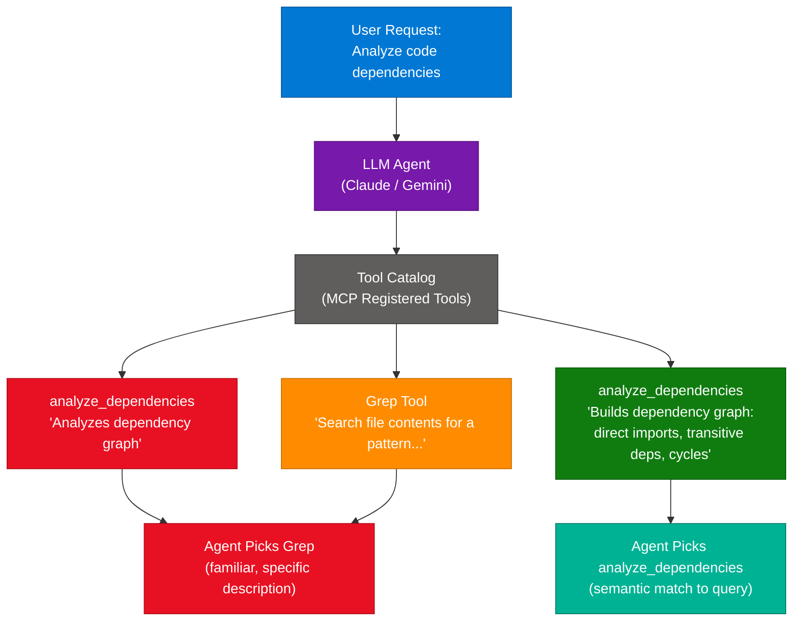

### How It Works

1. The user submits a request requiring dependency analysis.
2. The LLM agent scans the tool catalog, reading the `description` field of each registered MCP tool.
3. With a vague description on `analyze_dependencies`, the agent pattern-matches on "dependency" but cannot determine output type or scope.
4. Grep's description ("Search file contents for a pattern and return matching lines") is concrete and action-oriented — the agent knows exactly what it will receive.
5. Without semantic differentiation, the agent defaults to Grep + `import` pattern — a known, safe choice.
6. After enrichment, the description specifies that `analyze_dependencies` returns "transitive dependencies and cycles" — capabilities Grep cannot replicate.
7. The agent now has a semantic reason to prefer the MCP tool for dependency queries.
8. Tool selection is correct without any system prompt override, making the architecture scalable as tools grow.

### Key Components

| Component | Role | Configuration Notes |
|---|---|---|
| MCP Tool Description | Semantic signal for LLM tool selection | Must include: input accepted, output format, unique capabilities |
| Tool Catalog | Aggregated list of all registered MCP tools | Auto-discovered from all connected MCP servers at session start |
| Grep (general tool) | Fallback text search — always available | Should remain; removal breaks other unrelated tasks |
| System Prompt | Low-priority override for tool selection | Last resort only — not scalable to many tools |
| analyze_dependencies | Specialized MCP tool for dependency graphs | Description must distinguish its output from what Grep produces |

### Code Example

```python
# MCP tool definition — before (vague, agent prefers Grep)
TOOL_VAGUE = {
    "name": "analyze_dependencies",
    "description": "Analyzes dependency graph.",
    "input_schema": {"type": "object", "properties": {"file_path": {"type": "string"}}}
}

# MCP tool definition — after (rich, agent selects correctly)
TOOL_RICH = {
    "name": "analyze_dependencies",
    "description": (
        "Builds a complete dependency graph for a given module. "
        "Returns: (1) direct imports, (2) transitive dependencies at all depths, "
        "(3) circular/cyclic dependency chains. "
        "Prefer this over Grep when you need the FULL dependency tree, "
        "not just import statement text matches."
    ),
    "input_schema": {
        "type": "object",
        "properties": {
            "file_path": {"type": "string", "description": "Path to the module to analyze"},
            "depth": {"type": "integer", "description": "Max transitive depth (default: unlimited)"}
        },
        "required": ["file_path"]
    }
}
```

### Interview Q&A

| Question | Answer |
|---|---|
| Why does an LLM agent prefer Grep over a specialized MCP tool with a vague description? | Grep's description is concrete and outcome-predictable. The agent knows exactly what it receives. A vague MCP tool description provides no semantic reason to prefer it, so the agent defaults to the familiar, reliable tool. |
| What information must every MCP tool description include? | Input types accepted, exact output format/structure, unique capabilities not available in simpler tools, and explicit "prefer this over X when Y" guidance. |
| Why is removing Grep a destructive fix for tool selection problems? | Grep is a general-purpose utility needed for many tasks. Removing it to force use of a specific tool may break unrelated functionality and is an architectural anti-pattern. |
| What is the "self-documenting" principle in MCP tool design? | Tools should carry enough description metadata that an LLM can select them correctly without additional system prompt guidance. The description IS the routing logic. |
| How does poor tool description quality affect agent operating cost? | Incorrect tool selection causes failed attempts, retries, and wasted API calls. Rich descriptions produce correct first-try selections — reducing latency and token spend per task. |
| When should you use system prompt routing instead of description enrichment? | Only for legacy tools where you cannot modify the tool definition, or for temporary debugging overrides. Not scalable as the tool count grows. |

---

## 3. Read-Write File Manipulation Pattern

### Overview

In agentic file editing, the `Edit` tool relies on string matching to locate a target snippet before replacing it. When a file contains repetitive patterns — identical function signatures, repeated docstrings, or uniform variable names — the string matcher fails because it cannot uniquely identify which instance to modify. The **Read-Write pattern** bypasses this entirely: the agent reads the full file into working memory, performs the logical insertion or modification in its "reasoning space," then writes the complete updated file back in a single call. For files that fit within the context window (typically under ~200KB), this is the most reliable strategy. It trades a slightly larger token footprint for guaranteed correctness — no string collision, no risk of editing the wrong occurrence.

### Architecture Diagram

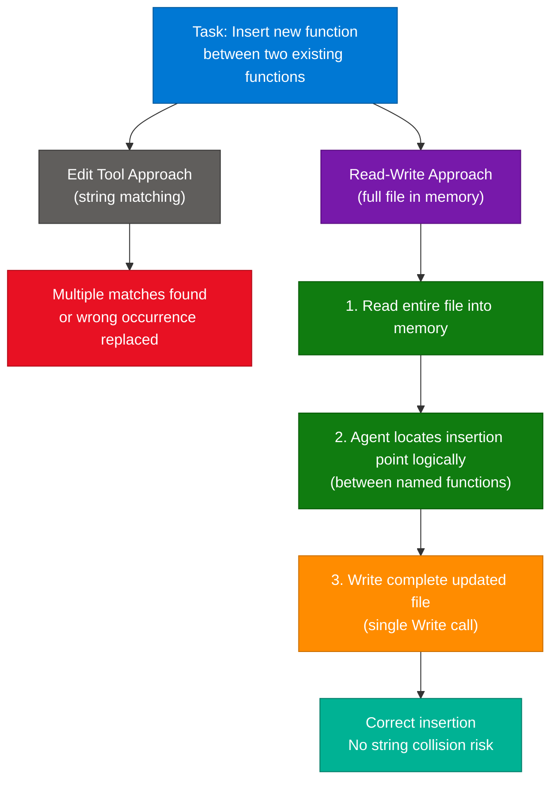

### How It Works

1. Agent receives a task: insert a new function between function A and function B in a 150-line file.
2. Agent checks file size — fits in context window, so Read-Write is viable.
3. `Read` tool loads the entire file content into working memory.
4. Agent identifies the insertion point by function name (logical, not string-based).
5. Agent constructs the new file content as a string with the function inserted at the correct position.
6. A single `Write` call replaces the entire file with the updated content.
7. No string matching is performed — agent internal reasoning handles placement.
8. Result is deterministic regardless of how repetitive the file patterns are.

### Key Components

| Component | Role | When to Use |
|---|---|---|
| Read tool | Load entire file into agent working memory | First step — always verify size fits context |
| Write tool | Overwrite file with complete updated content | Single call after all modifications computed |
| Edit tool | String-match-based partial replacement | Only when target string is uniquely identifiable |
| replace_all | Replace every instance of a string | Dangerous in code — only for clearly global renames |
| Context window check | Ensure file fits before Read-Write | Files > 200KB may need chunked strategies |

### Code Example

```python
import pathlib

def insert_function_between(
    file_path: str,
    new_function_code: str,
    after_function: str,
    before_function: str
) -> None:
    content = pathlib.Path(file_path).read_text()
    lines = content.split('\n')

    after_idx = None
    before_idx = None
    for i, line in enumerate(lines):
        if f'def {after_function}' in line:
            after_idx = i
        if f'def {before_function}' in line and after_idx is not None:
            before_idx = i
            break

    if after_idx is None or before_idx is None:
        raise ValueError(f"Insertion point not found between {after_function} and {before_function}")

    updated = lines[:before_idx] + ['', new_function_code, ''] + lines[before_idx:]
    pathlib.Path(file_path).write_text('\n'.join(updated))
```

### Interview Q&A

| Question | Answer |
|---|---|
| Why does the Edit tool fail in files with repetitive patterns? | Edit uses string matching — if the same string appears multiple times, it cannot determine which instance to modify and throws an error or (worse) silently edits the wrong one. |
| When is Read-Write preferred over Edit? | When files contain repetitive identifiers or docstrings; when the file is small enough to fit in context; when insertion point is defined by logical position (between named functions) rather than a unique literal string. |
| What is the risk of using replace_all in code files? | replace_all modifies every occurrence of the target string. A file with repeated function signature patterns could have the new function inserted in 5 places instead of 1, breaking the module. |
| What is the upper size limit for the Read-Write pattern? | Files that fit within the model's context window — approximately under 200KB or ~50,000 tokens of content. Larger files need chunked editing or targeted Edit with extensive unique context. |
| Why is "use a longer old_string" a fragile workaround? | Long strings are prone to whitespace, indentation, or invisible character mismatches. A single extra space causes the entire Edit to fail — it's brittle, not a reliable architectural solution. |

---

## 4. External Scratchpad Memory

### Overview

LLMs suffer from the **"lost in the middle" phenomenon**: facts appearing in the middle of a long context window are retrieved less reliably than those at the beginning or end. When an agent conducts a 30-minute codebase investigation, the growing context fills with raw tool outputs and conversation turns — "noise" that buries key architectural insights discovered earlier. The **scratchpad pattern** externalizes these discoveries: the agent writes findings to a persistent file (e.g., `findings.md`) as it goes, and reads that file for reference before each subsequent step. This keeps the active context lean — only the current query plus the curated findings file — rather than a saturated 30-minute transcript. Specific facts (function names, dependency chains, architectural patterns) are read from the file, not recalled from an unreliable middle-context position.

### Architecture Diagram

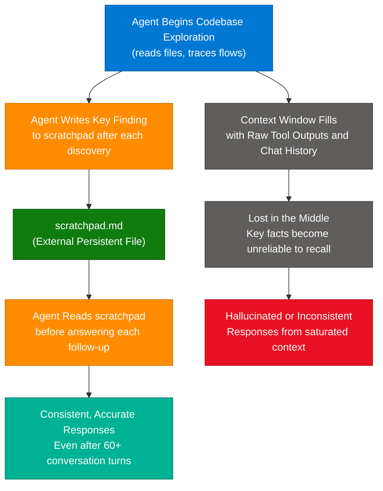

### How It Works

1. Agent starts a complex investigation (mapping a 30+ file codebase).
2. After each significant discovery, the agent writes a structured note to `findings.md` — module purpose, dependency found, architectural pattern.
3. The scratchpad grows incrementally as the investigation proceeds.
4. When a new question arrives, the agent reads the scratchpad first rather than scanning the full transcript.
5. The scratchpad acts as a compressed, curated version of the investigation — only high-signal findings, not raw tool output noise.
6. The active context window stays lean: current query + scratchpad summary, not the entire transcript.
7. Responses are grounded in the structured file, not uncertain LLM recall from a saturated context.

### Key Components

| Component | Role | Best Practice |
|---|---|---|
| Scratchpad file | Persistent external memory for agent findings | Name: `findings.md`, `context.md`, `exploration_notes.md` |
| Write-on-discovery | Agent writes immediately after each significant find | One entry per discovery — do not batch |
| Read-before-answer | Agent reads scratchpad before answering each follow-up | Ensures consistency across long sessions |
| Structured entries | Each entry: module, finding, evidence | Makes targeted reads efficient |
| Context window | LLM in-session short-term memory | Keep lean — scratchpad replaces long transcript recall |

### Code Example

```python
import pathlib
import datetime

SCRATCHPAD = pathlib.Path("findings.md")

def write_finding(module: str, finding: str, evidence: str) -> None:
    timestamp = datetime.datetime.now().strftime("%H:%M")
    entry = f"\n### [{timestamp}] {module}\n- **Finding:** {finding}\n- **Evidence:** `{evidence}`\n"
    SCRATCHPAD.open('a').write(entry)

def read_findings() -> str:
    return SCRATCHPAD.read_text() if SCRATCHPAD.exists() else ""

# Agent query loop pattern
import anthropic
client = anthropic.Anthropic()

def ask_with_memory(question: str) -> str:
    findings = read_findings()
    return client.messages.create(
        model="claude-sonnet-4-6",
        max_tokens=1024,
        system="You are a code analyst. Reference the provided findings for prior discoveries.",
        messages=[{"role": "user", "content": f"Prior findings:\n{findings}\n\nQuestion: {question}"}]
    ).content[0].text
```

### Interview Q&A

| Question | Answer |
|---|---|
| What is the "lost in the middle" phenomenon? | LLMs retrieve information less reliably when it appears in the middle of a long context window. Early (system prompt) and recent (last few turns) content is recalled well; middle content degrades as context grows. |
| Why is clearing the context every 15 minutes counter-productive? | It erases all accumulated knowledge, forcing engineers to re-explain the codebase — defeating the purpose of a long investigation session. |
| How does the scratchpad pattern differ from simply increasing the context window? | A larger context window still suffers from noise and middle-recall degradation. The scratchpad stores only high-signal curated facts — quality over quantity. Each agent query also costs less tokens. |
| What should a good scratchpad entry contain? | Module name, specific finding, evidence (file path or line reference), timestamp. Structured entries allow targeted reads rather than full-scratchpad scans. |
| When is creating static summaries before exploration insufficient? | Static summaries don't capture dynamic discoveries made during the investigation. The scratchpad is a living document that grows as new insights emerge — not a one-time snapshot. |

---

## 5. Prompt Chaining for Structured Workflows

### Overview

**Prompt chaining** decomposes a complex workflow into a fixed, sequential series of steps, where each step's output feeds directly into the next as input. It is ideal when sub-tasks are **known in advance**, **non-branching**, and **must all complete** — a PR review workflow that always runs Style → Security → Documentation checks is a canonical example. Unlike the Orchestrator-Workers pattern (dynamic routing based on input), prompt chaining is deterministic: the sequence is hardcoded and each step uses a specialized prompt for one concern. This eliminates **attention dilution** — the tendency of a single large "mega-prompt" to give shallow coverage to every topic because the model divides its attention too broadly. A synthesis step at the end combines all outputs into a coherent final review.

### Architecture Diagram

```mermaid
flowchart LR
    prInput["PR Input\n(Code Diff)"]
    step1["Step 1\nStyle Analysis\n(linting, naming, formatting)"]
    step2["Step 2\nSecurity Scan\n(injection, auth, secrets)"]
    step3["Step 3\nDocs Review\n(coverage, accuracy)"]
    synth["Step 4\nSynthesis\n(combine all findings)"]
    output["Final PR Review\n(structured report)"]

    prInput --> step1
    step1 --> |"style_findings"| step2
    step2 --> |"security_findings"| step3
    step3 --> |"docs_findings"| synth
    synth --> output

    classDef userNode    fill:#0078D4,stroke:#005A9E,color:#fff
    classDef aiNode      fill:#7719AA,stroke:#5A0E80,color:#fff
    classDef dataNode    fill:#107C10,stroke:#0A5C0A,color:#fff
    classDef processNode fill:#FF8C00,stroke:#CC7000,color:#fff
    classDef errorNode   fill:#E81123,stroke:#B30D1A,color:#fff
    classDef outputNode  fill:#00B294,stroke:#007D68,color:#fff
    classDef infraNode   fill:#605E5C,stroke:#3B3A39,color:#fff

    class prInput userNode
    class step1,step2,step3 processNode
    class synth aiNode
    class output outputNode
```

### How It Works

1. Receive the PR diff as input.
2. Pass the diff to a **Style Analysis** prompt — focused solely on linting, formatting, naming conventions. Output: `style_findings`.
3. Pass the diff + `style_findings` to a **Security Scan** prompt — focused on injection, auth issues, hardcoded secrets. Output: `security_findings`.
4. Pass the diff to a **Documentation Review** prompt — checks docstrings, comments, API surface coverage. Output: `docs_findings`.
5. Pass all three finding sets to a **Synthesis** prompt that consolidates them into a structured report.
6. Output the final PR review.

### Key Components

| Component | Role | Alternative Pattern |
|---|---|---|
| Fixed chain sequence | Pre-defined steps run for every PR | Orchestrator for dynamic routing |
| Specialized prompt per step | Focused on one concern only | Mega-prompt (suffers attention dilution) |
| Inter-step data passing | Output of step N is input to step N+1 | Parallel fan-out (breaks ordering dependency) |
| Synthesis step | Combines all outputs into coherent report | Manual human aggregation |
| Routing | Sends different inputs down different paths | Not needed here — all PRs get all checks |

### Code Example

```python
import anthropic

client = anthropic.Anthropic()

def run_pr_review_chain(pr_diff: str) -> str:
    style = client.messages.create(
        model="claude-sonnet-4-6",
        max_tokens=1024,
        messages=[{"role": "user", "content": f"Analyze ONLY code style issues:\n\n{pr_diff}"}]
    ).content[0].text

    security = client.messages.create(
        model="claude-sonnet-4-6",
        max_tokens=1024,
        messages=[{"role": "user", "content": f"Analyze ONLY security vulnerabilities:\n\n{pr_diff}\n\nStyle findings (context only):\n{style}"}]
    ).content[0].text

    docs = client.messages.create(
        model="claude-sonnet-4-6",
        max_tokens=1024,
        messages=[{"role": "user", "content": f"Analyze ONLY documentation coverage:\n\n{pr_diff}"}]
    ).content[0].text

    return client.messages.create(
        model="claude-sonnet-4-6",
        max_tokens=2048,
        messages=[{"role": "user", "content": f"Synthesize into a structured PR review:\n\nStyle:\n{style}\n\nSecurity:\n{security}\n\nDocs:\n{docs}"}]
    ).content[0].text
```

### Interview Q&A

| Question | Answer |
|---|---|
| What distinguishes prompt chaining from orchestrator-workers? | Prompt chaining has a fixed, pre-defined sequence — the agent doesn't decide the path at runtime. Orchestrator-workers is dynamic: the orchestrator decides which workers to spawn based on the specific input. |
| What is "attention dilution" and how does chaining solve it? | Attention dilution occurs when one prompt covers multiple concerns simultaneously — the model spreads focus and gives shallow analysis to each. Chaining uses one specialized prompt per concern, achieving depth on each. |
| When should you NOT use prompt chaining? | When the next step depends on an unpredictable condition in the prior output, or when different inputs require different processing paths. Use orchestrator-workers or routing for conditional, branching workflows. |
| Why is a "mega-prompt" insufficient for complex PR reviews? | A single prompt evaluating style, security, and documentation simultaneously hits output token limits, dilutes attention across concerns, and often misses subtle issues that focused single-concern prompts would catch. |
| Why is routing not the right pattern for this PR review workflow? | Routing sends different inputs down different paths — useful for classifying request types. But all PRs here need all three checks; there's no routing decision to make. The workflow is sequential, not conditional. |

---

## 6. Multi-Phase Agentic Workflow

### Overview

A **multi-phase agentic workflow** structures high-risk tasks into explicit phases — typically Analyze → Propose → Implement — where each phase gates the next and may include a human or secondary review checkpoint. This is the correct pattern for tasks that are **architecturally complex** (touching multiple systems), **high-risk** (data integrity or security impact), or **ambiguous** (where the correct implementation path isn't obvious). For a deterministic task like renaming a function, the multi-phase overhead is unjustified. For improving error handling across an entire module to prevent data corruption, the proposal phase is critical: it forces the agent to reason about error propagation before touching code, and allows a reviewer to spot logic errors before they become implemented bugs.

### Architecture Diagram

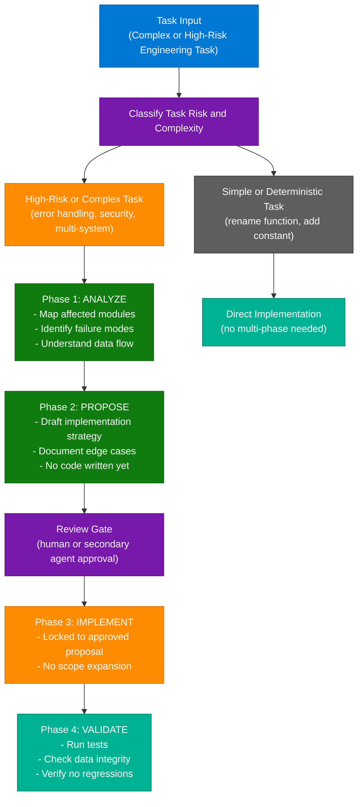

### How It Works

1. Classify the task: high-risk/complex tasks trigger multi-phase; simple/deterministic tasks go direct.
2. **Analyze phase:** Agent maps scope — which modules are affected, current error handling strategy, where data corruption can occur.
3. **Propose phase:** Agent drafts the new strategy — exception types, retry logic, rollback points, logging approach. No code is written yet.
4. **Review gate:** Proposal surfaced for human or secondary agent review. Reviewer checks logic without code complexity in the way.
5. **Implement phase:** Agent implements exactly the approved proposal — scope is locked, no deviation.
6. **Validate phase:** Tests run, regression checks performed, data integrity verified.

### Key Components

| Component | Role | Skip Condition |
|---|---|---|
| Risk classifier | Determine if task needs multi-phase | Required — drives workflow selection |
| Analyze phase | Map scope and identify failure modes | Never skip for high-risk tasks |
| Propose phase | Draft strategy before writing code | Skip for trivial or deterministic tasks |
| Review gate | Human or secondary agent approval | Can be automated for lower-risk proposals |
| Implement phase | Locked-scope implementation | Always follows proposal exactly |
| Validate phase | Tests and integrity checks | Never skip after high-risk changes |

### Code Example

```python
import anthropic

client = anthropic.Anthropic()

def run_multiphase_workflow(task: str, codebase_context: str) -> dict:
    analysis = client.messages.create(
        model="claude-sonnet-4-6",
        max_tokens=1024,
        system="You are a senior architect. Analyze only — do not write code.",
        messages=[{"role": "user", "content": f"Analyze this task and identify all risks:\n\nTask: {task}\n\nCodebase:\n{codebase_context}"}]
    ).content[0].text

    proposal = client.messages.create(
        model="claude-sonnet-4-6",
        max_tokens=1024,
        system="You are a senior architect. Write a proposal only — no implementation code.",
        messages=[{"role": "user", "content": f"Based on this analysis:\n{analysis}\n\nPropose a specific implementation strategy."}]
    ).content[0].text

    print(f"\nPROPOSAL FOR REVIEW:\n{proposal}\n")
    approved = input("Approve? (y/n): ").strip().lower() == 'y'
    if not approved:
        return {"status": "rejected", "proposal": proposal}

    implementation = client.messages.create(
        model="claude-sonnet-4-6",
        max_tokens=4096,
        system="Implement exactly what was approved. Do not add scope beyond the proposal.",
        messages=[{"role": "user", "content": f"Implement this approved proposal:\n{proposal}"}]
    ).content[0].text

    return {"status": "complete", "implementation": implementation}
```

### Interview Q&A

| Question | Answer |
|---|---|
| Which tasks justify a multi-phase workflow? | Tasks that are architecturally complex (multiple affected systems), high-risk (data corruption or security implications), or ambiguous (multiple valid implementation paths where the correct one isn't obvious). |
| Why is renaming a function NOT a good candidate for multi-phase? | It is deterministic — correct action is clear, scope is bounded, risk is low. Multi-phase overhead adds latency without improving outcome for mechanical, unambiguous changes. |
| What is the benefit of the "propose before implement" gate? | The proposal is a pure-logic document — reviewers can spot strategy errors without navigating code complexity. Logic errors caught at proposal stage are far cheaper to fix than errors found after implementation. |
| How does multi-phase prevent scope creep? | The Implement phase is locked to the approved proposal. The agent cannot expand scope beyond what was agreed — it has a concrete spec, not an open-ended instruction. |
| What triggers multi-phase vs direct implementation? | Risk level (data integrity potential), ambiguity (multiple valid paths), and architectural breadth (number of systems or files touched). |

---

## 7. Strategic Codebase Analysis — Glob and Grep

### Overview

When tasked with writing tests for a 200-file legacy codebase, an agent cannot simply "start writing" — it must first build a **strategic architectural map**. **Glob** discovers the file tree (what modules exist) without reading any content. **Grep** across import statements identifies **coupling** (which files are depended on by many others). Together they surface **heavily-coupled modules** — the highest-impact targets for test coverage because a bug there propagates to many consumers. An iterative, priority-driven approach beats equal-effort-per-directory because legacy codebases are architecturally uneven: a single 500-line core module may be more critical than an entire directory of trivial helpers. The plan is also dynamic — it starts prioritized but revises as new dependencies emerge during the testing process.

### Architecture Diagram

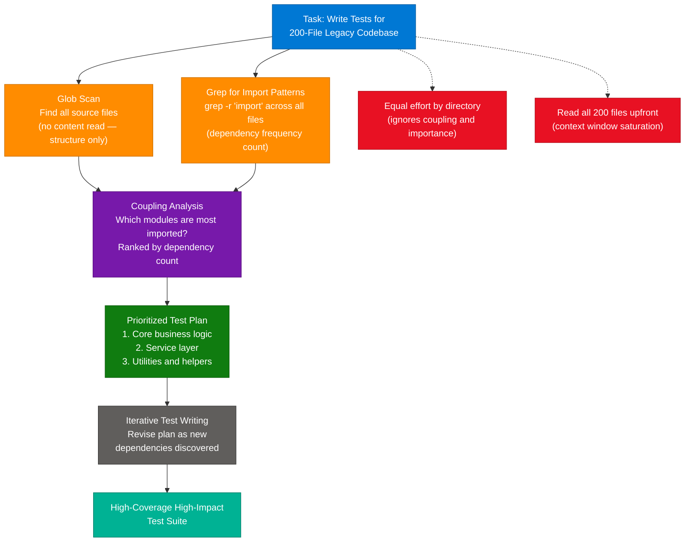

### How It Works

1. Run `Glob` across the codebase to get a complete file tree — understand module structure without reading any file content.
2. Run `Grep` for import statements across all files — count how many times each module is imported.
3. Build a coupling frequency map: modules imported by 20+ other files are highest-impact.
4. Draft a prioritized test plan: core business logic modules first, service layers second, utilities last.
5. Begin writing tests for top-priority modules, using `Read` selectively as needed.
6. Revise the plan dynamically as hidden dependencies emerge during testing.
7. Continue iteratively until coverage targets are met.

### Key Components

| Component | Role | Output |
|---|---|---|
| Glob | File tree discovery — no content read | List of all file paths |
| Grep | Import frequency analysis across files | Coupling map — files ranked by import count |
| Coupling analysis | Identify highest-impact modules | Prioritized test target list |
| Dynamic plan | Revise priorities as dependencies emerge | Living test strategy document |
| Read (selective) | Load specific files for test writing | Only load what's needed, when needed |

### Code Example

```python
import pathlib
from collections import Counter

def build_coupling_map(root: str) -> list[tuple[str, int]]:
    all_files = list(pathlib.Path(root).rglob("*.py"))
    import_counts: Counter = Counter()

    for file_path in all_files:
        content = file_path.read_text(errors='ignore')
        for line in content.split('\n'):
            if line.strip().startswith(('import ', 'from ')):
                parts = line.split()
                if len(parts) >= 2:
                    module = parts[1].split('.')[0]
                    import_counts[module] += 1

    return sorted(import_counts.items(), key=lambda x: x[1], reverse=True)

# Usage — agent runs this first before writing any test
coupling = build_coupling_map("/path/to/codebase")
print("Top modules to test first (by coupling):")
for module, count in coupling[:10]:
    print(f"  {module}: imported by {count} files")
```

### Interview Q&A

| Question | Answer |
|---|---|
| Why is directory-based equal-effort allocation a poor strategy for legacy codebases? | Directory structure is arbitrary and doesn't reflect technical importance. A `utils/` directory with 100 trivial helpers may need less testing than a single 500-line core business logic file. |
| What is the "context window killer" problem with reading all files upfront? | Reading 200 files fills the context window with so much content that the agent hits saturation and loses effective recall before writing its first test — a direct hit from the "lost in the middle" problem. |
| How does Glob differ from Grep in this workflow? | Glob discovers what files exist (structure, no content). Grep analyzes content patterns across files (coupling and dependency). Structure + dependency intelligence together drive prioritization. |
| Why is alphabetical traversal a naive approach to codebase testing? | Starting with `auth.js` because it starts with 'A' ignores architectural importance. The agent may spend most of its context budget on high-complexity but medium-importance files, missing critical core modules. |
| What is a "coupling map" and why does it drive test prioritization? | A coupling map ranks modules by how many other modules import them. High-coupling modules are load-bearing — a bug propagates to all their consumers. Testing them first maximizes defect detection per test written. |

---

## 8. Context Export for Parallel Session Exploration

### Overview

When an agent has completed a complex analysis and needs to explore two or more **divergent implementation strategies** (e.g., comparing mocked E2E tests vs snapshot tests), the correct pattern is to **export findings to a curated summary file** and **initialize fresh sessions** from that file. This preserves the analytical work already done while giving each branch a clean, focused context — no cross-contamination between the two strategies, no noise from the full conversation transcript, and no risk of one strategy's implementation details bleeding into the other. The exported file is a dense, high-signal summary of what the analysis found, stripped of back-and-forth chat history — exactly what each new session needs to start confidently.

### Architecture Diagram

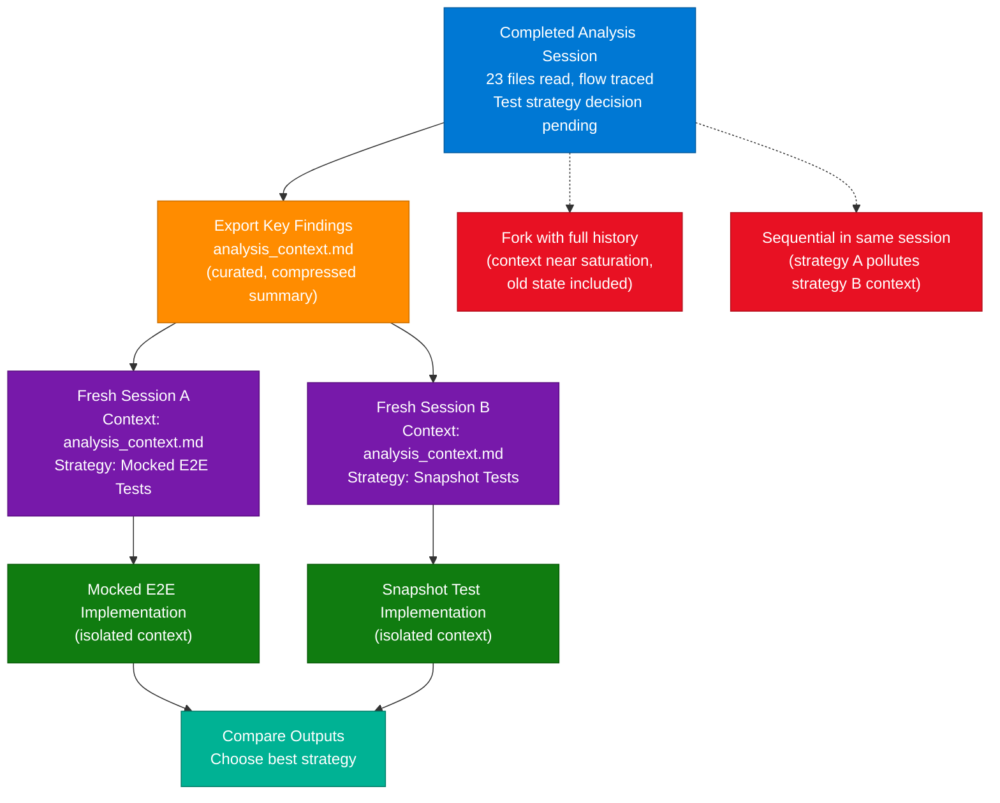

### How It Works

1. Agent completes analysis (reads files, traces flows, identifies architectural patterns).
2. Agent writes a structured summary to `analysis_context.md` — module roles, data flows, constraints, key dependencies.
3. Two fresh sessions are initialized, each reading `analysis_context.md` as their starting context.
4. Session A explores Strategy 1 (Mocked E2E) in complete isolation — no Session B state present.
5. Session B explores Strategy 2 (Snapshot Tests) in complete isolation — no Session A state present.
6. Both sessions produce implementation artifacts without cross-contamination.
7. Outputs are compared to select the best strategy.

### Key Components

| Component | Role | Anti-Pattern |
|---|---|---|
| Analysis export file | Curated summary for new sessions | Carrying full transcript (noisy, near saturation) |
| Fresh session | Clean context window — no prior chat noise | Fork-session (carries all prior history) |
| Isolated branch contexts | Each strategy developed without contamination | Sequential in same session |
| Structured summary | High-signal facts only | Dump of all conversation turns and tool outputs |
| Parallel exploration | Both strategies developed independently | One strategy at a time in the same session |

### Code Example

```python
import anthropic
import pathlib

client = anthropic.Anthropic()

def export_analysis(findings: list[str], path: str = "analysis_context.md") -> None:
    content = "# Analysis Context\n\n## Key Findings\n" + "\n".join(f"- {f}" for f in findings)
    pathlib.Path(path).write_text(content)

def explore_strategy(strategy_name: str, context_file: str, task: str) -> str:
    context = pathlib.Path(context_file).read_text()
    return client.messages.create(
        model="claude-sonnet-4-6",
        max_tokens=4096,
        system=f"You are implementing the {strategy_name} strategy. Use the analysis context as your sole reference.",
        messages=[{"role": "user", "content": f"Analysis context:\n{context}\n\nTask: {task}"}]
    ).content[0].text

# Export once, branch twice
export_analysis([
    "PaymentService depends on RefundCalculator and AuditLogger",
    "All flows go through PaymentGateway.process()",
    "Constraint: tests must not call real payment endpoints",
])

mock_impl = explore_strategy("Mocked E2E", "analysis_context.md", "Implement mocked E2E tests for the payment flow.")
snap_impl = explore_strategy("Snapshot Tests", "analysis_context.md", "Implement snapshot tests for the payment flow.")
```

### Interview Q&A

| Question | Answer |
|---|---|
| Why does carrying the full analysis transcript into a new session cause problems? | Full transcripts include raw tool outputs, intermediate reasoning, and back-and-forth chat noise. This fills the context window with low-signal content, degrading focus on the actual implementation task. |
| What is "context contamination" in multi-strategy exploration? | When both strategies are developed in the same session, implementation details from Strategy A (variable names, import choices, architecture patterns) appear in context during Strategy B work, causing unintended mixing. |
| What should the exported summary file include? | Key findings only: module roles, data flow paths, constraints, important dependencies. Not: conversation turns, tool call outputs, or intermediate reasoning steps. |
| Why is forking the session less ideal than exporting to a file? | A forked session carries the entire prior history including raw noise. If the analysis session was already near context saturation, both forks start already burdened with stale data. |
| How does the export pattern reduce cost for parallel exploration? | Each branch session starts with a small, dense summary rather than a large transcript. Smaller starting context = lower per-query token cost for all implementation calls in each branch. |

---

## 9. Orchestrator-Workers Pattern

### Overview

The **Orchestrator-Workers pattern** is the gold-standard architecture for tasks that exceed a single agent's cognitive capacity — either in context size or complexity. The **orchestrator** is a high-level coordinator that breaks a large task into specific, narrow sub-questions and delegates them to **worker subagents**, each operating in its own clean context window focused only on its assigned question. Workers return structured findings — not raw file contents — which the orchestrator synthesizes into a coherent overall understanding. For a 45-file payment module investigation, each worker handles a few files with full attention, while the orchestrator builds the architectural picture from worker summaries without ever loading raw code itself. This keeps the orchestrator's context lean and its reasoning accurate.

### Architecture Diagram

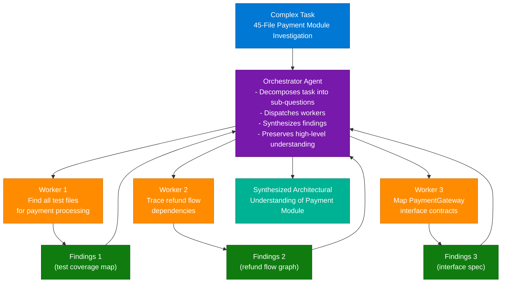

### How It Works

1. The orchestrator receives the complex task (investigate 45-file payment module).
2. Orchestrator decomposes it into specific, narrow sub-questions, each independently answerable.
3. Each sub-question dispatched to a worker subagent with a clean context window.
4. Workers independently investigate, reading only the files relevant to their specific question.
5. Workers return structured findings (summaries, not raw code) to the orchestrator.
6. Orchestrator synthesizes all worker findings into a coherent architectural understanding.
7. Orchestrator's context stays lean — it processes 3 structured summaries, not 45 files.

### Key Components

| Component | Role | Key Constraint |
|---|---|---|
| Orchestrator | Task decomposition and synthesis | Never reads raw files directly |
| Worker agents | Narrow, focused investigation | Each gets a clean, isolated context window |
| Sub-question design | Specific and independently answerable | Must not depend on another worker's output |
| Structured findings | Worker output format | Structured data, not raw file content |
| Parallel dispatch | Workers run simultaneously | Maximizes investigation speed |

### Code Example

```python
import anthropic
from concurrent.futures import ThreadPoolExecutor
import pathlib

client = anthropic.Anthropic()

def run_worker(question: str, file_paths: list[str]) -> str:
    file_contents = "\n\n".join(
        f"--- {f} ---\n{pathlib.Path(f).read_text()}"
        for f in file_paths if pathlib.Path(f).exists()
    )
    return client.messages.create(
        model="claude-haiku-4-5-20251001",
        max_tokens=1024,
        messages=[{"role": "user", "content": f"Answer this specific question:\n{question}\n\nFiles:\n{file_contents}"}]
    ).content[0].text

def orchestrate_investigation(module_path: str) -> str:
    sub_tasks = [
        ("Find all test files for payment processing and summarize coverage gaps",
         ["tests/test_payment.py", "tests/test_gateway.py"]),
        ("Trace refund flow dependencies — which modules does refund.py depend on?",
         ["payment/refund.py", "payment/calculator.py"]),
        ("Map PaymentGateway interface contracts — what inputs and outputs does it define?",
         ["payment/gateway.py", "payment/interfaces.py"]),
    ]

    with ThreadPoolExecutor(max_workers=3) as executor:
        futures = {q: executor.submit(run_worker, q, files) for q, files in sub_tasks}
        findings = {q: f.result() for q, f in futures.items()}

    synthesis_prompt = "Synthesize these findings into an architectural understanding:\n\n"
    for q, finding in findings.items():
        synthesis_prompt += f"Q: {q}\nA: {finding}\n\n"

    return client.messages.create(
        model="claude-sonnet-4-6",
        max_tokens=2048,
        messages=[{"role": "user", "content": synthesis_prompt}]
    ).content[0].text
```

### Interview Q&A

| Question | Answer |
|---|---|
| What is the key difference between orchestrator-workers and prompt chaining? | Orchestrator-workers is dynamic — the orchestrator decides at runtime which workers to spawn. Prompt chaining is static — the step sequence is fixed at design time regardless of input. |
| Why does the orchestrator avoid reading files directly? | Its context must stay lean to synthesize findings effectively. Loading 45 files saturates the context, causing the "lost in the middle" problem precisely when high-level synthesis is needed. |
| What makes a good sub-question for worker delegation? | It must be specific (single concern), independently answerable (no dependency on other workers), and produce structured findings rather than raw file excerpts. |
| Why are parallel workers more effective than a single agent using Grep for a 45-file module? | Grep reduces input size but the orchestrator still has to process a large context. Workers isolate investigation into independent clean contexts — each gets full attention on its narrow question. |
| What is the cost trade-off of the orchestrator-workers pattern? | More total LLM calls (N workers + orchestrator synthesis). But each call is cheaper (smaller context), and parallel dispatch reduces wall-clock time significantly for large investigations. |

---

## 10. MCP Resources vs MCP Tools

### Overview

The **Model Context Protocol** defines two distinct primitives: **Tools** (actions the server performs on behalf of the agent, with potential side effects) and **Resources** (read-only data catalogs that expose what the server knows). The critical difference is timing and purpose: tools are called when the agent needs to do something; resources are exposed at connection time so the agent understands what data is available before deciding which tools to call. When an agent must search across 3 servers (Jira, Confluence, Postgres) without knowing which one holds the relevant data, it makes 8-10 sequential exploratory tool calls. Exposing resource catalogs (issue summaries, document hierarchies, database schemas) eliminates this — the agent reads the catalogs upfront, sees which server holds the target data, and calls the right tool directly on the first try.

### Architecture Diagram

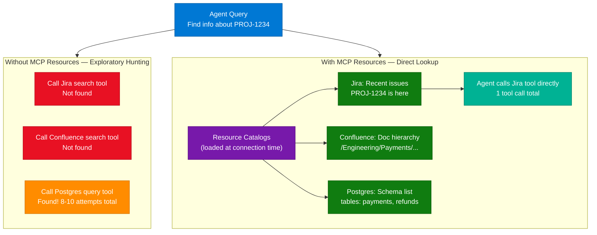

### How It Works

1. MCP servers configured with both Tools and Resources.
2. At connection time, the MCP client calls `resources/list` on each server and retrieves content catalog summaries.
3. Catalogs expose lightweight read-only metadata: recent Jira issue titles/keys, Confluence page hierarchy, database table names.
4. Agent receives a query and scans the resource catalogs first — a lightweight read, no tool call cost.
5. From the catalog, agent immediately identifies which server holds the relevant data.
6. Agent makes one precise tool call to the correct server.
7. Latency drops from minutes (sequential hunting across 3 servers) to seconds (one targeted call).

### Key Components

| Component | Role | MCP Endpoint |
|---|---|---|
| MCP Resource | Read-only content catalog | `resources/list`, `resources/read` |
| MCP Tool | Callable action with potential side effects | `tools/list`, `tools/call` |
| Content catalog | Lightweight summary of server's data | Resource payload — titles, keys, schemas |
| Resource URI | Address of a specific resource | e.g., `jira://recent-issues` |
| Tool discovery | List of callable actions | Tool definitions in `tools/list` response |

### Code Example

```python
from mcp.server import Server
from mcp.types import Resource, Tool, TextContent

server = Server("jira-mcp-server")

@server.list_resources()
async def list_resources():
    return [
        Resource(
            uri="jira://recent-issues",
            name="Recent Jira Issues",
            description="Issue keys and titles modified in last 7 days. Read this before calling any search tool.",
            mimeType="text/plain"
        )
    ]

@server.read_resource()
async def read_resource(uri: str):
    if uri == "jira://recent-issues":
        issues = await fetch_recent_issue_summaries()
        catalog = "\n".join(f"{i['key']}: {i['summary']}" for i in issues)
        return TextContent(type="text", text=catalog)

@server.list_tools()
async def list_tools():
    return [
        Tool(
            name="get_issue",
            description=(
                "Fetch full details of a specific Jira issue by key (e.g., PROJ-1234). "
                "First check the jira://recent-issues resource to identify the correct key, "
                "then call this tool for the full issue content."
            ),
            inputSchema={"type": "object", "properties": {"issue_key": {"type": "string"}}, "required": ["issue_key"]}
        )
    ]
```

### Interview Q&A

| Question | Answer |
|---|---|
| What is the fundamental difference between an MCP Tool and an MCP Resource? | Tools are callable actions (dynamic, may have side effects). Resources are read-only data catalogs (static, expose server content upfront). Resources inform which tool to call; tools do the actual work. |
| Why does exposing content catalogs as Resources reduce tool call count? | The agent sees what each server contains upfront, eliminating trial-and-error searches. Instead of probing 3 servers sequentially, it reads 3 catalogs and calls the right server directly. |
| Why is consolidating all servers into one a poor solution? | Consolidation is a major engineering effort and often impossible when servers are owned by different teams or back SaaS products. MCP is designed specifically to federate across independent servers without merging them. |
| What information should a content catalog resource expose? | Lightweight summaries only: issue titles and keys (not full content), document hierarchy paths (not page text), schema names and table list (not data). Full retrieval should remain as Tool calls. |
| When should you use keyword routing instead of MCP Resources? | Only when servers cannot be updated to expose resources — e.g., legacy systems with read-only API access. Keyword routing is a workaround, not a preferred pattern. |

---

## 11. Stale Context and Subagent Lifecycle Management

### Overview

When a codebase changes during a long agent investigation — functions renamed, files restructured — any stale references in the agent's active context become **failure landmines**: the agent will attempt to read or edit functions that no longer exist, producing tool failures and confusion. The correct recovery strategy is to **launch a fresh subagent** initialized with a curated summary of the prior session's high-level findings (module roles, data flows, architectural patterns — which remain valid) while ensuring specific code references (function names, line numbers) are freshly discovered from the actual current codebase. This balances knowledge preservation (architectural understanding) with reference accuracy (specific, volatile details re-discovered from files).

### Architecture Diagram

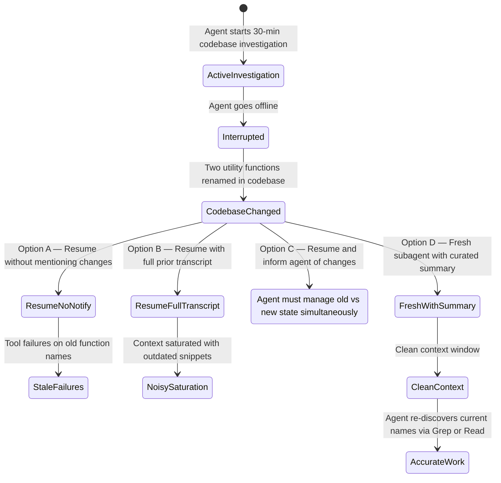

### How It Works

1. Agent completes 30-minute investigation covering 47 files — builds architectural understanding.
2. Agent goes offline; during the pause, two utility functions are renamed in the codebase.
3. Recovery decision: evaluate the four options.
4. **Wrong (Option A):** Resume old session — agent uses old function names, first edit call fails immediately.
5. **Wrong (Option B):** Include full prior transcript — saturated context with stale code snippets.
6. **Wrong (Option C):** Resume and inform of changes — agent must hold "old vs new" mental map, increasing error risk.
7. **Right (Option D):** Export curated high-level summary to `prior_session_summary.md`, launch fresh subagent initialized from it.
8. Fresh agent has architectural context but no stale specific references — it re-discovers current function names via Grep.

### Key Components

| Component | Role | Lifecycle |
|---|---|---|
| Curated summary | High-level findings from prior session | Stable — not invalidated by renames |
| Fresh subagent | Clean context window, no stale references | Created for the continuation task |
| Re-discovery via Grep | Find current function names from actual files | Always use after codebase changes |
| Prior full transcript | Complete conversation history | Do NOT carry forward — too noisy, too stale |
| Stale reference | Old function name or line number | The primary failure mode to avoid |

### Code Example

```python
import anthropic
import pathlib

client = anthropic.Anthropic()

def create_fresh_continuation(prior_findings: dict, current_task: str) -> str:
    summary = "# Prior Session Summary\n\n## Architecture (still valid)\n"
    for module, role in prior_findings.get("module_roles", {}).items():
        summary += f"- {module}: {role}\n"

    summary += (
        "\n## Warning on Specific References\n"
        "Function names and line numbers from the prior session may be stale — "
        "the codebase changed during the investigation break. "
        "Always verify with Grep or Read before editing any specific code.\n"
    )

    pathlib.Path("prior_session_summary.md").write_text(summary)

    return client.messages.create(
        model="claude-sonnet-4-6",
        max_tokens=4096,
        system=(
            "You are continuing a codebase investigation. "
            "Trust the architectural context, but always re-verify specific function names "
            "and line numbers from the actual files using Grep or Read before editing."
        ),
        messages=[{
            "role": "user",
            "content": f"Prior session context:\n{summary}\n\nCurrent task:\n{current_task}"
        }]
    ).content[0].text
```

### Interview Q&A

| Question | Answer |
|---|---|
| Why is resuming without mentioning changes the most dangerous option? | The agent will immediately attempt to use stale function names in tool calls, producing "String not found" or "Function not defined" errors before any productive work happens. |
| What portion of prior session knowledge survives a codebase change? | High-level architectural knowledge: module roles, data flow patterns, system boundaries, dependency relationships. Stable. Volatile: function names, line numbers, specific variable names. |
| How should a fresh subagent verify function names after a codebase change? | Use Grep to search for similar names, or Read the files where the functions were expected — discover current state from actual files, not from the prior summary. |
| Why is including the full prior transcript (Option B) problematic? | A 30-minute investigation transcript is already large. Including it fills the new session with old code snippets containing stale function names — exactly the problem you are trying to avoid. |
| What is the general principle for subagent lifecycle after code changes? | "Keep the why, re-discover the what." Export architectural understanding (volatile-free, stable), discard specific code references (volatile), start fresh. |

---

## 12. Targeted Grep Search for Code Discovery

### Overview

When a production error contains a distinctive, application-specific string — like `SYNC_CONFLICT` or `entity version mismatch` — that string is the most direct bridge from the log to the source code. Grepping for the exact error string traverses 12 microservices in seconds, returning only files containing that specific text. Alternative approaches — reading READMEs then systematically scanning, searching for error-module imports, or Globbing for directory names — all add indirection layers that may fail if naming conventions aren't followed or if the error is embedded in business logic rather than a dedicated error file. Targeted Grep minimizes tool calls, minimizes context loading, and goes directly from symptom to source.

### Architecture Diagram

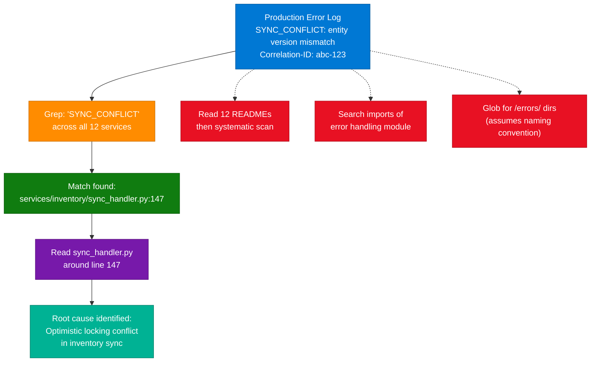

### How It Works

1. Extract the most distinctive string from the production error: `SYNC_CONFLICT`.
2. Run `grep -r "SYNC_CONFLICT" services/` across all 12 microservice directories.
3. Grep returns exact file and line number in seconds: `services/inventory/sync_handler.py:147`.
4. Use `Read` on `sync_handler.py` around line 147 to understand surrounding business logic.
5. Identify the root cause — optimistic locking conflict, version check failure, etc.
6. With root cause pinpointed, propose a targeted fix or further investigation path.

### Key Components

| Component | Role | Key Requirement |
|---|---|---|
| Distinctive error string | Search key bridging log to source | Must be app-specific enough to avoid false positives |
| Grep with `-r -n` flags | Recursive search with line numbers | Searches file content across all services |
| Match result | File path + line number | Precise entry point for investigation |
| Read (targeted) | Load specific file for context | Only the matching file — not all 12 services |
| False positive check | Confirm causality vs constant imports | Read surrounding code to verify the error is generated here |

### Code Example

```python
import subprocess
import pathlib

def locate_error_source(error_string: str, search_root: str = "services/") -> list[dict]:
    result = subprocess.run(
        ["grep", "-r", "-n", "--include=*.py", error_string, search_root],
        capture_output=True, text=True
    )
    matches = []
    for line in result.stdout.strip().split('\n'):
        if ':' in line:
            parts = line.split(':', 2)
            if len(parts) >= 3:
                matches.append({"file": parts[0], "line": int(parts[1]), "content": parts[2].strip()})
    return matches

def investigate_error(error_string: str, context_lines: int = 20) -> str:
    matches = locate_error_source(error_string)
    if not matches:
        return f"No occurrences of '{error_string}' found."

    report = []
    for match in matches[:3]:
        lines = pathlib.Path(match['file']).read_text().split('\n')
        start = max(0, match['line'] - context_lines)
        end = min(len(lines), match['line'] + context_lines)
        context = '\n'.join(lines[start:end])
        report.append(f"--- {match['file']}:{match['line']} ---\n{context}")
    return '\n\n'.join(report)

# Usage — direct from log to source in one call
print(investigate_error("SYNC_CONFLICT"))
```

### Interview Q&A

| Question | Answer |
|---|---|
| Why is a distinctive error string the best entry point for code discovery? | It is unique to this error path, appears only where the error is generated, and bridges directly from production symptom to source code without indirection. Grep finds it in O(file count) time. |
| When might Grep return false positives for an error string? | When the string is a constant defined in a central module and imported everywhere. The import file matches but is not the generator. Always read surrounding code to confirm causality. |
| Why does searching for error-handling module imports produce too many matches? | Many services import a general error handling module, but not all generate this specific error. The result set is too large to investigate efficiently. |
| What makes `SYNC_CONFLICT` a better search key than `version mismatch`? | `SYNC_CONFLICT` is application-specific. `version mismatch` is generic — it may appear in library code, documentation, comments, or unrelated error paths across 12 services. |
| What is the systematic "brute force" alternative and why is it too slow? | Reading each service's README then scanning it file by file. This requires reading potentially hundreds of files before finding the match — wasteful when a 1-second Grep gives the exact file and line number. |

---

## 13. MCP Server Tool Discovery and Aggregation

### Overview

A fundamental property of the **Model Context Protocol** is that tools from all configured MCP servers are discovered and aggregated into a single unified toolbox **at session connection time** — before the first agent turn. When a client connects to a Git server, a Jira server, and a Docs server, it queries each for their tool definitions and presents the combined catalog to the agent as a single list. The agent can call `git_commit` and then `create_issue` and then `search_docs` in sequential reasoning steps without any manual context switching or server specification. The client handles routing transparently — it knows which physical server registered each tool and routes calls accordingly. The agent only sees "available tools."

### Architecture Diagram

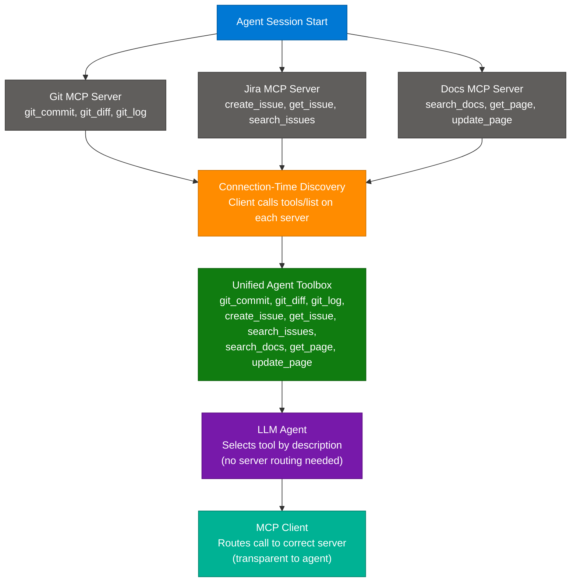

### How It Works

1. Agent session starts; the MCP client connects to all configured servers.
2. For each server, the client sends a `tools/list` request and receives tool definitions.
3. All tool definitions are aggregated into a single catalog in the client's session state.
4. The agent receives the complete unified tool list before processing any user request.
5. The agent selects tools by name and description — unaware of server boundaries.
6. When the agent calls a tool, the client routes it to the server that registered that tool.
7. The server executes and returns results; the client passes them back to the agent.

### Key Components

| Component | Role | Protocol Endpoint |
|---|---|---|
| MCP Client | Connects to servers, aggregates tools, routes calls | `tools/list` at start, `tools/call` at runtime |
| MCP Server | Registers tool definitions, executes tool calls | Implements `tools/list` and `tools/call` |
| Tool Definition | Name, description, input schema | Returned by `tools/list` at connection |
| Tool Aggregation | Combine all server tools into unified catalog | Client-side, session start |
| Client Routing | Map tool calls to the correct server | Transparent — uses registration map |

### Code Example

```python
# MCP Client configuration — all servers aggregated automatically at session start
MCP_CONFIG = {
    "mcpServers": {
        "git": {
            "command": "npx",
            "args": ["-y", "@modelcontextprotocol/server-git"],
        },
        "jira": {
            "command": "python",
            "args": ["-m", "jira_mcp_server"],
            "env": {"JIRA_URL": "https://org.atlassian.net", "JIRA_TOKEN": "..."}
        },
        "docs": {
            "command": "python",
            "args": ["-m", "confluence_mcp_server"],
            "env": {"CONFLUENCE_URL": "https://org.atlassian.net/wiki"}
        }
    }
}

# At session start, client discovers and aggregates (automatically):
# From git server:    git_commit, git_diff, git_log, git_status
# From jira server:   create_issue, get_issue, search_issues, add_comment
# From docs server:   search_docs, get_page, update_page, list_spaces
#
# Agent sees 12 tools as a flat list — client routes each call to the correct server
```

### Interview Q&A

| Question | Answer |
|---|---|
| When does MCP tool discovery happen? | At connection time — the client queries all configured servers for tool definitions before the first agent turn. The agent starts with the complete aggregated catalog already available. |
| Does the agent need to specify which server a tool belongs to? | No. The agent calls tools by name. The MCP client maintains a registration map and routes transparently. The agent is unaware of server boundaries. |
| Why don't MCP tool names require server-prefix routing? | The client's internal registration map handles routing based on which server registered each tool. Name prefixes (e.g., `git_commit`) are a developer convention for clarity, not a protocol requirement. |
| What enables seamless cross-server workflows? | Tool aggregation at connection time. Because all tools from all servers are in one catalog simultaneously, the agent can chain calls across Git, Jira, and Docs in a single reasoning sequence. |
| Is eager tool discovery expensive? | No — tool definitions are lightweight JSON schemas. There is no performance reason to lazy-load them. Having the full catalog enables better LLM tool selection decisions. |
| What happens if two MCP servers register a tool with the same name? | The client must resolve the conflict via namespacing or error. Best practice: use unique tool names per server (server-scoped prefixes are common) to avoid ambiguity. |

---

## 14. Interview Q&A Cheatsheet

**Q: Why do LLMs prefer general-purpose tools over specialized MCP tools with vague descriptions?**
> LLMs select tools based entirely on their text descriptions. A vague description provides no semantic reason to prefer the specialized tool, so the agent defaults to the familiar general tool whose outcome it can predict. The solution is to enrich MCP tool descriptions with precise capability language, unique outputs, and explicit "prefer this when" guidance — making tool definitions self-documenting.

**Q: What is the Read-Write pattern and when should it be used?**
> The Read-Write pattern loads an entire file into agent working memory, performs modifications logically, then writes the complete updated file back in one call. Use it when the target file contains repetitive patterns that would confuse string-matching Edit tools, or when insertion point is defined by logical function position rather than a uniquely identifiable literal string.

**Q: What is the "lost in the middle" phenomenon and how does the scratchpad pattern address it?**
> LLMs retrieve information less reliably when it appears in the middle of a long context window — early and recent content is recalled better. The scratchpad pattern externalizes key discoveries to a persistent file, keeping the active context lean. The agent writes findings as it goes and reads the scratchpad file for reference, replacing uncertain middle-context recall with reliable structured file reads.

**Q: When should you use prompt chaining vs. orchestrator-workers?**
> Use prompt chaining when the workflow is fixed and all steps are known in advance (e.g., PR review always runs style → security → docs → synthesis). Use orchestrator-workers when the task is open-ended, too large for a single context, or when the appropriate sub-tasks cannot be determined until the orchestrator analyzes the specific input.

**Q: What are MCP Resources and how do they differ from MCP Tools?**
> MCP Tools are callable actions (dynamic, potential side effects). MCP Resources are read-only data catalogs that expose server content upfront — issue summaries, doc hierarchies, database schemas. Resources eliminate exploratory tool calls by giving the agent visibility into what each server contains before it decides which tool to call, replacing 8-10 sequential searches with one direct targeted call.

**Q: What is the correct recovery strategy when a codebase changes during an interrupted agent session?**
> Launch a fresh subagent initialized with a curated summary of the prior session's high-level architectural findings. Do not carry over specific code references (function names, line numbers) — these may be stale. The fresh agent re-discovers specific details from the actual current files via Grep or Read. Principle: "Keep the why, re-discover the what."

**Q: Why is exporting findings to a file the best approach for A/B testing two implementation strategies?**
> A curated export preserves analytical work while eliminating context noise (raw tool outputs, back-and-forth chat). Each strategy session starts with a clean context window initialized from the dense summary — preventing cross-contamination, reducing per-query token cost, and allowing both strategies to be developed in true isolation.

**Q: What is the most efficient way to locate the source of a specific production error across 12 microservices?**
> Grep for a distinctive, application-specific string from the error message across all service directories. This bridges from production symptom to source code in one tool call, without reading READMEs, scanning service structures, or assuming naming conventions. Then Read the matching file for context around the line number.

**Q: How does MCP aggregate tools from multiple servers?**
> At session connection time, the MCP client queries all configured servers via `tools/list`, collects their tool definitions, and presents them as a single unified toolbox to the agent. Routing back to the correct server on each tool call is handled transparently by the client — the agent selects tools by name and description without knowing server boundaries.

**Q: What makes multi-phase workflows valuable for high-risk tasks?**
> The proposal phase produces a reviewable strategy document before any code is written — reviewers can spot logical errors without navigating code complexity. The implement phase is locked to the approved proposal, preventing scope creep. The combined effect: architecture errors caught at design time rather than after implementation.

**Q: What is the primary advantage of the Orchestrator-Workers pattern for large codebase investigations?**
> Workers operate in isolated, clean context windows, each focused on a narrow sub-question. The orchestrator processes only structured worker summaries — it never loads raw files. This prevents context saturation while allowing parallel investigation, making it far more effective than a single agent trying to hold 45 files in a single context window.

**Q: Why is the Glob + Grep strategy superior to alphabetical or equal-effort-per-directory traversal?**
> Glob + Grep builds a coupling map — ranking modules by how many other files depend on them — before reading any file content. High-coupling modules are load-bearing targets where test coverage yields maximum defect detection. Alphabetical and directory-based approaches ignore this architectural signal entirely, leading to wasted effort on low-importance files.

---

*Extracted from Gemini shared session · July 12, 2026 · GeminiShareToMD Agent v1.0*

---

```
═══════════════════════════════════════════════════════════
Token Usage Report
═══════════════════════════════════════════════════════════
Estimated without optimization:  ~8,400 tokens (raw page text)
Actual (with optimization):      ~6,200 tokens (enriched input)
Savings:                         ~2,200 tokens (26%)
Techniques applied:              UI chrome stripped (Gemini header, Privacy Policy,
                                 ToS footers, "Continue this chat", "Convert to PDF"),
                                 repeated "Ans" user turns collapsed,
                                 "Why other options are less effective" structure
                                 compacted into Q&A table rows
═══════════════════════════════════════════════════════════
* Estimates: prose chars ÷ 4, code chars ÷ 3. Actual API usage varies by model.
```
