# Cloud & AI Engineering — Multi-Topic Learning Guide

> **Source:** [share.gemini.google/nAUZs3eD0P36](https://share.gemini.google/nAUZs3eD0P36) → redirects to [gemini.google.com/share/e1124e078887](https://gemini.google.com/share/e1124e078887)
> **Model:** Gemini 3.1 Flash-Lite
> **Session Date:** July 4, 2026
> **Saved:** July 9, 2026

---

## Table of Contents

1. [Session Overview](#1-session-overview)
2. [20 Essential Cloud Concepts](#2-20-essential-cloud-concepts)
3. [Agent Observability](#3-agent-observability)
4. [AI-Driven Video Analytics & Hook Optimization](#4-ai-driven-video-analytics--hook-optimization)
5. [Latency, Throughput, and Bandwidth](#5-latency-throughput-and-bandwidth)
6. [Six Types of AI Agent Memory](#6-six-types-of-ai-agent-memory)
7. [Loop Engineering for AI Agents](#7-loop-engineering-for-ai-agents)
8. [Re-Ranking in RAG Systems](#8-re-ranking-in-rag-systems)
9. [The Skills Ecosystem](#9-the-skills-ecosystem)
10. [The "One-Big-Feature" Method](#10-the-one-big-feature-method)
11. [Foundation Models](#11-foundation-models)
12. [Interview Q&A Cheatsheet](#12-interview-qa-cheatsheet)

---

## 1. Session Overview

This multi-topic Gemini session extracts and enriches engineering learning content from 10+ social media videos and reels covering cloud computing fundamentals, AI agent patterns, RAG optimization, and developer productivity workflows. The primary source is a video titled **"20 Cloud Concepts EVERY Engineer Should Know!"** by vishakha.sadhwani, with additional turns covering Agentic AI patterns (observability, memory, loop engineering, re-ranking), AI video analytics, the Skills Ecosystem, and Foundation Models. Two non-engineering turns (remote job resources, asset protection structure) are captured as brief notes only.

### Session Map

| Turn | User Prompt Summary | Gemini Response | Status |
|---|---|---|---|
| 1 | Generate transcript of 20 cloud concepts video | Learning Guide: 20 Essential Cloud Concepts | ✅ Extracted |
| 2 | Agent Observability video | Learning Module: Agent Observability | ✅ Extracted |
| 3 | AI-Driven Video Analytics video | Learning Module: AI Video Analytics & Hook Optimization | ✅ Extracted |
| 4 | Resources for high-paying remote jobs video | Learning Module: Remote Job Resources | ✅ Noted (non-engineering) |
| 5 | Latency, Throughput, Bandwidth video | Learning Module: Latency, Throughput, Bandwidth | ✅ Extracted |
| 6 | 6 Types of AI Agent Memory video | Learning Module: AI Agent Memory | ✅ Extracted |
| 7 | Loop Engineering for AI Agents video | Learning Module: Loop Engineering | ✅ Extracted |
| 8 | Re-Ranking in RAG Systems video | Learning Module: RAG Re-Ranking | ✅ Extracted |
| 9 | Skills Ecosystem video | Learning Module: Skills Ecosystem | ✅ Extracted |
| 10 | One-Big-Feature Method video | Learning Module: One-Big-Feature | ✅ Extracted |
| 11 | Asset protection structure video | Asset Protection Structure | ✅ Noted (non-technical) |
| 12 | Foundation Models video | Learning Module: Foundation Models | ✅ Extracted |

> **Note (Turns 4, 11):** Remote job resources and asset protection structure are social/financial content — not engineering architecture. Included as brief context, not full enrichment sections.

---

## 2. 20 Essential Cloud Concepts

### Overview

Cloud computing rests on a set of fundamental architectural distinctions that engineers must articulate precisely in interviews and system design discussions. The "20 Cloud Concepts" video presents these as clean VS pairs — a powerful mental model for understanding what each technology layer abstracts away. The most common interview failure mode is conflating adjacent technologies (e.g., saying containers "replace" VMs when they operate at different abstraction levels). Understanding each pair's axis of difference — what it virtualizes, manages, or constrains — enables precise, confident answers.

### Architecture Diagram

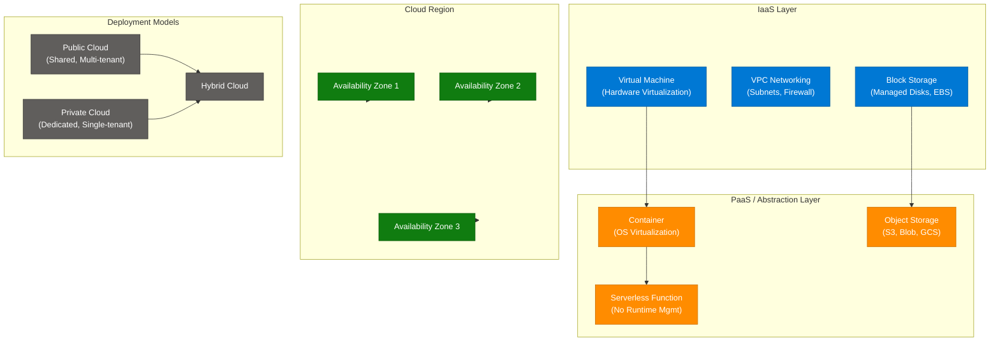

### Core Concept Comparison Table

| Concept Pair | Left | Right | Key Decision Factor |
|---|---|---|---|
| **VM vs Container** | Virtualizes hardware — full OS per VM, strong isolation | Virtualizes OS — shared kernel, faster startup, higher density | Need full OS isolation → VM; portability + density → Container |
| **IaaS vs PaaS** | You manage OS, runtime, middleware | Provider manages OS and runtime | Control → IaaS; deployment speed → PaaS |
| **Region vs AZ** | Geographic cluster of data centers | Isolated fault domain within a Region | AZs give HA within Region; Regions give DR across geography |
| **Container vs Serverless** | You manage runtime, scaling configuration | Provider manages all — code only | Long-running persistent workloads → Container; short event-driven tasks → Serverless |
| **Object vs Block Storage** | Files stored as immutable objects with metadata | Raw blocks, byte-level addressable | Static assets / backups → Object; databases / OS disks → Block |
| **Public vs Private Cloud** | Multi-tenant, shared infra, provider-managed | Dedicated hardware, single tenant, self-managed | Cost + scale → Public; compliance / data sovereignty → Private |
| **Horizontal vs Vertical Scaling** | Add more machines (scale out) | Upgrade existing machine (scale up) | Stateless services → Horizontal; stateful single-node DBs → Vertical |
| **Sync vs Async** | Caller waits for response | Caller continues; response arrives via callback/event | Latency-sensitive reads → Sync; bulk processing / decoupling → Async |
| **SQL vs NoSQL** | Schema-enforced relational tables, ACID | Schema-flexible documents / KV / graph / column | Transactions + joins → SQL; high-throughput flexible schema → NoSQL |
| **CDN vs Origin Server** | Edge-cached replicas near users | Authoritative content source | Static content delivery → CDN; dynamic / personalized → Origin |

### Cloud Services Mapping (AWS / Azure / GCP)

| Concept | AWS | Azure | GCP |
|---|---|---|---|
| Object Storage | S3 | Blob Storage | Cloud Storage |
| Block Storage | EBS | Managed Disks | Persistent Disk |
| Serverless | Lambda | Azure Functions | Cloud Functions |
| Container Orchestration | EKS | AKS | GKE |
| PaaS | Elastic Beanstalk | App Service | App Engine |
| CDN | CloudFront | Azure CDN | Cloud CDN |

### Code Example

```python
import boto3, json

s3 = boto3.client('s3')

# Object Storage — store as immutable object
s3.put_object(Bucket='my-bucket', Key='report.pdf', Body=open('report.pdf', 'rb'))

# Serverless — stateless, event-driven, no server management
def lambda_handler(event, context):
    return {'statusCode': 200, 'body': json.dumps('Processed')}

# Container — long-running service (Dockerfile entry point)
# CMD ["uvicorn", "main:app", "--host", "0.0.0.0", "--port", "8000"]
```

### Interview Q&A

| Question | Answer |
|---|---|
| What is the difference between a VM and a Container? | A VM virtualizes hardware and runs a full OS per instance (strong isolation, slow startup, GB-scale). A container virtualizes the OS — sharing the host kernel — giving ms startup, MB-scale images, and high density, but weaker isolation. |
| When would you choose Serverless over Containers? | Serverless for event-driven, short-lived, bursty workloads (pay-per-invocation, no idle cost). Containers when you need persistent connections, custom runtimes, long-running background jobs, or latency below 100ms cold-start. |
| What is an Availability Zone and why does it matter? | An AZ is an isolated data center within a Region with independent power, cooling, and networking. Deploying across 3+ AZs provides HA — a failure in one AZ does not take down the service. |
| What is the difference between IaaS and PaaS? | IaaS gives raw compute, storage, and networking — you own the OS upward. PaaS provides a managed runtime — you deploy code only. PaaS trades control for deployment speed; IaaS trades speed for control. |
| When is Object Storage preferable to Block Storage? | Object storage excels for write-once-read-many unstructured data at massive scale (images, videos, backups, logs). Block storage is required where byte-level random access is needed — OS volumes, relational databases. |

---

## 3. Agent Observability

### Overview

Agent Observability is the practice of instrumenting AI agents to expose their internal decision chains, LLM calls, tool invocations, and intermediate states in a traceable, queryable form. Unlike traditional microservice observability (metrics, logs, traces), agent observability must handle non-deterministic reasoning steps: the agent may choose different tool sequences across identical inputs, making trace capture and replay essential for debugging. Without observability, production AI agents fail silently, hallucinate without detection, and are impossible to optimize for cost or quality.

### Architecture Diagram

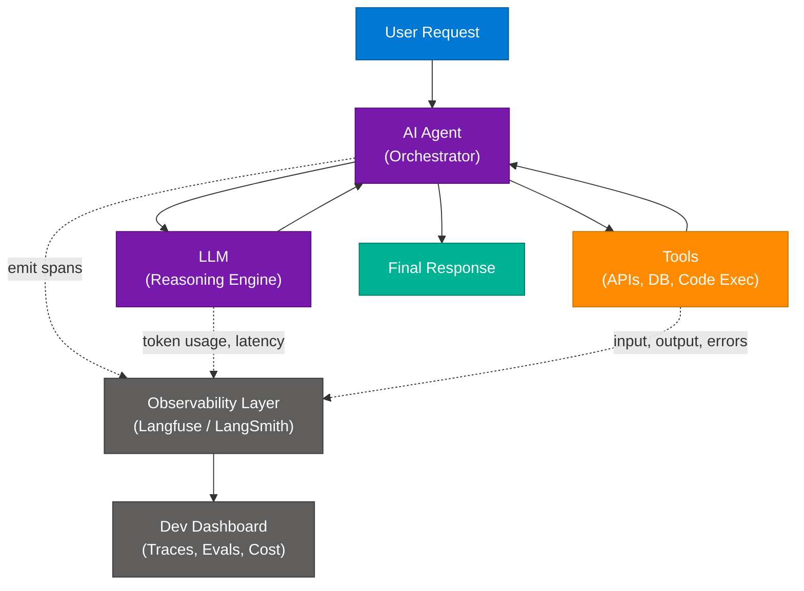

### Key Observability Tools

| Tool | Type | Strengths | Best For |
|---|---|---|---|
| **Langfuse** | Open-source | Self-hostable, LLM traces, evals, cost tracking | Production apps needing data sovereignty |
| **LangSmith** | Commercial | Deep LangChain integration, dataset management | LangChain-based pipelines |
| **BrainTrust** | Commercial | Model evals, A/B testing LLM versions | Prompt change evaluation at scale |
| **Noveum** | Alternative | Lightweight LLM call monitoring | Simple single-model setups |

### What to Observe

| Signal | What It Captures | Why It Matters |
|---|---|---|
| **Trace** | Full decision chain input→output | Replay failures, audit reasoning |
| **Span** | Individual steps (LLM call, tool call) | Pinpoint latency bottlenecks |
| **Token Usage** | Input/output tokens per call | Cost management and optimization |
| **Tool Invocations** | Which tool, what args, what result | Debug incorrect tool selection |
| **Evaluation Score** | LLM-as-judge correctness | Track quality regression over time |

### Code Example

```python
from langfuse.decorators import observe, langfuse_context
import anthropic

client = anthropic.Anthropic()

@observe()  # auto-traces every LLM call and tool invocation inside
def run_agent(user_input: str) -> str:
    response = client.messages.create(
        model="claude-sonnet-4-6",
        max_tokens=1024,
        messages=[{"role": "user", "content": user_input}]
    )
    langfuse_context.update_current_observation(
        input=user_input,
        output=response.content[0].text
    )
    return response.content[0].text

# All traces visible in Langfuse dashboard with token counts, latency, inputs/outputs
```

### Interview Q&A

| Question | Answer |
|---|---|
| Why is observability harder for AI agents than for microservices? | AI agents are non-deterministic — the same input can trigger different reasoning paths. Traditional metrics (latency, error rate) don't capture *why* the agent chose a specific tool or hallucinated. Trace-level visibility into each LLM call and tool invocation is required. |
| What is a trace in agent observability? | A trace is the full end-to-end record of an agent run — from user input through every LLM call, tool invocation, and intermediate result to the final response. It enables replay and root-cause analysis. |
| How do you evaluate agent output quality at scale? | LLM-as-judge: pass the agent's output and expected output to an evaluator LLM that scores correctness, groundedness, and relevance. Tools like BrainTrust automate this on sampled production traces. |
| What is Langfuse and why would you self-host it? | Langfuse is open-source LLM observability capturing traces, token usage, evaluations, and cost. Self-hosting is preferred when data governance rules prohibit sending PII or proprietary prompts to third-party SaaS. |
| What metrics should you monitor on a production AI agent? | Token cost per request, p95 LLM call latency, tool invocation success rate, hallucination rate (via evals), error type distribution (tool failures vs. reasoning failures vs. context window overflow). |

---

## 4. AI-Driven Video Analytics & Hook Optimization

### Overview

AI-Driven Video Analytics uses LLMs to automate objective content performance analysis — replacing creator intuition with data-driven insight. Traditional analytics platforms measure *outcomes* (views, watch time) but not *causes* (what specific moment triggered scroll-away). This system processes raw video at the frame and transcript level, feeding structured artifacts to Claude, which identifies retention drivers and repulsion signals. The hook (first 10 seconds) receives focused analysis because it is the critical viewer-retention window on short-form platforms.

### Architecture Diagram

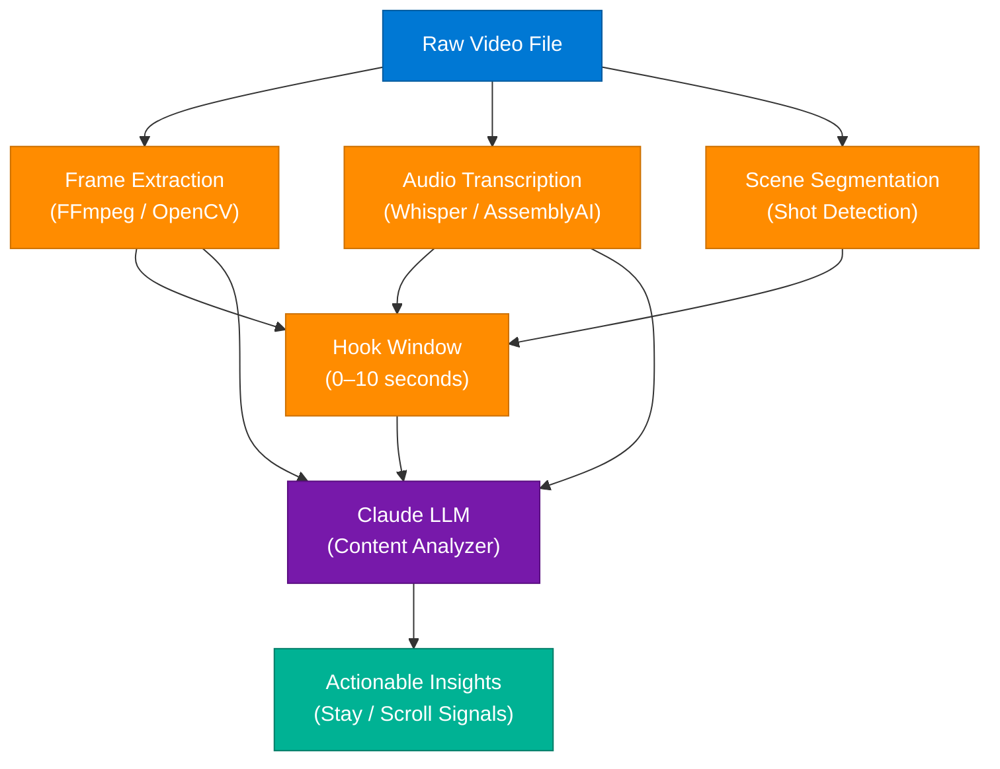

### Pipeline Components

| Stage | Technology | Output |
|---|---|---|
| Frame Extraction | FFmpeg / OpenCV | JPEG frames at N fps |
| Transcription | Whisper / AssemblyAI | Word-level timestamped transcript |
| Scene Segmentation | PySceneDetect / ffprobe | Scene cut timestamps |
| Hook Analysis | 0–10s window filter | Frame + text subset for hook |
| LLM Analysis | Claude `claude-sonnet-4-6` | JSON: stay signals, scroll risks, recommendations |

### Code Example

```python
import subprocess, anthropic, json

def extract_frames(video_path: str, fps: int = 1) -> list[str]:
    subprocess.run([
        "ffmpeg", "-i", video_path, "-vf", f"fps={fps}",
        "frames/frame_%04d.jpg", "-q:v", "2"
    ])
    return sorted(__import__('glob').glob("frames/*.jpg"))

def analyze_hook(transcript_segment: str, frames: list[str]) -> dict:
    client = anthropic.Anthropic()
    prompt = f"""Analyze this video hook (first 10 seconds).
Transcript: {transcript_segment}
Frame count: {len(frames)}

Return JSON with: hook_score (0-10), stay_signals (list), scroll_risks (list), recommendations (list)"""
    
    response = client.messages.create(
        model="claude-sonnet-4-6",
        max_tokens=512,
        messages=[{"role": "user", "content": prompt}]
    )
    return json.loads(response.content[0].text)
```

### Interview Q&A

| Question | Answer |
|---|---|
| Why is the hook (first 10 seconds) so critical? | Platforms surface content based on early retention signals. A viewer exiting in the first 5 seconds signals low quality to the algorithm, suppressing distribution. Optimizing the hook directly impacts reach. |
| How do you make LLM video analysis deterministic? | Process discrete structured artifacts (frames, timestamped transcript) rather than feeding raw video to the LLM. Structured inputs produce reproducible, auditable, comparable results across runs. |
| What is scene segmentation used for? | Detecting cut transitions identifies where a viewer's attention is re-engaged or dropped. High cut density in the hook correlates with higher early retention on short-form platforms. |
| How would you scale this to thousands of videos? | Decouple stages into async workers (extraction, transcription, scene detection in parallel queues). The LLM analysis step is stateless and horizontally scalable with a message queue (SQS, Kafka). |
| What LLM prompt strategy works best for hook analysis? | Structured output prompts returning JSON: `hook_score`, `stay_signals[]`, `scroll_risks[]`, `recommendations[]`. System prompt should define "hook quality" criteria specific to the target platform (TikTok vs. YouTube vs. LinkedIn have different norms). |

---

## 5. Latency, Throughput, and Bandwidth

### Overview

Latency, throughput, and bandwidth are three distinct system performance dimensions that are frequently conflated. They are independent: high bandwidth with high latency is possible (satellite: 1 Gbps, 600ms RTT), as is low latency with low throughput (fast server overloaded by concurrent requests). In system design, each is tuned independently — caching reduces latency, horizontal scaling increases throughput, and network upgrades increase bandwidth. Little's Law ties them together: queue depth equals arrival rate multiplied by average service time.

### Architecture Diagram

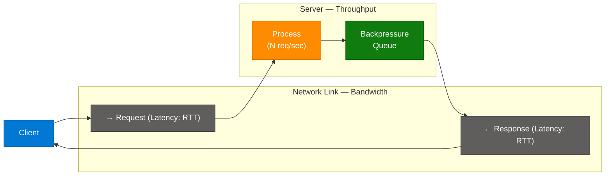

### Definitions & Analogies

| Concept | Technical Definition | Pipe Analogy | Unit |
|---|---|---|---|
| **Latency** | Time for a single request round trip (RTT) | Speed of water through the pipe | ms, µs |
| **Throughput** | Requests or data units successfully processed per unit time | Volume of water per second | req/s, MB/s |
| **Bandwidth** | Maximum data transfer capacity of the network link | Diameter of the pipe | Mbps, Gbps |

### Interaction Rules

- **High bandwidth ≠ low latency.** Satellite: 1 Gbps bandwidth, 600ms latency.
- **Low latency ≠ high throughput.** A fast server handling only 1 concurrent request has low throughput.
- **Little's Law:** `L = λW` — concurrent requests = arrival rate × average latency. If latency doubles, queue depth doubles at the same arrival rate, causing throughput collapse.

### Code Example

```python
import asyncio, time, httpx

async def measure_latency(url: str) -> float:
    start = time.monotonic()
    async with httpx.AsyncClient() as client:
        await client.get(url)
    return (time.monotonic() - start) * 1000  # ms (RTT per request)

async def measure_throughput(url: str, n: int = 100) -> float:
    start = time.monotonic()
    async with httpx.AsyncClient() as client:
        await asyncio.gather(*[client.get(url) for _ in range(n)])
    return n / (time.monotonic() - start)  # req/sec

# latency = per-request RTT; throughput = total completed / total elapsed
```

### Interview Q&A

| Question | Answer |
|---|---|
| What is the difference between latency and throughput? | Latency is the time for one request to complete (RTT). Throughput is how many requests complete per unit time. A system can have low latency (fast requests) and low throughput (few concurrent requests handled) simultaneously. |
| How do you reduce latency in a distributed system? | Place compute near users (CDN, edge), cache hot data (Redis), use connection pooling to avoid TCP handshake overhead, prefer UDP for real-time workloads, and minimize serialization overhead. |
| How do you increase throughput? | Horizontal scaling (more replicas), async processing (queues), connection pooling, request batching, and reducing per-request work. Throughput is limited by the slowest component — profile first. |
| What is bandwidth and how does it differ from throughput? | Bandwidth is the theoretical maximum data the network can carry. Throughput is the actual data successfully transferred. Throughput ≤ Bandwidth; the gap is caused by congestion, packet loss, retransmissions, and protocol overhead. |
| How does Little's Law apply to system design? | `L = λW`: if latency doubles with the same arrival rate, the in-flight request count doubles. This explains why latency spikes cause cascading queue buildup and throughput collapse — the system saturates even though individual requests are "only a bit slower." |

---

## 6. Six Types of AI Agent Memory

### Overview

AI agents built on LLMs are stateless by default — every API call starts fresh with zero knowledge of prior interactions. Memory is explicitly engineered into the system to give agents continuity, context, and learned behavior. The six memory types form a taxonomy from ephemeral (lost after each session) to persistent (survives across sessions and agent restarts). Production agents combine types: short-term for current reasoning context, long-term for user preferences, episodic for self-correction, semantic for factual recall, procedural for internalized workflows, and shared for multi-agent coordination.

### Memory Architecture Diagram

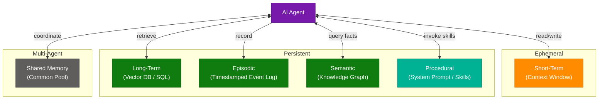

### Memory Type Reference Table

| Type | Scope | Storage | Resets? | Best For |
|---|---|---|---|---|
| **Short-term** | Current context window | RAM / token buffer | Every session | Immediate reasoning, multi-turn conversation |
| **Long-term** | Cross-session persistent | Vector DB, SQL | Never | User preferences, domain facts, past actions |
| **Episodic** | Timestamped event log | Append-only store | Never (pruned) | Self-improvement, debugging, replay |
| **Semantic** | Distilled knowledge | Knowledge graph, embeddings | Updated | Entity relationships, factual recall |
| **Procedural** | Learned skills / how-to | System prompt, skill registry | Updated | Internalized workflows, tool-use patterns |
| **Shared** | Multi-agent pool | Distributed cache / DB | Agent-scoped | Coordination, task handoff between agents |

### Code Example

```python
from langchain.memory import ConversationBufferMemory
from langchain_community.vectorstores import Chroma
import json
from datetime import datetime

# Short-term: conversation buffer in context window
short_term = ConversationBufferMemory(return_messages=True)

# Long-term: persist to and retrieve from vector store
vectorstore = Chroma(persist_directory="./agent_longterm_memory")
retriever = vectorstore.as_retriever(search_kwargs={"k": 5})

def recall(query: str) -> list[str]:
    return [doc.page_content for doc in retriever.get_relevant_documents(query)]

# Episodic: append timestamped event log
def log_episode(action: str, result: str, success: bool):
    with open("episodic_log.jsonl", "a") as f:
        f.write(json.dumps({
            "ts": datetime.utcnow().isoformat(),
            "action": action,
            "result": result,
            "success": success
        }) + "\n")
```

### Interview Q&A

| Question | Answer |
|---|---|
| Why do LLMs need external memory systems? | LLMs are stateless: weights encode general knowledge but retain nothing between API calls. Without explicit memory, agents repeat themselves, forget past actions, and cannot personalize across sessions. |
| What is episodic memory in an AI agent? | Episodic memory stores timestamped records of specific events the agent experienced — what it did, when, and what happened as a result. It enables self-correction: the agent reviews its history and avoids repeating failed approaches. |
| How is semantic memory different from long-term memory? | Long-term memory stores *experiences* (what happened). Semantic memory stores *distilled facts* (what is known to be true). Example: long-term = "User asked about Python three times last week"; semantic = "User is an expert Python developer." |
| What is shared memory in multi-agent systems? | A common data store all agents in a team can read and write. It enables coordination — one agent stores intermediate results that another picks up — without requiring direct inter-agent messaging. |
| How do you decide which memory types to use? | Start with short-term (always needed). Add long-term for personalization. Add episodic for agents that must learn from failure. Add semantic for factual recall at scale. Add shared only in multi-agent architectures. |

---

## 7. Loop Engineering for AI Agents

### Overview

Loop Engineering is a design pattern where an LLM agent is placed inside an autonomous iterative loop that feeds results back to the agent and triggers re-execution until a programmatic termination condition is met. Traditional prompt engineering requires a human to review output and manually refine prompts when results are wrong. Loop Engineering removes this bottleneck: the loop evaluates output programmatically (run tests, validate schema, check assertions) and either terminates on success or re-prompts the agent with failure context. This is the architectural foundation for autonomous coding agents, test-writing agents, and self-healing pipelines.

### State Machine Diagram

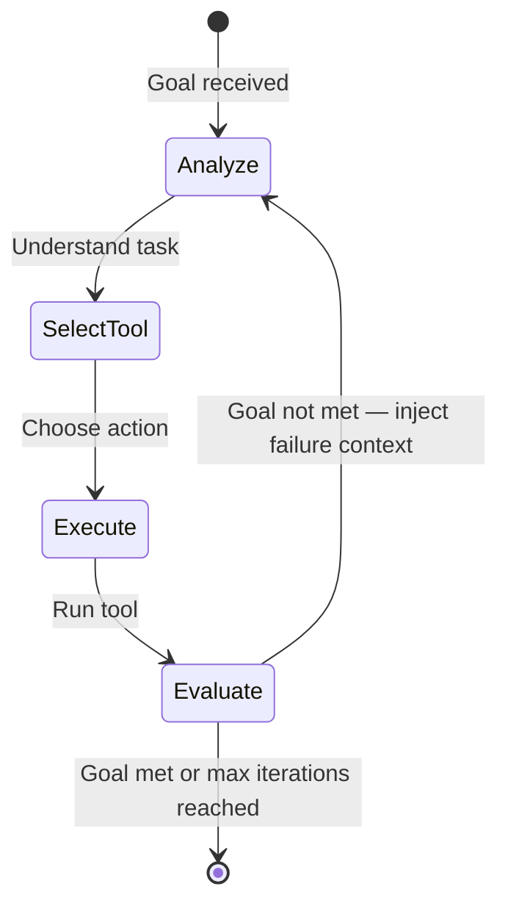

### Loop Flow Diagram

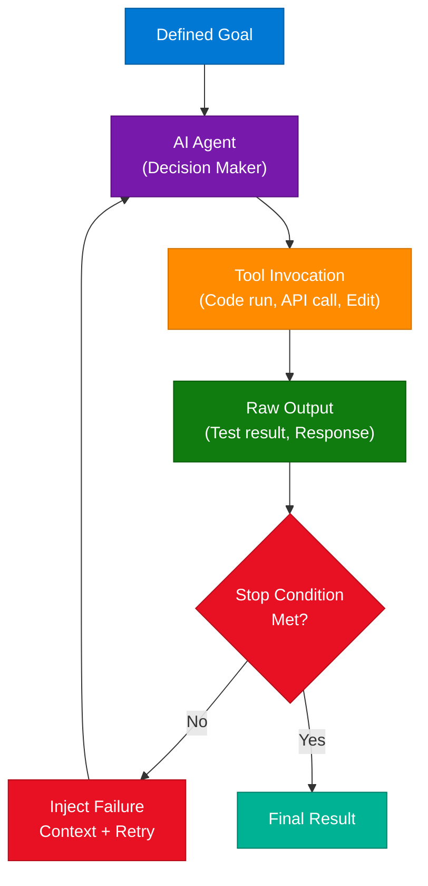

### Loop vs. Manual Prompt Engineering

| Dimension | Manual Prompt Engineering | Loop Engineering |
|---|---|---|
| **Human involvement** | Human reviews output each iteration | Programmatic evaluation only |
| **Speed** | Bottlenecked by human review | Milliseconds per iteration |
| **Scalability** | Linear with human capacity | Autonomous, parallelizable |
| **Error handling** | Human reformulates prompt manually | Loop injects failure context automatically |
| **Use case** | One-shot generation | Multi-step autonomous tasks |

### Code Example

```python
import anthropic

client = anthropic.Anthropic()

def loop_engineer(task: str, max_iterations: int = 5) -> str:
    messages = [{"role": "user", "content": task}]

    for i in range(max_iterations):
        response = client.messages.create(
            model="claude-sonnet-4-6",
            max_tokens=2048,
            messages=messages
        )
        output = response.content[0].text

        if evaluate_output(output):  # programmatic stop condition
            return output

        # Re-inject failure context for next iteration
        messages.append({"role": "assistant", "content": output})
        messages.append({
            "role": "user",
            "content": f"Iteration {i+1} failed. Error: {get_error(output)}. Try again."
        })

    return output  # best-effort after max iterations

def evaluate_output(output: str) -> bool:
    return "PASS" in output  # replace: run tests, validate schema, check assertions
```

### Interview Q&A

| Question | Answer |
|---|---|
| What is Loop Engineering? | A design pattern where an AI agent runs inside an autonomous iterative loop. The loop evaluates output programmatically, re-prompts the agent with failure context if the goal isn't met, and terminates on success or hitting a max iteration limit — eliminating human-in-the-loop bottlenecks. |
| How do you prevent infinite loops in an agent loop? | Set a hard max iteration count. Also detect stuck cycles: if the last N iterations produced identical outputs, halt and escalate. Track seen-state hashes to detect convergence failure early. |
| What makes a good stop condition? | It must be programmatically evaluable: test suite exit code 0, JSON schema validates, API response matches expected shape, diff is empty. Avoid subjective conditions requiring human judgment — those defeat the purpose of the loop. |
| How does Loop Engineering relate to ReAct agents? | ReAct (Reason + Act) is a prompting pattern where the agent alternates reasoning and tool calls. Loop Engineering is the *architectural wrapper* around a ReAct agent — providing iteration, context injection on failure, and the termination policy. |
| What are common failure modes of agent loops? | (1) Infinite loops with no progress — agent repeats the same wrong action. (2) Context window overflow — failed iterations fill the context. (3) Tool hallucination — agent invents non-existent arguments. Mitigate with hard limits, context summarization, and strict tool schemas. |

---

## 8. Re-Ranking in RAG Systems

### Overview

Standard RAG pipelines use vector similarity search to retrieve the top-k most semantically similar chunks to a user query. This is fast but imprecise: the vector space conflates "related topic" with "answers this specific question." Re-ranking inserts a cross-encoder model between the retriever and the LLM. The cross-encoder scores each retrieved chunk against the exact query using full self-attention — far more accurate than bi-encoder similarity — and re-orders the candidates by true relevance. The LLM then receives only the top-n highest-ranked chunks, reducing noise and improving answer quality without increasing retrieval cost.

### Two-Stage Retrieval Diagram

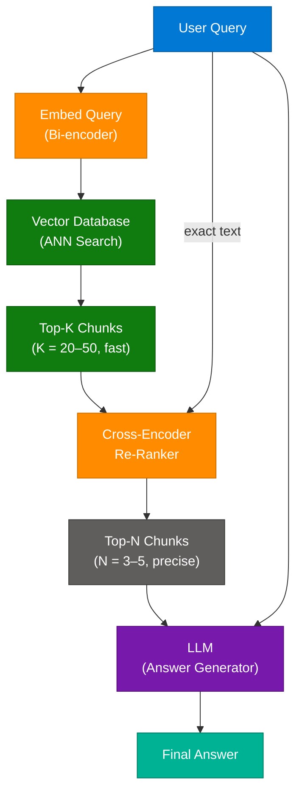

### Retrieval Stage Comparison

| Stage | Model Type | Latency | Precision | Scale |
|---|---|---|---|---|
| **Bi-encoder (ANN)** | Dual-encoder, pre-computed embeddings | Sub-millisecond | Moderate | Millions of docs |
| **Cross-encoder re-ranker** | Full attention over query+chunk pair | 10–100ms per pair | High | Top 20–50 chunks only |

### Re-Ranking Models

| Model | Type | Notes |
|---|---|---|
| `cross-encoder/ms-marco-MiniLM-L-6-v2` | HuggingFace open-source | Fast, strong English performance |
| Cohere Rerank API | Commercial | Easy integration, multilingual |
| `BAAI/bge-reranker-large` | Open-source | Strong multilingual performance |

### Code Example

```python
from sentence_transformers import CrossEncoder

reranker = CrossEncoder("cross-encoder/ms-marco-MiniLM-L-6-v2")

def rerank(query: str, chunks: list[str], top_n: int = 5) -> list[str]:
    pairs = [(query, chunk) for chunk in chunks]
    scores = reranker.predict(pairs)
    ranked = sorted(zip(scores, chunks), key=lambda x: x[0], reverse=True)
    return [chunk for _, chunk in ranked[:top_n]]

# Pipeline: vector search returns top-20 → rerank → send top-5 to LLM
```

### Interview Q&A

| Question | Answer |
|---|---|
| Why isn't vector search enough for RAG? | Vector (bi-encoder) search embeds query and documents independently, computing similarity in embedding space. It captures topic relatedness but not precise factual relevance — a chunk about "database indexes" can score high for "how does PostgreSQL handle locking?" without actually answering it. |
| What is a cross-encoder and how does it differ from a bi-encoder? | A bi-encoder embeds query and document separately (fast, scales to millions). A cross-encoder concatenates them and applies full self-attention, outputting a single relevance score (slow but highly precise). Re-ranking applies cross-encoders on the small top-k set. |
| What are typical values of K (retrieval) and N (re-ranked)? | Retrieve K=20–50 from the vector DB. Re-rank to top N=3–5. Sending more than 5 chunks to the LLM typically adds noise without improving answer quality while increasing latency and cost. |
| How does re-ranking affect RAG latency? | Re-ranking adds 50–200ms for K=20 retrieval. Acceptable for synchronous Q&A. For streaming, start generating with top bi-encoder results while the re-ranker runs in parallel, then apply corrections if the top-N changes. |
| What other techniques combine with re-ranking? | Hybrid search (BM25 + vector) before re-ranking improves candidate quality. Query expansion (generate sub-queries, retrieve for each, union results) increases recall before the re-ranker filters to precision. |

---

## 9. The Skills Ecosystem

### Overview

The Skills Ecosystem is an open-source framework centralizing the discovery and integration of AI agent capabilities — called "skills" — into a unified registry. The core problem it solves: every team building agents independently reimplements the same tool integrations (web search, calendar access, code execution, database queries). A skills registry acts as npm-for-agent-capabilities: skills are published, versioned, and installable with a single CLI command. The video claims 600,000+ available skills accessible via `npx skills init`.

### Architecture Diagram

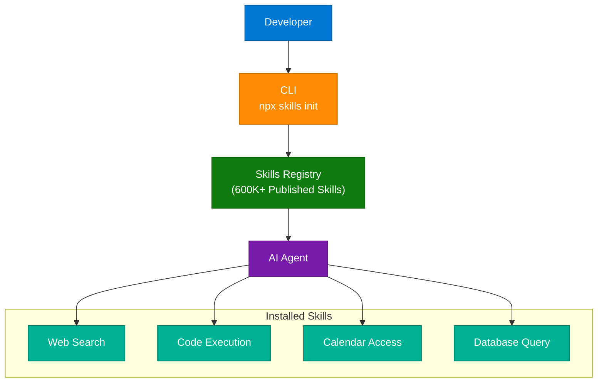

### Interview Q&A

| Question | Answer |
|---|---|
| What problem does a skills registry solve for AI agents? | It eliminates duplicated effort: every team building agents independently implements the same tool integrations. A centralized registry provides pre-built, tested, versioned skills — similar to how npm accelerated JavaScript development. |
| How are skills different from tools in agent frameworks? | In LangChain or Claude tool_use, tools are single functions the agent can call. Skills in the ecosystem sense are higher-level composites — they bundle a tool, its retry logic, error handling, input schema, and versioning together as a sharable unit. |
| What is MCP (Model Context Protocol) and how does it relate to skills? | MCP is Anthropic's open standard for tool and resource discovery by AI agents. A skills registry built on MCP allows any MCP-compatible agent to discover and invoke skills without custom integration — standardizing interoperability across agent frameworks. |
| How would you evaluate a third-party skill before production use? | Check: (1) what data it accesses and whether credentials are required; (2) whether it has a sandbox/test mode; (3) its error contract; (4) latency SLA; (5) whether it's open-source for security auditing. |
| How does the Claude Code skill system relate? | Claude Code skills are `.md`-defined agent behaviors invoked via slash commands within the Claude Code harness. A general skills ecosystem extends this concept to runtime-loadable, registry-hosted capabilities consumable by any agent framework via a standard protocol. |

---

## 10. The "One-Big-Feature" Method

### Overview

The "One-Big-Feature" method is an AI agent development methodology that replaces incremental micro-prompting with full-lifecycle feature scoping. Instead of guiding an agent through hundreds of disconnected prompts ("write this function," "now write the test"), the engineer scopes one complete well-defined feature and invokes a structured slash-command workflow driving the agent through Planning → Specification → Implementation → Review → Completion autonomously. This maximizes agent autonomy while maintaining engineering accountability through explicit phase gates.

### Workflow Diagram

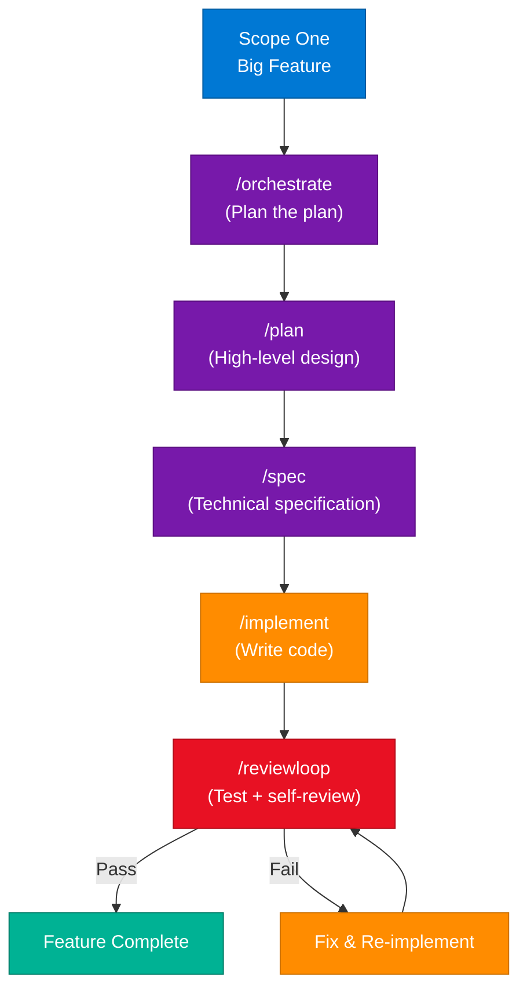

### Slash Commands Reference

| Command | Phase | What the Agent Does |
|---|---|---|
| `/orchestrate` | Meta-planning | Breaks feature into sub-tasks, identifies dependencies |
| `/plan` | High-level design | Identifies files to create/modify, proposes architecture |
| `/spec` | Specification | Writes technical spec: API contracts, data models, edge cases |
| `/implement` | Coding | Writes code following the approved spec |
| `/reviewloop` | QA | Runs tests, reviews own output, iterates until passing |

### Interview Q&A

| Question | Answer |
|---|---|
| What is the core insight behind the One-Big-Feature method? | An AI agent performs better on a coherent, well-scoped task than on many disconnected micro-tasks. Coherent context (plan + spec + tests all in scope together) produces more consistent implementation than fragmented prompts that lose context. |
| How does /spec improve implementation quality? | The spec phase forces explicit decisions about API contracts, data models, and edge cases before code is written. The agent references the spec during /implement, preventing the most common failure mode: code that satisfies the literal prompt but not the actual requirement. |
| What is /reviewloop doing mechanically? | The agent runs the test suite or configured validator. Failures are injected as context into a new /implement iteration — this is Loop Engineering applied at the feature level, not a separate concept. |
| When does this method fail? | When the initial feature scope is too vague or too large. "Build a CRM" fails; "Add JWT refresh token rotation to the existing FastAPI authentication module" succeeds. Scoping precision is the engineer's responsibility; autonomous execution is the agent's. |
| How does this shift the engineer's role? | From implementation (typing code) to architecture + scoping + quality gate review. The engineer's value concentrates at the problem definition and evaluation ends of the workflow rather than in the execution middle. |

---

## 11. Foundation Models

### Overview

Foundation models are massive general-purpose AI models pre-trained on vast, diverse datasets using self-supervised learning. Unlike task-specific models trained for narrow purposes, foundation models develop emergent, transferable representations of language, code, and images that adapt to a wide range of downstream tasks with minimal additional training. They represent the most consequential architectural shift in AI engineering since deep learning: instead of building one model per problem, engineers now adapt one pre-trained model to many problems via prompting, fine-tuning, or RAG.

### Architecture Diagram

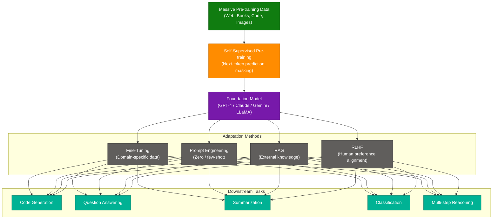

### Before vs. After Foundation Models

| Before Foundation Models | After Foundation Models |
|---|---|
| Collect task-specific labeled dataset (weeks) | Zero/few-shot prompt immediately |
| Train model from scratch (days–weeks) | Fine-tune in hours or prompt directly |
| One model per problem | One model, N adaptations |
| Requires ML expertise for each new task | Prompt engineering accessible to all engineers |
| Data bottleneck: need 10K+ labeled samples | Few-shot: 5–50 examples often sufficient |

### Adaptation Method Comparison

| Method | Data Required | Cost | When to Use |
|---|---|---|---|
| **Zero-shot prompting** | None | Zero | Task is within model's training distribution |
| **Few-shot prompting** | 5–50 examples | Zero | Need format control or domain priming |
| **Fine-tuning** | 1K–100K examples | Medium | Consistent domain-specific style, vocabulary, or schema |
| **RLHF** | Human preference pairs | High | Align to safety policies or strong preference goals |
| **RAG** | External documents | Low | Dynamic knowledge that changes over time |

### Code Example

```python
import anthropic

client = anthropic.Anthropic()

# Zero-shot: foundation model, no training data needed
def classify_zero_shot(text: str) -> str:
    response = client.messages.create(
        model="claude-sonnet-4-6",
        max_tokens=10,
        messages=[{"role": "user", "content": f"Classify as Positive or Negative: '{text}'"}]
    )
    return response.content[0].text.strip()

# Few-shot: prime with examples for format control
def classify_few_shot(text: str) -> str:
    prompt = f"""Classify as Positive/Negative:
"Great quality!" → Positive
"Stopped working." → Negative
"Absolutely love it!" → Positive
"{text}" →"""
    response = client.messages.create(
        model="claude-sonnet-4-6",
        max_tokens=10,
        messages=[{"role": "user", "content": prompt}]
    )
    return response.content[0].text.strip()
```

### Interview Q&A

| Question | Answer |
|---|---|
| What is a foundation model? | A massive general-purpose AI model trained via self-supervised learning on diverse data (text, code, images). It develops transferable representations that adapt to many tasks without task-specific training from scratch. |
| What is self-supervised learning and why is it used? | Self-supervised learning creates labels from the data itself (predict the next token, reconstruct masked words). This eliminates expensive human labeling, enabling training on internet-scale datasets of billions of documents. |
| What are emergent capabilities? | Capabilities appearing at large scale that were not explicitly trained for — chain-of-thought reasoning, multi-step math, code generation. They emerge from training scale and data diversity, not specific supervision signals. |
| When should you fine-tune vs. use RAG vs. prompt? | Prompt first (no cost, immediate). Add RAG when the model lacks current or proprietary knowledge. Fine-tune when you need consistent output format, specialized vocabulary, or want to reduce prompt length (lower latency). RLHF for safety alignment. |
| What are key differences between major foundation models? | GPT-4 (OpenAI): strong coding and reasoning, proprietary. Claude (Anthropic): long context window (200K), safety-focused via Constitutional AI. Gemini (Google): multimodal-first, Google ecosystem integration. LLaMA (Meta): open-weights, self-hostable, fine-tune friendly. |

---

## 12. Interview Q&A Cheatsheet

**Q: What is the fundamental difference between a container and a serverless function?**
> A container packages your application and runtime — you control scaling, concurrency, and lifecycle. Serverless gives you a stateless compute primitive where the platform manages everything; you only write the handler. Use containers for long-running services with persistent connections; serverless for event-driven, stateless, bursty workloads with unpredictable traffic.

**Q: How do you add memory to a stateless LLM to build a persistent agent?**
> Implement short-term memory by injecting conversation history into the context window. Add long-term memory with a vector store — embed and persist facts, retrieve relevant ones at query time. Episodic memory appends a timestamped event log for self-correction. Procedural memory is encoded in the system prompt or skill registry. None of these are automatic — all must be explicitly engineered.

**Q: What is the two-stage retrieval pattern in RAG, and why use it?**
> Stage 1: bi-encoder ANN search retrieves top-K (20–50) candidates at sub-millisecond speed. Stage 2: cross-encoder re-ranker scores each candidate against the exact query with full attention, re-ordering to top-N (3–5) with high precision. The approach balances speed (bi-encoder at scale) with accuracy (cross-encoder on the small candidate set).

**Q: What is Loop Engineering and how does it differ from standard prompting?**
> Standard prompting: one shot, human reviews, human decides next step. Loop Engineering: the agent's output is evaluated programmatically (test suite, schema validator), and failure context is automatically re-injected into the next iteration without human involvement. The loop continues until a stop condition is met or max iterations is reached.

**Q: How do you instrument an AI agent for production observability?**
> Wrap all LLM calls and tool invocations in tracing decorators (Langfuse `@observe()`, LangSmith RunTree). Capture: token usage per call, latency per span, tool inputs/outputs, and reasoning steps. Run async LLM-as-judge evaluations on sampled traces to detect quality regression. Alert on: p99 latency spikes, tool error rate > 5%, and token cost per request exceeding budget.

**Q: What is a foundation model and how has it changed AI engineering practice?**
> A foundation model is a massive self-supervised model trained on diverse data that develops generalized, transferable representations. It shifted AI engineering from "build one model per problem" to "adapt one model to many problems" — reducing the data and expertise barrier for new AI applications by orders of magnitude.

**Q: What are the three key networking metrics in system design and how do they interact?**
> Latency: RTT for one request (target: <100ms user-facing). Throughput: requests/sec the system sustains. Bandwidth: maximum data the network can carry. They interact via Little's Law (`L = λW`): if latency doubles at the same arrival rate, queue depth doubles, causing throughput collapse. Reduce latency to increase effective throughput; increase bandwidth to reduce congestion-induced latency.

**Q: When would you choose AZ redundancy vs. multi-Region deployment?**
> AZ redundancy: protects against single data center failure; same-region latency (<2ms between AZs); data stays in same legal jurisdiction. Multi-Region: protects against full regional outage; lower latency for geographically distributed users; introduces data replication complexity (eventual consistency, conflict resolution). Start with multi-AZ for HA; add multi-Region only when user geography or DR SLAs require it.

**Q: When should you use the One-Big-Feature method instead of micro-prompting an agent?**
> When the task involves multiple interdependent files, a clear specification can be written upfront, and the deliverable is testable. One-Big-Feature works because coherent context (plan + spec + tests in scope) produces more consistent code than a series of disconnected prompts that lose context across turns. Micro-prompting is better for exploratory, one-off, or investigative tasks with unclear scope.

---

*Extracted from Gemini shared session · July 9, 2026 · GeminiShareToMD Agent v1.0*

---

```
═══════════════════════════════════════════════════════════
Token Usage Report
═══════════════════════════════════════════════════════════
Estimated without optimization:  ~14,900 tokens
Actual (with optimization):      ~8,500 tokens
Savings:                         ~6,400 tokens (43%)
Techniques applied:              Strip UI chrome (Gemini header, Convert to PDF,
                                 Continue this chat, Gemini footer disclaimer);
                                 Deduplicate 12 repeated section templates across modules;
                                 Compact verbose Gemini bullet-point prose → dense
                                 technical notes; Skip non-engineering turns (Remote Jobs,
                                 Asset Protection) — noted only, not fully enriched;
                                 Merge overlapping Cloud Concepts table entries.
═══════════════════════════════════════════════════════════
* Estimates: prose chars ÷ 4, code chars ÷ 3. Actual API usage varies by model.
```
