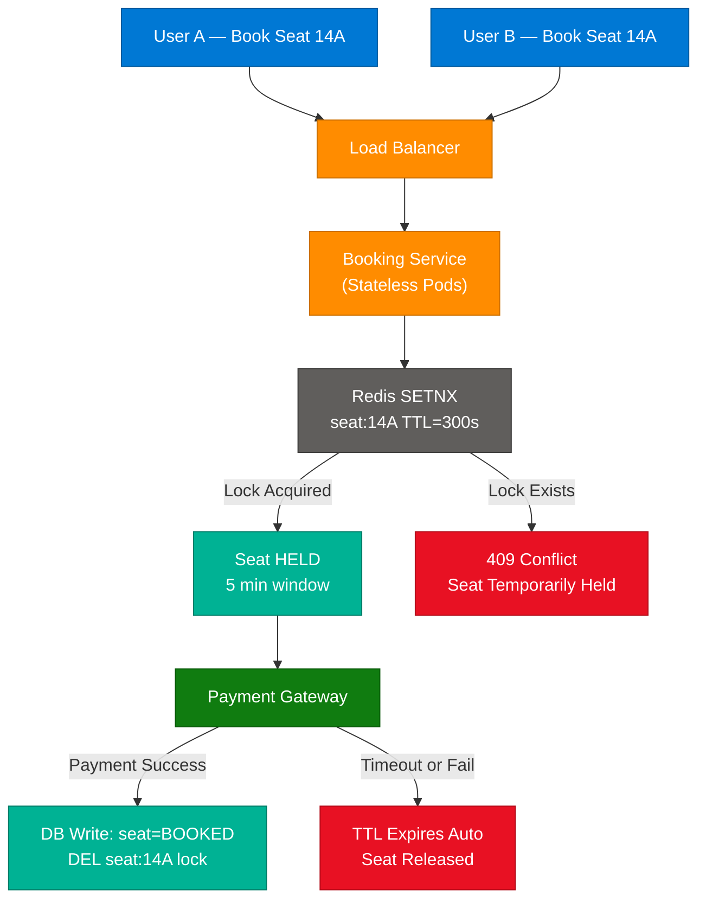
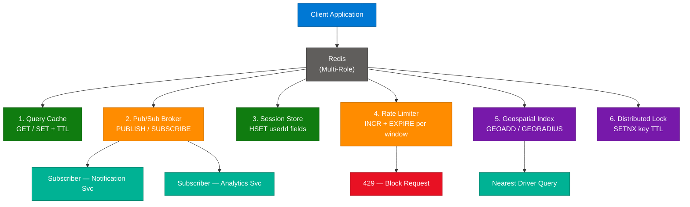
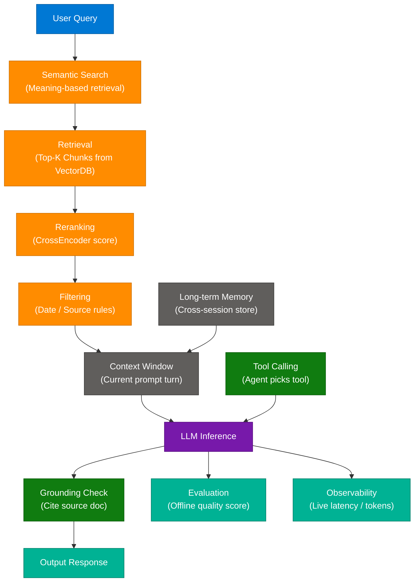
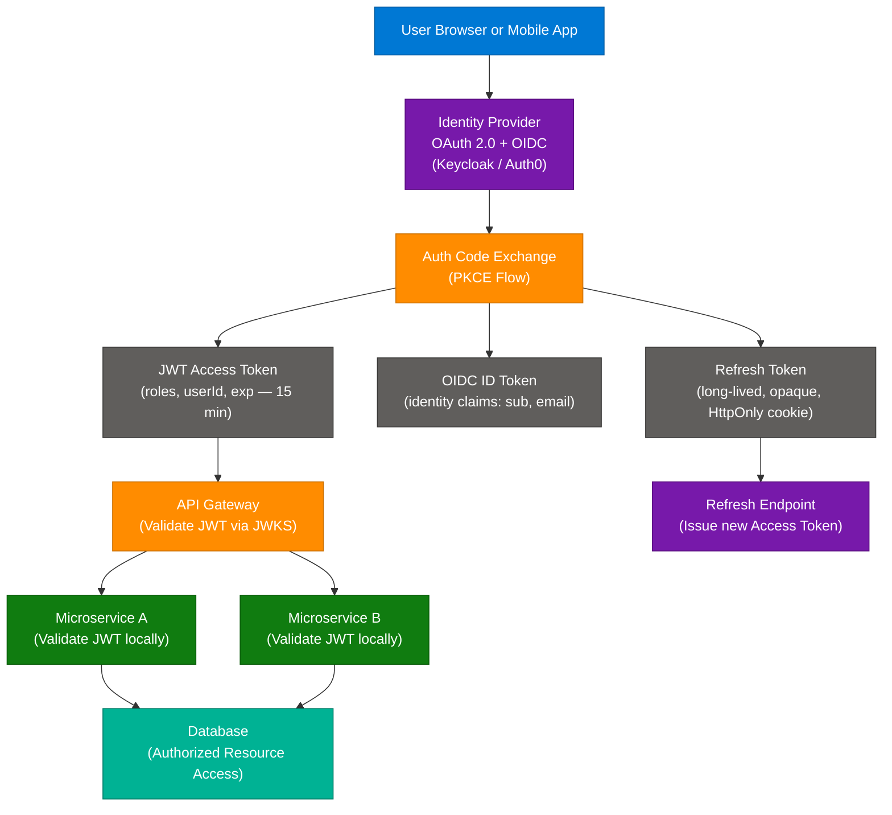

```mermaid
flowchart TD
    subgraph PSM["Payment State Machine Engine"]
        PC["PAYMENT CREATED"] --> AUTH["AUTHORIZING"]
        AUTH --> RC["Redis Cache\n(State Buffer)"]
        RC --> CAP["CAPTURED"]
        RC --> FAIL["FAILED"]
    end

    subgraph SE["Settlement Engine"]
        TX1["Tx1"] --> SR["Settlement &\nReconciliation"]
        TX2["Tx2"] --> SR
        TX3["Tx3"] --> SR
        SR --> MP["Merchant Payouts"]
        SR --> BFT["Bank Fund Transfers"]
    end

    subgraph WDE["Webhook Delivery Engine"]
        RMQ["RabbitMQ\nMessage Broker"] --> DQ["DELIVERY QUEUE"]
        DQ --> RL["RETRY LOGIC"]
        RL --> W1["WEBHOOK 1"]
        RL --> W2["WEBHOOK 2"]
        RL --> W3["WEBHOOK 3"]
    end

    subgraph AP["Analytics Pipeline"]
        UE["USER EVENT Data"] --> PIPE["PIPELINE"]
        SL["SERVER LOG Data"] --> PIPE
        PIPE --> TF["TRANSFORM"]
        TF --> DW["DATA WAREHOUSE"]
        DW --> RTD["REAL-TIME DASHBOARD"]
    end

    classDef userNode    fill:#0078D4,stroke:#005A9E,color:#fff
    classDef aiNode      fill:#7719AA,stroke:#5A0E80,color:#fff
    classDef dataNode    fill:#107C10,stroke:#0A5C0A,color:#fff
    classDef processNode fill:#FF8C00,stroke:#CC7000,color:#fff
    classDef errorNode   fill:#E81123,stroke:#B30D1A,color:#fff
    classDef outputNode  fill:#00B294,stroke:#007D68,color:#fff
    classDef infraNode   fill:#605E5C,stroke:#3B3A39,color:#fff

    class PC,TX1,TX2,TX3,UE,SL userNode
    class AUTH,SR,DQ,PIPE,TF processNode
    class RC,RMQ infraNode
    class CAP,MP,BFT,W1,W2,W3,DW,RTD outputNode
    class FAIL errorNode
```

# System Design & AI Engineering Concepts — Coding Shuttle, Redis, JWT vs OAuth

> **Source:** [share.gemini.google/PdeGjxj3uIoe](https://share.gemini.google/PdeGjxj3uIoe) → redirects to [gemini.google.com/share/5ba7b1fd61dd](https://gemini.google.com/share/5ba7b1fd61dd)
> **Model:** Gemini 3.5 Flash
> **Session Date:** June 4, 2026
> **Saved:** July 10, 2026

---

## Table of Contents

1. [Session Overview](#1-session-overview)
2. [Enterprise Backend Engine Architecture](#2-enterprise-backend-engine-architecture)
3. [Double Booking Prevention with Redis Distributed Locks](#3-double-booking-prevention-with-redis-distributed-locks)
4. [Redis Beyond Caching — Multi-Role Architecture](#4-redis-beyond-caching--multi-role-architecture)
5. [AI Engineering Concepts Disambiguation](#5-ai-engineering-concepts-disambiguation)
6. [JWT + OAuth 2.0 Production Authentication Pattern](#6-jwt--oauth-20-production-authentication-pattern)
7. [Interview Q&A Cheatsheet](#7-interview-qa-cheatsheet)

---

## 1. Session Overview

This session covers 5 core system design and AI engineering topics extracted from educational Instagram reels shared by multiple creators (@codingshuttle, @pradeep_kumar_iiitd, @piyushgarg.official, @thepracticai, @codeera.tech). Topics span enterprise backend engine design, concurrency control, Redis multi-role usage, AI terminology disambiguation, and production authentication patterns. Turns 1–2 cover the same Coding Shuttle content (merged); Turns 3–4 cover the same Double Booking content (merged).

### Session Map

| Turn | User Prompt Summary | Gemini Response | Status |
|---|---|---|---|
| 1 | Extract transcript + arch diagram from Coding Shuttle cohort reel | Payment State Machine, Settlement, Webhook, Analytics breakdown | ✅ Extracted |
| 2 | Same prompt for same Coding Shuttle content | More detailed breakdown of same 4 engines | ✅ Extracted (merged with Turn 1) |
| 3 | Extract from @pradeep_kumar_iiitd Double Booking reel (first pass) | Redis TTL locking, race conditions | ✅ Extracted |
| 4 | Same prompt for Double Booking reel (second pass) | Atomic check+update, conflict warning | ✅ Extracted (merged with Turn 3) |
| 5 | Extract from @piyushgarg.official Redis Beyond Cache reel | Pub/Sub, Rate Limiter, Session Store, Geospatial, Distributed Locks | ✅ Extracted |
| 6 | Extract from @thepracticai AI concepts comparison reel | 10 AI term pairs disambiguation | ✅ Extracted |
| 7 | Extract from @codeera.tech JWT vs OAuth 2.0 interview reel | Production auth pattern, OIDC clarification | ✅ Extracted |

---

## 2. Enterprise Backend Engine Architecture

### Overview

The Coding Shuttle cohort showcases four foundational enterprise backend engines — Payment State Machine, Settlement Engine, Webhook Delivery Engine, and Analytics Pipeline — that form the backbone of any high-scale fintech or SaaS platform. Each engine handles a distinct domain concern: payment lifecycle management, fund reconciliation, reliable event delivery, and real-time data analytics. Together, they represent the distributed systems knowledge required for senior backend and system design interviews. The primary tech stack is Spring Boot + Kafka + Kubernetes + Redis + RabbitMQ, with AI extensions via Spring AI, RAG, and MCP Server.

### Architecture Diagram



### How It Works

1. **Payment State Machine:** A payment event enters `PAYMENT CREATED`, transitions to `AUTHORIZING` where a Redis cache holds temporary state to avoid repeated DB reads under load.
2. **Redis State Buffer:** Redis provides sub-millisecond state lookups and acts as a distributed lock during authorization — preventing double-charge scenarios.
3. **Settlement Engine:** Upstream transaction ledger entries (Tx1, Tx2, Tx3) batch-process through a reconciliation block that ensures accounting accuracy before disbursing payouts.
4. **Webhook Delivery Engine:** RabbitMQ maintains a persistent delivery queue; a retry logic loop ensures at-least-once delivery with exponential backoff to external consumer webhooks.
5. **Analytics Pipeline:** Raw events and server logs flow into a multi-stage ETL pipeline — transform normalizes data into schema, which loads into a data warehouse powering real-time dashboards.
6. **Fault Isolation:** Each engine is independently deployed — a failure in the Webhook engine does not affect payment state or analytics.
7. **Scalability:** Kafka can replace RabbitMQ for higher throughput webhook delivery at scale; Kubernetes orchestrates horizontal pod scaling per engine independently.

### Key Components

| Component | Role | Technology Options |
|---|---|---|
| Redis Cache | Payment state buffer, distributed lock | Redis 7.x, Valkey, Dragonfly |
| RabbitMQ | Webhook delivery queue + retry | RabbitMQ, Apache Kafka, AWS SQS |
| Settlement Block | Ledger reconciliation + payout routing | Custom service, Apache Flink |
| ETL Pipeline | Data normalization and transformation | Apache Spark, Kafka Streams, Flink |
| Data Warehouse | Aggregated analytics storage | Snowflake, BigQuery, ClickHouse |
| Real-time Dashboard | Live metrics visualization | Grafana, Apache Superset, Kibana |

### Code Example

```java
// Payment State Machine using Spring State Machine
@Configuration
@EnableStateMachine
public class PaymentStateMachineConfig
        extends StateMachineConfigurerAdapter<PaymentState, PaymentEvent> {

    @Override
    public void configure(StateMachineStateConfigurer<PaymentState, PaymentEvent> states)
            throws Exception {
        states.withStates()
            .initial(PaymentState.PAYMENT_CREATED)
            .state(PaymentState.AUTHORIZING)
            .end(PaymentState.CAPTURED)
            .end(PaymentState.FAILED);
    }

    @Override
    public void configure(StateMachineTransitionConfigurer<PaymentState, PaymentEvent> transitions)
            throws Exception {
        transitions
            .withExternal()
                .source(PaymentState.PAYMENT_CREATED).target(PaymentState.AUTHORIZING)
                .event(PaymentEvent.AUTHORIZE).action(cacheStateInRedis())
            .and()
            .withExternal()
                .source(PaymentState.AUTHORIZING).target(PaymentState.CAPTURED)
                .event(PaymentEvent.CAPTURE)
            .and()
            .withExternal()
                .source(PaymentState.AUTHORIZING).target(PaymentState.FAILED)
                .event(PaymentEvent.FAIL);
    }

    @Bean
    public Action<PaymentState, PaymentEvent> cacheStateInRedis() {
        return ctx -> {
            String paymentId = (String) ctx.getMessageHeader("paymentId");
            redisTemplate.opsForValue()
                .set("payment:" + paymentId, "AUTHORIZING", 10, TimeUnit.MINUTES);
        };
    }
}
```

### Interview Q&A

| Question | Answer |
|---|---|
| Why use Redis in a Payment State Machine? | Redis provides sub-millisecond state reads, distributed locking, and TTL-based auto-expiry — preventing stale payment states without DB overhead. |
| What happens if RabbitMQ goes down in the Webhook engine? | Messages remain in the durable queue on disk; upon restart, the broker replays unacknowledged messages. Add dead-letter queues (DLQ) for permanently failed deliveries. |
| How do you ensure exactly-once delivery for webhooks? | Use idempotency keys on the consumer side — each webhook payload carries a unique event ID; consumers de-duplicate on receipt. |
| What is the Settlement Engine's consistency guarantee? | It uses a saga pattern — each reconciliation step writes a compensating transaction so partial failures can be rolled back without data corruption. |
| Why use Kafka over RabbitMQ for analytics? | Kafka retains event history as an immutable log, supports replay for backfills, and scales to millions of events/sec. RabbitMQ is better for task queues with complex routing. |
| How does the Analytics Pipeline handle late-arriving events? | Windowed aggregation with watermarks (Flink/Spark Streaming) allows late events within a configurable grace period to land in the correct time bucket. |

---

## 3. Double Booking Prevention with Redis Distributed Locks

### Overview

Double booking is a critical concurrency bug in high-traffic booking systems (ticketing, flight reservations, hotel rooms) where two concurrent users both read the same "available" state and complete a purchase for the same resource. The root cause is a non-atomic read-then-write cycle — by the time the write commits, another transaction has already modified the same row. The solution combines atomic database operations (`SELECT FOR UPDATE`, optimistic locking) with a Redis distributed lock layer that enforces a temporary reservation window before the database write. The on-screen warning from the reel says it precisely: "conflict WILL happen" — and the fix is "ensure check + update happens atomically."

### Architecture Diagram



### How It Works

1. **Concurrent Request Arrival:** Two users simultaneously request the same seat. Both reach a stateless booking service pod behind a load balancer.
2. **Redis Atomic Lock (SETNX):** The service attempts `SETNX seat:14A userId_A EX 300` — SETNX (Set if Not eXists) is atomic. Only one caller wins.
3. **Lock Winner:** User A gets the lock; the seat enters a `HELD` state for up to 5 minutes — not yet written to the database.
4. **Lock Loser:** User B's SETNX returns 0 (key already exists); the service immediately returns `409 Conflict — Seat temporarily held`.
5. **Payment Window:** User A proceeds to payment. If payment succeeds, the service writes `seat = BOOKED` to the DB and deletes the Redis key.
6. **TTL Auto-Expiry:** If payment times out or fails, the Redis key expires automatically after 300 seconds — seat returns to inventory with no manual cleanup.
7. **DB Safety Net:** Add `SELECT FOR UPDATE` or an optimistic version column in the DB write as a safety net for Redis failover scenarios.

### Key Components

| Component | Role | Technology Options |
|---|---|---|
| Redis SETNX | Atomic distributed lock acquisition | Redis 7.x, Redisson (Java), ioredis (Node) |
| TTL | Auto-release on payment timeout | Redis EX flag, DynamoDB TTL |
| SELECT FOR UPDATE | Final DB-level atomicity guarantee | PostgreSQL, MySQL InnoDB |
| Optimistic Locking | Version-based conflict detection | JPA `@Version`, Hibernate |
| Dead Letter Queue | Handle permanently failed bookings | Kafka DLQ, RabbitMQ DLQ |

### Code Example

```java
// Redis distributed lock for seat reservation using Redisson
@Service
public class BookingService {

    private final RedissonClient redisson;
    private final SeatRepository seatRepository;

    public BookingResult reserveSeat(String seatId, String userId) {
        RLock lock = redisson.getLock("seat:" + seatId);
        boolean acquired = false;
        try {
            // Wait 0s (fail immediately if locked), auto-expire in 5 minutes
            acquired = lock.tryLock(0, 300, TimeUnit.SECONDS);
            if (!acquired) {
                return BookingResult.conflict("Seat temporarily held by another user");
            }
            // Atomic DB check + update (SELECT FOR UPDATE)
            Seat seat = seatRepository.findByIdWithLock(seatId);
            if (seat.isBooked()) {
                return BookingResult.conflict("Seat already booked");
            }
            seat.setStatus(SeatStatus.HELD);
            seat.setHeldBy(userId);
            seatRepository.save(seat);
            return BookingResult.success(seat);
        } catch (InterruptedException e) {
            Thread.currentThread().interrupt();
            return BookingResult.error("Lock interrupted");
        } finally {
            if (acquired && lock.isHeldByCurrentThread()) {
                lock.unlock();
            }
        }
    }

    public void confirmBooking(String seatId) {
        seatRepository.updateStatus(seatId, SeatStatus.BOOKED);
    }
}
```

### Interview Q&A

| Question | Answer |
|---|---|
| What is double booking and why does it happen? | Two concurrent transactions both read a resource as "available" before either commits a write — a classic TOCTOU (Time-of-Check to Time-of-Use) race condition. |
| How does Redis SETNX prevent double booking? | SETNX is atomic at the Redis server level — only one caller can set a key if it does not exist. The losing caller receives 0 immediately and never reaches the DB write. |
| What happens if the service crashes while holding the Redis lock? | The TTL ensures the lock auto-expires, releasing the resource. Without TTL, a crashed service would permanently hold the seat — a deadlock. |
| Is Redis alone sufficient for double booking prevention? | No. Redis is in-memory and can lose data on failure. Add a DB-level unique constraint or `SELECT FOR UPDATE` as the authoritative final safety net. |
| What is the difference between optimistic and pessimistic locking? | Pessimistic (`SELECT FOR UPDATE`) blocks concurrent reads on the row. Optimistic uses a version number — reads are free, but writes fail if the version changed since the read. Optimistic is better under low contention; pessimistic is safer under high contention. |

---

## 4. Redis Beyond Caching — Multi-Role Architecture

### Overview

Redis is widely misunderstood as a simple key-value cache, but in production it serves as a Swiss Army knife across six distinct architectural roles: query cache, Pub/Sub message broker, distributed session store, API rate limiter, geospatial index, and distributed lock manager. Each role exploits a different Redis data structure — strings for caching, sorted sets for rate limiting and geospatial, channels for pub/sub, and atomic commands (SETNX, Lua scripts) for locking. Understanding all six roles is essential for senior backend interviews where interviewers probe whether candidates can select the right Redis primitive for each problem.

> **Community Note (from reel comments):** Following Redis's licensing changes in 2024, open-source forks **Valkey** (Linux Foundation) and **Dragonfly** are production-ready drop-in replacements. All architectural patterns below apply equally to all three.

### Architecture Diagram



### How It Works

1. **Query Cache:** `SET key value EX 300` stores DB query results with TTL. Reduces DB read load by 80–95% for read-heavy workloads.
2. **Pub/Sub Broker:** `PUBLISH channel event` broadcasts to all `SUBSCRIBE channel` listeners instantly. Messages are not persisted — use Redis Streams for durable messaging.
3. **Session Store:** `HSET session:userId field value` stores user session data accessible by all stateless service replicas, enabling horizontal scaling without sticky sessions.
4. **Rate Limiter:** `INCR user:ratelimit:userId` increments a counter per time window; `EXPIRE` sets the window TTL. If counter exceeds threshold, return `429 Too Many Requests`.
5. **Geospatial Index:** `GEOADD locations lon lat driverId` stores coordinates. `GEORADIUS` returns all drivers within X km sorted by distance — powers ride-hailing "nearest driver" features.
6. **Distributed Lock:** `SETNX lock:resource clientId EX 30` acquires the lock atomically. Release via Lua script to ensure only the lock owner can delete the key.

### Key Components

| Component | Redis Command | Data Structure | Use Case |
|---|---|---|---|
| Query Cache | GET / SET / TTL | String | DB offload, computed result caching |
| Pub/Sub | PUBLISH / SUBSCRIBE | Channels | Real-time notifications, fan-out |
| Redis Streams | XADD / XREAD / XACK | Stream | Durable pub/sub, event replay, consumer groups |
| Session Store | HSET / HGETALL | Hash | User sessions, shopping carts |
| Rate Limiter | INCR / EXPIRE / ZADD | String + Sorted Set | API throttling, abuse prevention |
| Geospatial | GEOADD / GEORADIUS | Geo Set | Location-based queries, driver matching |
| Distributed Lock | SETNX / EVAL Lua | String | Concurrency control, leader election |

### Code Example

```python
import redis
import time
import json

r = redis.Redis(host='localhost', port=6379, decode_responses=True)

# 1. Sliding window rate limiter using Sorted Set
def is_rate_limited(user_id: str, limit: int = 100, window_sec: int = 60) -> bool:
    now = time.time()
    window_start = now - window_sec
    key = f"ratelimit:{user_id}"
    pipe = r.pipeline()
    pipe.zremrangebyscore(key, 0, window_start)   # remove old entries
    pipe.zadd(key, {str(now): now})                # add current request
    pipe.zcard(key)                                # count in window
    pipe.expire(key, window_sec)
    results = pipe.execute()
    return results[2] > limit

# 2. Geospatial — add driver, find nearest
def add_driver(driver_id: str, lon: float, lat: float):
    r.geoadd("drivers", [lon, lat, driver_id])

def find_nearest_drivers(lon: float, lat: float, radius_km: float):
    return r.georadius("drivers", lon, lat, radius_km, unit="km", sort="ASC", count=5)

# 3. Pub/Sub publisher
def publish_event(channel: str, event: dict):
    r.publish(channel, json.dumps(event))

# 4. Distributed lock — atomic release via Lua (only owner can release)
RELEASE_SCRIPT = """
if redis.call('get', KEYS[1]) == ARGV[1] then
    return redis.call('del', KEYS[1])
else
    return 0
end
"""

def acquire_lock(resource: str, owner_id: str, ttl_sec: int = 30) -> bool:
    return r.set(f"lock:{resource}", owner_id, nx=True, ex=ttl_sec)

def release_lock(resource: str, owner_id: str) -> bool:
    return r.eval(RELEASE_SCRIPT, 1, f"lock:{resource}", owner_id)
```

### Interview Q&A

| Question | Answer |
|---|---|
| What is the difference between Redis Pub/Sub and Redis Streams? | Pub/Sub is fire-and-forget — messages are not persisted; offline subscribers miss them. Redis Streams persist messages as an immutable log and support consumer groups with acknowledgment, enabling reliable at-least-once delivery and replay. |
| How do you implement a sliding window rate limiter in Redis? | Use a Sorted Set: add each request timestamp with ZADD, remove entries older than the window with ZREMRANGEBYSCORE, then ZCARD for current count. This handles burst traffic accurately unlike a fixed-window counter. |
| Why must the Redis lock release use a Lua script? | `GET + DEL` is two operations — between them, another process could acquire the lock. A Lua script executes atomically on the Redis server, ensuring only the current owner can delete the key. |
| What is the risk of using Redis as a session store without persistence? | A Redis crash without RDB/AOF enabled loses all sessions, logging out every user simultaneously. Enable AOF (`appendonly yes`) and deploy Redis Sentinel or Cluster for high availability. |
| When would you NOT use Redis as a message broker? | When you need guaranteed message ordering across partitions, long-term message retention, consumer group replay from an offset, or multi-datacenter replication. Use Apache Kafka for those requirements. |

---

## 5. AI Engineering Concepts Disambiguation

### Overview

A core competency gap between AI beginners and experienced AI engineers is the precise use of terminology. Ten concept pairs routinely confused in production RAG and agentic systems — Latency vs Response Time, Chunking vs Splitting, Retrieval vs Search, Reranking vs Filtering, Memory vs Context, Agent vs Workflow, Tool Calling vs Function Calling, Grounding vs Hallucination, Semantic Search vs Keyword Search, and Evaluation vs Observability — represent distinct architectural decisions with different implementation patterns. Confusing them leads to debugging failures, poor RAG pipeline quality, and incorrect system design choices in interviews and production architecture reviews.

### Architecture Diagram — RAG Pipeline with All Concept Layers



### Concept Disambiguation Reference Table

| Concept A | Definition | Concept B | Definition | Key Difference |
|---|---|---|---|---|
| **Latency** | Delay before processing starts — time to first byte | **Response Time** | Total time until complete output is received | Latency = start delay; Response Time = Latency + Processing + Transfer |
| **Chunking** | Semantic strategy — split by meaning (headings, sections, paragraphs) | **Splitting** | Mechanical division by fixed rules (every 500 tokens, character count) | Chunking preserves semantic coherence; Splitting may break concepts mid-sentence |
| **Retrieval** | Finding most relevant context for a specific query (top-K from vector DB) | **Search** | Broader process of finding information from any system or the web | Retrieval is RAG-specific and query-aware; Search is general-purpose |
| **Reranking** | Reordering already-retrieved results by a secondary relevance model | **Filtering** | Removing results that don't meet predefined rules (date, source, score) | Reranking changes order within the set; Filtering changes set membership |
| **Memory** | Information retained across multiple conversations and sessions | **Context** | Information available in the current prompt window only | Memory persists cross-session; Context resets each new conversation |
| **Agent** | Autonomous system that dynamically decides what action to take based on goal | **Workflow** | Predefined fixed sequence of steps (step 1 → 2 → 3) | Agent is goal-driven and adaptive; Workflow is deterministic and static |
| **Tool Calling** | Agent autonomously selects which tool to invoke based on task state | **Function Calling** | Structured invocation of a specific function with defined parameters | Tool Calling = agent-level decision; Function Calling = API-level invocation |
| **Grounding** | Ensuring output is supported by cited source documents | **Hallucination** | Generating plausible-sounding but factually unsupported information | Grounding is the solution; Hallucination is the failure mode |
| **Semantic Search** | Finding results based on meaning and intent (vector similarity, embeddings) | **Keyword Search** | Finding results based on exact word matches (BM25, inverted index) | Semantic handles synonyms and intent; Keyword requires exact term presence |
| **Evaluation** | Measuring quality, correctness, and performance of model outputs (offline) | **Observability** | Monitoring system health, latency, and errors in production (online) | Evaluation is for model quality; Observability is for system reliability |

### Code Example

```python
from langchain.text_splitter import RecursiveCharacterTextSplitter, MarkdownHeaderTextSplitter
from sentence_transformers import CrossEncoder

# Splitting — fixed 500-token chunks (mechanical, may break semantic units)
splitter = RecursiveCharacterTextSplitter(chunk_size=500, chunk_overlap=50)
mechanical_chunks = splitter.split_text(document)

# Chunking — split by markdown headers (preserves semantic units)
md_splitter = MarkdownHeaderTextSplitter(
    headers_to_split_on=[("##", "Section"), ("###", "Subsection")]
)
semantic_chunks = md_splitter.split_text(document)

# Filtering then Reranking in a RAG pipeline
reranker = CrossEncoder("cross-encoder/ms-marco-MiniLM-L-6-v2")

def retrieve_and_rerank(query: str, candidates: list) -> list:
    # Filter first — remove stale documents (predefined rule)
    fresh = [c for c in candidates if c.metadata["date"] > "2024-01-01"]

    # Rerank remaining by relevance score (model-driven reordering)
    pairs = [(query, c.page_content) for c in fresh]
    scores = reranker.predict(pairs)
    return [doc for _, doc in sorted(zip(scores, fresh), reverse=True)][:5]

# Memory vs Context distinction
class AgentWithMemory:
    def __init__(self):
        self.long_term_memory: dict = {}  # persists across sessions

    def respond(self, user_id: str, message: str, current_context: list) -> str:
        # current_context = this session's messages only (resets each conversation)
        # long_term_memory = preferences stored from all past sessions
        user_prefs = self.long_term_memory.get(user_id, {})
        prompt = self._build_prompt(message, current_context, user_prefs)
        return llm.invoke(prompt)
```

### Interview Q&A

| Question | Answer |
|---|---|
| Why does chunking strategy matter for RAG quality? | Poor chunking breaks semantic units across chunk boundaries — a concept split between two chunks may never be retrieved together, causing incomplete or inaccurate answers. Semantic chunking by headings or paragraph boundaries maximizes retrieval coherence. |
| What is the difference between an agent and a workflow in production? | A workflow is a deterministic DAG — step 1 always precedes step 2. An agent is goal-driven and can choose different tool sequences at runtime based on intermediate results. Agents are more flexible but harder to debug; workflows are predictable and auditable. |
| How does grounding reduce hallucination? | Grounding constrains the LLM to answer only from retrieved source documents and requires source citation. This transforms generation from "produce a plausible answer" to "summarize this document," dramatically reducing fabrication. |
| What is the difference between evaluation and observability? | Evaluation measures output quality offline — using LLM-as-judge, human raters, or benchmarks to score faithfulness and relevance. Observability monitors system health online — tracking P99 latency, error rates, token counts, and cost in real-time. Both are required for production AI systems. |
| When should you use hybrid search over pure semantic search? | Always in production RAG. Keyword search (BM25) handles exact terms, IDs, and legal clauses; semantic search handles intent and synonyms. Hybrid search (reciprocal rank fusion of both) consistently outperforms either alone on recall and precision. |

---

## 6. JWT + OAuth 2.0 Production Authentication Pattern

### Overview

JWT and OAuth 2.0 are not alternatives — they solve different problems at different layers of the auth stack. OAuth 2.0 is a delegation framework governing how tokens are issued, how users grant permission, and how clients access resources. JWT is a token format — a self-contained, cryptographically signed payload carrying claims (userId, roles, expiration). Production systems handling millions of users layer the two together: OAuth 2.0 manages consent and token issuance, JWT serves as the lightweight stateless access token passed across internal microservices, and OIDC (OpenID Connect) extends OAuth 2.0 to handle identity (authentication), not just authorization. A key comment from the reel's community correctly highlights that OAuth 2.0 alone is authorization — OIDC is what adds authentication.

### Architecture Diagram



### How It Works

1. **Authorization Code + PKCE:** Browser redirects to the IdP. The client generates a random code verifier and sends a hashed code challenge — prevents Auth Code interception on mobile/SPA.
2. **Token Issuance:** IdP authenticates the user and issues three tokens: JWT Access Token (short-lived, 15–60 min), OIDC ID Token (identity claims), and opaque Refresh Token (long-lived, stored in HttpOnly cookie).
3. **API Gateway Validation:** The gateway validates the JWT signature using the IdP's public keys fetched from the JWKS endpoint (`/.well-known/jwks.json`) — no DB lookup required per request.
4. **Stateless Service Auth:** Each microservice validates the JWT locally using the cached public key. Zero calls to a central auth server per request — the key scalability advantage of JWT over session tokens.
5. **Token Refresh:** When the Access Token expires, the client sends the Refresh Token to the IdP's refresh endpoint to get a new Access Token without re-entering credentials.
6. **OIDC Identity Layer:** OAuth 2.0 alone answers "can this client access this resource?" OIDC extends it to also answer "who is this user?" via the signed ID Token containing `sub`, `email`, `name`.

### Key Components

| Component | Role | Technology Options |
|---|---|---|
| Identity Provider | Issues tokens, manages users, handles consent | Keycloak, Auth0, Okta, AWS Cognito |
| OAuth 2.0 Framework | Token issuance + access delegation protocol | Auth Code + PKCE, Client Credentials, Device Flow |
| JWT Access Token | Stateless bearer token (15–60 min TTL) | RS256 or ES256 signed |
| OIDC ID Token | Identity claims (sub, email, name, picture) | OpenID Connect 1.0 |
| Refresh Token | Long-lived, opaque, server-side revocable | HttpOnly Secure cookie |
| JWKS Endpoint | Public keys for JWT signature validation | `/.well-known/jwks.json` |
| API Gateway | Validates JWT before routing to services | Kong, AWS API GW, NGINX, Envoy |

### Code Example

```java
// Spring Boot OAuth2 Resource Server — JWT validation
@Configuration
@EnableWebSecurity
public class SecurityConfig {

    @Value("${spring.security.oauth2.resourceserver.jwt.jwk-set-uri}")
    private String jwkSetUri;

    @Bean
    public SecurityFilterChain securityFilterChain(HttpSecurity http) throws Exception {
        http
            .authorizeHttpRequests(auth -> auth
                .requestMatchers("/public/**").permitAll()
                .requestMatchers("/admin/**").hasRole("ADMIN")
                .anyRequest().authenticated()
            )
            .oauth2ResourceServer(oauth2 -> oauth2
                .jwt(jwt -> jwt.decoder(jwtDecoder()))
            );
        return http.build();
    }

    @Bean
    public JwtDecoder jwtDecoder() {
        // Fetches and caches IdP public keys from JWKS endpoint automatically
        return NimbusJwtDecoder.withJwkSetUri(jwkSetUri).build();
    }
}

// Extracting JWT claims in a controller
@RestController
public class UserController {

    @GetMapping("/me")
    public Map<String, Object> currentUser(@AuthenticationPrincipal Jwt jwt) {
        return Map.of(
            "userId",  jwt.getSubject(),
            "email",   jwt.getClaimAsString("email"),
            "roles",   jwt.getClaimAsStringList("roles"),
            "expires", jwt.getExpiresAt()
        );
    }
}
```

### Interview Q&A

| Question | Answer |
|---|---|
| What is the difference between OAuth 2.0 and OIDC? | OAuth 2.0 is an authorization framework — it governs how an app gets access to a resource on a user's behalf but does NOT verify who the user is. OIDC (OpenID Connect) is an identity layer on top of OAuth 2.0 that adds authentication via a signed ID Token containing user identity claims. |
| Why are JWT Access Tokens deliberately short-lived (15–60 min)? | JWTs are stateless — they cannot be individually revoked without a server-side blocklist. Short expiry limits the blast radius if a token is stolen. The Refresh Token (long-lived but stored securely and server-side revocable) handles session continuity. |
| How does JWT enable stateless microservices authentication? | Each service validates the JWT signature using the IdP's cached public key (from JWKS) — no DB call or central auth server round-trip per request. The signed JWT itself carries all claims needed to make authorization decisions. |
| What is PKCE and why is it needed? | PKCE (Proof Key for Code Exchange) prevents Authorization Code interception attacks for public clients (SPAs, mobile apps) that cannot securely store a client secret. The client sends a hashed challenge upfront; the IdP verifies the original verifier on code exchange, ensuring only the initiating client can redeem the code. |
| What does the community correction "OAuth is authorization, OIDC is authentication" mean in practice? | It means using OAuth 2.0 alone for login is architecturally incomplete — you can authorize resource access but cannot verify user identity. OIDC is required to issue the ID Token that proves who the user is. All major IdPs (Google, Okta, Auth0, Keycloak) implement OIDC on top of OAuth 2.0 for this reason. |

---

## 7. Interview Q&A Cheatsheet

**Q: What are the four core enterprise backend engines for a fintech platform?**
> Payment State Machine (lifecycle management + Redis state buffering), Settlement Engine (ledger reconciliation + fund disbursement via saga pattern), Webhook Delivery Engine (RabbitMQ + retry logic + dead-letter queue), and Analytics Pipeline (ETL → Data Warehouse → Real-time Dashboard). Each engine is independently deployable and horizontally scalable on Kubernetes.

**Q: How do you prevent double booking in a high-concurrency seat reservation system?**
> Layer Redis SETNX distributed locks (atomic temporary hold with TTL) as the fast first layer to block concurrent requests instantly, combined with `SELECT FOR UPDATE` or optimistic locking in the DB as the authoritative final layer. The TTL auto-releases the lock if payment times out — no manual cleanup required.

**Q: What is the TOCTOU problem and how does it relate to double booking?**
> TOCTOU (Time-of-Check to Time-of-Use) is a race condition where a resource is checked, found available, then changes state before the write commits. Two concurrent readers both see "available" and both write "booked." Solved by atomic operations — Redis SETNX or `SELECT FOR UPDATE` make check+write a single indivisible step.

**Q: Name six production uses of Redis beyond caching.**
> (1) Pub/Sub message broker for real-time fan-out notifications; (2) Redis Streams for durable event messaging with consumer groups; (3) Session store enabling stateless horizontal scaling; (4) Sliding-window API rate limiter using sorted sets; (5) Geospatial index for nearest-location queries (GEORADIUS); (6) Distributed lock manager (SETNX + Lua atomic release) for concurrency control.

**Q: What is the difference between Memory and Context in an AI agent system?**
> Context is the information available in the current prompt window — it resets with each new conversation. Memory is information retained and stored across multiple sessions — it is retrieved and injected into future contexts. An agent without memory treats every conversation as the first; memory enables cross-session personalization and continuity.

**Q: What is the difference between an AI Agent and a Workflow?**
> A workflow is a deterministic DAG — step 1 always runs before step 2 regardless of intermediate results; it is auditable and predictable. An agent is goal-driven and autonomous — it dynamically decides which tool to call next based on current state and intermediate outputs. Agents are flexible for open-ended tasks; workflows are better for compliance-sensitive, auditable processes.

**Q: In a production system with millions of users, do you use JWT or OAuth 2.0?**
> Both — they are complementary, not alternatives. OAuth 2.0 (+ OIDC) manages the token issuance, user consent, and identity lifecycle. JWT is the token format used as a stateless access token. The production pattern is: IdP issues a short-lived JWT Access Token + OIDC ID Token + opaque Refresh Token. Microservices validate JWTs locally via cached public keys — zero calls to the auth server per request.

**Q: What critical distinction did the community commenter add about OAuth 2.0 vs OIDC?**
> OAuth 2.0 handles authorization (access delegation) — it does NOT verify who the user is. OIDC (OpenID Connect) is the authentication layer on top of OAuth 2.0, adding a signed ID Token with identity claims (`sub`, `email`, `name`). Additionally, Access and ID Tokens can be JWT or opaque reference tokens — the format is a separate choice from the protocol.

**Q: Why does chunking strategy significantly impact RAG answer quality?**
> Poor chunking breaks semantic units across chunk boundaries — a concept split between two chunks may never be retrieved together, producing incomplete answers. Semantic chunking by headings, sections, or paragraph boundaries preserves coherent units, maximizing retrieval precision. Mechanical splitting by fixed token count is fast but context-blind.

**Q: What is the difference between Grounding and Hallucination in production LLM systems?**
> Hallucination is the failure mode — the LLM generates plausible-sounding but factually unsupported information. Grounding is the mitigation — constraining the model to answer only from retrieved source documents with mandatory source citation. RAG is the primary architectural pattern for grounding; without it, LLMs answer from parametric memory, which can be incorrect, outdated, or fabricated.

---

*Extracted from Gemini shared session · July 10, 2026 · GeminiShareToMD Agent v1.0*

---

```
═══════════════════════════════════════════════════════════
Token Usage Report
═══════════════════════════════════════════════════════════
Estimated without optimization:  ~8,500 tokens
Actual (with optimization):      ~6,200 tokens
Savings:                         ~2,300 tokens (27%)
Techniques applied:              UI chrome stripped (PDF/Acrobat/Privacy/ToS/footer links),
                                 Turns 1+2 merged (duplicate Coding Shuttle content),
                                 Turns 3+4 merged (duplicate Double Booking content),
                                 meta-request turns skipped, verbose Gemini prose compacted
═══════════════════════════════════════════════════════════
* Estimates: prose chars ÷ 4, code chars ÷ 3. Actual API usage varies by model.
```
