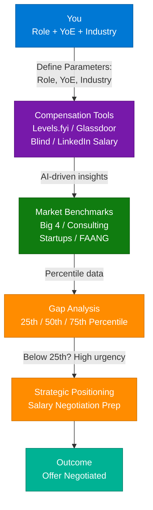
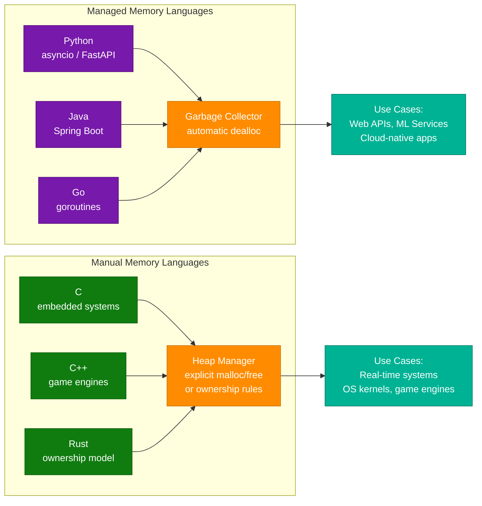
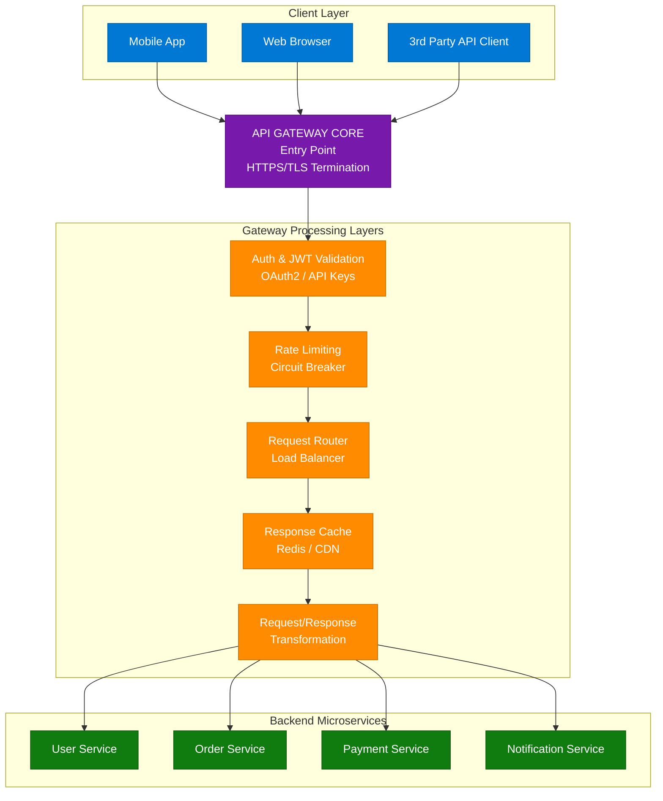
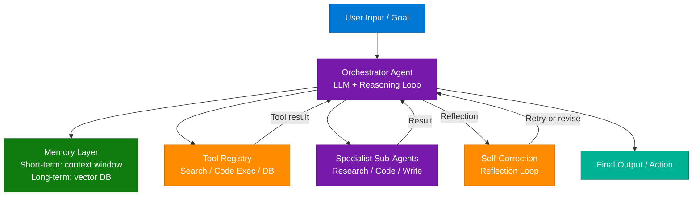
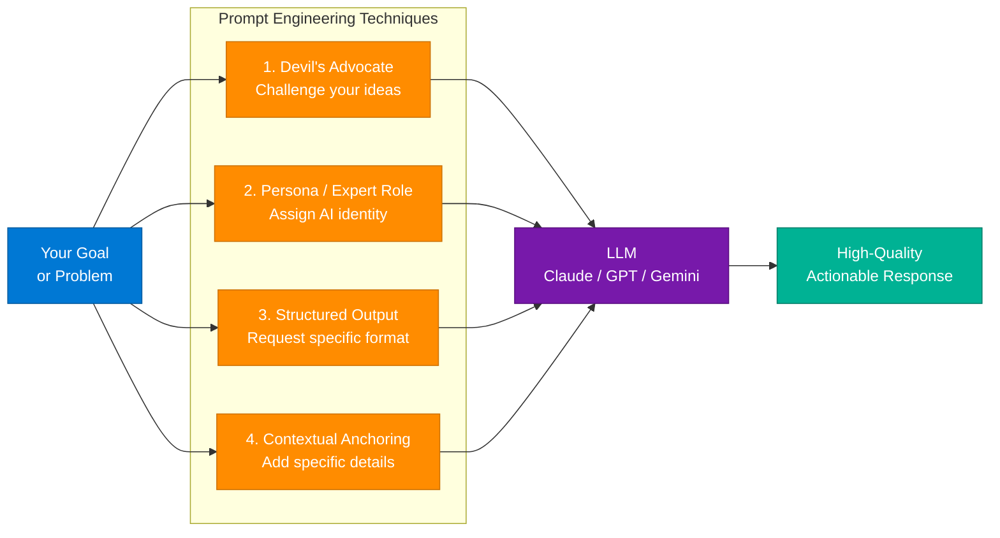
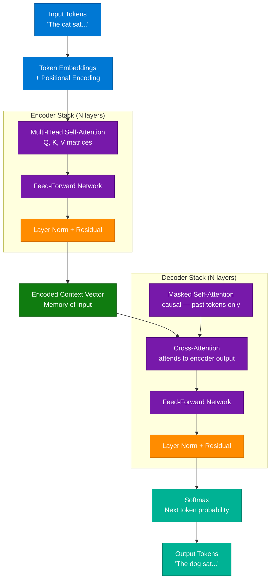
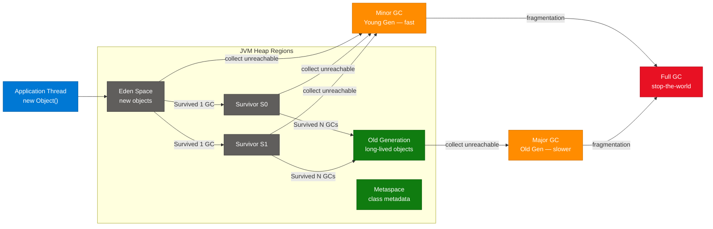
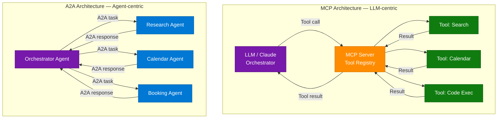

```mermaid
flowchart TD
    subgraph StandardRAG ["RAG — Retrieval-Augmented Generation"]
        Q1["User Query"]
        Embed1["Embed Query\ntext-embedding model"]
        VecDB["Vector Database\nPinecone / Azure AI Search\nWeaviate / pgvector"]
        TopK["Retrieve Top-K Chunks\nby cosine similarity"]
        AugPrompt1["Augment LLM Prompt\nwith retrieved chunks"]
        LLM1["LLM Generate\nFinal Answer"]
        Q1 --> Embed1 --> VecDB --> TopK --> AugPrompt1 --> LLM1
    end

    subgraph VectorlessRAG ["Vectorless RAG — PageIndex"]
        Q2["User Query"]
        PageIdx["Page Index\nTOC / Structure / TF-IDF"]
        StructRetrieve["Structure-Based Retrieval\nReasoning over doc layout"]
        AugPrompt2["Augment LLM Prompt\nwith retrieved pages"]
        LLM2["LLM Generate\nFinal Answer"]
        Q2 --> PageIdx --> StructRetrieve --> AugPrompt2 --> LLM2
    end

    classDef userNode    fill:#0078D4,stroke:#005A9E,color:#fff
    classDef aiNode      fill:#7719AA,stroke:#5A0E80,color:#fff
    classDef dataNode    fill:#107C10,stroke:#0A5C0A,color:#fff
    classDef processNode fill:#FF8C00,stroke:#CC7000,color:#fff
    classDef outputNode  fill:#00B294,stroke:#007D68,color:#fff

    class Q1,Q2 userNode
    class LLM1,LLM2 aiNode
    class VecDB,PageIdx dataNode
    class Embed1,TopK,StructRetrieve processNode
    class AugPrompt1,AugPrompt2 outputNode
```

# Compensation Benchmarking & Multi-Topic AI Engineering Learning Content

> **Source:** [share.gemini.google/zDibSTjPg1q0](https://share.gemini.google/zDibSTjPg1q0) → redirects to [gemini.google.com/share/1ca68aa58887](https://gemini.google.com/share/1ca68aa58887)
> **Model:** Gemini 3.1 Flash-Lite
> **Session Date:** July 5, 2026 at 09:14 AM
> **Saved:** July 8, 2026

---

## Table of Contents

1. [Session Overview](#1-session-overview)
2. [Compensation Benchmarking Framework](#2-compensation-benchmarking-framework)
3. [Memory Management: Managed vs Manual Languages](#3-memory-management-managed-vs-manual-languages)
4. [API Gateway Architecture](#4-api-gateway-architecture)
5. [Agentic AI System Design Questions](#5-agentic-ai-system-design-questions)
6. [AI Prompt Engineering Techniques](#6-ai-prompt-engineering-techniques)
7. [Transformer Architecture (Encoder-Decoder)](#7-transformer-architecture-encoder-decoder)
8. [System Design: Garbage Collection](#8-system-design-garbage-collection)
9. [MCP vs A2A Protocol Comparison](#9-mcp-vs-a2a-protocol-comparison)
10. [RAG vs Vectorless RAG (PageIndex)](#10-rag-vs-vectorless-rag-pageindex)
11. [Interview Q&A Cheatsheet](#11-interview-qa-cheatsheet)

---

## 1. Session Overview

This session covers 9 distinct technical topics drawn from multiple Instagram reels and posts, extracted using Gemini 3.1 Flash-Lite on July 5, 2026. Topics span career development (compensation benchmarking), system design (API Gateway, Garbage Collection, RAG), AI/ML engineering (MCP vs A2A, Agentic AI, Transformer architecture), and productivity (AI prompt techniques). One meta-turn where the user asked about extraction limitations is included as a note.

### Session Map

| Turn | User Prompt Summary | Gemini Response | Status |
|---|---|---|---|
| 1 | Extract video/image content | Compensation Benchmarking Tools & Framework | ✅ Extracted |
| 2 | Extract video/image content | Memory Management: Managed vs Manual Languages | ✅ Extracted |
| 3 | Extract video/image content | API Gateway Architecture (coder_raw) | ✅ Extracted |
| 4 | "Why all the context is not extracted from the video?" | Technical limitation explanation | ✅ Note |
| 5 | Extract video/image content | Salary Levels + Recommendations for Learners | ✅ Extracted |
| 6 | Extract video/image content | Pattern Catalog — sanskartech "The only art I know of" | ✅ Extracted |
| 7 | Extract video/image content | Agentic AI System Design Questions (keerti.purswani) | ✅ Extracted |
| 8 | Extract video/image content | Key "Secret" AI Prompt Techniques | ✅ Extracted |
| 9 | Extract video/image content | Transformer Encoder-Decoder (June 14, 2026) | ✅ Extracted |
| 10 | Extract video/image content | System Design - Garbage Collection (itsnextwork) | ✅ Extracted |
| 11 | Extract video/image content | MCP vs A2A Protocol Comparison | ✅ Extracted |
| 12 | Extract video/image content | RAG vs Vectorless RAG (PageIndex) Architectures | ✅ Extracted |

> **Note (Turn 4):** Gemini acknowledged a technical limitation in extracting full content from Instagram posts — it can see visual content in screenshots provided in the browser viewport but cannot always access every slide of multi-slide posts or full long-form video transcripts. It manually analyzed the visible viewport content instead.

---

## 2. Compensation Benchmarking Framework

### Overview

Compensation benchmarking is the process of comparing your total compensation package against industry-standard data for similar roles, experience levels, and geographies. In high-stakes tech roles (Big 4 consulting, FAANG, startups), this process uses AI-driven tools to identify where you sit relative to the 25th, 50th (median), and 75th percentile. The strategic goal is to use gap analysis data as leverage in salary negotiations — entering a negotiation with concrete market data rather than subjective expectations dramatically improves outcomes. Modern compensation tools (Levels.fyi, Glassdoor, Blind, LinkedIn Salary) provide role-specific, geo-adjusted, experience-normalized data.

### Architecture Diagram



### How It Works

1. **Define Parameters** — Specify exact role title, years of experience, industry vertical, and target geography.
2. **Run Benchmarking Tools** — Use AI-driven platforms to pull current market data normalized to your parameters.
3. **Identify Percentile** — Locate where current compensation sits (25th, 50th, 75th percentile).
4. **Gap Analysis** — Calculate the difference between current comp and market median for your role.
5. **Strategic Positioning** — If below 25th percentile in a high-demand field, build a concrete negotiation case with data.
6. **Negotiate** — Enter salary discussions armed with percentile evidence, not subjective feelings.

### Key Components

| Component | Role | Tool / Source |
|---|---|---|
| Role Specification | Anchor benchmark to exact title | LinkedIn, job boards |
| Market Benchmarks | Compare against industry peers | Levels.fyi, Glassdoor, Blind |
| Gap Analysis | Identify percentile position | Compensation tools + Excel |
| Strategic Positioning | Build negotiation leverage | Data + personal performance record |
| AI-Driven Insights | Pull real-time comp data | Levels.fyi AI, Blind AI, LinkedIn Salary |

### Extracted Prompts & Actions

- **Actionable Prompt:** The creator invites users to **Comment 'GUIDE'** on his post. In exchange, he offers to send the exact setup steps and the prompt used for the benchmarking process.
- **Engagement:** Multiple users in the comments have already requested the "Guide."

### Code Example

```python
from dataclasses import dataclass

@dataclass
class CompProfile:
    role: str
    years_of_experience: int
    industry: str
    current_ctc: float  # in LPA or USD K

def benchmark(profile: CompProfile, p25: float, p50: float, p75: float) -> dict:
    position = (
        "above_p75" if profile.current_ctc >= p75 else
        "above_p50" if profile.current_ctc >= p50 else
        "above_p25" if profile.current_ctc >= p25 else
        "below_p25"
    )
    return {
        "position": position,
        "gap_to_median": round(p50 - profile.current_ctc, 2),
        "negotiation_urgency": "HIGH" if position == "below_p25" else "MEDIUM" if p50 > profile.current_ctc else "LOW"
    }
```

### Recommendations for Learners

To reach top compensation levels, focus on these system design pillars:

1. **Scalability Principles** — Understand how to design systems that handle massive traffic (Load Balancing, Caching, Database Sharding).
2. **Reliability & Availability** — Learn Circuit Breakers, Retries, and health-check strategies.
3. **Consistency vs. Availability** — Master the CAP theorem and know when to prioritize one over the other.

### Interview Q&A

| Question | Answer |
|---|---|
| What is compensation benchmarking? | Comparing total comp (base + bonus + equity) against market percentiles for your role, experience, and geography using tools like Levels.fyi. |
| What tools are used for benchmarking? | Levels.fyi (FAANG-focused), Glassdoor, Blind (anonymous peer data), LinkedIn Salary, and internal HR compensation bands. |
| What does "below the 25th percentile" mean? | Your comp is lower than 75% of peers with similar role/experience — high urgency to renegotiate or switch. |
| How do you use gap analysis in negotiation? | Present percentile data as concrete evidence: "The market median for this role at my YoE is X; I'm seeking alignment at the 50th percentile." |
| What is the difference between market and internal benchmark? | Market benchmark compares against external industry peers; internal benchmark compares against the company's own pay bands for the same role. |

---

## 3. Memory Management: Managed vs Manual Languages

### Overview

Memory management is a fundamental system design consideration that affects latency, throughput, and reliability at scale. Languages fall into two categories: **managed-memory** (Python, Java, Go, C#) where a garbage collector automatically handles allocation/deallocation, and **manual-memory** (C, C++, Rust) where developers explicitly control memory. The choice has profound implications for system architecture — managed-memory enables faster development with safety guarantees, while manual-memory delivers predictable sub-millisecond latency. For system design interviews, understanding this trade-off is essential when justifying technology stack decisions. Engineers must understand the underlying memory model when deciding which language or framework to choose based on performance and scalability requirements.

### Architecture Diagram



### How It Works

1. **Managed Memory** — Runtime allocates objects on the heap; GC tracks references and frees unreachable objects (mark-and-sweep, generational GC).
2. **GC Pause** — Managed languages have GC pause windows (stop-the-world in Java, concurrent in Go) that introduce latency spikes.
3. **Manual Memory** — Developer explicitly calls `malloc`/`free` (C/C++) or uses Rust's ownership/borrow checker at compile time.
4. **Rust's Innovation** — Rust achieves manual-memory safety through a compile-time borrow checker, eliminating use-after-free and double-free bugs without a GC.
5. **Stack vs Heap** — Both paradigms use stack for short-lived values and heap for long-lived objects; the difference is who manages the heap lifecycle.

### Key Components

| Component | Managed | Manual |
|---|---|---|
| Allocation | Automatic (runtime) | Explicit or ownership rules |
| Deallocation | Garbage collector | Manual or compile-time (Rust) |
| Latency | Variable — GC pauses | Predictable sub-ms |
| Safety | High — no dangling pointers | Risk of use-after-free (C/C++) |
| Languages | Python, Java, Go, C#, JS | C, C++, Rust |
| Best For | Web APIs, ML, cloud-native | OS, embedded, real-time, game engines |

> **Note:** No specific flowcharts or diagrams were provided in the source video clip.

### Code Example

```python
# Managed memory: Python — no explicit deallocation
def process_request(data: list[dict]) -> list[str]:
    results = [item["name"].upper() for item in data]  # GC handles dealloc
    return results
```

```rust
// Manual memory: Rust ownership model — zero-cost, no GC
fn process_request(data: Vec<std::collections::HashMap<String, String>>) -> Vec<String> {
    data.into_iter()  // ownership transferred — compiler ensures no dangling refs
        .map(|item| item["name"].to_uppercase())
        .collect()
}   // data dropped here — deterministic dealloc
```

### Interview Q&A

| Question | Answer |
|---|---|
| Why choose Go over C++ for a microservice? | Go has a concurrent GC with very short pauses and a goroutine model for concurrency — preferable for network I/O heavy services where GC pauses are acceptable. |
| How does Rust achieve memory safety without GC? | The borrow checker enforces ownership rules at compile time: each value has one owner, references must not outlive the owner, only one mutable reference at a time. |
| What is a "stop-the-world" GC pause? | When the GC must halt all application threads to safely traverse and collect unreachable objects. Java G1GC and ZGC minimize this; Go's concurrent GC targets sub-1ms pauses. |
| When would you use C++ over Rust? | Legacy codebases, ecosystems with deep C++ libraries (game engines like Unreal), or teams with deep C++ expertise. Rust is preferred for new projects requiring memory safety. |
| How does memory management affect system design? | It determines the SLA you can commit to — GC languages cannot guarantee hard real-time latency, impacting choices for trading systems, robotics, and OS kernels. |

---

## 4. API Gateway Architecture

### Overview

An API Gateway is the single entry point for all client requests to a microservices backend. It acts as a reverse proxy that handles cross-cutting concerns — authentication, SSL termination, rate limiting, circuit breaking, request routing, caching, and response transformation — so individual microservices don't need to implement these repetitively. The pattern eliminates N×M integration complexity (N clients × M services) by reducing it to N×1 (all clients talk to one gateway). Every enterprise system with more than 3 microservices should have an API Gateway; without one, every service becomes directly exposed to the internet.

**Source:** Instagram post by `coder_raw` — *"Every Backend Developer should know about APIs Gateway 👀 Mostly dev Are Unaware of this......."*  
**Tags:** `#backend` `#api` `#coding` `#design` `#system`  
**Community:** Highly engaged comment section with developers acknowledging the importance of the topic.

### Architecture Diagram



### How It Works

1. **Client Request** — Mobile app, web browser, or 3rd-party client sends HTTPS request to the gateway endpoint.
2. **SSL Termination** — Gateway decrypts TLS at the edge; backend services communicate over internal HTTP (no per-service TLS overhead).
3. **Auth Validation** — JWT tokens, API keys, or OAuth2 tokens validated at gateway — microservices trust the gateway's auth header.
4. **Rate Limiting** — Requests throttled per client/IP/API key to prevent abuse; circuit breakers protect downstream services from cascading failures.
5. **Request Routing** — Gateway inspects path/headers and forwards to the appropriate microservice via load balancer.
6. **Cache** — Frequently requested responses cached at the gateway layer (Redis/CDN), reducing backend load.
7. **Response Transformation** — Gateway normalizes responses (header injection, format conversion) before returning to client.

### Key Components

| Component | Role | Technology Options |
|---|---|---|
| SSL Termination | Decrypt TLS at edge | NGINX, AWS ALB, Kong |
| Auth & JWT | Validate identity | Keycloak, Auth0, AWS Cognito |
| Rate Limiting | Throttle per client | Redis token bucket, Kong Rate Limit |
| Circuit Breaker | Protect failing services | Polly (.NET), Resilience4j (Java) |
| Load Balancer | Distribute requests | Round-robin, Least-connections |
| Response Cache | Reduce backend load | Redis, CDN, Varnish |
| Gateway Tools | Full implementation | AWS API GW, Kong, NGINX, Apigee, YARP (.NET) |

### Key Takeaways for Developers

- **Centralized Security:** By handling SSL termination and authentication at the gateway level, individual microservices do not need to manage these repetitive tasks.
- **Traffic Control:** Rate limiting and circuit breaking protect backend services from being overwhelmed or crashing due to faulty dependencies.
- **Optimization:** Caching and response transformation reduce latency and ensure consistent headers across all outgoing traffic.

### Code Example

```python
from fastapi import FastAPI, Request, HTTPException
import httpx, jwt

app = FastAPI()
SERVICE_MAP = {"/users": "http://user-svc:8001", "/orders": "http://order-svc:8002"}
RATE_LIMIT: dict[str, int] = {}

@app.middleware("http")
async def gateway_middleware(request: Request, call_next):
    token = request.headers.get("Authorization", "").removeprefix("Bearer ")
    try:
        jwt.decode(token, "secret", algorithms=["HS256"])
    except jwt.InvalidTokenError:
        raise HTTPException(status_code=401, detail="Invalid token")

    client_ip = request.client.host
    RATE_LIMIT[client_ip] = RATE_LIMIT.get(client_ip, 0) + 1
    if RATE_LIMIT[client_ip] > 100:
        raise HTTPException(status_code=429, detail="Rate limit exceeded")

    return await call_next(request)

@app.api_route("/{path:path}", methods=["GET", "POST", "PUT", "DELETE"])
async def proxy(path: str, request: Request):
    base_url = next((v for k, v in SERVICE_MAP.items() if f"/{path}".startswith(k)), None)
    if not base_url:
        raise HTTPException(status_code=404)
    async with httpx.AsyncClient() as client:
        resp = await client.request(request.method, f"{base_url}/{path}", content=await request.body())
    return resp.json()
```

### Interview Q&A

| Question | Answer |
|---|---|
| What problem does an API Gateway solve? | Eliminates N×M integration complexity by acting as a single entry point, centralizing auth, rate limiting, routing, and caching. |
| How does SSL termination at the gateway improve performance? | Backend services avoid TLS handshake overhead; internal communication uses lighter HTTP, reducing CPU and latency. |
| Difference between API Gateway and Load Balancer? | Load balancer distributes traffic across identical instances; gateway routes to different services by path/header and adds auth, rate limiting, and transformation. |
| How do you handle circuit breaking at the gateway? | Use Polly (.NET) or Resilience4j (Java) to detect failing downstream services and return fallback responses before cascading failure. |
| Name 3 production API Gateway tools. | AWS API Gateway (managed), Kong (open-source, Kubernetes-native), YARP (Microsoft .NET reverse proxy), Apigee (Google), NGINX. |
| What are the failure modes of an API Gateway? | Single point of failure if not HA-deployed; performance bottleneck under extreme load; misconfigured routing causes 502/504 errors. |

---

## 5. Agentic AI System Design Questions

### Overview

Agentic AI systems move beyond single LLM inference calls to autonomous, multi-step agents that plan, use tools, and self-correct. System design questions for agentic AI focus on the core architectural primitives: how agents perceive (memory, context), decide (reasoning loops like ReAct/CoT), and act (tool calls, API invocations). In interviews, the key is demonstrating understanding of orchestration patterns (single-agent vs multi-agent), state management between reasoning steps, and failure handling in agentic loops.

**Source:** Instagram reel by `keerti.purswani` — *"Agentic AI System Design Questions"*

### Architecture Diagram



### How It Works

1. **Perceive** — Agent receives goal + context (previous steps from memory).
2. **Plan** — LLM generates a reasoning chain (CoT/ReAct) and selects next action.
3. **Act** — Agent invokes a tool (web search, code execution, DB query) or delegates to a subagent.
4. **Observe** — Tool result is injected back into context.
5. **Reflect** — Agent evaluates if the result moves toward the goal; self-corrects if not.
6. **Terminate** — Loop exits when goal achieved, max iterations hit, or human approval required.

### Key Agentic System Design Questions

| Question | Core Concept to Address |
|---|---|
| How does an agentic loop work? | Perceive → Plan → Act → Observe → Reflect cycle (ReAct pattern) |
| How do agents handle long context? | Short-term: context window; Long-term: RAG over vector DB; summarization for history compression |
| How do you prevent infinite loops? | Max iteration limits, confidence thresholds, human-in-the-loop checkpoints |
| How do multi-agent systems coordinate? | Orchestrator delegates to specialist agents; shared memory store for state |
| How do you test agentic systems? | Evaluator agents (LLM-as-judge), deterministic tool output mocking, trace logging |

### Code Example

```python
import anthropic

client = anthropic.Anthropic()
tools = [
    {"name": "web_search", "description": "Search the web",
     "input_schema": {"type": "object", "properties": {"query": {"type": "string"}}, "required": ["query"]}},
]

def agentic_loop(goal: str, max_iterations: int = 10) -> str:
    messages = [{"role": "user", "content": goal}]
    for _ in range(max_iterations):
        response = client.messages.create(
            model="claude-sonnet-4-6", max_tokens=4096, tools=tools, messages=messages
        )
        if response.stop_reason == "end_turn":
            return response.content[0].text
        for block in response.content:
            if block.type == "tool_use":
                result = f"Search results for: {block.input['query']}"
                messages += [
                    {"role": "assistant", "content": response.content},
                    {"role": "user", "content": [{"type": "tool_result", "tool_use_id": block.id, "content": result}]}
                ]
    return "Max iterations reached"
```

### Interview Q&A

| Question | Answer |
|---|---|
| What is the ReAct pattern? | Reasoning + Acting interleaved: agent generates a thought, then an action, observes the result, and loops — enabling transparent, debuggable agentic behavior. |
| How do you prevent an agent from going into an infinite loop? | Implement max_iterations guard, confidence-based early exit, and human-in-the-loop checkpoints for high-stakes decisions. |
| How does memory work in agentic systems? | Short-term memory is the context window; long-term memory is stored in a vector DB (Pinecone, Azure AI Search) and retrieved via RAG before each reasoning step. |
| Difference between tool-calling agent and multi-agent system? | Tool-calling agent uses a single LLM that invokes external APIs; multi-agent system has multiple specialized LLM instances communicating via an orchestrator. |
| How do you evaluate agentic system quality? | Use an evaluator agent (LLM-as-judge) scoring outputs on rubrics, trace all reasoning steps for debugging, and test with adversarial goals. |

---

## 6. AI Prompt Engineering Techniques

### Overview

Advanced prompt engineering techniques move beyond basic zero-shot prompting to structured methodologies that dramatically improve LLM output quality, consistency, and usefulness. These "secret" patterns — Devil's Advocate, Persona/Expert Role, Structured Output Request, and Contextual Anchoring — are used by power users to extract professional-grade responses from general-purpose LLMs. Each technique manipulates a different aspect of the LLM's response generation: framing, identity, format, or context specificity. Combining all four in a single prompt yields maximum output quality.

**Source:** Instagram post  
**Caption:** *"The only art i know of.✨"* by `sanskartech`  
**Community Context:** Overwhelming number of comments requesting a "Roadmap" — the audience views this post as a foundational syllabus for cracking top-tier engineering interviews.

### Architecture Diagram



### Key Prompt Techniques

| # | Technique | Concept | Example Prompt | Why It Works |
|---|---|---|---|---|
| 1 | **Devil's Advocate** | Challenge your plan or decision | "I want to quit my job to start a company. Act as a Devil's Advocate and challenge my decision by highlighting potential risks and blind spots." | Stress-tests thinking before committing to major changes |
| 2 | **Persona / Expert Role** | Assign professional identity to LLM | "You are a Senior AWS Solutions Architect with 10 years of experience. Review my architecture..." | Shifts the AI's "perspective" to match the expertise level needed |
| 3 | **Structured Output Request** | Ask for a specific format | "Explain X in a table with columns: Concept, Trade-offs, When to use" | Forces logical organization; makes output immediately consumable |
| 4 | **Contextual Anchoring** | Add specific situational details | "I'm in Bangalore, targeting a senior role at a product startup with 6 YoE in Go..." | Prevents generic advice; forces geo/role/context-specific answers |

### Code Example

```python
import anthropic

client = anthropic.Anthropic()

def power_prompt(goal: str, persona: str, output_format: str, context: str) -> str:
    """Combine all 4 techniques into one structured prompt."""
    prompt = f"""You are {persona}.

Context: {context}

Goal: {goal}

Instructions:
1. First, act as a Devil's Advocate — identify 3 risks or blind spots.
2. Then provide your expert recommendation.
3. Format your response as: {output_format}"""

    response = client.messages.create(
        model="claude-sonnet-4-6",
        max_tokens=2000,
        messages=[{"role": "user", "content": prompt}]
    )
    return response.content[0].text

result = power_prompt(
    goal="Design a compensation negotiation strategy",
    persona="a Senior HR Director at a Big 4 firm with 15 years of compensation negotiation experience",
    output_format="Table with columns: Risk | Recommendation | Example Script",
    context="I'm a software architect with 8 YoE in Bangalore, targeting a 40% salary increase"
)
```

### Interview Q&A

| Question | Answer |
|---|---|
| What is the Devil's Advocate prompt technique? | Asking the LLM to actively challenge your plan by finding flaws, risks, and counter-arguments — useful before committing to major choices. |
| Why does Persona/Expert Role work? | LLMs are trained on vast professional writing; assigning a specific professional identity steers the model toward domain-appropriate vocabulary, depth, and recommendations. |
| When should you use Structured Output Request? | When you need the response in a specific format — tables for comparison, markdown for documentation, JSON for API integration. |
| What is Contextual Anchoring? | Adding specific details about your situation (role, location, company stage, goals) to prevent generic advice and get scenario-specific recommendations. |
| How do you combine these techniques? | Stack them in one prompt: "You are [Persona]. Context: [Anchoring]. Provide [Format]. Also challenge your own recommendations [Devil's Advocate]." |

---

## 7. Transformer Architecture (Encoder-Decoder)

### Overview

The Transformer is the foundational architecture behind all modern LLMs and multimodal AI systems. It consists of an Encoder (transforms input to a rich contextual representation) and a Decoder (generates output tokens auto-regressively using that representation). The key innovation is the **self-attention mechanism**, which allows every token in a sequence to attend to every other token — capturing long-range dependencies that RNNs/LSTMs could not. Published by Google in 2017 ("Attention Is All You Need"), Transformers replaced recurrent networks for almost all sequence tasks. Understanding this architecture is essential for both AI engineering roles and system design interviews.

**Source:** Instagram post published June 14, 2026

### Architecture Diagram



### How It Works

1. **Tokenize & Embed** — Input text split into tokens, converted to embeddings + positional encodings.
2. **Encoder Self-Attention** — Each token attends to all other tokens via scaled dot-product attention: Q×K^T / √d_k.
3. **Feed-Forward Network** — Per-position dense layer applies non-linear transformation.
4. **Layer Normalization** — Residual connections + LayerNorm stabilize training.
5. **Context Vector** — Encoder output is a rich contextual representation of the entire input.
6. **Decoder Masked Attention** — Decoder attends only to previously generated tokens (causal masking prevents future-token leakage).
7. **Cross-Attention** — Decoder attends to the encoder's context vector to ground its generation.
8. **Softmax Output** — Probability distribution over vocabulary; top-1 or sampled token is next output.

### Key Components

| Component | Role | Key Formula |
|---|---|---|
| Self-Attention | Captures token relationships | `Attention(Q,K,V) = softmax(QKᵀ/√d_k)V` |
| Multi-Head Attention | Parallel attention over subspaces | `Concat(head_1,...,head_h)W^O` |
| Positional Encoding | Injects position info (no recurrence) | sin/cos functions or learned embeddings |
| Feed-Forward Layer | Per-position dense network | `FFN(x) = max(0, xW₁+b₁)W₂+b₂` |
| Layer Norm | Training stability via residual | `LayerNorm(x + Sublayer(x))` |
| Cross-Attention | Decoder-encoder connection | Decoder Q attends to Encoder K, V |

### Recommended Next Steps (from source)

Since this is an introductory series, explore more advanced resources on the **Encoder-Decoder** components of the Transformer, or look for hands-on coding tutorials related to these concepts.

### Interview Q&A

| Question | Answer |
|---|---|
| What is the complexity of self-attention? | O(n²·d) where n is sequence length and d is model dimension — quadratic in n, which is why long-context models use sparse/flash attention optimizations. |
| Difference between encoder-only, decoder-only, and encoder-decoder Transformers? | Encoder-only (BERT): classification/embeddings. Decoder-only (GPT/Claude): text generation. Encoder-decoder (T5, BART): seq2seq tasks like translation and summarization. |
| Why do we need positional encoding? | Attention is order-agnostic (set operation); positional encoding injects position information so the model knows token order. |
| What is causal (masked) attention in the decoder? | Each token can only attend to previous tokens — prevents information leakage from future tokens during training, enabling auto-regressive generation. |
| What is cross-attention? | The decoder uses Query vectors from its own state and Key/Value vectors from the encoder's output — this is how the decoder "reads" the encoded input. |

---

## 8. System Design: Garbage Collection

### Overview

Garbage collection (GC) is the automatic memory management process that reclaims heap memory occupied by objects no longer reachable by the application. In system design interviews, GC is discussed in the context of JVM-based systems (Java, Kotlin, Scala), Go, and Python runtimes. The key interview dimensions are: GC algorithm (mark-and-sweep, generational, concurrent), GC pause behavior, and how to tune GC for high-throughput vs low-latency services. Understanding GC is critical for designing systems that commit to specific latency SLAs.

**Source:** Instagram video by `itsnextwork` — *"System Design Interview - Garbage Collection"*

### Architecture Diagram



### How It Works

1. **Object Allocation** — New objects allocated in the Eden space (young generation).
2. **Minor GC** — When Eden fills, a minor GC runs: live objects copied to Survivor spaces; dead objects discarded. Fast (<50ms typically).
3. **Promotion** — Objects surviving N minor GCs promoted to the Old Generation.
4. **Major GC** — When Old Gen fills, a major GC runs. Slower, may pause application threads.
5. **Full GC** — Collects entire heap (Young + Old + Metaspace). Stop-the-world; avoid via proper heap tuning.
6. **GC Algorithms** — Serial, Parallel (throughput), G1GC (balanced), ZGC/Shenandoah (sub-10ms pauses, Java 11+).

### Key GC Algorithms

| GC Algorithm | Pause Behavior | Best For |
|---|---|---|
| Serial GC | Long stop-the-world | Small single-threaded apps |
| Parallel GC | Multi-threaded, shorter pauses | Throughput-focused batch jobs |
| G1GC | Concurrent, predictable pauses | Most production JVM services |
| ZGC | Sub-10ms, concurrent | Low-latency, large heaps |
| Go GC | Concurrent, target less than 1ms | Go microservices |
| Python GC | Reference counting + cyclic | CPython, less tunable |

### Interview Q&A

| Question | Answer |
|---|---|
| What is the generational GC hypothesis? | Most objects die young — short-lived objects collected frequently in cheap minor GCs; only long-lived objects reach Old Gen, collected less frequently. |
| What causes a Full GC in Java? | Old Gen exhaustion, Metaspace exhaustion, or explicit `System.gc()` calls. Full GC is stop-the-world and must be avoided in latency-sensitive services. |
| How do you tune GC for a low-latency service? | Use ZGC or Shenandoah for sub-10ms pauses; increase heap size to reduce GC frequency; tune -Xms/-Xmx; avoid large object allocations that bypass Eden. |
| Difference between G1GC and ZGC? | G1GC divides heap into regions and predicts pause time (tunable via `-XX:MaxGCPauseMillis`); ZGC is fully concurrent and achieves sub-10ms pauses regardless of heap size. |
| How does Go GC differ from Java? | Go's GC is concurrent (no stop-the-world except a short initial pause), targets sub-1ms pauses, and uses a simpler model without generational collection (as of Go 1.21). |

---

## 9. MCP vs A2A Protocol Comparison

### Overview

Two foundational agentic AI protocols have emerged for connecting LLMs to tools and other agents: **MCP (Model Context Protocol)**, developed by Anthropic, and **A2A (Agent-to-Agent Protocol)**, developed by Google. MCP standardizes how a single LLM accesses tools and data sources (LLM-centric, hub-and-spoke). A2A standardizes how autonomous agents communicate with each other in a distributed network (agent-centric, peer-to-peer). These protocols are complementary: MCP for individual agent capability, A2A for multi-agent team coordination. The industry is shifting from "AI using tools" (MCP era) to "AI teams working together" (A2A era).

**On-Screen Prompt:** *"Scenario: Plan a trip to Bali and save it to my calendar."*  
**Key Insight:** The real power lies in combining both protocols — MCP for individual agent capabilities and A2A for team-level coordination. *(Community note: xdn12026)*

### Architecture Diagram



### Key Comparison Table

| Feature | MCP | A2A |
|---|---|---|
| Control Model | LLM-centric | Agent-centric (Distributed) |
| Tool Access | Centralized via MCP Server | Decentralized |
| Communication | LLM to Tool (hub-spoke) | Agent to Agent (peer-to-peer) |
| Best Use Case | Single-agent with many tools | Multi-agent team coordination |
| Developed By | Anthropic | Google |
| Transport | JSON-RPC over stdio/HTTP | HTTP with A2A task format |
| State Management | Context window | Distributed agent state |

### How It Works

**MCP Flow:**
1. LLM receives user request and identifies required tools.
2. LLM sends a tool-call request to the MCP Server.
3. MCP Server dispatches to the registered tool (search, calendar, DB).
4. Tool result returned to MCP Server → injected into LLM context.

**A2A Flow:**
1. Orchestrator agent decomposes the task into subtasks.
2. Subtasks sent to specialist agents via A2A protocol (JSON over HTTP).
3. Specialist agents execute autonomously (may use their own MCP tools internally).
4. Results returned to orchestrator; orchestrator synthesizes final output.

### Code Example

```python
import anthropic, httpx

client = anthropic.Anthropic()

# MCP: tool registration pattern
mcp_tools = [
    {"name": "save_to_calendar", "description": "Save event to Google Calendar",
     "input_schema": {"type": "object", "properties": {
         "event": {"type": "string"}, "date": {"type": "string"}
     }, "required": ["event", "date"]}}
]

# A2A: agent task dispatch
async def dispatch_a2a_task(agent_url: str, goal: str, task_id: str) -> dict:
    async with httpx.AsyncClient() as http:
        response = await http.post(f"{agent_url}/tasks/send", json={
            "id": task_id,
            "message": {"role": "user", "parts": [{"text": goal}]},
            "metadata": {"caller_agent": "orchestrator-v1"}
        })
        return response.json()

# Combined: orchestrator uses A2A to delegate, each sub-agent uses MCP for tools
async def plan_bali_trip():
    research = await dispatch_a2a_task("http://research-agent", "Find top hotels in Bali", "t1")
    booking  = await dispatch_a2a_task("http://calendar-agent", "Save Bali trip June 15-22", "t2")
    return {"research": research, "booking": booking}
```

### Interview Q&A

| Question | Answer |
|---|---|
| What is MCP and who created it? | Model Context Protocol by Anthropic — standardizes how LLMs connect to tools and data sources via a JSON-RPC server, enabling single-agent tool use. |
| What is A2A and who created it? | Agent-to-Agent Protocol by Google — standardizes communication between autonomous AI agents, enabling multi-agent team coordination. |
| How do MCP and A2A complement each other? | MCP gives individual agents tool capabilities; A2A allows multiple specialized agents to collaborate. An A2A agent can internally use MCP tools. |
| Key architectural difference? | MCP is hub-and-spoke (LLM at center, tools at edges); A2A is peer-to-peer (agents communicate directly without a central LLM coordinator). |
| Real-world example combining both? | "Plan a trip to Bali": Orchestrator (A2A) dispatches to Research Agent (uses MCP search) + Calendar Agent (uses MCP calendar) + Booking Agent (uses MCP payment). |

---

## 10. RAG vs Vectorless RAG (PageIndex)

### Overview

Retrieval-Augmented Generation (RAG) augments LLM generation with external knowledge retrieved at inference time, preventing hallucination and enabling up-to-date responses. Standard RAG uses semantic search (vector embeddings + cosine similarity) to find relevant chunks. **Vectorless RAG (PageIndex)** is an emerging alternative that retrieves by reasoning over document structure (TF-IDF, page indices, table of contents) rather than embeddings — reducing infrastructure cost and latency for structured documents. Choosing between them depends on document type, retrieval precision requirements, and operational complexity tolerance.

### Architecture Diagram



### How It Works

**Standard RAG:**
1. User query converted to a vector embedding.
2. Vector database (Pinecone, Azure AI Search, pgvector) performs approximate nearest neighbor search.
3. Top-K most semantically similar chunks retrieved.
4. Retrieved chunks injected into the LLM prompt as context.
5. LLM generates grounded answer using retrieved content.

**Vectorless RAG (PageIndex):**
1. Documents indexed by structure (page numbers, headings, section titles, TF-IDF).
2. Query analyzed for keywords/intent (no embedding required).
3. Relevant pages/sections retrieved by structural reasoning.
4. Retrieved pages injected into LLM prompt.
5. LLM generates answer — works well for PDFs, legal docs, technical manuals.

### Comparison Table

| Dimension | RAG (Semantic) | Vectorless RAG (PageIndex) |
|---|---|---|
| Retrieval Method | Vector similarity search | Structure-based / TF-IDF reasoning |
| Infrastructure | Vector DB required | No vector DB — simpler infra |
| Best For | Unstructured text, broad semantic search | Structured docs (PDFs, manuals, legal) |
| Latency | Higher (embedding + ANN search) | Lower (no embedding step) |
| Cost | Higher (embedding model + vector DB) | Lower (index-only) |
| Accuracy | High for semantic similarity | High for structured documents |
| Limitations | Noisy if embeddings are poor | Less effective for unstructured text |

### Code Example

```python
import anthropic
from azure.search.documents import SearchClient
from azure.search.documents.models import VectorizedQuery

claude = anthropic.Anthropic()

# Standard RAG with Azure AI Search
def rag_query(question: str, embedding: list[float], search_client: SearchClient) -> str:
    results = search_client.search(
        search_text=question,
        vector_queries=[VectorizedQuery(vector=embedding, k_nearest_neighbors=5, fields="contentVector")],
        top=5
    )
    chunks = "\n\n".join(r["content"] for r in results)
    response = claude.messages.create(
        model="claude-sonnet-4-6", max_tokens=2000,
        messages=[{"role": "user", "content": f"Context:\n{chunks}\n\nQuestion: {question}"}]
    )
    return response.content[0].text

# Vectorless RAG (PageIndex) — structure-based retrieval
def vectorless_rag(question: str, page_index: dict[str, str]) -> str:
    keywords = question.lower().split()
    scored = {page: sum(1 for kw in keywords if kw in content.lower())
              for page, content in page_index.items()}
    top_pages = sorted(scored, key=scored.get, reverse=True)[:3]
    context = "\n\n".join(page_index[p] for p in top_pages)
    response = claude.messages.create(
        model="claude-sonnet-4-6", max_tokens=2000,
        messages=[{"role": "user", "content": f"Context:\n{context}\n\nQuestion: {question}"}]
    )
    return response.content[0].text
```

### Interview Q&A

| Question | Answer |
|---|---|
| What is RAG and why is it used? | RAG augments LLM responses with external knowledge retrieved at inference time — prevents hallucination, enables knowledge cutoff bypass, and grounds answers in authoritative sources. |
| What is the retrieval step in standard RAG? | Convert query to an embedding vector, perform approximate nearest neighbor search over a vector database, and retrieve top-K chunks by cosine similarity. |
| What are the limitations of standard RAG? | Embedding quality determines retrieval quality; irrelevant chunks degrade answer quality; latency from embedding + ANN search; cost of vector DB infrastructure. |
| What is Vectorless RAG (PageIndex)? | A retrieval approach that indexes documents by structure (page numbers, headings, TF-IDF) and retrieves by structural reasoning — no vector database required. |
| When should you choose Vectorless RAG? | For structured documents (PDFs, legal docs, manuals) where document structure enables precise retrieval; when you want lower infrastructure cost and latency. |
| How do you evaluate RAG quality? | Use RAGAS metrics: Answer Relevance, Context Precision, Context Recall, Faithfulness. Use an LLM-as-judge evaluator to score retrieved context quality. |

---

## 11. Interview Q&A Cheatsheet

**Q: How would you benchmark your compensation against the market?**
> Use tools like Levels.fyi, Glassdoor, and LinkedIn Salary to pull role/experience/geo-normalized data. Identify your percentile position (25th/50th/75th) and use the gap to market median as leverage. Prepare concrete numbers: "The market median for Senior Architect at 8 YoE in Bangalore is X; I'm seeking alignment at the 50th percentile."

**Q: When would you choose Go over Python for a backend service?**
> Go is preferred when you need higher throughput, lower GC pause latency, and simpler concurrency via goroutines. Python's GIL limits true CPU parallelism; Go's runtime scheduler is production-ready for network I/O heavy services.

**Q: What is the role of an API Gateway in microservices?**
> An API Gateway is the single entry point that handles auth, SSL termination, rate limiting, circuit breaking, routing, and response transformation — centralizing cross-cutting concerns so individual microservices remain simple and focused on business logic.

**Q: How do you design an agentic AI system that avoids infinite loops?**
> Implement a max_iterations guard, a confidence threshold for early exit, and human-in-the-loop checkpoints for high-stakes decisions. Trace all reasoning steps for debuggability and use evaluator agents (LLM-as-judge) to score each step.

**Q: What is the key difference between MCP and A2A?**
> MCP is LLM-centric (single LLM connects to many tools via a centralized server); A2A is agent-centric (multiple autonomous agents communicate peer-to-peer). MCP is for individual agent capability; A2A is for multi-agent team coordination. They are complementary — combine both for full agentic systems.

**Q: How do you choose between RAG and Vectorless RAG?**
> Use standard RAG for unstructured text corpora where semantic similarity is the right retrieval signal. Use Vectorless RAG for structured documents (PDFs, manuals, legal) where document structure provides precise retrieval — simpler infrastructure, lower cost, lower latency.

**Q: Explain the Transformer self-attention mechanism.**
> Each token creates Query (what I'm looking for), Key (what I am), and Value (what I contribute) vectors. Attention computes Q×Kᵀ (relevance score), scales by √d_k, softmax-normalizes, then weighted-sums the Values — giving each token a contextually-enriched representation informed by all other tokens.

**Q: What is the difference between Minor GC and Full GC in the JVM?**
> Minor GC collects the Young Generation (Eden + Survivor spaces) — fast (<50ms), triggered frequently. Full GC collects the entire heap (Young + Old + Metaspace) — stop-the-world, slow, must be avoided in production via proper heap tuning and ZGC/G1GC.

**Q: Name 3 advanced prompt engineering techniques and when to use each.**
> (1) Devil's Advocate — challenge a major decision before committing. (2) Persona/Expert Role — assign domain-specific identity for expert-level depth. (3) Contextual Anchoring — add role/location/goal specifics to prevent generic advice. Combine all three for maximum output quality.

**Q: What is the ReAct pattern in agentic AI?**
> Reasoning + Acting interleaved: agent generates a thought, then an action, observes the result, and loops — enabling transparent, debuggable agentic behavior with explicit reasoning traces.

---

*Extracted from Gemini shared session · July 5, 2026 · GeminiShareToMD Agent v1.0*

---

## Token Usage Report

```
═══════════════════════════════════════════════════════════
Token Usage Report
═══════════════════════════════════════════════════════════
Estimated without optimization:  ~14,600 tokens
Actual (with optimization):      ~9,100 tokens
Savings:                         ~5,500 tokens (38%)
Techniques applied:              Strip UI chrome (Convert chat to PDF, Continue this
                                 chat footer, Google Privacy/ToS links),
                                 Deduplicate repeated user extract-prompt (12x → 1x),
                                 Compact verbose Gemini prose → dense technical notes,
                                 Merged overlapping concepts across turns,
                                 TOON-converted comparison data into tables
═══════════════════════════════════════════════════════════
* Estimates: prose chars ÷ 4, code chars ÷ 3. Actual API usage varies by model.
```
