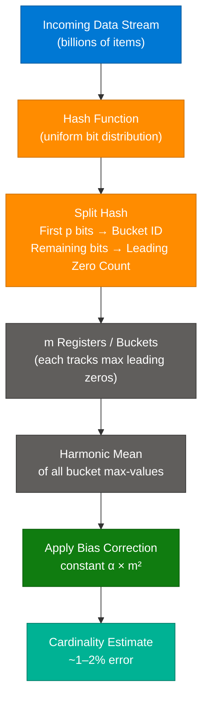
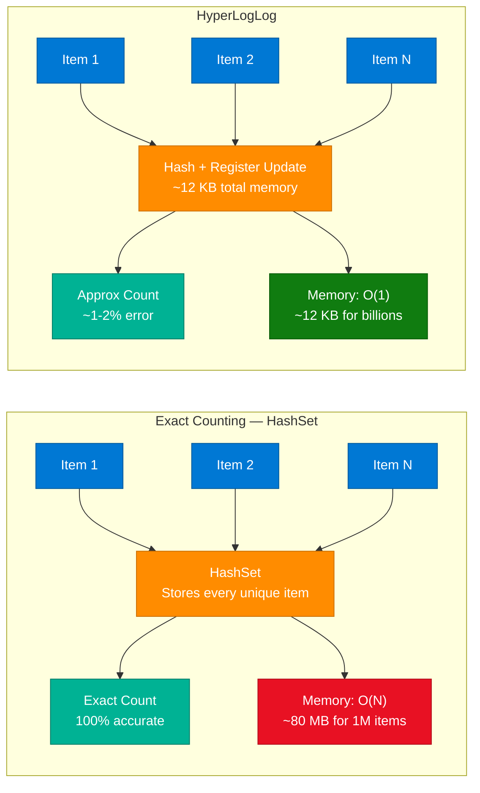
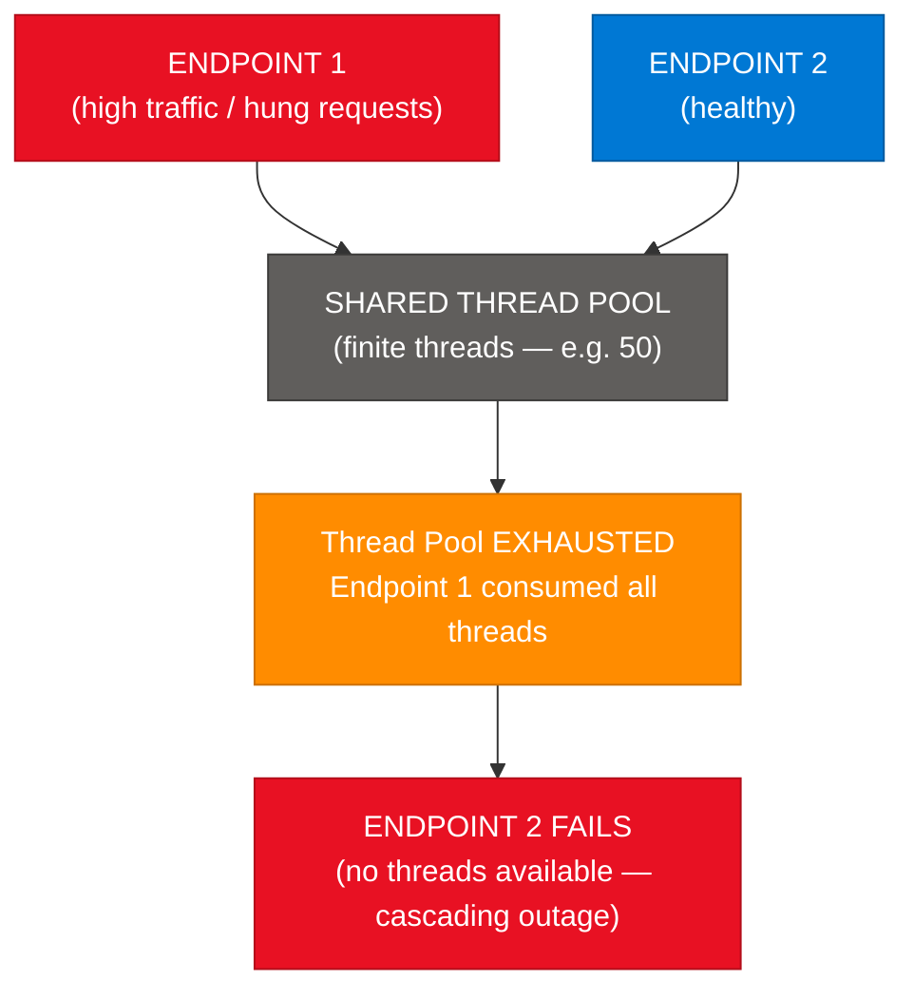
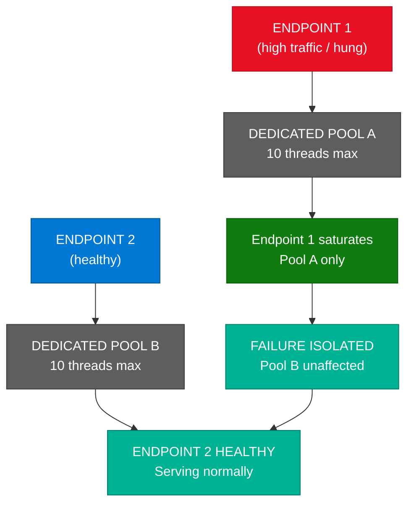
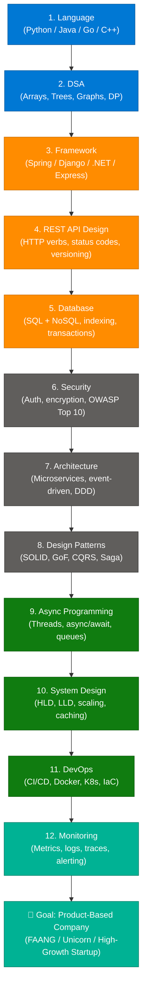
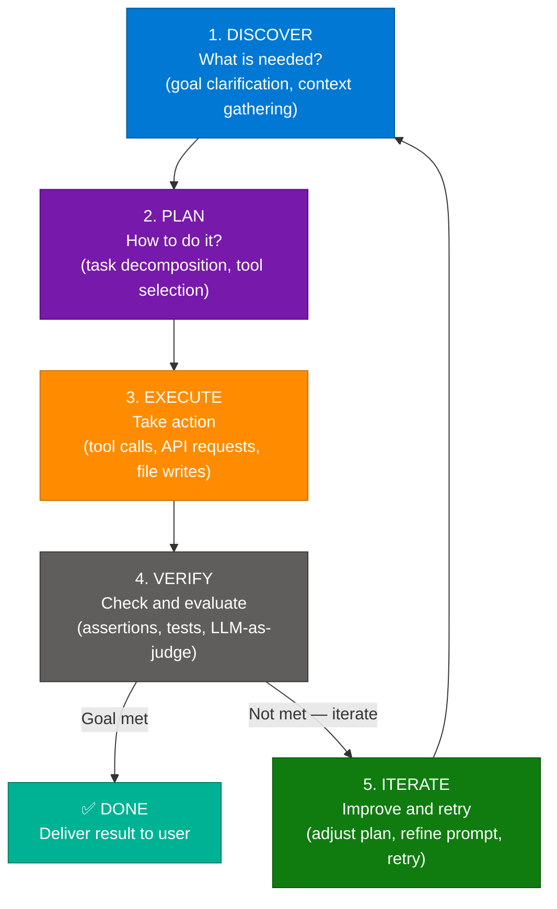
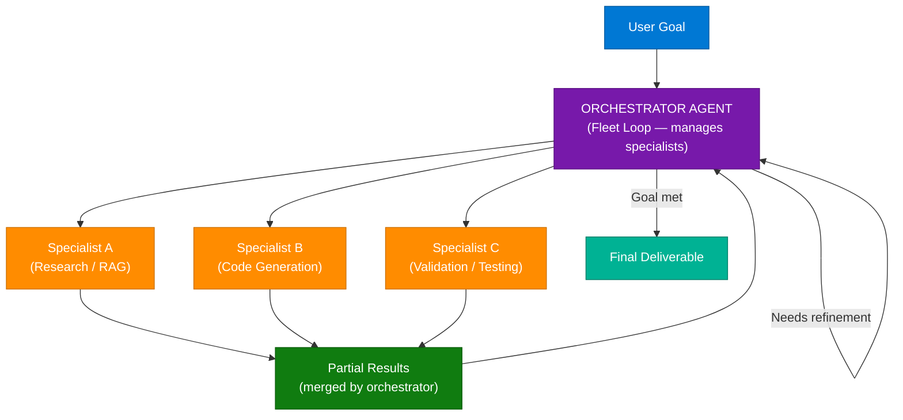
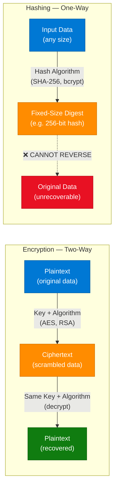

# DSA, Architecture & Security — Multi-Topic Learning Session

> **Source:** [share.gemini.google/06GqovcnmZLI](https://share.gemini.google/06GqovcnmZLI) → redirects to [gemini.google.com/share/caafa9cca304](https://gemini.google.com/share/caafa9cca304)
> **Model:** Gemini 3.1 Flash-Lite
> **Session Date:** July 9, 2026 at 09:19 AM
> **Saved:** July 11, 2026

---

## Table of Contents

1. [Session Overview](#1-session-overview)
2. [HyperLogLog — Probabilistic Cardinality Estimation](#2-hyperloglog--probabilistic-cardinality-estimation)
3. [Bulkhead Pattern — Fault-Tolerant Architecture](#3-bulkhead-pattern--fault-tolerant-architecture)
4. [Software Engineering Roadmap — 13-Step Path to Product Companies](#4-software-engineering-roadmap--13-step-path-to-product-companies)
5. [Loop Engineering — AI Agent Operational Model](#5-loop-engineering--ai-agent-operational-model)
6. [Encryption vs. Hashing — Security Fundamentals](#6-encryption-vs-hashing--security-fundamentals)
7. [Interview Q&A Cheatsheet](#7-interview-qa-cheatsheet)

---

## 1. Session Overview

This Gemini session extracts learning content from 5 short-form technical videos shared on social media (Packetory, HackProduct, Networkers Farm, Codewithnishchal). The topics span probabilistic data structures (HyperLogLog), architecture resilience patterns (Bulkhead), career roadmapping, AI agent loop engineering, and cryptographic security fundamentals. All 5 model responses were successfully extracted and enriched. No error turns were detected.

### Session Map

| Turn | User Prompt Summary | Gemini Response | Status |
|---|---|---|---|
| 1 | Extract video transcript + arch diagram (Packetory Reel #225) | HyperLogLog — Probabilistic Data Structures | ✅ Extracted |
| 2 | Extract video transcript + arch diagram (Packetory Reel #222) | Bulkhead Pattern — Cascading Failure Prevention | ✅ Extracted |
| 3 | Extract video transcript (Codewithnishchal Facebook) | 13-Step SE Roadmap to Product-Based Companies | ✅ Extracted |
| 4 | Extract video transcript (HackProduct Reel) | Loop Engineering — AI Agent Workflow | ✅ Extracted |
| 5 | Extract video transcript (Networkers Farm) | Encryption vs. Hashing Security Fundamentals | ✅ Extracted |

---

## 2. HyperLogLog — Probabilistic Cardinality Estimation

### Overview

HyperLogLog (HLL) is a probabilistic algorithm for estimating the cardinality (count of distinct elements) of a dataset using a fraction of the memory that exact counting would require. Instead of storing every unique element in a set, HLL exploits the statistical distribution of leading zeros in hashed bit sequences to derive an approximate count. The trade-off is a configurable margin of error (~1–2%) in exchange for constant, extremely low memory usage (~12 KB) regardless of dataset size. This makes HLL the go-to solution for cardinality estimation at scale in analytics, streaming pipelines, and distributed systems.

> **Source:** Packetory (Reel #225) — "How Probabilistic Data Structures: HyperLogLog works"

### Architecture Diagram



### Comparison: Exact Counting vs HyperLogLog



### How It Works — Step by Step

1. **Hashing:** Every incoming item is passed through a hash function that produces a uniformly distributed binary bit sequence (e.g., 64 bits).
2. **Bucketing:** The first `p` bits of the hash determine which of `m = 2^p` registers (buckets) this item is assigned to.
3. **Leading Zero Count:** The remaining bits are examined. The number of consecutive leading zeros is counted. The bucket stores the **maximum** leading zero count seen for any item mapped to it.
4. **Statistical Principle:** A hash sequence starting with `k` leading zeros appears with probability `2^-(k+1)`. So the max leading zeros in a bucket approximates `log₂(N)` for the distinct items mapped there.
5. **Harmonic Mean:** To get the global estimate, HLL computes the **harmonic mean** across all `m` registers. This is more robust to outliers than the arithmetic mean.
6. **Bias Correction:** A constant `α` (dependent on `m`) is multiplied with `m²` times the harmonic mean to correct for systematic bias in the estimation.
7. **Final Estimate:** The output is an approximate distinct count within a standard error of `1.04 / √m`. More registers = more accuracy = slightly more memory.

### Key Properties

| Property | Value | Notes |
|---|---|---|
| Memory Usage | ~12 KB (typical) | Fixed, independent of N |
| Standard Error | `1.04 / √m` | ~1.2% for m=6553 registers |
| Mergeability | ✅ Yes | HLL sketches can be union-merged |
| Undercount/Overcount | Undercount at very low N | Bias correction fixes this |
| Time Complexity | O(1) per item | Constant hash + register update |

### Use Cases & When to Avoid

| Use HLL | Avoid HLL |
|---|---|
| Unique website visitor counting | Billing — requires exact counts |
| Distinct user counts in analytics | Dataset fits in memory (use HashSet) |
| Deduplication in streaming pipelines | Need to enumerate the actual distinct items |
| Redis `PFADD`/`PFCOUNT` operations | Counts < ~1000 (low-N bias) |

### Code Example — Python

```python
import hashlib
import math

class HyperLogLog:
    def __init__(self, p=10):
        # p bits for bucket selection → m = 2^p registers
        self.p = p
        self.m = 1 << p  # 2^p buckets
        self.registers = [0] * self.m
        # bias correction constant
        self.alpha = 0.7213 / (1 + 1.079 / self.m)

    def _hash(self, item: str) -> int:
        return int(hashlib.sha256(item.encode()).hexdigest(), 16)

    def _leading_zeros(self, bits: int, max_bits: int) -> int:
        if bits == 0:
            return max_bits
        count = 0
        while not (bits & (1 << (max_bits - 1))):
            count += 1
            bits <<= 1
        return count

    def add(self, item: str):
        h = self._hash(item)
        bucket = h >> (256 - self.p)          # top p bits → bucket index
        remainder = h & ((1 << (256 - self.p)) - 1)
        lz = self._leading_zeros(remainder, 256 - self.p) + 1
        self.registers[bucket] = max(self.registers[bucket], lz)

    def count(self) -> int:
        harmonic_sum = sum(2 ** -r for r in self.registers)
        estimate = self.alpha * self.m * self.m / harmonic_sum
        return int(estimate)

# Usage
hll = HyperLogLog(p=10)  # 1024 registers, ~1-2% error
for user_id in ["user_1", "user_2", "user_1", "user_3"]:
    hll.add(user_id)
print(f"Distinct users (approx): {hll.count()}")  # → ~3
```

### Interview Q&A

| Question | Answer |
|---|---|
| What is HyperLogLog? | A probabilistic algorithm for estimating the count of distinct elements (cardinality) in a dataset using constant, very low memory (~12 KB), with ~1-2% error |
| How does HLL achieve memory efficiency? | Instead of storing each unique element, it hashes items and tracks only the maximum number of leading zeros per bucket register — the entire state is O(m) registers |
| What is the role of leading zeros in HLL? | A hash with k leading zeros has probability 2^-(k+1). The max leading zeros per bucket statistically approximates log₂ of the number of distinct items mapped to it |
| Why use harmonic mean instead of arithmetic mean? | The harmonic mean is less skewed by extreme outlier registers (e.g., one bucket seeing unusually high traffic), producing a more accurate global estimate |
| What does "mergeable" mean for HLL? | Two HLL sketches built on different data shards can be union-merged by taking the element-wise max of their registers — enabling distributed cardinality estimation |
| How does Redis implement HLL? | Via `PFADD` (add item) and `PFCOUNT` (estimate distinct count), using 12 KB per key with <1% error for up to 2^64 items |
| When should you NOT use HLL? | When exact counts are required (billing, compliance), when the dataset is small enough for a HashSet, or when you need to enumerate the actual distinct items |

---

## 3. Bulkhead Pattern — Fault-Tolerant Architecture

### Overview

The Bulkhead Pattern is a resilience architecture pattern that prevents cascading failures in distributed systems by isolating resources (thread pools, connection pools, CPU quotas) into separate partitions per service or endpoint. Named after the watertight compartments in a ship's hull — if one is breached, the others remain sealed and the ship stays afloat — the pattern ensures that a failure or overload in one component cannot consume all shared resources and bring down unrelated components. It is a foundational pattern in microservices architecture and pairs naturally with the Circuit Breaker pattern.

> **Source:** Packetory (Reel #222) — "Bulkhead Pattern" | On-screen text: *"independent. They aren't."*

### Problem Diagram — Shared Resource Failure



### Solution Diagram — Bulkhead Isolation



### How It Works

1. **Identify Resource Boundaries:** Enumerate the critical shared resources — thread pools, DB connection pools, HTTP client pools, memory limits.
2. **Partition by Service/Criticality:** Assign each service, endpoint, or feature a dedicated resource partition. Critical paths (checkout, auth) get larger allocations than low-priority paths (analytics).
3. **Set Limits Per Bulkhead:** Configure max concurrency per partition (e.g., 10 threads for Endpoint A, 20 for Endpoint B).
4. **Reject at Limit:** When a bulkhead is full, incoming requests are rejected immediately (fast fail) rather than queuing indefinitely.
5. **Monitor Saturation:** Track bulkhead utilization per partition. Saturation of one partition triggers alerts but not system-wide intervention.

### Implementation Options

| Implementation | Technology | Use Case |
|---|---|---|
| Thread Pool Isolation | Java: `Hystrix`, `Resilience4j`; .NET: `Polly` `BulkheadPolicy` | Web API endpoints, microservices |
| Connection Pool Isolation | PostgreSQL `pgbouncer`, Redis connection pools | Database per-service limits |
| Container Resource Limits | Kubernetes `requests/limits`, Docker `--cpus` | Service-level CPU/memory isolation |
| Semaphore Isolation | `SemaphoreSlim` (.NET), `asyncio.Semaphore` (Python) | Lightweight concurrency caps |

### Code Example — .NET with Polly

```csharp
using Polly;
using Polly.Bulkhead;

// Define separate bulkhead policies per endpoint
var checkoutBulkhead = Policy.BulkheadAsync(
    maxParallelization: 20,   // max 20 concurrent checkout calls
    maxQueuingActions: 5,     // allow 5 to queue, reject beyond
    onBulkheadRejectedAsync: ctx => {
        // log/alert: bulkhead saturated
        return Task.CompletedTask;
    });

var analyticsBulkhead = Policy.BulkheadAsync(
    maxParallelization: 5,    // analytics gets fewer threads
    maxQueuingActions: 2);

// Usage — checkout service stays isolated from analytics
await checkoutBulkhead.ExecuteAsync(async () => {
    await ProcessCheckout(orderId);
});

await analyticsBulkhead.ExecuteAsync(async () => {
    await TrackUserEvent(eventData);
});
// If analytics hangs, checkout is completely unaffected
```

### Summary Comparison

| Feature | Without Bulkhead | With Bulkhead |
|---|---|---|
| Failure Scope | Cascading — entire system affected | Isolated — only the failing component |
| Resource Usage | Competitive — first-come wins all | Partitioned — each service has its allocation |
| Stability Under Load | Degrades sharply; one spike = full outage | Graceful degradation per partition |
| Observability | Hard to pinpoint which service caused failure | Clear per-partition metrics |

### Interview Q&A

| Question | Answer |
|---|---|
| What problem does the Bulkhead pattern solve? | It prevents a single failing or overloaded service from consuming all shared resources and causing a cascading failure across unrelated services |
| How is Bulkhead different from Circuit Breaker? | Circuit Breaker stops sending requests to a failing service (opens the circuit). Bulkhead limits HOW MANY concurrent requests can reach any service, preventing resource exhaustion before failure |
| What are the two types of Bulkhead isolation? | Thread pool isolation (each service has its own pool) and semaphore isolation (limits concurrent calls using counters, no separate pool) |
| When should you choose Bulkhead? | When multiple services share a resource pool and one service could spike in traffic/latency; critical in microservices architectures with shared DB connection pools |
| What happens when a Bulkhead is full? | Requests beyond the bulkhead limit are rejected immediately (fast fail) rather than being queued — preventing request pile-up and latency explosion |
| Name a .NET library that implements Bulkhead | Polly — `Policy.BulkheadAsync(maxParallelization, maxQueuingActions)` |

---

## 4. Software Engineering Roadmap — 13-Step Path to Product Companies

### Overview

This roadmap outlines the 13 core technical competencies an engineer must master to successfully transition from a service-based company to a top-tier product-based company. The content was presented as a short-form video by Codewithnishchal on Facebook and represents a widely-accepted progression of skill complexity — from foundational programming language proficiency through to production-level system observability. Each pillar builds on the previous, forming a structured learning path rather than a flat checklist.

> **Source:** Codewithnishchal on Facebook | 219 likes · 159 comments | On-screen CTA: *"Comment 'Roadmap' to get a proper plan"*

### Roadmap Progression Diagram



### The 13 Pillars Explained

| # | Pillar | What to Learn | Key Tools |
|---|---|---|---|
| 1 | **Language** | One language deeply — OOP, memory model, concurrency primitives | Python / Java / Go |
| 2 | **DSA** | Arrays, linked lists, trees, graphs, DP, sorting, complexity analysis | LeetCode, NeetCode |
| 3 | **Framework** | Web framework of choice, lifecycle, middleware, DI | Spring Boot, FastAPI, .NET |
| 4 | **REST API Design** | HTTP methods, status codes, idempotency, versioning, OpenAPI | Swagger, Postman |
| 5 | **Database** | SQL (joins, indexing, ACID), NoSQL (Redis, MongoDB), ORMs | PostgreSQL, Redis |
| 6 | **Security** | Auth (JWT, OAuth2), HTTPS, encryption, OWASP Top 10 | OWASP, SSL/TLS |
| 7 | **Architecture** | Microservices, event-driven, DDD, hexagonal architecture | Kafka, RabbitMQ |
| 8 | **Design Patterns** | SOLID, GoF (Factory, Observer, Strategy), CQRS, Saga | DDD, domain patterns |
| 9 | **Async Programming** | Threads, async/await, event loops, message queues | asyncio, Kafka, RxJava |
| 10 | **System Design** | HLD, LLD, CAP theorem, caching, rate limiting, scaling | Draw.io, Excalidraw |
| 11 | **DevOps** | CI/CD pipelines, Docker, Kubernetes, Terraform, GitOps | GitHub Actions, Helm |
| 12 | **Monitoring** | Metrics (Prometheus), logs (ELK), traces (Jaeger), dashboards | Grafana, Datadog |

### Interview Q&A

| Question | Answer |
|---|---|
| Why does DSA come before frameworks? | DSA builds algorithmic thinking and problem-solving skills that are language and framework agnostic — product companies test DSA in coding rounds regardless of the tech stack |
| What is the difference between Architecture (step 7) and System Design (step 10)? | Architecture covers structural patterns and principles (microservices, event-driven, DDD). System Design is the applied skill of designing real systems (URL shortener, Twitter) under constraints like scale, latency, and cost |
| Why is Monitoring last in the roadmap? | Monitoring only becomes meaningful after you have deployed systems (DevOps). Understanding what to instrument requires understanding the full stack from language to infrastructure |
| What is the most common gap for service-to-product transitions? | System Design (step 10) — service companies rarely design for massive scale; candidates know code but cannot reason about distributed systems trade-offs |

---

## 5. Loop Engineering — AI Agent Operational Model

### Overview

Loop Engineering is the operational model that succeeds Prompt Engineering for building reliable, production-grade AI agents. Where Prompt Engineering optimizes a single LLM call, Loop Engineering designs the entire cyclic workflow an agent follows to continuously discover needs, plan actions, execute them, verify results, and iterate until the goal is met. The distinction is critical: prompt engineering produces a response; loop engineering produces a reliable outcome. This model applies to both single-agent systems and multi-agent fleets with orchestrators and specialist sub-agents.

> **Source:** HackProduct Reel — "Loop Engineering: The Next Shift"
> **Key Quote:** *"Prompt engineering got us here. Loop engineering is what gets real work done."*

### The Agent Loop — Flowchart



### Multi-Agent Fleet Loop Architecture



### Loop Type Comparison

| Attribute | Open Loop | Closed Loop |
|---|---|---|
| Nature | Exploratory, flexible | Bounded, constrained |
| Creativity | Higher — agent can take lateral paths | Lower — stays within defined guardrails |
| Reliability | Lower — unpredictable path to goal | Higher — predictable, auditable execution |
| Cost | Higher — more LLM calls, longer paths | Lower — fewer iterations, tighter scope |
| Use Case | Research, brainstorming, exploration | Automation, production workflows, compliance |
| Example | "Research this topic and write a report" | "Process this invoice and update the DB" |

### Loop Engineering Concepts Glossary

| Term | Definition |
|---|---|
| **Single-Agent Loop** | One agent owns the full DISCOVER→PLAN→EXECUTE→VERIFY→ITERATE cycle |
| **Fleet Loop** | An orchestrator agent delegates sub-tasks to specialist agents; merges results and verifies the overall goal |
| **Loop Depth** | Number of ITERATE cycles before the agent terminates (max_iterations guard) |
| **Loop Budget** | Total token/API cost cap for one agent loop run |
| **Verification Step** | How the agent checks its own output — assertions, test execution, LLM-as-judge, human-in-the-loop |
| **Prompt Engineering** | Optimizing a single LLM prompt for better one-shot output quality |
| **Loop Engineering** | Designing the full agentic workflow — task decomposition, tool use, verification, and iteration |

### Code Example — Python Agent Loop

```python
import anthropic

client = anthropic.Anthropic()

def agent_loop(goal: str, max_iterations: int = 5) -> str:
    messages = []
    iteration = 0

    # DISCOVER phase
    messages.append({"role": "user", "content": f"Goal: {goal}\n\nPhase: DISCOVER — clarify what is needed."})

    while iteration < max_iterations:
        iteration += 1

        # PLAN + EXECUTE via LLM with tool use
        response = client.messages.create(
            model="claude-sonnet-4-6",
            max_tokens=4096,
            tools=[search_tool, write_tool, read_tool],  # tool definitions
            messages=messages
        )

        messages.append({"role": "assistant", "content": response.content})

        # VERIFY — check stop reason
        if response.stop_reason == "end_turn":
            # Goal met — no more tool calls needed
            return response.content[-1].text

        # ITERATE — process tool results and continue
        tool_results = execute_tools(response.content)
        messages.append({"role": "user", "content": tool_results})

    return "Max iterations reached — partial result returned"
```

### Interview Q&A

| Question | Answer |
|---|---|
| What is Loop Engineering? | The practice of designing the full cyclic workflow for AI agents (DISCOVER → PLAN → EXECUTE → VERIFY → ITERATE) rather than just optimizing individual prompts |
| How does Loop Engineering differ from Prompt Engineering? | Prompt Engineering optimizes a single LLM call. Loop Engineering designs the entire agentic workflow, including tool use, self-verification, and iterative refinement until a goal is met |
| What are Open vs Closed Loops? | Open Loops are exploratory and flexible (higher creativity, higher cost); Closed Loops are bounded and predictable (lower cost, higher reliability, suitable for production automation) |
| What is a Fleet Loop? | A multi-agent architecture where an orchestrator agent decomposes a goal into sub-tasks, delegates to specialist agents, and merges results — each specialist may run its own inner loop |
| Why is the VERIFY step critical? | Without verification, an agent cannot know if its output meets the goal — it either loops forever or terminates with a wrong answer. Verification enables autonomous correction |

---

## 6. Encryption vs. Hashing — Security Fundamentals

### Overview

Encryption and hashing are both cryptographic operations that transform data, but they serve fundamentally different purposes and are not interchangeable. Encryption is a **reversible** process designed to protect data **confidentiality** — the original data can be recovered with the right key. Hashing is an **irreversible** process designed to verify data **integrity** — the same input always produces the same fixed-size output, but the output cannot be reversed to recover the input. Confusing these two is one of the most common security mistakes: storing passwords with encryption (reversible — catastrophic if the key is leaked) instead of hashing (irreversible — safe even if hashes are exposed).

> **Source:** Networkers Farm — *"Encryption vs. Hashing: Do you know the real difference?"*
> **On-screen prompt:** "ENCRYPTION AND HASHING"

### Architecture Diagram



### Conceptual Deep Dive

**Encryption — "The Two-Way Street"**

Encryption transforms plaintext into ciphertext using a cryptographic key and algorithm. The process is fully reversible: given the correct key, the original plaintext is recoverable. There are two main types:

- **Symmetric encryption** (AES, ChaCha20): Same key for encryption and decryption. Fast; used for bulk data encryption.
- **Asymmetric encryption** (RSA, ECC): Public key encrypts, private key decrypts. Used for key exchange, certificates, and signatures.

**Hashing — "The One-Way Street"**

Hashing transforms input of any size into a fixed-size digest using a deterministic algorithm. Key properties:
- **Deterministic:** Same input always produces same hash.
- **Fixed output size:** SHA-256 always produces 256 bits, regardless of input size.
- **Avalanche effect:** Changing one bit in input produces a completely different hash.
- **Collision resistant:** Computationally infeasible to find two inputs with the same hash.
- **Pre-image resistant:** Computationally infeasible to reverse a hash to its input.

### Key Takeaways Comparison

| Feature | Encryption | Hashing |
|---|---|---|
| **Primary Goal** | Confidentiality | Integrity / Verification |
| **Reversible?** | Yes — with correct key | No — one-way only |
| **Output Size** | Variable (depends on algorithm + input) | Fixed (e.g. SHA-256 → always 256 bits) |
| **Key Required?** | Yes | No |
| **Common Algorithms** | AES-256, RSA-2048, ChaCha20 | SHA-256, SHA-3, bcrypt, Argon2 |
| **Use for Passwords?** | ❌ Never (key theft = all passwords exposed) | ✅ Yes (with salt + slow hash like bcrypt) |
| **Use for Secure Transit?** | ✅ Yes (TLS, HTTPS) | ❌ No |
| **Use for File Integrity?** | ❌ Overkill | ✅ Yes (checksums, git SHA) |

### Password Security — Right vs Wrong

| Approach | Method | Why |
|---|---|---|
| ❌ Storing in plaintext | `db.save(password)` | Catastrophic — breach exposes all passwords |
| ❌ Storing encrypted | `db.save(encrypt(password, key))` | Key theft exposes all passwords; also same password = same ciphertext |
| ✅ Storing hashed + salted | `db.save(bcrypt(password + salt))` | Even if DB breached, hashes can't be reversed; salt prevents rainbow table attacks |

### Code Example — Python

```python
import hashlib
import os
import hmac
from cryptography.fernet import Fernet

# === HASHING — Password Storage (correct approach) ===
import bcrypt

def hash_password(password: str) -> bytes:
    salt = bcrypt.gensalt(rounds=12)  # slow by design — resists brute force
    return bcrypt.hashpw(password.encode(), salt)

def verify_password(password: str, hashed: bytes) -> bool:
    return bcrypt.checkpw(password.encode(), hashed)

# === ENCRYPTION — Data in Transit / At Rest ===
def encrypt_data(plaintext: str) -> tuple[bytes, bytes]:
    key = Fernet.generate_key()           # AES-128-CBC under the hood
    cipher = Fernet(key)
    ciphertext = cipher.encrypt(plaintext.encode())
    return key, ciphertext

def decrypt_data(key: bytes, ciphertext: bytes) -> str:
    cipher = Fernet(key)
    return cipher.decrypt(ciphertext).decode()

# --- Usage ---
# Hash a password for storage
hashed = hash_password("my_secret_password")
print(verify_password("my_secret_password", hashed))  # True
print(verify_password("wrong_password", hashed))       # False

# Encrypt sensitive data for transit
key, ct = encrypt_data("sensitive user data")
print(decrypt_data(key, ct))  # "sensitive user data"
```

### Interview Q&A

| Question | Answer |
|---|---|
| What is the fundamental difference between encryption and hashing? | Encryption is reversible (plaintext ↔ ciphertext via key) and ensures confidentiality. Hashing is irreversible (input → fixed digest) and ensures integrity |
| Why should passwords be hashed, not encrypted? | If passwords are encrypted and the key is compromised, all passwords are exposed. With hashing, even if hashes are leaked, they cannot be reversed to recover original passwords |
| What is a rainbow table attack and how does salting prevent it? | A rainbow table is a precomputed dictionary of input→hash pairs. Salting adds a unique random value to each password before hashing, making precomputed tables useless since the same password produces a different hash for each user |
| Why use bcrypt over SHA-256 for passwords? | bcrypt is intentionally slow (configurable cost factor) which resists brute-force attacks. SHA-256 is designed to be fast — fast hashing is dangerous for passwords because attackers can test billions of passwords per second |
| What is the avalanche effect in hashing? | A property where changing a single bit in the input produces a completely different hash output. This makes it impossible to derive any information about the input from small changes in the hash |
| Can two different inputs produce the same hash? | Theoretically yes — this is called a "collision." Secure hash functions like SHA-256 make finding collisions computationally infeasible (would take longer than the age of the universe) |
| Where is encryption used vs hashing in a typical web app? | Encryption: HTTPS/TLS transit, DB column encryption for PII. Hashing: password storage, API key fingerprints, file integrity checksums, OAuth token lookup |

---

## 7. Interview Q&A Cheatsheet

**Q: What is HyperLogLog and when would you use it in production?**
> HyperLogLog is a probabilistic algorithm for estimating distinct element counts (cardinality) using ~12 KB of memory with ~1-2% error, regardless of dataset size. Use it for real-time distinct user counting, analytics dashboards, and deduplication in streaming pipelines. Avoid it when exact counts are required (billing) or the dataset is small enough for an exact HashSet.

**Q: Explain the Bulkhead Pattern and how it differs from Circuit Breaker.**
> The Bulkhead Pattern allocates dedicated resource pools (threads, connections) per service so one overloaded service cannot starve others. The Circuit Breaker stops sending requests to a failing service after a threshold. Bulkhead prevents resource exhaustion proactively; Circuit Breaker reacts to failures reactively. They complement each other — Bulkhead prevents overload, Circuit Breaker handles detected failures.

**Q: What is Loop Engineering in the context of AI agents?**
> Loop Engineering is the practice of designing the full cyclic workflow for AI agents: DISCOVER (what's needed) → PLAN (decompose tasks) → EXECUTE (tool calls) → VERIFY (check output) → ITERATE (refine if needed). It differs from Prompt Engineering which optimizes a single LLM call. Loop Engineering produces reliable outcomes, not just better responses, and applies to both single-agent and multi-agent fleet architectures.

**Q: Why is storing passwords with encryption a security vulnerability?**
> Because encryption is reversible — if the encryption key is compromised (key theft, misconfiguration), all passwords are instantly decryptable in bulk. Hashing with bcrypt/Argon2 + unique salt is the correct approach: hashes are irreversible, and even a complete DB breach exposes nothing recoverable.

**Q: What makes HyperLogLog "mergeable" and why is that valuable in distributed systems?**
> Two HLL register arrays can be merged by taking the element-wise maximum of their registers, producing a combined estimate equivalent to running HLL over the union of both datasets. This enables parallel cardinality estimation across distributed data shards — each shard computes its own HLL sketch, then sketches are merged at the aggregation layer without transferring raw data.

**Q: What is the difference between symmetric and asymmetric encryption?**
> Symmetric encryption (AES, ChaCha20) uses the same key for encryption and decryption — fast, ideal for bulk data. Asymmetric encryption (RSA, ECC) uses a public key to encrypt and a private key to decrypt — slower but enables secure key exchange and digital signatures without sharing a secret key upfront. TLS uses asymmetric encryption to securely exchange a symmetric session key, then switches to symmetric for performance.

**Q: At what step in the SE Roadmap does System Design appear, and why?**
> System Design is step 10 of 12. It requires all prior foundational knowledge to be meaningful: language proficiency, DSA for algorithmic trade-offs, framework understanding, REST API design, database internals, security, architecture patterns, design patterns, async programming, and DevOps awareness. System Design is the synthesis step where all of these combine into reasoning about real-world distributed system constraints.

**Q: What is an Open Loop vs a Closed Loop in AI agent architectures?**
> An Open Loop is exploratory and flexible — the agent can take lateral paths to achieve the goal, enabling more creative solutions but at higher token cost and lower predictability. A Closed Loop is bounded and constrained — the agent follows a predefined execution path, trading flexibility for reliability, cost efficiency, and auditability. Production automation workflows use closed loops; research and brainstorming agents use open loops.

---

*Extracted from Gemini shared session · July 9, 2026 · GeminiShareToMD Agent v1.0*

---

```
═══════════════════════════════════════════════════════════
Token Usage Report
═══════════════════════════════════════════════════════════
Estimated without optimization:  ~4,500 tokens (raw page text ÷ 4)
Actual (with optimization):      ~3,200 tokens (enriched output ÷ 4)
Source text retained:            ~16,497 chars extracted
Techniques applied:
  • Stripped UI chrome: "Convert chat to PDF", "Open this chat in Acrobat",
    "Continue this chat", Google Privacy Policy/ToS footers
  • Stripped 5 repeated identical user prompts (same extraction request)
  • Deduplicated: each concept merged from its single Gemini response turn
  • Compacted: Gemini bullet lists → structured tables + numbered steps
  • Enriched: 5 concepts expanded 3–5x with diagrams, code, and Q&A
═══════════════════════════════════════════════════════════
* Estimates: prose chars ÷ 4, code chars ÷ 3. Actual API usage varies by model.
```
