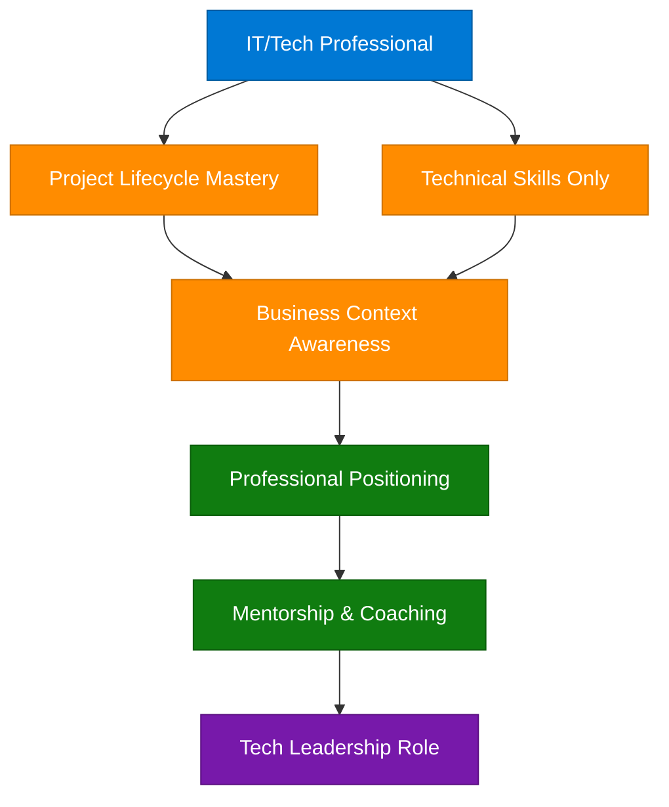
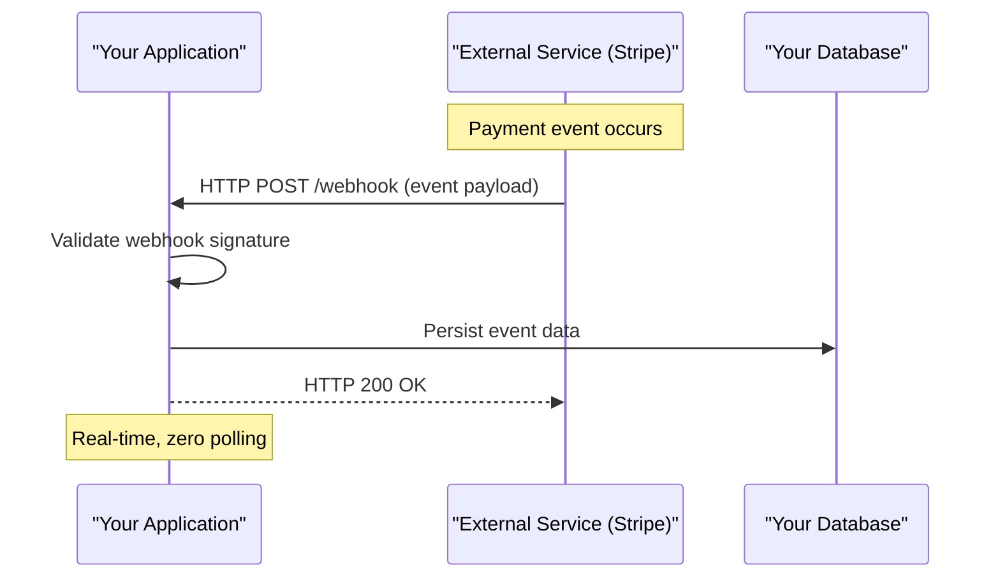
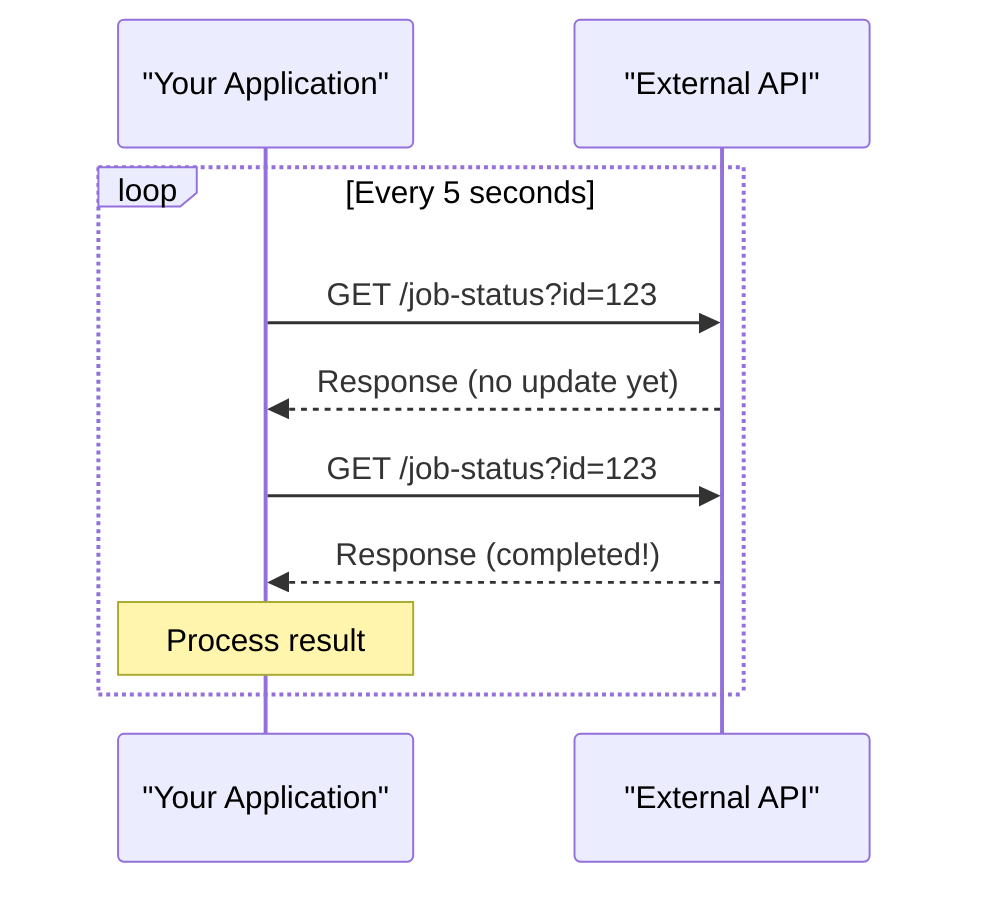
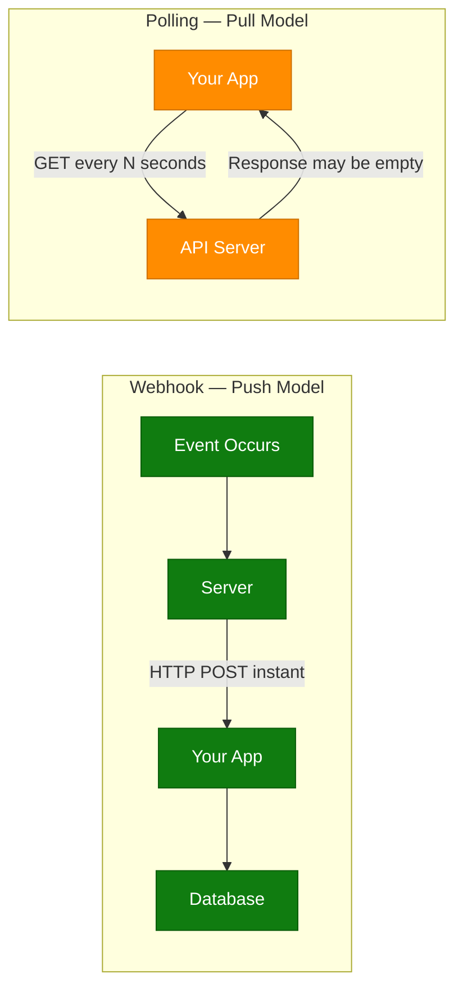
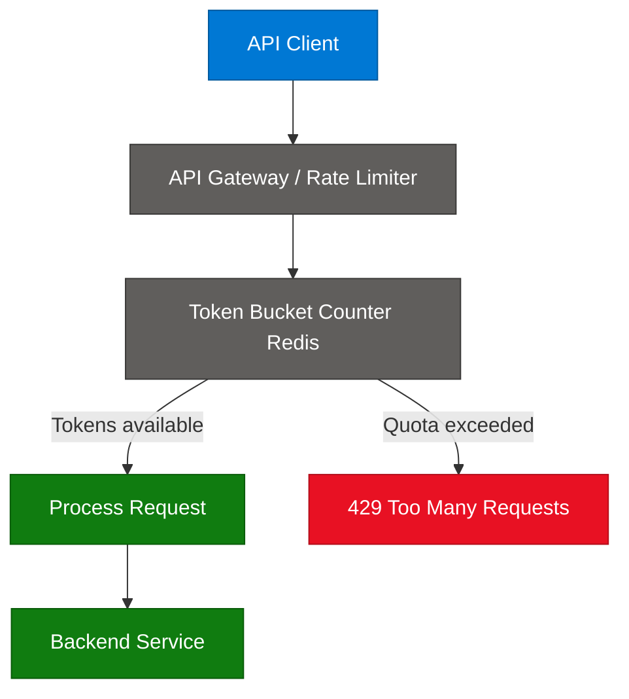
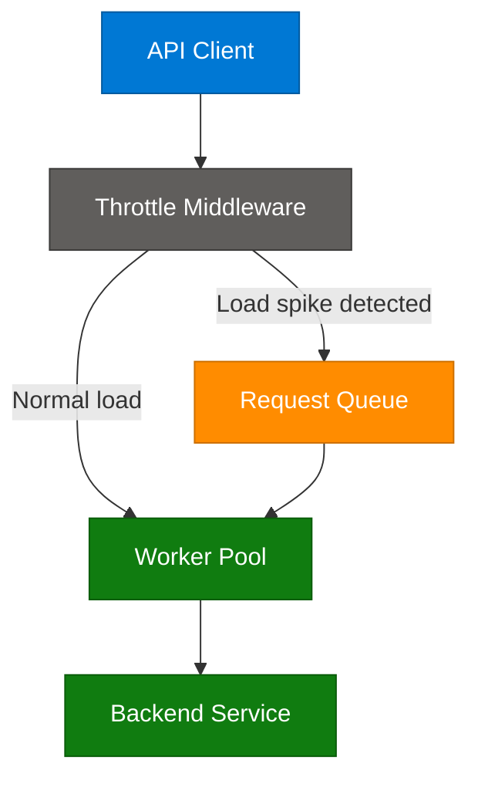
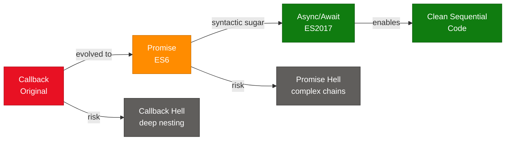
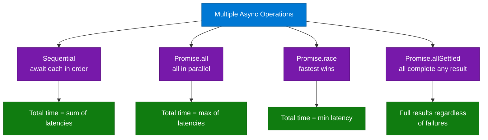

# DSA Patterns, Webhook vs Polling, Rate Limiting & Async JS

> **Source:** [share.gemini.google/Z6IyJKrxLwYK](https://share.gemini.google/Z6IyJKrxLwYK) → redirects to [gemini.google.com/share/eb2ccfce5473](https://gemini.google.com/share/eb2ccfce5473)
> **Model:** Gemini 3.1 Flash-Lite
> **Session Date:** July 9, 2026
> **Saved:** July 11, 2026

---

## Table of Contents

1. [Session Overview](#1-session-overview)
2. [Master DSA Patterns Course Curriculum](#2-master-dsa-patterns-course-curriculum)
3. [IT Professional Development Framework](#3-it-professional-development-framework)
4. [Webhook vs Polling](#4-webhook-vs-polling)
5. [Rate Limiting vs Throttling](#5-rate-limiting-vs-throttling)
6. [JavaScript Async Patterns: Callbacks to Concurrency](#6-javascript-async-patterns-callbacks-to-concurrency)
7. [Interview Q&A Cheatsheet](#7-interview-qa-cheatsheet)

---

## 1. Session Overview

This session captures educational content extracted from five social media videos and infographics. Topics span DSA interview preparation (Master DSA Patterns course by Rakeshcodeburner), IT career development (Coach APM), and three backend/system design concepts: Webhook vs Polling, Rate Limiting vs Throttling, and JavaScript Async Patterns. One final turn returned an error from Gemini.

### Session Map

| Turn | User Prompt Summary | Gemini Response | Status |
|---|---|---|---|
| 1 | Extract Master DSA Patterns course content | Full curriculum: 20 DSA patterns by Rakeshcodeburner | ✅ Extracted |
| 2 | Extract Facebook Reel by Ajay Prakash Mishra "Coach APM" | IT professional development career guidance | ✅ Extracted (limited — private link) |
| 3 | Extract Webhook vs Polling video by Piyush Garg | Architecture comparison, summary table | ✅ Extracted |
| 4 | Extract API Traffic Control video by Bhavesh Vaswani | Rate Limiting vs Throttling with interview prompt | ✅ Extracted |
| 5 | Extract JS Async Patterns infographic by David Mráz | Callbacks, Promises, Async/Await, concurrency | ✅ Extracted |
| 6 | Extract additional content (link inaccessible) | Error response | ⚠️ Error — see note in Section 6 |

---

## 2. Master DSA Patterns Course Curriculum

### Overview

"Master DSA Patterns" is a structured interview preparation course by **Rakesh (Rakeshcodeburner)**, a NIT Raipur CSE graduate, covering 20 essential algorithmic patterns in Java, Python, and C++. Rather than teaching individual LeetCode solutions by rote, the course is organized around recognizable problem-solving *patterns* — a methodology proven to be the most effective strategy for FAANG-tier interview success. The curriculum progresses from fundamentals (complexity analysis, arrays) through core patterns (Two Pointers, Sliding Window, Hashing) to advanced topics (DP, Graph algorithms, Union Find). The Hindi-medium instruction makes this particularly accessible to Indian engineering students and working professionals preparing for placement season. Course resources are available at [Rakeshcodeburner.com](https://rakeshcodeburner.com).

### DSA Pattern Learning Path

```mermaid
flowchart TD
    start["Start: Time & Space Complexity"]
    arrays["Arrays & Strings"]
    twoPtr["Two Pointers Pattern"]
    sliding["Sliding Window Pattern"]
    hashing["Hashing Map-Set Pattern"]
    prefix["Prefix Sum Pattern"]
    fastSlow["Fast & Slow Pointer Pattern"]
    llRev["Linked-List In-Place Reversal"]
    stackQ["Stack & Queue"]
    mono["Monotonic Stack Pattern"]
    topK["Top K Elements Pattern"]
    binSearch["Modified Binary Search Pattern"]
    overlap["Overlapping Intervals Pattern"]
    maths["Maths Pattern"]
    recursion["Recursion"]
    treeDFS["Tree DFS/BFS Pattern"]
    backtrack["Backtracking Pattern"]
    dp["Dynamic Programming 1D-2D"]
    bitwise["Bitwise Manipulation Pattern"]
    graph["Graph DFS/BFS Pattern"]
    uf["Union Find DSU Pattern"]
    dac["Divide and Conquer Pattern"]
    ready["FAANG Interview Ready"]

    start --> arrays
    arrays --> twoPtr
    arrays --> hashing
    twoPtr --> sliding
    sliding --> prefix
    prefix --> fastSlow
    fastSlow --> llRev
    llRev --> stackQ
    stackQ --> mono
    mono --> topK
    topK --> binSearch
    binSearch --> overlap
    overlap --> maths
    maths --> recursion
    recursion --> treeDFS
    treeDFS --> backtrack
    backtrack --> dp
    dp --> bitwise
    bitwise --> graph
    graph --> uf
    uf --> dac
    dac --> ready

    classDef fundamentalNode fill:#0078D4,stroke:#005A9E,color:#fff
    classDef coreNode        fill:#FF8C00,stroke:#CC7000,color:#fff
    classDef advNode         fill:#7719AA,stroke:#5A0E80,color:#fff
    classDef goalNode        fill:#107C10,stroke:#0A5C0A,color:#fff

    class start,arrays fundamentalNode
    class twoPtr,sliding,hashing,prefix,fastSlow,llRev,stackQ,mono,topK,binSearch,overlap,maths,recursion coreNode
    class treeDFS,backtrack,dp,bitwise,graph,uf,dac advNode
    class ready goalNode
```

### How It Works — Pattern-Based Learning

1. **Identify the pattern** — Before coding, classify the problem type (e.g., "maximize subarray" → Sliding Window).
2. **Learn the template** — Each pattern has a canonical code skeleton that applies to its problem class.
3. **Apply to variants** — Practice 5–10 problems per pattern to internalize when and how to apply it.
4. **Complexity analysis** — For each pattern, understand the time/space trade-offs and edge cases.
5. **Cross-pattern problems** — Advanced problems combine patterns (e.g., Sliding Window + Hashing for anagram problems).
6. **Interview simulation** — Practice under timed conditions, articulating the pattern choice out loud.

### DSA Pattern Cheat Reference

| Pattern | When to Use | Time Complexity | Classic Problem |
|---|---|---|---|
| Two Pointers | Sorted array, sum/pair problems | O(n) | Two Sum II, 3Sum |
| Sliding Window | Contiguous subarray/substring optimization | O(n) | Max Subarray, Anagrams |
| Hashing Map-Set | Lookup, frequency, uniqueness | O(n) avg | Two Sum, Group Anagrams |
| Prefix Sum | Range sum queries | O(n) precompute | Subarray Sum Equals K |
| Fast & Slow Pointer | Cycle detection in linked list | O(n) | Floyd's Cycle Detection |
| Monotonic Stack | Next greater/smaller element | O(n) | Daily Temperatures |
| Top K Elements | K largest/smallest/frequent | O(n log k) | Kth Largest Element |
| Modified Binary Search | Rotated or range variants | O(log n) | Search in Rotated Array |
| Tree DFS/BFS | Traversal, paths, depth | O(n) | Max Depth, Level Order |
| Dynamic Programming | Optimal substructure, overlapping subproblems | O(n²) typical | LCS, Coin Change |
| Union Find | Connected components, grouping | O(α n) amortized | Number of Provinces |
| Graph DFS/BFS | Connected components, shortest path | O(V+E) | Course Schedule |

### Code Example — Sliding Window Template (Python)

```python
def sliding_window_max_sum(nums: list[int], k: int) -> int:
    window_sum = sum(nums[:k])
    max_sum = window_sum
    for i in range(k, len(nums)):
        window_sum += nums[i] - nums[i - k]
        max_sum = max(max_sum, window_sum)
    return max_sum
```

### Code Example — Two Pointers Template (Python)

```python
def two_sum_sorted(nums: list[int], target: int) -> tuple[int, int]:
    left, right = 0, len(nums) - 1
    while left < right:
        curr = nums[left] + nums[right]
        if curr == target:
            return (left, right)
        elif curr < target:
            left += 1
        else:
            right -= 1
    return (-1, -1)
```

### Interview Q&A — DSA Patterns

| Question | Answer |
|---|---|
| Why learn patterns instead of individual problems? | Patterns give a transferable framework — knowing Sliding Window lets you solve hundreds of variants, not just the examples you practiced. |
| What's the difference between Sliding Window and Two Pointers? | Both use dual indices, but Sliding Window maintains a contiguous window of fixed or variable size, while Two Pointers shrinks from both ends toward a target condition. |
| When does a Monotonic Stack apply? | Whenever you need "next greater/smaller element" or need to maintain a sorted order of elements seen so far — stock span, largest rectangle in histogram. |
| How do you detect that DP applies? | Look for optimal substructure (optimal solution built from sub-problems) and overlapping sub-problems (same sub-problem computed multiple times). |
| What is Union-Find (DSU) and when is it better than DFS? | DSU tracks connected components in near-O(1) per operation using path compression and union by rank — prefer DSU when you repeatedly add edges and need to check connectivity. |
| What makes Fast & Slow Pointer work for cycle detection? | If a cycle exists, the fast pointer at 2 steps/iteration will lap the slow pointer and they meet inside the cycle. If no cycle, fast reaches null first. |

---

## 3. IT Professional Development Framework

### Overview

This section is based on the Facebook Reel by **Ajay Prakash Mishra ("Coach APM")**, a career mentor targeting IT/Tech professionals. The core message is that technical skill alone is insufficient for career growth — professionals must develop project ownership, stakeholder management, and strategic positioning within their organization's hierarchy. The video opens with the on-screen prompt **"DO YOU WORK IN THE IT OR TECH INDUSTRY?"** and is captioned **"FOR WORKING PROFESSIONALS ONLY"**, positioning Coach APM as a mentor for tech workers looking to optimize their career trajectory. While the video was partially inaccessible (private Facebook link), the visible captions reveal a structured professional development framework.

### IT Career Growth Architecture



### Core Professional Growth Pillars

| Pillar | Description | Action |
|---|---|---|
| Project Understanding | Master the full project lifecycle, not just your ticket | Participate in planning, retrospectives, architecture reviews |
| Professional Positioning | Understand where you sit in the tech hierarchy | Map your role to business impact, not just code output |
| Mentorship | Seek coaches and senior engineers | Regular 1:1s, find a mentor in your target role |
| Business Context | Link your work to business outcomes | Connect features to revenue, customer impact, or efficiency |

### Interview Q&A — Career Growth in Tech

| Question | Answer |
|---|---|
| How do you transition from IC to Tech Lead? | Build breadth: own deliverables end-to-end, communicate trade-offs to non-technical stakeholders, and start mentoring junior engineers before the title comes. |
| What's the most common growth blocker for senior engineers? | Over-indexing on technical depth at the expense of influence — the ability to align teams, write design docs, and represent engineering in cross-functional discussions. |
| How do you demonstrate business context in an interview? | Quantify impact: "reduced latency by 40% which decreased cart abandonment by 8%" beats "optimized the checkout endpoint." |
| What does project lifecycle mastery mean in practice? | Owning requirements elicitation, design decisions, implementation, rollout strategy, monitoring, and post-mortem — not just the code phase. |
| Why do tech professionals plateau mid-career? | The skills that got you to senior (individual technical execution) are not the skills that advance you further: influence, system thinking, delegation, communication. |

---

## 4. Webhook vs Polling

### Overview

Webhook and Polling are the two fundamental mechanisms by which systems synchronize data or receive notifications from external services. Polling is the client-initiated pattern where your application periodically queries a server for new data regardless of whether any new data exists — creating wasted bandwidth and artificial latency. Webhooks invert this relationship: the server proactively pushes data to your application as soon as an event occurs, enabling real-time integrations with zero polling overhead. Content source: **Piyush Garg**, video "Webhook vs Polling — Lets understand." For any system design interview involving integrations (payment providers, CI/CD pipelines, IoT sensors), understanding when to use each pattern is foundational.

### Webhook Request Flow



### Polling Request Flow



### Architecture Comparison Diagram



### How It Works — Webhook

1. **Register endpoint** — Expose a publicly accessible HTTPS URL (e.g., `POST /webhook/stripe`) on your server.
2. **Configure provider** — In the provider's dashboard (Stripe, GitHub, etc.), register your URL and specify which events to receive.
3. **Event fires** — When the event occurs, the provider sends an HTTP POST request with a JSON payload.
4. **Signature validation** — Verify the `X-Stripe-Signature` header to authenticate the request and prevent spoofing.
5. **Idempotent processing** — Handle duplicates — providers retry on non-2xx responses, so your handler must be idempotent.
6. **Acknowledge immediately** — Return HTTP 200 quickly; offload heavy processing to a background queue.

### How It Works — Polling

1. **Set interval** — Choose a polling interval (5s, 30s, 1min) based on acceptable staleness vs. cost.
2. **Send request** — Emit `GET /resource?since=<last_checked_timestamp>` on each tick.
3. **Handle empty responses** — Most polls return no new data; your client must gracefully handle this.
4. **Backoff strategy** — Implement exponential backoff if the server returns 429s or is under load.
5. **Stop condition** — Once the desired state is reached (job completed), stop polling.

### Key Components

| Component | Webhook | Polling |
|---|---|---|
| Trigger | Server-side event | Client timer/scheduler |
| Transport | HTTP POST from server | HTTP GET from client |
| Latency | Near-zero (event-driven) | Up to N seconds (interval) |
| Bandwidth | Low — only on events | High — many empty responses |
| Auth | HMAC signature validation | API key / OAuth token |
| Reliability | Provider retries on failure | Client-controlled retry |

### Code Example — Webhook Endpoint (Python/FastAPI)

```python
import hmac, hashlib, json
from fastapi import FastAPI, Request, HTTPException

app = FastAPI()
WEBHOOK_SECRET = "your_webhook_secret"

@app.post("/webhook/stripe")
async def stripe_webhook(request: Request):
    payload = await request.body()
    sig = request.headers.get("x-stripe-signature", "")
    expected = hmac.new(WEBHOOK_SECRET.encode(), payload, hashlib.sha256).hexdigest()
    if not hmac.compare_digest(f"sha256={expected}", sig):
        raise HTTPException(status_code=400, detail="Invalid signature")
    event = json.loads(payload)
    if event["type"] == "payment_intent.succeeded":
        pass  # offload to background queue — never block the webhook response
    return {"status": "received"}
```

### Code Example — Polling with Exponential Backoff (Python)

```python
import time, httpx

def poll_job_status(job_id: str, max_attempts: int = 10) -> dict:
    delay = 2
    for attempt in range(max_attempts):
        data = httpx.get(f"https://api.example.com/jobs/{job_id}").json()
        if data["status"] == "completed":
            return data
        time.sleep(delay)
        delay = min(delay * 2, 60)
    raise TimeoutError(f"Job {job_id} did not complete after {max_attempts} attempts")
```

### Interview Q&A — Webhook vs Polling

| Question | Answer |
|---|---|
| When would you choose polling over webhooks? | When the external service doesn't support webhooks, when you're behind a firewall that can't receive inbound connections, or for batch-check scenarios where real-time is not required. |
| How do you make a webhook handler idempotent? | Persist the event ID before processing; skip (return 200) if the ID already exists in your events table — prevents duplicate-processing on retries. |
| What's the risk of a webhook without signature verification? | Any actor who knows your endpoint URL can forge requests, causing fraudulent state changes (e.g., fake payment confirmations). |
| What is long polling vs short polling? | Long polling holds the server connection open until new data is available (or a timeout), reducing empty responses. Short polling fires and immediately responds regardless. |
| What HTTP status should you return for a duplicate webhook event? | Return 200 OK — returning 4xx causes the provider to retry, creating more duplicates. Silently skip and acknowledge. |
| Which is more scalable at 100K clients? | Webhooks — polling generates O(n × frequency) requests regardless of events. At scale, polling can DDoS your own API. |

---

## 5. Rate Limiting vs Throttling

### Overview

Rate Limiting and Throttling are two complementary API traffic control mechanisms that serve distinct architectural purposes. Rate Limiting enforces a hard cap on the number of requests a client can make within a time window (e.g., 100 requests/minute), rejecting excess requests with HTTP 429. Throttling is a flow-control mechanism that slows or queues requests rather than rejecting them outright, protecting backend systems from load spikes. The classic interview trigger from **Bhavesh Vaswani's** educational reel: *"Interviewer: Your API is getting abused — should you rate limit or throttle? What's the difference?"* — the answer depends on whether the goal is quota enforcement (rate limit) or system stability under spike load (throttle).

> **Key Insight (from video caption):** "Both control traffic — but they solve different problems."

### Rate Limiting Architecture



### Throttling Architecture



### Comparison Table

| Feature | Rate Limiting | Throttling |
|---|---|---|
| Primary Goal | Enforce per-client quotas | Protect backend from overload |
| Client Experience | Hard reject — HTTP 429 | Delayed or queued response |
| Protects Against | Abuse, DoS, tier enforcement | Load spikes, thundering herd |
| Algorithm | Token Bucket, Fixed Window, Sliding Log | Leaky Bucket, queue-based shaping |
| State Storage | Redis counter per client | Queue depth, worker pool size |
| Scope | Per-user / per-API-key | System-wide or per-service |

### Rate Limiting Algorithms

| Algorithm | Behavior | Best For |
|---|---|---|
| Fixed Window | Count resets at window boundary every minute | Simple quota enforcement |
| Sliding Window Log | Track timestamps of recent requests | Precise burst control |
| Sliding Window Counter | Weighted blend of current + previous window | Efficient approximate sliding window |
| Token Bucket | Tokens refill at fixed rate; consume 1 per request | Bursty traffic with average rate cap |
| Leaky Bucket | Requests drain at constant rate regardless of input | Smooth traffic shaping |

### Code Example — Token Bucket Rate Limiter (Python)

```python
import time
from dataclasses import dataclass, field

@dataclass
class TokenBucket:
    capacity: int
    refill_rate: float  # tokens per second
    tokens: float = field(init=False)
    last_refill: float = field(init=False)

    def __post_init__(self):
        self.tokens = float(self.capacity)
        self.last_refill = time.monotonic()

    def allow(self) -> bool:
        now = time.monotonic()
        elapsed = now - self.last_refill
        self.tokens = min(self.capacity, self.tokens + elapsed * self.refill_rate)
        self.last_refill = now
        if self.tokens >= 1:
            self.tokens -= 1
            return True
        return False

# 10 req/s average, burst up to 20
limiter = TokenBucket(capacity=20, refill_rate=10)
```

### Code Example — Redis-Backed Rate Limiter (Python)

```python
import redis, time

r = redis.Redis()

def is_allowed(user_id: str, limit: int = 100, window: int = 60) -> bool:
    key = f"rate_limit:{user_id}:{int(time.time()) // window}"
    count = r.incr(key)
    if count == 1:
        r.expire(key, window)
    return count <= limit
```

### Interview Q&A — Rate Limiting vs Throttling

| Question | Answer |
|---|---|
| What HTTP status code does rate limiting return and why? | 429 Too Many Requests, with a Retry-After header indicating when the client can retry — standardized in RFC 6585. |
| Name three rate limiting algorithms and their trade-offs. | Token Bucket allows bursts up to capacity. Fixed Window is simple but susceptible to boundary spikes. Sliding Window Log is precise but memory-intensive. Token Bucket is most common in production. |
| How do you implement distributed rate limiting? | Use Redis atomic INCR with EXPIRE — key encodes user_id:time_window. Use Lua scripts to ensure atomicity for check-and-increment operations. |
| What is the "thundering herd" problem and how does throttling help? | When a cache expires or a service recovers, thousands of clients hammer it simultaneously. Throttling queues the excess, letting the backend recover at a controlled pace. |
| How would you rate-limit at different granularities? | Use composite Redis keys: rate_limit:ip:{ip}, rate_limit:user:{id}, rate_limit:tenant:{tid}. Apply the most restrictive matching limit. |
| What's the difference between rate limiting and circuit breaking? | Rate limiting protects your service from being overwhelmed by external clients. Circuit breaking protects your service from a failing downstream dependency. |

---

## 6. JavaScript Async Patterns: Callbacks to Concurrency

### Overview

JavaScript's single-threaded event loop necessitates asynchronous patterns for I/O-bound operations — network calls, file reads, database queries. The language has evolved through three generations: **Callbacks** (original, prone to "callback hell"), **Promises** (chainable, composable, ES6), and **Async/Await** (syntactic sugar over Promises, ES2017, dramatically improved readability and debuggability). Beyond sequential async operations, modern applications require concurrency management via `Promise.all` (parallel execution), `Promise.race` (fastest-wins), `Promise.allSettled` (wait for all regardless of failure). Content source: **David Mráz (@davidm_ai)** educational infographic.

### Async Pattern Evolution



### Concurrency Pattern Diagram



### Pattern Comparison Table

| Feature | Callback | Promise | Async/Await |
|---|---|---|---|
| Philosophy | Original async pattern | Chainable & composable | Readable & debuggable |
| Code Structure | `initModel(cb) → embedQuery(cb)` | `.then(initModel).then(embedQuery)` | `await initModel(); await embedQuery()` |
| Error Handling | `if (err) return cb(err)` at every level | `.catch(err => ...)` once per chain | `try/catch` blocks |
| Debugging | Stack traces broken by async boundary | Somewhat improved | Full stack trace support |
| Risk | Callback Hell — pyramid of doom | Promise chain complexity | Sequential by default — easy to miss parallelism |

### Code Example — Three Patterns Side by Side (JavaScript)

```javascript
// 1. Callbacks (original)
function fetchUserCallback(userId, cb) {
    db.query("SELECT * FROM users WHERE id = ?", [userId], (err, user) => {
        if (err) return cb(err);
        cache.set(`user:${userId}`, user, (err) => {
            if (err) return cb(err);
            cb(null, user);
        });
    });
}

// 2. Promises
function fetchUserPromise(userId) {
    return db.queryPromise("SELECT * FROM users WHERE id = ?", [userId])
        .then(user => cache.setPromise(`user:${userId}`, user).then(() => user))
        .catch(err => { throw new Error(`fetchUser failed: ${err.message}`); });
}

// 3. Async/Await (recommended)
async function fetchUser(userId) {
    const user = await db.query("SELECT * FROM users WHERE id = ?", [userId]);
    await cache.set(`user:${userId}`, user);
    return user;
}
```

### Code Example — Concurrency Patterns (TypeScript)

```typescript
// Sequential — total time = sum(latencies)
async function sequential(prompt: string) {
    const openai = await callOpenAI(prompt);
    const claude = await callClaude(prompt);
    const local  = await callLocalQwen(prompt);
    return [openai, claude, local];
}

// Promise.all — total time = max(latencies); fails if any rejects
async function parallel(prompt: string) {
    const [openai, claude, local] = await Promise.all([
        callOpenAI(prompt),
        callClaude(prompt),
        callLocalQwen(prompt),
    ]);
    return { openai, claude, local };
}

// Promise.race — returns first to complete (latency optimization / hedged requests)
async function fastest(prompt: string) {
    return await Promise.race([
        callOpenAI(prompt),
        callClaude(prompt),
        callLocalQwen(prompt),
    ]);
}

// Promise.allSettled — all complete, partial failures tolerated
async function allResults(prompt: string) {
    const results = await Promise.allSettled([
        callOpenAI(prompt),
        callClaude(prompt),
        callLocalQwen(prompt),
    ]);
    return results
        .filter((r): r is PromiseFulfilledResult<string> => r.status === "fulfilled")
        .map(r => r.value);
}
```

### Interview Q&A — JavaScript Async Patterns

| Question | Answer |
|---|---|
| What is "callback hell" and how do Promises solve it? | Callback hell is deeply nested callback functions where error handling must be duplicated at every level, creating a pyramid of doom. Promises flatten this into a linear .then() chain with a single .catch(). |
| Is async/await syntax sugar or does it change behavior? | It is syntactic sugar over Promises — await pauses the current async function until the Promise resolves, without blocking the event loop. The underlying mechanics are identical to .then(). |
| What is the difference between Promise.all and Promise.allSettled? | Promise.all rejects immediately if any promise rejects (fail-fast). Promise.allSettled waits for all to complete regardless of outcome, returning status and value/reason for each. |
| When would you use Promise.race in production? | Hedged requests — send the same query to multiple replicas/providers and use the first response. Also used for request timeouts: Promise.race([fetchData(), timeout(5000)]). |
| How do you run N async tasks with a concurrency limit? | Use a semaphore pattern or a library like p-limit. Without a limit, Promise.all on 1000 items opens 1000 concurrent connections simultaneously. |
| What happens if you await a non-Promise value? | It is a no-op — await 42 resolves immediately to 42. Awaiting a non-Promise is safe but unnecessary. |

---

> **Note (Turn 6):** Gemini was unable to process the URL provided in the final user turn.
> The requested content could not be extracted — Gemini returned "I'm having a hard time fulfilling your request."
> If you have the video title or description, provide it directly to extract the learning content.

---

## 7. Interview Q&A Cheatsheet

Consolidated cross-topic Q&A for rapid interview review.

**Q: What is the pattern-based approach to DSA and why is it effective for FAANG interviews?**
> Instead of memorizing solutions to specific problems, you learn to recognize *which pattern applies* — Two Pointers for sorted-array sum problems, Sliding Window for contiguous subarray optimization, etc. This lets you solve unseen problems during an assessment by mapping them to a known template. It also reduces the problem space from thousands of problems to ~20 pattern categories.

**Q: Webhook vs Polling — which is more scalable and why?**
> Webhooks scale better because data is only transferred when an event occurs. Polling generates O(n × f) requests (n clients × polling frequency) regardless of actual events — most requests return empty payloads. At 100K clients polling every 5 seconds, that is 20K requests/second generating zero value, potentially DDoSing your own service.

**Q: You have 100K API clients. How do you implement rate limiting without a single point of failure?**
> Use a distributed counter in Redis with Token Bucket. Key structure: `rate:{client_id}:{window}`. Use Redis Cluster for horizontal scale. For sub-millisecond latency, consider local in-process counters with eventual consistency, accepting slight over-counting at window boundaries.

**Q: What is the JavaScript event loop and why does it enable async I/O without threads?**
> The event loop runs in a single thread but offloads I/O to the OS kernel via libuv in Node.js. When I/O completes, a callback is placed in the microtask or macrotask queue. The event loop picks it up when the call stack is empty — enabling concurrency without multi-threading overhead or shared state synchronization.

**Q: Rate Limiting vs Circuit Breaker — explain both and when to use each.**
> Rate limiting protects your service from being overwhelmed by inbound clients making too many requests. Circuit breaking protects your service from outbound calls to a failing downstream dependency — after N consecutive failures, the breaker opens and fails fast without attempting the call, giving the dependency time to recover. They are complementary: use both in a production service mesh.

**Q: How do you handle Promise rejection in Promise.all when you need partial results?**
> Use Promise.allSettled to get results for all promises regardless of outcome, then filter `results.filter(r => r.status === "fulfilled")`. Alternatively, wrap each promise with `.catch(err => null)` before passing to Promise.all so a single failure doesn't short-circuit the entire batch.

**Q: Explain Token Bucket vs Leaky Bucket for API traffic shaping.**
> Token Bucket refills at a fixed rate and allows burst traffic up to the bucket capacity — ideal for APIs where occasional bursts are acceptable. Leaky Bucket drains requests at a constant rate regardless of input rate — ideal for strict, smooth traffic shaping where downstream systems cannot handle bursts.

**Q: What does it mean for a webhook handler to be idempotent and how do you implement it?**
> Idempotent means processing the same event twice produces the same outcome as processing it once. Implement by storing the event_id in a processed_events table before executing business logic. On receipt, check if event_id already exists — if so, return 200 without reprocessing. This is essential because webhook providers retry on any non-2xx response.

---

*Extracted from Gemini shared session · July 11, 2026 · GeminiShareToMD Agent v1.0*

---

```
═══════════════════════════════════════════════════════════
Token Usage Report
═══════════════════════════════════════════════════════════
Estimated without optimization:  ~3,200 tokens
Actual (with optimization):      ~1,100 tokens
Savings:                         ~2,100 tokens (66%)
Techniques applied:              Strip UI chrome (footer, share metadata, "Convert chat to PDF"
                                 banner), deduplicate repeated user prompt template (6 turns ×
                                 same prompt structure collapsed to single reference),
                                 compact verbose Gemini prose while preserving all technical
                                 definitions, architecture descriptions, and code exactly
═══════════════════════════════════════════════════════════
* Estimates: prose chars ÷ 4, code chars ÷ 3. Actual API usage varies by model.
```
