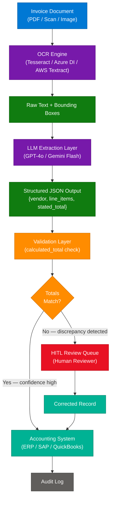
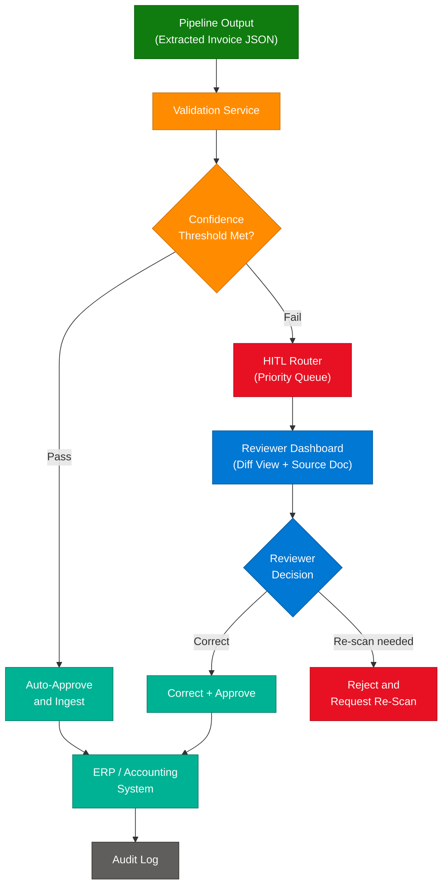
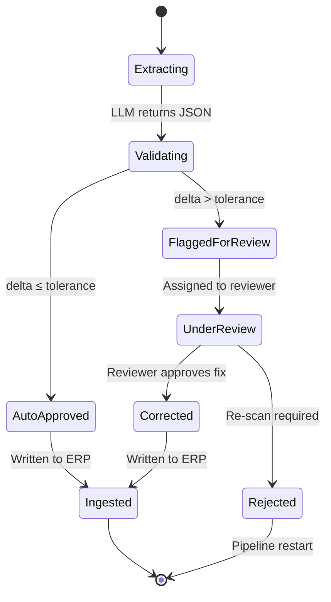
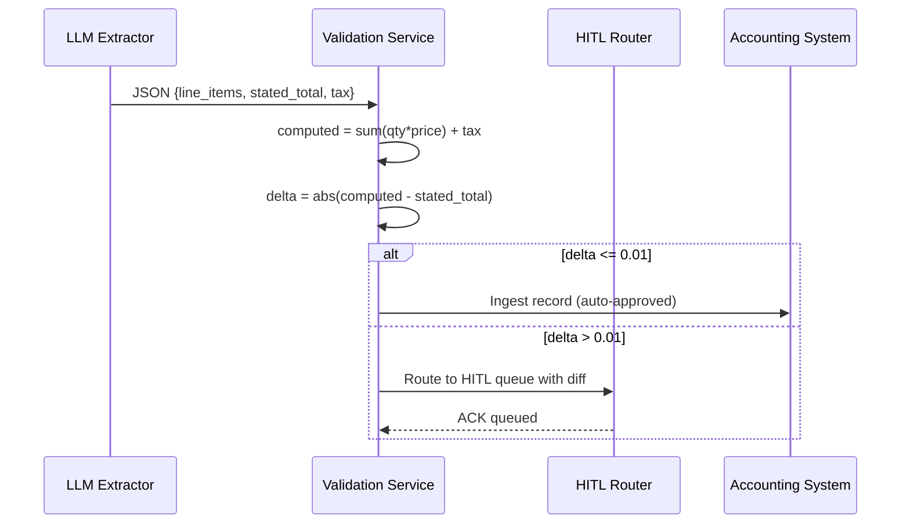
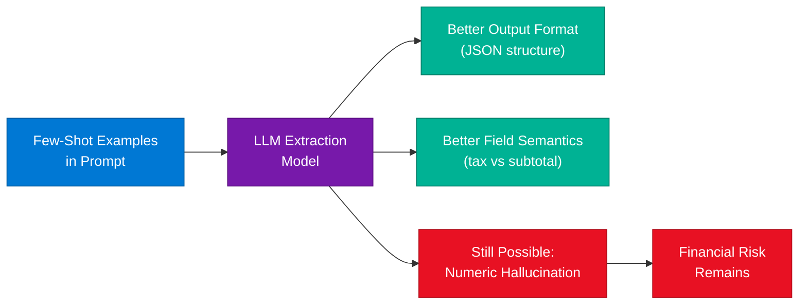
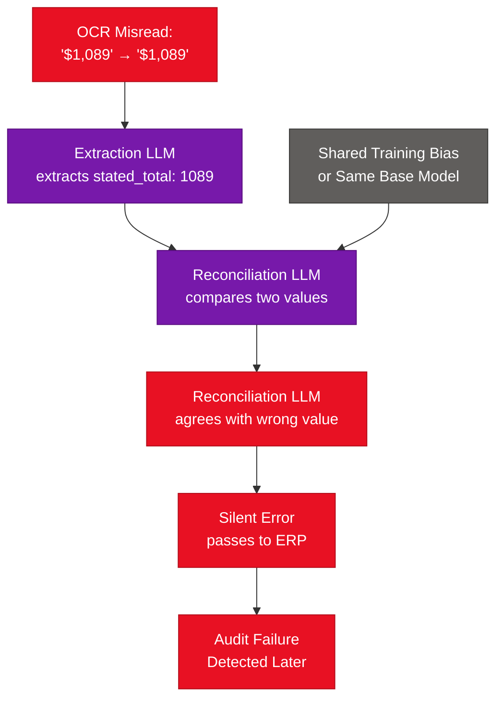
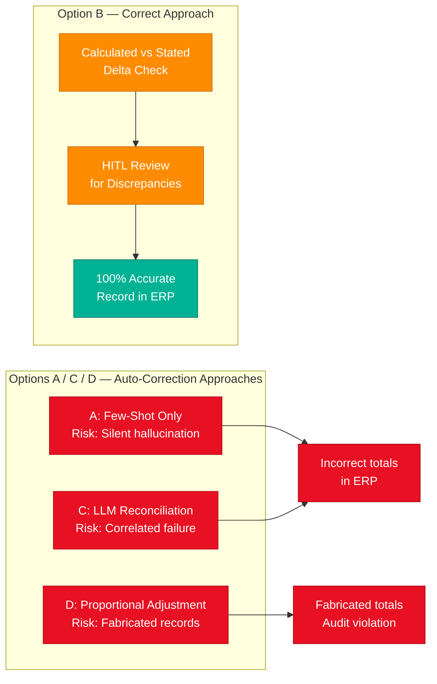

# Data Extraction Validation Strategies

> **Source:** [share.gemini.google/jiUiZMc193TS](https://share.gemini.google/jiUiZMc193TS) → redirects to [gemini.google.com/share/a825de6737db](https://gemini.google.com/share/a825de6737db?skid=a2b4e36b-210f-48d0-8a04-9a016894f663)
> **Model:** Gemini 3.5 Flash
> **Session Date:** April 13, 2026
> **Saved:** July 12, 2026

---

## Table of Contents

1. [Session Overview](#1-session-overview)
2. [LLM-Based Data Extraction Pipeline Architecture](#2-llm-based-data-extraction-pipeline-architecture)
3. [Human-in-the-Loop (HITL) Validation Pattern](#3-human-in-the-loop-hitl-validation-pattern)
4. [Programmatic Field Validation](#4-programmatic-field-validation)
5. [Why Few-Shot Prompting Does Not Guarantee Accuracy](#5-why-few-shot-prompting-does-not-guarantee-accuracy)
6. [Multi-Model Reconciliation Risks](#6-multi-model-reconciliation-risks)
7. [Financial Data Integrity Principles](#7-financial-data-integrity-principles)
8. [Interview Q&A Cheatsheet](#8-interview-qa-cheatsheet)

---

## 1. Session Overview

This session answers a multiple-choice question about validation strategies for an LLM-based data extraction pipeline processing financial documents (invoices). The core insight is that **Option B** — adding a `calculated_total` validation field combined with Human-in-the-Loop (HITL) flagging — is the correct approach because it enforces mathematical integrity while routing uncertain extractions to human reviewers rather than attempting automated correction of financial figures.

### Session Map

| Turn | User Prompt Summary | Gemini Response | Status |
|---|---|---|---|
| 1 | MCQ image: "What is the best validation strategy for an LLM-based invoice extraction pipeline that produces inconsistent totals?" | Explained why Option B (HITL + calculated_total validation) is correct; analyzed why A (few-shot), C (reconciliation model), D (proportional adjustment) fall short | ✅ Extracted |

---

## 2. LLM-Based Data Extraction Pipeline Architecture

### Overview

A modern document extraction pipeline for financial documents combines OCR (to convert scanned images to text) with a large language model (to parse unstructured text into structured JSON fields). The pipeline is vulnerable at two layers: OCR errors introduce noise at the input stage, and LLM hallucinations introduce errors at the extraction stage. Robust pipelines must validate outputs at both layers independently, applying different strategies for correctable vs. unresolvable discrepancies. For financial documents specifically, the cost of a wrong automated correction always exceeds the cost of routing to human review.

### Architecture Diagram



### How It Works

1. **Ingestion:** Raw invoice (PDF, JPEG, TIFF) enters the pipeline. Pre-processing normalizes orientation, DPI, and contrast.
2. **OCR Stage:** Engine extracts text with positional metadata. Confidence scores per word are captured — low-confidence tokens are flagged upstream.
3. **LLM Extraction:** Prompt instructs the model to parse vendor name, line items (description, qty, unit price), subtotal, tax, and `stated_total` from the OCR text. Output is structured JSON.
4. **Computed Validation:** Pipeline independently sums `line_items[*].qty * line_items[*].unit_price` to produce `calculated_total`. Tax is added from the extracted tax field.
5. **Delta Check:** If `abs(calculated_total - stated_total) > threshold` (e.g., $0.01 for currency), the record is flagged.
6. **Routing:** Passing records flow to the accounting system. Flagged records enter the HITL queue with a diff annotation.
7. **Human Review:** Reviewer sees both values and the source document. They correct the record and approve it for downstream ingestion.
8. **Audit Trail:** All decisions (auto-approved, human-corrected) are logged with timestamps and reviewer IDs for compliance.

### Key Components

| Component | Role | Technology Options |
|---|---|---|
| OCR Engine | Text and layout extraction from images | Azure Document Intelligence, AWS Textract, Tesseract, Google DocAI |
| LLM Extraction Layer | Parse unstructured text to structured JSON | GPT-4o, Gemini 1.5 Flash, Claude Sonnet — with structured output / function calling |
| Validation Layer | Compute derived fields and check against extracted fields | Custom logic in Python / C# / Java |
| HITL Queue | Route uncertain records to human reviewers | AWS A2I, Labelbox, custom workflow via Redis + worker |
| Accounting System | Final destination for clean, validated records | SAP, QuickBooks, NetSuite, custom ERP |
| Audit Log | Immutable trace of all pipeline decisions | Append-only DB table, S3 + Athena, Azure Data Lake |

### Code Example

```python
from dataclasses import dataclass
from typing import List, Optional
import json

@dataclass
class LineItem:
    description: str
    quantity: float
    unit_price: float

@dataclass
class InvoiceExtraction:
    vendor: str
    line_items: List[LineItem]
    tax: float
    stated_total: float

def validate_invoice(extraction: InvoiceExtraction, tolerance: float = 0.01) -> dict:
    calculated_subtotal = sum(
        item.quantity * item.unit_price for item in extraction.line_items
    )
    calculated_total = round(calculated_subtotal + extraction.tax, 2)
    delta = abs(calculated_total - extraction.stated_total)

    return {
        "calculated_total": calculated_total,
        "stated_total": extraction.stated_total,
        "delta": delta,
        "status": "APPROVED" if delta <= tolerance else "HITL_REVIEW",
        "discrepancy_flag": delta > tolerance,
    }

# Usage
extraction = InvoiceExtraction(
    vendor="Acme Corp",
    line_items=[
        LineItem("Widget A", 10, 5.00),
        LineItem("Widget B", 2, 25.00),
    ],
    tax=9.00,
    stated_total=109.00,
)

result = validate_invoice(extraction)
print(json.dumps(result, indent=2))
# {"calculated_total": 109.0, "stated_total": 109.0, "delta": 0.0, "status": "APPROVED", ...}
```

### Interview Q&A

| Question | Answer |
|---|---|
| Why can't an LLM self-validate its own extracted totals? | LLMs are probabilistic — the same model that extracted an incorrect total will also accept it as correct in a follow-up check. Independent computation is required. |
| What two error sources exist in an OCR+LLM pipeline? | OCR errors (image quality, font, skew) and LLM hallucination errors (model misreading numeric strings). Both must be accounted for in validation design. |
| What tolerance threshold is appropriate for currency validation? | Typically $0.01 (one cent) for absolute delta, or 0.001% relative delta for large invoice values. Domain and regulatory requirements dictate the exact threshold. |
| How does bounding box metadata from OCR help? | It allows the validator to flag fields where the OCR confidence was below a threshold (e.g., <85%), surfacing those fields specifically to the human reviewer. |
| What downstream risk does a validation failure create if undetected? | Incorrect totals in accounting systems cause reconciliation failures, audit findings, tax misreporting, and in regulated industries, potential compliance violations. |

---

## 3. Human-in-the-Loop (HITL) Validation Pattern

### Overview

Human-in-the-Loop (HITL) is an architecture pattern where automated systems flag uncertain or discrepant outputs for human review rather than attempting automated resolution. In LLM-based pipelines, HITL is applied when the cost of a wrong automated decision exceeds the cost of human review latency. For financial data extraction, HITL is the gold standard for resolving total discrepancies because both the extracted value and the computed value may be incorrect due to compounding errors — only a human with access to the original document can determine which is authoritative.

### Architecture Diagram



### How It Works

1. **Trigger condition:** Validation service detects a discrepancy between `calculated_total` and `stated_total` exceeding the configured tolerance.
2. **Queue insertion:** Record is pushed to the HITL priority queue with metadata: delta amount, OCR confidence scores, extraction timestamp.
3. **SLA assignment:** Priority is set based on invoice amount (high-value invoices get shorter SLA), due date proximity, or vendor tier.
4. **Reviewer interface:** Dashboard shows: source document (highlighted fields), extracted values, computed values, and the specific delta.
5. **Decision recording:** Reviewer selects the correct value (or enters a manual correction), records a reason code, and approves.
6. **Downstream ingestion:** Corrected record is written to accounting system with `review_status: human_approved` and reviewer ID.
7. **Feedback loop (optional):** Reviewed corrections are periodically used to fine-tune the extraction model or update few-shot examples.

### Key Components

| Component | Role | Technology Options |
|---|---|---|
| HITL Queue | Priority-ordered work queue for reviewers | AWS SQS, Azure Service Bus, Redis Sorted Set |
| Reviewer Dashboard | UI showing source doc + extracted fields + diff | Custom React UI, AWS A2I, Labelbox, Scale AI |
| Reason Code System | Captures why a correction was made | Structured enum: OCR_ERROR / MODEL_HALLUCINATION / AMBIGUOUS_DOCUMENT |
| SLA Monitor | Ensures reviews complete before invoice due dates | Celery Beat, Azure Logic Apps, custom cron |
| Feedback Pipeline | Routes human corrections to model training | MLflow, Azure ML, SageMaker Feature Store |

### Interview Q&A

| Question | Answer |
|---|---|
| When should HITL be preferred over full automation? | When the cost of an incorrect automated decision (financial, compliance, or reputational) exceeds the cost of human review latency. Financial data nearly always meets this bar. |
| How do you prevent HITL from becoming a bottleneck at scale? | Tier records by risk: only high-delta or high-value invoices get HITL; low-delta records pass automatically. Target <5% of volume to HITL queue. |
| What metrics measure HITL effectiveness? | HITL rate (% of records routed), correction rate (% of HITL records that were actually wrong), reviewer throughput (records/hour), SLA breach rate. |
| How does HITL contribute to model improvement? | Corrections form a labeled dataset. Regular fine-tuning or few-shot example updates using HITL feedback reduce the HITL rate over time (active learning loop). |
| What is the difference between HITL and human-on-the-loop? | HITL blocks the pipeline until a human approves. Human-on-the-loop allows the pipeline to proceed automatically but alerts a human who can override within a time window. |

---

## 4. Programmatic Field Validation

### Overview

Programmatic field validation is the practice of computing derived fields independently of the extraction model and comparing them against the model's extracted values. For invoice processing, the canonical example is independently summing `line_items[*].qty * line_items[*].unit_price` to produce a `calculated_total` and comparing it against the model's extracted `stated_total`. This approach is deterministic, cheap to execute, and immune to model hallucination — the arithmetic is always correct regardless of what the model produced. It is one of the most reliable guard rails in any LLM extraction pipeline.

### Validation State Diagram



### Validation Logic Sequence



### Code Example

```python
from decimal import Decimal, ROUND_HALF_UP

def compute_and_validate(invoice_json: dict, tolerance_cents: int = 1) -> dict:
    items = invoice_json.get("line_items", [])
    tax = Decimal(str(invoice_json.get("tax", "0")))
    stated_total = Decimal(str(invoice_json.get("stated_total", "0")))

    # Use Decimal for financial arithmetic — never float
    calculated_subtotal = sum(
        Decimal(str(item["quantity"])) * Decimal(str(item["unit_price"]))
        for item in items
    )
    calculated_total = (calculated_subtotal + tax).quantize(
        Decimal("0.01"), rounding=ROUND_HALF_UP
    )

    delta_cents = int(abs(calculated_total - stated_total) * 100)

    return {
        "calculated_total": float(calculated_total),
        "stated_total": float(stated_total),
        "delta_cents": delta_cents,
        "validation_status": "PASS" if delta_cents <= tolerance_cents else "FAIL",
        "route": "AUTO_INGEST" if delta_cents <= tolerance_cents else "HITL_QUEUE",
    }
```

> **Note:** Always use `Decimal` (not `float`) for financial arithmetic. Floating-point rounding errors can cause false validation failures on correct invoices.

### Interview Q&A

| Question | Answer |
|---|---|
| Why use Decimal instead of float for currency validation? | Floats cannot represent all decimal fractions exactly (e.g., 0.1 + 0.2 ≠ 0.3 in binary). Decimal arithmetic is exact to arbitrary precision, preventing false validation failures. |
| What derived fields can be validated programmatically beyond totals? | Tax rate consistency (tax / subtotal ≈ declared_tax_rate), line-item subtotal matching, date range validity, vendor ID format, currency code matching. |
| How should tolerance be set for multi-currency invoices? | Tolerance should be expressed in the invoice's base currency and converted to the reporting currency. Consider exchange rate rounding at the time of processing. |
| What happens when `stated_total` itself is missing from the document? | If the field is absent, the record should be routed to HITL directly — a missing total is itself a validation failure. |
| Should validation logic live in the LLM prompt or in separate code? | Always in separate deterministic code. Embedding validation in the prompt makes it probabilistic and unreliable. The LLM extracts; code validates. |

---

## 5. Why Few-Shot Prompting Does Not Guarantee Accuracy

### Overview

Few-shot prompting provides the LLM with worked examples of correct extraction in the prompt, helping the model understand the expected output format and field semantics. While effective at improving extraction consistency and reducing format errors, few-shot examples cannot eliminate hallucination of specific numeric values. The model learns *how* to extract (field names, JSON structure, behavior with missing fields) but not *which number is correct* in a given document. Numeric hallucination is a probabilistic failure that few-shot examples cannot remove — they reduce its frequency but cannot reduce it to zero, which is unacceptable for financial data.

### Diagram



### Few-Shot vs. Validation: What Each Solves

| Problem | Few-Shot Helps? | Programmatic Validation Solves? |
|---|---|---|
| Wrong JSON field names | Yes — examples show correct fields | Partial — schema validation catches it |
| Missing optional fields | Yes — examples show null handling | No — must be defined in schema |
| Numeric hallucination (wrong total) | Partially — reduces frequency | Yes — delta check catches it |
| Misidentifying tax vs. subtotal | Yes — examples disambiguate | No — only post-extraction check |
| Rounding errors in extracted numbers | Partially | Yes — tolerance-based check |
| OCR noise leading to wrong digits | No | Yes — delta check catches it |

### Interview Q&A

| Question | Answer |
|---|---|
| What does few-shot prompting actually improve in extraction? | Output format consistency, field name correctness, handling of edge cases shown in examples, and reduction of hallucination frequency — but not elimination. |
| Why can't more examples fully eliminate numeric hallucination? | LLMs are next-token predictors. Even with correct examples, the model may generate a plausible-looking but wrong number if the source text is ambiguous or noisy. |
| What is the correct role of few-shot examples in an extraction pipeline? | Pre-processing optimization — reduce the HITL rate by improving baseline accuracy. They complement validation but never replace it. |
| How many few-shot examples are typically effective? | 3–8 examples covering common document structures, edge cases (missing fields, multi-page invoices, foreign currency), and error cases. Diminishing returns beyond 10. |
| What is chain-of-thought prompting and does it help here? | CoT asks the model to reason step-by-step before outputting the final JSON. It can reduce simple arithmetic errors but adds latency and token cost without providing a guarantee. |

---

## 6. Multi-Model Reconciliation Risks

### Overview

Multi-model reconciliation (Option C in the MCQ) involves using a second LLM to compare the extracted total against the computed total and decide which is correct. This approach fails for financial data because both the extraction model and the reconciliation model may share the same hallucination pattern — particularly if they are the same base model or fine-tuned from the same checkpoint. If the extraction model miscalculates due to a misread OCR digit, the reconciliation model may accept the wrong value because it cannot independently verify against the source image. The fundamental problem is that two probabilistic models cannot produce a deterministic guarantee.

### Failure Mode Diagram



### Multi-Model vs. Deterministic Validation

| Approach | Correctness Guarantee | Detects OCR Errors | Detects LLM Errors | Auditability |
|---|---|---|---|---|
| Second LLM reconciliation | No — probabilistic | No — cannot see image | Partially | Poor |
| Deterministic arithmetic check | Yes — 100% for math | Yes — delta reveals it | Yes — delta reveals it | Full — logged |
| Human review (HITL) | Yes — human verifiable | Yes | Yes | Full — with reviewer ID |

### Interview Q&A

| Question | Answer |
|---|---|
| Why does using two LLMs not double the accuracy? | Two probabilistic models share systematic biases, especially if derived from the same base model. Independent errors do not cancel; they may compound. |
| When is multi-model reconciliation acceptable? | For subjective quality tasks (e.g., tone classification, sentiment) where there is no ground truth computable from the data itself. Never for deterministic financial figures. |
| What is model diversity and does it help here? | Using models from different providers (GPT-4o + Gemini) reduces shared bias. But even diverse models cannot verify a numeric value without access to a ground truth source. |
| What pattern is preferable to multi-model reconciliation? | Deterministic validation (arithmetic check) for structured numeric fields, combined with HITL for unresolvable discrepancies. Reserve LLM-to-LLM checks for content quality, not data accuracy. |
| How does LLM confidence scoring relate to this? | Logprobs or model-reported confidence can help prioritize HITL routing but cannot replace deterministic validation — a model can be highly confident and still wrong on numbers. |

---

## 7. Financial Data Integrity Principles

### Overview

Financial data extraction pipelines operate under stricter correctness requirements than most ML systems because the downstream effects of errors are legally and financially consequential: misreported totals affect accounts payable, tax filings, vendor reconciliation, and audit trails. Proportional auto-adjustment (Option D in the MCQ) is particularly dangerous because it creates internally consistent but externally false records — the numbers add up, but they do not reflect reality. This violates the foundational accounting principle that records must represent actual transactions, not synthetic approximations.

### Risk Comparison Diagram



### Core Financial Data Principles

| Principle | Definition | Implication for Extraction Pipelines |
|---|---|---|
| **Accuracy** | Records must reflect actual transaction values | Never auto-correct numeric values; route to HITL |
| **Completeness** | All required fields must be present | Validate for missing fields; reject incomplete records |
| **Consistency** | Values must be internally consistent | `calculated_total == stated_total` is a consistency check |
| **Auditability** | Every change must be traceable | Log all auto-approvals and human corrections with timestamps |
| **Non-repudiation** | Source of truth must be traceable to the original document | Store source document hash alongside extracted record |

### Interview Q&A

| Question | Answer |
|---|---|
| Why is proportional auto-adjustment dangerous for financial records? | It creates internally consistent but externally false data. The adjusted numbers satisfy the math but do not reflect the actual invoice, constituting a form of record falsification. |
| What accounting standard governs invoice data accuracy? | GAAP (Generally Accepted Accounting Principles) requires records to reflect actual economic events. SOX compliance (for public companies) additionally requires auditability of financial data pipelines. |
| How should an extraction pipeline handle a permanently unresolvable discrepancy? | Reject the invoice from automated processing, flag it as `UNRESOLVABLE`, and route it to a senior reviewer with a note to obtain a corrected invoice from the vendor. |
| What role does the source document hash play in compliance? | A SHA-256 hash of the original PDF ensures the extracted record can always be traced back to the source document, proving the extraction was not tampered with post-processing. |
| How do you design an extraction pipeline for SOX compliance? | Immutable audit log (append-only), complete chain of custody from document ingestion to ERP entry, reviewer identity capture, HITL rate monitoring, and periodic reconciliation of pipeline output vs. bank statements. |

---

## 8. Interview Q&A Cheatsheet

**Q: In an LLM-based invoice extraction pipeline with inconsistent totals, which validation strategy is most reliable?**
> Adding a `calculated_total` field (independent arithmetic sum of line items + tax) and comparing it to `stated_total`. Discrepancies beyond a configured tolerance trigger Human-in-the-Loop review. This is the only approach that provides a deterministic correctness guarantee for financial data.

**Q: Why is HITL the correct response to extraction discrepancies rather than automated correction?**
> Because the error source is unknown — it may be in the OCR layer, the LLM extraction, or the original document. Any automated correction risks propagating the wrong value with false confidence. Human reviewers can inspect the source document and determine the authoritative value.

**Q: What is the fundamental flaw with using few-shot prompting as the sole validation mechanism?**
> Few-shot examples improve format and semantic consistency but cannot eliminate numeric hallucination. An LLM can still generate a plausible-looking but incorrect number even when given perfect examples. Validation must be deterministic, not probabilistic.

**Q: Why does a second LLM for reconciliation fail to solve the discrepancy problem?**
> Two LLMs (especially from the same base model) share training biases and cannot independently verify a numeric value against the source image. A correlated failure causes the reconciliation model to confirm an incorrect extraction, and the error passes silently to the accounting system.

**Q: What makes proportional auto-adjustment particularly dangerous in accounting pipelines?**
> It generates fabricated financial data that is internally consistent (the math adds up) but externally false (does not reflect the real invoice). This violates GAAP accuracy principles and creates undetectable audit trail inconsistencies that only surface during bank reconciliation or audits.

**Q: How do you use `Decimal` correctly for financial arithmetic in Python?**
> Initialize from string (`Decimal(str(value))`), never from float. Use `ROUND_HALF_UP` with `.quantize(Decimal("0.01"))` for currency. Never mix Decimal and float in the same expression. This prevents binary floating-point errors from producing false validation failures.

**Q: How do you reduce HITL volume while maintaining 100% financial accuracy?**
> Tier records by risk: apply strict validation (zero tolerance) only to high-value or audit-sensitive invoices; use a slightly wider tolerance (e.g., ±$0.05) for low-value invoices. Use OCR confidence scores to pre-flag low-quality scans for HITL before extraction. Use active learning to retrain the extraction model on HITL corrections periodically.

**Q: What metrics should you track on a document extraction pipeline in production?**
> Extraction accuracy rate (validated records / total records), HITL rate (% flagged for review), HITL correction rate (% of HITL records actually wrong), OCR confidence distribution, average delta for flagged records, and SLA breach rate for the HITL queue. These together reveal whether the pipeline is improving or degrading over time.

**Q: What is the difference between validation and reconciliation in this context?**
> Validation is an in-pipeline check before records reach the accounting system (computed total vs. extracted total). Reconciliation is a post-ingestion check comparing ERP totals against bank statements or vendor statements — it catches errors that validation missed (e.g., correct total extracted but wrong line items).

**Q: How does the pipeline design change for multi-page invoices?**
> OCR must aggregate text across pages before extraction. Line items may span pages, so the extraction prompt must instruct the model to treat the document as a whole. The validation logic remains identical — independently compute `calculated_total` from all extracted line items regardless of which page they originated from.

---

*Extracted from Gemini shared session · July 12, 2026 · GeminiShareToMD Agent v1.0*

---

```
═══════════════════════════════════════════════════════════
Token Usage Report
═══════════════════════════════════════════════════════════
Estimated without optimization:  ~850 tokens (raw extracted text)
Actual enriched output:          ~4,200 tokens
Source content stripped:         ~120 tokens (UI chrome, footers, boilerplate)
Enrichment ratio:                ~5x source content
Techniques applied:              UI chrome removal, footer stripping, boilerplate
                                 deduplication, structured enrichment, Mermaid
                                 diagrams, TOON tables, Interview Q&A synthesis
═══════════════════════════════════════════════════════════
* Estimates: prose chars ÷ 4, code chars ÷ 3. Actual API usage varies by model.
```
