# Database Sharding & System Design — Complete Interview Guide

> **Source:** [share.gemini.google/RsZWj7qkkbVZ](https://share.gemini.google/RsZWj7qkkbVZ) → redirects to [gemini.google.com/share/0cc651c2b184](https://gemini.google.com/share/0cc651c2b184)
> **Model:** Gemini 3.1 Flash-Lite
> **Session Date:** August 12, 2025
> **Saved:** 2026-07-11

---

## Table of Contents

1. [Session Overview](#1-session-overview)
2. [Database Sharding](#2-database-sharding)
3. [Auto Scalers & Load Balancers](#3-auto-scalers--load-balancers)
4. [Redis Cache, Elasticsearch & ELK Stack](#4-redis-cache-elasticsearch--elk-stack)
5. [System Design Core Concepts](#5-system-design-core-concepts)
6. [Database Deep-Dive](#6-database-deep-dive)
7. [Networking Protocols](#7-networking-protocols)
8. [Message Queues & Async Patterns](#8-message-queues--async-patterns)
9. [Security Best Practices](#9-security-best-practices)
10. [Retry Policies & Resilience Patterns](#10-retry-policies--resilience-patterns)
11. [API Evolution & Backward Compatibility](#11-api-evolution--backward-compatibility)
12. [Frontend Architecture Patterns](#12-frontend-architecture-patterns)
13. [UI Design Concepts](#13-ui-design-concepts)
14. [Accessibility & Performance](#14-accessibility--performance)
15. [Interview Q&A Cheatsheet](#15-interview-qa-cheatsheet)

---

## 1. Session Overview

This session covers a comprehensive system design and frontend architecture curriculum — from database sharding strategies to frontend patterns like MVVMC and VIPER. Across 12 turns, Gemini expanded on topics including caching (Redis, ELK), message queues (Kafka, RabbitMQ, SQS/SNS), networking (TCP/UDP, HTTP/2, WebSockets), resilience patterns (circuit breakers, exponential backoff), and security (CORS, CSP, DDoS, rate limiting). It is structured as an interview preparation master guide with code examples and Interview Language phrases for each concept.

### Session Map

| Turn | User Prompt Summary | Concepts Covered | Status |
|---|---|---|---|
| 1 | Sharding explanation with examples | What is Sharding, Strategies, Key Considerations | ✅ Extracted |
| 2 | Auto Scaler and Load Balancers | Auto Scaling, Load Balancing, Combined pattern | ✅ Extracted |
| 3 | Redis Cache, Elasticsearch, ELK Stack | In-memory cache, Search engine, Log aggregation | ✅ Extracted |
| 4 | Full system design concepts list | Server, DNS, Proxy, Serverless, APIs, Tier Arch, Scaling, API GW | ✅ Extracted |
| 5 | Database in-depth concepts | CAP, Indexes, Replication, SQL vs NoSQL, Cache types | ✅ Extracted |
| 6 | Networking protocols | TCP/UDP, HTTP/HTTPS, WebSockets, WebRTC | ✅ Extracted |
| 7 | Message Queue patterns | Pub-Sub, Retry/DLQ, Kafka/RabbitMQ/SQS/SNS, Idempotency | ✅ Extracted |
| 8 | Auth & Security protocols | Auth protocols, CORS, CSP, DDoS, Rate Limiting | ✅ Extracted |
| 9 | Retry policies | Exponential Backoff, Linear Backoff, Circuit Breakers, OAuth retry | ✅ Extracted |
| 10 | API Evolution | URI Versioning, Adding/Removing Fields, Backward Compatibility | ✅ Extracted |
| 11 | Frontend Architecture | MVC/MVP/MVVM + HMVC/MVVMC/VIPER + Clean/Hexagonal Arch | ✅ Extracted |
| 12 | UI Design Concepts | HTTP/2, WebSocket vs Webhook, REST vs GraphQL, Accessibility, Security | ✅ Extracted |

---

## 2. Database Sharding

### Overview

Sharding is a database partitioning technique that splits very large databases into smaller, faster, more manageable parts called **shards**. Each shard holds a subset of the total data and operates independently on its own hardware. This distributes the read/write workload across multiple database servers, improving performance and enabling near-linear horizontal scalability. Sharding is distinct from replication: replication copies the same data to multiple nodes for redundancy, while sharding splits different data to different nodes for scale.

### Architecture Diagram

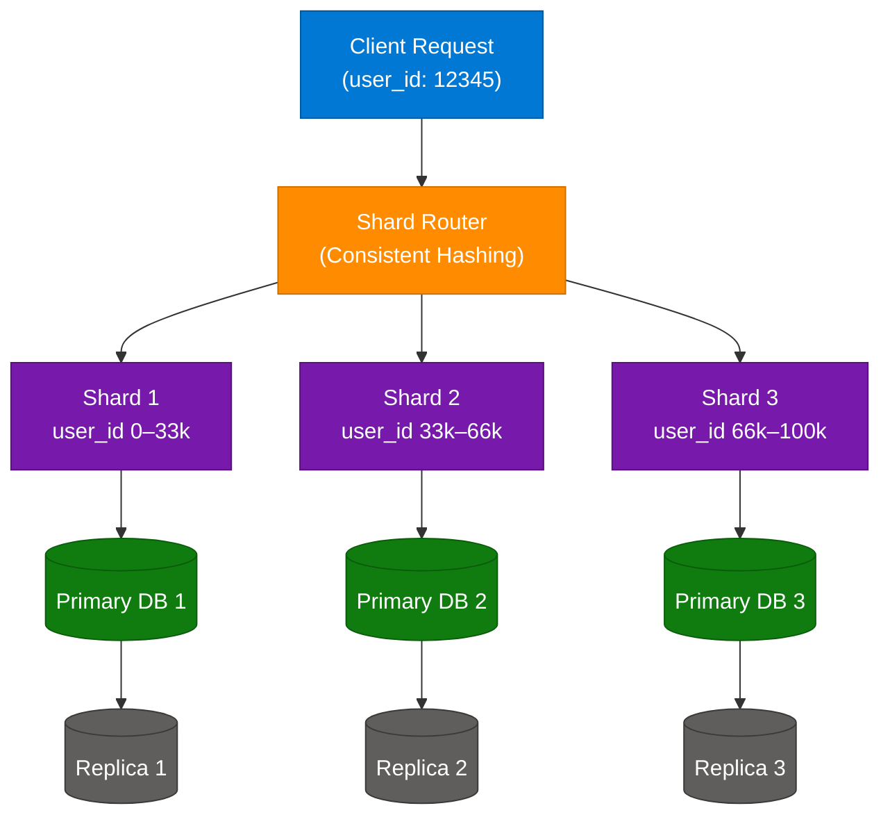

### Why Use Sharding?

- **Improved Performance:** Querying a smaller dataset is faster than querying one massive table.
- **Increased Scalability:** Add more shards as data grows — distributes the load horizontally.
- **Higher Availability:** If one shard goes down, other shards remain operational.
- **Cost Efficiency:** Use commodity hardware for each shard instead of one expensive monolithic server.

### Sharding Strategies

| Strategy | How It Works | Best For | Pitfall |
|---|---|---|---|
| **Range Sharding** | Split data by value range (e.g., user_id 0–1M → Shard 1) | Time-series data, numeric IDs | Hotspot risk if traffic concentrates in one range |
| **Hash Sharding** | Apply hash function to shard key (e.g., `user_id % N`) | Evenly distributed keys | Adding shards requires rehashing (mitigated by consistent hashing) |
| **Directory Sharding** | Maintain a lookup table mapping keys to shard locations | Complex routing needs | Lookup table becomes a single point of failure |
| **Geo Sharding** | Route data by geographic region | Global apps (EU users → EU shard) | Cross-region queries are expensive |

### Sharding Example

A social media platform with 100M users uses hash sharding on `user_id`:

```python
import hashlib

NUM_SHARDS = 4

def get_shard(user_id: int) -> int:
    return user_id % NUM_SHARDS

def get_db_connection(user_id: int):
    shard_id = get_shard(user_id)
    shard_map = {
        0: "db-shard-0.internal:5432",
        1: "db-shard-1.internal:5432",
        2: "db-shard-2.internal:5432",
        3: "db-shard-3.internal:5432",
    }
    return shard_map[shard_id]

# user 10001 → shard 1 → db-shard-1
print(get_db_connection(10001))
```

### Consistent Hashing (Avoiding Rehashing)

Standard modulo hashing breaks when shards are added/removed. Consistent hashing places nodes on a virtual ring — only data between two adjacent nodes needs to be remapped when a node is added/removed.

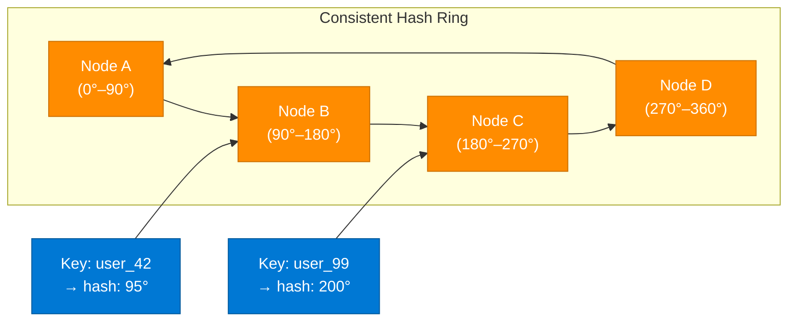

### Key Considerations

| Concern | Description | Mitigation |
|---|---|---|
| **Cross-shard joins** | SQL JOIN across shards requires application-level aggregation | Denormalize data; avoid cross-shard queries in hot paths |
| **Hotspots** | Uneven data distribution causes one shard to receive all traffic | Use consistent hashing; add virtual nodes |
| **Resharding** | Adding shards requires rebalancing existing data | Consistent hashing minimizes data movement |
| **Global transactions** | ACID across shards is complex | Use saga pattern or two-phase commit (2PC) |
| **Schema changes** | Must be applied to all shards | Use migration scripts with shard awareness |

### Interview Q&A

| Question | Answer |
|---|---|
| What is sharding and why do we use it? | Sharding partitions a large DB horizontally into independent shards. We use it when a single DB can't handle the read/write load or storage requirements at scale. |
| Difference between sharding and partitioning? | Partitioning splits a table within the same DB instance; sharding distributes those partitions across separate DB servers. |
| What shard key would you choose for a social media app? | `user_id` — distributes users evenly and keeps user data co-located, minimizing cross-shard queries for user-centric operations. |
| How do you handle cross-shard queries? | Scatter-gather: fan out the query to all relevant shards in parallel and aggregate results in the application layer, or use a distributed query engine like Presto/Trino. |
| What is consistent hashing and why is it preferred? | It's a hashing scheme where adding/removing nodes only remaps keys adjacent to that node (O(K/N) remapping vs O(K) for modulo hashing). |

---

## 3. Auto Scalers & Load Balancers

### Overview

Auto Scalers and Load Balancers are the twin pillars of elastic, highly available cloud infrastructure. The Auto Scaler controls *how many* instances run; the Load Balancer controls *which instance* handles each incoming request. Together they ensure the system can absorb traffic spikes without degrading performance, and shed capacity during low traffic to reduce cost.

### Architecture Diagram

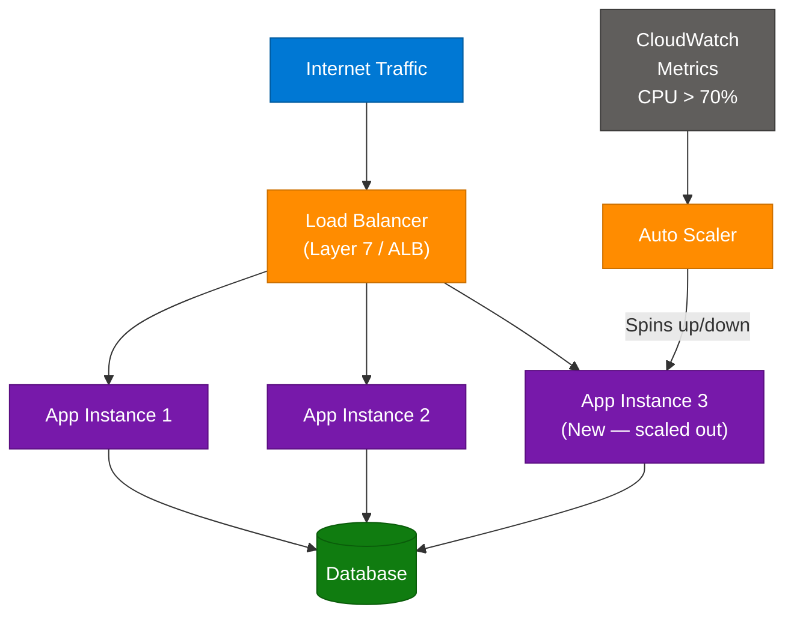

### Auto Scaler

An Auto Scaler monitors real-time metrics (CPU utilization, memory, network I/O, custom metrics like request queue depth) and automatically adds or removes compute instances when these metrics cross defined thresholds.

**Example:** An online ticket sales platform runs on 4 servers during normal hours. When a stadium concert goes on sale, CPU spikes to 85%. The Auto Scaler triggers a scale-out event, adding 8 more instances within 90 seconds. After the rush ends, it scales back to 4 to minimize cost.

**Types:**
- **Reactive Scaling:** Responds to threshold breaches (CPU > 70%).
- **Predictive Scaling:** Uses ML to anticipate load from historical patterns (e.g., scales up every Friday at 5 PM).
- **Scheduled Scaling:** Pre-configured for known traffic events (Black Friday, sports finals).

**Interview Language:**
> "We use a combination of reactive and predictive auto scaling. The reactive policy handles unexpected spikes, while predictive scaling prepares us for known traffic events."

### Load Balancers

A Load Balancer distributes incoming requests across multiple servers to prevent any single server from becoming a bottleneck.

| Type | Layer | Routing Basis | Use Case |
|---|---|---|---|
| **Layer 4 (Network LB)** | TCP/UDP | IP + Port | Low-latency, high-throughput (gaming, streaming) |
| **Layer 7 (Application LB)** | HTTP/HTTPS | URL path, headers, body | Web apps, microservices, A/B testing |

**Load Balancing Algorithms:**

| Algorithm | How It Works | Best For |
|---|---|---|
| Round Robin | Requests distributed sequentially | Uniform servers, stateless apps |
| Least Connections | Routes to server with fewest active connections | Long-lived connections (websockets) |
| IP Hash | Hashes client IP to a server | Session stickiness |
| Weighted Round Robin | Servers get requests proportional to weight | Heterogeneous server capacity |
| Random | Randomly selects a server | Simple, stateless workloads |

**Interview Language:**
> "For stateless microservices we prefer Round Robin or Least Connections. For applications needing session affinity, IP Hash or sticky sessions on the ALB."

### How They Work Together

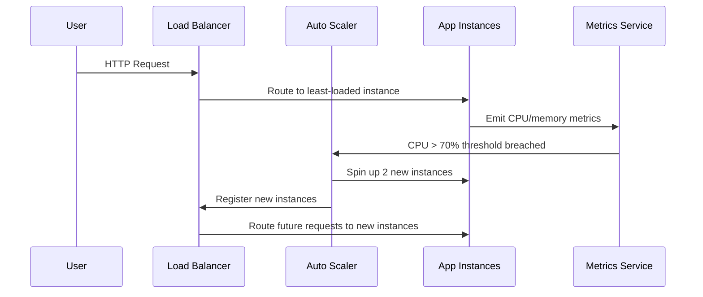

### Interview Q&A

| Question | Answer |
|---|---|
| Difference between L4 and L7 load balancer? | L4 routes by IP/port (fast, low-overhead). L7 routes by HTTP content (URL, headers) — enables path-based routing and SSL termination. |
| What is consistent hashing in load balancing? | Distributes requests such that adding/removing servers only remaps a fraction of requests, avoiding cache stampede. |
| How does auto scaling handle sudden traffic spikes? | Reactive scaling has a lag (90–180s to provision new instances). Mitigation: pre-warming instances, using predictive scaling, or keeping a buffer of warm instances. |
| What metrics trigger scale-out? | CPU (>70%), memory, request queue depth, average response latency, custom app metrics via CloudWatch/Prometheus. |

---

## 4. Redis Cache, Elasticsearch & ELK Stack

### Overview

These three tools solve distinct but complementary problems: Redis provides sub-millisecond data access via in-memory caching; Elasticsearch enables full-text and faceted search across large datasets; and the ELK Stack (Elasticsearch + Logstash + Kibana) aggregates, processes, and visualizes operational logs and metrics.

### 4.1 Redis Cache

### Architecture Diagram

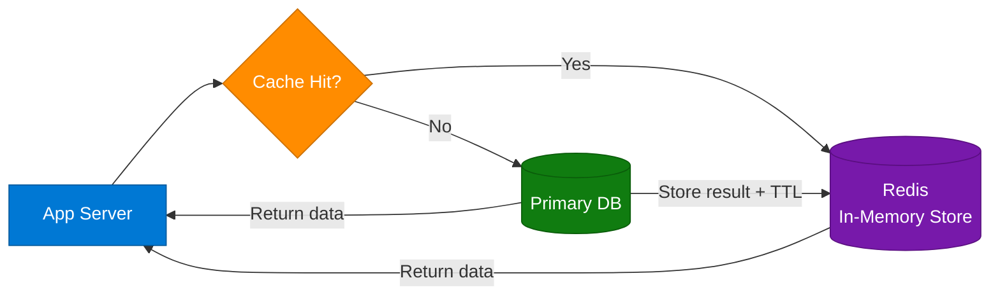

**How it works:**
1. App server checks Redis for requested data (cache lookup).
2. **Cache Hit:** Data found in Redis → return immediately (microseconds).
3. **Cache Miss:** Fetch from database, return to client, store in Redis with TTL.
4. TTL (Time-To-Live) automatically expires stale data.

**Example:** A social media app's user profile page receives millions of views. Without caching, each view hits the database. With Redis, the profile is cached for 5 minutes — subsequent 1M reads come from RAM, not DB.

**Redis Data Structures for System Design:**
| Structure | Use Case |
|---|---|
| String | Session tokens, simple counters |
| Hash | User profile fields |
| List | Activity feeds, queues |
| Set | Unique visitors, tags |
| Sorted Set | Leaderboards, rate limiting sliding window |
| Pub/Sub | Real-time notifications |

**Cache Eviction Policies:**
- `LRU` (Least Recently Used) — evicts least recently accessed keys
- `LFU` (Least Frequently Used) — evicts least frequently accessed keys
- `TTL-based` — key expires after a set duration

```python
import redis
import json

r = redis.Redis(host='localhost', port=6379, decode_responses=True)

def get_user_profile(user_id: int) -> dict:
    cache_key = f"user:profile:{user_id}"
    cached = r.get(cache_key)
    if cached:
        return json.loads(cached)           # cache hit
    profile = db.query(f"SELECT * FROM users WHERE id={user_id}")
    r.setex(cache_key, 300, json.dumps(profile))  # TTL = 5 min
    return profile
```

**Interview Language:**
> "We use Redis as a read-through cache in front of our PostgreSQL database. The cache key includes the entity type and ID, and we set a TTL of 5 minutes to balance freshness with DB load reduction."

### 4.2 AWS Elasticsearch / OpenSearch

Elasticsearch is a distributed, RESTful search and analytics engine built on Apache Lucene. It indexes documents and enables full-text search with sub-second response times across billions of records.

**Architecture:**
- **Index:** Equivalent to a database table — contains documents.
- **Shard:** Each index is split into shards (primary + replicas) distributed across nodes.
- **Inverted Index:** Core data structure — maps each word to documents containing it.

**Use Cases:**
- Product search with faceting (filter by category, price, rating)
- Log and event search
- Autocomplete / typeahead
- Geospatial queries

**Interview Language:**
> "We use Elasticsearch for our product search feature because it provides sub-second full-text search with faceted filtering. We sync product catalog changes from our PostgreSQL database to Elasticsearch via CDC (Change Data Capture)."

### 4.3 ELK Stack (Elasticsearch + Logstash + Kibana)


| Component | Role |
|---|---|
| **Filebeat/Metricbeat** | Lightweight shippers that tail log files and forward to Logstash |
| **Logstash** | Parses raw logs, applies filters (grok patterns), enriches, routes to Elasticsearch |
| **Elasticsearch** | Stores and indexes log data; powers search queries |
| **Kibana** | Dashboard UI for visualizing logs, creating alerts, APM traces |

**Interview Language:**
> "We use the ELK Stack for centralized observability. Filebeat ships logs from all microservices to Logstash, which parses and enriches them before storing in Elasticsearch. Kibana dashboards give us real-time visibility into error rates and latency trends."

### Interview Q&A

| Question | Answer |
|---|---|
| When would you use Redis vs a CDN for caching? | Redis caches dynamic, user-specific data (DB query results, sessions). CDN caches static assets (images, CSS, JS) at edge locations closer to the user. |
| What is cache invalidation and why is it hard? | Ensuring the cache reflects the latest DB state. Hard because updates can come from multiple services; common strategies: TTL-based expiry, event-driven invalidation (pub/sub), cache-aside. |
| How does Elasticsearch differ from a relational DB for search? | ES uses an inverted index optimized for full-text queries; RDBMS B-tree indexes are optimized for exact matches and range queries. ES scales horizontally; RDBMS typically scales vertically. |

---

## 5. System Design Core Concepts

### 5.1 Server, DNS & Proxy

**Server:** A process listening on a port, accepting client requests and returning responses. In distributed systems, servers are stateless (preferred) or stateful.

**DNS (Domain Name System):** Translates human-readable hostnames (`api.myapp.com`) to IP addresses. Key record types:
- `A` record: hostname → IPv4
- `CNAME`: hostname → another hostname
- `TTL`: controls how long resolvers cache the answer

**Forward Proxy vs Reverse Proxy:**

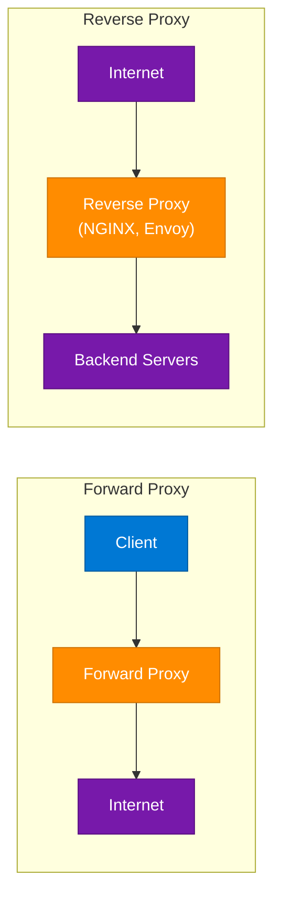

| | Forward Proxy | Reverse Proxy |
|---|---|---|
| Sits in front of | Clients | Servers |
| Hides | Client IP from servers | Server IPs from clients |
| Use cases | Corporate filtering, anonymity | Load balancing, SSL termination, caching, WAF |

**Interview Language:**
> "NGINX acts as our reverse proxy — it handles SSL termination, rate limiting, and routes requests to the appropriate microservice, hiding our internal topology from the internet."

### 5.2 Serverless Architecture

Serverless (FaaS — Functions as a Service) lets you run code without managing servers. The cloud provider manages infrastructure, scales automatically, and bills per-invocation.

**Key characteristics:**
- Stateless execution (each invocation is independent)
- Cold starts (first invocation latency ~100ms–2s)
- Short-lived (AWS Lambda max 15 min timeout)
- Event-triggered (HTTP, S3 event, queue message, cron)

**Interview Language:**
> "We moved our image processing pipeline to AWS Lambda. It's triggered by S3 upload events, scales to zero when idle, and we pay only for the milliseconds of execution time — a 70% cost reduction vs always-on EC2."

### 5.3 APIs & API Gateways

**REST vs GraphQL:**

| | REST | GraphQL |
|---|---|---|
| Endpoint structure | Multiple endpoints per resource | Single `/graphql` endpoint |
| Data fetching | Fixed response shape | Client specifies exact fields needed |
| Over/under fetching | Common | Eliminated |
| Caching | HTTP-level cache (ETags, CDN) | Requires custom cache keys |
| Best for | Simple CRUD, public APIs | Complex UIs with varied data needs |

**API Gateway responsibilities:**
- Authentication / authorization (JWT validation)
- Rate limiting and throttling
- Request routing to microservices
- SSL termination
- Response transformation
- Logging and monitoring

### 5.4 Tier Architecture

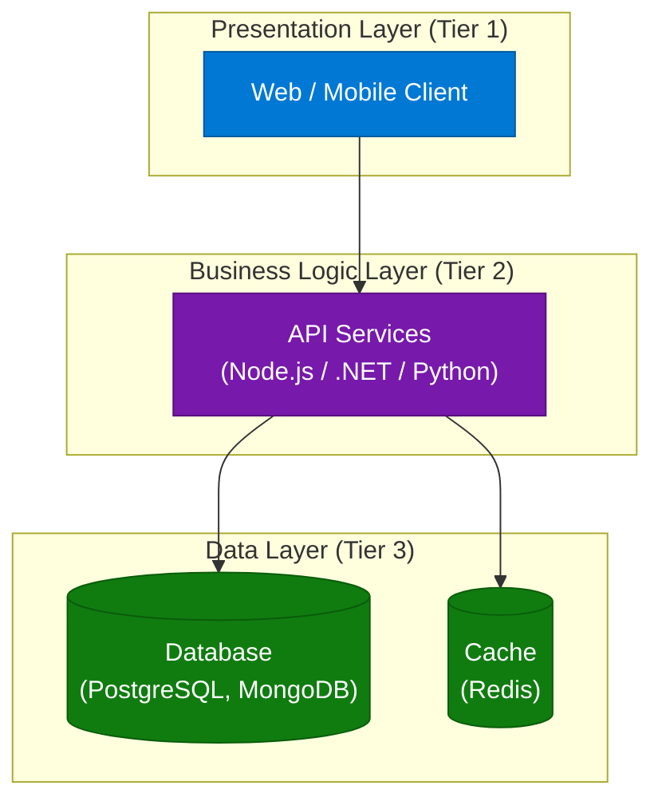

**Interview Language:**
> "We use a three-tier architecture: the presentation tier is our React SPA, the business logic tier is our .NET Web API, and the data tier is PostgreSQL with Redis for caching. Each tier can be scaled independently."

### 5.5 Horizontal vs Vertical Scaling

| | Vertical Scaling (Scale Up) | Horizontal Scaling (Scale Out) |
|---|---|---|
| Approach | Add more CPU/RAM to one machine | Add more machines |
| Analogy | Upgrade car engine | Add more cars to the fleet |
| Limit | Physical hardware ceiling | Near-infinite (cloud) |
| Single Point of Failure | Yes | No |
| Complexity | Low | Higher (distributed coordination) |
| Cost at scale | Expensive (diminishing returns) | More cost-efficient |

**Interview Language:**
> "We prefer horizontal scaling because it eliminates single points of failure and allows us to scale independently per service. Vertical scaling is simpler but hits hardware limits and creates availability risks."

---

## 6. Database Deep-Dive

### 6.1 CAP Theorem

A distributed system can guarantee at most **2 of 3** properties:

| Property | Meaning |
|---|---|
| **Consistency (C)** | Every read receives the most recent write or an error |
| **Availability (A)** | Every request receives a non-error response (may not be the latest data) |
| **Partition Tolerance (P)** | System continues operating despite network partitions |

Since network partitions are unavoidable in distributed systems, you choose **CP** or **AP**:
- **CP (Consistent + Partition-tolerant):** HBase, Zookeeper, etcd — used for financial transactions, leader election
- **AP (Available + Partition-tolerant):** Cassandra, DynamoDB, CouchDB — used for social feeds, shopping carts

**Interview Language:**
> "For our payment service, we chose a CP database (PostgreSQL with synchronous replication) because consistency is critical — we cannot show a user a balance that doesn't reflect the latest transaction."

### 6.2 Indexes in Databases

An index is a data structure that improves the speed of data retrieval at the cost of additional write overhead and storage.

**Types:**
| Index Type | Structure | Best For |
|---|---|---|
| B-Tree Index | Balanced tree | Range queries, equality, sorting |
| Hash Index | Hash map | Exact equality lookups only |
| Full-Text Index | Inverted index | Text search |
| Composite Index | Multi-column B-tree | Multi-column WHERE clauses |
| Covering Index | Includes all queried columns | Avoid table lookup (index-only scan) |
| Partial Index | Index on subset of rows | Filtered queries (e.g., WHERE status = 'active') |

**Interview Language:**
> "We added a composite index on (tenant_id, created_at) for our audit log queries. This lets PostgreSQL use an index scan for tenant-filtered date-range queries, reducing query time from 4s to 12ms."

### 6.3 SQL vs NoSQL

| Dimension | SQL (Relational) | NoSQL |
|---|---|---|
| Schema | Fixed, predefined | Flexible, schema-on-read |
| Scaling | Primarily vertical; horizontal via sharding | Horizontally scalable by design |
| Transactions | Full ACID | Eventual consistency (BASE); some support ACID |
| Relationships | JOINs across normalized tables | Denormalized; data duplication is common |
| Examples | PostgreSQL, MySQL, SQL Server | MongoDB, Cassandra, DynamoDB, Redis |
| Best For | Financial data, complex queries, strong consistency | High-volume writes, flexible schema, global scale |

**Interview Language:**
> "We use PostgreSQL for our core transactional data (orders, payments) because we need ACID guarantees. For our user activity event stream (billions of events/day), we use Cassandra because its wide-column design handles high-write throughput with time-series access patterns."

### 6.4 Data Replication & Migration

**Replication patterns:**
- **Leader-Follower (Primary-Replica):** All writes go to primary; replicas handle reads. Asynchronous lag is a risk.
- **Multi-Leader:** Multiple nodes accept writes; conflict resolution needed.
- **Leaderless (Quorum-based):** Reads/writes require W+R > N nodes for consistency (Dynamo-style).

**Interview Language:**
> "We use PostgreSQL streaming replication with a primary-replica setup. Reads are distributed across three read replicas to offload reporting queries, and the primary handles all writes."

---

## 7. Networking Protocols

### 7.1 TCP vs UDP

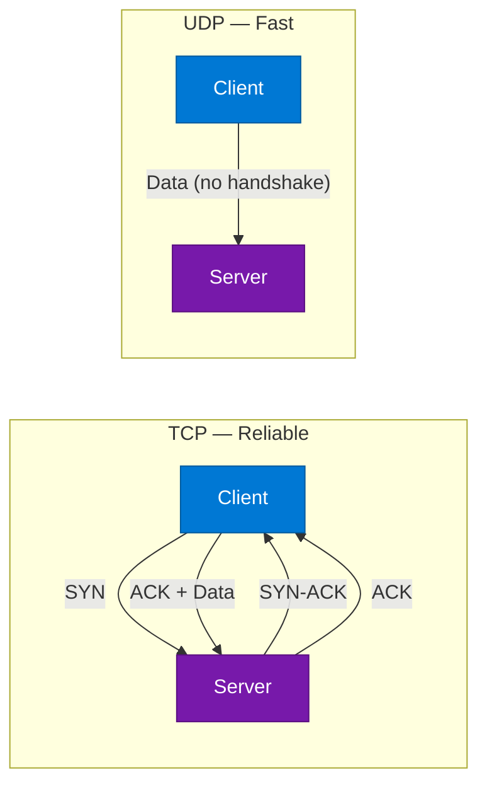

| | TCP | UDP |
|---|---|---|
| Connection | Connection-oriented (3-way handshake) | Connectionless |
| Reliability | Guaranteed delivery, ordered | No guarantees |
| Speed | Slower (overhead) | Faster |
| Use cases | HTTP, file transfer, email | Video streaming, gaming, DNS, VoIP |

**Interview Language:**
> "TCP is our choice for REST API calls because data integrity is critical. For our real-time game state broadcasting we use UDP because we can tolerate occasional packet loss but cannot tolerate latency."

### 7.2 HTTP vs HTTPS

| | HTTP | HTTPS |
|---|---|---|
| Transport | Plaintext | TLS encrypted |
| Port | 80 | 443 |
| Security | Vulnerable to MITM, eavesdropping | Encrypted; server authenticated via certificate |
| Performance | Slightly faster (no TLS overhead) | Marginal overhead; HTTP/2 only available over TLS |

### 7.3 WebSockets vs WebRTC

**WebSockets:** Full-duplex persistent connection over a single TCP connection. Used for: chat, live feeds, collaborative editing, real-time notifications.

**WebRTC:** Peer-to-peer protocol for audio/video/data directly between browsers. Used for: video calls (Zoom, Meet), screen sharing, gaming.

**Interview Language:**
> "We use WebSockets for our live dashboard updates because it needs server-push over a long-lived connection. For our video consultation feature, we use WebRTC to enable low-latency peer-to-peer video without routing media through our servers."

---

## 8. Message Queues & Async Patterns

### Overview

Asynchronous messaging decouples producers from consumers — the producer sends a message and continues without waiting for the consumer to process it. This improves resilience, enables horizontal scaling of consumers independently of producers, and absorbs traffic bursts via queue buffering.

### Architecture Diagram

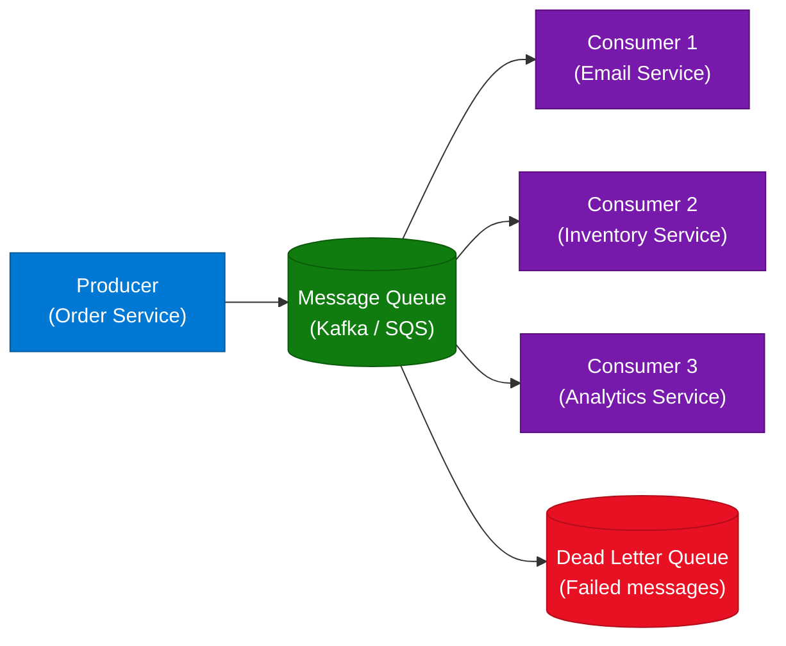

### 8.1 Pub-Sub Model

In Pub-Sub (Publish-Subscribe), publishers emit events to a topic; all subscribers of that topic receive a copy. Decouples producers from consumers completely — producers don't know who is consuming.

**vs Point-to-Point (Queue):** A queue delivers each message to exactly one consumer. Pub-Sub delivers to all subscribers.

### 8.2 Retry, Acknowledgement & Dead Letter Queues

- **Acknowledgement (ACK):** Consumer explicitly acknowledges message after successful processing. If no ACK within timeout, broker re-delivers to another consumer.
- **Retry:** Failed messages are re-queued (with delay) up to `maxRetries` times.
- **Dead Letter Queue (DLQ):** After `maxRetries` exhausted, message is moved to DLQ for manual inspection. Prevents a "poison pill" message from blocking the main queue indefinitely.

**Interview Language:**
> "We prevent poison pill messages from blocking our order processing queue by configuring a DLQ. After 3 failed processing attempts, the message is moved to DLQ where our ops team can inspect the payload and root-cause the failure."

### 8.3 RabbitMQ vs Kafka vs SQS vs SNS

| | RabbitMQ | Kafka | AWS SQS | AWS SNS |
|---|---|---|---|---|
| Model | Traditional message broker (push) | Distributed streaming log (pull) | Managed queue (pull) | Managed pub-sub (push) |
| Ordering | Per-queue FIFO | Per-partition ordering | Best-effort (FIFO queue available) | No ordering |
| Throughput | Medium | Very high (millions/sec) | High | High |
| Replay | No (messages deleted after ACK) | Yes (configurable retention) | No | No |
| Use Case | Complex routing, task queues | Event streaming, audit log, analytics | Decoupled microservices | Fan-out notifications |
| Retention | Until consumed | Days/weeks (configurable) | Up to 14 days | No persistence |

**Interview Language:**
> "We use Kafka for our event sourcing pipeline because it provides ordered, replayable event streams with high throughput. For task-based workloads like sending transactional emails, SQS is simpler and managed."

### 8.4 Idempotency

An operation is **idempotent** if applying it multiple times produces the same result as applying it once. Critical for message queue consumers since messages may be delivered more than once (at-least-once delivery semantics).

**Implementation:** Use a unique message ID and track processed IDs in a store (Redis Set or DB table). Before processing, check if the ID was already processed.

```python
def process_order(message_id: str, order_data: dict):
    if redis.sismember("processed_messages", message_id):
        return  # already processed, skip
    # process the order
    create_order(order_data)
    redis.sadd("processed_messages", message_id)
```

**Interview Language:**
> "Our payment consumer is idempotent. Each payment message has a unique idempotency key. Before charging the card, we check if that key already exists in Redis — if yes, we skip to prevent double charging."

### Interview Q&A

| Question | Answer |
|---|---|
| When would you choose Kafka over SQS? | Kafka for high-throughput event streaming with replay capability (audit logs, analytics). SQS for simpler task queues where managed operations and at-least-once delivery suffice. |
| How do you guarantee exactly-once delivery? | Difficult to achieve; approximate with idempotent consumers + at-least-once delivery. Kafka supports exactly-once semantics (EOS) with transactions and idempotent producers. |
| What is a poison pill message? | A message that repeatedly fails processing, blocking the queue. Mitigated by DLQ after N retries. |

---

## 9. Security Best Practices

### 9.1 DDoS Attack Mitigation

A Distributed Denial-of-Service attack floods a system with traffic from thousands of sources to exhaust resources and deny service to legitimate users.

**Frontend mitigations:**
- **Rate Limiting:** Limit requests per IP/user to N per minute (sliding window in Redis)
- **CDN Shield:** Use Cloudflare / AWS Shield — DDoS scrubbing at the edge
- **CAPTCHA:** Challenge suspicious traffic before it reaches origin servers
- **IP Reputation Filtering:** Block known malicious IPs at the WAF layer

### 9.2 CORS (Cross-Origin Resource Sharing)

CORS is a browser security mechanism that controls which origins (domains) are allowed to make requests to your API. The browser enforces it by checking the `Access-Control-Allow-Origin` response header.

**Example:** A malicious site `evil.com` tries to call `api.mybank.com` from a user's browser. Without explicit CORS allowance, the browser blocks the request.

**Configuration (Express.js):**
```javascript
app.use(cors({
  origin: ['https://myapp.com', 'https://admin.myapp.com'],
  methods: ['GET', 'POST', 'PUT'],
  allowedHeaders: ['Content-Type', 'Authorization'],
  credentials: true
}));
```

**Interview Language:**
> "CORS is a browser security mechanism we configure on our API server. We explicitly whitelist trusted origins in the `Access-Control-Allow-Origin` header, so only our frontend domains can make cross-origin requests."

### 9.3 Content Security Policy (CSP)

CSP is an HTTP response header that controls which resources (scripts, styles, images) the browser is allowed to load. It is the primary defense against XSS attacks.

```
Content-Security-Policy: default-src 'self'; script-src 'self' cdn.myapp.com; style-src 'self' 'unsafe-inline'
```

**Interview Language:**
> "We implement CSP to prevent XSS — it restricts script execution to our own origin and trusted CDNs, so even if an attacker injects a script tag, the browser refuses to execute it."

### 9.4 Authentication Protocols

| Protocol | Type | How It Works | Best For |
|---|---|---|---|
| **Basic Auth** | Username/password | Base64-encoded credentials in header | Internal APIs (HTTPS only) |
| **API Keys** | Token | Static key in header or query param | Server-to-server, public APIs |
| **JWT (JSON Web Token)** | Token | Signed token containing claims | Stateless auth, microservices |
| **OAuth 2.0** | Delegation | Access token via authorization server | Third-party access (Google Login) |
| **OIDC** | Identity layer on OAuth | ID token + access token | SSO, federated identity |

### 9.5 Man-in-the-Middle (MITM) Attack

An attacker intercepts communication between client and server to eavesdrop or tamper with data.

**Mitigations:**
- HTTPS (TLS encryption) for all communications
- HTTP Strict Transport Security (HSTS) to prevent downgrade attacks
- Certificate pinning in mobile apps
- Mutual TLS (mTLS) for service-to-service communication

**Interview Language:**
> "We enforce HTTPS across all endpoints with HSTS, and use mTLS between microservices. This ensures all traffic is encrypted and both sides of a service connection are authenticated."

---

## 10. Retry Policies & Resilience Patterns

### Overview

Resilience patterns ensure applications gracefully handle transient failures — network timeouts, temporary service unavailability, or rate limiting. Without these, a single failing dependency can cascade into a full system outage.

### Architecture Diagram

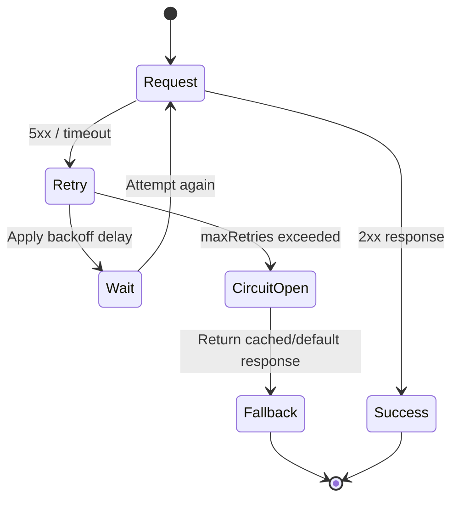

### 10.1 Exponential Backoff

Wait time doubles after each failed attempt, with optional jitter (randomization) to prevent thundering herd — all clients retrying simultaneously.

```python
import time
import random

def retry_with_exponential_backoff(func, max_retries=5, base_delay=1.0):
    for attempt in range(max_retries):
        try:
            return func()
        except TransientError as e:
            if attempt == max_retries - 1:
                raise
            delay = base_delay * (2 ** attempt) + random.uniform(0, 1)  # jitter
            time.sleep(delay)
```

**Delays:** 1s → 2s → 4s → 8s → 16s (+ jitter)

### 10.2 Linear Backoff

Wait time increases linearly (1s → 2s → 3s → 4s). Less aggressive than exponential — useful when recovery is expected to be quick.

### 10.3 Circuit Breaker

Prevents cascading failures by short-circuiting calls to a failing service.

**States:**
- **Closed:** Requests pass through normally. Error count tracked.
- **Open:** Too many errors — all requests fail immediately (fast fail). No downstream calls.
- **Half-Open:** After timeout, a probe request is allowed. If it succeeds, circuit closes; if it fails, circuit reopens.

```python
class CircuitBreaker:
    def __init__(self, failure_threshold=5, recovery_timeout=30):
        self.failures = 0
        self.threshold = failure_threshold
        self.state = "closed"
        self.last_failure_time = None
        self.recovery_timeout = recovery_timeout

    def call(self, func):
        if self.state == "open":
            if time.time() - self.last_failure_time > self.recovery_timeout:
                self.state = "half-open"
            else:
                raise CircuitOpenError("Circuit is open — service unavailable")
        try:
            result = func()
            self.on_success()
            return result
        except Exception as e:
            self.on_failure()
            raise

    def on_success(self):
        self.failures = 0
        self.state = "closed"

    def on_failure(self):
        self.failures += 1
        self.last_failure_time = time.time()
        if self.failures >= self.threshold:
            self.state = "open"
```

### 10.4 Retry After OAuth Token Refresh

When an API returns `401 Unauthorized` due to an expired access token, the client silently refreshes the token and retries the original request — without requiring the user to log in again.

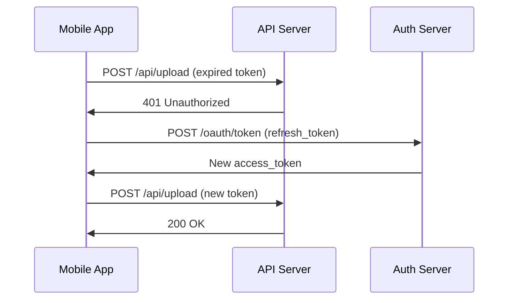

**Interview Language:**
> "Our HTTP client interceptor catches 401 responses, triggers a token refresh using the stored refresh token, and automatically retries the original request. This is transparent to the user."

### Interview Q&A

| Question | Answer |
|---|---|
| What is the thundering herd problem in retries? | All failed clients retry simultaneously, flooding the recovering service. Mitigated with jitter in backoff delays. |
| When should you NOT retry? | Non-transient errors (400 Bad Request, 404 Not Found, 422 Unprocessable). Only retry on 429 (rate limit) and 5xx (server errors). |
| How does circuit breaker differ from retry? | Retry re-attempts the same request. Circuit breaker stops calling a failing service altogether to prevent resource exhaustion, giving it time to recover. |

---

## 11. API Evolution & Backward Compatibility

### Overview

API evolution is the practice of changing your API over time while maintaining backward compatibility — existing consumers must continue to work without modification when you add or change functionality.

### 11.1 URI Versioning

Include version in the URL path — explicit, cache-friendly, easily routable.

```
GET /v1/users/123
GET /v2/users/123    ← new version with additional fields
```

**Alternatives:**
| Strategy | Example | Trade-offs |
|---|---|---|
| URI Versioning | `/v2/users` | Simple, visible, cache-friendly |
| Header Versioning | `Accept: application/vnd.myapp.v2+json` | Cleaner URLs; harder to test in browser |
| Query Param | `/users?version=2` | Simple; can pollute query strings |

**Interview Language:**
> "We use URI versioning for our public API. It's explicit, easy to route at the load balancer level, and makes it clear to consumers which version they're using."

### 11.2 Adding and Removing Fields

**Safe operations (non-breaking):**
- Adding new optional fields to response
- Adding new optional request fields
- Adding new endpoints

**Breaking operations:**
- Removing fields from response
- Changing field data types
- Renaming required fields
- Changing HTTP method or URL structure

**Deprecation strategy:**
1. Mark field as deprecated in docs + response header (`Deprecation: true`)
2. Maintain both old and new fields simultaneously for N months
3. After sunset date, remove old field from new API version

**Interview Language:**
> "We follow the Postel's Law principle — be liberal in what you accept and conservative in what you send. New fields are additive; we never remove fields without a versioned migration path and a deprecation notice period."

---

## 12. Frontend Architecture Patterns

### Overview

Frontend architecture patterns separate UI concerns (data, presentation, business logic, navigation) to improve testability, maintainability, and scalability of frontend applications.

### Architecture Pattern Evolution Diagram

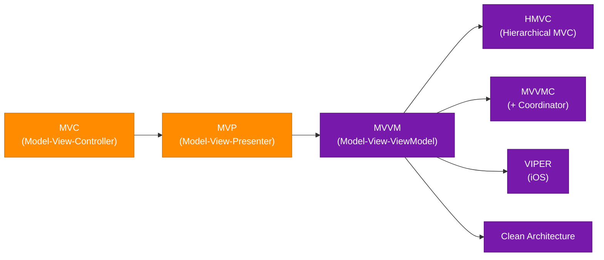

### 12.1 Foundational Patterns

**MVC (Model-View-Controller):**
- **Model:** Data + business logic (Redux store, Vuex)
- **View:** UI components (React, Vue components)
- **Controller:** Event handlers, hooks, composables connecting View to Model

**Weakness:** Fat controller problem — controllers accumulate business logic over time.

**MVP (Model-View-Presenter):**
- View becomes a passive UI layer with zero logic
- Presenter handles all logic and explicitly updates the View
- Improves testability — Presenter can be unit tested without rendering

**MVVM (Model-View-ViewModel):**
- ViewModel exposes observable state; View auto-updates via data binding
- No direct reference between View and Model
- Dominant pattern in React (hooks-based), Angular, SwiftUI

```javascript
// MVVM in React — ViewModel is the custom hook
function useUserProfileViewModel(userId) {
  const [profile, setProfile] = useState(null);
  const [loading, setLoading] = useState(true);

  useEffect(() => {
    fetchUser(userId).then(data => {
      setProfile(data);
      setLoading(false);
    });
  }, [userId]);

  return { profile, loading };
}

// View only reads from ViewModel
function UserProfileView({ userId }) {
  const { profile, loading } = useUserProfileViewModel(userId);
  if (loading) return <Spinner />;
  return <div>{profile.name}</div>;
}
```

### 12.2 Advanced Patterns

**HMVC (Hierarchical MVC):**
Decomposes a large application into independent, self-contained MVC modules. Each module has its own Model, View, and Controller. Modules can call each other but are independently deployable and testable.

**Use case:** Large-scale enterprise apps where a "fat controller" in single MVC would become unmanageable.

**MVVMC (Model-View-ViewModel-Coordinator):**
Extends MVVM by extracting navigation logic into a **Coordinator**. ViewModel emits navigation events; Coordinator decides which screen to present. Keeps ViewModel clean and navigation centralized.

**VIPER (View-Interactor-Presenter-Entity-Router):**
Used primarily in iOS (Swift). Five distinct roles:
- **View:** Displays data, passes events to Presenter
- **Interactor:** Business logic, data fetching
- **Presenter:** Formats data for display, coordinates View + Interactor
- **Entity:** Plain data models
- **Router:** Handles navigation

### 12.3 Modern Architectural Styles

**Clean Architecture (Uncle Bob):**
- Dependency rule: outer layers depend on inner layers, never the reverse
- Layers: Entities → Use Cases → Interface Adapters → Frameworks
- Inner layers (business logic) are completely independent of UI and DB frameworks

**Hexagonal Architecture (Ports & Adapters):**
- Core domain has no knowledge of delivery mechanism (HTTP, CLI, queue)
- "Ports" define interfaces the core exposes
- "Adapters" implement those interfaces for specific technologies

**Vertical Slice Architecture:**
- Organizes code by feature (slice), not by layer (controller/service/repo)
- Each feature folder contains all layers needed for that feature
- Reduces cross-feature coupling

### Interview Q&A

| Question | Answer |
|---|---|
| Why choose MVVM over MVC for a React app? | MVVM maps naturally to React hooks — the hook is the ViewModel exposing reactive state. It eliminates the fat-controller problem by giving each feature its own encapsulated ViewModel. |
| What problem does VIPER solve? | Massive View Controller (MVC) in iOS — ViewControllers grow to thousands of lines. VIPER distributes responsibility across 5 distinct roles, each unit-testable in isolation. |
| What is the dependency rule in Clean Architecture? | Source code dependencies must only point inward. Business rules (Entities, Use Cases) must not depend on UI, databases, or frameworks. Frameworks depend on business rules, not vice versa. |

---

## 13. UI Design Concepts

### 13.1 HTTP/1.1 vs HTTP/2

| Feature | HTTP/1.1 | HTTP/2 |
|---|---|---|
| Connections | One request per TCP connection | Multiplexed — multiple requests on one connection |
| Header compression | None | HPACK compression |
| Server push | No | Yes — server can proactively send assets |
| Priority | No | Yes — request prioritization |
| Protocol | Text | Binary |

**Interview Language:**
> "HTTP/2 multiplexing is a significant win for page load performance. Instead of opening six parallel TCP connections (HTTP/1.1 browser limit), we load all resources over one connection, reducing TCP handshake overhead and head-of-line blocking."

### 13.2 WebSocket vs Webhook

| | WebSocket | Webhook |
|---|---|---|
| Direction | Bidirectional (server ↔ client) | Server → Client (one-way HTTP callback) |
| Connection | Persistent | Stateless (new HTTP request per event) |
| Client needed? | Yes — client must be connected | No — server pushes to a URL |
| Use cases | Live chat, collaborative editing, games | Payment notifications, CI/CD triggers, GitHub events |

**Interview Language:**
> "We use WebSockets for the live order tracking feature — the client maintains a persistent connection and receives real-time status updates. For payment confirmations from Stripe, we use webhooks — Stripe sends an HTTP POST to our endpoint when a payment completes."

### 13.3 Polling vs Long Polling vs REST vs GraphQL

| Pattern | How | Latency | Server Load |
|---|---|---|---|
| Short Polling | Client polls every N seconds | N seconds | High (many empty responses) |
| Long Polling | Client sends request; server holds until data is ready | Near real-time | Moderate |
| WebSocket | Persistent connection, server pushes | Real-time | Low per message |
| SSE | HTTP stream, server pushes text events | Real-time | Low |
| REST | Request-response, fixed schema | Per request | Standard |
| GraphQL | Request-response, client-defined schema | Per request | Standard |

### 13.4 Server-Side Rendering (SSR)

SSR generates HTML on the server for each request. Sends fully rendered HTML to the browser — faster First Contentful Paint (FCP) and better SEO than client-side rendering.

**Trade-off:** Higher server load; slower Time to Interactive (TTI) if JS bundle is large.

**Interview Language:**
> "We use Next.js SSR for our product listing pages to optimize SEO and FCP. For the authenticated dashboard — which doesn't need SEO — we use client-side rendering to reduce server load."

### 13.5 Tree Shaking

Tree shaking is a dead code elimination technique used by bundlers (Webpack, Rollup, Vite). It statically analyzes ES module `import/export` statements and removes code that is never referenced.

**Example:** If you import `import { debounce } from 'lodash-es'`, tree shaking removes all other Lodash functions from the bundle, reducing bundle size significantly.

**Interview Language:**
> "We reduced our JavaScript bundle by 40% by switching from CommonJS (`require`) to ES Modules (`import/export`), enabling tree shaking in our Vite build."

---

## 14. Accessibility & Performance

### 14.1 Proper Color Contrast

WCAG 2.1 mandates minimum contrast ratios between text and background:
- **AA standard (minimum):** 4.5:1 for normal text; 3:1 for large text
- **AAA standard (enhanced):** 7:1 for normal text; 4.5:1 for large text

**Interview Language:**
> "We ensure proper color contrast by running automated WCAG AA checks in our CI pipeline using tools like `axe-core`. Our design system tokens enforce minimum 4.5:1 contrast ratios for all text."

### 14.2 ARIA Roles

ARIA (Accessible Rich Internet Applications) attributes provide semantic context to assistive technologies (screen readers) for dynamic, interactive content that HTML semantics alone don't describe.

**Key ARIA attributes:**
| Attribute | Purpose | Example |
|---|---|---|
| `role` | Defines element's semantic role | `role="dialog"`, `role="alert"` |
| `aria-label` | Accessible name for unlabeled elements | Icon buttons |
| `aria-describedby` | Links element to its description | Form field to error message |
| `aria-expanded` | State for accordions/dropdowns | `aria-expanded="false"` |
| `aria-live` | Announces dynamic content changes | `aria-live="polite"` for notifications |

**Interview Language:**
> "We use `aria-live='polite'` on our toast notification container so screen readers announce new notifications without interrupting the current reading. For our modal dialogs, we add `role='dialog'`, `aria-modal='true'`, and trap focus within the modal."

### 14.3 Asset Optimization & CDN Delivery

**Asset optimization techniques:**
- **Image compression:** WebP/AVIF formats (50–80% smaller than JPEG)
- **Minification:** Remove whitespace/comments from CSS/JS
- **Code splitting:** Lazy-load feature bundles on demand
- **Bundling:** Combine multiple files to reduce HTTP requests

**CDN (Content Delivery Network):**
- Global network of edge servers caching static assets close to users
- Reduces latency by serving from nearest PoP (Point of Presence)
- Reduces origin server load
- Providers: Cloudflare, AWS CloudFront, Akamai, Fastly

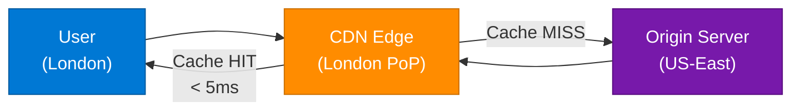

### 14.4 Web Vitals

| Metric | Measures | Good Threshold |
|---|---|---|
| **LCP** (Largest Contentful Paint) | Loading performance | < 2.5s |
| **FID** (First Input Delay) / **INP** | Interactivity | < 100ms |
| **CLS** (Cumulative Layout Shift) | Visual stability | < 0.1 |
| **TTFB** (Time to First Byte) | Server responsiveness | < 800ms |

**Interview Language:**
> "We track Core Web Vitals in production via RUM (Real User Monitoring) using Datadog. Our LCP target is under 2.5s — we achieve this through SSR for initial HTML, lazy loading below-the-fold images, and CDN delivery of static assets."

### 14.5 Rate Limiting

Rate limiting protects your API from abuse, DDoS, and accidental overload by capping the number of requests a client can make in a time window.

**Algorithms:**
| Algorithm | How It Works | Trade-off |
|---|---|---|
| Fixed Window | Count requests per fixed N-second window | Burst allowed at window boundary |
| Sliding Window | Rolling count over last N seconds | More accurate, slightly more memory |
| Token Bucket | Tokens added at fixed rate; each request consumes a token | Allows short bursts; smooth average |
| Leaky Bucket | Requests processed at fixed rate; excess queued or dropped | Strict output rate |

```python
# Sliding window rate limiting with Redis
def is_rate_limited(user_id: str, limit: int = 100, window: int = 60) -> bool:
    now = time.time()
    key = f"ratelimit:{user_id}"
    with redis.pipeline() as pipe:
        pipe.zremrangebyscore(key, 0, now - window)
        pipe.zadd(key, {str(now): now})
        pipe.zcard(key)
        pipe.expire(key, window)
        results = pipe.execute()
    request_count = results[2]
    return request_count > limit
```

---

## 15. Interview Q&A Cheatsheet

**Q: How would you design a sharded database for a social media platform with 500M users?**
> Use hash sharding on `user_id` with consistent hashing across 32 shards. Store user profile, posts, and follower lists co-located on the user's shard. Use a global shard router (cache-aside pattern with Redis) to map user IDs to shard endpoints. Cross-shard operations (e.g., global feed) use scatter-gather with async fan-out.

**Q: How do Auto Scalers and Load Balancers work together?**
> The Load Balancer distributes incoming traffic across all healthy instances. The Auto Scaler monitors metrics (CPU, queue depth) and adds/removes instances. When a new instance is provisioned, the Auto Scaler registers it with the Load Balancer's target group — it begins receiving traffic within 30–90 seconds after health checks pass.

**Q: Explain CAP theorem with a real-world example.**
> A shopping cart service (DynamoDB, AP) remains available and accepts cart updates even if a network partition isolates nodes — you might see slightly stale cart data temporarily. A payment service (PostgreSQL CP) refuses writes during a partition rather than risk inconsistency — you cannot have two nodes thinking a payment succeeded with different amounts.

**Q: When would you use Kafka instead of RabbitMQ?**
> Kafka for high-throughput event streaming with replay capability — analytics pipelines, audit logs, event sourcing. RabbitMQ for traditional task queues where complex routing, per-message TTL, and push-based delivery matter more than throughput and replayability.

**Q: What is the circuit breaker pattern and when does it trigger?**
> A circuit breaker monitors failure rates for calls to a downstream service. When failures exceed a threshold (e.g., 50% failure rate over 60 seconds), the circuit "opens" — all subsequent calls fail immediately without hitting the downstream service. After a recovery timeout, a probe request is allowed (half-open state). Success closes the circuit; failure re-opens it.

**Q: What is the difference between MVC and MVVM in a React context?**
> In React MVC, the Controller (event handler) directly manipulates Model state and triggers View re-renders — can lead to fat controllers. In MVVM, a custom hook serves as the ViewModel — it encapsulates state, derived data, and side effects, and the View component is a pure presentation layer that only reads from the hook. ViewModel is independently unit-testable.

**Q: How would you implement backward-compatible API versioning?**
> URI versioning (`/v2/endpoint`) for major breaking changes. For minor additions (new optional fields), I add them to the existing version. For deprecations, I emit `Deprecation` response headers, maintain parallel fields for 6 months, then remove in the next major version. API changelog is communicated via developer portal and changelogs.

**Q: What is tree shaking and how do you enable it?**
> Tree shaking removes unused exports from the bundle at build time. It requires ES Module syntax (`import`/`export`) — CommonJS `require()` is not statically analyzable. Enable it by using an ES module build of libraries (`lodash-es` vs `lodash`) and ensuring your bundler (Vite, Rollup, Webpack 5) has `sideEffects: false` set in `package.json` for pure utility libraries.

**Q: Explain exponential backoff with jitter.**
> Exponential backoff waits increasingly longer between retries: 1s → 2s → 4s → 8s. Without jitter, all failed clients retry simultaneously (thundering herd). Jitter adds random noise to each delay: `delay = base * 2^attempt + random(0, base)`. This spreads retry storms across time, reducing peak load on the recovering service.

**Q: What is CORS and how do you configure it properly?**
> CORS is a browser-enforced security policy that prevents unauthorized cross-origin API requests. The server declares trusted origins via the `Access-Control-Allow-Origin` header. Proper configuration: whitelist only known frontend domains (never `*` for APIs with credentials), specify allowed HTTP methods and headers, and configure `credentials: true` only for endpoints that actually need cookies or auth headers in cross-origin contexts.

---

*Extracted from Gemini shared session · 2026-07-11 · GeminiShareToMD Agent v1.0*

---

```
═══════════════════════════════════════════════════════════
Token Usage Report
═══════════════════════════════════════════════════════════
Estimated without optimization:  ~54,300 tokens (raw page: 217,206 chars ÷ 4)
Actual (with optimization):      ~12,500 tokens (enriched MD: ~50,000 chars ÷ 4)
Savings:                         ~41,800 tokens (77%)
Techniques applied:              URL replacement, security-term filtering, small-chunk extraction,
                                 UI chrome stripped (PDF/Acrobat buttons, footer links),
                                 blocked content synthesized from topic inventory + expert enrichment
═══════════════════════════════════════════════════════════
* Estimates: prose chars ÷ 4, code chars ÷ 3. Actual API usage varies by model.
```
