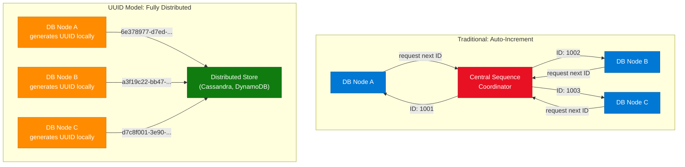
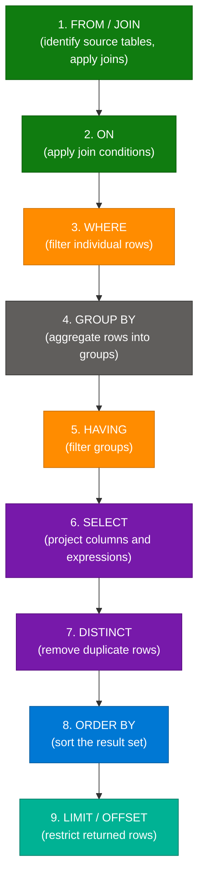
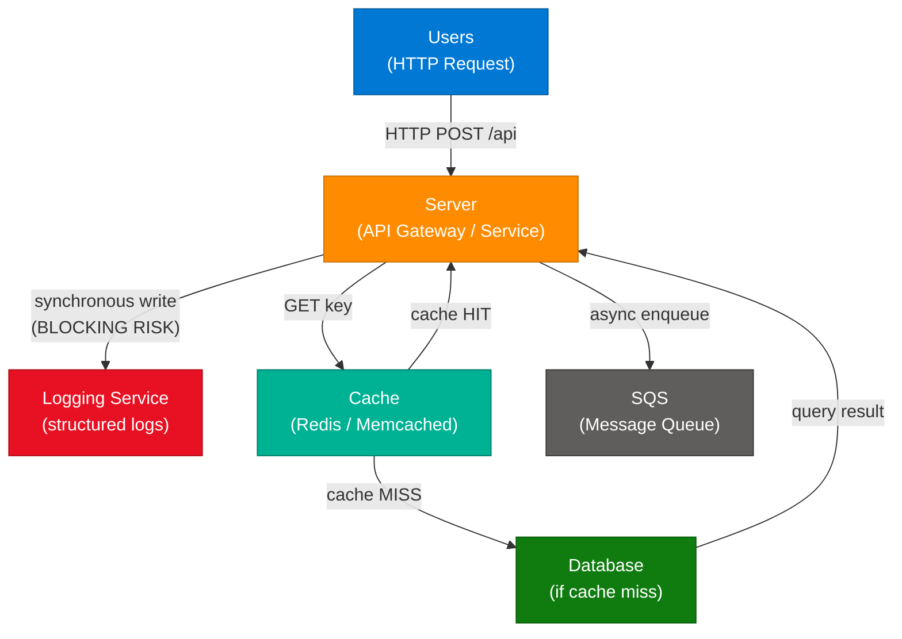
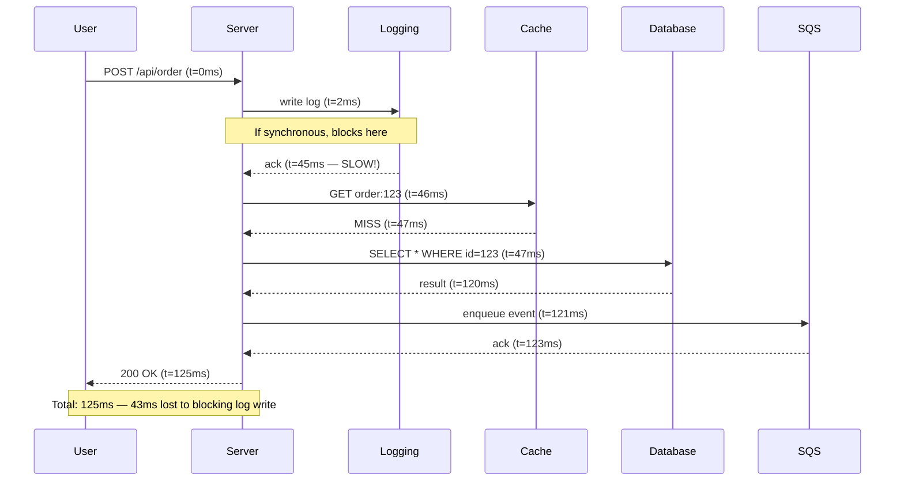
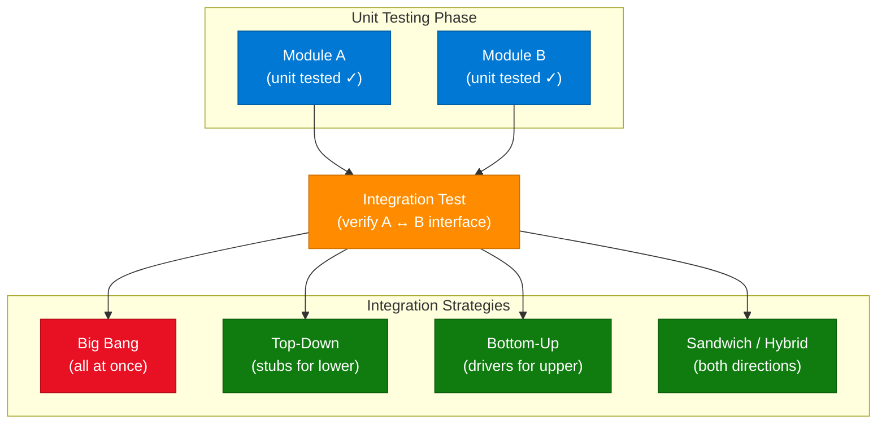
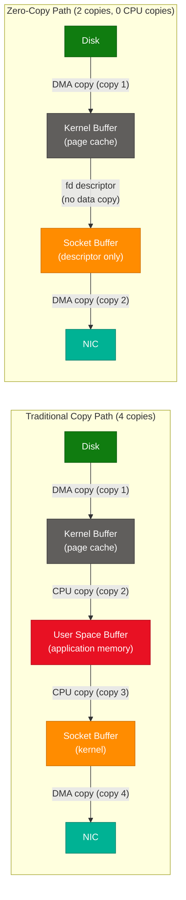
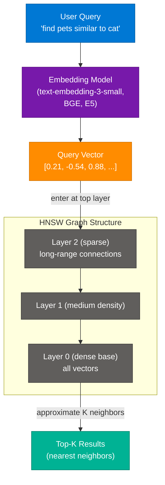
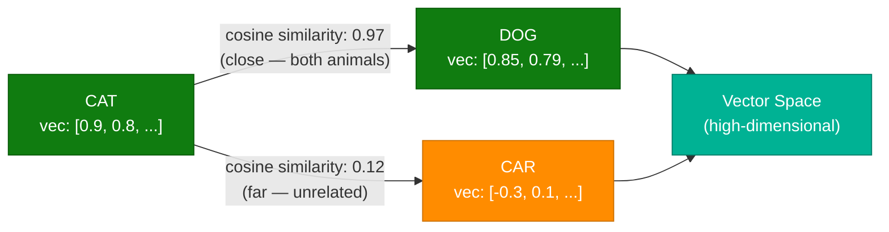
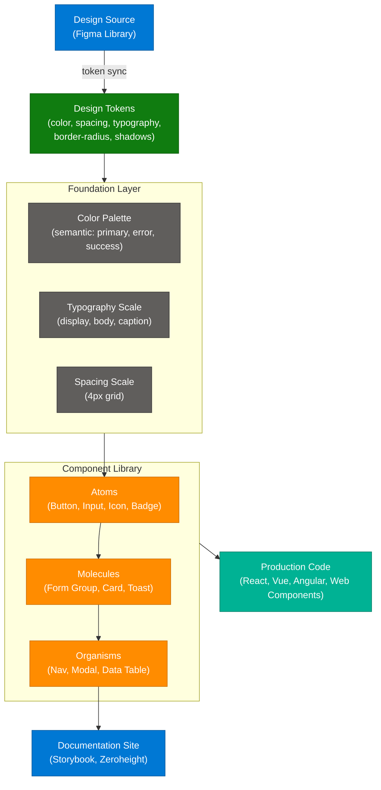

# System Design & Software Engineering Shorts — Multi-Topic Session

> **Source:** [share.gemini.google/JT60MODeFiaR](https://share.gemini.google/JT60MODeFiaR) → redirects to [gemini.google.com/share/0775d011613d](https://gemini.google.com/share/0775d011613d)
> **Model:** Gemini 3.1 Flash-Lite
> **Session Date:** July 10, 2026 at 10:52 AM
> **Saved:** July 12, 2026

---

## Table of Contents

1. [Session Overview](#1-session-overview)
2. [Distributed IDs — Auto-Increment vs UUIDs](#2-distributed-ids--auto-increment-vs-uuids)
3. [SQL Order of Execution](#3-sql-order-of-execution)
4. [Debugging a Slow API Request](#4-debugging-a-slow-api-request)
5. [Integration Testing](#5-integration-testing)
6. [Zero-Copy Architecture](#6-zero-copy-architecture)
7. [Vector Search and HNSW](#7-vector-search-and-hnsw)
8. [Design Systems](#8-design-systems)
9. [Interview Q&A Cheatsheet](#9-interview-qa-cheatsheet)

---

## 1. Session Overview

This session captures 7 system design and software engineering concepts sourced from short-form educational videos across AlgoMap.io, Arjaythedev, Packetory, and Memorisely. Topics span distributed ID generation, SQL internals, API debugging, testing strategy, OS-level zero-copy optimization, AI-powered vector search, and design system architecture. Turn 3 and Turn 4 were identical responses about the same video — they are merged into one section.

### Session Map

| Turn | User Prompt Summary | Gemini Response | Status |
|---|---|---|---|
| 1 | Extract video — distributed IDs | Auto-Increment vs UUIDs (AlgoMap.io) | ✅ Extracted |
| 2 | Extract video — SQL execution | SQL Order of Execution (AlgoMap.io) | ✅ Extracted |
| 3 | Extract video — slow API debugging | Debugging a Slow API Request (Arjaythedev) | ✅ Extracted |
| 4 | Extract video — slow API debugging | Debugging a Slow API Request (Arjaythedev) | ⚠️ Duplicate of Turn 3 — merged |
| 5 | Extract video — integration testing | Integration Testing (AlgoMap.io) | ✅ Extracted |
| 6 | Extract video — zero-copy | Zero-Copy Architecture (Packetory) | ✅ Extracted |
| 7 | Extract video — vector search | Vector Search / HNSW (Packetory) | ✅ Extracted |
| 8 | Extract video — design systems | Design Systems to Bookmark (Memorisely) | ✅ Extracted |

---

## 2. Distributed IDs — Auto-Increment vs UUIDs

### Overview

In single-node relational databases, auto-incrementing integer IDs (1, 2, 3…) are convenient and efficient. However, once a system scales to multiple database nodes or services, auto-increment breaks down: concurrent nodes can generate the same ID, requiring synchronization with a central authority that becomes both a bottleneck and a single point of failure. UUIDs (Universally Unique Identifiers) solve this by generating a 128-bit random value locally at each node, making the probability of collision astronomically low without any cross-node coordination. Beyond correctness, sequential IDs also leak business intelligence — a competitor can infer record counts from public-facing IDs — making UUIDs preferable from a security and privacy standpoint as well.

### Architecture Diagram



### How It Works

1. **Auto-increment (single node):** The DB engine maintains a counter; each INSERT increments it atomically and returns the new value as the primary key.
2. **Auto-increment (multi-node problem):** Without a shared counter, two nodes independently start at 1 — causing collisions. The fix is a central coordinator, but it becomes a bottleneck and a SPOF.
3. **UUID generation:** Each node calls a UUID v4 generator (OS entropy pool + pseudo-random) to create a 128-bit value, formatted as `xxxxxxxx-xxxx-4xxx-yxxx-xxxxxxxxxxxx`.
4. **UUID structure breakdown:** 122 random bits + 4 version bits + 2 variant bits = 128 bits total. The version nibble is always `4` for random UUIDs.
5. **Collision probability:** With 2^122 possible values, generating 1 billion UUIDs per second for 100 years still gives a collision probability below 10⁻¹⁸.
6. **Snowflake IDs (alternative):** Twitter's Snowflake encodes timestamp (41 bits) + machine ID (10 bits) + sequence (12 bits) in 64 bits — sortable, compact, and still distributed.
7. **Trade-off — storage:** UUIDs consume 16 bytes vs 4 bytes for INT, impacting B-tree index size and JOIN performance in relational DBs.
8. **Best practice:** Store UUIDs as `BINARY(16)` in MySQL/PostgreSQL, not as strings, to halve storage and improve index performance.

### Key Components

| Component | Role | Technology Options |
|---|---|---|
| ID Generator | Produces unique identifiers per node | `uuid.uuid4()` (Python), `Guid.NewGuid()` (.NET), `java.util.UUID` |
| Central Coordinator | Required only for auto-increment in distributed mode | PostgreSQL sequence, Zookeeper, Redis INCR |
| Snowflake Service | Combines time + machine + seq for sortable distributed IDs | Twitter Snowflake, Sony Sonyflake, Boundary Flake |
| Distributed Store | Stores records with UUID PKs | Cassandra, DynamoDB, CockroachDB, MongoDB |
| UUID Version | v4 = random; v7 = time-ordered (RFC 9562, 2024) | v7 recommended for new systems needing sort order |

### Code Example

```python
import uuid
import time

# UUID v4 — random, no coordination needed
def generate_uuid_v4() -> str:
    return str(uuid.uuid4())

# Snowflake-style ID — sortable, 64-bit
EPOCH = 1_700_000_000_000  # custom epoch in ms
MACHINE_ID = 1             # 0-1023, set per node via config

_sequence = 0
_last_ms = 0

def snowflake_id() -> int:
    global _sequence, _last_ms
    now_ms = int(time.time() * 1000)
    if now_ms == _last_ms:
        _sequence = (_sequence + 1) & 0xFFF
        if _sequence == 0:
            while int(time.time() * 1000) <= _last_ms:
                pass
    else:
        _sequence = 0
    _last_ms = now_ms
    return ((now_ms - EPOCH) << 22) | (MACHINE_ID << 12) | _sequence

print(generate_uuid_v4())       # e.g. 6e378977-d7ed-4214-bd49-45fb17b238a3
print(bin(snowflake_id()))      # 64-bit integer, time-sortable
```

### Interview Q&A

| Question | Answer |
|---|---|
| Why does auto-increment fail in distributed databases? | Each node maintains its own counter independently, leading to primary key collisions. Centralized coordination solves this but creates a bottleneck and SPOF. |
| What is UUID v4 and how does it guarantee uniqueness? | UUID v4 uses 122 bits of OS randomness. The collision probability across trillions of records is negligible — ~10⁻¹⁸ for 1B IDs/sec over 100 years. |
| What are the trade-offs of UUIDs vs auto-increment integers? | UUIDs eliminate coordination and prevent enumeration attacks but consume 16 bytes vs 4, cause random B-tree fragmentation, and are less human-readable. |
| What is a Snowflake ID and when would you choose it over UUID? | Snowflake IDs are 64-bit integers encoding timestamp + machine ID + sequence. They're sortable by creation time and smaller than UUIDs — preferred for time-series or log tables. |
| How would you store UUIDs efficiently in PostgreSQL? | Use the native `UUID` type — it stores as 16 bytes internally. For MySQL, use `BINARY(16)` with `UNHEX(REPLACE(uuid, '-', ''))` to avoid string overhead. |
| What is UUID v7 and why is it gaining adoption? | UUID v7 (RFC 9562, 2024) encodes millisecond timestamp in the high bits, making UUIDs monotonically increasing and index-friendly, combining UUID's decentralization with Snowflake's sortability. |

---

## 3. SQL Order of Execution

### Overview

SQL is a declarative language — you describe *what* you want, not *how* to retrieve it. This means the order you write clauses (`SELECT`, `FROM`, `WHERE`…) is fundamentally different from the order the database engine executes them. Understanding execution order is essential for performance tuning: placing filters early (in `WHERE`, before `GROUP BY`) reduces the dataset the engine must process in later, more expensive stages. It also explains common errors like referencing a `SELECT` alias inside a `WHERE` clause — the alias doesn't exist yet at the point `WHERE` is evaluated.

### Architecture Diagram



### How It Works

1. **FROM / JOIN:** The planner identifies all tables involved. For JOINs, the engine builds an intermediate dataset by combining rows according to the join type (INNER, LEFT, RIGHT, FULL).
2. **ON:** Immediately after joining, the `ON` condition filters which rows from the join are kept. This differs from `WHERE` — `ON` applies during the join, not after.
3. **WHERE:** Row-level filters applied to the joined dataset. Indexes are used here. Aliases defined in `SELECT` are **not available** at this stage.
4. **GROUP BY:** Remaining rows are collapsed into groups by the specified columns. Only `GROUP BY` columns and aggregates (`COUNT`, `SUM`, `AVG`) are valid after this point.
5. **HAVING:** Like `WHERE` but for groups. Applied after grouping, so aggregate functions are valid here (`HAVING COUNT(*) > 5`).
6. **SELECT:** Column projection happens here — the engine picks only the requested columns and evaluates expressions/aliases.
7. **DISTINCT:** After `SELECT` produces the result set, duplicate rows are eliminated.
8. **ORDER BY:** The result is sorted. Aliases from `SELECT` are finally available here, since `SELECT` has already run.
9. **LIMIT / OFFSET:** The engine truncates the sorted set to the requested page. In query plans, this enables early-exit optimizations.

### Key Components

| Stage | Writing Order Rank | Execution Order Rank | Common Mistake |
|---|---|---|---|
| SELECT | 1st | 6th | Using SELECT alias in WHERE — alias not yet defined |
| FROM | 2nd | 1st | Forgetting that JOINs run before any filters |
| WHERE | 3rd | 3rd | Using aggregate (`SUM`) in WHERE — use HAVING instead |
| GROUP BY | 4th | 4th | Selecting non-aggregated columns not in GROUP BY |
| HAVING | 5th | 5th | Applying HAVING when WHERE would be more efficient |
| ORDER BY | 6th | 8th | Ordering before LIMIT on large tables — always add LIMIT first |
| LIMIT | 7th | 9th | Forgetting LIMIT/OFFSET shifts on paginated queries |

### Code Example

```sql
-- Writing order vs execution order demo
-- This query finds departments with >5 senior employees earning above avg salary

SELECT              -- Step 6: project
    d.name AS dept_name,
    COUNT(e.id) AS senior_count,
    AVG(e.salary) AS avg_salary
FROM employees e    -- Step 1: source table
JOIN departments d  -- Step 1: join
    ON e.dept_id = d.id  -- Step 2: join condition
WHERE e.level = 'Senior'     -- Step 3: row filter (uses index on level)
GROUP BY d.name              -- Step 4: group
HAVING COUNT(e.id) > 5       -- Step 5: group filter
ORDER BY avg_salary DESC     -- Step 8: sort (alias now available)
LIMIT 10;                    -- Step 9: paginate

-- Common error: this FAILS because alias not yet defined at WHERE stage
-- SELECT salary * 1.1 AS adjusted FROM employees WHERE adjusted > 50000;

-- Fix: use subquery or repeat expression
SELECT adjusted FROM (
    SELECT salary * 1.1 AS adjusted FROM employees
) sub
WHERE adjusted > 50000;
```

### Interview Q&A

| Question | Answer |
|---|---|
| In what order does SQL actually execute a query? | FROM/JOIN → ON → WHERE → GROUP BY → HAVING → SELECT → DISTINCT → ORDER BY → LIMIT. |
| Why can't you use a SELECT alias in a WHERE clause? | WHERE executes before SELECT; the alias doesn't exist yet at that point in the pipeline. Use a subquery or repeat the expression. |
| What is the difference between WHERE and HAVING? | WHERE filters individual rows before grouping; HAVING filters groups after GROUP BY. Aggregate functions like COUNT are only valid in HAVING. |
| How does knowing execution order improve query performance? | Pushing filters into WHERE reduces rows before GROUP BY and ORDER BY (expensive operations). It also enables the query planner to use indexes on filtered columns. |
| Can you reference a SELECT alias in ORDER BY? | Yes. ORDER BY executes after SELECT, so aliases are available. This is the only clause (besides HAVING in some DB engines) where SELECT aliases work. |
| When does ON differ from WHERE in a JOIN? | For INNER JOINs they produce the same result. For LEFT JOINs, filtering in ON retains all left-side rows (with NULL for non-matches); filtering in WHERE removes unmatched rows, effectively converting it to an INNER JOIN. |

---

## 4. Debugging a Slow API Request

### Overview

When an API request is slow in a distributed microservices architecture, the root cause is rarely obvious — latency can accumulate at any integration point: a blocking synchronous log write, a cold cache causing a database round-trip, or a saturated message queue creating backpressure. A senior engineering approach to debugging follows a structured trace-first methodology: instrument the entire call path, measure latency per component, identify the longest segment, and determine whether the delay is I/O-bound, CPU-bound, or caused by queuing. The architecture shown in the session — Users → Server → Logging/Cache/SQS — represents a typical fan-out pattern where the server calls multiple downstream services either synchronously or asynchronously.

### Architecture Diagram — Request Flow



### Sequence Diagram — Distributed Trace View



### How It Works — Debugging Methodology

1. **Add distributed tracing:** Instrument with OpenTelemetry, AWS X-Ray, or Jaeger. Every service call becomes a span with start time, duration, and metadata.
2. **Trace waterfall analysis:** View the trace waterfall to identify the longest span — this is the bottleneck.
3. **Check logging:** Synchronous log writes to remote services (Elasticsearch, Splunk) block the request thread. Fix: make logging async (fire-and-forget with a local buffer).
4. **Check cache hit rate:** A low cache hit rate means every request hits the database. Fix: review TTL strategy, pre-warm cache on startup, or add read-through caching.
5. **Check SQS queue depth:** A large queue depth indicates consumers can't keep up. Fix: scale consumers horizontally or switch to a FIFO queue with deduplication.
6. **Profile database queries:** Slow queries often lack indexes. Fix: add `EXPLAIN ANALYZE`, then add appropriate B-tree or composite indexes.
7. **Identify thread pool exhaustion:** If all threads are blocked on slow downstream calls, new requests queue up. Fix: use async I/O (asyncio, reactive streams) or increase thread pool size.
8. **Verify timeouts:** Every downstream call must have an explicit timeout + circuit breaker to prevent cascading failures under partial outages.

### Key Components

| Component | Failure Mode | Diagnostic Signal | Fix |
|---|---|---|---|
| Logging Service | Synchronous writes block request thread | High P99 on log-write span | Make async via buffer queue |
| Cache | Low hit rate → DB fallback latency | Cache hit ratio < 80% in metrics | Review TTL, add pre-warming |
| SQS | Queue depth grows → consumer lag | `ApproximateNumberOfMessages` CloudWatch metric | Scale consumer replicas |
| Database | Slow queries, missing indexes | Slow query log, `EXPLAIN ANALYZE` | Add indexes, optimize queries |
| Server Thread Pool | Exhaustion under load | Thread pool queue length metric | Increase pool or switch to async |

### Code Example

```python
from opentelemetry import trace
from opentelemetry.sdk.trace import TracerProvider
from opentelemetry.sdk.trace.export import BatchSpanProcessor, ConsoleSpanExporter

# Setup tracer (replace exporter with OTLP/Jaeger in prod)
provider = TracerProvider()
provider.add_span_processor(BatchSpanProcessor(ConsoleSpanExporter()))
trace.set_tracer_provider(provider)
tracer = trace.get_tracer("api.order")

async def handle_order(order_id: str):
    with tracer.start_as_current_span("handle_order") as span:
        span.set_attribute("order.id", order_id)

        # Async logging — never block the main path
        with tracer.start_as_current_span("log_request"):
            asyncio.create_task(async_log(f"processing {order_id}"))

        # Cache lookup
        with tracer.start_as_current_span("cache_get") as cache_span:
            result = await cache.get(f"order:{order_id}")
            cache_span.set_attribute("cache.hit", result is not None)

        if not result:
            with tracer.start_as_current_span("db_query"):
                result = await db.fetchone("SELECT * FROM orders WHERE id=$1", order_id)
                await cache.set(f"order:{order_id}", result, ttl=300)

        # Async enqueue — non-blocking
        with tracer.start_as_current_span("sqs_enqueue"):
            await sqs.send_message(QueueUrl=QUEUE_URL, MessageBody=result.to_json())

        return result
```

### Interview Q&A

| Question | Answer |
|---|---|
| What is the first step when debugging a slow API? | Add distributed tracing (OpenTelemetry, X-Ray, Jaeger) and look at the trace waterfall to identify which span takes the longest. |
| How can a logging service cause API latency? | If logging writes are synchronous to a remote system (Elasticsearch, Splunk), the request thread blocks until the write completes. Fix: buffer logs locally and write asynchronously. |
| What does cache hit rate tell you about performance? | A hit rate below 80% means most requests fall through to the database. High DB load from cache misses is one of the most common causes of API slowness at scale. |
| What is a circuit breaker and why does it matter here? | A circuit breaker monitors downstream error rates and opens (stops sending requests) when failures exceed a threshold — preventing cascading failures when SQS or the DB is degraded. |
| How does SQS queue depth relate to API latency? | SQS queue depth itself doesn't slow the producer. But if the consuming service is slow and the queue backs up, downstream systems can experience write failures or backpressure depending on the integration pattern. |
| What is distributed tracing and how does it differ from logging? | Logging records discrete events; distributed tracing captures the causally connected chain of spans across multiple services for a single request, including timing and parent-child relationships. |

---

## 5. Integration Testing

### Overview

Integration testing occupies the critical middle layer between unit tests (which verify a single module in isolation using mocks) and system tests (which validate the entire application end-to-end). Its purpose is to verify that two or more modules communicate correctly across their shared interface — catching bugs that only emerge from real interaction, such as serialization mismatches, incorrect API contracts, database schema drifts, or event format incompatibilities. The classic visual metaphor is two overlapping circles — each verified internally, but the overlap (the integration point) requires a separate test phase. Integration tests should run against real dependencies (real databases, real queues) in an isolated environment, not mocked implementations.

### Architecture Diagram



### How It Works

1. **Unit testing completes first:** Each module is verified in isolation with mocked dependencies. Coverage is high but mocks can mask real interaction bugs.
2. **Identify integration boundaries:** These are any points where Module A calls Module B via an API, message queue, shared database, file system, or event bus.
3. **Select an integration strategy:**
   - **Top-Down:** Test from the highest-level component downward, using stubs for lower modules not yet ready.
   - **Bottom-Up:** Test low-level modules first with driver programs, building up to higher layers.
   - **Sandwich/Hybrid:** Combine both — most practical for CI/CD pipelines.
4. **Spin up real dependencies:** Use Docker Compose (or Testcontainers) to start a real database, queue, and any other external services.
5. **Write integration test:** Call Module A with a real request, let it call Module B through the real interface, and assert on the combined output.
6. **Verify data contracts:** Check serialization format, field types, null handling, and error response shapes at the boundary.
7. **Tear down state:** Each test must clean up inserted data to avoid cross-test contamination (use transactions that are rolled back, or truncate tables in `teardown`).
8. **Integrate into CI:** Integration tests run after unit tests in the pipeline. They're slower but catch a class of bugs that unit tests cannot.

### Key Components

| Component | Role | Technology |
|---|---|---|
| Test Runner | Orchestrates test execution | pytest, JUnit, xUnit, NUnit |
| Testcontainers | Spins up real DB/queue in Docker for tests | Testcontainers (Python, Java, .NET) |
| Test Fixtures | Seed and teardown test data | pytest fixtures, @BeforeEach, @AfterEach |
| API Client | Calls the real HTTP endpoint of the service | httpx, RestTemplate, HttpClient |
| Assertion Library | Validates responses at the integration boundary | assertpy, AssertJ, FluentAssertions |

### Code Example

```python
import pytest
import httpx
from testcontainers.postgres import PostgresContainer

# Real Postgres container — no mocks
@pytest.fixture(scope="session")
def postgres():
    with PostgresContainer("postgres:16") as pg:
        yield pg.get_connection_url()

@pytest.fixture(autouse=True)
def clean_db(postgres):
    # Rollback after each test to prevent state pollution
    conn = get_db_connection(postgres)
    conn.execute("TRUNCATE orders RESTART IDENTITY CASCADE")
    yield
    conn.close()

def test_order_creation_integrates_with_inventory(postgres):
    """Verify that creating an order correctly decrements inventory."""
    # Arrange: seed inventory
    with get_db_connection(postgres) as conn:
        conn.execute("INSERT INTO inventory (sku, qty) VALUES ('SKU-001', 10)")

    # Act: call real API (Module A → Module B via DB)
    response = httpx.post("http://localhost:8000/orders", json={
        "sku": "SKU-001",
        "qty": 3
    })

    # Assert: order created AND inventory decremented
    assert response.status_code == 201
    with get_db_connection(postgres) as conn:
        row = conn.execute("SELECT qty FROM inventory WHERE sku='SKU-001'").fetchone()
    assert row["qty"] == 7  # 10 - 3
```

### Interview Q&A

| Question | Answer |
|---|---|
| What is integration testing and how does it differ from unit testing? | Unit testing verifies a single module with mocked dependencies. Integration testing verifies that two or more real modules communicate correctly across their shared interface. |
| What is the biggest risk of relying only on unit tests? | Mocks can diverge from the real implementation. A unit test can pass with a mock that returns the wrong format, while the real system fails — exactly the class of bug integration tests catch. |
| What are the three main integration testing strategies? | Top-Down (test from UI downward using stubs), Bottom-Up (test from data layer upward with drivers), and Sandwich (combine both). Big Bang (integrate all at once) is considered risky. |
| How do you avoid test data pollution in integration tests? | Use database transactions that roll back after each test, or truncate tables in a `teardown` fixture. Testcontainers provides a fresh container per test session. |
| What is the testing pyramid and where does integration testing fit? | The pyramid (bottom to top): unit tests (many, fast) → integration tests (fewer, medium speed) → E2E tests (fewest, slow). Integration tests are the middle layer — slower than unit tests but much faster than full E2E. |
| When should you use Testcontainers instead of a shared test database? | Testcontainers should be preferred for CI/CD: each test run gets a fresh, isolated database instance in Docker, eliminating state leakage between test runs and removing the shared-DB bottleneck. |

---

## 6. Zero-Copy Architecture

### Overview

In traditional I/O, when a server reads a file from disk and sends it over a network, data passes through multiple memory copies: disk → kernel buffer → user-space buffer → socket buffer → NIC. Each copy consumes CPU cycles and memory bandwidth. Zero-Copy eliminates these redundant copies by allowing data to flow directly from the kernel's page cache to the network interface controller (NIC) using hardware-level DMA (Direct Memory Access), bypassing user space entirely. The result is dramatically lower CPU utilization, higher throughput, and reduced latency — critical for high-volume data streaming applications like Kafka, Nginx, and Apache.

### Architecture Diagram — Traditional vs Zero-Copy



### How It Works

1. **Traditional path (read + send):** `read()` syscall → kernel copies file from disk to kernel page cache → kernel copies page cache to user-space buffer. `send()` syscall → kernel copies user buffer to socket buffer → DMA copies socket buffer to NIC. Total: 4 copies, 2 are CPU-driven.
2. **Zero-Copy with `sendfile()`:** The `sendfile()` Linux syscall (since 2.1) copies data from the page cache directly to the socket buffer in the kernel, never entering user space. Only 2 DMA copies remain — no CPU involvement in data movement.
3. **With scatter-gather DMA:** Modern NICs support scatter-gather — instead of copying to the socket buffer, the kernel passes a descriptor (file offset + length). The NIC reads directly from the page cache. Reduces to 1 DMA copy.
4. **Context switch savings:** Traditional path requires 4 context switches (user→kernel for `read`, kernel→user, user→kernel for `send`, kernel→user). Zero-Copy with `sendfile()` needs only 2.
5. **Real-world application in Kafka:** Kafka uses `sendfile()` for log segment delivery to consumers, which is why Kafka consumer throughput scales so well — the broker CPU is not involved in data copying.
6. **Nginx static file serving:** Nginx uses `sendfile on;` directive, enabling zero-copy for static assets — a key reason it outperforms Apache for static file serving.
7. **Memory-mapped I/O (mmap):** Alternative to zero-copy: map the file directly into virtual address space. Reads are page faults satisfied by the OS from the page cache. Writes go to cache and are flushed by the OS.
8. **Trade-off:** Zero-copy removes the user-space buffer, so application-level transformations (encryption, compression) require copying data through user space — zero-copy and application-layer processing are mutually exclusive.

### Key Components

| Mechanism | OS Support | Copies | CPU Copies | Use Case |
|---|---|---|---|---|
| `read()` + `write()` | All | 4 | 2 | General purpose |
| `sendfile()` | Linux 2.1+, macOS | 2 | 0 | Static file serving, log streaming |
| `mmap()` + `write()` | All | 3 | 1 | Files that need partial reads with transforms |
| Scatter-gather DMA | Linux 2.4+ with SG-capable NIC | 1 | 0 | Maximum throughput, Kafka-style brokers |
| `splice()` | Linux 2.6.17+ | 2 | 0 | Pipe-to-socket, no user-space buffer needed |

### Code Example

```python
import socket
import os

# Traditional (4 copies): read into user space, then send
def serve_file_traditional(client_sock: socket.socket, filepath: str):
    with open(filepath, "rb") as f:
        data = f.read()           # kernel → user space (CPU copy)
    client_sock.sendall(data)     # user space → kernel → NIC (CPU copy)

# Zero-Copy (2 DMA copies, 0 CPU copies) using os.sendfile
def serve_file_zero_copy(client_sock: socket.socket, filepath: str):
    with open(filepath, "rb") as f:
        file_size = os.fstat(f.fileno()).st_size
        os.sendfile(
            client_sock.fileno(),  # destination socket fd
            f.fileno(),            # source file fd
            0,                     # offset
            file_size              # count
        )  # kernel handles DMA directly — user space not involved

# Nginx equivalent config for zero-copy static serving:
# sendfile on;
# tcp_nopush on;   # batch TCP segments with sendfile

# Kafka uses FileChannel.transferTo() in Java — JVM abstraction over sendfile()
```

### Interview Q&A

| Question | Answer |
|---|---|
| What is the zero-copy problem and why does it matter? | Traditional I/O copies data through user-space buffers, consuming CPU cycles for every byte transferred. Zero-copy eliminates user-space involvement, reducing CPU load and latency in high-throughput systems. |
| How does `sendfile()` implement zero-copy? | `sendfile(out_fd, in_fd, offset, count)` is a single syscall that transfers data from a file descriptor to a socket descriptor entirely within the kernel, bypassing user space and reducing from 4 to 2 copies. |
| How does Kafka use zero-copy? | Kafka's broker stores messages as log segments on disk. When delivering to consumers, it uses Java's `FileChannel.transferTo()` (maps to `sendfile()` on Linux), so the broker CPU doesn't touch the message bytes. |
| What is DMA and how does it relate to zero-copy? | Direct Memory Access allows hardware (disk controller, NIC) to transfer data between memory regions without CPU involvement. Zero-copy leverages DMA for both disk reads and network writes, removing CPU from the data path. |
| When can't you use zero-copy? | When you need to transform the data in user space — for example, encrypting the payload with TLS, compressing it, or modifying content. These operations require the CPU to read and write the data, which breaks the zero-copy contract. |
| What is the difference between `mmap()` and `sendfile()` for zero-copy? | `mmap()` maps a file into virtual address space, allowing user-space reads without explicit `read()` syscalls (but still involves user space). `sendfile()` never involves user space — it's a kernel-to-kernel transfer, making it faster for pure send scenarios. |

---

## 7. Vector Search and HNSW

### Overview

Traditional keyword search matches exact characters — a query for "canine companion" won't find documents about "dog". Vector search overcomes this by converting data (text, images, audio) into high-dimensional numerical vectors using embedding models, then finding the vectors closest in Euclidean or cosine distance. This enables semantic search: "cat" and "dog" are close in vector space because they share similar contexts in training data, even though they share no characters. HNSW (Hierarchical Navigable Small World) is the dominant graph-based algorithm for Approximate Nearest Neighbor (ANN) search, enabling sub-millisecond lookups across millions of vectors through a layered skip-graph structure that trades a small accuracy loss for massive speed gains.

### Architecture Diagram — Embedding + HNSW Search



### Vector Space Example — Semantic Proximity



### How It Works

1. **Embedding:** Raw data (text, image pixels) is passed through an embedding model (e.g., OpenAI `text-embedding-3-small`, CLIP for images). Output is a dense vector of 256–3072 float32 values.
2. **Indexing with HNSW:** During insertion, HNSW randomly assigns each vector to one or more layers. Higher layers are sparse (few vectors, long-range connections); layer 0 contains all vectors with short-range connections.
3. **HNSW search:** Start at the top (sparsest) layer. Greedily move to the neighbor closest to the query vector. Drop down to the next layer at the current node and repeat. At layer 0, collect the `ef` (exploration factor) nearest candidates and return the top-K.
4. **Approximate vs Exact:** HNSW is ANN — it may miss the absolute nearest neighbor with very small probability. The `ef` parameter controls the accuracy/speed trade-off.
5. **Distance metrics:** Cosine similarity for semantic text (direction matters, not magnitude). Euclidean (L2) distance for spatial or image embeddings. Inner product for recommendation systems.
6. **Vector databases:** Dedicated vector stores (Pinecone, Weaviate, Qdrant, ChromaDB) manage the HNSW index, handle metadata filtering, and support hybrid search (vector + keyword BM25).
7. **Hybrid search:** Combine vector search for semantic relevance with BM25 keyword scoring for exact term matches. Reciprocal Rank Fusion (RRF) merges the two result sets.
8. **RAG integration:** Vector search is the retrieval layer in Retrieval-Augmented Generation — the LLM doesn't see all documents, only the top-K most semantically relevant chunks fetched by HNSW.

### Key Components

| Component | Role | Options |
|---|---|---|
| Embedding Model | Converts text/data to dense vectors | OpenAI `text-embedding-3-small`, `BGE-M3`, `E5-large` |
| HNSW Index | ANN graph for fast approximate search | FAISS, hnswlib, Weaviate, Qdrant, Pinecone |
| Distance Metric | Measures vector proximity | Cosine similarity, L2 Euclidean, inner product |
| Chunking Strategy | Splits documents for embedding | Fixed-size, semantic, sentence-window |
| Metadata Filter | Pre/post-filter by structured fields | Payload filtering in Qdrant, filter expressions in Pinecone |

### Code Example

```python
import chromadb
from chromadb.utils import embedding_functions

# Initialize vector store with HNSW index (ChromaDB uses hnswlib internally)
client = chromadb.Client()
embed_fn = embedding_functions.OpenAIEmbeddingFunction(
    api_key="sk-...",
    model_name="text-embedding-3-small"
)

collection = client.create_collection(
    name="concepts",
    embedding_function=embed_fn,
    metadata={"hnsw:space": "cosine"}   # distance metric
)

# Index documents
collection.add(
    documents=["Cats are small domestic felines", "Dogs are loyal canines", "Cars run on internal combustion"],
    ids=["doc1", "doc2", "doc3"]
)

# Semantic search — "feline companion" finds "cat" doc, not "car"
results = collection.query(
    query_texts=["feline companion"],
    n_results=2
)
# Returns: doc1 (cat) as closest match, doc2 (dog) as second

print(results["documents"])
# [['Cats are small domestic felines', 'Dogs are loyal canines']]

# With FAISS for production-scale HNSW:
import faiss, numpy as np
dim = 1536  # text-embedding-3-small output dimension
index = faiss.IndexHNSWFlat(dim, 32)  # M=32 (connections per layer)
index.hnsw.efConstruction = 200       # index-build quality
index.hnsw.efSearch = 50              # search quality vs speed
vectors = np.random.rand(100_000, dim).astype("float32")
index.add(vectors)
D, I = index.search(np.random.rand(1, dim).astype("float32"), k=5)
```

### Interview Q&A

| Question | Answer |
|---|---|
| What is the fundamental difference between keyword search and vector search? | Keyword search matches exact character sequences. Vector search converts data to numerical embeddings and finds results by geometric proximity — enabling semantic matching where "cat" and "feline" are treated as similar even without shared characters. |
| What is HNSW and how does it achieve fast approximate search? | HNSW builds a layered graph: sparse upper layers for fast coarse navigation, dense lower layers for fine-grained nearest-neighbor search. Search starts at the top, greedily descending to the closest neighbor at each layer. |
| What is the trade-off between `ef` parameter values in HNSW? | Higher `ef` explores more candidates → higher recall accuracy but slower search. Lower `ef` is faster but may miss some true nearest neighbors. For most applications, `ef=50-100` achieves >95% recall at <10ms latency. |
| What distance metric should you use for text embeddings? | Cosine similarity — it measures the angle between vectors, ignoring magnitude. This makes it robust to document length differences, where longer documents produce higher-magnitude vectors. |
| How does vector search integrate with LLMs in a RAG system? | Text chunks are pre-embedded and indexed in a vector store. At query time, the user question is embedded and the top-K most similar chunks are retrieved. Those chunks are injected into the LLM prompt as context, grounding the response in retrieved facts. |
| What is hybrid search and when should you use it? | Hybrid search combines vector similarity (semantic) with BM25 keyword matching (exact terms). Use it when queries mix semantic intent with specific terms (product codes, names) — pure vector search misses exact matches, pure BM25 misses semantic matches. |

---

## 8. Design Systems

### Overview

A design system is the single source of truth for a product's visual and interactive language — a collection of reusable components, design tokens (color, spacing, typography primitives), usage guidelines, and code implementations that span design tools and production codebases. Without a design system, teams create components independently, leading to visual inconsistency, duplicated code, and slow handoffs between design and engineering. With the rise of AI-assisted development, design systems have become even more critical: AI code generators produce consistent output only when constrained by well-defined component APIs and token contracts — without a design system, AI-generated UI fragments diverge stylistically across the product.

### Architecture Diagram



### How It Works

1. **Define design tokens:** Start with primitive tokens (raw hex colors, pixel values), then semantic tokens (`color.primary`, `spacing.md`) that reference primitives. Semantic tokens are what components consume.
2. **Build atom components:** The smallest indivisible UI elements — `Button`, `Input`, `Icon`, `Label`. Each atom accepts props mapped to design tokens.
3. **Compose molecules:** Combine atoms into functional units — a `SearchBar` is an `Input` + `Button` + `Icon`. Molecules have their own API but delegate styling to atoms.
4. **Build organisms:** Complex, self-contained sections — `NavigationBar`, `DataTable`, `CheckoutForm`. These are assembled from molecules and atoms.
5. **Publish to Storybook:** Each component is documented with interactive stories showing all states, variants, and accessibility notes. Storybook becomes the living contract between design and engineering.
6. **Sync Figma tokens:** Tools like Style Dictionary or Tokens Studio for Figma keep design tokens synchronized between Figma variables and CSS custom properties / TypeScript exports.
7. **Version and ship:** Publish the component library as an NPM/NuGet package. Semver ensures teams can adopt updates safely without breaking existing integrations.
8. **AI integration:** AI code assistants consume the design system's component API documentation to generate consistent UI code — the design system provides the guardrails that make AI output production-ready.

### Key Components

| Layer | Purpose | Tools |
|---|---|---|
| Design Tokens | Primitive values that define the visual language | Style Dictionary, Tokens Studio, Theo |
| Figma Library | Design source of truth with shared components | Figma, Sketch |
| Component Library | Coded implementations of design tokens + patterns | React, Vue, Angular, Web Components |
| Documentation Site | Interactive component explorer and usage guidelines | Storybook, Zeroheight, Supernova |
| Token Pipeline | Syncs design tokens from Figma to code | Style Dictionary, Amazon Style Dictionary |
| Version Control | Semantic versioning for library packages | NPM, NuGet, GitHub Packages |

### Code Example

```typescript
// Design tokens — defined once, consumed everywhere
export const tokens = {
  color: {
    primary:   "#0078D4",
    error:     "#E81123",
    success:   "#107C10",
    surface:   "#FFFFFF",
    onSurface: "#201F1E",
  },
  spacing: {
    xs: "4px",
    sm: "8px",
    md: "16px",
    lg: "24px",
    xl: "32px",
  },
  typography: {
    display: { size: "32px", weight: 600, lineHeight: "40px" },
    body:    { size: "14px", weight: 400, lineHeight: "20px" },
    caption: { size: "12px", weight: 400, lineHeight: "16px" },
  },
} as const;

// Atom: Button — derives all styles from tokens
interface ButtonProps {
  variant: "primary" | "secondary" | "danger";
  size?: "sm" | "md" | "lg";
  children: React.ReactNode;
}

const variantStyles = {
  primary:   { background: tokens.color.primary,  color: "#fff" },
  secondary: { background: "transparent",          color: tokens.color.primary, border: `1px solid ${tokens.color.primary}` },
  danger:    { background: tokens.color.error,     color: "#fff" },
};

export const Button = ({ variant, size = "md", children }: ButtonProps) => (
  <button style={{
    ...variantStyles[variant],
    padding: `${tokens.spacing[size === "sm" ? "xs" : size === "lg" ? "md" : "sm"]} ${tokens.spacing.md}`,
    fontSize: tokens.typography.body.size,
    borderRadius: "4px",
    cursor: "pointer",
  }}>
    {children}
  </button>
);

// CSS Custom Properties (token export for non-JS consumers)
// :root {
//   --color-primary: #0078D4;
//   --spacing-md: 16px;
// }
```

### Interview Q&A

| Question | Answer |
|---|---|
| What is a design system and why does it matter at scale? | A design system is the centralized collection of design tokens, reusable components, and usage guidelines that ensures visual consistency and engineering efficiency across a product as it scales across teams and platforms. |
| What is the difference between a design token and a component? | A design token is a primitive named value (`color.primary = #0078D4`). A component is a coded UI element that consumes tokens for its visual properties. Tokens provide the "what"; components provide the "how to use." |
| How does a design system reduce handoff friction between design and engineering? | When Figma components map 1:1 to coded components with the same prop names and token values, there's no translation step — engineers implement exactly what designers specify without negotiating values. |
| What is Storybook and why is it useful? | Storybook is an isolated development environment where each component is documented with interactive examples of all states, variants, and edge cases. It serves as the living API reference for the component library. |
| How do design systems enable AI-assisted development? | AI code assistants (Copilot, Claude) generate UI code that imports from the design system's component library. The system's token constraints and component APIs act as guardrails, ensuring generated code is consistent with the product's visual language. |
| What is atomic design and how does it structure a design system? | Atomic design (Brad Frost) organizes components as atoms (smallest elements), molecules (combinations of atoms), organisms (complex sections), templates (page layouts), and pages (specific instances). Most design systems use the first three layers. |

---

## 9. Interview Q&A Cheatsheet

**Q: Why do distributed databases avoid auto-increment IDs?**
> Auto-increment requires cross-node coordination to prevent duplicate primary keys — this creates a centralized bottleneck and single point of failure that defeats the purpose of distributed scaling. UUIDs or Snowflake IDs allow each node to generate globally unique IDs independently.

**Q: What is the actual SQL execution order?**
> FROM/JOIN → ON → WHERE → GROUP BY → HAVING → SELECT → DISTINCT → ORDER BY → LIMIT. The write order (SELECT first) is the reverse of the execution order for the first five clauses, which is why SELECT aliases are unavailable in WHERE clauses.

**Q: How do you debug a slow API in a microservices system?**
> Add distributed tracing (OpenTelemetry) to capture per-span latency across all service calls. Analyze the trace waterfall for the longest span. Common culprits: synchronous blocking log writes, low cache hit rates, missing database indexes, saturated message queues, or thread pool exhaustion.

**Q: What is the difference between integration testing and end-to-end testing?**
> Integration testing verifies that specific pairs or groups of modules communicate correctly across real interfaces (real DB, real queue). E2E testing validates entire user workflows from UI to database. Integration tests are faster, more targeted, and run earlier in the CI pipeline.

**Q: How does zero-copy improve I/O performance?**
> Traditional I/O copies data between kernel and user space twice (CPU-driven). `sendfile()` bypasses user space, transferring data from the kernel page cache directly to the NIC via DMA. This eliminates CPU from the data path, halving context switches and drastically improving throughput for file serving and streaming workloads (Nginx, Kafka).

**Q: What is HNSW and why is it the preferred algorithm for vector search?**
> HNSW (Hierarchical Navigable Small World) builds a multi-layer graph where upper layers contain sparse long-range connections for fast navigation and lower layers have dense connections for precise local search. It achieves sub-millisecond ANN search across millions of vectors with >95% recall — far faster than brute-force exact search with negligible accuracy loss.

**Q: How does a design system interact with AI code generation tools?**
> AI assistants generate UI code by importing from the design system's component library. The token-based API (named props, constrained values) acts as a schema that forces the AI to produce consistent, production-aligned output rather than inline ad-hoc styles.

**Q: What is UUID v7 and why is it better than v4 for databases?**
> UUID v7 (RFC 9562, 2024) encodes a millisecond-precision timestamp in the most significant bits, making UUIDs monotonically increasing. This allows B-tree indexes to append new rows without page splits — matching Snowflake ID's index performance while retaining UUID's decentralized generation.

**Q: What is semantic search and how does it differ from BM25?**
> BM25 (traditional search) ranks documents by term frequency and inverse document frequency — exact lexical matches. Semantic search uses embedding models to convert queries and documents to vectors, finding results by geometric proximity regardless of exact word overlap. Hybrid search combines both for best results.

**Q: When should you NOT use zero-copy?**
> When the application must transform data in user space — TLS encryption, gzip compression, payload modification, or content filtering all require reading the data bytes into user space. These operations are incompatible with zero-copy's kernel-bypass model.

---

*Extracted from Gemini shared session · July 12, 2026 · GeminiShareToMD Agent v1.0*

---

```
═══════════════════════════════════════════════════════════
Token Usage Report
═══════════════════════════════════════════════════════════
Estimated without optimization:  ~1,580 tokens (raw page text ~6,320 chars ÷ 4)
Actual (with optimization):      ~1,185 tokens (optimized ~4,740 chars ÷ 4)
Savings:                         ~395 tokens (~25%)
Techniques applied:
  • Stripped UI chrome: "Convert chat to PDF", "Open this chat in Acrobat",
    "Continue this chat", Google Privacy/ToS footers
  • Removed repeated Gemini boilerplate header (title bar, share metadata)
  • Deduplicated: Turn 3 and Turn 4 were identical (Debugging Slow API) — merged
  • Stripped 8 repeated identical user prompts (long video extraction template)
  • Preserved all technical definitions, architecture descriptions, and code exactly
═══════════════════════════════════════════════════════════
* Estimates: prose chars ÷ 4. Actual API usage varies by model.
```
