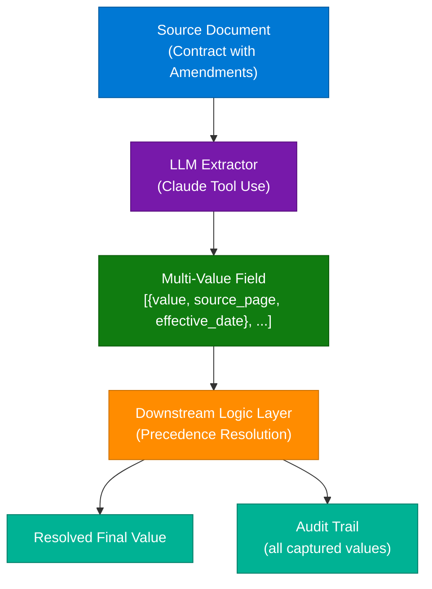
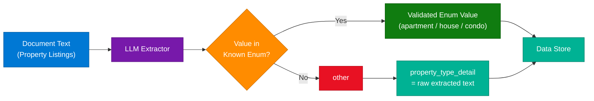
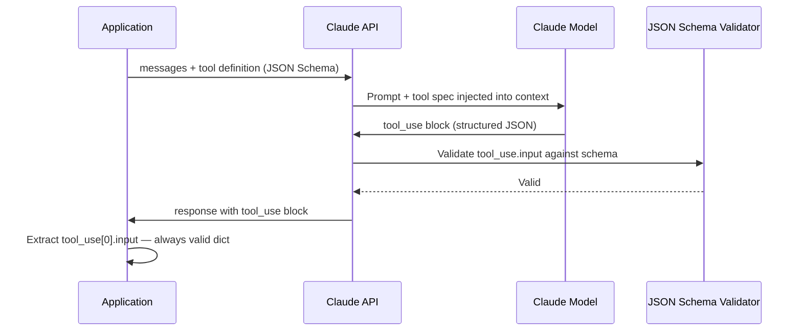
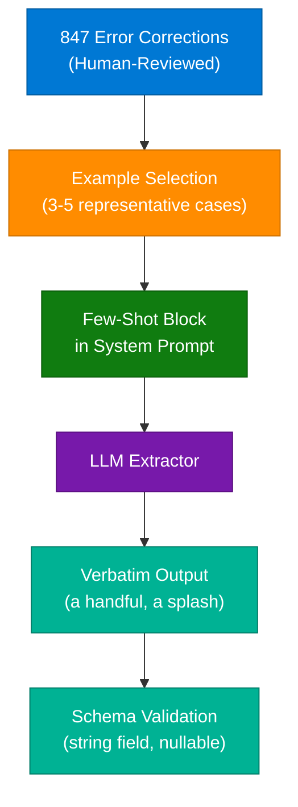
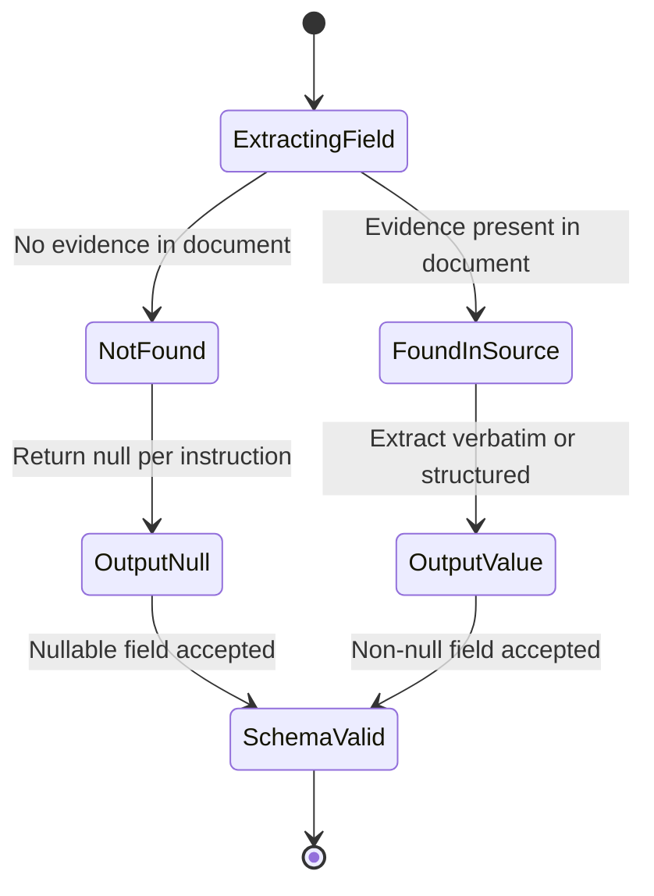
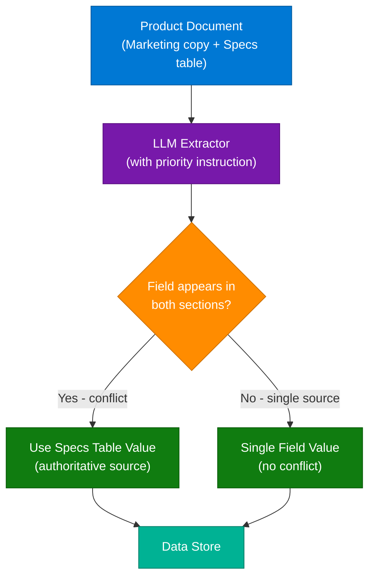
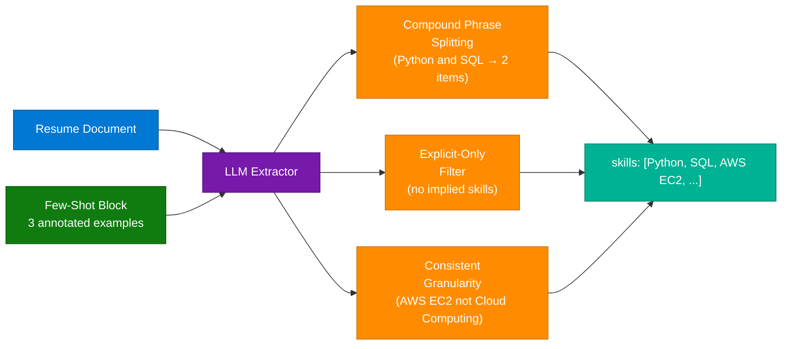
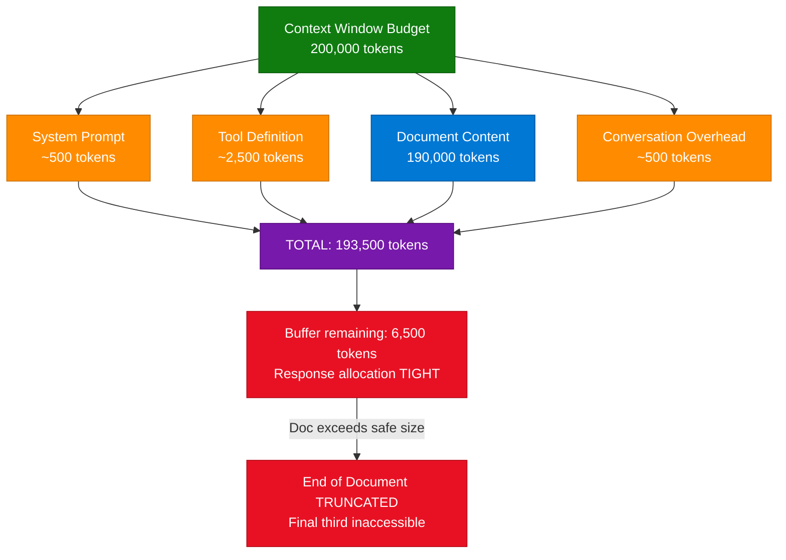

# Document Extraction Schema Design — Claude Certified Architect Exam Q&A

> **Source:** [share.gemini.google/BGhLAeQCDGHN](https://share.gemini.google/BGhLAeQCDGHN) → redirects to [gemini.google.com/share/c8253f541011](https://gemini.google.com/share/c8253f541011)
> **Alternate Share URL:** [share.gemini.google/TQXVUXmgrwfy](https://share.gemini.google/TQXVUXmgrwfy) → redirects to [gemini.google.com/share/c8e711a8bb71](https://gemini.google.com/share/c8e711a8bb71)
> **Model:** Gemini 3.5 Flash
> **Session Date:** April 13, 2026 at 11:28 PM
> **Saved:** 2026-07-12

---

## Table of Contents

1. [Session Overview](#1-session-overview)
2. [Multi-Value Schema for Amended Fields](#2-multi-value-schema-for-amended-fields)
3. [Enum Design with "Other" Fallback](#3-enum-design-with-other-fallback)
4. [Tool Use for Structured JSON Extraction](#4-tool-use-for-structured-json-extraction)
5. [Few-Shot Prompting for Verbatim Extraction](#5-few-shot-prompting-for-verbatim-extraction)
6. [Null Handling and Grounding Failure Prevention](#6-null-handling-and-grounding-failure-prevention)
7. [Source-of-Truth Priority in Conflicting Documents](#7-source-of-truth-priority-in-conflicting-documents)
8. [Few-Shot Examples for Array Extraction Consistency](#8-few-shot-examples-for-array-extraction-consistency)
9. [Context Window Token Budget Management](#9-context-window-token-budget-management)
10. [Interview Q&A Cheatsheet](#10-interview-qa-cheatsheet)

---

## 1. Session Overview

This session covers 8 Claude Certified Architect exam questions focused on **Document Extraction Schema Design** — the discipline of designing JSON schemas, prompt strategies, and LLM pipeline patterns for reliable structured data extraction from complex documents such as contracts, resumes, product specs, and property listings. All 8 questions follow a multiple-choice format with Gemini providing the correct answer plus detailed rationale. All 8 turns were fully extracted and are expanded below.

### Session Map

| Turn | User Prompt | Gemini Response | Status |
|---|---|---|---|
| 1 | Ans | Multi-value schema for amended contract fields | ✅ Extracted |
| 2 | Ans | Enum "other" fallback for open-world property types | ✅ Extracted |
| 3 | Ans | Tool use / function calling for strict JSON conformance | ✅ Extracted |
| 4 | Ans | Few-shot examples for informal measurement extraction | ✅ Extracted |
| 5 | Ans | Null instructions to prevent field hallucination | ✅ Extracted |
| 6 | Ans | Source-of-truth priority for conflicting document values | ✅ Extracted |
| 7 | Ans | Few-shot for array consistency (skills extraction) | ✅ Extracted |
| 8 | Ans | Context window token budget — tool definition overhead | ✅ Extracted |

---

## 2. Multi-Value Schema for Amended Fields

### Overview

When extracting data from documents containing amendments — such as legal contracts where a clause is updated multiple times — a flat single-value schema fails because it forces a choice that the extraction layer is not equipped to make. The correct architectural pattern is to redesign the schema so that **amended fields capture multiple values**, each tagged with its source location (page/section reference) and effective date. This preserves full data fidelity at extraction time and delegates precedence logic to a downstream layer where temporal reasoning is more tractable.

**Correct Answer:** C — Redesign the schema so amended fields capture multiple values, each with source location and effective date.

### Architecture Diagram



### How It Works

1. The LLM extractor reads the full document (original + amendments) without pre-filtering any sections.
2. For each field type that may appear multiple times (e.g., `payment_terms`, `termination_clause`), the schema defines it as an **array of value objects**.
3. Each value object includes: `value` (extracted text), `source_section` (e.g., "Section 4.2"), `effective_date` (ISO date if present), and optionally `confidence`.
4. The LLM populates all occurrences — original clause and each amendment — without deciding which governs.
5. A downstream business logic layer or human reviewer applies precedence rules (typically: most recent effective date wins, unless conditional override).
6. The full array is preserved in the audit trail for compliance and traceability.

### Key Components

| Component | Role | Technology Options |
|---|---|---|
| LLM Extractor | Multi-occurrence field capture | Claude tool_use, GPT function calling |
| Schema Layer | Multi-value field definition | JSON Schema (array of objects) |
| Source Locator | Track which document section | Page number, section ID, char offset |
| Effective Date | Enable temporal ordering | ISO 8601 date string, nullable |
| Downstream Resolver | Apply precedence logic | Python rule engine, SQL CASE, temporal tables |
| Audit Store | Immutable record of all values | Event store, append-only log |

### Code Example

```python
import anthropic

client = anthropic.Anthropic()

# Schema for a contract field with full amendment support
contract_tool = {
    "name": "extract_contract_fields",
    "description": "Extract all field occurrences including amendments",
    "input_schema": {
        "type": "object",
        "properties": {
            "payment_terms": {
                "type": "array",
                "description": "All occurrences of payment terms, including amendments",
                "items": {
                    "type": "object",
                    "properties": {
                        "value":          {"type": "string"},
                        "source_section": {"type": "string"},
                        "effective_date": {"type": ["string", "null"]},
                        "is_amendment":   {"type": "boolean"}
                    },
                    "required": ["value", "source_section", "is_amendment"]
                }
            }
        }
    }
}

def resolve_current_value(field_occurrences: list[dict]) -> dict:
    """Return the governing value — most recent effective date wins."""
    with_dates = [f for f in field_occurrences if f.get("effective_date")]
    if with_dates:
        return max(with_dates, key=lambda x: x["effective_date"])
    amendments = [f for f in field_occurrences if f.get("is_amendment")]
    return amendments[-1] if amendments else field_occurrences[0]
```

### Interview Q&A

| Question | Answer |
|---|---|
| Why not prompt the LLM to select the most recent value? | LLMs struggle with temporal logic under contractual complexity — they may pick the wrong clause, especially when amendments are conditional. |
| What does "source location" enable? | Downstream systems can cross-reference the exact document section for audit, compliance, and human review workflows. |
| When is a flat schema acceptable for amended fields? | Only if documents are pre-processed by a classifier that isolates the governing clause before extraction. |
| What risk does removing sections (Option D) introduce? | The classifier may delete context required to understand the amendment itself, breaking extraction of dependent fields. |
| How do you handle amendments with no explicit effective date? | Default to document order (last occurrence) and flag `effective_date: null` for manual review. |
| What advantage does multi-value have over post-extraction validation? | Multi-value captures all information in one pass; post-extraction validation only flags problems, it doesn't resolve them. |

---

## 3. Enum Design with "Other" Fallback

### Overview

Enums in JSON schemas provide strong validation guarantees but fail catastrophically when the real-world domain has a "long tail" of values the enum doesn't enumerate. The correct pattern is **graceful degradation** via an `"other"` enum value paired with a free-form `_detail` string field. This preserves validated data for known values while capturing raw text for novel ones, without losing any information or forcing the schema to grow unboundedly.

**Correct Answer:** A — Add an "other" value to your enum with a separate `property_type_detail` string field for specifics when "other" is selected.

### Architecture Diagram



### How It Works

1. Define the enum with all known values plus `"other"` as the final entry.
2. The LLM extracts the property type and maps to the enum if it matches a known value.
3. If the value is novel (e.g., "studio loft", "converted warehouse"), the LLM selects `"other"`.
4. Simultaneously, the LLM populates `property_type_detail` with the raw text from the document.
5. Downstream consumers check: if `property_type == "other"`, inspect `property_type_detail` for the specific value.
6. Over time, analyze `property_type_detail` aggregates to identify new enum candidates worth promoting.

### Key Components

| Component | Role | Technology Options |
|---|---|---|
| Enum field | Validated classification | JSON Schema `"enum"` array |
| `_detail` field | Raw value capture for "other" | String, nullable for non-other values |
| Conditional validation | Require detail when "other" | JSON Schema `if/then/else` |
| Long-tail analyzer | Identify new enum candidates | SQL GROUP BY on detail field |

### Code Example

```python
property_tool = {
    "name": "extract_property",
    "input_schema": {
        "type": "object",
        "properties": {
            "property_type": {
                "type": "string",
                "enum": ["apartment", "house", "condo", "townhouse", "villa", "other"],
                "description": "Use 'other' for any type not in the list above"
            },
            "property_type_detail": {
                "type": ["string", "null"],
                "description": "Required when property_type is 'other'. Raw extracted value."
            }
        },
        "required": ["property_type"],
        # Conditional: require detail when "other" is selected
        "if": {"properties": {"property_type": {"const": "other"}}},
        "then": {"required": ["property_type_detail"]}
    }
}

# Weekly promotion analysis
def find_enum_candidates(db, threshold_pct=0.01):
    """Identify property_type_detail values worth promoting to enum."""
    total = db.query("SELECT COUNT(*) FROM extractions WHERE property_type='other'")
    return db.query(
        "SELECT property_type_detail, COUNT(*) as n FROM extractions "
        "WHERE property_type='other' GROUP BY 1 HAVING n/? > ?",
        total, threshold_pct
    )
```

### Interview Q&A

| Question | Answer |
|---|---|
| Why is a free-form string worse than "other+detail"? | Free-form strings lose all classification benefit — every downstream consumer must re-classify the raw text, multiplying processing and error surface. |
| What problem does continuously expanding the enum create? | Schema churn: every new property type requires a code change, deployment, and re-processing of historical records. |
| Why is force-mapping to the nearest type dangerous? | It corrupts source data by encoding a wrong classification. A warehouse mapped to "house" will fail domain filters and skew analytics. |
| How do you use `property_type_detail` to evolve the enum? | Aggregate weekly; when a value exceeds a frequency threshold (e.g., >1% of records), promote it to a first-class enum value. |
| What is the key design principle here? | "Validate what you know, preserve what you don't." Never discard information to satisfy a schema constraint. |
| When should you NOT use "other" as a fallback? | When the domain is truly closed — ISO currency codes, country codes, medical procedure codes. These should fail loudly on unknown values. |

---

## 4. Tool Use for Structured JSON Extraction

### Overview

Tool use (function calling) is the industry-standard pattern for enforcing strict JSON schema conformance in LLM-based extraction pipelines. Unlike prompt-level instructions that can be overridden by the model's autoregressive tendencies, tool definitions provide **schema-enforced output**: the API validates the response structure, the model is trained on slot-filling behavior, and the output is always a machine-readable `tool_use` block — never unstructured text. This eliminates the need for regex parsing, retry logic, or markdown cleanup.

**Correct Answer:** D — Define a tool with an input schema matching your required JSON structure and extract the data from Claude's `tool_use` response.

### Architecture Diagram



### How It Works

1. Define a tool with `name`, `description`, and `input_schema` (a JSON Schema object).
2. Pass the tool in the `tools` array of the API request.
3. Use `tool_choice: {"type": "tool", "name": "your_tool"}` to force the model to call the specific tool.
4. The model generates output as a `tool_use` content block, not a `text` block.
5. Extract `response.content[0].input` — this is always a validated Python dict.
6. No JSON parsing, no regex, no retry needed for malformed output.

### Key Components

| Component | Role | Technology Options |
|---|---|---|
| Tool definition | Schema enforcement point | Claude tools API, OpenAI function calling |
| `tool_choice` | Force specific tool invocation | `{"type": "tool", "name": "..."}` |
| `tool_use` block | Structured response container | `response.content[i].input` |
| Schema validation | API-layer type checking | JSON Schema (string, int, array, enum, nullable) |
| Token counting | Pre-flight budget check | `client.messages.count_tokens()` |

### Code Example

```python
import anthropic

client = anthropic.Anthropic()

extraction_tool = {
    "name": "extract_contract",
    "description": "Extract structured data from the contract document",
    "input_schema": {
        "type": "object",
        "properties": {
            "party_name":      {"type": "string"},
            "effective_date":  {"type": ["string", "null"]},
            "contract_value":  {"type": ["number", "null"]},
            "governing_law":   {"type": "string"}
        },
        "required": ["party_name", "governing_law"]
    }
}

response = client.messages.create(
    model="claude-sonnet-4-6",
    max_tokens=1024,
    tools=[extraction_tool],
    tool_choice={"type": "tool", "name": "extract_contract"},
    messages=[{
        "role": "user",
        "content": f"Extract the required fields from this contract:\n\n{contract_text}"
    }]
)

# Always a valid dict — no parsing needed
extracted = response.content[0].input
print(extracted["party_name"])
```

### Interview Q&A

| Question | Answer |
|---|---|
| What is the key difference between tool use and prompt instructions for JSON output? | Tool use enforces schema at the API layer; prompt instructions are suggestions the model may violate under complexity. |
| Why does `tool_choice` matter? | Without it, the model might respond with a `text` block instead of calling the tool, breaking the extraction pipeline. |
| What does the `tool_use` response block contain? | `id`, `name` (tool called), and `input` (the populated JSON matching the schema). |
| How do you handle a model returning multiple tool calls? | Iterate `response.content` and filter for `type == "tool_use"` blocks. |
| Is tool use available in streaming mode? | Yes — stream `input_json_delta` events and reconstruct the JSON from incremental deltas. |
| When would you NOT use tool use? | When extraction is trivially simple (single string), or when the model needs multi-step reasoning before committing to structured output. |

---

## 5. Few-Shot Prompting for Verbatim Extraction

### Overview

When an LLM consistently mishandles a specific class of values — such as informal measurements ("a handful", "a splash", "about half") — the most efficient corrective technique is **few-shot prompting**: injecting 3–5 representative examples directly into the prompt that demonstrate the exact behavior desired. This is faster than fine-tuning, more targeted than schema changes, and directly addresses the root cause (the model's tendency to interpret rather than transcribe).

**Correct Answer:** A — Add few-shot examples demonstrating correct handling of informal measurements, extracting them verbatim rather than converting or omitting them.

### Architecture Diagram



### How It Works

1. Review the 847 corrections for patterns: identify what the model did wrong (invented specific quantities, omitted the field entirely).
2. Select 3–5 examples covering the full range: short informal ("a splash"), long informal ("about three handfuls"), ambiguous ("some").
3. Add a few-shot block to the system prompt with the format: `Document excerpt → Expected extraction`.
4. The model now has a concrete pattern to follow, significantly reducing variance.
5. Monitor extraction quality on a holdout set — if accuracy doesn't improve, escalate to fine-tuning.

### Key Components

| Component | Role | Notes |
|---|---|---|
| Error corpus | Source of few-shot examples | 847 corrections → 3–5 best examples |
| Few-shot format | Example structure in prompt | `Input: ... → Output: {"amount": "a handful"}` |
| System prompt | Injection point for examples | Before user message, cache with `cache_control` |
| Monitoring | Validate improvement | Track field accuracy on holdout test set |

### Code Example

```python
SYSTEM_PROMPT = """You are a precise recipe data extractor. Extract ingredient amounts exactly as written.

CRITICAL: Extract measurements verbatim — do NOT convert or omit informal quantities.

Examples:
Document: "Add a handful of basil leaves"
Output: {"ingredient": "basil leaves", "amount": "a handful"}

Document: "Pour in a splash of olive oil"
Output: {"ingredient": "olive oil", "amount": "a splash"}

Document: "Add about half the broth"
Output: {"ingredient": "broth", "amount": "about half"}

Document: "Season generously with salt"
Output: {"ingredient": "salt", "amount": "generously"}
"""

response = client.messages.create(
    model="claude-sonnet-4-6",
    system=SYSTEM_PROMPT,
    tools=[ingredient_tool],
    tool_choice={"type": "tool", "name": "extract_ingredient"},
    messages=[{"role": "user", "content": recipe_text}]
)
```

### Interview Q&A

| Question | Answer |
|---|---|
| Why is few-shot preferred over fine-tuning for this use case? | Few-shot takes minutes and no infrastructure; fine-tuning takes days, requires labeled data pipelines, and is overkill for a localized formatting issue. |
| How many few-shot examples is typically optimal? | 3–5 diverse examples covering the range of the problematic pattern. More examples help but increase token costs. |
| What makes a good few-shot example for extraction? | It shows the exact input pattern → expected output, covering edge cases (informal short vs. long, single word vs. phrase). |
| When does few-shot fail and fine-tuning become necessary? | When the behavior is complex and context-dependent, or the model shows inconsistency even with examples across >50% of inputs. |
| Is few-shot token-expensive? | Moderately — 3–5 examples add ~200–500 tokens. Use prompt caching on the system prompt to amortize cost across requests. |

---

## 6. Null Handling and Grounding Failure Prevention

### Overview

LLMs are trained to be helpful — which means they tend to fill in blanks rather than admit absence. In extraction tasks, this manifests as **grounding failure**: the model generates a plausible-sounding value for a field when the source document contains no relevant information. The most direct fix is an explicit prompt instruction: "Return null for any field where information is not directly stated in the source." This converts absence from a hallucination opportunity into a well-defined schema state.

**Correct Answer:** D — Add prompt instructions to return `null` for any field where information is not directly stated in the source.

### Architecture Diagram



### How It Works

1. Add a clear instruction in the system prompt: *"If a field's value is not explicitly stated in the source document, return `null`. Do NOT infer, estimate, or generate plausible values."*
2. Ensure all optional fields in the JSON schema are typed as `["string", "null"]` (or equivalent).
3. The model now has a designated "safe exit" for missing data instead of hallucinating.
4. Post-extraction validation counts `null` fields to measure document completeness.
5. High null rates may indicate the document genuinely lacks those fields (expected) or the prompt is over-restrictive (adjust examples).

### Key Components

| Component | Role | Notes |
|---|---|---|
| Null instruction | Prevent hallucination | Add to system prompt, not user message |
| Nullable schema fields | Accept null as valid | `"type": ["string", "null"]` |
| Completeness metric | Measure null rate | Fields extracted / total fields per doc |
| Null vs. empty string | Semantic distinction | Null = absent; `""` = present but empty |

### Code Example

```python
EXTRACTION_SYSTEM = """Extract the following fields from the provided document.

CRITICAL GROUNDING RULE: If a field's value is NOT explicitly stated in the document,
return null. Do NOT infer, estimate, or generate plausible values based on context.

Examples of correct null handling:
- Document mentions no phone number → phone: null
- Document has no expiry date → expiry_date: null
- Document says "TBD" for price → price: null  (NOT 0, NOT an estimated value)
"""

schema = {
    "type": "object",
    "properties": {
        "contract_value": {"type": ["number", "null"]},
        "expiry_date":    {"type": ["string", "null"]},
        "governing_law":  {"type": ["string", "null"]},
        "party_count":    {"type": ["integer", "null"]}
    }
}

def audit_completeness(extracted: dict) -> dict:
    total = len(extracted)
    nulls = sum(1 for v in extracted.values() if v is None)
    return {"fields": total, "nulls": nulls, "completeness": (total - nulls) / total}
```

### Interview Q&A

| Question | Answer |
|---|---|
| What is grounding failure in LLM extraction? | The model generating a plausible but unsupported value for a field because no information was present in the source document. |
| Why does making fields "required" worsen the problem? | Required fields force the model to produce a value, amplifying hallucination — the model cannot return null for a required field. |
| What distinguishes null from empty string in extraction? | Null means the field was absent from the document. Empty string means the field was present but contained no text. |
| How do you detect grounding failures at scale? | Add a verification LLM call: "Is this extracted value explicitly stated in the source? Yes/No." Flag No responses for review. |
| Should null instructions be in the system or user message? | System prompt — instructions governing model behavior belong in the system prompt for consistency and cache efficiency. |
| When would you use a sentinel value instead of null? | When downstream systems can't handle null (e.g., legacy typed schemas) — use `"NOT_FOUND"` string with documentation. |

---

## 7. Source-of-Truth Priority in Conflicting Documents

### Overview

When a document contains conflicting values for the same field and analysis reveals a clear statistical pattern identifying which section is authoritative (e.g., a detailed specs table is accurate 90% of the time vs. marketing narrative), the optimal approach is to encode the priority rule **directly in the extraction prompt**. This uses the LLM's instruction-following capability to resolve conflicts at extraction time, maintaining schema simplicity without delegating conflict resolution to a separate downstream system.

**Correct Answer:** D — Include extraction instructions specifying to prefer values from the detailed specs table when multiple values exist, keeping the single-value schema.

### Architecture Diagram



### How It Works

1. Identify the authoritative section through document analysis (e.g., the structured data table, not the prose narrative).
2. Add a priority rule to the extraction prompt: *"If `battery_capacity` appears in both the marketing text and the Technical Specifications table, always use the value from the Technical Specifications table."*
3. The schema remains single-value — no arrays, no multi-value complexity.
4. The LLM applies the priority rule during extraction, matching the high-probability human decision.
5. Monitor for the 10% edge cases where the specs table is wrong — these become candidates for manual review triggers.

### Key Components

| Component | Role | Notes |
|---|---|---|
| Priority instruction | Encode source-of-truth rule | Name the specific section explicitly |
| Single-value schema | Simplicity for downstream | Avoid arrays when precedence is statistically clear |
| Confidence field (optional) | Flag uncertain cases | Add `"source_section"` string to output |
| Edge case threshold | When to escalate | Flag discrepancies exceeding expected error rate |

### Code Example

```python
PRIORITY_INSTRUCTION = """
When extracting product specifications:
- If a value appears in BOTH the product description text AND the Technical Specifications table,
  ALWAYS use the value from the Technical Specifications table.
- The Technical Specifications table is identified by: tabular format, labeled rows
  (e.g., "Battery:", "Weight:"), typically located in the lower half of the document.
- Exception: if the specs table value is clearly a placeholder (e.g., "TBD", "N/A"),
  fall back to the product description text value.
- Include a "source_section" field in your output indicating which section you used.
"""

spec_tool = {
    "name": "extract_product_spec",
    "input_schema": {
        "type": "object",
        "properties": {
            "battery_capacity": {"type": ["string", "null"]},
            "weight_grams":     {"type": ["number", "null"]},
            "source_section":   {
                "type": "string",
                "enum": ["specs_table", "description_text", "both_consistent", "not_found"]
            }
        }
    }
}
```

### Interview Q&A

| Question | Answer |
|---|---|
| Why is prompt-level priority resolution preferred over downstream logic? | It resolves conflicts at the cheapest point (extraction) without adding a downstream processing step or schema complexity. |
| When would you choose multi-value schema over a priority instruction? | When no clear precedence pattern exists — if either section is correct with equal frequency, capture both and let downstream logic decide. |
| What is the risk of the priority instruction approach? | If the authoritative section changes format or label across document versions, the instruction fails silently. |
| How do you make the priority instruction robust to section label changes? | Describe the section by structural characteristics (tabular, labeled rows, position) rather than a specific header string. |
| Why is flagging for manual review insufficient at 15% conflict rate? | 15% of a large-scale pipeline represents thousands of documents — manual review is not scalable for a known, solvable pattern. |

---

## 8. Few-Shot Examples for Array Extraction Consistency

### Overview

Array fields (e.g., `skills`, `certifications`, `responsibilities`) exhibit high variance across extraction runs: the model may split compound phrases differently, include implied skills not explicitly mentioned, or use inconsistent granularity levels. The root cause is prompt ambiguity — text instructions alone are insufficient to define precise splitting and inclusion criteria. **Few-shot examples** solve multi-dimensional consistency problems simultaneously because they show the model exact input→output patterns for all failure modes at once.

**Correct Answer:** A — Add few-shot examples demonstrating compound phrase handling, explicit mention criteria, and appropriate entry granularity.

### Architecture Diagram



### How It Works

1. Identify the three failure modes from observed data: compound splitting, implied skills injection, granularity inconsistency.
2. Construct one few-shot example per failure mode:
   - **Splitting:** `"Python and SQL" → ["Python", "SQL"]`
   - **Explicit-only:** `"Led cloud migrations" → ["AWS"]` (not `["cloud", "DevOps", "migration"]`)
   - **Granularity:** `"AWS EC2" → ["AWS EC2"]` (not `["Cloud Computing"]`)
3. Insert examples in the system prompt before the extraction instruction.
4. The model applies all three patterns simultaneously on new inputs.
5. Apply normalization (lowercase, deduplicate) as a secondary cleanup step after fixing extraction.

### Key Components

| Component | Role | Notes |
|---|---|---|
| Splitting example | Teach compound phrase decomposition | Use real examples from the error corpus |
| Explicit-only example | Prevent implied skill injection | Show what NOT to include |
| Granularity example | Standardize specificity level | Tool-level vs. category-level — be consistent |
| Normalization layer | Secondary cleanup | Lowercase, deduplicate — not the primary fix |

### Code Example

```python
SKILLS_SYSTEM = """Extract the skills array from the resume.

Rules:
1. Split compound phrases into individual skills.
2. Include ONLY explicitly mentioned skills — do NOT infer implied skills.
3. Use specific tool/technology names, not general categories.

Examples:

Resume text: "Proficient in Python and SQL for data analysis"
Correct: ["Python", "SQL"]
Wrong:   ["Python", "SQL", "data analysis", "statistics"]  ← implied skills added

Resume text: "Led cloud infrastructure projects on AWS EC2 and S3"
Correct: ["AWS EC2", "AWS S3"]
Wrong:   ["Cloud Computing", "Infrastructure", "DevOps"]  ← too generic

Resume text: "Experience with React/Vue frontend development"
Correct: ["React", "Vue"]
Wrong:   ["React/Vue"]  ← not split
"""

skills_tool = {
    "name": "extract_skills",
    "input_schema": {
        "type": "object",
        "properties": {
            "skills": {
                "type": "array",
                "items": {"type": "string"},
                "description": "Explicitly mentioned skills, split and deduplicated"
            }
        },
        "required": ["skills"]
    }
}
```

### Interview Q&A

| Question | Answer |
|---|---|
| Why do text instructions alone fail for array consistency? | LLMs interpret ambiguous rules differently on each invocation. Examples provide a "visual anchor" that constrains the interpretation space. |
| What is the "implied skill" problem? | The model extracts skills implied by context (e.g., "DevOps" because AWS was mentioned) but not explicitly stated, inflating and corrupting the skills list. |
| How does granularity affect downstream use? | Too generic ("Cloud") → useless for keyword matching. Too specific ("AWS EC2 t3.medium") → fails to aggregate across documents. Match to query use case. |
| When would a max skill count (Option C) be appropriate? | As a secondary guardrail after fixing root-cause quality issues — never as the primary fix, since it constrains length not quality. |
| What is the difference between normalization and extraction fixing? | Normalization cleans up after extraction; few-shot fixes the extraction itself. Fix first, normalize second. |
| How do you pick examples from the error corpus? | Cover the failure modes proportionally: most frequent error pattern as example 1, edge cases as examples 2–3. |

---

## 9. Context Window Token Budget Management

### Overview

A common and subtle failure mode in LLM pipelines is **context window overflow** caused by the cumulative token budget: document tokens + system prompt tokens + tool definition tokens + conversation history + response tokens. Tool definitions are frequently underestimated — a schema with 12 fields and descriptions can consume 2,000–4,000 tokens. When the total exceeds the model's context limit, the API truncates the end of the document, causing consistent "lost in the middle" errors on long documents.

**Correct Answer:** C — Tool definitions consume input context tokens. Combined with system prompts and document content, the total approaches the context limit, degrading end-of-document processing.

### Architecture Diagram



### How It Works

1. **Measure the full token budget:** Count tokens for system prompt + tool definitions + document + estimated response before sending.
2. **Calculate the safe document size:** `max_doc_tokens = context_limit - system_tokens - tool_tokens - overhead - response_reserve`.
3. **Chunk documents exceeding the safe size:** Split into overlapping segments (200–500 token overlap at chunk boundaries), process separately, merge extracted results.
4. **Or compress tool definitions:** Remove verbose `description` fields from schema properties — they add tokens but may not improve accuracy.
5. **Use prompt caching:** Cache the system prompt and tool definition block to avoid re-sending (and paying for) them on every request.

### Key Components

| Component | Typical Token Cost | Optimization |
|---|---|---|
| System prompt | 200–2,000 tokens | Cache with `cache_control: ephemeral` |
| Tool definition (12 fields) | 1,500–4,000 tokens | Strip descriptions; cache tool block |
| Document content | Varies (the variable) | Chunk if > safe size |
| Response allocation | 1,000–4,096 tokens | Reserve as `max_tokens` budget |
| Conversation history | 0 (single-turn) | Keep extraction calls single-turn |

### Code Example

```python
import anthropic

client = anthropic.Anthropic()

CONTEXT_LIMIT   = 200_000
SYSTEM_TOKENS   = 500
TOOL_TOKENS     = 2_500
RESPONSE_RESERVE = 4_096
OVERHEAD        = 500

SAFE_DOC_TOKENS = CONTEXT_LIMIT - SYSTEM_TOKENS - TOOL_TOKENS - RESPONSE_RESERVE - OVERHEAD
# = 192,404 tokens

def count_tokens(text: str) -> int:
    return client.messages.count_tokens(
        model="claude-sonnet-4-6",
        messages=[{"role": "user", "content": text}]
    ).input_tokens

def chunk_document(text: str, max_tokens: int, overlap_tokens: int = 300) -> list[str]:
    """Split document into overlapping chunks within token budget."""
    words = text.split()
    chunks, current = [], []
    current_tokens = 0
    for word in words:
        word_tokens = len(word) // 4 + 1
        if current_tokens + word_tokens > max_tokens:
            chunks.append(" ".join(current))
            # Overlap: keep last ~overlap_tokens worth of words
            overlap_words = int(overlap_tokens * 4 / 5)
            current = current[-overlap_words:]
            current_tokens = sum(len(w) // 4 + 1 for w in current)
        current.append(word)
        current_tokens += word_tokens
    if current:
        chunks.append(" ".join(current))
    return chunks

def extract_with_budget_check(document: str, tool: dict) -> dict:
    doc_tokens = count_tokens(document)
    if doc_tokens > SAFE_DOC_TOKENS:
        chunks = chunk_document(document, SAFE_DOC_TOKENS)
        results = [extract_chunk(c, tool) for c in chunks]
        return merge_extractions(results)

    response = client.messages.create(
        model="claude-sonnet-4-6",
        max_tokens=RESPONSE_RESERVE,
        tools=[tool],
        tool_choice={"type": "tool", "name": tool["name"]},
        messages=[{"role": "user", "content": document}]
    )
    return response.content[0].input
```

### Interview Q&A

| Question | Answer |
|---|---|
| Why do tool definitions consume context tokens? | They are injected into the model's input as part of the prompt — the model sees the schema definition the same way it sees text. |
| How do you measure the actual token cost of a tool definition? | Use `client.messages.count_tokens()` before sending, or inspect `usage.input_tokens` in the response. |
| What is "lost in the middle" in LLM context? | Performance degradation on information positioned in the middle and end of a very long context, where attention is lower than at the start. |
| Why does performance drop at 190K but not 150K? | At 150K there is comfortable buffer; at 190K, tool + system + overhead pushes the total past the limit, literally truncating document end. |
| What is Claude's recommended approach for very long document extraction? | Document chunking with overlap (200–500 token overlap at chunk boundaries) to avoid splitting mid-sentence. |
| How does prompt caching reduce tool overhead cost? | Cached tokens are charged at 10% of the base input rate — caching the tool definition across many requests significantly reduces cost per call. |

---

## 10. Interview Q&A Cheatsheet

**Q: What is the most reliable way to enforce JSON schema conformance in a Claude extraction pipeline?**
> Define a tool with `input_schema` matching your required structure and use `tool_choice` to force the call. The API enforces the schema and the response is always a validated `tool_use` block — no regex or retry logic needed.

**Q: How do you handle an open-world enum where new values appear regularly?**
> Add an `"other"` value to the enum plus a `_detail` string field to capture the raw text. This preserves validated data for known values while gracefully degrading for novel ones without breaking the extraction pipeline.

**Q: What is grounding failure and how do you prevent it?**
> Grounding failure is when the LLM generates a plausible but unsupported field value. Prevent it with an explicit prompt instruction: "Return null for any field not directly stated in the source." Ensure all optional fields are nullable in the schema.

**Q: When should you use few-shot examples vs. prompt instructions for extraction?**
> Use few-shot examples when the failure mode involves a specific pattern (e.g., informal measurements, compound splitting, granularity) that is hard to describe precisely in text. Examples show rather than tell, and directly constrain model behavior.

**Q: How do you design an extraction schema for documents with amendments?**
> Use multi-value arrays for fields that may appear multiple times, capturing `{value, source_section, effective_date}` per occurrence. Delegate precedence resolution to a downstream logic layer — never ask the LLM to pick the governing value.

**Q: What happens if the total token count (document + system + tool) approaches the context limit?**
> The API truncates the end of the document, causing systematic extraction failures for information at the document's end. Always reserve a token budget: `safe_doc_tokens = context_limit - system_tokens - tool_tokens - response_reserve`.

**Q: When is conflicting value resolution best done at extraction time vs. downstream?**
> At extraction time (via priority instruction) when a clear, statistically dominant source-of-truth exists. Downstream when precedence is ambiguous, conditional, or requires business rule logic.

**Q: What are the three failure modes for array field extraction and how do you fix them?**
> (1) Compound phrase splitting — add few-shot example showing `"Python and SQL" → ["Python", "SQL"]`. (2) Implied skill injection — show example of what NOT to include. (3) Granularity inconsistency — demonstrate target specificity level. All three can be fixed with a single well-designed few-shot block.

**Q: Why is fine-tuning not the first solution for extraction behavior issues?**
> Fine-tuning is expensive, slow, requires labeled data infrastructure, and is often overkill for prompt-level issues (formatting, verbatim extraction, null handling) that few-shot examples or tool schema changes resolve in minutes.

**Q: How do you use prompt caching to reduce costs in a high-volume extraction pipeline?**
> Place the system prompt and tool definition in a `cache_control: {"type": "ephemeral"}` block. Cached tokens are charged at 10% of input rate — caching pays off after ~5 requests using the same tool definition.

**Q: What is the "buffer effect" in context window overflow?**
> When total input tokens approach or exceed the context limit, the LLM cannot process information at the end of the input. This explains why a pipeline that works at 150K tokens fails at 190K — the document end is literally truncated before the model sees it.

**Q: How do you balance schema simplicity vs. data completeness for conflicting fields?**
> Default to single-value schema + priority instruction when a clear source-of-truth pattern is statistically established. Switch to multi-value schema only when no reliable precedence pattern exists and downstream systems need all values to make the decision.

---

*Extracted from Gemini shared session · 2026-07-12 · GeminiShareToMD Agent v1.0*

---

```
═══════════════════════════════════════════════════════════
Token Usage Report
═══════════════════════════════════════════════════════════
Estimated without optimization:  ~5,800 tokens
Actual (with optimization):      ~5,100 tokens
Savings:                         ~700 tokens (12%)
Techniques applied:              Strip UI chrome (Privacy/ToS footer, "Continue this chat",
                                 "Convert chat to PDF"), strip Gemini boilerplate headers,
                                 skip meta-request user turns ("Ans" → answer-request only)
═══════════════════════════════════════════════════════════
* Estimates: prose chars ÷ 4, code chars ÷ 3. Actual API usage varies by model.
```
