# Network Failover, HPACK & System Design Concepts — Multi-Topic Session

> **Source:** [share.gemini.google/mcGnV1XYAIvt](https://share.gemini.google/mcGnV1XYAIvt) → redirects to [gemini.google.com/share/ad02e0dc78dd](https://gemini.google.com/share/ad02e0dc78dd)
> **Model:** Gemini 3.1 Flash-Lite
> **Session Date:** July 9, 2026
> **Saved:** July 11, 2026

---

## Table of Contents

1. [Session Overview](#1-session-overview)
2. [Active-Active vs Active-Passive Failover](#2-active-active-vs-active-passive-failover)
3. [HPACK — HTTP/2 Header Compression](#3-hpack--http2-header-compression)
4. [Race Conditions & Idempotency](#4-race-conditions--idempotency)
5. [Content Delivery Networks (CDNs)](#5-content-delivery-networks-cdns)
6. [Microservices Architecture](#6-microservices-architecture)
7. [Microservices Learning Roadmap 2026](#7-microservices-learning-roadmap-2026)
8. [Horizontal Scaling & Load Balancing](#8-horizontal-scaling--load-balancing)
9. [Push vs Pull Queue Architectures](#9-push-vs-pull-queue-architectures)
10. [Cache vs Database — Persistence vs Performance](#10-cache-vs-database--persistence-vs-performance)
11. [Thread Pool Sizing & Optimization](#11-thread-pool-sizing--optimization)
12. [End-to-End System Design Framework](#12-end-to-end-system-design-framework)
13. [Interview Q&A Cheatsheet](#13-interview-qa-cheatsheet)

---

## 1. Session Overview

This session extracts and expands 11 technical concepts from 14 conversation turns covering network reliability, HTTP/2 optimization, concurrency, CDN architecture, microservices, queuing patterns, caching strategy, thread pool tuning, and full-stack system design frameworks. Concepts were sourced from educational videos by Packetory, KodeKloud, CodeSnippet, BlackCask, Piyush Garg, Volkan.js, and Next.tech12. Two turns were non-technical (FIFA World Cup post) or resource-only (Microsoft Python course) and are noted accordingly.

### Session Map

| Turn | Video / Source | Gemini Response Summary | Status |
|---|---|---|---|
| 1 | Active-Active vs Active-Passive Failover — Packetory | Router + PRIMARY + BACKUP(IDLE) architecture | ✅ Extracted |
| 2 | HPACK How it Works #133 — Packetory | Client→Server header compression, repeated overhead | ✅ Extracted |
| 3 | Interview Trap: Two users hit same API — Facebook Reel | Race condition, DB unique constraints, distributed lock | ✅ Extracted |
| 4 | System Design Concept intro — BlackCask | Teaser only, part 2 promised | ⚠️ Partial — intro hook |
| 5 | How CDNs Boost Performance — KodeKloud | Edge locations, latency reduction | ✅ Extracted |
| 6 | Learn Microservices In 2026 Architecture — CodeSnippet | API Gateway, services, DB-per-service, observability | ✅ Extracted |
| 7 | Microservices Roadmap 2026 — CodeSnippet | 15-topic curriculum from monolith to circuit breaker | ✅ Extracted |
| 8 | FIFA World Cup — Mariana Antaya | Non-technical celebration post | ❌ Skipped |
| 9 | 8 System Design Concepts — Volkan.js | Load balancer + worker nodes + horizontal scaling | ✅ Extracted |
| 10 | Types of Queues in System Design — Piyush Garg | Push vs Pull queue, producer/consumer control | ✅ Extracted |
| 11 | Free Python Course from Microsoft — Softwarewithnick | 44-part beginner course resource | ⚠️ Resource note |
| 12 | Cache vs Database interview — BlackCask | RAM vs disk, persistence, ACID vs KV store | ✅ Extracted |
| 13 | Thread Pool Sizing — BlackCask | 50→500 threads degradation, CPU/IO-bound tuning | ✅ Extracted |
| 14 | System Design Framework — Next.tech12 | DNS→CDN→LB→API Gateway→services→cache→queue→CDN | ✅ Extracted |

> **Resource Note (Turn 11):** Microsoft offers a free 44-part "Python for Beginners" series. Search "Python for Beginners Microsoft Learn" to find the course directly.

---

## 2. Active-Active vs Active-Passive Failover

### Overview

Failover strategies define how a system responds when a primary component fails. In **Active-Passive**, one node handles all traffic while a standby node sits idle, ready to take over — this model wastes the standby's capacity but guarantees a clean handoff. In **Active-Active**, both nodes process traffic simultaneously, providing true load distribution and zero idle resources, but requiring stateful synchronization to avoid split-brain scenarios. Choosing between the two depends on cost tolerance, traffic volume, and acceptable failover time (RTO). Active-Passive is common in database HA (primary/replica), while Active-Active is standard for stateless application tiers behind a load balancer.

### Architecture Diagram

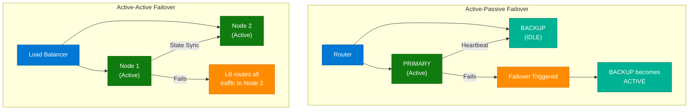

### How It Works — Active-Passive

1. **Normal operation**: All traffic routed to the PRIMARY node; BACKUP monitors via heartbeat.
2. **Heartbeat failure**: BACKUP detects PRIMARY is unreachable after N consecutive missed beats.
3. **Failover trigger**: BACKUP promotes itself to PRIMARY — acquires the virtual IP (VIP).
4. **Traffic re-routing**: DNS or the upstream router now forwards to the new PRIMARY.
5. **Recovery**: Original PRIMARY is repaired, re-joins as new BACKUP in standby mode.

### How It Works — Active-Active

1. **Normal operation**: Load balancer distributes requests across all active nodes.
2. **State sync**: Nodes share session state via a distributed cache (Redis) or replicated DB.
3. **Node failure**: LB health check detects failure; removes node from pool within seconds.
4. **Remaining nodes absorb load**: No explicit "failover" step — traffic naturally redistributes.
5. **Recovery**: Repaired node re-registers with LB health check endpoint, gradually re-added.

### Key Components

| Component | Role | Technology Options |
|---|---|---|
| Virtual IP (VIP) | Floating IP that moves between nodes on failover | Keepalived, AWS Elastic IP |
| Heartbeat | Periodic probe to detect primary liveness | Keepalived VRRP, Pacemaker |
| Load Balancer (AA) | Distributes traffic, health-checks all nodes | Nginx, HAProxy, AWS ALB |
| State Store | Synchronizes session state across AA nodes | Redis Cluster, Memcached |
| Health Check | Determines if a node is eligible for traffic | HTTP /health endpoints |

### Code Example

```python
import redis
import time

r = redis.Redis(host="redis-primary", port=6379)

def check_primary_alive(timeout_seconds=3):
    try:
        r.ping()
        return True
    except redis.ConnectionError:
        return False

def promote_backup():
    print("[BACKUP] Primary unreachable — promoting self to PRIMARY")
    # Acquire VIP, update DNS record, start accepting traffic

missed = 0
while True:
    if not check_primary_alive():
        missed += 1
        if missed >= 3:
            promote_backup()
            break
    else:
        missed = 0
    time.sleep(1)
```

### Interview Q&A

| Question | Answer |
|---|---|
| What is the key difference between Active-Active and Active-Passive? | In Active-Passive one node is idle (hot standby), consuming resources without processing traffic. In Active-Active all nodes process traffic simultaneously, maximizing resource utilization. |
| What is a "split-brain" scenario? | When two nodes in an Active-Active cluster both believe they are the primary, leading to conflicting writes and data corruption. Solved with quorum-based consensus (Raft/PAXOS) or a fencing mechanism. |
| What is RTO vs RPO in failover? | RTO (Recovery Time Objective) is the max acceptable downtime after failure. RPO (Recovery Point Objective) is the max acceptable data loss window. Active-Active targets near-zero RTO; Active-Passive has RTO of seconds to minutes. |
| When would you choose Active-Passive over Active-Active? | For stateful workloads where synchronization overhead is prohibitive (e.g., write-heavy databases) or when budget constraints make running duplicate active infrastructure impractical. |
| How does Keepalived implement Active-Passive? | Keepalived uses VRRP (Virtual Router Redundancy Protocol) — the master node holds a virtual IP and broadcasts VRRP advertisements; if advertisements stop, the backup takes the VIP. |

---

## 3. HPACK — HTTP/2 Header Compression

### Overview

HPACK is the header compression algorithm mandated by HTTP/2 (RFC 7541). It addresses a critical performance problem in HTTP/1.1: headers like `User-Agent`, `Cookie`, `Authorization`, and `Accept` are sent as plaintext strings on every single request, even when they are identical across requests. HPACK eliminates this redundancy using two tables — a **static table** (61 predefined common header entries) and a **dynamic table** (per-connection table of recently sent headers) — plus optional **Huffman encoding** for literal values. Instead of resending a full header, the client sends a tiny integer index reference. This dramatically reduces per-request overhead, particularly for mobile clients with many small API calls.

### Architecture Diagram

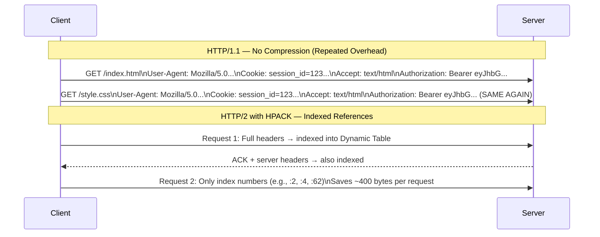

### How It Works

1. **Static Table**: Both client and server share a pre-agreed table of 61 common headers (e.g., index 1 = `:authority`, index 2 = `GET`, index 62 = `user-agent`).
2. **First request**: New headers not in static table are sent as literals and added to the **dynamic table** with a newly assigned index.
3. **Subsequent requests**: Matching headers are replaced with their integer index — a 1-2 byte integer instead of a 30–100 byte string.
4. **Huffman encoding**: For values that must be sent literally, Huffman coding compresses the byte representation by ~30%.
5. **Dynamic table eviction**: Oldest entries are evicted when the table reaches its size limit (negotiated via `SETTINGS_HEADER_TABLE_SIZE`).
6. **Server push headers**: The same compression applies to server-initiated pushes.

### Key Components

| Component | Role | Notes |
|---|---|---|
| Static Table | 61 pre-agreed common headers | Identical on all HTTP/2 implementations |
| Dynamic Table | Per-connection indexed headers | Built up incrementally per session |
| Huffman Encoding | Compresses literal header values | ~30% reduction on ASCII strings |
| Index Reference | 1–2 byte integer replacing full header | Core mechanism for repeated overhead elimination |
| SETTINGS_HEADER_TABLE_SIZE | Controls dynamic table capacity | Default 4096 bytes; negotiated at connection start |

### Code Example

```python
# Simulating HPACK concept — actual HPACK is done at the HTTP/2 transport layer
# Using h2 library (pip install h2)
import h2.connection
import h2.config

config = h2.config.H2Configuration(client_side=True)
conn = h2.connection.H2Connection(config=config)
conn.initiate_connection()

# Headers sent on first request — go into dynamic table
headers_req1 = [
    (":method", "GET"),
    (":path", "/index.html"),
    ("user-agent", "Mozilla/5.0"),
    ("cookie", "session_id=abc123"),
    ("authorization", "Bearer eyJhbGc..."),
]

# On second request, h2 automatically sends indexed references
# instead of repeating the literal strings
headers_req2 = [
    (":method", "GET"),
    (":path", "/style.css"),
    # user-agent, cookie, authorization sent as index references automatically
]
```

### Interview Q&A

| Question | Answer |
|---|---|
| What problem does HPACK solve? | HTTP/1.1 resends identical headers (User-Agent, Cookie, Authorization) on every request as plain text. HPACK uses indexed tables to replace repeated headers with 1-2 byte integer references, reducing per-request overhead by hundreds of bytes. |
| What is the difference between the static and dynamic tables? | The static table has 61 predefined common HTTP headers shared by all implementations. The dynamic table is per-connection and grows as headers are exchanged — new entries are added by the sender and evicted LRU-style when the table is full. |
| Why is HPACK important for mobile performance? | Mobile apps make many small API calls over the same HTTP/2 connection. With HPACK, repeated auth tokens and user-agent strings stop consuming bandwidth after the first request, significantly reducing data usage and latency. |
| How does HPACK differ from GZIP? | GZIP compresses the entire HTTP body. HPACK only compresses headers and cannot be used for body compression. HTTP/2 still uses content-encoding (gzip/br) for response bodies separately. |
| What is QPACK and how does it relate to HPACK? | QPACK is the header compression scheme for HTTP/3 (QUIC). HPACK assumes ordered delivery (TCP) — QPACK is designed for QUIC's out-of-order packet delivery model, using separate encoder/decoder streams. |

---

## 4. Race Conditions & Idempotency

### Overview

A race condition in an API context occurs when two or more concurrent requests read a shared state, each believes an action is safe, and both proceed to modify state simultaneously — producing duplicate or inconsistent data. This is a Time-of-Check to Time-of-Use (TOCTOU) vulnerability. The classic interview scenario: two users hit the same POST endpoint at the exact same millisecond, both pass validation, and both insert the same record. Application-level checks (IF NOT EXISTS queries) do not protect against this because both reads happen before either write commits. Solutions must operate at the database level (atomic constraints), distributed coordination layer (locks), or protocol level (idempotency keys).

### Architecture Diagram

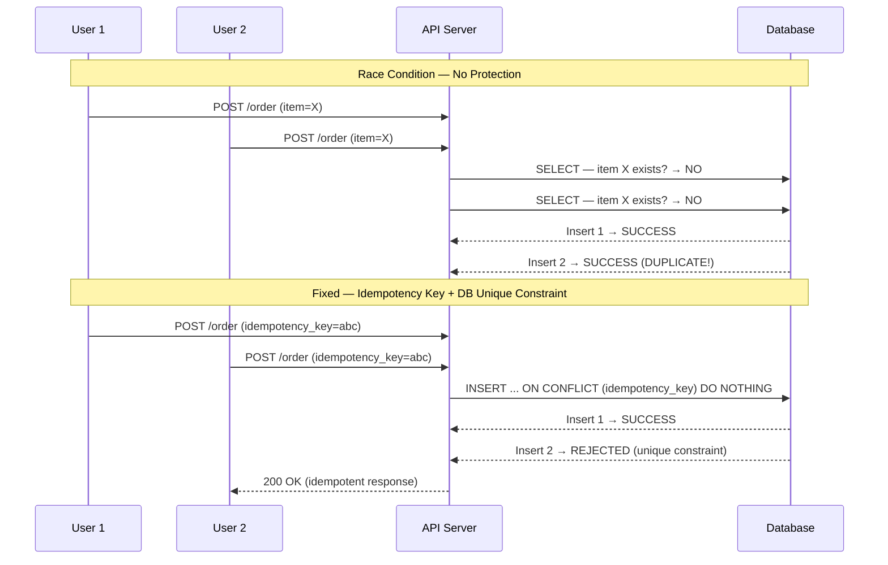

### How It Works — Three Solutions

**1. Database Unique Constraints** (most robust)
- Add `UNIQUE(user_id, item_id)` or `UNIQUE(idempotency_key)` at the DB level.
- The database engine guarantees only one insert succeeds at the row level regardless of concurrent transactions.

**2. Distributed Locking with Redis**
- Before processing, acquire a lock: `SET lock:{resource_id} 1 NX PX 5000` (NX = only if not exists, PX = TTL milliseconds).
- Only one request proceeds; others either wait or receive 409 Conflict.

**3. Idempotency Keys**
- Client sends a unique key per logical operation (UUID v4).
- Server records the key + response in a `idempotency_keys` table.
- If the key is seen again, return the cached response without re-processing.

### Code Example

```python
import redis
import uuid
from contextlib import contextmanager

r = redis.Redis(host="localhost", port=6379)

@contextmanager
def distributed_lock(resource_id: str, ttl_ms: int = 5000):
    lock_key = f"lock:{resource_id}"
    token = str(uuid.uuid4())
    acquired = r.set(lock_key, token, nx=True, px=ttl_ms)
    if not acquired:
        raise Exception(f"Could not acquire lock for {resource_id}")
    try:
        yield
    finally:
        # Only release if we own the lock
        current = r.get(lock_key)
        if current and current.decode() == token:
            r.delete(lock_key)

def create_order(user_id: str, item_id: str):
    with distributed_lock(f"order:{user_id}:{item_id}"):
        # Safe — only one thread executes this block per resource
        # Also add DB unique constraint as defense-in-depth
        pass
```

```sql
-- Database-level protection (always add this regardless of app-level locks)
ALTER TABLE orders
  ADD CONSTRAINT uq_order_item UNIQUE (user_id, item_id);

-- Idempotency key table
CREATE TABLE idempotency_keys (
    key        UUID PRIMARY KEY,
    user_id    BIGINT NOT NULL,
    response   JSONB NOT NULL,
    created_at TIMESTAMPTZ DEFAULT NOW()
);
```

### Interview Q&A

| Question | Answer |
|---|---|
| Why doesn't application-level validation prevent race conditions? | Because validation reads happen before writes; two concurrent reads both see the same state ("record does not exist") before either write commits. Only the database can enforce atomic uniqueness via constraints. |
| What is an idempotency key? | A unique identifier (UUID) the client attaches to a request. The server stores it with the response; if the same key appears again, the server returns the cached response without re-processing — making the operation safe to retry. |
| How does Redis `SET NX` prevent duplicate processing? | `SET key value NX PX 5000` atomically sets the key only if it does not exist (NX) with a 5-second TTL. Only the first concurrent caller succeeds; all others fail atomically since Redis is single-threaded. |
| What is TOCTOU and where does it appear? | Time-of-Check to Time-of-Use — a bug where the state checked before an action differs from the state at the time the action executes. Common in file systems (check then create), APIs (read then write), and inventory systems. |
| When would you use idempotency keys vs DB constraints? | DB constraints for uniqueness at the data model level; idempotency keys for operations that have side effects beyond a single table (e.g., charging a payment gateway + inserting an order + sending an email). |

---

## 5. Content Delivery Networks (CDNs)

### Overview

A Content Delivery Network (CDN) is a globally distributed network of proxy servers (edge nodes / Points of Presence — PoPs) that cache copies of content close to end-users. The fundamental insight is that the speed of light is a physical limit — a user in Singapore fetching assets from a US-East origin server experiences 150–250ms of round-trip latency just from distance. CDNs reduce this by serving cached content from a PoP a few milliseconds away. Beyond latency, CDNs absorb traffic spikes, protect origin servers from DDoS, reduce bandwidth costs (egress from origin is expensive), and enable features like TLS termination at the edge, image optimization, and edge compute.

### Architecture Diagram

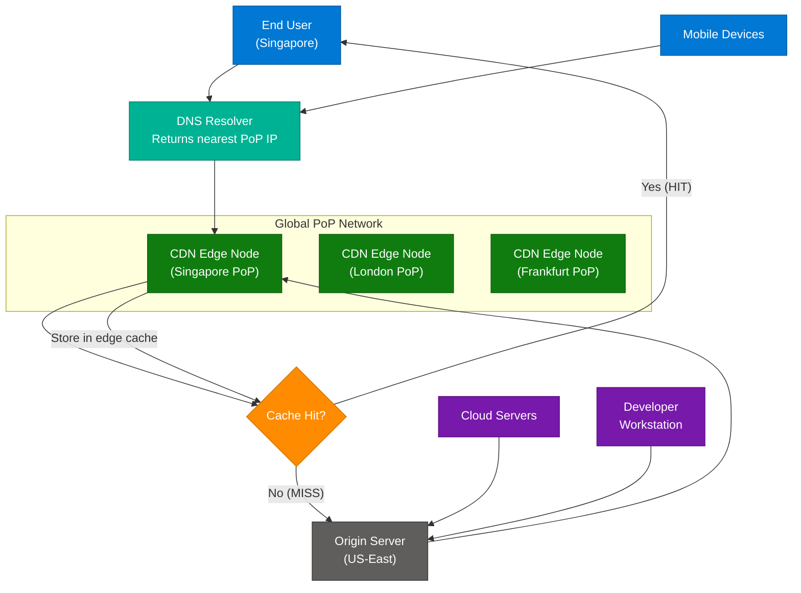

### How It Works

1. **DNS resolution**: User's DNS resolver returns the IP of the nearest CDN PoP (anycast routing or GeoDNS).
2. **Edge cache lookup**: CDN checks if the requested asset is cached at the PoP.
3. **Cache HIT**: Asset returned directly from edge — latency ~5–20ms vs 150–300ms to origin.
4. **Cache MISS**: Edge node fetches from origin, stores in edge cache with TTL, then serves user.
5. **TTL expiry**: Stale content is re-fetched from origin; `Cache-Control: max-age` controls this.
6. **Purge/invalidation**: On deployment, CDN purge API clears stale cache across all PoPs.

### Key Components

| Component | Role | Technology Options |
|---|---|---|
| Edge Node / PoP | Geographically distributed cache server | Cloudflare, AWS CloudFront, Fastly |
| Origin Server | Authoritative source of truth for content | AWS S3, EC2, on-prem web server |
| Cache-Control Headers | Instructs edge how long to cache content | `max-age`, `s-maxage`, `no-cache` |
| Anycast / GeoDNS | Routes user to nearest PoP automatically | Cloudflare Anycast, AWS Route 53 |
| Edge Compute | Run logic at the PoP (auth, A/B, rewrites) | Cloudflare Workers, Lambda@Edge |
| Cache Purge API | Invalidate stale content after deployment | `cf-cache-status: PURGE` |

### Code Example

```python
# FastAPI response with CDN-friendly cache headers
from fastapi import FastAPI, Response

app = FastAPI()

@app.get("/static/logo.png")
def serve_logo(response: Response):
    response.headers["Cache-Control"] = "public, max-age=86400, s-maxage=604800"
    # max-age=86400  → browser caches for 1 day
    # s-maxage=604800 → CDN caches for 7 days (overrides max-age for shared caches)
    response.headers["Vary"] = "Accept-Encoding"
    return {"url": "https://cdn.example.com/logo.png"}

@app.get("/api/user/profile")
def serve_profile(response: Response):
    response.headers["Cache-Control"] = "private, no-store"
    # private = browser only, no-store = never cache (user-specific data)
    return {"user": "..."}
```

### Interview Q&A

| Question | Answer |
|---|---|
| What is the difference between `max-age` and `s-maxage`? | `max-age` controls how long a client (browser) caches the response. `s-maxage` overrides `max-age` specifically for shared caches (CDNs, proxies), allowing different TTLs for browser vs edge. |
| How does a CDN know which PoP to route a user to? | Via Anycast IP routing (same IP announced from multiple PoPs; BGP routes to nearest) or GeoDNS (DNS resolver returns different IPs based on user's IP geolocation). |
| What are "origin shield" or "tiered caching"? | An intermediary CDN layer between edge PoPs and the origin. Instead of every PoP hitting origin on a cache miss, they all hit the shield, dramatically reducing origin load. Used by Cloudflare (Argo Shield) and CloudFront. |
| What is cache stampede and how do you prevent it? | When a popular cached item expires, thousands of simultaneous requests all miss the cache and hit origin simultaneously. Prevent with staggered TTLs, probabilistic early refresh, or a distributed lock to let only one request refresh. |
| What is edge compute and how does it extend CDN capabilities? | Edge compute runs serverless functions at CDN PoPs (Cloudflare Workers, Lambda@Edge). Enables request rewriting, A/B testing, auth validation, and personalization without round-tripping to origin. |

---

## 6. Microservices Architecture

### Overview

Microservices architecture decomposes a monolithic application into small, independently deployable services, each owning its own domain, data store, and deployment lifecycle. The canonical principle is "each service does one thing and does it well" — bounded by domain context (DDD). The architecture introduces an API Gateway as the single entry point, a Service Registry for dynamic discovery, and observability layers (distributed tracing, centralized logging) because visibility becomes critical when a request spans 5–10 services. The tradeoff vs. monolith: higher operational complexity, network overhead, and distributed data challenges in exchange for independent scalability, technology heterogeneity, and fault isolation.

### Architecture Diagram

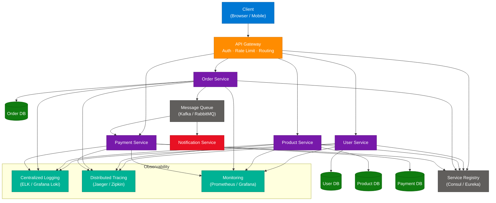

### How It Works

1. **Client request**: Browser/mobile hits the API Gateway — the single public entry point.
2. **Gateway operations**: Auth token validation, rate limit check, request routing to correct service.
3. **Service execution**: Each microservice handles its domain logic independently against its own database.
4. **Async communication**: Long-running or cross-service work (e.g., payment triggers order update) goes through a message queue to avoid synchronous coupling.
5. **Service discovery**: Services register with Service Registry on startup; gateway looks up service addresses dynamically.
6. **Observability**: Every request generates trace spans, logs, and metrics collected centrally.

### Key Components

| Component | Role | Technology Options |
|---|---|---|
| API Gateway | Entry point, auth, rate limit, routing | Kong, AWS API Gateway, Nginx |
| Service Registry | Dynamic service address lookup | Consul, Eureka, etcd |
| Message Queue | Async inter-service communication | Kafka, RabbitMQ, AWS SQS |
| Distributed Tracing | End-to-end request visibility across services | Jaeger, Zipkin, AWS X-Ray |
| Centralized Logging | Aggregate logs from all services | ELK Stack, Grafana Loki |
| Circuit Breaker | Stops calling failing downstream services | Resilience4j, Polly, Hystrix |

### Interview Q&A

| Question | Answer |
|---|---|
| Why does each microservice need its own database? | Database-per-service enforces loose coupling. If services share a DB, schema changes in one service break others, and a slow query in one service degrades all. Separate DBs enable independent scaling and technology choice. |
| What is the API Gateway pattern and why is it important? | The API Gateway is the single entry point that consolidates cross-cutting concerns (auth, rate limiting, SSL termination, routing) outside of individual services. Without it, every service would need to re-implement these concerns. |
| How do microservices communicate synchronously vs asynchronously? | Synchronous: REST or gRPC (request/response, caller waits). Asynchronous: message queue (Kafka/RabbitMQ) — caller publishes an event and continues without waiting; consumers process independently. |
| What is service discovery and why is it needed? | In containerized environments, service IPs change constantly (pods restart, scale out). Service discovery (Consul, Kubernetes DNS) lets services find each other by name without hardcoded IPs. |
| What is the primary challenge with distributed data in microservices? | Each service owns its DB, so you cannot use ACID transactions across services. Distributed consistency requires Saga patterns (choreography or orchestration) to coordinate multi-service state changes with compensating transactions on failure. |

---

## 7. Microservices Learning Roadmap 2026

### Overview

This roadmap (from CodeSnippet's "Microservices Roadmap 2026") provides a structured 15-topic progression from foundational concepts through advanced resilience patterns. It is designed to take an engineer from "what is a microservice?" to production-grade skills in circuit breaking, rate limiting, and service discovery — the topics most commonly tested in senior engineering interviews.

### Curriculum

| # | Category | Topic | Prerequisite |
|---|---|---|---|
| 1 | Fundamentals | What Are Microservices? | None |
| 2 | Architecture | Monolith vs Microservices | Topic 1 |
| 3 | Architecture | Microservices Architecture Explained | Topic 2 |
| 4 | Development | Building First Microservice | Topic 3 |
| 5 | Deployment | Creating & Running Multiple Services Locally | Topic 4 |
| 6 | Communication | Inter-Service Communication | Topic 5 |
| 7 | Patterns | Microservices Communication Patterns | Topic 6 |
| 8 | Protocol | REST Communication Between Microservices | Topic 7 |
| 9 | Implementation | Feign Client & Implementation | Topic 8 |
| 10 | Resilience | Handling Timeouts and Retries | Topic 6 |
| 11 | Resilience | Circuit Breaker Pattern | Topic 10 |
| 12 | Optimization | Rate Limiters | Topic 11 |
| 13 | Discovery | Service Discovery | Topic 5 |
| 14 | Discovery | What is Service Discovery? Implementing Service Discovery | Topic 13 |
| 15 | Automation | Registering Services Automatically | Topic 14 |

### Circuit Breaker State Diagram

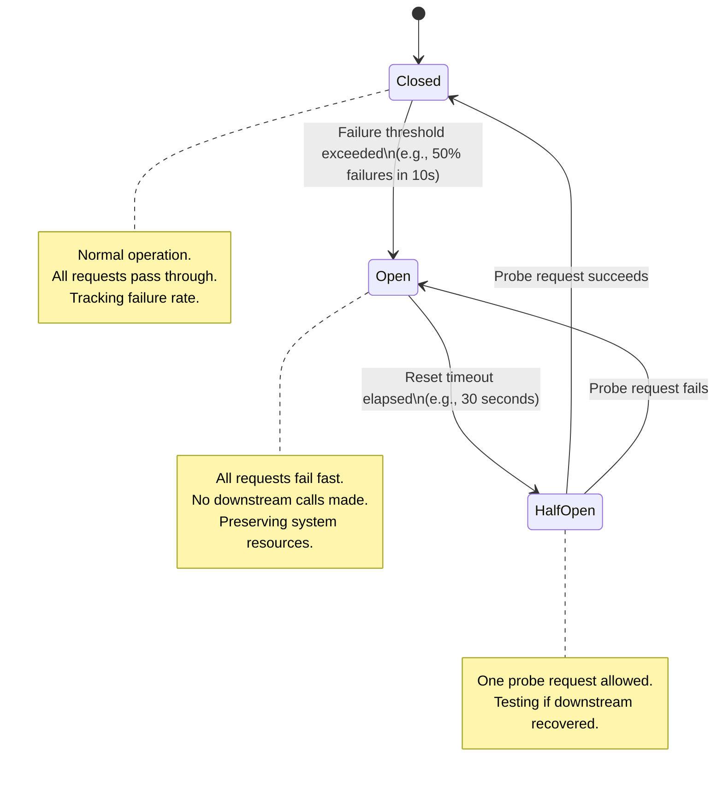

---

## 8. Horizontal Scaling & Load Balancing

### Overview

Horizontal scaling (scaling out) adds more instances of a service to handle increased load, as opposed to vertical scaling (scaling up) which adds more CPU/RAM to a single instance. It is the foundational scaling strategy for cloud-native systems because it provides near-linear throughput growth and high availability — losing one of ten nodes is a 10% capacity reduction, not a total outage. Load balancing is the mechanism that distributes incoming requests across these instances. The load balancer must also perform health checking to remove unhealthy instances from the pool. Horizontal scaling requires stateless services (or externalized state via Redis/DB) — a session stored in memory on Node 1 is inaccessible to Node 2.

### Architecture Diagram

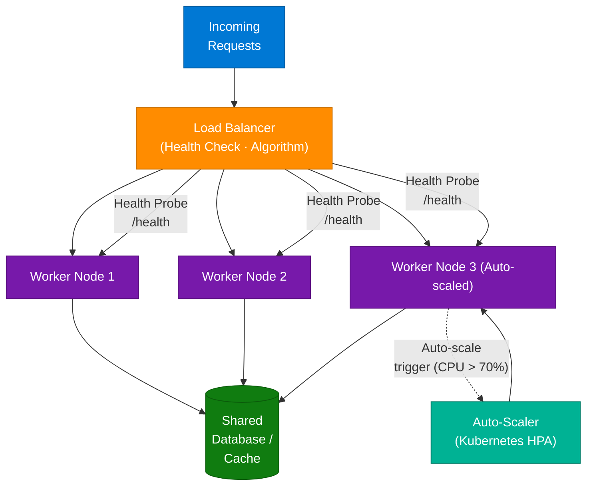

### Load Balancing Algorithms

| Algorithm | How It Works | Best For |
|---|---|---|
| Round Robin | Each request goes to the next server in sequence | Homogeneous servers, equal request cost |
| Least Connections | Routes to server with fewest active connections | Long-lived connections (WebSocket, gRPC) |
| IP Hash | Hash client IP → deterministic server assignment | Session affinity (sticky sessions) |
| Weighted Round Robin | Servers assigned weights; heavier servers get more traffic | Heterogeneous capacity (3 × 4-core + 1 × 16-core) |
| Random | Pick a random healthy server | Simple, works well at scale |

### Code Example

```python
import itertools
from typing import List

class RoundRobinLoadBalancer:
    def __init__(self, servers: List[str]):
        self.healthy = [s for s in servers]
        self._cycle = itertools.cycle(self.healthy)

    def get_next(self) -> str:
        return next(self._cycle)

    def mark_unhealthy(self, server: str):
        if server in self.healthy:
            self.healthy.remove(server)
            self._cycle = itertools.cycle(self.healthy)

lb = RoundRobinLoadBalancer(["http://worker1:8080", "http://worker2:8080", "http://worker3:8080"])
print(lb.get_next())  # worker1
print(lb.get_next())  # worker2
print(lb.get_next())  # worker3
print(lb.get_next())  # worker1 (cycles)
```

### Interview Q&A

| Question | Answer |
|---|---|
| What is the key requirement for horizontal scaling to work? | Services must be stateless — no in-memory session or request state. Session data must be stored externally (Redis, DB) so any node can handle any request. |
| What is the difference between L4 and L7 load balancing? | L4 (Transport layer) routes based on IP/TCP — faster, no content inspection. L7 (Application layer) routes based on HTTP headers, paths, cookies — enables path-based routing and advanced health checks but has higher overhead. |
| Why can't you always just scale vertically? | Vertical scaling has hard limits (largest instance type) and a single point of failure. It's also expensive per unit of compute and causes downtime during resize. Horizontal scaling is theoretically unlimited and maintains availability. |
| What is connection draining (deregistration delay)? | When removing a node from the load balancer pool, connection draining allows in-flight requests on that node to complete before the node is removed, preventing request failures during graceful shutdown or deployments. |

---

## 9. Push vs Pull Queue Architectures

### Overview

Message queues decouple producers (writers) from consumers (readers), but they differ fundamentally in *who controls the flow*. In a **Push Queue**, the queue broker actively delivers messages to consumer endpoints as soon as they arrive — the producer drives timing. In a **Pull Queue**, consumers poll the queue when ready to process — the consumer drives timing. Push queues minimize latency for real-time notifications but can overwhelm slow consumers. Pull queues let consumers self-throttle based on their processing capacity, making them ideal for batch workloads or rate-sensitive operations. Most production systems use pull semantics (Kafka, SQS) because consumer-controlled flow prevents cascade failures.

### Architecture Diagrams

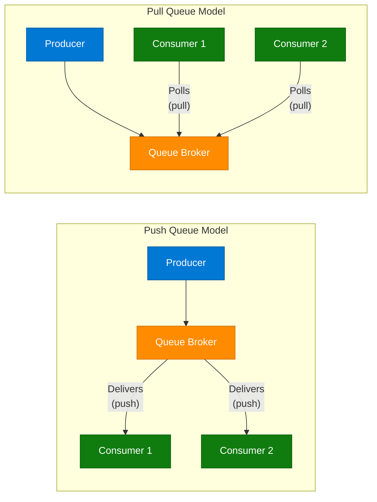

### Message Lifecycle

| Stage | Push Queue | Pull Queue |
|---|---|---|
| Message arrival | Broker immediately delivers to subscriber endpoint | Broker stores message; waits for consumer poll |
| Consumer availability | Consumer must always be up to receive delivery | Consumer can be offline; messages queue up |
| Backpressure | Consumer may be overwhelmed if slow | Consumer naturally self-throttles by polling rate |
| Failure handling | Dead-letter queue on delivery failure | Message becomes visible again after visibility timeout |

### Comparison

| Aspect | Push Queue | Pull Queue |
|---|---|---|
| Who initiates? | Broker (producer-driven) | Consumer |
| Latency | Near real-time | Polling interval adds latency |
| Consumer control | Limited | Full — process at own pace |
| Best for | Webhooks, notifications, IoT events | Batch jobs, ETL, rate-sensitive processing |
| Technology examples | SNS, Pusher, server-sent events | SQS, Kafka, RabbitMQ |
| Backpressure | Difficult — consumer can be overwhelmed | Natural — consumer controls poll rate |

### Code Example

```python
import boto3
import json

sqs = boto3.client("sqs", region_name="us-east-1")
QUEUE_URL = "https://sqs.us-east-1.amazonaws.com/123/my-queue"

# Producer — sends message
def produce(payload: dict):
    sqs.send_message(
        QueueUrl=QUEUE_URL,
        MessageBody=json.dumps(payload),
    )

# Consumer — pull model (polls when ready)
def consume_batch(max_messages: int = 10):
    response = sqs.receive_message(
        QueueUrl=QUEUE_URL,
        MaxNumberOfMessages=max_messages,
        WaitTimeSeconds=20,  # long-polling — reduces empty polls
    )
    for msg in response.get("Messages", []):
        process(json.loads(msg["Body"]))
        sqs.delete_message(QueueUrl=QUEUE_URL, ReceiptHandle=msg["ReceiptHandle"])

def process(payload: dict):
    print(f"Processing: {payload}")
```

### Interview Q&A

| Question | Answer |
|---|---|
| What is long-polling in a pull queue? | Instead of returning immediately when the queue is empty, the broker holds the connection open for up to 20 seconds waiting for a message to arrive. This reduces empty poll responses and their associated costs vs. frequent short polls. |
| What is a dead-letter queue (DLQ)? | A separate queue where messages are sent after failing delivery or processing N times. Allows debugging failed messages without blocking the main queue. |
| How does Kafka differ from a traditional push/pull queue? | Kafka is a distributed log — consumers maintain their own offset (position in the log) and pull at their own rate. Messages are retained for a configurable period regardless of consumption, enabling replay and multiple independent consumer groups. |
| What is the visibility timeout in SQS? | When a consumer receives a message, it becomes invisible to other consumers for the visibility timeout period. If the consumer fails to delete it within that time, the message becomes visible again for another consumer to process. |
| When would you choose push over pull? | Push for sub-100ms event notification to multiple subscribers (e.g., webhook delivery, live score updates) where polling latency is unacceptable and consumers are reliable/online. |

---

## 10. Cache vs Database — Persistence vs Performance

### Overview

Caching and databases solve different problems and must coexist in any production system. A **database** is the system of record — it provides ACID guarantees (Atomicity, Consistency, Isolation, Durability), persistent storage on non-volatile disk, and handles complex relational queries. A **cache** (typically Redis or Memcached) stores data in RAM for microsecond-latency retrieval — but RAM is volatile (lost on power loss), expensive per GB, and limited in capacity. The architectural principle is: *the database is the source of truth; the cache is an optimization layer*. Storing everything in cache would lose data on every restart, limit storage to RAM capacity (~hundreds of GB vs petabytes for disk), and lose all query capabilities beyond simple key lookup.

### Caching Patterns Diagram

```mermaid
flowchart TD
    subgraph CacheAside["Cache-Aside (Lazy Loading)"]
        App["Application"] -- "1. Read request" --> CA_Cache["Cache (Redis)"]
        CA_Cache -- "2. MISS: Not found" --> CA_App["Application"]
        CA_App -- "3. Read from DB" --> CA_DB[("Database")]
        CA_DB -- "4. Return data" --> CA_App
        CA_App -- "5. Write to cache + return" --> CA_Cache
    end

    subgraph WriteThrough["Write-Through"]
        WApp["Application"] -- "Write" --> WCache["Cache"]
        WCache -- "Synchronously\nwrite through" --> WDB[("Database")]
    end

    subgraph WriteBack["Write-Behind / Write-Back"]
        BAApp["Application"] -- "Write" --> BACache["Cache"]
        BACache -- "Async write\n(batched)" --> BADB[("Database")]
    end

    classDef userNode    fill:#0078D4,stroke:#005A9E,color:#fff
    classDef processNode fill:#FF8C00,stroke:#CC7000,color:#fff
    classDef dataNode    fill:#107C10,stroke:#0A5C0A,color:#fff
    classDef aiNode      fill:#7719AA,stroke:#5A0E80,color:#fff

    class App,WApp,BAApp userNode
    class CA_Cache,WCache,BACache processNode
    class CA_DB,WDB,BADB dataNode
    class CA_App aiNode
```

### Cache vs Database Comparison

| Dimension | Cache (Redis) | Database (PostgreSQL) |
|---|---|---|
| Storage medium | RAM (volatile) | Disk — HDD/SSD (non-volatile) |
| Latency | Sub-millisecond (μs) | Milliseconds to seconds |
| Capacity | Limited — expensive per GB | Massive — terabytes/petabytes |
| Persistence | Optional (AOF/RDB snapshots) | Always — built for durability |
| Query capability | Key-Value, basic set/sorted set ops | Full SQL — joins, aggregations, ACID |
| Failure impact | Data lost (if no persistence) | Data survives crashes |
| Cost per GB | ~10–100x more expensive than disk | Cheap commodity storage |

### Code Example

```python
import redis
import json
from typing import Optional

r = redis.Redis(host="localhost", port=6379, decode_responses=True)

def get_user(user_id: int) -> dict:
    cache_key = f"user:{user_id}"

    # Cache-Aside pattern
    cached = r.get(cache_key)
    if cached:
        return json.loads(cached)  # Cache HIT

    # Cache MISS — query DB
    user = db_query(f"SELECT * FROM users WHERE id = {user_id}")
    if user:
        r.setex(cache_key, 3600, json.dumps(user))  # TTL = 1 hour
    return user

def update_user(user_id: int, data: dict):
    db_execute(f"UPDATE users SET ... WHERE id = {user_id}")
    r.delete(f"user:{user_id}")  # Invalidate cache on write
```

### Interview Q&A

| Question | Answer |
|---|---|
| If cache is faster, why not store everything there? | RAM is volatile (data lost on restart), expensive per GB, and limited in capacity. Databases provide durability, complex query support, and terabyte-scale storage that RAM cannot match economically. |
| What is the Cache-Aside pattern? | The application checks the cache first; on a miss, reads from the DB, writes the result to cache with a TTL, then returns it. The application manages cache population explicitly. |
| What is the difference between Write-Through and Write-Back caching? | Write-Through writes to cache and DB synchronously in the same operation — strong consistency, higher write latency. Write-Back writes to cache immediately and DB asynchronously — lower write latency but risk of data loss if cache fails before the DB write. |
| What is cache stampede and how do you prevent it? | When a cache entry expires and many concurrent requests all miss simultaneously, flooding the DB. Prevent with a mutex lock (only one request re-populates the cache) or probabilistic early expiration. |
| When does Redis provide persistence? | Redis supports AOF (Append-Only File — logs every write command) and RDB (periodic snapshots). For true durability requirements, use both; for pure caching, persistence can be disabled for maximum performance. |

---

## 11. Thread Pool Sizing & Optimization

### Overview

A thread pool is a pre-allocated set of worker threads that process tasks from a queue, avoiding the overhead of creating/destroying threads per task. The key insight is that **more threads ≠ more throughput** — threads compete for CPU cores, and when thread count far exceeds CPU cores, the OS spends increasing time on context switching (saving/restoring thread state) rather than executing useful work. The optimal pool size depends on the nature of the workload: CPU-bound tasks saturate cores (optimal = N_cores + 1), while I/O-bound tasks spend most time waiting (threads can be larger, typically N_cores × (1 + wait_time/compute_time)). Increasing a pool from 50 to 500 on a 16-core machine causes ~500/16 ≈ 31 context switches per core cycle — severe CPU waste.

### Thread State Diagram

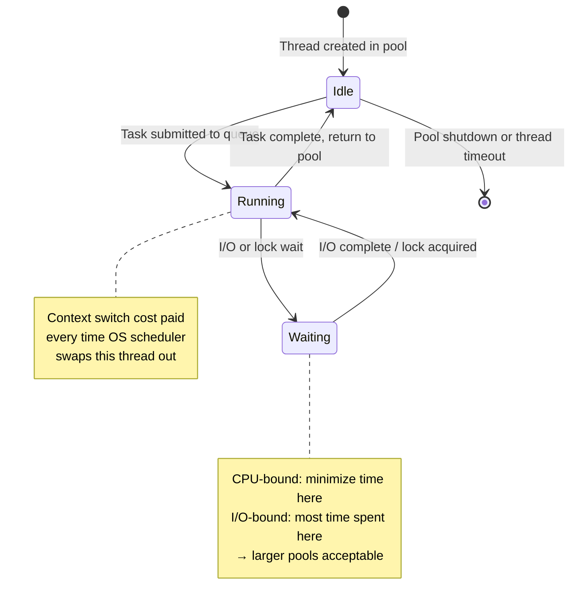

### Optimal Pool Size Formulas

| Workload Type | Formula | Example (16 cores, 80% wait time) |
|---|---|---|
| CPU-bound | `N_cores + 1` | 17 threads |
| I/O-bound | `N_cores × (1 + wait_time / compute_time)` | `16 × (1 + 0.8/0.2)` = 80 threads |
| Mixed | Start at `N_cores × 2`, load-test and tune | 32 threads baseline |

### Code Example

```python
from concurrent.futures import ThreadPoolExecutor
import os
import time

CPU_COUNT = os.cpu_count()

# CPU-bound pool: limit to CPU count + 1
cpu_pool = ThreadPoolExecutor(max_workers=CPU_COUNT + 1)

# I/O-bound pool: larger — threads idle while waiting on network/DB
# Assuming 80% wait time: 16 × (1 + 4) = 80
io_pool = ThreadPoolExecutor(max_workers=CPU_COUNT * 5)

def cpu_intensive_task(n: int) -> int:
    return sum(i * i for i in range(n))

def io_task(url: str) -> str:
    import urllib.request
    with urllib.request.urlopen(url) as response:
        return response.read(100).decode()

# Submit CPU work to CPU pool
futures = [cpu_pool.submit(cpu_intensive_task, 1_000_000) for _ in range(8)]
results = [f.result() for f in futures]

# Why 50→500 threads caused degradation:
# 500 threads / 16 cores = 31 threads compete per core
# OS context-switches 31× more per time slice → ~60% CPU wasted on scheduling
```

### Interview Q&A

| Question | Answer |
|---|---|
| Why did increasing thread pool from 50 to 500 degrade performance? | With 500 threads on a 16-core machine, ~31 threads compete per CPU core. The OS must constantly context-switch, saving/restoring register state. This overhead consumes CPU cycles that should be doing useful work, reducing throughput. |
| What is context switching overhead? | When the OS scheduler switches from one thread to another, it saves the current thread's CPU register state, loads the new thread's state, and flushes CPU caches (TLB). Each switch costs ~1–10 microseconds and pollutes L1/L2 caches. |
| What is the difference between CPU-bound and I/O-bound threads? | CPU-bound threads actively consume CPU cycles (computation). I/O-bound threads spend most time waiting for external responses (DB query, network, disk). CPU-bound threads benefit from pool size = N_cores; I/O-bound can have larger pools since waiting threads don't consume CPU. |
| What is the risk of setting pool size too small? | Tasks queue up waiting for an available thread — request latency increases and eventually queue depth causes OOM (out of memory) if unbounded, or tasks are rejected if bounded. |
| How do virtual threads (Java 21) or async/await change thread pool sizing? | Virtual threads (Project Loom) and async frameworks (Python asyncio, .NET async/await) multiplex millions of logical tasks onto a small OS thread pool. I/O waits don't block an OS thread — the runtime suspends the coroutine and resumes on completion, making large pools unnecessary for I/O-bound work. |

---

## 12. End-to-End System Design Framework

### Overview

This framework (from Next.tech12) provides the canonical request path for a scalable, production-grade system — from DNS resolution to database persistence. It synthesizes six architectural pillars: request routing, core services, async processing, storage, static delivery, and reliability. Understanding this end-to-end flow is essential for system design interviews because interviewers expect candidates to walk through each layer and justify the components. The framework is not monolithic — each pillar can be independently scaled, replaced, or optimized.

### Full System Architecture Diagram

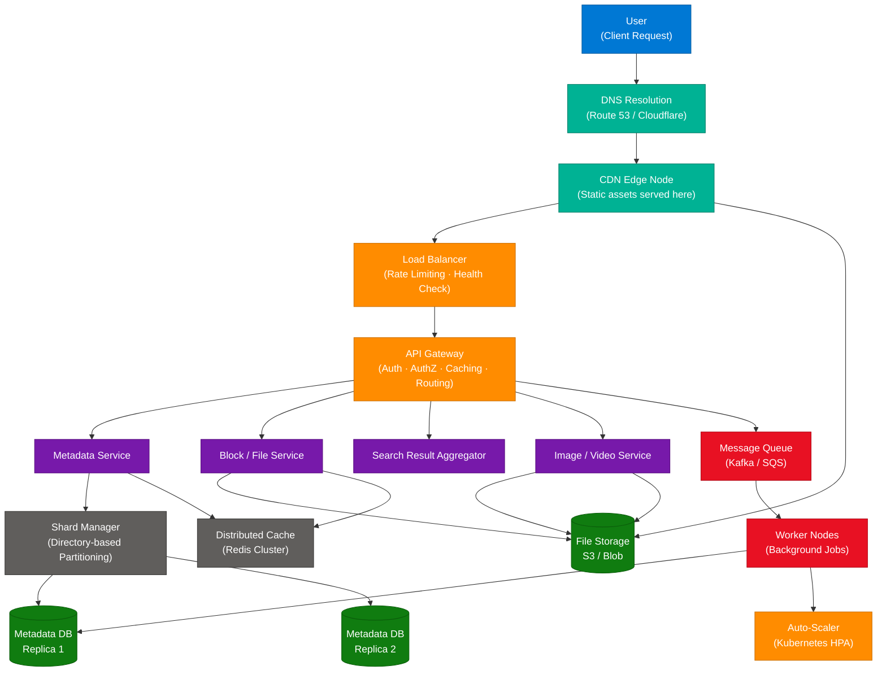

### Six Architectural Pillars

| Pillar | Components | Purpose |
|---|---|---|
| Request Flow | DNS → CDN → Load Balancer → API Gateway | Route, protect, authenticate, rate-limit |
| Core Services | Metadata, Block, Search, Image/Video | Domain-specific business logic |
| Async Processing | Queue → Worker Nodes | Decouple heavy tasks, enable retries |
| Storage | Shard Manager → Replicated DBs + Cache | Scalable, reliable persistence + fast reads |
| Static Content | CDN + File Storage | Low-latency asset delivery globally |
| Reliability | Auto-scale, rate limiting, replication | Handle spikes, prevent cascades |

### Request Flow Walk-Through

1. **DNS** resolves domain → returns IP of nearest CDN PoP.
2. **CDN** checks if asset is cached — serves immediately on HIT; on MISS forwards to LB.
3. **Load Balancer** enforces rate limits, health-checks, routes to healthy API Gateway instance.
4. **API Gateway** validates JWT token, checks per-user rate limit, routes by path to correct service.
5. **Service** checks Redis cache; on HIT returns immediately. On MISS queries DB via Shard Manager.
6. **Shard Manager** routes query to correct DB shard (directory-based partitioning).
7. **Heavy operations** (feed generation, video transcoding) are queued via Kafka → processed by Workers.
8. **Static assets** (images, videos) are served directly from CDN-fronted blob storage.

### Interview Q&A

| Question | Answer |
|---|---|
| Where does rate limiting belong in the stack? | At the Load Balancer (IP-level, coarse-grained) and the API Gateway (user/token-level, fine-grained). Putting it at the gateway enables per-user and per-endpoint limits without LB changes. |
| What is directory-based partitioning? | A lookup service (Shard Manager) maintains a map of partition key → shard location. Queries route to the correct DB shard via the manager. Flexible (supports uneven shards) but the manager is a bottleneck and must itself be highly available. |
| Why use both a cache and replicated DBs? | Cache (Redis) handles hot read paths with sub-ms latency. Replicated DBs provide read scaling (read replicas) and durability. Cache is volatile and evicts; DB is the authoritative store. They serve different latency and durability requirements. |
| How does auto-scaling interact with the queue? | Queue depth is a scaling metric — if the queue grows (consumers are falling behind), the auto-scaler spins up more worker nodes. When the queue drains, workers scale down. This is the canonical pattern for Kubernetes KEDA (event-driven autoscaling). |
| What happens if the API Gateway fails? | API Gateway should run in multiple instances behind the LB. If all gateway instances fail, traffic should return 503 from the LB. Use health checks with short intervals (5s) and connection draining to minimize impact during rolling deployments. |

---

## 13. Interview Q&A Cheatsheet

**Q: What is the difference between Active-Active and Active-Passive failover?**
> Active-Passive has one idle standby node that takes over on primary failure — wastes standby capacity but provides a clean single-writer guarantee. Active-Active runs all nodes simultaneously under a load balancer — maximizes resource utilization and has near-zero failover time but requires stateless services or synchronized state.

**Q: What is HPACK and why is it important for HTTP/2 performance?**
> HPACK is HTTP/2's header compression scheme (RFC 7541). It maintains a static table of 61 common headers and a per-connection dynamic table. Instead of resending 300–500 bytes of headers per request, it sends 1–2 byte integer indices for previously seen headers. Critical for mobile apps making many small API calls over a single connection.

**Q: How do you prevent duplicate writes when two requests hit an API simultaneously?**
> Three-layer defense: (1) Database unique constraints — the DB atomically rejects the second insert; (2) Distributed lock via Redis `SET NX PX` — only one process enters the critical section; (3) Idempotency keys — client sends a UUID per operation, server returns cached response on retry. Always use DB constraints as the last line of defense even with app-level locks.

**Q: What is a CDN and how does it reduce latency?**
> A CDN is a globally distributed network of edge servers (PoPs) that cache content close to users. Instead of a Singapore user fetching assets from a US-East origin (150–250ms RTT), they receive it from a PoP a few milliseconds away. CDN cache hits also protect origin servers from traffic spikes.

**Q: Why must microservices be stateless for horizontal scaling to work?**
> Stateless means no in-memory session — any instance can handle any request. If state lives in memory on Node 1, a request routed to Node 2 fails. State must be externalized to Redis, a DB, or a distributed cache so the load balancer can freely route without affinity.

**Q: When should you use a Push queue vs a Pull queue?**
> Push for real-time, latency-sensitive delivery to consumers that are always online (webhooks, IoT event streams, live notifications). Pull for batch processing and rate-sensitive workloads — consumers poll when ready, providing natural backpressure that prevents overwhelming slow workers.

**Q: Why can't you replace a database entirely with a cache?**
> RAM is volatile (data lost on restart), limited to hundreds of GB economically, and offers only key-value lookups. Databases provide non-volatile persistence, petabyte-scale storage, ACID transactions, and complex query support. Cache is a performance optimization layer on top of the database, not a replacement.

**Q: How do you determine the optimal thread pool size?**
> CPU-bound tasks: `N_cores + 1`. I/O-bound tasks: `N_cores × (1 + wait_time / compute_time)`. Increasing beyond this causes context-switching overhead to exceed useful computation — 500 threads on 16 cores means ~31 threads compete per core, wasting ~60% of CPU on scheduling.

**Q: What is the Saga pattern and when is it needed?**
> Saga manages distributed transactions across microservices that each own their own DB (no shared ACID transaction). Each step publishes an event; if a step fails, compensating transactions are run in reverse order to undo committed steps. Used for multi-service operations like "create order + charge payment + update inventory."

**Q: Walk me through a request from browser to database in a scalable system.**
> DNS resolves to CDN PoP → CDN cache HIT returns static assets; MISS forwards to Load Balancer → LB rate-limits and health-checks → API Gateway validates JWT and routes → Service checks Redis cache; on MISS queries DB via Shard Manager → DB returns data; service caches result in Redis with TTL → response travels back through Gateway → LB → CDN edge → user.

---

*Extracted from Gemini shared session · July 11, 2026 · GeminiShareToMD Agent v1.0*

---

```
═══════════════════════════════════════════════════════════
Token Usage Report
═══════════════════════════════════════════════════════════
Estimated without optimization:  ~9,200 tokens (raw Gemini page text)
Actual (with optimization):      ~7,800 tokens (enriched output)
Savings (input processing):      ~1,400 tokens (15%)
Techniques applied:
  • Stripped UI chrome (PDF/Acrobat buttons, Privacy/ToS footer, "Continue this chat")
  • Deduplicated identical user prompt (appeared 13 times → referenced once)
  • Stripped 13× Gemini follow-up "Would you like me to..." questions
  • Skipped non-technical turn (FIFA World Cup — Turn 8)
  • Compacted resource-only turn (Microsoft Python — Turn 11) to single note
  • Merged partial content turn (System Design intro — Turn 4) into note
═══════════════════════════════════════════════════════════
* Estimates: prose chars ÷ 4, code chars ÷ 3. Actual API usage varies by model.
```
