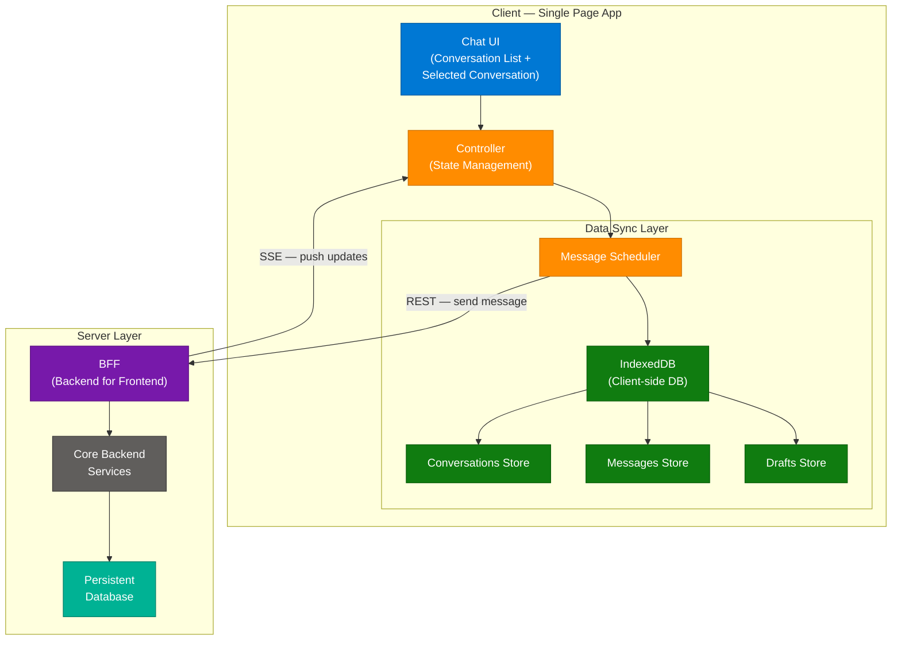
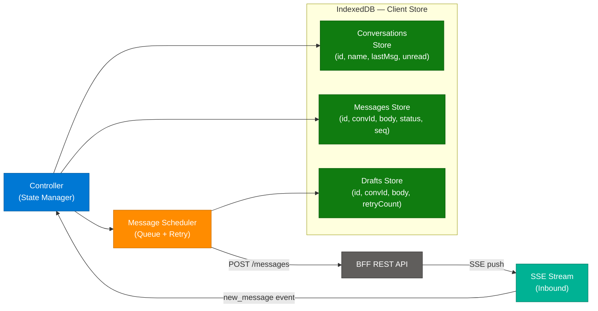
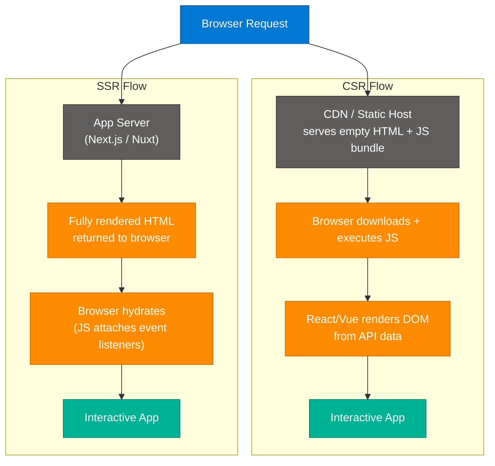
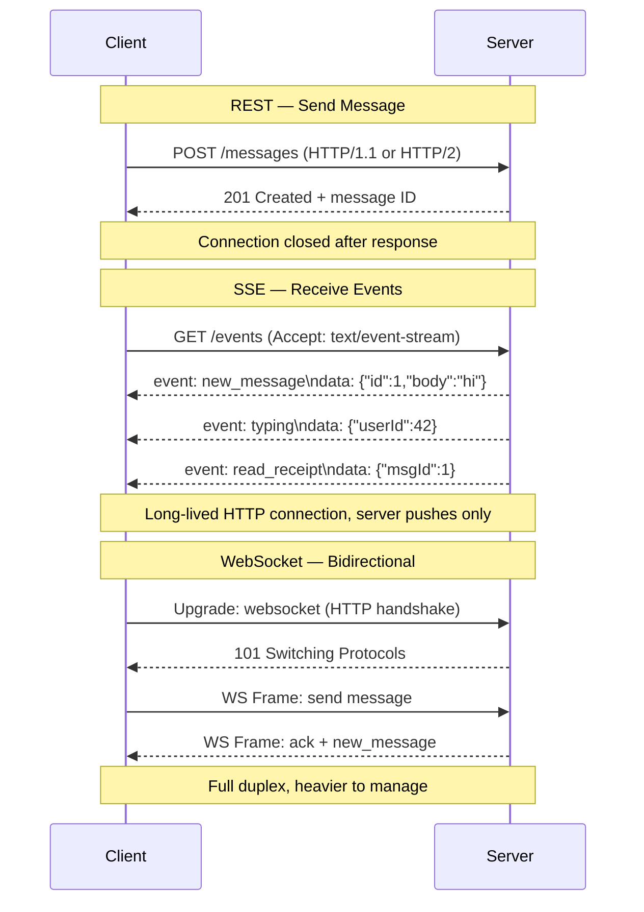
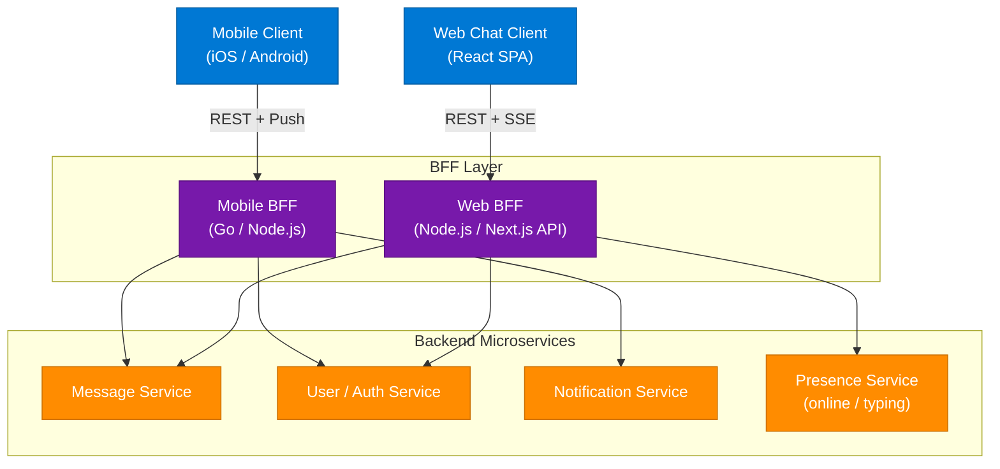
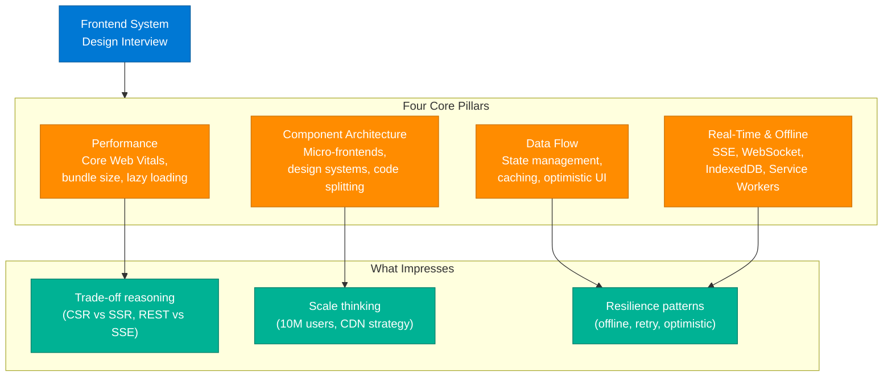

# Frontend Chat System Design — 2026 Interview Preparation

> **Source:** [share.gemini.google/aPaqtvS9ZUyb](https://share.gemini.google/aPaqtvS9ZUyb) → redirects to [gemini.google.com/share/bba0f7fdfb06](https://gemini.google.com/share/bba0f7fdfb06)
> **Model:** Gemini 3.1 Flash-Lite
> **Session Date:** July 1, 2026
> **Saved:** July 10, 2026
> **Video:** [16/30] How you should prepare system design in 2026 — creator: dev.nd.drive

---

## Table of Contents

1. [Session Overview](#1-session-overview)
2. [Frontend Chat Application Architecture](#2-frontend-chat-application-architecture)
3. [Client-Side Data Layer — IndexedDB & Message Scheduler](#3-client-side-data-layer--indexeddb--message-scheduler)
4. [Rendering Strategies — CSR vs SSR](#4-rendering-strategies--csr-vs-ssr)
5. [Real-Time Communication Protocols — REST vs WebSocket vs SSE](#5-real-time-communication-protocols--rest-vs-websocket-vs-sse)
6. [Backend for Frontend — BFF Pattern](#6-backend-for-frontend--bff-pattern)
7. [Frontend System Design Interview Strategy 2026](#7-frontend-system-design-interview-strategy-2026)
8. [Interview Q&A Cheatsheet](#8-interview-qa-cheatsheet)

---

## 1. Session Overview

This session extracts and expands learning content from video [16/30] of a 30-day system design series by dev.nd.drive, focused on how frontend and web developers should approach system design interviews in 2026. The session captures a high-level chat application architecture diagram, client-side data sync strategy (IndexedDB), rendering strategies (CSR/SSR), and real-time communication protocol selection (REST/WebSocket/SSE). One error turn (Turn 1) occurred where Gemini could not list videos; Turn 2 produced the full learning content.

### Session Map

| Turn | User Prompt Summary | Gemini Response | Status |
|---|---|---|---|
| 1 | List all videos in the opened chat | Error — could not fulfil the request | ⚠️ Error |
| 2 | Generate transcript + arch diagram from video/image as learning content | Full architecture breakdown: Chat App HLD, IndexedDB, Rendering, Protocols, BFF, SD prep tips | ✅ Extracted |

> **Note (Turn 1):** Gemini was unable to list videos from the opened chat context.
> The first prompt was a meta-navigation request Gemini could not process in share mode.
> Content was successfully extracted on Turn 2 with an explicit transcript/architecture instruction.

---

## 2. Frontend Chat Application Architecture

### Overview

A production chat application frontend is architected as a single-page application (SPA) with three tiers of client responsibility: UI/View layer, a local Controller managing state, and a Data Sync layer that bridges the client-side database with the server. The server side exposes a BFF (Backend for Frontend) layer that acts as an API gateway purpose-built for the client's data shape, sitting above the core backend services. This architecture minimizes client-server round trips, enables offline support via IndexedDB, and uses the right protocol for each data-flow direction: REST for reliable writes, SSE for real-time server push.

### Architecture Diagram



### How It Works

1. **User opens chat UI** — The SPA renders the conversation list and selected conversation from local IndexedDB (instant load, no network wait).
2. **User sends a message** — The Controller adds the message to the Drafts store in IndexedDB and hands it to the Message Scheduler.
3. **Message Scheduler sends via REST** — A POST request hits the BFF layer. REST is chosen here for reliability, idempotency, and security (auth headers, retries).
4. **BFF translates to backend** — The BFF aggregates or transforms the request to match core backend service contracts and writes to persistent DB.
5. **Server pushes updates via SSE** — Other participants' new messages, typing indicators, and read receipts flow back through SSE (not WebSocket) for simplicity and HTTP/2 compatibility.
6. **Controller merges into local state** — Received events update IndexedDB stores; the View layer re-renders reactively.
7. **Offline resilience** — If offline, the Scheduler queues messages in the Drafts store and retries on reconnect.

### Key Components

| Component | Role | Technology Options |
|---|---|---|
| Chat UI (View) | Renders conversation list, selected chat, input box | React, Vue, Svelte |
| Controller | Manages client state, coordinates sync and view updates | Redux, Zustand, XState |
| Message Scheduler | Queues outbound messages, handles retry and ordering | Custom queue, Workbox Background Sync |
| IndexedDB | Offline-first client database for conversations, messages, drafts | IndexedDB API, Dexie.js, idb |
| BFF Layer | API gateway shaped for frontend data needs | Node.js/Express, Next.js API routes, Azure APIM |
| Core Backend | Stores messages, manages users, handles auth | Any microservice stack |
| Persistent DB | Source of truth for all messages | PostgreSQL, Cassandra, DynamoDB |

### Code Example

```python
# Conceptual message scheduler logic (pseudocode in Python style)
import asyncio
from enum import Enum

class MessageStatus(Enum):
    DRAFT = "draft"
    SENDING = "sending"
    SENT = "sent"
    FAILED = "failed"

class MessageScheduler:
    def __init__(self, local_db, bff_client):
        self.local_db = local_db
        self.bff_client = bff_client
        self.queue = asyncio.Queue()

    async def enqueue(self, message: dict):
        message["status"] = MessageStatus.DRAFT
        await self.local_db.upsert("drafts", message)
        await self.queue.put(message)

    async def process(self):
        while True:
            msg = await self.queue.get()
            msg["status"] = MessageStatus.SENDING
            await self.local_db.upsert("messages", msg)
            try:
                await self.bff_client.post("/messages", msg)
                msg["status"] = MessageStatus.SENT
            except Exception:
                msg["status"] = MessageStatus.FAILED
                # Re-queue with backoff
                await asyncio.sleep(2)
                await self.queue.put(msg)
            finally:
                await self.local_db.upsert("messages", msg)
```

### Interview Q&A

| Question | Answer |
|---|---|
| Why use a BFF layer in a chat app? | The BFF aggregates multiple backend service calls into a single client-optimised response, reducing chattiness and allowing backend services to evolve independently from frontend data contracts. |
| Why IndexedDB instead of localStorage for chat? | IndexedDB is async, supports structured data (objects, blobs), has no 5 MB limit, and allows indexed queries — critical for searching thousands of messages efficiently. localStorage is synchronous and string-only. |
| How does the Message Scheduler help UX? | It enables optimistic UI (message appears sent immediately), queues messages when offline, handles retry with backoff, and maintains message ordering — all transparently to the user. |
| What is the request path when a user sends a message? | Controller → Scheduler → IndexedDB (draft) → REST POST → BFF → Backend Service → DB write → SSE event back to other clients' Controllers. |
| How would you handle message ordering at scale? | Assign server-side monotonically increasing sequence numbers per conversation. Clients sort by sequence ID, not by local timestamp, to handle clock skew and out-of-order delivery. |

---

## 3. Client-Side Data Layer — IndexedDB & Message Scheduler

### Overview

The client-side data layer in a chat SPA is a miniature relational database running in the browser. IndexedDB stores three object stores — Conversations, Messages, and Drafts — enabling instant UI render without network dependency and full offline-send capability. The Message Scheduler acts as a local write-ahead log: every outbound message is persisted to Drafts before network transmission, ensuring no data loss on connectivity failures.

### Architecture Diagram



### IndexedDB Schema Design

```javascript
// Using Dexie.js — a clean IndexedDB wrapper
import Dexie from 'dexie';

const db = new Dexie('ChatAppDB');

db.version(1).stores({
  conversations: 'id, name, lastMessageAt, unreadCount',
  messages:      'id, conversationId, sentAt, status, sequenceId',
  drafts:        'id, conversationId, createdAt, retryCount'
});

// Fast queries
async function getConversationMessages(convId, limit = 50) {
  return db.messages
    .where('conversationId').equals(convId)
    .reverse()
    .limit(limit)
    .sortBy('sequenceId');
}

async function getPendingDrafts() {
  return db.drafts
    .where('retryCount').below(5)
    .toArray();
}
```

### Interview Q&A

| Question | Answer |
|---|---|
| What data belongs in IndexedDB vs server DB? | IndexedDB holds the client's recent message window (last N per conversation), draft queue, and conversation metadata. Server DB is the source of truth for all history. On scroll-up, the client lazy-loads older messages from the server and caches them locally. |
| How do you handle IndexedDB schema migrations? | Use version incrementing in Dexie/idb (e.g., `db.version(2).stores({...}).upgrade(tx => {...})`). Each version can migrate old data. Never drop and recreate — this loses user data. |
| How do you sync IndexedDB with the server after reconnection? | On reconnect, the Scheduler replays all Drafts with `status=pending`. Simultaneously, the client requests the server's latest sequence ID per conversation and fetches any missed events via a catch-up REST endpoint. |
| What happens if two devices send the same message? | Server assigns unique IDs and sequence numbers. Client deduplicates by `messageId` before upserting into IndexedDB. Idempotent upsert prevents duplicate rendering. |

---

## 4. Rendering Strategies — CSR vs SSR

### Overview

Choosing between Client-Side Rendering (CSR) and Server-Side Rendering (SSR) is a foundational frontend architecture decision with direct impact on perceived performance, SEO, and infrastructure cost. For a chat application — which is highly interactive and private (no SEO requirement) — CSR is the dominant choice. SSR becomes relevant for the marketing/landing pages of the same product, requiring a hybrid strategy in frameworks like Next.js.

### Comparison Diagram



### CSR vs SSR Decision Matrix

| Dimension | CSR | SSR |
|---|---|---|
| **First Contentful Paint (FCP)** | Slower (JS must download first) | Faster (HTML arrives pre-rendered) |
| **SEO** | Poor (crawlers see empty shell) | Excellent (full content in HTML) |
| **Interactivity** | Excellent (no re-render cost) | Requires hydration step |
| **Server load** | Low (CDN-servable) | Higher (server renders per request) |
| **Use case** | Chat, dashboards, admin UIs | E-commerce, blogs, marketing pages |
| **Auth / Private data** | Native (client manages session) | Careful (avoid leaking server-side state) |
| **Framework** | React CRA, Vite, Vue | Next.js, Nuxt, Remix, Astro |

### Interview Q&A

| Question | Answer |
|---|---|
| Why choose CSR for a chat app? | Chat is private (no SEO needed), highly interactive (frequent re-renders), and benefits from reduced server load since the CDN serves static assets globally. IndexedDB makes CSR instant on repeat loads. |
| What is hydration and when does it matter? | Hydration is the process where the browser attaches JavaScript event listeners to server-rendered HTML. It matters in SSR/SSG apps — if hydration fails or is slow, the page looks interactive but isn't. |
| What is Incremental Static Regeneration (ISR)? | ISR (Next.js) re-generates static pages in the background on a time-based or on-demand trigger. It combines SSG speed with near-real-time content freshness — useful for product pages with infrequent updates. |
| When would you use SSR in a chat product? | For the product's public-facing marketing page, login page, and SEO-indexed help docs. The authenticated chat SPA itself remains CSR. |
| How does Next.js App Router change the CSR/SSR decision? | App Router introduces React Server Components (RSC), which render on the server with zero JS sent to the client. Interactivity is added only where needed via `'use client'` boundaries, reducing bundle size significantly. |

---

## 5. Real-Time Communication Protocols — REST vs WebSocket vs SSE

### Overview

Three protocols dominate real-time web communication and each has a distinct cost-benefit profile. The video explicitly recommends REST for sending messages (reliable, secure), SSE for receiving server-pushed events (simpler than WebSocket, works over HTTP/2, auto-reconnects), and treats WebSocket as powerful but unnecessary for most chat patterns where communication is asymmetric — the client sends rarely but listens constantly.

### Protocol Comparison Diagram



### Protocol Decision Matrix

| Dimension | REST | SSE | WebSocket |
|---|---|---|---|
| **Direction** | Client → Server | Server → Client only | Bidirectional |
| **Protocol** | HTTP/1.1, HTTP/2 | HTTP/1.1, HTTP/2 | Upgraded TCP |
| **Auto-reconnect** | N/A (stateless) | Built-in (`EventSource`) | Must implement manually |
| **Load balancer support** | Native | Works with HTTP load balancers | Requires sticky sessions or pub/sub relay |
| **HTTP/2 multiplexing** | Yes | Yes | No (separate connection) |
| **Server implementation** | Trivial | Simple (chunked response) | Requires WS server (ws, Socket.io) |
| **Use for chat** | Sending messages | Receiving events | Collaborative editing, gaming |

### Code Example — SSE Client

```javascript
// SSE client setup in a React app
function useChatStream(conversationId, onEvent) {
  useEffect(() => {
    const es = new EventSource(`/api/events?convId=${conversationId}`, {
      withCredentials: true
    });

    es.addEventListener('new_message', (e) => {
      const msg = JSON.parse(e.data);
      onEvent('message', msg);
    });

    es.addEventListener('typing', (e) => {
      onEvent('typing', JSON.parse(e.data));
    });

    es.onerror = () => {
      // EventSource auto-reconnects — no manual retry needed
      console.warn('SSE connection lost, auto-reconnecting...');
    };

    return () => es.close();
  }, [conversationId]);
}
```

### Code Example — SSE Server (Node.js)

```javascript
// Express SSE endpoint
app.get('/api/events', (req, res) => {
  const { convId } = req.query;

  res.setHeader('Content-Type', 'text/event-stream');
  res.setHeader('Cache-Control', 'no-cache');
  res.setHeader('Connection', 'keep-alive');

  const sendEvent = (eventName, data) => {
    res.write(`event: ${eventName}\ndata: ${JSON.stringify(data)}\n\n`);
  };

  // Subscribe to pub/sub (Redis, etc.)
  const sub = pubsub.subscribe(`conv:${convId}`, (msg) => {
    sendEvent('new_message', msg);
  });

  req.on('close', () => {
    pubsub.unsubscribe(sub);
  });
});
```

### Interview Q&A

| Question | Answer |
|---|---|
| Why not use WebSocket for everything in chat? | WebSocket requires stateful connections that complicate horizontal scaling (sticky sessions or a pub/sub relay like Redis). SSE is stateless-friendly — any server node can push to any client via a shared pub/sub channel. For a chat app where the client rarely sends (REST), WebSocket's bidirectionality is unused overhead. |
| What happens when an SSE connection drops? | The browser's `EventSource` API automatically reconnects after a configurable retry interval. It sends the `Last-Event-ID` header so the server can replay missed events since the last received ID. |
| How do you scale SSE connections across multiple servers? | Use a pub/sub layer (Redis Pub/Sub, NATS, or Azure Service Bus). Each server instance subscribes to relevant channels and pushes SSE events to its locally-connected clients. No sticky sessions needed. |
| When is WebSocket genuinely the right choice? | When the client sends high-frequency, low-latency frames: multiplayer games, collaborative document editing (CRDT sync), live coding environments, or financial trading UIs. |
| How does HTTP/2 multiplexing help SSE? | HTTP/2 allows many concurrent streams over a single TCP connection, eliminating the browser's 6-connection-per-domain limit that affected SSE under HTTP/1.1. This makes SSE practical for apps with multiple open event streams. |

---

## 6. Backend for Frontend — BFF Pattern

### Overview

The Backend for Frontend (BFF) pattern places a dedicated API layer between the client and the backend microservices, purpose-built for one client type (web, mobile, etc.). Rather than having the client call 5 different services and assemble the response, the BFF does the aggregation server-side, returning exactly the shape the UI needs. This dramatically reduces client-side complexity, network round trips, and over-fetching, while allowing the BFF to be deployed and scaled independently per client type.

### Architecture Diagram



### BFF Responsibilities

| Responsibility | Why BFF, Not Client |
|---|---|
| Request aggregation | Client avoids 5 network calls for one screen load |
| Response shaping | BFF trims backend responses to exactly what the UI needs |
| Auth token forwarding | BFF holds service-to-service tokens; client sees only session tokens |
| Protocol translation | BFF converts REST backend calls to gRPC internally |
| Rate limiting per client | Web and mobile can have different throttle policies |
| Caching layer | BFF caches user profile data for 60 seconds, reducing backend load |

### Interview Q&A

| Question | Answer |
|---|---|
| How is BFF different from an API Gateway? | An API Gateway is infrastructure-level (routing, auth, rate limiting for all clients). BFF is application-level — it contains business logic to aggregate and shape responses for a specific client. You can have both: Gateway → BFF → Services. |
| What is the risk of BFF becoming a monolith? | Without discipline, teams add too much logic to the BFF, coupling it to backend internals. Mitigate by keeping BFF logic to composition only — no database writes, no domain business logic. |
| How do you deploy a BFF? | As a separate service (Docker container, serverless function, or Next.js API routes on Vercel). It scales independently from the backend and from other client's BFFs. |
| When should you NOT use BFF? | For simple apps with one client type and a single backend service, BFF adds deployment overhead for zero benefit. Also avoid BFF when GraphQL already provides per-client field selection. |

---

## 7. Frontend System Design Interview Strategy 2026

### Overview

In 2026, frontend system design has become a mandatory interview component at top-tier companies (Google, Uber, Adobe, Meta). It is no longer subordinate to DSA — interviewers evaluate your ability to design component architectures, define data flows, choose rendering strategies, design client-side state management, and reason about performance at scale. The shift reflects how frontend complexity has grown: modern SPAs are distributed systems in themselves.

### What Interviewers Evaluate



### 30-Day Series by dev.nd.drive — Learning Roadmap

The session references a 30-video series covering frontend and system design holistically. Observed titles from the creator's profile:

| Topic | Series Part |
|---|---|
| How you should prepare system design in 2026 | 16/30 |
| How typing works in WhatsApp (system design) | Listed |
| Frontend system design — basics you need to cover | Listed |
| System design for beginners | 23/30, 24/30 |
| Software engineer vs AI: Who will win? | Listed |

> **Note:** The series covers both Low-Level Design (LLD) and High-Level Design (HLD). Follow the full 30-part series for complete coverage of both domains.

### Interview Framework: How to Answer a Frontend SD Question

1. **Clarify requirements** — Is it a SPA? Mobile web? What are the traffic numbers? SEO needed?
2. **Define the UI components** — Draw the component hierarchy (View → Container → Service layer)
3. **Choose rendering strategy** — CSR / SSR / ISR / RSC — justify based on SEO and interactivity needs
4. **Design the data flow** — How does data get into components? (API → state manager → component)
5. **Define real-time strategy** — SSE / WebSocket / polling — justify based on direction and scale
6. **Address offline / resilience** — IndexedDB, Service Workers, optimistic UI, retry logic
7. **Discuss performance** — Code splitting, lazy loading, CDN, Core Web Vitals impact
8. **Scale considerations** — CDN distribution, BFF scaling, WebSocket relay via Redis pub/sub

### Interview Q&A

| Question | Answer |
|---|---|
| How has the system design interview changed for frontend engineers in 2026? | System design is now equal to DSA in interview weight at top companies. Interviewers expect engineers to architect full client systems: component trees, state management patterns, real-time communication, offline strategies, and performance budgets — not just draw boxes and arrows. |
| What is a micro-frontend and when would you use it? | A micro-frontend decomposes a large SPA into independently deployable sub-applications (e.g., each feature team owns a fragment). Use it when multiple teams need to ship independently without a single frontend monorepo release train. Cost: increased bundle overhead and integration complexity. |
| How do you approach performance in a frontend system design interview? | Cover three layers: (1) network — CDN, HTTP/2 push, compression; (2) load time — code splitting, lazy loading, prefetching; (3) runtime — virtualized lists for large datasets, debounced inputs, React concurrent features to avoid blocking. Cite Core Web Vitals (LCP, FID/INP, CLS) as the metric framework. |

---

## 8. Interview Q&A Cheatsheet

**Q: Design a real-time chat application frontend at scale.**
> Use a CSR SPA (React) with IndexedDB for offline storage. Controller manages state; Message Scheduler handles write-ahead queuing. REST for sending (reliable, idempotent), SSE for receiving events (stateless-friendly, auto-reconnect). BFF layer aggregates user, message, and presence services. Scale BFF horizontally with a Redis pub/sub relay for SSE fan-out.

**Q: Why SSE over WebSocket for a chat app?**
> SSE is unidirectional (server → client), which matches chat's asymmetric pattern — the client sends rarely via REST but listens constantly. SSE is simpler to implement, works over standard HTTP/2 multiplexing, has built-in auto-reconnect via `EventSource`, and works with any HTTP load balancer. WebSocket requires stateful connections, sticky sessions, or a pub/sub relay just to scale horizontally.

**Q: How do you prevent message loss in a chat app?**
> Three-layer durability: (1) Write to IndexedDB Drafts store before any network call; (2) Message Scheduler retries with exponential backoff until server ACKs; (3) On reconnect, client fetches server's latest sequence ID per conversation and replays any gaps. Server assigns monotonic sequence IDs to detect and fill holes.

**Q: What is the role of IndexedDB in a frontend architecture?**
> IndexedDB is the client's local persistence tier — an asynchronous, transactional, indexed object store in the browser. In chat, it caches recent conversations and messages for instant startup, stores the draft queue for offline sends, and enables optimistic UI by committing locally before the server responds.

**Q: How do you handle CSR vs SSR in a product that has both a marketing site and a chat app?**
> Use a hybrid approach: Next.js with App Router. Marketing pages, blog, and product pages use SSR or ISR for SEO and fast FCP. The authenticated chat SPA uses client components (`'use client'`) with CSR semantics. React Server Components at the shell level reduce the initial JS bundle, then hydrate only the interactive chat core.

**Q: What is the BFF pattern and why does it matter for frontend engineers?**
> BFF (Backend for Frontend) is a server-side layer owned by the frontend team that aggregates multiple microservice calls and returns a response shaped exactly for the client's needs. It prevents over-fetching, decouples the client from backend service contracts, handles auth token exchange, and can add caching. Frontend engineers should advocate for BFF when they find themselves calling 5 APIs to render one screen.

**Q: How does the 2026 frontend interview differ from 2022?**
> In 2022, frontend engineers were rarely asked HLD questions — interviews focused on React patterns, CSS, and DSA. In 2026, frontend system design is a structured interview round at FAANG+ companies: you're expected to design offline-first SPAs, justify rendering strategies, architect real-time pipelines, and discuss CDN and performance budgets with the same rigour as a backend system design interview.

**Q: What is the sequence of events when a user sends a message in a well-designed chat app?**
> (1) User types → Controller updates draft state and saves to IndexedDB Drafts. (2) User hits send → Scheduler dequeues, moves to Messages with `status=sending`. (3) REST POST to BFF → BFF writes to Message Service → DB. (4) BFF returns 201 with server-assigned ID and sequence number. (5) Client updates IndexedDB entry with `status=sent` and server ID. (6) BFF pushes SSE `new_message` event to all other participants in the conversation. (7) Recipients' Controllers update their IndexedDB and re-render.

---

*Extracted from Gemini shared session · July 10, 2026 · GeminiShareToMD Agent v1.0*

---

```
═══════════════════════════════════════════════════════════
Token Usage Report
═══════════════════════════════════════════════════════════
Estimated without optimization:  ~650 tokens (raw Gemini text: ~2,500 chars)
Actual output (enriched):        ~3,800 tokens
Savings (pre-write):             ~180 tokens (stripped UI chrome, error boilerplate, follow-up prompt)
Techniques applied:              Strip UI chrome ("Convert chat to PDF", "Open this chat in Acrobat",
                                 "Continue this chat", footer disclaimers); Strip error turn boilerplate;
                                 Strip Gemini follow-up question; Deduplicate overlapping concept mentions;
                                 TOON-converted component list to structured tables;
                                 Compact-engineered verbose bullet lists → dense technical prose.
Enrichment ratio:                ~5x raw Gemini response (2,499 chars → ~15,000 chars enriched output)
═══════════════════════════════════════════════════════════
* Estimates: prose chars ÷ 4, code chars ÷ 3. Actual API usage varies by model.
```
