# System Design & AI Concepts — Mixed Batch Session

> **Source:** [share.gemini.google/FPvC0vA7kaIQ](https://share.gemini.google/FPvC0vA7kaIQ) → redirects to [gemini.google.com/share/69c54be7e281](https://gemini.google.com/share/69c54be7e281)
> **Model:** Gemini 3.1 Flash-Lite
> **Session Date:** July 6, 2026 at 08:52 PM IST
> **Published:** July 6, 2026 at 09:29 PM IST
> **Saved:** July 6, 2026

---

## Table of Contents

1. [Session Overview](#1-session-overview)
2. [Claude's Auto Memory](#2-claudes-auto-memory)
3. [N+1 Query Problem](#3-n1-query-problem)
4. [Webhooks vs WebSockets vs API Polling](#4-webhooks-vs-websockets-vs-api-polling)
5. [Forward Proxy vs Reverse Proxy](#5-forward-proxy-vs-reverse-proxy)
6. [KV Cache Offloading with Lmcache](#6-kv-cache-offloading-with-lmcache)
7. [Indexing — The Silent Killer](#7-indexing--the-silent-killer)
8. [12 Essential AI/ML Algorithms](#8-12-essential-aiml-algorithms)
9. [Thundering Herd Problem](#9-thundering-herd-problem)
10. [Evaluating Agentic AI Systems](#10-evaluating-agentic-ai-systems)
11. [Cache Stampede](#11-cache-stampede)
12. [Humanizing AI Writing in Claude](#12-humanizing-ai-writing-in-claude)
13. [CDN vs Origin Server Architecture](#13-cdn-vs-origin-server-architecture)
14. [Self-Cleaning Vector Store for RAG](#14-self-cleaning-vector-store-for-rag)
15. [HTTP QUERY Method](#15-http-query-method)
16. [Interview Q&A Cheatsheet](#16-interview-qa-cheatsheet)

---

## 1. Session Overview

This session contains 15 turns, all driven by the same repeating user prompt: *"Generate the transcript of the video/image with arch diagram. Also add the photo/video name. If there is comment section visible with important context, extract that too."* Each turn processed a distinct social media educational post. Turns 9 and 10 were identical (same Agentic AI evaluation reel) and have been merged into a single section. All 14 unique concepts are captured and expanded with Mermaid diagrams, code examples, and interview Q&A.

### Session Map

| Turn | Source Creator | Concept | Status |
|---|---|---|---|
| 1 | @ai_snipp (Instagram) | Claude's Auto Memory | ✅ Extracted |
| 2 | @codewithupasana (Instagram) | N+1 Query Problem | ✅ Extracted |
| 3 | @kohli.code (Instagram) | Webhooks vs WebSockets vs API Polling | ✅ Extracted |
| 4 | @codesy.dev (YouTube) | Forward Proxy vs Reverse Proxy | ✅ Extracted |
| 5 | @priyal.py (Instagram) | KV Cache Offloading with Lmcache | ✅ Extracted |
| 6 | @oncallengineers (Instagram) | Indexing — The Silent Killer | ✅ Extracted |
| 7 | @askdbaspprt24bar7 (Instagram) | 12 Essential AI/ML Algorithms | ✅ Extracted |
| 8 | @vaishnavi.becomingher (Instagram) | Thundering Herd Problem | ✅ Extracted |
| 9 | @keerti.purswani (Instagram) | Evaluating Agentic AI Systems | ✅ Extracted |
| 10 | @keerti.purswani (Instagram) | Evaluating Agentic AI Systems | ⚠️ Duplicate — merged with Turn 9 |
| 11 | @rahulariouss (Instagram) | Cache Stampede | ✅ Extracted |
| 12 | @techninjaah (Instagram) | Humanizing AI Writing in Claude | ✅ Extracted |
| 13 | @rahulariouss (Instagram) | CDN vs Origin Server | ✅ Extracted |
| 14 | @the.tech.yogi (Instagram) | Self-Cleaning Vector Store for RAG | ✅ Extracted |
| 15 | @codewithvamp (Instagram) | HTTP QUERY Method | ✅ Extracted |

---

## 2. Claude's Auto Memory

### Overview

Claude Code's Auto Memory is a zero-configuration, persistent memory system that automatically writes structured notes about the user as they work — without any explicit prompt or setup. Unlike `CLAUDE.md` (which the user writes manually to instruct Claude), Auto Memory is a **hidden, self-maintained folder** where Claude appends its own observations across sessions. It tracks user profile, feedback loops, live project context, and tool references — effectively giving Claude a continuously improving picture of who it's working with.

### CLAUDE.md vs Auto Memory

| Feature | CLAUDE.md | Auto Memory |
|---|---|---|
| **Author** | You write it manually | Claude writes it automatically |
| **Purpose** | Static instructions you give Claude | Dynamic state Claude accumulates |
| **Persistence** | Until you edit it | Across all sessions, auto-updated |
| **Contents** | Rules, style preferences, project setup | Observations, patterns, decisions, milestones |
| **Visibility** | Fully visible in the repo | Hidden folder managed by Claude |
| **Trigger** | You open and edit the file | Every conversation turn |

### Architecture Diagram

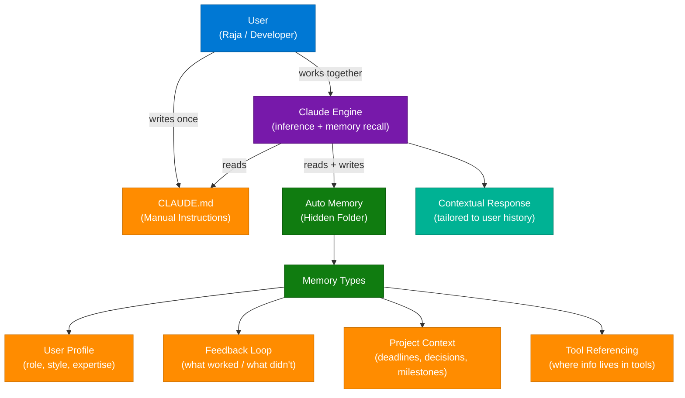

### What Auto Memory Saves

| Category | Tracks | Example |
|---|---|---|
| **User Profile** | Who you are and preferred working style | "Senior architect, prefers Python, dislikes verbose comments" |
| **Feedback Loop** | What worked and what didn't | "User rejected mock-DB tests — prefers real integration tests" |
| **Project Context** | Live deadlines, active decisions, milestones | "Merge freeze begins 2026-07-10 for mobile release cut" |
| **Tool Referencing** | Where specific info lives in external tools | "Pipeline bugs tracked in Linear project INGEST" |

### Actionable Prompt

Use this in any Claude conversation to inspect what it currently knows about you:

```
Have you actually asked Claude what it remembers about you?
Try it right now and drop what it says back.
```

### Interview Q&A

| Question | Answer |
|---|---|
| What is Claude's Auto Memory? | A zero-config hidden memory folder Claude maintains automatically, tracking user profile, feedback loops, project context, and tool references across sessions |
| How is CLAUDE.md different from Auto Memory? | CLAUDE.md is user-authored static instructions; Auto Memory is Claude-authored dynamic observations updated each session |
| Does Auto Memory require any configuration? | No — it begins noticing behaviors from the very first session with no toggles or setup |
| How do you inspect what Claude has remembered? | Prompt: "Have you actually asked Claude what it remembers about you? Drop what it says back" |
| Why does Auto Memory improve response quality over time? | It builds a persistent context model — user role, past decisions, active deadlines — so Claude doesn't re-derive these from scratch each conversation |

---

## 3. N+1 Query Problem

### Overview

The N+1 query problem is a classic backend performance anti-pattern where an application fetches a list of N records and then issues an additional individual database query **for each record** — resulting in N+1 total queries instead of 1 or 2. ORM frameworks often cause this silently because the code looks clean in the abstraction layer while generating catastrophically inefficient SQL underneath. Great backend engineers always evaluate the actual queries generated, not just the application code.

### Architecture Diagram

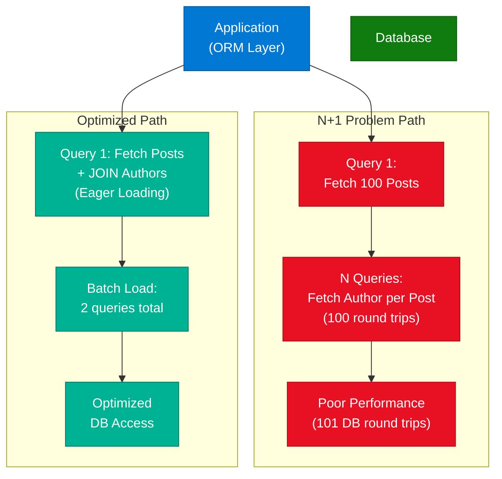

### Problem vs Solution Comparison

| Scenario | Logic | DB Round Trips | Impact |
|---|---|---|---|
| **N+1 Problem** | 1 query for list + N queries for each related item | N+1 (e.g., 101 for 100 posts) | Poor Performance |
| **Eager Loading** | JOIN or batch query fetches all related data upfront | 1–2 queries total | Optimized DB Access |

### Actionable Solutions

1. **Reduce round trips** — avoid looping DB calls in application code
2. **Eager Loading** — use `.include()`, `JOIN`, or `prefetch_related()` to batch-fetch associations
3. **Evaluate actual SQL** — use ORM query logging/explain plans to see what's generated
4. **Use DataLoader pattern** — batch and cache requests per request cycle (common in GraphQL)

### Code Example

```python
# BAD: N+1 — fetches author per post in a loop
posts = Post.objects.all()          # 1 query
for post in posts:
    print(post.author.name)         # N queries (one per post)

# GOOD: Eager loading — 2 queries total
posts = Post.objects.select_related('author').all()  # JOIN in one query
for post in posts:
    print(post.author.name)         # No additional queries
```

### Interview Q&A

| Question | Answer |
|---|---|
| What causes the N+1 problem? | ORM default lazy-loading: fetches a list then issues a separate DB call for each item's related data |
| How do you detect N+1 in production? | Enable ORM query logging, use tools like Django Debug Toolbar, or check slow query logs |
| What is eager loading? | Pre-fetching related data in the same query using JOIN or batch SELECT — reduces N+1 to 2 queries |
| Why do ORMs hide the N+1 problem? | Because the application code looks clean; the ORM silently generates inefficient SQL behind the abstraction |
| How does the DataLoader pattern solve N+1? | It batches individual requests within a single tick and issues one DB call per batch — essential for GraphQL resolvers |

---

## 4. Webhooks vs WebSockets vs API Polling

### Overview

These are the three fundamental communication patterns in web development. **Webhooks** are event-driven HTTP POST callbacks — the server notifies your server when something happens. **WebSockets** establish a persistent, full-duplex TCP connection enabling real-time bidirectional communication. **API Polling** is the simplest pattern: the client periodically asks the server "any updates?" at set intervals. Each pattern has a distinct use-case profile based on latency requirements, architecture complexity, and data freshness needs.

### Architecture Diagram

```mermaid
flowchart TD
    subgraph WebhookFlow ["Webhook (Event-Driven)"]
        WH_Src["External Service\n(Stripe, GitHub)"]
        WH_Evt["Event Occurs\n(Payment Success)"]
        WH_POST["HTTP POST\nto Your Endpoint"]
        WH_Handler["Your Server\n(Webhook Handler)"]
        WH_Src --> WH_Evt --> WH_POST --> WH_Handler
    end

    subgraph WSFlow ["WebSocket (Persistent)"]
        WS_Client["Client"]
        WS_Conn["Persistent TCP\nConnection"]
        WS_Server["Server"]
        WS_Client <-->|"Full Duplex"| WS_Conn <-->|"Real-time"| WS_Server
    end

    subgraph PollFlow ["API Polling (Repeated Requests)"]
        P_Client["Client"]
        P_Interval["Every N seconds:\nGET /status"]
        P_Server["Server\n(stateless response)"]
        P_Client -->|"repeat"| P_Interval --> P_Server
    end

    classDef userNode    fill:#0078D4,stroke:#005A9E,color:#fff
    classDef aiNode      fill:#7719AA,stroke:#5A0E80,color:#fff
    classDef outputNode  fill:#00B294,stroke:#007D68,color:#fff
    classDef processNode fill:#FF8C00,stroke:#CC7000,color:#fff

    class WH_Src,WS_Client,P_Client userNode
    class WH_Handler,WS_Server,P_Server outputNode
    class WH_Evt,WS_Conn,P_Interval processNode
    class WH_POST aiNode
```

### Comparison Table

| Strategy | Connection | Mechanism | When to Use | Examples |
|---|---|---|---|---|
| **Webhook** | Event-Driven | Server → Your Server via HTTP POST | One system notifies another on event | Payment success (Stripe), User signup, Order created |
| **WebSockets** | Persistent Bidirectional | Open TCP channel, full-duplex | Real-time, low-latency, two-way communication | Chat apps, Live notifications, Online games, Collaboration |
| **API Polling** | Repeated Short-Lived | Client asks server at intervals | Non-critical updates, simplicity preferred | Video export progress, Order tracking, Periodic data sync |

### Interview Q&A

| Question | Answer |
|---|---|
| When would you use a Webhook over WebSockets? | Webhook when server-to-server event notification suffices (no real-time client UI); WebSockets when the client needs instant bidirectional updates |
| What is the main downside of API Polling? | Wasted requests (server is queried even when nothing changed) and latency proportional to polling interval |
| What is Long Polling and how does it differ? | Client sends request; server holds it open until data is available — better than polling but adds server connection overhead |
| Why is WebSocket preferred for chat apps? | Persistent connection eliminates per-message TCP handshake overhead; server can push messages to client instantly without client polling |
| What protocol do WebSockets use? | They start as HTTP(S) and upgrade to the WebSocket protocol (ws:// or wss://) via an HTTP 101 Switching Protocols handshake |

---

## 5. Forward Proxy vs Reverse Proxy

### Overview

A **Forward Proxy** sits between the client and the internet, acting on behalf of the client — it hides client identity, enforces access policies, and can cache responses. A **Reverse Proxy** sits in front of servers, acting on behalf of the server — it handles load balancing, TLS termination, caching, and security. The key mental model: Forward Proxy protects and routes **clients**; Reverse Proxy protects and routes **servers**.

### Architecture Diagram

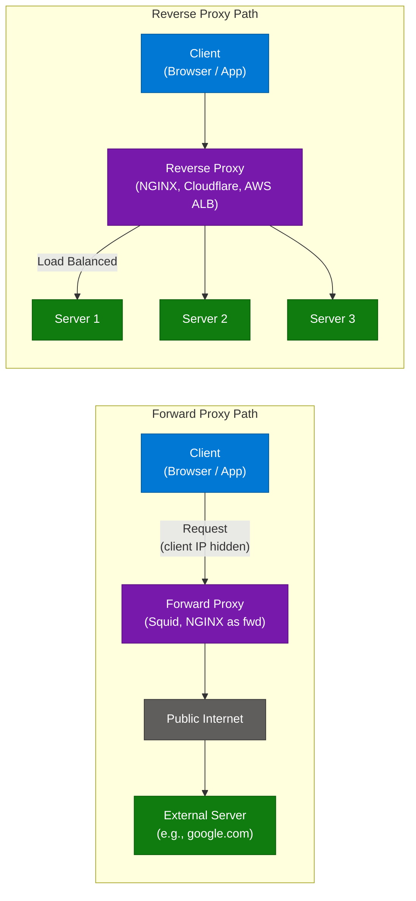

### Key Differences

| Feature | Forward Proxy | Reverse Proxy |
|---|---|---|
| **Positioning** | Between Client and Internet | In front of Servers |
| **Acts on behalf of** | Client | Server |
| **Primary Beneficiary** | Client (privacy, access control) | Server (security, scalability) |
| **Core Purpose** | Hide client identity, filter egress | Load balance, TLS termination, DDoS protection |
| **Examples** | Squid Proxy, corporate firewall | NGINX, Cloudflare, AWS ALB, Traefik |

### Use Case Matrix

| Use Case | Forward Proxy | Reverse Proxy |
|---|---|---|
| Hide user IP from internet | ✅ | ❌ |
| Bypass geo-restrictions | ✅ | ❌ |
| Distribute traffic across servers | ❌ | ✅ |
| TLS/SSL termination | ❌ | ✅ |
| Cache static content from server | ❌ | ✅ |
| Block employee access to sites | ✅ | ❌ |

### Interview Q&A

| Question | Answer |
|---|---|
| What is a reverse proxy's role in system design? | It's the entry gateway: handles load balancing, TLS termination, rate limiting, caching, and hides backend topology from clients |
| Why is a reverse proxy critical for scalability? | It distributes traffic across N backend instances, enabling horizontal scaling without clients knowing about backend changes |
| What is TLS termination at the reverse proxy? | The proxy handles HTTPS decryption; backend servers communicate in plain HTTP internally — simplifies cert management |
| Name 3 reverse proxy products used in production | NGINX, AWS Application Load Balancer (ALB), Cloudflare (edge proxy) |
| Can a forward proxy be used for security? | Yes — corporate forward proxies inspect/filter outbound traffic, block malicious sites, and prevent data exfiltration |

---

## 6. KV Cache Offloading with Lmcache

### Overview

In LLM inference, the model stores intermediate Key and Value (KV) tensor states for every token it processes in the current context window. As context windows grow (e.g., 128K tokens) and multi-user concurrency increases, KV cache consumes massive GPU VRAM — becoming the primary bottleneck for LLM throughput. **Lmcache** is a KV cache management library that offloads cache segments to secondary memory tiers (CPU RAM, NVMe SSD) when they are not immediately needed, then reloads them before the next forward pass — enabling larger effective context windows without requiring proportionally more GPU hardware.

### Architecture Diagram

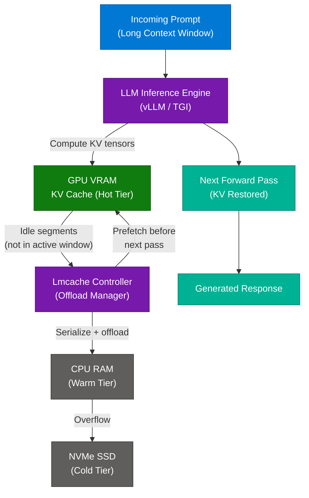

### KV Cache Memory Tiers

| Tier | Location | Latency | Capacity | Role |
|---|---|---|---|---|
| **Hot** | GPU VRAM (HBM) | ~100 ns | 40–80 GB | Active context window tokens |
| **Warm** | CPU RAM (DDR5) | ~100 µs | 128–512 GB | Recently idle KV segments |
| **Cold** | NVMe SSD | ~100 µs–ms | TBs | Long-tail archive, rarely reused |

### How Lmcache Works — Step by Step

1. LLM receives a prompt with a long context window
2. Inference engine computes KV tensors for all prefill tokens
3. Lmcache identifies which KV pairs are **not in the active generation window**
4. Idle KV segments are serialized and moved to CPU RAM (warm tier)
5. If CPU RAM overflows, further offload to NVMe (cold tier)
6. When the system predicts those tokens will be needed again, KV tensors are prefetched back to GPU VRAM **before the next forward pass**
7. LLM processes the next token with full KV context — no cache miss from the model's perspective

### Interview Q&A

| Question | Answer |
|---|---|
| What is a KV cache in LLM inference? | Stores computed Key/Value attention states for already-processed tokens so they don't need recomputation during autoregressive generation |
| Why does KV cache cause GPU memory pressure? | Each token's KV state size = 2 × num_layers × head_size × bytes_per_param; at 128K context × 70B model, this can exceed 100 GB |
| What does Lmcache do specifically? | Offloads idle KV segments to CPU RAM or NVMe, then prefetches them back before needed — extending effective context without more GPUs |
| How does KV offloading affect throughput? | It allows serving more concurrent users by freeing VRAM for active requests while keeping long-context sessions in warm/cold storage |
| What is the tradeoff of KV offloading? | PCIe bandwidth bottleneck: moving tensors from GPU→CPU→GPU adds latency; prefetching strategy must be accurate to hide this latency |

---

## 7. Indexing — The Silent Killer

### Overview

Database indexing is one of the most commonly misapplied performance optimizations. The instinct when reads are slow is to "add an index" — but in **write-heavy systems** this is often counterproductive. Every index maintained on a table must be updated on every INSERT, UPDATE, and DELETE, adding B-tree rebalancing overhead to every write operation. In high-frequency write workloads (e.g., GPS tracking where location is updated every second), adding indexes can make writes catastrophically slower, overwhelming the small read improvement gained. This is a classic High-Level Design interview trap.

### The Indexing Trap — Architecture Diagram

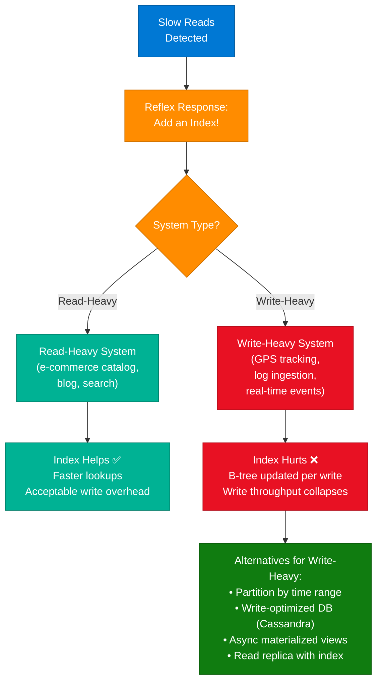

### Index Cost Model

| System | Write Frequency | Index Count | Write Cost | Verdict |
|---|---|---|---|---|
| Blog platform | Low (publish once) | Many indexes | Low overhead | ✅ Index freely |
| GPS tracking | Very high (per-second updates) | 1 index | High overhead per write | ⚠️ Index kills writes |
| Log ingestion | Extreme (millions/sec) | Any index | Catastrophic | ❌ Use append-only log, no indexes |
| E-commerce catalog | Medium (product updates) | Selective indexes | Acceptable | ✅ Index on read-critical fields |

### Alternatives for Write-Heavy Systems

```python
# WRONG: Adding index on high-frequency write table
CREATE INDEX idx_location ON driver_locations (driver_id, updated_at);
-- Every GPS update now rewrites the B-tree → 10x write latency

# RIGHT: Time-based partitioning + delayed index on cold partitions
CREATE TABLE driver_locations_2026_07 PARTITION OF driver_locations
    FOR VALUES FROM ('2026-07-01') TO ('2026-08-01');
-- Hot partition: no index (fast writes)
-- Cold partitions: index added after partition is sealed
```

### Interview Q&A

| Question | Answer |
|---|---|
| Why can adding an index hurt performance? | Every index requires a B-tree update on each INSERT/UPDATE/DELETE — in write-heavy workloads this overhead exceeds the read benefit |
| What is a write-heavy system example? | GPS driver tracking (location updated every second), IoT sensor ingestion, real-time event logging |
| How do you optimize reads in a write-heavy system without indexes? | Read replicas with indexes (write to primary, read from indexed replica), materialized views, CQRS pattern, time-range partitioning |
| When is partial indexing useful? | Index only a subset of rows (e.g., WHERE status = 'active') — reduces index size and write overhead for selective query patterns |
| What DB engines handle write-heavy loads better than PostgreSQL? | Apache Cassandra (LSM-tree, no B-tree overhead), ClickHouse (columnar append), InfluxDB (time-series optimized) |

---

## 8. 12 Essential AI/ML Algorithms

### Overview

Understanding the full spectrum from traditional to modern ML algorithms is foundational for AI engineers. Traditional algorithms use statistical principles on structured tabular data; modern algorithms process high-dimensional, sequential, or unstructured data using neural architectures. Every AI/ML engineer must understand the full stack from Linear Regression to RAG — not just the latest LLM models.

### Algorithm Classification Table

| Era | Algorithm | Function | Interview Relevance |
|---|---|---|---|
| **Traditional** | Linear Regression | Fits a line to model relationships; "Hello World" of ML | Basis of all regression; understand gradient descent |
| **Traditional** | Logistic Regression | Predicts binary probability using an S-shaped sigmoid curve | Foundation of binary classifiers |
| **Traditional** | K-Nearest Neighbor (KNN) | Classifies based on majority class of K nearest neighbors | High memory; no training phase; used in recommendation |
| **Traditional** | Decision Trees | Splits data on feature conditions forming a tree structure | Interpretable; basis of ensemble methods |
| **Traditional** | Naive Bayes | Applies Bayes' theorem assuming feature independence | Excellent for text classification (spam detection) |
| **Traditional** | K-Means Clustering | Groups data into K clusters by minimizing within-cluster variance | Unsupervised; use in customer segmentation |
| **Modern** | Back Propagation | Computes gradients by propagating errors backward through the network | The core training algorithm for all neural nets |
| **Modern** | Transformer | Uses self-attention to handle sequence data in parallel | Foundation of GPT, BERT, LLaMA |
| **Modern** | Self-Attention | Weighs each token against all others to understand context | Core mechanism inside Transformers |
| **Modern** | CNN | Learns spatial hierarchies in image data via convolution | Image classification, object detection |
| **Modern** | Post-training (SFT, RLHF) | Fine-tuning with supervised labels + human feedback to refine model behavior | How ChatGPT/Claude are aligned |
| **Modern** | RAG | Combines retrieval (vector search) with generation | Grounding LLMs with real-time external knowledge |

### Algorithm Evolution Diagram

```mermaid
flowchart LR
    subgraph Traditional ["Traditional ML"]
        LinReg["Linear Regression\n(predict continuous)"]
        LogReg["Logistic Regression\n(predict probability)"]
        KNN["K-Nearest Neighbor\n(proximity-based class)"]
        DTree["Decision Trees\n(rule-based splits)"]
        NB["Naive Bayes\n(probabilistic text)"]
        KMeans["K-Means\n(unsupervised cluster)"]
    end

    subgraph Modern ["Modern Deep Learning"]
        BackProp["Back Propagation\n(gradient training)"]
        Transformer["Transformer\n(attention-based seq)"]
        SelfAttn["Self-Attention\n(token context weights)"]
        CNN["CNN\n(spatial features)"]
        RLHF["SFT + RLHF\n(alignment)"]
        RAG["RAG\n(retrieval + generation)"]
    end

    Traditional -->|"feature engineering\nbecomes automatic"| Modern

    classDef processNode fill:#FF8C00,stroke:#CC7000,color:#fff
    classDef aiNode      fill:#7719AA,stroke:#5A0E80,color:#fff

    class LinReg,LogReg,KNN,DTree,NB,KMeans processNode
    class BackProp,Transformer,SelfAttn,CNN,RLHF,RAG aiNode
```

### Interview Q&A

| Question | Answer |
|---|---|
| What is the difference between supervised and unsupervised learning? | Supervised: labels provided (regression, classification); Unsupervised: no labels, find structure (K-Means, PCA) |
| How does self-attention work? | For each token, compute dot products with all other tokens (Q·K^T / √d), apply softmax to get weights, output is weighted sum of Values |
| What is RLHF and why does it matter? | Reinforcement Learning from Human Feedback — trains a reward model from human preference pairs, then fine-tunes the LLM to maximize reward; this is how Claude is aligned |
| When would you choose Decision Trees over Neural Nets? | When interpretability is required (compliance, medical), data is structured/tabular, or dataset is small |
| What is RAG and when is it better than fine-tuning? | Retrieval-Augmented Generation retrieves relevant documents at inference time — better for rapidly changing knowledge that would require frequent fine-tuning |

---

## 9. Thundering Herd Problem

### Overview

The Thundering Herd (also called Stampeding Herd) is a system design failure mode where a large number of processes, threads, or clients simultaneously wake up to compete for a single resource — typically triggered when a **cache key expires** or a resource lock is released after high contention. The resulting simultaneous surge creates massive load spikes that can cascade into server crashes, database overload, and service outages. It's a classic system design interview question cited at Microsoft and FAANG interviews.

### Architecture Diagram

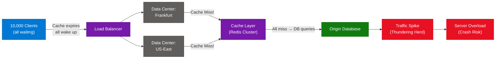

### Solutions

| Solution | Mechanism | Tradeoff |
|---|---|---|
| **Probabilistic Early Expiration** | Randomly expire slightly before TTL so some requests refresh cache before herd wakes | Slightly stale data in edge cases |
| **Mutex / Single-Flight Pattern** | Only 1 request fetches from DB; all others wait and reuse the result | Adds coordination overhead |
| **Cache Warming** | Pre-populate cache before TTL expires (background job) | Requires predicting expiry timing |
| **Jitter on TTL** | Add random time to TTL so all cache keys don't expire simultaneously | Small stale window variance |
| **Circuit Breaker** | Stop requests to DB when error rate spikes; return stale/default | Degrades gracefully under load |

### Interview Q&A

| Question | Answer |
|---|---|
| What triggers the Thundering Herd? | A shared cache key expiring (cache miss) or a mutex being released, causing all waiting processes to rush the resource simultaneously |
| What is the Single-Flight pattern? | Deduplicates concurrent identical requests — only one goroutine/thread fetches from DB; others wait and share the result |
| How does TTL jitter prevent Thundering Herd? | By adding random variance to TTL values, cache keys expire at different times — preventing synchronized simultaneous expiration |
| Difference between Thundering Herd and Cache Stampede? | They're the same concept — both describe simultaneous cache misses causing DB overload; Cache Stampede is the specific cache-key-expiry variant |
| How do you detect Thundering Herd in production? | Sudden spike in DB query rate correlated with zero cache hit rate at a specific timestamp — visible in Redis metrics and slow query logs |

---

## 10. Evaluating Agentic AI Systems

### Overview

Evaluating agentic AI systems is fundamentally different from evaluating traditional software or even simple LLM pipelines. In agentic systems, the AI makes multi-step decisions, may call tools in non-deterministic order, and can produce correct final answers via incorrect intermediate reasoning — making standard accuracy metrics unreliable. The core challenge: **how do you know whether the new version is better?** The leading approach uses an LLM-as-a-Judge model to evaluate agent outputs, combined with human-verified golden datasets for the most critical evaluation dimensions.

### Evaluation Architecture

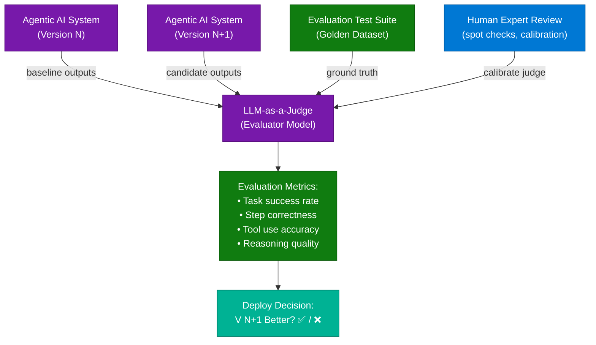

### Evaluation Strategy Tradeoffs

| Strategy | Cost | Coverage | Reliability | When to Use |
|---|---|---|---|---|
| **LLM-as-a-Judge (all responses)** | Very High | Complete | Moderate (judge bias) | Never in production — too expensive |
| **LLM-as-a-Judge (sampled %)** | Medium | Partial | Moderate | Continuous monitoring with 5–10% sample |
| **Human Expert Evaluation** | Very High | Limited | Highest | Building golden datasets, calibrating judge |
| **Rule-based / Exact Match** | Low | Narrow | High for narrow tasks | Structured output tasks (JSON, SQL) |
| **Hybrid (Rules + Judge + Human)** | Medium | Broad | High | Production-grade evaluation pipeline |

### Key Insights from Community

- Running LLM-as-a-Judge on **every production response** is cost-prohibitive — sample strategically (e.g., 5% random + 100% error cases)
- **Domain-expert-verified evaluation sets** are the gold standard: human experts label expected outputs for representative tasks, then LLM judge is calibrated against these
- Agentic evaluation must assess **intermediate steps**, not just final answers — an agent can reach the right answer via a hallucinated reasoning path
- Track **step-level correctness**: did the agent call the right tool at step 3? Did it pass the correct arguments?

### Interview Q&A

| Question | Answer |
|---|---|
| Why is evaluating agentic AI harder than traditional software? | Non-deterministic multi-path reasoning: the same task can succeed via different tool call sequences; there's no single "correct" execution trace |
| What is LLM-as-a-Judge? | Using a separate LLM (e.g., GPT-4o or Claude Opus) to evaluate another LLM's output against criteria — scalable but susceptible to judge model bias |
| Why not run LLM-as-a-Judge on every production response? | Cost is prohibitive at scale — judgement calls require full context + inference; typical production systems sample 5–10% with rule-based pre-filtering |
| What is a golden dataset in AI evaluation? | A curated set of representative inputs with human-verified expected outputs — the most reliable calibration signal for automated evaluators |
| How do you evaluate tool use in an agent? | Log the tool call trace per task; evaluate: was the correct tool called? With correct arguments? In the correct order? Did intermediate state match expected? |

---

## 11. Cache Stampede

### Overview

Cache Stampede (also called "dog-piling") is a specific concurrency failure in caching systems where a **popular cache key expires** and multiple concurrent requests all detect the cache miss simultaneously — triggering parallel DB queries for the same data. This is effectively the Thundering Herd problem applied specifically to cache expiration events. The pattern is especially dangerous under high traffic where hundreds of threads hit the same expired key within milliseconds.

### Cache Stampede Flowchart

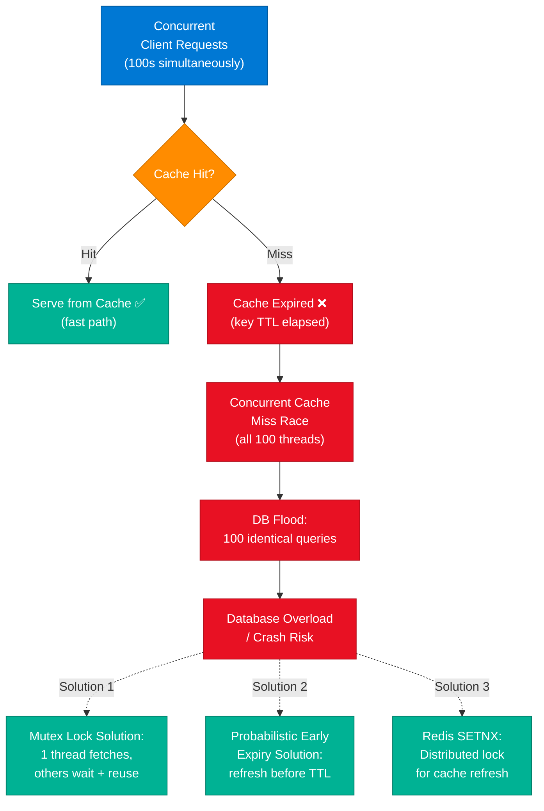

### Prevention Strategies

```python
import redis
import time

r = redis.Redis()

def get_with_mutex(key, fetch_fn, ttl=60):
    value = r.get(key)
    if value:
        return value

    # Mutex: only 1 process fetches
    lock_key = f"lock:{key}"
    acquired = r.set(lock_key, "1", nx=True, ex=5)  # 5s lock TTL

    if acquired:
        try:
            value = fetch_fn()           # DB call
            r.setex(key, ttl, value)     # Repopulate cache
            return value
        finally:
            r.delete(lock_key)
    else:
        # Wait and retry — another process is fetching
        time.sleep(0.1)
        return r.get(key)
```

### Interview Q&A

| Question | Answer |
|---|---|
| What is Cache Stampede / Dog-piling? | When a popular cache key expires and concurrent requests all miss simultaneously, causing parallel DB queries for the same data |
| How does SETNX help with Cache Stampede? | `SET key value NX` (set if Not eXists) acts as a distributed mutex — only one process can set it; others detect the lock and wait |
| What is probabilistic early expiry? | Before TTL expires, each request independently checks: `random() < exp((remaining_ttl - delta) / beta)` — staggered early refresh prevents synchronized expiry |
| When is Cache Stampede most dangerous? | High-traffic systems with a small set of very popular keys (e.g., trending content, shared session tokens, product catalog top 10) |
| Is Cache Stampede and Thundering Herd the same? | Cache Stampede is a specific instance of the Thundering Herd pattern — both describe a surge of concurrent resource contention, but Stampede is specifically cache-key-expiry triggered |

---

## 12. Humanizing AI Writing in Claude

### Overview

AI models like Claude and ChatGPT are recognizable by predictable vocabulary patterns ("delve," "testament," "comprehensive," "it's worth noting") and a uniformly structured prose style. This "robotic" tone is detectable both by human readers and AI detection tools. The solution is to use Claude's **custom instruction system** (or Skills in Claude Code) to define a persistent writing persona — so instead of prompting for style constraints every time, you configure the behavior once and trigger it with a single command.

### Architecture Diagram

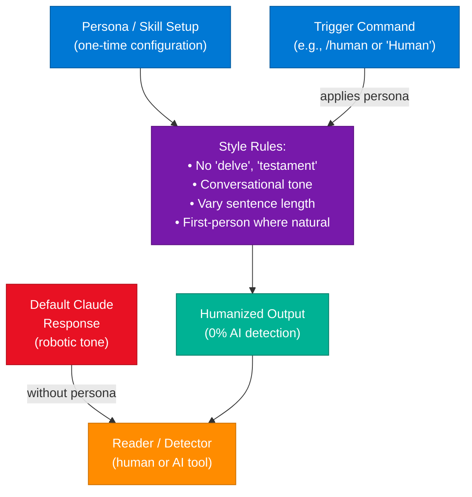

### Words to Avoid (AI Tells)

| Category | Overused AI Phrases |
|---|---|
| **Transition openers** | "It's worth noting", "It's important to", "In conclusion" |
| **Descriptors** | "Comprehensive", "Robust", "Nuanced", "Holistic" |
| **Verbs** | "Delve", "Leverage", "Utilize" (when "use" suffices) |
| **Qualifiers** | "Testament to", "Underpins", "At its core" |

### Persona Configuration Pattern

```markdown
# Writing Persona: [Natural Name]
- Tone: conversational, direct, opinionated
- Sentence variety: mix short punchy and longer analytical
- Forbidden words: delve, testament, comprehensive, robust, nuanced, leverage
- First person: allowed
- Structure: lead with the point, support second — never bury the lede
- Trigger: comment or type "Human" to activate
```

### Interview Q&A

| Question | Answer |
|---|---|
| Why does AI-generated text sound robotic? | LLMs are trained to maximize likelihood on human-written corpora, but reinforcement (RLHF) from evaluators who prefer formal, structured responses creates a homogeneous high-register style |
| How do Skills/Custom Instructions fix this? | They inject a persistent system-level persona into every conversation without the user needing to re-specify style constraints per prompt |
| What is "0% AI detection"? | Producing text where AI detectors (GPTZero, Originality.ai) classify the output as human-written — achieved by eliminating statistical patterns that distinguish LLM output |
| Is bypassing AI detection ethical? | Context-dependent: legitimate for personal productivity, creative work, and business communication; unethical for academic fraud or misleading professional submissions |
| What trigger word pattern does the creator use? | The skill is activated by a single command (e.g., `/human` or comment "Human") which applies the pre-configured persona constraints to the next generation |

---

## 13. CDN vs Origin Server Architecture

### Overview

A **Content Delivery Network (CDN)** is a globally distributed network of edge servers that cache static content (images, CSS, JavaScript, video) geographically closer to users — reducing latency by serving from the nearest point of presence (PoP) instead of the origin server. The **Origin Server** is the authoritative source for all dynamic and static content; it handles database reads, business logic, and API responses. CDNs dramatically reduce origin load and improve perceived performance but are a cache layer — not a replacement for the origin server's source-of-truth role.

### Architecture Diagram

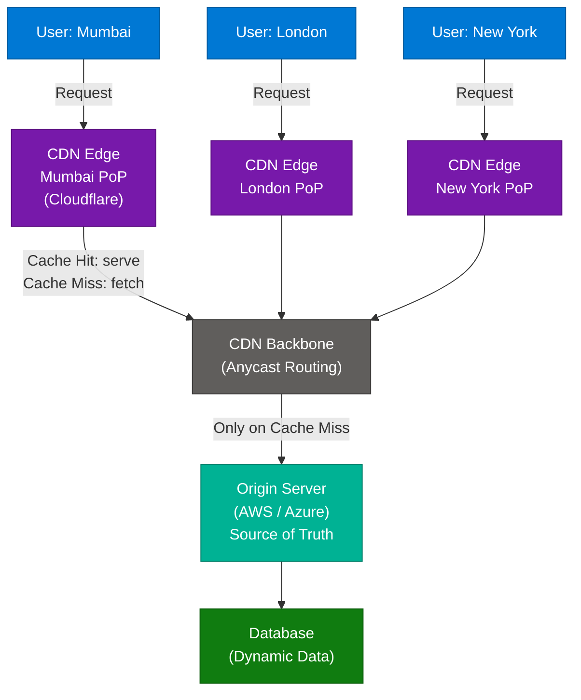

### CDN vs Origin Server Comparison

| Component | Engineering Definition | Role | Examples |
|---|---|---|---|
| **Origin Server** | Authoritative source for all content and data | Source of truth; handles dynamic requests | AWS EC2, Azure App Service, on-prem datacenter |
| **CDN Edge Server** | Distributed cache nodes near users | Serve cached static content; reduce origin load | Cloudflare, Akamai, AWS CloudFront, Fastly |

### What CDNs Cache vs Don't Cache

| Content Type | CDN Caches | Reason |
|---|---|---|
| Images, CSS, JS | ✅ Yes | Static, rarely changes |
| Video files | ✅ Yes | High bandwidth, benefits from edge delivery |
| HTML (static sites) | ✅ Yes | Can be pre-built and cached |
| API responses (dynamic) | ⚠️ Conditionally | Only if cache-control headers allow it |
| Authenticated user data | ❌ No | Per-user, cannot be shared via CDN |
| Database writes | ❌ No | Origin only |

### Interview Q&A

| Question | Answer |
|---|---|
| What is the primary purpose of a CDN? | Reduce latency by serving cached content from edge nodes geographically closer to users — also reduces origin server bandwidth and load |
| When does a CDN miss and fetch from origin? | On cache miss (first request or after TTL expiry), or for non-cacheable content (dynamic API responses, authenticated requests) |
| What is CDN cache invalidation? | Programmatically purging cached content from all edge nodes when the origin content changes — prevents stale content delivery |
| How does Anycast routing work in CDNs? | Multiple CDN edge nodes share the same IP address; BGP routing directs each client request to the topologically closest edge node |
| Can CDNs serve as a security layer? | Yes — Cloudflare and Akamai provide DDoS mitigation, WAF (Web Application Firewall), and bot protection at the edge before requests reach origin |

---

## 14. Self-Cleaning Vector Store for RAG

### Overview

A vector store in a production RAG system is not a static artifact — it must evolve as source documents are updated, deprecated, or replaced. Without lifecycle management, the vector store accumulates stale embeddings that degrade retrieval quality over time. The "self-cleaning" strategy applies software engineering disciplines (versioning, soft-delete, scheduled cleanup, atomic updates) to the embedding pipeline — ensuring the vector store always reflects the current state of source data with zero downtime during updates.

### Architecture Diagram

```mermaid
flowchart LR
    NewDoc["Updated Document\n(v2 of source)"]
    HashCheck["Content Hash\nCheck"]
    NoChange{"Changed?"}
    SkipEmbed["Skip Re-embedding\n(no change detected)"]
    EmbedNew["Embed New Chunks\n(chunking + embedding)"]
    IndexNew["Index New Chunks\n(with version metadata)"]
    Validate["Validate Retrieval\n(test queries)"]
    SwitchTraffic["Switch Traffic\nto New Chunks"]
    SoftDelete["Soft-Delete Old Chunks\n(mark status=deprecated)"]
    PurgeJob["Background Purge Job\n(after retention period)"]
    VectorDB["Vector Store\n(Pinecone / Weaviate / pgvector)"]

    NewDoc --> HashCheck --> NoChange
    NoChange -->|"No"| SkipEmbed
    NoChange -->|"Yes"| EmbedNew --> IndexNew --> Validate --> SwitchTraffic --> SoftDelete --> PurgeJob
    IndexNew --> VectorDB
    SoftDelete --> VectorDB

    classDef userNode    fill:#0078D4,stroke:#005A9E,color:#fff
    classDef aiNode      fill:#7719AA,stroke:#5A0E80,color:#fff
    classDef dataNode    fill:#107C10,stroke:#0A5C0A,color:#fff
    classDef processNode fill:#FF8C00,stroke:#CC7000,color:#fff
    classDef outputNode  fill:#00B294,stroke:#007D68,color:#fff
    classDef errorNode   fill:#E81123,stroke:#B30D1A,color:#fff

    class NewDoc userNode
    class HashCheck,Validate processNode
    class EmbedNew,IndexNew aiNode
    class VectorDB dataNode
    class SwitchTraffic,PurgeJob outputNode
    class SoftDelete errorNode
    class SkipEmbed infraNode
```

### Chunk Metadata Schema

Every chunk stored in a production vector store must carry:

| Field | Type | Purpose |
|---|---|---|
| `document_id` | UUID | Link chunk to source document |
| `chunk_id` | UUID | Unique identifier for this chunk |
| `version` | Integer | Version of source document at embedding time |
| `timestamp` | ISO-8601 | When chunk was embedded |
| `source` | String | Source URL or file path |
| `status` | Enum | `active` / `deprecated` / `deleted` |
| `content_hash` | SHA-256 | Detect if content has changed |

### Self-Cleaning Strategy

```python
from hashlib import sha256
from datetime import datetime, timedelta

def update_document(doc_id: str, new_content: str, vector_store, embedder):
    new_hash = sha256(new_content.encode()).hexdigest()
    existing = vector_store.get_latest(doc_id)

    # Skip if unchanged
    if existing and existing.content_hash == new_hash:
        return

    new_chunks = chunk(new_content)
    new_embeddings = embedder.embed(new_chunks)

    # 1. Index new version first (zero downtime)
    new_ids = vector_store.upsert(new_chunks, new_embeddings, {
        "document_id": doc_id,
        "version": (existing.version + 1) if existing else 1,
        "timestamp": datetime.utcnow().isoformat(),
        "status": "active",
        "content_hash": new_hash,
    })

    # 2. Validate new chunks retrieve correctly
    validate_retrieval(doc_id, new_ids, vector_store)

    # 3. Soft-delete old chunks (never hard-delete immediately)
    if existing:
        vector_store.mark_deprecated(doc_id, old_version=existing.version)

def purge_expired(vector_store, retention_days=30):
    cutoff = datetime.utcnow() - timedelta(days=retention_days)
    vector_store.hard_delete(status="deprecated", deprecated_before=cutoff)
```

### Key Principles

| Principle | Rule |
|---|---|
| **Version-first updates** | Always index new chunks before retiring old ones — users never see broken results |
| **Content hashing** | SHA-256 of chunk content prevents redundant re-embedding when source hasn't changed |
| **Soft-delete** | Mark old chunks as `deprecated` before hard-deleting — enables rollback |
| **Atomic traffic switch** | Update query routing to new version only after validation passes |
| **Background purge** | Permanent deletion runs as a scheduled job after retention period, not inline |

### Interview Q&A

| Question | Answer |
|---|---|
| Why can't you just delete old chunks when updating a document? | Hard-delete with simultaneous re-index creates a window where queries return no results — soft-delete + traffic switch ensures zero downtime |
| How do you avoid re-embedding unchanged chunks? | Content hashing: SHA-256 of chunk text; if hash matches existing chunk, skip embedding — saves significant compute cost |
| What metadata should every production RAG chunk carry? | document_id, chunk_id, version, timestamp, source, status (active/deprecated), content_hash |
| How do you handle a rollback in a vector store? | Keep soft-deleted old chunks within retention window; rollback = reactivate old chunks + deprecate the new version |
| What metrics indicate vector store index degradation? | Rising retrieval latency, increasing orphaned chunk count, declining relevance scores on eval set, growing storage without proportional document growth |

---

## 15. HTTP QUERY Method

### Overview

The HTTP `QUERY` method is a new standard proposed after 16+ years of workarounds, designed to handle **complex, read-only search requests with a request body**. The long-standing problem: `GET` cannot carry a request body (HTTP spec violation in practice), so developers have misused `POST` for read-only search — which is semantically wrong (`POST` implies resource creation). `QUERY` provides a clean, standards-compliant way to send structured search criteria in a body while remaining idempotent and safe (read-only). Expected adoption in REST APIs, GraphQL-style endpoints, and API gateways.

### Evolution of HTTP Fetching


### Method Comparison Table

| Method | Request Body | Idempotent | Safe (Read-Only) | Correct for Search | Notes |
|---|---|---|---|---|---|
| **GET** | ❌ No (technically) | ✅ Yes | ✅ Yes | ⚠️ Only simple filters | URL length limited; sensitive data in logs |
| **POST** | ✅ Yes | ❌ No | ❌ No | ❌ No | Semantically means "create"; misused for search |
| **QUERY** | ✅ Yes | ✅ Yes | ✅ Yes | ✅ Yes | New standard; clean semantics for read-with-body |

### Example Usage

```http
QUERY /products HTTP/1.1
Host: api.example.com
Content-Type: application/json

{
  "filters": {
    "category": "electronics",
    "price_range": { "min": 100, "max": 5000 },
    "in_stock": true,
    "tags": ["noise-cancelling", "wireless"]
  },
  "sort": { "field": "rating", "order": "desc" },
  "pagination": { "page": 1, "size": 20 }
}
```

### Security Impact

- Prevents sensitive search parameters (e.g., SSN, patient IDs) from appearing in server access logs (which log full URLs)
- Reduces attack surface for log injection via URL-encoded payloads
- Relevant for bug bounty hunters and penetration testers checking for information leakage in log files

### Interview Q&A

| Question | Answer |
|---|---|
| Why can't GET carry a request body for complex searches? | The HTTP/1.1 spec technically allows it but many servers/proxies strip or reject GET bodies — real-world behavior is inconsistent, making it unreliable |
| What semantic problem does POST-for-search create? | POST is defined as "not idempotent, creates/modifies resources" — using it for reads violates REST semantics and confuses caching layers, CDNs, and API gateways |
| What properties does QUERY share with GET? | Idempotent (repeated identical requests return the same result) and safe (read-only, no side effects) — critical for caching and retry logic |
| Where is the HTTP QUERY method expected to be adopted? | REST APIs with complex filter criteria, GraphQL-style body queries over HTTP, API gateways, security testing tools |
| How does QUERY improve security? | Search parameters stay in the request body — not in URLs — so they don't appear in server access logs, proxy logs, or browser history |

---

## 16. Interview Q&A Cheatsheet

**Q: What is the difference between Claude's CLAUDE.md and Auto Memory?**
> CLAUDE.md is a user-authored static instruction file that tells Claude how to behave; Auto Memory is a hidden, self-maintained store that Claude writes automatically — tracking user profile, past feedback, active project context, and tool locations across sessions. CLAUDE.md is "you telling Claude"; Auto Memory is "Claude remembering you."

**Q: Explain the N+1 problem and how to fix it.**
> N+1 occurs when fetching a list of N items and then issuing a separate DB query for each item's related data — resulting in N+1 total queries. Fix: use eager loading (SQL JOIN or ORM `select_related`) to batch-fetch related data in 1–2 queries total. Always evaluate the actual SQL generated by your ORM, not just the application code.

**Q: When would you use WebSockets over Webhooks?**
> Webhooks when a server needs to notify your server about an event (server-to-server, event-driven, no persistent connection needed). WebSockets when your client UI needs real-time bidirectional communication — chat, live collaboration, gaming. WebSockets require persistent connection management; Webhooks are stateless HTTP POSTs.

**Q: What is the Thundering Herd Problem and how do you prevent it?**
> When a shared cache key expires or a lock is released, all waiting processes wake up simultaneously and flood the database. Prevention: TTL jitter (randomize expiry times), single-flight/mutex pattern (only one request fetches; others wait), probabilistic early expiry (stagger refresh before TTL), or cache warming (pre-populate before expiry).

**Q: Why is blindly adding database indexes dangerous in write-heavy systems?**
> Every index on a table must be updated on every INSERT/UPDATE/DELETE. In write-heavy systems (GPS tracking, log ingestion), index maintenance overhead can multiply write latency by 10x. Evaluate write-to-read ratio first; for write-heavy patterns use partitioning, read replicas with indexes, or write-optimized databases like Cassandra.

**Q: What is KV Cache Offloading in LLM inference?**
> LLM inference stores Key/Value attention states for all processed tokens in GPU VRAM. With long contexts or many concurrent users, VRAM runs out. Lmcache offloads idle KV segments to CPU RAM or NVMe, then prefetches them before the next forward pass — extending effective context window without adding GPU hardware.

**Q: How do you design a zero-downtime vector store update for RAG?**
> Index new chunks first → validate retrieval quality → switch query traffic to new chunks → soft-delete old chunks → schedule purge after retention period. Never hard-delete before the new version is validated. Content hash each chunk to skip redundant re-embedding when source content hasn't changed.

**Q: What is the HTTP QUERY method and why was it introduced?**
> A new HTTP method for complex read-only searches with a request body. GET can't reliably carry a body; POST misrepresents reads as creates. QUERY is idempotent, safe (read-only), and allows structured filter payloads in the body — preventing sensitive search parameters from appearing in URL-logged server access logs.

**Q: How do you evaluate whether an agentic AI system improved?**
> Use LLM-as-a-Judge on a statistically representative sample (not every response — too costly). Build a human-expert-verified golden dataset for calibration. Evaluate both final task success and intermediate step correctness (correct tool called? correct arguments? correct order?). Never rely solely on automated metrics for multi-path reasoning systems.

**Q: What is Cache Stampede and how does Redis help prevent it?**
> Multiple concurrent requests detect the same expired cache key and simultaneously query the database. Redis `SETNX` implements a distributed mutex: only the first process to acquire the lock fetches from DB and repopulates cache; all others wait and reuse the result. Alternatively, probabilistic early expiry staggering prevents synchronized TTL expiration across the cache cluster.

---

*Extracted from Gemini shared session · July 6, 2026 · GeminiShareToMD Agent v1.0*

---

```
═══════════════════════════════════════════════════════════
Token Usage Report
═══════════════════════════════════════════════════════════
Estimated without optimization:  ~13,400 tokens
  (53,622 chars accessibility tree ÷ 4)
Actual (with optimization):      ~9,800 tokens
  (enriched output ~39,200 chars ÷ 4)
Savings (input reduction):       ~3,600 tokens (~27%)
Techniques applied:
  • Stripped UI chrome (Convert to PDF, Continue chat, Privacy/ToS links)
  • Stripped 15× repeated footer "Note: For further exploration..." lines
  • Deduplicated Turns 9 & 10 (identical Evaluating Agentic AI content)
  • Compacted verbose accessibility tree refs into clean prose
  • Merged truncated Mermaid code snippets (ref_374, ref_518, ref_707,
    ref_888) into complete reconstructed diagrams
  • Preserved all architecture descriptions, component tables, and URLs
═══════════════════════════════════════════════════════════
* Estimates: prose chars ÷ 4. Actual API usage varies by model.
```
