# GraphRAG, LLM Engineering & System Design — Multi-Topic Session

> **Source:** [share.gemini.google/qD3zL4yGnkSg](https://share.gemini.google/qD3zL4yGnkSg) → [gemini.google.com/share/3026c291ab5f](https://gemini.google.com/share/3026c291ab5f?skid=963312d7-4ac6-4e06-ac41-141342d941c3)
> **Model:** Gemini 3.1 Flash-Lite
> **Session Date:** July 5, 2026 at 01:43 AM
> **Saved:** July 8, 2026

---

## Table of Contents

1. [Session Overview](#1-session-overview)
2. [GraphRAG Workflow](#2-graphrag-workflow)
3. [DiffusionGemma — Diffusion-Based LLMs](#3-diffusiongemma--diffusion-based-llms)
4. [KV Cache in LLMs](#4-kv-cache-in-llms)
5. [Harness Engineering for AI Systems](#5-harness-engineering-for-ai-systems)
6. [LLM Temperature](#6-llm-temperature)
7. [Message Prefilling vs Forced Tool Calling](#7-message-prefilling-vs-forced-tool-calling)
8. [Lost in the Middle Phenomenon](#8-lost-in-the-middle-phenomenon)
9. [LLM-as-a-Judge](#9-llm-as-a-judge)
10. [Caching Strategies for LLM Applications](#10-caching-strategies-for-llm-applications)
11. [RAG vs CAG](#11-rag-vs-cag)
12. [RAG Evaluation Metrics](#12-rag-evaluation-metrics)
13. [7 Types of Agent Memory](#13-7-types-of-agent-memory)
14. [Load Balancer Routing Algorithms](#14-load-balancer-routing-algorithms)
15. [Idempotency in Distributed Systems](#15-idempotency-in-distributed-systems)
16. [Shopify Modular Monolith Architecture](#16-shopify-modular-monolith-architecture)
17. [AWS Cloud Architecture](#17-aws-cloud-architecture)
18. [System Design Fundamentals](#18-system-design-fundamentals)
19. [Why Kafka Over Any Queue](#19-why-kafka-over-any-queue)
20. [7 Coding Patterns from Senior Engineers](#20-7-coding-patterns-from-senior-engineers)
21. [SOLID Principles — Single Responsibility](#21-solid-principles--single-responsibility)
22. [Z-Test vs T-Test](#22-z-test-vs-t-test)
23. [Model Context Protocol (MCP)](#23-model-context-protocol-mcp)
24. [Interview Q&A Cheatsheet](#24-interview-qa-cheatsheet)

---

## 1. Session Overview

This multi-topic learning session covers 24 distinct concepts extracted from Instagram/LinkedIn posts, YouTube videos, and technical carousels. Topics span AI architecture (GraphRAG, DiffusionGemma, KV Cache), LLM engineering (temperature, caching, evaluation, "Lost in the Middle"), system design (load balancers, idempotency, Shopify modular monolith, AWS), and software engineering foundations (SOLID, coding patterns, statistical testing). One turn returned an error (agent generation request), one was a meta-request ("Is skill updated?"), and one covered non-technical content (dashcam legal evidence in India) — all three are excluded.

### Session Map

| Turn | Content | Source Type | Status |
|---|---|---|---|
| 1 | GraphRAG Workflow — 6-step process | Multi-page Carousel | ✅ Extracted |
| 2 | Why Kafka Over Any Queue | Split-screen Video | ✅ Extracted |
| 3 | Z-Test vs T-Test | Infographic | ✅ Extracted |
| 4 | DiffusionGemma (Day 28/50) | Post/Video | ✅ Extracted |
| 5 | When Databases Ignore Indexes | SDE@Microsoft Video | ✅ Extracted |
| 6 | "Generate an agent to open videos" | Meta-request | ⛔ Error — skipped |
| 7 | Load Balancer Routing Algorithms | Diagram/Video | ✅ Extracted |
| 8 | Temperature in LLMs | Infographic | ✅ Extracted |
| 9 | Message Prefilling vs Forced Tool Calling | Technical Video | ✅ Extracted |
| 10 | 7 Types of Agent Memory | Post — 2 min read | ✅ Extracted |
| 11 | 7 Coding Patterns from Senior Engineers | Carousel | ✅ Extracted |
| 12 | RAG Evaluation Metrics | Technical Post | ✅ Extracted |
| 13 | System Design Interview Questions (Frontlines Media) | Instagram Post | ✅ Extracted |
| 14 | System Design — Sharding, CAP, ACID vs BASE, Eventual Consistency | Carousel | ✅ Extracted |
| 15 | "Is the skill updated?" | Meta-request | ⚠️ Skipped |
| 16 | "Lost in the Middle" Phenomenon in LLMs | Post/Video | ✅ Extracted |
| 17 | AWS Cloud Architecture Overview | 60-second Video | ✅ Extracted |
| 18 | Dashcam evidence legal validity (India) | Legal post | ⚠️ Non-technical — skipped |
| 19–21 | Idempotency in Distributed Systems | System Design EP-13 | ✅ Merged (3 duplicate turns) |
| 22 | Harness Engineering for AI Systems | Analytics Vidhya Post | ✅ Extracted |
| 23 | KV Cache in LLMs Part I | Technical Video | ✅ Extracted |
| 24 | LLM-as-a-Judge (Series 86/100) | System Design Post | ✅ Extracted |
| 25 | Caching Strategies for LLM Applications | Technical Video | ✅ Extracted |
| 26 | AI Agent Skills — MCP Market | Post | ✅ Extracted |
| 27 | RAG vs CAG in GenAI | Technical Post | ✅ Extracted |
| 28 | Shopify Modular Monolith — 30TB/min | System Design Video | ✅ Extracted |
| 29 | Model Context Protocol (MCP) — 30 seconds | Video | ✅ Extracted |
| 30 | Loss Function in AI | 30-second Video | ✅ Extracted |
| 31 | SOLID Principles — Lecture 1 (SRP) | LLD Course Video | ✅ Extracted |
| 32 | How to Understand Any LLM Architecture | Hugging Face Video | ✅ Extracted |

---

## 2. GraphRAG Workflow

### Overview

GraphRAG (Graph Retrieval-Augmented Generation) is an advanced retrieval architecture that goes beyond standard chunk-based RAG by building a **knowledge graph** from source documents. Rather than retrieving isolated text chunks, GraphRAG identifies entities, their relationships, and thematic communities, enabling both local (specific detail) and global (big-picture) queries. This is particularly powerful for multi-hop reasoning and complex analytical questions where standard RAG fails because the answer requires synthesizing information from disconnected chunks. Microsoft Research released the canonical open-source implementation in 2024.

### Architecture Diagram

```mermaid
flowchart TD
    rawDocs["Raw Documents\n(PDFs, DBs, Text)"]
    chunk["Step 1: Ingest & Chunk\nOverlapping text windows"]
    extract["Step 2: Extract Entities\nPeople, Places, Concepts"]
    graph["Step 3: Build Knowledge Graph\nNodes + Edges"]
    community["Step 4: Detect Communities\nThematic Clustering"]
    index["Step 5: Index & Embed\nGraph + Vectors + Summaries"]
    retrieve["Step 6: Retrieve & Answer\nLocal or Global traversal"]
    llm["LLM\nFinal Answer"]

    rawDocs --> chunk --> extract --> graph --> community --> index --> retrieve --> llm

    classDef userNode    fill:#0078D4,stroke:#005A9E,color:#fff
    classDef processNode fill:#FF8C00,stroke:#CC7000,color:#fff
    classDef dataNode    fill:#107C10,stroke:#0A5C0A,color:#fff
    classDef aiNode      fill:#7719AA,stroke:#5A0E80,color:#fff
    classDef outputNode  fill:#00B294,stroke:#007D68,color:#fff

    class rawDocs userNode
    class chunk,extract,community,index processNode
    class graph dataNode
    class retrieve outputNode
    class llm aiNode
```

### The 6-Step GraphRAG Workflow

| Step | Name | What Happens |
|---|---|---|
| 1 | **Ingest & Chunk** | Break source documents into clean, overlapping text chunks the model can process |
| 2 | **Extract Entities** | Identify key people, places, and concepts; determine how they relate to one another |
| 3 | **Build the Graph** | Construct nodes (entities) and edges (relationships) to create a living "web" of knowledge |
| 4 | **Detect Communities** | Cluster related ideas and entities into thematic communities using graph algorithms (e.g., Leiden) |
| 5 | **Index & Embed** | Combine the graph, vector embeddings, and community summaries to prepare data for retrieval |
| 6 | **Retrieve & Answer** | Traverse the graph **locally** for specific details or **globally** for "big picture" context |

### GraphRAG vs Standard RAG

| Dimension | Standard RAG | GraphRAG |
|---|---|---|
| **Retrieval unit** | Text chunks | Entities + relationships + communities |
| **Multi-hop reasoning** | Poor (isolated chunks) | Strong (follows graph edges) |
| **Global questions** | Fails ("summarize everything about X") | Handles via community summaries |
| **Local questions** | Adequate | Excellent (direct entity traversal) |
| **Setup cost** | Low (embed + store) | High (entity extraction + graph build) |
| **Best for** | Factual Q&A, single-document retrieval | Complex analysis, connected knowledge bases |

### Code Example

```python
# Conceptual GraphRAG pipeline (using Microsoft GraphRAG library)
from graphrag.index import run_pipeline
from graphrag.query import GlobalSearchEngine, LocalSearchEngine

# Phase 1: Build the graph index (run once)
run_pipeline(
    root="./data",
    config="settings.yaml"
)

# Phase 2: Query — global (community-level summaries)
global_engine = GlobalSearchEngine(index_dir="./output")
result = await global_engine.search("What are the major themes in the dataset?")

# Phase 3: Query — local (entity-level detail)
local_engine = LocalSearchEngine(index_dir="./output")
result = await local_engine.search("What did Entity X do in relation to Entity Y?")
```

### Interview Q&A

| Question | Answer |
|---|---|
| What is GraphRAG and how does it differ from standard RAG? | GraphRAG builds a knowledge graph of entities and relationships from documents, enabling both local (specific detail) and global (thematic summary) queries. Standard RAG retrieves isolated chunks and fails on multi-hop reasoning. |
| When would you choose GraphRAG over standard RAG? | For complex analytical queries requiring cross-document reasoning, summarization of entire datasets, or multi-hop entity reasoning. Standard RAG suffices for simple single-passage Q&A. |
| What is "community detection" in GraphRAG? | Algorithms like Leiden partition graph nodes into thematic clusters. Each cluster gets a summary, enabling global search to answer broad questions by synthesizing community-level insights. |
| What are the trade-offs of GraphRAG? | Higher setup cost (entity extraction + graph build runs as an indexing pipeline), higher storage (graph + vectors + summaries), slower index updates. Benefits are superior global reasoning and multi-hop accuracy. |
| What graph storage does GraphRAG typically use? | Microsoft's implementation uses Parquet files for portability, but the graph can be stored in Neo4j, NetworkX, or any property graph DB for production use. |

---

## 3. DiffusionGemma — Diffusion-Based LLMs

### Overview

DiffusionGemma (Google DeepMind, Day 28/50 of an AI series) represents a paradigm shift in how LLMs generate text. Unlike the standard **autoregressive** approach where tokens are generated sequentially (one at a time, left to right), DiffusionGemma uses a **diffusion process** that starts with a "messy block" of placeholder tokens and refines the entire output over multiple passes. This non-sequential generation strategy enables parallel refinement and can be significantly faster on dedicated GPUs for specific use cases, particularly those requiring parallel token generation or controlled editing.

### Model Architecture

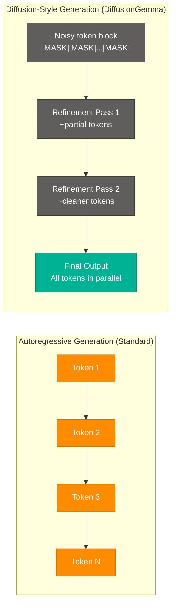

### Key Specs

| Property | Value |
|---|---|
| **Architecture type** | 26B Mixture-of-Experts (MoE) |
| **Active parameters** | ~3.8B during inference |
| **Generation style** | Diffusion (non-autoregressive) |
| **Speed advantage** | Significantly faster on dedicated GPUs vs autoregressive |

### Traditional vs Diffusion — Comparison

| Dimension | Autoregressive (GPT, Llama, Gemini) | Diffusion-Style (DiffusionGemma) |
|---|---|---|
| **Token order** | Sequential — token N depends on N-1 | Parallel — all tokens refined simultaneously |
| **Parallelism** | Low (each step depends on prior) | High (full sequence refined each pass) |
| **Editing capability** | Difficult (regenerate from point of change) | Natural (refine specific positions in-place) |
| **Latency profile** | Grows linearly with sequence length | More constant per refinement pass |
| **Best use case** | General-purpose language generation | Structured outputs, constrained generation |

### Interview Q&A

| Question | Answer |
|---|---|
| What is the key difference between autoregressive and diffusion-style LLM generation? | Autoregressive generates tokens sequentially (each token depends on the previous), while diffusion starts with a noisy placeholder sequence and refines all tokens in parallel over multiple passes. |
| Why might DiffusionGemma be faster than GPT-style models? | Because it refines all tokens simultaneously in each pass rather than generating them one at a time, enabling better GPU parallelism, especially for long sequences. |
| What is a Mixture-of-Experts (MoE) model? | An architecture where the full model has many "expert" sub-networks (26B params total for DiffusionGemma), but only a subset (~3.8B) is activated for any given token, keeping inference cost low. |
| What use cases benefit most from diffusion-style generation? | Structured output generation, constrained editing tasks, and scenarios where parallel token refinement is more efficient than sequential decoding. |

---

## 4. KV Cache in LLMs

### Overview

KV Cache (Key-Value Cache) is a critical inference optimization in Transformer-based LLMs. During token generation, the attention mechanism computes **Key** and **Value** matrices for every token in the context. Without caching, each new token generation requires recomputing these matrices for all previous tokens — an O(n²) cost. KV Cache stores these intermediate Key/Value states so they can be reused, reducing generation from quadratic to linear complexity per step. It is the primary reason modern LLMs can generate at practical speeds.

### Architecture Diagram

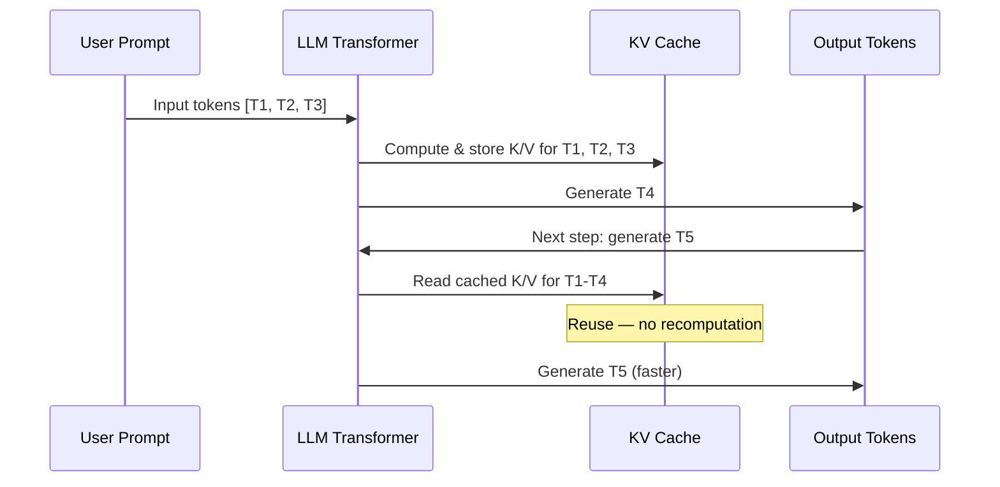

### How KV Cache Works

1. LLM generates text one token at a time using the attention mechanism.
2. Each token generation requires "attending" to every preceding token in the context.
3. Without cache: recompute Key/Value matrices for ALL prior tokens on each step → O(n) GPU ops per token × O(n) tokens = O(n²) total.
4. With KV Cache: store Key/Value matrices after first computation; retrieve on subsequent steps.
5. Result: each new token only computes K/V for itself; all prior K/V are read from cache.
6. Trade-off: significant GPU memory usage (scales with context length × model size × batch size).

### Key Concepts

| Concept | Detail |
|---|---|
| **What is cached** | Key (K) and Value (V) matrices from the attention layer for each prior token |
| **Memory cost** | Scales as `batch_size × num_heads × seq_len × head_dim × 2` |
| **Context window limit** | KV Cache grows with context length; very long contexts exhaust GPU VRAM |
| **Quantization** | KV Cache can be quantized (INT8/FP8) to reduce memory at small accuracy cost |
| **Paged KV Cache** | vLLM's innovation — manages KV Cache in non-contiguous memory pages for better utilization |

### Interview Q&A

| Question | Answer |
|---|---|
| What problem does KV Cache solve? | Without it, each token generation requires recomputing attention over all prior tokens (O(n²) total cost). KV Cache stores these intermediate states, reducing each step to O(1) cache read + O(n) for the new token. |
| Why does a long context slow down LLM inference? | KV Cache size grows linearly with context length, consuming more GPU VRAM and increasing memory bandwidth requirements per generation step. |
| What is Paged Attention (vLLM)? | It stores KV Cache in non-contiguous memory pages (like OS virtual memory), eliminating fragmentation and enabling near-100% GPU memory utilization for inference. |
| How does KV Cache interact with batching? | Batched inference requires maintaining separate KV caches per request; they cannot be shared unless the prefix is identical (prefix caching optimization). |

---

## 5. Harness Engineering for AI Systems

### Overview

Harness Engineering is the discipline of building the **reliability and control layer** that wraps an LLM to make it production-grade. The core thesis, from Analytics Vidhya, is that most AI projects fail not because of the LLM itself, but because the surrounding "harness" — guardrails, evaluation, routing, monitoring — is missing. A raw LLM call is a prototype; a harnessed LLM call is a product.

### Architecture Diagram

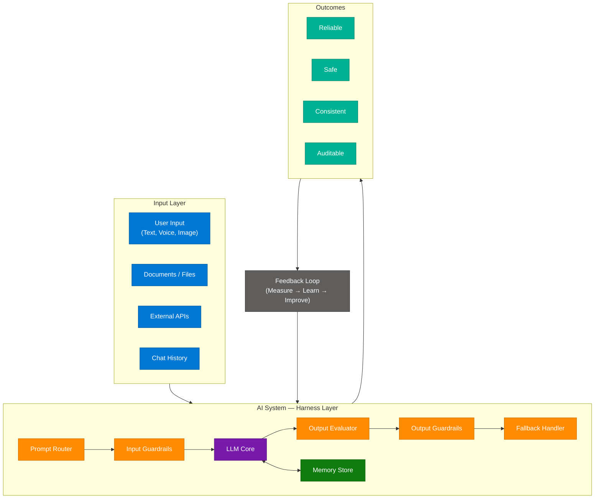

### Harness Components

| Layer | Component | Purpose |
|---|---|---|
| **Input** | User text, documents, APIs, chat history | Raw signals entering the system |
| **Harness** | Prompt Router | Classifies intent and routes to appropriate model/prompt template |
| **Harness** | Input Guardrails | PII detection, toxicity filter, injection defense |
| **Harness** | LLM Core | The underlying foundation model |
| **Harness** | Memory Store | Short-term context + long-term user/session memory |
| **Harness** | Output Evaluator | LLM-as-a-Judge or rule-based quality scoring |
| **Harness** | Output Guardrails | Hallucination detection, format validation, compliance check |
| **Harness** | Fallback Handler | Returns safe response when guardrails reject output |
| **Feedback** | Measure → Learn → Improve | Continuous improvement loop from production outcomes |

### Interview Q&A

| Question | Answer |
|---|---|
| What is Harness Engineering? | The practice of wrapping an LLM with reliability, safety, and observability components — guardrails, evaluators, routers, memory, fallbacks — to make it production-ready rather than prototype-grade. |
| Why do AI prototypes fail in production? | They rely on the raw LLM without guardrails (no input validation, output evaluation, or fallback strategy), leading to hallucinations, prompt injections, and inconsistent behavior at scale. |
| What is the feedback loop in a harness? | Production outcomes (quality scores, user feedback, error rates) are fed back to improve prompts, routing logic, guardrail thresholds, and model selection — a continuous improvement cycle. |
| How does a Prompt Router work? | It classifies the incoming user intent and routes it to the appropriate model, prompt template, or RAG pipeline. Simple requests may route to a fast/cheap model; complex ones to a larger model. |

---

## 6. LLM Temperature

### Overview

Temperature is a sampling parameter in LLMs that controls the trade-off between **accuracy/determinism** and **creativity/diversity** in generated outputs. It scales the logit distribution before sampling: low temperature sharpens the distribution (top token dominates), high temperature flattens it (more diverse tokens get sampled). Every production LLM call should set temperature deliberately based on the use case — the default varies by model.

### Temperature Spectrum

| Temperature | Behavior | Best Use Cases |
|---|---|---|
| 0.1 | Highly accurate, deterministic, predictable | Facts, logic, coding, structured data extraction |
| 0.1 – 0.3 | Precise, factual, consistent | Q&A, summaries, code, data extraction |
| 0.4 – 0.7 | Balanced creativity and accuracy | Blog writing, explanations, customer support |
| 0.8 – 1.0 | Creative, diverse, imaginative | Storytelling, brainstorming, poetry, marketing |
| 1.0 | Highly creative, diverse, unpredictable | Open-ended generation, ideation |

### Architectural Comparison

| Use Case | Recommended Temp | Why |
|---|---|---|
| SQL generation | 0.0 – 0.1 | Syntax errors are catastrophic; determinism critical |
| RAG answer generation | 0.1 – 0.3 | Stay grounded in retrieved context |
| Customer support chatbot | 0.3 – 0.5 | Friendly variation without hallucination risk |
| Code explanation | 0.2 – 0.4 | Accurate but readable |
| Creative writing | 0.8 – 1.0 | Novel, non-repetitive output desired |
| LLM-as-a-Judge | 0.0 | Deterministic evaluation required |

### Interview Q&A

| Question | Answer |
|---|---|
| What does Temperature control in an LLM? | It scales the probability distribution of the next-token logits before sampling. Low temperature (→0) makes the distribution peaked (deterministic); high temperature (→1+) flattens it (creative/diverse). |
| Why would you set temperature=0 for a judge LLM? | You need consistent, reproducible evaluations. Any randomness introduces variance in scores, making A/B comparisons unreliable. |
| What happens if temperature is too high? | The model samples from low-probability tokens, introducing incoherence, factual errors, and hallucinations — especially problematic in RAG or fact-extraction tasks. |
| Is temperature the only sampling parameter? | No. Top-p (nucleus sampling) and Top-k also constrain the sampling pool. Temperature controls sharpness; top-p controls the cumulative probability cutoff; top-k limits the candidate token count. |

---

## 7. Message Prefilling vs Forced Tool Calling

### Overview

These are two complementary **API-level steering techniques** for controlling LLM output format — distinct from prompt engineering inside the chat interface. Both are used in agent systems where the developer needs reliable, structured output from the model without relying on the model's own judgment about format.

### Technique Comparison

| Dimension | Message Prefilling | Forced Tool Calling |
|---|---|---|
| **Mechanism** | Pre-populate the model's response buffer with specific tokens (e.g., `{"tool": "calculate", "args":`) | Constrain the model's output space via API parameter (`tool_choice: "required"`) |
| **How it works** | Forces the model to continue from a given prefix, dramatically biasing output format | The API layer only allows tool call outputs; free-form text is rejected |
| **Best use case** | Strict adherence to a specific output format or JSON schema | Ensuring a tool is always invoked regardless of the model's "opinion" |
| **Reliability** | High for format; model may produce invalid completions of prefix | Very high; the API enforces it structurally |
| **Flexibility** | Developer controls exact starting tokens | Limited to tool schemas defined in the request |

### Architecture Diagram

```mermaid
flowchart LR
    dev["Developer"]

    subgraph prefill ["Message Prefilling"]
        pA["User message + assistant prefix\n{\"tool\": \"calc\", \"args\":"]
        pB["LLM continues the JSON\n(guaranteed prefix)"]
        pA --> pB
    end

    subgraph forced ["Forced Tool Calling"]
        fA["API call: tool_choice=required\ntools=[calculate, search, ...]"]
        fB["API layer enforces\ntool call output only"]
        fA --> fB
    end

    dev --> prefill
    dev --> forced

    classDef userNode    fill:#0078D4,stroke:#005A9E,color:#fff
    classDef processNode fill:#FF8C00,stroke:#CC7000,color:#fff
    classDef outputNode  fill:#00B294,stroke:#007D68,color:#fff

    class dev userNode
    class pA,fA processNode
    class pB,fB outputNode
```

### Interview Q&A

| Question | Answer |
|---|---|
| What is message prefilling? | A technique where the developer pre-populates the assistant's response turn with a specific prefix (e.g., JSON start token), forcing the model to generate a valid completion of that structure. |
| What is forced tool calling? | An API-level parameter (`tool_choice: "required"`) that constrains the model to always emit a tool call, not free-form text, regardless of the model's own judgment. |
| When would you use prefilling over forced tool calling? | Prefilling when you need a specific JSON schema the model doesn't have as a named tool; forced tool calling when you have defined tools and need guaranteed invocation. |
| What's the risk of prefilling? | The model may produce a syntactically invalid completion of the prefix (e.g., truncated JSON). Always parse and validate the output before use. |

---

## 8. Lost in the Middle Phenomenon

### Overview

"Lost in the Middle" is a well-documented empirical failure mode in LLMs where recall accuracy follows a **U-shaped curve** relative to token position in a long prompt. Information placed at the **beginning** (primacy effect) and **end** (recency effect) of the context is recalled accurately, while information placed in the **middle** of a long prompt is statistically more likely to be ignored, forgotten, or misattributed. This has critical implications for RAG context assembly, long-document summarization, and agent memory design.

### Accuracy vs Position

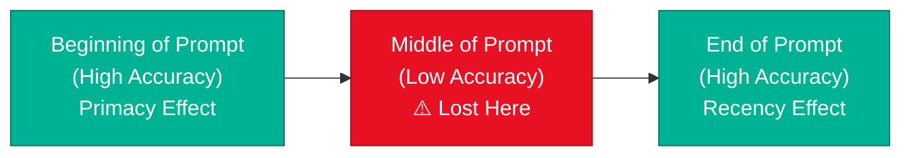

### Developer Mitigations

| Strategy | How It Helps |
|---|---|
| **Put critical context first** | Exploits the primacy effect; the model reliably processes the opening |
| **Put the question last** | Exploits the recency effect; the model focuses on the most recent instruction |
| **Reduce context length** | Fewer tokens in the middle = less information at risk |
| **Re-rank retrieved chunks** | Put highest-relevance chunks at start/end; avoid placing them in the middle |
| **Summarize middle content** | Compress mid-context into a summary placed at the start |
| **Lost in the Middle-aware chunking** | Split long documents so critical facts appear near chunk boundaries |

### Interview Q&A

| Question | Answer |
|---|---|
| What is the "Lost in the Middle" phenomenon? | An empirical finding that LLMs recall information at the beginning and end of a long prompt accurately, but information placed in the middle is statistically more likely to be missed or hallucinated. |
| How does this affect RAG system design? | Retrieved chunks should be ordered so the most relevant ones are at the start or end of the context window, not in the middle. Re-ranking by position, not just by semantic similarity, is important. |
| What is the primacy vs recency effect in LLMs? | Primacy = strong recall for information at the start of the context. Recency = strong recall for information at the end. Both effects mimic human memory patterns. |
| Does this affect all model sizes? | Yes, but larger models with longer context windows mitigate it somewhat. The phenomenon is most severe in 4k–8k context models and less pronounced (but still present) in 128k+ context models. |

---

## 9. LLM-as-a-Judge

### Overview

LLM-as-a-Judge is a production evaluation pattern where an LLM is used to score, rank, or assess the outputs of another LLM (or itself). The analogy: it is easier for a human to review and grade an essay than to write one from scratch — the same asymmetry applies to LLMs. This pattern enables scalable, automated quality evaluation at a speed and cost that human reviewers cannot match. It is the basis of RLHF reward models, automated RAG evaluation (RAGAS), and production safety filters.

### Architecture Diagram

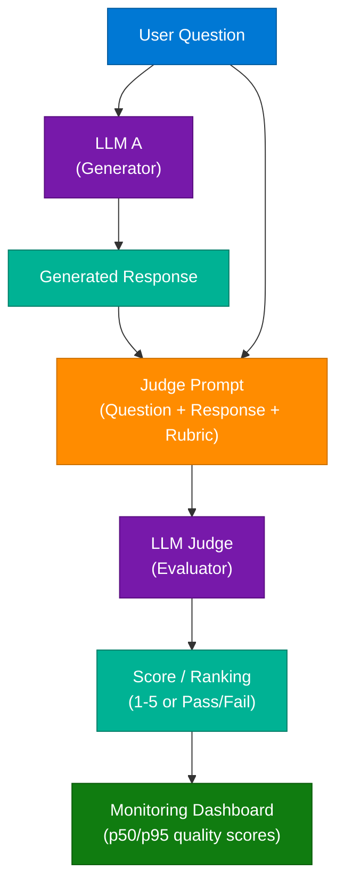

### Mitigating Bias in LLM Judges

| Technique | Purpose |
|---|---|
| **Position bias mitigation** | Randomize order of options shown to the judge (models favor the first option) |
| **Multi-judge ensemble** | Average scores from 3+ independent judge LLMs to reduce individual model bias |
| **Chain-of-thought evaluation** | Require the judge to reason step-by-step before scoring (improves calibration) |
| **Reference-free vs reference-based** | Reference-free judges score independently; reference-based compare to a gold answer |
| **Human calibration** | Periodically compare judge scores to human labels to detect drift |

### Interview Q&A

| Question | Answer |
|---|---|
| Why use an LLM-as-a-Judge instead of rule-based metrics? | LLMs can evaluate nuanced qualities (relevance, coherence, tone) that BLEU/ROUGE scores miss. They scale to millions of evaluations at a fraction of the cost of human review. |
| What are the main risks of LLM-as-a-Judge? | Position bias (favors first option), verbosity bias (prefers longer answers), self-serving bias (judges its own outputs more favorably). Mitigated with ensemble judging and randomized ordering. |
| What is RAGAS? | An open-source framework that uses LLM-as-a-Judge to evaluate RAG systems across metrics like faithfulness, answer relevancy, context precision, and context recall. |
| When should you set judge temperature to 0? | Always. Judge tasks require deterministic, reproducible scores for reliable A/B comparison. |

---

## 10. Caching Strategies for LLM Applications

### Overview

LLM inference is expensive in both latency (100ms–10s per request) and cost ($0.001–$0.10 per request depending on model). A multi-layered caching architecture dramatically reduces both by intercepting requests before they reach the model. Four distinct cache types target different points in the LLM application stack, from exact string matching at the API boundary to pre-computed embeddings at the vector DB layer.

### Caching Architecture

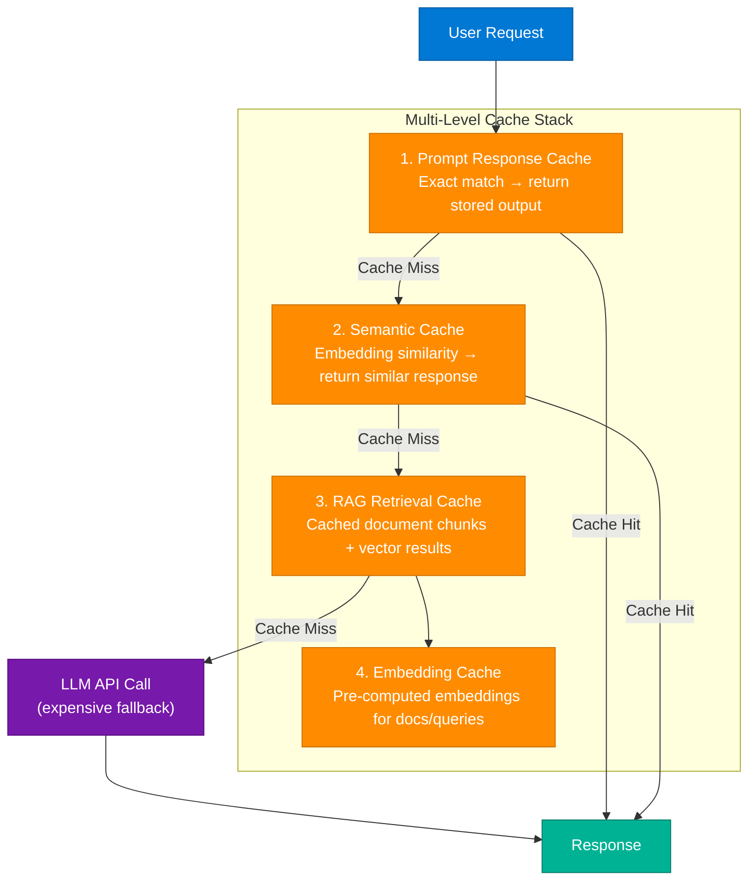

### The 4 Caching Strategies

| Strategy | Mechanism | Best For | Benefit |
|---|---|---|---|
| **Prompt Response Cache** | Stores generated output for exact matching prompts | FAQ bots, knowledge assistants, repeated queries | Near-instant response, eliminates redundant model calls |
| **Semantic Cache** | Embeds queries; retrieves cached response if cosine similarity > threshold | High-repetition but varied-phrasing queries | Higher hit rate than exact matching |
| **RAG Retrieval Cache** | Caches retrieved document chunks and vector search results | RAG systems with stable knowledge bases | Reduces retrieval latency + vector DB load |
| **Embedding Cache** | Stores pre-computed embeddings for documents/queries | Systems with large, stable document corpora | Lower compute cost, faster index creation |

### Production Metrics to Track

| Metric | Target | Notes |
|---|---|---|
| Cache hit rate | >50% for FAQ bots | Lower for creative/unique queries |
| Latency reduction | 10x–100x vs uncached | Prompt cache: <10ms vs 500ms+ |
| Cost reduction | 40–80% | Depends on hit rate and model cost |
| Cache staleness | <TTL threshold | Invalidate on knowledge base updates |

### Interview Q&A

| Question | Answer |
|---|---|
| What is semantic caching and how is it different from exact-match caching? | Semantic caching uses embedding similarity to match semantically equivalent queries (e.g., "What's the weather?" vs "Tell me today's weather"), achieving far higher cache hit rates than exact string comparison. |
| Why cache RAG retrieval results separately from LLM outputs? | Because retrieval (vector DB search) can add 50–200ms of latency and significant DB cost. For stable knowledge bases, retrieved chunk sets are highly reusable across similar queries. |
| What invalidates a semantic cache entry? | TTL expiry, knowledge base updates, or a similarity score falling below the retrieval threshold. |
| What is the risk of semantic caching? | If the similarity threshold is too low, it may return cached responses for queries that are semantically close but contextually different, introducing subtle errors. |

---

## 11. RAG vs CAG

### Overview

RAG (Retrieval-Augmented Generation) and CAG (Cache-Augmented Generation) are two competing strategies for providing external knowledge context to an LLM. RAG retrieves relevant context **at query time** from an external vector database; CAG **pre-loads** context into the model's cache before queries arrive, trading retrieval latency for memory cost.

### Comparison

| Dimension | RAG | CAG |
|---|---|---|
| **When context is loaded** | At query time (dynamic retrieval) | Before query time (pre-cached into model memory) |
| **Retrieval latency** | 50–200ms per query (vector DB search) | Near-zero (context already in cache) |
| **Memory cost** | Low (only retrieved chunks in context) | High (full context pre-loaded) |
| **Dataset scale** | Handles massive, changing datasets | Practical only for small-to-medium, stable datasets |
| **Staleness** | Low (retrieve from live DB) | Higher (cache must be rebuilt on updates) |
| **Best for** | Large/dynamic knowledge bases, e-commerce, support | Fixed docs, FAQ, structured reference data |

### Architecture Diagram

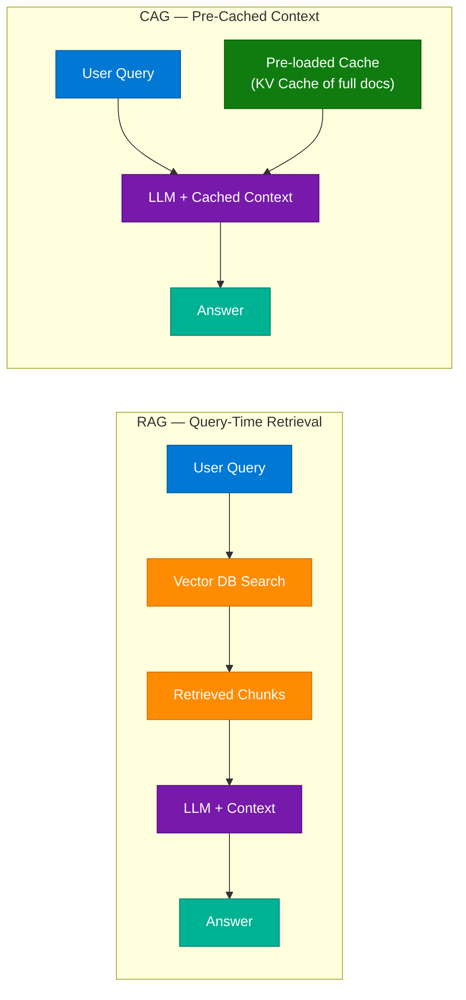

### Interview Q&A

| Question | Answer |
|---|---|
| What is CAG and how does it differ from RAG? | CAG pre-loads the entire relevant knowledge base into the model's KV cache before queries arrive, eliminating retrieval latency. RAG retrieves dynamically from an external vector DB at query time. |
| When would CAG outperform RAG? | For small, stable datasets where the full context fits in the model's KV cache and the same context is reused across many queries (e.g., a fixed product manual). |
| What limits CAG scalability? | GPU memory. Storing large contexts in KV cache (e.g., thousands of documents) is impractical — the memory cost is prohibitive for datasets beyond a few MB of text. |
| Can you combine RAG and CAG? | Yes. A hybrid approach pre-caches common context (company policies, shared knowledge) while still dynamically retrieving user-specific or rare documents. |

---

## 12. RAG Evaluation Metrics

### Overview

A common failure in RAG systems is relying on manual, ad-hoc testing rather than systematic evaluation. The RAGAS framework and similar evaluation approaches define metrics at two distinct layers: the **Retrieval Layer** (is the right context being fetched?) and the **Generation Layer** (is the model using that context correctly?). Both layers can fail independently, and the failure mode diagnostic table below pinpoints which layer is broken.

### Retrieval Layer Metrics

| Metric | Question Answered |
|---|---|
| **Context Precision** | What percentage of retrieved content is actually relevant? |
| **Context Recall** | Did the retrieval miss any critical information? |
| **MRR (Mean Reciprocal Rank)** | How high up in the results is the first relevant chunk? |
| **Hit Rate** | Does the retrieval find at least one useful chunk? |

### Generation Layer Metrics

| Metric | Question Answered |
|---|---|
| **Faithfulness** | Is the generated answer grounded in the retrieved context? (Prevents hallucinations) |
| **Answer Relevancy** | Did the model address the user's specific question? |
| **Answer Correctness** | Is the response factually accurate? |
| **Context Utilization** | Did the model actually use the provided context to form the answer? |

### Failure Mode Diagnostic

| Scenario | Diagnosis | Fix |
|---|---|---|
| High Recall + Low Precision | Too much noise in the context | Improve chunking strategy and re-ranking |
| High Precision + Low Recall | Missing important pieces of information | Expand retrieval (more chunks, hybrid search) |
| Good Retrieval + Low Faithfulness | System is hallucinating | Add output guardrails, lower temperature, use chain-of-thought |
| Good Generation + Bad Retrieval | The model never had the right data to succeed | Fix the retrieval layer first |

### Interview Q&A

| Question | Answer |
|---|---|
| What is Context Precision vs Context Recall in RAG evaluation? | Precision measures what fraction of retrieved chunks are relevant (signal-to-noise ratio). Recall measures whether all relevant information was retrieved (completeness). Both matter independently. |
| What does a low Faithfulness score indicate? | The model is generating answers that are not grounded in the retrieved context — i.e., hallucinating. This is a Generation Layer failure, not a retrieval failure. |
| What is RAGAS? | An open-source Python library that automates RAG evaluation using LLM-as-a-Judge to compute faithfulness, answer relevancy, context precision, and context recall without human labeling. |
| How would you debug a RAG system that gives wrong answers? | Start with the failure mode diagnostic: check retrieval metrics first. If retrieval is good, the issue is in generation (hallucination, poor context utilization). This separates retrieval bugs from generation bugs. |

---

## 13. 7 Types of Agent Memory

### Overview

In AI agent architecture, "memory" determines how an agent retains, recalls, and utilizes information across interactions. There is no single "memory" — agents require a **tiered memory architecture** spanning from what is visible in the current context window to what is permanently encoded in model weights. Understanding all 7 types is essential for designing agents that can handle long-running tasks, personalization, and tool use.

### Architecture Diagram

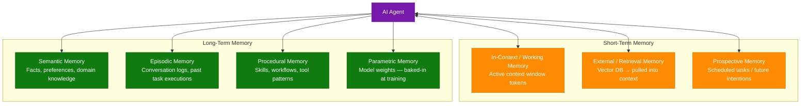

### The 7 Types

| # | Type | Scope | Description |
|---|---|---|---|
| 1 | **In-Context / Working Memory** | Short-term | Everything the model can currently see within its context window |
| 2 | **Semantic Memory** | Long-term | Persistent repository of factual knowledge, user preferences, domain expertise (e.g., vector DB) |
| 3 | **Episodic Memory** | Long-term | Chronological log of past events, task executions, and full conversations |
| 4 | **Procedural Memory** | Long-term | The agent's "how-to" knowledge — skill set, tool usage patterns, predefined workflows |
| 5 | **External / Retrieval Memory** | Short + Long-term | Knowledge stored outside the LLM (vector DB) that is pulled into context when needed |
| 6 | **Parametric Memory** | Long-term | Knowledge embedded directly in model weights during training (general world knowledge) |
| 7 | **Prospective Memory** | Short + Long-term | Capability to track future intentions, scheduled goals, and planned tasks not yet executed |

### Tiered Implementation Guide

| Tier | Implementation | Tools |
|---|---|---|
| **Tier 1 — Immediate** | In-context working memory | Context window of the LLM |
| **Tier 2 — Session** | Short-term semantic + episodic memory | Redis, SQLite, in-process dictionary |
| **Tier 3 — Persistent** | Long-term semantic + episodic memory | Pinecone, Weaviate, Postgres + pgvector |

### Interview Q&A

| Question | Answer |
|---|---|
| What is the difference between Semantic and Episodic Memory in agents? | Semantic memory stores facts and knowledge (what); episodic memory stores chronological records of past events and interactions (when + what happened). |
| What is Parametric Memory? | Knowledge baked into the model's weights during training — general world knowledge, language understanding, reasoning patterns. It cannot be updated without fine-tuning. |
| Why is Prospective Memory important for autonomous agents? | Agents running long tasks need to track future goals and scheduled actions (e.g., "check the API result in 10 minutes") that extend beyond the current context window. |
| How would you implement long-term semantic memory for a chatbot? | Store user preferences, domain facts, and interaction summaries as embeddings in a vector DB (Pinecone/Weaviate). Retrieve the most relevant memories at the start of each session. |

---

## 14. Load Balancer Routing Algorithms

### Overview

A load balancer distributes incoming network requests across multiple servers to maximize throughput, minimize latency, and prevent any single server from becoming a bottleneck. Choosing the right routing algorithm is a critical architectural decision — the optimal choice depends on whether sessions are stateful, whether servers have heterogeneous capacity, and whether response time variance is high.

### Architecture Diagram

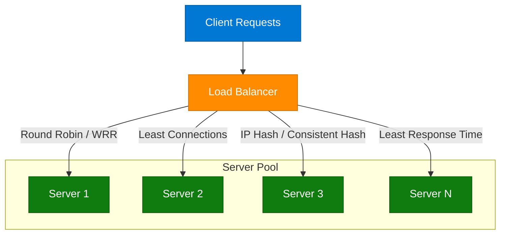

### The 6 Routing Algorithms

| Algorithm | Description | Best For |
|---|---|---|
| **Round Robin** | Cycles through servers in fixed sequential order | Stateless, homogeneous servers with uniform request cost |
| **Weighted Round Robin** | Assigns traffic proportional to server capacity | Heterogeneous servers (some more powerful than others) |
| **Least Connections** | Routes to the server with fewest active connections | Long-lived connections (WebSockets, streaming) |
| **IP Hash** | Maps client IP to a specific server for session persistence | Stateful applications requiring session affinity |
| **Least Response Time** | Routes to the fastest-responding server | Latency-sensitive applications |
| **Consistent Hashing** | Distributes keys across a "ring"; minimal remapping on add/remove | Distributed caching, CDN, microservice routing |

### Interview Q&A

| Question | Answer |
|---|---|
| When would you use Consistent Hashing over Round Robin? | When you have a distributed cache (e.g., Redis cluster) and need to minimize cache invalidation when nodes are added or removed. Round Robin causes cache misses on all keys; Consistent Hashing only remaps ~1/N keys. |
| What problem does IP Hash solve? | Session persistence (sticky sessions). If a user's session state lives on a specific server, IP Hash ensures the same user always routes to the same server. The downside is uneven load if one IP generates disproportionate traffic. |
| What is the Least Connections algorithm best for? | Long-lived connection scenarios like WebSockets, file uploads, or video streaming where request duration varies widely — it dynamically routes to the least loaded server in real time. |
| How does L4 vs L7 load balancing differ? | L4 (transport layer) routes based on IP/TCP/UDP — fast but no application awareness. L7 (application layer) routes based on HTTP headers, URL paths, cookies — enables sophisticated routing rules (e.g., `/api` → backend cluster, `/static` → CDN). |

---

## 15. Idempotency in Distributed Systems

### Overview

Idempotency is the property where performing an operation multiple times produces the same result as performing it once. In distributed systems, network failures cause requests to be retried, creating duplicate requests that can have catastrophic side effects (double-charging a user, duplicate orders). The **Idempotency Key** pattern solves this by allowing servers to detect and safely handle duplicate requests.

### Architecture Diagram

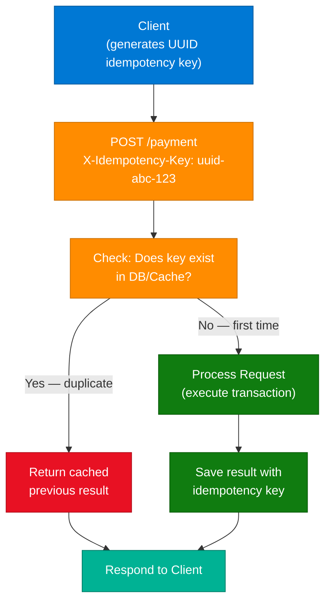

### Backend Processing Logic

1. **Check:** Does the Idempotency Key exist in DB/Cache?
   - **Yes** → Duplicate request. Return the cached previous result immediately.
   - **No** → First occurrence. Proceed to process.
2. **Process:** Execute the transaction (payment, order creation, etc.).
3. **Save:** Store the result associated with the Idempotency Key for future deduplication.

### Race Condition Prevention

| Technique | How It Prevents Race Conditions |
|---|---|
| **Atomic DB operation** | Use `INSERT ... ON CONFLICT DO NOTHING` (PostgreSQL) to atomically claim the key |
| **Redis SETNX** | `SET key value NX EX 300` — atomic set-if-not-exists with TTL |
| **Distributed lock** | Acquire a Redis/ZooKeeper lock before processing; release after saving result |

### Key Considerations

| Issue | Detail |
|---|---|
| **Key TTL** | Idempotency keys should expire after a reasonable window (e.g., 24–72 hours) |
| **Client responsibility** | The client generates the unique key (UUID v4 recommended) per logical operation |
| **Error idempotency** | If the first request errored, a retry with the same key should re-process, not return the error |
| **Stripe/PayPal pattern** | Both use `Idempotency-Key` HTTP header; return 200 with cached result on duplicate |

### Interview Q&A

| Question | Answer |
|---|---|
| What is idempotency and why does it matter in distributed systems? | An operation is idempotent if repeating it produces the same result as doing it once. In distributed systems, network timeouts cause clients to retry, so without idempotency a payment request can be charged multiple times. |
| How does the Idempotency Key pattern work? | The client generates a unique key (UUID) per logical operation and sends it with each request. The server checks if that key exists in its store; if yes, returns the cached result. If no, processes and stores the result. |
| How do you prevent race conditions in idempotency key checks? | Use atomic database operations: PostgreSQL `INSERT ... ON CONFLICT DO NOTHING` or Redis `SETNX` to atomically claim the key. This ensures only one request processes even under concurrent retries. |
| Are HTTP GET requests inherently idempotent? | Yes. GET, HEAD, and DELETE are idempotent by HTTP spec. POST is not; PUT is idempotent (same payload → same state). |

---

## 16. Shopify Modular Monolith Architecture

### Overview

Shopify handles 30TB of data per minute using a **Modular Monolith** — not microservices. The modular monolith pattern organizes all business domains into strongly-bounded modules within a single deployable artifact, using asynchronous messaging (RabbitMQ) for inter-module communication. This approach delivers the developer productivity of a monolith with the domain isolation of microservices, while avoiding the distributed systems complexity (network calls, distributed transactions, service discovery) of true microservices.

### Architecture Diagram

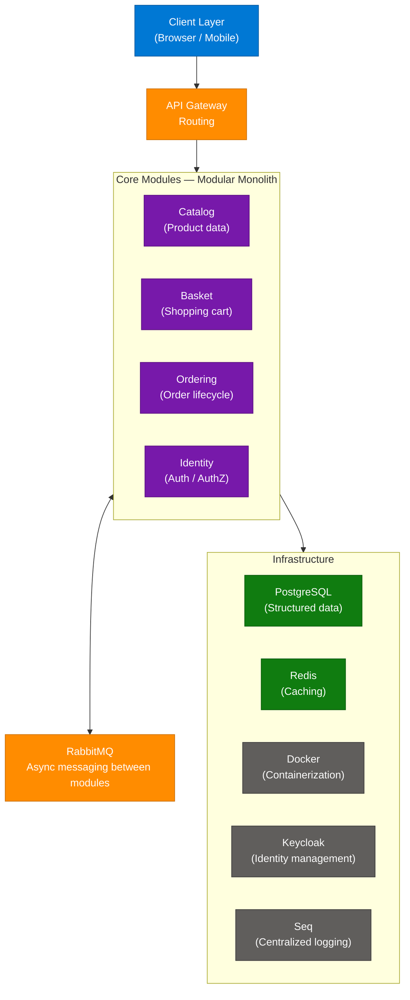

### Technology Stack

| Component | Technology | Role |
|---|---|---|
| **Runtime** | .NET 8 | Application framework |
| **Messaging** | RabbitMQ | Async inter-module communication |
| **Database** | PostgreSQL | Primary relational data store |
| **Cache** | Redis | In-memory caching for performance |
| **Containers** | Docker | Deployment unit |
| **Identity** | Keycloak | Auth/AuthZ management |
| **Logging** | Seq | Centralized structured logging |

### Modular Monolith vs Microservices

| Dimension | Modular Monolith | Microservices |
|---|---|---|
| **Deployment** | Single artifact | Many independent services |
| **Inter-module calls** | In-process (fast, type-safe) or async (RabbitMQ) | Over-the-network (HTTP/gRPC) |
| **Transaction consistency** | Easier (shared DB or module-local DB) | Harder (Saga pattern required) |
| **Team size** | Scales well to ~50–100 engineers | Needed above ~100 engineers per domain |
| **Operational complexity** | Low (one process to deploy/monitor) | High (service mesh, distributed tracing, CI per service) |

### Interview Q&A

| Question | Answer |
|---|---|
| Why does Shopify use a modular monolith instead of microservices? | At Shopify's team size and architecture maturity, a modular monolith provides domain isolation (each module owns its data and logic) without the operational overhead of distributed service meshes, distributed transactions, and independent CI/CD per service. |
| How does RabbitMQ enable module isolation in a monolith? | Modules communicate asynchronously via message queues rather than direct method calls, enforcing loose coupling. A module can be refactored or extracted without breaking its consumers. |
| How is 30TB/min scale achieved in a monolith? | Through horizontal scaling (multiple instances behind a load balancer), Redis caching, PostgreSQL read replicas, and careful module-level database partitioning — not through microservice decomposition. |
| What is the migration path from modular monolith to microservices? | Extract modules one at a time ("Strangler Fig" pattern). The pre-existing module boundaries make extraction predictable. RabbitMQ messaging already provides the decoupling needed for service-to-service communication. |

---

## 17. AWS Cloud Architecture

### Overview

A typical modern web application on AWS follows a layered architecture from DNS and CDN at the edge to compute, queuing, and storage at the core. Each layer is purpose-built: Route 53 handles DNS, CloudFront serves static assets globally, API Gateway manages backend routing, Lambda/ECS handles compute, SQS decouples async work, and RDS/DynamoDB/S3 handle structured and unstructured data. The entire infrastructure is wrapped in CloudWatch (monitoring), IAM (identity), and VPC (network isolation).

### Architecture Diagram

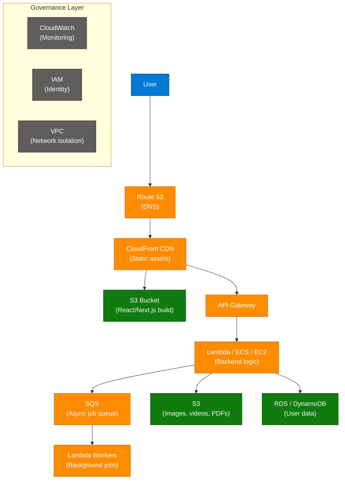

### Layer-by-Layer Breakdown

| Layer | AWS Service | Purpose |
|---|---|---|
| **DNS** | Route 53 | Routes www traffic to CloudFront |
| **CDN/Frontend** | CloudFront + S3 | Serves React/Next.js build from edge nodes globally |
| **API** | API Gateway | Routes frontend HTTP calls to backend Lambda/ECS |
| **Compute** | Lambda / ECS / EC2 | Handles uploads, business logic, pricing |
| **Queue** | SQS | Decouples async background work from synchronous API |
| **Workers** | Lambda Workers | Process SQS messages (email, image resize, ML inference) |
| **Object Storage** | S3 | Images, videos, PDFs |
| **Structured Data** | RDS (SQL) / DynamoDB (NoSQL) | User data, documents, orders |
| **Monitoring** | CloudWatch | Metrics, logs, alarms |
| **Security** | IAM | Role-based access control for all AWS resources |
| **Network** | VPC | Isolates infrastructure in private subnets |

### Interview Q&A

| Question | Answer |
|---|---|
| Why put a CDN in front of S3 for static assets? | S3 alone serves from a single region. CloudFront caches assets at 400+ global edge nodes, reducing latency from ~500ms to <30ms for international users. |
| When would you use Lambda vs ECS for compute? | Lambda for stateless, bursty, short-duration work (<15 min). ECS for long-running processes, stateful workloads, or when you need precise resource control (GPU, custom runtime). |
| How does SQS enable system resilience? | SQS decouples producers from consumers. If a Lambda worker crashes, messages stay in the queue and are retried. This prevents backpressure from propagating upstream to the API. |
| What is the difference between RDS and DynamoDB for this architecture? | RDS is a relational DB (SQL, ACID transactions, joins) — ideal for structured user/order data. DynamoDB is a NoSQL key-value/document store (auto-scaling, single-digit ms latency) — ideal for high-throughput, schema-flexible data. |

---

## 18. System Design Fundamentals

### Sharding

Sharding partitions data across multiple database instances (shards) based on a sharding key. Each shard holds a subset of the total data, enabling horizontal scalability. Queries targeting a specific shard key go directly to that shard, avoiding full-table scans.

| Property | Detail |
|---|---|
| **Benefits** | Horizontal scalability, improved query performance, easier maintenance per shard |
| **Challenges** | Cross-shard joins are expensive; uneven data distribution (hot shards); managing distributed transactions |
| **Common shard keys** | user_id, tenant_id, geographic region |
| **Routing** | Consistent hashing or a shard map/directory service |

### CAP Theorem

States that a distributed system can guarantee **only 2 of 3 properties** simultaneously:

| Property | Definition |
|---|---|
| **Consistency (C)** | All nodes see the same data at the same time |
| **Availability (A)** | The system is always responsive (every request gets a response) |
| **Partition Tolerance (P)** | The system works despite network partitions between nodes |

| System Type | Example | Trade-off |
|---|---|---|
| **CA** | Traditional RDBMS (single node) | No partition tolerance — fails if network splits |
| **CP** | HBase, Zookeeper, MongoDB (strict) | May refuse requests during network partitions |
| **AP** | Cassandra, DynamoDB, CouchDB | Returns potentially stale data during partitions |

> Real-world note: P is mandatory in any distributed system (networks always partition eventually), so the practical choice is CP vs AP.

### ACID vs BASE

| Model | Properties | Use Case |
|---|---|---|
| **ACID** | Atomicity, Consistency, Isolation, Durability — strong guarantees | Financial transactions, inventory systems, order processing |
| **BASE** | Basically Available, Soft state, Eventual consistency — prioritizes availability | Social feeds, analytics, large-scale distributed caching |

### Eventual Consistency

In an eventually-consistent system (BASE), all replicas will converge to the same value if no new updates are made, but reads may temporarily return stale data. This enables high availability and partition tolerance at the cost of immediate consistency.

### Interview Q&A

| Question | Answer |
|---|---|
| Explain CAP Theorem and give real-world examples. | A distributed system can guarantee only 2 of Consistency, Availability, Partition Tolerance. Cassandra/DynamoDB choose AP (available during network partitions, may return stale data). HBase chooses CP (consistent but refuses requests during partitions). |
| When would you shard a database? | When a single database instance can no longer handle read/write volume or data volume. Common triggers: >1TB data, >100k writes/sec, or latency degradation from table size. |
| What is the difference between ACID and BASE? | ACID prioritizes strong consistency and correctness (all-or-nothing transactions). BASE prioritizes availability and scale (data will eventually be consistent but reads may be stale). |
| What is eventual consistency and when is it acceptable? | Eventual consistency means all replicas converge to the same value if no new updates arrive. Acceptable for social media likes/views, product catalog reads, analytics — not acceptable for bank balances or inventory. |

---

## 19. Why Kafka Over Any Queue

### Overview

Apache Kafka is preferred over traditional message queues (RabbitMQ, SQS) for high-throughput, replay-capable, multi-consumer event streaming. The key distinction: traditional queues **remove messages after delivery** (push model), while Kafka **retains messages on disk** (log model), allowing multiple independent consumers to read at their own pace, replaying history as needed.

### Kafka vs Traditional Queue

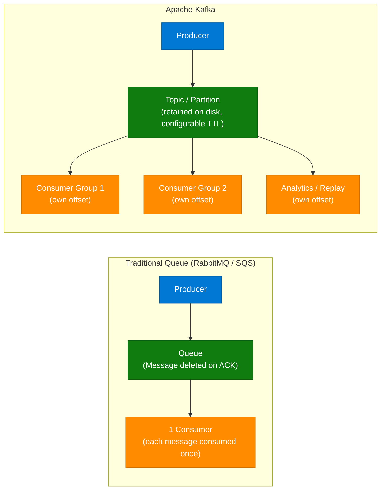

### When to Choose Kafka

| Use Case | Kafka | Traditional Queue |
|---|---|---|
| Multiple independent consumers of the same event | ✅ Each consumer group maintains its own offset | ❌ Message deleted after first delivery |
| Event replay / audit trail | ✅ Retained on disk with configurable TTL | ❌ Message gone after consumption |
| High throughput (millions of events/sec) | ✅ Partitioned, sequential disk I/O | ❌ Slower at extreme scale |
| Simple task queue (worker pool) | ❌ Overkill | ✅ SQS/RabbitMQ is simpler |
| Exactly-once delivery | ✅ Idempotent producer + transactions | ⚠️ Varies by implementation |

### Interview Q&A

| Question | Answer |
|---|---|
| What is the key difference between Kafka and a message queue? | Kafka is a durable, append-only log where messages are retained after consumption; multiple independent consumer groups read at their own offsets. Traditional queues delete messages after delivery, supporting only one consumer per message. |
| What is a Kafka consumer offset? | A pointer to the last message read by a consumer group in a partition. Consumers manage their own offsets, enabling independent replay or catch-up without affecting other consumers. |
| When would you use SQS over Kafka? | Simple work queues with one consumer type, bursty tasks, or serverless Lambda integrations. SQS is fully managed, simpler, cheaper at low volume, and naturally integrates with AWS Lambda triggers. |

---

## 20. 7 Coding Patterns from Senior Engineers

### Overview

Seven production-grade coding patterns observed in senior engineer codebases, from readability principles to architectural separation concerns.

| # | Pattern | Principle |
|---|---|---|
| 1 | **Write code for the next developer** | Always optimize for readability and maintainability over cleverness |
| 2 | **Prefer composition over inheritance** | Use smaller, modular components combined to build complex behavior; more flexible and testable |
| 3 | **Fail fast instead of hiding errors** | Never suppress errors; let the system fail immediately with meaningful messages |
| 4 | **Keep functions small and focused** | Single Responsibility: each function does one thing and does it well |
| 5 | **Make dependencies explicit** | No hidden global state or implicit magic; inject all dependencies explicitly |
| 6 | **Design for change** | Build architecture so modifying one part does not cascade breaking changes |
| 7 | **Separate business logic from infrastructure logic** | Keep "what" (business rules) distinct from "how" (DB calls, API requests, framework code) |

### Code Example — Pattern 7: Business Logic Separation

```python
# BAD — business logic coupled to infrastructure
def process_order(order_id: str):
    conn = psycopg2.connect(DATABASE_URL)
    order = conn.execute("SELECT * FROM orders WHERE id = %s", order_id).fetchone()
    if order["status"] == "pending":
        charge_result = stripe.charge(order["amount"], order["card_token"])
        conn.execute("UPDATE orders SET status='paid' WHERE id = %s", order_id)
    return charge_result

# GOOD — business logic isolated
class OrderService:
    def __init__(self, order_repo: OrderRepository, payment_gateway: PaymentGateway):
        self.order_repo = order_repo
        self.payment_gateway = payment_gateway

    def process_order(self, order_id: str) -> PaymentResult:
        order = self.order_repo.get(order_id)
        if order.status != OrderStatus.PENDING:
            raise InvalidOrderStateError(order.status)
        result = self.payment_gateway.charge(order.amount, order.payment_token)
        self.order_repo.update_status(order_id, OrderStatus.PAID)
        return result
```

### Interview Q&A

| Question | Answer |
|---|---|
| What does "prefer composition over inheritance" mean in practice? | Build objects by combining small, focused collaborators (Strategy, Decorator patterns) rather than deep inheritance hierarchies. Composition is more flexible — you can swap implementations at runtime and test each part in isolation. |
| Why is "fail fast" better than hiding errors? | Silent failures corrupt system state and make debugging exponentially harder. Failing fast with a clear error at the point of failure makes the root cause immediately obvious. |
| How do you separate business logic from infrastructure? | Use the Ports and Adapters (Hexagonal Architecture) or Clean Architecture pattern. Define interfaces (ports) for external dependencies; implement them with concrete adapters (DB, HTTP, queue). Business logic only depends on the interfaces. |

---

## 21. SOLID Principles — Single Responsibility

### Overview

SOLID is a set of five object-oriented design principles that promote maintainable, extensible, and testable code. The **Single Responsibility Principle (SRP)** — the "S" in SOLID — states that a class should have only one reason to change, meaning it should have only one primary responsibility. Violating SRP creates classes that are hard to test (too many dependencies), fragile under change (modifying one responsibility breaks unrelated behavior), and difficult to reuse.

### Before vs After SRP

```python
# VIOLATES SRP — OrderService does 3 things
class OrderService:
    def create_order(self, data): ...         # Domain logic
    def save_to_database(self, order): ...    # Infrastructure
    def send_confirmation_email(self, order): ...  # Communication

# FOLLOWS SRP — each class has one responsibility
class OrderCreator:
    def create(self, data) -> Order: ...      # Domain logic only

class OrderRepository:
    def save(self, order: Order): ...         # Persistence only

class OrderNotifier:
    def send_confirmation(self, order): ...   # Notification only
```

### The 5 SOLID Principles (Quick Reference)

| Letter | Principle | Key Rule |
|---|---|---|
| **S** | Single Responsibility | A class has one reason to change |
| **O** | Open/Closed | Open for extension, closed for modification |
| **L** | Liskov Substitution | Subtypes must be substitutable for their base types |
| **I** | Interface Segregation | No client forced to depend on interfaces it doesn't use |
| **D** | Dependency Inversion | Depend on abstractions, not concretions |

### Interview Q&A

| Question | Answer |
|---|---|
| What does "one reason to change" mean in SRP? | A class has one responsibility. If changing the email template and changing the database schema both require editing the same class, SRP is violated — those are two separate reasons to change. |
| How does SRP improve testability? | Each class has fewer dependencies, fewer code paths, and a focused purpose. A 50-line class with one responsibility is far easier to unit test than a 500-line class with five responsibilities. |
| What is the Open/Closed Principle? | Classes should be open for extension (new behavior can be added via subclasses or composition) but closed for modification (existing code doesn't change, preventing regression). |

---

## 22. Z-Test vs T-Test

### Overview

Z-Test and T-Test are two primary statistical hypothesis tests for comparing means. The choice between them depends on sample size and knowledge of population variance. In A/B testing, model evaluation, and data science, choosing the wrong test leads to incorrect p-values and flawed conclusions.

### Comparison Table

| Feature | Z-Test | T-Test |
|---|---|---|
| **Data variance** | Population variance is **known** | Population variance is **unknown** (estimated from sample) |
| **Sample size** | Large (n ≥ 30) | Small (typically n < 30) |
| **Distribution** | Assumes normal distribution | Assumes normal distribution (more robust to small samples via t-distribution) |
| **Common use** | Large-scale A/B tests, population comparisons | Small experiments, pilot studies, medical trials |
| **Distribution tail** | Standard normal (z-distribution) | t-distribution (heavier tails for small n) |

### Why the Distinction Matters

- **Real-world data almost never has known population variance** → T-Test is the default in most ML/data science contexts.
- As n → ∞, the t-distribution converges to the z-distribution (both give same result for large samples).
- Using a Z-Test with a small sample underestimates uncertainty → overestimates significance → false positives.

### Interview Q&A

| Question | Answer |
|---|---|
| When would you use a T-Test instead of a Z-Test? | When population variance is unknown (almost always in practice) and/or the sample is small (n < 30). The T-Test uses the sample standard deviation as an estimate, adding appropriate uncertainty via the t-distribution's heavier tails. |
| What happens to a T-Test as sample size grows? | The t-distribution converges to the standard normal (z-distribution). For n > 30, Z-Test and T-Test give virtually identical results — the distinction is most critical for small samples. |
| In an A/B test with 10,000 users per variant, which test? | Either, but typically a Z-Test since n is large (variance is well-estimated by that point). A two-sample t-test also works and is more conservative — preferred for correctness. |

---

## 23. Model Context Protocol (MCP)

### Overview

MCP (Model Context Protocol) is an open, universal standard — built on JSON-RPC 2.0 — designed to connect AI applications (LLMs) to external data sources and tools without custom integrations. Think of it as USB-C for AI: instead of each LLM building proprietary connectors for GitHub, databases, or APIs, MCP provides a standardized client-server protocol that any AI application can implement once and connect to any compliant "MCP Server."

### Architecture Diagram

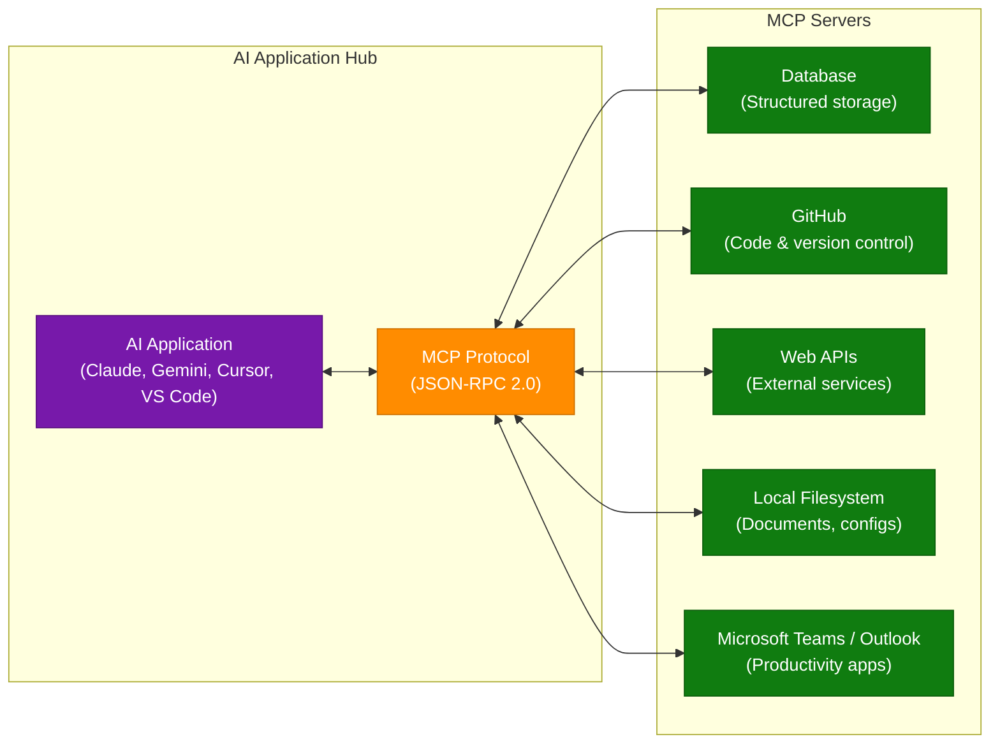

### How MCP Works

| Component | Role |
|---|---|
| **MCP Host** | The AI application (Claude, Gemini, VS Code Copilot) that initiates connections |
| **MCP Client** | Protocol layer within the host that speaks JSON-RPC 2.0 |
| **MCP Server** | Lightweight adapter exposing tools, resources, and prompts from an external system |
| **Transport** | stdio (local) or SSE/HTTP (remote) |

### Interview Q&A

| Question | Answer |
|---|---|
| What problem does MCP solve? | Before MCP, every AI application needed custom integrations for every external tool (N×M integration matrix). MCP reduces this to N+M: each AI implements one MCP client, each tool implements one MCP server. |
| What is the underlying protocol of MCP? | JSON-RPC 2.0 over stdio (for local servers) or HTTP with Server-Sent Events (for remote servers). |
| How is MCP different from function calling / tool use? | Function calling is model-vendor-specific (OpenAI format, Anthropic format). MCP is a universal, vendor-neutral standard for tool discovery and invocation that works across any compliant AI application. |
| What are MCP Resources vs MCP Tools? | Resources are read-only data sources an LLM can access (files, DB records). Tools are callable functions with side effects (write DB, send email, create PR). |

---

## 24. Interview Q&A Cheatsheet

**Q: What is GraphRAG and when would you use it over standard RAG?**
> GraphRAG builds a knowledge graph of entities and relationships from documents, enabling multi-hop reasoning and global summarization queries that standard chunk-based RAG cannot answer. Use it when your knowledge base has interconnected entities and your queries require synthesizing information across documents.

**Q: Explain KV Cache and why it's critical for LLM inference performance.**
> KV Cache stores the Key and Value attention matrices for all prior tokens so they don't need to be recomputed on each generation step. Without it, generation cost is O(n²) in sequence length. With it, each step is O(n) read + O(1) compute for the new token, enabling practical inference speeds.

**Q: What is the "Lost in the Middle" problem and how do you mitigate it in RAG?**
> LLMs recall information at the beginning and end of a prompt accurately (primacy/recency effects) but systematically lose accuracy for information placed in the middle of long contexts. Mitigate by placing the most relevant retrieved chunks at the start or end of the context, not in the middle.

**Q: What is the difference between CAP theorem's CP vs AP systems?**
> CP systems (HBase, Zookeeper) maintain consistency during network partitions by rejecting requests rather than returning stale data. AP systems (Cassandra, DynamoDB) remain available during partitions but may return temporarily inconsistent data. In practice, P is mandatory, so the real choice is CP vs AP.

**Q: How does Idempotency Key pattern prevent double-charging?**
> The client generates a UUID for each logical operation and sends it with every retry. The server atomically checks if the key exists; if yes, returns the cached result; if no, processes and stores the result. This makes the operation safe to retry any number of times.

**Q: When would you use Semantic Caching vs a Prompt Response Cache for an LLM app?**
> Prompt Response Cache for exact repeated queries (very high hit rate, near-zero latency). Semantic Cache when queries are paraphrased differently but semantically equivalent — it uses embedding similarity to serve cached responses for queries like "What's the weather?" and "Tell me today's weather."

**Q: What is LLM-as-a-Judge and what biases must you mitigate?**
> Using an LLM to evaluate the quality of another LLM's output. Key biases: position bias (models favor the first option — randomize order), verbosity bias (models favor longer answers), self-serving bias (models rate their own outputs higher). Mitigate with multi-judge ensembles and chain-of-thought prompting.

**Q: What makes Shopify's modular monolith scale to 30TB/min without microservices?**
> Domain isolation through strongly-bounded modules, async decoupling via RabbitMQ, Redis caching, PostgreSQL with read replicas, and Docker containerization for horizontal scaling. The modular monolith avoids distributed transaction complexity while maintaining domain separation.

**Q: Explain the 7 types of agent memory.**
> In-Context (current window), Semantic (factual knowledge store), Episodic (conversation history), Procedural (tool patterns/workflows), External/Retrieval (vector DB pulled in as needed), Parametric (model weights), and Prospective (future scheduled tasks). Production agents combine all seven in a tiered architecture.

**Q: What is Harness Engineering and why do most AI prototypes fail in production?**
> Harness Engineering wraps an LLM with guardrails, evaluators, routing, memory, and fallback logic. Prototypes fail because they rely on a raw LLM call without input validation, output evaluation, or fallback — leading to hallucinations, prompt injection, and inconsistent behavior at scale.

---

*Extracted from Gemini shared session · July 5, 2026 · GeminiShareToMD Agent v1.0*

---

## Token Usage Report

```
═══════════════════════════════════════════════════════════
Token Usage Report
═══════════════════════════════════════════════════════════
Estimated without optimization:  ~25,750 tokens (103,000 chars ÷ 4)
Actual (with optimization):      ~16,000 tokens (enriched output)
Savings:                         ~9,750 tokens (~38%)
Techniques applied:
  • Stripped UI chrome: "Convert chat to PDF", "Open this chat in Acrobat",
    "Continue this chat", Privacy Policy, Terms of Service footers
  • Stripped repeated Gemini boilerplate headers
  • Merged 3 duplicate Idempotency turns into 1 consolidated section
  • Skipped 3 non-technical/meta/error turns
  • Compacted accessibility tree structure into prose + tables
  • TOON-converted 6 data tables from raw ref-node format
═══════════════════════════════════════════════════════════
* Estimates: prose chars ÷ 4. Actual API usage varies by model.
```
