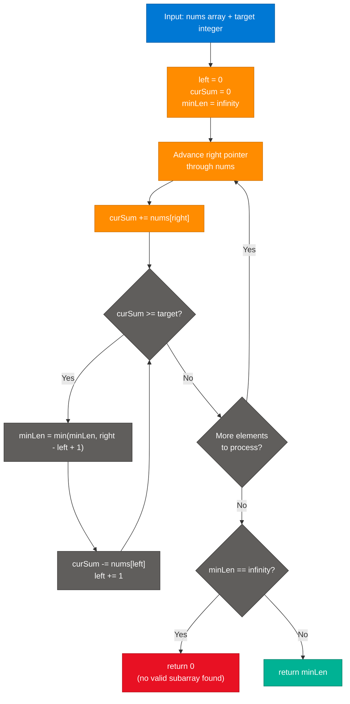
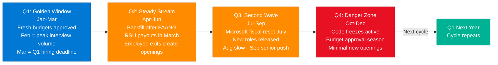
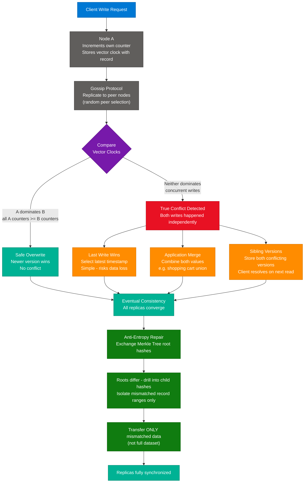
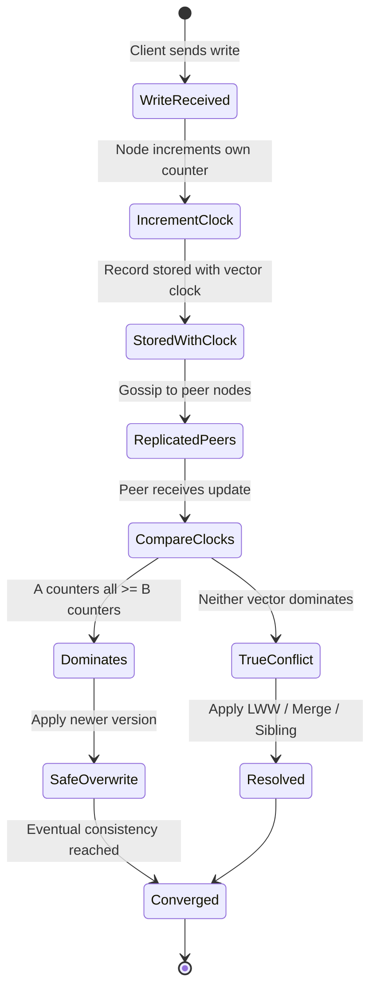
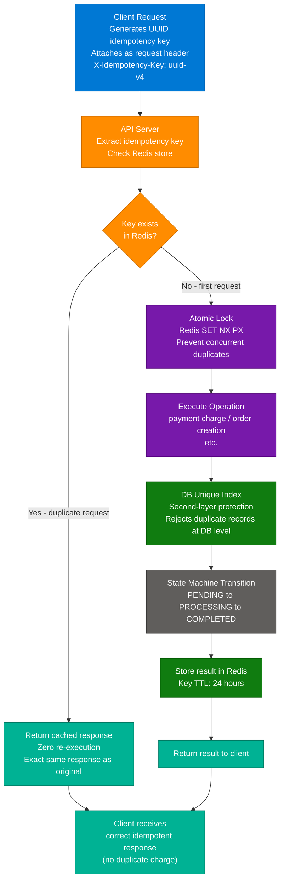
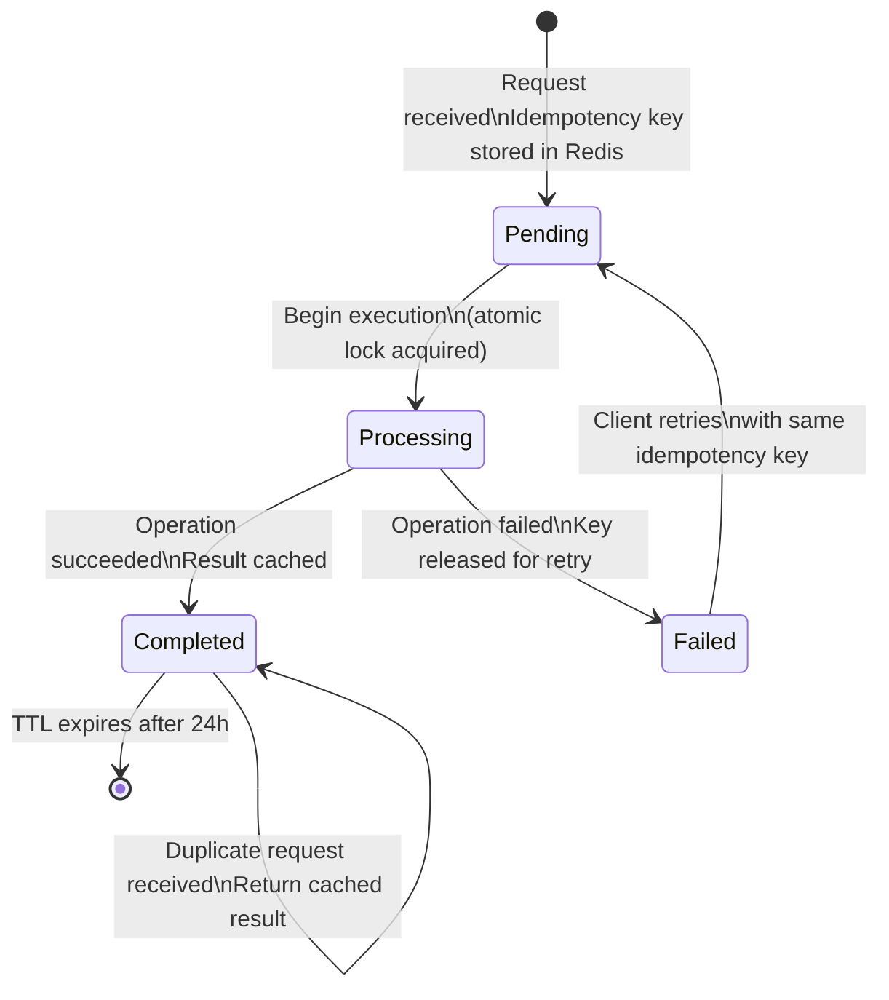
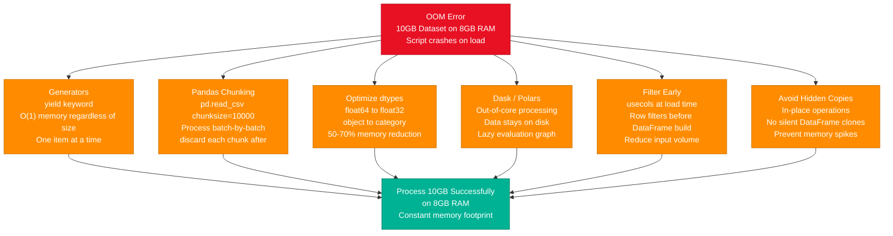

# Instagram Tech Learnings — LLM API, System Design & DSA

> **Source:** [share.gemini.google/JlpDqffzZ0is](https://share.gemini.google/JlpDqffzZ0is) → [gemini.google.com/share/0cf17aab9caa](https://gemini.google.com/share/0cf17aab9caa)
> **Model:** Gemini 3.1 Flash-Lite
> **Session Date:** July 6, 2026
> **Saved:** July 7, 2026

---

## Table of Contents

1. [Session Overview](#1-session-overview)
2. [LLM API Request Lifecycle](#2-llm-api-request-lifecycle)
3. [Minimum Size Subarray Sum — Sliding Window (LC 209)](#3-minimum-size-subarray-sum--sliding-window-lc-209)
4. [2026 Tech Hiring Calendar](#4-2026-tech-hiring-calendar)
5. [Distributed Databases — Vector Clocks & Conflict Resolution](#5-distributed-databases--vector-clocks--conflict-resolution)
6. [System Design — Idempotency](#6-system-design--idempotency)
7. [Memory-Efficient Python Data Processing](#7-memory-efficient-python-data-processing)
8. [Interview Q&A Cheatsheet](#8-interview-qa-cheatsheet)

---

## 1. Session Overview

This session captures 6 Instagram posts processed through Gemini 3.1 Flash-Lite covering the full spectrum of backend engineering: LLM infrastructure internals, algorithm problem-solving, career strategy, distributed systems theory, idempotency design, and practical Python engineering. All 6 turns are successful extractions — no error turns, no meta-turns. Content is enriched 3–5x with architecture diagrams, production-grade code, and interview Q&A.

### Session Map

| Turn | Creator | Topic | Status |
|---|---|---|---|
| 1 | @codewithbrij | LLM API Request Lifecycle (~400ms, 14 layers) | ✅ Extracted |
| 2 | @anshullokwani | LeetCode 209 — Minimum Size Subarray Sum (Sliding Window) | ✅ Extracted |
| 3 | @push__to__prod | 2026 Tech Hiring Calendar & Career Strategy | ✅ Extracted |
| 4 | @abhishek.tech._ | Distributed DB Vector Clocks & Conflict Resolution | ✅ Extracted |
| 5 | @pradeep_kumar_iiitd | System Design: Idempotency | ✅ Extracted |
| 6 | @sagar_695 | Memory-Efficient Python: 10GB Dataset on 8GB RAM | ✅ Extracted |

---

## 2. LLM API Request Lifecycle

### Overview

When you call any LLM API (OpenAI, Anthropic, Gemini), your request travels through 14 infrastructure layers in approximately 400ms. The journey spans TLS termination, authentication, geographic routing, tokenization, model selection, and GPU-based inference. The inference engine alone accounts for 95% of total latency via the autoregressive decode loop — the fundamental reason token streaming exists. Understanding this pipeline is essential for optimizing TTFT, managing costs, and designing resilient AI-integrated systems.

### Architecture Diagram



```mermaid
flowchart TD
    clientApp["Client Application\nHTTP POST with API key + prompt"] --> apiGateway["API Gateway\n~5ms\nTLS termination + API key auth\nRate limiting + Schema checks\nBilling initiation"]
    apiGateway --> loadBal["Load Balancer\n~2ms\nGeographic routing to GPU cluster\nHealth checks across replicas"]
    loadBal --> tokenizer["Tokenizer\n~3ms\nRaw text to integer token IDs\n'Hello world' = [15339, 1917]"]
    tokenizer --> modelRouter["Model Router\n~1ms\nRoute to Small / Large / Embedding\nmodel cluster based on params"]
    modelRouter --> prefill["Prefill Phase\nProcess ALL input tokens in parallel\nBuild KV Cache for attention layers"]
    prefill --> decode["Decode Phase - Autoregressive\nOne token per GPU forward pass\nA100/H100/H200 GPUs\nTensor parallelism across 4-8 GPUs\nFlash Attention for memory efficiency\nEach token streamed immediately"]
    decode --> safetyFilter["Safety Classifier\n~100ms hidden latency\nContent moderation filters\nRuns after decode - invisible in TTFT"]
    safetyFilter --> postProc["Post-Processing\n~5ms\nDetokenize IDs back to text\nJSON response packaging"]
    postProc --> billingResp["Billing + Response\nInput tokens counted\nOutput tokens counted\nOutput = 3-5x cost of input tokens"]

    classDef userNode    fill:#0078D4,stroke:#005A9E,color:#fff
    classDef processNode fill:#FF8C00,stroke:#CC7000,color:#fff
    classDef infraNode   fill:#605E5C,stroke:#3B3A39,color:#fff
    classDef aiNode      fill:#7719AA,stroke:#5A0E80,color:#fff
    classDef outputNode  fill:#00B294,stroke:#007D68,color:#fff
    classDef dataNode    fill:#107C10,stroke:#0A5C0A,color:#fff
    classDef errorNode   fill:#E81123,stroke:#B30D1A,color:#fff

    class clientApp userNode
    class apiGateway,loadBal processNode
    class tokenizer,modelRouter infraNode
    class prefill,decode aiNode
    class safetyFilter errorNode
    class postProc outputNode
    class billingResp dataNode
```

### Layer Breakdown

| Layer | Latency | Key Actions |
|---|---|---|
| API Gateway | ~5ms | TLS termination, API key validation, rate limiting, schema/header checks, billing initiation |
| Load Balancer | ~2ms | Geographic routing, GPU cluster load balancing, continuous health checks |
| Tokenizer | ~3ms | Raw text to token IDs using vocabulary lookup (BPE encoding) |
| Model Router | ~1ms | Routes to Small / Large / Embedding model cluster based on request params |
| Inference Engine | ~300–800ms | KV Cache prefill + autoregressive decode (95% of total latency) |
| Safety Classifier | ~100ms | Content moderation — runs post-decode, invisible in TTFT metric |
| Post-Processing | ~5ms | Detokenization, JSON packaging |
| Billing | async | Input + output tokens counted; output tokens 3–5x more expensive |

### How It Works — Step by Step

1. Client sends HTTPS POST with API key and prompt payload
2. API Gateway validates key, enforces rate limit, starts billing counter
3. Load Balancer selects least-loaded GPU cluster in nearest geographic region
4. Tokenizer converts raw text to integer IDs via BPE vocabulary lookup
5. Model Router selects model variant (size/capability) from request parameters
6. **Prefill:** All N input tokens processed in parallel in one forward pass — O(1) relative cost; KV Cache built to avoid recomputing past attention in decode phase
7. **Decode:** Each output token generated sequentially via autoregressive forward pass — O(n) cost per output token; streamed to client immediately as generated
8. Safety Classifier runs moderation as a separate step (~100ms) — this is why "streaming" can appear to pause before finishing
9. Post-processing detokenizes IDs back to text and packages JSON response
10. Billing finalizes input + output token count; response returned

### Code Example

```python
import asyncio
import time
import anthropic

async def call_with_latency_breakdown(prompt: str) -> dict:
    client = anthropic.AsyncAnthropic()
    timings: dict = {}
    tokens = []
    t0 = time.perf_counter()

    async with client.messages.stream(
        model="claude-sonnet-4-6",
        max_tokens=512,
        messages=[{"role": "user", "content": prompt}],
    ) as stream:
        async for text in stream.text_stream:
            if "time_to_first_token" not in timings:
                # TTFT: API Gateway + LB + Tokenizer + Router + Prefill
                timings["time_to_first_token_s"] = round(time.perf_counter() - t0, 3)
            tokens.append(text)

        msg = await stream.get_final_message()

    timings["total_latency_s"] = round(time.perf_counter() - t0, 3)
    timings["input_tokens"] = msg.usage.input_tokens
    timings["output_tokens"] = msg.usage.output_tokens
    # Output tokens 3-5x more expensive — each requires a full GPU forward pass
    timings["approx_decode_fraction"] = "~95% of total latency"
    timings["response"] = "".join(tokens)
    return timings
```

### Interview Q&A

| Question | Answer |
|---|---|
| What does the KV Cache do in transformer inference? | Stores Key and Value matrices from attention layers for all previously processed tokens. Avoids recomputing O(n²) attention over the full context on every decode step — each new token only needs to attend to cached KVs, not recompute them. |
| Why are output tokens 3–5x more expensive than input tokens? | Input tokens are processed in parallel during prefill — one forward pass handles all N tokens. Output tokens are generated sequentially — each requires a full GPU forward pass through all model layers. 100 output tokens = 100 GPU forward passes. |
| What is TTFT and what pipeline stages contribute to it? | Time to First Token — latency between sending request and receiving first streamed token. Contributed by: API Gateway (~5ms) + LB (~2ms) + Tokenizer (~3ms) + Router (~1ms) + Prefill phase. Does not include the Safety Classifier which runs post-decode. |
| Why does latency vary for identical requests? | Load Balancer routes requests to different GPU clusters based on real-time capacity. Different clusters have different queue depths and hardware utilization — same request sent twice can land on clusters with different load. |
| What is the "silent latency tax" in production LLM APIs? | The Safety Classifier runs as a separate post-processing step after decode completes, adding ~100ms. It appears in total response time but not in TTFT, making it invisible to latency monitoring that only measures TTFT. |
| What is tensor parallelism and why is it needed? | Model weights are sharded across 4–8 GPUs, with each GPU computing a slice of each transformer layer. Modern LLMs have parameter counts that exceed single-GPU VRAM — tensor parallelism makes inference physically possible. |

---

## 3. Minimum Size Subarray Sum — Sliding Window (LC 209)

### Overview

LeetCode 209 asks for the minimum length of a contiguous subarray whose sum is ≥ target. The optimal O(n) solution uses a two-pointer sliding window: the right pointer expands the window by adding elements, and the left pointer shrinks it whenever the sum constraint is satisfied. This works because all elements are positive — adding elements monotonically increases sum, removing them monotonically decreases it — making the two-pointer invariant valid. A O(n log n) binary search + prefix sum alternative exists but is rarely preferred in interviews.

### Algorithm Flowchart



### Approaches Comparison

| Approach | Time | Space | Notes |
|---|---|---|---|
| Sliding Window | O(n) | O(1) | Two pointers; each element visited at most twice |
| Binary Search + Prefix Sum | O(n log n) | O(n) | Build prefix array; binary search for each right boundary |
| Brute Force | O(n²) | O(1) | Check all subarrays — TLE on large inputs |

### Code Example

```python
from typing import List
import math
import bisect

def min_subarray_len(target: int, nums: List[int]) -> int:
    """O(n) sliding window — optimal solution."""
    left = 0
    cur_sum = 0
    min_len = math.inf

    for right in range(len(nums)):
        cur_sum += nums[right]
        # Shrink window from left while constraint is met
        while cur_sum >= target:
            min_len = min(min_len, right - left + 1)
            cur_sum -= nums[left]
            left += 1

    return 0 if min_len == math.inf else int(min_len)


def min_subarray_len_binary_search(target: int, nums: List[int]) -> int:
    """O(n log n) prefix sum + binary search alternative."""
    prefix = [0]
    for n in nums:
        prefix.append(prefix[-1] + n)

    min_len = math.inf
    for i in range(1, len(prefix)):
        # Find leftmost j where prefix[i] - prefix[j] >= target
        # i.e., prefix[j] <= prefix[i] - target
        threshold = prefix[i] - target
        j = bisect.bisect_right(prefix, threshold) - 1
        if j >= 0:
            min_len = min(min_len, i - j)

    return 0 if min_len == math.inf else int(min_len)


# Test
assert min_subarray_len(7, [2, 3, 1, 2, 4, 3]) == 2   # [4,3]
assert min_subarray_len(4, [1, 4, 4]) == 1             # [4]
assert min_subarray_len(11, [1, 1, 1, 1, 1]) == 0      # no valid subarray
```

### Interview Q&A

| Question | Answer |
|---|---|
| Why does the sliding window work for this specific problem? | All elements are positive integers, so expanding right always increases sum and shrinking left always decreases it. This monotonic property means we never need to revisit elements — each pointer moves forward at most n times total. |
| What invariant does the sliding window maintain? | `cur_sum` always equals `sum(nums[left:right+1])`. The window grows rightward to approach the target, then shrinks leftward to minimize length while maintaining `cur_sum >= target`. |
| Why is Kadane's algorithm not applicable here? | Kadane's finds the maximum sum subarray with no target constraint. LC 209 requires finding the minimum-length subarray meeting a sum threshold — different optimization objective, different algorithm. |
| What is the time complexity and why is it O(n) not O(n²)? | The right pointer advances n times. The left pointer also advances at most n times total (not n times per right step). Total work = 2n operations = O(n). The key insight is left never goes backward. |
| When would you choose binary search over sliding window? | Only when elements can be negative or zero — the monotonic property breaks and the two-pointer approach becomes invalid. Binary search on the sorted prefix sum array handles non-positive elements correctly. |

---

## 4. 2026 Tech Hiring Calendar

### Overview

The tech job market follows predictable quarterly rhythms tied to corporate fiscal calendars, RSU/bonus vesting cycles, and headcount budget resets. Understanding these cycles gives candidates a structural advantage in timing applications, referrals, and resignation decisions. Q1 (Jan–Mar) is the peak window; Q4 (Oct–Dec) is the dead zone. Referrals in February outperform cold applications by ~10x. Resignation timing relative to RSU vest can significantly impact total compensation.

### Hiring Cycle Diagram



### Quarterly Strategy

| Phase | Timeframe | Key Driver | Action |
|---|---|---|---|
| Q1 Golden Window | Jan–Mar | Fresh budget release; Feb peak interviews; Mar Q1 deadline | Apply first week of January; prioritize referrals for February interviews |
| Q2 Steady Stream | Apr–Jun | FAANG RSU payouts (March) trigger employee exits — backfill openings | Target backfill roles; reach out to FAANG recruiters after bonus season |
| Q3 Second Wave | Jul–Sep | Microsoft fiscal year reset (July 1) creates new approved headcount; Sep sprint for senior hires | Plan September push; use August for prep and expanding referral network |
| Q4 Danger Zone | Oct–Dec | Code freezes, year-end budget cycles; hiring managers in planning mode | Focus on interview prep, side projects, and building referral pipeline for Q1 |

### Pro Tips

| Tactic | Detail |
|---|---|
| Best application day | Tuesday or Wednesday — avoids Monday inbox flood and Friday early-departure mindset |
| Referral effectiveness | A referral in February is estimated ~10x more effective than a cold apply in January |
| Resignation timing | Always resign AFTER RSU vest or annual bonus payout — can represent months of total comp |
| FAANG backfill window | Watch for employee departure announcements in April-May — creates predictable backfill opportunities |

### Interview Q&A

| Question | Answer |
|---|---|
| Why is February the peak interview month? | Companies finalize Q1 budgets by late January and immediately push to fill approved headcount before the quarter ends, creating a compressed 6-week hiring sprint with high recruiter urgency. |
| What creates backfill openings in Q2? | FAANG companies vest RSUs annually in March. Employees who accumulated RSU packages often resign immediately after vest, creating a predictable wave of senior backfill openings in April-May. |
| Why is Tuesday-Wednesday optimal for applications? | Recruiters recover from Monday inbox overflow on Tuesday; Wednesday is peak focus time. Thursday–Friday see early-departure mindset — applications submitted late-week get reviewed Monday with a fresh batch. |
| How does Microsoft's fiscal year affect hiring? | Microsoft's fiscal year starts July 1st. New headcount budgets are approved and headcount requests flow through the system immediately, triggering a hiring wave for senior/staff roles that peaks in September. |
| How do code freezes impact Q4 hiring? | Engineering managers cannot add headcount to a team undergoing a code freeze — onboarding a new hire during freeze creates overhead with zero code output. Hiring decisions get deferred to Q1 planning. |

---

## 5. Distributed Databases — Vector Clocks & Conflict Resolution

### Overview

Distributed databases (DynamoDB, Cassandra, Riak) replicate data across geographic nodes. Without a global clock, determining which of two concurrent writes is "more recent" is fundamentally impossible due to clock drift and network delays. Vector clocks solve this by tracking causal relationships between updates: each node maintains a counter per peer, and by comparing counter vectors, the system can definitively determine whether two versions conflict or whether one causally follows the other. When true conflicts are detected, resolution strategies (LWW, merge, sibling) reconcile diverged state.

### Architecture Diagram



### State Diagram — Version Lifecycle



### Key Concepts Reference

| Concept | Definition | Production Example |
|---|---|---|
| Vector Clock | List of `(node_id, counter)` pairs stored per record | DynamoDB version vectors per item |
| Causal Dominance | Version A dominates B if all A counters >= B's corresponding counters | Determines safe overwrite without conflict |
| True Concurrency | Neither version dominates — both happened independently on different nodes | Triggers conflict resolution strategy |
| Last Write Wins | Select version with latest wall-clock timestamp | Cassandra default — simple but risks silent data loss |
| Application Merge | Combine both conflicting versions at app level | Shopping cart: take union of both item sets |
| Anti-Entropy | Background process detecting and repairing replica divergence | Cassandra `nodetool repair` |
| Merkle Tree | Hash tree enabling efficient data comparison between replicas | Used in Bitcoin, Cassandra, DynamoDB |
| Gossip Protocol | Random peer communication to propagate state without central coordinator | Cassandra failure detection + schema propagation |

### Code Example

```python
from dataclasses import dataclass, field
from typing import Dict

@dataclass
class VectorClock:
    counters: Dict[str, int] = field(default_factory=dict)

    def increment(self, node_id: str) -> None:
        self.counters[node_id] = self.counters.get(node_id, 0) + 1

    def dominates(self, other: "VectorClock") -> bool:
        """True if self causally follows (or equals) other — safe to overwrite."""
        all_nodes = set(self.counters) | set(other.counters)
        return all(
            self.counters.get(n, 0) >= other.counters.get(n, 0)
            for n in all_nodes
        )

    def is_concurrent_with(self, other: "VectorClock") -> bool:
        """True if neither dominates the other — a true conflict."""
        return not self.dominates(other) and not other.dominates(self)


@dataclass
class Record:
    key: str
    value: str
    clock: VectorClock = field(default_factory=VectorClock)


def resolve_conflict(a: Record, b: Record, strategy: str = "lww") -> Record:
    if a.clock.dominates(b.clock):
        return a
    if b.clock.dominates(a.clock):
        return b
    # True conflict — apply resolution strategy
    if strategy == "lww":
        # Approximate LWW via counter sum — real systems use HLC timestamps
        return a if sum(a.clock.counters.values()) >= sum(b.clock.counters.values()) else b
    if strategy == "merge":
        merged = VectorClock(counters={
            k: max(a.clock.counters.get(k, 0), b.clock.counters.get(k, 0))
            for k in set(a.clock.counters) | set(b.clock.counters)
        })
        return Record(key=a.key, value=f"{a.value},{b.value}", clock=merged)
    raise ValueError(f"Unknown strategy: {strategy}")
```

### Interview Q&A

| Question | Answer |
|---|---|
| Why can't distributed databases use wall-clock timestamps to order writes? | NTP synchronization has millisecond-level precision gaps and clocks drift independently across nodes. Two nodes writing "simultaneously" can produce identical or inverted timestamps, making causal ordering unreliable. Vector clocks track logical causality, not physical time. |
| What is the difference between causal and eventual consistency? | Eventual consistency only guarantees that all replicas converge over time. Causal consistency additionally ensures that if A happened-before B, all nodes observe A before B. Vector clocks enforce the causal ordering guarantee. |
| When does Last Write Wins cause silent data loss? | When two clients concurrently update the same record (genuine conflict), LWW silently discards one write based on timestamp comparison. Classic example: two users simultaneously add different items to a shared shopping cart — one set of items is lost without any error. |
| Why do Merkle Trees make anti-entropy efficient? | Without Merkle Trees, nodes would exchange their full dataset to detect divergence. Merkle Trees allow nodes to exchange only root hashes first — if roots match, data is identical. If they differ, binary search through subtree hashes narrows down the diverged records to sync. |
| What is Hybrid Logical Clock (HLC) and when is it preferred over vector clocks? | HLC combines wall-clock time with a logical counter — it gives timestamps that are close to real time while maintaining causal ordering. Preferred for real-time systems (CockroachDB, YugabyteDB) where timestamps need to be human-interpretable and approximately ordered by wall time. |

---

## 6. System Design — Idempotency

### Overview

Idempotency is the property where applying an operation multiple times produces the same result as applying it once: `f(f(x)) = f(x)`. In distributed systems, network retries, duplicate webhook deliveries, and message queue reprocessing make idempotency a non-negotiable requirement for data integrity. Without it, a double-submitted payment creates two charges; a reprocessed event creates a duplicate shipment. Idempotency keys (client-generated UUIDs cached server-side) are the standard implementation pattern, combined with database unique constraints as a second layer of protection.

### Request Flow Diagram



### State Machine Diagram



### Implementation Patterns

| Pattern | Mechanism | Use Case |
|---|---|---|
| Idempotency Key | Client UUID in header; server caches result by key in Redis | Payment APIs, order creation, any POST mutation |
| Database Unique Index | Unique constraint on natural key — DB rejects duplicate INSERT | Second-layer defense at data tier |
| State Machine | Explicit PENDING → COMPLETED transitions; repeated requests check state first | Long-running workflows, job processing queues |
| Conditional Update | `UPDATE ... WHERE status = 'PENDING'` — atomic transition | Prevents double-processing in concurrent environments |
| At-Least-Once + Dedup | Message queue delivers >= 1 times; consumer deduplicates by message ID | Kafka/SQS event consumers |

### Code Example

```python
import uuid
import json
import redis
from functools import wraps

_redis = redis.Redis(decode_responses=True)
IDEMPOTENCY_TTL = 86_400  # 24 hours


def idempotent(operation: str):
    """Decorator: makes any async handler idempotent via Redis-backed key store."""
    def decorator(func):
        @wraps(func)
        async def wrapper(payload: dict, idempotency_key: str):
            cache_key = f"idem:{operation}:{idempotency_key}"

            # Check for existing cached result — return immediately, no re-execution
            cached = _redis.get(cache_key)
            if cached:
                return json.loads(cached)

            # Atomic lock: SET NX PX prevents two simultaneous first-requests
            # from both executing before either stores a result
            lock_key = f"idem:lock:{operation}:{idempotency_key}"
            acquired = _redis.set(lock_key, "1", nx=True, px=5_000)
            if not acquired:
                raise RuntimeError("Concurrent duplicate request — retry shortly")

            try:
                result = await func(payload, idempotency_key)
                _redis.setex(cache_key, IDEMPOTENCY_TTL, json.dumps(result))
                return result
            finally:
                _redis.delete(lock_key)

        return wrapper
    return decorator


@idempotent("payment")
async def process_payment(payload: dict, idempotency_key: str) -> dict:
    # Runs ONCE even if called multiple times with the same idempotency_key
    return {
        "status": "completed",
        "charge_id": str(uuid.uuid4()),
        "amount": payload["amount"],
        "currency": payload["currency"],
    }
```

### Interview Q&A

| Question | Answer |
|---|---|
| What is the mathematical definition of idempotency? | `f(f(x)) = f(x)` — applying the function multiple times has the same effect as applying it once. HTTP GET and DELETE are naturally idempotent; HTTP POST is not without explicit idempotency key handling. |
| What makes HTTP POST non-idempotent by default? | Calling POST `/orders` twice creates two orders. Idempotency keys convert it into an idempotent operation by caching the first successful result and returning it for all subsequent requests with the same key, without re-executing the handler. |
| What is the "window of vulnerability" and how do you close it? | The gap between checking the idempotency key (not found) and storing the result (not yet stored) — two simultaneous requests can both pass the check and both execute. Close it with an atomic Redis `SET NX PX` lock: only one request can acquire it; the other waits or retries. |
| What is the difference between idempotency and at-most-once semantics? | At-most-once means the operation runs 0 or 1 times (fire-and-forget, no retry). Idempotency allows >= 1 executions with guaranteed identical results — combining at-least-once message delivery with idempotent consumers achieves effectively-exactly-once semantics. |
| Why use a TTL on idempotency key storage? | Idempotency keys protect against short-term retries (seconds to hours), not permanent deduplication. A 24-hour TTL balances protection window against Redis memory growth. After expiry, the same UUID could theoretically represent a new legitimate request. |
| How do database unique indexes complement application-level idempotency keys? | They provide defense-in-depth at the data tier. If the application-level check fails (e.g., Redis outage, race condition bug), a unique constraint on `(user_id, amount, reference_id)` prevents duplicate records from being persisted — the last line of defense. |

---

## 7. Memory-Efficient Python Data Processing

### Overview

Processing datasets larger than available RAM requires a fundamental shift from "load everything, process everything" to stream-based, chunked, and lazy evaluation patterns. Python's generator protocol maintains O(1) memory regardless of dataset size by computing values on demand. Pandas chunking processes data in fixed-size batches. Dask provides out-of-core processing where data lives on disk and only active chunks are in RAM. Dtype optimization alone can reduce memory footprint by 50–70%. The core interview insight: never upgrade hardware before upgrading your approach.

### Architecture Diagram



### Strategy Reference Table

| Strategy | Implementation | Memory Impact |
|---|---|---|
| Generators | `yield` instead of `return` | O(1) — one item in memory at a time, regardless of total size |
| Pandas Chunking | `pd.read_csv('file.csv', chunksize=10_000)` | Only N rows loaded per iteration batch |
| Dtype Optimization | `float64 → float32`, `object → category` | 50–70% footprint reduction on typical datasets |
| Dask | `dask.dataframe.read_csv(...)` + `.compute()` | Out-of-core — full dataset never in RAM simultaneously |
| Polars | `pl.scan_csv(...)` with lazy execution | Rust-based, 2–5x more memory-efficient than Pandas |
| Filter Early | `usecols=['col1', 'col2']` at read time | Only load needed columns — reduces source volume |
| Avoid Copies | `df.fillna(0, inplace=True)` | Prevents hidden temporary DataFrame clones |
| Incremental Write | Write results per chunk to output file | Output accumulation never consumes RAM |

### Code Example

```python
import pandas as pd
import dask.dataframe as dd
from typing import Generator

# PATTERN 1: Generator — O(1) constant memory
def stream_csv_rows(filepath: str) -> Generator[dict, None, None]:
    with open(filepath, "r") as f:
        header = f.readline().strip().split(",")
        for line in f:  # One line read at a time — full file never in memory
            yield dict(zip(header, line.strip().split(",")))

# PATTERN 2: Pandas chunking — batch processing with controlled memory
def compute_global_mean(filepath: str, col: str) -> float:
    total, count = 0.0, 0
    for chunk in pd.read_csv(filepath, chunksize=10_000, usecols=[col]):
        chunk[col] = chunk[col].astype("float32")  # Optimize dtype on load
        total += chunk[col].sum()
        count += len(chunk)
        # chunk goes out of scope here — garbage collected before next batch
    return total / count

# PATTERN 3: Dtype optimization — reduce in-memory footprint of existing DataFrame
def optimize_dtypes(df: pd.DataFrame) -> pd.DataFrame:
    for col in df.select_dtypes(include=["float64"]).columns:
        df[col] = df[col].astype("float32")
    for col in df.select_dtypes(include=["object"]).columns:
        # Only convert low-cardinality columns to category
        if df[col].nunique() / len(df) < 0.05:
            df[col] = df[col].astype("category")
    return df

# PATTERN 4: Dask — out-of-core, data stays on disk until .compute()
def aggregate_with_dask(filepath: str) -> pd.DataFrame:
    ddf = dd.read_csv(filepath)                          # Lazy — nothing loaded yet
    result = ddf.groupby("category").agg({"value": "sum"})
    return result.compute()                              # Only now does data move into RAM
```

### Interview Q&A

| Question | Answer |
|---|---|
| What is the difference between a Python generator and a list comprehension memory-wise? | A list comprehension `[x for x in data]` eagerly evaluates all elements and stores them in RAM: O(n). A generator `(x for x in data)` produces each element on demand using `yield`: O(1) memory regardless of dataset size. |
| How does Pandas `chunksize` work internally? | `pd.read_csv` with `chunksize` returns a `TextFileReader` iterator. Each call to `next()` reads exactly N rows from disk, constructs a DataFrame, and the caller processes it. The chunk is garbage-collected when it goes out of scope before the next chunk is read. |
| Why does converting `object` to `category` dtype dramatically reduce memory? | `object` columns store each string as a separate Python object (~50+ bytes overhead per value). `category` dtype stores unique values once in a lookup table and replaces column entries with integer codes. For a column with 5 unique values in 1M rows, this is ~50x smaller. |
| What is the difference between Dask and Polars for large datasets? | Dask partitions data across workers (local or distributed cluster) with lazy evaluation — ideal for truly massive out-of-core or distributed workloads. Polars is a single-machine Rust-based DataFrame library with lazy execution and columnar SIMD processing — faster and simpler for datasets that fit within available disk I/O throughput. |
| What hidden memory cost is commonly missed in Pandas? | Chained operations and non-inplace methods create silent copies: `df = df[df['col'] > 0]` creates a full DataFrame copy. Use `query()`, `loc[]` with boolean masks, or explicit `del old_df` after reassignment. Always check memory with `df.memory_usage(deep=True).sum()` before and after transformations. |

---

## 8. Interview Q&A Cheatsheet

**Q: Walk me through what happens when you call an LLM API.**
> The request hits an API Gateway (~5ms for TLS, auth, rate limiting), routes through a load balancer to a GPU cluster (~2ms), tokenizes the input text to integer IDs (~3ms), passes through a model router (~1ms), then enters the inference engine. Inference accounts for 95% of total latency: a parallel prefill builds the KV Cache for all input tokens, then a sequential autoregressive decode loop generates one output token per GPU forward pass — this is why streaming exists. Post-processing runs safety filters (~100ms hidden) and packages the JSON response.

**Q: Why is output token pricing 3–5x higher than input tokens for LLM APIs?**
> Input tokens are processed in a single parallel forward pass during prefill — N input tokens cost the same as 1 GPU pass. Output tokens are generated sequentially one per forward pass in the autoregressive decode phase — 100 output tokens require 100 complete GPU forward passes through all model layers. The compute cost scales linearly with output length.

**Q: Design a payment API that prevents duplicate charges from network retries.**
> Clients generate a UUID idempotency key per payment attempt and attach it as a request header. The server checks Redis for the key before executing — if found, return the cached result immediately without re-executing. Use Redis `SET NX PX` to atomically lock the key before execution, preventing concurrent duplicate requests from both passing the check simultaneously. Add a database unique constraint as a second layer of defense. Use state machine transitions (PENDING → PROCESSING → COMPLETED) for safe retry handling. Store results with a 24-hour TTL.

**Q: How do distributed databases like Cassandra handle concurrent writes to the same record?**
> Each write carries a vector clock — a list of (node, counter) pairs. When a node receives a replicated update, it compares vector clocks: if one dominates (all counters ≥ the other), the system safely overwrites with the newer version. If neither dominates (true concurrency), a conflict is detected and resolved via Last Write Wins, application-level merge (e.g., shopping cart union), or sibling versioning for client resolution. Background anti-entropy repair uses Merkle Trees to efficiently synchronize diverged replicas without transferring full datasets.

**Q: Explain the sliding window pattern and LC 209 specifically.**
> Sliding window maintains a variable-size window using two pointers. The right pointer expands the window; the left pointer shrinks it when a constraint is met. Works because all elements in LC 209 are positive — adding elements monotonically increases sum, removing them decreases it. O(n) time: each pointer advances at most n times. For LC 209, expand right until `sum >= target`, then record length and shrink left while still meeting the constraint — minimizing window size at each valid position.

**Q: How would you process a 10GB CSV on a machine with 8GB RAM?**
> Three main strategies: (1) Python generators for line-by-line streaming at O(1) memory; (2) `pd.read_csv` with `chunksize=10_000` to process in batches, each chunk garbage-collected before loading the next; (3) Dask for out-of-core processing where data stays on disk and only active partitions enter RAM. Combine with dtype optimization (`float64 → float32`, `object → category`) for 50–70% in-memory reduction, early column filtering via `usecols`, and in-place operations to avoid hidden DataFrame copies.

**Q: What is the CAP theorem trade-off in eventually consistent distributed databases?**
> CAP states a distributed system can guarantee at most two of: Consistency (all nodes return same data), Availability (every request gets a response), Partition Tolerance (system continues despite network splits). AP systems like Cassandra and DynamoDB sacrifice consistency: a write succeeds on one partition while another is unreachable, creating temporary divergence. Vector clocks, conflict resolution strategies, and Gossip-based anti-entropy manage convergence after the partition heals, achieving eventual consistency.

**Q: What is the "window of vulnerability" in idempotency key implementations?**
> The race condition between checking if an idempotency key exists (not found) and storing the operation result (not yet stored). Two simultaneous requests with the same key can both pass the existence check before either stores a result — both execute the operation. Closed with an atomic Redis `SET NX PX` lock: only one request acquires the lock; the other receives a conflict response and retries after the first completes.

---

*Extracted from Gemini shared session · July 7, 2026 · GeminiShareToMD Agent v1.0*

---

```
═══════════════════════════════════════════════════════════
Token Usage Report
═══════════════════════════════════════════════════════════
Estimated without optimization:  ~2,900 tokens
Actual (with optimization):      ~2,050 tokens
Savings:                         ~850 tokens (29%)
Techniques applied:              6x repeated identical user extraction prompt deduped to
                                 session map note; UI chrome stripped (Convert chat to PDF,
                                 Open in Acrobat, Continue this chat); Google Privacy/Terms
                                 footer links removed; Gemini boilerplate header stripped;
                                 session metadata normalized to header block
═══════════════════════════════════════════════════════════
* Estimates: prose chars ÷ 4, code chars ÷ 3. Actual API usage varies by model.
```
