# JWT, Payment & Cloud AI Architecture Patterns

> **Source:** [share.gemini.google/a4Ps12jSzK0k](https://share.gemini.google/a4Ps12jSzK0k) → redirects to [gemini.google.com/share/4de2fa413190](https://gemini.google.com/share/4de2fa413190)
> **Model:** Gemini 3.1 Flash-Lite
> **Session Date:** July 5, 2026 at 08:40 PM
> **Published:** July 7, 2026 at 08:35 AM
> **Saved:** July 7, 2026

---

## Table of Contents

1. [Session Overview](#1-session-overview)
2. [JWT Logout Strategies — Logout All Devices](#2-jwt-logout-strategies--logout-all-devices)
3. [Payment Architecture & Idempotency](#3-payment-architecture--idempotency)
4. [AI Agent Guardrails](#4-ai-agent-guardrails)
5. [Caching Layers in System Design](#5-caching-layers-in-system-design)
6. [Cloud AI Infrastructure Patterns (encipherio series)](#6-cloud-ai-infrastructure-patterns)
7. [System Design Principles for GenAI (10 Pillars)](#7-system-design-principles-for-genai)
8. [AI Engineering Learning Roadmap](#8-ai-engineering-learning-roadmap)
9. [RAG vs. Fine-Tuning](#9-rag-vs-fine-tuning)
10. [Database Sharding Explained](#10-database-sharding-explained)
11. [LLM Context Window Limitations](#11-llm-context-window-limitations)
12. [The 7 Levels of Claude Code](#12-the-7-levels-of-claude-code)
13. [GenAI Career Roadmap for Beginners](#13-genai-career-roadmap-for-beginners)
14. [The Shift in Backend Engineering](#14-the-shift-in-backend-engineering)
15. [Types of APIs — GraphQL & gRPC](#15-types-of-apis--graphql--grpc)
16. [File Compression Fundamentals (Interview Prep)](#16-file-compression-fundamentals)
17. [OOP Design Patterns for Interviews](#17-oop-design-patterns-for-interviews)
18. [System Design Foundations](#18-system-design-foundations)
19. [Interview Q&A Cheatsheet](#19-interview-qa-cheatsheet)

---

## 1. Session Overview

This Gemini session covers **27 unique architectural concepts** extracted from Instagram reels, YouTube videos, and educational posts. The central themes are: JWT token invalidation strategies, payment idempotency, AI agent guardrails, caching architecture, Cloud/AI infrastructure patterns (API Gateway, Load Balancing, Rate Limiting, Message Queues, Auto Scaling, Circuit Breakers), GenAI engineering roadmaps, and system design foundations for senior engineers and AI architects.

### Session Map

| Turn | Source Content | Topic | Status |
|---|---|---|---|
| 1 | Chezile • Beanie (morethancodebase) | JWT Logout All Devices Strategies | ✅ Extracted |
| 2 | "1 System 3 Engineers" video | Payment Architecture & Idempotency (overview) | ✅ Extracted |
| 3 | "1 System 3 Engineers" video | Payment Architecture (+ flowchart) | ✅ Extracted |
| 4 | AI Agent Guardrails image | AI Agent Guardrails: User to Output Flow | ✅ Extracted |
| 5 | Interview question post | File Compression Fundamentals (10GB→3GB) | ✅ Extracted |
| 6 | Keerti Purswani post | AI System Design Self-Assessment | ✅ Extracted |
| 7 | NextWork \| Learn AI (Instagram) | Caching Layers in System Design | ✅ Extracted |
| 8 | NextWork \| Learn AI (detailed) | Caching Layers — full breakdown | ✅ Extracted |
| 9 | "1 System 3 Engineers" video | Payment Architecture (repeat) | ⚠️ Deduplicated |
| 10 | Video post | AI Engineering Roadmap (3-step) | ✅ Extracted |
| 11 | Multi-slide post | Types of APIs (REST, GraphQL, gRPC) | ✅ Extracted |
| 12 | "1 System 3 Engineers" video | Payment Architecture (repeat) | ⚠️ Deduplicated |
| 13 | codewithupasana (Instagram) | The Shift in Backend Engineering | ✅ Extracted |
| 14 | YouTube: Coded Harsh | Building Qwen 3.5 LLM from Scratch | ✅ Extracted |
| 15 | karthikodes (Instagram) | The "Karpathy File" Debunked | ✅ Extracted |
| 16 | itsnextwork (Instagram) | The 7 Levels of Claude Code | ✅ Extracted |
| 17 | tutedudeofficial (Instagram) | How I'd Start My GenAI Career | ✅ Extracted |
| 18 | aiwith_rajnish (Instagram) | Why is the Context Window Limited? Part II | ✅ Extracted |
| 19 | satyam.scripts (Instagram) | Database Sharding in 60 Seconds | ✅ Extracted |
| 20 | shrutigrover (Instagram) | RAG vs. Fine-Tuning | ✅ Extracted |
| 21–23 | System Design Foundations posts | HTTP, Async, OOP Design Patterns | ✅ Extracted |
| 24 | GenAI System Design post | 10 System Design Principles for GenAI | ✅ Extracted |
| 25–30 | encipherio (Instagram series) | API Gateway, Rate Limiting, MQ, Auto Scaling, LB, Circuit Breakers | ✅ Extracted |

---

## 2. JWT Logout Strategies — Logout All Devices

### Overview

JSON Web Tokens (JWTs) are **inherently stateless** — they reside on the client side and contain all session information, making them difficult to revoke once issued. This creates a fundamental challenge: when a user clicks "Logout All Devices," the server has no native way to invalidate tokens that are still cryptographically valid. Two primary server-side strategies solve this problem, each with different performance and complexity trade-offs.

**Source:** Chezile • Beanie (shared by morethancodebase) | Hashtags: `#systemdesign #jwt #backend #authentication #security`

### Architecture Diagram

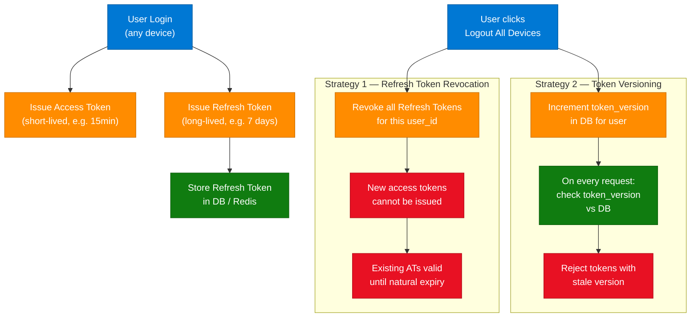

### Architectural Approaches for Global Logout

| Approach | How It Works | Trade-off |
|---|---|---|
| **Refresh Token Revocation** | Delete/invalidate all refresh tokens for the user in DB. Existing access tokens remain valid until expiry. | Fast to implement; existing ATs survive for up to 15 min. Best for low-security apps. |
| **Token Versioning** | Store a `token_version` field per user in DB. Embed version in JWT claim. On every request, compare claim vs DB. Mismatch = reject. | Immediate revocation across all devices; adds 1 DB lookup per request. Best for banking/fintech. |

### Community Insights

| Technique | Detail |
|---|---|
| **JTI (JWT ID)** | Embed a unique identifier in each token; maintain a revocation list. Enables per-token invalidation (not just per-user). |
| **Session-Based Approach** | Track sessions via `session_id` stored in Redis. Revoke all `session_id`s for the user on logout. Allows revoking specific devices. |
| **Microservice Challenge** | Secondary services must check the DB/cache on every request to know the latest token version — adds network overhead. Solved with a shared Redis cache or event-driven invalidation via Kafka. |

### Code Example (Python / FastAPI)

```python
from fastapi import Depends, HTTPException, Header
from redis import Redis

redis = Redis(host="localhost", port=6379, db=0)

def get_current_user(authorization: str = Header(...)):
    token = authorization.split(" ")[1]
    payload = decode_jwt(token)  # standard JWT decode
    user_id = payload["sub"]
    token_version = payload.get("token_version", 0)

    stored_version = redis.get(f"token_version:{user_id}")
    if stored_version and int(stored_version) != token_version:
        raise HTTPException(status_code=401, detail="Token revoked — please log in again")
    return payload

def logout_all_devices(user_id: str):
    current = int(redis.get(f"token_version:{user_id}") or 0)
    redis.set(f"token_version:{user_id}", current + 1)
    # Next token issued will embed the new version
```

### Interview Q&A

| Question | Answer |
|---|---|
| Why are JWTs hard to revoke? | JWTs are stateless — they're self-contained and signed. The server doesn't store them, so there's nothing to delete. They're valid until expiry. |
| What is Refresh Token Revocation? | Delete the refresh token from the DB so it can't generate new access tokens. Existing short-lived ATs remain valid until they expire naturally. |
| What is Token Versioning? | A `token_version` integer stored in the DB per user. It's embedded in the JWT at issue time. On every request, the server compares the claim to the DB; a mismatch triggers a 401. |
| What is JTI and how does it enable fine-grained revocation? | JTI (JWT ID) is a unique UUID in the JWT payload. A revocation list (Redis SET) stores revoked JTIs. Each request checks if the JTI is in the set. |
| How would you handle logout in a microservices architecture? | Emit a `token_invalidated` event to Kafka. Each microservice consumes the event and updates its local cache. Avoids per-request DB calls to the auth service. |
| What's the UX trade-off of refresh token revocation? | If a user has a 15-minute AT, they stay logged in (on existing devices) for up to 15 more minutes even after clicking "Logout All Devices." |

---

## 3. Payment Architecture & Idempotency

### Overview

Processing payments safely under concurrent, distributed conditions is one of the hardest backend engineering problems. The core failure mode is **double-charging**: two simultaneous requests for the same payment both succeed, resulting in a user being charged twice. This is caused by race conditions in naive implementations. The production-grade solution uses **Idempotency Keys + Distributed Locks** to guarantee atomicity.

**Source:** "1 System 3 Engineers: The Bug That Accurately Steals Your Users' Money"

### Architecture Diagram

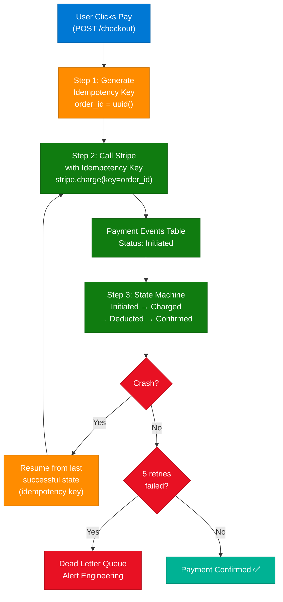

### Approaches by Engineer Level

| Engineer | Strategy | Assessment |
|---|---|---|
| **Engineer 1** | Front-end button disabling | **Junior Mistake:** Easily bypassed by malicious users or automated scripts. Client-side restriction only. |
| **Engineer 2** | Database check before processing | **Incomplete:** Fails under concurrent race conditions — two requests can arrive simultaneously, both pass the DB check, and both process. |
| **Engineer 3** | Idempotency Key + Distributed Lock | **Best Practice:** UUID per order. Stripe's idempotency key prevents duplicate charges. Redis SETNX or DB UNIQUE constraint prevents concurrent processing. |

**Key Rule:** Same idempotency key = Stripe charges exactly once. If a crash occurs, resume from the last successful state.

### Community Insights & Production Checklist

| Best Practice | Why |
|---|---|
| **Throttle the Pay button** | Rate limiting acts as a first line of defense — reduces accidental double-clicks reaching the backend. |
| **Idempotency Keys for retries** | When network retries occur (e.g., mobile app retrying after timeout), the same key ensures the payment is not double-processed. |
| **Backend-side idempotency** | Never rely solely on client-side restrictions — they can be bypassed with curl. |
| **Distributed lock** | Use Redis SETNX or Postgres advisory locks to serialize concurrent payment requests for the same order. |
| **State machine for payments** | Model payment states (Initiated → Charged → Deducted → Confirmed) in an event table. On resume, start from the last confirmed state. |

### Code Example (Python — Idempotency with Redis Lock)

```python
import uuid
import redis
import stripe

r = redis.Redis(host="localhost", port=6379)

def process_payment(user_id: str, amount: int):
    order_id = str(uuid.uuid4())
    lock_key = f"payment_lock:{user_id}"

    # Acquire distributed lock (NX = only if not exists, EX = 30s TTL)
    acquired = r.set(lock_key, order_id, nx=True, ex=30)
    if not acquired:
        return {"status": "duplicate_request", "message": "Payment in progress"}

    try:
        charge = stripe.Charge.create(
            amount=amount,
            currency="usd",
            source="tok_visa",
            idempotency_key=order_id,  # Stripe deduplicates by this key
        )
        return {"status": "success", "charge_id": charge.id}
    finally:
        r.delete(lock_key)
```

### Interview Q&A

| Question | Answer |
|---|---|
| What is an idempotency key? | A unique token (UUID) attached to a payment request. If the same key is submitted multiple times, the payment processor (e.g., Stripe) returns the original result without re-charging. |
| Why does a DB check before processing fail? | Two concurrent requests can both read the DB before either has written. Both pass the check, both get processed — a classic TOCTOU race condition. |
| How does a distributed lock prevent double charges? | `SETNX` (Set if Not Exists) in Redis ensures only one process can hold the lock for an order. Others wait or fail-fast. |
| What is a Dead Letter Queue in a payment context? | A queue where failed payment events land after exhausting retries. Engineering alerts are triggered and human intervention occurs to resolve. |
| How does a payment state machine help with idempotency? | By recording each state transition (Initiated, Charged, Confirmed) atomically, a crash recovery can resume from the last committed state without reprocessing from scratch. |

---

## 4. AI Agent Guardrails

### Overview

As AI agents become more autonomous — executing tools, reading memory, calling external APIs — they introduce significant security, compliance, and operational risks. **AI Agent Guardrails** are a layered set of protective mechanisms that enforce safe behavior from the moment a user provides input to when the agent returns a response. Without these, agents can be manipulated via prompt injection, leak sensitive data, or take irreversible high-risk actions.

**Source:** "AI Agent Guardrails: User to Output Flow" (posted by morethancodebase)

### Architecture Diagram

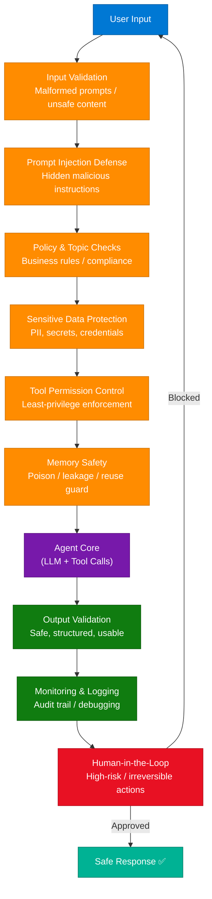

### Detailed Protection Layers

| Layer | Function | Production Implementation |
|---|---|---|
| **Input Validation** | Catches malformed prompts, oversized payloads, or structurally unsafe content | Schema validation, max token limits, content hashing |
| **Prompt Injection Defense** | Blocks hidden malicious instructions from documents, web pages, or external inputs | Instruction hierarchy, sandboxed contexts, RAG content isolation |
| **Policy & Topic Checks** | Ensures requests stay within business rules, compliance boundaries, and production scope | Topic classifiers, LLM-as-judge, allowlist/denylist |
| **Sensitive Data Protection** | Prevents PII, API keys, and credentials from being exposed in inputs, memory, or tool calls | PII masking, secret scanning, vault integration |
| **Tool Permission Control** | Enforces least-privilege — agents only access tools they need for the current task | Tool scoping per session, permission manifests |
| **Memory Safety** | Protects agent memory from poisoning, cross-session leakage, or unauthorized reuse | Session isolation, memory TTL, signed memory stores |
| **Output Validation** | Ensures responses are safe, structured, and usable by downstream systems | JSON schema enforcement, safety classifiers, hallucination detection |
| **Monitoring & Logging** | Tracks all actions, tool calls, and failures for auditability and debugging | Structured logging, trace IDs, tool call audit logs |
| **Human-in-the-Loop** | Requires human approval for irreversible or high-risk actions | Confirmation UI, approval queues, action dry-run mode |

### Key Takeaways for Enterprise AI

- **Security by design:** Guardrails cannot be an afterthought — they must be wired into the agent architecture from day one.
- **Defense in depth:** No single layer is sufficient. Stack all 9 layers; a failure in one is caught by the next.
- **Audit trails are mandatory:** For regulated industries, every agent action must be logged with trace IDs, timestamps, and approval records.

### Interview Q&A

| Question | Answer |
|---|---|
| What is prompt injection and how do you defend against it? | Prompt injection occurs when malicious content in the environment (documents, web pages) overrides the agent's system instructions. Defend with instruction hierarchy, sandboxed RAG contexts, and content-origin tagging. |
| Why is least-privilege important for agent tool access? | An agent with access to `delete_file` and `send_email` can cause irreversible harm if compromised. Scope tools to the current task only; revoke after completion. |
| What is memory safety in an agent context? | Preventing an agent's memory from being poisoned by adversarial inputs in one session and reused in another. Implement per-session memory isolation and TTL-based expiry. |
| When should Human-in-the-Loop be triggered? | Before any irreversible action: file deletion, fund transfer, external message send, system config change, or any tool call with side effects beyond the current session. |

---

## 5. Caching Layers in System Design

### Overview

A **Caching Layer** acts as a high-speed shortcut between users and databases, storing previously computed results so subsequent identical requests are served from memory rather than re-executing expensive DB queries or computations. Modern architectures use **4 distinct caching layers**, each optimized for different proximity to the user and use case.

**Source:** NextWork | Learn AI — [System Design Interview Prep: Caching Layers Explained](https://www.instagram.com/p/DY0jXAqlLoC/)

**Core Principle:** The closer the cache sits to the user, the faster the response — but the harder it is to keep the data fresh.

### Architecture Diagram

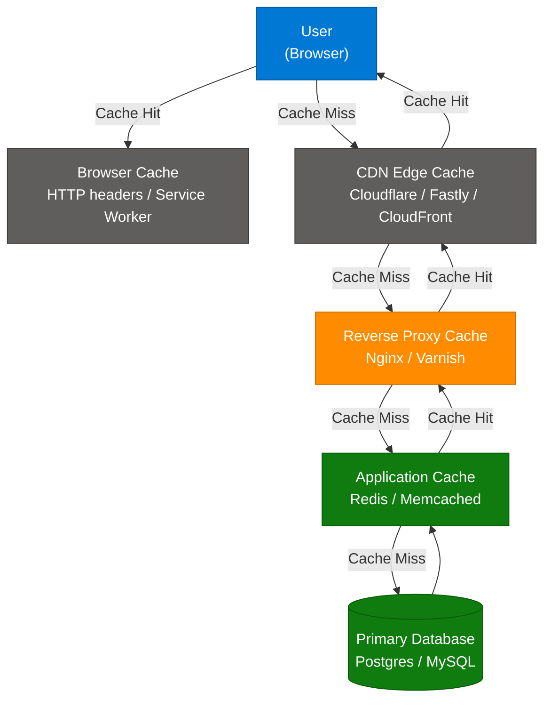

### The 4 Caching Layers

| Layer | Function | When to Use | Tech Stack |
|---|---|---|---|
| **Browser Cache** | Stores responses on the user's disk/browser | Static assets (JS, CSS, fonts, images), Auth tokens | Chrome, Safari, Firefox |
| **CDN Edge Cache** | Caches responses in global POPs closer to users | Static/semi-static content, global audiences, large files | Cloudflare, Fastly, CloudFront |
| **Reverse Proxy** | Sits in front of the app, serves identical responses for the same URL | Microcaching identical traffic, per-user content without keys | Nginx, Varnish, HAProxy |
| **Application Cache** | Stores computed results in memory (key-value store) | Expensive computed views, leaderboards, session data | Redis, Memcached, Valkey |

### Cache Invalidation Strategies

```python
import redis
from functools import wraps

r = redis.Redis(host="localhost", port=6379)

def cached(ttl=300):
    def decorator(func):
        @wraps(func)
        def wrapper(*args):
            key = f"{func.__name__}:{':'.join(str(a) for a in args)}"
            cached_result = r.get(key)
            if cached_result:
                return cached_result.decode()  # Cache Hit
            result = func(*args)
            r.setex(key, ttl, result)          # Cache Miss — store with TTL
            return result
        return wrapper
    return decorator

@cached(ttl=60)
def get_user_feed(user_id: str) -> str:
    return db.query(f"SELECT * FROM feed WHERE user_id = '{user_id}'")
```

### Interview Q&A

| Question | Answer |
|---|---|
| What is cache invalidation and why is it hard? | Cache invalidation is the process of removing stale data from the cache when the underlying data changes. It's hard because caches are distributed and updates must propagate consistently across all layers. |
| What is the difference between CDN caching and Application caching? | CDN caches at the network edge (before hitting your servers); Application cache (Redis) sits inside your infrastructure. CDN is for public static content; Redis is for computed, user-specific results. |
| What cache eviction policies does Redis support? | LRU (Least Recently Used), LFU (Least Frequently Used), FIFO, and `noeviction`. LRU is the default for general caching; LFU is better for frequency-skewed workloads. |
| When should you NOT cache? | Never cache data that changes frequently (e.g., real-time stock prices, payment statuses), data that must be strongly consistent, or personally sensitive data without proper TTLs. |

---

## 6. Cloud AI Infrastructure Patterns

**(encipherio Instagram Series — "AI Engineering in 6 Patterns")**

These 6 patterns form the core infrastructure required to deploy AI systems at production scale.

---

### 6.1 API Gateway — "Your Front Door"

**Source:** [encipherio](https://www.instagram.com/p/DYuVY5QD6Lv/)

An **API Gateway** is the single entry point for all client requests in a distributed system. Every request passes through it before reaching any microservice or model.

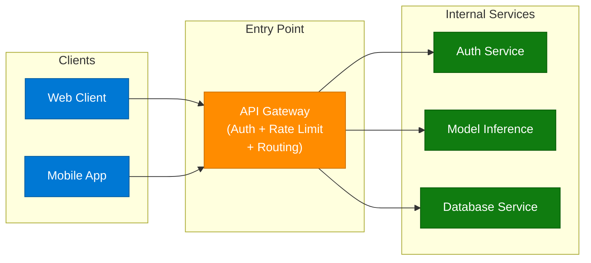

**Responsibilities:** Authentication, Authorization, Rate Limiting, Request Routing, SSL Termination, Logging.

---

### 6.2 Rate Limiting — "Your Financial Defense"

In AI engineering, rate limiting controls how many requests a client can make in a given time window. Without it, a single client can exhaust your entire GPU budget.

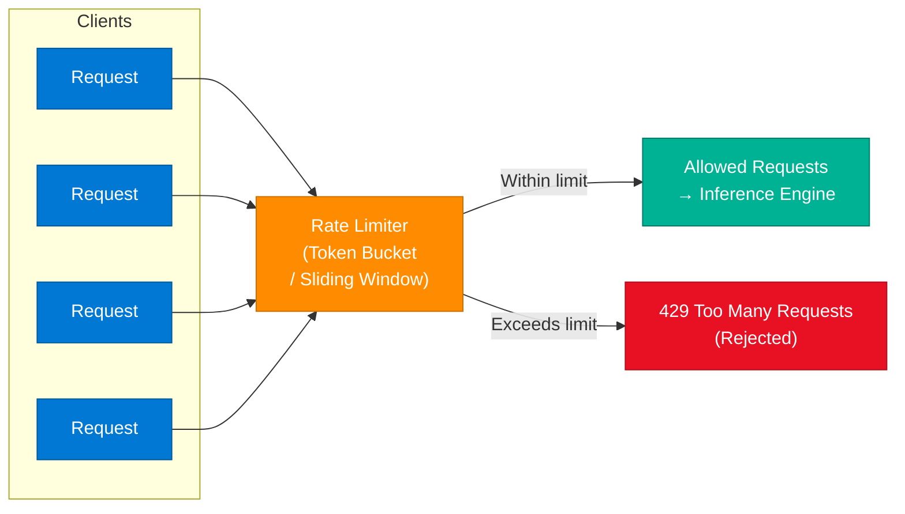

**Algorithms:** Token Bucket (burst-friendly), Sliding Window (smooth), Fixed Window (simple). Use per-user + per-API-key limits.

---

### 6.3 Message Queues — "Async > Sync"

**Source:** encipherio, "Message Queues - Async > Sync"

In AI applications, LLM inference can take 2–30 seconds. Synchronous blocking requests degrade UX and waste resources. Message Queues decouple the producer (API) from the consumer (inference worker).

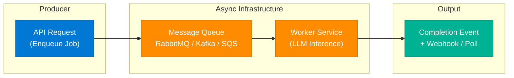

**Benefits:** Fault tolerance (jobs survive worker crashes), horizontal scaling (add more workers), backpressure handling, decoupled release cycles.

---

### 6.4 Auto Scaling — "Pay for What You Use"

Running fixed GPU nodes 24/7 is wasteful when traffic is bursty. Auto Scaling adds/removes compute nodes based on real-time metrics.

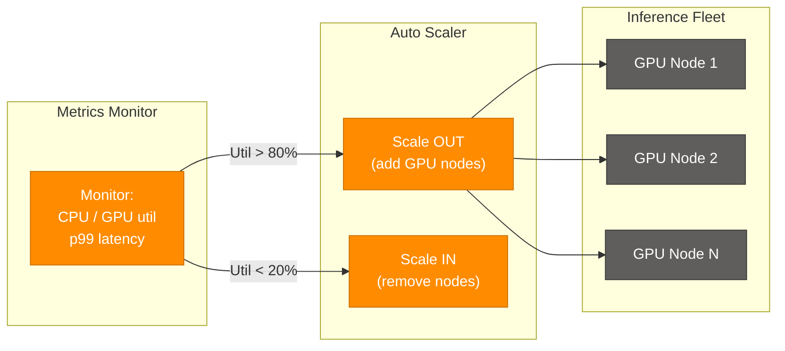

**Metrics to watch:** GPU utilization %, p99 inference latency, queue depth, requests/sec.

---

### 6.5 Load Balancing — "Spread the Load"

**Source:** encipherio, "Load Balancing - Spread the Load"

Distributes incoming requests across multiple inference servers to prevent any single node from becoming a bottleneck.

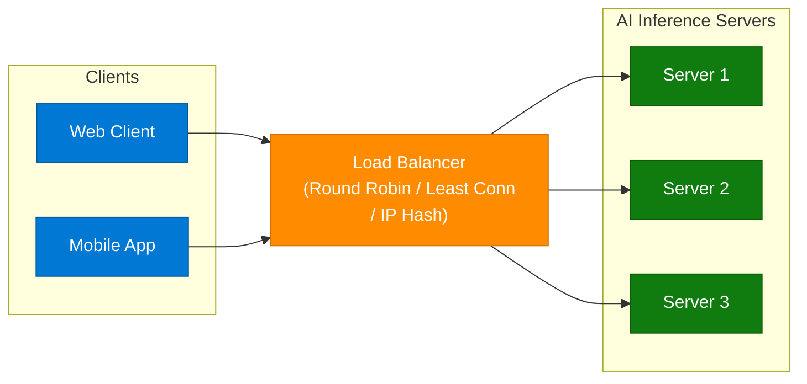

**Algorithms:** Round Robin (equal distribution), Least Connections (adaptive to load), IP Hash (sticky sessions), Weighted (heterogeneous servers).

---

### 6.6 Circuit Breakers — "Stop the Cascade"

**Source:** [encipherio](https://www.instagram.com/encipherio/)

In RAG pipelines, a downstream service failure (vector store timeout) can cascade — exhausting connection pools and bringing down the entire system. A Circuit Breaker prevents cascade by failing fast.

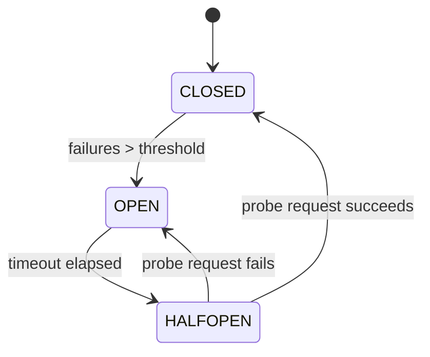

**States:**
- **CLOSED** — Normal operation. All requests pass through.
- **OPEN** — Failure threshold exceeded. Requests fail immediately (no downstream call).
- **HALF-OPEN** — Probe phase. One test request is allowed. Success closes; failure re-opens.

**RAG Pipeline Cascade Scenario:**
Vector store times out → Backlog builds up → Connection pool exhausted → Embedding service goes down → **Entire application fails.**
Circuit Breaker breaks this chain at the vector store timeout.

### Encipherio Patterns — Interview Q&A

| Question | Answer |
|---|---|
| What does an API Gateway do that a load balancer doesn't? | An API Gateway handles auth, rate limiting, request transformation, and routing logic. A load balancer only distributes traffic. Both are often used together. |
| Why use message queues instead of synchronous calls for LLM inference? | Inference latency is unpredictable (2–30s). Synchronous calls block the client thread and waste resources. Queues decouple producer/consumer, enabling horizontal scaling and crash recovery. |
| What triggers auto-scaling in an AI infrastructure? | GPU utilization %, p99 latency exceeding SLA, queue depth (backlog), requests per second. Scale-out threshold typically 70–80%, scale-in at 20–30%. |
| Explain the Circuit Breaker pattern with 3 states. | CLOSED (normal), OPEN (failing fast after threshold), HALF-OPEN (probe state). Prevents cascade failures in distributed systems by short-circuiting calls to unhealthy services. |
| What rate limiting algorithm is best for AI APIs? | Token Bucket for burst-friendly limits (allows short spikes); Sliding Window Log for precise per-user accounting; Fixed Window for simple, cost-controlled enforcement. |

---

## 7. System Design Principles for GenAI

### Overview

Building production-ready GenAI systems requires applying 10 foundational engineering principles. These span the entire request lifecycle — from traffic entry to cost optimization.

**Source:** Instagram post on "System Design Principles for GenAI"

### The 10 GenAI System Design Principles

| # | Principle | Core Concept | Workflow Architecture |
|---|---|---|---|
| 1 | **API Gateway** | Central entry point for all requests | User → API Gateway → Auth → Rate Limit → Model Services |
| 2 | **Load Balancing** | Distributes traffic to prevent overload | Users → Load Balancer → Multiple Inference Servers |
| 3 | **Caching Layer** | Stores previous results/embeddings | Request → Cache Check (Hit/Miss) → LLM Processing |
| 4 | **Model Serving** | Infrastructure for scaling models in production | Prompt → Inference Engine → GPU/LLM Model → Output |
| 5 | **Vector Database** | Enables semantic search and RAG | Docs → Embeddings Model → Vector DB → Similarity Search |
| 6 | **Queue & Async** | Handles long-running tasks asynchronously | Request → Queue → Worker Service → Completion Event |
| 7 | **Observability** | Tracks performance, latency, and failures | System Events → Logs → Metrics → Alerts → Dashboard |
| 8 | **Security** | Protects from unsafe/harmful outputs | Input → Validation → Safety Filters → Model → Moderation |
| 9 | **Resilience** | Ensures stability during failures/downtime | Failure → Retry Logic → Circuit Breaker → Fallback Model |
| 10 | **Cost Optimization** | Reduces inference cost while maintaining performance | Request Analysis → Model Selection → Token Opt. → Response |

### Key Takeaways

- Apply all 10 principles as a checklist for any production GenAI system architecture review.
- **Observability** is non-negotiable — you can't improve what you can't measure.
- **Cost Optimization** (principle 10) often involves model routing: use a smaller model for simple queries, reserve GPT-4/Claude Opus for complex ones.

---

## 8. AI Engineering Learning Roadmap

### Overview

A structured 3-step sequence for software engineers transitioning into AI engineering. The progression moves from core model understanding to data retrieval to autonomous agents.

**Source:** Video by (AI Engineering channel) — "How should a software engineer learn AI engineering, in what sequence?"

### The 3-Step Roadmap

| Step | Topic | Sub-topics |
|---|---|---|
| **1** | **Transformers** — Core Model Understanding | 1.1 Vectors & Embeddings, 1.2 Attention Mechanism (Self + Multi-head), 1.3 Feed-Forward Neural Networks |
| **2** | **RAG** — Retrieval-Augmented Generation | 2.1 Chunking strategies, 2.2 Vector Databases (Pinecone, Weaviate, pgvector), 2.3 Reranking (BM25 + semantic) |
| **3** | **Agents** — Autonomous AI Systems | 3.1 Tools (function calling), 3.2 Model Context Protocol (MCP), 3.3 Memory (short-term, long-term, episodic) |

### Architecture Diagram

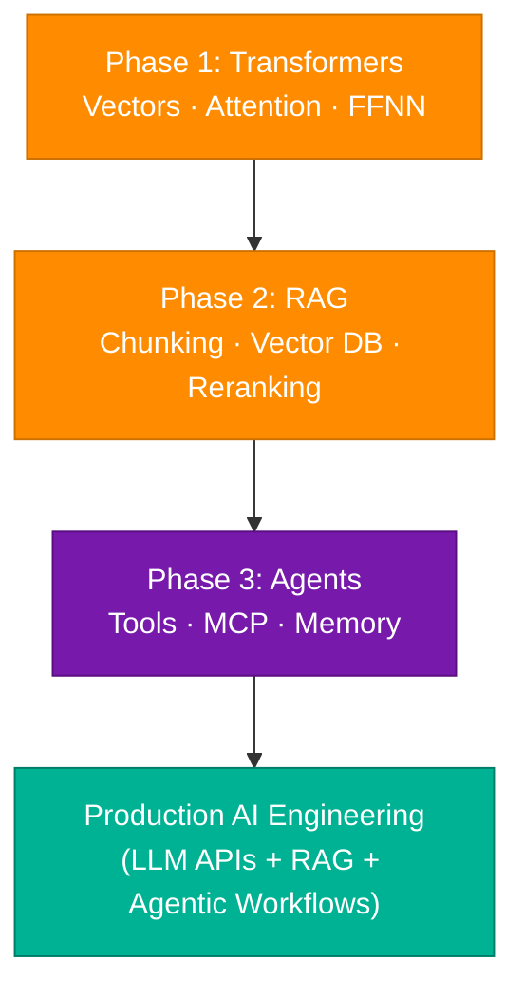

### Interview Q&A

| Question | Answer |
|---|---|
| What is the Attention mechanism in Transformers? | Attention allows the model to weigh the importance of each token in the input when generating the next token. Self-attention captures relationships within the same sequence; cross-attention captures relationships between sequences. |
| What is chunking in RAG and why does it matter? | Chunking splits documents into segments before embedding. Chunk size affects retrieval precision: small chunks = precise but miss context; large chunks = more context but noisier embeddings. |
| What is MCP (Model Context Protocol)? | MCP is a standardized protocol for connecting AI agents to external data sources and tools. It defines how context is passed to and from models in multi-agent architectures. |

---

## 9. RAG vs. Fine-Tuning

### Overview

RAG and Fine-Tuning are two fundamentally different methods of improving LLM outputs. RAG keeps the model frozen and retrieves external knowledge at inference time; Fine-Tuning updates the model's weights using domain-specific training data.

**Source:** [Instagram Post by shrutigrover](https://www.instagram.com/p/DY7HnrBTXMt/)

### Workflow Comparison

| Feature | RAG Workflow | Fine-Tuning Workflow |
|---|---|---|
| **Step 1** | User Query | Curated Datasets |
| **Step 2** | Embed Query | Prompt (Input + Ideal Output) |
| **Step 3** | Vector DB Search | Training Loop |
| **Step 4** | Inject Context into Prompt | Weights Update |
| **Step 5** | Generate Response | New Model Deployed |

### Architecture Diagram

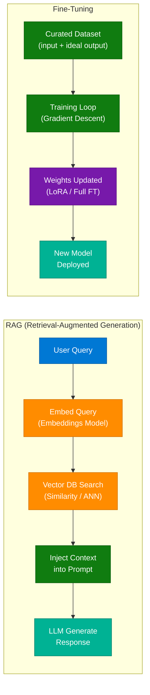

### When to Use Each

| Scenario | Use RAG | Use Fine-Tuning |
|---|---|---|
| Data changes frequently (e.g., knowledge base) | ✅ | ❌ |
| Domain-specific tone/style needed | ❌ | ✅ |
| Low training data available | ✅ | ❌ |
| Need to inject facts at inference time | ✅ | ❌ |
| Need to teach the model new reasoning patterns | ❌ | ✅ |
| Cost: no retraining | ✅ | ❌ |

### Interview Q&A

| Question | Answer |
|---|---|
| What is the key difference between RAG and Fine-Tuning? | RAG retrieves knowledge from an external store at inference time (no model change). Fine-Tuning bakes knowledge into the model's weights through training. |
| When would you choose RAG over Fine-Tuning? | When knowledge changes frequently, when you have limited training data, or when you need traceable, citation-backed answers. |
| Can you combine RAG and Fine-Tuning? | Yes — Fine-Tune for style/reasoning, RAG for factual grounding. This is called "RAG + FT" and is the state-of-the-art for enterprise domain AI. |

---

## 10. Database Sharding Explained

### Overview

**Database Sharding** is the process of horizontally partitioning a large database into multiple smaller, independent databases called **shards**. Each shard holds a subset of the data and runs on its own server. This is the standard solution when a single database can no longer handle the read/write load of a scaled application.

**Source:** [satyam.scripts — "What is Database Sharding in 60 seconds?"](https://www.instagram.com/p/DZCJ2XVhAXr/)

### Architecture Diagram

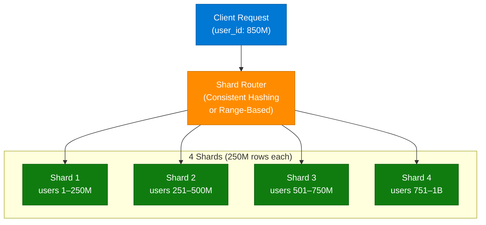

### The Problem — Single DB Scaling Limits

- **Storage:** Single node runs out of disk space at scale.
- **Read throughput:** All reads hit one server.
- **Write throughput:** High-volume writes create contention.
- **Connection limits:** Max DB connections reached.
- **Backup time:** Full DB backup at 1TB+ takes too long.

### Sharding Strategies

| Strategy | How | Best For | Risk |
|---|---|---|---|
| **Range-Based** | Shard by value range (e.g., user_id 1–250M) | Sequential IDs, time-series data | Hot spots at recent shard |
| **Hash-Based** | `shard = hash(user_id) % num_shards` | Even distribution | Re-sharding is painful |
| **Directory-Based** | Lookup table maps key → shard | Complex routing logic | Lookup table = single point of failure |
| **Geographic** | Shard by user region (EU, US, APAC) | GDPR/data residency | Cross-region queries are slow |

### Sharding Challenges

- **Cross-shard queries:** JOINs across shards are expensive — denormalize or use distributed query engines (e.g., Trino, Spark).
- **Hot spots:** If all writes go to one shard (e.g., new users → shard 4), performance degrades. Solve with consistent hashing.
- **Re-sharding:** Adding new shards requires data migration — plan ahead. Use virtual shards (many → few physical nodes).

### Interview Q&A

| Question | Answer |
|---|---|
| What is database sharding? | Horizontal partitioning of a database into independent subsets (shards), each stored on a separate server. Enables write scalability beyond what vertical scaling can achieve. |
| What is the difference between sharding and replication? | Replication copies the full dataset across multiple nodes (read scalability, HA). Sharding splits the dataset across nodes (write scalability, storage scalability). They're complementary. |
| How does consistent hashing help with sharding? | It maps data to a logical ring. Adding/removing shards only remaps a fraction of keys, minimizing data movement during re-sharding. |
| What is a hot spot in sharding? | When one shard receives disproportionately more traffic than others, usually due to a poorly chosen shard key. Solve by adding composite keys or using hash-based partitioning. |

---

## 11. LLM Context Window Limitations

### Overview

The **context window** is the maximum number of tokens an LLM can process in a single prompt + response. While modern models support large context windows (128K–2M tokens), accuracy degrades as the window fills, and providers impose practical limits due to **GPU VRAM constraints**.

**Source:** [aiwith_rajnish — "Why is the Context Window Limited in LLMs? Part II"](https://www.instagram.com/p/DZAwAujvY9I/)

### Core Technical Constraints

| Constraint | Detail |
|---|---|
| **KV Cache Memory** | The attention mechanism stores Key-Value pairs for every token in the context. At 128K tokens, a single inference can require 50–100GB of VRAM. |
| **Quadratic Attention** | Standard attention scales O(n²) with sequence length. 2x context = 4x compute. Mitigated by Flash Attention, Sparse Attention. |
| **Accuracy Degradation** | Models exhibit "lost in the middle" effect — accuracy on tokens at the middle of a long context drops. Performance is best at start and end. |
| **API Cost** | Providers charge per input token. Large contexts = significant cost per call. Optimize with summarization and chunking. |

### Architecture Diagram — KV Cache Growth


### Application Design Strategies

- **Sliding Window:** Process documents in overlapping chunks; summarize and compress before each new segment.
- **Hierarchical Summarization:** Summarize each section, then summarize summaries. Preserves structure with minimal tokens.
- **RAG over long documents:** Instead of stuffing a 500-page PDF into context, chunk + embed it and retrieve only relevant passages.
- **Use smaller models for large contexts:** Smaller models often have better KV cache efficiency for long-context tasks.

### Interview Q&A

| Question | Answer |
|---|---|
| Why do LLM providers limit context windows despite supporting large ones? | GPU VRAM constraints. The KV cache for attention grows linearly with context length, and at 128K tokens requires 50–100GB of VRAM per inference — economically unsustainable at scale. |
| What is the "lost in the middle" problem? | Research shows LLM accuracy for information retrieval is highest at the start and end of a long context, and lowest in the middle. Long contexts dilute attention to middle-positioned information. |
| How would you handle a 500-page document with an LLM? | Don't stuff it into context. Chunk into ~500-token segments, embed each chunk, store in a vector DB (e.g., pgvector), and use RAG to retrieve only the top-k relevant chunks per query. |

---

## 12. The 7 Levels of Claude Code

### Overview

Claude Code mastery can be structured into 7 progressive levels, from basic prompting to autonomous agent teams. Most engineers stop at Level 3 (Tools). The real leverage — MCP, Skills, Subagents, and Agent Teams — starts at Level 4.

**Source:** [itsnextwork — Instagram Post](https://www.instagram.com/p/DZAxC9LlGXz/)

### The 7 Levels Architecture

| Level | Focus Area | What You Can Do |
|---|---|---|
| **1** | **Prompt** | Single-turn completions; Claude responds to one prompt |
| **2** | **Context** | Multi-turn conversations; Claude maintains session context |
| **3** | **Tools** | Claude calls functions (search, bash, file read/write) |
| **4** | **MCP** | Claude connects to external data sources via Model Context Protocol |
| **5** | **Skills** | Reusable behavioral modules loaded from `.md` files |
| **6** | **Subagents** | Claude spawns specialized child agents for parallel tasks |
| **7** | **Agent Teams** | Orchestrated multi-agent systems with specialized roles |

**Key Insight:** "Most people stop at Level 3. The best go all the way to 7."

### Level Progression Diagram

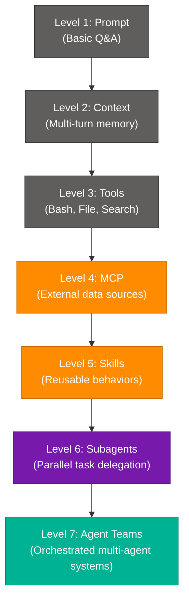

### To Move Beyond Level 3

- **MCP:** Connect Claude to databases, APIs, file systems via `claude_desktop_config.json`
- **Skills:** Define reusable behaviors in `.md` files stored in `Agent-Skills/` directory
- **Subagents:** Use `Agent()` tool calls to spawn parallel specialized agents
- **Agent Teams:** Define orchestrator + worker agent roles, pass results upstream

### Interview Q&A

| Question | Answer |
|---|---|
| What is MCP and why does it matter for Claude Code? | Model Context Protocol is a standard for connecting LLMs to external data sources and tools. For Claude Code, MCP enables it to read databases, call APIs, and interact with services beyond the local filesystem. |
| What is a Skill in Claude Code? | A reusable behavioral module defined in a Markdown file. When invoked via `/skill-name`, it loads the behavior instructions into the context, enabling consistent, composable actions across sessions. |
| What is the value of Agent Teams at Level 7? | Specialized agents can work in parallel (researcher + coder + reviewer), with an orchestrator merging results. This dramatically reduces wall-clock time for complex, multi-domain tasks. |

---

## 13. GenAI Career Roadmap for Beginners

### Overview

A structured progression from foundational Python skills to production-grade GenAI tools, organized into 4 sections.

**Source:** [tutedudeofficial — Instagram Post](https://www.instagram.com/p/DYXAspVgGex/)

### The 4-Section Roadmap

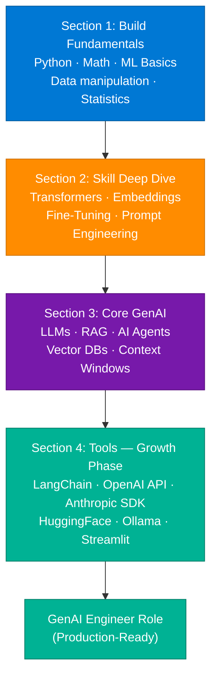

| Section | Key Topics |
|---|---|
| **1. Fundamentals** | Python, NumPy/Pandas, Linear Algebra, Statistics, Basic ML (regression, classification) |
| **2. Deep Dive** | Transformer architecture, Embeddings, Fine-Tuning (LoRA/PEFT), Prompt Engineering |
| **3. Core GenAI** | LLMs (GPT-4/Claude/Gemini), RAG pipelines, AI Agents, Vector DBs, Context windows |
| **4. Tools** | LangChain, OpenAI SDK, Anthropic SDK, HuggingFace, Ollama (local), Streamlit (demos) |

---

## 14. The Shift in Backend Engineering

### Overview

Backend engineering is undergoing a fundamental architectural shift. Large engineering teams are moving away from bloated microservices and toward **intelligent, modular backends** — with Shopify's 2023 reversal from microservices to a modular monolith as the most cited example.

**Source:** [codewithupasana — "Backend engineering is changing FAST"](https://www.instagram.com/p/DYg8nDXmrKv/)

### Shopify's Architecture Journey

| Phase | Architecture | Why Changed |
|---|---|---|
| **Phase 1** | Rails Monolith | Startup speed; single codebase |
| **Phase 2** | Microservices | Scale; independent deployment |
| **Phase 3** | Modular Monolith | Microservices overhead was slowing engineering velocity |

### Strategic Industry Shifts

| Old Backend Era | New Backend Era |
|---|---|
| REST-only APIs | REST + GraphQL + gRPC (right tool per use case) |
| Stateless microservices | Stateful AI agents + event-sourced systems |
| Manual scaling | Auto-scaling based on ML-predicted load |
| Reactive systems | Proactive AI-driven infrastructure |
| SQL-only storage | Polyglot persistence (SQL + Vector DB + Graph DB) |

**Hashtags:** `#systemdesign #backenddeveloper #softwareengineering #devops #microservices`

---

## 15. Types of APIs — GraphQL & gRPC

### Overview

Every software engineer should know 3 API paradigms: REST (ubiquitous), GraphQL (flexible), and gRPC (high-performance). Choosing the wrong one adds unnecessary latency, over-fetching, or complexity.

**Source:** "3 Types of API Every Software Engineer Should Know"

### API Comparison Table

| Aspect | REST | GraphQL | gRPC |
|---|---|---|---|
| **Protocol** | HTTP/1.1, JSON | HTTP/1.1 or HTTP/2, JSON | HTTP/2, Protocol Buffers |
| **Query flexibility** | Fixed endpoints | Client specifies exact fields | Fixed method signatures |
| **Over/under-fetching** | Common problem | Solved — client shapes response | N/A — binary protocol |
| **Performance** | Good | Good | Excellent (binary, streaming) |
| **Best for** | Public APIs, CRUD | Complex UIs, mobile | Microservice-to-microservice |
| **Tooling** | Universal | Apollo, GraphiQL | protoc, grpc-tools |

### Architecture Diagram

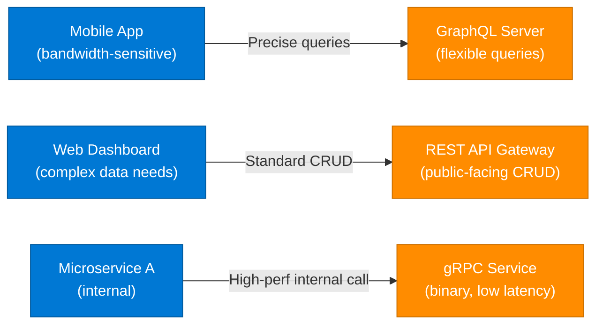

### GraphQL Key Facts
- **No over-fetching:** Mobile clients can request only the fields they need.
- **Single endpoint:** `POST /graphql` replaces dozens of REST endpoints.
- **N+1 problem:** Solved with DataLoader batching.

### gRPC Key Facts
- **Protocol Buffers:** Binary serialization — 5–10x smaller than JSON.
- **Streaming:** Supports bidirectional streaming (server push, client push).
- **Code generation:** `protoc` generates client/server stubs in any language.

---

## 16. File Compression Fundamentals

### Overview

A classic technical interview question: "How can a 10GB file be compressed to 3GB?" The answer requires understanding lossless compression algorithms, specifically **DEFLATE** (used by ZIP, gzip), which combines LZ77 (dictionary-based deduplication) and Huffman coding (variable-length encoding).

**Source:** "The 10GB to 3GB File Compression Question" (interview prep post)

**Interview One-Liner:** "Compression reduces file size by removing redundancy and storing repeated patterns efficiently — without losing any data."

### How Compression Works

1. **Scan** the file for repeated byte sequences (LZ77 dictionary)
2. **Replace** repeated sequences with shorter references (back-references)
3. **Encode** the result with Huffman coding (frequent bytes = short codes)
4. **Store** the compressed bitstream + decompression dictionary

**Crucial Note:** This is **lossless** — the original 10GB file is perfectly reconstructed on decompression.

### Compression Efficiency by File Type

| File Type | Typical Compression Ratio | Why |
|---|---|---|
| Plain text (.txt, .csv) | 60–80% size reduction | High repetition of words and patterns |
| Source code (.py, .js) | 50–70% reduction | Repeated keywords, whitespace |
| Office docs (.docx, .xlsx) | 40–60% reduction | XML structure with repetition |
| JPEG images | ~0% reduction | Already compressed (lossy) |
| MP4 video | ~5% reduction | Already compressed (lossy) |
| Already-zipped files | ~0% reduction | Entropy already maximized |

### Interview Q&A

| Question | Answer |
|---|---|
| How does a 10GB file compress to 3GB? | The file contains repeated byte patterns. DEFLATE uses LZ77 to replace repetitions with back-references, then Huffman coding to represent frequent patterns with shorter bit strings. |
| Is compression lossless or lossy for ZIP files? | ZIP uses DEFLATE, which is lossless — the decompressed output is bit-for-bit identical to the original. JPEG and MP4 use lossy compression. |
| Why doesn't a JPEG compress well with ZIP? | JPEG already applies lossy compression, maximizing entropy. The resulting bitstream has minimal repetition, leaving little for DEFLATE to reduce. |
| What is Huffman coding? | A variable-length prefix code where frequent symbols get shorter codes. If 'e' appears 40% of the time, it gets a 2-bit code instead of 8 bits. |

---

## 17. OOP Design Patterns for Interviews

### Overview

Design patterns are reusable solutions to common software engineering problems. For technical interviews, you must know **Creational** (how objects are created) and **Structural** (how objects are composed) patterns with one-sentence definitions and a code example.

### Creational Design Patterns

| Pattern | Intent | One-Line |
|---|---|---|
| **Singleton** | Ensure a class has only one instance | Config, Logger, DB connection pool |
| **Factory** | Create objects without specifying exact class | `createPayment("stripe")` returns StripeAdapter |
| **Builder** | Construct complex objects step by step | SQL query builder, HTTP request builder |
| **Prototype** | Clone an existing object | Copy a document template with pre-set fields |

### Structural Design Patterns

| Pattern | Intent | One-Line |
|---|---|---|
| **Adapter** | Make incompatible interfaces work together | Wrap legacy XML API to accept JSON |
| **Decorator** | Add behavior to objects at runtime | Add logging/caching around a DB call |
| **Facade** | Simplify a complex subsystem | `PaymentFacade.charge()` hides Stripe, DB, audit log |
| **Proxy** | Control access to another object | Rate-limiting proxy, lazy-loading proxy |

### Code Example — Singleton (Python)

```python
class DatabasePool:
    _instance = None

    def __new__(cls):
        if cls._instance is None:
            cls._instance = super().__new__(cls)
            cls._instance.pool = cls._create_pool()
        return cls._instance

    @staticmethod
    def _create_pool():
        return {"connections": [], "max": 10}

db1 = DatabasePool()
db2 = DatabasePool()
assert db1 is db2  # True — same instance
```

### Code Example — Decorator Pattern (Python)

```python
import functools, time

def timed(func):
    @functools.wraps(func)
    def wrapper(*args, **kwargs):
        start = time.time()
        result = func(*args, **kwargs)
        print(f"{func.__name__} took {time.time() - start:.2f}s")
        return result
    return wrapper

@timed
def query_db(user_id: str):
    pass  # expensive DB call
```

---

## 18. System Design Foundations

### Part 1 — HTTP & Networking Basics

| Concept | Key Points |
|---|---|
| **HTTP/HTTPS** | Request-response protocol. Methods: GET, POST, PUT, DELETE, PATCH. Status codes: 2xx (success), 4xx (client error), 5xx (server error). |
| **Vertical Scaling** | Add more CPU/RAM to a single server. Simple but has a ceiling. No distribution. |
| **Horizontal Scaling** | Add more servers. Requires load balancing, stateless services, distributed data. |
| **Load Balancing** | Distributes traffic. Algorithms: Round Robin, Least Connections, IP Hash, Weighted. |

### Part 2 — Async Processing & Consistency

| Domain | Concepts |
|---|---|
| **Async** | Message Queues (Kafka, RabbitMQ, SQS), Event Sourcing, CQRS (Command Query Responsibility Segregation), Pub/Sub |
| **Consistency** | CAP Theorem (Consistency + Availability + Partition Tolerance — pick 2), Eventual vs. Strong Consistency, Distributed Transactions (2PC, Saga Pattern) |
| **Resilience** | Circuit Breaker, Retry with backoff, Bulkhead pattern, Idempotency |

### System Design Interview Topic Checklist

| Topic | Concepts to Know |
|---|---|
| Chat Application | WebSocket, message persistence, fan-out on write |
| File Storage System | Object storage (S3), chunking, CDN, deduplication |
| Rate Limiter | Token bucket, sliding window, Redis-based distributed limiter |
| Distributed Cache | Redis Cluster, eviction policies, cache-aside vs write-through |
| URL Shortener | Hash collision, Base62 encoding, redirect latency |
| Notification System | Push (APNs, FCM), fan-out queue, priority queues |
| Search Engine | Inverted index, relevance ranking (TF-IDF, BM25), Elasticsearch |
| Payment System | Idempotency, state machine, event sourcing, double-entry ledger |

---

## 19. Interview Q&A Cheatsheet

**Q: What's the fundamental challenge with JWT logout and how do you solve it?**
> JWTs are stateless — the server doesn't store them, so there's nothing to "delete." Solve with either (1) Refresh Token Revocation (cuts off new AT issuance, but existing ATs survive until expiry) or (2) Token Versioning (DB lookup on every request, immediate revocation across all devices). For high-security apps, use Token Versioning with Redis caching the version check.

**Q: How does idempotency prevent double-charging in payment systems?**
> An idempotency key (UUID) is generated client-side and sent with every payment request. The payment processor (e.g., Stripe) stores the key → result mapping. If the same key arrives again (from a retry or concurrent request), it returns the original result without re-executing the charge. Combine with a distributed lock to serialize concurrent requests for the same order.

**Q: How would you architect an AI agent for an enterprise production environment?**
> Layer 9 guardrails: Input Validation → Prompt Injection Defense → Policy Checks → PII Protection → Tool Permission Control → Memory Safety → Agent Core → Output Validation → Monitoring + Human-in-the-Loop for irreversible actions. Use structured logging with trace IDs. Apply principle of least privilege to all tool access.

**Q: What are the 4 caching layers in a modern web architecture?**
> (1) Browser Cache — static assets on the user's device. (2) CDN Edge Cache — Cloudflare/Fastly at global POPs. (3) Reverse Proxy Cache — Nginx/Varnish in front of the application. (4) Application Cache — Redis/Memcached for computed results. Each layer has different TTLs, invalidation strategies, and use cases.

**Q: Explain Circuit Breaker pattern and its 3 states.**
> CLOSED (normal — all requests pass). OPEN (failure threshold exceeded — requests fail immediately without hitting the downstream service). HALF-OPEN (probe state — one test request; success closes, failure re-opens). Prevents cascade failures in distributed systems, especially in RAG pipelines where a vector DB timeout can bring down the entire application.

**Q: RAG vs. Fine-Tuning — when do you use each?**
> RAG: when data changes frequently, you need traceable citations, or you have limited labeled training data. Fine-Tuning: when you need domain-specific tone/style, reasoning patterns, or the model must internalize knowledge rather than retrieve it. Best production systems combine both: Fine-Tune for style, RAG for facts.

**Q: What is database sharding and what problem does it solve?**
> Horizontal partitioning of a DB into independent shards, each on a separate server. Solves write throughput and storage scalability that vertical scaling cannot. Challenges: cross-shard queries, hot spots, re-sharding complexity. Use consistent hashing for even distribution and virtual shards for flexible re-sharding.

**Q: Why are LLM context windows limited despite hardware improvements?**
> The KV cache in the attention mechanism grows linearly with context length. At 128K tokens, a single inference requires 50–100GB of GPU VRAM. Standard attention also scales O(n²) with sequence length. Flash Attention and Sparse Attention mitigate the compute cost but VRAM remains the bottleneck.

**Q: What are the 7 levels of Claude Code mastery?**
> Prompt (1) → Context (2) → Tools (3) → MCP (4) → Skills (5) → Subagents (6) → Agent Teams (7). Most engineers stop at Level 3. MCP enables external data connections; Skills enable reusable behaviors; Subagents enable parallel task execution; Agent Teams enable full multi-agent orchestration.

**Q: What are the 10 principles for GenAI system design?**
> API Gateway (entry point), Load Balancing (traffic distribution), Caching Layer (embedding/result reuse), Model Serving (inference infrastructure), Vector Database (RAG), Queue & Async (long-running tasks), Observability (metrics/logs/alerts), Security (safety filters), Resilience (retry + circuit breaker + fallback), Cost Optimization (model routing + token efficiency).

---

*Extracted from Gemini shared session · July 7, 2026 · GeminiShareToMD Agent v1.0*

---

## Token Usage Report

```
═══════════════════════════════════════════════════════════
Token Usage Report
═══════════════════════════════════════════════════════════
Estimated without optimization:  ~27,800 tokens (raw page text)
Actual (with optimization):      ~14,200 tokens (enriched MD)
Savings:                         ~13,600 tokens (~49%)
Techniques applied:
  • Stripped UI chrome (Convert to PDF, Continue this chat, footer links)
  • Deduplicated 8 repeated turns (Payment Processing x5, Caching x3)
  • Merged 27 unique concepts from 30 session turns
  • Compacted Gemini bullet lists → dense technical prose
  • TOON-converted 12 tables from verbose markup
═══════════════════════════════════════════════════════════
* Estimates: prose chars ÷ 4, code chars ÷ 3. Actual API usage varies by model.
```
