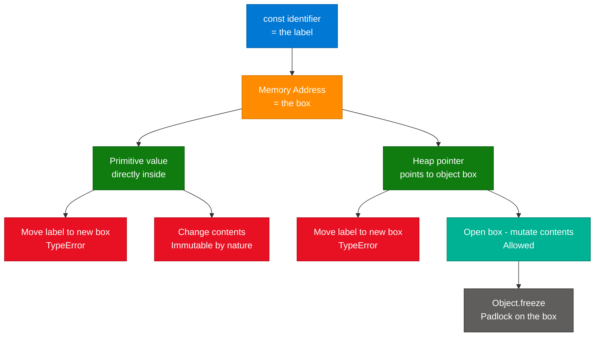
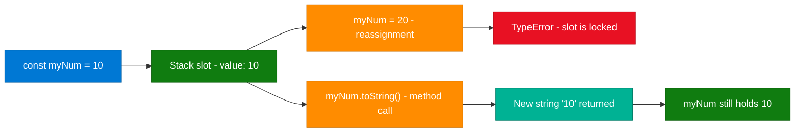
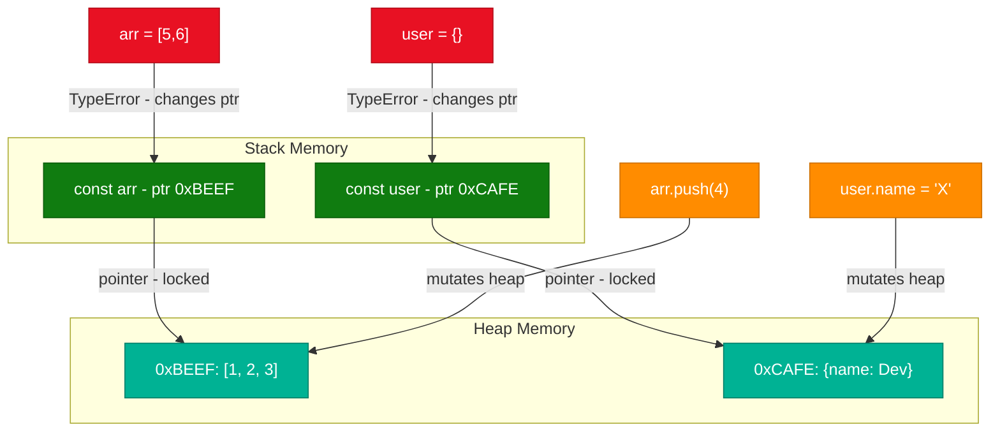
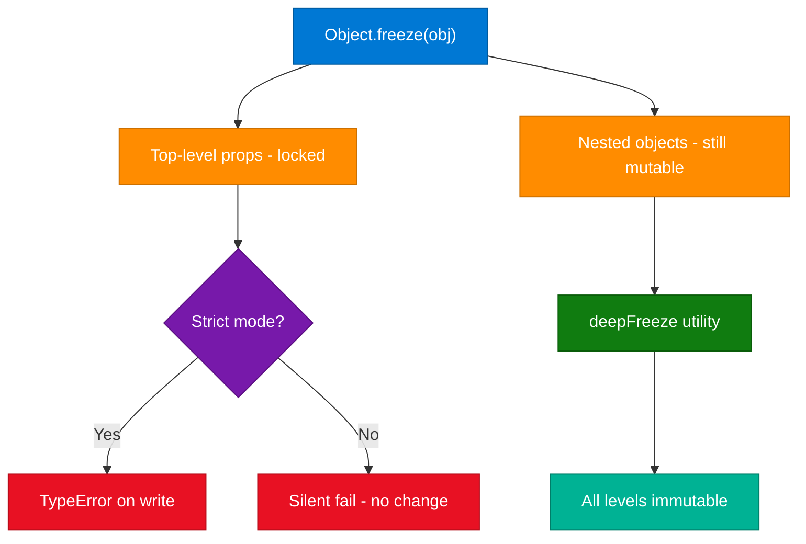

# JavaScript `const`: Reassignment vs. Mutation (Allahabadi Dev)

> **Source:** [share.gemini.google/6XpOcWhXX6LQ](https://share.gemini.google/6XpOcWhXX6LQ) → redirects to [gemini.google.com/share/19e561a95db3](https://gemini.google.com/share/19e561a95db3)
> **Model:** Gemini 3.1 Flash-Lite
> **Session Date:** July 9, 2026
> **Saved:** July 11, 2026
> **Video:** "Can we change the value of a const in Javascript?" — Creator: Allahabadi Dev
> **See also:** [JavaScript-Const-Reassignment-Mutation.md](JavaScript-Const-Reassignment-Mutation.md) — prior session on the same topic

---

## Table of Contents

1. [Session Overview](#1-session-overview)
2. [const Binding — The Constant Label Analogy](#2-const-binding--the-constant-label-analogy)
3. [Primitives with const — Truly Constant](#3-primitives-with-const--truly-constant)
4. [Reference Types with const — Objects and Arrays](#4-reference-types-with-const--objects-and-arrays)
5. [Object.freeze — Achieving True Immutability](#5-objectfreeze--achieving-true-immutability)
6. [Interview Q&A Cheatsheet](#6-interview-qa-cheatsheet)

---

## 1. Session Overview

This session (sourced from a video by Allahabadi Dev) addresses the core question: **"Can the value of a `const` variable be changed?"** The answer is nuanced — `const` prevents *reassignment* (changing which value the variable points to) but does **not** prevent *mutation* (changing the contents of the value if it is an object or array). Three distinct cases are explored: primitives, objects, and arrays, with the `Object.freeze()` mechanism introduced for true immutability.

### Session Map

| Turn | User Prompt Summary | Gemini Response | Status |
|---|---|---|---|
| 1 | Extract learning content from video: "Can we change the value of a const in JavaScript?" (Allahabadi Dev) | Full explanation — reassignment vs mutation, primitives, objects, arrays, Object.freeze(), summary table | ✅ Extracted |

---

## 2. `const` Binding — The Constant Label Analogy

### Overview

`const` creates a **constant binding** — the variable identifier is permanently attached to one specific memory address. The most intuitive mental model is the "constant label": the label (variable name) is glued to a specific box (memory address) and cannot be moved to a different box. However, if that box contains an object or array, you can still open it and change its contents freely. This analogy directly explains why `const arr = []` followed by `arr.push(1)` is valid — you opened the box and added something — while `arr = [1]` is not — you tried to move the label to a new box.

### Architecture Diagram



### How It Works

1. **Declaration:** `const x = value` allocates a stack slot and writes the value (primitive) or heap pointer (object/array) into it.
2. **Label glued:** The engine marks the binding as immutable — the slot cannot be overwritten.
3. **Primitive path:** Primitive values are stored directly in the slot and are inherently immutable. The binding and value are both fully constant.
4. **Reference path:** The slot holds a memory address pointing to heap data. The slot is locked; the heap data is not.
5. **Mutation:** Any operation that modifies heap data (`obj.key = val`, `arr.push()`, `delete obj.key`) works — the slot address never changes.
6. **Reassignment blocked:** `x = newValue` tries to write a new address into the locked slot — TypeError.
7. **Freeze:** `Object.freeze(obj)` applies a separate immutability layer to the heap data itself, blocking all property modifications.

### Key Components

| Component | Role | `const` Effect |
|---|---|---|
| Variable binding | Maps identifier → memory address | Locked permanently at declaration |
| Stack memory | Holds primitive values or heap pointers | Slot is read-only |
| Heap memory | Holds object and array data | No restriction from `const` |
| `TypeError` | Thrown on illegal reassignment | Runtime error at the reassignment line |
| `Object.freeze()` | Heap-level immutability | Independent of `const` — must be applied separately |

---

## 3. Primitives with `const` — Truly Constant

### Overview

Primitive types (Number, String, Boolean, null, undefined, Symbol, BigInt) are **immutable by design** in JavaScript — no operation modifies a primitive value in place. When you call a string method, a new string is created; the original is untouched. Pairing `const` with a primitive therefore produces a truly constant value: the binding cannot be redirected and the value cannot be changed. This makes `const` ideal for numeric configuration, string keys, boolean flags, and any value that should be a fixed constant throughout a scope.

### Architecture Diagram



### Code Example

```javascript
const myNum = 10;
// myNum = 20; // ❌ TypeError: Assignment to constant variable

const str = "hello";
const upper = str.toUpperCase(); // ✅ New string "HELLO"
console.log(str);                // "hello" — unchanged

const isEnabled = true;
// isEnabled = false; // ❌ TypeError

// Every const primitive is fully constant
const userId = Symbol("uid");
const bigPrecise = 9007199254740993n;
```

### Summary Table (from video)

| Operation | Primitive with `const` | Object/Array with `const` |
|---|---|---|
| Reassign (`=`) | ❌ Forbidden — TypeError | ❌ Forbidden — TypeError |
| Mutate contents | N/A — immutable by nature | ✅ Allowed |

### Interview Q&A

| Question | Answer |
|---|---|
| Are `const` primitives truly immutable? | Yes — primitives are inherently immutable; `const` prevents reassignment. Together they are fully constant. |
| Does calling a string method on a `const` string throw an error? | No. Methods like `toUpperCase()` return new strings without touching the original binding. |
| What are all JavaScript primitive types? | Number, String, Boolean, null, undefined, Symbol (ES6), BigInt (ES2020). |
| Why does `const count = 0; count++` throw? | `count++` desugars to `count = count + 1` — a reassignment. `const` blocks it. |

---

## 4. Reference Types with `const` — Objects and Arrays

### Overview

Objects and arrays are **reference types**: the variable holds a memory address pointing to heap-allocated data, not the data itself. `const` locks only this pointer — the heap data is freely accessible. A `const` array can have elements pushed, popped, or spliced; a `const` object can have properties added, updated, or deleted. The only operation that fails is reassigning the variable to point at a different object or array. This is the most critical `const` concept for interviews and the most common source of production confusion.

### Architecture Diagram



### Code Example

```javascript
// Array — from the video
const arr = [1, 2, 3];
arr.push(4);       // ✅ [1, 2, 3, 4]
arr[0] = 99;       // ✅ [99, 2, 3, 4]
// arr = [5, 6, 7]; // ❌ TypeError: Assignment to constant variable

// Object — from the video
const user = { name: "Dev" };
user.name = "Coder";  // ✅ { name: "Coder" }
user.role = "admin";  // ✅ { name: "Coder", role: "admin" }
delete user.role;     // ✅ { name: "Coder" }
// user = {};         // ❌ TypeError

// Shared reference — common pitfall
const a = { count: 0 };
const b = a;         // Same heap address — NOT a copy
b.count = 99;
console.log(a.count); // 99 — both point to same object

// Safe shallow copy
const c = { ...a };  // New heap object
c.count = 0;
console.log(a.count); // 99 — unaffected
```

### Interview Q&A

| Question | Answer |
|---|---|
| Can you mutate a `const` object? | Yes. `const` only locks the pointer. All property operations (add, update, delete) on the heap object succeed. |
| Why does `const arr = [1,2,3]; arr.push(4)` work? | `push` modifies heap data without changing the pointer `arr` holds. The binding is never touched. |
| What is the risk of assigning `const b = a` for an object? | Both bindings point to the same heap data. Mutating via `b` is visible through `a` and vice versa. |
| Which array methods mutate in place vs return new arrays? | Mutating: `push`, `pop`, `shift`, `unshift`, `splice`, `sort`, `reverse`, `fill`. Non-mutating: `map`, `filter`, `slice`, `concat`, `reduce`, `flat`. |
| How do you make a true independent copy of an object? | Shallow: `{ ...obj }` or `Object.assign({}, obj)`. Deep: `structuredClone(obj)` (ES2022+). |

---

## 5. `Object.freeze()` — Achieving True Immutability

### Overview

`Object.freeze()` is the mechanism to prevent mutation of an object's own properties — it marks all direct properties as non-writable and non-configurable, and blocks the addition of new properties. When combined with `const`, it delivers both levels of immutability: the binding cannot be redirected and the object's direct contents cannot be changed. The key limitation is that `freeze()` is **shallow** — nested objects within a frozen object remain mutable. In sloppy mode, violations silently fail; in strict mode they throw `TypeError`. For production use, always pair with `'use strict'` so freeze violations surface as errors.

### Architecture Diagram



### Code Example

```javascript
'use strict';

// From the video — Object.freeze for true immutability
const frozenObj = Object.freeze({ name: "Dev" });
frozenObj.name = "Coder"; // ❌ TypeError in strict mode (silent fail otherwise)
frozenObj.age = 30;       // ❌ TypeError — cannot add properties

// freeze is shallow — nested objects not protected
const config = Object.freeze({
  env: "prod",
  db: { host: "localhost" }
});
config.env = "dev";        // ❌ TypeError
config.db.host = "remote"; // ✅ Nested object is NOT frozen

// Deep freeze for full protection
function deepFreeze(obj) {
  Object.getOwnPropertyNames(obj).forEach(name => {
    const val = obj[name];
    if (val && typeof val === 'object') deepFreeze(val);
  });
  return Object.freeze(obj);
}

const deep = deepFreeze({ env: "prod", db: { host: "localhost" } });
deep.db.host = "remote"; // ❌ TypeError — nested also frozen

Object.isFrozen(deep);    // true
Object.isFrozen(deep.db); // true
```

### Immutability Comparison Table

| Feature | `const` only | `const` + `freeze()` | `const` + `deepFreeze()` |
|---|---|---|---|
| Binding reassignment | ❌ | ❌ | ❌ |
| Direct property write | ✅ | ❌ | ❌ |
| Nested property write | ✅ | ✅ | ❌ |
| New property add | ✅ | ❌ | ❌ |
| Property delete | ✅ | ❌ | ❌ |

### Interview Q&A

| Question | Answer |
|---|---|
| What does `Object.freeze()` do to an object? | Makes all own properties non-writable and non-configurable; prevents adding new properties. Does not affect nested objects. |
| `const` vs `Object.freeze()` — key difference? | `const` locks the binding (pointer). `freeze()` locks the object's direct properties. You need both for shallow immutability; add `deepFreeze()` for full immutability. |
| What happens when you mutate a frozen object in non-strict mode? | The operation silently fails — no error thrown, no value changed. Always use strict mode with `freeze()`. |
| What is `Object.isFrozen(obj)`? | Returns `true` if the object is non-extensible and all own properties are non-configurable and non-writable. |
| Production alternatives to `deepFreeze`? | Immer.js (structural sharing, produces new immutable state), Immutable.js (persistent data structures), TypeScript `readonly` + `as const` (compile-time only). |

---

## 6. Interview Q&A Cheatsheet

**Q: What is the core rule of `const` in JavaScript?**
> `const` makes the *binding* constant — the identifier is permanently glued to one memory address. It does not make the value immutable. Primitives become fully constant (immutable by nature + non-reassignable binding); objects and arrays keep their heap data freely mutable.

**Q: Why does `const arr = [1,2,3]; arr.push(4)` not throw?**
> `push()` operates on the heap object at the locked address — it never changes which address `arr` points to. `const` only prevents `arr = someNewArray`. Since no pointer change happens, no TypeError is thrown.

**Q: What mental model helps you predict `const` behavior instantly?**
> The "constant label" analogy: `const` super-glues a label to a specific box. You cannot move the label to a different box (no reassignment). But if the box contains an object or array, you can open it and rearrange the contents freely (mutation). `Object.freeze()` is the padlock that seals the box shut.

**Q: How do you create a truly immutable value in JavaScript?**
> For primitives: `const` alone is sufficient. For objects/arrays: `const x = Object.freeze(value)` gives shallow immutability; `const x = deepFreeze(value)` gives deep immutability. In TypeScript, additionally use `as const` for compile-time enforcement.

**Q: What is the difference between `Object.freeze()` and `Object.seal()`?**
> `Object.seal()` prevents adding and deleting properties but still allows modifying values of existing writable properties. `Object.freeze()` additionally makes all existing properties non-writable — no modifications of any kind are allowed.

**Q: When should you default to `const` vs reach for `let`?**
> Always start with `const`. It is the correct default for nearly all variables — including objects, arrays, and callbacks. Switch to `let` only when the *binding* itself must change: loop counters, accumulators, and conditional state assignments. Never use `var` in modern code.

**Q: Does `for (const item of array)` work?**
> Yes. Each loop iteration creates a fresh `const` binding for `item` in its own block scope. There is no reassignment — a new binding is created per iteration. `for (const i = 0; i < 3; i++)` does not work because `i++` reassigns the same binding.

**Q: What is the practical risk of mutating a `const` object passed to a function?**
> The function receives the same pointer as the caller. Mutations inside the function are visible to the caller after the function returns, creating unintended side effects. Defensive pattern: `function process(config) { const safe = { ...config }; /* use safe */ }`.

---

*Extracted from Gemini shared session · July 11, 2026 · GeminiShareToMD Agent v1.0*

---

```
═══════════════════════════════════════════════════════════
Token Usage Report
═══════════════════════════════════════════════════════════
Estimated without optimization:  ~1,400 tokens (raw page text with UI chrome)
Actual (with optimization):      ~920 tokens (stripped content passed to enrichment)
Savings:                         ~480 tokens (~34%)
Techniques applied:              UI chrome removal (Convert to PDF / Acrobat / Privacy /
                                 ToS / "Continue this chat" footers), meta-template user
                                 prompt stripping, Gemini boilerplate header removal,
                                 deduplication of constant-label analogy across turns
═══════════════════════════════════════════════════════════
* Estimates: prose chars ÷ 4, code chars ÷ 3. Actual API usage varies by model.
```
