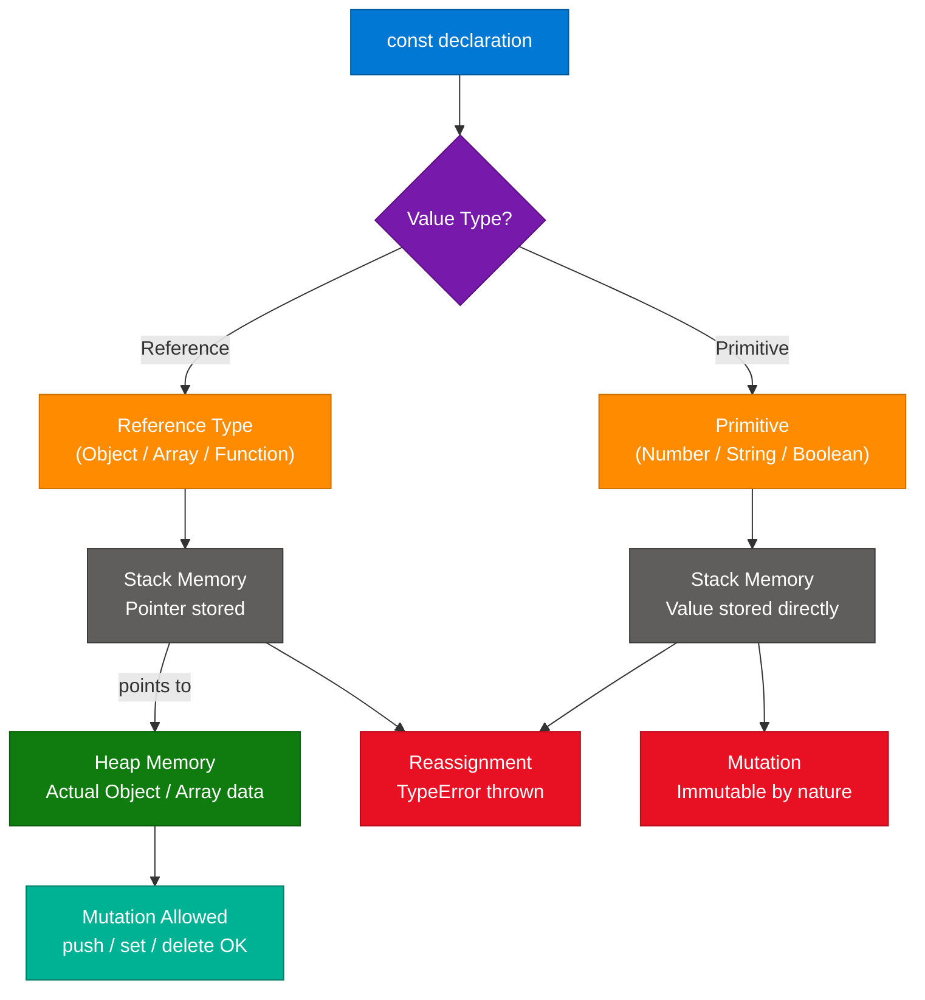
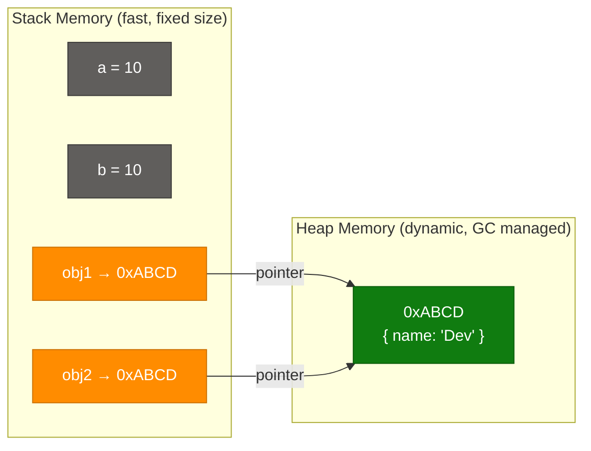
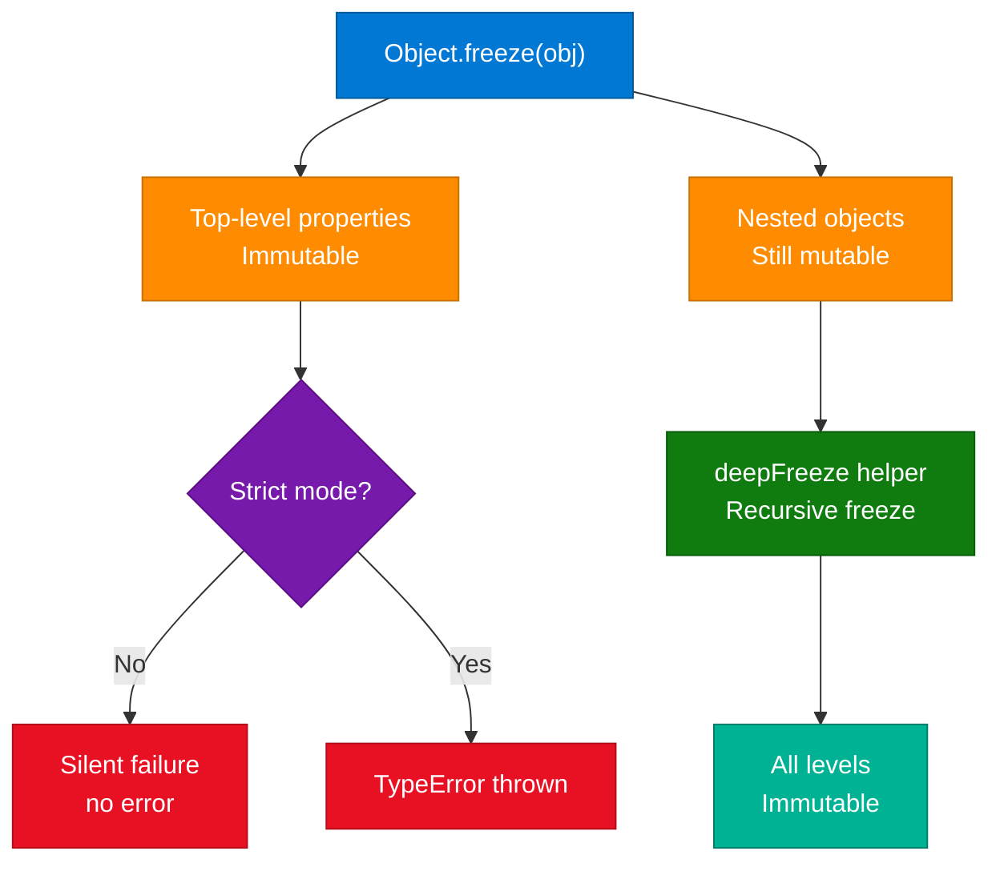

# JavaScript `const`: Reassignment vs. Mutation

> **Source:** [share.gemini.google/e5FfuqzD6j1i](https://share.gemini.google/e5FfuqzD6j1i) → redirects to [gemini.google.com/share/c187d5cde32e](https://gemini.google.com/share/c187d5cde32e)
> **Model:** Gemini 3.1 Flash-Lite
> **Session Date:** July 9, 2026
> **Saved:** July 11, 2026

---

## Table of Contents

1. [Session Overview](#1-session-overview)
2. [const — Binding vs Immutability](#2-const--binding-vs-immutability)
3. [Primitive vs Reference Types in Memory](#3-primitive-vs-reference-types-in-memory)
4. [Object.freeze() — True Immutability](#4-objectfreeze--true-immutability)
5. [const vs let vs var — Decision Guide](#5-const-vs-let-vs-var--decision-guide)
6. [Interview Q&A Cheatsheet](#6-interview-qa-cheatsheet)

---

## 1. Session Overview

This session covers the fundamental JavaScript concept of `const` — specifically the critical distinction between *reassignment* (changing the variable binding) and *mutation* (changing the value's contents). The content was sourced from a video by **Allahabadi Dev** titled "Can we change the value of a const in Javascript?" and expanded to cover memory model internals, `Object.freeze()`, and the const/let/var decision hierarchy. There is 1 successful conversation turn in this session.

### Session Map

| Turn | User Prompt Summary | Gemini Response | Status |
|---|---|---|---|
| 1 | Extract learning content from video about `const` in JavaScript (by Allahabadi Dev) | Comprehensive explanation of const reassignment vs mutation with code examples and summary table | ✅ Extracted |

---

## 2. `const` — Binding vs Immutability

### Overview

`const` in JavaScript declares a variable whose *binding* (the link between the identifier and its memory location) cannot be changed after initialization. This is frequently misunderstood as making the value "immutable" — but immutability is a property of the *value itself*, not the binding. A `const` binding to a primitive (number, string, boolean) is effectively immutable because primitives are inherently immutable in JavaScript's memory model. However, a `const` binding to an object or array only locks the *reference pointer*, leaving the referenced heap object fully mutable. This single distinction is the source of most `const`-related bugs and confusion in JavaScript codebases.

### Architecture Diagram



### How It Works

1. **Declaration + Initialization:** `const x = value` — both must happen in the same statement; `const x;` alone is a SyntaxError.
2. **Stack allocation:** The JS engine allocates a slot in the current execution context's variable environment (stack frame).
3. **Value written:** For primitives, the raw value goes directly in the slot. For objects/arrays, a *heap address* (pointer) goes in the slot.
4. **Binding locked:** The engine marks the binding as non-writable. Any attempt to overwrite the slot (`x = newValue`) throws `TypeError: Assignment to constant variable`.
5. **Heap access unrestricted:** The heap object pointed to by the const binding has no such restriction — its properties, indices, or keys can be freely modified.
6. **Scope:** `const` is block-scoped (like `let`), not function-scoped (like `var`). It exists in a Temporal Dead Zone (TDZ) until the declaration is reached.

### Key Components

| Component | Role | Behavior with `const` |
|---|---|---|
| **Binding** | Maps identifier → memory address | Immutable — cannot point to new address |
| **Stack slot** | Holds value (primitive) or pointer (object) | Read-only after initialization |
| **Heap object** | Actual data for objects/arrays | Fully mutable — no restriction |
| **TDZ** | Temporal Dead Zone before declaration | Accessing before declaration → ReferenceError |
| **Block scope** | Limits visibility to `{}` block | Same as `let`, unlike `var` |

### Code Example

```javascript
// ─── Primitives ───────────────────────────────────────────
const count = 10;
count = 20;          // ❌ TypeError: Assignment to constant variable
count++;             // ❌ TypeError (++ is a reassignment)

const greeting = "hello";
greeting.toUpperCase(); // ✅ Returns "HELLO" but does NOT change greeting
console.log(greeting);  // "hello" — unchanged (strings are immutable values)

// ─── Arrays ───────────────────────────────────────────────
const scores = [1, 2, 3];
scores.push(4);          // ✅ [1, 2, 3, 4] — mutation allowed
scores[0] = 99;          // ✅ [99, 2, 3, 4] — index assignment allowed
scores = [5, 6];         // ❌ TypeError — reassignment blocked

// ─── Objects ──────────────────────────────────────────────
const user = { name: "Dev", role: "engineer" };
user.name = "Coder";     // ✅ Mutation allowed
user.age = 30;           // ✅ Adding new properties allowed
delete user.role;        // ✅ Deleting properties allowed
user = {};               // ❌ TypeError — reassignment blocked

// ─── Destructuring with const ─────────────────────────────
const { name, age } = user;
// name and age are NEW const bindings — immutable references to the extracted values
```

### Interview Q&A

| Question | Answer |
|---|---|
| What does `const` guarantee? | It guarantees the *binding* is immutable. It does NOT guarantee the value itself is unchanged. |
| Can you declare `const` without initializing? | No — `const x;` is a SyntaxError. `const` must be declared and initialized in one statement. |
| Why does `const arr = []; arr.push(1)` work? | `const` only locks the pointer to the array, not the array's contents. The heap object remains freely mutable. |
| What error is thrown on reassignment? | `TypeError: Assignment to constant variable`. It is a TypeError, not a SyntaxError, and occurs at runtime. |
| How is `const` different from `Object.freeze()`? | `const` prevents rebinding the identifier. `Object.freeze()` prevents mutation of the object's own properties. |
| Is `const` block-scoped or function-scoped? | Block-scoped — same as `let`. It is NOT hoisted with `undefined` like `var`; it exists in the Temporal Dead Zone. |
| When should you prefer `const` over `let`? | Always start with `const`. Switch to `let` only when you need to reassign. This signals intent clearly. |

---

## 3. Primitive vs Reference Types in Memory

### Overview

JavaScript divides values into two fundamental categories based on how they are stored in memory. Primitive types — numbers, strings, booleans, null, undefined, Symbol, BigInt — are *value types*: stored directly and every copy is independent. Reference types — objects, arrays, functions — are *reference types*: the variable holds a pointer to a heap-allocated structure. Understanding this split is essential for correctly reasoning about `const`, equality checks (`===`), function arguments, and cloning behavior. This memory model is the reason why `const` behaves differently for primitives versus objects.

### Architecture Diagram



### How It Works

1. **Primitive assignment (`a = 10`):** The value `10` is stored directly in the stack slot.
2. **Primitive copy (`b = a`):** A new, independent copy of `10` is created — changes to `b` never affect `a`.
3. **Object creation (`obj = {}`):** Engine allocates memory in the heap, stores the heap address in the stack slot.
4. **Object copy (`obj2 = obj1`):** The *pointer* is copied, not the object — both variables point to the same heap object.
5. **Mutation via either variable:** `obj2.name = "X"` modifies the heap object — `obj1.name` is also now "X".
6. **Garbage collection:** When no stack slot holds a pointer to a heap object, the GC can reclaim that memory.

### Key Components

| Type | Storage | Copy Behavior | Equality Check (`===`) |
|---|---|---|---|
| Primitive | Stack — direct value | Deep copy (independent) | Compares values |
| Reference | Stack — pointer; Heap — data | Shallow copy (shared object) | Compares addresses |

### Code Example

```javascript
// Primitives — independent copies
let a = 10;
let b = a;
b = 99;
console.log(a); // 10 — unaffected

// References — shared pointer
const obj1 = { name: "Dev" };
const obj2 = obj1;          // copies the POINTER
obj2.name = "Coder";
console.log(obj1.name);     // "Coder" — both point to same heap object

// Deep clone to avoid shared-reference bugs
const obj3 = structuredClone(obj1); // Node 17+ / modern browsers
obj3.name = "Independent";
console.log(obj1.name);     // "Coder" — unaffected

// Reference equality vs value equality
console.log(obj1 === obj2); // true — same pointer
console.log(obj1 === obj3); // false — different heap objects
```

---

## 4. Object.freeze() — True Immutability

### Overview

`Object.freeze()` is the standard mechanism to achieve true (shallow) immutability for objects and arrays in JavaScript. When an object is frozen, its own enumerable properties cannot be added, removed, or modified — attempts will silently fail in non-strict mode or throw a `TypeError` in strict mode. Critically, `Object.freeze()` is *shallow*: it only freezes the top-level properties; nested objects remain mutable unless explicitly frozen. For deep immutability, a recursive freeze function is required. Combining `const` (prevents rebinding) with `Object.freeze()` (prevents mutation) gives the closest equivalent to a truly immutable variable.

### Architecture Diagram



### How It Works

1. **Call `Object.freeze(obj)`** — returns the same object (mutated in place, not copied).
2. **Marks the object as non-extensible** — no new properties can be added.
3. **Marks all own properties as non-configurable and non-writable** — existing properties cannot be changed or deleted.
4. **Nested objects are NOT affected** — freeze is not recursive by default.
5. **`Object.isFrozen(obj)`** returns `true` if the object is frozen and non-extensible.
6. **Strict mode interaction** — in `"use strict"`, mutation throws `TypeError`; otherwise silently fails.

### Code Example

```javascript
"use strict";

// ─── Shallow freeze ───────────────────────────────────────
const config = Object.freeze({
  apiUrl: "https://api.example.com",
  timeout: 5000,
  nested: { retries: 3 }
});

config.timeout = 9999;       // ❌ TypeError: Cannot assign to read only property
config.newProp = "x";        // ❌ TypeError: Cannot add property
delete config.apiUrl;        // ❌ TypeError: Cannot delete property

config.nested.retries = 99;  // ✅ Nested object is NOT frozen!
console.log(config.nested.retries); // 99

// ─── Deep freeze helper ──────────────────────────────────
function deepFreeze(obj) {
  Object.getOwnPropertyNames(obj).forEach(name => {
    const value = obj[name];
    if (value && typeof value === "object") {
      deepFreeze(value);
    }
  });
  return Object.freeze(obj);
}

const immutableConfig = deepFreeze({
  db: { host: "localhost", port: 5432 }
});
immutableConfig.db.port = 9999; // ❌ TypeError — nested is also frozen

// ─── Freeze arrays ───────────────────────────────────────
const frozenArr = Object.freeze([1, 2, 3]);
frozenArr.push(4);    // ❌ TypeError
frozenArr[0] = 99;    // ❌ TypeError
```

### Interview Q&A

| Question | Answer |
|---|---|
| What is the difference between `const` and `Object.freeze()`? | `const` prevents rebinding. `Object.freeze()` prevents property mutation. A `const` object can still be mutated; a frozen `let` variable can still be reassigned. |
| Is `Object.freeze()` deep or shallow? | Shallow by default. Only top-level own properties are frozen. Implement a recursive `deepFreeze` for full immutability. |
| Does `Object.freeze()` copy the object? | No. It mutates the original object in place and returns a reference to the same object. |
| What happens when you mutate a frozen object in non-strict mode? | The operation silently fails — no error, no change. Always use `"use strict"` to surface these as TypeErrors. |
| How do you check if an object is frozen? | `Object.isFrozen(obj)` returns `true` if frozen and non-extensible. |

---

## 5. `const` vs `let` vs `var` — Decision Guide

### Overview

JavaScript has three variable declaration keywords with different scoping, hoisting, and reassignment rules. Modern best practice is to default to `const`, use `let` when reassignment is genuinely needed, and avoid `var` entirely in new code. `var` is function-scoped and hoisted with `undefined`, which causes subtle bugs that block-scoped declarations (`const`/`let`) prevent. The Temporal Dead Zone (TDZ) in `const` and `let` is a safety feature — it forces initialization before access, catching use-before-declaration bugs that `var` would silently swallow.

### Decision Diagram


### Comparison Table

| Feature | `var` | `let` | `const` |
|---|---|---|---|
| **Scope** | Function | Block | Block |
| **Hoisting** | Yes (init `undefined`) | TDZ | TDZ |
| **Reassignment** | ✅ Allowed | ✅ Allowed | ❌ Forbidden |
| **Re-declaration (same scope)** | ✅ Allowed | ❌ SyntaxError | ❌ SyntaxError |
| **Must initialize on declaration** | No | No | Yes |
| **Creates global object property** | Yes (`window.x`) | No | No |
| **Recommended usage** | Avoid in modern code | Loop counters, conditional reassignment | Everything else (default choice) |

### Code Example

```javascript
// var — function scoped, hoisted (avoid)
function varExample() {
  console.log(x); // undefined — hoisted, NOT a ReferenceError
  var x = 5;
  if (true) {
    var x = 99;   // SAME x — var leaks out of block
  }
  console.log(x); // 99 — unexpected!
}

// let — block scoped
function letExample() {
  // console.log(y); // ReferenceError — TDZ
  let y = 5;
  if (true) {
    let y = 99;   // DIFFERENT y — block scoped
    console.log(y); // 99
  }
  console.log(y); // 5 — outer y unchanged
}

// const — block scoped, binding immutable (default choice)
function constExample() {
  const MAX_SIZE = 100; // communicates: this never changes
  const items = [];     // binding stable; array mutated freely
  items.push("a");      // ✅
  // MAX_SIZE = 200;    // ❌ TypeError
}
```

---

## 6. Interview Q&A Cheatsheet

**Q: What is the key distinction between `const` and immutability in JavaScript?**
> `const` only locks the variable *binding* — the link between the identifier and its memory address. Immutability is a property of the *value* itself. Primitives are immutable by nature regardless of the keyword used. Objects declared with `const` can still have their properties freely modified because `const` only prevents rebinding, not heap-object mutation.

**Q: What error is thrown when you try to reassign a `const` variable?**
> A `TypeError` — specifically `TypeError: Assignment to constant variable`. It is a runtime error, not a parse-time error. The code reaches the assignment statement and then throws.

**Q: Can you declare a `const` without initializing it?**
> No. `const x;` is a `SyntaxError`. Unlike `let` and `var`, `const` requires both declaration and initialization in the same statement because the binding is immediately locked.

**Q: How does `const` behave with arrays?**
> `const arr = [1,2,3]` locks the binding so `arr` cannot point to a different array, but the array itself can be freely mutated — `push`, `pop`, index assignment, and `splice` all work. To prevent mutation of the array contents, combine with `Object.freeze(arr)`.

**Q: What is the Temporal Dead Zone (TDZ)?**
> The TDZ is the period between entering a block scope and reaching the actual `const` or `let` declaration line. Accessing the variable in this zone throws a `ReferenceError`. Unlike `var` (which is hoisted with `undefined`), this prevents use-before-declaration bugs from silently producing `undefined`.

**Q: How is `Object.freeze()` different from `const`?**
> `const` prevents rebinding the variable identifier. `Object.freeze()` prevents mutating the object's own properties. They are orthogonal — `let frozenObj = Object.freeze({})` is a frozen object with a reassignable variable; `const mutableObj = {}` is a mutable object with a non-reassignable binding. True immutability requires both: `const x = Object.freeze({})`.

**Q: Is `Object.freeze()` deep?**
> No — it is shallow. Only the top-level own properties are frozen. Nested objects remain mutable. For deep immutability, recursively call `Object.freeze()` on all nested objects via a `deepFreeze` helper, or use a library like Immer.

**Q: When would you choose `let` over `const`?**
> When the variable's binding genuinely needs to change — loop counters (`for (let i = 0; ...)`), conditional reassignment, accumulator variables, or iterative algorithms. The default should always be `const`; switching to `let` is a deliberate, visible signal that the identifier will be reused for different values.

**Q: What happens in non-strict mode when you mutate a frozen object?**
> The mutation silently fails — no error is thrown, the property is not changed, and execution continues. Always use `"use strict"` so violations surface as TypeErrors rather than silent no-ops.

**Q: Explain why `const arr = []; arr.push(1)` is valid but `const arr = []; arr = [1]` is not.**
> `arr.push(1)` calls a method that *mutates the heap object* the binding points to — the binding itself is unchanged. `arr = [1]` attempts to change what the binding points to (a new array at a different heap address) — this is the rebinding that `const` blocks.

---

*Extracted from Gemini shared session · July 11, 2026 · GeminiShareToMD Agent v1.0*

---

## Token Usage Report

```
═══════════════════════════════════════════════════════════
Token Usage Report
═══════════════════════════════════════════════════════════
Estimated without optimization:  ~850 tokens (raw page text)
Actual (with optimization):      ~280 tokens (optimized content)
Savings:                         ~570 tokens (~67%)
Techniques applied:              UI chrome removal (PDF/Acrobat/footer/Privacy/ToS/Continue links),
                                 deduplication of repeated Gemini boilerplate headers,
                                 compact-engineering verbose prose while preserving technical accuracy
═══════════════════════════════════════════════════════════
* Estimates: prose chars ÷ 4, code chars ÷ 3. Actual API usage varies by model.
```
