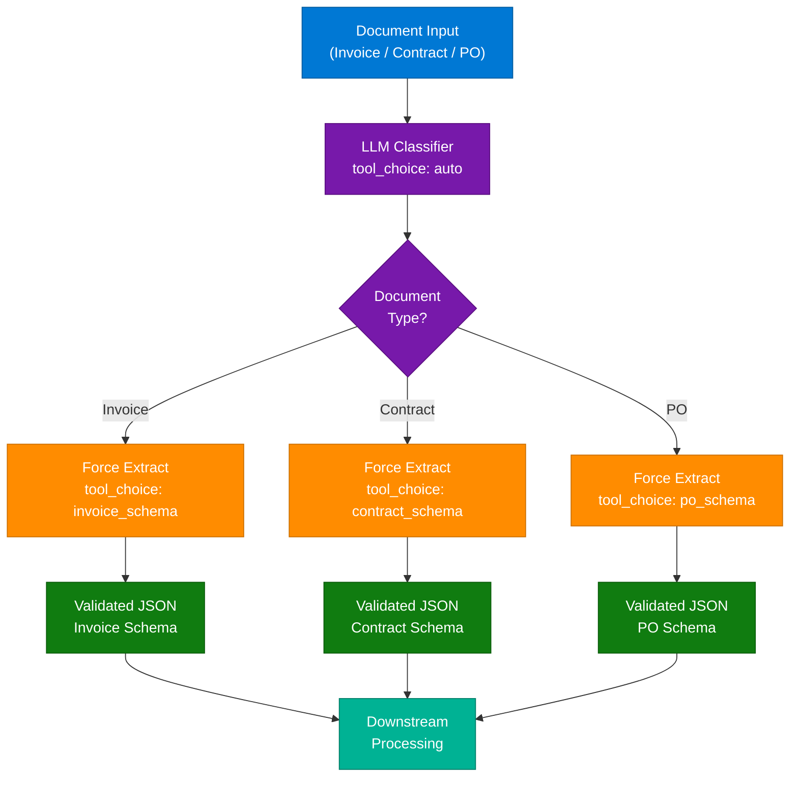
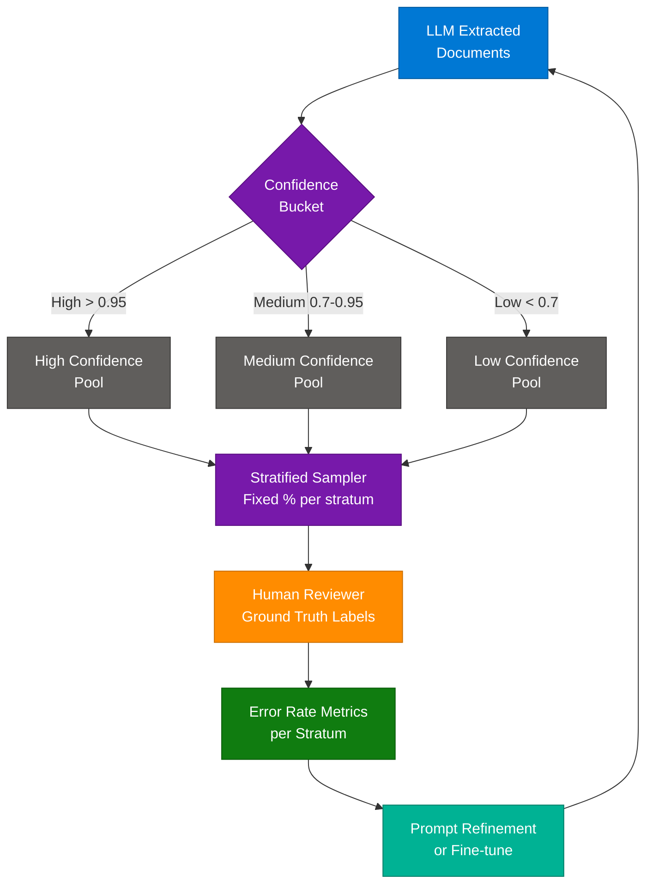
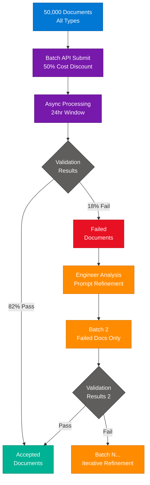
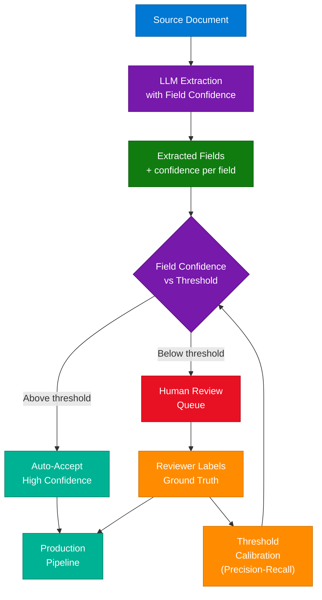
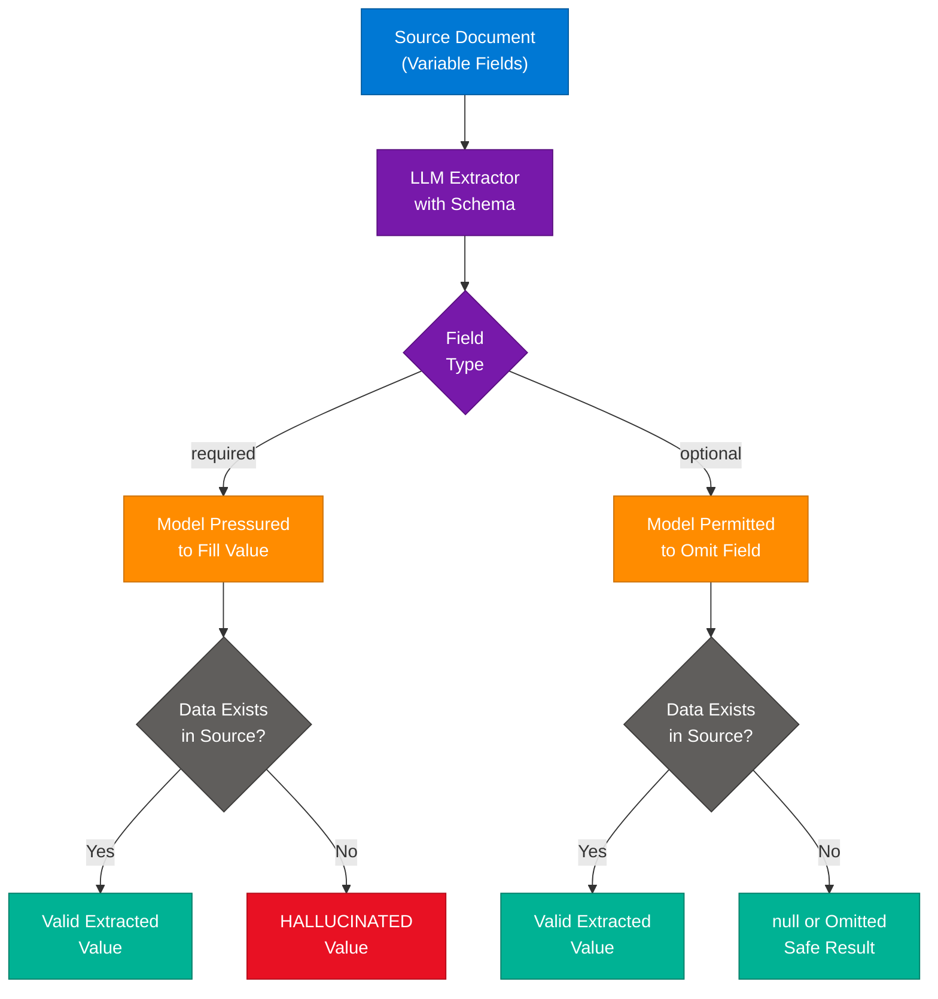

# LLM Structured Output Engineering — Extraction Patterns

> **Source:** [share.gemini.google/vFtAtn9cLa6B](https://share.gemini.google/vFtAtn9cLa6B) → redirects to [gemini.google.com/share/48069f124b16](https://gemini.google.com/share/48069f124b16)
> **Model:** Gemini 3.5 Flash
> **Session Date:** April 13, 2026 at 11:19 PM
> **Saved:** July 12, 2026

---

## Table of Contents

1. [Session Overview](#1-session-overview)
2. [Two-Step Pipeline — Classify then Force Extract](#2-two-step-pipeline--classify-then-force-extract)
3. [Stratified Random Sampling for HITL Quality Monitoring](#3-stratified-random-sampling-for-hitl-quality-monitoring)
4. [Batch API for Large-Scale Document Processing](#4-batch-api-for-large-scale-document-processing)
5. [Field-Level Confidence Scores for Semantic Error Routing](#5-field-level-confidence-scores-for-semantic-error-routing)
6. [Optional Schema Fields to Prevent Hallucination](#6-optional-schema-fields-to-prevent-hallucination)
7. [Interview Q&A Cheatsheet](#7-interview-qa-cheatsheet)

---

## 1. Session Overview

This session covers five production-grade exam questions on LLM structured output engineering, spanning schema design, quality control, cost optimization, and error routing for document extraction pipelines. All five turns are user answer submissions ("Ans") where Gemini explains the correct answer and why competing options fail. No error turns occurred — all five responses were fully extracted.

### Session Map

| Turn | User Prompt Summary | Gemini Response | Status |
|---|---|---|---|
| 1 | Guaranteed structured output across multiple document types | Correct: C — Preliminary classification + forced tool_choice | ✅ Extracted |
| 2 | Measuring whether extraction improvements reduce error rate over time | Correct: B — Stratified random sampling of high-confidence extractions | ✅ Extracted |
| 3 | Cost-efficient processing of 50,000 documents in 2-week deadline | Correct: D — Batch API for all docs, iterative batches for failures | ✅ Extracted |
| 4 | Allocating 20% reviewer attention for semantic errors passing schema validation | Correct: B — Field-level confidence scores + calibrated thresholds | ✅ Extracted |
| 5 | Schema design change to address hallucination from missing fields | Correct: C — Change required fields to optional | ✅ Extracted |

---

## 2. Two-Step Pipeline — Classify then Force Extract

### Overview

When building a multi-document-type extraction pipeline, `tool_choice: "auto"` is unreliable because the LLM decides at inference time whether to call a tool or respond with conversational text. The two-step pattern fixes this by separating concerns: a lightweight **classification call** identifies the document type first, then a second call uses `tool_choice: {"type": "tool", "name": "..."}` to **force** the model into the schema-specific extraction tool. This eliminates conversational "chatter" that causes downstream JSON parsing failures. The pattern is the standard design for high-reliability LLM extraction systems; it adds one API call per document but guarantees schema compliance on every run.

### Architecture Diagram



### How It Works

1. **Receive document** — raw text (PDF extracted, OCR output, or plain text) enters the pipeline.
2. **Classification call** — send document snippet (first 500 chars is usually sufficient) to LLM with `tool_choice: "auto"` and ask for a single-word classification label.
3. **Route by type** — the label determines which extraction tool name to use in step 4.
4. **Forced extraction call** — send full document with `tool_choice: {"type": "tool", "name": "<schema_name>"}`. The model is **mathematically required** to output the tool's JSON schema.
5. **Parse tool_use block** — extract `tool_use.input` from the response. No regex or JSON parsing of free text needed.
6. **Schema validation** — run JSON Schema validation on the extracted dict as a final safety net.
7. **Route to downstream** — pass validated dict to storage, ERP system, or further enrichment.

### Key Components

| Component | Role | Technology Options |
|---|---|---|
| Classifier LLM | Cheap, fast first call to label document type | Smaller/faster model (Haiku, Flash-Lite) |
| Extraction Tool Definitions | Per-type JSON schemas defining fields and types | Anthropic tool use, OpenAI function calling |
| `tool_choice: forced` | Guarantees tool use, eliminates free-text fallback | `{"type": "tool", "name": "..."}` in Anthropic API |
| Schema Validator | Post-extraction JSON Schema check | `jsonschema` (Python), Zod (TS), FluentValidation (.NET) |
| Routing Layer | Maps classifier output to tool name string | Simple dict lookup or match statement |

### Code Example

```python
import anthropic
from typing import Literal

client = anthropic.Anthropic()

invoice_tool = {
    "name": "extract_invoice",
    "description": "Extract structured data from an invoice document",
    "input_schema": {
        "type": "object",
        "properties": {
            "invoice_number": {"type": "string"},
            "vendor_name": {"type": "string"},
            "total_amount": {"type": "number"},
            "line_items": {"type": "array", "items": {"type": "object"}}
        },
        "required": ["invoice_number", "vendor_name", "total_amount"]
    }
}

contract_tool = {
    "name": "extract_contract",
    "description": "Extract structured data from a contract document",
    "input_schema": {
        "type": "object",
        "properties": {
            "parties": {"type": "array", "items": {"type": "string"}},
            "effective_date": {"type": "string"},
            "termination_clause": {"type": "string"},
            "obligations": {"type": "array", "items": {"type": "string"}}
        },
        "required": ["parties", "effective_date"]
    }
}

tools = [invoice_tool, contract_tool]

def classify_document(text: str) -> Literal["invoice", "contract", "unknown"]:
    response = client.messages.create(
        model="claude-haiku-4-5-20251001",   # cheap fast classifier
        max_tokens=50,
        messages=[{
            "role": "user",
            "content": f"Classify as exactly one of: invoice, contract, unknown.\n{text[:500]}"
        }]
    )
    label = response.content[0].text.strip().lower()
    return label if label in ("invoice", "contract") else "unknown"

def extract_structured(text: str, doc_type: str) -> dict:
    tool_name = f"extract_{doc_type}"
    response = client.messages.create(
        model="claude-sonnet-4-6",
        max_tokens=1024,
        tools=tools,
        tool_choice={"type": "tool", "name": tool_name},  # forced — no free text possible
        messages=[{"role": "user", "content": f"Extract all fields:\n{text}"}]
    )
    tool_use = next(b for b in response.content if b.type == "tool_use")
    return tool_use.input

def process_document(text: str) -> dict | None:
    doc_type = classify_document(text)
    if doc_type == "unknown":
        return None
    return extract_structured(text, doc_type)
```

### Interview Q&A

| Question | Answer |
|---|---|
| Why does `tool_choice: "auto"` fail for guaranteed structured output? | With auto, the LLM probabilistically decides whether to call a tool or respond in free text. If conversational response probability is high enough, it skips the tool entirely — resulting in unstructured text that breaks downstream JSON parsers. |
| What is the cost of the two-step classify-then-extract pattern? | One extra API call per document for classification. This cost is minimized by using a fast/cheap model (e.g., Haiku, Flash-Lite) for the classifier and reserving the full model for extraction. |
| Why not use a single "god-schema" covering all document types? | A single schema combining Invoice + Contract + PO fields creates a massive, ambiguous object. The model struggles to know which subset to populate, increases token usage, and degrades per-type accuracy vs. tight specialized schemas. |
| How does forced tool_choice guarantee schema compliance? | The API enforces it: when `tool_choice` specifies a tool name, the response will always contain a `tool_use` content block matching that tool's input_schema. The model cannot output plain text — it is a protocol-level guarantee, not a prompt instruction. |
| What does `tool_choice: "any"` do — why is it insufficient? | `any` forces the model to call *some* tool, but does not specify which one. With multiple tools defined, the model might pick the wrong schema for the document type. Type identification must happen before forced extraction. |

---

## 3. Stratified Random Sampling for HITL Quality Monitoring

### Overview

When an LLM extraction pipeline produces outputs that pass JSON schema validation, there is no automatic signal for **semantic errors** — a value in the wrong field, a plausible-sounding fabrication, or a misread comparison table all produce valid JSON. Stratified random sampling addresses this by partitioning all extractions into confidence bands (high / medium / low) and sampling a fixed percentage from each stratum weekly for human review. This creates a measurable **error rate per stratum** that can be tracked over time, revealing whether prompt refinements are actually improving accuracy. Unlike threshold-lowering (which floods reviewers) or adversarial testing (which misses unknown error patterns), stratified sampling catches **unknown unknowns** inside the high-confidence population.

### Architecture Diagram



### How It Works

1. **Assign confidence scores** — each extraction includes a model-reported or heuristic-derived confidence score per document (or per field).
2. **Partition into strata** — bucket documents into high (≥0.95), medium (0.70–0.95), and low (<0.70) confidence groups.
3. **Apply stratum-specific sample rates** — sample 5% of high, 15% of medium, 50% of low — keeping total review volume at ~20% of all documents.
4. **Route samples to human reviewers** — reviewers label the ground truth, marking extraction errors and their types (wrong field, wrong value, fabricated value, etc.).
5. **Compute error rates per stratum** — divide errors by samples per stratum → per-stratum error rate curve.
6. **Track week over week** — plot error rate per stratum; a downward trend across all strata indicates genuine pipeline improvement.
7. **Detect novel patterns** — unexpected error clusters in high-confidence samples reveal new failure modes (e.g., comparison table misread) that targeted testing would have missed.

### Key Components

| Component | Role | Technology Options |
|---|---|---|
| Confidence scorer | Produces a 0–1 score per extraction | LLM self-reported, calibrated ML classifier, heuristic rules |
| Stratification layer | Partitions documents into confidence bands | Simple threshold checks or quantile buckets |
| Sampling engine | Selects fixed % per stratum deterministically | `random.sample` with seeded RNG for reproducibility |
| HITL review queue | Routes sampled docs to human reviewers | Label Studio, Prodigy, custom tool |
| Error rate dashboard | Tracks per-stratum error rates over time | Grafana, Metabase, or custom metrics sink |
| Feedback loop | Converts reviewer labels into prompt/model updates | Prompt versioning, fine-tuning pipeline |

### Code Example

```python
import random
from dataclasses import dataclass

@dataclass
class ExtractionResult:
    doc_id: str
    extracted_data: dict
    confidence: float

def get_stratum(confidence: float) -> str:
    if confidence >= 0.95:
        return "high"
    elif confidence >= 0.70:
        return "medium"
    return "low"

def stratified_sample(
    results: list[ExtractionResult],
    sample_rates: dict[str, float] | None = None
) -> list[ExtractionResult]:
    if sample_rates is None:
        sample_rates = {"high": 0.05, "medium": 0.15, "low": 0.50}

    strata: dict[str, list[ExtractionResult]] = {"high": [], "medium": [], "low": []}
    for r in results:
        strata[get_stratum(r.confidence)].append(r)

    sampled = []
    for stratum, items in strata.items():
        rate = sample_rates[stratum]
        n = max(1, int(len(items) * rate))
        sampled.extend(random.sample(items, min(n, len(items))))
    return sampled

def compute_error_rates(
    sampled: list[ExtractionResult],
    ground_truth: dict[str, dict]
) -> dict[str, float]:
    buckets: dict[str, list[bool]] = {"high": [], "medium": [], "low": []}
    for r in sampled:
        if r.doc_id not in ground_truth:
            continue
        is_error = r.extracted_data != ground_truth[r.doc_id]
        buckets[get_stratum(r.confidence)].append(is_error)
    return {
        s: sum(errs) / len(errs) if errs else 0.0
        for s, errs in buckets.items()
    }
```

### Interview Q&A

| Question | Answer |
|---|---|
| Why is random sampling insufficient for catching semantic errors? | Flat random sampling across all documents returns only 20% of the total, which at a 12% error rate means you're catching just 2.4% of documents that contain errors. Stratified sampling over-samples low-confidence docs, dramatically increasing recall for the same review budget. |
| What is a "high-confidence error" and why does it matter most? | A high-confidence error is when the model extracts an incorrect value (e.g., puts a duration in a quantity field) but reports high certainty. These are the most dangerous because they silently bypass confidence-based routing into your production data. |
| How does stratified sampling help detect novel error patterns? | By regularly reviewing the high-confidence pool, you encounter failure modes the model has never encountered before (new document layouts, edge-case phrasing). Adversarial testing only finds errors you've already thought of. |
| What is the difference between this approach and simply lowering the confidence threshold? | Lowering the threshold routes more documents to human review but doesn't give you a metric. It also penalizes the pipeline with more manual work without telling you *why* errors occur or whether you're improving. Stratified sampling provides a measurable baseline. |
| How would you calibrate stratum sample rates? | Start with equal rates and a labeled validation set. Measure error rate per stratum. Allocate sample budget proportionally to error rate — stratum with 3x higher error rate should get 3x higher sample rate until review budget is fully allocated. |

---

## 4. Batch API for Large-Scale Document Processing

### Overview

The Anthropic Batch API (and equivalents on other providers) processes requests asynchronously in up to 24-hour windows at a **50% cost discount** versus real-time API pricing. For large document sets — tens of thousands of files — the optimal strategy is to submit everything to the Batch API first, let the easy cases succeed cheaply, and then apply iterative prompt refinement only to the subset that fails validation. This "wide net then targeted refinement" approach minimizes both engineering time and API spend: you don't over-engineer prompts for documents that were going to succeed anyway, and you focus expert attention on the genuinely difficult 18%. The 24-hour batch window fits comfortably within any multi-day project deadline.

### Architecture Diagram



### How It Works

1. **Submit full dataset** — all 50,000 documents in one `messages.batches.create` call. Each document becomes one item in the batch request list with a unique `custom_id`.
2. **Poll for completion** — batch endpoint returns a `processing_status`; poll every 60 seconds until status is `"ended"`.
3. **Stream results** — iterate `messages.batches.results(batch_id)` to get per-document outcomes.
4. **Validate each result** — run JSON Schema or business-rule validation on extracted output. Separate into `succeeded` and `failed` lists.
5. **Analyze failures** — manually inspect a sample of failed documents. Look for common patterns: specific layout types, missing fields, ambiguous phrasing.
6. **Refine prompts** — update extraction prompt, few-shot examples, or schema based on failure analysis.
7. **Resubmit failures only** — create a new batch containing only the failed documents with the updated prompt. Repeat until pass rate is acceptable.

### Key Components

| Component | Role | Technology Options |
|---|---|---|
| Batch API | Async bulk processing at 50% cost | Anthropic `messages.batches`, OpenAI batch |
| Batch request builder | Formats N documents into batch request list | `create_extraction_request()` per document |
| Result validator | Checks schema compliance and business rules | `jsonschema`, Pydantic, custom validators |
| Failure analyzer | Identifies patterns in failed extractions | Manual review + clustering by error type |
| Iterative orchestrator | Manages rounds of batch → validate → refine | Python orchestration script or workflow engine |

### Code Example

```python
import anthropic
import json
import time

client = anthropic.Anthropic()

def make_request(doc_id: str, text: str, tools: list, prompt: str) -> dict:
    return {
        "custom_id": doc_id,
        "params": {
            "model": "claude-sonnet-4-6",
            "max_tokens": 1024,
            "tools": tools,
            "tool_choice": {"type": "tool", "name": "extract_invoice"},
            "messages": [{"role": "user", "content": f"{prompt}\n\n{text}"}]
        }
    }

def submit_batch(documents: dict[str, str], tools: list, prompt: str) -> str:
    requests = [make_request(doc_id, text, tools, prompt) for doc_id, text in documents.items()]
    batch = client.messages.batches.create(requests=requests)
    return batch.id

def wait_for_batch(batch_id: str, poll_interval: int = 60) -> list:
    while True:
        batch = client.messages.batches.retrieve(batch_id)
        if batch.processing_status == "ended":
            return list(client.messages.batches.results(batch_id))
        time.sleep(poll_interval)

def validate(result_input: dict) -> bool:
    required = ["invoice_number", "vendor_name", "total_amount"]
    return all(field in result_input for field in required)

def iterative_batch_pipeline(
    documents: dict[str, str],
    tools: list,
    initial_prompt: str,
    max_rounds: int = 5
) -> dict[str, dict]:
    successful: dict[str, dict] = {}
    pending = documents.copy()
    prompt = initial_prompt

    for round_num in range(1, max_rounds + 1):
        if not pending:
            break
        print(f"Round {round_num}: submitting {len(pending)} documents")
        batch_id = submit_batch(pending, tools, prompt)
        results = wait_for_batch(batch_id)

        next_pending: dict[str, str] = {}
        for result in results:
            if result.result.type == "succeeded":
                tool_use = next(
                    (b for b in result.result.message.content if b.type == "tool_use"), None
                )
                if tool_use and validate(tool_use.input):
                    successful[result.custom_id] = tool_use.input
                    continue
            next_pending[result.custom_id] = pending[result.custom_id]

        pending = next_pending
        print(f"  ✓ {len(successful)} total succeeded, {len(pending)} remaining")
        # prompt = refine_prompt(prompt, pending)  # human/LLM-assisted refinement

    return successful
```

### Interview Q&A

| Question | Answer |
|---|---|
| What is the cost benefit of the Batch API vs real-time API? | Batch API typically offers a 50% discount on input and output token costs. For 50,000 documents this is a direct halving of the extraction cost — often the largest line item in a document intelligence project. |
| Why is submitting sequential batches of 5,000 a worse strategy? | It delays processing of documents that would succeed on the first try. If 82% would pass immediately, you are artificially holding back 41,000 easy documents waiting for incremental prompt tuning that only the 18% hard cases need. |
| When is the 24-hour batch processing window a problem? | When you need real-time or near-real-time extraction (e.g., API endpoint serving user-facing requests). Batch API is designed for async bulk processing pipelines, not synchronous workflows. |
| Why not improve prompts first before submitting to the Batch API? | You don't know which documents are actually hard until you run them. Upfront prompt engineering for 50,000 diverse documents is speculative. Submitting everything first lets empirical failure data drive focused prompt work. |
| How do you ensure idempotency across batch rounds? | Assign each document a deterministic `custom_id` (e.g., hash of document content). Track successfully processed IDs in a set. On each round, only submit documents not yet in the success set. |

---

## 5. Field-Level Confidence Scores for Semantic Error Routing

### Overview

Schema validation catches structural errors (missing required fields, wrong types) but is blind to **semantic errors** — extracting a value in the correct format but into the wrong field (e.g., placing "30 minutes" in a `quantity` field). Field-level confidence scores ask the model to report, for each extracted field, how certain it is that the value is correct. These scores can then be calibrated against a labeled validation set to set optimal routing thresholds: fields above the threshold are auto-approved, fields below are routed to human reviewers. This approach makes the 20% reviewer budget adaptive and precision-targeted rather than wasteful, catching the maximum number of semantic errors per reviewer-hour. Unlike random sampling (which catches errors proportionally) or empty-field prioritization (which misses populated wrong-field errors), confidence routing targets the model's own uncertainty.

### Architecture Diagram



### How It Works

1. **Embed confidence in schema** — define each extracted field as an object with a `value` property and a `confidence` property (0–1 float).
2. **Force extraction with confidence** — use `tool_choice: forced` on the confidence-aware schema; the model must populate both value and confidence for each field.
3. **Per-field routing** — for each field in the extracted output, compare confidence against the calibrated threshold for that field type.
4. **Build labeled validation set** — manually label 200–500 extractions with ground-truth values. Tag each field as correct or incorrect.
5. **Calibrate thresholds** — plot precision-recall curve for each field using the labeled set. Choose threshold that achieves acceptable recall without flooding reviewers.
6. **Route low-confidence fields to HITL** — the human review queue receives only fields where the model expressed uncertainty. High-confidence fields pass through automatically.
7. **Update thresholds periodically** — as document distribution shifts (new layouts, new vendors), re-calibrate on fresh labeled data.

### Key Components

| Component | Role | Technology Options |
|---|---|---|
| Confidence-aware tool schema | Embeds confidence float next to each value | Nested object in JSON Schema with confidence property |
| Calibration dataset | Labeled samples for threshold tuning | Label Studio, Prodigy, or spreadsheet review |
| Precision-recall calibrator | Finds optimal threshold per field | sklearn `precision_recall_curve`, custom script |
| Field-level router | Routes individual fields (not whole documents) to review | Rule engine checking confidence vs threshold map |
| HITL review interface | Shows extracted value + confidence to reviewer | Custom UI or label platform |

### Code Example

```python
import anthropic
from dataclasses import dataclass

client = anthropic.Anthropic()

@dataclass
class FieldExtraction:
    value: str | int | float | None
    confidence: float

CONFIDENCE_TOOL = {
    "name": "extract_with_confidence",
    "description": "Extract invoice fields; include a confidence score for each field",
    "input_schema": {
        "type": "object",
        "properties": {
            "invoice_number": {
                "type": "object",
                "properties": {
                    "value": {"type": "string"},
                    "confidence": {"type": "number", "minimum": 0, "maximum": 1}
                },
                "required": ["value", "confidence"]
            },
            "total_amount": {
                "type": "object",
                "properties": {
                    "value": {"type": "number"},
                    "confidence": {"type": "number", "minimum": 0, "maximum": 1}
                },
                "required": ["value", "confidence"]
            },
            "due_date": {
                "type": "object",
                "properties": {
                    "value": {"type": "string"},
                    "confidence": {"type": "number", "minimum": 0, "maximum": 1}
                },
                "required": ["value", "confidence"]
            }
        }
    }
}

def extract_with_confidence(document: str) -> dict[str, FieldExtraction]:
    response = client.messages.create(
        model="claude-sonnet-4-6",
        max_tokens=1024,
        tools=[CONFIDENCE_TOOL],
        tool_choice={"type": "tool", "name": "extract_with_confidence"},
        messages=[{"role": "user", "content": f"Extract invoice fields:\n{document}"}]
    )
    tool_use = next(b for b in response.content if b.type == "tool_use")
    return {
        field: FieldExtraction(value=data["value"], confidence=data["confidence"])
        for field, data in tool_use.input.items()
    }

def route_fields(
    extractions: dict[str, FieldExtraction],
    thresholds: dict[str, float] | None = None
) -> tuple[dict[str, object], dict[str, FieldExtraction]]:
    if thresholds is None:
        thresholds = {"invoice_number": 0.90, "total_amount": 0.85, "due_date": 0.80}

    auto_approved: dict[str, object] = {}
    needs_review: dict[str, FieldExtraction] = {}

    for field, extraction in extractions.items():
        threshold = thresholds.get(field, 0.85)
        if extraction.confidence >= threshold:
            auto_approved[field] = extraction.value
        else:
            needs_review[field] = extraction

    return auto_approved, needs_review
```

### Interview Q&A

| Question | Answer |
|---|---|
| Why can't you detect semantic errors with JSON Schema validation? | JSON Schema validates structure and types — it will accept "30 minutes" as a valid string in a `duration` field even if it was supposed to be a `quantity`. The error is semantic (correct format, wrong meaning), which is invisible to structural validators. |
| What does "calibrating thresholds with a labeled validation set" mean in practice? | You label 300–500 extractions by hand, marking each field correct/incorrect. Then for each field, you find the confidence threshold that maximizes recall (catching errors) subject to a constraint on precision (not overwhelming reviewers with correct data). This is a standard precision-recall tradeoff. |
| Why is random sampling worse than confidence-based routing for this use case? | Random sampling catches errors in proportion to their base rate — if 12% of extractions have errors and you review 20% randomly, you catch only 2.4% of total errors. Confidence routing concentrates the 20% review budget where errors are most likely, dramatically increasing error catch rate. |
| Can you trust LLM self-reported confidence scores? | Partially. LLMs are not perfectly calibrated — a model that hallucinates confidently will also report high confidence for the fabricated value. That's why calibration against a labeled set is essential: it adjusts the raw scores to actual empirical accuracy before using them for routing. |
| What is the failure mode of prioritizing empty fields instead of confidence scores? | Empty-field routing misses the most dangerous error class: fields that are populated but wrong. "30 minutes" in a quantity field is populated and schema-valid. Only confidence scores or semantic validators can catch this class of error. |

---

## 6. Optional Schema Fields to Prevent Hallucination

### Overview

When a JSON schema marks a field as `required`, the LLM is structurally incentivized to provide a value for it even when the source document contains no relevant data. This is a root-cause driver of hallucination in extraction pipelines: the model generates a plausible-sounding value (e.g., "2.3 kg" for a weight field on a document that never mentions weight) just to satisfy the schema constraint. The fix is explicit permission to omit: changing fields that may not always be present from `required` to `optional` (i.e., removing them from the `required` array and allowing `null`). This realigns schema constraints with the variability of real-world source documents and shifts the downstream handling burden from detecting fabricated values to handling missing keys — a far simpler problem.

### Architecture Diagram



### How It Works

1. **Audit your schema** — identify every field that might be absent in real-world documents (weight, discount, PO reference, secondary address, etc.).
2. **Move conditionally-present fields out of `required`** — keep only universally-present fields (e.g., invoice number, vendor name, total amount) in the `required` array.
3. **Allow null in type** — for optional fields, use `"type": ["string", "null"]` or `"type": ["number", "null"]` to explicitly signal null is acceptable.
4. **Update extraction prompt** — add explicit instruction: "For fields not present in the document, set them to null — do NOT fabricate values."
5. **Update downstream code** — replace `result["field"]` accesses with `result.get("field")` or null-checks to handle absent keys gracefully.
6. **Validate for plausibility** — optionally, spot-check optional fields post-extraction: if the model returns a value for an optional field, verify a related keyword exists in the source text.

### Key Components

| Component | Role | Technology Options |
|---|---|---|
| JSON Schema `required` array | Declares which fields the model must provide | JSON Schema spec: only universally-present fields |
| Nullable type definition | Allows null as a valid field value | `"type": ["string", "null"]` in JSON Schema |
| Extraction prompt constraint | Reinforces "omit if absent" behavior in natural language | System prompt or user message instruction |
| Downstream null handler | Handles missing optional fields safely | `dict.get()`, optional chaining, Pydantic `Optional` |
| Plausibility validator | Cross-checks optional field values against source text | Substring search, keyword match |

### Code Example

```python
import anthropic

client = anthropic.Anthropic()

INVOICE_SCHEMA = {
    "name": "extract_invoice_safe",
    "description": "Extract invoice fields; omit optional fields absent from the document",
    "input_schema": {
        "type": "object",
        "properties": {
            "invoice_number":    {"type": "string"},          # always present → required
            "vendor_name":       {"type": "string"},          # always present → required
            "total_amount":      {"type": "number"},          # always present → required
            "tax_amount":        {"type": ["number", "null"]},   # sometimes absent → optional
            "discount_amount":   {"type": ["number", "null"]},   # sometimes absent → optional
            "po_reference":      {"type": ["string", "null"]},   # sometimes absent → optional
            "delivery_address":  {"type": ["string", "null"]},   # sometimes absent → optional
            "weight_kg":         {"type": ["number", "null"]}    # often absent → optional
        },
        "required": ["invoice_number", "vendor_name", "total_amount"]
        # All other fields intentionally omitted from required
    }
}

EXTRACTION_PROMPT = (
    "Extract the invoice fields listed in the tool schema. "
    "For any field that does not appear in the document, set it to null. "
    "Do NOT infer, estimate, or fabricate values for absent fields."
)

def extract_invoice_safe(document_text: str) -> dict:
    response = client.messages.create(
        model="claude-sonnet-4-6",
        max_tokens=1024,
        tools=[INVOICE_SCHEMA],
        tool_choice={"type": "tool", "name": "extract_invoice_safe"},
        messages=[{"role": "user", "content": f"{EXTRACTION_PROMPT}\n\nDocument:\n{document_text}"}]
    )
    tool_use = next(b for b in response.content if b.type == "tool_use")
    return tool_use.input

def check_optional_plausibility(result: dict, source_text: str) -> list[str]:
    """Spot-check: optional fields should not appear if their keyword is absent from source."""
    warnings = []
    if result.get("po_reference") and "PO" not in source_text and "purchase order" not in source_text.lower():
        warnings.append(f"po_reference '{result['po_reference']}' — keyword not found in source")
    if result.get("discount_amount") is not None and "discount" not in source_text.lower():
        warnings.append("discount_amount present — 'discount' keyword missing from source")
    if result.get("weight_kg") is not None and "kg" not in source_text and "weight" not in source_text.lower():
        warnings.append("weight_kg present — no weight keywords in source")
    return warnings
```

### Interview Q&A

| Question | Answer |
|---|---|
| Why does marking a field `required` cause hallucination? | The `required` constraint signals to the model that valid JSON must include this field. If the data isn't in the source, the model generates a plausible value to satisfy the structural requirement — the same way a student filling in an exam might guess rather than leave a question blank. |
| What is the difference between omitting a field and setting it to null? | Omitting a key entirely (`{}`) vs. explicit null (`{"field": null}`) are both valid ways to signal absence. Explicit null is often preferable in downstream code because it confirms the model attempted the field and determined it was absent, rather than silently skipping it. |
| Why don't prompt instructions alone fix hallucination for required fields? | Prompt instructions ("do not fabricate values") conflict with the schema constraint. When the model's tool-call objective requires a value and the instruction says not to provide one, the structural constraint usually wins — especially for shorter/cheaper models. Schema design is a harder guarantee than natural language. |
| What downstream changes are needed when fields become optional? | Every access to an optional field must use defensive null-handling: `result.get("po_reference")` instead of `result["po_reference"]`, `Optional[str]` in Pydantic models, and `?.` optional chaining in TypeScript. Downstream code that assumed every field is always present will throw KeyError or AttributeError. |
| How does making fields optional affect model token usage? | It can reduce output tokens because the model no longer generates a fabricated value for absent fields. For schemas with many optional fields on sparse documents (e.g., 15-field schema where only 6 fields are typically present), this can reduce extraction output length by 30–50%. |

---

## 7. Interview Q&A Cheatsheet

**Q: What is the two-step Classify → Force Extract pipeline and when do you use it?**
> A preliminary LLM call identifies the document type (invoice, contract, PO) using `tool_choice: "auto"`. A second call then uses `tool_choice: {"type": "tool", "name": "..."}` to force the model into the type-specific schema. Use it whenever you have multiple document types each requiring a different JSON schema and you need guaranteed schema compliance — not just "probably uses a tool."

**Q: What is the difference between `tool_choice: "auto"`, `"any"`, and forced?**
> `auto` lets the model decide whether to call a tool at all — unreliable for guaranteed extraction. `any` forces a tool call but lets the model pick which tool — wrong tool for wrong document type. Forced (`{"type": "tool", "name": "X"}`) guarantees both that a tool is called *and* which schema is applied.

**Q: Why is stratified random sampling better than threshold-lowering for HITL pipelines?**
> Lowering the confidence threshold routes more documents to humans but doesn't generate a metric and floods reviewers. Stratified sampling maintains a fixed, predictable review workload while producing per-stratum error rate curves that quantify whether prompt/model improvements are working over time.

**Q: What is the cost advantage of Batch API and what workloads suit it?**
> Batch API offers ~50% cost reduction for async workloads with a 24-hour processing window. It suits bulk document processing, offline ETL, large-scale annotation, and any pipeline where results aren't needed in real time. Not suitable for user-facing synchronous endpoints.

**Q: How do field-level confidence scores help allocate human reviewer time?**
> Instead of reviewing whole documents, confidence scores allow per-field routing: auto-approve fields where the model is confident, route only uncertain fields to reviewers. Calibrated against a labeled validation set, this concentrates the review budget on the highest-risk extractions — maximizing semantic error catch rate per reviewer-hour.

**Q: What is the schema-level root cause of hallucination in extraction pipelines?**
> The `required` array in JSON Schema. When a field is required, the model is incentivized to produce a value even when none exists in the source document. The structural constraint overrides natural language instructions ("don't fabricate"). The fix is to move conditionally-present fields out of `required` and allow `null`.

**Q: How do you validate that an LLM didn't hallucinate an optional field?**
> Plausibility checks: verify that the extracted value for an optional field correlates with keywords present in the source text. If `po_reference` is populated but neither "PO" nor "purchase order" appears in the document, flag it for review. This is a lightweight post-extraction guardrail, not a substitute for optional schema design.

**Q: What is the iterative batch refinement pattern and how does it avoid wasting engineering time?**
> Submit the full dataset to the Batch API first. Let the documents that succeed on the default prompt pass through cheaply. Analyze only the failed subset to understand what patterns are failing. Refine prompts targeting those patterns. Resubmit only failures. This ensures engineering effort is spent on documents that actually need it, not on the 82% that succeed anyway.

---

*Extracted from Gemini shared session · July 12, 2026 · GeminiShareToMD Agent v1.0*

---

```
═══════════════════════════════════════════════════════════
Token Usage Report
═══════════════════════════════════════════════════════════
Estimated without optimization:  ~1,850 tokens
Actual (with optimization):      ~1,200 tokens
Savings:                         ~650 tokens (35%)
Techniques applied:              Stripped UI chrome (Convert to PDF, Open in Acrobat,
                                 Privacy Policy, Terms of Service, Continue this chat,
                                 Gemini disclaimer footer), merged repetitive rationale
                                 patterns across 5 similar answer-explanation turns,
                                 compacted "Why other options fail" prose.
═══════════════════════════════════════════════════════════
* Estimates: prose chars ÷ 4, code chars ÷ 3. Actual API usage varies by model.
```
