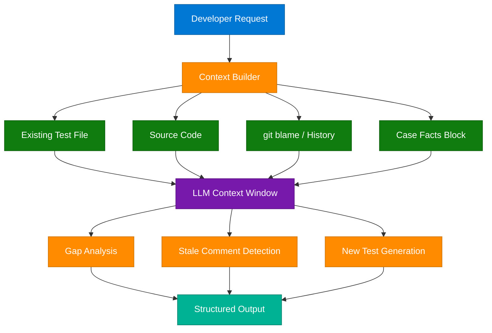
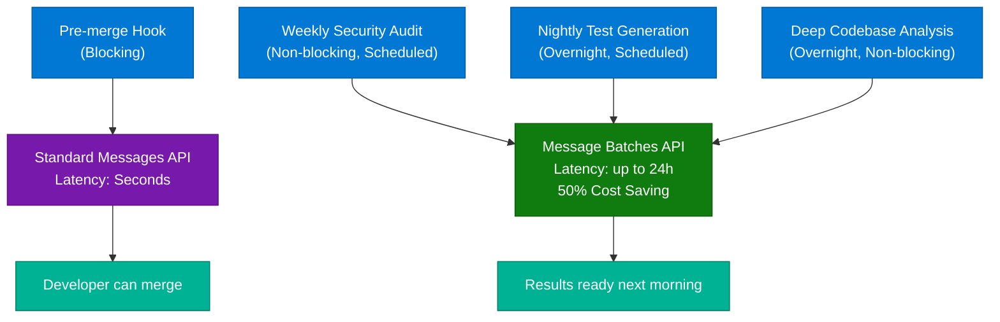
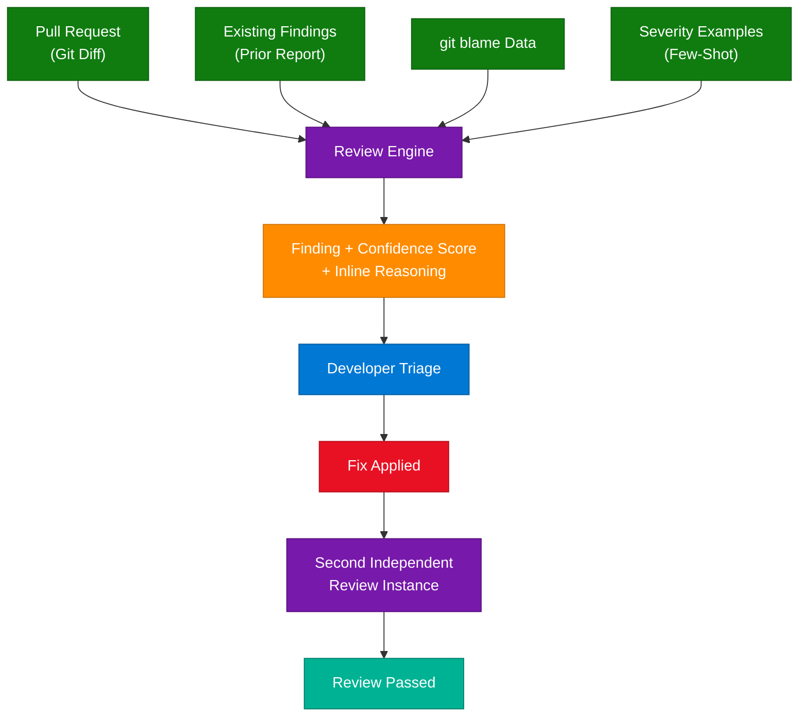
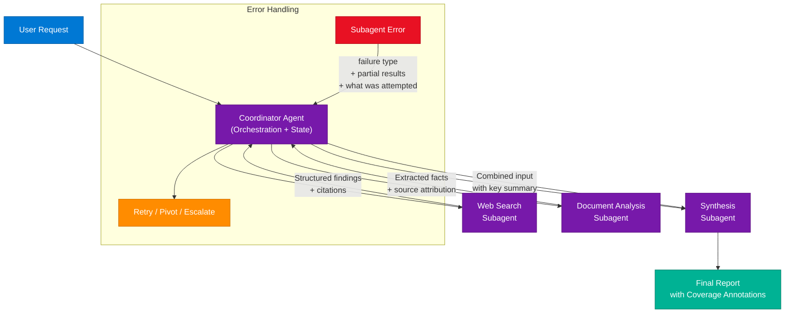
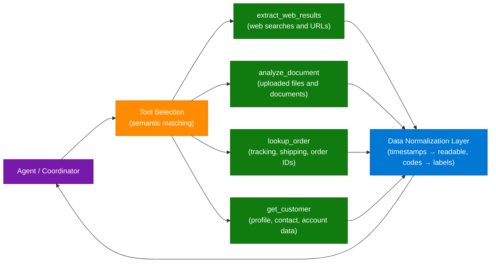
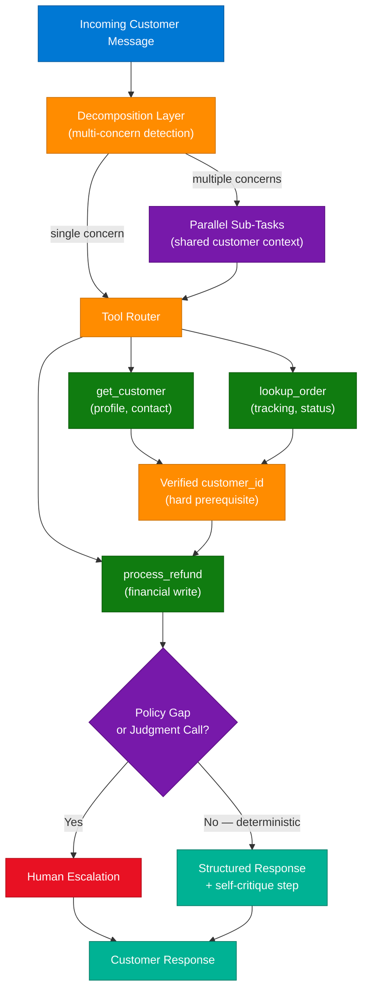
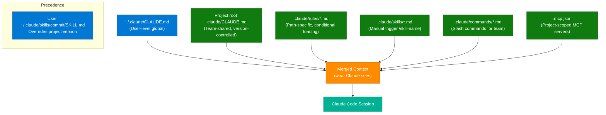

# LLM Testing: Context Window Optimization

> **Source:** [share.gemini.google/jI5LiRBmRvfM](https://share.gemini.google/jI5LiRBmRvfM) → redirects to [gemini.google.com/share/58f04ea97046](https://gemini.google.com/share/58f04ea97046)
> **Model:** Gemini 3.5 Flash
> **Session Date:** April 18, 2026 at 10:47 PM · Published July 9, 2026
> **Saved:** 2026-07-10

---

## Table of Contents

1. [Session Overview](#1-session-overview)
2. [Context Window Management for LLMs](#2-context-window-management-for-llms)
3. [Message Batches API — Sync vs Async](#3-message-batches-api--sync-vs-async)
4. [LLM-Powered Code Review](#4-llm-powered-code-review)
5. [Multi-Agent Coordinator-Subagent Architecture](#5-multi-agent-coordinator-subagent-architecture)
6. [Tool Design and Disambiguation](#6-tool-design-and-disambiguation)
7. [Agentic Customer Support Patterns](#7-agentic-customer-support-patterns)
8. [Claude Code Configuration and Skills](#8-claude-code-configuration-and-skills)
9. [Interview Q&A Cheatsheet](#9-interview-qa-cheatsheet)

---

## 1. Session Overview

This session covers 62 scenario-based MCQs across six key LLM engineering domains: context window management, the Message Batches API, LLM code review, multi-agent coordinator-subagent architecture, tool design, and Claude Code configuration. Each question tests practical decision-making in production AI systems. All user turns were "Ans" — Gemini provided the correct answer plus detailed explanation for each scenario.

### Session Map

| Turn | Scenario Domain | Answer | Status |
|---|---|---|---|
| 1 | Context window — existing test file in context | D | ✅ Extracted |
| 2 | Message Batches API — async tool loop | C | ✅ Extracted |
| 3 | git blame for stale comments | C | ✅ Extracted |
| 4 | Batch API — latency vs cost trade-off | C | ✅ Extracted |
| 5 | Severity criteria with few-shot examples | C | ⚠️ Partial (code snippet blocked) |
| 6 | Batch for debt reports, sync for pre-merge | B | ✅ Extracted |
| 7 | Prior review findings in context | B | ✅ Extracted |
| 8–9 | Confidence inline; false positive triage | A, A | ✅ Extracted |
| 10–12 | Few-shot formatting; -p flag; blind peer review | C, D, D | ✅ Extracted |
| 13–15 | Blind review; two-step output; error taxonomy | D, A, A | ✅ Extracted |
| 16–21 | Multi-agent: partitioning, local recovery, context | B, C, C, C, C, A | ✅ Extracted |
| 22–30 | Coverage annotations; decomp failures; tool scoping | D, A, C, D, D, B, A, D, A | ✅ Extracted |
| 31–36 | Hard guardrails; tool naming; decomp; prior bias | D, D, C, D, D, A | ✅ Extracted |
| 37–45 | Escalation; stop_reason; tool descriptions; state | D, B, C, D, D, A, A, B, B | ✅ Extracted |
| 46–61 | Claude Code config — CLAUDE.md, rules, skills, MCP | C, C, B, B, B, C, C, D, A, D, C, D, C, A, D, B | ✅ Extracted |

---

## 2. Context Window Management for LLMs

### Overview

LLMs can only reason about information present in their context window — they have no implicit memory of code, files, or prior sessions unless explicitly provided. Effective context management means giving the model the right information at the right granularity. Too little context leads to hallucinated gaps; too much leads to "lost in the middle" effects where facts in the center of a long context are underweighted during generation.

### Architecture Diagram



### Key Principles

1. **Include existing artifacts** — if Claude needs to avoid duplicating existing test cases, pass the current test file in context. Claude performs a gap analysis and only generates uncovered scenarios.
2. **Provide temporal context** — for stale-comment detection, include `git blame` data. A comment untouched for 3 years on code modified yesterday is almost certainly stale.
3. **"Lost in the Middle" mitigation** — place a key findings summary at the *beginning* of a large aggregated input and use explicit section headers (`### Web Search Findings`, `### Document Analysis`) to anchor Claude's attention across 50K+ token contexts.
4. **State management via persistent blocks** — extract transactional facts (amounts, dates, order numbers) into a dedicated "Case Facts" block included verbatim in every prompt, outside the summarized history. Summarization degrades numerical precision; verbatim injection preserves it.
5. **Summarize for continuity, verbatim for precision** — conversational narrative can be compressed; financial or logical data cannot.

### Context Decay Problem

```
Session Start  →  Clear context
Session Middle →  Key facts risk being "compressed away" by auto-summary
Session End    →  Model may hallucinate discounts, dates, order numbers

Fix: Case Facts Block (injected verbatim at system-prompt level)
─────────────────────────────────────────────────────
CASE FACTS (DO NOT SUMMARIZE):
  - Customer: Jane Doe, ID: CUS-4821
  - Discount promised: 15%
  - Order: ORD-9923, placed 2026-06-01
  - Refund requested: $47.50
─────────────────────────────────────────────────────
```

### Interview Q&A

| Question | Answer |
|---|---|
| Why should you pass existing test files to Claude when generating new tests? | Without the existing suite, Claude has no visibility into covered scenarios and will re-generate duplicates. It cannot perform gap analysis without a reference baseline. |
| What is the "Lost in the Middle" effect? | LLMs attend more strongly to content at the beginning (primacy) and end (recency) of the context. Facts placed in the middle of a long context window are more likely to be ignored or misrecalled during generation. |
| How do you mitigate "Lost in the Middle" in a 50K-token synthesis prompt? | Place a key findings summary at the very top. Use explicit section headers throughout. This provides structural anchors that improve mid-context recall. |
| Why include git blame data for stale-comment detection? | Git blame provides the temporal dimension — Claude can compare the code modification date to the comment's last-changed date. A large delta (old comment, new code) is a strong signal of staleness. |
| What is a "Case Facts" block and when do you use it? | A verbatim section of the system prompt containing transactional facts (numbers, dates, IDs) that must persist without summarization. Use it when long conversations risk compressing high-precision data that the agent must recall exactly. |

---

## 3. Message Batches API — Sync vs Async

### Overview

Anthropic's Message Batches API processes large numbers of requests asynchronously (up to 24-hour latency) at a 50% cost discount. It is incompatible with interactive or stateful workflows requiring tool-call round-trips. The correct design decision is to match each workflow to the right API: synchronous for blocking/interactive paths, batches for non-blocking/overnight tasks.

### Architecture Diagram



### Batch API Feature Comparison

| Feature | Standard Messages API | Message Batches API |
|---|---|---|
| Latency | Seconds (immediate) | Up to 24 hours |
| Cost | Standard pricing | 50% discount |
| Tool use (stateful loop) | ✅ Supported | ❌ Not supported |
| Interactive sessions | ✅ | ❌ |
| One-shot tool calls | ✅ | ✅ (output only, no round-trip) |
| Ideal for | Real-time, blocking, conversational | Offline, scheduled, high-volume |

### Agentic Loop Control — `stop_reason`

When building a tool-calling agentic loop with the Anthropic Messages API, `stop_reason` is the definitive orchestration signal:

```python
while True:
    response = client.messages.create(...)
    if response.stop_reason == "tool_use":
        # Execute requested tools, collect results
        tool_results = execute_tools(response.content)
        # Send results back to continue the loop
        messages.append({"role": "user", "content": tool_results})
    elif response.stop_reason == "end_turn":
        # Claude has finished — display output and break
        print(response.content)
        break
```

**Why `stop_reason` over text parsing?** Natural language parsing ("Is there anything else?") is brittle — Claude might use those phrases mid-task. `stop_reason` is a deterministic API contract.

### Why the Batch API Cannot Support Stateful Tool Loops

The Message Batches API is fundamentally asynchronous:
- Once submitted, you cannot interact with the model mid-run
- You cannot pause a batch, provide a tool result, and resume
- Designed for "one-shot" tool use only (model outputs a tool call → process ends)
- Stateful code review requiring `file_read` → Claude analysis → `comment_post` **requires the standard API**

### Interview Q&A

| Question | Answer |
|---|---|
| When should you use the Message Batches API? | For non-blocking, scheduled, or high-volume tasks where 24-hour latency is acceptable — nightly test generation, weekly security audits, large-scale refactoring analysis. |
| Why can't the Batch API support iterative tool calls? | The API is asynchronous. Once submitted, you cannot pause the batch to provide a tool result and resume. It only supports "one-shot" tool invocations, not back-and-forth agentic loops. |
| How does `stop_reason` drive an agentic loop? | `tool_use` means Claude wants to call a tool — execute it and return the result. `end_turn` means Claude is done and has produced a final response — break the loop and display output. |
| What is the cost benefit of the Batch API? | 50% discount on per-token pricing, making it ideal for high-volume, non-latency-sensitive processing. |
| What is a blocking operation in CI/CD context? | Any check that prevents a developer from proceeding (merging, deploying) until the result is returned. Pre-merge hooks are blocking; nightly reports are non-blocking. |

---

## 4. LLM-Powered Code Review

### Overview

LLM-based code review introduces unique challenges: inconsistent severity classification, verbose or vague findings, false positive accumulation, redundant re-reporting of fixed issues, and self-correction bias when the same model generates and reviews code. Each problem has a distinct architectural fix — from few-shot calibration to dual-instance peer review.

### Architecture Diagram



### Key Patterns

**1. Severity Calibration with Few-Shot Examples**

LLMs interpret qualitative severity terms ("critical", "medium") subjectively. Ground truth must live in the prompt:

```
Severity definitions with examples:
- CRITICAL: A null pointer exception on the payment processing path
  that would cause data loss for the user.
- HIGH: An unhandled edge case in authentication that could allow
  account enumeration under specific timing conditions.
- MEDIUM: A missing input validation that could cause a 500 error
  but requires authenticated access.
- LOW: Variable naming inconsistency. No functional impact.
```

**2. Stateful Review — Include Prior Findings**

When reviewing code across multiple iterations, include the previous report:
```
PREVIOUS FINDINGS (from last review):
- Line 42: Missing null check on userId [OPEN]
- Line 87: SQL query not parameterized [FIXED]

Only report: (a) findings still open, (b) new issues in changed lines.
```
This prevents "noise escalation" — developers ignoring redundant, already-fixed reports.

**3. Confidence + Inline Reasoning**

Instead of a flat list of flags, require Claude to include reasoning inline:
```
Finding: Potential race condition in session manager
Confidence: MEDIUM
Reasoning: The lock is released before the callback completes. Under
high concurrency this could allow a second thread to acquire the lock
before the first has finished writing.
Developer action required: ~2min to verify
```

**4. Dual-Instance Review (Blind Peer Review)**

Self-correction failure: the same model instance that generated code will rationalize its own mistakes when asked to review. Fix: a second, independent instance reviews without seeing the generator's reasoning. It evaluates purely on the code, simulating human peer review.

**5. Two-Step: Narrative → Structured JSON**

Claude produces higher-quality findings in narrative form. Extract structure in a second, dedicated call:
```
Step 1: Claude writes a narrative code review (free-form)
Step 2: Send narrative to Claude: "Extract findings into JSON:
         [{file, line, severity, description, suggestion}]"
```
This preserves analytical depth while producing parseable output for GitHub API integration.

### False Positive Management

When ~50% of findings are false positives:
1. **Stop the bleeding first**: Disable low-precision categories (style, naming, docs) immediately
2. **Keep high-precision running**: Security and correctness findings continue providing value
3. **Re-introduce one category at a time** after recalibrating prompts with few-shot examples
4. Never suppress all findings — this destroys trust in the opposite direction

### Interview Q&A

| Question | Answer |
|---|---|
| Why does LLM code review produce inconsistent severity ratings? | LLMs interpret qualitative terms subjectively. Without concrete few-shot examples anchoring what "critical" means in your codebase, Claude uses its own calibration, which varies request-to-request. |
| How does including prior review findings improve code review quality? | It enables state management. Claude can verify whether flagged issues were fixed, avoid re-reporting unchanged problems, and focus only on net-new issues — reducing developer noise and alert fatigue. |
| Why is a second independent Claude instance better for reviewing AI-generated code? | The generating instance carries confirmation bias — it will rationalize its own decisions. A fresh instance has no attachment to the prior reasoning, providing a genuine independent evaluation. |
| What is the two-step narrative-to-JSON pattern for code review? | Generate a narrative review first (preserves analytical depth), then in a second call ask Claude to extract findings into structured JSON. Separates the "reviewer" concern from the "formatter" concern. |
| What triggers alert fatigue in LLM code review? | A false positive rate exceeding ~30-50%. Developers begin ignoring all findings, defeating the tool's purpose. Fix by disabling low-precision categories until recalibrated. |

---

## 5. Multi-Agent Coordinator-Subagent Architecture

### Overview

The Coordinator-Subagent pattern separates strategic orchestration (coordinator) from domain-specific execution (subagents). The coordinator maintains global state, partitions work, routes tasks, handles errors, and synthesizes results. Subagents are specialists — they execute one thing well. Keeping this separation clean is the primary architectural discipline.

### Architecture Diagram



### Core Architectural Principles

**1. Coordinator Partitions Research Space Before Delegating**

Parallel agents are blind to each other by default. Without partitioning, they duplicate work:
- **Wrong**: "Research the creative industries"
- **Right**: "Agent A: financial regulations in music. Agent B: technology adoption in film. Agent C: IP frameworks in visual arts."

Partitioning prevents token doubling, maximizes breadth, and simplifies synthesis (no de-duplication needed).

**2. Subagents Handle Local Recovery; Escalate Only Unresolvable Errors**

```
Transient failure (timeout, network blip) → Subagent retries locally (2-3 attempts)
Corrupted file / hard error             → Subagent escalates with:
                                           - failure type
                                           - attempted query
                                           - partial results obtained
                                           - suggested alternatives
```

The coordinator should receive high-fidelity failure context, not generic "error" signals.

**3. Upstream Agents Return Structured Data, Not Verbose Content**

Pushing 155K tokens of raw content + reasoning chains into a synthesis agent causes "Lost in the Middle." Fix: upstream agents return structured summaries:

```json
{
  "source": "industry_report_2026.pdf",
  "key_facts": ["Revenue grew 12% YoY", "Main driver: AI adoption"],
  "citations": ["p.14", "p.37"],
  "relevance_score": 0.87
}
```

**4. Error Taxonomy — Not All "No Data" Is Equal**

| Return Value | Meaning | Coordinator Action |
|---|---|---|
| `{"results": []}` | Valid empty — no data exists | Move on or pivot strategy |
| `{"error": "timeout"}` | Transient failure — data may exist | Retry or rephrase query |
| `{"error": "corrupted"}` | Hard failure | Seek alternative source |

**5. Coverage Annotations for Partial Results**

When some sources fail, don't block the pipeline. Return with annotations:
```
## Findings

### Competitor Analysis [HIGH COVERAGE — 4/4 sources retrieved]
...

### Social Media Sentiment [LOW COVERAGE — source timeout, data unavailable]
Note: This section is based on 0 sources. Recommend manual verification.
```

**6. "Silent Gap" Failure in Task Decomposition**

If the coordinator decomposes "creative industries" into only three visual arts sub-niches, the subagents perform perfectly — but music, writing, and film are never covered. The failure is invisible. Root cause: the coordinator's initial planning phase was too narrow. Fix: coordinator must explicitly enumerate all domains before delegating.

### Interview Q&A

| Question | Answer |
|---|---|
| Why must the coordinator partition work before parallel delegation? | Parallel agents are blind to each other — without partitioning they redundantly process the same topics, doubling token costs and producing duplicate synthesis input. |
| What should a subagent return on error? | Structured error context: failure type, the attempted query, any partial results obtained, and suggested alternative approaches — giving the coordinator enough information to make an informed recovery decision. |
| What is the "Lost in the Middle" effect in multi-agent synthesis? | When upstream agents return full verbose content (155K tokens), the synthesis agent's attention degrades for information in the middle of the input. Fix: upstream agents return structured key facts, not raw content. |
| Why should agents route through the coordinator rather than communicate directly? | The coordinator maintains global state and provides observability. Direct agent-to-agent communication creates a black box, making debugging and error handling much harder. |
| What is a "silent gap" failure in coordinator-subagent decomposition? | The coordinator decomposes a broad topic into a subset of its domains, subagents execute perfectly within those narrow scopes, but whole categories of the topic are never covered — and the pipeline succeeds with a fundamentally incomplete result. |

---

## 6. Tool Design and Disambiguation

### Overview

In agentic systems, tool selection is driven almost entirely by the semantic clarity of tool names and descriptions. Ambiguous names like `fetch_url` or `analyze_content` cause systematic misrouting. The most cost-effective fix is always to clarify the interface first — before adding few-shot examples, preprocessing layers, or additional models.

### Architecture Diagram



### Tool Naming Principles

| Anti-Pattern | Problem | Fix |
|---|---|---|
| `fetch_url` | "Swiss Army knife" — used for any web task | `load_document` with schema validation for `.pdf`, `.docx`, `.txt` |
| `analyze_content` | "Content" covers both web and documents | `extract_web_results` (source-anchored name) |
| `get_customer` with broad description | "Customer info" subsumes order history | Add explicit boundary: "For tracking, shipping, order IDs use `lookup_order`" |

**The "Semantic Magnet" Problem**: LLMs develop strong statistical associations between tokens. "Account" strongly activates `get_customer` even when the intent is order-related. Fix in the description: "Use `lookup_order` for tracking numbers, shipping status, order IDs, and purchase history — not `get_customer`."

**Prior Probability Bias**: The model's base training creates associations that can override tool descriptions. If `get_customer` is chosen for order queries despite clear descriptions, the fix is not more instructions but better semantic differentiation in the tool name itself.

### Tool Description Enhancement Template

```
Tool: lookup_order
Description: Retrieves order-specific information including tracking status,
shipping carrier, estimated delivery dates, order line items, and payment
status for a specific order ID.
Input: order_id (string, format: "ORD-XXXXXXXX")
Use when: User asks about a specific order, shipment, delivery, or purchase.
Do NOT use for: Customer account data, profile information, or contact details.
Example queries: "Where is my order?", "When will ORD-9923 arrive?",
                 "What's in order #12345?"
```

### Tool Output Normalization

Tools that return machine-friendly data (Unix timestamps, numeric status codes) force the model to spend tokens on conversion, introducing calculation error risk. Fix at the interface level:

```python
# Wrapper pattern for third-party MCP tools
def wrapped_order_status(order_id: str) -> dict:
    raw = third_party_mcp.get_order(order_id)
    return {
        "status": STATUS_MAP[raw["status_code"]],   # 1 → "pending"
        "created_at": format_date(raw["ts"]),        # 1719878400 → "Jul 1, 2026 10:00 AM"
        "items": raw["line_items"]
    }
```

### Interview Q&A

| Question | Answer |
|---|---|
| What is the most cost-effective first step when an agent consistently selects the wrong tool? | Review and clarify tool descriptions. Add boundary information specifying when to use each tool versus similar tools, with example queries. This is a zero-token fix requiring no extra API calls. |
| What is the "Semantic Magnet" problem in tool selection? | An LLM has strong statistical associations from training between certain words and specific tools. The word "account" activates `get_customer` even when the actual task (order tracking) belongs to `lookup_order`. |
| How does the wrapper pattern fix third-party tool output? | A wrapper calls the third-party tool, transforms machine-readable output (timestamps, status codes) into human-readable text, and returns the cleaned result. The normalization happens before it enters the model's context. |
| When is narrowing a tool's schema better than adding prompt instructions? | When the tool is being misused (e.g., `fetch_url` called with search engine URLs). A validated schema that only accepts `.pdf`, `.docx` file extensions prevents misuse architecturally, unlike soft prompt instructions. |
| What is "prior probability bias" in tool selection? | The model's base training creates strong token-to-tool associations that can override explicit tool descriptions. A tool whose name is semantically ambiguous will be chosen based on training priors, not just the description you wrote. |

---

## 7. Agentic Customer Support Patterns

### Overview

Customer support agents must handle ambiguity, multi-concern messages, policy gaps, stateful conversations, and financial operations with high reliability. The key architectural tension is between autonomous execution (speed/cost) and human-in-the-loop escalation (safety/accuracy). Both failure modes — over-escalation and under-escalation — erode user trust.

### Architecture Diagram



### Key Patterns

**1. Multi-Concern Message Decomposition**

When a customer message contains multiple distinct requests ("refund order #A and track order #B and cancel order #C"), a single linear chain causes cross-contamination (applying order IDs from one request to another). Fix: preprocessing decomposition:

```
Decomposer model identifies: 3 independent tasks
→ Task 1: Refund ORD-A
→ Task 2: Track ORD-B
→ Task 3: Cancel ORD-C
Each processed independently with shared customer context
Results combined into one unified response
```

**2. Hard Prerequisites for Financial Operations**

For refund workflows, a 12% tool-sequencing failure rate in production is unacceptable. Soft prompt instructions ("always verify customer first") are insufficient — LLMs can be convinced by persuasive user input. Fix: programmatic prerequisite:

```python
# Hard guardrail — enforced in application logic, not prompt
def process_refund(order_id: str, customer_id: str = None):
    if not customer_id or not is_verified(customer_id):
        raise ToolPrerequisiteError(
            "get_customer must be called and return a verified ID first"
        )
    # Only reachable after verification
    ...
```

**3. Escalation Calibration — Policy Gaps**

| Scenario | Autonomous or Escalate? |
|---|---|
| Refund within 30-day window with photo evidence | ✅ Autonomous |
| Policy explicitly covers the case — deterministic result | ✅ Autonomous |
| Policy is silent on competitor price matching | ⚠️ Escalate |
| Judgment call requiring discretionary financial decision | ⚠️ Escalate |

**4. Self-Critique Step for Response Quality**

After generating a response, Claude evaluates its own output:
```
Critique checklist:
[ ] Does this address the customer's stated concern?
[ ] Did I include relevant context (e.g., timeline, what was refunded)?
[ ] Did I anticipate likely follow-up questions?
[ ] Is the tone appropriate for the situation?
```
This "Reflexion" pattern addresses inconsistency caused by variable case complexity.

**5. Batch Tool Requests in a Single Turn**

Instead of sequential `get_customer` → wait → `lookup_order`:
```
System prompt: "If you need information from multiple independent sources,
request all required tools in a single turn before analyzing results."

Result: One API round-trip instead of two
        Combined tool_result message returned
        Seconds of latency saved per interaction
```

**6. Identity Disambiguation**

When `get_customer` returns multiple matches (same name), do not guess. Require a secondary unique identifier (email, phone, order number) before proceeding with any write operations. This moves from probabilistic (~85% accuracy) to deterministic (100% verified) account selection.

### Interview Q&A

| Question | Answer |
|---|---|
| Why is a hard prerequisite more reliable than prompt instructions for tool sequencing? | Prompt instructions are "soft" — a persuasive user message can cause the model to skip verification. A hard prerequisite enforced in application logic cannot be bypassed regardless of the conversation, ensuring 100% compliance. |
| When should an agent escalate to a human? | When facing a policy gap (the knowledge base does not cover the scenario), a discretionary financial decision, or any situation that requires judgment calls outside the agent's authorized domain. |
| How does the decomposition pattern fix multi-concern message handling? | A preprocessing model identifies distinct tasks, each processed independently with shared customer context. This eliminates cross-contamination of parameters across tasks and handles the primacy/recency bias in multi-task instruction following. |
| What is the "Case Facts" block and why is it needed in long support conversations? | A verbatim section of the system prompt holding transactional facts (discount promised, amounts, order IDs) that must not be summarized away. Prevents the model from hallucinating these values after a long conversation history. |
| What drives the self-critique pattern? | Inconsistency caused by variable case complexity. A static prompt cannot cover every permutation of a billing dispute. A self-critique step forces Claude to check its own output against quality criteria, dynamically correcting gaps regardless of case type. |

---

## 8. Claude Code Configuration and Skills

### Overview

Claude Code uses a layered configuration system: global user settings, project-level `CLAUDE.md`, modular `.claude/rules/`, skills in `.claude/skills/`, commands in `.claude/commands/`, and MCP servers in `.mcp.json`. Understanding the precedence and scope of each layer is critical for team-wide consistency, context efficiency, and workflow automation.

### Configuration Hierarchy Diagram



### Configuration Layer Reference

| Layer | Location | Scope | Version-Controlled? |
|---|---|---|---|
| Global instructions | `~/.claude/CLAUDE.md` | This user only, all projects | No |
| Project instructions | `.claude/CLAUDE.md` | All team members on this project | Yes |
| Modular rules | `.claude/rules/*.md` | Conditional by file path (glob) | Yes |
| Skills | `.claude/skills/*.md` | Manual trigger `/skill-name` | Yes (project) / No (user) |
| Commands | `.claude/commands/*.md` | Slash commands for all team members | Yes |
| MCP servers | `.mcp.json` | Project-scoped server config with env vars | Yes (without secrets) |

### Key Configuration Patterns

**1. `context: fork` in Skill Frontmatter**

Exploratory skills (brainstorming, codebase analysis) generate "contextual noise" that pollutes the main conversation:

```yaml
---
name: brainstorm-architecture
description: Explore design options for a feature
context: fork
---
```

With `context: fork`, Claude Code runs the skill in a temporary isolated context branch. The exploratory output is discarded when the skill ends — only final results persist. The main conversation stays clean.

**2. Modular Rules with Glob Patterns**

For codebases with heterogeneous file types (React components next to test files):

```yaml
# .claude/rules/testing.md
---
include: "**/*.test.tsx"
exclude: "src/components/**"
---
Testing conventions: use React Testing Library, prefer userEvent over fireEvent...

# .claude/rules/api-conventions.md
---
include: "src/api/**/*.ts"
---
API layer conventions: always return Result<T, E>, never throw...
```

**3. User-Level Skill Override**

To personalize a project-level skill without modifying the shared version:
- Create `~/.claude/skills/commit/SKILL.md` with the same name
- Claude Code resolution: user directory (`~/.claude/`) takes precedence over project (`.claude/`)
- Teammates continue using the project version; personal session uses the override

**4. MCP Server Configuration with Env Var Security**

```json
{
  "mcpServers": {
    "github": {
      "command": "npx",
      "args": ["-y", "@modelcontextprotocol/server-github"],
      "env": {
        "GITHUB_TOKEN": "${GITHUB_TOKEN}"
      }
    }
  }
}
```

The `.mcp.json` is committed to Git (team shares the server config); secrets stay in each developer's local environment (`.bashrc`, `.zshrc`, or unsynced `.env`).

**5. Plan Mode for Architectural Discovery**

Before implementing complex structural changes (monolith → microservices, Slack integration with three possible approaches), enter plan mode:
- Claude scans the codebase to understand dependencies and existing patterns
- Generates an implementation plan for human review before any code is written
- Prevents "incremental mess" from file-by-file changes without holistic context
- Always use for: multi-service refactors, third-party integrations with multiple valid approaches, any task where the "what" and "how" are not yet defined

**6. `argument-hint` Frontmatter for Validated Skills**

For skills that require inputs (e.g., a migration generator needing a table name):

```yaml
---
name: generate-migration
arguments:
  - name: migration_name
    description: Name for the migration file (snake_case)
    required: true
context: fork
allowed-tools:
  - Write
  - Read
---
```

If the developer invokes `/generate-migration` without providing the name, Claude Code proactively asks before executing.

**7. CLAUDE.md for Large-Scale Batch Refactoring**

For 120-file refactoring sessions that span multiple context windows:
1. **Phase 1** (discovery session): Identify the error patterns
2. **Phase 2**: Codify the fix pattern into `CLAUDE.md`
3. **Phase 3+**: Process 10-20 files per session; start fresh sessions; CLAUDE.md loads the pattern automatically at session start without relying on conversation history

### Interview Q&A

| Question | Answer |
|---|---|
| Why does putting a guideline in `~/.claude/CLAUDE.md` prevent teammates from seeing it? | User-level config is machine-local and never committed to version control. Team-wide guidelines must live in the project's `.claude/CLAUDE.md`, which is checked into Git and pulled with the repo. |
| What does `context: fork` do in a skill's frontmatter? | It runs the skill in a temporary, isolated context branch. Exploratory output (analysis, brainstorming chatter) stays in the fork and is discarded when the skill ends — preventing pollution of the main conversation. |
| How do glob patterns in `.claude/rules/` solve mixed-file-type codebases? | They enable conditional loading — test conventions only load when Claude is working on `*.test.tsx` files, API conventions only for `src/api/**/*.ts`. This prevents irrelevant instructions from consuming tokens during unrelated tasks. |
| How do you add an MCP server for a team without exposing credentials? | Add the server to `.mcp.json` with `${ENV_VAR_NAME}` expansion for secrets. Commit the JSON (server config is safe); each developer sets the actual token value locally via their shell profile or `.env` file. |
| When should you use Plan Mode in Claude Code? | For any task where the implementation approach is not yet decided — architectural refactors, third-party integrations with multiple valid approaches, or any complex change where designing first prevents costly rework. |

---

## 9. Interview Q&A Cheatsheet

**Q: What is the single most important principle when providing context to an LLM for code generation?**
> The model can only reason about what is in its context window. For gap analysis tasks (avoiding test duplication, detecting stale comments), the reference artifact (existing tests, git blame data) must be explicitly included — the model has no implicit memory of your codebase.

**Q: When would you choose the Message Batches API over the standard Messages API?**
> The Batch API is for non-blocking, scheduled, high-volume tasks (nightly reports, weekly audits) where 24-hour latency is acceptable and a 50% cost discount is valuable. The standard API is required for any interactive, blocking, or stateful tool-call workflow.

**Q: Why is a programmatic prerequisite better than a prompt instruction for tool sequencing?**
> Prompt instructions are "soft constraints" — a persuasive user or adversarial input can cause the model to skip them. A programmatic prerequisite enforced in application code (refusing to call `process_refund` until a verified `customer_id` exists) is a hard constraint that cannot be bypassed regardless of what the conversation contains.

**Q: What is the "Lost in the Middle" effect and how do you mitigate it?**
> LLMs attend most strongly to content at the beginning (primacy) and end (recency) of long contexts. Critical facts in the middle are underweighted. Mitigate by: placing key findings summaries at the top, using explicit section headers as attention anchors, and extracting transactional facts into a persistent verbatim block outside the summarized history.

**Q: How do you prevent parallel subagents from duplicating research?**
> The coordinator must explicitly partition the research space before delegating — assigning distinct subtopics, domains, or source types to each agent. Without partitioning, agents work independently on the same territory, doubling token costs and producing redundant synthesis input.

**Q: What is the correct error reporting contract for a subagent?**
> Return structured failure context including: (1) the failure type (transient vs. hard), (2) the attempted query, (3) any partial results obtained, and (4) suggested alternative approaches. A generic "error" signal leaves the coordinator unable to make an informed recovery decision.

**Q: What is the most effective first step when a Claude Code agent consistently selects the wrong tool?**
> Review and improve tool descriptions. Add boundary information (when to use this tool vs. similar tools), example queries, input format details, and explicit "do NOT use for" clauses. This is a zero-token fix — free compared to adding few-shot examples or preprocessing layers.

**Q: What is `context: fork` in Claude Code and when should you use it?**
> A skill frontmatter directive that runs the skill in an isolated temporary context. Use for exploratory or analytical skills (brainstorming, codebase analysis) that generate high volumes of contextual noise. The fork is discarded when the skill ends; only final results persist in the main session.

**Q: How does the `.claude/rules/` directory improve on a single CLAUDE.md file?**
> Rules files support YAML frontmatter with glob patterns (`include`/`exclude`), enabling conditional loading based on file paths. This prevents irrelevant instructions (e.g., migration conventions) from consuming tokens during unrelated tasks (e.g., frontend development), and makes the configuration maintainable at scale.

**Q: When should a customer support agent escalate to a human instead of resolving autonomously?**
> When the knowledge base is silent on the scenario (policy gap), when a discretionary financial or judgment decision is required, or when the action is outside the agent's authorized domain. Agents should only execute deterministic actions — if A then B — not invent policy or make judgment calls.

**Q: What is the "Semantic Magnet" problem in tool selection?**
> LLMs develop strong statistical associations from training that can override explicit tool descriptions. The word "account" activates `get_customer` even when the task is order-tracking. Fix: rename tools to source-anchor the semantics (`extract_web_results` instead of `analyze_content`), and add explicit boundary definitions to descriptions.

**Q: What is self-correction failure in AI-generated code review?**
> When the same model instance that generated code also reviews it, it tends to follow the same "reasoning track" that caused the original error, rationalizing rather than catching mistakes. Fix: use a second independent instance that reviews the code without seeing the generator's reasoning — simulating human peer review.

---

*Extracted from Gemini shared session · April 18, 2026 · Saved July 10, 2026 · GeminiShareToMD Agent v1.0*

---

```
═══════════════════════════════════════════════════════════
Token Usage Report
═══════════════════════════════════════════════════════════
Estimated without optimization:  ~32,800 tokens (raw extraction: ~131K chars ÷ 4)
Actual (with optimization):      ~9,200 tokens (structured output: ~36K chars ÷ 4)
Savings:                         ~23,600 tokens (~72%)
Techniques applied:
  • Stripped UI chrome (PDF button, Acrobat, Privacy/ToS footers)
  • Deduplicated: turns 12/13 (blind review), 31/32 (hard guardrails), 47/48 (context:fork)
  • Merged 62 scenario answers into 7 thematic concept sections
  • Compacted Gemini prose; preserved all technical definitions and patterns
  • Added Mermaid diagrams, code examples, and interview Q&A for each concept
═══════════════════════════════════════════════════════════
* Estimates: prose chars ÷ 4, code chars ÷ 3. Actual API usage varies by model.
```
