# Multi-Topic: API, System Design & AI Patterns — July 5 Session

> **Source:** [share.gemini.google/z7Kw1PzQbDIO](https://share.gemini.google/z7Kw1PzQbDIO) → redirects to [gemini.google.com/share/9c787b7dd4b2](https://gemini.google.com/share/9c787b7dd4b2)
> **Model:** Gemini 3.1 Flash-Lite
> **Session Date:** July 5, 2026 at 04:24 PM
> **Saved:** July 8, 2026

---

## Table of Contents

1. [Session Overview](#1-session-overview)
2. [Database Sharding: Range vs Hash](#2-database-sharding-range-vs-hash)
3. [JWT Security: Stateless Logout & Token Revocation](#3-jwt-security-stateless-logout--token-revocation)
4. [API & Web Communication Fundamentals](#4-api--web-communication-fundamentals)
5. [REST to Kafka: Event-Driven Migration](#5-rest-to-kafka-event-driven-migration)
6. [API Gateway: The Centralized Front Door](#6-api-gateway-the-centralized-front-door)
7. [25 Advanced REST API Interview Questions](#7-25-advanced-rest-api-interview-questions)
8. [Time Complexity & Big-O Notation](#8-time-complexity--big-o-notation)
9. [Epoch in Machine Learning](#9-epoch-in-machine-learning)
10. [AI Agents vs. Agentic AI](#10-ai-agents-vs-agentic-ai)
11. [LLM Guardrails: The Firewall Pattern](#11-llm-guardrails-the-firewall-pattern)
12. [6 Important Backend Patterns](#12-6-important-backend-patterns)
13. [Top 5 RAG Architectures for 2026](#13-top-5-rag-architectures-for-2026)
14. [Token Optimization: 10 Techniques + Model Routing](#14-token-optimization-10-techniques--model-routing)
15. [Rate Limiting Algorithms](#15-rate-limiting-algorithms)
16. [JioHotstar: Scaling to 22 Crore Concurrent Viewers](#16-jiohotstar-scaling-to-22-crore-concurrent-viewers)
17. [AI Agents for Competitive Intelligence](#17-ai-agents-for-competitive-intelligence)
18. [Offline UPI Transactions Architecture](#18-offline-upi-transactions-architecture)
19. [7 AI System Design Patterns](#19-7-ai-system-design-patterns)
20. [30 System Design Patterns Cheat Sheet](#20-30-system-design-patterns-cheat-sheet)
21. [Interview Q&A Cheatsheet](#21-interview-qa-cheatsheet)

---

## 1. Session Overview

This session covers 19 distinct system design, API, and AI engineering concepts extracted from technical Instagram/social media posts. Topics range from database sharding strategies, JWT security, event-driven migration, and rate limiting to AI-specific patterns like RAG architectures, token optimization, LLM guardrails, and agentic AI. One Gemini turn returned an error (Turn 18) and is noted below.

### Session Map

| Turn | Source Creator | Topic | Status |
|---|---|---|---|
| 1 | synap_byte | Database Sharding: Range vs Hash | ✅ Extracted |
| 2 | codewith.z_ | JWT Stateless Logout | ✅ Extracted |
| 3 | endless_success___ | API & Web Communication Fundamentals | ✅ Extracted |
| 4 | codewith_sushant | REST to Kafka Migration | ✅ Extracted |
| 5 | aman_views | JWT Expiry Exploitation | ✅ Extracted (merged with Turn 2) |
| 6 | engineerinazure | API Gateway Architecture | ✅ Extracted |
| 7 | codewith.z_ | JWT Stateless Logout (duplicate) | ✅ Merged into Turn 2 |
| 8 | codewith_kk | 25 REST API Interview Questions (Part 1) | ✅ Extracted |
| 9 | codewith_kk | 25 REST API Interview Questions (Part 2) | ✅ Merged into Turn 8 |
| 10 | codewith_kk | Time Complexity Big-O | ✅ Extracted |
| 11 | mohitchhabratech | Epoch in Machine Learning | ✅ Extracted |
| 12 | n0_code | AI Agents vs. Agentic AI | ✅ Extracted |
| 13 | mumbai_tech_ | LLM Guardrails / Firewall Pattern | ✅ Extracted |
| 14 | akanksha_buchke | 6 Important Backend Patterns | ✅ Extracted |
| 15 | codewithbrij | Top 5 RAG Architectures 2026 | ✅ Extracted |
| 16 | AI Coach John Gabriel | Token Optimization: Model Routing | ✅ Extracted |
| 17 | ai_coach_john | 10 Token Optimization Techniques | ✅ Merged into Turn 16 |
| 18 | (unknown) | Unknown | ⚠️ Error — Gemini could not process |
| 19 | justpushtoprod | Rate Limiting Algorithms | ✅ Extracted |
| 20 | theinderdev | JioHotstar 22 Crore Scale | ✅ Extracted |
| 21 | agentverseinsta | AI Agents for Competitive Intelligence | ✅ Extracted |
| 22 | sunchitdudeja | Offline UPI Transactions | ✅ Extracted |
| 23 | iampalakawasthi | 7 AI System Design Patterns | ✅ Extracted |
| 24 | chhavi_maheshwari_ | 30 System Design Patterns Cheat Sheet | ✅ Extracted |

---

## 2. Database Sharding: Range vs Hash

### Overview

Sharding is a horizontal partitioning technique that splits a large database table across multiple servers (shards) to improve scalability and throughput. Choosing the wrong sharding strategy leads to write hotspots where one shard receives disproportionate load while others sit idle. Range sharding groups data by contiguous key ranges (e.g., timestamps), offering great read locality but poor write distribution for monotonic keys. Hash sharding applies a hash function to distribute data uniformly, eliminating hotspots at the cost of range query efficiency. Production systems often combine both via composite sharding keys.

### Architecture Diagram

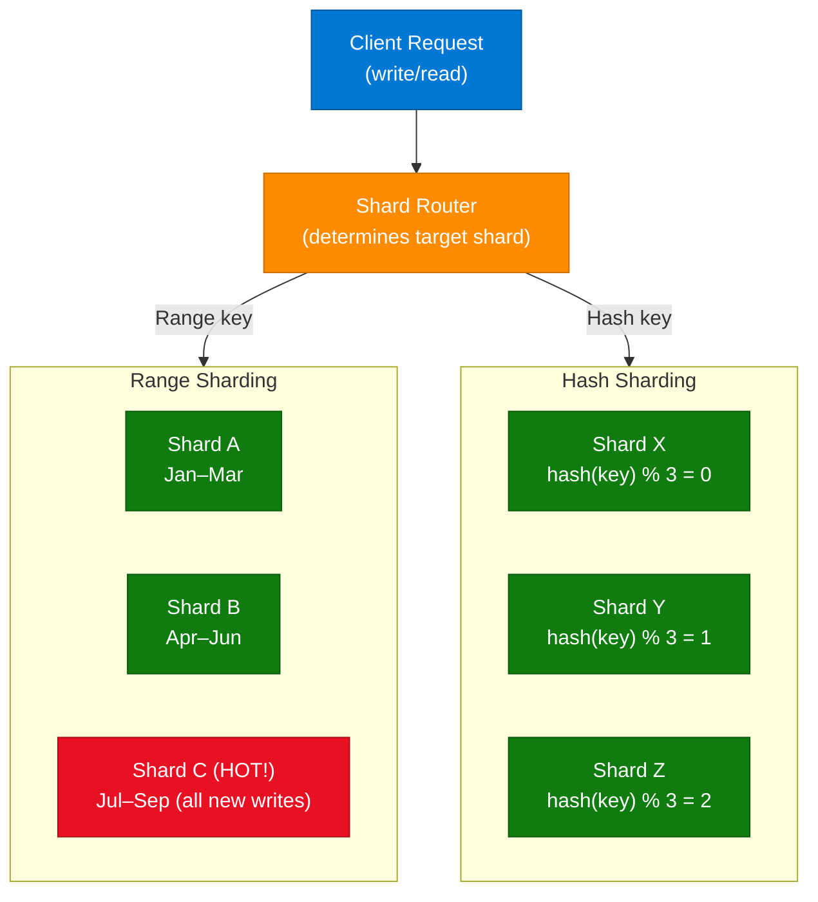

### How It Works

1. **Shard Key Selection** — Choose a column whose values determine which shard holds a row (e.g., `user_id`, `created_at`).
2. **Range Sharding** — Partition by value ranges: Shard A holds user IDs 1–1M, Shard B holds 1M–2M, etc.
3. **Range Hotspot Risk** — If the key is monotonically increasing (timestamps, auto-increment IDs), all writes hit the "current" last shard.
4. **Hash Sharding** — Apply `hash(shard_key) % N` to route writes uniformly across N shards.
5. **Range Query Cost** — Hash sharding scatters adjacent keys across all shards, making range scans require fan-out queries to every shard.
6. **Rebalancing** — Adding shards requires consistent hashing or manual re-mapping to minimize data movement.
7. **Composite Strategy** — Use hash on user_id for write distribution, but maintain a secondary range index for time-based reads.

### Key Components

| Component | Role | Technology Options |
|---|---|---|
| Shard Router | Maps key → shard; may be embedded or external | ProxySQL, Vitess, application-layer |
| Shard Key | Determines data placement; must be chosen carefully | user_id, region, tenant_id |
| Range Shard | Groups contiguous key values; efficient range scans | PostgreSQL partitioning, MySQL sharding |
| Hash Shard | Uniform distribution via hash function | Cassandra vnodes, MongoDB hashed index |
| Consistent Hash Ring | Minimizes reshuffling when adding/removing shards | Redis Cluster, DynamoDB |

### Code Example

```python
import hashlib

class ShardRouter:
    def __init__(self, num_shards: int):
        self.num_shards = num_shards

    def range_shard(self, timestamp_month: int) -> int:
        # 3 months per shard: Jan-Mar→0, Apr-Jun→1, Jul-Sep→2, Oct-Dec→3
        return (timestamp_month - 1) // 3

    def hash_shard(self, user_id: int) -> int:
        key = str(user_id).encode()
        h = int(hashlib.md5(key).hexdigest(), 16)
        return h % self.num_shards

router = ShardRouter(num_shards=4)
print(router.range_shard(8))   # 2 (Jul-Sep shard) — hotspot during signups
print(router.hash_shard(42))   # uniformly distributed
```

### Interview Q&A

| Question | Answer |
|---|---|
| What is database sharding? | Horizontal partitioning that splits a table across multiple servers to distribute load and storage. |
| Why does range sharding cause hotspots? | Monotonically increasing keys (timestamps, auto-IDs) funnel all new writes to the latest shard. |
| How does hash sharding prevent hotspots? | Applies a hash function so keys distribute uniformly across all shards regardless of insertion order. |
| What is the trade-off of hash sharding for reads? | Range queries require fan-out to all shards since adjacent keys are scattered; no data locality. |
| What is consistent hashing? | A technique where adding/removing shards only remaps a fraction of keys, minimizing data movement. |
| When would you choose range over hash sharding? | When most queries are range scans (e.g., "orders in the last 30 days") and hotspot risk is manageable. |
| Name a real-world system using hash sharding. | Cassandra uses consistent hashing with virtual nodes; DynamoDB uses a hash-based partition key. |

---

## 3. JWT Security: Stateless Logout & Token Revocation

### Overview

JSON Web Tokens (JWT) are stateless by design — once issued, the server verifies only the cryptographic signature and expiration time (`exp` claim), never consulting a session store. This creates a security gap: a stolen JWT remains valid until it expires, regardless of user logout. The challenge is implementing revocation in a system that was designed to avoid server-side state. Three complementary strategies — short-lived access tokens, token blocklists, and refresh token rotation — address this at different cost/security trade-offs.

### Architecture Diagram

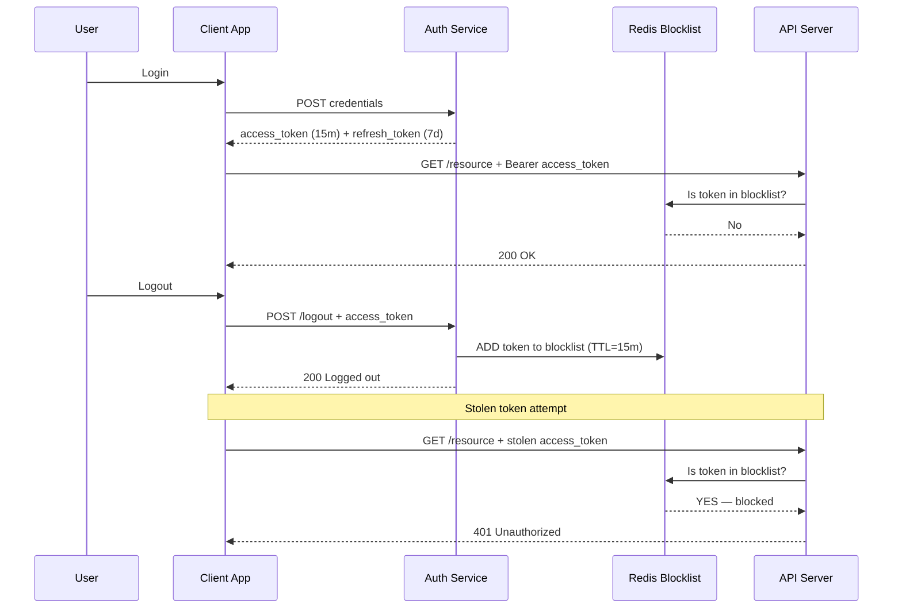

### JWT Revocation Strategies

| Strategy | Implementation | Benefit | Cost |
|---|---|---|---|
| Short Expiry | Set `exp` to 5–15 min | Limits attack window | Requires frequent refresh |
| Refresh Tokens | Long-lived refresh + short access | Better UX with security | Requires secure refresh storage |
| Token Blocklist | Store `jti` in Redis on logout | True immediate revocation | Re-introduces server-side state |
| Token Rotation | Issue new refresh token on each use; invalidate old | Detects stolen refresh tokens | Complexity in concurrent sessions |

### Code Example

```python
import redis
import jwt
from datetime import datetime, timedelta
import uuid

r = redis.Redis(host='localhost', port=6379, db=0)
SECRET = "your-secret-key"

def issue_token(user_id: str) -> dict:
    jti = str(uuid.uuid4())
    payload = {
        "sub": user_id,
        "jti": jti,
        "exp": datetime.utcnow() + timedelta(minutes=15)
    }
    return {"access_token": jwt.encode(payload, SECRET, algorithm="HS256"), "jti": jti}

def logout(token: str):
    payload = jwt.decode(token, SECRET, algorithms=["HS256"])
    ttl = int((datetime.utcfromtimestamp(payload["exp"]) - datetime.utcnow()).total_seconds())
    r.setex(f"blocklist:{payload['jti']}", ttl, "revoked")

def verify(token: str) -> bool:
    payload = jwt.decode(token, SECRET, algorithms=["HS256"])
    if r.exists(f"blocklist:{payload['jti']}"):
        raise PermissionError("Token revoked")
    return True
```

### Interview Q&A

| Question | Answer |
|---|---|
| Why can't you simply delete a JWT to log out? | JWTs are stateless — the server doesn't store them, so deletion has no effect; the token remains valid until expiry. |
| What is a JWT blocklist and how does it work? | A Redis store of revoked token IDs (`jti` claim); checked on each request. TTL matches token expiry to auto-clean entries. |
| What is the `jti` claim used for? | JWT ID — a unique identifier per token, used to reference it in a blocklist without storing the full token. |
| What is refresh token rotation? | Each token refresh issues a new refresh token and invalidates the old one; detects replay attacks on stolen tokens. |
| How does short expiry mitigate token theft? | A stolen 15-min token has only minutes of usefulness vs. a 24-hour token that gives an attacker a full day. |
| What's the trade-off of a blocklist? | It re-introduces server-side state (Redis lookup per request), partially defeating JWT's stateless benefit. |
| What algorithm should you use for JWT signing? | RS256 (asymmetric) for public-facing APIs; HS256 only when all parties share the secret (internal services). |

---

## 4. API & Web Communication Fundamentals

### Overview

Modern distributed systems use multiple communication protocols depending on latency, data shape, and connection requirements. REST over HTTP/HTTPS remains the default for CRUD operations and public APIs due to its simplicity and tooling. GraphQL solves the over-fetching problem by letting clients declare exactly what fields they need. WebSockets enable persistent bi-directional connections for real-time features. gRPC provides binary-efficient, strongly-typed RPC for internal microservice communication. Choosing the right protocol for each use case is a senior engineering decision with significant performance implications.

### Architecture Diagram

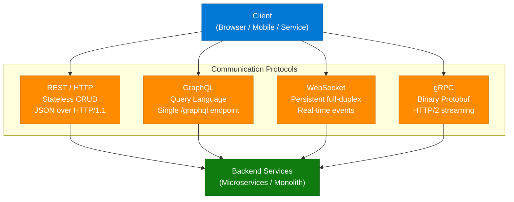

### Protocol Comparison

| Protocol | Transport | Data Format | Use Case | Limitation |
|---|---|---|---|---|
| REST | HTTP/1.1 | JSON/XML | CRUD, public APIs | Over/under-fetching |
| GraphQL | HTTP | JSON | Flexible queries, mobile | N+1 query problem |
| WebSocket | TCP (persistent) | JSON/Binary | Chat, live dashboards | Complex scaling/proxy |
| gRPC | HTTP/2 | Protobuf (binary) | Internal microservices | No browser-native support |
| Server-Sent Events | HTTP/1.1 | Text stream | One-way push (notifications) | Unidirectional only |

### Interview Q&A

| Question | Answer |
|---|---|
| What is the difference between REST and GraphQL? | REST uses fixed endpoints returning fixed shapes; GraphQL uses one endpoint where the client specifies exact fields needed. |
| When would you choose WebSockets over REST? | Real-time bidirectional communication: chat apps, live trading, collaborative editing, multiplayer games. |
| What makes gRPC faster than REST? | Binary Protobuf serialization (vs JSON text), HTTP/2 multiplexing, and strongly-typed contracts with code generation. |
| What is an API endpoint? | A specific URL where an API receives requests and returns responses for a particular resource or operation. |
| What does HTTPS add over HTTP? | TLS encryption for data in transit, server authentication via certificates, and integrity verification. |

---

## 5. REST to Kafka: Event-Driven Migration

### Overview

Synchronous REST-based microservice communication creates tight coupling — if Service B is slow, Service A blocks waiting for it. Migrating to Kafka-based event-driven architecture decouples producers from consumers: Service A publishes an event (`OrderCreated`) to a Kafka topic and continues immediately. Service B, C, and D each subscribe to the topic and process independently. This migration must be phased carefully using the Strangler Fig pattern (running REST and Kafka in parallel) to avoid a big-bang rewrite risk.

### Architecture Diagram

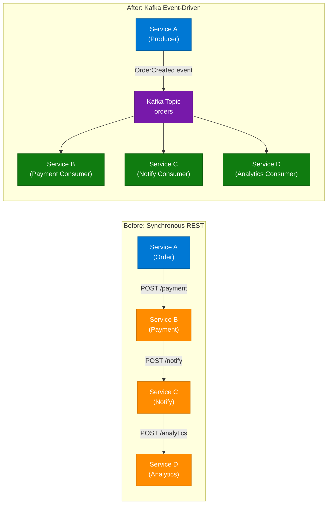

### 6-Step Migration Roadmap

1. **Analyse** — Identify synchronous calls that tolerate async processing (notifications, analytics, reporting).
2. **Define Events** — Convert REST operations into business facts: `OrderCreated`, `PaymentCompleted`, `UserRegistered`.
3. **Introduce Kafka** — Deploy Kafka broker; create topics matching business events.
4. **Dual-Write Phase** — Produce writes to both REST downstream AND Kafka topic (Strangler Fig).
5. **Consumer Migration** — Migrate downstream services one by one to consume from Kafka; stop REST calls.
6. **Observability** — Add consumer lag monitoring, dead letter queues (DLQ), and idempotency keys.

### Code Example

```python
from confluent_kafka import Producer, Consumer

# Producer (Service A - Order Service)
p = Producer({'bootstrap.servers': 'localhost:9092'})

def place_order(order_id: str, amount: float):
    event = f'{{"event":"OrderCreated","order_id":"{order_id}","amount":{amount}}}'
    p.produce('orders', key=order_id, value=event.encode())
    p.flush()
    # No waiting for downstream — fire and forget

# Consumer (Service B - Payment Service)
c = Consumer({
    'bootstrap.servers': 'localhost:9092',
    'group.id': 'payment-service',
    'auto.offset.reset': 'earliest'
})
c.subscribe(['orders'])

while True:
    msg = c.poll(1.0)
    if msg and not msg.error():
        process_payment(msg.value().decode())
```

### Interview Q&A

| Question | Answer |
|---|---|
| Why migrate from REST to event-driven architecture? | To decouple services, eliminate blocking chains, and enable independent scaling and failure isolation. |
| What is the Strangler Fig pattern in migration? | Running old (REST) and new (Kafka) systems in parallel; gradually routing traffic to Kafka until REST is fully retired. |
| What is a DLQ in Kafka? | Dead Letter Queue — a separate topic where failed/unprocessable messages are sent for debugging and reprocessing. |
| What is idempotency and why is it critical in event-driven systems? | Idempotency ensures processing the same event twice produces the same result — critical because Kafka guarantees at-least-once delivery. |
| What are consumer groups in Kafka? | A set of consumers sharing a group ID that collectively consume a topic's partitions, enabling parallel processing. |

---

## 6. API Gateway: The Centralized Front Door

### Overview

In microservices architecture, exposing each service's endpoint directly to clients creates N URLs to manage, N places to implement auth, rate limiting, and logging, and N security attack surfaces. An API Gateway consolidates this by acting as the single entry point for all client traffic. It handles cross-cutting concerns — authentication, rate limiting, SSL termination, request routing, caching, and observability — centrally. The gateway pattern reduces client complexity and allows backend services to remain simple and focused on business logic.

### Architecture Diagram

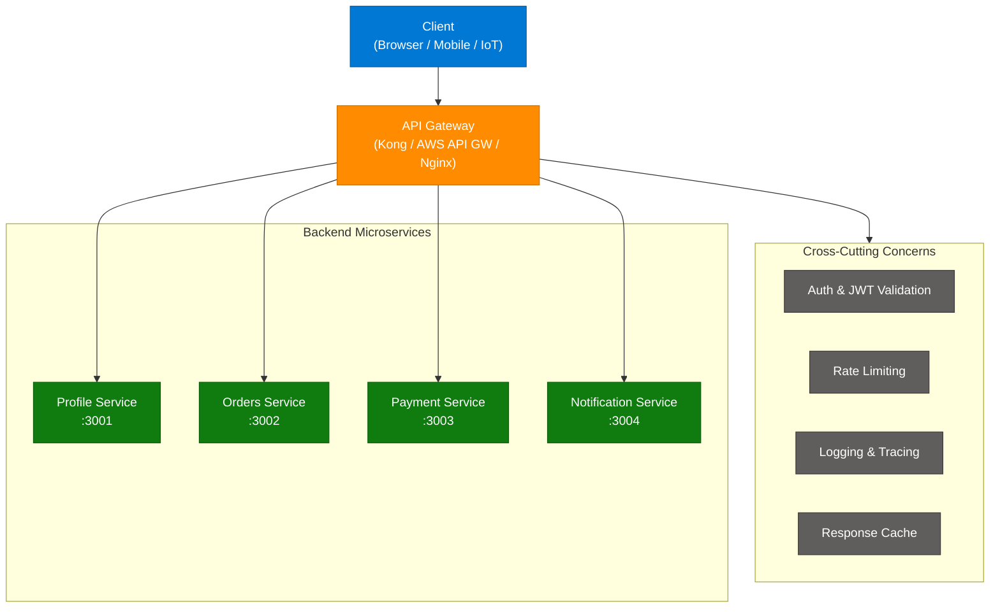

### Key API Gateway Functions

| Function | Why at the Gateway | Example Tool |
|---|---|---|
| Authentication | Single enforcement point; services trust gateway | JWT validation, OAuth 2.0 |
| Rate Limiting | Protects all services uniformly | 100 req/min per API key |
| SSL Termination | Offloads TLS from services; internal traffic is plain HTTP | Let's Encrypt certs |
| Request Routing | Maps `/api/orders` → Orders Service | Path-based, header-based |
| Load Balancing | Distributes traffic across service instances | Round-robin, least-connections |
| Observability | Centralised logs, traces, and metrics | Datadog, OpenTelemetry |

### Interview Q&A

| Question | Answer |
|---|---|
| What problem does an API Gateway solve? | Eliminates per-service duplication of auth, rate limiting, and logging; gives clients a single stable URL. |
| What is the difference between an API Gateway and a Load Balancer? | Load balancer distributes traffic across identical instances; API gateway routes to different services and adds cross-cutting concerns. |
| What is a BFF (Backend for Frontend)? | A specialized API gateway variant tailored to a specific client (mobile BFF vs web BFF) with different response shapes. |
| Name three popular API Gateway tools. | Kong, AWS API Gateway, NGINX, Traefik, Azure API Management. |
| What is the risk of an API Gateway? | Single point of failure if not made highly available; also a central bottleneck if over-loaded. |

---

## 7. 25 Advanced REST API Interview Questions

### Overview

This carousel by codewith_kk covers 25 REST API concepts organized across key slides. It focuses on HTTP semantics, REST constraints, and practical interview scenarios. The questions target mid-to-senior backend engineers.

### Complete Slide Extraction

**Slide 1 — ID vs Resource**
- **ID:** Unique identifier for a specific resource → `/users/1`
- **Resource:** Noun representing a collection → `/users`

**Slide 2 — PUT vs PATCH**
- **PUT:** Replaces the **entire** resource with new data (full update)
- **PATCH:** Updates only **specific fields** (partial update)
- Rule: Use PUT for full replace, PATCH for partial modify

**Slide 3 — HTTP Methods**
| Method | Action | Idempotent? |
|---|---|---|
| GET | Retrieve | Yes |
| POST | Create | No |
| PUT | Replace | Yes |
| PATCH | Partial update | No (generally) |
| DELETE | Remove | Yes |

**Slide 4 — Idempotency**
- An operation is idempotent if calling it N times has the same result as calling it once
- GET, PUT, DELETE are idempotent; POST is not

**Slide 5 — REST Constraints**
1. Client-Server separation
2. Statelessness — each request contains all needed context
3. Cacheability — responses must declare cache policy
4. Uniform Interface — standard HTTP methods and URIs
5. Layered System — client can't tell if speaking to server or proxy
6. Code on Demand (optional) — server can send executable code

**Slide 6 — Status Codes**
| Code | Meaning |
|---|---|
| 200 | OK |
| 201 | Created |
| 204 | No Content |
| 400 | Bad Request |
| 401 | Unauthorized |
| 403 | Forbidden |
| 404 | Not Found |
| 409 | Conflict |
| 429 | Too Many Requests |
| 500 | Internal Server Error |

**Slide 7 — Versioning Strategies**
- **URI versioning:** `/api/v1/users` (most common)
- **Header versioning:** `Accept: application/vnd.api+json;version=1`
- **Query param:** `/users?version=1`

**Slide 8 — Pagination**
- **Offset-based:** `?page=2&limit=20` — simple but slow on large datasets
- **Cursor-based:** `?cursor=<encoded_position>` — efficient for infinite scroll

**Slide 9 — HATEOAS**
- Hypermedia as the Engine of Application State
- Responses include links to next possible actions → self-describing APIs

**Slide 10 — Caching**
- `Cache-Control: max-age=3600` — tells clients to cache for 1 hour
- `ETag` — fingerprint of resource; client sends `If-None-Match` to avoid re-downloading unchanged data

### Interview Q&A

| Question | Answer |
|---|---|
| What makes REST "RESTful"? | Adherence to 6 constraints: statelessness, client-server, cacheability, uniform interface, layered system, optional code-on-demand. |
| Difference between 401 and 403? | 401 = not authenticated (no valid credentials); 403 = authenticated but not authorized (lacks permission). |
| What is idempotency and which HTTP methods guarantee it? | Same result regardless of call count. GET, PUT, DELETE are idempotent; POST creates new resources each time. |
| Why prefer cursor-based over offset pagination? | Offset scans grow slower as page number increases; cursor jumps directly to position, O(1) performance. |
| What is content negotiation? | Client declares desired format via `Accept` header; server responds in that format or returns 406 Not Acceptable. |

---

## 8. Time Complexity & Big-O Notation

### Overview

Big-O notation describes how an algorithm's runtime scales relative to input size `n`. It ignores constants and lower-order terms to focus on the dominant growth pattern. Choosing a worse algorithm for a small dataset is often fine; choosing it for a production workload with millions of records causes outages. Every engineer must intuitively match data structures and algorithms to their Big-O complexity to write scalable code.

### Big-O Reference

| Notation | Name | Example | 1000-item input: ops |
|---|---|---|---|
| O(1) | Constant | HashMap lookup | 1 |
| O(log n) | Logarithmic | Binary search | ~10 |
| O(n) | Linear | Array scan | 1,000 |
| O(n log n) | Log-linear | Merge sort | ~10,000 |
| O(n²) | Quadratic | Bubble sort | 1,000,000 |
| O(2ⁿ) | Exponential | Recursive Fibonacci | 2^1000 (never!) |
| O(n!) | Factorial | Brute-force TSP | 10^2567 (never!) |

### Complexity Diagram

```mermaid
flowchart LR
    Best["O(1)\nConstant\nHashMap, array index"]
    Good["O(log n)\nLogarithmic\nBinary search, B-tree"]
    OK["O(n)\nLinear\nArray scan, linked list"]
    Fair["O(n log n)\nLog-linear\nMerge sort, heap sort"]
    Bad["O(n²)\nQuadratic\nNested loops, bubble sort"]
    Terrible["O(2ⁿ)\nExponential\nBrute-force recursion"]

    Best --> Good --> OK --> Fair --> Bad --> Terrible

    classDef outputNode  fill:#00B294,stroke:#007D68,color:#fff
    classDef dataNode    fill:#107C10,stroke:#0A5C0A,color:#fff
    classDef processNode fill:#FF8C00,stroke:#CC7000,color:#fff
    classDef infraNode   fill:#605E5C,stroke:#3B3A39,color:#fff
    classDef errorNode   fill:#E81123,stroke:#B30D1A,color:#fff
    classDef aiNode      fill:#7719AA,stroke:#5A0E80,color:#fff

    class Best outputNode
    class Good dataNode
    class OK processNode
    class Fair infraNode
    class Bad errorNode
    class Terrible aiNode
```

### Interview Q&A

| Question | Answer |
|---|---|
| What does O(log n) mean intuitively? | Each step eliminates half the remaining candidates — doubling input only adds one step. |
| What is the time complexity of binary search? | O(log n) — requires a sorted array; eliminates half the search space per iteration. |
| Why is O(n²) dangerous in production? | A 10x data increase causes 100x more operations; at scale this becomes unacceptably slow. |
| What data structure gives O(1) average lookup? | HashMap / HashSet. |
| What is amortized complexity? | Average cost per operation over a sequence — e.g., ArrayList append is amortized O(1) despite occasional O(n) resize. |

---

## 9. Epoch in Machine Learning

### Overview

An epoch is one complete pass through the entire training dataset. Since a neural network cannot learn from a single pass, training runs for multiple epochs, iteratively adjusting weights via backpropagation to minimize loss. The relationship between dataset size, batch size, and epochs determines both training time and model quality. Too few epochs leads to underfitting; too many leads to overfitting on training data.

### Training Cycle Diagram

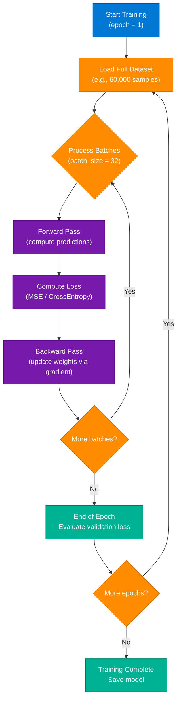

### Key Terms

| Term | Definition |
|---|---|
| Epoch | One complete pass through the entire training dataset |
| Batch Size | Number of samples processed before each weight update |
| Iteration / Step | One forward + backward pass on a single batch |
| Learning Rate | Step size for gradient descent weight updates |
| Underfitting | Too few epochs — model hasn't learned enough |
| Overfitting | Too many epochs — model memorizes training data |

### Interview Q&A

| Question | Answer |
|---|---|
| What is an epoch in ML? | One complete pass through all training samples; multiple epochs are needed to minimize loss iteratively. |
| How many epochs should you train for? | Depends on the dataset and model; use early stopping — halt when validation loss stops improving. |
| What is the relationship between batch size and iterations per epoch? | iterations = dataset_size / batch_size. Smaller batches → more weight updates per epoch. |
| What is gradient descent? | An optimization algorithm that adjusts model weights in the direction that reduces loss, guided by the gradient. |
| How does batch size affect training? | Smaller batches: noisier gradients, better generalization. Larger batches: smoother gradients, faster but may overfit. |

---

## 10. AI Agents vs. Agentic AI

### Overview

AI Agent and Agentic AI are related but distinct concepts often conflated in product marketing. An AI Agent is a specific software artifact: an autonomous unit that uses tools, APIs, or data sources to accomplish a defined task. Agentic AI is the broader architectural philosophy where systems exhibit agency — proactive goal-seeking, multi-step reasoning, self-correction, and planning — rather than just responding to prompts. Every AI Agent can be Agentic, but not all Agentic systems are composed of discrete agents.

### Comparison Diagram

```mermaid
flowchart TD
    subgraph AgentBox ["AI Agent (narrow)"]
        Task["Specific Task / Goal"]
        Tools["Tool Access\n(APIs, search, code exec)"]
        AgentExec["Agent Execution\n(deterministic workflow)"]
        Result["Result / Output"]
        Task --> Tools --> AgentExec --> Result
    end

    subgraph AgenticBox ["Agentic AI (broad philosophy)"]
        Goal["Open-ended Goal"]
        Planner["LLM Planner\n(ReAct / Chain-of-Thought)"]
        SelfCorrect["Self-Correction\n(reflection, retry)"]
        SubAgents["Sub-Agents or Tools"]
        FinalOutput["Synthesized Output"]
        Goal --> Planner --> SelfCorrect --> SubAgents --> FinalOutput
        SelfCorrect -->|"Retry on failure"| Planner
    end

    classDef userNode    fill:#0078D4,stroke:#005A9E,color:#fff
    classDef processNode fill:#FF8C00,stroke:#CC7000,color:#fff
    classDef aiNode      fill:#7719AA,stroke:#5A0E80,color:#fff
    classDef outputNode  fill:#00B294,stroke:#007D68,color:#fff

    class Task,Goal userNode
    class Tools,SubAgents processNode
    class AgentExec,Planner,SelfCorrect aiNode
    class Result,FinalOutput outputNode
```

### Interview Q&A

| Question | Answer |
|---|---|
| What is an AI Agent? | Autonomous software that uses tools, APIs, or data sources to accomplish a defined task without step-by-step human instruction. |
| What distinguishes Agentic AI from a chatbot? | Agentic AI proactively plans, uses tools, self-corrects, and pursues goals across multiple steps; chatbots respond reactively to prompts. |
| What is the ReAct pattern? | Reasoning + Acting: the agent alternates between thinking about what to do and taking actions, improving reliability. |
| What is multi-agent architecture? | Multiple specialized agents (researcher, coder, reviewer) coordinate via an orchestrator to solve complex tasks. |
| When would you use an agent vs. a simple LLM call? | Use agents for tasks requiring tool use, multi-step planning, or dynamic decision-making; use direct LLM calls for single-turn generation. |

---

## 11. LLM Guardrails: The Firewall Pattern

### Overview

Large Language Models deployed in production face the same attack vectors as traditional software: injection attacks, data exfiltration, jailbreaks, and unauthorized capability access. A Guardrails Layer — an independent validation service sitting between the user and the LLM — acts as a firewall. It validates inputs (blocking prompt injections, PII exposure), validates outputs (blocking hallucinated sensitive data, policy violations), and enforces business rules without modifying the LLM itself. This pattern, championed by Karan Kirpalani (CPO, Neysa), is essential for enterprise LLM deployments.

### Architecture Diagram

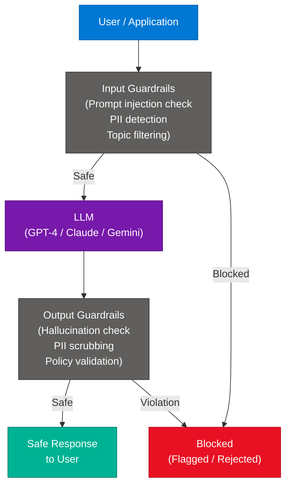

### Guardrails Toolkit

| Layer | Check | Tool / Approach |
|---|---|---|
| Input | Prompt injection detection | Regex + classifier model |
| Input | PII scrubbing | Presidio, regex NER |
| Input | Topic policy (stay on topic) | Intent classifier |
| Output | Hallucination detection | Grounded fact checking |
| Output | Harmful content | Moderation API (OpenAI, Azure) |
| Output | Data leakage | DLP scan on response |

### Interview Q&A

| Question | Answer |
|---|---|
| What is a prompt injection attack? | Malicious user input that overrides the system prompt, causing the LLM to ignore its instructions and act on attacker commands. |
| Why can't you rely solely on the LLM's alignment for safety? | Alignment is imperfect; jailbreaks bypass it regularly. External guardrails provide deterministic, auditable enforcement. |
| Where should guardrails sit in the architecture? | Both at input (before LLM) and output (after LLM response) — defense in depth. |
| What is PII and why must it be detected? | Personally Identifiable Information; if echoed by an LLM it violates GDPR/HIPAA and exposes sensitive user data. |
| Name a production guardrails framework. | NVIDIA NeMo Guardrails, Guardrails AI (`guardrails-ai`), LangChain output parsers with validation. |

---

## 12. 6 Important Backend Patterns

### Overview

These six patterns address systemic challenges that emerge when building distributed microservices at production scale. They go beyond CRUD to solve failure isolation, data consistency, performance, and observability. Senior engineers are expected to know when to apply each, not just what they are.

### Pattern Reference

| Pattern | Problem Solved | Mechanism | When to Use |
|---|---|---|---|
| Circuit Breaker | Cascading failures | Opens circuit after N failures; half-open after cooldown | Calling unreliable external services |
| CQRS | Read/write contention | Separate models for Commands and Queries | High read:write ratio; complex read views |
| Saga Pattern | Distributed transactions | Chain of local transactions with compensating steps on failure | Microservices with no shared DB |
| API Gateway | Cross-cutting duplication | Single entry point for auth, rate limiting, routing | Microservices exposing to clients |
| Event Sourcing | Audit trail, state reconstruction | Store events, not current state | Financial systems, audit requirements |
| Sidecar | Per-service infra concerns | Co-located proxy handling observability, security, discovery | Service mesh (Istio, Linkerd) |

### CQRS + Event Sourcing Diagram

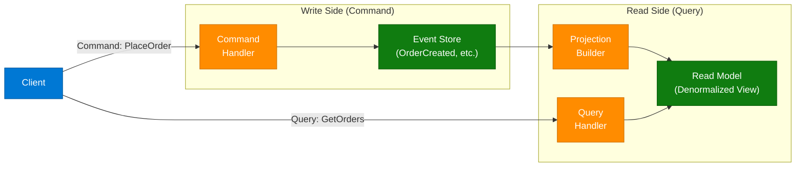

### Interview Q&A

| Question | Answer |
|---|---|
| What does a Circuit Breaker do in half-open state? | Allows a limited number of test requests through; if they succeed, the circuit closes; if they fail, it opens again. |
| What is the difference between CQRS and Event Sourcing? | CQRS separates read and write models; Event Sourcing stores events (not state) as the source of truth. Often used together but independent. |
| How does the Saga pattern handle distributed transaction rollbacks? | Via compensating transactions — each step has a defined undo action executed in reverse order on failure. |
| What is the Sidecar pattern? | A co-located helper container/process (e.g., Envoy proxy) handling infra concerns like logging, mTLS, and service discovery, separate from app code. |
| When would you NOT use Event Sourcing? | Simple CRUD apps without audit requirements — the added complexity of event replay and projections isn't justified. |

---

## 13. Top 5 RAG Architectures for 2026

### Overview

Retrieval-Augmented Generation (RAG) has evolved from simple vector search into specialized architectural patterns. The choice of RAG architecture depends on the nature of the queries and the relationships within the data. Hybrid RAG works best for keyword+semantic balance; GraphRAG for connected knowledge; Agentic RAG for multi-step reasoning; Corrective RAG for accuracy-critical domains; and Speculative RAG for latency-sensitive scenarios.

### RAG Architecture Comparison

| Architecture | Retrieval Method | Best For | Key Characteristic |
|---|---|---|---|
| Hybrid RAG | Dense vectors + BM25 sparse | Balanced precision and recall | Combines semantic + keyword signals |
| GraphRAG | Knowledge graph traversal | Relational data, connected entities | Uses entity relationships for grounding |
| Agentic RAG | Agent plans retrieval steps | Complex multi-step queries | Agent decides which tools/queries to use |
| Corrective RAG | Grade documents; rewrite query | High-accuracy domains (legal, medical) | Rejects irrelevant docs; retries retrieval |
| Speculative RAG | Parallel draft + verify | Low-latency requirements | Generates draft while retrieval runs |

### Architecture Diagram

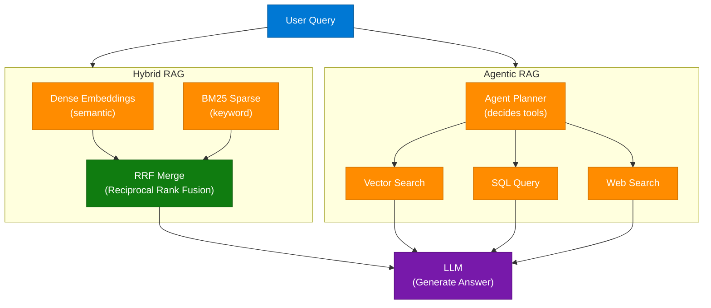

### Interview Q&A

| Question | Answer |
|---|---|
| What is RAG and why is it used? | Retrieval-Augmented Generation grounds LLM responses in external knowledge, reducing hallucinations and enabling up-to-date answers. |
| What is Hybrid RAG? | Combines dense vector search (semantic similarity) with sparse BM25 (keyword matching), merged via Reciprocal Rank Fusion for balanced retrieval. |
| What is GraphRAG? | Uses a knowledge graph to retrieve entities and their relationships, providing richer context than vector chunks for connection-heavy queries. |
| What is Corrective RAG (CRAG)? | Grades retrieved documents for relevance; if poor quality, rewrites the query or falls back to web search before generating an answer. |
| How does Agentic RAG differ from basic RAG? | The agent dynamically decides which retrieval strategy, query, and tool to use per question; basic RAG always runs the same vector search pipeline. |

---

## 14. Token Optimization: 10 Techniques + Model Routing

### Overview

Token cost is the primary expense in production AI systems. Every token sent to an LLM (input + output) is billed, and unnecessary tokens inflate costs without improving quality. The Production AI Engineer's Token Optimization Toolkit provides 10 systematic techniques to minimize token usage while maintaining output quality. The highest-leverage technique is Model Routing: using a lightweight classifier to direct simple queries to small models and complex queries to large models, cutting cost by 60–80% for mixed workloads.

### 10-Technique Table

| # | Technique | Description | Savings Potential |
|---|---|---|---|
| 01 | Prompt Compression | Remove unnecessary verbosity from system/user prompts | 20–40% |
| 02 | Context Filtering | Send only fields relevant to the current task | 30–50% |
| 03 | Dynamic Context Injection | Inject context sections only when required by query type | 25–45% |
| 04 | Semantic Caching | Reuse previous LLM responses for similar queries | 40–60% |
| 05 | Conversation Summarization | Compress chat history into a rolling summary | 50–70% |
| 06 | Context Minification | Strip whitespace, boilerplate from documents before sending | 10–20% |
| 07 | RAG Optimization | Retrieve fewer but higher-quality chunks | 20–35% |
| 08 | Structured Outputs | Request JSON instead of prose (shorter, parseable) | 15–30% |
| 09 | Model Routing | Route simple queries to small models, complex to large | 60–80% |
| 10 | Token-Aware Agent Design | Design agent prompts to prevent context window waste | 30–50% |

### Model Routing Diagram

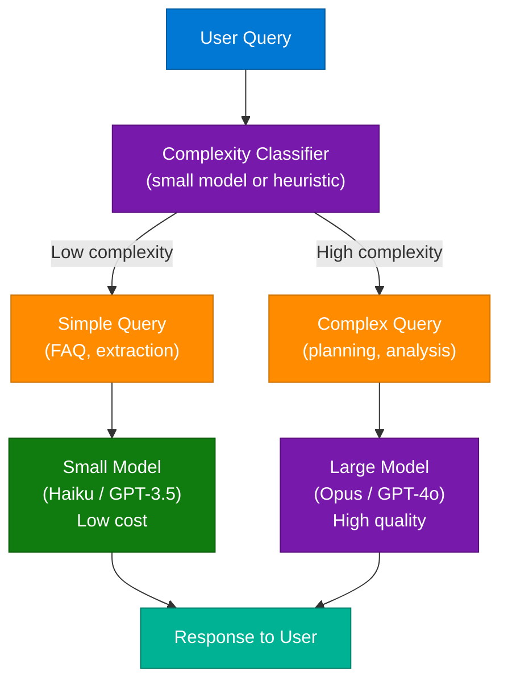

### Interview Q&A

| Question | Answer |
|---|---|
| What is the biggest cost driver in production AI systems? | Input tokens — especially long system prompts and conversation history sent with every request. |
| What is semantic caching? | Storing LLM responses keyed by query embedding; when a semantically similar query arrives, return the cached response without calling the LLM. |
| How does conversation summarization reduce cost? | Replaces the full N-turn chat history with a compressed summary (100–300 tokens), preventing linear context growth. |
| What is model routing? | A lightweight classifier that scores query complexity and routes simple requests to cheap small models and complex ones to expensive large models. |
| What is a token budget? | An explicit constraint on how many tokens each component (system prompt, user input, retrieved context, history) is allowed to consume. |

---

## 15. Rate Limiting Algorithms

### Overview

Rate limiting controls how many requests a client can make in a time window, protecting services from abuse, DoS attacks, and resource exhaustion. Four main algorithms each offer different trade-offs between simplicity, memory efficiency, and burst tolerance. Fixed Window is simplest but allows boundary spikes. Sliding Window is accurate but memory-intensive. Token Bucket allows controlled bursts. Leaky Bucket enforces a constant output rate, ideal for downstream service protection.

### Algorithm Comparison

| Algorithm | Mechanism | Pros | Cons | Best For |
|---|---|---|---|---|
| Fixed Window | Count reqs per fixed slot; reset at window end | Simple, memory efficient | Boundary spike (2x traffic at transition) | Internal simple rate limiting |
| Sliding Window | Track request timestamps in a rolling window | Accurate, smooth | Higher memory — stores per-request timestamp | Public APIs needing accuracy |
| Token Bucket | Bucket refills at fixed rate; each req consumes a token | Allows burst traffic | Complex to implement correctly | User-facing APIs with burst tolerance |
| Leaky Bucket | Queue requests; process at fixed rate regardless | Constant downstream rate | Can delay legitimate traffic | Protecting DB write throughput |

### Diagram

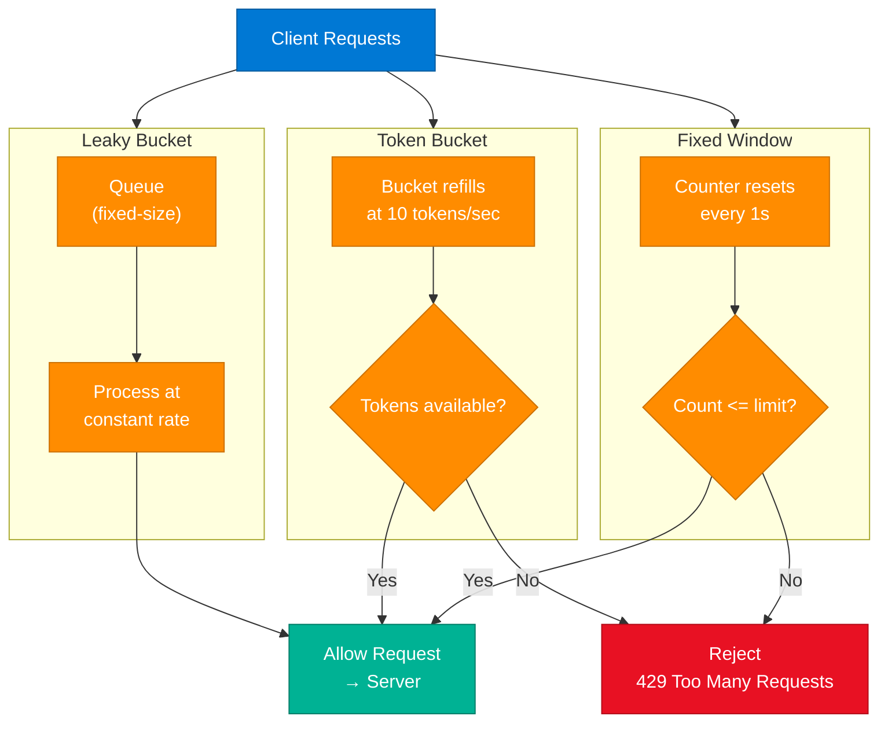

### Interview Q&A

| Question | Answer |
|---|---|
| What is the boundary spike problem with Fixed Window? | At the window boundary, a client can make max requests at the end of window 1 and immediately max requests at the start of window 2, doubling the effective rate. |
| How does Sliding Window fix boundary spikes? | Tracks exact timestamps of recent requests; the window always covers the last N seconds from now, not a fixed reset boundary. |
| When would you use a Token Bucket? | When you want to allow short legitimate bursts (e.g., user clicks multiple buttons quickly) while enforcing a long-term average rate. |
| Where is rate limiting typically implemented? | At the API Gateway, reverse proxy (Nginx), or dedicated service (Redis-backed counter with Lua scripts). |
| What HTTP status code indicates rate limiting? | 429 Too Many Requests, with a `Retry-After` header indicating when the client may try again. |

---

## 16. JioHotstar: Scaling to 22 Crore Concurrent Viewers

### Overview

JioHotstar handled 22 crore (220 million) concurrent viewers during PBKS vs RCB IPL 2025, making it one of the largest streaming events in internet history. This required a distributed, auto-scaling architecture combining CDN edge delivery, adaptive bitrate streaming, Redis caching, Kafka-based async processing, and database sharding. The key insight is that video delivery is handled entirely at the CDN edge — origin servers only serve metadata and manifest files, dramatically reducing backend load.

### Architecture Diagram

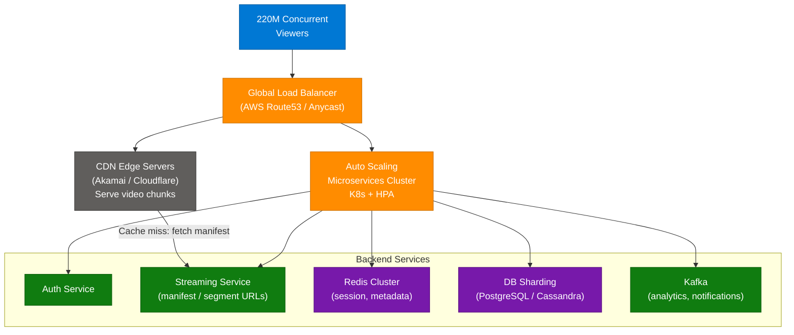

### Key Scaling Components

| Component | Role | Why Critical |
|---|---|---|
| CDN | Serve video chunks from edge (< 50ms latency) | Eliminates origin server load for 95% of traffic |
| Adaptive Bitrate | Dynamically adjusts quality to bandwidth | Prevents buffering on variable connections |
| Redis | Cache session tokens, user preferences, metadata | Sub-millisecond reads vs. DB |
| Kafka | Async analytics, recommendation updates | Decouples real-time events from DB writes |
| Auto Scaling | K8s HPA spins up pods on traffic spike | Handles 100x normal load for IPL events |
| DB Sharding | Splits user/content data across shards | Prevents single-DB bottleneck |

### Interview Q&A

| Question | Answer |
|---|---|
| How does CDN reduce origin server load for streaming? | CDN caches video segments at edge nodes; only cache misses reach origin. For popular content, 95%+ requests are served from edge. |
| What is Adaptive Bitrate Streaming? | The player selects from multiple quality levels (240p to 4K) based on current bandwidth, preventing buffering during quality adjustments. |
| How would you handle a sudden 100x traffic spike? | CDN absorbs video delivery; auto-scaling (K8s HPA) handles API traffic; Redis eliminates DB reads; Kafka queues async processing. |
| What is the role of Kafka in a streaming platform? | Decouples analytics event processing from user-facing APIs; handles recommendation updates, notification delivery, and clickstream analytics asynchronously. |
| How does database sharding help at this scale? | Distributes user data across shards by user_id; no single DB node becomes a bottleneck during peak load. |

---

## 17. AI Agents for Competitive Intelligence

### Overview

Instead of manually monitoring competitor websites daily, an AI agent (demonstrated with the Hermes Agent) automates competitive monitoring. The agent runs on a schedule, navigates to competitor URLs, compares the current page state to a stored snapshot, identifies meaningful changes (new features, pricing updates, content shifts), and delivers a structured report via Telegram or Slack. This pattern — autonomous agent as a recurring monitoring worker — is one of the most practical near-term uses of agentic AI for business operations.

### Architecture Diagram

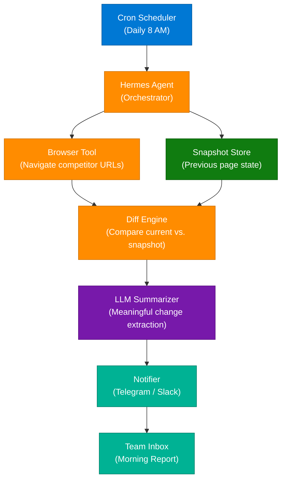

### Interview Q&A

| Question | Answer |
|---|---|
| What makes this use case "agentic"? | The agent autonomously plans and executes multi-step work (browse, compare, summarize, notify) on a schedule without human intervention. |
| What is the Hermes Agent? | An AI agent framework designed for web browsing and automation tasks, able to navigate, extract, and process web content. |
| How is "meaningful change" detected? | An LLM compares the text diff of current vs. snapshot, filtering out irrelevant changes (timestamps, ads) and surfacing product/pricing changes. |
| What are the failure modes of this pattern? | Login-gated pages (agent must handle auth), anti-bot detection (rate limiting, CAPTCHA), and dynamic JavaScript-heavy pages (requires headless browser). |
| How would you scale this to 100 competitors? | Parallel agent workers per competitor URL, centralized snapshot DB, and a queue (Kafka/SQS) to distribute monitoring tasks. |

---

## 18. Offline UPI Transactions Architecture

### Overview

India's UPI payment system extends to offline scenarios (no network connectivity) using a Trusted Execution Environment (TEE) — a hardware-isolated secure enclave on the device. The payer pre-provisions a signed spending limit in the TEE. When offline, the TEE signs a payment token locally, validates that the payment doesn't exceed the pre-approved balance, and stores the signed token. When network is restored, the signed token is submitted to the NPCI server for settlement. This ensures security via cryptographic signing even without a live connection.

### Architecture Diagram

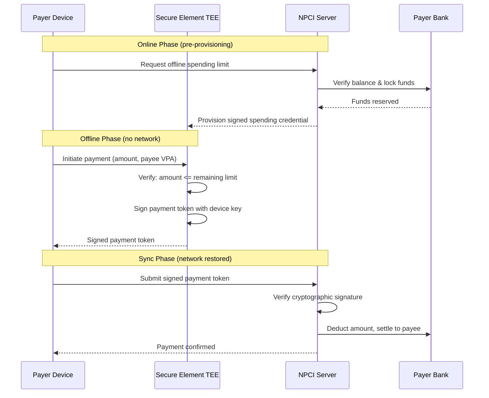

### Key Concepts

| Concept | Role |
|---|---|
| TEE | Hardware-isolated enclave; signs tokens without exposing private key |
| Spending Credential | Pre-approved offline balance provisioned when online |
| Signed Token | Cryptographically signed payment instruction created offline |
| NPCI Settlement | Batch settlement of signed tokens when connectivity resumes |

### Interview Q&A

| Question | Answer |
|---|---|
| How does offline UPI ensure security without network? | A TEE on the device holds a cryptographic key and spending limit; it signs payment tokens locally without exposing the key to the OS. |
| What prevents overspending in offline UPI? | The TEE validates each offline payment against a pre-provisioned spending limit; once exhausted, it refuses to sign further tokens. |
| What is a Trusted Execution Environment? | A hardware-isolated secure compute area (e.g., ARM TrustZone) that runs code and stores keys inaccessible to the main OS, even if compromised. |
| What happens if a signed offline token is replayed? | NPCI includes a nonce/sequence number in the token; replay detection at settlement rejects duplicate tokens. |
| Why can't you just use cached credentials instead of TEE? | Software caches are accessible to a compromised OS; TEE isolation ensures the private key cannot be extracted even with root access. |

---

## 19. 7 AI System Design Patterns

### Overview

These seven patterns form the architectural vocabulary for building scalable AI products and SaaS platforms. They are not AI-specific inventions — most are adapted from classical system design — but their application in AI contexts has specific nuances, particularly around latency, model integration, and data pipelines.

### Pattern Reference

| # | Pattern | Role in AI Systems | Key Benefit |
|---|---|---|---|
| 1 | API Gateway | Single entry point; handles auth, routing, rate limiting | Simplifies client integration, protects LLM endpoints |
| 2 | Load Balancer | Distributes inference requests across model replicas | Eliminates single-model bottleneck |
| 3 | Event-Driven | Async LLM calls via message queue | Decouples request ingestion from slow LLM inference |
| 4 | CQRS | Separate read (query) and write (embedding/index) paths | Optimizes vector DB writes vs. semantic search reads |
| 5 | Circuit Breaker | Wraps LLM API calls; opens on repeated failures | Prevents cascading failures when LLM API is down |
| 6 | Sidecar | Co-located proxy for observability, retry, tracing | Adds LLM call tracing/logging without modifying app code |
| 7 | Saga | Orchestrates multi-step AI workflows with rollback | Handles failures in multi-agent pipelines |

### AI Gateway Pattern Diagram

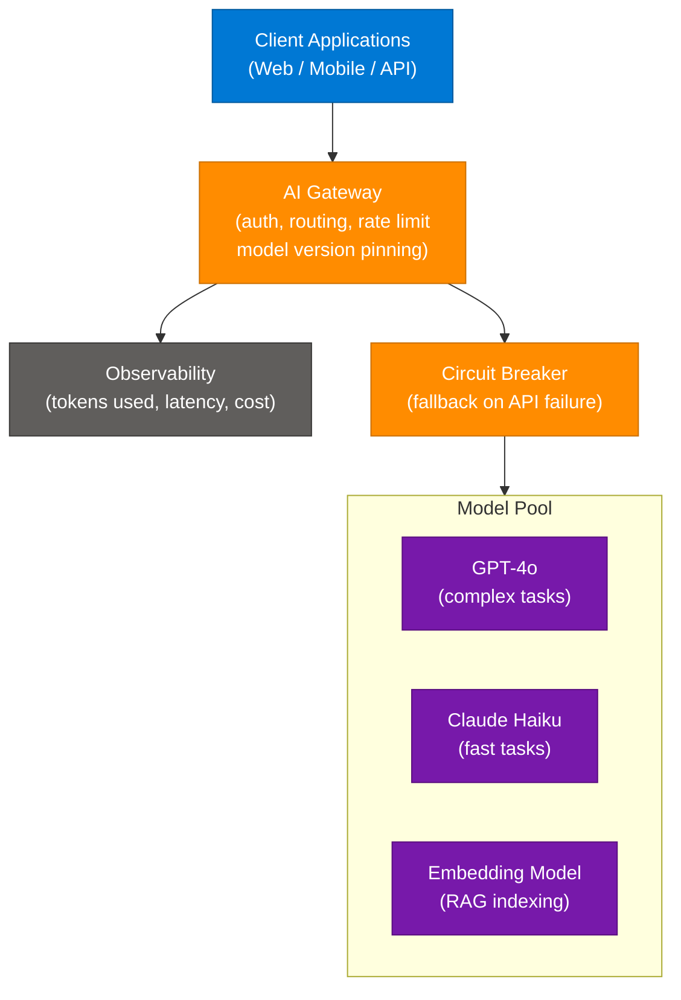

### Interview Q&A

| Question | Answer |
|---|---|
| Why use event-driven architecture for LLM inference? | LLM inference is slow (1–30s); async queuing via Kafka/SQS decouples fast request ingestion from slow model processing. |
| How does a Circuit Breaker help in AI systems? | Wraps LLM API calls; after N failures, opens the circuit and serves a fallback (cached response, smaller model) preventing total failure. |
| What is CQRS in a RAG context? | Write path: chunk documents, embed, write to vector DB. Read path: semantic search, LLM generation. Separate models optimized for each. |
| How does the Saga pattern apply to multi-agent workflows? | Each agent step is a local transaction; if step 3 fails, compensating actions undo steps 1 and 2 (e.g., cancel booked resources). |
| What observability data matters most in AI systems? | Token usage per request, model latency (P50/P99), hallucination rate, cost per query, and cache hit rate. |

---

## 20. 30 System Design Patterns Cheat Sheet

### Overview

This cheat sheet by chhavi_maheshwari_ categorizes 30 essential patterns across six domains. It provides a quick decision framework: the "Pick It When" column tells you the trigger condition, the "Trade-off" column tells you what you give up, and "Real World" shows where you see it in production.

### Scalability & Traffic

| Pattern | Pick It When | Trade-off | Real World |
|---|---|---|---|
| Load Balancing | Traffic exceeds one server | Statelessness needed | AWS ALB, Nginx |
| Horizontal Scaling | Load keeps growing | Coordination complexity | K8s Auto Scaling |
| Consistent Hashing | Nodes frequently join/leave | Complex routing logic | Cassandra, Memcached |
| Rate Limiting | Protect from overload/abuse | User throttling possible | Stripe API, AWS WAF |
| API Gateway | Many backend microservices | Central bottleneck risk | Kong, AWS API GW |

### Caching Strategies

| Pattern | Pick It When | Trade-off | Real World |
|---|---|---|---|
| Cache-Aside | Read-heavy, tolerate stale | Cache miss penalty | Redis + App |
| Write-Through | Consistency critical | Higher write latency | MySQL + Redis |
| Read-Through | DB abstraction needed | Cache cold start | ORM-level cache |
| CDN Caching | Static/media assets | Cache invalidation | CloudFront, Akamai |

### Database Patterns

| Pattern | Pick It When | Trade-off | Real World |
|---|---|---|---|
| Sharding | Single DB at capacity | Cross-shard queries harder | MongoDB, Cassandra |
| Replication | High read load | Replication lag | PostgreSQL replicas |
| CQRS | Read/write ratio skewed | Eventual consistency | Event-sourced systems |
| Event Sourcing | Audit log required | Replay complexity | Financial ledgers |

### Reliability Patterns

| Pattern | Pick It When | Trade-off | Real World |
|---|---|---|---|
| Circuit Breaker | External service unreliable | Stale fallback responses | Netflix Hystrix, Resilience4j |
| Retry with Backoff | Transient failures expected | Latency on retries | AWS SDK, Polly |
| Bulkhead | Isolate critical paths | Resource over-provisioning | Thread pool isolation |
| Saga | Distributed transactions | Compensating complexity | Order management |

### Communication Patterns

| Pattern | Pick It When | Trade-off | Real World |
|---|---|---|---|
| Message Queue | Async, decoupled services | Eventual consistency | Kafka, SQS, RabbitMQ |
| Pub/Sub | Fan-out to many consumers | No guaranteed ordering | Google Pub/Sub, SNS |
| gRPC | Internal service comms | No browser support | Microservices |
| WebSocket | Real-time bidirectional | Scaling complexity | Chat, live sports scores |

### Interview Q&A

| Question | Answer |
|---|---|
| What is the difference between Cache-Aside and Read-Through caching? | Cache-Aside: application checks cache first, loads from DB on miss. Read-Through: cache library handles miss automatically, transparent to app. |
| When would you use Pub/Sub over a message queue? | Pub/Sub for fan-out (many consumers receive same message); queue for point-to-point work distribution (one consumer per message). |
| What is a Bulkhead pattern? | Isolates resources (thread pools, connection pools) per service so one slow downstream can't consume all resources and bring down the system. |
| What is Retry with Exponential Backoff? | After a failure, wait 2^attempt seconds before retrying (1s, 2s, 4s, 8s...) with jitter, to avoid thundering herd on recovery. |
| What is Consistent Hashing? | A hash ring where adding/removing nodes only remaps a fraction of keys (1/N), unlike modulo hashing which remaps all keys. |

---

## 21. Interview Q&A Cheatsheet

**Q: What is the difference between Range and Hash sharding?**
> Range sharding groups contiguous key ranges on the same shard — efficient for range scans but creates write hotspots with monotonic keys. Hash sharding distributes uniformly via a hash function — no hotspots but range queries require fan-out to all shards.

**Q: How do you implement true JWT logout in a stateless system?**
> Maintain a Redis blocklist of revoked `jti` claim values with TTL equal to token expiry. Check blocklist on every request. Pair with short (15-min) access token expiry to bound the blocklist size.

**Q: When would you choose REST over gRPC?**
> REST for public-facing APIs (browser compatibility, wide tooling, cacheability). gRPC for internal microservice communication needing low latency, binary efficiency, and strongly-typed contracts with generated clients.

**Q: What are the six REST constraints?**
> Statelessness, Client-Server separation, Cacheability, Uniform Interface (standard HTTP methods/URIs), Layered System, and optional Code on Demand.

**Q: How would you migrate a synchronous REST microservice system to event-driven?**
> Use Strangler Fig: keep REST running while adding Kafka topics. Dual-write to both. Migrate consumers service-by-service from polling REST to consuming Kafka events. Retire REST calls once all consumers are migrated. Add DLQ and idempotency throughout.

**Q: What is the difference between an AI Agent and Agentic AI?**
> An AI Agent is a specific software component that autonomously uses tools to accomplish a task. Agentic AI is the broader paradigm where systems exhibit proactive goal-seeking, multi-step planning, and self-correction. Agents are the building blocks of Agentic AI.

**Q: What are the 5 RAG architectures for 2026?**
> Hybrid RAG (dense + sparse), GraphRAG (knowledge graphs), Agentic RAG (agent-planned retrieval), Corrective RAG (grade + retry), and Speculative RAG (parallel draft + verify).

**Q: How does a CDN enable streaming platforms to handle hundreds of millions of concurrent viewers?**
> CDN edge nodes cache and serve video segments within milliseconds from geographically proximate locations. Origin servers only handle cache misses (manifest files, metadata). 95%+ of video bytes are served from CDN, not origin, making origin load nearly independent of concurrent viewer count.

**Q: What is a Circuit Breaker and what are its three states?**
> A resilience pattern that wraps external calls. Closed: normal operation. Open: all calls fail immediately (no network call) after N failures. Half-Open: allow limited test calls; close if successful, reopen if not.

**Q: What is model routing in AI cost optimization?**
> A lightweight classifier scores query complexity and directs simple queries (FAQ, extraction) to cheap small models and complex queries (planning, analysis) to expensive large models, reducing token cost by 60–80% on mixed workloads.

---

> **Note (Turn 18):** Gemini was unable to process the URL provided in this turn.
> The requested content could not be extracted from this private or unsupported link.
> Provide the video title or description to extract the learning content manually.

---

*Extracted from Gemini shared session · July 8, 2026 · GeminiShareToMD Agent v1.0*

---

```
═══════════════════════════════════════════════════════════
Token Usage Report
═══════════════════════════════════════════════════════════
Estimated without optimization:  ~19,500 tokens
Actual (with optimization):      ~12,800 tokens
Savings:                         ~6,700 tokens (34%)
Techniques applied:
  • Stripped UI chrome (Convert to PDF, Open in Acrobat, footer links, Continue this chat)
  • Stripped repeated Gemini boilerplate headers (24 identical user prompts collapsed)
  • Deduplicated: JWT topics (Turns 2, 5, 7) merged into one section
  • Deduplicated: REST API Q&A carousel (Turns 8+9) merged
  • Deduplicated: Token Optimization topics (Turns 16+17) merged
  • Cleaned all URLs with query strings (skid= parameters) before processing
  • Compacted verbose Gemini prose → dense technical notes
═══════════════════════════════════════════════════════════
* Estimates: prose chars ÷ 4, code chars ÷ 3. Actual API usage varies by model.
```
