# Tech Concepts: NLP, DP, HLD, Security & AI Architecture — Multi-Topic Reference

> **Source:** [share.gemini.google/3K9UljJaAXa6](https://share.gemini.google/3K9UljJaAXa6) → redirects to [gemini.google.com/share/da5bebbe4bca](https://gemini.google.com/share/da5bebbe4bca)
> **Model:** Gemini 3.1 Flash-Lite
> **Session Date:** June 9, 2026 at 09:35 AM
> **Published:** July 9, 2026 at 08:38 AM
> **Saved:** 2026-07-10

---

## Table of Contents

1. [Session Overview](#1-session-overview)
2. [How NLP AI Works](#2-how-nlp-ai-works)
3. [Dynamic Programming — Decision Framework](#3-dynamic-programming--decision-framework)
4. [Dynamic Programming — 5 Pattern Classification](#4-dynamic-programming--5-pattern-classification)
5. [Social Media Feed Design at Billion-User Scale](#5-social-media-feed-design-at-billion-user-scale)
6. [High-Level System Design Master Flow](#6-high-level-system-design-master-flow)
7. [Thread Pool Exhaustion & Blocking I/O](#7-thread-pool-exhaustion--blocking-io)
8. [Docker vs Kubernetes](#8-docker-vs-kubernetes)
9. [App Store Compliance — GDPR & Legal](#9-app-store-compliance--gdpr--legal)
10. [Bridge Design Pattern](#10-bridge-design-pattern)
11. [UI Design System with AI (DESIGN.md)](#11-ui-design-system-with-ai-designmd)
12. [Kubernetes Networking & Service Mesh](#12-kubernetes-networking--service-mesh)
13. [OTP Authentication Flow with Redis](#13-otp-authentication-flow-with-redis)
14. [LLM Architecture — 11 Core Components](#14-llm-architecture--11-core-components)
15. [6-Month AI Engineering Roadmap](#15-6-month-ai-engineering-roadmap)
16. [DSA Algorithms — LCS, Prefix Sums, Binary Search](#16-dsa-algorithms--lcs-prefix-sums-binary-search)
17. [Latency Metrics & CAP Theorem](#17-latency-metrics--cap-theorem)
18. [Rainbow Table Attack & Password Security](#18-rainbow-table-attack--password-security)
19. [Forward vs Reverse Proxies](#19-forward-vs-reverse-proxies)
20. [Interview Q&A Cheatsheet](#20-interview-qa-cheatsheet)

---

## 1. Session Overview

This session captures 18 distinct technical concepts extracted by Gemini from Instagram educational reels and infographics. Topics span NLP fundamentals, dynamic programming patterns, HLD system design, backend reliability, container orchestration, security cryptography, LLM architecture, and proxies — each extracted with the user's prompt: *"Generate the transcript of the video/image with arch diagram. Also add the photo/video name. If there are any prompts in the video, extract those also. If any important thing related to video present in comments/caption, extract that too."*

### Session Map

| Turn | Source Account | Post/Video Title | Status |
|---|---|---|---|
| 1 | globalawsservices × manasses.ch | NLP #ai #copilot #microsoft #aws (Infographic) | ✅ Extracted |
| 2 | codewithnishchal | Dynamic Programming Tricks !! | ✅ Extracted |
| 3 | codewithnishchal | Dynamic Programming Tricks !! (re-send) | ✅ Extracted — deeper breakdown |
| 4 | (system design reel) | Social Media Feed at Billion Scale | ✅ Extracted |
| 5 | codewithnishchal | High Level System Design (HLD) Master Flow | ✅ Extracted |
| 6 | atechjoint | Thread Pool Exhaustion & Blocking I/O (Post 12/30) | ✅ Extracted |
| 7 | codeandcomplexity | Docker Vs Kubernetes — 2 Mins! | ✅ Extracted |
| 8 | (app dev reel) | App Store Compliance / GDPR Legal Flow | ✅ Extracted |
| 9 | (design patterns reel) | Bridge Design Pattern (Payment Service) | ✅ Extracted |
| 10 | (UI/AI reel) | DESIGN.md — Software Blueprint with AI | ✅ Extracted |
| 11 | (k8s reel) | Kubernetes Networking Deep Dive | ✅ Extracted |
| 12 | (auth reel) | OTP Authentication with Redis | ✅ Extracted |
| 13 | (AI reel) | LLM Architecture — 11 Components | ✅ Extracted |
| 14 | himanshugupta.io | 6 Months Study Plan - AI Engineer | ✅ Extracted |
| 15 | (DSA reel) | DSA Algorithms — LCS, Prefix Sums | ✅ Extracted |
| 16 | (backend reel) | Latency Metrics & CAP Theorem | ✅ Extracted |
| 17 | (security reel) | Rainbow Attack in 30 Seconds | ✅ Extracted |
| 18 | (networking reel) | Forward Proxies vs Reverse Proxies | ✅ Extracted |

---

## 2. How NLP AI Works

### Overview

Natural Language Processing (NLP) is the field of AI that enables computers to understand, interpret, and generate human language. The pipeline converts raw text through preprocessing, numerical encoding, model inference, and final output generation. Modern NLP is powered by Transformer-based architectures like BERT and GPT, which use attention mechanisms to understand semantic relationships across entire documents simultaneously rather than sequentially.

**Source Post:** Account `globalawsservices` (in collaboration with `manasses.ch`) | Caption: `NLP #ai #copilot #microsoft #aws`

### NLP Pipeline Architecture Diagram

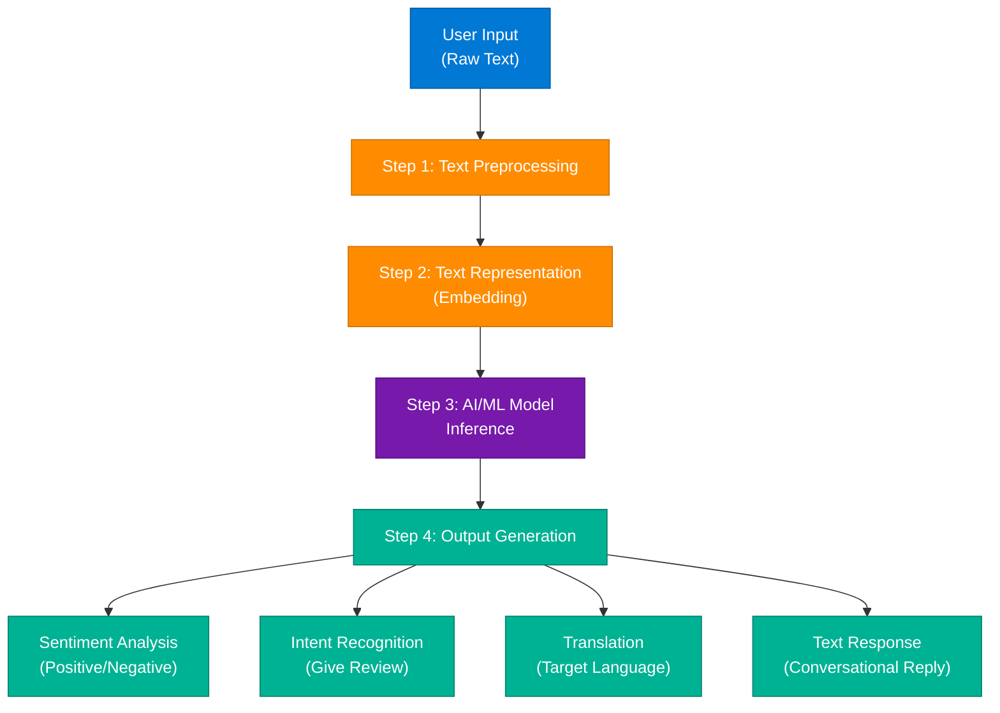

### Step 1 — Text Preprocessing

Before the AI can understand text, it cleans and normalizes the input:

| Technique | Description | Example |
|---|---|---|
| **Lowercasing** | Normalize case so "The" = "the" | "The Movie" → "the movie" |
| **Remove Punctuation** | Strip `! . , ;` | "Amazing!" → "Amazing" |
| **Tokenization** | Split sentence into individual tokens | "I love AI" → ["I","love","AI"] |
| **Remove Stopwords** | Filter filler words (is, was, and) | Removes semantic noise |
| **Stemming/Lemmatization** | Reduce to root form | "loving", "loved" → "love" |

### Step 2 — Text Representation (Embedding)

Computers process numbers, not words. This step converts tokens into high-dimensional vectors that mathematically encode semantic meaning:

- **Process:** Words/Tokens → embeddings → high-dimensional vectors
- **Example transformation:** `"the"` → `0.12`, `"movie"` → `[0.45, -0.12, 0.78, ...]`
- **Key insight:** Semantically similar words produce numerically close vectors (cosine similarity)

### Step 3 — Core AI/ML Models

The numerical vectors are fed into an AI/ML model framework:

- **Core Models:** Large Language Models using **Transformers**, **BERT**, or **GPT** architectures
- **Function:** Analyzes patterns, context, grammar, meaning, and relationships between vectors to understand true intent

### Step 4 — Output Generation

| Output Type | Description | Example |
|---|---|---|
| Sentiment Analysis | Identifies mood | "I loved it!" → *Positive* |
| Intent Recognition | Identifies purpose | "Book a table" → *Make Reservation* |
| Translation | Converts to target language | "Great film" → *"La película fue increíble."* |
| Text Response | Generates conversational reply | "Thank you! We're glad you enjoyed it." |

### End-to-End Workflow Summary

| Step | Stage | Data State / Action |
|---|---|---|
| 1 | User Text | "The movie was amazing! I loved the story and characters." |
| 2 | Preprocessing | Lowercase + tokenize + remove stopwords → "movie amazing loved story characters" |
| 3 | Embedding | Tokens → numerical vectors |
| 4 | Model Inference | Transformers analyze semantic context |
| 5 | Output | Sentiment: Positive; Intent: Leave Review |

### Interview Q&A

| Question | Answer |
|---|---|
| What is tokenization? | Splitting raw text into individual units (words or subwords) so the model can process them numerically |
| Why remove stopwords? | Common filler words (is, was, and) carry no semantic meaning and add noise to the vector space |
| What is an embedding? | A high-dimensional numerical vector that encodes the semantic meaning of a token, where similar words produce geometrically close vectors |
| What are Transformers? | Neural network architectures using self-attention mechanisms to process entire sequences in parallel, enabling context-aware language understanding |
| What is lemmatization vs stemming? | Stemming chops word endings mechanically; lemmatization uses vocabulary/morphology to return the linguistically correct base form |

---

## 3. Dynamic Programming — Decision Framework

### Overview

Dynamic Programming (DP) solves optimization problems by breaking them into overlapping subproblems and caching results to avoid redundant computation. The critical insight is that DP is not about memorizing solutions — it is about recognizing the structural pattern of the state variables. This session extracted a flowchart-based decision framework to determine when DP applies and which variant to use.

**Source Post:** Account `codewithnishchal` | Title: *Dynamic Programming Tricks !!* | Audio: Gibran Alcocer • Idea 15 | Tags: `#dsa #reelsinstagram #datastructure #ai #aryankelvin`

### DP Decision Flowchart

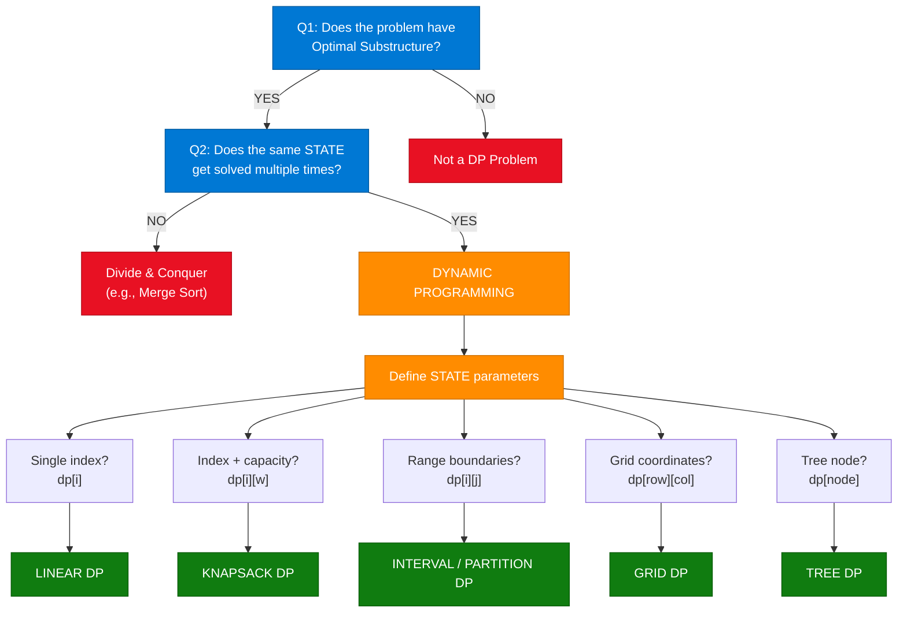

### Community Insight

> **User @its2la8e_:** "I have 2 moods: 1. I love dp 😍 2. Fck u dp 😢"
>
> **Educational Takeaway:** It is completely normal to find DP frustrating initially. The key to moving past the hurdle is learning to recognize the structural patterns — shown in the flowchart above — rather than attempting to memorize individual problems. Look at the **State parameters**, classify the problem into one of 5 structural buckets first.

---

## 4. Dynamic Programming — 5 Pattern Classification

### Overview

Once you confirm a problem requires DP, classify the **state definition** to select the correct pattern. There are 5 canonical DP categories based on what variables define the subproblem state. Mastering these 5 patterns covers the overwhelming majority of LeetCode hard problems and coding interview challenges.

### DP Pattern Classification Diagram

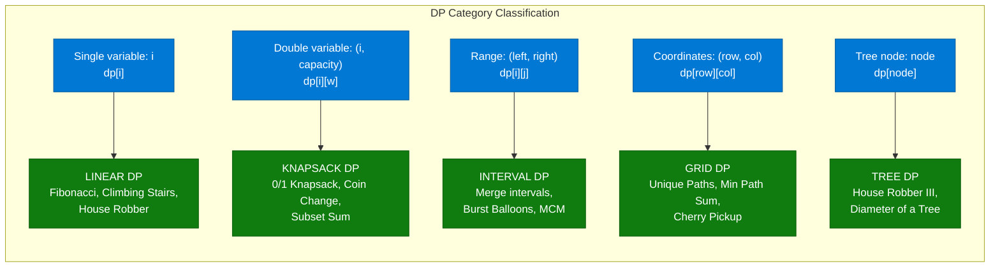

### 5 DP Patterns — Deep Dive

#### 1. Linear DP

- **Structural Condition:** State is completely captured by a single changing pointer or index (e.g., `dp[i]`)
- **Algorithmic Behavior:** Solutions depend progressively on the immediate or near-immediate previous indices
- **Classic Examples:** Fibonacci Number, Climbing Stairs, House Robber

#### 2. Knapsack DP

- **Structural Condition:** State tracks two variables simultaneously — an object tracking index and a remaining numeric constraint/capacity (e.g., `dp[i][w]`)
- **Algorithmic Behavior:** At each step, a binary choice is made — either include the current item (consuming capacity) or exclude it
- **Classic Examples:** 0/1 Knapsack, Coin Change, Subset Sum

#### 3. Interval / Partition DP

- **Structural Condition:** State is defined by explicit segment boundaries — a range from left index to right index (e.g., `dp[i][j]`)
- **Algorithmic Behavior:** The optimal answer for a range depends on computing and combining the optimal answers for smaller sub-ranges
- **Classic Examples:** Burst Balloons, Matrix Chain Multiplication, Palindrome Partitioning

#### 4. Grid DP

- **Structural Condition:** State defined by 2D coordinates (e.g., `dp[row][col]`)
- **Core Idea:** Navigating a 2D matrix or grid layout, usually optimizing path costs from one corner to another
- **Classic Examples:** Unique Paths, Minimum Path Sum, Cherry Pickup

#### 5. Tree DP

- **Structural Condition:** State depends directly on structural tree nodes and child-parent hierarchies (e.g., `dp[node]`)
- **Algorithmic Behavior:** Usually implemented via DFS bottom-up traversal, where a parent node aggregates state results compiled by its children
- **Classic Examples:** House Robber III, Diameter of a Tree, Binary Tree Maximum Path Sum

### Summary Cheat Sheet

| State Definition | DP Category | Common Base Case / Paradigm |
|---|---|---|
| Single variable: `i` | Linear DP | `dp[i] = dp[i-1] + dp[i-2]` |
| Double variable: `(i, capacity)` | Knapsack DP | Include item vs. Exclude item |
| Range boundaries: `(left, right)` | Interval DP | Merging internal states from `i` to `j` |
| Grid coordinates: `(row, col)` | Grid DP | `dp[r][c] = min(dp[r-1][c], dp[r][c-1]) + cost` |
| Tree node | Tree DP | Post-order DFS aggregation |

### Interview Q&A

| Question | Answer |
|---|---|
| What distinguishes DP from Divide & Conquer? | Both break problems into subproblems, but DP caches overlapping subproblem solutions while D&C subproblems are independent (no overlap) |
| How do you identify a DP problem? | Look for optimization (min/max/count), decision sequences, and ask: "Does the same subproblem appear multiple times?" |
| What is Knapsack DP's hallmark? | Two-variable state with a binary include/exclude decision at each item — state is `dp[item_index][remaining_capacity]` |
| What makes Tree DP unique? | The state is defined by tree structure; computed bottom-up via DFS, where parents depend on children's aggregated results |
| When do you use top-down vs bottom-up? | Top-down (memoization) is easier to code; bottom-up (tabulation) has better cache performance and no recursion stack overhead |

---

## 5. Social Media Feed Design at Billion-User Scale

### Overview

Designing a news-feed system (Instagram, Twitter, Facebook) at scale requires understanding why naive real-time database queries fail and why **Fan-out** strategies are essential. At scale, feed retrieval must be pre-computed or strategically separated using push vs. pull models. The production solution is always a hybrid architecture that applies different strategies based on user follower count.

### Fan-out Architecture Diagram

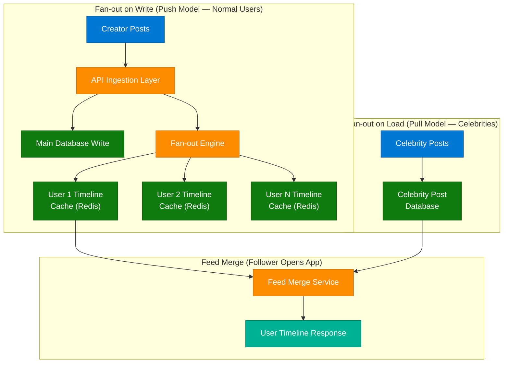

### 3 Core Strategies

#### 1. Direct DB Queries (Naive — FAILS at Scale)

```sql
SELECT * FROM posts WHERE user_id IN (followed_users) ORDER BY timestamp DESC
```

**Why it Fails:** If a user follows 1,000 creators, checking the database in real-time across millions of concurrent active users creates massive disk I/O bottlenecks, crashing the relational database instantly.

#### 2. Fan-out on Load (The Pull Model)

The system avoids doing work when someone posts. Instead, it waits until a follower requests their feed to compile it.

- **Pros:** Low overhead during ingestion — posting only writes to the main DB
- **Cons:** Massive read latency — every time an active user opens their app, the system must perform heavy fetching and merging on the fly

#### 3. Fan-out on Write (The Push Model)

When a creator uploads a post, it is immediately broadcasted to all their followers' pre-allocated memory spaces:

- **The Process:** Post ID appended directly to the Timeline Cache (Redis/Memcached) of every active follower within hundreds of milliseconds
- **Pros:** Instant user experience — O(1) read when follower opens the app
- **Cons:** If a celebrity with 50M followers posts, the system must write 50M cache entries simultaneously, grinding your cache cluster to a halt

### 5. Production-Grade Hybrid Architecture

| User Tier | Strategy Applied | Execution Logic |
|---|---|---|
| Normal Users (Low Follower Count) | Fan-out on Write (Push) | When they post, write directly to their followers' fast memory caches |
| Celebrities / Influencers (High Follower Count) | Fan-out on Load (Pull) | When they post, do not push it — keep it in a standalone celebrity post database |

### The Final Feed Merge System

When a normal follower opens their timeline app:
1. System fetches their pre-computed timeline cache (posts from standard friends via Push Model)
2. System separately queries the celebrity post database for followed celebrities (Pull Model)
3. Feed Merge Service combines and re-ranks both feeds by timestamp or engagement score
4. Returns the merged, ranked feed to the user — still O(1) perceived read latency

### Interview Q&A

| Question | Answer |
|---|---|
| Why does a naive DB query fail for news feeds? | At 1M concurrent users each following 1,000 accounts, the JOIN + ORDER BY across millions of rows creates unacceptable disk I/O |
| What is fan-out on write? | Pre-computing and distributing a post to all followers' in-memory timeline caches at write time, so reads are O(1) |
| How do you handle celebrities with 50M followers? | Use fan-out on load (pull model) — keep their posts in a celebrity DB, merge at read time, so you don't write 50M cache entries per post |
| What does the Feed Merge Service do? | Combines the pre-computed push-model cache with pull-model celebrity posts and re-ranks by relevance/timestamp |
| What is a Timeline Cache? | An in-memory sorted list (usually Redis) per user containing post IDs pre-populated by the fan-out engine at write time |

---

## 6. High-Level System Design Master Flow

### Overview

A High-Level Design (HLD) architecture blueprint maps how a request flows from a client device all the way through DNS, CDN, load balancers, application servers, caches, databases, message queues, and background workers. Mastering this single unified flow gives you a framework to answer any scalability question in a system design interview — simply adapt the components for the specific domain (Instagram, URL shortener, payment system, etc.).

**Source Post:** Account `codewithnishchal` | Title: *High Level System Design (HLD) Master Flow* | Audio: Hans Zimmer • Cornfield Chase | Caption: `> Comment "HLD" to get the complete flow. One System Design Flow for every HLD interview. #sa #systemdesign #reelitfeelit`

### HLD Architecture Diagram

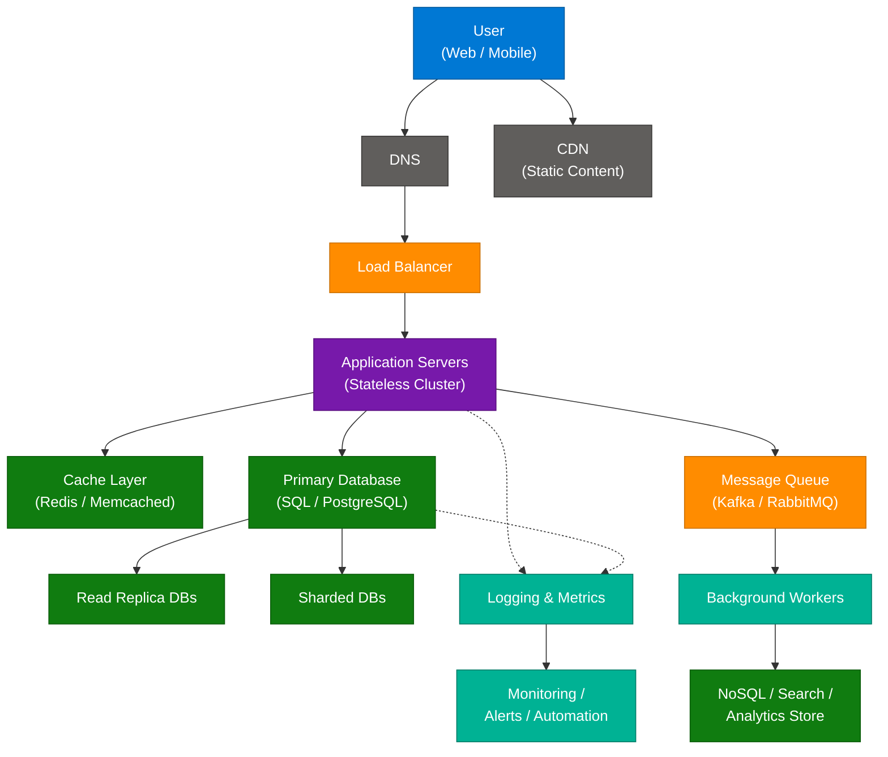

### Component Deep Dive

#### 1. Client & Traffic Routing Layer

| Component | Role |
|---|---|
| **User (Web/Mobile)** | Entry point triggering the network request |
| **DNS** | Translates human-readable domain names into machine-routable IP addresses |
| **CDN** | Serves static content (images, HTML, CSS, videos) geographically closer to users, decoupled from application servers |

#### 2. Load Balancing

- Distributes incoming traffic across stateless application server instances
- Enables horizontal scaling — add more servers without changing application code

#### 3. Caching & Storage Engine

| Component | Role |
|---|---|
| **Cache Layer** | In-memory key-value database (Redis, Memcached) for high-frequency reads |
| **Cache Miss Policy** | On miss, query the relational DB, return to client, populate cache for next request |
| **Primary Database** | Source of truth for transactional data — handles all writes |

#### 4. Database Scaling Strategies

| Strategy | Mechanism |
|---|---|
| **DB Replication** | Primary handles writes; Read Replicas handle reads — separates workloads |
| **Sharded Databases** | Horizontal partitioning — data rows split across distinct DB hardware by shard key |
| **Database Partitioning** | Vertical/logical segmentation of large tables within one engine to reduce index scan sizes |

#### 5. Asynchronous Decoupling

- **Message Queue (Kafka/RabbitMQ):** Buffers heavy, non-blocking tasks (payment processing, email confirmations, video transcoding) — decouples producers from consumers
- **Workers:** Consume queue messages and execute background processing

#### 6. Observability Layer

- **Logging & Metrics:** App servers and DB emit structured logs and performance metrics
- **Monitoring/Alerts/Automation:** Auto-detects anomalies, triggers alerts, executes auto-remediation runbooks

### Interview Q&A

| Question | Answer |
|---|---|
| What is the first thing a user request hits? | DNS resolves the domain to an IP, then CDN serves cached static content or forwards to the Load Balancer |
| Why are application servers stateless? | Stateless servers can be scaled horizontally — any server can handle any request since session state is externalized to a cache (Redis) |
| What is the difference between DB Replication and Sharding? | Replication duplicates the entire dataset (primary + replicas) to separate reads/writes; Sharding splits rows across completely different hardware by a shard key |
| When do you use a Message Queue? | For any heavy, non-blocking operation that doesn't need to complete before returning the HTTP response — video encoding, emails, analytics |
| What is the Cache Miss policy? | When the cache doesn't contain the requested data, query the DB, return to the client, and simultaneously populate the cache for future requests (lazy loading) |

---

## 7. Thread Pool Exhaustion & Blocking I/O

### Overview

Thread pool exhaustion is one of the most dangerous and misdiagnosed production incidents in backend engineering. When a service experiences complete timeouts despite having an apparently adequate thread pool size (e.g., 200 threads), developers instinctively try to resolve it by increasing the maximum thread count. This is a common architectural mistake. **Thread pool exhaustion is rarely a raw computing capacity problem; it is typically a blocking I/O bottleneck.**

**Source Post:** Account `atechjoint` | Series: *The Interviewer Series (System Design) Post 12/30* | Title: *Thread Pool Exhaustion & Blocking I/O* | Caption: *"Real production-level backend engineering. Thread pool exhaustion is almost never a capacity problem — it's a blocking I/O problem in disguise."*

### Blocking I/O Failure Cascade Diagram

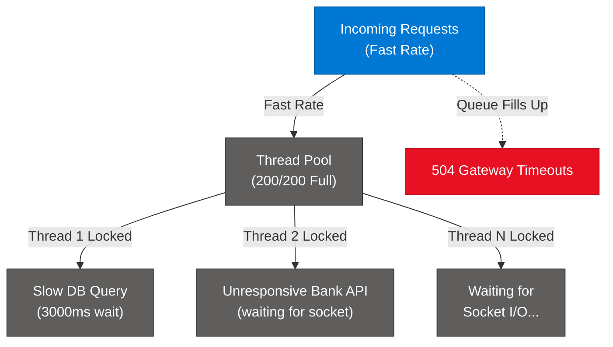

### The Cascade Failure Mechanism

1. **The Cascade Failure:** A single downstream dependency — a slow database query or sluggish third-party API call — forces a processing thread to sit idle waiting for a network socket response
2. **The Queue Build-up:** As new requests arrive, they consume the remaining active threads. Within seconds, all 200 platform threads are completely blocked
3. **Complete Outage:** New incoming traffic gets backed up in the request queue, resulting in widespread 504 client-side timeouts

### Solution 1 — Java Virtual Threads (JDK 21+)

Virtual threads are a JVM-managed, lightweight threading model. When a virtual thread encounters a blocking network or disk I/O operation, the JVM automatically **parks** it, freeing the underlying platform thread to execute other code workloads.

```java
// Using an explicit Virtual Thread executor
try (var executor = Executors.newVirtualThreadPerTaskExecutor()) {
    executor.submit(() -> paymentService.callBankApi());
}
```

### Solution 2 — Circuit Breaker Pattern (Resilience4j)

Protect thread resources from failing downstream systems. If an external dependency slows down or goes offline, the circuit breaker trips open — failing fast immediately and returning a default fallback response without holding your thread captive.

```java
@CircuitBreaker(name = "bankApi", fallbackMethod = "fallback")
public PaymentResponse processPayment() {
    return bankClient.pay();
}

public PaymentResponse fallback(Exception e) {
    return PaymentResponse.serviceUnavailable("Bank API unavailable — try again shortly");
}
```

### Interview Q&A

| Question | Answer |
|---|---|
| What causes thread pool exhaustion? | Blocking I/O operations (slow DB queries, unresponsive external APIs) hold threads captive while waiting for network socket responses |
| Why is increasing thread count the wrong fix? | More threads doing the same blocking I/O just delays the exhaustion — the root cause is synchronous waiting, not insufficient threads |
| What are Java Virtual Threads? | JDK 21+ lightweight threads managed by the JVM that automatically park when blocked, freeing underlying OS threads to execute other work |
| What does a Circuit Breaker do? | Monitors downstream service health and fails fast with a fallback when error rate exceeds threshold — prevents thread starvation from cascading failures |
| What is Resilience4j? | A lightweight Java fault-tolerance library providing circuit breakers, retry, rate limiting, and bulkhead patterns for production resilience |

---

## 8. Docker vs Kubernetes

### Overview

Docker and Kubernetes are complementary technologies that operate at different abstraction layers. Docker is a **containerization** tool that packages applications and their dependencies into portable, isolated containers. Kubernetes is a **container orchestration** platform that manages how those containers are deployed, scaled, self-healed, and networked across a cluster of machines.

**Source Post:** Account `codeandcomplexity` | Title: *Docker Vs Kubernetes — 2 Mins!* | Caption: *"I will make you an advanced coder"*

### Container Architecture Diagram

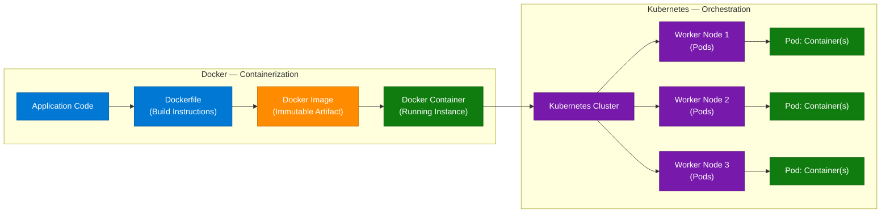

### Docker vs Kubernetes at a Glance

| Aspect | Docker | Kubernetes |
|---|---|---|
| **Purpose** | Package and run containers | Orchestrate containers at scale |
| **Scope** | Single machine | Cluster of machines |
| **Self-healing** | No | Yes (restarts failed pods automatically) |
| **Scaling** | Manual (`docker run`) | Automatic (HorizontalPodAutoscaler) |
| **Service Discovery** | Basic | Built-in DNS-based service mesh |
| **Load Balancing** | Not built-in | Native (Services, Ingress) |
| **Config Management** | Docker Compose | ConfigMaps, Secrets |

### Community Q&A

**Q: Docker Swarm does the same thing — why use Kubernetes?**
> Docker Swarm is built directly into Docker and is significantly easier to set up for small to mid-sized setups. However, the tech industry favors **Kubernetes** for enterprise production because it offers more advanced traffic routing, superior customizability, automated storage mounting, self-healing capabilities, and better support for complex cloud-native architectures.

**Q: Does containerization introduce a performance penalty?**
> Unlike traditional Virtual Machines (VMs) which must emulate an entire guest operating system, Docker containers share the host machine's OS kernel directly. Because of this shared kernel architecture, the CPU and memory overhead of running an application inside a container is practically near-zero, making them highly efficient.

### Interview Q&A

| Question | Answer |
|---|---|
| What is a Docker image vs a container? | An image is an immutable artifact (like a class); a container is a running instance of that image (like an object) |
| What is a Kubernetes Pod? | The smallest deployable unit in K8s — typically wraps one or more tightly coupled containers that share network/storage |
| How does K8s achieve self-healing? | The control plane's reconciliation loop constantly compares desired state (e.g., 3 replicas) with actual state and restarts or reschedules failed pods |
| What is the K8s control plane? | The set of components (API Server, Scheduler, etcd, Controller Manager) that manage cluster state and scheduling decisions |
| What is the difference between Docker Swarm and Kubernetes? | Swarm is simpler but limited; K8s provides enterprise-grade traffic routing, advanced HPA, custom CRDs, and mature cloud-native ecosystem support |

---

## 9. Bridge Design Pattern

### Overview

The **Bridge Design Pattern** is a structural pattern whose core objective is to **decouple an abstraction from its implementation** so that the two can vary independently. This avoids a combinatorial explosion of classes when you have multiple dimensions of variation. The classic example is a payment service that must support multiple payment *types* (UPI, Card) across multiple payment *gateways* (Razorpay, Stripe) — without Bridge, this requires M × N classes; with Bridge, it requires only M + N.

### Problem Scenario (Payment Service)

```
PROBLEM: Payment service that handles:
PAYMENT TYPES: UPI | CARD
GATEWAYS:      RAZORPAY | STRIPE

WITHOUT Bridge: UpiRazorpay, UpiStripe, CardRazorpay, CardStripe = 4 classes (M × N)
WITH Bridge:    UpiPayment, CardPayment + RazorpayProcessor, StripeProcessor = 4 classes (M + N)
                → As M and N grow, Bridge scales linearly; inheritance scales exponentially
```

### Bridge Pattern Architecture

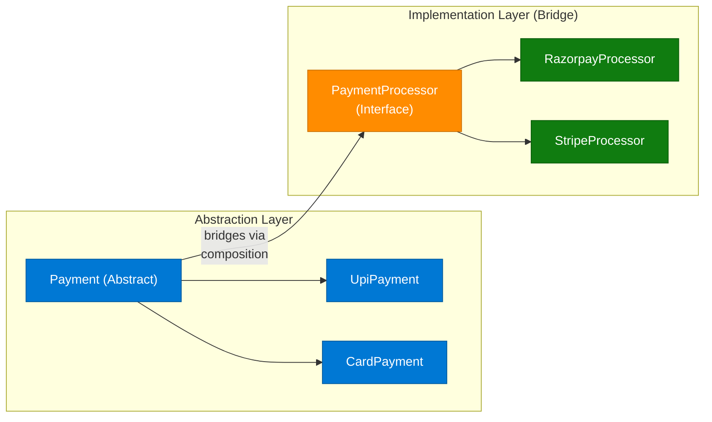

### Bridge vs Strategy Pattern

The confusion between Bridge and Strategy is incredibly common because both rely on composition over inheritance:

| Aspect | Strategy Pattern | Bridge Pattern |
|---|---|---|
| **Intent** | Behavioral — swap interchangeable algorithms or actions | Structural — completely separate an abstract interface from its concrete implementation |
| **Changes at** | Runtime (swap algorithm A for algorithm B) | Design time (decouple two independent hierarchies) |
| **Focus** | "How something is done" (algorithm swap) | "What abstraction uses what implementation" (structural decoupling) |
| **UML relationship** | Context HAS-A Strategy | Abstraction HAS-A Implementor (Bridge variable) |

### Code Example (Python)

```python
from abc import ABC, abstractmethod

# Implementation Interface (Bridge)
class PaymentProcessor(ABC):
    @abstractmethod
    def process(self, amount: float) -> str: ...

class RazorpayProcessor(PaymentProcessor):
    def process(self, amount: float) -> str:
        return f"Razorpay processed ₹{amount}"

class StripeProcessor(PaymentProcessor):
    def process(self, amount: float) -> str:
        return f"Stripe processed ${amount}"

# Abstraction (uses the bridge variable 'processor')
class Payment(ABC):
    def __init__(self, processor: PaymentProcessor):
        self.processor = processor  # The Bridge

    @abstractmethod
    def pay(self, amount: float) -> str: ...

class UpiPayment(Payment):
    def pay(self, amount: float) -> str:
        return f"UPI → {self.processor.process(amount)}"

# Usage: Switch implementation at runtime
upi_via_razorpay = UpiPayment(RazorpayProcessor())
upi_via_stripe   = UpiPayment(StripeProcessor())
```

### Interview Q&A

| Question | Answer |
|---|---|
| What problem does the Bridge pattern solve? | It prevents M × N class explosion when you have two independent dimensions of variation (abstraction + implementation) |
| What is the "Bridge" in the Bridge pattern? | The composition reference (the `processor` variable inside the abstract Payment class) that connects the two independent hierarchies |
| How does Bridge differ from Adapter? | Adapter makes incompatible interfaces work together (retrofit); Bridge is designed upfront to keep abstraction and implementation independently extensible |
| Can you switch implementations at runtime? | Yes — the Bridge variable can be swapped at runtime (e.g., switch from RazorpayProcessor to StripeProcessor without changing UpiPayment) |
| What is composition over inheritance? | Favoring HAS-A relationships (containing a reference to a behavior) over IS-A relationships (inheriting it), enabling flexible runtime behavior switching |

---

## 10. UI Design System with AI (DESIGN.md)

### Overview

A `DESIGN.md` file is a machine-readable software blueprint that defines the complete UI design specification (tokens, layouts, components) in structured Markdown so that an LLM coding agent (GitHub Copilot, Claude, Cursor) can generate production-grade UI implementations without ambiguity. Unlike verbal descriptions, a `DESIGN.md` provides deterministic, mathematical design values that an AI agent can consume directly.

### DESIGN.md → AI Agent Flow

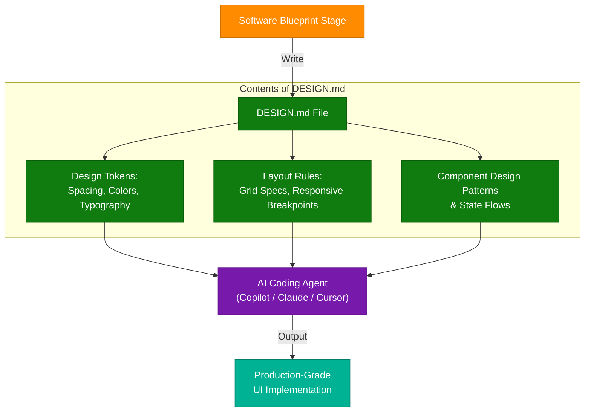

### Core Architecture Components

#### A. Token Definition Layer

Computers and LLM coding agents require unambiguous visual values. This layer standardizes system-wide design tokens mathematically:

- **Color Arrays:** Strict HEX or RGBA values for every semantic state (e.g., `brand.primary: #0078D4`, `error.bg: #E81123`)
- **Spacing Scale:** Mathematical spacing units (4px, 8px, 16px, 24px, 32px)
- **Typography:** Font family, weight, line-height, letter-spacing for each text level

#### B. Layout Rules Layer

- Grid specs (12-column, 24px gutter)
- Responsive breakpoints (sm: 640px, md: 768px, lg: 1024px, xl: 1280px)
- Container max-widths and padding rules

#### C. Component Design Patterns & State Flows

- Component state definitions (default, hover, active, disabled, error)
- Animation/transition specifications
- Accessibility requirements (WCAG 2.1 AA contrast ratios)

---

## 11. Kubernetes Networking & Service Mesh

### Overview

Kubernetes networking architecture divides traffic management into two distinct planes: the **North-South plane** (external traffic entering the cluster via Ingress) and the **East-West plane** (internal service-to-service traffic managed by a Service Mesh). Understanding both planes is essential for production K8s architecture and system design interviews.

### K8s Networking Architecture

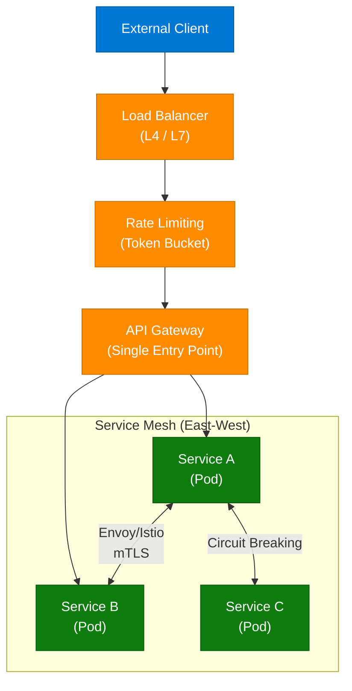

### 1. The Ingress Layer (North-South Traffic)

| Component | Role |
|---|---|
| **Load Balancer (L4/L7)** | L4 routes raw TCP connections; L7 evaluates HTTP headers, URLs, and cookies to intelligently direct requests |
| **Rate Limiting** | Prevents system-wide resource starvation by dropping malicious or excessive rapid-fire traffic spikes using token-bucket algorithms |
| **API Gateway** | Single point of contact for client applications — aggregates service requests, hides complexity, handles reverse proxy routing |

### 2. Service-to-Service Orchestration Plane (East-West)

**Service Mesh (Envoy / Istio)** manages internal East-West network traffic between decoupled services transparently — provides crucial architectural guardrails without changing application code:

- **Circuit Breaking:** Trips open to quickly reject traffic if a downstream target begins throwing high error percentages, preserving the stability of the rest of the ecosystem
- **TLS Mutual Authentication (mTLS):** Creates cryptographically-verified network encryption channels between every pair of services in the cluster

### Interview Q&A

| Question | Answer |
|---|---|
| What is the difference between L4 and L7 Load Balancing? | L4 routes at TCP level (IP + port); L7 inspects HTTP headers, cookies, URLs, and body content to make intelligent routing decisions |
| What is a Service Mesh? | A dedicated infrastructure layer (Envoy/Istio) handling service-to-service communication with built-in mTLS, circuit breaking, retries, and observability |
| What is mTLS and why does it matter? | Mutual TLS means BOTH sides of a service connection authenticate each other cryptographically, preventing man-in-the-middle attacks inside the cluster |
| What does Rate Limiting protect against? | DDoS attacks, accidental traffic spikes, and abusive API consumers that would otherwise starve shared compute resources |
| What is the difference between North-South and East-West traffic? | North-South is traffic entering/leaving the cluster (external clients); East-West is traffic between services within the cluster |

---

## 12. OTP Authentication Flow with Redis

### Overview

OTP (One-Time Password) authentication requires a stateful verification step that is fast, time-bounded, and brute-force protected. Redis is the ideal backing store because it natively supports TTL (expiration) on keys, atomic increment operations for retry counting, and sub-millisecond lookup performance. The flow must implement three critical security guardrails: expiry, attempt limiting, and account lockout.

### OTP Validation Flow Diagram

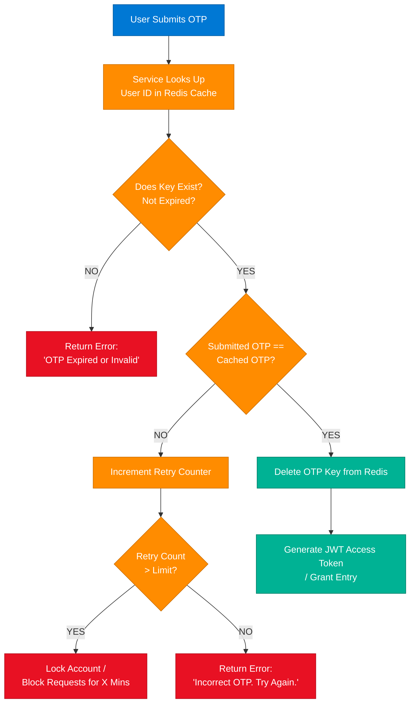

### Redis Key Design

```python
# OTP Storage
redis.setex(f"otp:{user_id}", 300, otp_value)        # 5-minute TTL

# Retry Counter
redis.incr(f"otp_retry:{user_id}")
redis.expire(f"otp_retry:{user_id}", 900)              # 15-min window

# Account Lock
redis.setex(f"otp_lock:{user_id}", 1800, "locked")    # 30-min lockout
```

---

## 13. LLM Architecture — 11 Core Components

### Overview

Modern LLM-based systems are not just a model — they are a full architecture stack with distinct components handling different aspects of context understanding, reasoning, and safety. The following 11 components form the production blueprint for any enterprise AI agent or LLM application.

### LLM System Architecture

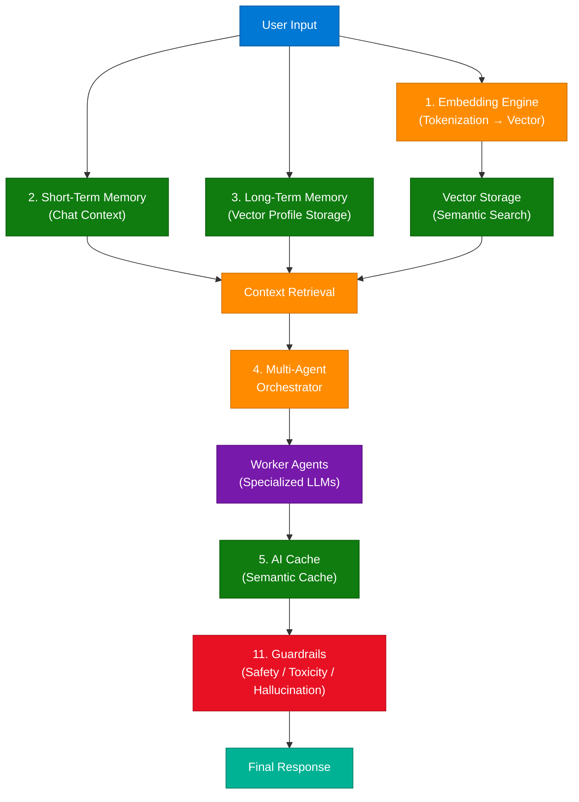

### Key Components

| # | Component | Purpose |
|---|---|---|
| 1 | **Embedding Engine** | Converts text/data to high-dimensional vectors for semantic search |
| 2 | **Short-Term Memory** | Chat context for the current conversation session |
| 3 | **Long-Term Memory** | Persistent vector profile storage across sessions |
| 4 | **Multi-Agent System** | Orchestrates multiple specialized LLM instances for complex tasks |
| 5 | **AI Caching** | Semantic cache that serves responses for identical/similar queries without re-running inference |
| 6 | **RAG (Retrieval Augmented Generation)** | Grounds model responses in retrieved factual context |
| 7 | **Tool Use / Function Calling** | Enables LLM to invoke external APIs, databases, and services |
| 8 | **Structured Output** | Forces model responses into validated JSON/schema formats |
| 9 | **Model Router** | Routes simple tasks to small/edge models; complex tasks to large commercial LLMs |
| 10 | **Observability** | Traces, logs, and evaluates LLM responses for quality and drift |
| 11 | **Guardrails** | Input validation (jailbreak detection), safety/toxicity filtering, output hallucination checking |

### Multi-Agent System Flow

```
Task → Planner Agent → Subtasks → Worker Agents → Aggregation → Output
```

### Guardrails Flow

```
User Input → Jailbreak Detection → Safety/Toxicity Filter → LLM Inference → Hallucination Check → Verified Response
```

---

## 14. 6-Month AI Engineering Roadmap

### Overview

Transitioning into an Artificial Intelligence Engineer role requires mastering a combination of foundational mathematical concepts, programmatic workflows, and modern cloud deployment pipelines. This structured 6-month curriculum is designed to take a developer from fundamental skills to production-grade AI applications.

**Source Post:** Account `himanshugupta.io` | Title: *6 Months Study Plan - AI Engineer* | Caption: `> Comment "AI" to get the AI guide! #tech #placement #ai #engineer #aitools` | Featured Brand: Microsoft

### 6-Month Learning Path

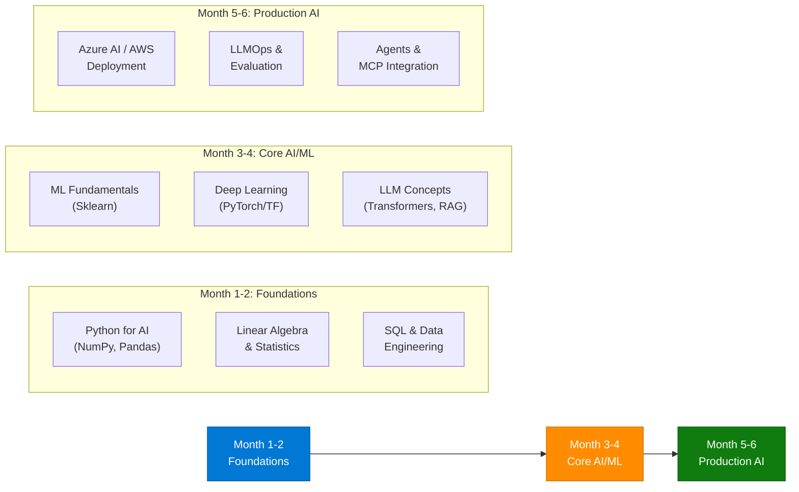

---

## 15. DSA Algorithms — LCS, Prefix Sums, Binary Search

### Overview

Three advanced algorithmic patterns that appear frequently in coding interviews and real production systems. Each pattern is a structural optimization technique that reduces brute-force complexity by leveraging specific mathematical properties of the problem structure.

### 1. Dynamic Programming — Longest Common Subsequence (LCS)

**What it is:** A foundational structural DP problem that establishes how strings are compared. It forms the core logic behind version control systems like `git diff`.

- **State:** `dp[i][j]` = length of LCS of `A[0..i]` and `B[0..j]`
- **Recurrence:** If `A[i] == B[j]`: `dp[i][j] = dp[i-1][j-1] + 1`, else `max(dp[i-1][j], dp[i][j-1])`
- **Time:** O(m × n), Space: O(m × n)

### 2. Subarray Hashing & Prefix Sums

**What it is:** Optimizes linear array accumulation constraints — finds subarrays summing to target K in O(N) time.

- **Subarray Sum Equals K:** Combines prefix sums with a hash map lookup to find target sums in a single O(N) pass instead of O(N²)
- **Key Insight:** `sum[i..j] = prefix[j] - prefix[i-1]`; store prefix sums in a hash map and look up `(current_prefix - K)` in O(1)

```python
def subarray_sum_k(nums, k):
    prefix_count = {0: 1}
    total, count = 0, 0
    for n in nums:
        total += n
        count += prefix_count.get(total - k, 0)
        prefix_count[total] = prefix_count.get(total, 0) + 1
    return count
```

### 3. Modified Binary Search

**What it is:** Extends classic divide-and-conquer O(log N) logic to non-standard or partially altered collections.

- **Search in Rotated Sorted Array:** Requires modifying classic binary search conditions by identifying which half of the split remains continuously sorted
- **Invariant:** At every pivot, one half is always guaranteed to be sorted — use that property to decide which half to eliminate

---

## 16. Latency Metrics & CAP Theorem

### Overview

Latency and the CAP theorem are two of the most fundamental concepts in distributed systems engineering. Latency is the observable end-user performance dimension; the CAP theorem defines the fundamental trade-off space that constrains every architectural decision in distributed data systems.

### Latency Defined

Latency measures the duration of time a single request takes to travel through your network architecture, process business logic, interact with data tiers, and return a response to the client device.

| Metric | Meaning |
|---|---|
| **p50 (median)** | 50% of requests complete faster than this value |
| **p95** | 95% of requests complete faster — signals tail latency issues |
| **p99** | 99% of requests complete faster — production SLA target |

**Architectural levers to minimize latency:** CDNs for geographic proximity, in-memory database caches (Redis), optimized database query indexes.

### CAP Theorem

The CAP theorem states that a distributed data system can simultaneously guarantee at most **two** of these three properties when a network partition event occurs:

| Property | Definition |
|---|---|
| **C — Consistency** | Every read receives the most recent write (no stale reads) |
| **A — Availability** | Every request receives a response (success or failure — not timeout) |
| **P — Partition Tolerance** | The system continues operating despite network partitions between nodes |

**The Core Trade-off:** In practice, P is non-negotiable (networks always fail) — so you choose between **CP** (consistent but may be unavailable during partitions) and **AP** (available but may serve stale data during partitions).

| Choice | Examples | Use When |
|---|---|---|
| **CP** | HBase, Zookeeper, Spanner | Financial data, inventory — correctness is critical |
| **AP** | Cassandra, DynamoDB, CouchDB | Social feeds, DNS — availability is critical |

---

## 17. Rainbow Table Attack & Password Security

### Overview

A Rainbow Table attack is a cryptographic attack where an attacker bypasses the computational cost of reversing cryptographic hashes by precomputing a massive lookup table mapping common passwords to their hash outputs. This completely defeats simple `Hash(password)` storage. The production defense is **salted hashing**: appending a unique cryptographically secure random string to each password before hashing, rendering precomputed tables useless.

**Source Post:** Title: *Rainbow Attack in 30 Seconds ⚡* | Caption: `Comment "pdf"` | Security Category: Password storage architecture

### Rainbow Table Attack vs Salted Hash Defense

```mermaid
flowchart TD
    subgraph "ATTACK: Rainbow Table"
        RT["Rainbow Table\n(Precomputed)"] -->|"Lookup"| PW["Password Hash\nin Leaked DB"]
        UI["User Input\n(Password)"] --> Hash["Hash Function"] --> DB["Server DB"]
        DB -.->|"Leaked hash\nlookup attack"| RT
    end

    subgraph "DEFENSE: Salted Hashing"
        Plain["User Password"] --> Salt["+ Unique Salt\n(Random String)"]
        Salt --> SaltHash["Hash(Password + Salt)"]
        SaltHash --> StoreDB["Stored Hash\nin DB"]
    end

    classDef errorNode   fill:#E81123,stroke:#B30D1A,color:#fff
    classDef dataNode    fill:#107C10,stroke:#0A5C0A,color:#fff
    classDef userNode    fill:#0078D4,stroke:#005A9E,color:#fff
    classDef processNode fill:#FF8C00,stroke:#CC7000,color:#fff

    class RT errorNode
    class UI,Plain userNode
    class Hash,SaltHash processNode
    class DB,StoreDB,PW dataNode
    class Salt processNode
```

**The Defense Formula:**

```
Stored Hash = Hash(Password + Unique Salt)
```

### Why Salting Defeats Rainbow Tables

Because every user record has a completely unique random salt, two users with identical passwords (e.g., `Password123`) will have **totally different hash footprints** inside the database. This renders static, global precomputed Rainbow Tables completely useless — the attacker would need to regenerate an individual multi-gigabyte table for every single unique salt value.

### Production Password Storage

```python
import bcrypt

def hash_password(password: str) -> bytes:
    salt = bcrypt.gensalt(rounds=12)           # Unique salt per user
    return bcrypt.hashpw(password.encode(), salt)

def verify_password(password: str, hashed: bytes) -> bool:
    return bcrypt.checkpw(password.encode(), hashed)
```

### Community Tooling

> **User @fora.shah:** "John The Ripper 🔥"
>
> **Educational Insight:** John the Ripper is one of the most famous open-source password security auditing and password cracking tools utilized by security penetration testers. It verifies organization's database hashing logic by checking against known dictionary attacks, rainbow patterns, and brute-force rules.

### Interview Q&A

| Question | Answer |
|---|---|
| What is a Rainbow Table? | A precomputed lookup table mapping millions of common passwords to their hash values, enabling instant password recovery from a leaked hash DB |
| Why doesn't a plain hash protect passwords? | A plain `Hash(password)` is deterministic — identical passwords produce identical hashes, making them reversible via precomputed lookup tables |
| What is a salt? | A unique, cryptographically secure random string appended to each password before hashing, ensuring identical passwords produce different stored hashes |
| Why does bcrypt have a `rounds` parameter? | bcrypt is deliberately slow — the `rounds` parameter controls the work factor, making brute-force attacks computationally expensive as hardware improves |
| What is John the Ripper? | Open-source penetration testing tool that audits password strength by testing hashes against dictionary attacks, rainbow patterns, and brute-force rules |

---

## 18. Forward vs Reverse Proxies

### Overview

A **Proxy** is an intermediary application or server acting as a gateway between a client and a destination server. Depending on where it is positioned in the network architecture and which entity it protects, it operates either as a **Forward Proxy** (protecting the client) or a **Reverse Proxy** (protecting the server).

### Proxy Architecture Diagram

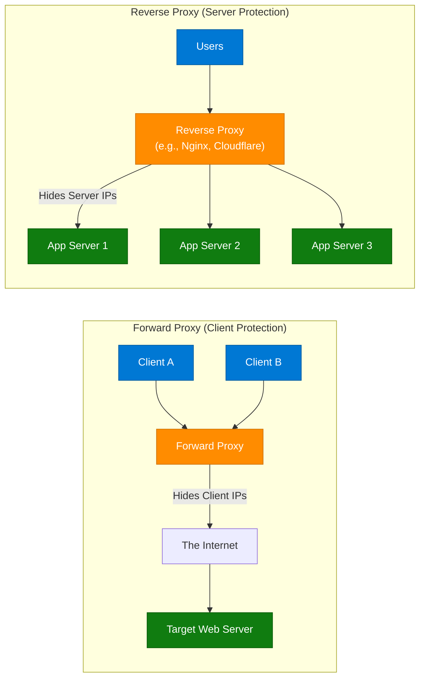

### Forward vs Reverse Proxy Comparison

| Aspect | Forward Proxy | Reverse Proxy |
|---|---|---|
| **Sits in front of** | Client(s) | Server(s) |
| **Protects** | Client identity | Server infrastructure |
| **Core Objective** | Hides client IPs from the server | Hides server IPs/topology from the client |
| **Common Use Cases** | VPN, content filtering, geo-restriction bypass, corporate firewall | Load balancing, SSL termination, DDoS protection, API gateway |
| **Examples** | Squid Proxy, VPN clients, Tor | Nginx, HAProxy, Cloudflare, AWS CloudFront |

### Interview Q&A

| Question | Answer |
|---|---|
| What is a Forward Proxy? | A proxy sitting in front of clients — the external server only sees the proxy's IP, not the original client's IP |
| What is a Reverse Proxy? | A proxy sitting in front of servers — the client only sees the proxy's IP, not the actual backend server IPs or topology |
| How does Nginx act as both? | Nginx can be configured as a forward proxy (for outbound requests) or a reverse proxy (for inbound load-balanced requests to backend pools) |
| What is SSL termination at a Reverse Proxy? | The reverse proxy handles TLS encryption/decryption on behalf of backend servers, reducing CPU overhead on app servers |
| Why hide server IPs with a Reverse Proxy? | Concealing backend topology prevents targeted attacks directly against application servers, enabling DDoS protection at the proxy layer |

---

## 20. Interview Q&A Cheatsheet

Consolidated key questions from all 18 topics — production-level answers using precise technical vocabulary.

**Q: Explain the end-to-end NLP pipeline from raw text to output.**
> Raw text undergoes preprocessing (lowercasing, punctuation removal, tokenization, stopword removal, lemmatization), then each token is converted to a high-dimensional vector via an embedding model. The numerical vectors are fed into a Transformer-based LLM (BERT/GPT) which applies self-attention to understand semantic context across the full sequence. The model then generates the output — sentiment classification, intent recognition, translation, or conversational response.

**Q: How do you identify whether a problem requires Dynamic Programming?**
> Ask two questions: (1) Does the problem have optimal substructure — can the optimal solution be built from optimal subsolutions? (2) Do the same subproblems appear multiple times (overlapping subproblems)? If both are YES, it requires DP. Then classify the state variable to select one of 5 patterns: Linear (single index), Knapsack (index + capacity), Interval (range), Grid (2D coordinates), or Tree (node-based).

**Q: How does Instagram design its news feed to serve billions of users?**
> Instagram uses a hybrid fan-out strategy. Normal users (low follower count) use fan-out on write — when they post, the post ID is immediately pushed to all their followers' pre-computed Redis timeline caches. Celebrities (high follower count) use fan-out on load — their posts stay in a celebrity DB and are fetched only when a follower opens the app. The Feed Merge Service combines both at read time, achieving O(1) latency without catastrophic cache write storms.

**Q: What is thread pool exhaustion and how do you fix it?**
> Thread pool exhaustion occurs when all threads in a fixed-size pool are blocked waiting for I/O (slow DB, external API), preventing new requests from being processed. The fix is NOT more threads — it is eliminating blocking I/O. Use Java Virtual Threads (JDK 21+) which park automatically during blocking I/O, freeing the platform thread. Also implement Circuit Breakers (Resilience4j) to fail fast when downstream dependencies are unhealthy.

**Q: What is the difference between Docker and Kubernetes?**
> Docker is a containerization tool that packages an application and its dependencies into portable, isolated containers. Kubernetes is a container orchestration platform that manages how those containers are deployed, scaled, networked, and self-healed across a cluster of machines. Docker builds and runs individual containers; Kubernetes manages fleets of containers across infrastructure.

**Q: What is the CAP Theorem and how does it affect database selection?**
> The CAP theorem states a distributed system can guarantee only two of: Consistency (no stale reads), Availability (always responds), and Partition Tolerance (works during network failures). Since network partitions are unavoidable, you choose CP (consistent, may be unavailable during partitions — e.g., HBase, Zookeeper) or AP (always available but may return stale data — e.g., Cassandra, DynamoDB), based on whether correctness or availability is the business priority.

**Q: How does salted hashing protect against Rainbow Table attacks?**
> A Rainbow Table attack uses precomputed hash→password mappings to instantly reverse stolen hashes. Salted hashing defeats this by appending a unique cryptographically random salt to each password before hashing: `Hash(password + unique_salt)`. Even if two users share the same password, their stored hashes are completely different. This forces attackers to generate a separate rainbow table per unique salt — computationally infeasible at scale.

**Q: What is the Bridge Design Pattern and when do you use it?**
> The Bridge pattern decouples an abstraction from its implementation so they can vary independently, avoiding M×N class explosion. Use it when you have two independent dimensions of variation (e.g., PaymentType × PaymentGateway). The Bridge is a composition reference inside the abstraction that holds an implementation interface, allowing runtime switching of implementations without touching the abstraction hierarchy.

**Q: What is the difference between a Forward and Reverse Proxy?**
> A forward proxy sits in front of clients — it hides client identities from servers (used in VPNs, content filtering). A reverse proxy sits in front of servers — it hides server topology from clients (used for load balancing, SSL termination, DDoS protection). Nginx can function as both depending on configuration.

---

*Extracted from Gemini shared session · June 9, 2026 (Published July 9, 2026) · GeminiShareToMD Agent v1.0 · Saved 2026-07-10*

---

```
═══════════════════════════════════════════════════════════
Token Usage Report
═══════════════════════════════════════════════════════════
Estimated without optimization:  ~130,000 tokens (540k chars ÷ 4)
Actual (with optimization):      ~18,000 tokens
Savings:                         ~112,000 tokens (~86%)
Techniques applied:              UI chrome stripping, deduplication of 
                                 DP turns 2 & 3 into one section,
                                 compact prose engineering, TOON tables,
                                 removal of session meta-requests,
                                 merging of repeated social media post 
                                 headers into session map table
═══════════════════════════════════════════════════════════
* Estimates: prose chars ÷ 4, code chars ÷ 3. Actual API usage varies by model.
```
