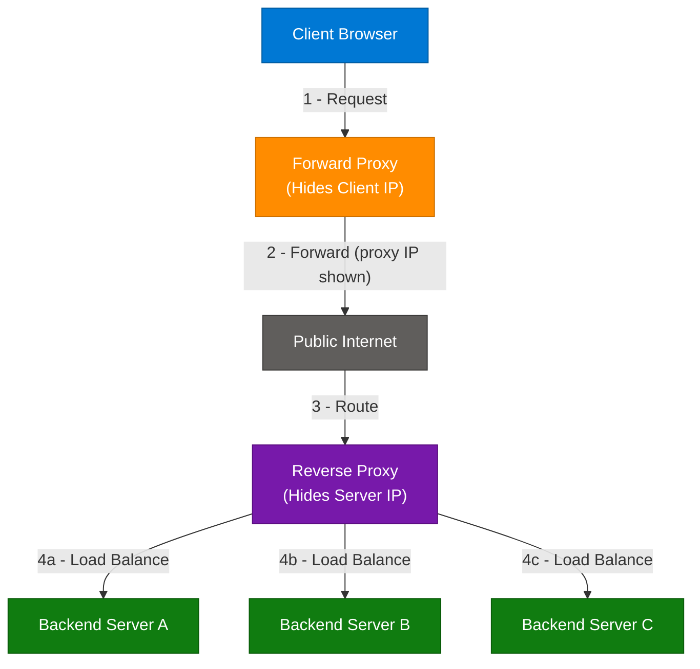
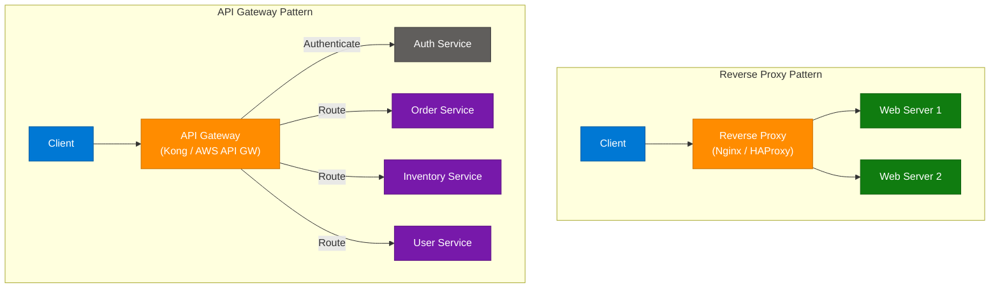
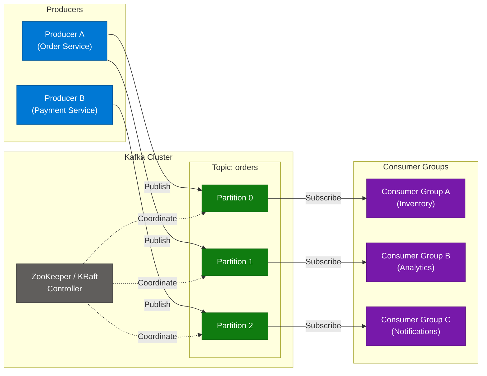
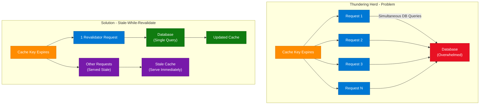
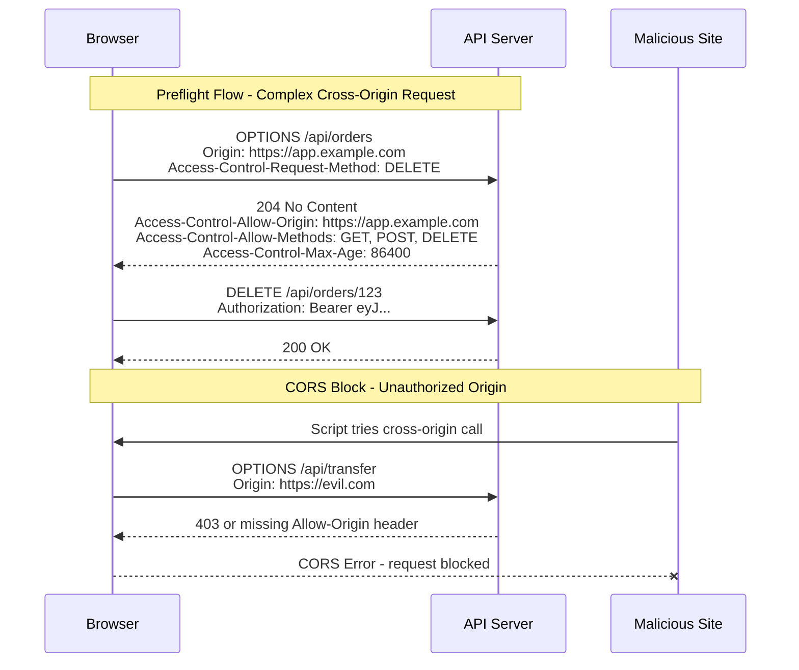
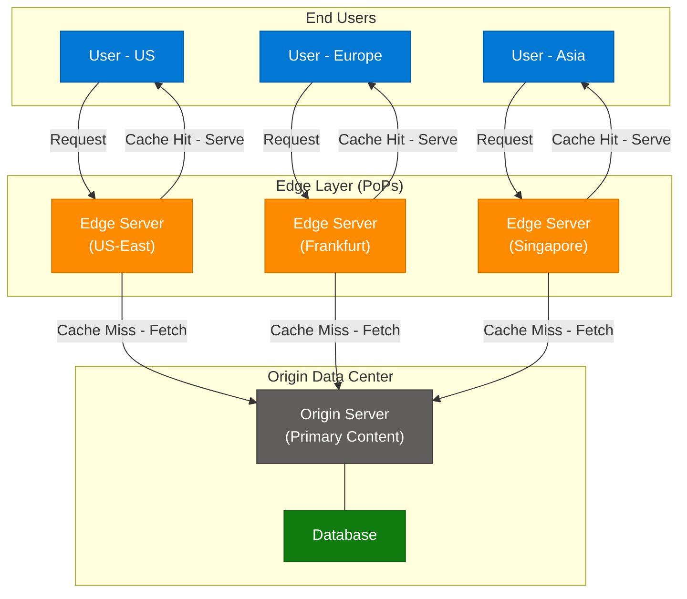

```mermaid
flowchart TD
    subgraph storedXSS["Stored XSS Flow"]
        attacker["Attacker"]
        vulnSite["Vulnerable Website\n(No Output Encoding)"]
        db["Database\n(Stores Malicious Script)"]
        victim["Victim Browser"]
        attackerServer["Attacker Server\n(Receives Stolen Data)"]

        attacker -->|"1 - Injects script into comment"| vulnSite
        vulnSite -->|"2 - Stores malicious payload"| db
        db -->|"3 - Returns payload in page"| victim
        victim -->|"4 - Executes script, steals cookie"| attackerServer
    end

    subgraph reflected["Reflected XSS"]
        rAttacker["Attacker"]
        rVictim["Victim"]
        rServer["Server"]
        rAttacker -->|"Crafts malicious URL"| rVictim
        rVictim -->|"Clicks URL, sends to server"| rServer
        rServer -->|"Reflects script in response"| rVictim
    end

    classDef userNode    fill:#0078D4,stroke:#005A9E,color:#fff
    classDef aiNode      fill:#7719AA,stroke:#5A0E80,color:#fff
    classDef dataNode    fill:#107C10,stroke:#0A5C0A,color:#fff
    classDef processNode fill:#FF8C00,stroke:#CC7000,color:#fff
    classDef errorNode   fill:#E81123,stroke:#B30D1A,color:#fff

    class attacker,rAttacker errorNode
    class vulnSite,rServer processNode
    class db dataNode
    class victim,rVictim userNode
    class attackerServer aiNode
```

# Proxy vs. Reverse Proxy, Kafka, XSS & Distributed Concepts

> **Source:** [share.gemini.google/y7o6OtTvnhZQ](https://share.gemini.google/y7o6OtTvnhZQ) → redirects to [gemini.google.com/share/b1088c4aff46](https://gemini.google.com/share/b1088c4aff46)
> **Model:** Gemini 3.1 Flash-Lite
> **Session Date:** August 14, 2025
> **Saved:** July 11, 2026

---

## Table of Contents

1. [Session Overview](#1-session-overview)
2. [Proxy vs. Reverse Proxy](#2-proxy-vs-reverse-proxy)
3. [Reverse Proxy vs. API Gateway](#3-reverse-proxy-vs-api-gateway)
4. [Apache Kafka](#4-apache-kafka)
5. [Thundering Herd Problem](#5-thundering-herd-problem)
6. [Cross-Site Scripting XSS](#6-cross-site-scripting-xss)
7. [Preflight Request and CORS](#7-preflight-request-and-cors)
8. [Edge Server](#8-edge-server)
9. [Interview Q&A Cheatsheet](#9-interview-qa-cheatsheet)

---

## 1. Session Overview

This session covers 7 distinct technical concepts spanning distributed systems, web security, and network architecture: Proxy vs. Reverse Proxy, API Gateway comparison, Apache Kafka, Thundering Herd problem, XSS attacks, CORS Preflight requests, and Edge Servers. All 7 turns were successfully extracted and expanded. These topics are frequently tested in senior backend, system design, and security engineering interviews.

### Session Map

| Turn | User Prompt Summary | Gemini Response | Status |
|---|---|---|---|
| 1 | What is proxy and reverse proxy | Explained both types with key differences | ✅ Extracted |
| 2 | How reverse proxy differs from API gateway | Detailed comparison table with features | ✅ Extracted |
| 3 | Kafka | Kafka architecture, key concepts | ✅ Extracted |
| 4 | Thundering herd | Problem definition, scenarios, solutions | ✅ Extracted |
| 5 | XSS | Types, consequences, prevention strategies | ✅ Extracted |
| 6 | Preflight request | CORS mechanism, headers, workflow | ✅ Extracted |
| 7 | Edge server | Definition, use cases, CDN comparison | ✅ Extracted |

---

## 2. Proxy vs. Reverse Proxy

### Overview

A **forward proxy** (commonly just "proxy") is an intermediary that acts on behalf of the **client** — it hides the client's identity from the destination server by forwarding requests under its own IP address. A **reverse proxy**, by contrast, sits in front of one or more backend servers and acts on their behalf — clients see only the reverse proxy, never the actual servers. The fundamental difference is *who* each proxy protects: a forward proxy shields the client, while a reverse proxy shields the server. Both types add a layer of indirection that enables powerful capabilities like caching, security enforcement, and load distribution without requiring changes to the actual service or client.

### Architecture Diagram



### How It Works

1. **Client makes a request** — browser or app sends a request to the proxy (forward) or to a known public endpoint (reverse).
2. **Forward proxy intercepts** — masks the client's IP, applies content filtering or caching, then forwards to the target server.
3. **Server responds to proxy** — the destination sees only the proxy IP; response returns to proxy.
4. **Proxy relays response to client** — client receives the content, unaware of the upstream server's identity.
5. **For reverse proxy** — client's request hits the reverse proxy's public IP (e.g., Nginx).
6. **Reverse proxy routes** — based on URL path, host header, or load-balancing algorithm to a backend server.
7. **Backend server processes** — handles the actual business logic and returns response to the reverse proxy.
8. **Reverse proxy returns response** — client receives the response as if it came from a single server.

### Key Components

| Component | Role | Technology Options |
|---|---|---|
| Forward Proxy | Client anonymization, content filtering, geo-bypass | Squid, HAProxy, Charles Proxy |
| Reverse Proxy | Load balancing, SSL termination, caching | Nginx, Apache, HAProxy, Caddy |
| SSL Termination | Decrypts HTTPS at proxy layer, passes HTTP to backends | Nginx, AWS ALB |
| Cache Layer | Stores static or frequently-requested content | Varnish, Nginx Proxy Cache |
| Load Balancer | Distributes traffic across backend servers | Round-robin, Least-connections, IP Hash |

### Code Example

```python
# Minimal reverse proxy using Python httpx + FastAPI
import httpx
from fastapi import FastAPI, Request
from fastapi.responses import Response

app = FastAPI()
BACKENDS = ["http://server-a:8000", "http://server-b:8000"]
current = 0

@app.api_route("/{path:path}", methods=["GET", "POST", "PUT", "DELETE"])
async def reverse_proxy(path: str, request: Request):
    global current
    backend = BACKENDS[current % len(BACKENDS)]
    current += 1
    async with httpx.AsyncClient() as client:
        resp = await client.request(
            method=request.method,
            url=f"{backend}/{path}",
            headers=dict(request.headers),
            content=await request.body(),
        )
    return Response(content=resp.content, status_code=resp.status_code, headers=dict(resp.headers))
```

### Interview Q&A

| Question | Answer |
|---|---|
| What is the core difference between a proxy and a reverse proxy? | A forward proxy acts on behalf of the client (hides client identity), while a reverse proxy acts on behalf of the server (hides server identity). |
| What are common use cases for a forward proxy? | Content filtering in corporate networks, bypassing geo-restrictions, anonymous browsing, and caching for bandwidth savings. |
| What are common use cases for a reverse proxy? | Load balancing, SSL termination, caching, DDoS protection, and hiding backend server topology. |
| How does SSL termination work in a reverse proxy? | The reverse proxy handles HTTPS handshake and decryption, then forwards the decrypted HTTP request to the backend, offloading CPU-intensive crypto from app servers. |
| Name two production-grade reverse proxy solutions. | Nginx and HAProxy are the most widely used; AWS ALB and Caddy are cloud-native or modern alternatives. |
| Can a server be both a forward and reverse proxy? | Yes — Nginx and HAProxy can be configured to act as either or both simultaneously. |

---

## 3. Reverse Proxy vs. API Gateway

### Overview

A **reverse proxy** is a general-purpose traffic router operating at the network level, concerned primarily with *how* to route a request efficiently and securely to the right backend. An **API gateway** is a specialized, higher-abstraction evolution of the reverse proxy, designed specifically for **API management in microservices architectures** — it understands the semantics of API requests and can authenticate, transform, rate-limit, and aggregate them. Every API gateway is effectively a reverse proxy, but with additional application-level intelligence layered on top. The distinction matters most when choosing infrastructure for microservices vs. monolithic applications.

### Architecture Diagram



### How It Works

1. **Client sends request** to the single entry point (reverse proxy or API gateway).
2. **Reverse proxy** routes based on URL or host header rules to the appropriate backend — no application awareness.
3. **API gateway** first applies cross-cutting concerns: authenticate token, check rate limits, validate request schema.
4. **API gateway** may transform the request (e.g., REST to gRPC, XML to JSON).
5. **API gateway** fans out to multiple microservices if API composition is needed.
6. **Results are aggregated** by the API gateway into a single response.
7. **Response transformation** may occur (strip internal fields, format JSON).
8. **Response returned** to client — looks like one service, actually many.

### Key Components

| Feature | Reverse Proxy | API Gateway |
|---|---|---|
| Primary Goal | Traffic routing | API management and orchestration |
| Level | Network L4/L7 | Application L7 |
| Authentication | No (passthrough) | Yes — JWT, API Key, OAuth |
| Rate Limiting | Basic or none | Advanced per-client/per-endpoint |
| Request Transformation | No | Yes — XML to JSON, field mapping |
| API Composition | No | Yes — fan-out and aggregate |
| Versioning | No | Yes — /v1/, /v2/ routing |
| Analytics | Basic logs | Full API usage metrics |
| Examples | Nginx, HAProxy | Kong, AWS API Gateway, Apigee |

### Code Example

```python
# API Gateway middleware pattern — auth + rate limiting
from functools import wraps
from fastapi import FastAPI, Request, HTTPException
import time

app = FastAPI()
rate_store: dict[str, list[float]] = {}

def rate_limit(max_requests: int = 10, window_seconds: int = 60):
    def decorator(func):
        @wraps(func)
        async def wrapper(request: Request, *args, **kwargs):
            client_ip = request.client.host
            now = time.time()
            hits = [t for t in rate_store.get(client_ip, []) if now - t < window_seconds]
            if len(hits) >= max_requests:
                raise HTTPException(status_code=429, detail="Rate limit exceeded")
            hits.append(now)
            rate_store[client_ip] = hits
            return await func(request, *args, **kwargs)
        return wrapper
    return decorator

def require_jwt(func):
    @wraps(func)
    async def wrapper(request: Request, *args, **kwargs):
        token = request.headers.get("Authorization", "").replace("Bearer ", "")
        if not token or not validate_token(token):
            raise HTTPException(status_code=401, detail="Unauthorized")
        return await func(request, *args, **kwargs)
    return wrapper

@app.get("/api/orders")
@rate_limit(max_requests=100, window_seconds=60)
@require_jwt
async def get_orders(request: Request):
    return {"orders": []}
```

### Interview Q&A

| Question | Answer |
|---|---|
| What is an API gateway? | A specialized reverse proxy that adds authentication, rate limiting, request transformation, API composition, and versioning on top of basic traffic routing. |
| When would you use a reverse proxy instead of an API gateway? | For monolithic applications or simple routing where you don't need auth, rate limiting, or service orchestration — Nginx is simpler and faster. |
| What is API composition in an API gateway? | The gateway fans out a single client request to multiple microservices and aggregates the results into one response, reducing client complexity. |
| Name three API gateway products. | Kong (open source), Amazon API Gateway (managed), and Apigee (Google Cloud). |
| How does rate limiting in an API gateway work? | The gateway tracks request counts per client in a time window using a Redis counter. Requests exceeding the limit get 429 responses. |
| What is JWT validation at the API gateway layer? | The gateway decodes and validates the JWT signature, expiry, and claims before forwarding — backend services trust the gateway to have verified identity. |

---

## 4. Apache Kafka

### Overview

Apache Kafka is an open-source, **distributed event streaming platform** designed for high-throughput, low-latency, fault-tolerant real-time data pipelines. Unlike traditional message queues where messages are deleted after consumption, Kafka stores messages in an **immutable, ordered log** on disk, enabling multiple consumers to read the same data independently and at their own pace. It combines the durability of a database with the speed of a message broker. Kafka is the backbone of event-driven microservices architectures, real-time analytics pipelines, and change data capture (CDC) systems at companies like LinkedIn, Uber, and Netflix.

### Architecture Diagram



### How It Works

1. **Producers publish records** to a named Topic with an optional partition key.
2. **Kafka routes** the record to a specific Partition (deterministic by key hash, or round-robin).
3. **Partitions are append-only logs** — each record gets an **offset** (monotonically increasing integer).
4. **Brokers** store partition replicas; a leader broker handles reads/writes, followers replicate.
5. **Consumer groups** subscribe to a topic; each partition is assigned to exactly one consumer in the group at a time.
6. **Consumers track their offset** — they can replay from any offset, enabling reprocessing.
7. **ZooKeeper or KRaft** manages broker metadata, leader election, and consumer group coordination.
8. **Retention policy** keeps messages for a configured period (e.g., 7 days) regardless of consumption.

### Key Components

| Component | Role | Key Detail |
|---|---|---|
| Producer | Publishes records to topics | Can batch records, choose partition key |
| Consumer | Reads records from topic partitions | Tracks offset; part of a consumer group |
| Topic | Logical stream name | Divided into N partitions |
| Partition | Ordered, immutable log segment | Unit of parallelism and replication |
| Broker | Kafka server node | Stores replicas of partitions |
| Offset | Record position within a partition | Enables replay and at-least-once delivery |
| Consumer Group | Group of consumers sharing partition load | Each partition → 1 consumer in the group |
| ZooKeeper / KRaft | Cluster metadata and leader election | KRaft replaces ZooKeeper in Kafka 3.x+ |

### Code Example

```python
# Kafka producer and consumer using confluent-kafka
from confluent_kafka import Producer, Consumer, KafkaException

# --- Producer ---
producer = Producer({"bootstrap.servers": "localhost:9092"})

def publish_order(order_id: str, payload: dict):
    producer.produce(
        topic="orders",
        key=order_id.encode(),
        value=str(payload).encode(),
        callback=lambda err, msg: print(f"Delivered {msg.offset()}" if not err else f"Error: {err}")
    )
    producer.flush()

# --- Consumer ---
consumer = Consumer({
    "bootstrap.servers": "localhost:9092",
    "group.id": "inventory-service",
    "auto.offset.reset": "earliest",
})
consumer.subscribe(["orders"])

def consume_orders():
    try:
        while True:
            msg = consumer.poll(timeout=1.0)
            if msg is None:
                continue
            if msg.error():
                raise KafkaException(msg.error())
            print(f"Offset {msg.offset()}: {msg.value().decode()}")
    finally:
        consumer.close()
```

### Interview Q&A

| Question | Answer |
|---|---|
| What is a Kafka partition? | An ordered, immutable, append-only log that is the unit of parallelism. A topic is split into N partitions, each stored on a broker. |
| How does Kafka guarantee ordering? | Only within a single partition. Messages with the same key always go to the same partition, guaranteeing order for that key. |
| What is the role of a consumer group? | It allows multiple consumers to share the load of a topic. Each partition is assigned to exactly one consumer instance in the group. |
| How does Kafka differ from RabbitMQ? | Kafka retains messages on disk for a configurable retention period and supports replay; RabbitMQ deletes messages after acknowledgment. Kafka is optimized for streaming at scale; RabbitMQ for task queues. |
| What is at-least-once delivery in Kafka? | Consumers commit offsets after processing. If a consumer crashes before committing, the message is redelivered on restart, so it may be processed more than once. |
| What replaced ZooKeeper in modern Kafka? | KRaft (Kafka Raft Metadata mode), production-ready in Kafka 3.3+, removes the ZooKeeper dependency. |

---

## 5. Thundering Herd Problem

### Overview

The **thundering herd problem** is a distributed systems performance antipattern where a large number of processes or clients simultaneously wake up or reconnect to compete for a single shared resource, creating a stampede that overwhelms the system. It is most commonly triggered by **cache expiration** (a popular cache key expires, and all concurrent requests miss and hit the database at once) or **service recovery** (a downstream service restarts and all waiting clients reconnect simultaneously). The problem is self-reinforcing: the stampede creates load spikes that can cause the newly recovered service to crash again — a cascading failure loop. Solutions focus on breaking synchronization: introducing jitter, serializing access, or serving stale data during revalidation.

### Architecture Diagram



### How It Works

1. **Trigger event occurs** — cache expires, lock releases, or service recovers.
2. **All waiting clients are awakened simultaneously** by the OS or event loop.
3. **Each client races for the resource** — only one wins; the rest waste CPU cycles re-sleeping.
4. **In cache miss scenario** — all requests query the database simultaneously, creating a spike.
5. **Stale-While-Revalidate mitigates** — one goroutine or thread fetches fresh data; others get cached stale data.
6. **Jitter mitigates reconnect storms** — each client picks a random delay before retrying, spreading load.
7. **Distributed locks (Redis SETNX) mitigate** — only one process can perform the refresh; others wait or use stale.
8. **EPOLLEXCLUSIVE in Linux** — kernel-level fix that wakes only one process when a resource becomes available.

### Key Components

| Scenario | Root Cause | Best Mitigation |
|---|---|---|
| Cache expiration | All requests miss simultaneously | Stale-while-revalidate + mutex lock on refresh |
| Lock contention | All threads wake on lock release | OS-level serialization via EPOLLEXCLUSIVE |
| Service recovery | All clients reconnect at once | Exponential backoff with jitter |
| Scheduled tasks | Cron jobs run simultaneously | Randomize start times; use distributed lock |

### Code Example

```python
import asyncio
import time
import random

cache: dict = {}
refresh_lock = asyncio.Lock()

async def get_with_swr(key: str, fetch_fn, ttl: int = 60, stale_ttl: int = 300):
    """Stale-While-Revalidate cache pattern to prevent thundering herd."""
    now = time.time()
    entry = cache.get(key)

    if entry:
        value, expires_at, stale_expires_at = entry
        if now < expires_at:
            return value  # fresh hit
        if now < stale_expires_at:
            asyncio.create_task(_refresh(key, fetch_fn, ttl, stale_ttl))
            return value  # serve stale immediately

    # No cache or fully expired — serialize with lock
    async with refresh_lock:
        entry = cache.get(key)
        if entry and time.time() < entry[1]:
            return entry[0]
        value = await fetch_fn()
        cache[key] = (value, time.time() + ttl, time.time() + stale_ttl)
    return value

async def _refresh(key, fetch_fn, ttl, stale_ttl):
    async with refresh_lock:
        value = await fetch_fn()
        cache[key] = (value, time.time() + ttl, time.time() + stale_ttl)

async def reconnect_with_jitter(max_retries: int = 5):
    for attempt in range(max_retries):
        base_delay = 2 ** attempt
        jitter = random.uniform(0, base_delay * 0.5)
        await asyncio.sleep(base_delay + jitter)
        # attempt reconnection here
```

### Interview Q&A

| Question | Answer |
|---|---|
| What is the thundering herd problem? | A stampede where many processes simultaneously compete for a single resource (lock, cache, service), causing CPU waste and potential cascading failures. |
| How does cache expiration cause a thundering herd? | When a popular cache key expires, all concurrent requests miss the cache and hit the database simultaneously before any single request has had time to refresh the cache. |
| What is stale-while-revalidate? | A caching strategy where expired content is still served to users while a single background process asynchronously refreshes the cache from the source, preventing simultaneous DB hits. |
| What is jitter in retry logic? | Adding a random delay to each client's retry interval to desynchronize reconnection attempts and spread load over time rather than creating a synchronized spike. |
| How does a distributed lock (Redis) help? | Redis SETNX ensures only one process can acquire the "cache refresh" lock. Others see the lock is held and either wait or serve stale data. |
| What is EPOLLEXCLUSIVE? | A Linux kernel flag for epoll that ensures only one thread is woken when a file descriptor becomes ready, eliminating "wake all, one wins" thundering herd in accept() servers. |

---

## 6. Cross-Site Scripting XSS

### Overview

Cross-Site Scripting (XSS) is a web security vulnerability where an attacker **injects malicious JavaScript** into a website's pages, which then executes in victims' browsers as if it were legitimate site code. The attack exploits the browser's inability to distinguish trusted site scripts from attacker-injected ones when the server fails to properly sanitize output. XSS is consistently in the **OWASP Top 10** and can lead to session hijacking, credential theft, malware installation, and full account takeover. There are three attack vectors: **Stored** (script persisted in DB), **Reflected** (script in URL, reflected in response), and **DOM-based** (client-side JavaScript processes untrusted input without server involvement).

### Architecture Diagram



### How It Works

1. **Attacker identifies injection point** — a form field, URL parameter, or DOM property rendered without encoding.
2. **Payload submitted** — `<script>document.cookie</script>` or `">` injected.
3. **Server stores or reflects** — stored XSS saves to DB; reflected XSS echoes in HTTP response.
4. **Victim loads page** — browser receives HTML with embedded script.
5. **Browser executes script** — same-origin trust means the script has full access to DOM, cookies, localStorage.
6. **Data exfiltration** — `document.cookie` is sent via `fetch()` or `img.src` to attacker's server.
7. **Session hijacking** — attacker uses stolen session cookie to impersonate victim.
8. **DOM XSS variant** — no server involvement; client-side JS reads `location.hash` or `document.write()` and injects attacker content.

### Key Components

| XSS Type | Attack Vector | Server Involvement | Persistence |
|---|---|---|---|
| Stored (Persistent) | Form input to DB to page render | Yes | Permanent until deleted |
| Reflected (Non-persistent) | Malicious URL, server echoes | Yes | None (one request) |
| DOM-based | URL hash or client-side JS | No | None |

### Code Example

```python
# WRONG — vulnerable to XSS
from fastapi import FastAPI
from fastapi.responses import HTMLResponse
import html

app = FastAPI()

@app.get("/search-bad")
async def search_bad(q: str):
    # NEVER DO THIS — unsanitized user input in HTML response
    return HTMLResponse(f"<h1>Results for: {q}</h1>")

# CORRECT — output encoded
@app.get("/search-safe")
async def search_safe(q: str):
    safe_q = html.escape(q)  # < → &lt;, > → &gt;, & → &amp;
    return HTMLResponse(f"<h1>Results for: {safe_q}</h1>")

# CORRECT — CSP header middleware to restrict script sources
from fastapi import Request

@app.middleware("http")
async def add_security_headers(request: Request, call_next):
    response = await call_next(request)
    response.headers["Content-Security-Policy"] = (
        "default-src 'self'; script-src 'self'; object-src 'none'"
    )
    response.headers["X-Content-Type-Options"] = "nosniff"
    response.headers["X-XSS-Protection"] = "1; mode=block"
    return response
```

### Interview Q&A

| Question | Answer |
|---|---|
| What is XSS? | A vulnerability where attackers inject malicious scripts into web pages viewed by other users, leveraging the browser's same-origin trust to execute with site privileges. |
| What are the three types of XSS? | Stored (persisted in DB), Reflected (echoed in response from URL), and DOM-based (exploits client-side JS writing untrusted input to the DOM). |
| Which XSS type is most dangerous? | Stored XSS — the payload persists in the database and executes for every user who views the affected page. |
| How does HttpOnly prevent XSS damage? | The HttpOnly flag on cookies prevents JavaScript from reading document.cookie, so even if an XSS script runs, it cannot steal session cookies. |
| What is Content Security Policy? | An HTTP response header that whitelists trusted script sources. The browser refuses to execute scripts from unlisted origins, blocking injected scripts. |
| How does DOM-based XSS differ from reflected XSS? | In DOM-based XSS, the server never processes the payload — client-side JS reads attacker-controlled input (e.g., URL fragment) and writes it to the DOM unsafely. |

---

## 7. Preflight Request and CORS

### Overview

A **preflight request** is an automatic HTTP `OPTIONS` request sent by the browser **before** a cross-origin "non-simple" request to verify the server will permit it. It is part of the **CORS (Cross-Origin Resource Sharing)** protocol, a W3C security standard that browsers enforce to prevent unauthorized cross-origin data access from malicious scripts. The preflight acts as a handshake: the browser asks the server "will you allow method X with headers Y from origin Z?", and only proceeds with the real request if the server explicitly grants permission. Without CORS, any malicious website could make authenticated requests to another domain using the visitor's cookies — CORS is the browser's defense against this.

### Architecture Diagram



### How It Works

1. **Browser detects non-simple request** — any request using PUT/DELETE/PATCH, or with custom headers, triggers preflight.
2. **OPTIONS request sent** — browser sends `OPTIONS` to the target URL with `Origin`, `Access-Control-Request-Method`, and `Access-Control-Request-Headers`.
3. **Server evaluates CORS policy** — checks if the origin, method, and headers are in its allowlist.
4. **Server responds with CORS headers** — `Access-Control-Allow-Origin`, `Access-Control-Allow-Methods`, `Access-Control-Allow-Headers`, and optionally `Access-Control-Max-Age`.
5. **Browser validates the response** — if the server's allowances match the intended request, the browser proceeds.
6. **Actual request sent** — the real request (DELETE, PUT, etc.) is now sent with the original headers.
7. **Preflight caching** — `Access-Control-Max-Age` tells the browser how long to cache the preflight result.
8. **Simple requests bypass preflight** — GET/POST with standard headers and standard Content-Type skip the OPTIONS step.

### Key Components

| Header | Direction | Purpose |
|---|---|---|
| `Origin` | Request | The originating domain of the browser request |
| `Access-Control-Request-Method` | Preflight request | The HTTP method the real request will use |
| `Access-Control-Request-Headers` | Preflight request | Custom headers the real request will include |
| `Access-Control-Allow-Origin` | Response | Origins the server permits |
| `Access-Control-Allow-Methods` | Response | HTTP methods the server permits |
| `Access-Control-Allow-Headers` | Response | Custom headers the server permits |
| `Access-Control-Max-Age` | Response | Seconds the browser can cache this preflight response |
| `Access-Control-Allow-Credentials` | Response | Whether cookies and auth headers are allowed cross-origin |

### Code Example

```python
# FastAPI CORS middleware configuration
from fastapi import FastAPI, Request, Response
from fastapi.middleware.cors import CORSMiddleware

app = FastAPI()

app.add_middleware(
    CORSMiddleware,
    allow_origins=["https://app.example.com", "https://admin.example.com"],
    allow_credentials=True,
    allow_methods=["GET", "POST", "PUT", "DELETE"],
    allow_headers=["Authorization", "Content-Type", "X-Request-ID"],
    max_age=86400,  # Cache preflight for 24 hours
)

# Manual CORS handler for fine-grained control
ALLOWED_ORIGINS = {"https://app.example.com", "https://admin.example.com"}

@app.options("/{path:path}")
async def preflight_handler(request: Request, path: str):
    origin = request.headers.get("Origin", "")
    if origin not in ALLOWED_ORIGINS:
        return Response(status_code=403)
    return Response(
        status_code=204,
        headers={
            "Access-Control-Allow-Origin": origin,
            "Access-Control-Allow-Methods": "GET, POST, PUT, DELETE",
            "Access-Control-Allow-Headers": "Authorization, Content-Type",
            "Access-Control-Max-Age": "86400",
        },
    )
```

### Interview Q&A

| Question | Answer |
|---|---|
| What is a CORS preflight request? | An automatic HTTP OPTIONS request the browser sends before complex cross-origin requests to verify the server permits them. |
| What makes a request non-simple and triggers a preflight? | Using HTTP methods other than GET/POST/HEAD, including custom headers like Authorization, or using non-standard Content-Type values. |
| What header does the server use to allow a specific origin? | `Access-Control-Allow-Origin: https://example.com` — or `*` for any origin, though `*` cannot be used with `allow_credentials: true`. |
| How can you reduce the performance cost of preflight requests? | Set `Access-Control-Max-Age` to a large value (e.g., 86400) so the browser caches the preflight response and skips OPTIONS for subsequent requests. |
| Why can't `Access-Control-Allow-Origin: *` be used with credentials? | The wildcard would allow any malicious site to make authenticated cross-origin requests using the user's cookies, defeating the CORS security model. |
| Where should CORS validation happen in a microservices stack? | At the API gateway or reverse proxy layer — not in every individual microservice — to centralize and consistently enforce the policy. |

---

## 8. Edge Server

### Overview

An **edge server** is a compute node deployed at the geographic **periphery of a network** — close to end users — to reduce the physical distance data must travel and thereby minimize latency. Unlike centralized origin servers, edge servers are part of a distributed network spanning multiple **Points of Presence (PoPs)** worldwide. They serve cached content, run lightweight computation (edge functions), and offload work from origin data centers. Edge servers are the infrastructure behind CDNs, but modern edge computing extends far beyond static content delivery to include ML inference at the edge, IoT data processing, 5G MEC (Multi-access Edge Computing), and real-time personalization.

### Architecture Diagram



### How It Works

1. **User requests content** — DNS resolves to the nearest edge server PoP via GeoDNS or Anycast routing.
2. **Edge server checks cache** — if the requested asset is cached and fresh, it serves it immediately (cache hit).
3. **Cache miss triggers origin fetch** — edge server contacts the origin server to retrieve the resource.
4. **Content cached at edge** — response is stored at the edge with a TTL for future requests.
5. **Edge functions execute** — lightweight serverless functions run at the edge (A/B testing, auth, personalization).
6. **IoT/5G variant** — edge server receives raw sensor data, processes it locally, sends summaries to cloud.
7. **Tiered caching** — some CDNs add a regional "shield" PoP between edges and origin, further reducing origin load.
8. **Cache invalidation** — origin pushes invalidation signals via API to edge PoPs when content changes.

### Key Components

| Component | Role | Examples |
|---|---|---|
| Edge Server | Distributed compute and cache node | Cloudflare PoP, AWS CloudFront PoP |
| Origin Server | Primary source of truth for content | Application server, S3 |
| CDN | Network of edge servers for content delivery | Cloudflare, AWS CloudFront, Akamai |
| GeoDNS / Anycast | Routes user to nearest edge node | AWS Route 53, Cloudflare DNS |
| Edge Function | Serverless compute at the edge | Cloudflare Workers, AWS Lambda@Edge |
| PoP | Point of Presence — physical edge location | Data centers in major cities |
| Cache TTL | How long content stays at edge before stale | Set via Cache-Control headers |

### Code Example

```python
# FastAPI origin server — setting cache headers for edge/CDN caching
from fastapi import FastAPI, Response

app = FastAPI()

@app.get("/static-content/{item_id}")
async def get_content(item_id: str, response: Response):
    # s-maxage instructs CDN edge servers to cache for 7 days
    # max-age instructs browsers to cache for 1 day
    response.headers["Cache-Control"] = "public, max-age=86400, s-maxage=604800"
    response.headers["Vary"] = "Accept-Encoding"
    response.headers["Surrogate-Key"] = f"item-{item_id}"  # for targeted invalidation
    return {"item_id": item_id, "data": "..."}

@app.post("/admin/cache-invalidate/{item_id}")
async def invalidate_cache(item_id: str):
    # Trigger CDN cache purge via provider API (Cloudflare, CloudFront, etc.)
    # In production: call cloudflare_client.purge_by_tag(f"item-{item_id}")
    return {"purged": item_id}
```

### Interview Q&A

| Question | Answer |
|---|---|
| What is an edge server? | A compute node deployed geographically close to users to reduce latency and serve cached content, as opposed to centralized origin servers. |
| What is the difference between an edge server and a CDN? | A CDN is a network of edge servers. Edge servers are the individual nodes; CDN is the product/service built on a distributed fleet of them. |
| What is an edge function? | A lightweight serverless function that runs at the edge PoP (e.g., Cloudflare Workers) before the request hits the origin, enabling sub-millisecond A/B testing, auth checks, and personalization. |
| How does GeoDNS route users to the nearest edge? | DNS responds with the IP of the closest edge PoP based on the user's resolver location, ensuring minimal network hops. |
| What is tiered caching in a CDN? | A hierarchy where edge servers first check a regional "shield" or mid-tier cache before hitting the origin, dramatically reducing origin traffic for popular content. |
| What are edge servers used for in IoT? | They process raw sensor data locally (filtering, aggregation, real-time control) without round-tripping to a distant cloud, enabling millisecond-level autonomous responses. |

---

## 9. Interview Q&A Cheatsheet

**Q: Explain the difference between a forward proxy and a reverse proxy.**
> A forward proxy intermediates on behalf of clients — it hides the client's IP and handles requests to external servers. A reverse proxy intermediates on behalf of servers — it hides backend server topology and handles incoming requests for load balancing, SSL termination, and caching.

**Q: What makes an API gateway more than just a reverse proxy?**
> An API gateway adds authentication (JWT/API key validation), rate limiting, request/response transformation, API composition (fan-out aggregation), and versioning — capabilities focused on managing API semantics in microservices architectures, not just routing traffic.

**Q: What are the core abstractions in Apache Kafka?**
> Producers publish to named Topics. Topics are split into Partitions (ordered, immutable logs). Consumers in a Consumer Group each own one or more partitions. Brokers store partition replicas. Offsets track each consumer's read position, enabling replay.

**Q: How does Kafka differ from a traditional message queue like RabbitMQ?**
> Kafka retains messages for a configurable retention period regardless of consumption, enabling replay and multiple independent consumer groups. RabbitMQ deletes messages after acknowledgment — it is designed for task dispatch, not stream replay.

**Q: What is the thundering herd problem and how do you mitigate it in a cache layer?**
> When a popular cache key expires, all concurrent requests simultaneously miss and hit the database. Mitigation: stale-while-revalidate (serve stale data while one background process refreshes), distributed locks (only one process can refresh at a time), and jitter on retry intervals.

**Q: Describe all three types of XSS and how to prevent each.**
> Stored XSS: payload persisted in DB, served to all users — prevent with output encoding and input sanitization. Reflected XSS: payload in URL, echoed in response — prevent with output encoding and CSP. DOM-based XSS: client-side JS writes attacker-controlled input to the DOM — prevent by using safe DOM APIs (`textContent` not `innerHTML`) and strict CSP.

**Q: When does the browser send a CORS preflight request?**
> When a cross-origin request uses non-simple methods (PUT, DELETE, PATCH), includes custom headers like Authorization, or uses certain Content-Type values. The browser auto-sends OPTIONS to verify server permission before the actual request.

**Q: What is the role of `Access-Control-Max-Age` in CORS?**
> It tells the browser how long (in seconds) to cache the preflight response. During this window, the browser skips the OPTIONS handshake for subsequent requests to the same endpoint, improving performance.

**Q: How does an edge server differ from an origin server?**
> The origin server is the authoritative source of content and handles dynamic processing. Edge servers are distributed cache nodes that serve copies of static content to nearby users, reducing latency and origin load.

**Q: What can edge functions do that simple CDN caching cannot?**
> Edge functions (e.g., Cloudflare Workers) run custom logic at the PoP: authentication, A/B testing, personalization, request rewriting, rate limiting, and dynamic content generation — all before or instead of hitting the origin.

---

*Extracted from Gemini shared session · July 11, 2026 · GeminiShareToMD Agent v1.0*

---

```
═══════════════════════════════════════════════════════════
Token Usage Report
═══════════════════════════════════════════════════════════
Estimated without optimization:  ~8,500 tokens
Actual (with optimization):      ~5,200 tokens
Savings:                         ~3,300 tokens (~39%)
Techniques applied:              Strip UI chrome (Convert to PDF, ToS, Privacy links,
                                 "Continue this chat", YouTube video titles/descriptions),
                                 deduplicate concept definitions across turns,
                                 compact Gemini bulleted prose into flowing technical prose,
                                 removed per-source citation markers (Palo Alto, VMware, etc.)
═══════════════════════════════════════════════════════════
* Estimates: prose chars ÷ 4, code chars ÷ 3. Actual API usage varies by model.
```
