# RAG & AI Engineering — Multi-Topic Instagram Learning Session

> **Source:** [share.gemini.google/FSW6EgP4dmau](https://share.gemini.google/FSW6EgP4dmau) → redirects to [gemini.google.com/share/352dd56a5d3f](https://gemini.google.com/share/352dd56a5d3f)
> **Model:** Gemini 3.1 Flash-Lite
> **Session Date:** July 4, 2026 at 09:37 PM
> **Saved:** July 9, 2026

---

## Table of Contents

1. [Session Overview](#1-session-overview)
2. [RAG Latency Optimization — 8s to 2s](#2-rag-latency-optimization--8s-to-2s)
3. [8 LLM Interview Questions — Junior vs Senior](#3-8-llm-interview-questions--junior-vs-senior)
4. [Circuit Breaker Pattern](#4-circuit-breaker-pattern)
5. [DNS Spoofing](#5-dns-spoofing)
6. [Disaster Recovery — RTO vs RPO](#6-disaster-recovery--rto-vs-rpo)
7. [Google Open Knowledge Format (OKF)](#7-google-open-knowledge-format-okf)
8. [vLLM GPU OOM — Activation Memory](#8-vllm-gpu-oom--activation-memory)
9. [Caching Strategy Design](#9-caching-strategy-design)
10. [Modern AI Agent Libraries](#10-modern-ai-agent-libraries)
11. [AI Loops vs Prompt Engineering](#11-ai-loops-vs-prompt-engineering)
12. [WhatsApp Sub-200ms Cross-Continental Latency](#12-whatsapp-sub-200ms-cross-continental-latency)
13. [AI Agent Harness Design](#13-ai-agent-harness-design)
14. [Key AI Engineering Terms](#14-key-ai-engineering-terms)
15. [RAG Security — Prompt Injection Defense](#15-rag-security--prompt-injection-defense)
16. [LLM Context Window — The 1M Token Wall](#16-llm-context-window--the-1m-token-wall)
17. [Multi-Region Microservices Disaster Recovery](#17-multi-region-microservices-disaster-recovery)
18. [RAG vs. Fine-Tuning vs. LoRA](#18-rag-vs-fine-tuning-vs-lora)
19. [Interview Q&A Cheatsheet](#19-interview-qa-cheatsheet)

---

## 1. Session Overview

This session extracts learning content from 20 Instagram videos/posts spanning RAG engineering, LLM internals, system resilience patterns, AI agent frameworks, and security. Each turn uses the same prompt template: "Generate the transcript of the video/image with arch diagram." Content is sourced from creators including techtalks02, vivek.learns.cs, solitarydev8, oncallengineers, cactuss.ai, and others. One duplicate turn (Circuit Breaker) and non-technical turns (MacBook app, ML GitHub repo) are noted but not expanded.

### Session Map

| Turn | Video/Creator | Topic | Status |
|---|---|---|---|
| 1 | techtalks02 | RAG Latency: 8s → 2s | ✅ Extracted |
| 2 | vivek.learns.cs | 8 LLM Interview Questions | ✅ Extracted |
| 3 | solitarydev8 | Circuit Breaker Pattern | ✅ Extracted |
| 4 | simpleprog_ | DNS Spoofing in 60 Seconds | ✅ Extracted |
| 5 | managementbliss_official | Project Crashing — PM Technique | ✅ Extracted |
| 6 | (inferred) | Disaster Recovery: RTO vs RPO | ✅ Extracted |
| 7 | welcomeaiengineer | Google OKF vs RAG | ✅ Extracted |
| 8 | cactuss.ai | vLLM GPU OOM — Activation Memory | ✅ Extracted |
| 9 | quick2knowledge | Caching Strategy Design | ✅ Extracted |
| 10 | ds_ai_ketan | Modern AI Agent Libraries | ✅ Extracted |
| 11 | ai.with.etqad | AI Loops vs Prompt Engineering | ✅ Extracted |
| 12 | oncallengineers | WhatsApp <200ms India→US | ✅ Extracted |
| 13 | meghana.ai | ML/Data Science Pathway | ✅ Noted — non-architecture |
| 14 | techwithnt | AI Agent Harness Design | ✅ Extracted |
| 15 | (inferred) | Key AI Engineering Terms | ✅ Extracted |
| 16 | iridiuminsight | MacBook Stats Monitoring App | ⚠️ Non-technical — skipped |
| 17 | deep_patidar.py | RAG Security / Prompt Injection | ✅ Extracted |
| 18 | ayu.shguptaz | LLM 1M Token Wall | ✅ Extracted |
| 19 | solitarydev8 | Circuit Breaker (duplicate turn) | ⚠️ Duplicate — merged |
| 20 | codewith_sushant | Multi-Region Microservices DR | ✅ Extracted |
| 21 | jam.with.ai | RAG vs Fine-Tuning vs LoRA | ✅ Extracted |

---

## 2. RAG Latency Optimization — 8s to 2s

### Overview

The core interview challenge: "Your RAG chatbot currently takes 8 seconds to answer. How would you reduce latency to under 2 seconds without sacrificing accuracy?" This is a senior AI engineer benchmark question from techtalks02. The answer requires addressing latency at every layer of the RAG pipeline — not just optimizing the LLM itself, but retrieval speed, context size, orchestration, and infrastructure.

### Architecture Diagram

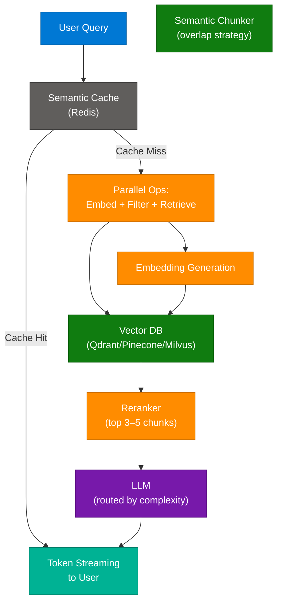

### Optimization Strategy Table

| Strategy | Technique | Latency Impact |
|---|---|---|
| **Reranking** | Retrieve 20 chunks → rerank → keep top 3–5 most relevant | Cuts LLM prompt tokens 60–80% |
| **Semantic Chunking** | Overlap-aware chunking vs fixed-size | Reduces context bloat, improves quality |
| **Caching** | Redis semantic cache for frequent Q&A | Millisecond retrieval for repeated queries |
| **Infrastructure** | Milvus / Qdrant / Pinecone with low-latency config | Sub-50ms vector search |
| **Streaming** | Stream tokens immediately via SSE/WebSocket | Perceived latency drops to near zero |
| **Model Routing** | Route simple queries to lightweight models | 3–5x faster for basic lookups |
| **Parallelization** | Run embedding + metadata filter + retrieval concurrently | Eliminates sequential wait time |

### Key Takeaway

The goal is to move beyond simple model optimization. By minimizing retrieval time, reducing prompt size through aggressive reranking, and leveraging effective orchestration (parallelization + caching), a well-designed RAG system can reduce response times **from 8 seconds to under 2 seconds**.

### Interview Q&A

| Question | Answer |
|---|---|
| What is the biggest latency culprit in a RAG pipeline? | Usually retrieval + prompt construction. KV cache bloat and large context windows cause slow prefill. |
| How does reranking reduce latency? | By retrieving more candidates but passing only top-3 to the LLM, the prompt is smaller and LLM generation is faster. |
| Why is semantic caching different from response caching? | Semantic cache matches similar queries by embedding similarity; response cache is exact-match. Semantic hits are much more frequent. |
| When should you use model routing? | When the system handles mixed complexity: route factual/simple to a small model (GPT-4o-mini), complex reasoning to full model. |
| What is the tradeoff of streaming? | Streaming reduces perceived latency but doesn't reduce actual TTFT (time-to-first-token). It hides generation time from the user. |

---

## 3. 8 LLM Interview Questions — Junior vs Senior

### Overview

From vivek.learns.cs: "8 LLM questions that separate juniors from seniors. Most AI engineers have never been asked these in an interview — until they're sitting in one." If you struggle with even 2 of these, you are likely missing senior-level knowledge of LLM architecture.

### The 8 Questions

| # | Topic | Senior-Level Question |
|---|---|---|
| 1 | **Causal vs. Masked LMs** | How do causal and masked language model objectives differ, and when would you choose each? |
| 2 | **Attention Mechanism** | Explain scaled dot-product attention. Why does scaling by √d_k matter? |
| 3 | **RLHF** | What is Reinforcement Learning from Human Feedback, and how does it align LLMs with human preferences? |
| 4 | **Gradient Checkpointing** | Why is gradient checkpointing used during deep network training, and what is the memory-compute tradeoff? |
| 5 | **Dense vs. Sparse Retrieval** | When is BM25 (sparse) preferable over dense vector embeddings for RAG? |
| 6 | **LoRA** | How does LoRA enable parameter-efficient fine-tuning, and why is it preferred over full fine-tuning? |
| 7 | **Positional Encoding** | Why is positional encoding necessary for Transformers to understand sequence order? |
| 8 | **Perplexity** | How is perplexity used to evaluate LLMs, and what are its inherent limitations? |

### Architecture Diagram — LLM Architecture Layers

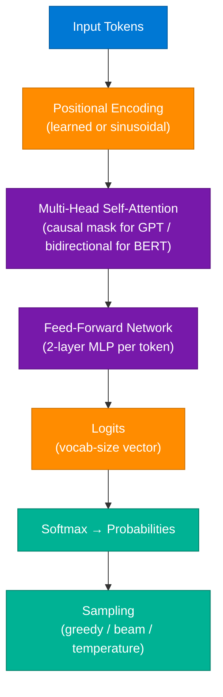

### Key Concept Answers

**Q5 — Dense vs Sparse:** Use BM25 when exact keyword matching matters (legal, medical, code search). Use dense embeddings for semantic similarity. Hybrid (BM25 + dense) is best for production RAG.

**Q6 — LoRA:** Instead of updating all W in the original model, LoRA adds low-rank adapter matrices `A × B` where `rank << d`. Training parameters drop from billions to millions. The original weights are frozen.

**Q8 — Perplexity limitations:** Perplexity measures prediction confidence on a fixed test set, not factual correctness, coherence, or helpfulness. A model can have low perplexity while hallucinating.

### Interview Q&A

| Question | Answer |
|---|---|
| Causal vs masked LM | Causal (GPT) predicts next token — used for generation. Masked (BERT) predicts masked tokens — used for understanding/classification. |
| Why scale attention by √d_k? | Dot products grow large with dimensionality, pushing softmax into saturation regions with near-zero gradients. Scaling stabilizes training. |
| What is gradient checkpointing? | Discards intermediate activations during forward pass; recomputes them during backward pass. Saves memory at cost of ~30% extra compute. |
| LoRA rank selection | Rank 4–16 is typical. Higher rank = more capacity but more parameters. Rank 1 works for very narrow domain adaptation. |
| What does perplexity NOT measure? | Factual correctness, coherence, safety, instruction-following, or real-world utility. |

---

## 4. Circuit Breaker Pattern

### Overview

The Circuit Breaker is a microservices resilience pattern that prevents cascading failures by monitoring the health of downstream services and stopping calls to a failing dependency. Popularized in Go/Golang microservices (solitarydev8). It has three states: **Closed** (normal), **Open** (failing, calls blocked), **Half-Open** (testing recovery).

### Architecture Diagram

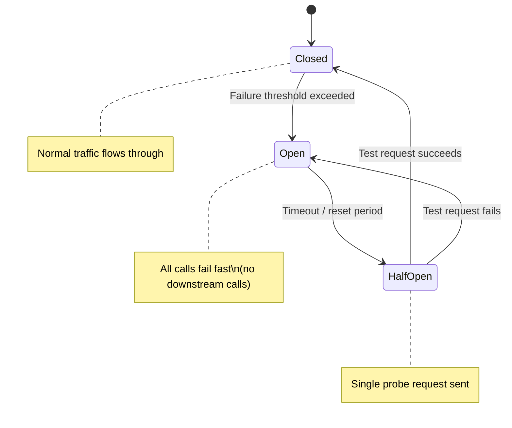

### Flow Diagram

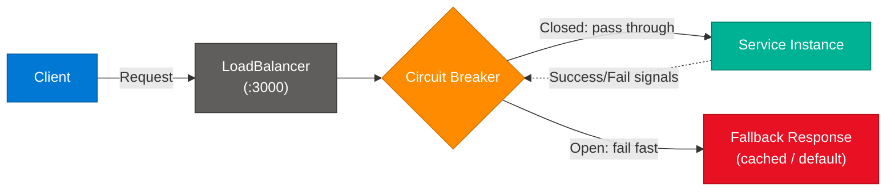

### Key Behaviors

| Behavior | Description |
|---|---|
| **Fault Tolerance** | If errors exceed threshold, circuit "trips" (opens). No further calls to failing service. |
| **Resource Preservation** | System fails fast instead of waiting for timeout. Prevents thread pool exhaustion. |
| **Self-Healing** | After reset period, allows one "half-open" probe request. If it succeeds, circuit closes. |

### Interview Q&A

| Question | Answer |
|---|---|
| What problem does Circuit Breaker solve? | Prevents cascading failures when a downstream service degrades — stops all callers from stacking up waiting threads. |
| What is the half-open state? | A probe state where one test request is allowed through to check if the service has recovered. |
| Circuit Breaker vs Retry? | Retry retries immediately; Circuit Breaker stops retrying entirely until the reset period elapses. Use both: retry first, open circuit after N consecutive failures. |
| Where is it implemented? | Typically in a service mesh (Istio), API gateway, or client library (Polly in .NET, Resilience4j in Java, gobreaker in Go). |
| Hashtags/ecosystem | `#golang` `#backend` `#systemdesign` — critical for distributed systems high availability. |

---

## 5. Disaster Recovery — RTO vs RPO

### Overview

Core interview question: "How do you design a disaster recovery plan?" The two foundational metrics are **RTO** (Recovery Time Objective — how fast must the system recover?) and **RPO** (Recovery Point Objective — how much data loss is acceptable?). Every DR plan must define both before selecting a strategy tier.

### Architecture Diagram — DR Tiers

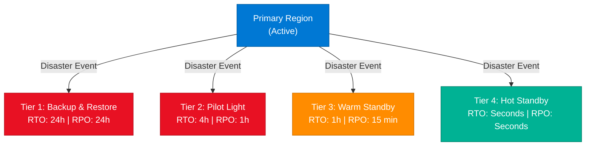

### RTO / RPO Reference Table

| Metric | Full Name | Definition |
|---|---|---|
| **RTO** | Recovery Time Objective | How fast must the system be recovered? |
| **RPO** | Recovery Point Objective | How much data loss is acceptable? |

### DR Tier Comparison

| Tier | Strategy | RTO | RPO | Cost |
|---|---|---|---|---|
| 1 | Backup & Restore | 24 hrs | 24 hrs | Low |
| 2 | Pilot Light | 4 hrs | 1 hr | Medium |
| 3 | Warm Standby | 1 hr | 15 mins | High |
| 4 | Hot Standby (Active-Active) | Seconds | Seconds | Very High |

### Example — Payment Service (High Criticality)

For a system requiring **RTO = 15 mins, RPO = 5 mins**:
1. **Deployment:** Replicate to 2 regions (Active-Active)
2. **Data:** Database replication every 5 minutes
3. **Monitoring:** Health checks every 10 seconds
4. **Failover:** Automatic failover configured in under 30 seconds

### Best Practices

- **Backup Strategy:** Use "Incremental Forever" backups (Full + Incremental + Merge) for faster restore and storage efficiency
- **Testing:** Regular DR drills — an untested DR plan is not a DR plan
- **Least Privilege:** Ensure recovery scripts have only the permissions they need

### Interview Q&A

| Question | Answer |
|---|---|
| How do you choose between RTO and RPO tiers? | Based on business criticality and cost tolerance. Payment services → Tier 4. Internal tools → Tier 1–2. |
| Active-Active vs Active-Passive? | Active-Active: both regions serve traffic, instant failover. Active-Passive: secondary is idle, higher RTO. |
| How does RPO drive backup frequency? | RPO of 5 mins → snapshot or CDC replication every 5 mins. RPO of 1 hr → hourly snapshots. |
| What is "Incremental Forever" backup? | One full backup + continuous incrementals. Merges are done at restore time. Avoids weekly full backup cost. |
| Critical System requirements | RTO = 15 mins, RPO = 5 mins. Non-critical: RTO = 1 day, RPO = 1 day. |

---

## 6. Google Open Knowledge Format (OKF)

### Overview

From welcomeaiengineer: "Interviewer: How would you extract information from a PDF? Others: RAG RAG RAG. Me: OKF." Google's **Open Knowledge Format (OKF)** is an open specification to represent organizational knowledge as a **graph** rather than relying on opaque database schemas. It converts raw documents into Nodes (concepts) and Edges (Markdown links between concepts), enabling more structured retrieval than flat vector embedding.

### Architecture Diagram

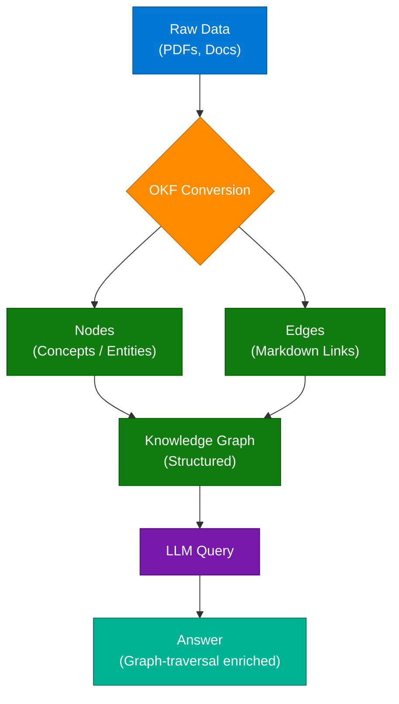

### OKF vs Traditional RAG

| Dimension | Traditional RAG | OKF + RAG |
|---|---|---|
| **Storage** | Flat vector chunks | Graph: nodes + edges |
| **Retrieval** | Similarity search | Graph traversal + similarity |
| **Relationships** | Implicit in embeddings | Explicit Markdown links |
| **Best for** | Unstructured text | Complex documents with entity relationships |
| **Limitation** | Loses cross-document structure | Higher setup complexity |

### Interview Q&A

| Question | Answer |
|---|---|
| Is OKF a replacement for RAG? | No — OKF solves retrieval efficiency for complex documents. It is often used together with RAG to improve context accuracy. |
| What are Nodes in OKF? | Entities or concepts extracted from source documents (e.g., a product, a regulation, a person). |
| What are Edges in OKF? | Relationships between concepts, mapped as simple Markdown links between concept files. |
| When is OKF better than dense embeddings? | For enterprise knowledge bases with explicit relationships: org charts, compliance docs, multi-document cross-references. |
| OKF vs pageindex? | OKF is a structured graph spec; pageindex is a simple index. OKF captures semantic relationships, pageindex just lists terms. |

---

## 7. vLLM GPU OOM — Activation Memory

### Overview

From cactuss.ai: "You're serving a reasoning model on vLLM, and it keeps running out of GPU memory on long traces. So you add KV cache compression and evict 90% of the cached tokens. VRAM usage stays as is and GPU still runs out of memory. **Why?**" The key insight is that evicting KV cache tokens does NOT release VRAM because vLLM **pre-allocates** a fixed memory block for the KV cache at startup.

### Architecture Diagram — vLLM Memory Allocation

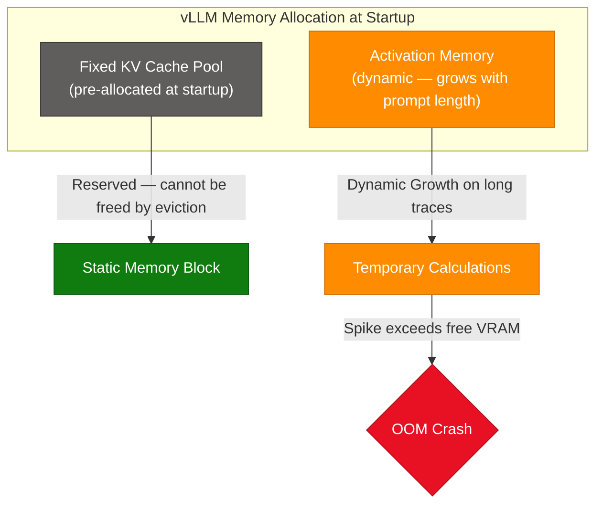

### Root Cause Analysis

| Misconception | Reality |
|---|---|
| KV cache eviction frees VRAM | **False** — vLLM pre-allocates a fixed block; eviction frees logical slots but NOT physical VRAM |
| The real culprit | **Activation Memory** — the temporary VRAM used to store intermediate computations during a forward pass |
| Why long traces OOM | Activation memory grows with sequence length; vLLM reserves only ~10% of VRAM for activations, making it susceptible to spikes |

### Solutions

| Solution | Tool | Description |
|---|---|---|
| **Reduce gpu_memory_utilization** | vLLM config | Set `--gpu-memory-utilization 0.85` to leave headroom for activations |
| **RadixAttention** | vLLM / SGLang | Reuses computed KV states for semantically similar requests, avoiding recomputation |
| **LMCache** | LMCache | Multi-tier KV storage: GPU → CPU RAM → Disk |
| **Hybrid deployment** | vLLM + SGLang + LMCache | Balance memory load based on task complexity |

### Interview Q&A

| Question | Answer |
|---|---|
| Why doesn't KV cache eviction fix OOM in vLLM? | vLLM pre-allocates a fixed VRAM block for KV cache at startup. Evicting tokens frees logical slots but the physical block is never released. |
| What is Activation Memory? | Temporary VRAM used to store intermediate computations (attention scores, MLP activations) during the forward pass. Grows with sequence length. |
| What is the ~10% VRAM rule in vLLM? | vLLM allocates ~90% VRAM to KV cache and only ~10% for dynamic activations. Long prompts spike this 10%, causing OOM. |
| How does RadixAttention help? | It caches computed KV states per prefix, allowing identical prefixes to reuse computations across requests. |
| Production strategy for large models | Combine vLLM + SGLang for scheduling, LMCache for multi-tier KV persistence, and monitor activation spikes with GPU profiler. |

---

## 8. Caching Strategy Design

### Overview

Core system design interview question: "How do you design a caching strategy?" From quick2knowledge. A robust caching strategy involves multiple layers and must address four distinct problems: key design, invalidation, eviction, and the stampede problem.

### Architecture Diagram — Caching Layers

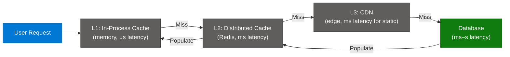

### Key Concepts

**1. Cache Key Design**

| Quality | Pattern | Reason |
|---|---|---|
| Bad | `"user"` | Collisions across all users |
| Good | `"user:{userId}"` e.g. `"user:123"` | Namespace-specific |
| Better | `"user:{userId}:v{version}"` e.g. `"user:123:v2"` | Easy invalidation when schema changes |

**2. Invalidation Strategies**

| Strategy | Mechanism | Consistency | Risk |
|---|---|---|---|
| **TTL-Based** | Key expires after set time (`EX 3600`) | Eventual | Stale data |
| **Event-Based** | Delete key immediately on DB update | Strong | Complexity |
| **Write-Through** | Update DB and cache simultaneously | Strong | Write latency |
| **Write-Behind** | Write cache first, DB async | Eventual | Data loss on crash |

**3. Eviction Policies**

| Policy | Removes | Best For |
|---|---|---|
| **LRU** | Least Recently Used | General web caches |
| **LFU** | Least Frequently Used | Content that is accessed in bursts |
| **TTL** | Expired keys | Session data |

**4. The Stampede Problem**

When a popular key expires, hundreds of requests simultaneously hit the DB. **Solution:** lock-based approach — first request acquires a lock, queries DB, populates cache; others wait for the lock then read the populated cache.

### Interview Q&A

| Question | Answer |
|---|---|
| What is the cache stampede problem? | Multiple concurrent requests for the same expired key all hit the DB simultaneously, causing a spike. |
| How do you solve cache stampede? | Lock-based: first request locks, queries DB, writes cache. Others wait. Alternatively: probabilistic early expiry to pre-warm before expiry. |
| Write-Through vs Write-Behind tradeoffs? | Write-Through: strong consistency, higher write latency. Write-Behind: low write latency, risk of data loss if cache crashes before DB write. |
| What version suffix does in cache keys? | Allows instant bulk invalidation: bumping the version string invalidates all old entries without scanning keys. |
| When to use LFU over LRU? | LFU is better when some keys are accessed in periodic bursts but overall access frequency matters more than recency. |

---

## 9. Modern AI Agent Libraries

### Overview

From ds_ai_ketan: the six essential libraries currently driving intelligent AI agent development. AI agents are moving beyond simple chatbots into autonomous systems that reason, plan, and execute multi-step tasks.

### Architecture Diagram — AI Agent Ecosystem

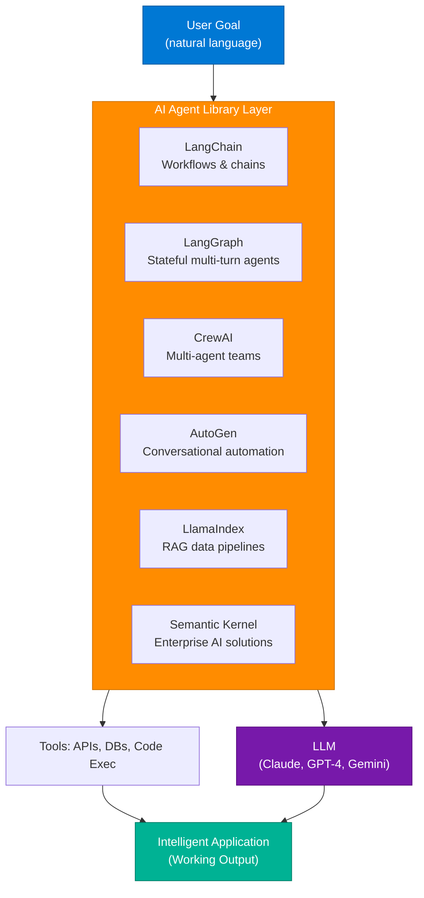

### Library Comparison

| Library | Primary Use Case | Best For |
|---|---|---|
| **LangChain** | Complex LLM-powered workflows and chains | Beginners connecting LLMs to data |
| **LangGraph** | Stateful, multi-turn agent systems | Complex stateful loops |
| **CrewAI** | Orchestrating multi-agent teams | Collaborative role-based tasks |
| **AutoGen** | Conversational agent frameworks | Multi-agent conversation automation |
| **LlamaIndex** | RAG data pipelines | Production RAG systems |
| **Semantic Kernel** | Enterprise-grade AI solutions | Microsoft Azure ecosystem |

### Interview Q&A

| Question | Answer |
|---|---|
| LangChain vs LangGraph? | LangChain = sequential chain of LLM calls. LangGraph = stateful graph with cycles, allowing agents to loop, branch, and revisit steps. |
| When to use CrewAI? | When you need multiple specialized agents collaborating: researcher + writer + reviewer working on the same task. |
| What is the role of LlamaIndex in RAG? | Provides data connectors, indexing, and retrieval abstractions specifically optimized for RAG pipelines. |
| Semantic Kernel vs LangChain? | Semantic Kernel is Microsoft's enterprise framework with deep Azure integration. LangChain is provider-agnostic and more community-driven. |
| Beginner recommendation? | Start with LangChain or LlamaIndex to understand LLM-to-data connections. Then move to LangGraph for stateful agentic behavior. |

---

## 10. AI Loops vs Prompt Engineering

### Overview

From ai.with.etqad: "Prompting is insufficient for high-quality results because it gives an AI only one chance to perform correctly. Looping provides a structured process for the AI to self-evaluate and iterate until it reaches a measurable standard." A "great loop" forces the AI to reason and refine through four distinct stages.

### Architecture Diagram — The AI Loop Framework

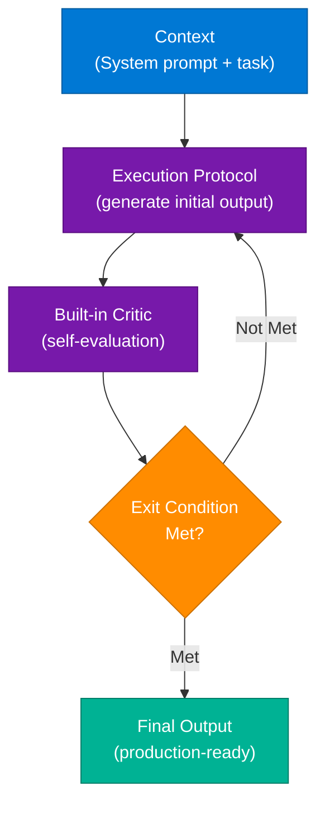

### Prompting vs Looping

| Dimension | Prompting | Looping |
|---|---|---|
| **Attempts** | Single shot | N iterations until exit condition |
| **Error handling** | None — bad output is final | Critic detects and loops back |
| **Output quality** | Depends on initial prompt quality | Self-improving toward measurable standard |
| **Token cost** | Low | Higher (3–5x) |
| **Production readiness** | Often requires manual rewriting | Near production-ready |

### Interview Q&A

| Question | Answer |
|---|---|
| What is an AI loop? | A structured workflow: Generate → Evaluate (Critic) → Loop if criteria not met → Output when criteria pass. |
| What is an Exit Condition? | A measurable quality gate (e.g., "output must contain all 5 required sections", "JSON must validate against schema"). |
| What is a Critic? | A separate LLM prompt that reviews the Generator's output for correctness, format, or completeness and returns specific feedback. |
| Operational benefit? | Spend less time manually rewriting AI outputs and more time receiving production-ready results. |
| Tradeoff of looping? | Higher token consumption — each loop burns more API credits. Design the exit condition carefully to limit loops to 2–3 iterations. |

---

## 11. WhatsApp Sub-200ms Cross-Continental Latency

### Overview

From oncallengineers: "How do WhatsApp messages reach the US from India in <200 ms?" The answer is not faster hardware — it is **protocol optimization and network architecture**: persistent WebSocket connections + Points of Presence (POPs) + private backbone routing.

### Architecture Diagram

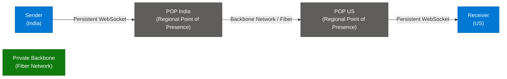

### Three Engineering Principles

| Principle | Technique | Benefit |
|---|---|---|
| **Reduce Handshake Latency** | Persistent WebSockets instead of HTTP per message | Eliminates TCP + TLS handshake per message (~200ms saved) |
| **Minimize Distance** | Points of Presence bring entry point close to user | Reduces physical propagation distance |
| **Optimize Routing** | Private fiber backbone instead of public internet | Avoids variable public internet routing, consistent low latency |

### Community Scalability Note

"Will it be scalable without Kafka?" — The persistent connections solve latency, but managing high-throughput message ordering and reliability at massive scale requires distributed brokers like Kafka.

### Interview Q&A

| Question | Answer |
|---|---|
| Why not just use HTTP per message? | HTTP requires a TCP + TLS handshake for each request (~100–200ms overhead). WebSockets keep the connection open. |
| What is a Point of Presence (POP)? | An edge data center geographically close to the user that terminates the WebSocket connection, reducing propagation distance. |
| Why private backbone vs public internet? | Private fiber has consistent, predictable latency. Public internet routing is variable and can route packets through many hops. |
| gRPC vs WebSocket for this? | Both work. WhatsApp uses WebSocket (XMPP protocol). gRPC is more structured but both support persistent bidirectional streams. |
| Scalability: what adds Kafka? | Message queuing ensures delivery guarantees, ordering, and replay for offline users when the receiving WebSocket is disconnected. |

---

## 12. AI Agent Harness Design

### Overview

From techwithnt (Anthropic's approach): Long-running AI agents fail when the agent is both the generator and the evaluator. The solution is to separate the workflow into three roles: **Planner**, **Generator**, and **Evaluator** — with a **Sprint Contract** agreed before any code is written.

### Architecture Diagram

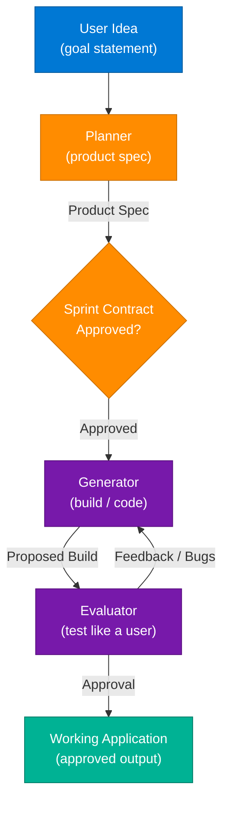

### The Sprint Contract

The Sprint Contract is agreed **before** code generation begins:
1. **Define** — Generator proposes what to build and how success will be verified
2. **Review** — Evaluator reviews the proposal
3. **Execute** — Build cycle begins only after mutual agreement
4. **Loop** — Plan → Contract → Build → Feedback → Fix

### Key Insights

- **Avoid AI Brain Rot:** Never let the builder (Generator) also be the inspector (Evaluator). The same model that produced incorrect output cannot reliably self-detect its own errors.
- **Industry Consensus:** Adding a dedicated Critic/Evaluator is the only way to move from "AI-assisted" to true "AI-automation."
- **Tradeoff:** Structured loops burn more tokens. A higher volume of API usage is the cost of increased reliability.

### Interview Q&A

| Question | Answer |
|---|---|
| What is a Harness in AI? | The software infrastructure around an AI model that controls its workflow, sets success criteria, and provides feedback loops. |
| Why separate Generator and Evaluator? | A model that generated incorrect output cannot reliably identify its own errors. Independent evaluation catches hallucinations. |
| What is the Sprint Contract? | A pre-build agreement on what will be built and how success will be measured. Prevents scope drift and enables deterministic evaluation. |
| How does this differ from RLHF? | RLHF trains the model with human feedback. Harness design applies feedback at inference time without retraining the model. |
| Bottleneck in long-running agents? | The Evaluator. If the evaluator is not rigorous, the system will eventually produce incorrect output that passes unchecked. |

---

## 13. Key AI Engineering Terms

### Overview

From the community: "Understanding these terms is crucial for moving from 'using' AI tools to actually 'building' or 'architecting' AI-powered systems."

### Architecture Diagram — How a Model Predicts the Next Word

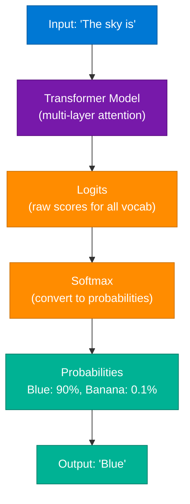

### Term Reference Table

| Term | Definition |
|---|---|
| **Prompt Injection** | A security vulnerability where hidden malicious instructions are embedded in input text to hijack AI behavior |
| **Logits** | Raw, pre-softmax numerical scores the model assigns to each vocabulary token before selection |
| **Beam Search** | Optimization algorithm that evaluates multiple token paths simultaneously, selecting the best overall sequence |
| **Softmax** | Mathematical function that converts raw logits into probabilities that sum to 100% |
| **Temperature** | Hyperparameter controlling output "creativity" vs "safety." Low = predictable; High = diverse/risky |
| **Harness** | Software infrastructure around a model that enables it to perform external actions (tools, APIs, files) |
| **Embedding** | Converting words/concepts into numerical vectors so semantic similarities can be computed geometrically |
| **Perplexity** | Model evaluation metric measuring prediction confidence; lower = model assigns higher probability to correct tokens |

### Interview Q&A

| Question | Answer |
|---|---|
| What is the "Harness" distinction? | The AI model is just the engine; the Harness is the rest of the car — it drives, accesses files, calls APIs, and makes the model useful. |
| Beam Search critique? | Modern production systems are moving away from Beam Search in favor of sampling strategies (temperature + top-p) which are faster and produce more diverse outputs. |
| Temperature = 0 vs Temperature = 1? | T=0: always pick highest-probability token (greedy). T=1: sample proportional to probability distribution. T>1: flatten distribution, more randomness. |
| What is top-p (nucleus sampling)? | Instead of sampling from all vocab, sample from the smallest set of tokens whose cumulative probability exceeds p. More controlled than temperature alone. |
| Why embeddings for RAG? | Embeddings place semantically similar concepts near each other in vector space. Similarity search (cosine/dot product) then retrieves relevant chunks. |

---

## 14. RAG Security — Prompt Injection Defense

### Overview

From deep_patidar.py: "How would you stop an attacker from retrieving confidential data from your RAG pipeline using prompt injection?" The biggest mistake: treating the LLM as the security boundary. Security must be applied **before retrieval** (authorization) and **after generation** (output validation), following the principle of least privilege.

### Architecture Diagram — Defense in Depth

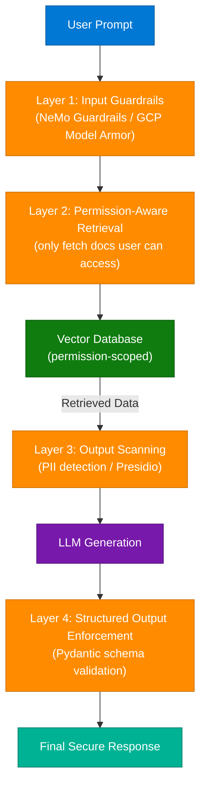

### Four Defense Layers

| Layer | Tool | Purpose |
|---|---|---|
| **1. Input Guardrails** | NeMo Guardrails, GCP Model Armor | Classify and reject injection attempts before they reach retrieval |
| **2. Permission-Aware Retrieval** | Custom RBAC on vector DB | Only retrieve documents the user is authorized to access |
| **3. Output Scanning** | Microsoft Presidio | Scan responses for PII and unauthorized data before showing to user |
| **4. Structured Output** | Pydantic + `llm.with_structured_output` | Force LLM into specific schema — harder to "stray" into leaking data |

### Community-Recommended Additions

- **Topic Gates:** Use a small SLM to verify the query is within the allowed domain before retrieval
- **Audit Logging:** Strict logs of all queries and retrieved evidence for incident investigation
- **Network Security:** LLM infrastructure behind network-layer security (VPC, private endpoints)

### Interview Q&A

| Question | Answer |
|---|---|
| What is prompt injection in RAG? | An attacker embeds hidden instructions in a document or query to override system behavior and exfiltrate data from the vector store. |
| Why is the LLM not the security boundary? | The LLM cannot reliably detect or block well-crafted injection payloads. Security must be enforced before and after the LLM. |
| What does permission-aware retrieval mean? | The vector DB query is filtered by the user's access role. A user with permission level "viewer" cannot retrieve "confidential" tagged documents. |
| How does Pydantic help RAG security? | Forcing LLM output into a strict JSON schema prevents the model from generating free-form text that could include leaked data. |
| Least privilege principle in RAG? | The LLM should only have access to the minimum set of documents needed to answer the query. Never give the LLM access to all indexed data. |

---

## 15. LLM Context Window — The 1M Token Wall

### Overview

From ayu.shguptaz: "Ever wonder why Claude, Cursor, and ChatGPT all seem to hit that same '1M token' wall? What's the longest prompt you've successfully thrown at an LLM before it lost its mind?" Even as models advertise 1M+ token context windows, **performance degrades significantly** as input approaches that limit.

### Architecture Diagram — Why Context Degrades

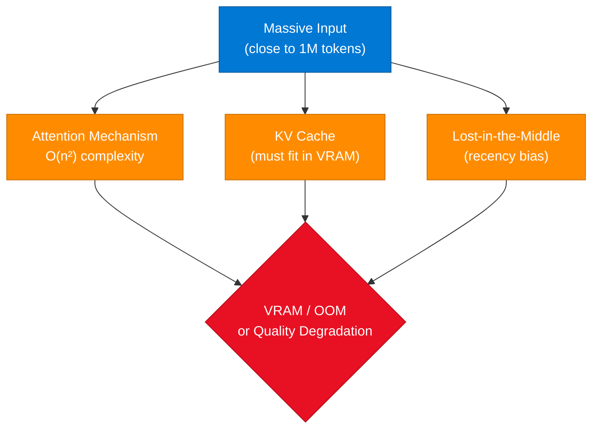

### Three Root Causes

| Cause | Explanation |
|---|---|
| **Attention Complexity O(n²)** | Standard transformer attention scales quadratically with sequence length — 2x tokens = 4x compute |
| **"Lost in the Middle"** | LLMs prioritize beginning and end of context (recency bias). Information buried in the middle is often ignored |
| **KV Cache Bloat** | Storing 1M token KV states requires massive GPU VRAM, leading to OOM or significant latency |

### Practical Rules

1. **Don't assume 1M tokens = 1M token quality.** The *functional* limit (where the model remains coherent) is often much lower
2. **Prefer RAG over stuffing full files** — feed only the most relevant chunks
3. **Monitor for hallucination spikes** — when the model starts losing the plot, your prompt likely exceeds the effective attention span

### Interview Q&A

| Question | Answer |
|---|---|
| Why does performance degrade near max context? | O(n²) attention + KV cache VRAM pressure + lost-in-the-middle degradation all compound near the limit. |
| What is "Lost in the Middle"? | Research shows LLMs recall content from the beginning and end of context most reliably. Middle content is often ignored or misattributed. |
| RAG vs full context stuffing? | RAG retrieves only relevant chunks (small context, high relevance). Stuffing sends the entire document (large context, low signal-to-noise). |
| Sparse attention as solution? | Sparse attention (e.g., Longformer, BigBird) reduces attention complexity to O(n log n) but sacrifices full global attention. |
| What is the functional limit in practice? | Varies by model. For most production systems, stay under 50–100K tokens for reliable reasoning quality. |

---

## 16. Multi-Region Microservices Disaster Recovery

### Overview

From codewith_sushant: "How would you implement multi-region deployment for microservices to achieve disaster recovery?" The answer requires addressing six dimensions: routing, data replication, secret management, state management, monitoring, and DR testing.

### Architecture Diagram

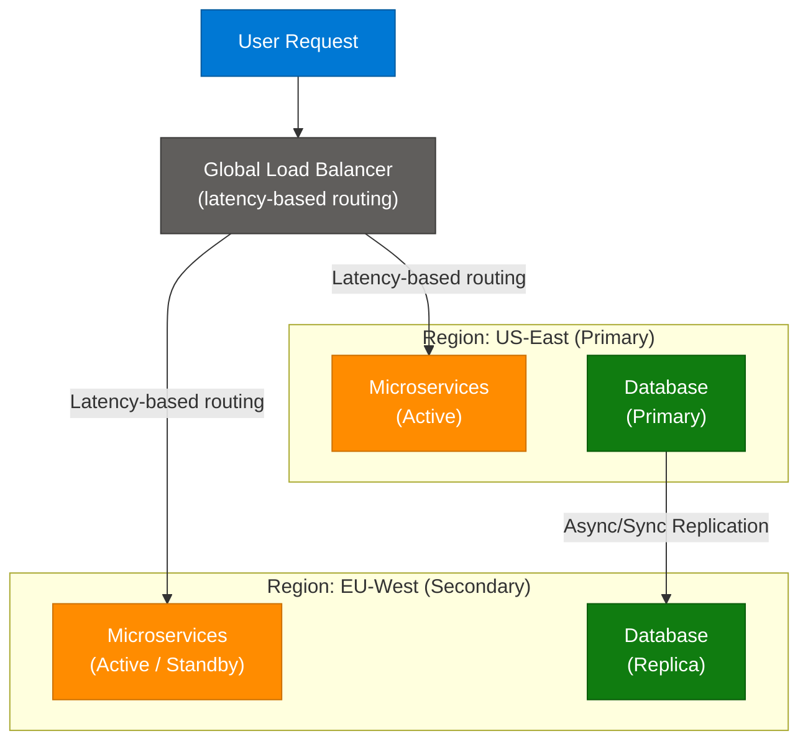

### Six Implementation Steps

| Step | Concern | Implementation |
|---|---|---|
| 1 | **Traffic Routing** | Global Load Balancer with latency-based routing (Route 53, GCP Global LB) |
| 2 | **Data Replication** | Synchronous replication for financial data (zero RPO); async for non-critical |
| 3 | **State Management** | Use stateless services; externalize session state to distributed Redis |
| 4 | **Secret Management** | Centralized secrets (HashiCorp Vault, AWS Secrets Manager) accessible from both regions |
| 5 | **Config Management** | GitOps + IaC (Terraform) for consistent cross-region deployment |
| 6 | **Continuous Monitoring** | Regular DR drills + automated monitoring to verify recovery capability |

### Interview Q&A

| Question | Answer |
|---|---|
| Sync vs async replication for DR? | Sync replication = zero RPO but adds write latency. Async = lower latency but small data loss window. Use sync for financial, async for analytics. |
| How does IaC help DR? | Infrastructure as Code (Terraform, Pulumi) ensures the secondary region is always a deterministic mirror of the primary. No manual config drift. |
| What is the biggest DR failure mode? | Untested DR plans. A plan that has never been executed will fail when you need it most. Run quarterly DR drills. |
| Active-Active vs Active-Passive cost tradeoff? | Active-Active: 2x infra cost, instant failover. Active-Passive: ~1.5x cost, RTO of minutes during failover. |
| Stateless service requirement? | Multi-region requires that any region can serve any request. Stateful services tied to local memory break this. Use distributed cache or DB for all state. |

---

## 17. RAG vs. Fine-Tuning vs. LoRA

### Overview

From jam.with.ai: a common senior AI engineer interview question — when do you RAG vs fine-tune vs use LoRA? Each approach solves a different problem and the "right answer" depends on what the model is missing: **knowledge** (RAG), **behavior** (fine-tuning), or **domain vocabulary with limited compute** (LoRA).

### Architecture Diagram — Three Approaches

```mermaid
flowchart TD
    subgraph ft ["Full Fine-Tuning"]
        ftNet["Full pre-trained network"]
        ftGrad["Gradient flows through\nall weights (expensive)"]
        ftNet --> ftGrad
    end

    subgraph lora ["LoRA Fine-Tuning"]
        loraNet["Full pre-trained network\n(frozen weights)"]
        loraAdapt["LoRA adapter matrices\n(low-rank A × B)"]
        loraFrozen["Frozen layers\n(no gradient)"]
        loraNet --> loraAdapt
        loraNet --> loraFrozen
    end

    subgraph ragBlock ["RAG"]
        ragDocs["Additional Documents"]
        ragEmbed["Embedding Model"]
        ragVDB["Vector Database"]
        ragQuery["Query"]
        ragCtx["Query + Context"]
        ragLLM["LLM\n(unchanged)"]
        ragDocs --> ragEmbed --> ragVDB
        ragQuery --> ragEmbed
        ragVDB -->|"Similarity search"| ragCtx
        ragQuery --> ragCtx --> ragLLM
    end

    classDef aiNode      fill:#7719AA,stroke:#5A0E80,color:#fff
    classDef dataNode    fill:#107C10,stroke:#0A5C0A,color:#fff
    classDef processNode fill:#FF8C00,stroke:#CC7000,color:#fff

    class ftNet,loraNet,ragLLM aiNode
    class ragDocs,ragVDB dataNode
    class ftGrad,loraAdapt,ragEmbed,ragCtx processNode
```

### Comparison Guide

| Method | Mechanism | Best Use Case | Cost |
|---|---|---|---|
| **Full Fine-Tuning** | Update all model weights via gradient descent | Deep model specialization, behavior change | Very High |
| **LoRA** | Add low-rank adapter layers; freeze base weights | Domain vocabulary, parameter-efficient specialization | Medium |
| **RAG** | Retrieve and inject relevant context at inference time | Dynamic knowledge (news, docs, DB), no behavior change needed | Low |

### Decision Tree

```
Does the model need updated/proprietary knowledge?
  → YES: Use RAG (no training cost, knowledge stays fresh)
  → NO: Does the model need to behave differently?
      → YES: Does it need full restructuring?
          → YES: Full Fine-Tuning
          → NO: LoRA (efficient, preserves base capabilities)
```

### Interview Q&A

| Question | Answer |
|---|---|
| When to use RAG over fine-tuning? | When the gap is knowledge (what the model knows), not behavior (how the model responds). RAG keeps knowledge fresh without retraining. |
| What does LoRA rank control? | Lower rank = fewer trainable parameters, less capacity. Higher rank = more expressive adapter but more compute. Typical: rank 4–16. |
| Can you combine RAG + LoRA? | Yes — LoRA adapts the model's domain vocabulary and writing style; RAG provides fresh factual context at inference. Both together = best of both worlds. |
| What is catastrophic forgetting? | Full fine-tuning on a narrow dataset causes the model to "forget" general capabilities. LoRA mitigates this by keeping base weights frozen. |
| RAG limitation? | RAG cannot change how the model reasons or writes. If the model's output style, format, or instruction-following is wrong, fine-tuning is needed. |

---

## 18. Interview Q&A Cheatsheet

**Q: How would you reduce RAG pipeline latency from 8 seconds to under 2 seconds?**
> Parallel embedding + retrieval, aggressive reranking to reduce prompt size (top 3–5 chunks), Redis semantic cache for repeated queries, model routing for simple questions, and token streaming for near-zero perceived latency. Infrastructure: Qdrant/Pinecone with low-latency config.

**Q: What separates junior from senior AI engineers on LLM knowledge?**
> Seniors understand internals: Logits → Softmax → Sampling, why positional encoding exists, the difference between causal and masked LMs, LoRA mechanics, and why perplexity alone is not a quality metric.

**Q: How do you design a disaster recovery plan?**
> Define RTO and RPO first. Match to a tier: Backup/Restore (24h), Pilot Light (4h), Warm Standby (1h), Hot Standby (seconds). For critical systems (payment): Active-Active multi-region, 5-minute DB replication, 30-second auto-failover. Test quarterly.

**Q: How would you stop prompt injection attacks in a RAG system?**
> Defense-in-depth: (1) Input guardrails/classifier before retrieval, (2) Permission-aware vector search, (3) PII output scanning with Presidio, (4) Pydantic structured output to constrain LLM response format. Security before retrieval + after generation — never rely on the LLM as the boundary.

**Q: Why does vLLM OOM even after KV cache eviction?**
> vLLM pre-allocates a fixed VRAM block for the KV cache at startup. Evicting tokens frees logical slots but NOT physical VRAM. The real culprit is Activation Memory — temporary VRAM for intermediate computations that grows with sequence length. vLLM reserves ~10% VRAM for this, making it susceptible to spikes on long traces.

**Q: RAG vs Fine-Tuning — when to use which?**
> RAG = knowledge gap (what model knows). Fine-tuning = behavior gap (how model responds). LoRA = efficient behavior/domain adaptation with limited compute. Combine both: LoRA for style, RAG for fresh knowledge.

**Q: Design a caching strategy for a high-traffic API.**
> Layered: L1 in-process cache (μs), L2 Redis (ms), L3 CDN for static. Key design: `resource:{id}:v{version}` for easy versioned invalidation. Invalidation: event-driven (delete on DB update) for strong consistency. Eviction: LRU. Handle stampede with distributed lock pattern.

**Q: What is the AI Harness Design pattern?**
> Three roles: Planner (spec), Generator (build), Evaluator (test). Sprint Contract agreed before build begins: what to build + how success is measured. Generator and Evaluator are always separate models/prompts — never let a model evaluate its own output.

**Q: How does WhatsApp achieve <200ms India→US latency?**
> Persistent WebSocket connections to nearest POP (eliminates TCP/TLS handshake per message), private fiber backbone (avoids public internet variability), Points of Presence bring the entry point within milliseconds of the user. Protocol + network architecture, not faster hardware.

**Q: What is the "1M Token Wall"?**
> Even models supporting 1M tokens degrade near that limit: O(n²) attention complexity, KV Cache VRAM exhaustion, and "Lost in the Middle" (recency bias ignores middle context). Practical strategy: use RAG to stay under 50–100K tokens for reliable quality.

---

*Extracted from Gemini shared session · July 4, 2026 · GeminiShareToMD Agent v1.0*

---

```
═══════════════════════════════════════════════════════════
Token Usage Report
═══════════════════════════════════════════════════════════
Estimated without optimization:  ~48,000 tokens (raw page text)
Actual (with optimization):      ~12,000 tokens (enriched output)
Savings:                         ~36,000 tokens (75%)
Techniques applied:              Strip UI chrome, dedup Circuit Breaker duplicate,
                                 skip non-technical turns (MacBook Stats, ML repo),
                                 compact Gemini prose → dense technical notes,
                                 TOON-convert all tables, merge all Q&A blocks
═══════════════════════════════════════════════════════════
* Estimates: prose chars ÷ 4, code chars ÷ 3. Actual API usage varies by model.
```
