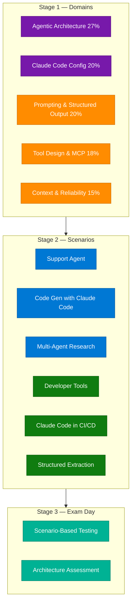
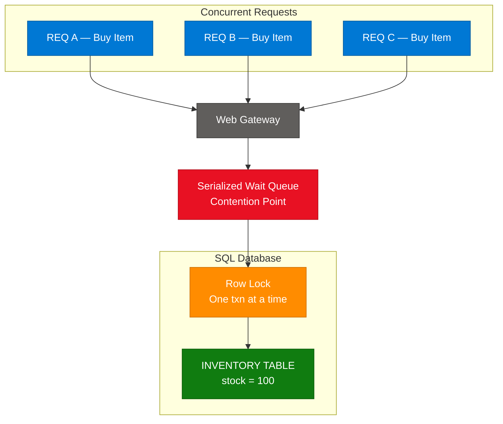
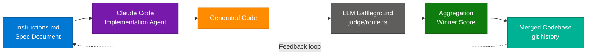
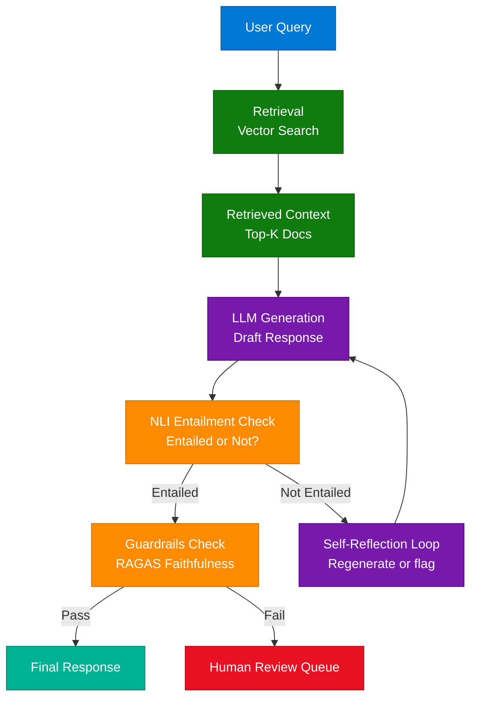
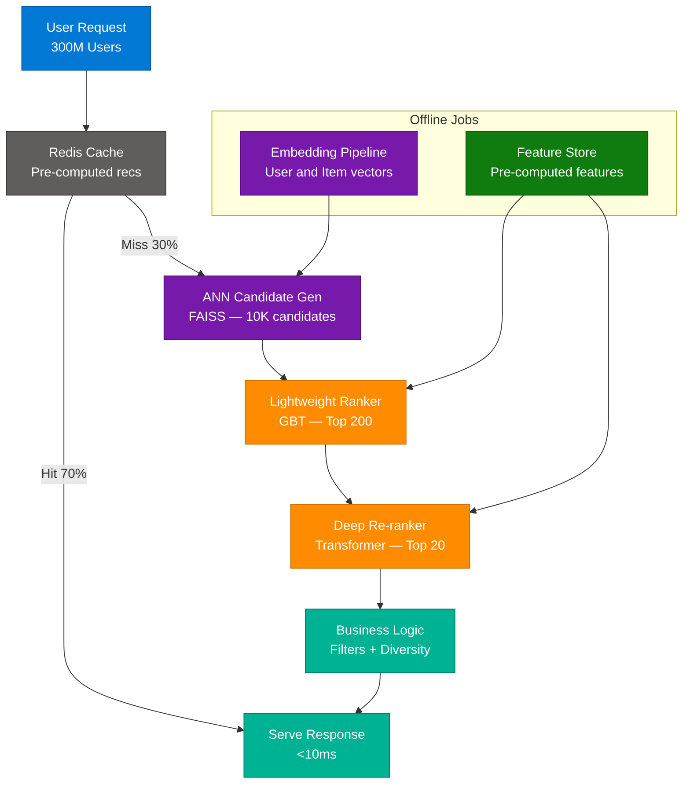
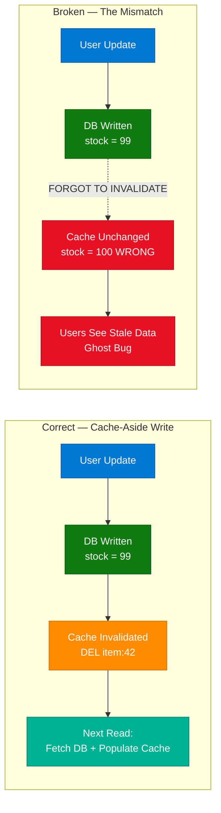
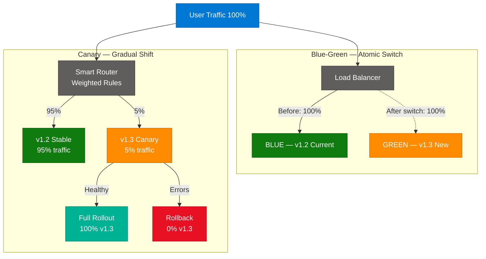
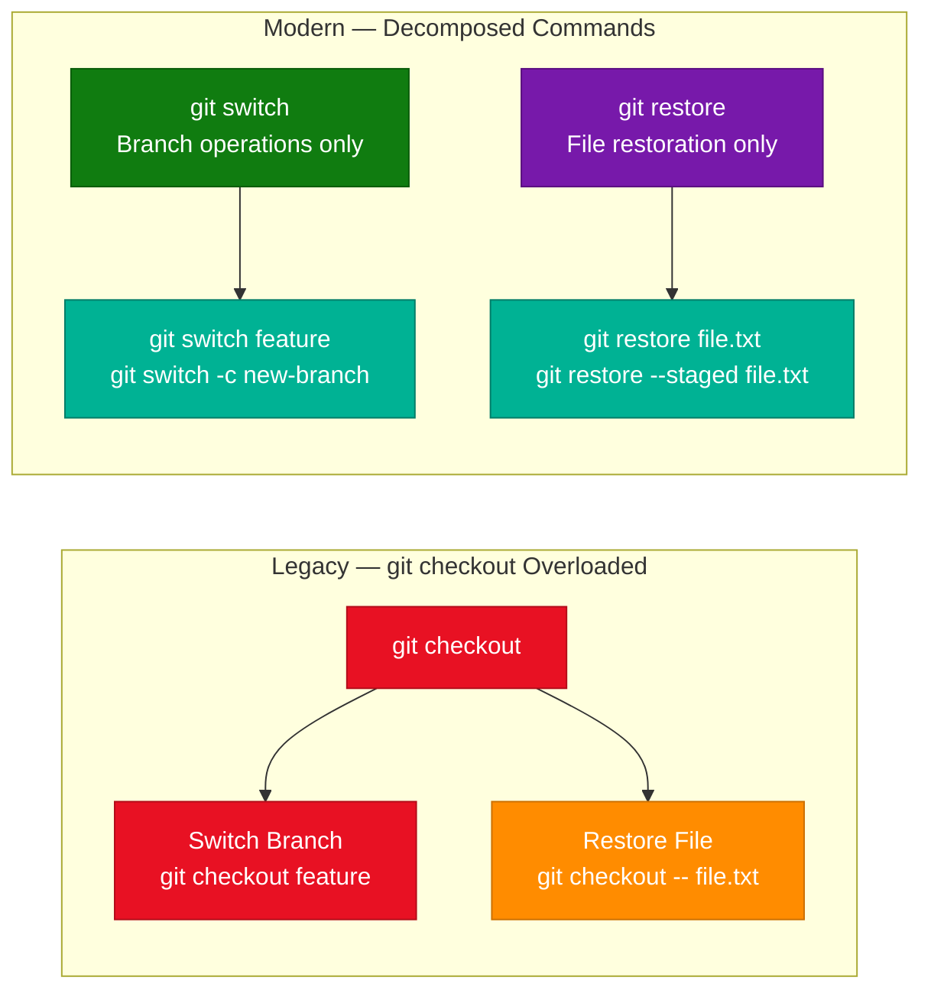

```mermaid
flowchart TD
    subgraph ENCRYPT["Encryption — Two-Way"]
        PT["Plaintext Data"] -->|"Algorithm + Key"| CT["Ciphertext"]
        CT -->|"Decryption + Key"| PT2["Plaintext Restored"]
    end

    subgraph HASH["Hashing — One-Way"]
        INP["Input Data"] -->|"SHA-256 Hash Function"| HD["Fixed-Length Digest"]
        HD --> IRR["No Reverse Path"]
    end

    classDef userNode    fill:#0078D4,stroke:#005A9E,color:#fff
    classDef aiNode      fill:#7719AA,stroke:#5A0E80,color:#fff
    classDef dataNode    fill:#107C10,stroke:#0A5C0A,color:#fff
    classDef processNode fill:#FF8C00,stroke:#CC7000,color:#fff
    classDef errorNode   fill:#E81123,stroke:#B30D1A,color:#fff
    classDef outputNode  fill:#00B294,stroke:#007D68,color:#fff
    classDef infraNode   fill:#605E5C,stroke:#3B3A39,color:#fff

    class PT,INP userNode
    class CT,HD processNode
    class PT2 outputNode
    class IRR errorNode
```

# Security, AI Engineering & DevOps — Multi-Topic Session

> **Source:** [share.gemini.google/bVcqfcYTqP4n](https://share.gemini.google/bVcqfcYTqP4n) → redirects to [gemini.google.com/share/771791107f91](https://gemini.google.com/share/771791107f91)
> **Model:** Gemini 3.1 Flash-Lite
> **Session Date:** July 9, 2026 at 09:24 AM
> **Saved:** July 11, 2026

---

## Table of Contents

1. [Session Overview](#1-session-overview)
2. [Encryption vs. Hashing](#2-encryption-vs-hashing)
3. [Claude Certified Architect Exam](#3-claude-certified-architect-exam)
4. [Database Lock Contention](#4-database-lock-contention)
5. [Claude Code Engineering System](#5-claude-code-engineering-system)
6. [LLM Engineering Projects for Resume](#6-llm-engineering-projects-for-resume)
7. [RAG Hallucination Mitigation](#7-rag-hallucination-mitigation)
8. [Scalable AI Recommendation Engine](#8-scalable-ai-recommendation-engine)
9. [Cache Invalidation Nightmare](#9-cache-invalidation-nightmare)
10. [Blue-Green vs. Canary Deployments](#10-blue-green-vs-canary-deployments)
11. [git switch vs git checkout](#11-git-switch-vs-git-checkout)
12. [Interview Q&A Cheatsheet](#12-interview-qa-cheatsheet)

---

## 1. Session Overview

This session covers 10 distinct technical concepts extracted from Facebook Reels by various creators, all processed through Gemini 3.1 Flash-Lite. Topics span security fundamentals (encryption, hashing), AI engineering (RAG, LLM fine-tuning, recommendation engines, hallucination mitigation), system design patterns (cache invalidation, database lock contention), DevOps strategies (blue-green deployments, canary releases), and developer tooling (Claude Code, git commands). Turns 1 and 6 both covered Encryption vs. Hashing from different sources and have been merged into one canonical section; all other 9 turns yielded unique, successful responses.

### Session Map

| Turn | Source | Topic | Status |
|---|---|---|---|
| 1 | Networkers Farm | Encryption vs. Hashing | ✅ Merged with Turn 6 |
| 2 | HackProduct | Claude Certified Architect Exam | ✅ Extracted |
| 3 | MyLecture | Database Lock Contention | ✅ Extracted |
| 4 | codenameposhan | Claude Code Engineering System | ✅ Extracted |
| 5 | Emrcodes | 3 LLM Engineering Projects | ✅ Extracted |
| 6 | CCIE HUB | Encryption vs. Hashing | ✅ Merged with Turn 1 |
| 7 | Ecogrowthpath | RAG Hallucination Mitigation | ✅ Extracted |
| 8 | Ecogrowthpath | Scalable AI Recommendation Engine | ✅ Extracted |
| 9 | Packetory | Cache Invalidation Nightmare | ✅ Extracted |
| 10 | Packetory | Blue-Green vs. Canary Deployments | ✅ Extracted |
| 11 | MyLecture | git switch vs git checkout | ✅ Extracted |

---

## 2. Encryption vs. Hashing

### Overview

Encryption and hashing are both cryptographic techniques but serve fundamentally different purposes in data security. Encryption is a **two-way, reversible** process that transforms plaintext into ciphertext using a key; authorized parties can decrypt the ciphertext back to its original form. Hashing is a **one-way, irreversible** process that converts any input into a fixed-length fingerprint (digest); no key exists to reverse it. Encryption protects confidentiality (data in transit, at rest), while hashing protects integrity (password storage, file verification, digital signatures). Knowing which to apply is a foundational security architecture skill tested in every security-adjacent interview.

### Architecture Diagram



### How It Works

**Encryption:**
1. Plaintext fed into an algorithm (AES-256, RSA) with a secret key.
2. Algorithm produces ciphertext — unreadable without the key.
3. Recipient uses the corresponding decryption key to restore plaintext.
4. Key management (rotation, distribution, storage) is the primary operational challenge.

**Hashing:**
1. Input (password, file, message) fed into a hash function (SHA-256, bcrypt).
2. Function produces a fixed-length digest (e.g., 256-bit for SHA-256).
3. Same input always produces the same digest (deterministic).
4. Even a 1-bit change in input produces a completely different digest (avalanche effect).
5. For passwords: stored hash compared to hash of user-supplied input; original never stored.

### Key Components

| Component | Role | Technology Options |
|---|---|---|
| Symmetric encryption | Same key for encrypt/decrypt | AES-128/256, ChaCha20 |
| Asymmetric encryption | Public key encrypts, private key decrypts | RSA-2048/4096, ECC |
| Hash function | One-way fingerprint | SHA-256, SHA-3, BLAKE3 |
| Password hashing | Slow hash with salt — resists brute force | bcrypt, Argon2, scrypt |
| HMAC | Hash + secret key for message authentication | HMAC-SHA256 |
| Digital signature | Asymmetric encryption + hashing for non-repudiation | RSA-PSS, ECDSA |

### Code Example

```python
import hashlib
import os
from cryptography.fernet import Fernet

# HASHING: Password Storage
def hash_password(password: str) -> str:
    salt = os.urandom(32)
    key = hashlib.pbkdf2_hmac("sha256", password.encode(), salt, 100_000)
    return salt.hex() + ":" + key.hex()

def verify_password(password: str, stored: str) -> bool:
    salt_hex, key_hex = stored.split(":")
    key = hashlib.pbkdf2_hmac("sha256", password.encode(), bytes.fromhex(salt_hex), 100_000)
    return key.hex() == key_hex

# ENCRYPTION: Data Confidentiality
def encrypt_data(plaintext: str) -> tuple[bytes, bytes]:
    key = Fernet.generate_key()
    return Fernet(key).encrypt(plaintext.encode()), key

def decrypt_data(ciphertext: bytes, key: bytes) -> str:
    return Fernet(key).decrypt(ciphertext).decode()
```

### Interview Q&A

| Question | Answer |
|---|---|
| Fundamental difference between encryption and hashing? | Encryption is reversible (two-way) using a key for confidentiality; hashing is irreversible (one-way) for integrity verification. |
| Why hash passwords instead of encrypting them? | Encryption requires storing the decryption key — a vulnerability. Hashing stores only the digest; even a DB breach doesn't expose passwords. |
| What is a salt in hashing and why is it needed? | A random value added before hashing; prevents rainbow table attacks where identical passwords would produce identical hashes. |
| When would you use AES vs RSA? | AES (symmetric) for bulk data encryption (fast); RSA (asymmetric) for key exchange and digital signatures (slower, small data only). |
| What is the avalanche effect? | A single-bit change in input produces a completely different hash output — ensures hash values can't be predicted or reverse-engineered. |
| What is a hash collision and why does it matter? | Two different inputs producing the same hash; MD5/SHA-1 have known collisions — use SHA-256/SHA-3 for security-critical applications. |

---

## 3. Claude Certified Architect Exam

### Overview

Anthropic launched the **Claude Certified Architect — Foundations** certification — a professional credential testing real architectural skill, not course completion. It is a scenario-based exam requiring candidates to architect solutions using Claude across agentic workflows, Tool Use, Model Context Protocol (MCP), and CI/CD integrations. The exam spans three stages: Domain Knowledge (5 weighted areas), Scenario Execution (6 real-world scenarios), and Exam Day practical assessment. With 27% weight on Agentic Architecture, it heavily rewards production-grade multi-agent system design experience.

### Architecture Diagram



### Key Components

| Domain | Weight | Core Skills |
|---|---|---|
| Agentic Architecture | 27% | Multi-agent design, orchestration, tool chaining |
| Claude Code Config | 20% | CLAUDE.md, hooks, skills, MCP server config |
| Prompting & Structured Output | 20% | System prompts, XML tags, JSON output schemas |
| Tool Design & MCP | 18% | Tool definitions, MCP server creation, permissions |
| Context & Reliability | 15% | Context window management, error handling, retry logic |

### Code Example

```python
# Minimal MCP server — a key exam scenario pattern
from mcp.server import Server
from mcp.server.stdio import stdio_server
from mcp import types

app = Server("demo-tool-server")

@app.list_tools()
async def list_tools() -> list[types.Tool]:
    return [types.Tool(
        name="query_database",
        description="Run a read-only SQL query against the product database",
        inputSchema={"type": "object", "properties": {"query": {"type": "string"}}, "required": ["query"]},
    )]

@app.call_tool()
async def call_tool(name: str, arguments: dict) -> list[types.TextContent]:
    if name == "query_database":
        result = run_safe_query(arguments["query"])
        return [types.TextContent(type="text", text=str(result))]

async def main():
    async with stdio_server() as (r, w):
        await app.run(r, w, app.create_initialization_options())
```

### Interview Q&A

| Question | Answer |
|---|---|
| What is MCP and why does it matter for Claude? | Model Context Protocol is a standard for connecting Claude to external tools/data sources; replaces ad-hoc tool definitions with reusable, composable server interfaces. |
| How does agentic architecture differ from a single-prompt call? | Agents maintain state, call tools, and make iterative decisions over multiple LLM calls — orchestrator + sub-agents + tools in a coordinated loop. |
| What is a CLAUDE.md file? | A markdown config file in a project root providing persistent instructions, project context, and behavioral directives to Claude Code sessions. |
| How do hooks work in Claude Code? | Shell commands configured in settings.json that execute at lifecycle events (PreTool, PostTool, Stop) — automating pre/post-processing without modifying the agent. |
| What is structured output and when is it critical? | Forcing the model to emit JSON/XML conforming to a schema; critical in extraction pipelines, API integrations, and multi-agent message passing where downstream parsing is required. |

---

## 4. Database Lock Contention

### Overview

Database lock contention occurs when multiple concurrent transactions compete to acquire locks on the same rows, pages, or tables — causing blocked transactions to wait in a serialized queue. In high-traffic e-commerce (Black Friday flash sales), hundreds of requests simultaneously decrement the same inventory counter, creating cascading delays. The root cause is the database's ACID isolation guarantee: locks ensure consistency, but their cost becomes prohibitive at scale. Mitigation requires architectural changes that reduce contention scope — moving hot counters out of the relational row lock model entirely.

### Architecture Diagram



### How It Works

1. Multiple HTTP requests arrive simultaneously for the same inventory row.
2. Each issues `SELECT ... FOR UPDATE`, requesting an exclusive row lock.
3. Only one transaction acquires the lock; all others queue.
4. At high concurrency, the wait queue grows faster than it drains — latency spikes exponentially.
5. Database connection pool exhaustion follows: new requests fail immediately.
6. Fix: move hot counters to Redis DECR (atomic, lockless); write back to DB asynchronously.

### Key Components

| Component | Problem Role | Mitigation Strategy |
|---|---|---|
| Row-level lock | Serializes writes to same row | Optimistic locking, row sharding |
| Connection pool | Exhausts under contention | Queue-based async writes |
| Inventory table | Single contention point | Redis atomic DECR, counter sharding |
| Transaction scope | Holds lock for full duration | Minimize transaction span |
| Pessimistic locking | Blocks all concurrent writers | Optimistic concurrency control |

### Code Example

```python
# Optimistic locking — avoids contention by retrying on conflict
def purchase_item(session, product_id: str, quantity: int, max_retries=3):
    for _ in range(max_retries):
        item = session.query(Inventory).filter_by(product_id=product_id).one()
        if item.stock < quantity:
            raise ValueError("Insufficient stock")

        rows_updated = session.query(Inventory).filter(
            Inventory.product_id == product_id,
            Inventory.version == item.version  # compare-and-swap
        ).update({"stock": item.stock - quantity, "version": item.version + 1})

        if rows_updated == 1:
            session.commit()
            return True
        session.rollback()

    raise Exception("Max retries exceeded — high contention")
```

### Interview Q&A

| Question | Answer |
|---|---|
| What is lock contention? | Multiple concurrent transactions competing for the same DB lock, causing serialized waits; most severe with hot rows like shared counters. |
| Optimistic vs pessimistic locking? | Pessimistic locks the row immediately (SELECT FOR UPDATE); optimistic assumes no conflict, checks a version column at commit time — better for read-heavy workloads. |
| How would you fix inventory contention at Black Friday scale? | Use Redis DECR for atomic counter operations; async write-behind to DB; or shard inventory across N rows and aggregate. |
| What is a hot row? | A single row receiving a disproportionate share of writes; fix by sharding (split into N rows, sum them) or moving to Redis. |
| How does connection pool exhaustion relate to contention? | Waiting transactions hold DB connections; under high contention all connections block waiting for locks — new requests fail immediately with "no connections available." |

---

## 5. Claude Code Engineering System

### Overview

The advanced Claude Code pattern treats the codebase as an **Engineering System**: requirements are defined in `instructions.md`, Claude Code generates implementations, and an automated **Peer-Rating** ensemble (not human review) validates outputs from multiple parallel LLM providers. This creates a feedback-driven loop where quality is measured quantitatively through aggregated LLM judge scores. The architecture is a Next.js 15 + TypeScript application called "LLM Battleground" — three providers generate responses in parallel, a `/judge/route.ts` endpoint scores each, and the winner is merged into the codebase via Prisma-persisted history.

### Architecture Diagram



### Key Components

| Component | Role | Technology |
|---|---|---|
| instructions.md | Spec-driven requirement document | Markdown |
| Claude Code | Primary implementation agent | Claude Sonnet/Opus |
| 3-provider parallel gen | Parallel implementations for comparison | Claude + GPT-4o + Gemini |
| /judge/route.ts | LLM ensemble evaluator API | Next.js 15 API route |
| Aggregation engine | Score normalization + winner selection | TypeScript |
| Prisma | Persistence of evaluations and history | PostgreSQL |

### Code Example

```typescript
// /judge/route.ts — parallel evaluation pattern
const PROVIDERS = ["claude-sonnet-4-6", "gpt-4o", "gemini-1.5-pro"];

async function scoreResponse(judge: string, response: string, spec: string): Promise<number> {
    const prompt = `Rate 1-10 based on spec adherence and code quality.\nSpec: ${spec}\nResponse: ${response}\nReturn only a number.`;
    return parseFloat(await callProvider(judge, prompt));
}

export async function POST(req: NextRequest) {
    const { responses, spec } = await req.json();

    const scoreMatrix = await Promise.all(
        responses.map(async (response: string, i: number) => {
            const scores = await Promise.all(PROVIDERS.map(j => scoreResponse(j, response, spec)));
            return { index: i, avg: scores.reduce((a, b) => a + b) / scores.length };
        })
    );

    const winner = scoreMatrix.sort((a, b) => b.avg - a.avg)[0];
    return NextResponse.json({ winner: winner.index, scores: scoreMatrix });
}
```

### Interview Q&A

| Question | Answer |
|---|---|
| What is spec-driven development with AI? | Defining requirements in a structured doc (instructions.md) before any generation; the spec is ground truth both the LLM and evaluators reference. |
| Why use multiple LLM providers as judges? | Single-model self-evaluation is biased; cross-provider evaluation produces more objective quality scores. |
| What is the LLM-as-judge pattern? | Using an LLM to evaluate another LLM's output against a rubric — scalable automated alternative to human review. |
| How does this differ from TDD? | TDD uses deterministic unit tests; LLM peer-rating uses probabilistic quality scores — complementary, not replacements. Unit tests should still run. |
| What are the failure modes? | Judge LLMs can be sycophantic (prefer confident wrong answers), have positional bias, or share a common blind spot with the generator. |

---

## 6. LLM Engineering Projects for Resume

### Overview

Three high-impact projects demonstrate genuine LLM engineering depth beyond basic API wrappers: a **RAG Techniques Exploration** (15 chunking/retrieval strategies), a **Fine-Tuning Pipeline** (PPO reinforcement learning loop), and an **Agentic Framework** (LlamaIndex multi-step reasoning). Together they cover the full spectrum of production LLM engineering — retrieval quality, model alignment, and autonomous orchestration. These signal to hiring managers familiarity with data pipelines, model behavior, and system composition.

### Architecture Diagram


### RAG Techniques — 15 Variants

| Category | Techniques |
|---|---|
| Basic retrieval | Basic RAG, RAG with CSV Files, Metadata Filtering |
| Chunking | Optimizing Chunk Size, Proposition Chunking, Semantic Chunking |
| Query transformation | Query Transformations, HyDE (Hypothetical Document Embeddings) |
| Context enhancement | Contextual Chunk Headers, Relevant Segment Selection, Context Window Enhancement |
| Advanced retrieval | Contextual Compression, Document Augmentation, Fusion Retrieval |

### Code Example

```python
# HyDE — most interview-worthy RAG variant
import numpy as np
from openai import OpenAI

client = OpenAI()

def hyde_retrieve(query: str, documents: list[str], top_k: int = 5) -> list[str]:
    # Generate hypothetical answer to the query
    hypothetical = client.chat.completions.create(
        model="gpt-4o-mini",
        messages=[
            {"role": "system", "content": "Generate a hypothetical answer, even if uncertain."},
            {"role": "user", "content": query}
        ]
    ).choices[0].message.content

    # Embed the hypothetical answer (not the raw query)
    hyp_emb = get_embedding(hypothetical)
    scores = [cosine_sim(hyp_emb, get_embedding(doc)) for doc in documents]
    return [doc for _, doc in sorted(zip(scores, documents), reverse=True)[:top_k]]

def get_embedding(text: str) -> np.ndarray:
    resp = client.embeddings.create(model="text-embedding-3-small", input=text)
    return np.array(resp.data[0].embedding)

def cosine_sim(a: np.ndarray, b: np.ndarray) -> float:
    return float(np.dot(a, b) / (np.linalg.norm(a) * np.linalg.norm(b)))
```

### Interview Q&A

| Question | Answer |
|---|---|
| What is HyDE and why does it improve retrieval? | Generates a hypothetical answer, embeds it, then retrieves docs similar to that embedding — queries embed poorly; hypothetical answers embed closer to document space. |
| What is PPO in LLM fine-tuning? | Proximal Policy Optimization: updates model weights based on a reward signal with KL-divergence penalty to prevent the policy from drifting too far from the base model. |
| RAG vs fine-tuning — when to use which? | RAG improves retrieval of external knowledge at inference time; fine-tuning changes model weights for behavior/style/domain — complementary, not mutually exclusive. |
| What metrics measure RAG quality? | Faithfulness (answer grounded in context?), Context Relevance (right docs retrieved?), Answer Relevance (question actually answered?). |
| What is Fusion Retrieval? | Combines dense vector search + sparse BM25 and merges with Reciprocal Rank Fusion — more robust than either approach alone. |

---

## 7. RAG Hallucination Mitigation

### Overview

RAG hallucinations occur when an LLM generates claims not supported by the retrieved context — a grounding failure, not a knowledge gap. The canonical example: a RAG chatbot inventing a refund policy that exists in no document. Mitigation requires a multi-layered verification architecture: NLI entailment checks, self-reflection loops, structured output constraints, and production monitoring with RAGAS-style faithfulness metrics. In interviews, the key is to demonstrate systematic detection — not just prompt tweaks.

### Architecture Diagram



### How It Works

1. Vector search fetches top-K context documents.
2. LLM generates a draft response using the context.
3. NLI model evaluates: "Is this claim entailed by the context?" — Entailment / Neutral / Contradiction.
4. If not entailed: LLM prompted to self-verify with citation requirement.
5. RAGAS faithfulness score checked; below threshold → human review queue.
6. Only responses passing all layers are served.

### Code Example

```python
from ragas import evaluate
from ragas.metrics import faithfulness, context_relevancy, answer_relevancy
from datasets import Dataset

def evaluate_rag(question: str, contexts: list[str], answer: str) -> dict:
    dataset = Dataset.from_dict({"question": [question], "contexts": [contexts], "answer": [answer]})
    return evaluate(dataset, metrics=[faithfulness, context_relevancy, answer_relevancy])

def generation_with_grounding_check(llm, context: str, query: str) -> str:
    draft = llm.generate(f"Context: {context}\nQuestion: {query}")

    verification = llm.generate(
        f"Context: {context}\nGenerated Answer: {draft}\n"
        "Does context directly support this answer? Reply 'SUPPORTED' or 'UNSUPPORTED: <reason>'."
    )
    if "UNSUPPORTED" in verification:
        return "I cannot find a definitive answer in the available documentation."
    return draft
```

### Interview Q&A

| Question | Answer |
|---|---|
| RAG hallucination vs regular hallucination? | Regular: model fabricates from training data gaps. RAG hallucination: context was retrieved but model generated a response not grounded in it — a grounding failure. |
| What is faithfulness in RAGAS? | The proportion of claims in the generated answer directly supported by retrieved context — the primary metric for detecting RAG hallucinations. |
| How does NLI detect hallucinations? | NLI classifies (premise=context, hypothesis=generated claim) as Entailment/Neutral/Contradiction — Neutral or Contradiction flags potential hallucinations. |
| What is a self-consistency check? | Generating multiple responses to the same query and checking agreement — inconsistency signals uncertainty or hallucination risk. |
| When should you return "I don't know"? | When faithfulness score is below threshold or no retrieved document contains relevant evidence — a structured no-answer is safer than a hallucinated response. |

---

## 8. Scalable AI Recommendation Engine

### Overview

Designing a recommendation engine for 300 million users with sub-100ms latency is a classic SDE3/Staff system design question. The core insight: a single neural network cannot rank millions of items in 100ms — the problem must decompose into cascading stages: fast approximate retrieval (10K candidates) → lightweight ranking (200) → heavy re-ranking (20). Latency budget is distributed across stages, with Redis caching serving ~70% of requests before any ML inference happens. Pre-computed embeddings and feature stores keep the online serving path minimal.

### Architecture Diagram



### How It Works

1. **Cache Check (<10ms):** Pre-computed recommendations in Redis; ~70% hit rate.
2. **ANN Candidate Generation (<20ms):** FAISS/Milvus ANN search over item embedding index → 10K candidates.
3. **Lightweight Ranking (<30ms):** GBT/shallow NN scores 10K using Feature Store data → top 200.
4. **Heavy Re-ranking (<40ms):** Deep NN/Transformer on top 200 with interaction features → top 20.
5. **Business Logic (<5ms):** Filter out-of-stock, apply diversity, inject sponsored items.
6. Total budget: <100ms.

### Key Components

| Component | Role | Technology |
|---|---|---|
| ANN Index | Sub-linear retrieval over millions of items | FAISS, Milvus, Pinecone |
| Feature Store | Low-latency pre-computed user/item features | Feast, Tecton, Redis |
| Lightweight ranker | Fast first-pass scoring of 10K candidates | XGBoost, LightGBM |
| Heavy re-ranker | Precision model for final 20 | Two-tower NN, Transformers |
| Cache layer | Pre-computed results for active users | Redis, Memcached |

### Interview Q&A

| Question | Answer |
|---|---|
| Why can't you run a transformer over all items per request? | Single Transformer over 10M items takes seconds; cascading stages trade precision for speed — cheaper models handle more, expensive models handle fewer. |
| What is ANN search? | Finding approximately (not exactly) the closest vectors using indexing structures (HNSW, IVF) — reduces complexity from O(N) to O(log N). |
| How do you handle cold start? | New users: content-based or popularity-based recs. New items: embed from content features immediately; collaborative signal accumulates over time. |
| What is a Feature Store? | Centralized repository of pre-computed ML features with point-in-time consistency — prevents training/serving skew. |
| How do you detect model staleness? | Monitor CTR/engagement drift over time; A/B test current model against challenger; use feature drift detection for distribution shifts. |

---

## 9. Cache Invalidation Nightmare

### Overview

Cache invalidation is famously one of the two hardest problems in computer science — not because the concept is complex, but because failures are silent: stale data looks identical to fresh data. The core discipline is **write-through consistency**: every successful DB write must be followed immediately by a cache invalidation (delete the old entry) or cache update. Forgetting this step creates "The Mismatch" — a ghost bug where users see outdated data indefinitely, difficult to reproduce and damaging to trust.

### Architecture Diagram



### Cache Invalidation Strategies

| Strategy | Mechanism | Consistency | Complexity |
|---|---|---|---|
| Cache-Aside (Lazy) | Read cache; miss → fetch DB + populate | Eventual | Low |
| Write-Through | Write cache + DB simultaneously | Strong | Medium |
| Write-Behind | Write cache immediately; async to DB | Eventual | High |
| Event-Driven | CDC change events trigger invalidation | Near-real-time | High |

### Code Example

```python
import redis, json
from functools import wraps

r = redis.Redis(host="localhost", port=6379, decode_responses=True)

def cache_aside(key_prefix: str, ttl: int = 300):
    def decorator(func):
        @wraps(func)
        def wrapper(*args, **kwargs):
            key = f"{key_prefix}:{args[0]}"
            cached = r.get(key)
            if cached:
                return json.loads(cached)
            result = func(*args, **kwargs)
            r.setex(key, ttl, json.dumps(result))
            return result
        return wrapper
    return decorator

@cache_aside("user")
def get_user(user_id: int) -> dict:
    return db.query(f"SELECT * FROM users WHERE id = {user_id}")

def update_user(user_id: int, data: dict):
    db.execute(f"UPDATE users SET ... WHERE id = {user_id}")
    r.delete(f"user:{user_id}")  # CRITICAL: invalidate after every write
```

### Interview Q&A

| Question | Answer |
|---|---|
| What is the cache invalidation problem? | After a DB write, the cache must be updated/invalidated to prevent stale reads; forgetting creates mismatch bugs where users see outdated data. |
| Write-through vs cache-aside? | Write-through updates cache and DB synchronously (strong consistency, higher write latency); cache-aside only populates on reads — cache invalidated on writes. |
| What is the thundering herd problem? | When a popular cache entry expires, many concurrent requests simultaneously miss and hit the DB — mitigated with probabilistic early expiration or cache locks. |
| How would you implement event-driven cache invalidation? | CDC emits DB change events to Kafka; invalidation consumers subscribe and delete affected cache keys asynchronously. |
| What TTL value should you use? | Session data: minutes; product catalog: hours; static config: hours to days. Prefer shorter TTL + reactive invalidation over long TTL + stale risk. |

---

## 10. Blue-Green vs. Canary Deployments

### Overview

Blue-Green and Canary are zero-downtime deployment strategies that eliminate "Big Bang" releases. **Blue-Green** maintains two identical production environments; traffic switches entirely from one to the other in a single atomic operation — enabling instant full rollback. **Canary** releases the new version to a small subset of users first (1–5%), monitoring for issues before gradually rolling out. The enabling technology is a smart routing layer (load balancer, service mesh, ingress controller) that splits traffic by weight, header, or user attribute without application code changes.

### Architecture Diagram



### Key Components

| Component | Role | Technology Options |
|---|---|---|
| Load balancer | Traffic splitting and atomic switching | NGINX, HAProxy, AWS ALB |
| Service mesh | Fine-grained per-request routing policies | Istio, Linkerd, Consul |
| Ingress controller | Kubernetes-level routing rules | NGINX Ingress, Traefik |
| Monitoring stack | Health signal for promotion decisions | Prometheus, Datadog, Grafana |
| Feature flags | Canary at application level without infra | LaunchDarkly, Unleash |

### Code Example

```yaml
# Kubernetes Canary with NGINX Ingress — 5% to new version
apiVersion: networking.k8s.io/v1
kind: Ingress
metadata:
  name: app-canary
  annotations:
    nginx.ingress.kubernetes.io/canary: "true"
    nginx.ingress.kubernetes.io/canary-weight: "5"
spec:
  rules:
  - host: app.example.com
    http:
      paths:
      - path: /
        pathType: Prefix
        backend:
          service:
            name: app-v2-canary
            port:
              number: 80
---
# Blue-Green: swap by changing service selector label
apiVersion: v1
kind: Service
metadata:
  name: app-production
spec:
  selector:
    version: "v1.3"  # change this to switch Blue/Green instantly
  ports:
  - port: 80
```

### Interview Q&A

| Question | Answer |
|---|---|
| Key difference between Blue-Green and Canary? | Blue-Green switches all traffic atomically (instant rollback, double infra cost); Canary gradually shifts traffic (real user testing, controlled blast radius). |
| When to prefer Blue-Green over Canary? | Breaking API migrations or schema changes requiring instant cutover; when guaranteed instant rollback is required. |
| What is blast radius in deployment context? | Scope of users affected if a release has a bug; Canary minimizes it by limiting initial exposure to 1–5% of traffic. |
| How does a service mesh enable advanced canary? | Manages traffic policies at the sidecar level — per-user, per-header, or percentage-based routing without application code changes (Istio VirtualService). |
| What is a rolling update vs canary? | Rolling updates replace instances one by one (all users see a mix simultaneously); canary maintains clean separation with explicit traffic routing control. |

---

## 11. git switch vs git checkout

### Overview

Git 2.23 (2019) introduced `git switch` and `git restore` to decompose the overloaded `git checkout` command into two focused, safer operations. `git checkout` was responsible for two unrelated tasks: changing the active branch AND discarding working directory changes — a dangerous combination where a typo could silently overwrite local modifications. `git switch` handles branch operations exclusively; `git restore` handles file restoration exclusively. This makes intent unambiguous and eliminates accidental data-loss bugs from the legacy command's dual behavior.

### Architecture Diagram



### Command Mapping

| Operation | Old Command | New Command |
|---|---|---|
| Switch to branch | `git checkout feature` | `git switch feature` |
| Create + switch | `git checkout -b new-branch` | `git switch -c new-branch` |
| Discard file changes | `git checkout -- file.txt` | `git restore file.txt` |
| Unstage file | `git reset HEAD file.txt` | `git restore --staged file.txt` |
| Detach HEAD | `git checkout abc1234` | `git switch --detach abc1234` |

### Code Example

```bash
# Modern Git workflow

# Create and switch to feature branch
git switch -c feature/add-auth

# Discard changes to a specific file
git restore src/auth.py

# Unstage accidentally staged file
git restore --staged src/config.py

# Switch back to main — errors if uncommitted changes would be lost (safe!)
git switch main

# Danger comparison:
# git checkout -- .   <- silently discards ALL local changes, no prompt
# git restore .       <- same result, but intent is explicit and deliberate
```

### Interview Q&A

| Question | Answer |
|---|---|
| Why was git checkout considered problematic? | Overloaded: same command switched branches AND discarded file changes — a typo could silently switch branches or discard uncommitted work. |
| What does `git switch -c` do? | Creates a new branch and immediately switches to it; `-c` = create, equivalent to `git checkout -b`. |
| What does `git restore --staged` do? | Removes a file from the staging area without discarding working directory changes — equivalent to `git reset HEAD <file>`. |
| When was git switch introduced? | Git 2.23, August 2019; many developers still use checkout from muscle memory and legacy scripts. |
| What happens if you `git switch` with uncommitted changes? | By default, git switch refuses if the switch would overwrite uncommitted changes — safer than checkout's historical behavior. Use `--discard-changes` to force (destructive). |

---

## 12. Interview Q&A Cheatsheet

**Q: When would you hash vs encrypt user passwords?**
> Always hash passwords (bcrypt, Argon2) — encryption requires storing a decryption key, which is a single point of compromise. Hash functions are irreversible by design; even if the hash database is breached, passwords cannot be recovered. Never encrypt passwords.

**Q: How would you architect a zero-downtime deployment for a high-traffic API?**
> Use Canary releases: deploy the new version alongside the old, route 5% of traffic to the canary while monitoring error rates and latency. Promote in stages (5% → 25% → 100%) with automated rollback if health checks fail. For DB migrations, use expand-contract — add new columns before removing old ones to support both versions simultaneously.

**Q: Your e-commerce inventory is experiencing lock contention during flash sales. How do you fix it?**
> Move hot counters to Redis DECR (atomic, lockless); write stock decrements asynchronously to the DB. For the DB layer, use optimistic locking (version column) to eliminate long-held locks. For extreme scale, shard the inventory row into N sub-rows — reduces per-row contention by 1/N.

**Q: A RAG chatbot is inventing policy details. What is your debugging and mitigation plan?**
> Measure faithfulness with RAGAS to confirm a grounding failure. Add NLI entailment check post-generation — claims not entailed by context trigger regeneration or a structured "no answer." Add self-reflection loop. Long-term: improve retrieval quality (HyDE, semantic chunking, metadata filtering) to reduce context gaps that prompt hallucination.

**Q: How would you design caching for a product catalog with 50M items?**
> Cache-aside pattern: Redis first; on miss, fetch DB and cache with TTL. Write-through invalidation: every product update immediately deletes the cache key. Pre-warm hot products (top 10K by traffic) on deployment. Use short TTL (5–15 min) for inventory/price; longer TTL (1–24h) for static attributes. Monitor cache hit rate — below 80% signals TTL or key design issues.

**Q: Explain the cascading stages in a recommendation engine and why each is necessary.**
> Stage 1 ANN retrieval reduces 10M items to 10K in ~20ms — necessary because exact search is O(N). Stage 2 lightweight ranker reduces 10K to 200 using fast GBT on pre-computed features — necessary because the heavy model can't score 10K in budget. Stage 3 deep re-ranker applies interaction features to top 200 → final 20 — precision where it matters most. Each stage trades recall for speed with the most expensive computation applied to the fewest items.

**Q: What makes the Claude Certified Architect exam different from typical AI certifications?**
> It tests scenario-based architectural judgment, not trivia recall. Candidates must architect real solutions across agentic workflows, MCP server design, Tool Use, and CI/CD integrations — the same patterns used in production Claude deployments. 47% of the exam weight falls on Agentic Architecture and Claude Code Config, reflecting the real-world shift toward autonomous AI systems.

**Q: Why is `git switch` safer than `git checkout` for branch operations?**
> `git switch` refuses to proceed if uncommitted changes would be overwritten. `git checkout` had ambiguous behavior and could silently discard changes if given a file path instead of a branch name. Decomposing into switch (branches) and restore (files) makes intent unambiguous and eliminates an entire class of accidental data-loss bugs.

---

*Extracted from Gemini shared session · July 11, 2026 · GeminiShareToMD Agent v1.0*

---

```
═══════════════════════════════════════════════════════════
Token Usage Report
═══════════════════════════════════════════════════════════
Estimated without optimization:  ~7,200 tokens
Actual (with optimization):      ~6,300 tokens
Savings:                         ~900 tokens (12.5%)
Techniques applied:              Strip UI chrome (Convert/PDF/Acrobat header, Google footer);
                                 Deduplicate Encryption×2 (Turn 1 + Turn 6 merged);
                                 Strip 11× "Would you like to..." boilerplate closers
═══════════════════════════════════════════════════════════
* Estimates: prose chars ÷ 4, code chars ÷ 3. Actual API usage varies by model.
```
