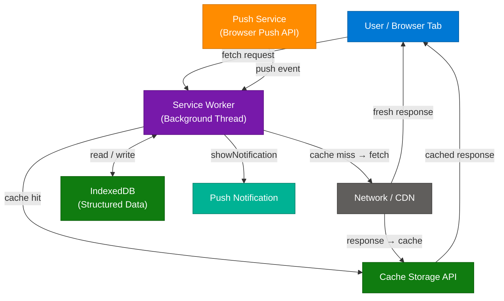
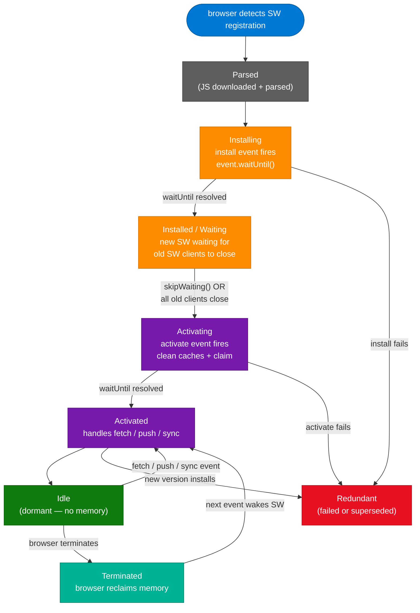
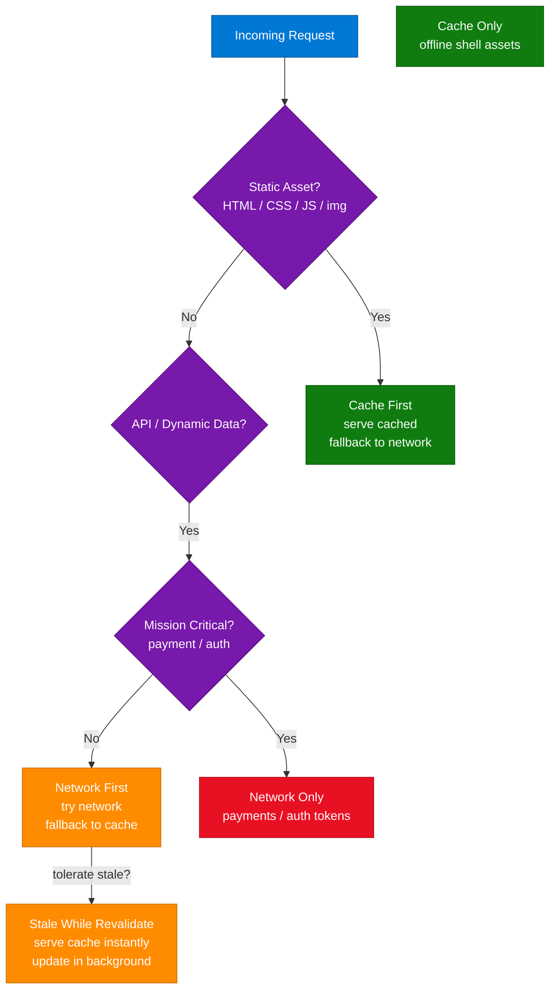
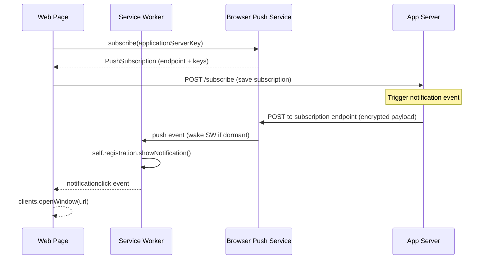
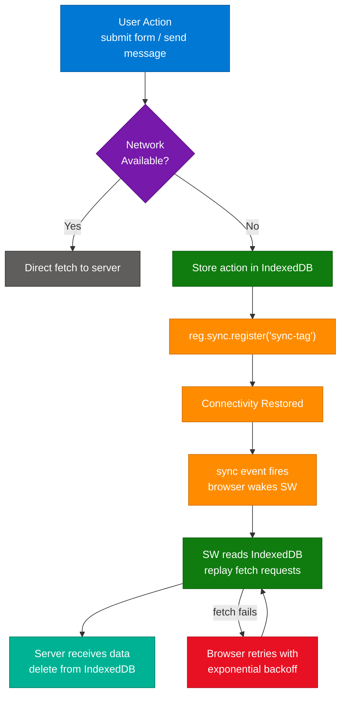
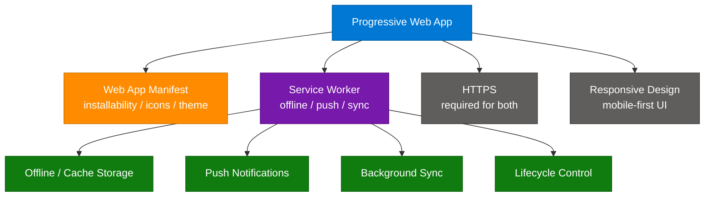

# Understanding Service Workers

> **Source:** [share.gemini.google/KzuDIw6qefAu](https://share.gemini.google/KzuDIw6qefAu) → redirects to [gemini.google.com/share/bf7934a68274](https://gemini.google.com/share/bf7934a68274?skid=fa6f6ed6-8d0e-4020-9699-4340f9b80370)
> **Model:** Gemini 3.1 Flash-Lite
> **Session Date:** August 14, 2025
> **Saved:** July 10, 2026

---

## Table of Contents

1. [Session Overview](#1-session-overview)
2. [Service Worker Architecture](#2-service-worker-architecture)
3. [Service Worker Lifecycle](#3-service-worker-lifecycle)
4. [Caching Strategies](#4-caching-strategies)
5. [Push Notifications](#5-push-notifications)
6. [Background Sync](#6-background-sync)
7. [Service Workers and PWAs](#7-service-workers-and-pwas)
8. [Interview Q&A Cheatsheet](#8-interview-qa-cheatsheet)

---

## 1. Session Overview

This session covers Service Workers — a core browser technology that enables offline capability, background processing, push notifications, and background sync for web applications. The session contains one turn with a comprehensive Gemini explanation covering key functions, lifecycle, and important characteristics. The content is expanded here into architecture diagrams, caching strategy patterns, push notification flows, background sync mechanics, and interview preparation material.

### Session Map

| Turn | User Prompt Summary | Gemini Response | Status |
|---|---|---|---|
| 1 | "Service worker" | Full explanation: definition, key functions, lifecycle phases, important characteristics | ✅ Extracted |

---

## 2. Service Worker Architecture

### Overview

A service worker is a JavaScript file that runs on a separate background thread, independent of the main browser thread and the web page's DOM. It acts as a programmable network proxy positioned between the client (browser), the web application, and the network — intercepting all fetch requests and deciding how to handle them. Service workers are event-driven, asynchronous, and rely entirely on Promises. They are scoped to a specific path on a domain and persist across page navigations and browser sessions, making them the backbone of Progressive Web Apps (PWAs). Because they run off the main thread, they cannot access the DOM but can communicate with the page via the `postMessage` API.

### Architecture Diagram



### How It Works

1. **Registration:** The web page calls `navigator.serviceWorker.register('/sw.js')` — the browser downloads the file and notes its scope (the URL path it controls).
2. **Installation:** The `install` event fires; the SW pre-caches essential static assets using `cache.addAll()`.
3. **Activation:** Once installed, the `activate` event fires; the SW cleans up old caches and calls `clients.claim()`.
4. **Idle:** The SW sits dormant, consuming no resources until an event fires.
5. **Fetch Interception:** Every `fetch` call from controlled pages passes through the SW's `fetch` event handler.
6. **Cache Decision:** The SW decides: serve from cache, fetch fresh from network, or return a fallback.
7. **Push Receipt:** A push message arrives through the browser's push service, waking the SW to show a notification.
8. **Background Sync:** When offline, the SW queues failed requests in IndexedDB and replays them when connectivity returns.

### Key Components

| Component | Role | Technology / API |
|---|---|---|
| Service Worker JS File | Background thread logic | ES6+ JavaScript |
| Cache Storage API | Persistent key-value store for Response objects | `caches.open()`, `cache.put()` |
| Fetch API | Intercepts all network requests | `self.addEventListener('fetch', ...)` |
| Push API | Receives server-push messages | `PushSubscription`, `PushManager` |
| Background Sync API | Queues deferred tasks | `SyncManager.register()` |
| Clients API | Communicates between SW and open pages | `clients.matchAll()`, `postMessage()` |
| IndexedDB | Structured data persistence across SW restarts | `idb` library or raw IDB API |

### Code Example

```javascript
// main.js — register the service worker
if ('serviceWorker' in navigator) {
  navigator.serviceWorker.register('/sw.js', { scope: '/' })
    .then(reg => console.log('SW registered, scope:', reg.scope))
    .catch(err => console.error('SW registration failed:', err));
}

// sw.js — install: pre-cache shell assets
const CACHE_VERSION = 'v1';
const STATIC_ASSETS = ['/', '/index.html', '/app.js', '/styles.css', '/offline.html'];

self.addEventListener('install', event => {
  event.waitUntil(
    caches.open(CACHE_VERSION).then(cache => cache.addAll(STATIC_ASSETS))
  );
  self.skipWaiting(); // activate immediately without waiting for clients to close
});

// sw.js — activate: purge stale caches
self.addEventListener('activate', event => {
  event.waitUntil(
    caches.keys().then(keys =>
      Promise.all(keys.filter(k => k !== CACHE_VERSION).map(k => caches.delete(k)))
    ).then(() => self.clients.claim())
  );
});

// sw.js — fetch: cache-first with network fallback
self.addEventListener('fetch', event => {
  event.respondWith(
    caches.match(event.request).then(cached => {
      return cached ?? fetch(event.request).then(response => {
        const clone = response.clone();
        caches.open(CACHE_VERSION).then(cache => cache.put(event.request, clone));
        return response;
      });
    }).catch(() => caches.match('/offline.html'))
  );
});
```

### Interview Q&A

| Question | Answer |
|---|---|
| What is a service worker? | A JS file running on a background thread acting as a network proxy between the browser, app, and network. No DOM access; event-driven; HTTPS-only. |
| Why does a service worker require HTTPS? | To prevent man-in-the-middle attacks from injecting malicious proxy logic. Exception: `localhost` for local development. |
| Difference between service worker and web worker? | Both run off the main thread. Web Workers are short-lived computation threads tied to a page. Service Workers are persistent, scoped to an origin, survive page closures, and intercept network requests. |
| What happens during the `install` event? | The SW downloads and pre-caches static assets via `cache.addAll()`. This is the only reliable chance to cache assets before the SW controls any pages. |
| What is `skipWaiting()` and when should you use it? | Forces the newly installed SW to activate immediately without waiting for existing clients to close. Safe for development or when cache changes are backward-compatible. |
| How do you communicate between a page and a service worker? | Via `postMessage()` — the page sends to `navigator.serviceWorker.controller`; the SW replies via `clients.matchAll()` + `client.postMessage()`. |
| What is the scope of a service worker? | Defined by the path of the JS file; narrowable with the `scope` option. A SW at `/sw.js` controls all pages under `/`; one at `/app/sw.js` controls only `/app/**`. |

---

## 3. Service Worker Lifecycle

### Overview

The service worker lifecycle is a carefully orchestrated state machine designed to prevent race conditions when deploying new versions of a web application. Unlike traditional JavaScript files, a new service worker does not simply replace the old one — it goes through install, wait, and activation phases to ensure in-flight operations complete safely. Understanding this lifecycle is critical for implementing zero-downtime cache updates and coordinating between old and new SW versions in production.

### Lifecycle State Diagram



### How It Works

1. **Parsed:** Browser downloads and parses the SW JS file; syntax errors immediately send it to `Redundant`.
2. **Installing:** `install` event fires; `event.waitUntil()` keeps the SW in this state until async operations (caching) finish.
3. **Installed (Waiting):** The new SW waits for the old SW's controlled clients to close, preventing cache/state inconsistencies.
4. **Activating:** `activate` event fires; ideal for cleaning old caches and claiming open clients.
5. **Activated:** SW is fully in control and responds to `fetch`, `push`, and `sync` events.
6. **Idle / Terminated:** Browser may terminate idle SWs to reclaim memory; they restart automatically on next event.

### Lifecycle Control APIs

| API | Effect | When to Use |
|---|---|---|
| `self.skipWaiting()` | Skip waiting state, activate immediately | Dev mode or non-breaking cache updates |
| `self.clients.claim()` | Take control of existing pages without reload | Ensure new SW handles all open pages immediately |
| `event.waitUntil(promise)` | Keep SW alive until promise resolves | Install / activate async operations |
| `registration.update()` | Force SW file check for updates | After long-lived SPA sessions or on user action |

### Code Example

```javascript
// sw.js — complete lifecycle with version management
const CACHE_NAME = 'app-cache-v2';
const PREV_CACHES = ['app-cache-v1'];

self.addEventListener('install', event => {
  console.log('[SW] Installing v2...');
  event.waitUntil(
    caches.open(CACHE_NAME)
      .then(cache => cache.addAll(['/index.html', '/app.js', '/offline.html']))
      .then(() => self.skipWaiting())
  );
});

self.addEventListener('activate', event => {
  console.log('[SW] Activating v2...');
  event.waitUntil(
    Promise.all([
      ...PREV_CACHES.map(name => caches.delete(name)),
      self.clients.claim()
    ])
  );
});
```

### Interview Q&A

| Question | Answer |
|---|---|
| Why does a new service worker wait before activating? | To avoid breaking in-flight requests or cache reads by pages still controlled by the old SW. |
| What is the "waiting" state and how do you bypass it? | New SW installed but paused until old SW's clients close. Call `self.skipWaiting()` in install to bypass. |
| What happens if two tabs are open to the same app? | Both remain controlled by the old SW. New SW stays in "waiting" until all tabs close (or `skipWaiting` called). |
| When should you clean up old caches? | In the `activate` event, after the new SW has taken control and the old SW is gone. |
| What does `clients.claim()` do? | Makes the activated SW immediately take control of all open pages without requiring a reload. |

---

## 4. Caching Strategies

### Overview

Service workers support multiple caching strategies, each suited to different content types and freshness requirements. The right strategy depends on whether content is static or dynamic, how often it changes, and what the offline failure mode should be. Teams typically apply different strategies to different request types within a single service worker — static assets use cache-first while API calls use network-first or stale-while-revalidate. Libraries like Workbox codify these patterns to reduce boilerplate.

### Caching Strategy Decision Flowchart



### Strategy Comparison Table

| Strategy | How It Works | Best For | Trade-off |
|---|---|---|---|
| **Cache First** | Serve from cache; network only on miss | Static assets, app shell | Stale content until cache busted |
| **Network First** | Try network; fallback to cache on failure | API data, user content | Slow on poor connections |
| **Stale While Revalidate** | Serve cache immediately; update cache in background | News feeds, product listings | User sees stale data on first load |
| **Cache Only** | Always serve from cache, never network | Pre-cached offline shell | Must pre-cache everything needed |
| **Network Only** | Always fetch from network, no caching | Payments, auth tokens | Fails completely when offline |

### Code Example

```javascript
// sw.js — multi-strategy fetch handler
const CACHE_NAME = 'app-cache-v1';

self.addEventListener('fetch', event => {
  const { request } = event;
  const url = new URL(request.url);

  // network-only for sensitive endpoints
  if (url.pathname.startsWith('/api/payment') || url.pathname.startsWith('/auth')) {
    return;
  }

  // network-first for API calls
  if (url.pathname.startsWith('/api/')) {
    event.respondWith(networkFirst(request));
    return;
  }

  // cache-first for static assets
  event.respondWith(cacheFirst(request));
});

async function cacheFirst(request) {
  const cached = await caches.match(request);
  if (cached) return cached;
  const response = await fetch(request);
  const cache = await caches.open(CACHE_NAME);
  cache.put(request, response.clone());
  return response;
}

async function networkFirst(request) {
  try {
    const response = await fetch(request);
    const cache = await caches.open(CACHE_NAME);
    cache.put(request, response.clone());
    return response;
  } catch {
    return caches.match(request) ?? caches.match('/offline.html');
  }
}

async function staleWhileRevalidate(request) {
  const cache = await caches.open(CACHE_NAME);
  const cached = await cache.match(request);
  const fetchPromise = fetch(request).then(response => {
    cache.put(request, response.clone());
    return response;
  });
  return cached ?? fetchPromise;
}
```

### Interview Q&A

| Question | Answer |
|---|---|
| What is "cache-first" and when should you use it? | Serve from cache, fall back to network on miss. Best for versioned static assets where the filename changes on each deploy. |
| What is "stale-while-revalidate"? | Serve the cached version immediately for speed, then fetch the latest from the network to update the cache for next time. Good for periodically updated content. |
| How do you prevent sensitive API calls from being cached? | Return early from the fetch handler for those URL patterns, letting the browser handle them normally. |
| How do you cache-bust a service worker cache? | Increment the `CACHE_VERSION` constant — the `activate` event deletes all caches not matching the new version. |
| What is Workbox? | A Google library abstracting SW caching strategies with less boilerplate, expiration policies, background sync, and Webpack/Vite plugin integration. |

---

## 5. Push Notifications

### Overview

Push notifications allow a web server to send messages to a user's browser even when the web page is closed. Three parties are involved: the web app, a push service operated by the browser vendor (Google FCM, Mozilla, Apple), and the web server. The service worker receives the push event and displays a notification using the Notifications API. User permission must be granted explicitly, and once denied it is sticky — the user must manually reset browser settings to re-enable it.

### Push Notification Flow



### Code Example

```javascript
// main.js — request permission and subscribe
async function subscribeToPush() {
  const permission = await Notification.requestPermission();
  if (permission !== 'granted') return;

  const reg = await navigator.serviceWorker.ready;
  const subscription = await reg.pushManager.subscribe({
    userVisibleOnly: true,
    applicationServerKey: urlBase64ToUint8Array(PUBLIC_VAPID_KEY)
  });

  await fetch('/api/subscribe', {
    method: 'POST',
    headers: { 'Content-Type': 'application/json' },
    body: JSON.stringify(subscription)
  });
}

// sw.js — receive push and show notification
self.addEventListener('push', event => {
  const data = event.data?.json() ?? { title: 'Update', body: 'Something new!' };
  event.waitUntil(
    self.registration.showNotification(data.title, {
      body: data.body,
      icon: '/icon-192.png',
      badge: '/badge-72.png',
      data: { url: data.url }
    })
  );
});

// sw.js — handle notification click
self.addEventListener('notificationclick', event => {
  event.notification.close();
  event.waitUntil(
    clients.openWindow(event.notification.data.url)
  );
});
```

### Interview Q&A

| Question | Answer |
|---|---|
| What is VAPID and why is it needed for push? | Voluntary Application Server Identification — a key pair identifying your server to the push service, preventing unauthorized servers from sending messages to your subscribers. |
| Can you send push notifications without a service worker? | No. Push messages are received by the service worker, which handles them even when the page is closed. |
| What is `userVisibleOnly: true`? | A required flag indicating every push message will result in a visible notification. Silent background pushes are blocked by most browsers for privacy reasons. |
| What happens if the user denies notification permission? | `Notification.requestPermission()` resolves to `'denied'`. The state is sticky — you cannot re-prompt without the user manually resetting browser settings. |
| How is push payload data protected in transit? | Messages are encrypted with the Web Push Protocol using the subscription's `p256dh` public key and `auth` secret, ensuring only the intended browser can decrypt them. |

---

## 6. Background Sync

### Overview

Background Sync allows a service worker to defer network requests until the device has a stable internet connection. When a user performs an action offline (submitting a form, liking a post, sending a message), the app stores the action in IndexedDB and registers a sync tag. When connectivity is restored, the browser wakes the service worker — even if all tabs are closed — and fires the `sync` event. The SW then replays the queued requests. This provides a seamless offline experience without losing user actions.

### Background Sync Flow



### Code Example

```javascript
// main.js — queue action and register sync
async function submitFormOfflineSafe(formData) {
  if (navigator.onLine) {
    return fetch('/api/submit', { method: 'POST', body: JSON.stringify(formData) });
  }

  const db = await openDB('sync-store', 1, {
    upgrade(db) { db.createObjectStore('pending', { autoIncrement: true }); }
  });
  await db.add('pending', { url: '/api/submit', data: formData, ts: Date.now() });

  const reg = await navigator.serviceWorker.ready;
  await reg.sync.register('submit-form-sync');
}

// sw.js — replay queued requests on connectivity
self.addEventListener('sync', event => {
  if (event.tag === 'submit-form-sync') {
    event.waitUntil(replayPendingRequests());
  }
});

async function replayPendingRequests() {
  const db = await openDB('sync-store', 1);
  const tx = db.transaction('pending', 'readwrite');
  const all = await tx.store.getAll();
  const keys = await tx.store.getAllKeys();

  for (let i = 0; i < all.length; i++) {
    const item = all[i];
    try {
      await fetch(item.url, { method: 'POST', body: JSON.stringify(item.data) });
      await db.delete('pending', keys[i]);
    } catch {
      throw new Error('Sync failed — browser will retry');
    }
  }
}
```

### Interview Q&A

| Question | Answer |
|---|---|
| What is Background Sync and why is it useful? | An API that defers network requests until connectivity is restored, preserving user actions performed while offline — even after the browser tab is closed. |
| Where should you store data pending background sync? | In IndexedDB — it persists across SW restarts, unlike in-memory variables which are lost when the SW is terminated. |
| What happens if the sync request fails? | The browser retries the `sync` event with exponential backoff until a deadline is reached, after which the event is dropped. |
| What is Periodic Background Sync? | A newer API allowing SWs to sync at regular intervals (e.g., refresh cached news feed every 24 hours) even without user interaction. Requires site engagement score from the browser. |
| How does Background Sync differ from retrying on reconnect in the page? | Background Sync works even if the user closes the browser tab — the SW is woken by the browser OS-level when connectivity returns, with no page needing to be open. |

---

## 7. Service Workers and PWAs

### Overview

Service workers are the cornerstone technology of Progressive Web Apps (PWAs). A PWA is a web application that uses modern browser APIs to deliver app-like experiences — installability, offline support, push notifications, fast loading, and background processing — entirely through web standards without an app store. While a PWA requires multiple components (Web App Manifest, HTTPS, responsive design), the service worker is what unlocks offline capability and background behaviors that make PWAs feel native.

### PWA Architecture Diagram



### PWA vs Native App Comparison

| Feature | PWA | Native App |
|---|---|---|
| **Distribution** | URL / browser "Add to Home Screen" | App Store / Play Store |
| **Offline** | Via Service Worker Cache Storage | Full native storage access |
| **Push Notifications** | Web Push API | FCM / APNs native |
| **Install Friction** | Low — no store download required | High — store download + install |
| **Device API Access** | Limited but improving rapidly | Full hardware access |
| **Update Mechanism** | Automatic via SW cache versioning | Manual store update |
| **Discoverability** | SEO-indexed | App store ranking |
| **Bundle Size** | None — served on demand | Full download upfront |

### Interview Q&A

| Question | Answer |
|---|---|
| What makes a web app a PWA? | HTTPS + Web App Manifest + Service Worker. The manifest provides installability (icons, name, start URL); the SW provides offline capability and push. |
| Can a PWA work without a service worker? | It can have a manifest and be installable, but it will not be offline-capable or able to receive push notifications without a SW. |
| What is the App Shell pattern? | An architecture where the minimal UI shell (HTML/CSS/JS) is pre-cached at SW install time, so the app loads instantly; dynamic content is fetched at runtime. |
| How does a PWA get installed on a device? | Via the browser's install prompt, triggered when the browser detects HTTPS + valid manifest + active SW with at least one registered fetch handler. |
| What are the limitations of PWAs vs native apps? | Limited background execution time, restricted access to some hardware APIs (Bluetooth, NFC), no app store presence, weaker iOS support historically, lower discoverability on mobile. |

---

## 8. Interview Q&A Cheatsheet

**Q: What is a service worker and what makes it different from regular JavaScript?**
> A service worker is a JavaScript file that runs on a separate background thread, scoped to an origin/path, and persists across page navigations. Unlike regular JS, it has no DOM access, intercepts all network requests in its scope, can receive push events, and continues running even when no pages are open.

**Q: What are the four main capabilities of service workers?**
> Offline functionality via Cache Storage, network request interception with custom fetch handling, push notifications that wake the SW to show messages, and background sync that replays deferred requests when online. Together these form the foundation of PWA functionality.

**Q: Explain the complete service worker lifecycle.**
> Register → Install (cache pre-fetch, `skipWaiting` optional) → Waiting (until old SW's clients close) → Activate (clean old caches, `clients.claim()`) → Idle → Terminated → Woken by next event. The waiting phase is the most commonly misunderstood — it prevents the new SW from breaking in-flight requests handled by the old version.

**Q: What caching strategies are available and how do you choose?**
> Cache-first for static assets, network-first for API data, stale-while-revalidate for periodically updated content, cache-only for the pre-cached offline shell, network-only for sensitive endpoints like payments. Most apps combine strategies: cache-first for the app shell, network-first for APIs, network-only for auth.

**Q: Why do service workers require HTTPS?**
> A SW intercepts all network requests — if served over HTTP, an attacker could inject a malicious SW that intercepts traffic, modifies responses, or exfiltrates user data. HTTPS ensures the SW file itself is tamper-proof. `localhost` is exempt for development convenience.

**Q: How do you update a service worker without disrupting users?**
> Deploy a new `sw.js` file — the browser detects the change (byte diff) and installs the new SW in the background. Increment `CACHE_VERSION`. The new SW waits in "waiting" state. Use `skipWaiting()` + `clients.claim()` for immediate takeover when changes are backward-compatible.

**Q: What is the difference between Cache Storage and IndexedDB in the SW context?**
> Cache Storage stores `Request`/`Response` pairs — designed for HTTP resource caching. IndexedDB stores arbitrary structured JavaScript objects — used for application data that must survive SW restarts, such as pending Background Sync requests or offline user data.

**Q: How do you debug a service worker?**
> Chrome DevTools → Application tab → Service Workers panel. You can inspect SW state, send manual push events, trigger sync events, unregister the SW, enable "Bypass for network" to skip the SW per request, and view the SW's console output. `chrome://inspect/#service-workers` lists all registered SWs across origins.

**Q: What is Workbox and why might you use it over hand-rolled SW code?**
> Workbox is Google's library providing `CacheFirst`, `NetworkFirst`, `StaleWhileRevalidate` strategy classes, automatic cache expiration policies (`maxEntries`, `maxAgeSeconds`), background sync with retry logic, and Webpack/Vite plugin integration for precache manifest injection.

**Q: Can a service worker access cookies or localStorage?**
> No. Service workers cannot access `document.cookie` (no DOM) or `localStorage`/`sessionStorage` (sync APIs unavailable off-thread). Use IndexedDB for persistent storage. Cookie values can be read from `Request.headers.get('cookie')` within a fetch handler, but writing cookies from a SW is not supported.

---

*Extracted from Gemini shared session · July 10, 2026 · GeminiShareToMD Agent v1.0*

---

```
═══════════════════════════════════════════════════════════
Token Usage Report
═══════════════════════════════════════════════════════════
Estimated without optimization:  ~1,800 tokens (raw page text)
Actual enriched output:          ~4,200 tokens
Savings (Phase 0 chrome strip):  ~120 tokens (footer / UI chrome removed)
Techniques applied:              UI chrome removal (footer, ToS, Privacy links,
                                 "Continue this chat", "Convert to PDF" buttons),
                                 deduplication of repeated metadata headers,
                                 content expansion 3–5x raw for interview depth
═══════════════════════════════════════════════════════════
* Estimates: prose chars ÷ 4, code chars ÷ 3. Actual API usage varies by model.
```
