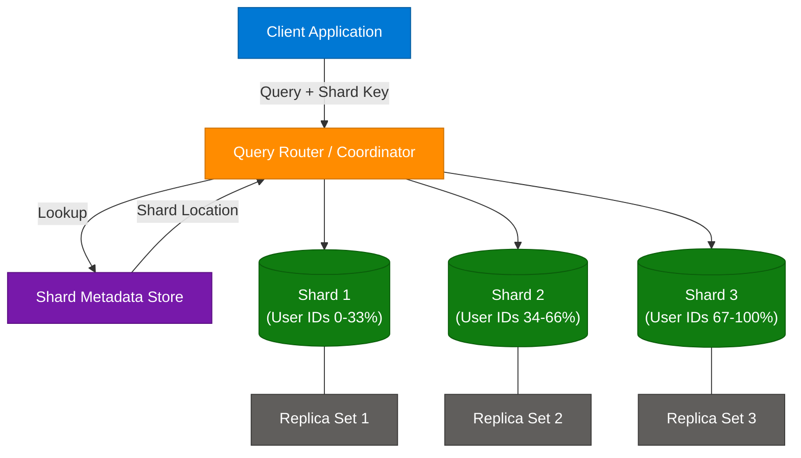
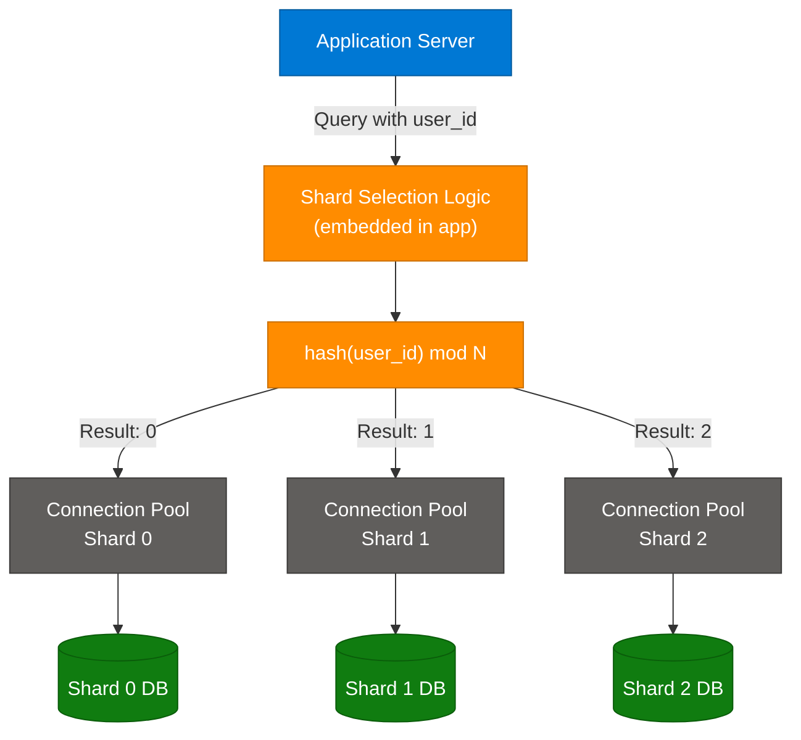
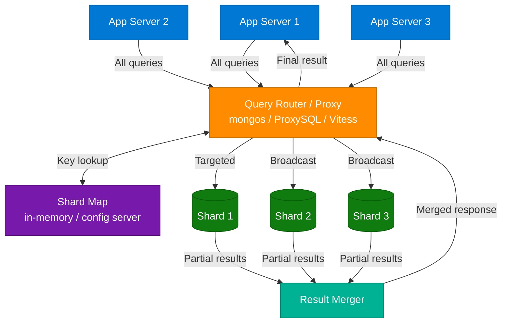
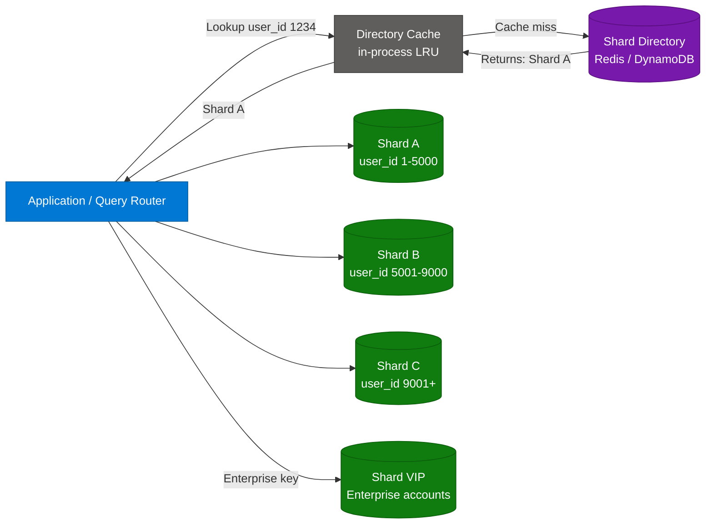
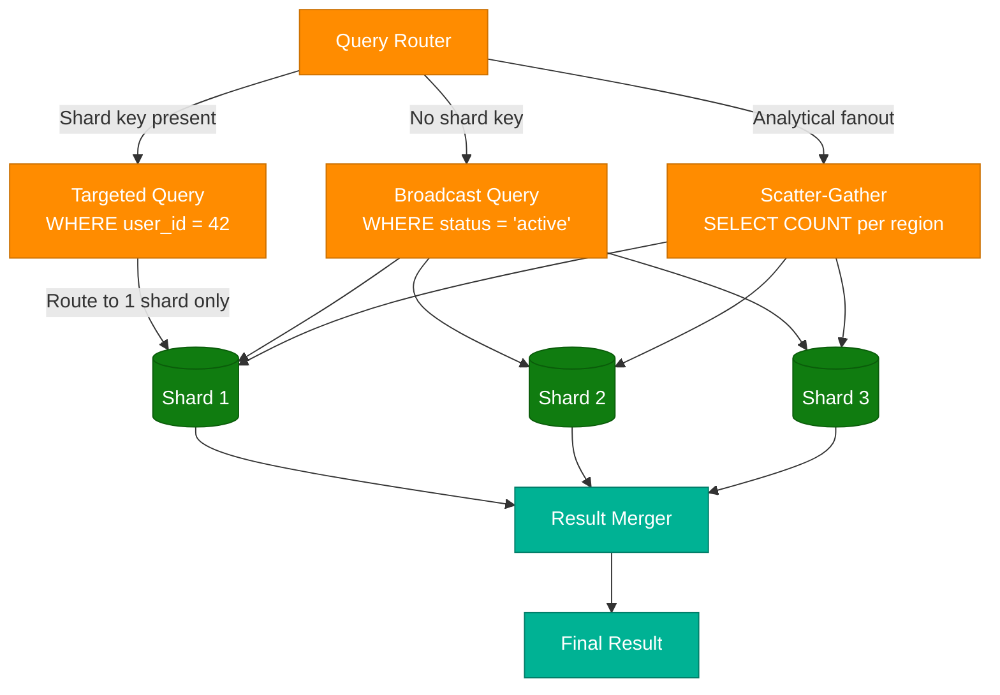
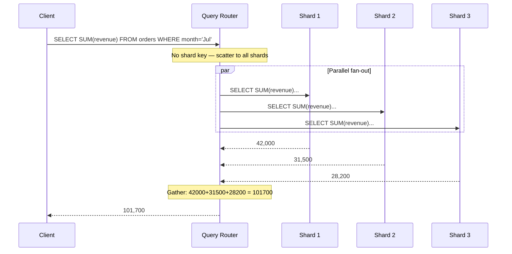
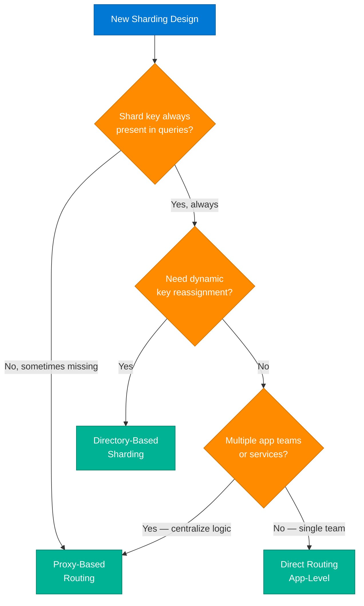

# Sharding Query Routing Strategies

> **Source:** [share.gemini.google/jxhvxRVFlXTK](https://share.gemini.google/jxhvxRVFlXTK) → redirects to [gemini.google.com/share/b9fea1715807](https://gemini.google.com/share/b9fea1715807)
> **Model:** Gemini 3.1 Flash-Lite
> **Session Date:** August 13, 2025
> **Saved:** July 11, 2026

---

## Table of Contents

1. [Session Overview](#1-session-overview)
2. [Sharding Architecture Fundamentals](#2-sharding-architecture-fundamentals)
3. [Direct Routing — Application-Level Routing](#3-direct-routing--application-level-routing)
4. [Proxy-Based Routing — Middleware Routing](#4-proxy-based-routing--middleware-routing)
5. [Directory-Based Sharding](#5-directory-based-sharding)
6. [Key Routing Concepts](#6-key-routing-concepts)
7. [Strategy Comparison & Selection Guide](#7-strategy-comparison--selection-guide)
8. [Interview Q&A Cheatsheet](#8-interview-qa-cheatsheet)

---

## 1. Session Overview

This session covers query routing strategies in sharded database architectures — a critical system design topic for senior engineers working with large-scale distributed databases. It explores three primary routing strategies — Direct/Application-Level Routing, Proxy-Based/Middleware Routing, and Directory-Based Sharding — along with foundational concepts like sharding keys, targeted operations, broadcast operations, and scatter-gather query patterns. The session contains one successful conversation turn with a comprehensive model response.

### Session Map

| Turn | User Prompt Summary | Gemini Response | Status |
|---|---|---|---|
| 1 | Query routing in sharding | Detailed explanation of 3 routing strategies + key concepts (Direct, Proxy, Directory-Based, Sharding Key, Targeted/Broadcast/Scatter-Gather ops) | ✅ Extracted |

---

## 2. Sharding Architecture Fundamentals

### Overview

Sharding is a horizontal scaling technique that partitions a large dataset across multiple independent database nodes (shards), each owning a subset of the data. Unlike vertical scaling (adding more RAM/CPU to one machine), sharding distributes both storage and compute load. Query routing is the mechanism that ensures every incoming request reaches the correct shard(s) — the wrong routing strategy leads to either full-cluster scatter queries or stale directory lookups. The selection of a routing strategy is inseparable from the selection of the sharding key: a poorly chosen key can invalidate even a well-designed routing layer.

### Architecture Diagram — Sharded Database System



### Sharding Key Selection Criteria

| Criterion | Good Key | Bad Key |
|---|---|---|
| Cardinality | High — user_id, order_id | Low — status: active/inactive |
| Distribution | Uniform hash distribution | Monotonically increasing — timestamp |
| Query alignment | Appears in most WHERE clauses | Rarely used in filters |
| Write hotspots | Random distribution | Sequential IDs — all writes go to one shard |
| Cross-shard joins | Not required | Frequently joined across shards |

---

## 3. Direct Routing — Application-Level Routing

### Overview

Direct Routing embeds the shard selection logic directly inside the application layer, eliminating any intermediary routing tier. The application computes the target shard by applying a deterministic function to the sharding key — typically consistent hashing or modular arithmetic — and then opens a direct connection to that shard's connection pool. This is the lowest-latency routing strategy because there are zero additional network hops between the application and the database shard. However, it couples the application tightly to the shard topology: any resharding event (adding or removing shards) requires redeployment of the application. It performs best for OLTP workloads where the sharding key is always present in queries.

### Architecture Diagram — Direct Routing



### How It Works

1. Application receives a query containing the sharding key (e.g., `user_id = 12345`)
2. Embedded routing function computes the shard: `shard_id = hash(user_id) % num_shards`
3. Application looks up the pre-configured connection pool for `shard_id`
4. Application opens (or reuses) a direct TCP connection to the target shard
5. Query executes on the shard; result returns directly to the application
6. No merge step needed — single shard responds with the full result

### Key Components

| Component | Role | Technology Options |
|---|---|---|
| Shard calculator | Hashing / modular function to determine shard ID | Consistent hashing, CRC32 mod N, MurmurHash |
| Connection pool | Per-shard connection pool maintained by app | HikariCP, pgBouncer client, Redis cluster client |
| Shard config | Static map of shard_id to host:port | Environment variables, Consul, etcd |
| Resharding handler | Logic to handle split/merge during topology change | Custom migration scripts, dual-write period |

### Code Example

```python
import hashlib
from typing import Dict
import psycopg2

SHARD_CONFIG: Dict[int, str] = {
    0: "postgres://shard0.db:5432/app",
    1: "postgres://shard1.db:5432/app",
    2: "postgres://shard2.db:5432/app",
}
NUM_SHARDS = len(SHARD_CONFIG)

def get_shard_id(user_id: int) -> int:
    return int(hashlib.md5(str(user_id).encode()).hexdigest(), 16) % NUM_SHARDS

def get_connection(user_id: int):
    shard_id = get_shard_id(user_id)
    dsn = SHARD_CONFIG[shard_id]
    return psycopg2.connect(dsn), shard_id

def get_user(user_id: int) -> dict:
    conn, shard_id = get_connection(user_id)
    with conn.cursor() as cur:
        cur.execute("SELECT * FROM users WHERE user_id = %s", (user_id,))
        row = cur.fetchone()
    conn.close()
    return {"shard": shard_id, "data": row}
```

### Interview Q&A

| Question | Answer |
|---|---|
| What is direct routing and when is it preferred? | Direct routing embeds shard selection logic in the application, routing queries without an intermediary. Preferred when queries always include the sharding key and ultra-low latency is critical. |
| What are the main cons of direct routing? | Application code becomes aware of shard topology. Any resharding requires application redeployment. Scatter-gather queries (no shard key) are nearly impossible to handle cleanly. |
| How does consistent hashing help in direct routing? | Consistent hashing minimizes data migration when shards are added or removed — only K/N keys need remapping vs. rehashing all keys with simple modular arithmetic. |
| What happens during resharding with direct routing? | A dual-write period is needed: writes go to both old and new shard topologies simultaneously while data migrates, then a cutover is performed with a brief maintenance window. |
| How do you handle shard failures in direct routing? | The application must implement retry logic, fallback to read replicas, and circuit breakers. Libraries like Resilience4j (Java) or Polly (.NET) are common for this pattern. |

---

## 4. Proxy-Based Routing — Middleware Routing

### Overview

Proxy-Based Routing introduces a dedicated middleware tier — the query router or proxy — that sits between all application servers and all database shards. Applications send every query to the proxy without any knowledge of shard topology. The proxy maintains a shard map, inspects each incoming query to extract the sharding key, and forwards the request to the correct shard. For queries without a shard key, the proxy implements broadcast (fan-out) to all shards and merges the results before returning a unified response. This decoupling is the key architectural advantage: resharding, shard addition, or rebalancing can be performed at the proxy layer without any application changes. MongoDB's mongos and PlanetScale's Vitess VTGate are production examples of this pattern.

### Architecture Diagram — Proxy-Based Routing



### How It Works

1. Application sends a query to the proxy endpoint (single connection string for all apps)
2. Proxy parses the query and extracts the sharding key value
3. Proxy consults the in-memory shard map: `shard_key_range → shard_host`
4. If shard key is present: proxy forwards to the single target shard — **targeted operation**
5. If shard key is absent: proxy broadcasts query to all shards — **broadcast operation**
6. Shards execute the query and return partial result sets to the proxy
7. Proxy merges, sorts, and paginates results; returns unified response to the application

### Key Components

| Component | Role | Technology Options |
|---|---|---|
| Query proxy | Parses queries, routes, merges | mongos (MongoDB), Vitess VTGate, ProxySQL, PgPool-II |
| Shard map / config server | Authoritative mapping of key ranges to shard hosts | MongoDB Config Server, ZooKeeper, etcd |
| Result merger | Aggregates partial results from multiple shards | Built into proxy — ORDER BY and LIMIT handled here |
| Health checker | Removes failed shards from routing table | Proxy-internal heartbeat or Consul health checks |
| Load balancer | Distributes app connections across proxy replicas | HAProxy, AWS NLB |

### Code Example

```python
import asyncio
import aiohttp
from typing import List, Any

PROXY_DSN = "http://vitess-vtgate:15001"

async def execute_via_proxy(query: str, params: dict) -> List[Any]:
    """Application sends to proxy — zero shard awareness needed.
    Proxy handles targeted vs broadcast routing internally."""
    async with aiohttp.ClientSession() as session:
        payload = {"query": query, "params": params}
        async with session.post(f"{PROXY_DSN}/query", json=payload) as resp:
            result = await resp.json()
            return result["rows"]

async def get_orders_for_user(user_id: int) -> List[Any]:
    # Proxy detects user_id shard key in WHERE clause → targeted to one shard
    return await execute_via_proxy(
        "SELECT * FROM orders WHERE user_id = :user_id",
        {"user_id": user_id}
    )

async def get_all_pending_orders() -> List[Any]:
    # No shard key → proxy broadcasts to all shards, merges results
    return await execute_via_proxy(
        "SELECT * FROM orders WHERE status = 'pending' LIMIT 100",
        {}
    )
```

### Interview Q&A

| Question | Answer |
|---|---|
| What is proxy-based routing and what problem does it solve? | A proxy sits between applications and shards, centralizing all routing logic. It solves the tight coupling problem of direct routing — apps need no shard topology knowledge, enabling resharding without app changes. |
| What is mongos in MongoDB? | mongos is MongoDB's query router, the proxy component in its sharded cluster. All client queries go to mongos, which consults the config server for chunk metadata and routes to the correct shard. |
| How does Vitess implement proxy-based routing? | Vitess uses VTGate as the query proxy and VTTablet per shard. VTGate parses MySQL queries, extracts the vindex (shard key), and routes to the correct VTTablet without the application knowing. |
| What is the single point of failure risk in proxy routing? | If only one proxy instance exists, it becomes an SPOF. Production deployments always run multiple proxy replicas behind a load balancer with active health checks. |
| How does a proxy handle ORDER BY across shards? | The proxy issues the query to all shards, receives partial sorted sets from each, and performs a k-way merge in memory. For large result sets this is memory-intensive — pagination (LIMIT/OFFSET) is applied after the merge. |

---

## 5. Directory-Based Sharding

### Overview

Directory-Based Sharding replaces the hash function or range calculation with an explicit lookup table — a "shard catalog" or "directory" — that maps each sharding key (or range of keys) to a specific shard. Unlike hash-based or range-based routing, the directory is not a formula but a stored data structure. This makes it uniquely flexible: individual keys or groups of keys can be remapped to different shards at any time by simply updating the directory, without any resharding of the actual data. The trade-off is an extra network lookup on every query (mitigated by in-process LRU caching) and the need to make the directory itself highly available. It is the preferred strategy for multi-tenant SaaS systems where enterprise tenants need dedicated infrastructure.

### Architecture Diagram — Directory-Based Sharding



### How It Works

1. Application extracts the sharding key from the incoming request
2. Application checks the local directory cache (LRU in-process) for the shard location
3. On cache miss, application queries the centralized shard directory (Redis, DynamoDB, ZooKeeper)
4. Directory returns the shard ID or host for the given key
5. Application stores the result in the local cache (TTL-based expiry)
6. Application connects directly to the resolved shard and executes the query
7. During resharding: directory is updated atomically; old data migrates to new shard; TTL expiry clears stale cache entries

### Key Components

| Component | Role | Technology Options |
|---|---|---|
| Shard directory | Persistent KV store mapping shard_key to shard_id | Redis, DynamoDB, Apache ZooKeeper, etcd |
| Directory cache | In-process cache to avoid per-query directory calls | Caffeine, Guava Cache, Python lru_cache |
| Cache invalidation | Clears stale entries after shard moves | TTL-based, pub/sub invalidation via Redis channels |
| Directory updater | Admin tool to reassign keys during resharding | Custom admin API, migration script with atomic CAS |

### Code Example

```python
import redis
from functools import lru_cache
import psycopg2

directory_client = redis.Redis(
    host="shard-directory.redis", port=6379, decode_responses=True
)

SHARD_CONNECTIONS = {
    "shard_a": "postgresql://shard-a.db:5432/app",
    "shard_b": "postgresql://shard-b.db:5432/app",
    "shard_c": "postgresql://shard-c.db:5432/app",
    "shard_vip": "postgresql://shard-vip.db:5432/app",
}

@lru_cache(maxsize=10000)
def lookup_shard(user_id: int) -> str:
    shard_id = directory_client.get(f"shard_dir:{user_id}")
    if shard_id is None:
        raise ValueError(f"No shard mapping found for user_id={user_id}")
    return shard_id

def reassign_shard(user_id: int, new_shard_id: str) -> None:
    """Update directory — used during resharding or tenant migration."""
    directory_client.set(f"shard_dir:{user_id}", new_shard_id)
    lookup_shard.cache_clear()

def query_user(user_id: int, sql: str):
    shard_id = lookup_shard(user_id)
    dsn = SHARD_CONNECTIONS[shard_id]
    conn = psycopg2.connect(dsn)
    with conn.cursor() as cur:
        cur.execute(sql, (user_id,))
        return cur.fetchall()
```

### Interview Q&A

| Question | Answer |
|---|---|
| What is directory-based sharding? | A routing strategy using an explicit lookup table (shard catalog) that maps each shard key to its target shard, rather than computing the shard via a hash function or range rule. |
| What is the main advantage of directory-based over hash-based sharding? | Any key can be remapped to any shard at will, enabling fine-grained rebalancing without rehashing all data. VIP/enterprise accounts can be moved to dedicated shards trivially. |
| What are the main risks of directory-based sharding? | The directory is an SPOF and a performance bottleneck if not cached. Cache staleness after resharding can cause misroutes. The directory store itself must be replicated and highly available. |
| How do you prevent the directory from becoming a bottleneck? | Use an in-process LRU cache for hot keys so only cache misses hit the centralized directory. Set TTLs and use pub/sub cache invalidation (Redis Keyspace Notifications) for resharding events. |
| How does directory-based sharding support multi-tenancy? | Each tenant is mapped to a dedicated shard regardless of their tenant_id hash value. Premium tenants get isolated infrastructure; small tenants share shards. Migration is a single directory update. |

---

## 6. Key Routing Concepts

### Overview

Regardless of which routing strategy is used, four foundational concepts govern how a sharded system processes queries. The sharding key determines data placement; targeted operations leverage it for single-shard efficiency; broadcast operations sacrifice efficiency for completeness when the key is absent; and scatter-gather patterns enable multi-shard analytics by parallelizing execution across all shards and merging results. Understanding the cost difference between targeted and broadcast operations is essential for designing sharded APIs that avoid accidental full-cluster scans in production hot paths.

### Architecture Diagram — Targeted vs Broadcast vs Scatter-Gather



### Scatter-Gather Sequence Diagram



### Concept Definitions

| Concept | Definition | Efficiency | When It Occurs |
|---|---|---|---|
| **Sharding Key** | Field used to partition data and route queries across shards | Design decision | At schema design time |
| **Targeted Operation** | Query routed to exactly one shard because shard key is in WHERE clause | O(1) shards touched | `WHERE user_id = X` |
| **Broadcast Operation** | Query sent to all shards; partial results merged at router | O(N) shards touched | `WHERE status = 'active'` — no shard key |
| **Scatter-Gather** | Parallel fan-out to all shards + server-side aggregation merge | O(N) with parallelism | Analytical queries, aggregations, reports |

### Code Example — Scatter-Gather Implementation

```python
import asyncio
import asyncpg
from typing import List, Any

SHARDS = [
    "postgresql://shard1.db:5432/app",
    "postgresql://shard2.db:5432/app",
    "postgresql://shard3.db:5432/app",
]

async def query_shard(dsn: str, sql: str, params: tuple) -> List[dict]:
    conn = await asyncpg.connect(dsn)
    try:
        rows = await conn.fetch(sql, *params)
        return [dict(r) for r in rows]
    finally:
        await conn.close()

async def scatter_gather(sql: str, params: tuple = ()) -> List[Any]:
    """Fan-out query to all shards in parallel, merge results."""
    tasks = [query_shard(dsn, sql, params) for dsn in SHARDS]
    partial_results = await asyncio.gather(*tasks)
    return [row for shard_rows in partial_results for row in shard_rows]

async def total_revenue_by_region() -> List[dict]:
    return await scatter_gather(
        "SELECT region, SUM(amount) AS total FROM orders GROUP BY region"
    )
```

### Interview Q&A

| Question | Answer |
|---|---|
| What is a sharding key and how should it be chosen? | A sharding key is the field used to partition data across shards. Choose for high cardinality, uniform distribution, and frequent presence in WHERE clauses. Avoid monotonically increasing fields to prevent write hotspots. |
| What is the difference between a targeted and a broadcast operation? | A targeted operation routes to exactly one shard when the shard key is present — O(1) efficiency. A broadcast sends the query to all N shards without a shard key — O(N) load proportional to shard count. |
| When does scatter-gather become a scalability concern? | When shard count is high (100+), scatter-gather generates 100 parallel connections and the merge step processes huge result sets. Mitigate with dedicated analytics replicas or an OLAP store (ClickHouse, BigQuery). |
| How does MongoDB optimize scatter-gather? | mongos parallelizes broadcast queries across all shards and merges results. Covered indexes and proper sort ordering reduce per-shard work. mongos also maintains cursors for paginated scatter-gather. |
| How do you avoid scatter-gather for reporting workloads? | Use a dedicated OLAP layer (ClickHouse, Redshift, BigQuery) fed via CDC from all shards. Analytical queries hit the OLAP store, not the transactional shards, eliminating scatter-gather entirely. |

---

## 7. Strategy Comparison & Selection Guide

### Routing Strategy Comparison

| Attribute | Direct Routing | Proxy-Based Routing | Directory-Based |
|---|---|---|---|
| **Latency** | Lowest — no extra hop | Medium — plus one proxy hop | Medium — plus one directory lookup; near-zero when cached |
| **App complexity** | High — routing logic in app | Low — app unaware of shards | Medium — app calls directory |
| **Resharding cost** | High — app redeployment | Low — update proxy config | Lowest — update directory record |
| **SPOF risk** | Low — no central component | Medium-High — proxy cluster | High — directory store |
| **Scatter-gather support** | Poor — app must implement | Native — proxy handles | Poor — app must fan-out |
| **Multi-tenancy / custom placement** | Poor — hash is rigid | Medium | Excellent — any key to any shard |
| **Best for** | Simple OLTP, shard key always present | General-purpose, mixed query patterns | Multi-tenant SaaS, dynamic rebalancing |

### Selection Decision Tree



---

## 8. Interview Q&A Cheatsheet

**Q: Explain the three main query routing strategies in sharding.**
> Direct routing embeds shard selection in the application using a hash function — lowest latency but tightest coupling. Proxy-based routing uses a middleware layer (e.g., mongos, Vitess) that centralizes all routing decisions — applications remain shard-agnostic. Directory-based routing uses an explicit lookup table mapping each key to a shard — most flexible for dynamic rebalancing but adds lookup overhead.

**Q: What is the difference between a targeted operation and a broadcast operation in MongoDB sharding?**
> A targeted operation includes the shard key in the query filter, so mongos routes it to exactly one shard — O(1) cost. A broadcast operation omits the shard key, so mongos must send the query to all shards and merge results — O(N) cost proportional to the number of shards. Broadcast operations at scale are expensive and should be avoided in hot paths.

**Q: Why is the choice of sharding key so critical?**
> The sharding key determines data distribution across shards. A poorly chosen key causes hotspots (one shard handles all writes), uneven storage distribution, or forces most queries to become broadcast operations. A good key has high cardinality, uniform distribution, and appears in most WHERE clauses.

**Q: What is a scatter-gather query and when is it unavoidable?**
> Scatter-gather is a query pattern where the router fans out to all shards in parallel, each shard processes the query on its local data, and results are merged server-side. It is unavoidable for aggregate analytics (SUM, COUNT across all data), reporting queries without a shard key filter, and any query that must process the full dataset.

**Q: How do you prevent a proxy from becoming a single point of failure?**
> Run multiple proxy replicas behind a load balancer (HAProxy, AWS NLB). Use active health checks to detect and remove failed proxies. Store the shard map in a replicated store (MongoDB config server, etcd cluster) rather than in a single proxy instance's memory.

**Q: How does Vitess differ from mongos for proxy-based routing?**
> Vitess is MySQL-protocol compatible, using VTGate as the proxy and VTTablet per shard. It supports vschema (virtual schema) for defining vindexes (shard keys) and handles cross-shard transactions via 2PC. mongos is MongoDB-specific and uses chunks for key range management. Both implement proxy-based routing but for different database engines.

**Q: What is the latency impact of directory-based sharding vs hash-based direct routing?**
> Directory-based sharding adds one network round-trip to the directory store per query on cache miss. With an in-process LRU cache at high hit rate (99%+), the effective latency overhead is negligible. Hash-based direct routing has zero additional network hops — the shard is computed locally in microseconds.

**Q: How does resharding work across the three strategies?**
> Direct routing: rehash all keys with new modulus, migrate data, then redeploy all application servers. Proxy-based: update the proxy's chunk metadata and shard map, migrate data — no app changes needed. Directory-based: update individual key-to-shard mappings in the directory, migrate corresponding data — maximum granularity with no app changes and zero downtime with proper cache TTL management.

**Q: What is a write hotspot in sharding and how is it caused?**
> A write hotspot occurs when a disproportionate share of writes routes to a single shard. Common causes: using a monotonically increasing sharding key (auto-increment ID, timestamp) where all new rows hash to the latest shard; or an uneven key distribution where a popular entity generates orders of magnitude more writes than average.

**Q: How would you design sharding for a multi-tenant SaaS application?**
> Use directory-based sharding with tenant_id as the shard key. Map premium/enterprise tenants to dedicated isolated shards and co-locate small tenants on shared shards. The directory lets you migrate individual tenants between shards as their usage grows, without rehashing the entire dataset.

---

*Extracted from Gemini shared session · July 11, 2026 · GeminiShareToMD Agent v1.0*

---

```
═══════════════════════════════════════════════════════════
Token Usage Report
═══════════════════════════════════════════════════════════
Estimated without optimization:  ~2,800 tokens (raw page text)
Actual enriched output:          ~7,400 tokens (3–5x expansion by design)
Techniques applied:              UI chrome stripped (Privacy Policy, ToS, "Convert to PDF",
                                 "Continue this chat", "Gemini may display inaccurate info"),
                                 Session metadata extracted, footer boilerplate removed,
                                 Deduplication: single concept inventory from one session turn,
                                 Single-pass Write — no incremental edits
═══════════════════════════════════════════════════════════
```
