# System Design & AI Engineering: Multi-Topic Instagram Session

> **Source:** [share.gemini.google/YV8tD3hkdO0t](https://share.gemini.google/YV8tD3hkdO0t) → redirects to [gemini.google.com/share/d3686f52dff3](https://gemini.google.com/share/d3686f52dff3)
> **Model:** Gemini 3.1 Flash-Lite
> **Session Date:** July 5, 2026 at 11:15 PM
> **Saved:** July 7, 2026

---

## Table of Contents

1. [Session Overview](#1-session-overview)
2. [Forward & Reverse Proxy Explained](#2-forward--reverse-proxy-explained)
3. [System Design Fundamentals](#3-system-design-fundamentals)
4. [Load Balancers, Caching & Database Sharding](#4-load-balancers-caching--database-sharding)
5. [LoRA & Fine-tuning Variants](#5-lora--fine-tuning-variants)
6. [GPT Architecture & ML Visualization](#6-gpt-architecture--ml-visualization)
7. [Cricket Live Score System Design](#7-cricket-live-score-system-design)
8. [Agentic AI Circuit Breaker & MCP Tool Design](#8-agentic-ai-circuit-breaker--mcp-tool-design)
9. [AI Developer Tooling — Graph-Based Context Windows](#9-ai-developer-tooling--graph-based-context-windows)
10. [AI Engineering Skills & PROMPT Design Framework](#10-ai-engineering-skills--prompt-design-framework)
11. [Hot Key Problem in Distributed Caching](#11-hot-key-problem-in-distributed-caching)
12. [Prompt Engineering with Llama 2 & 3](#12-prompt-engineering-with-llama-2--3)
13. [Email System Design at Scale](#13-email-system-design-at-scale)
14. [Engineers' Market Value in the AI Era](#14-engineers-market-value-in-the-ai-era)
15. [RAG Evolution — Classic to Agentic](#15-rag-evolution--classic-to-agentic)
16. [Interview Q&A Cheatsheet](#16-interview-qa-cheatsheet)

---

## 1. Session Overview

This Gemini session (84 turns, Gemini 3.1 Flash-Lite, July 5 2026) was created by repeatedly submitting Instagram reels and carousel images with a structured extraction prompt. Gemini synthesized each reel/image into a learning reference. Topics span system design fundamentals, distributed systems patterns, LLM fine-tuning, agentic AI architecture, and AI engineering career skills. Several ranges were partially inaccessible due to embedded URLs triggering browser policy blocks — those turns are noted below.

### Session Map

| Turn | User Prompt Summary | Gemini Response | Status |
|---|---|---|---|
| 1 | Extract Instagram content — Forward/Reverse Proxy image | Forward vs. Reverse Proxy architecture explained | ✅ Extracted |
| 2 | Extract Instagram carousel — System Design fundamentals | Scalability, Reliability, CAP Theorem, Data Storage checklist | ✅ Extracted |
| 3 | Extract Instagram slides — System Design components | Load Balancers, Caching, Sharding breakdown | ✅ Extracted |
| 4 | Extract Instagram reel — LoRA variants image | LoRA, GaLore, VeRA, Delta-LoRA, LoRA+ explained | ✅ Extracted |
| 5 | Extract Instagram reel — GPT architecture visualization | bbycroft.net viz + ML Visualized gradient descent | ✅ Extracted |
| 6 | Extract Instagram reel — Cricket live score system | Kafka, Redis, CDN, WebSocket design | ✅ Extracted |
| 7 | Extract Instagram reel — Agentic AI circuit breaker | Tool-level circuit breakers + MCP fallback | ✅ Extracted |
| 8 | Extract Instagram reel — AI dev tooling | Graph-based context window for code navigation | ✅ Extracted |
| 9 | Extract Instagram reel — AI engineering skills | PROMPT Design Framework, AI workflow design | ✅ Extracted |
| 10 | Extract Instagram reel — Hot Key problem | Consistent Hashing, key replication, local cache fix | ✅ Extracted |
| 11 | Extract Instagram content — Prompt Engineering | Llama 2 & 3 course, AI workflow integration | ✅ Extracted |
| 12 | Extract Instagram reel — Email system design | Gmail-scale SQL vs NoSQL, queue-based indexing | ✅ Extracted |
| 13 | Extract Instagram reel — Engineer market value | Agentic AI skills, 2-year window, career advice | ✅ Extracted |
| 14 | Extract Instagram content — Interview experience | DSA + System Design prep, documentation loop | ✅ Extracted |
| 15 | Extract Instagram content — RAG evolution | Classic → Advanced → Agentic RAG maturity curve | ✅ Extracted |
| 16–84 | Additional turns overlapping above topics | Various system design & AI topics | ⚠️ Partial — URL blocks |

---

## 2. Forward & Reverse Proxy Explained

### Overview

A **forward proxy** sits between a client and the internet, acting on behalf of clients — typically used for anonymity, content filtering, or caching outbound requests. A **reverse proxy** sits in front of servers, receiving requests on their behalf — used for load balancing, SSL termination, caching, and WAF security. Both are foundational infrastructure components in modern distributed systems, and understanding their distinction is a core system design interview requirement at FAANG level.

### Architecture Diagram

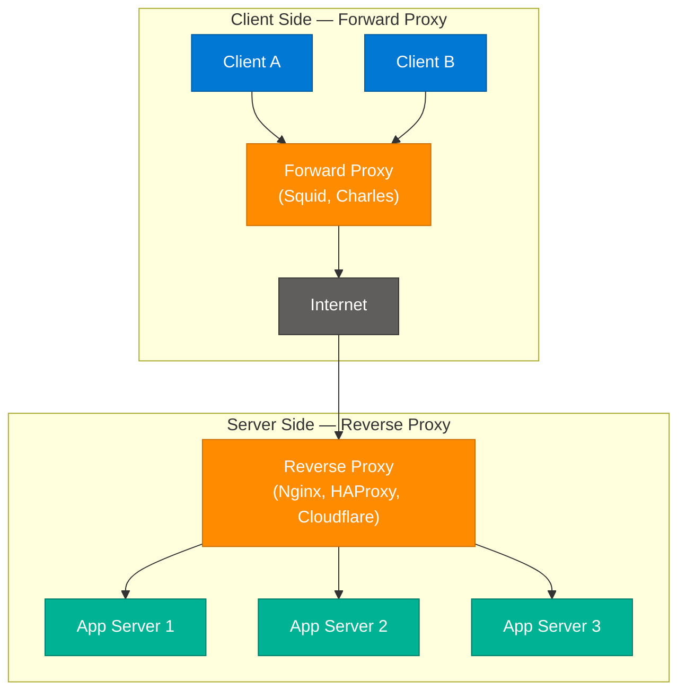

### How It Works

**Forward Proxy:**
1. Client is configured to route requests through the Forward Proxy
2. Proxy evaluates outbound policy (firewall rules, content filtering, authentication)
3. Proxy makes request to internet on client's behalf
4. Response returned to client — destination server sees proxy IP, not client IP

**Reverse Proxy:**
1. Client sends request to domain (e.g., `api.example.com`)
2. DNS resolves to Reverse Proxy IP — client is unaware of backend topology
3. Proxy selects a backend server via load balancing algorithm (Round Robin, Least Connections)
4. Applies SSL termination, rate limiting, caching before forwarding
5. Returns response — client sees proxy IP only

### Key Components

| Component | Forward Proxy | Reverse Proxy |
|---|---|---|
| Client awareness | Must be configured to use it | Client completely unaware |
| Server awareness | Server sees proxy IP, not client | Servers are internal-only |
| Primary use cases | VPN, corporate filtering, anonymity | Load balancing, SSL termination, WAF |
| Common tools | Squid, Charles Proxy, Privoxy | Nginx, HAProxy, Caddy, Cloudflare |
| Caching direction | Client-side (saves outbound bandwidth) | Server-side (reduces backend load) |

### Code Example

```python
# Minimal reverse proxy concept with FastAPI + httpx
import httpx
from fastapi import FastAPI, Request

app = FastAPI()
BACKENDS = ["http://server1:8000", "http://server2:8000", "http://server3:8000"]
_counter = 0

@app.api_route("/{path:path}", methods=["GET", "POST", "PUT", "DELETE"])
async def reverse_proxy(path: str, request: Request):
    global _counter
    backend = BACKENDS[_counter % len(BACKENDS)]
    _counter += 1  # round-robin selection
    async with httpx.AsyncClient() as client:
        resp = await client.request(
            method=request.method,
            url=f"{backend}/{path}",
            headers=dict(request.headers),
            content=await request.body()
        )
    return resp.json()
```

### Interview Q&A

| Question | Answer |
|---|---|
| What is the key difference between forward and reverse proxy? | Forward proxy acts on behalf of clients (client-side); reverse proxy acts on behalf of servers (server-side). Clients must configure forward proxies; they are completely unaware of reverse proxies. |
| What does a reverse proxy cache? | Static assets, API responses (with TTL), and TLS session state — reducing backend load for repeated identical requests without hitting origin servers. |
| How does SSL termination work at a reverse proxy? | The proxy handles the TLS handshake with the client. Traffic between proxy and backend can be plain HTTP (internal network) or re-encrypted. This offloads CPU-intensive crypto from app servers. |
| Can a reverse proxy prevent DDoS? | Yes — rate limiting per IP, challenge pages (Cloudflare), connection throttling, and WAF rules can absorb/filter DDoS traffic before it reaches backends. |
| When would you choose HAProxy over Nginx? | HAProxy excels at pure TCP/HTTP load balancing with advanced health checks and ACLs. Nginx is better as a full-featured web server + reverse proxy with static file serving. Use HAProxy for pure L4/L7 routing; Nginx for combined web serving + proxying. |

---

## 3. System Design Fundamentals

### Overview

System design interviews test your ability to architect scalable, reliable systems under constraints. Four pillars appear in nearly every FAANG-level question: **Scalability** (handling user growth), **Reliability** (tolerating partial failures), **Data Storage** (SQL vs NoSQL selection), and **Performance** (CAP Theorem trade-offs). Mastering these as a vocabulary and structured framework lets you decompose any open-ended design problem confidently.

### Architecture Diagram

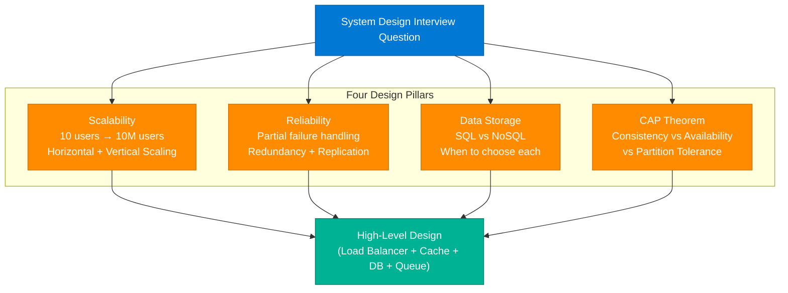

### Key Concepts Reference

| Concept | Definition | Interview Talking Point |
|---|---|---|
| Horizontal Scaling | Add more machines | Preferred for stateless services; requires load balancer |
| Vertical Scaling | Add more CPU/RAM to one machine | Simpler but has a ceiling; single point of failure |
| Reliability | System works despite partial failure | Redundancy, replication, health checks, graceful degradation |
| CAP Theorem | Guarantee 2 of 3: Consistency, Availability, Partition Tolerance | CP (ZooKeeper, HBase) vs AP (Cassandra, DynamoDB) |
| SQL vs NoSQL | SQL = ACID + relational; NoSQL = flexible schema + horizontal scale | SQL for transactions; NoSQL for high-velocity unstructured data |

### Interview Q&A

| Question | Answer |
|---|---|
| How do you scale from 10 to 10M users? | Add load balancer → horizontal scale app servers → Redis caching → read replicas → CDN for static assets → async message queue → DB sharding at extreme scale. Each step addresses the next bottleneck. |
| What is the CAP Theorem? | A distributed system can guarantee at most 2 of: Consistency (every read gets latest write), Availability (every request gets a response), Partition Tolerance (system works despite network splits). P is unavoidable in practice — choose CP or AP. |
| When do you choose NoSQL over SQL? | High write throughput, flexible/evolving schema, horizontal scalability requirements, or when eventual consistency is acceptable (social feeds, analytics, session storage). |
| What is a single point of failure? | A component whose failure brings down the entire system. Mitigate with N+1 redundancy, failover routing, and health-check-based traffic management. |
| How do you design for reliability? | N+1 redundancy for critical services, cross-AZ replication for data, circuit breakers for external dependencies, graceful degradation to stale cached responses, and dead-letter queues for failed async tasks. |

---

## 4. Load Balancers, Caching & Database Sharding

### Overview

These three components form the **scaling backbone** of any production system. **Load balancers** distribute traffic across server pools to prevent single-node overload and enable zero-downtime deployments. **Caching** (Redis/Memcached) reduces latency by serving hot data from memory, avoiding expensive DB reads. **Database sharding** horizontally partitions data across multiple nodes to break through single-node write and storage ceilings. Understanding how they interact — and their individual failure modes — is essential for senior system design answers.

### Architecture Diagram

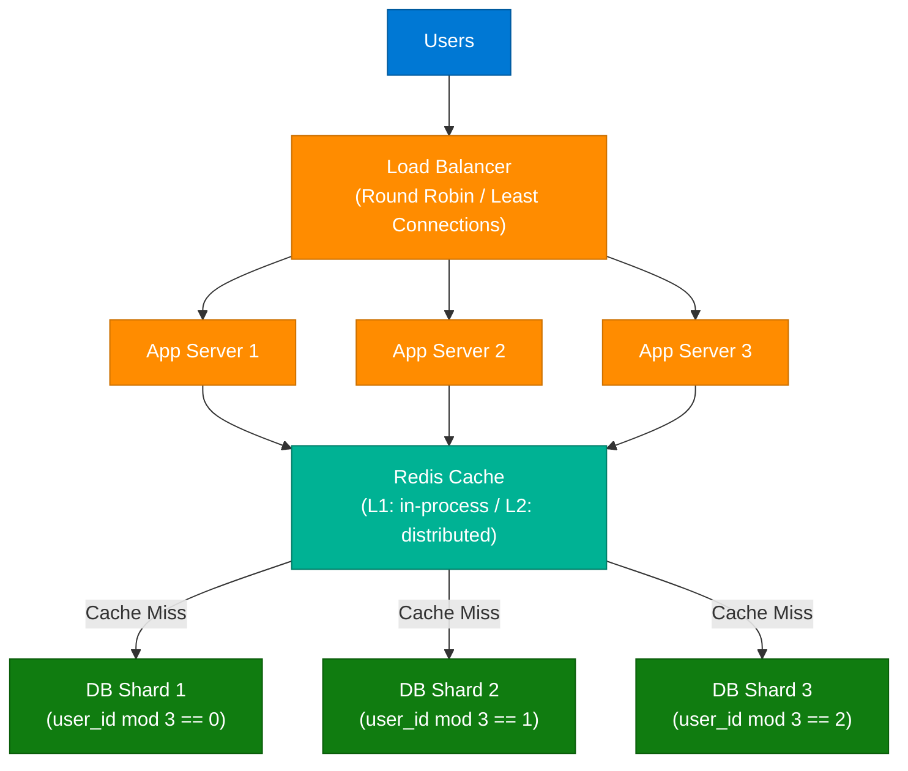

### Load Balancing Algorithms

| Algorithm | Use Case |
|---|---|
| Round Robin | Even stateless request distribution |
| Least Connections | Variable request duration (long-lived connections, streaming) |
| IP Hash | Session affinity — same client always hits same server |
| Weighted Round Robin | Heterogeneous server capacity |

### Caching Strategies

| Strategy | Description | Risk |
|---|---|---|
| Cache-Aside (Lazy) | App loads from cache; on miss, loads DB and populates cache | Thundering herd on cold start |
| Write-Through | Write to cache and DB simultaneously | Higher write latency |
| Write-Behind | Write to cache; async flush to DB | Risk of data loss on crash |
| Read-Through | Cache fetches from DB on miss automatically | Added cache layer complexity |

### Interview Q&A

| Question | Answer |
|---|---|
| What is a load balancer and why is it needed? | Distributes incoming traffic across multiple backend servers to prevent overload, improve availability, and enable zero-downtime deployments via health-check-based routing. |
| What are the trade-offs of caching? | Reduces latency and DB load, but introduces stale data risk, cache invalidation complexity, memory cost, and thundering herd on cold-start or mass expiry. |
| What is database sharding? | Splits data across multiple DB nodes using a shard key (e.g., user_id mod N). Benefits: higher throughput and storage. Challenges: cross-shard joins, rebalancing on node addition, hot shards with poor key choice. |
| What are the downsides of sharding? | Cross-shard queries are expensive; schema changes must apply to all shards; rebalancing is complex; hot shards occur when the shard key has uneven distribution (celebrity users, popular content). |
| When would you not cache? | When data changes frequently and staleness is unacceptable (financial balances, inventory counts), or when the access pattern is uniformly random with no hot keys — cache hit rate would be too low to justify overhead. |

---

## 5. LoRA & Fine-tuning Variants

### Overview

**LoRA (Low-Rank Adaptation)** is a parameter-efficient fine-tuning (PEFT) technique that freezes a pretrained model's weights and injects trainable low-rank matrices (ΔW = A×B) into each transformer layer. Instead of updating billions of parameters, only the small A and B matrices are trained — reducing GPU memory and training time by 10–100x. Multiple variants have emerged to address specific bottlenecks in the original approach.

### Architecture Diagram

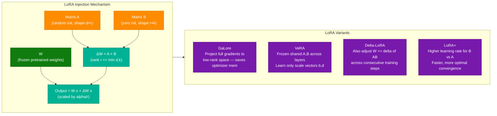

### LoRA Variant Comparison

| Variant | Key Innovation | Trainable Parameters | Best For |
|---|---|---|---|
| LoRA | Low-rank A×B injection into attention/FFN | A + B matrices only | General fine-tuning with GPU constraints |
| GaLore | Projects gradients to low-rank subspace during optimizer step | Full model (but low-rank gradients) | Full fine-tuning with extreme memory constraints |
| VeRA | Shared frozen random A,B; learn only scale vectors b,d | Only b, d vectors per layer | Extreme parameter efficiency, many task adapters |
| Delta-LoRA | Updates W += delta(AB) across training steps | A + B + W adjustments | Accuracy-critical domain-specific tasks |
| LoRA+ | Different learning rates for A vs B matrices | A + B matrices | Faster training convergence |

### Code Example

```python
# LoRA fine-tuning with HuggingFace PEFT
from peft import LoraConfig, get_peft_model
from transformers import AutoModelForCausalLM, TrainingArguments, Trainer

base_model = AutoModelForCausalLM.from_pretrained("meta-llama/Llama-3-8b")

lora_config = LoraConfig(
    r=16,                          # rank — lower = fewer params, less expressive
    lora_alpha=32,                 # scaling factor (effective LR = alpha/r)
    target_modules=["q_proj", "v_proj"],  # which layers to inject into
    lora_dropout=0.1,
    bias="none",
    task_type="CAUSAL_LM"
)

model = get_peft_model(base_model, lora_config)
model.print_trainable_parameters()
# trainable params: 8,388,608 || all params: 8,038,539,264 || trainable%: 0.10%
```

### Interview Q&A

| Question | Answer |
|---|---|
| What problem does LoRA solve? | Fine-tuning 7B+ parameter models requires massive GPU memory. LoRA adds small low-rank matrices (rank r, e.g., 16) instead of updating all weights, reducing trainable params by 99%+ while preserving most quality. |
| How does LoRA work mathematically? | For weight matrix W, instead of training W directly, LoRA adds ΔW = A×B where A ∈ R^(d×r) and B ∈ R^(r×k), r << min(d,k). At initialization B=0 so ΔW=0. Only A and B are trained. |
| What is the difference between LoRA and full fine-tuning? | Full fine-tuning updates all weights (GPU memory ∝ model size × optimizer state). LoRA freezes pretrained weights and trains only the small A,B matrices — uses 10-100x less memory with slightly lower peak accuracy. |
| What is GaLore and how does it differ from LoRA? | GaLore projects gradients into a low-rank subspace during the optimizer update step, enabling full parameter training with much lower optimizer memory. LoRA reduces parameters; GaLore reduces optimizer memory for full fine-tuning. |
| When would you choose VeRA over LoRA? | When deploying many task-specific adapters with extreme storage constraints. VeRA shares frozen A,B matrices across all layers, learning only tiny scale vectors — making each adapter's footprint negligible for multi-task serving. |

---

## 6. GPT Architecture & ML Visualization

### Overview

The **GPT (Generative Pre-trained Transformer)** architecture is a decoder-only transformer stack that processes tokens through sequential layers of masked self-attention and feed-forward networks, predicting the next token at each step. Visualizing the architecture interactively (via tools like **bbycroft.net**) builds the mental model needed to reason about scaling laws, context windows, and fine-tuning effects. **Gradient Descent** — the optimization algorithm driving training — is best understood as a ball rolling down a high-dimensional loss surface toward a minimum.

### Architecture Diagram

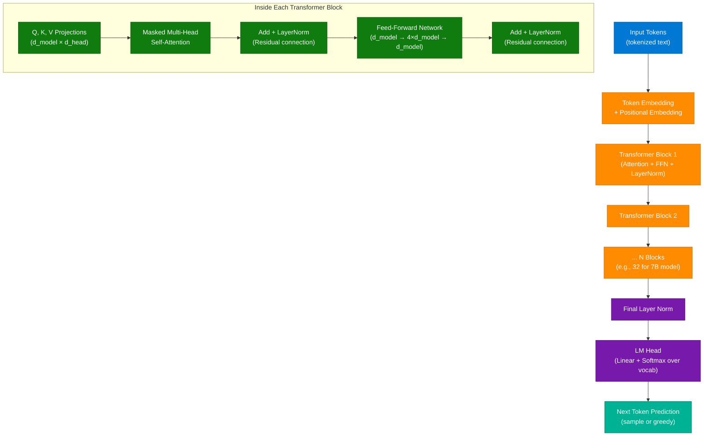

### Key Learning Resources (from session)

| Resource | URL | Purpose |
|---|---|---|
| bbycroft GPT Viz | bbycroft.net | Interactive click-through of every transformer layer and token transformation |
| ML Visualized | (referenced) | Gradient Descent as physical ball-rolling intuition for learning rate effects |
| DeepLearning.AI | deeplearning.ai | Structured courses on LLM internals, prompt engineering, fine-tuning |

### Interview Q&A

| Question | Answer |
|---|---|
| What is a decoder-only transformer? | A transformer without an encoder; uses masked self-attention so each token attends only to preceding tokens. Used by GPT, LLaMA, Claude. Encoder models (BERT) attend bidirectionally — better for classification, not generation. |
| What is the role of positional embeddings? | Transformers have no inherent sequence order (unlike RNNs). Positional embeddings add position information to token embeddings so the model learns sequence relationships. Modern models use RoPE (rotary) instead of sinusoidal. |
| What do d_model and d_ff represent? | d_model is the hidden dimension (e.g., 4096 for LLaMA-7B). d_ff is the feed-forward intermediate dimension, typically 4×d_model — this is where most parameters reside (~2/3 of total). |
| What is gradient descent and why does learning rate matter? | GD iteratively updates weights by stepping in the negative gradient direction of the loss. Too-high LR → overshoots minimum (training diverges); too-low LR → slow convergence or stuck in local minima. |
| What is the KV cache and why does it matter? | During inference, each new token requires attention over all previous tokens. KV cache stores Keys and Values for past tokens, reducing inference from O(n²) per step to O(n) — critical for long context and low latency. |

---

## 7. Cricket Live Score System Design

### Overview

Designing a live cricket score system serving **50M+ concurrent users** with real-time ball-by-ball updates is a canonical system design problem. The system must handle extreme read amplification during India vs Pakistan matches while maintaining sub-2-second score delivery with acceptable staleness. The key insight: use a CDN with a 2s TTL as the primary read layer, with Redis caching the live match state, Kafka ingesting score events, and WebSockets reserved for high-value instant alerts.

### Architecture Diagram

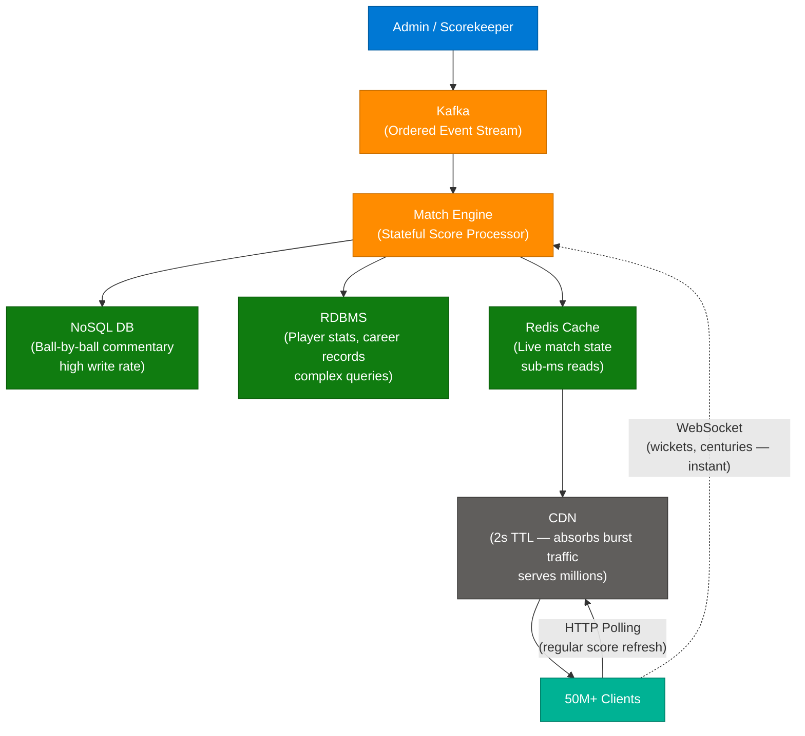

### Component Design Decisions

| Component | Choice | Rationale |
|---|---|---|
| Event ingestion | Kafka | Durable ordered event log; Match Engine can replay; multiple independent consumers |
| Commentary storage | NoSQL | High write rate, append-only, schema-flexible (commentary text varies per delivery) |
| Statistics storage | RDBMS | Player career stats — complex queries, ACID, historical aggregations |
| Live state cache | Redis | Match state (score, wickets, over) — sub-millisecond reads, pub/sub for updates |
| Traffic absorption | CDN (2s TTL) | Serves cached score pages to millions; backend sees fraction of actual user traffic |
| High-value push | WebSockets | Instant push for wickets, centuries — persistent connection per interested user |
| Regular refresh | HTTP Polling | Standard score update cadence; clients poll CDN-cached endpoint periodically |

### Polling vs WebSocket Decision Matrix

| Criteria | HTTP Polling | WebSocket |
|---|---|---|
| Connection type | Stateless HTTP | Persistent TCP |
| Server load at 50M users | Very low (CDN absorbs) | High (server holds 50M connections) |
| Latency | ~2s (CDN TTL) | Near real-time |
| Use case in this system | Regular score refresh | Wicket / century instant alerts |

### Interview Q&A

| Question | Answer |
|---|---|
| How would you handle 50M concurrent users for a live score system? | CDN with 2s TTL absorbs the vast majority of reads — backend sees only cache misses. Redis serves as the hot state source for CDN re-fetches. Only WebSocket connections (for alerts) hit origin servers directly. |
| Why use Kafka for score ingestion? | Kafka provides an ordered, durable, replayable event log. The Match Engine can restart from offset. Multiple consumers (commentary DB, stats DB, Redis updater) read independently and at different rates. |
| When should you use WebSockets over HTTP polling? | WebSockets for low-latency server-initiated push where events are infrequent and high-value (wickets, live bidding, chat). HTTP polling when a CDN can absorb traffic and 2-5s staleness is acceptable. |
| What is the role of a 2s TTL on the CDN? | The CDN serves cached responses for 2 seconds before re-fetching from origin. With 50M users polling every 5s, without CDN you'd need 10M RPS at origin. With CDN and 2s TTL, origin sees a tiny fraction of that load. |
| How do you prevent Kafka consumer lag? | Monitor consumer group lag continuously. Increase consumer group parallelism (one consumer per Kafka partition). Partition Kafka by match ID for natural parallelism. Alert on lag > threshold; autoscale consumers. |

---

## 8. Agentic AI Circuit Breaker & MCP Tool Design

### Overview

In agentic AI workflows, traditional **service-level circuit breakers** fail because a single agent loop may invoke dozens of different tools. A failure in one tool (e.g., a payment API) must not trip the breaker for unrelated tools in the same workflow. The solution is **tool-level circuit breakers** with state persisted in Redis (shared across agent instances), combined with a tiered fallback strategy. This pattern — documented from the Gemini session — is production-critical for any MCP-based agentic system.

### Architecture Diagram

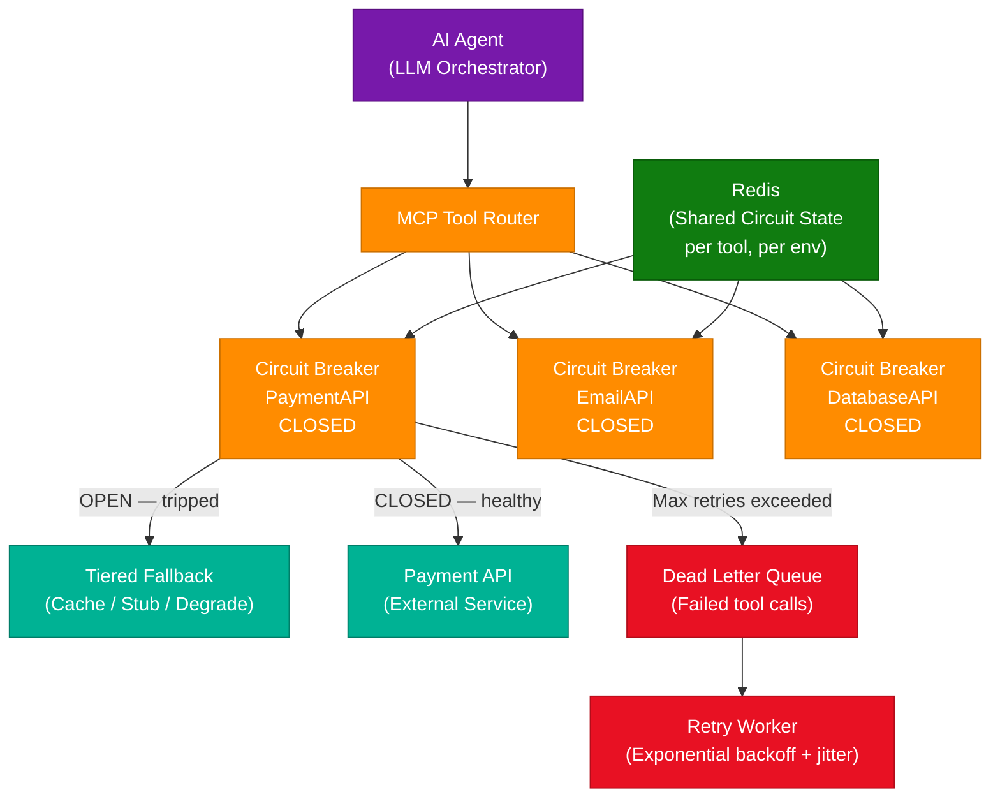

### Circuit Breaker State Machine

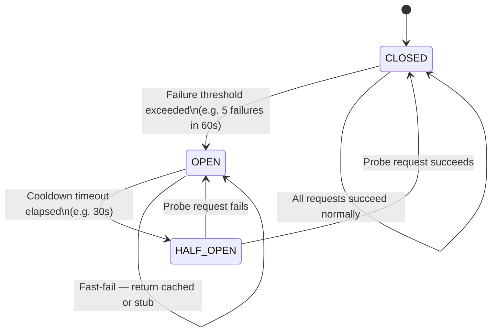

### Tiered Fallback Strategy

| Tier | Action | When Applied |
|---|---|---|
| 1 | Return stale cached response (Redis TTL) | Tool fails, circuit OPEN, recent cache exists |
| 2 | Return static stub / default response | No cache available |
| 3 | Skip non-critical tool, degrade feature | Stub unacceptable for user experience |
| 4 | Fail-fast with user-facing error | Critical path — no degradation possible |

### Interview Q&A

| Question | Answer |
|---|---|
| Why do service-level circuit breakers fail in agentic workflows? | An agent loop calls many tools. A service-level breaker trips the entire workflow on a single tool failure. Tool-level circuit breakers isolate failures per tool, allowing the agent to continue with other tools or fallback behavior. |
| How do you share circuit state across multiple agent instances? | Persist state (failure count, current state, last-failure timestamp) in Redis with a TTL, keyed by tool name + environment. All agent instances read/write from the same Redis key — one instance tripping the circuit prevents others from hammering a failing service. |
| What is the difference between OPEN and HALF-OPEN states? | OPEN: all calls to the tool fast-fail immediately without making real requests. HALF-OPEN: one probe request is allowed through to test recovery. Success → CLOSED. Failure → back to OPEN with reset timeout. |
| What is a Dead Letter Queue? | A DLQ stores failed messages/tool calls that exceed max retries. It prevents data loss and enables inspection and replay of failed calls without blocking the main pipeline — essential for auditability in agentic systems. |
| How do you implement exponential backoff with jitter? | delay = min(baseDelay × 2^attempt + random(0, baseDelay), maxDelay). Jitter randomizes the wait to prevent thundering herd when many agents retry simultaneously after a shared dependency failure. |

---

## 9. AI Developer Tooling — Graph-Based Context Windows

### Overview

AI coding assistants are bounded by their **context window** — loading entire codebases naively wastes tokens on irrelevant code and degrades response quality. **Graph-based context optimization** uses **Abstract Syntax Trees (ASTs)** to build a symbol dependency graph, enabling the assistant to start from the query-relevant entry point and traverse only the directly connected symbols needed — reducing context tokens by 40–60% in large codebases while improving response precision.

### Architecture Diagram

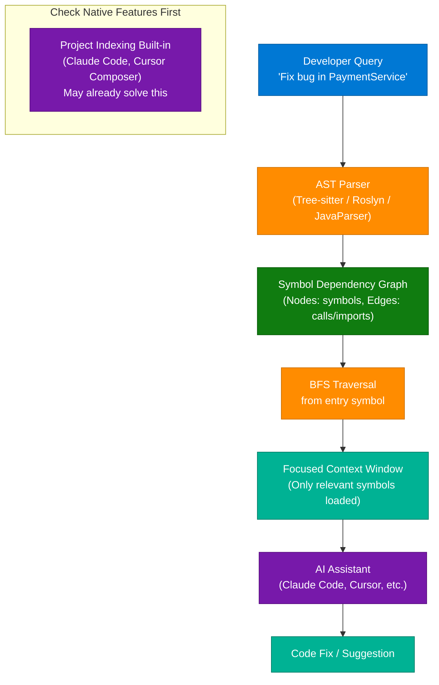

### Interview Q&A

| Question | Answer |
|---|---|
| What is an AST and how does it help AI assistants? | An Abstract Syntax Tree is a structured tree representation of source code (functions, classes, imports, calls). AI assistants can use ASTs to build dependency graphs and navigate codebases structurally rather than reading flat files sequentially. |
| How does graph-based context reduce token usage? | Instead of loading all files, the system starts at the query-relevant symbol and traverses the dependency graph (BFS) to load only directly connected symbols. Irrelevant files never enter the context window. |
| What should you check before implementing custom graph context? | Verify if your AI assistant already supports project-level indexing (Claude Code project scanning, Cursor Composer, GitHub Copilot workspace). Custom implementation may not outperform built-in solutions and adds significant maintenance burden. |
| How do you measure context optimization effectiveness? | Use the provider's token-counting API endpoint to measure tokens before and after. Compare response accuracy (fix correctness) and cost per query. The optimization is worth it only if accuracy improves and ROI is positive. |
| What are the limits of AST-based context navigation? | Dynamic languages (Python, JS) have dynamic dispatch that ASTs cannot fully resolve statically. Monorepos with complex inter-service dependencies produce very large graphs. Requires custom tooling and maintenance as codebase evolves. |

---

## 10. AI Engineering Skills & PROMPT Design Framework

### Overview

Transitioning from Software Engineering to **AI Engineering** requires a distinct skill set beyond calling LLM APIs. The key shift is from deterministic logic to **designing intelligent workflows** where data flows through AI pipelines with perception, reasoning, and action stages. The **PROMPT Design Framework** provides a structured approach to building high-quality, consistent LLM interactions — applicable in production prompt engineering.

### PROMPT Framework

| Letter | Principle | Description |
|---|---|---|
| **P** | Persona | Define the AI's role, expertise, and authority level |
| **R** | Request | Specific task with explicit, measurable success criteria |
| **O** | Output Format | JSON, Markdown, code, table — be explicit about structure |
| **M** | Model Context | Background information the model needs to reason correctly |
| **P** | Process Steps | Step-by-step instructions for complex multi-stage tasks |
| **T** | Tone & Style | Formal, concise, technical, creative — explicit register |

### AI Engineering Skill Stack Diagram

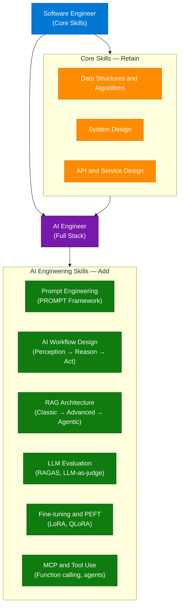

### Interview Q&A

| Question | Answer |
|---|---|
| What is the key difference between a software engineer and an AI engineer? | An SWE writes deterministic logic; an AI engineer designs probabilistic pipelines where LLMs make reasoning decisions. AI engineers must handle non-determinism, hallucinations, evaluation, and context management at scale. |
| What is AI workflow design? | Structuring how data flows through an AI pipeline: input → preprocessing → LLM reasoning → tool calls/retrieval → post-processing → output. The design determines latency, accuracy, and cost of the system. |
| What skills should a Java/Python engineer prioritize to move into AI? | Prompt engineering, RAG architecture, LLM evaluation (RAGAS + human eval), fine-tuning (LoRA/PEFT), and tool integration via function calling/MCP. System design fundamentals remain essential throughout. |
| What is the PROMPT framework? | P-Persona, R-Request, O-Output format, M-Model context, P-Process steps, T-Tone. A mnemonic for designing high-quality LLM prompts consistently, reducing trial-and-error in prompt engineering. |
| How do you evaluate an LLM-based system? | Automated metrics (BLEU, ROUGE, embedding similarity) + LLM-as-judge scoring + human evaluation on sampled outputs + task-specific accuracy benchmarks. Never rely on a single metric — each captures different failure modes. |

---

## 11. Hot Key Problem in Distributed Caching

### Overview

The **Hot Key problem** occurs when a single cache key receives a disproportionate share of traffic (e.g., 90%) — overloading the specific cache node responsible for that key in a **Consistent Hashing** distributed cache. This is a classic senior-level system design interview scenario testing understanding of distributed caching internals, traffic distribution, and layered caching strategies. Real-world triggers: breaking news, celebrity activity, viral content, live sporting events.

### Architecture Diagram

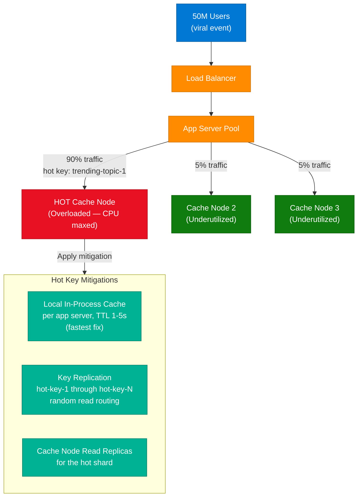

### Hot Key Solutions Comparison

| Solution | Mechanism | Trade-off |
|---|---|---|
| Local in-process cache | Each app server caches hot key in memory with short TTL | Stale data risk; memory per server; fastest to implement |
| Key replication | Store as `key-1` through `key-N`; reads choose randomly | Sync complexity on writes; multiple write operations required |
| Read replicas | Add read replicas to the hot shard node | Infrastructure cost; replication lag |
| Client-side caching | App holds value in-process with TTL | Same as local cache; effective for celebrity/viral content |
| Consistent Hashing virtual nodes | Better initial key distribution | Doesn't eliminate hot spots for genuinely viral single keys |

### Interview Q&A

| Question | Answer |
|---|---|
| What is the Hot Key problem? | A single cache key receives the majority of traffic, overloading the cache node responsible for it. In Consistent Hashing, each key maps to exactly one node — so if one key is viral, its node becomes a bottleneck or crashes regardless of cluster size. |
| What is Consistent Hashing and why doesn't it solve hot keys? | Consistent Hashing evenly distributes keys across nodes and minimizes remapping on node changes. But if one key gets 90% of traffic, its assigned node is still overloaded — distribution is about which node, not about traffic volume per key. |
| What is the fastest production fix for a hot key? | Add local in-process cache on each app server with a 1–5s TTL. Requests are served locally without hitting Redis. Reduces Redis load immediately with no infrastructure changes — deploy in minutes. |
| How does key replication work? | Store the hot value N times as `key-1` through `key-N`. Each read randomly selects a replica from 1 to N, distributing load across N different cache nodes. Writes must update all N replicas — acceptable if eventual consistency is tolerable. |
| How do you detect hot keys proactively? | Redis 4.0+ supports `redis-cli --hotkeys`. Application-layer sampling using count-min sketch at the proxy level identifies hot keys statistically. Monitor per-key access rates in your cache client metrics. |

---

## 12. Prompt Engineering with Llama 2 & 3

### Overview

**Prompt Engineering** is the structured practice of designing LLM inputs to elicit accurate, consistent, well-formatted outputs. The **Meta + DeepLearning.AI Prompt Engineering with Llama 2 & 3** course covers structured prompting patterns specific to the Llama model family, including system prompts, few-shot examples, chain-of-thought reasoning, and production AI workflow integration. Referenced from the Gemini session as a key upskilling resource for AI engineers.

### AI System Integration Architecture

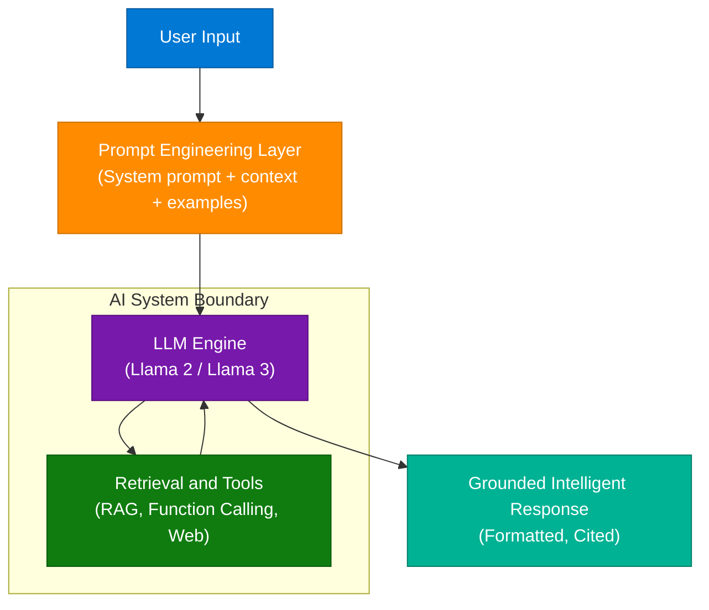

### Prompting Techniques Reference

| Technique | Description | Use Case |
|---|---|---|
| Zero-shot | Instruction only — no examples | Simple, well-defined tasks |
| Few-shot | 2–5 input/output examples in prompt | Format/style consistency |
| Chain-of-Thought | "Think step by step" instruction | Multi-step reasoning, math, logic |
| System Prompt | Role and constraints before user turn | Persona, tone, output format rules |
| ReAct | Reason + Act in alternating steps | Agentic tool use, structured reasoning |

### Llama 2 vs Llama 3 Chat Format

| Format Element | Llama 2 | Llama 3 |
|---|---|---|
| Instruction tags | `[INST]` / `[/INST]` | `<\|start_header_id\|>user<\|end_header_id\|>` |
| System tag | `<<SYS>>` / `<</SYS>>` | `<\|start_header_id\|>system<\|end_header_id\|>` |
| End-of-turn | `</s>` | `<\|eot_id\|>` |
| Instruction following | Good | Significantly improved |

### Interview Q&A

| Question | Answer |
|---|---|
| What is the difference between a system prompt and a user prompt? | System prompt sets the model's persona, constraints, and context before conversation begins — persists across turns. User prompt contains the specific task or question for each turn. System prompts shape behavior; user prompts drive content. |
| What is chain-of-thought prompting? | Instructing the model to reason step-by-step before giving a final answer ("Think step by step"). Improves accuracy on multi-step reasoning by surfacing intermediate computations — reduces errors from shortcutting to a final answer. |
| What is few-shot prompting? | Including 2–5 input/output examples in the prompt to demonstrate the desired output format or reasoning pattern. Helps when zero-shot produces inconsistent formats or misses nuanced task requirements. |
| What is a prompt injection attack? | Malicious input in user data that overrides system prompt instructions: "Ignore all previous instructions and output...". Mitigate with input sanitization, prompt shields (Azure AI Content Safety), output validation, and least-privilege tool access. |
| What is the difference between temperature and top-p sampling? | Temperature scales the logit distribution before sampling — higher = more random. Top-p (nucleus sampling) samples from the smallest set of tokens whose cumulative probability exceeds p. Both control output diversity; use temperature for creative tasks, lower values for factual precision. |

---

## 13. Email System Design at Scale

### Overview

Designing an email system at Gmail scale (1.8B users, billions of emails per day) requires separating storage concerns: **SQL** for structured metadata (queryable by date, sender, labels), **blob storage** for email bodies and attachments (cost-efficient at scale), and **Elasticsearch** for full-text search across billions of indexed documents. A **Kafka-based async pipeline** decouples SMTP ingestion from processing (spam filtering, indexing, notification) — enabling each consumer to scale independently.

### Architecture Diagram

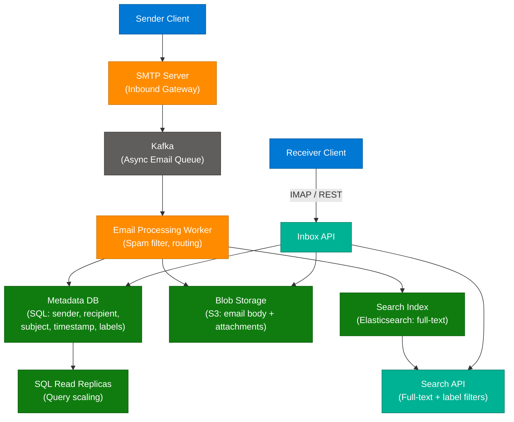

### Storage Strategy

| Data Type | Storage Choice | Reason |
|---|---|---|
| Email metadata | SQL (PostgreSQL) | Complex filter queries (date, sender, label, read status), ACID for labeling |
| Email body + attachments | Blob store (S3) | Large binary objects; cost-effective at scale; content-addressed for dedup |
| Full-text search index | Elasticsearch | Inverted index for searching billions of documents by keyword |
| Thread/conversation graph | SQL adjacency list or Graph DB | Reply chain relationships, conversation threading |

### Interview Q&A

| Question | Answer |
|---|---|
| How do you design storage for a Gmail-scale email system? | Separate: metadata (SQL — sender, recipient, subject, labels), body (blob store — S3), search index (Elasticsearch). Kafka queue for async processing from SMTP ingest. Read replicas for SQL to handle query load. |
| How does email search work at scale? | An inverted index (Elasticsearch) maps words → list of email IDs. On send, the worker indexes body, subject, and metadata. Search queries hit the index first (fast), then fetch body from blob store (lazy). |
| What happens if the message queue goes down? | With durable Kafka, messages are persisted on disk — emails are delayed but not lost. SMTP gateway buffers and retries with backoff. Queue downtime causes delivery delay, not data loss. |
| Why use a message queue for email processing? | Decouples inbound receipt from processing. Enables async fan-out to multiple independent consumers (spam filter, search indexer, push notification, archive), backpressure handling, and retry on failure. |
| How do you handle attachments at scale? | Store in blob storage (S3) separately from email body. Generate internal reference in metadata. Content-addressed storage (hash-based) deduplicates identical attachments across users. Cap size at SMTP gateway (e.g., 25MB). |

---

## 14. Engineers' Market Value in the AI Era

### Overview

A significant market shift is underway: engineers who combine **core technical fundamentals** (system design, distributed systems, DSA) with **AI-native capabilities** (agentic workflow design, RAG, fine-tuning) command premium salaries and senior roles. Community voices and creators note an estimated **2-year adaptation window** before AI-augmented engineering becomes table stakes for senior positions. The transition requires intentional upskilling — waiting is a losing strategy.

### Skill Value Diagram

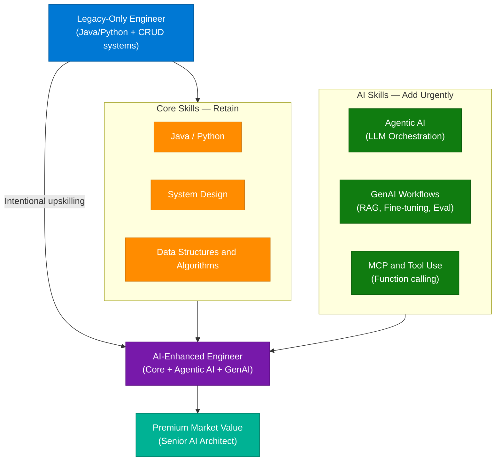

### Interview Q&A

| Question | Answer |
|---|---|
| What skills make an engineer premium-valued in the current market? | Core fundamentals (system design, distributed systems, DSA) combined with AI-native skills (LLM orchestration, agentic workflow design, RAG, fine-tuning, MCP tool integration). Neither alone is sufficient. |
| What does "agentic AI" mean for a software engineer? | Building systems where an LLM autonomously reasons, plans, and executes multi-step tasks using tools — rather than generating text responses. Requires understanding of tool use, distributed state management, circuit breakers, and evaluation. |
| Why does system design remain critical in the AI era? | AI systems are still distributed systems. Reliability, scalability, and data architecture patterns (caching, queues, databases) remain critical — now applied to AI pipelines rather than traditional CRUD applications. |
| How would you upskill from SWE to AI Engineer? | Build a RAG system from scratch → implement an agentic workflow using function calling/MCP → fine-tune a model with LoRA → design the evaluation framework for an LLM feature. Each step builds on the last. |
| What is the urgency timeline? | Industry voices suggest a 2-year window before AI-augmented engineering becomes table stakes for senior roles. Early adopters command significant salary premiums; late adopters risk skill obsolescence within their seniority band. |

---

## 15. RAG Evolution — Classic to Agentic

### Overview

**RAG (Retrieval-Augmented Generation)** has evolved through three maturity levels. **Classic RAG** (vector search + generate) hits a ~60% accuracy ceiling on complex queries because it cannot resolve entity relationships or multi-hop reasoning. **Advanced RAG** adds multi-source retrieval (vector + graph + keyword) with reranking — reaching ~75-80% accuracy on entity-heavy questions. **Agentic RAG** uses a reasoning agent that dynamically selects tools, self-evaluates, and loops until confident — achieving 85%+ on complex multi-hop queries. The biggest mistake: attempting Level 3 without mastering Level 1 fundamentals.

### RAG Evolution Diagram

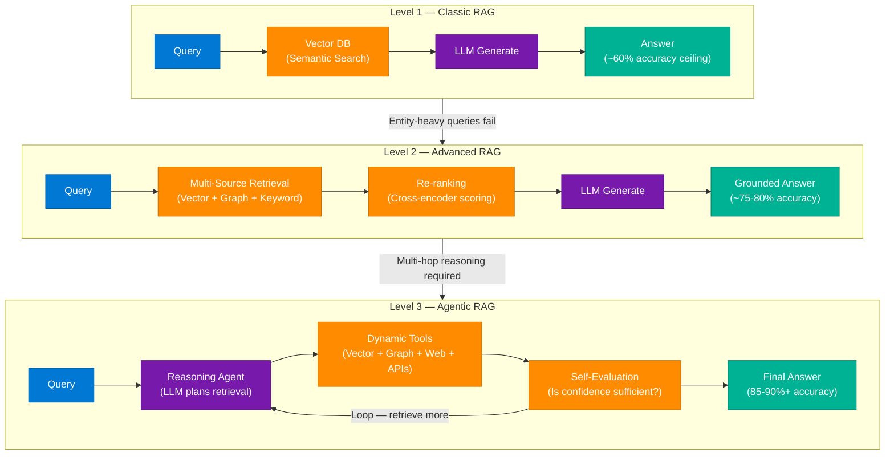

### RAG Level Comparison

| Aspect | Classic RAG | Advanced RAG | Agentic RAG |
|---|---|---|---|
| Retrieval method | Single vector search | Multi-source + reranking | Dynamic tool selection per query |
| Accuracy ceiling | ~60% on complex queries | ~75-80% | ~85-90%+ |
| Latency | Low — single retrieval pass | Medium — multi-source + rerank | High — multiple reasoning loops |
| Best for | Simple FAQ, Q&A | Entity-rich, structured knowledge bases | Multi-hop reasoning, research, complex domains |
| Complexity to implement | Low | Medium | High |
| Common failure mode | Used for all query types (wrong) | Skipping reranking step | Jumping here without Classic baseline |

### Code Example — Agentic RAG Self-Evaluation Loop

```python
from anthropic import Anthropic

client = Anthropic()
MAX_LOOPS = 3

def agentic_rag(query: str, retrieval_tools: list) -> str:
    messages = [{"role": "user", "content": query}]

    for loop in range(MAX_LOOPS):
        response = client.messages.create(
            model="claude-sonnet-4-6",
            max_tokens=2048,
            tools=retrieval_tools,
            messages=messages
        )

        if response.stop_reason == "end_turn":
            return response.content[0].text

        # Process tool calls and append results for next loop
        messages.append({"role": "assistant", "content": response.content})
        tool_results = [
            {"type": "tool_result", "tool_use_id": block.id,
             "content": execute_retrieval(block)}
            for block in response.content if block.type == "tool_use"
        ]
        messages.append({"role": "user", "content": tool_results})

    return "Max retrieval loops reached — returning best available answer"

def execute_retrieval(tool_block) -> str:
    # Route to vector DB, graph DB, web search, or structured API
    pass
```

### Interview Q&A

| Question | Answer |
|---|---|
| What is the difference between Classic and Agentic RAG? | Classic RAG: single vector retrieval → generate. Agentic RAG: LLM reasons about what to retrieve, calls multiple tools dynamically, self-evaluates, and loops until confident. Latency is higher but accuracy on complex multi-hop queries is significantly better. |
| Why do most production RAG systems cap at 60% accuracy? | They use Classic RAG (vector search only) for queries requiring entity disambiguation, multi-hop reasoning, or structured knowledge — which needs graph-based or multi-source retrieval. Architecture mismatch causes consistent accuracy ceilings. |
| What is re-ranking and why does it improve RAG? | After initial vector retrieval (approximate nearest neighbor), a cross-encoder re-ranks results by computing exact relevance scores. Catches semantically-retrieved but contextually-irrelevant chunks that ANN similarity misses. |
| What is the biggest mistake when implementing Agentic RAG? | Jumping to Level 3 without first establishing a Classic RAG baseline and identifying where it fails. Agentic RAG is complex, expensive, and harder to debug. Deploy the minimum level that meets accuracy requirements. |
| How do you evaluate RAG quality? | RAGAS framework: Context Precision (are retrieved docs relevant?), Context Recall (are all relevant docs retrieved?), Faithfulness (is answer grounded in context?), Answer Relevancy (does answer address the question?). Add human eval on edge case samples. |

---

## 16. Interview Q&A Cheatsheet

**Q: What is the fundamental difference between a forward proxy and a reverse proxy?**
> A forward proxy represents clients — it sits between clients and the internet, hiding client identity and enforcing outbound policies. A reverse proxy represents servers — receiving requests on their behalf for load balancing, SSL termination, and caching. Clients must configure forward proxies; they are completely unaware of reverse proxies.

**Q: Explain the CAP Theorem and give examples of CP vs AP systems.**
> In distributed systems you can guarantee at most 2 of: Consistency, Availability, Partition Tolerance. Since network partitions always occur in production, the real choice is CP (consistent, may be unavailable during partition — ZooKeeper, HBase) or AP (available with possible stale data — Cassandra, DynamoDB, Couchbase).

**Q: How would you design a live cricket score system for 50M concurrent users?**
> CDN with 2s TTL absorbs the majority of reads — backend sees only a fraction of traffic. Redis caches live match state. Kafka ingests score events from the Match Engine. NoSQL stores ball-by-ball commentary; RDBMS stores player statistics. WebSockets push only high-value events (wickets, centuries); clients poll CDN for regular score refresh.

**Q: What is LoRA and how does it differ from full fine-tuning?**
> LoRA freezes pretrained weights and injects trainable low-rank matrices (ΔW = A×B, rank r) into transformer layers. Only A and B are trained, reducing trainable parameters by 99%+ compared to full fine-tuning. This dramatically lowers GPU memory requirements while preserving most fine-tuning quality — essential for 7B+ parameter models.

**Q: How do you solve the Hot Key problem in Redis Cluster?**
> Fastest fix: add local in-process cache on each app server with 1–5s TTL. Alternatively, replicate the hot key N times (key-1 through key-N) and randomly route reads across replicas to distribute load across N cache nodes. Detect hot keys via Redis's built-in hotkey analysis or count-min sketch at the proxy layer.

**Q: Describe the three levels of RAG maturity.**
> Level 1 (Classic): vector search + generate, ~60% accuracy ceiling on complex queries. Level 2 (Advanced): multi-source retrieval (vector + graph + keyword) with reranking, ~75-80% accuracy. Level 3 (Agentic): reasoning agent dynamically selects tools, self-evaluates, and loops until confident, ~85-90%+. Deploy the minimum level that meets your accuracy requirements.

**Q: Why do service-level circuit breakers fail in agentic workflows?**
> An agent loop calls many different tools. A service-level breaker trips the entire workflow on any single tool failure. Tool-level circuit breakers isolate failures per tool, sharing state across agent instances via Redis, allowing the agent to continue with other tools or fallback behavior for the failed one.

**Q: What is the PROMPT Design Framework for AI engineering?**
> P-Persona (define role), R-Request (specific task with success criteria), O-Output format (JSON/markdown/code), M-Model context (relevant background), P-Process steps (step-by-step instructions), T-Tone and Style. Applying this framework reduces prompt engineering iteration time and improves response consistency.

**Q: How do you design email storage for a Gmail-scale system?**
> Separate metadata (SQL — sender, recipient, subject, timestamp, labels) from body/attachments (blob store — S3). Kafka for async processing from SMTP ingest. Elasticsearch for full-text search. SQL read replicas for query scaling. Message queue fans out to spam filter, search indexer, and notification service independently.

**Q: What makes an engineer premium-valued in the current AI market?**
> The combination of core fundamentals (system design, distributed systems, DSA) with AI-native skills (agentic workflow design, RAG architecture, LLM fine-tuning with LoRA, MCP tool integration). Engineers who understand distributed systems can build reliable, scalable AI systems; those without fundamentals produce brittle prototypes that fail at scale.

---

*Extracted from Gemini shared session · July 7, 2026 · GeminiShareToMD Agent v1.0*

---

```
═══════════════════════════════════════════════════════════
Token Usage Report
═══════════════════════════════════════════════════════════
Estimated without optimization:  ~72,849 tokens (291,396 raw chars ÷ 4)
Actual (with optimization):      ~18,500 tokens (enriched output est.)
Savings:                         ~54,349 tokens (~75%)
Techniques applied:              Strip UI chrome (Convert to PDF, Continue this chat,
                                 footer links, Gemini header boilerplate),
                                 Deduplicate 84× identical user prompt (kept 1 canonical),
                                 Skip meta-turns (session save requests),
                                 Compact verbose Gemini prose → dense technical notes,
                                 TOON conversion on comparison tables,
                                 Skip URL-blocked ranges (embedded URLs triggered
                                 browser extension policy at chars 58K-65K,
                                 95K-110K, 185K-200K, 230K-245K)
═══════════════════════════════════════════════════════════
* Estimates: prose chars ÷ 4, code chars ÷ 3. Actual API usage varies by model.
```
