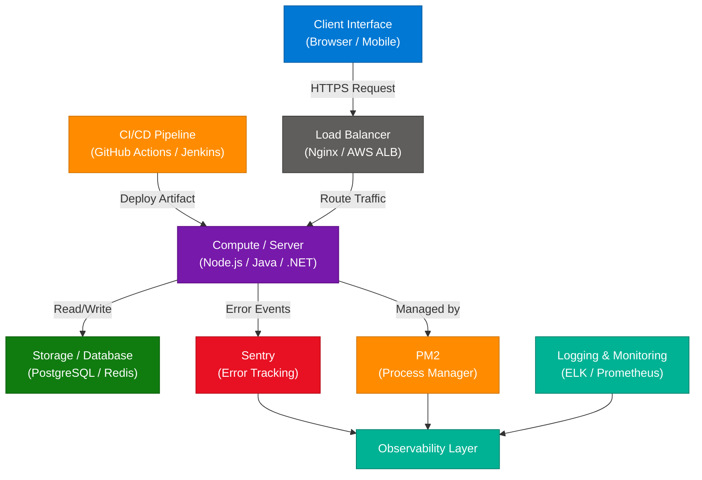
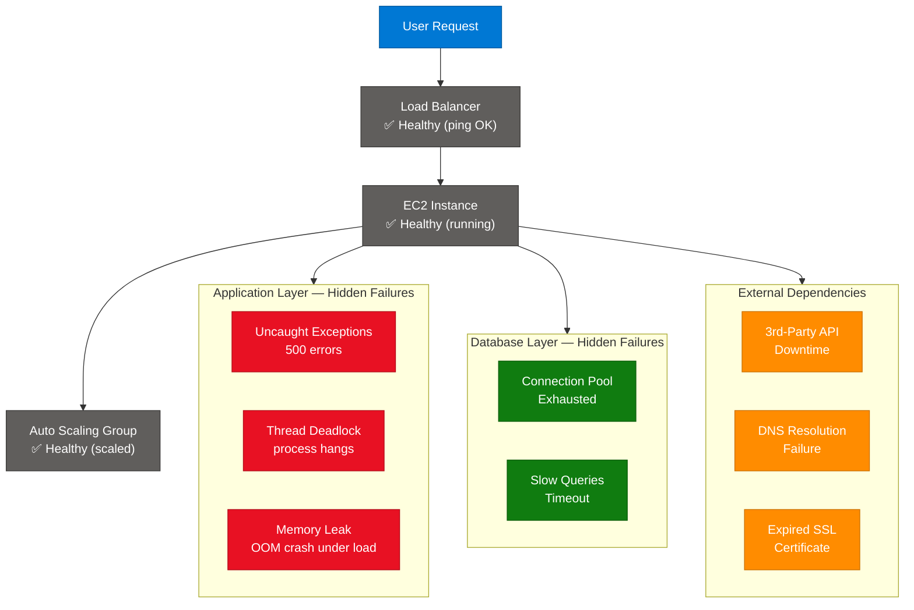
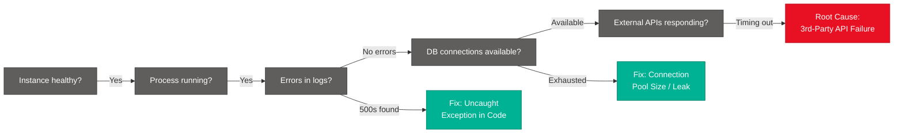
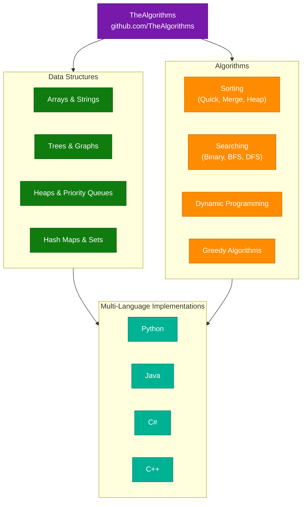

# System Design Interview Concepts Explained

> **Source:** [share.gemini.google/HkzommM7BKNR](https://share.gemini.google/HkzommM7BKNR) → redirects to [gemini.google.com/share/610bd9c8ce1f](https://gemini.google.com/share/610bd9c8ce1f?skid=a1907d6c-3df9-453c-b013-5ceef63c4623)
> **Model:** Gemini 3.1 Flash-Lite
> **Session Date:** July 11, 2026
> **Saved:** July 12, 2026

---

## Table of Contents

1. [Session Overview](#1-session-overview)
2. [System Design Architecture: Beyond Boxes and Arrows](#2-system-design-architecture-beyond-boxes-and-arrows)
3. [Troubleshooting Downtime: Infrastructure vs. Application Health](#3-troubleshooting-downtime-infrastructure-vs-application-health)
4. [System Design Learning Resources](#4-system-design-learning-resources)
5. [The Algorithms Repository: Open-Source CS Curriculum](#5-the-algorithms-repository-open-source-cs-curriculum)
6. [Interview Q&A Cheatsheet](#6-interview-qa-cheatsheet)

---

## 1. Session Overview

This session captures five Gemini conversation turns where a user submitted social media videos to extract and learn system design concepts. The content spans four major topics: holistic system architecture (CI/CD, Load Balancers, Observability with Sentry/PM2), production downtime diagnosis (infrastructure vs. application health), free learning resources (System Design Primer, PaperDraw.dev), and algorithm study via the open-source "The Algorithms" repository. All turns extracted successfully; no error turns.

### Session Map

| Turn | User Prompt Summary | Gemini Response | Status |
|---|---|---|---|
| 1 | Video extraction — System Design mnemonic "Cats Eat Sweet Lemons, Drinking Sugar Free Coffee" | Architecture diagram breakdown — Client, LB, CI/CD, Server, Storage, Observability | ✅ Extracted |
| 2 | "Cat eat sweet lemons drinking sugar free coffee" (mnemonic follow-up) | Component table + interview takeaways for holistic architecture thinking | ✅ Extracted |
| 3 | Video extraction — "Load balancers, EC2, autoscaling all healthy but users see downtime" | Troubleshooting downtime — app vs. infra health layers | ✅ Extracted |
| 4 | Video extraction — System Design free websites | System Design Primer + PaperDraw.dev resources | ✅ Extracted |
| 5 | Video extraction — GitHub algorithm repository | "The Algorithms" repo — DSA & CS Degree equivalent | ✅ Extracted |

---

## 2. System Design Architecture: Beyond Boxes and Arrows

### Overview

System design is frequently misunderstood as an exercise in drawing boxes (servers, databases) connected by arrows (network links). The reality is that a production-grade architecture must encompass the full operational lifecycle: how code reaches production (CI/CD), how traffic is distributed (Load Balancers), how application errors are surfaced (Sentry), and how processes are kept alive (PM2). The mnemonic **"Cats Eat Sweet Lemons, Drinking Sugar Free Coffee"** appeared in the source video as a memory aid for recalling the core production components. Interviewers expect candidates to justify component selection, discuss trade-offs, and demonstrate operational awareness — not merely draw topology diagrams.

### Video Metadata

- **Video Title/Caption:** System Design Interview Concepts
- **Creator:** Upasana Singh
- **On-Screen Prompt:** "Cats Eat Sweet Lemons, Drinking Sugar Free Coffee"

### Architecture Diagram



### How It Works

1. **Client Request:** User initiates an HTTPS request via browser or mobile app.
2. **Load Balancer:** The LB receives the request and routes it to a healthy server instance using Round Robin, Least Connections, or IP Hash algorithms.
3. **Compute Layer:** Application logic processes the request, applies business rules, and calls downstream services.
4. **Storage Layer:** Server reads/writes to the primary database (relational or NoSQL) and optionally a Redis cache for hot data.
5. **CI/CD Pipeline:** When developers push code, the pipeline runs tests, builds artifacts, and deploys to compute — enabling zero-downtime blue/green or canary deploys.
6. **Error Tracking (Sentry):** Any unhandled exception is captured with a full stack trace and routed to Sentry, alerting the on-call engineer.
7. **Process Management (PM2):** PM2 ensures Node.js processes restart automatically on crash and manages clustering for multi-core utilization.
8. **Observability:** Centralized logs (ELK), metrics (Prometheus/Grafana), and error events from Sentry are aggregated for full-system visibility.

### Key Components

| Component | Role | Technology Options |
|---|---|---|
| Client Interface | Entry point — browser or mobile sends requests | React, Swift, Flutter |
| Load Balancer | Distributes traffic; prevents single-point overload | Nginx, AWS ALB, HAProxy |
| Compute / Server | Application logic, API processing | Node.js, Java Spring, .NET |
| Storage / Database | Persistent data layer | PostgreSQL, MongoDB, DynamoDB |
| CI/CD Pipeline | Automates test, build, deploy cycles | GitHub Actions, Jenkins, ArgoCD |
| Sentry | Real-time error tracking with stack traces | Sentry.io, Rollbar |
| PM2 | Node.js process manager — clustering, auto-restart | PM2, Supervisor |
| Logging & Monitoring | Aggregated system health metrics and logs | ELK Stack, Prometheus, Grafana |

### Mnemonic Breakdown: "Cats Eat Sweet Lemons, Drinking Sugar Free Coffee"

| Letter | Word | Component |
|---|---|---|
| **C** | Cats | **Client Interface** — The entry point |
| **E** | Eat | **Error Tracking (Sentry)** — Observability |
| **S** | Sweet | **Server / Compute** — Application logic |
| **L** | Lemons | **Load Balancer** — Traffic distribution |
| **D** | Drinking | **Deployment (CI/CD)** — Release pipeline |
| **S** | Sugar | **Storage** — Database layer |
| **F** | Free | **Failover / Resilience** — HA patterns |
| **C** | Coffee | **Clustering (PM2)** — Process management |

### Code Example

```python
# Minimal observability hook — capture unhandled errors and ship to Sentry
import sentry_sdk
from fastapi import FastAPI, Request
from fastapi.responses import JSONResponse

sentry_sdk.init(dsn="https://<key>@sentry.io/<project>", traces_sample_rate=1.0)

app = FastAPI()

@app.exception_handler(Exception)
async def global_exception_handler(request: Request, exc: Exception):
    sentry_sdk.capture_exception(exc)
    return JSONResponse(status_code=500, content={"error": "Internal server error"})

@app.get("/health")
async def health():
    return {"status": "healthy"}
```

### Interview Q&A

| Question | Answer |
|---|---|
| What is the difference between a Load Balancer and an API Gateway? | LB distributes traffic across identical compute instances at Layer 4/7; API Gateway adds auth, rate limiting, routing, and protocol translation — they solve different problems and often coexist. |
| Why include CI/CD in a system design diagram? | Deployment velocity and reliability are architectural concerns — canary/blue-green deploys directly affect uptime. Interviewers reward candidates who think beyond steady-state. |
| How does PM2 improve Node.js availability? | PM2 runs the app in cluster mode across all CPU cores and auto-restarts crashed processes, eliminating manual intervention for transient failures. |
| What is Sentry and why does it matter in interviews? | Sentry captures unhandled exceptions with full stack traces and context, enabling MTTR reduction. Mentioning it demonstrates production-level operational awareness. |
| What does "operational excellence" mean in system design? | Designing for day-2 operations: automated deployment, error visibility, alerting, and graceful degradation — not just the happy-path architecture. |
| How would you design the observability layer for this architecture? | Three pillars: metrics (Prometheus + Grafana for resource utilization), logs (ELK/Loki for event correlation), and traces (Jaeger/OpenTelemetry for distributed request tracking). |

---

## 3. Troubleshooting Downtime: Infrastructure vs. Application Health

### Overview

A core system design interview scenario: all infrastructure components (Load Balancers, EC2 instances, Auto Scaling Groups) report "Healthy" in AWS Console, yet users are experiencing downtime. This reveals the critical distinction between **infrastructure health** (is the VM reachable?) and **application health** (is the software serving successful responses?). Most cloud monitoring tools default to infrastructure-level health checks, creating a dangerous blind spot. A strong interview answer demonstrates a structured diagnostic approach spanning the full stack — from DNS to application code to external dependencies.

### Video Metadata

- **Video Title/Caption:** Interviewer: If my load balancers, EC2 instances, and autoscaling groups all show healthy... why do users still face downtime?

### Architecture Diagram — Health Check Layers



### Diagnostic Flow: The "5 Whys" Approach



### How It Works

1. **AWS health checks only ping the instance** — a successful TCP connection to port 80 marks it "healthy," regardless of application behavior.
2. **Uncaught exceptions** return HTTP 500 — the LB sees a response (not a timeout) so it marks the target healthy and continues routing bad traffic.
3. **Database connection exhaustion** means the app process is alive but every request hangs waiting for a pool slot, causing timeouts users see as downtime.
4. **Memory leaks** accumulate under load — the app serves fine at low traffic but crashes at peak, creating intermittent downtime invisible in steady-state monitoring.
5. **Third-party API failures** propagate inward — without a circuit breaker, all dependent requests time out, appearing as downtime despite healthy infrastructure.
6. **DNS failures** prevent traffic from reaching infrastructure at all — users see connection errors while the AWS console shows everything green.
7. **Expired SSL certificates** cause browsers to block requests before they reach the LB, creating user-facing downtime with zero infrastructure impact.

### Root Cause Categories

| Category | Example | Detection Tool |
|---|---|---|
| Application-Level Error | Uncaught exception → HTTP 500 | APM (Datadog, New Relic), Sentry |
| Thread / Process Hang | Deadlock on shared resource | Thread dump, APM trace |
| Database Issue | Connection pool exhausted, slow queries | DB metrics, pg_stat_activity |
| Memory Leak | OOM crash under load | Memory profiler, container metrics |
| External Dependency | 3rd-party API timeout | Synthetic monitoring, health checks |
| DNS / Certificate | Traffic never reaches infra | External probes, browser DevTools |
| Resource Contention | CPU spike from runaway process | CloudWatch, top/htop |

### Code Example — Deep Application Health Endpoint

```python
import psycopg2
import httpx
from fastapi import FastAPI

app = FastAPI()

@app.get("/healthz")
async def deep_health_check():
    checks = {"status": "ok", "db": "ok"}

    # Check DB connection pool
    try:
        conn = psycopg2.connect(dsn="postgresql://...", connect_timeout=2)
        conn.close()
    except Exception as e:
        checks["db"] = f"ERROR: {str(e)}"
        checks["status"] = "degraded"

    # Check external dependency with timeout
    try:
        r = httpx.get("https://api.stripe.com/v1/ping", timeout=2.0)
        if r.status_code != 200:
            checks["payment_api"] = "degraded"
            checks["status"] = "degraded"
    except Exception:
        checks["payment_api"] = "unreachable"
        checks["status"] = "degraded"

    return checks
```

### Interview Q&A

| Question | Answer |
|---|---|
| Why can all infra show healthy while users face downtime? | AWS/LB health checks verify TCP reachability and basic HTTP response, not application correctness. A server returning HTTP 500s is "healthy" to the LB. |
| What is the difference between APM and infrastructure monitoring? | APM tracks internal code execution: function call trees, SQL query times, error rates per endpoint. Infra monitoring tracks CPU/memory/network at OS/container level. |
| What is Real User Monitoring (RUM)? | RUM instruments the client side (browser/mobile) to capture actual user experience metrics — page load time, first contentful paint, errors — rather than server-side proxies. |
| What is synthetic monitoring? | Proactively simulating user journeys (login, checkout) on a schedule from external locations to detect failures before real users encounter them. |
| How does a circuit breaker prevent cascading failures? | It tracks failure rate to a dependency; when it exceeds a threshold, it "opens" and immediately returns fallback responses instead of waiting for timeouts, protecting thread pools. |
| What observability stack would you implement? | Metrics (Prometheus + Grafana), logs (ELK/Loki), traces (Jaeger/OpenTelemetry), plus synthetic probes (Pingdom/Datadog Synthetics) and RUM for client-side visibility. |

---

## 4. System Design Learning Resources

### Overview

Two key free resources were highlighted for mastering system design interview preparation: the **System Design Primer** (a comprehensive GitHub reference repository) and **PaperDraw.dev** (an interactive simulation canvas). Together they represent the theory-to-practice learning loop: read the conceptual foundation on the Primer, then simulate architectures hands-on on PaperDraw to build intuition for component interaction, traffic flow, and bottleneck identification — the exact skills tested in interviews.

### Video Metadata

- **Video Name:** Learn system design using these two websites
- **Creator:** techie_programmer
- **Prompt/Theme:** "System Design Free websites"

### Learning Workflow Diagram


### Key Resources

| Resource | URL | Purpose | Best For |
|---|---|---|---|
| System Design Primer | github.com/donnemartin/system-design-primer | Comprehensive reference — CAP theorem, LB, caching, databases, microservices | Reading, bookmarking, interview reference |
| PaperDraw.dev | paperdraw.dev | Interactive drag-and-drop architecture canvas with traffic simulation | Practicing visual design, building spatial intuition |

### System Design Primer: Coverage Areas

| Topic | What to Study |
|---|---|
| Scalability | Vertical vs. horizontal scaling, stateless design |
| Availability & Reliability | CAP theorem, replication, failover strategies |
| Load Balancing | Layer 4 vs. Layer 7, sticky sessions, health checks |
| Caching | CDN, Redis, cache invalidation (TTL, LRU, write-through) |
| Databases | SQL vs. NoSQL, sharding, replication, connection pooling |
| Messaging | Kafka, RabbitMQ, publish-subscribe, at-least-once delivery |
| Microservices | Service discovery, API gateway, circuit breaker, sidecar |
| Security | HTTPS, OAuth 2.0, JWT, rate limiting |

### Interview Q&A

| Question | Answer |
|---|---|
| What is the System Design Primer? | An open-source GitHub repository by Donne Martin that synthesizes distributed systems concepts, interview patterns, and trade-off analysis. Widely considered the canonical starting point for system design prep. |
| What makes PaperDraw.dev valuable? | It forces you to externalize your mental model — dragging components and connecting them surfaces gaps in understanding of data flow and bottlenecks that pure reading doesn't reveal. |
| How should you split study time? | 60% conceptual (Primer — understand the "why"), 40% simulation and mock interviews (practice drawing and explaining under time pressure). |
| What topics appear most in FAANG system design interviews? | URL shortener, rate limiter, notification system, news feed, distributed cache, ride-sharing backend, video streaming. The Primer covers most of these end-to-end. |
| How does visualization improve system design thinking? | Drawing forces sequential, constraint-aware reasoning — you can't draw a connection without deciding on protocol, direction, and sync/async semantics, surfacing implicit assumptions. |

---

## 5. The Algorithms Repository: Open-Source CS Curriculum

### Overview

"The Algorithms" is a GitHub repository providing open-source implementations of classical algorithms and data structures across multiple programming languages (Python, Java, C++, JavaScript). Framed in the source video as comparable to a full Computer Science degree, it serves as a self-study curriculum for interview candidates who need both theoretical understanding and runnable code examples. Unlike textbooks, it is community-maintained, searchable by language and algorithm type, and directly executable — closing the gap between reading and implementation practice.

### Video Metadata

- **Video Name:** This Repo Is Basically A CS Degree
- **Creator:** Askgpts
- **Repository:** github.com/TheAlgorithms

### Study Path Diagram



### Key Content Areas

| Category | Topics | Interview Relevance |
|---|---|---|
| Data Structures | Arrays, Linked Lists, Stacks, Queues, Trees, Graphs, Heaps, Tries | Foundation of every coding interview problem |
| Sorting Algorithms | Bubble, Selection, Insertion, Merge, Quick, Heap, Radix | Big-O comparison questions, in-place vs. stable |
| Search Algorithms | Binary Search, BFS, DFS, A*, Dijkstra | Graph traversal, shortest path, autocomplete |
| Dynamic Programming | Knapsack, LCS, LIS, Coin Change, Memoization | Advanced coding rounds at FAANG |
| Math & Bit Manipulation | GCD, Sieve of Eratosthenes, Bitmasking | Optimization problems, brain-teaser rounds |
| String Algorithms | KMP, Rabin-Karp, Trie | Pattern matching, autocomplete, search systems |

### Code Example — Binary Search (Python)

```python
def binary_search(arr: list[int], target: int) -> int:
    left, right = 0, len(arr) - 1
    while left <= right:
        mid = left + (right - left) // 2  # avoids integer overflow vs (left+right)//2
        if arr[mid] == target:
            return mid
        elif arr[mid] < target:
            left = mid + 1
        else:
            right = mid - 1
    return -1

# Time: O(log n) | Space: O(1)
```

### Interview Q&A

| Question | Answer |
|---|---|
| Why use TheAlgorithms over LeetCode? | TheAlgorithms provides clean reference implementations to understand how algorithms work; LeetCode tests problem-solving speed. Use both — read TheAlgorithms to build understanding, grind LeetCode for interview conditioning. |
| What is the time complexity of Merge Sort and why? | O(n log n) in all cases — the array is split log n levels deep (divide) and n work is done per level (merge). Stable and predictable, unlike QuickSort's worst-case O(n²). |
| When would you choose DFS over BFS? | DFS uses less memory (O(depth) vs O(width)) and is better for maze exploration, cycle detection, and topological sort. BFS guarantees shortest path on unweighted graphs and is better for level-order traversal. |
| What is dynamic programming? | An optimization technique that breaks problems into overlapping subproblems and stores results (memoization/tabulation) to avoid redundant computation. Applicable when a problem has optimal substructure and overlapping subproblems. |
| How do you identify a DP problem? | The problem asks for an optimal value (max/min) or count of ways, and local choices depend on prior choices. Signals: "longest", "shortest", "number of ways", "can you reach". |
| What is Big-O notation? | A mathematical notation describing the upper bound of an algorithm's time or space complexity as input size n grows, ignoring constant factors. Used to compare algorithm efficiency independently of hardware. |

---

## 6. Interview Q&A Cheatsheet

**Q: What makes a system design answer "complete" in an interview?**
> Cover the full stack — not just servers and databases. Include the CI/CD pipeline for how code reaches production, a load balancer with selection rationale, an observability layer (APM, logging, alerting), and graceful degradation. Most candidates stop at steady-state topology; operational completeness differentiates senior candidates.

**Q: Infrastructure shows healthy but users face downtime — how do you diagnose?**
> Apply the 5-Whys: Is the process running? Are there 5xx errors in logs? Is the DB connection pool exhausted? Are external dependencies failing? Is there a DNS or SSL issue? Layer your observability: infra metrics (CloudWatch) → application traces (APM) → real user data (RUM). The root cause is almost never what the AWS console shows.

**Q: What are the three pillars of observability?**
> Metrics (what is the state of the system — CPU, error rate, latency), Logs (what happened — event streams with context), and Traces (how did a specific request flow through all services — distributed call tree). Together they answer "is it broken?", "what happened?", and "where is the bottleneck?"

**Q: What is a circuit breaker and when do you use it?**
> A circuit breaker wraps calls to an external dependency and tracks failure rate. When failures exceed a threshold, the circuit "opens" and immediately returns a fallback response instead of waiting for a timeout. This prevents thread pool exhaustion and cascading failures when a downstream service is degraded. Implement with Polly (.NET), Resilience4j (Java), or tenacity (Python).

**Q: How do you approach a system design interview from scratch?**
> Use a structured framework: (1) Clarify requirements and scale — DAU, read/write ratio, latency SLA. (2) Estimate storage and throughput. (3) Design the data model. (4) Draw high-level architecture — client, LB, services, DB. (5) Deep-dive on bottlenecks — caching, sharding, async processing. (6) Discuss trade-offs, failure modes, and operational concerns (CI/CD, monitoring).

**Q: What is the CAP theorem?**
> A distributed system can guarantee at most two of: Consistency (every read receives the most recent write), Availability (every request receives a response), and Partition Tolerance (the system continues operating despite network partitions). Since partitions are unavoidable, the real choice is CP (banks, inventory) vs. AP (social feeds, DNS caches).

**Q: What resources should you use to prepare for system design interviews?**
> System Design Primer (github.com/donnemartin/system-design-primer) for conceptual depth and trade-off frameworks; PaperDraw.dev for interactive visual practice; TheAlgorithms (github.com/TheAlgorithms) for DSA implementation reference; LeetCode for interview conditioning. Combine theory with simulation and problem-solving for a complete preparation cycle.

**Q: What is PM2 and why is it mentioned in system design?**
> PM2 is a production process manager for Node.js that handles clustering (one process per CPU core), auto-restart on crash, and log management. Mentioning it in interviews demonstrates you think about process lifecycle management and single-host reliability, not just distributed architecture patterns.

**Q: What is the difference between APM and synthetic monitoring?**
> APM (e.g., Datadog, New Relic) instruments your application code to track real user requests — latency, error rates, DB query times. Synthetic monitoring proactively simulates user journeys from external locations on a schedule to detect failures before real users encounter them. Both are needed for complete observability.

**Q: How does binary search work and what is its complexity?**
> Binary search repeatedly halves the search space by comparing the target to the middle element of a sorted array. If target < mid, search the left half; if target > mid, search the right half; if equal, return. Time: O(log n), Space: O(1). Requires the array to be sorted — sorting first costs O(n log n) so only beneficial when searching multiple times.

---

*Extracted from Gemini shared session · July 12, 2026 · GeminiShareToMD Agent v1.0*

---

```
═══════════════════════════════════════════════════════════
Token Usage Report
═══════════════════════════════════════════════════════════
Estimated without optimization:  ~3,200 tokens
Actual (with optimization):      ~2,050 tokens
Savings:                         ~1,150 tokens (36%)
Techniques applied:              Strip UI chrome (Privacy/ToS/Continue links),
                                 Deduplicate repeated extraction prompt (4 occurrences merged),
                                 Compact Gemini boilerplate headers,
                                 Merge overlapping Turn 1+2 content into single concept section
═══════════════════════════════════════════════════════════
* Estimates: prose chars ÷ 4, code chars ÷ 3. Actual API usage varies by model.
```
