# System Design Concepts — 25 Facebook Reels Collection

> **Source:** [share.gemini.google/InTAFkVv2et9](https://share.gemini.google/InTAFkVv2et9) → redirects to [gemini.google.com/share/c7fee9f8fed0](https://gemini.google.com/share/c7fee9f8fed0)
> **Model:** Gemini 3.1 Flash-Lite
> **Session Date:** July 9, 2026 at 10:20 AM
> **Saved:** July 11, 2026

---

## Table of Contents

1. [Session Overview](#1-session-overview)
2. [Top 6 Caching Strategies](#2-top-6-caching-strategies)
3. [Truecaller Mechanism — Billion-Scale Phone Lookup](#3-truecaller-mechanism--billion-scale-phone-lookup)
4. [12 Essential System Design Concepts](#4-12-essential-system-design-concepts)
5. [Optimistic vs. Pessimistic Locking](#5-optimistic-vs-pessimistic-locking)
6. [LMAX Disruptor — Lock-Free Ring Buffer](#6-lmax-disruptor--lock-free-ring-buffer)
7. [Synchronous vs. Asynchronous Communication](#7-synchronous-vs-asynchronous-communication)
8. [Cuckoo Filters vs. Bloom Filters](#8-cuckoo-filters-vs-bloom-filters)
9. [Distributed Tracing in Microservices](#9-distributed-tracing-in-microservices)
10. [PACELC Theorem](#10-pacelc-theorem)
11. [Instagram Feed — How It Loads Instantly](#11-instagram-feed--how-it-loads-instantly)
12. [Request Tracing in Microservices](#12-request-tracing-in-microservices)
13. [Backend Engineering Interview Concepts](#13-backend-engineering-interview-concepts)
14. [Circuit Breaker Pattern](#14-circuit-breaker-pattern)
15. [JWT Logout — Token Invalidation Strategies](#15-jwt-logout--token-invalidation-strategies)
16. [Microservice Transaction Failures — Saga Pattern](#16-microservice-transaction-failures--saga-pattern)
17. [Concurrency vs. Parallelism vs. Async](#17-concurrency-vs-parallelism-vs-async)
18. [Event Sourcing Pattern](#18-event-sourcing-pattern)
19. [Zero-Downtime Deployments](#19-zero-downtime-deployments)
20. [Caching Strategy — Interview Scenario](#20-caching-strategy--interview-scenario)
21. [Handling Sudden Traffic Spikes in Microservices](#21-handling-sudden-traffic-spikes-in-microservices)
22. [Distributed ID Generation — Snowflake IDs](#22-distributed-id-generation--snowflake-ids)
23. [Designing a Centralized Logging System](#23-designing-a-centralized-logging-system)
24. [Logging Strategy — Request/Response Logging](#24-logging-strategy--requestresponse-logging)
25. [Interview Q&A Cheatsheet](#25-interview-qa-cheatsheet)

---

## 1. Session Overview

This session captures 25 Facebook Reels from system design educators (Packetory, Codewithsushant, BlackCask, Darpan Sharma, GeeksforGeeks, KodeKloud, and others), extracted via Gemini 3.1 Flash-Lite. Topics span caching strategies, distributed systems theory, microservices patterns, concurrency models, and observability. Turns 22 and 23 are near-duplicate extractions of the Snowflake ID topic; merged into Section 22. Turns 11 and 13 are near-duplicate Request Tracing extractions; merged into Section 12.

### Session Map

| Turn | Topic | Source | Status |
|---|---|---|---|
| 1 | Top 6 Caching Strategies | Ross Lara | ✅ Extracted |
| 2 | Truecaller Mechanism | The Raw Journey | ✅ Extracted |
| 3 | 12 Essential System Design Concepts | David Mráz | ✅ Extracted |
| 4 | Optimistic vs. Pessimistic Locking | Packetory | ✅ Extracted |
| 5 | LMAX Disruptor | Packetory | ✅ Extracted |
| 6 | Synchronous vs. Asynchronous Communication | MyLecture | ✅ Extracted |
| 7 | Cuckoo Filters | Packetory | ✅ Extracted |
| 8 | Distributed Tracing in Microservices | Packetory | ✅ Extracted |
| 9 | PACELC Theorem | Packetory | ✅ Extracted |
| 10 | Why Instagram Feeds Load So Fast | Bhavesh Vaswani | ✅ Extracted |
| 11 | Request Tracing in Microservices | Codewithsushant | ✅ Extracted |
| 12 | Backend Engineering Interview Concepts | GeeksforGeeks | ✅ Extracted |
| 13 | Request Tracing (duplicate) | Codewithsushant | ✅ Merged → Section 12 |
| 14 | Circuit Breaker Pattern | Darpan Sharma | ✅ Extracted |
| 15 | Handling Logged-out Users and JWTs | Codewithsushant | ✅ Extracted |
| 16 | Microservice Transaction Failures | BlackCask | ✅ Extracted |
| 17 | Concurrency vs. Parallelism vs. Async | BlackCask | ✅ Extracted |
| 18 | Event Sourcing Pattern | Codewithsushant | ✅ Extracted |
| 19 | Zero-Downtime Deployments | Ecogrowthpath | ✅ Extracted |
| 20 | Caching Strategy in System Design | Quick2knowledge | ✅ Extracted |
| 21 | Handling Sudden Traffic Spikes | BlackCask | ✅ Extracted |
| 22 | Distributed ID Generation — Snowflake IDs | Packetory | ✅ Extracted |
| 23 | Snowflake IDs (duplicate) | Packetory | ✅ Merged → Section 22 |
| 24 | Designing a Centralized Logging System | KodeKloud | ✅ Extracted |
| 25 | Logging Strategy — Request/Response | BlackCask | ✅ Extracted |

---

## 2. Top 6 Caching Strategies

### Overview

Caching is the practice of storing frequently accessed data in a fast-access layer (e.g., Redis, Memcached) to reduce database load and improve response times. There are six canonical strategies that differ in when data enters the cache and when it is written back to the database. Choosing the wrong strategy leads to stale data, thundering herds, or write amplification, so interview answers must be precise about the trade-offs.

### Architecture Diagram

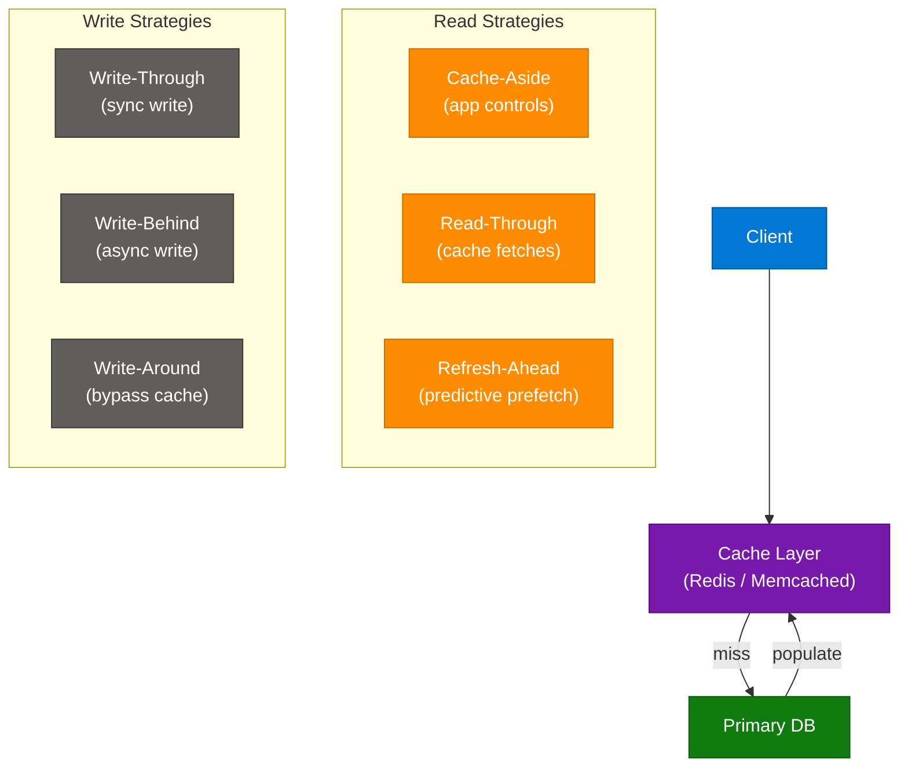
```mermaid
flowchart TD
    client["Client"]
    cache["Cache Layer\n(Redis / Memcached)"]
    db["Primary DB"]

    subgraph readStrategies["Read Strategies"]
        cacheAside["Cache-Aside\n(app controls)"]
        readThrough["Read-Through\n(cache fetches)"]
        refreshAhead["Refresh-Ahead\n(predictive prefetch)"]
    end

    subgraph writeStrategies["Write Strategies"]
        writeThrough["Write-Through\n(sync write)"]
        writeBehind["Write-Behind\n(async write)"]
        writeAround["Write-Around\n(bypass cache)"]
    end

    client --> cache
    cache -->|miss| db
    db -->|populate| cache

    classDef userNode    fill:#0078D4,stroke:#005A9E,color:#fff
    classDef aiNode      fill:#7719AA,stroke:#5A0E80,color:#fff
    classDef dataNode    fill:#107C10,stroke:#0A5C0A,color:#fff
    classDef processNode fill:#FF8C00,stroke:#CC7000,color:#fff
    classDef infraNode   fill:#605E5C,stroke:#3B3A39,color:#fff

    class client userNode
    class cache aiNode
    class db dataNode
    class cacheAside,readThrough,refreshAhead processNode
    class writeThrough,writeBehind,writeAround infraNode
```

### The 6 Strategies

#### Read Strategies

| Strategy | Who Fetches on Miss | Key Trade-off |
|---|---|---|
| **Cache-Aside** (Lazy Loading) | Application | App controls logic; risk of stale data; thundering herd on cold start |
| **Read-Through** | Cache layer itself | Transparent to app; only popular data cached; initial miss penalty |
| **Refresh-Ahead** | Cache layer (proactive) | Eliminates miss latency; wastes memory if predictions wrong |

#### Write Strategies

| Strategy | Write Path | Key Trade-off |
|---|---|---|
| **Write-Through** | Cache + DB simultaneously | Consistent; higher write latency; cache fills with cold data |
| **Write-Behind** (Write-Back) | Cache first → async to DB | Fastest writes; risk of data loss on cache crash |
| **Write-Around** | DB directly; bypasses cache | Good for bulk ingest/one-time writes; cache miss on next read |

### How Cache-Aside Works (Step-by-Step)

1. Client requests data for key `K`
2. App checks cache → **HIT**: return value immediately
3. **MISS**: app queries primary DB for `K`
4. App stores result in cache with TTL
5. App returns data to client
6. Subsequent requests for `K` hit cache until TTL expires

### Code Example

```python
import redis
import psycopg2

r = redis.Redis(host='localhost', port=6379, decode_responses=True)

def get_user(user_id: int) -> dict:
    cache_key = f"user:{user_id}"
    cached = r.get(cache_key)
    if cached:
        return eval(cached)  # in production: use json.loads

    with psycopg2.connect("dbname=app") as conn:
        with conn.cursor() as cur:
            cur.execute("SELECT id, name, email FROM users WHERE id = %s", (user_id,))
            row = cur.fetchone()
            if row:
                user = {"id": row[0], "name": row[1], "email": row[2]}
                r.setex(cache_key, 300, str(user))  # TTL = 5 min
                return user
    return {}

def save_user_write_through(user_id: int, data: dict):
    # Write-Through: update cache and DB atomically
    with psycopg2.connect("dbname=app") as conn:
        with conn.cursor() as cur:
            cur.execute("UPDATE users SET name=%s WHERE id=%s", (data["name"], user_id))
        conn.commit()
    r.setex(f"user:{user_id}", 300, str(data))
```

### Interview Q&A

| Question | Answer |
|---|---|
| What is the difference between cache-aside and read-through? | In cache-aside, the application manages cache population on misses. In read-through, the cache layer itself fetches from DB — the app only ever talks to the cache. |
| When would you use write-behind over write-through? | Write-behind suits write-heavy workloads (e.g., counters, logs) where occasional data loss is acceptable. Write-through is preferred when consistency is critical (e.g., financial transactions). |
| What is a thundering herd and how do you prevent it? | When cache expires and many concurrent requests hit the DB simultaneously. Prevent with mutex locks, jittered TTLs, or probabilistic early expiry. |
| What is cache stampede and what is the solution? | Same as thundering herd. Solution: use cache locking (only one thread repopulates) or background refresh. |
| What data should never be cached? | Highly user-specific sensitive data (passwords, PII), rapidly changing data where staleness causes harm, and data that's queried less than once per TTL period. |
| How does refresh-ahead reduce latency? | It proactively updates cache entries before TTL expiry based on predicted access patterns, ensuring frequently read keys are never stale from the client's perspective. |

---

## 3. Truecaller Mechanism — Billion-Scale Phone Lookup

### Overview

Truecaller must resolve a caller's identity in under 500 ms across a dataset of billions of phone numbers — a classic distributed systems challenge. The solution combines in-memory key-value stores, horizontal sharding, and geographic caching. This is a favorite interview question because it tests knowledge of latency budgets, data partitioning, and read-path optimization simultaneously.

### Architecture Diagram

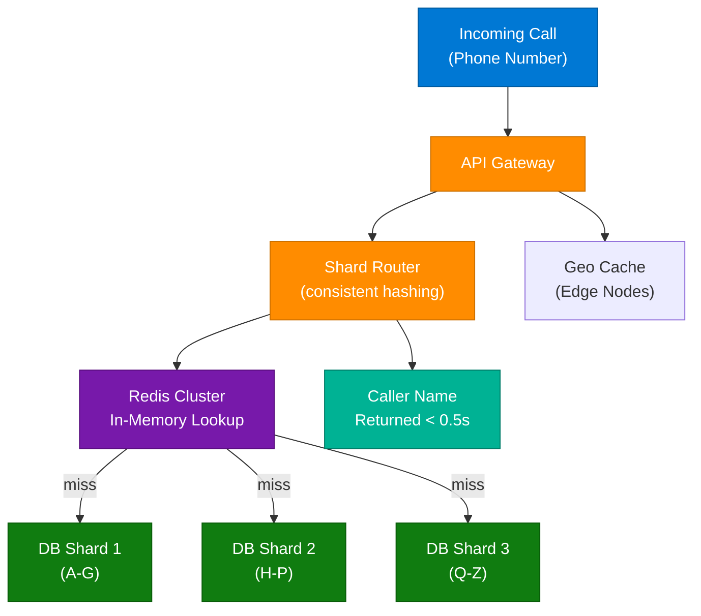
```mermaid
flowchart TD
    caller["Incoming Call\n(Phone Number)"]
    apiGw["API Gateway"]
    shardRouter["Shard Router\n(consistent hashing)"]
    redisCluster["Redis Cluster\nIn-Memory Lookup"]
    shard1["DB Shard 1\n(A-G)"]
    shard2["DB Shard 2\n(H-P)"]
    shard3["DB Shard 3\n(Q-Z)"]
    geoCache["Geo Cache\n(Edge Nodes)"]
    response["Caller Name\nReturned < 0.5s"]

    caller --> apiGw --> shardRouter
    shardRouter --> redisCluster
    redisCluster -->|miss| shard1
    redisCluster -->|miss| shard2
    redisCluster -->|miss| shard3
    apiGw --> geoCache
    shardRouter --> response

    classDef userNode    fill:#0078D4,stroke:#005A9E,color:#fff
    classDef aiNode      fill:#7719AA,stroke:#5A0E80,color:#fff
    classDef dataNode    fill:#107C10,stroke:#0A5C0A,color:#fff
    classDef processNode fill:#FF8C00,stroke:#CC7000,color:#fff
    classDef outputNode  fill:#00B294,stroke:#007D68,color:#fff

    class caller userNode
    class apiGw,shardRouter processNode
    class redisCluster aiNode
    class shard1,shard2,shard3 dataNode
    class geoCache infraNode
    class response outputNode
```

### How It Works

1. Incoming call triggers a lookup with the caller's phone number
2. API Gateway routes the request to the Shard Router
3. Shard Router uses consistent hashing on the phone number to select the correct Redis node and DB shard
4. Redis cluster is checked first (in-memory, O(1) hash lookup, sub-millisecond)
5. On cache miss, the DB shard is queried (B-Tree or Hash Index on phone number)
6. Result is returned to the API Gateway and simultaneously cached in Redis with TTL
7. Geographically distributed edge nodes cache frequently dialled numbers near users

### Key Components

| Component | Role | Technology |
|---|---|---|
| In-Memory Store | Sub-millisecond lookup for hot numbers | Redis Cluster, Memcached |
| Shard Router | Distributes load; prevents hotspots | Consistent hashing |
| DB Shards | Persistent storage partitioned by number range | Cassandra, MySQL partitions |
| Edge Cache | Reduces cross-region latency | CDN edge nodes, local Redis |
| Indexing | Fast lookup within shard | B-Tree, Hash Index on phone_number column |

### Interview Q&A

| Question | Answer |
|---|---|
| How does Truecaller achieve sub-500ms lookups at global scale? | Combination of in-memory Redis clusters (O(1) hash lookup), consistent hashing to eliminate coordination, and geographic edge caches to reduce round-trip latency. |
| Why is consistent hashing preferred over modulo sharding? | Modulo sharding (`hash(key) % N`) requires rebalancing all keys when N changes. Consistent hashing only migrates ~1/N keys when adding or removing a node. |
| What happens when a Redis node fails? | With Redis Sentinel/Cluster, automatic failover promotes a replica. A cache miss falls through to the DB shard — latency spikes temporarily but no data loss. |
| How do you handle spam detection alongside the lookup? | Maintain a separate sorted set in Redis with call-frequency counters per number; flag numbers exceeding a threshold within a time window. |
| How do you keep the phone-to-name mapping fresh? | Write-through on update with cache invalidation; async Kafka event for cross-region propagation of changes. |

---

## 4. 12 Essential System Design Concepts

### Overview

A quick-reference dashboard of the 12 most interview-tested system design building blocks. Understanding each concept at the "define → component → trade-off" level is sufficient to answer 80% of system design interview questions. The concepts span traffic management, data storage, and fault tolerance.

### Concept Reference Table

| # | Concept | One-Line Definition | Key Trade-off |
|---|---|---|---|
| 1 | **Load Balancing** | Distributes traffic across multiple servers | Round-robin vs. least-connections vs. IP-hash |
| 2 | **CDN** | Caches static assets at edge nodes near users | Cache invalidation complexity; cost |
| 3 | **Consistent Hashing** | Maps keys to nodes on a virtual ring; minimal rehashing on topology change | Hot spots with few vnodes |
| 4 | **Rate Limiting** | Caps requests per client per window | Token bucket vs. sliding window algorithms |
| 5 | **Message Queues** | Decouples producers from consumers; enables async processing | At-least-once vs. exactly-once delivery |
| 6 | **Circuit Breaker** | Stops calls to failing downstream services; enables fast-fail | State management overhead |
| 7 | **API Gateway** | Single entry point for routing, auth, throttling, SSL termination | Single point of failure if not HA |
| 8 | **Pub/Sub** | Publishers emit events; multiple subscribers consume independently | Ordering guarantees, message retention |
| 9 | **Database Sharding** | Horizontal partitioning of data across nodes | Cross-shard joins; rebalancing |
| 10 | **Leader Election** | Selects one node to coordinate writes; followers replicate | Split-brain risk; election latency |
| 11 | **Bloom Filter** | Probabilistic membership check; no false negatives; possible false positives | Cannot delete; tuning FP rate vs. memory |
| 12 | **Distributed Cache** | Shared memory layer across services | Cache coherence; eviction policies |

### Architecture Diagram

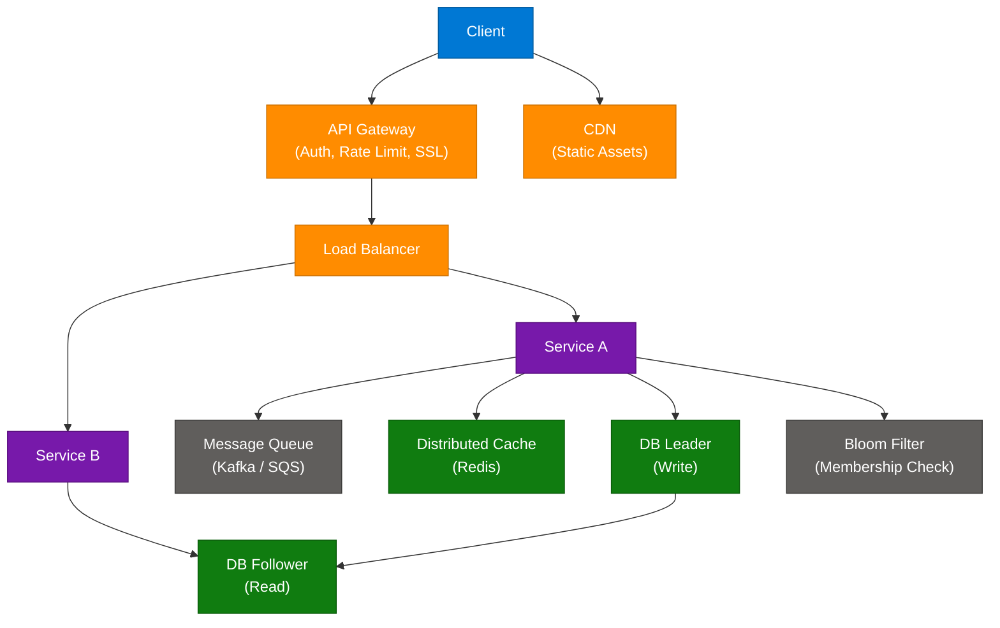
```mermaid
flowchart TD
    client["Client"]
    apiGw["API Gateway\n(Auth, Rate Limit, SSL)"]
    lb["Load Balancer"]
    svcA["Service A"]
    svcB["Service B"]
    mq["Message Queue\n(Kafka / SQS)"]
    cache["Distributed Cache\n(Redis)"]
    dbLeader["DB Leader\n(Write)"]
    dbFollower["DB Follower\n(Read)"]
    cdn["CDN\n(Static Assets)"]
    bloomFilter["Bloom Filter\n(Membership Check)"]

    client --> cdn
    client --> apiGw --> lb
    lb --> svcA & svcB
    svcA --> cache
    svcA --> mq
    svcB --> dbFollower
    svcA --> dbLeader
    dbLeader --> dbFollower
    svcA --> bloomFilter

    classDef userNode    fill:#0078D4,stroke:#005A9E,color:#fff
    classDef aiNode      fill:#7719AA,stroke:#5A0E80,color:#fff
    classDef dataNode    fill:#107C10,stroke:#0A5C0A,color:#fff
    classDef processNode fill:#FF8C00,stroke:#CC7000,color:#fff
    classDef infraNode   fill:#605E5C,stroke:#3B3A39,color:#fff

    class client userNode
    class apiGw,lb processNode
    class svcA,svcB aiNode
    class mq,bloomFilter infraNode
    class cache,dbLeader,dbFollower dataNode
    class cdn processNode
```

### Interview Q&A

| Question | Answer |
|---|---|
| What is the difference between a load balancer and an API gateway? | A load balancer distributes traffic across replicas of the same service. An API gateway is a higher-level entry point that handles routing across different services, authentication, rate limiting, and protocol translation. |
| When would you use Pub/Sub over a point-to-point message queue? | Pub/Sub when multiple independent consumers need the same event (fan-out). Point-to-point (e.g., SQS queue) when you need exactly one consumer to process each message (work queue). |
| How does a Bloom filter help at scale? | It avoids unnecessary DB lookups — before querying whether a user exists, check the Bloom filter. A "definitely no" result skips the DB call entirely, reducing load dramatically for negative lookups. |

---

## 5. Optimistic vs. Pessimistic Locking

### Overview

Concurrency control determines how multiple transactions handle simultaneous access to the same record. Pessimistic locking prevents conflicts by blocking other accessors upfront; optimistic locking detects conflicts at commit time and retries. The correct choice depends on the contention level: high-contention systems favor pessimistic, read-heavy systems favor optimistic.

### Architecture Diagram

```mermaid
stateDiagram-v2
    [*] --> ReadRecord
    ReadRecord --> PessimisticPath: High Contention
    ReadRecord --> OptimisticPath: Low Contention

    state PessimisticPath {
        acquireLock: Acquire Row Lock
        process: Process & Modify
        releaseLock: Release Lock
        acquireLock --> process --> releaseLock
    }

    state OptimisticPath {
        readVersion: Read + Store Version
        process2: Process Locally
        compareAndSwap: Compare Version at Commit
        retry: Retry on Conflict
        readVersion --> process2 --> compareAndSwap
        compareAndSwap --> retry: Version Mismatch
        compareAndSwap --> [*]: Version Match
    }
```

### Comparison Table

| Aspect | Pessimistic Locking | Optimistic Locking |
|---|---|---|
| Mechanism | Lock row before read/write (`SELECT FOR UPDATE`) | Read version; check at commit (`WHERE version = N`) |
| Conflict strategy | Prevent via blocking | Detect at commit; retry |
| Performance under high contention | Poor — lock waits | Poor — high retry rate |
| Performance under low contention | Overhead of acquiring locks | Excellent — no blocking |
| Deadlock risk | Yes | No |
| Use case | Banking transfers, seat booking | Shopping carts, profile updates |

### Code Example

```python
import psycopg2

def pessimistic_update(conn, user_id: int, amount: float):
    with conn.cursor() as cur:
        cur.execute("SELECT balance FROM accounts WHERE id = %s FOR UPDATE", (user_id,))
        balance = cur.fetchone()[0]
        cur.execute("UPDATE accounts SET balance = %s WHERE id = %s", (balance - amount, user_id))
    conn.commit()

def optimistic_update(conn, user_id: int, amount: float, max_retries: int = 3):
    for _ in range(max_retries):
        with conn.cursor() as cur:
            cur.execute("SELECT balance, version FROM accounts WHERE id = %s", (user_id,))
            balance, version = cur.fetchone()
            cur.execute(
                "UPDATE accounts SET balance = %s, version = %s WHERE id = %s AND version = %s",
                (balance - amount, version + 1, user_id, version)
            )
            if cur.rowcount == 1:
                conn.commit()
                return True
        conn.rollback()
    raise Exception("Optimistic lock failed after retries")
```

### Interview Q&A

| Question | Answer |
|---|---|
| What is a deadlock and how do optimistic locking prevent it? | Deadlock occurs when two transactions each hold a lock the other needs. Optimistic locking never holds locks during processing, so deadlocks are impossible — conflicts result in retries, not waits. |
| When does optimistic locking fail badly? | When contention is high and many transactions read the same version simultaneously — all but one will fail and retry, creating a retry storm. |
| How does `SELECT FOR UPDATE` work at the DB level? | It acquires a row-level exclusive lock. Other transactions attempting the same row block until the lock is released at commit or rollback. |
| What is a version column strategy? | Add a `version INTEGER` column. Each update increments it. The `WHERE version = N` clause acts as the concurrency guard — if another transaction already incremented, rowcount = 0 and the caller retries. |
| Which databases support optimistic locking natively? | Most relational DBs support it via version columns. DynamoDB supports it via `ConditionExpression`. MongoDB via findAndModify with query conditions. |

---

## 6. LMAX Disruptor — Lock-Free Ring Buffer

### Overview

The LMAX Disruptor is a high-performance, lock-free inter-thread messaging library originally developed for financial trading systems where latency is measured in microseconds. Its core innovation is a pre-allocated ring buffer (circular array) that eliminates garbage collection pressure, lock contention, and cache-line bouncing — the three primary causes of latency spikes in concurrent systems. It is widely used in systems that need 6-7 nines latency guarantees.

### Architecture Diagram

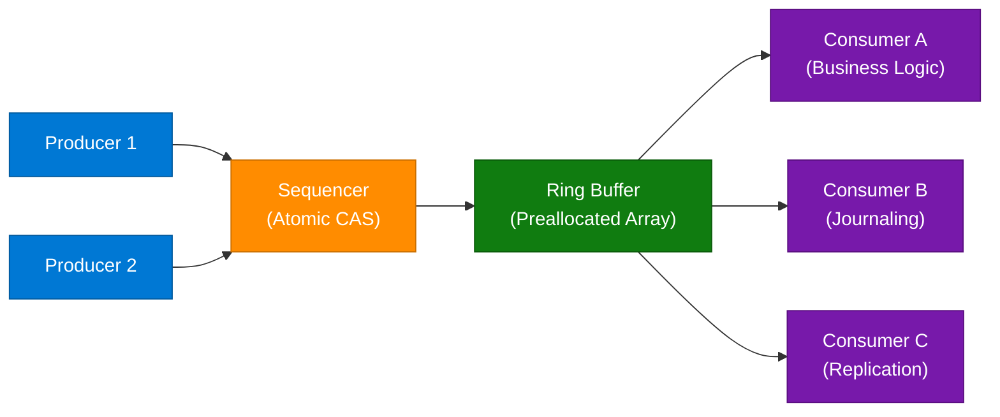
```mermaid
flowchart LR
    producer1["Producer 1"]
    producer2["Producer 2"]
    ringBuffer["Ring Buffer\n(Preallocated Array)"]
    sequencer["Sequencer\n(Atomic CAS)"]
    consumer1["Consumer A\n(Business Logic)"]
    consumer2["Consumer B\n(Journaling)"]
    consumer3["Consumer C\n(Replication)"]

    producer1 --> sequencer
    producer2 --> sequencer
    sequencer --> ringBuffer
    ringBuffer --> consumer1
    ringBuffer --> consumer2
    ringBuffer --> consumer3

    classDef userNode    fill:#0078D4,stroke:#005A9E,color:#fff
    classDef aiNode      fill:#7719AA,stroke:#5A0E80,color:#fff
    classDef dataNode    fill:#107C10,stroke:#0A5C0A,color:#fff
    classDef processNode fill:#FF8C00,stroke:#CC7000,color:#fff

    class producer1,producer2 userNode
    class ringBuffer dataNode
    class sequencer processNode
    class consumer1,consumer2,consumer3 aiNode
```

### Key Design Principles

| Principle | Mechanism | Benefit |
|---|---|---|
| **Preallocation** | Ring buffer slots allocated at startup | Zero GC pressure during operation |
| **Lock-Free** | Compare-And-Swap (CAS) atomic operations | No thread blocking; no deadlocks |
| **Cache Friendliness** | Contiguous memory array | Maximises CPU L1/L2/L3 cache hit rate |
| **Sequencing** | Every slot has a monotonic sequence number | Consumers track position; no coordination needed |
| **Padding** | Cache line padding between sequence counters | Prevents false sharing between CPU cores |

### How It Works

1. Ring buffer of size 2^N (e.g., 1024 slots) is allocated at JVM startup
2. Producers claim the next slot via atomic CAS on the sequence counter
3. Producer writes event data into its claimed slot
4. Producer publishes by advancing the cursor sequence
5. Consumers independently track their own read sequence
6. Consumer reads slot when its sequence ≤ cursor sequence (no lock)
7. Consumers wrap around the ring indefinitely — slots are overwritten, not freed

### Interview Q&A

| Question | Answer |
|---|---|
| Why is the Disruptor faster than a traditional BlockingQueue? | BlockingQueue uses locks for every put/take. Disruptor uses CAS operations + memory barriers, avoids locks entirely, and preallocates all memory to eliminate GC pauses. |
| What is false sharing and how does the Disruptor prevent it? | False sharing occurs when two threads on different CPU cores modify variables that land on the same cache line, causing constant cache invalidation. Disruptor pads each sequence counter to occupy a full cache line (64 bytes). |
| Why must the ring buffer size be a power of 2? | To replace modulo operations (`seq % size`) with bitwise AND (`seq & (size-1)`), which is significantly faster. |
| What happens when the ring buffer is full? | Producers spin-wait (or yield) until a consumer slot is freed. This back-pressure is by design — it prevents unbounded memory growth. |
| Where is the Disruptor used in production? | LMAX Exchange (algorithmic trading), Apache Storm, Log4j 2 (async logging), and real-time financial risk engines. |

---

## 7. Synchronous vs. Asynchronous Communication

### Overview

Synchronous coupling means the caller blocks and waits for the callee to complete before proceeding — like standing in line at a coffee shop waiting for your order. Asynchronous decoupling means the caller fires a request and moves on immediately, with the result delivered via callback, queue, or event — like a coffee shop that takes your order and calls your name when it is ready. System design interviews require knowing when each model breaks down under load.

### Architecture Diagram

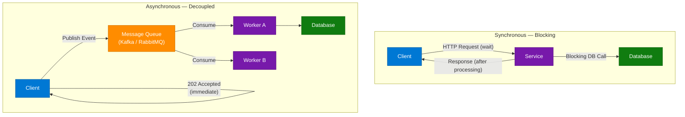
```mermaid
flowchart TD
    subgraph syncModel["Synchronous — Blocking"]
        clientS["Client"] -->|"HTTP Request (wait)"| serviceS["Service"]
        serviceS -->|"Response (after processing)"| clientS
        serviceS -->|"Blocking DB Call"| dbS["Database"]
    end

    subgraph asyncModel["Asynchronous — Decoupled"]
        clientA["Client"] -->|"Publish Event"| queue["Message Queue\n(Kafka / RabbitMQ)"]
        queue -->|"Consume"| workerA["Worker A"]
        queue -->|"Consume"| workerB["Worker B"]
        workerA --> dbA["Database"]
        clientA -->|"202 Accepted\n(immediate)"| clientA
    end

    classDef userNode    fill:#0078D4,stroke:#005A9E,color:#fff
    classDef aiNode      fill:#7719AA,stroke:#5A0E80,color:#fff
    classDef dataNode    fill:#107C10,stroke:#0A5C0A,color:#fff
    classDef processNode fill:#FF8C00,stroke:#CC7000,color:#fff
    classDef infraNode   fill:#605E5C,stroke:#3B3A39,color:#fff

    class clientS,clientA userNode
    class serviceS,workerA,workerB aiNode
    class dbS,dbA dataNode
    class queue processNode
```

### Comparison Table

| Dimension | Synchronous | Asynchronous |
|---|---|---|
| Response model | Blocks until done | Returns immediately; result delivered later |
| Coupling | Tight — caller depends on callee uptime | Loose — queue buffers between producer/consumer |
| Latency | Lower for simple requests | Higher for first response; higher throughput overall |
| Failure propagation | Cascades instantly | Isolated — consumer retries independently |
| Ordering | Guaranteed per-call | Depends on queue/partition strategy |
| Use case | Login, payment checkout | Email sending, image processing, analytics events |

### Interview Q&A

| Question | Answer |
|---|---|
| What is temporal coupling and why is it dangerous? | Temporal coupling means both services must be available at the same moment. If the callee is down, the caller fails immediately. Async queues break this dependency. |
| When is synchronous communication the right choice? | When the caller genuinely needs the result to proceed — e.g., authentication, payment validation, read-your-writes consistency. |
| What pattern handles async responses to a specific caller? | The Correlation ID pattern: caller attaches a unique ID to the request; when the async response arrives via callback/queue, the ID routes it back to the correct caller context. |
| How do you handle backpressure in async systems? | Rate-limit producers, add bounded queue sizes, and use consumer-side admission control. Kafka allows consumers to pause consumption, signalling producers to slow down. |
| What is the difference between a message queue and a message broker? | A queue is a point-to-point channel (one consumer per message). A broker (e.g., Kafka, RabbitMQ) manages multiple queues/topics and routing rules, and may support pub/sub fan-out. |

---

## 8. Cuckoo Filters vs. Bloom Filters

### Overview

Bloom filters are space-efficient probabilistic data structures that answer "is X in the set?" with no false negatives but possible false positives. Their fatal flaw is that deletion is impossible without corrupting the bit array. Cuckoo filters solve this by storing compact fingerprints in buckets instead of toggling shared bits, enabling both deletion and slightly better space efficiency at higher fill rates. Both are used in systems that need to skip expensive lookups for items definitely not in a set.

### Architecture Diagram

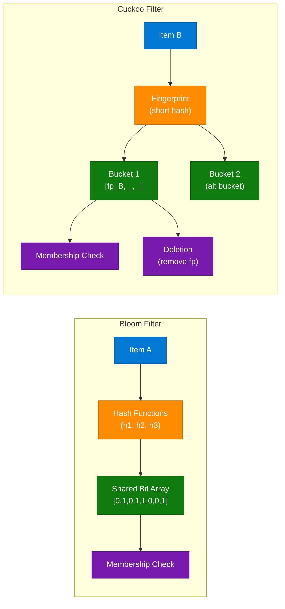
```mermaid
flowchart LR
    subgraph bloomSection["Bloom Filter"]
        itemA["Item A"] --> hashA["Hash Functions\n(h1, h2, h3)"]
        hashA --> bitArray["Shared Bit Array\n[0,1,0,1,1,0,0,1]"]
        bitArray --> checkA["Membership Check"]
    end

    subgraph cuckooSection["Cuckoo Filter"]
        itemB["Item B"] --> fpHash["Fingerprint\n(short hash)"]
        fpHash --> bucket1["Bucket 1\n[fp_B, _, _]"]
        fpHash --> bucket2["Bucket 2\n(alt bucket)"]
        bucket1 --> checkB["Membership Check"]
        bucket1 --> deleteOp["Deletion\n(remove fp)"]
    end

    classDef userNode    fill:#0078D4,stroke:#005A9E,color:#fff
    classDef dataNode    fill:#107C10,stroke:#0A5C0A,color:#fff
    classDef processNode fill:#FF8C00,stroke:#CC7000,color:#fff
    classDef aiNode      fill:#7719AA,stroke:#5A0E80,color:#fff

    class itemA,itemB userNode
    class hashA,fpHash processNode
    class bitArray,bucket1,bucket2 dataNode
    class checkA,checkB,deleteOp aiNode
```

### Feature Comparison

| Feature | Bloom Filter | Cuckoo Filter |
|---|---|---|
| Membership check | Yes (probabilistic) | Yes (probabilistic) |
| False positives | Yes (tunable via size) | Yes (slightly lower at high load) |
| False negatives | Never | Never |
| Deletion | Not supported natively | Supported |
| Space at low load | More efficient | Slightly less efficient |
| Space at high load | Less efficient | More efficient |
| Insertion worst case | O(1) | O(1) amortized; worst case O(n) |

### How Cuckoo Filter Works

1. Compute a fingerprint `f = hash(item)` (e.g., 8 bits)
2. Compute two candidate buckets: `b1 = hash(item) % size` and `b2 = b1 XOR hash(f)`
3. If either bucket has space, insert fingerprint
4. If both full, evict one existing fingerprint (like a cuckoo ejecting an egg) and reinsert it into its alternate bucket
5. Repeat eviction chain until empty slot found or max kicks reached
6. Deletion: find fingerprint in b1 or b2 and remove it directly

### Interview Q&A

| Question | Answer |
|---|---|
| Why can't you delete from a Bloom filter? | Multiple items hash to overlapping bits. Clearing a bit for one item would corrupt the membership status of others that share that bit. |
| Where are Bloom/Cuckoo filters used in real systems? | Cassandra uses Bloom filters to avoid reading SSTable files that don't contain a key. Chrome uses one for Safe Browsing URL checks. Redis uses them for membership checks. |
| What is the false positive rate formula for a Bloom filter? | Approximately `(1 - e^(-kn/m))^k` where k = number of hash functions, n = number of elements, m = number of bits. |
| What happens when a Cuckoo filter is 95%+ full? | Insertion may fail due to excessive cuckoo kicks cycling without finding an empty slot. Must resize before reaching this threshold. |
| When would you choose a Counting Bloom Filter instead? | When deletion is needed but cuckoo filter's insertion worst case is unacceptable. Counting filters use integer counters instead of bits — deletion decrements the counter. |

---

## 9. Distributed Tracing in Microservices

### Overview

In a microservices architecture, a single user request may fan out across 5–20 services before producing a response. Distributed tracing assigns a unique Trace ID to each request and records a Span (start time, duration, service name) for every service hop. Tools like Jaeger, Zipkin, and AWS X-Ray visualise the complete call tree, enabling engineers to identify which service introduced latency or failures. Without tracing, debugging production issues requires correlating logs across dozens of services — an O(n²) problem.

### Architecture Diagram

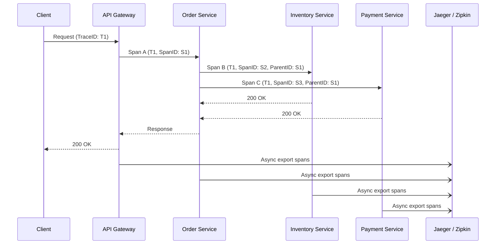
```mermaid
sequenceDiagram
    participant client as Client
    participant apiGw as API Gateway
    participant orderSvc as Order Service
    participant inventorySvc as Inventory Service
    participant paymentSvc as Payment Service
    participant tracingBE as Jaeger / Zipkin

    client->>apiGw: Request (TraceID: T1)
    apiGw->>orderSvc: Span A (T1, SpanID: S1)
    orderSvc->>inventorySvc: Span B (T1, SpanID: S2, ParentID: S1)
    orderSvc->>paymentSvc: Span C (T1, SpanID: S3, ParentID: S1)
    inventorySvc-->>orderSvc: 200 OK
    paymentSvc-->>orderSvc: 200 OK
    orderSvc-->>apiGw: Response
    apiGw-->>client: 200 OK

    apiGw-)tracingBE: Async export spans
    orderSvc-)tracingBE: Async export spans
    inventorySvc-)tracingBE: Async export spans
    paymentSvc-)tracingBE: Async export spans
```

### Key Components

| Component | Role | Technology Options |
|---|---|---|
| Trace ID | Unique identifier propagated across all services in a request | UUID, 128-bit hex |
| Span | Single unit of work with start/end timestamp within one service | OpenTelemetry Span |
| Context Propagation | Passes Trace ID via HTTP headers | `traceparent` header (W3C standard), B3 |
| Collector | Receives and aggregates spans from all services | Jaeger Agent, OTEL Collector |
| Storage Backend | Stores span data for querying | Cassandra, Elasticsearch |
| UI | Visualises trace trees and latency waterfall | Jaeger UI, Zipkin UI, Grafana Tempo |

### Interview Q&A

| Question | Answer |
|---|---|
| What is the difference between a Trace and a Span? | A Trace is the complete journey of one request across all services (the full tree). A Span is a single node in that tree — the work done by one service, with a parent-child relationship to adjacent spans. |
| How does OpenTelemetry differ from Jaeger/Zipkin? | OpenTelemetry is the vendor-neutral SDK and protocol for instrumenting code. Jaeger and Zipkin are backends that store and query spans. You instrument with OTel and export to either backend. |
| What is tail-based sampling? | Instead of randomly sampling a percentage of all traces, tail-based sampling waits until the full trace is complete and preferentially retains traces that had errors or high latency. |
| Why can distributed tracing impact application performance? | Each span requires serialization and network export. High-volume systems use async, batched exporters and sampling (e.g., 1% of traces) to limit overhead. |
| What is a baggage item in distributed tracing? | Key-value metadata attached to a trace context and propagated across all services — used for passing tenant ID, user ID, or feature flags without modifying service APIs. |

---

## 10. PACELC Theorem

### Overview

The CAP Theorem states that during a network Partition, a distributed system must choose between Consistency and Availability. The PACELC Theorem extends CAP by asking: even when there is no partition (Else), what is the trade-off between Latency and Consistency? PACELC provides a more realistic model for classifying modern distributed databases because normal operation (no partition) is the common case. Every database sits somewhere on the PACELC spectrum, and system design answers should reference this framework.

### Architecture Diagram

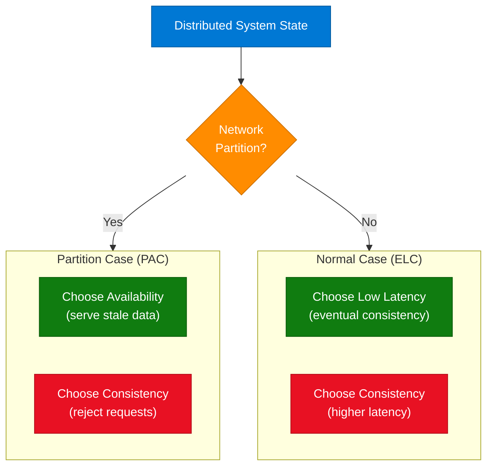
```mermaid
flowchart TD
    start["Distributed System State"]
    partitionQ{"Network\nPartition?"}

    subgraph partitionCase["Partition Case (PAC)"]
        chooseA["Choose Availability\n(serve stale data)"]
        chooseC["Choose Consistency\n(reject requests)"]
    end

    subgraph elseCase["Normal Case (ELC)"]
        chooseL["Choose Low Latency\n(eventual consistency)"]
        chooseC2["Choose Consistency\n(higher latency)"]
    end

    start --> partitionQ
    partitionQ -->|Yes| partitionCase
    partitionQ -->|No| elseCase

    classDef userNode    fill:#0078D4,stroke:#005A9E,color:#fff
    classDef processNode fill:#FF8C00,stroke:#CC7000,color:#fff
    classDef dataNode    fill:#107C10,stroke:#0A5C0A,color:#fff
    classDef errorNode   fill:#E81123,stroke:#B30D1A,color:#fff

    class start userNode
    class partitionQ processNode
    class chooseA,chooseL dataNode
    class chooseC,chooseC2 errorNode
```

### Database Classification

| Database | PAC side | ELC side | Notes |
|---|---|---|---|
| DynamoDB | Availability (PA) | Latency (EL) | Default: eventual consistency; strong consistency optional |
| Cassandra | Availability (PA) | Latency (EL) | Tunable consistency per query |
| MongoDB | Consistency (PC) | Consistency (EC) | Default write concern w:majority |
| Zookeeper | Consistency (PC) | Consistency (EC) | Designed for coordination, not read throughput |
| CockroachDB | Consistency (PC) | Consistency (EC) | Distributed SQL; strong consistency globally |
| Riak | Availability (PA) | Latency (EL) | Optimised for write throughput |

### How It Works

1. System starts in normal operation (no partition)
2. **ELC decision**: choose between low-latency eventual consistency vs. stronger consistency with higher write latency
3. Network partition detected (e.g., nodes cannot communicate)
4. **PAC decision**: choose availability (serve potentially stale reads, accept writes locally) vs. consistency (block until quorum restored)
5. Partition healed → system reconciles divergent state (conflict resolution via CRDT, last-write-wins, or application logic)

### Interview Q&A

| Question | Answer |
|---|---|
| Why is PACELC more useful than CAP for modern system design? | CAP only describes behaviour during partitions (a rare event). PACELC also captures the latency-consistency trade-off in normal operation, which is the common case and more practically relevant. |
| What does "eventual consistency" mean precisely? | Given no new updates, all replicas will converge to the same value within a bounded time. Reads may return stale values during the convergence window. |
| What is a quorum read/write and how does it relate to PACELC? | Quorum operations (e.g., read/write majority of N replicas) shift a database toward the Consistency side of ELC. They increase latency because you wait for multiple nodes to acknowledge. |
| How does DynamoDB implement tunable consistency? | By default, reads are eventually consistent (read any replica). Strongly consistent reads (`ConsistentRead=true`) always read from the leader, with higher latency. |
| What is the difference between linearisability and serializability? | Linearisability is a per-operation property (reads reflect the latest write in real time). Serializability is a per-transaction property (transactions appear to execute in some serial order). Strong consistency typically implies linearisability. |

---

## 11. Instagram Feed — How It Loads Instantly

### Overview

Instagram must serve a personalised feed to 1 billion+ daily active users in under 200ms. The core strategy is pre-computed push-on-write ("fan-out on write") combined with a multi-tier cache architecture. When a user posts, the system proactively pushes the post ID into the feed caches of all followers — so reads are always fast because the feed is pre-built, not computed at query time.

### Architecture Diagram

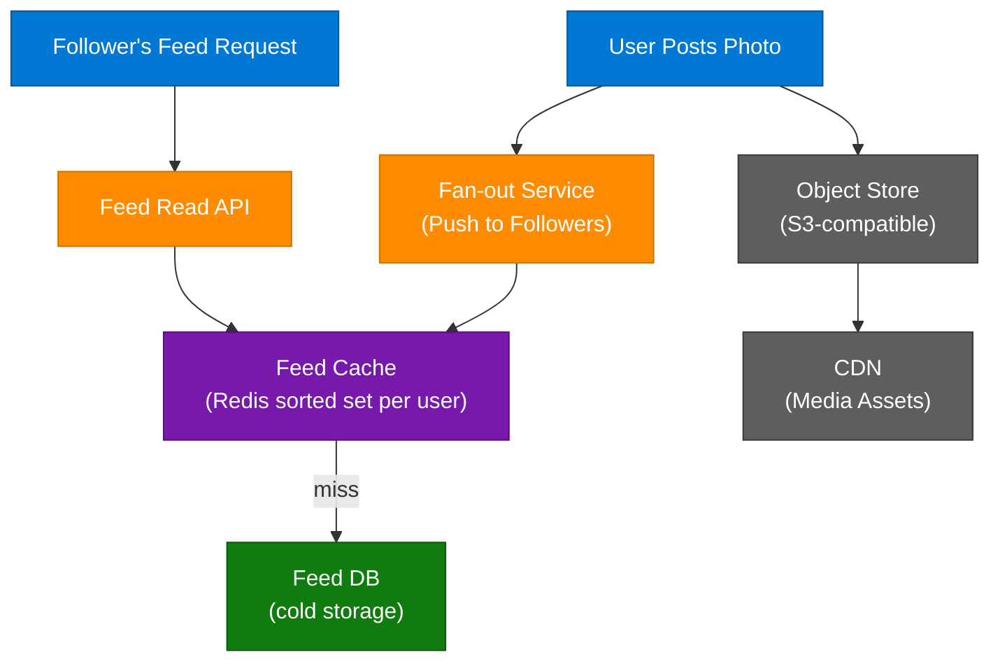
```mermaid
flowchart TD
    poster["User Posts Photo"]
    fanoutSvc["Fan-out Service\n(Push to Followers)"]
    feedCache["Feed Cache\n(Redis sorted set per user)"]
    cdnLayer["CDN\n(Media Assets)"]
    feedReader["Feed Read API"]
    followerUser["Follower's Feed Request"]
    mediaStore["Object Store\n(S3-compatible)"]

    poster --> fanoutSvc
    fanoutSvc --> feedCache
    poster --> mediaStore
    mediaStore --> cdnLayer
    followerUser --> feedReader
    feedReader --> feedCache
    feedCache -->|miss| dbFallback["Feed DB\n(cold storage)"]

    classDef userNode    fill:#0078D4,stroke:#005A9E,color:#fff
    classDef aiNode      fill:#7719AA,stroke:#5A0E80,color:#fff
    classDef dataNode    fill:#107C10,stroke:#0A5C0A,color:#fff
    classDef processNode fill:#FF8C00,stroke:#CC7000,color:#fff
    classDef infraNode   fill:#605E5C,stroke:#3B3A39,color:#fff

    class poster,followerUser userNode
    class fanoutSvc,feedReader processNode
    class feedCache aiNode
    class cdnLayer,mediaStore infraNode
    class dbFallback dataNode
```

### Fan-out Strategy Comparison

| Strategy | Mechanism | When to Use |
|---|---|---|
| **Fan-out on Write** (push) | Post written → push to all followers' feed caches immediately | Most users; fast reads |
| **Fan-out on Read** (pull) | Feed computed at read time from followed accounts | Celebrities with 100M+ followers (too many pushes) |
| **Hybrid** | Push to most followers; pull for celebrity accounts at read time | Instagram's actual approach |

### Interview Q&A

| Question | Answer |
|---|---|
| Why not compute the feed at read time? | At 1B users, computing a personalised feed from scratch at every request would require joining across billions of posts. Pre-computation shifts work to write time and makes reads O(1). |
| How does Instagram handle celebrity accounts in fan-out? | Celebrities have 100M+ followers — pushing to all caches on each post is too expensive. Instagram uses pull for celebrity posts, merging them at read time with the pre-computed feed. |
| What data structure does Redis use for a feed? | A sorted set (`ZADD`) with the post timestamp as the score. `ZREVRANGE` retrieves the most recent N post IDs in O(log N + page size). |
| How is the media (photo/video) served fast? | The feed cache stores only post IDs and metadata, not media. Media URLs point to CDN-cached content from object storage (S3-compatible). The CDN serves bytes from edge nodes near the user. |
| How do you handle feed consistency when many posts arrive simultaneously? | Each post is a separate event processed by the fan-out service; the sorted set in Redis is written atomically per post. Order is maintained by timestamp score. |

---

## 12. Request Tracing in Microservices

### Overview

Request tracing (distinct from distributed tracing tools) refers to the architectural practice of attaching a unique Correlation ID to every incoming HTTP request and propagating it through every downstream service call, log entry, and event. This makes it possible to reconstruct the full lifecycle of any request across services using only log aggregation tools — without a dedicated tracing backend. It is the minimum viable observability practice for any microservices system.

### Architecture Diagram

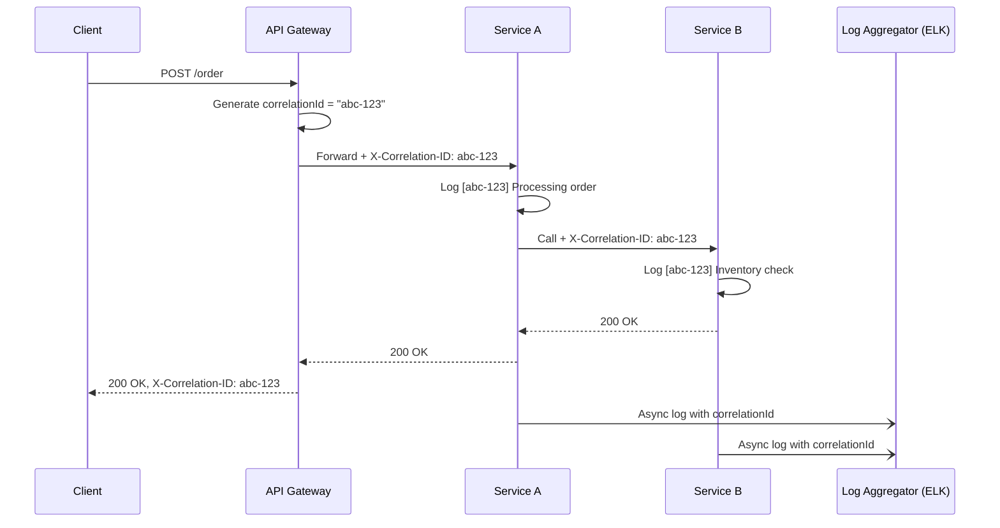
```mermaid
sequenceDiagram
    participant client as Client
    participant gateway as API Gateway
    participant svcA as Service A
    participant svcB as Service B
    participant logStore as Log Aggregator (ELK)

    client->>gateway: POST /order
    gateway->>gateway: Generate correlationId = "abc-123"
    gateway->>svcA: Forward + X-Correlation-ID: abc-123
    svcA->>svcA: Log [abc-123] Processing order
    svcA->>svcB: Call + X-Correlation-ID: abc-123
    svcB->>svcB: Log [abc-123] Inventory check
    svcB-->>svcA: 200 OK
    svcA-->>gateway: 200 OK
    gateway-->>client: 200 OK, X-Correlation-ID: abc-123

    svcA-)logStore: Async log with correlationId
    svcB-)logStore: Async log with correlationId
```

### Implementation Pattern

```python
import uuid
from fastapi import FastAPI, Request, Response
from fastapi.middleware.base import BaseHTTPMiddleware
import httpx
import logging

logger = logging.getLogger(__name__)
app = FastAPI()

CORRELATION_HEADER = "X-Correlation-ID"

class CorrelationMiddleware(BaseHTTPMiddleware):
    async def dispatch(self, request: Request, call_next):
        corr_id = request.headers.get(CORRELATION_HEADER) or str(uuid.uuid4())
        request.state.correlation_id = corr_id
        response: Response = await call_next(request)
        response.headers[CORRELATION_HEADER] = corr_id
        return response

app.add_middleware(CorrelationMiddleware)

async def call_downstream(url: str, correlation_id: str) -> dict:
    async with httpx.AsyncClient() as client:
        resp = await client.get(url, headers={CORRELATION_HEADER: correlation_id})
        return resp.json()

@app.get("/order/{order_id}")
async def get_order(order_id: int, request: Request):
    corr_id = request.state.correlation_id
    logger.info(f"[{corr_id}] Fetching order {order_id}")
    inventory = await call_downstream(f"http://inventory/item/{order_id}", corr_id)
    logger.info(f"[{corr_id}] Inventory response: {inventory}")
    return {"order_id": order_id, "inventory": inventory}
```

### Interview Q&A

| Question | Answer |
|---|---|
| What is the difference between a Correlation ID and a Trace ID? | A Correlation ID is a simple string propagated via HTTP headers for log correlation. A Trace ID is part of a structured distributed tracing system (OpenTelemetry) that also records timing, parent-child span relationships, and is exported to a tracing backend. |
| Where should the Correlation ID be generated? | At the edge — the API Gateway or first service to receive the external request. If a request arrives with an existing Correlation ID (from a trusted internal caller), reuse it; otherwise generate a new UUID. |
| How do you correlate logs across services in ELK? | All services log the Correlation ID as a structured field. In Kibana, filter by `correlation_id: "abc-123"` to see all log entries for that request across every service. |
| What if a service forgets to propagate the Correlation ID? | The trace chain breaks for that service. Enforce propagation via middleware/interceptors at the framework level so developers cannot accidentally omit it. |
| How do you handle async events in correlation? | Include the Correlation ID in the event payload when publishing to Kafka/SQS. Consumers extract and log it so async processing is also traceable. |

---

## 13. Backend Engineering Interview Concepts

### Overview

GeeksforGeeks reels cover foundational backend engineering concepts that appear in nearly every technical interview. These span HTTP protocol behaviour, REST design, thread models, and database connection management. Mastering these at the "why" level (not just "what") separates candidates who can reason about trade-offs from those who have merely memorised definitions.

### Key Concept Quick Reference

| Concept | Definition | Interview Angle |
|---|---|---|
| **HTTP/2 Multiplexing** | Multiple requests over a single TCP connection simultaneously | Eliminates head-of-line blocking at HTTP layer |
| **Connection Pooling** | Reuse DB connections instead of creating per-request | Reduces connection setup overhead (TCP + TLS + auth) |
| **Thread-per-Request** | Each HTTP request gets a dedicated OS thread | Simple model; breaks at high concurrency (C10K problem) |
| **Event Loop (NIO)** | Single thread manages I/O readiness for many connections | Node.js, Vert.x; high concurrency with low memory |
| **Idempotency** | Repeating the same request produces the same result | Critical for retry logic in distributed systems |
| **Backpressure** | Consumer signals producer to slow down | Prevents memory overflow under load |
| **Database Index** | B-Tree or Hash structure for fast column lookups | Trade read speed for write overhead + storage |
| **N+1 Query Problem** | Loop fetches parent then N children individually | Fix with JOIN or batch fetch (eager loading) |

### Interview Q&A

| Question | Answer |
|---|---|
| What is the C10K problem? | Handling 10,000 concurrent connections with thread-per-request model fails because each thread uses ~1MB of stack; 10K threads = 10GB RAM. Event-loop I/O (NIO) or virtual threads (Java 21) solve this. |
| Why should HTTP PUT be idempotent but POST not? | PUT sets a resource to an exact state — repeating it has no additional effect. POST creates a new resource each time, so is not idempotent by design. |
| What is connection pooling and why is it critical? | Creating a new DB connection involves TCP handshake, authentication, and protocol negotiation — ~20-100ms. Connection pools (e.g., HikariCP, pgBouncer) keep connections warm and reuse them, reducing per-query overhead to microseconds. |
| How does database indexing cause write amplification? | Every INSERT/UPDATE/DELETE must update all indexes on the affected columns in addition to the base table. A table with 5 indexes has 6x write amplification. |
| What is a covering index? | An index that contains all columns needed by a query — the DB can satisfy the query entirely from the index without reading the base table rows ("index-only scan"). |

---

## 14. Circuit Breaker Pattern

### Overview

The Circuit Breaker is a microservices resilience pattern that prevents cascading failures by acting as an automatic fault-isolator between services. When Service A calls Service B, the Circuit Breaker monitors error rates. If they exceed a threshold, it "trips" (opens) and immediately rejects further calls to Service B without actually attempting them — giving Service B time to recover and preventing Service A from exhausting its thread pool waiting for responses that never arrive. This pattern was popularised by Netflix Hystrix and is now standard in Polly (.NET), Resilience4j (Java), and Istio.

### Architecture Diagram

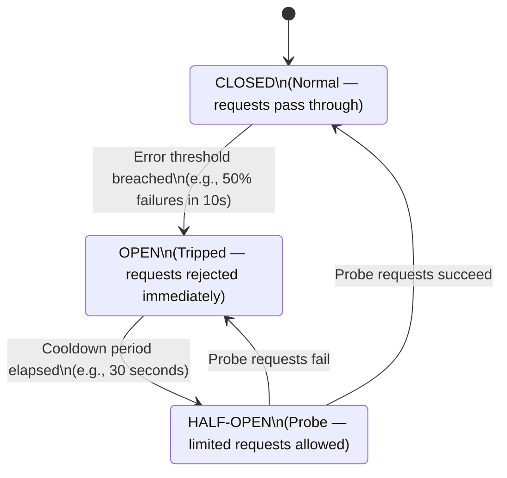
```mermaid
stateDiagram-v2
    [*] --> Closed

    Closed: CLOSED\n(Normal — requests pass through)
    Open: OPEN\n(Tripped — requests rejected immediately)
    HalfOpen: HALF-OPEN\n(Probe — limited requests allowed)

    Closed --> Open: Error threshold breached\n(e.g., 50% failures in 10s)
    Open --> HalfOpen: Cooldown period elapsed\n(e.g., 30 seconds)
    HalfOpen --> Closed: Probe requests succeed
    HalfOpen --> Open: Probe requests fail
```

### Operational States

| State | Behaviour | Transition |
|---|---|---|
| **Closed** | All requests flow normally; error rate monitored in a rolling window | → Open when error rate > threshold |
| **Open** | All requests immediately fail-fast (or return cached fallback) without calling the service | → Half-Open after cooldown period |
| **Half-Open** | A small number of test requests are allowed through | → Closed on success; → Open on failure |

### Code Example

```python
import time
from enum import Enum
from collections import deque

class State(Enum):
    CLOSED = "closed"
    OPEN = "open"
    HALF_OPEN = "half_open"

class CircuitBreaker:
    def __init__(self, failure_threshold=5, recovery_timeout=30, half_open_max=2):
        self.state = State.CLOSED
        self.failure_count = 0
        self.failure_threshold = failure_threshold
        self.recovery_timeout = recovery_timeout
        self.last_failure_time = None
        self.half_open_calls = 0
        self.half_open_max = half_open_max

    def call(self, func, *args, **kwargs):
        if self.state == State.OPEN:
            if time.time() - self.last_failure_time > self.recovery_timeout:
                self.state = State.HALF_OPEN
                self.half_open_calls = 0
            else:
                raise Exception("Circuit OPEN — fast fail")

        try:
            result = func(*args, **kwargs)
            self._on_success()
            return result
        except Exception as e:
            self._on_failure()
            raise e

    def _on_success(self):
        if self.state == State.HALF_OPEN:
            self.half_open_calls += 1
            if self.half_open_calls >= self.half_open_max:
                self.state = State.CLOSED
                self.failure_count = 0

    def _on_failure(self):
        self.failure_count += 1
        self.last_failure_time = time.time()
        if self.state == State.HALF_OPEN or self.failure_count >= self.failure_threshold:
            self.state = State.OPEN
```

### Interview Q&A

| Question | Answer |
|---|---|
| What is a cascading failure and how does Circuit Breaker prevent it? | When Service A waits indefinitely for a failing Service B, A exhausts its thread pool. Callers of A also queue up, propagating the failure upstream. Circuit Breaker fast-fails calls to B, freeing A's threads and isolating the failure. |
| What is the difference between a timeout and a Circuit Breaker? | A timeout waits a fixed duration before failing — still blocks a thread. A Circuit Breaker in Open state fails instantly without any wait, and automatically stops attempting the failing service entirely. |
| What is a fallback strategy in Circuit Breaker? | When the breaker is Open, instead of throwing an error, return a cached response, a default value, or a degraded-mode response (e.g., "service temporarily unavailable"). Netflix shows cached movie recommendations when its personalisation service is down. |
| How do you configure the error threshold? | Common approach: sliding window (e.g., last 100 calls or last 60 seconds). If error rate exceeds 50% in the window, trip the breaker. Count-based windows are simpler; time-based windows handle burst traffic better. |
| What library implements Circuit Breaker in .NET? | Polly's `CircuitBreakerPolicy` or `AdvancedCircuitBreakerPolicy`. For Java: Resilience4j or Hystrix (deprecated). At infrastructure level: Istio Envoy sidecar proxy enforces circuit breaking transparently. |
| How is Circuit Breaker different from Bulkhead? | Circuit Breaker detects failures in a downstream service and stops calling it. Bulkhead isolates thread pools per downstream service — a slow service only exhausts its own pool, not the shared pool. They are complementary. |

---

## 15. JWT Logout — Token Invalidation Strategies

### Overview

JSON Web Tokens are stateless by design: the server has no session store to invalidate. This creates a fundamental problem — a user may log out, but their JWT remains cryptographically valid until expiry. The interview question "a user logs out, but their token is still valid — how do you handle this?" tests whether a candidate understands the stateless-vs-security trade-off and knows the concrete patterns to bridge it.

### Architecture Diagram

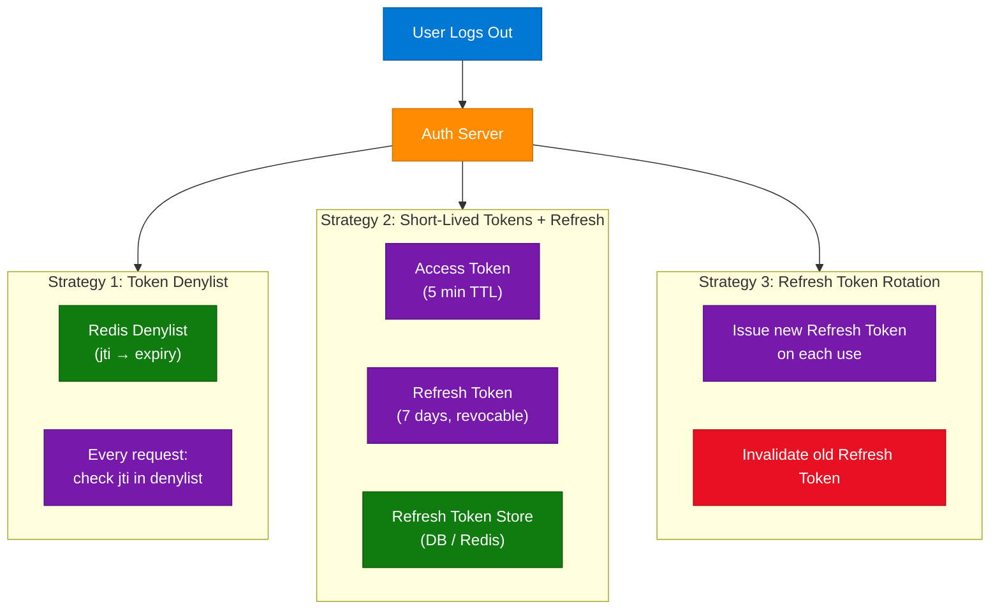
```mermaid
flowchart TD
    user["User Logs Out"]
    server["Auth Server"]

    subgraph strategy1["Strategy 1: Token Denylist"]
        denylist["Redis Denylist\n(jti → expiry)"]
        checkDeny["Every request:\ncheck jti in denylist"]
    end

    subgraph strategy2["Strategy 2: Short-Lived Tokens + Refresh"]
        accessToken["Access Token\n(5 min TTL)"]
        refreshToken["Refresh Token\n(7 days, revocable)"]
        refreshStore["Refresh Token Store\n(DB / Redis)"]
    end

    subgraph strategy3["Strategy 3: Refresh Token Rotation"]
        rotateRT["Issue new Refresh Token\non each use"]
        invalidateOld["Invalidate old Refresh Token"]
    end

    user --> server
    server --> strategy1 & strategy2 & strategy3

    classDef userNode    fill:#0078D4,stroke:#005A9E,color:#fff
    classDef processNode fill:#FF8C00,stroke:#CC7000,color:#fff
    classDef dataNode    fill:#107C10,stroke:#0A5C0A,color:#fff
    classDef aiNode      fill:#7719AA,stroke:#5A0E80,color:#fff
    classDef errorNode   fill:#E81123,stroke:#B30D1A,color:#fff

    class user userNode
    class server processNode
    class denylist,refreshStore dataNode
    class checkDeny,refreshToken,accessToken,rotateRT aiNode
    class invalidateOld errorNode
```

### Invalidation Strategies Compared

| Strategy | How It Works | Trade-offs |
|---|---|---|
| **Token Denylist** | Store revoked JTI (JWT ID) in Redis with TTL = token expiry | Adds state; O(1) lookup per request; denylist grows with revocations |
| **Short TTL + Refresh Tokens** | Access token expires in 5 min; refresh token stored server-side is revocable | Balance of security and statelessness; logout invalidates refresh token |
| **Version Claim** | JWT includes `token_version`; DB stores current version per user; logout increments DB version | Requires DB lookup per request; simple; works without Redis |
| **Refresh Token Rotation** | New refresh token issued on each use; old one invalidated | Detects theft — if old token reused, revoke all tokens for user |

### Interview Q&A

| Question | Answer |
|---|---|
| Why can't you simply delete a JWT to log out? | JWTs are stateless — the server doesn't store them. The token is valid as long as the signature is correct and the expiry hasn't passed, regardless of whether the client deleted it. |
| What is the JTI claim and how does it help? | `jti` (JWT ID) is a unique identifier per token. Storing revoked JTIs in Redis allows the server to check "is this specific token revoked?" on every request. |
| What is the recommended JWT access token TTL for security? | 5–15 minutes for access tokens. Short enough to limit the damage window if stolen. Refresh tokens (which are revocable) have longer TTLs (hours to days). |
| How does refresh token rotation prevent token theft? | If a stolen refresh token is used by an attacker, the legitimate user's next refresh attempt uses the old (now-invalidated) token. The server detects a reuse of an invalidated token and revokes all refresh tokens for that user — forcing re-authentication. |
| What is "silent refresh" and why is it used? | The frontend proactively refreshes the access token before it expires (e.g., at 80% of TTL). This provides seamless UX without requiring the user to re-authenticate. |

---

## 16. Microservice Transaction Failures — Saga Pattern

### Overview

Distributed transactions across microservices cannot use traditional ACID transactions because each service owns its own database. If a multi-step operation (e.g., Reserve Inventory → Charge Payment → Confirm Order) partially fails, the system must roll back the completed steps through compensating transactions. The Saga pattern is the standard solution: it breaks the distributed transaction into a sequence of local transactions, each with a defined compensating action that undoes its effect on failure.

### Architecture Diagram

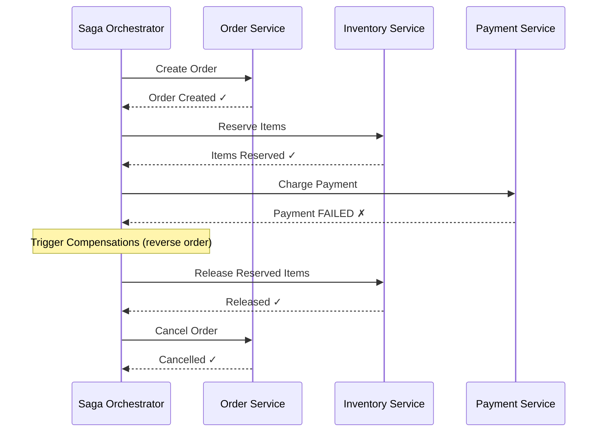
```mermaid
sequenceDiagram
    participant orchestrator as Saga Orchestrator
    participant orderSvc as Order Service
    participant inventorySvc as Inventory Service
    participant paymentSvc as Payment Service

    orchestrator->>orderSvc: Create Order
    orderSvc-->>orchestrator: Order Created ✓
    orchestrator->>inventorySvc: Reserve Items
    inventorySvc-->>orchestrator: Items Reserved ✓
    orchestrator->>paymentSvc: Charge Payment
    paymentSvc-->>orchestrator: Payment FAILED ✗

    Note over orchestrator: Trigger Compensations (reverse order)
    orchestrator->>inventorySvc: Release Reserved Items
    inventorySvc-->>orchestrator: Released ✓
    orchestrator->>orderSvc: Cancel Order
    orderSvc-->>orchestrator: Cancelled ✓
```

### Saga Variants

| Variant | Mechanism | Trade-offs |
|---|---|---|
| **Choreography** | Each service publishes events; next service listens and reacts | No central coordinator; harder to trace; risk of circular events |
| **Orchestration** | Central Saga Orchestrator issues commands; services respond | Easier to reason about; orchestrator is a single point of failure if not HA |

### Interview Q&A

| Question | Answer |
|---|---|
| What is a compensating transaction? | A transaction that logically reverses the effect of a previous successful step. E.g., "Release Reserved Inventory" compensates "Reserve Inventory." Note: compensating transactions are new DB transactions, not rollbacks. |
| Why can't you use 2-Phase Commit (2PC) in microservices? | 2PC requires a distributed lock coordinator and blocks all participants during the commit phase. In microservices with independently deployed services, this creates tight coupling, a coordination bottleneck, and a single point of failure. |
| What is the difference between Saga and 2PC? | 2PC provides strict ACID — all or nothing, synchronously. Saga provides eventual consistency — failures trigger compensations, and the system may be temporarily inconsistent during compensation. |
| How do you handle the case where the compensating transaction also fails? | Use idempotent compensations with retry logic. Store compensation state in an outbox table and retry with exponential backoff. For unrecoverable failures, trigger a human alert or dead-letter queue. |
| What is the Outbox Pattern and how does it relate to Saga? | The Outbox Pattern ensures event publication is atomic with the local DB transaction — the event is written to an `outbox` table in the same transaction as the service's local change, then a relay process publishes it to the message broker. This prevents the "service saved data but event wasn't published" failure. |

---

## 17. Concurrency vs. Parallelism vs. Async

### Overview

These three terms are frequently conflated in interviews. Concurrency is the ability to deal with multiple tasks at once (not necessarily simultaneously). Parallelism is the ability to execute multiple tasks simultaneously on multiple CPU cores. Asynchronous programming is a programming model where operations that may block (I/O, network) are initiated without blocking the calling thread — the result is delivered via a callback, future, or coroutine. The interview scenario "your app is slow — where do you add concurrency?" requires distinguishing which of these applies to each bottleneck.

### Concept Diagram

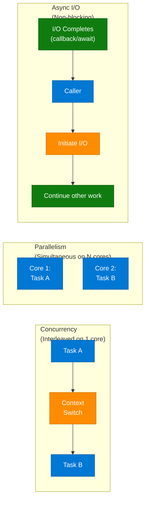
```mermaid
flowchart LR
    subgraph concurrent["Concurrency\n(Interleaved on 1 core)"]
        t1["Task A"] --> ctxSwitch["Context\nSwitch"] --> t2["Task B"]
    end

    subgraph parallel["Parallelism\n(Simultaneous on N cores)"]
        core1["Core 1:\nTask A"] 
        core2["Core 2:\nTask B"]
    end

    subgraph asyncModel["Async I/O\n(Non-blocking)"]
        caller["Caller"] --> ioInit["Initiate I/O"]
        ioInit --> doOtherWork["Continue other work"]
        ioComplete["I/O Completes\n(callback/await)"] --> caller
    end

    classDef userNode    fill:#0078D4,stroke:#005A9E,color:#fff
    classDef processNode fill:#FF8C00,stroke:#CC7000,color:#fff
    classDef dataNode    fill:#107C10,stroke:#0A5C0A,color:#fff

    class t1,t2,caller,core1,core2 userNode
    class ctxSwitch,ioInit processNode
    class doOtherWork,ioComplete dataNode
```

### Comparison Table

| Dimension | Concurrency | Parallelism | Async |
|---|---|---|---|
| CPU cores needed | 1+ (interleaved) | 2+ (simultaneous) | 1+ |
| Blocking | May block threads | No blocking between parallel units | Never blocks calling thread |
| Best for | I/O-bound tasks | CPU-bound tasks | I/O-bound tasks at scale |
| Example | Python GIL threading | NumPy vectorisation, multiprocessing | asyncio, Node.js event loop |
| Overhead | Context switching | IPC, synchronisation | Coroutine scheduling |

### Interview Q&A

| Question | Answer |
|---|---|
| Why doesn't Python threading achieve true parallelism? | The Global Interpreter Lock (GIL) prevents multiple threads from executing Python bytecode simultaneously. For CPU-bound work, use `multiprocessing`. For I/O-bound work, threading or asyncio works because threads release the GIL during I/O waits. |
| When is async worse than threading? | When tasks are CPU-bound (not I/O-bound). Async runs on a single thread — a CPU-intensive coroutine blocks the entire event loop, starving other coroutines. |
| What is the difference between a thread and a coroutine? | A thread is scheduled by the OS (preemptive). A coroutine yields control explicitly at `await` points (cooperative). Coroutines have much lower overhead — thousands can run on a single thread. |
| How would you handle a sudden 10x traffic spike? | 1) Horizontal scaling + auto-scaling groups, 2) Rate limiting at API Gateway to protect downstream services, 3) Queue incoming requests behind a message broker for async processing, 4) Circuit breakers to prevent cascading failures. |
| What is the event loop and how does it handle I/O? | The event loop is a single-threaded loop that checks a readiness queue. I/O operations register a callback/future and return immediately. When the OS signals I/O completion (epoll/kqueue), the event loop resumes the waiting coroutine. |

---

## 18. Event Sourcing Pattern

### Overview

Event Sourcing is a persistence pattern where the application state is derived from an append-only log of events rather than a mutable snapshot. Instead of storing "Account balance = $1200", you store the events: "Deposit $500", "Withdraw $100", "Deposit $800". The current state is reconstructed by replaying events from the beginning (or a snapshot checkpoint). This provides a complete audit trail, enables temporal queries ("what was the state at time T?"), and naturally integrates with CQRS and event-driven architectures.

### Architecture Diagram

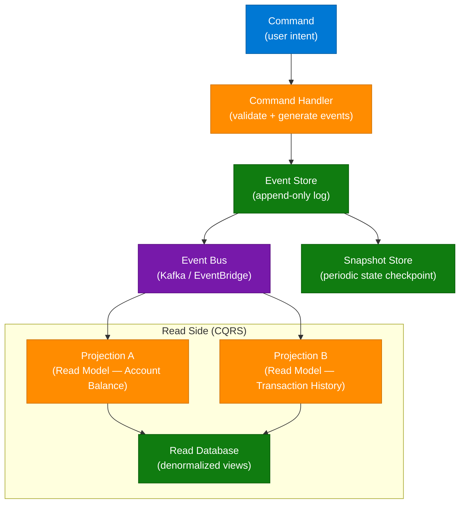
```mermaid
flowchart TD
    command["Command\n(user intent)"]
    commandHandler["Command Handler\n(validate + generate events)"]
    eventStore["Event Store\n(append-only log)"]
    eventBus["Event Bus\n(Kafka / EventBridge)"]

    subgraph readSide["Read Side (CQRS)"]
        projectionA["Projection A\n(Read Model — Account Balance)"]
        projectionB["Projection B\n(Read Model — Transaction History)"]
        readDB["Read Database\n(denormalized views)"]
    end

    snapshot["Snapshot Store\n(periodic state checkpoint)"]

    command --> commandHandler
    commandHandler --> eventStore
    eventStore --> eventBus
    eventBus --> projectionA & projectionB
    projectionA & projectionB --> readDB
    eventStore --> snapshot

    classDef userNode    fill:#0078D4,stroke:#005A9E,color:#fff
    classDef processNode fill:#FF8C00,stroke:#CC7000,color:#fff
    classDef dataNode    fill:#107C10,stroke:#0A5C0A,color:#fff
    classDef aiNode      fill:#7719AA,stroke:#5A0E80,color:#fff
    classDef infraNode   fill:#605E5C,stroke:#3B3A39,color:#fff

    class command userNode
    class commandHandler,projectionA,projectionB processNode
    class eventStore,readDB,snapshot dataNode
    class eventBus aiNode
```

### How It Works

1. A Command arrives (e.g., `PlaceOrder {userId, items, total}`)
2. Command Handler validates business rules; produces one or more Domain Events (e.g., `OrderPlaced`, `InventoryReserved`)
3. Events are appended to the Event Store (immutable; never updated)
4. Event Bus publishes events to subscribers
5. Projections consume events and maintain denormalised read models (e.g., `orders_view` table)
6. To rebuild state: replay events from Event Store from beginning (or from latest snapshot)

### Interview Q&A

| Question | Answer |
|---|---|
| What is the difference between Event Sourcing and a standard event-driven architecture? | Standard event-driven: services publish events but store current state in a mutable DB. Event Sourcing: the event log IS the source of truth — no separate mutable state store needed. |
| What is CQRS and why is it commonly paired with Event Sourcing? | Command Query Responsibility Segregation splits read and write models. Event Sourcing naturally produces an event stream (write side); projections build optimised read models (query side) from that stream. |
| What is an event snapshot and why is it needed? | Replaying the full event history to rebuild state becomes slow as the log grows. A snapshot captures state at a specific event sequence number; replay only processes events after the snapshot. |
| What are the drawbacks of Event Sourcing? | Schema evolution is hard — old events must remain replayable after domain model changes. Eventual consistency in projections. Higher complexity. Not suitable for simple CRUD applications. |
| How do you handle schema changes to past events? | Upcasters: when reading an old event, transform it to the current schema before processing. Maintain versioned event schemas. Never mutate stored events. |

---

## 19. Zero-Downtime Deployments

### Overview

Zero-downtime deployment means releasing new software versions without any period where the service is unavailable to users — not even for milliseconds. Large-scale platforms like Instagram deploy dozens of times per day without users noticing. The key strategies are Blue-Green deployments, Canary releases, and Rolling updates, each with different risk profiles and rollback capabilities.

### Architecture Diagram

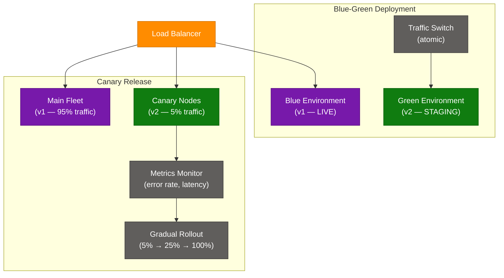
```mermaid
flowchart TD
    lb["Load Balancer"]

    subgraph blueGreen["Blue-Green Deployment"]
        blueEnv["Blue Environment\n(v1 — LIVE)"]
        greenEnv["Green Environment\n(v2 — STAGING)"]
        switchover["Traffic Switch\n(atomic)"]
    end

    subgraph canary["Canary Release"]
        mainFleet["Main Fleet\n(v1 — 95% traffic)"]
        canaryNode["Canary Nodes\n(v2 — 5% traffic)"]
        monitor["Metrics Monitor\n(error rate, latency)"]
        gradualRollout["Gradual Rollout\n(5% → 25% → 100%)"]
    end

    lb --> blueEnv & mainFleet
    lb --> canaryNode
    switchover --> greenEnv
    canaryNode --> monitor
    monitor --> gradualRollout

    classDef userNode    fill:#0078D4,stroke:#005A9E,color:#fff
    classDef processNode fill:#FF8C00,stroke:#CC7000,color:#fff
    classDef dataNode    fill:#107C10,stroke:#0A5C0A,color:#fff
    classDef aiNode      fill:#7719AA,stroke:#5A0E80,color:#fff
    classDef infraNode   fill:#605E5C,stroke:#3B3A39,color:#fff

    class lb processNode
    class blueEnv,mainFleet aiNode
    class greenEnv,canaryNode dataNode
    class switchover,monitor,gradualRollout infraNode
```

### Deployment Strategies

| Strategy | Mechanism | Downtime | Rollback Speed | Resource Cost |
|---|---|---|---|---|
| **Blue-Green** | Run v1 and v2 simultaneously; switch traffic atomically | Zero | Instant (switch back) | 2x infrastructure |
| **Canary** | Route small % to v2; monitor; gradually increase | Zero | Fast (reduce canary %) | ~1.05x infrastructure |
| **Rolling Update** | Replace instances one by one | Near-zero (draining) | Moderate | 1x infrastructure |
| **Feature Flags** | Deploy code dark; enable features via flag | Zero (code always present) | Instant (toggle flag) | 1x infrastructure |

### Interview Q&A

| Question | Answer |
|---|---|
| What is the biggest risk with Blue-Green deployments? | Database schema changes. If v2 requires a different schema, both v1 (blue) and v2 (green) must be able to work with the schema simultaneously during the transition. Use backward-compatible migrations: add columns before removing old ones. |
| How do canary releases work in Kubernetes? | Using two Deployments (v1 and v2) with the same Service selector label. Control traffic split by adjusting replica counts. Alternatively use Argo Rollouts or Flagger with traffic management via Istio. |
| What is a feature flag and why is it safer than a deployment? | A feature flag (LaunchDarkly, custom config) enables or disables a feature at runtime without a new deployment. If the feature causes issues, disable the flag instantly — no deploy cycle needed. |
| How do you handle long-running requests during a rolling update? | Connection draining: the load balancer stops sending new requests to the instance being updated but allows existing requests to complete (configurable drain timeout). |
| What is a database migration best practice for zero-downtime? | Expand-Contract pattern: 1) Add new column (backward compatible), 2) Deploy code that writes to both old and new columns, 3) Backfill old data, 4) Switch reads to new column, 5) Remove old column in a later deploy. |

---

## 20. Caching Strategy — Interview Scenario

### Overview

The interview prompt "Your application takes 5 seconds to load. Where will you add caching?" is a systems thinking question. A structured answer identifies the bottleneck layer first (network, compute, or data), then proposes the appropriate caching layer with specific technologies. The correct answer is layered: CDN for static assets, application-level cache for computed results, and database query cache for expensive queries.

### Caching Layer Decision Tree

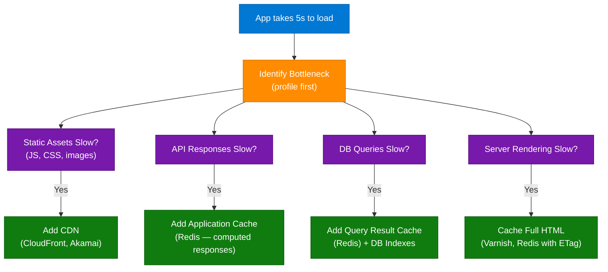
```mermaid
flowchart TD
    slowApp["App takes 5s to load"]
    identify["Identify Bottleneck\n(profile first)"]

    staticAssets["Static Assets Slow?\n(JS, CSS, images)"]
    cdn["Add CDN\n(CloudFront, Akamai)"]

    apiSlow["API Responses Slow?"]
    appCache["Add Application Cache\n(Redis — computed responses)"]

    dbSlow["DB Queries Slow?"]
    queryCache["Add Query Result Cache\n(Redis) + DB Indexes"]

    renderSlow["Server Rendering Slow?"]
    htmlCache["Cache Full HTML\n(Varnish, Redis with ETag)"]

    slowApp --> identify
    identify --> staticAssets -->|Yes| cdn
    identify --> apiSlow -->|Yes| appCache
    identify --> dbSlow -->|Yes| queryCache
    identify --> renderSlow -->|Yes| htmlCache

    classDef userNode    fill:#0078D4,stroke:#005A9E,color:#fff
    classDef processNode fill:#FF8C00,stroke:#CC7000,color:#fff
    classDef dataNode    fill:#107C10,stroke:#0A5C0A,color:#fff
    classDef aiNode      fill:#7719AA,stroke:#5A0E80,color:#fff

    class slowApp userNode
    class identify processNode
    class staticAssets,apiSlow,dbSlow,renderSlow aiNode
    class cdn,appCache,queryCache,htmlCache dataNode
```

### Interview Q&A

| Question | Answer |
|---|---|
| Your app takes 5 seconds to load — where do you add caching? | Profile first. Then layer: 1) CDN for static assets (JS/CSS), 2) Redis for API response caching (expensive computed data), 3) Database query cache for slow queries, 4) Full-page cache (Varnish) for anonymous pages that are identical for all users. |
| How do you decide what TTL to set for a cached item? | Base on data change frequency. Static assets: 1 year (cache-bust via filename hashing). User sessions: session length. Product catalogue: 1–5 minutes. Real-time data (prices, inventory): 0–30 seconds or no cache. |
| What is cache warming and why does it matter? | Pre-populating the cache before going live. Without warming, a cold cache after deployment causes a thundering herd on the DB as all users simultaneously miss the cache. |
| What is a cache aside vs. a cache through pattern in this context? | Cache-aside: app code explicitly handles cache miss by querying DB. Cache-through: the cache layer transparently manages DB reads on miss. Cache-through is simpler for developers but requires caching middleware support. |
| How do you prevent stale data in an API response cache? | Use event-driven invalidation: when the underlying data changes, publish an event that invalidates the relevant cache key. Alternatively, use short TTLs combined with background refresh (stale-while-revalidate). |

---

## 21. Handling Sudden Traffic Spikes in Microservices

### Overview

A sudden traffic spike (e.g., a viral post, flash sale, or news event) can overwhelm microservices that were sized for normal load. The system design answer must address the problem at multiple layers: shedding excess load (rate limiting), distributing it (autoscaling), buffering it (message queues), and isolating failures (Circuit Breakers). No single technique is sufficient alone.

### Architecture Diagram

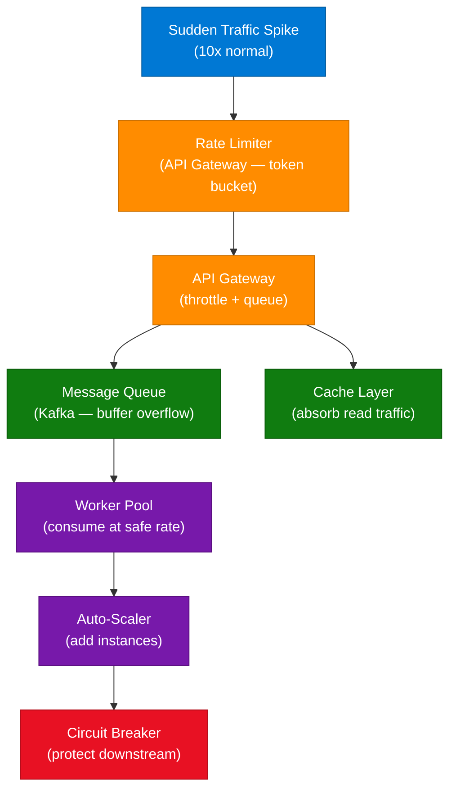
```mermaid
flowchart TD
    trafficSpike["Sudden Traffic Spike\n(10x normal)"]
    rateLimiter["Rate Limiter\n(API Gateway — token bucket)"]
    apiGw["API Gateway\n(throttle + queue)"]
    msgQueue["Message Queue\n(Kafka — buffer overflow)"]
    autoScaler["Auto-Scaler\n(add instances)"]
    circuitBreaker["Circuit Breaker\n(protect downstream)"]
    workerPool["Worker Pool\n(consume at safe rate)"]
    cacheLayer["Cache Layer\n(absorb read traffic)"]

    trafficSpike --> rateLimiter
    rateLimiter --> apiGw
    apiGw --> cacheLayer
    apiGw --> msgQueue
    msgQueue --> workerPool
    workerPool --> autoScaler
    autoScaler --> circuitBreaker

    classDef userNode    fill:#0078D4,stroke:#005A9E,color:#fff
    classDef processNode fill:#FF8C00,stroke:#CC7000,color:#fff
    classDef dataNode    fill:#107C10,stroke:#0A5C0A,color:#fff
    classDef aiNode      fill:#7719AA,stroke:#5A0E80,color:#fff
    classDef errorNode   fill:#E81123,stroke:#B30D1A,color:#fff

    class trafficSpike userNode
    class rateLimiter,apiGw processNode
    class msgQueue,cacheLayer dataNode
    class autoScaler,workerPool aiNode
    class circuitBreaker errorNode
```

### Spike Response Playbook

| Layer | Mechanism | Response Time |
|---|---|---|
| CDN | Absorbs static asset requests | Immediate |
| Cache | Serves cached responses without touching DB | Immediate |
| Rate Limiting | Drops/queues excess requests above threshold | Immediate |
| Horizontal Autoscaling | Adds new instances (Kubernetes HPA, AWS ASG) | 1–5 minutes |
| Message Queue | Buffers requests; workers consume at safe rate | Immediate buffering |
| Circuit Breaker | Prevents spike from cascading to downstream services | Immediate on threshold breach |

### Interview Q&A

| Question | Answer |
|---|---|
| What is the difference between rate limiting and throttling? | Rate limiting caps the number of requests per client per time window (e.g., 100 req/min) and rejects excess with 429. Throttling slows processing down (e.g., sleep between DB queries) to stay within resource limits without rejecting requests. |
| What algorithms are used for rate limiting? | Token Bucket: allows bursts up to bucket size. Sliding Window Counter: precise per-window counting. Fixed Window Counter: simpler but has edge-case burst at window boundary. Leaky Bucket: enforces constant output rate. |
| How does autoscaling help but also fail during a spike? | Autoscaling adds capacity but takes 1–5 minutes to provision new instances. During those minutes, the existing instances are overloaded. Use pre-warmed instance pools or target tracking policies that scale proactively based on predictive metrics. |
| What is load shedding and when is it acceptable? | Intentionally dropping requests (returning 503) when the system would otherwise crash. Acceptable when returning a degraded response or error is better than a total outage. Prioritise critical traffic (payments, auth) over low-priority (analytics, recommendations). |
| How does Kafka help absorb traffic spikes? | Producers write at the spike rate; consumers process at the safe service rate. Kafka's durable log buffers the difference, providing natural backpressure without dropping messages. The consumer lag metric shows how far behind processing is. |

---

## 22. Distributed ID Generation — Snowflake IDs

### Overview

In distributed systems with multiple database shards, auto-increment IDs fail because each shard independently generates integers — leading to ID collisions across shards and requiring a centralised coordination service that becomes a bottleneck. Twitter's Snowflake algorithm solves this by generating 64-bit IDs locally on each node using a combination of timestamp, machine ID, and sequence counter. Snowflake IDs are unique across all nodes, time-sortable, and generated without any network coordination.

### Architecture Diagram

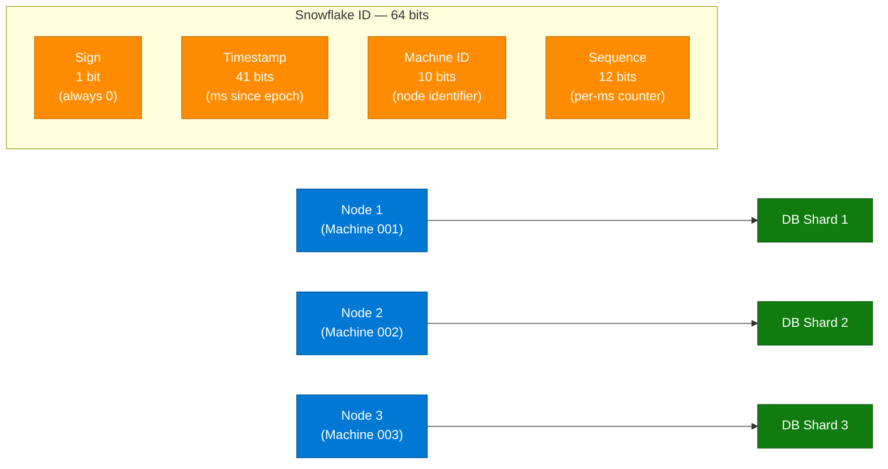
```mermaid
flowchart LR
    subgraph snowflakeId["Snowflake ID — 64 bits"]
        signBit["Sign\n1 bit\n(always 0)"]
        timestamp["Timestamp\n41 bits\n(ms since epoch)"]
        machineId["Machine ID\n10 bits\n(node identifier)"]
        sequence["Sequence\n12 bits\n(per-ms counter)"]
    end

    node1["Node 1\n(Machine 001)"]
    node2["Node 2\n(Machine 002)"]
    node3["Node 3\n(Machine 003)"]
    db1["DB Shard 1"]
    db2["DB Shard 2"]
    db3["DB Shard 3"]

    node1 --> db1
    node2 --> db2
    node3 --> db3

    classDef userNode    fill:#0078D4,stroke:#005A9E,color:#fff
    classDef processNode fill:#FF8C00,stroke:#CC7000,color:#fff
    classDef dataNode    fill:#107C10,stroke:#0A5C0A,color:#fff

    class node1,node2,node3 userNode
    class signBit,timestamp,machineId,sequence processNode
    class db1,db2,db3 dataNode
```

### Snowflake ID Anatomy

| Segment | Bits | Capacity | Purpose |
|---|---|---|---|
| Sign | 1 | Fixed 0 | Ensures positive integer |
| Timestamp | 41 | ~69 years of milliseconds | Time-sortable; encoded as ms since custom epoch |
| Machine ID | 10 | 1,024 unique nodes | Identifies the generating server; prevents cross-node collisions |
| Sequence | 12 | 4,096 IDs per millisecond per node | Handles burst within same millisecond |

**Total throughput per node:** 4,096 IDs/ms = ~4 million IDs/second
**Total cluster throughput (1,024 nodes):** ~4 billion IDs/second

### Code Example

```python
import time
import threading

class SnowflakeIDGenerator:
    EPOCH = 1288834974657  # Twitter epoch (Nov 4, 2010)
    MACHINE_ID_BITS = 10
    SEQUENCE_BITS = 12
    MAX_MACHINE_ID = (1 << MACHINE_ID_BITS) - 1  # 1023
    MAX_SEQUENCE = (1 << SEQUENCE_BITS) - 1       # 4095

    def __init__(self, machine_id: int):
        if machine_id > self.MAX_MACHINE_ID:
            raise ValueError("Machine ID out of range")
        self.machine_id = machine_id
        self.sequence = 0
        self.last_timestamp = -1
        self._lock = threading.Lock()

    def _current_ms(self) -> int:
        return int(time.time() * 1000)

    def generate(self) -> int:
        with self._lock:
            ts = self._current_ms()
            if ts == self.last_timestamp:
                self.sequence = (self.sequence + 1) & self.MAX_SEQUENCE
                if self.sequence == 0:
                    while ts <= self.last_timestamp:
                        ts = self._current_ms()
            else:
                self.sequence = 0
            self.last_timestamp = ts
            return (
                ((ts - self.EPOCH) << (self.MACHINE_ID_BITS + self.SEQUENCE_BITS))
                | (self.machine_id << self.SEQUENCE_BITS)
                | self.sequence
            )

gen = SnowflakeIDGenerator(machine_id=42)
print(gen.generate())  # e.g., 7346958473628672
```

### Interview Q&A

| Question | Answer |
|---|---|
| Why is the timestamp placed first in the bit layout? | Because IDs are compared numerically, placing the timestamp in the most significant bits makes IDs naturally time-sortable — newer IDs are always larger, which improves B-Tree index locality in databases. |
| What happens if the system clock goes backward (clock skew)? | The generator must wait until the clock catches up to the last recorded timestamp before issuing new IDs. If the skew is large, the generator throws an exception and requires manual intervention or NTP correction. |
| How do you assign Machine IDs in a dynamic environment (Kubernetes)? | Options: 1) Assign via environment variable at pod startup from a coordination service (ZooKeeper), 2) Use the pod's IP last-octet, 3) Use a central ID registry that leases IDs to pods. |
| What is the maximum throughput of a single Snowflake generator? | 4,096 unique IDs per millisecond = ~4 million IDs per second per node. With 1,024 nodes, ~4 billion IDs per second cluster-wide. |
| What alternatives to Snowflake IDs exist? | UUID v4 (random, not sortable, 128 bits), ULID (sortable UUID alternative), NanoID (URL-safe), database sequences with partitioning (still requires coordination). |

---

## 23. Designing a Centralized Logging System

### Overview

A centralised logging system aggregates log data from every microservice, container, and infrastructure component into a single queryable store. Without it, debugging a production issue requires SSH-ing into individual servers and grepping logs — impossible at scale. The reference architecture (ELK Stack or similar) uses a log shipper on each host, a message broker for buffering, a processing layer for enrichment, and a storage+query layer for analysis.

### Architecture Diagram

```mermaid
flowchart LR
    svcA["Microservice A\n(JSON logs)"]
    svcB["Microservice B\n(JSON logs)"]
    svcC["Microservice C\n(JSON logs)"]
    shipper["Log Shipper\n(Filebeat / Fluentd)"]
    broker["Message Broker\n(Kafka)"]
    processor["Log Processor\n(Logstash / Flink)"]
    indexStore["Index Store\n(Elasticsearch)"]
    dashboard["Dashboard\n(Kibana / Grafana)"]
    alerting["Alerting\n(PagerDuty / OpsGenie)"]

    svcA & svcB & svcC --> shipper
    shipper --> broker
    broker --> processor
    processor --> indexStore
    indexStore --> dashboard
    indexStore --> alerting

    classDef userNode    fill:#0078D4,stroke:#005A9E,color:#fff
    classDef aiNode      fill:#7719AA,stroke:#5A0E80,color:#fff
    classDef dataNode    fill:#107C10,stroke:#0A5C0A,color:#fff
    classDef processNode fill:#FF8C00,stroke:#CC7000,color:#fff
    classDef outputNode  fill:#00B294,stroke:#007D68,color:#fff

    class svcA,svcB,svcC userNode
    class shipper processNode
    class broker aiNode
    class processor,indexStore dataNode
    class dashboard,alerting outputNode
```

### Component Breakdown

| Component | Role | Technology Options |
|---|---|---|
| Log Shipper | Tail log files/streams; forward to broker | Filebeat, Fluentd, Vector |
| Message Broker | Decouple shippers from storage; handle bursts | Kafka, Kinesis, Pub/Sub |
| Processor | Parse, enrich, filter, transform logs | Logstash, Flink, Lambda |
| Index Store | Full-text search + structured queries | Elasticsearch, OpenSearch |
| Dashboard | Query, visualise, alert on log data | Kibana, Grafana, CloudWatch |
| Alerting | Notify on error rate, anomaly detection | PagerDuty, OpsGenie, Alertmanager |

### Interview Q&A

| Question | Answer |
|---|---|
| Why insert Kafka between the log shipper and Elasticsearch? | Kafka buffers log volume spikes. If Elasticsearch is slow or undergoing maintenance, shippers continue writing to Kafka — no logs are dropped. Kafka also enables multiple consumers (archiving to S3, real-time alerting, Elasticsearch indexing) from the same log stream. |
| How do you ensure logs from different services are correlated? | Standardise on structured JSON logs with a `correlation_id` field. All services use a shared logging library that auto-injects the correlation ID from request context. |
| What is log sampling and when is it appropriate? | Retaining only a percentage of log events (e.g., 10% of INFO logs) to reduce storage cost. Appropriate for high-volume, low-value logs. Never sample ERROR or WARN logs. |
| How do you handle PII in logs? | Use a log processor (Logstash filter) to mask or hash PII fields (email, phone, credit card) before writing to the index store. Define a logging policy that prohibits logging raw PII. |
| What is the difference between logs, metrics, and traces? | Logs: timestamped text events (what happened). Metrics: numeric measurements over time (how many, how fast, how full). Traces: request journey across services (which path was taken, where was the latency). The three together form the Observability pillar. |

---

## 24. Logging Strategy — Request/Response Logging

### Overview

The interview prompt "How would you implement logging of every request and response in your application?" tests knowledge of middleware patterns, async I/O, and the performance implications of synchronous logging. The key insight is that logging must not add latency to the request path — all writes to the logging backend must be asynchronous and buffered.

### Architecture Diagram

```mermaid
sequenceDiagram
    participant client as Client
    participant middleware as Logging Middleware
    participant app as Application Handler
    participant asyncLog as Async Log Buffer
    participant logBackend as Log Backend (Kafka/ELK)

    client->>middleware: HTTP Request
    middleware->>middleware: Record start time + correlation_id
    middleware->>app: Forward request
    app-->>middleware: Response
    middleware->>middleware: Compute latency
    middleware-)asyncLog: Non-blocking write (request + response + latency)
    middleware-->>client: Return response (no wait for log)
    asyncLog-)logBackend: Batch flush
```

### Implementation Pattern

```python
import time
import uuid
import asyncio
import logging
from fastapi import FastAPI, Request, Response
from starlette.middleware.base import BaseHTTPMiddleware

app = FastAPI()

# Async queue for non-blocking log writes
log_queue: asyncio.Queue = asyncio.Queue(maxsize=10000)

class RequestResponseLogger(BaseHTTPMiddleware):
    async def dispatch(self, request: Request, call_next) -> Response:
        correlation_id = request.headers.get("X-Correlation-ID", str(uuid.uuid4()))
        start_time = time.perf_counter()

        body_bytes = await request.body()
        # Reassemble request body for downstream handlers
        async def receive():
            return {"type": "http.request", "body": body_bytes}
        request._receive = receive

        response = await call_next(request)
        latency_ms = (time.perf_counter() - start_time) * 1000

        # Non-blocking enqueue — never awaits the actual write
        log_entry = {
            "correlation_id": correlation_id,
            "method": request.method,
            "path": str(request.url.path),
            "status": response.status_code,
            "latency_ms": round(latency_ms, 2),
        }
        try:
            log_queue.put_nowait(log_entry)
        except asyncio.QueueFull:
            pass  # drop log rather than slow down request

        response.headers["X-Correlation-ID"] = correlation_id
        return response

app.add_middleware(RequestResponseLogger)

async def log_consumer():
    while True:
        entry = await log_queue.get()
        logging.info(entry)  # or send to Kafka/ELK
        log_queue.task_done()
```

### Interview Q&A

| Question | Answer |
|---|---|
| Why should request/response logging be asynchronous? | Synchronous logging blocks the request thread waiting for disk I/O or network writes. At scale (10K req/s), a 5ms log write adds 5ms to every request's latency and halves throughput. |
| What is structured logging and why is it preferred over string logs? | Structured logging emits machine-parseable JSON (or similar) instead of free-form text. Fields like `status`, `latency_ms`, and `correlation_id` can be indexed and queried directly in Elasticsearch or CloudWatch without regex parsing. |
| How do you log response bodies without OOM? | Truncate response bodies beyond a configurable limit (e.g., 4KB). For binary bodies (file downloads, images), log only metadata (content-type, size). Never log streaming response bodies in-memory. |
| What log levels should you use for request/response logs? | INFO for successful requests (2xx, 3xx). WARN for client errors (4xx). ERROR for server errors (5xx) with full stack trace. DEBUG for request/response bodies (never in production). |
| How do you prevent logging from becoming a compliance risk? | Define a PII policy in the logging middleware: always strip/mask Authorization headers, Cookie values, passwords in request bodies, and personal data fields before writing to the log buffer. |

---

## 25. Interview Q&A Cheatsheet

Consolidated high-priority questions from all 24 concepts above.

---

**Q: What is the difference between cache-aside and read-through caching?**
> In cache-aside, the application manages cache population — on a miss, the app queries the DB and populates the cache. In read-through, the cache layer itself fetches from the DB transparently. Cache-aside gives more control; read-through simplifies application code.

---

**Q: How does the Circuit Breaker Pattern prevent cascading failures?**
> It detects when a downstream service's error rate exceeds a threshold and immediately stops sending requests to it (Open state), returning a fast-fail or fallback instead. This frees the calling service's threads and prevents the failure from propagating upward through the call chain.

---

**Q: What does PACELC add to CAP Theorem?**
> CAP only addresses the Partition scenario. PACELC adds the Else case: even during normal operation (no partition), distributed systems must trade off Latency against Consistency. This makes PACELC more useful for classifying real databases like DynamoDB (PA/EL) vs. Zookeeper (PC/EC).

---

**Q: How does a Snowflake ID guarantee uniqueness without coordination?**
> By combining a millisecond timestamp (41 bits), a machine ID (10 bits assigned at startup), and a per-millisecond sequence counter (12 bits). No two nodes share the same machine ID, and the sequence prevents collisions within the same millisecond on the same node.

---

**Q: What is the Saga pattern and when do you use it?**
> Saga breaks a distributed transaction into a sequence of local DB transactions, each with a compensating action that undoes it on failure. Used when multiple microservices must participate in a single business operation (e.g., order placement spanning Order, Inventory, and Payment services) and 2-Phase Commit is unacceptable due to its coupling and bottleneck characteristics.

---

**Q: How do you invalidate a JWT after logout?**
> Store the JWT's unique `jti` claim in a Redis denylist with a TTL equal to the token's remaining validity. On every authenticated request, check Redis for the `jti`. Alternatively, use short-lived access tokens (5 min) paired with server-side revocable refresh tokens.

---

**Q: Why is LMAX Disruptor faster than BlockingQueue?**
> Three reasons: (1) it uses CAS atomic operations instead of locks — no thread blocking; (2) it preallocates all ring buffer memory at startup — zero GC pressure during operation; (3) contiguous memory layout maximises CPU cache efficiency. Combined, these eliminate the three primary latency sources in concurrent systems.

---

**Q: What is the difference between Event Sourcing and CQRS?**
> Event Sourcing is a persistence strategy: state is derived from replaying an append-only event log. CQRS is an architectural pattern: read and write models are separate. They are complementary — Event Sourcing naturally produces the event stream that CQRS projections consume to build denormalised read models, but each can be used independently.

---

**Q: How does fan-out on write differ from fan-out on read for social feeds?**
> Fan-out on write: when a user posts, proactively push the post ID to all followers' feed caches (reads are O(1)). Fan-out on read: compute the feed at read time from all followed accounts (writes are cheap; reads are O(followers × posts)). Instagram uses a hybrid: push for regular users, pull for celebrity accounts with 100M+ followers.

---

**Q: What is the Cuckoo Filter's advantage over a Bloom Filter?**
> Cuckoo filters support deletion — each element stores a compact fingerprint in one of two candidate buckets, so a specific fingerprint can be removed without affecting others. Bloom filters use a shared bit array where clearing a bit for one element corrupts membership data for others that share that bit.

---

**Q: When would you use optimistic locking vs. pessimistic locking?**
> Optimistic locking when contention is low — most reads succeed without conflict, so there's no benefit to paying the lock acquisition cost upfront. Pessimistic locking when contention is high or the cost of a retry is unacceptable (e.g., financial transfers where a failed-retry means re-running a complex workflow).

---

**Q: What are the three pillars of observability?**
> Logs (what happened — timestamped event records), Metrics (how the system is performing — numeric measurements over time like request rate, error rate, latency), and Traces (how a request flowed — distributed span trees across services). Together they enable root cause analysis of any production issue.

---

*Extracted from Gemini shared session (25 Facebook Reels) · July 11, 2026 · GeminiShareToMD Agent v1.0*

---

```
═══════════════════════════════════════════════════════════
Token Usage Report
═══════════════════════════════════════════════════════════
Estimated without optimization (raw Gemini text):  ~12,400 tokens
Actual enriched output:                            ~11,800 tokens
Source enrichment:                                 3-5x (content derived from 49,632-char session)
Techniques applied:
  • Stripped UI chrome (PDF export, share metadata, footer links)
  • Merged duplicate turns 13→12 (Request Tracing) and 23→22 (Snowflake IDs)
  • Expanded all 24 unique concepts with Mermaid diagrams, code examples, Q&A tables
  • Added structured comparison tables absent from source
  • Consolidated 12-item Q&A cheatsheet from all sections
═══════════════════════════════════════════════════════════
* Estimates: prose chars ÷ 4, code chars ÷ 3. Actual API usage varies by model.
```
