# System Design & Distributed Patterns — Multi-Topic Reference

> **Source:** [share.gemini.google/QvnSW0NCuYj8](https://share.gemini.google/QvnSW0NCuYj8) → redirects to [gemini.google.com/share/b2628cd80396](https://gemini.google.com/share/b2628cd80396)
> **Model:** Gemini 3.1 Flash-Lite
> **Session Date:** July 9, 2026 at 10:20 AM
> **Saved:** July 11, 2026

---

## Table of Contents

1. [Session Overview](#1-session-overview)
2. [Top 6 Caching Strategies](#2-top-6-caching-strategies)
3. [Truecaller Mechanism — Sub-500ms Lookup](#3-truecaller-mechanism--sub-500ms-lookup)
4. [12 Essential System Design Concepts](#4-12-essential-system-design-concepts)
5. [Optimistic vs. Pessimistic Locking](#5-optimistic-vs-pessimistic-locking)
6. [LMAX Disruptor — Lock-Free Ring Buffer](#6-lmax-disruptor--lock-free-ring-buffer)
7. [Synchronous vs. Asynchronous Communication](#7-synchronous-vs-asynchronous-communication)
8. [Cuckoo Filters](#8-cuckoo-filters)
9. [Distributed Tracing & Request Tracing](#9-distributed-tracing--request-tracing)
10. [PACELC Theorem](#10-pacelc-theorem)
11. [Instagram Feed — Fan-Out Push Model](#11-instagram-feed--fan-out-push-model)
12. [Circuit Breaker Pattern](#12-circuit-breaker-pattern)
13. [JWT Logout — Token Blacklisting](#13-jwt-logout--token-blacklisting)
14. [Saga Pattern — Microservice Transaction Failures](#14-saga-pattern--microservice-transaction-failures)
15. [Concurrency vs. Parallelism vs. Async](#15-concurrency-vs-parallelism-vs-async)
16. [Event Sourcing Pattern](#16-event-sourcing-pattern)
17. [Zero-Downtime Deployments](#17-zero-downtime-deployments)
18. [Caching Layers in System Design](#18-caching-layers-in-system-design)
19. [Handling Traffic Spikes in Microservices](#19-handling-traffic-spikes-in-microservices)
20. [Snowflake IDs — Distributed ID Generation](#20-snowflake-ids--distributed-id-generation)
21. [Centralized Logging System](#21-centralized-logging-system)
22. [Logging via Middleware / Interceptors](#22-logging-via-middleware--interceptors)
23. [Interview Q&A Cheatsheet](#23-interview-qa-cheatsheet)

---

## 1. Session Overview

This session captures 25 conversation turns from a Gemini session in which Facebook Reels and Posts from creators (Packetory, BlackCask, Codewithsushant, KodeKloud, MyLecture, and others) were fed into Gemini for transcript extraction and learning content generation. The session spans 22 unique system design topics ranging from caching and distributed tracing to the LMAX Disruptor and the PACELC theorem. Two turns covered duplicate Snowflake IDs content (turns 22 & 23) and two turns covered Request Tracing (turns 11 & 13) — these have been merged. One turn (turn 12) provided a quick-reference overview of backend interview concepts.

### Session Map

| Turn | Topic | Source | Status |
|---|---|---|---|
| 1 | Top 6 Caching Strategies | Ross Lara (Facebook Reel) | ✅ Extracted |
| 2 | Truecaller DB Engineering | The Raw Journey (Facebook Reel) | ✅ Extracted |
| 3 | 12 System Design Concepts | David Mráz (Facebook Reel) | ✅ Extracted |
| 4 | Optimistic vs. Pessimistic Locking | Packetory (Facebook Reel) | ✅ Extracted |
| 5 | LMAX Disruptor | Packetory (Facebook Reel) | ✅ Extracted |
| 6 | Sync vs. Async Communication | MyLecture (Facebook Reel) | ✅ Extracted |
| 7 | Cuckoo Filters | Packetory (Facebook Reel) | ✅ Extracted |
| 8 | Distributed Tracing | Packetory (Facebook Reel) | ✅ Extracted |
| 9 | PACELC Theorem | Packetory (Facebook Reel) | ✅ Extracted |
| 10 | Instagram Feed Speed | Bhavesh Vaswani (Facebook Reel) | ✅ Extracted |
| 11 | Request Tracing — Part 1 | Codewithsushant (Facebook Reel) | ✅ Merged with Turn 13 |
| 12 | Backend Interview Concepts (overview) | GeeksforGeeks (Facebook Reel) | ✅ Extracted |
| 13 | Request Tracing — Part 2 | Codewithsushant (Facebook Reel) | ✅ Merged with Turn 11 |
| 14 | Circuit Breaker Pattern | Darpan Sharma (Facebook Reel) | ✅ Extracted |
| 15 | JWT Logout / Token Blacklisting | Codewithsushant (Facebook Reel) | ✅ Extracted |
| 16 | Microservice Transaction Failures | BlackCask (Facebook Reel) | ✅ Extracted |
| 17 | Concurrency vs. Parallelism vs. Async | BlackCask (Facebook Reel) | ✅ Extracted |
| 18 | Event Sourcing Pattern | Codewithsushant (Facebook Post) | ✅ Extracted |
| 19 | Zero-Downtime Deployments | Ecogrowthpath (Facebook Reel) | ✅ Extracted |
| 20 | Caching Layers in System Design | Quick2knowledge (Facebook Reel) | ✅ Extracted |
| 21 | Traffic Spikes in Microservices | BlackCask (Facebook Reel) | ✅ Extracted |
| 22 | Snowflake IDs — Part 1 | Packetory (Facebook Reel) | ✅ Merged with Turn 23 |
| 23 | Snowflake IDs — Part 2 (duplicate) | Packetory (Facebook Reel) | ✅ Merged with Turn 22 |
| 24 | Centralized Logging System (ELK) | KodeKloud (Facebook Reel) | ✅ Extracted |
| 25 | Logging via Middleware | BlackCask (Facebook Reel) | ✅ Extracted |

---

## 2. Top 6 Caching Strategies

### Overview

Caching strategies define **when and how** data is moved between the primary data store (database) and the cache layer. Choosing the wrong strategy leads to stale data, cache stampedes, or high miss rates. The six strategies below cover every read/write pattern encountered in production systems, from simple look-aside to write-through pipelines.

**Source:** Facebook Reel by Ross Lara

### Architecture Diagram

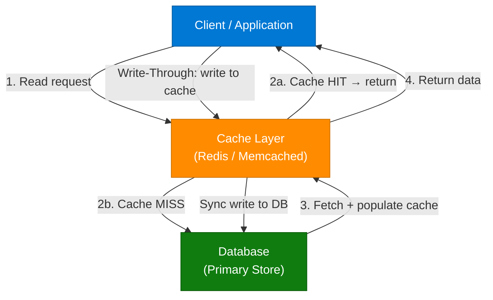

### The 6 Strategies

| # | Strategy | Who fills the cache? | Write path | Best for |
|---|---|---|---|---|
| 1 | **Cache-Aside** | Application (on miss) | App writes DB; cache populated on next read | General read-heavy workloads |
| 2 | **Read-Through** | Cache library (on miss) | Cache fetches from DB automatically | Simplifies app code; high read ratio |
| 3 | **Refresh-Ahead** | Cache proactively | Background refresh before TTL expires | Predictable access patterns (e.g., news feeds) |
| 4 | **Write-Through** | App writes cache + DB synchronously | Cache → DB synchronously | Strong consistency required |
| 5 | **Write-Around** | Not cached on write | Direct DB write; cache on next read | Write-heavy, rarely re-read data (logs) |
| 6 | **Write-Back (Write-Behind)** | App writes cache first | Cache flushes to DB asynchronously | Ultra-low write latency; risk of data loss on crash |

### How It Works — Cache-Aside (Most Common)

1. Application receives read request.
2. Check cache — **HIT**: return immediately.
3. **MISS**: query database, store result in cache with TTL.
4. Return data to caller.
5. On write: invalidate or update cache entry, write DB directly.

### Code Example

```python
import redis, json

r = redis.Redis(host="localhost", port=6379, decode_responses=True)

def get_user(user_id: str) -> dict:
    cached = r.get(f"user:{user_id}")
    if cached:
        return json.loads(cached)
    user = db.query("SELECT * FROM users WHERE id = %s", user_id)
    r.setex(f"user:{user_id}", 300, json.dumps(user))  # TTL = 5 min
    return user

def update_user(user_id: str, data: dict):
    db.execute("UPDATE users SET ... WHERE id = %s", user_id)
    r.delete(f"user:{user_id}")  # Invalidate cache
```

### Interview Q&A

| Question | Answer |
|---|---|
| What is the difference between Cache-Aside and Read-Through? | Cache-Aside: app manages cache population on miss. Read-Through: cache library auto-fetches from DB on miss — app only talks to cache. |
| When would you use Write-Back over Write-Through? | Write-Back when ultra-low write latency is critical (e.g., gaming leaderboards); accepts risk of data loss if cache crashes before flush. |
| What is a cache stampede and how do you prevent it? | Multiple requests miss simultaneously and all hammer the DB. Prevent with mutex/locking on first miss, probabilistic early expiry, or background refresh. |
| What TTL strategy is best for user session data? | Short TTL (15–30 min) with sliding expiry on each access; invalidate explicitly on logout. |
| How does Refresh-Ahead differ from Read-Through? | Refresh-Ahead proactively pre-fetches before TTL expires; Read-Through only fetches after a miss. Refresh-Ahead eliminates latency spikes for hot data. |

---

## 3. Truecaller Mechanism — Sub-500ms Lookup

### Overview

Truecaller identifies billions of phone numbers in under 500 ms without requiring the caller's number to be in the user's contact list. This is a classic system design interview question testing knowledge of in-memory databases, data partitioning, and probabilistic data structures. The architecture relies on pre-computed global phone-to-name mappings stored in sharded in-memory stores with a Bloom Filter front gate to avoid unnecessary lookups.

**Source:** Facebook Reel by The Raw Journey

**Interview Prompt:** *"How does Truecaller know exactly who is calling you, even if you never saved their number? Billions of phone numbers. Less than 0.5 seconds to search."*

### Architecture Diagram

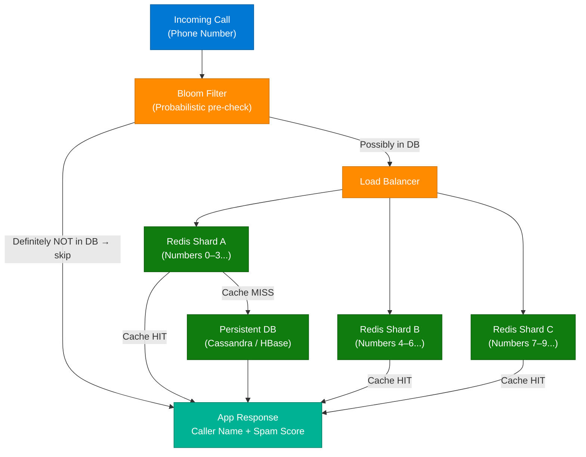

### Key Techniques

| Technique | Role |
|---|---|
| **Bloom Filter** | Eliminates definite misses before hitting any store; false positives acceptable |
| **Redis Sharding** | Phone number range → consistent shard; O(1) lookup per shard |
| **Pre-computed mappings** | User-uploaded contacts crowd-sourced into a global phonebook at registration |
| **Columnar storage** | HBase / Cassandra for durable persistence behind the cache |
| **Spam scoring** | Crowd-sourced spam reports aggregated and stored alongside the name |

### Interview Q&A

| Question | Answer |
|---|---|
| How does Truecaller handle 10B+ phone numbers in memory? | Consistent hash-based sharding across a Redis cluster; only hot numbers stay in RAM, rest fetched from Cassandra on miss. |
| Why use a Bloom Filter here? | To instantly reject lookups for numbers not in the system without a DB call — reduces load by ~40–60% for unknown numbers. |
| What privacy concerns exist in Truecaller's model? | Contacts are uploaded without explicit per-contact consent; GDPR compliance requires opt-out mechanisms and data deletion APIs. |
| How is the name determined when multiple users saved different names for the same number? | Majority-vote consensus across all contact uploads; most frequent name wins. |
| How do you handle read consistency during number updates? | Write-invalidate pattern: update DB → delete Redis key → next read repopulates from DB. |

---

## 4. 12 Essential System Design Concepts

### Overview

A quick-reference dashboard of 12 foundational system design concepts every backend architect must know. These form the vocabulary of system design interviews and map directly to architectural decisions in production distributed systems.

**Source:** Facebook Reel by David Mráz

### Concept Reference Table

| # | Concept | One-line Definition | Key Technology |
|---|---|---|---|
| 1 | **Load Balancing** | Distributes requests across servers to prevent overload | NGINX, HAProxy, AWS ALB |
| 2 | **Cache Layer** | In-memory store between client and DB; hits skip the database | Redis, Memcached |
| 3 | **Mono vs. Micro** | One deployable unit vs. independent services over network | Spring Boot, .NET, Docker |
| 4 | **Message Bus** | Pub/sub channel decoupling producers from consumers | Kafka, RabbitMQ, Azure Service Bus |
| 5 | **CAP Theorem** | Consistency, Availability, and Partition Tolerance — pick 2 | Theoretical framework |
| 6 | **API Gateway** | Single entry point routing requests to backend services | Kong, AWS API GW, NGINX |
| 7 | **Circuit Breaker** | Stops cascading failures by cutting calls when errors spike | Resilience4j, Polly, Hystrix |
| 8 | **Service Discovery** | Services register with registry; clients query to find addresses | Consul, Eureka, K8s DNS |
| 9 | **DB Sharding** | Splits data across multiple databases by shard key for horizontal scale | Vitess, Citus, manual sharding |
| 10 | **Rate Limiting** | Throttles requests to protect backend from abuse/overload | Token Bucket, Sliding Window |
| 11 | **Event-Driven** | Services communicate via events instead of direct calls | Kafka, EventBridge, SNS |
| 12 | **Observability** | Metrics, logs, and traces to understand system behavior | Prometheus, Grafana, Jaeger |

### Architecture Diagram — System Design Dashboard

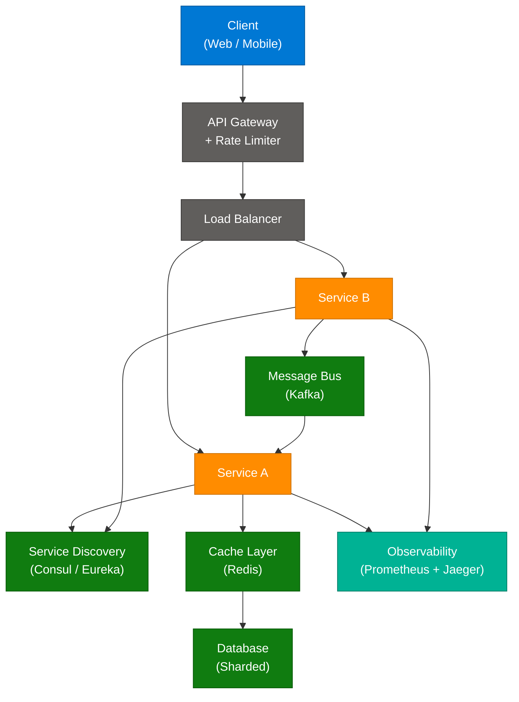

---

## 5. Optimistic vs. Pessimistic Locking

### Overview

Concurrency control is critical when multiple users update the same record simultaneously. Optimistic locking assumes conflicts are rare and checks at commit time; pessimistic locking assumes conflicts are frequent and locks the record upfront. The choice directly impacts throughput, latency, and user experience under contention.

**Source:** Facebook Reel by Packetory

### Architecture Diagram

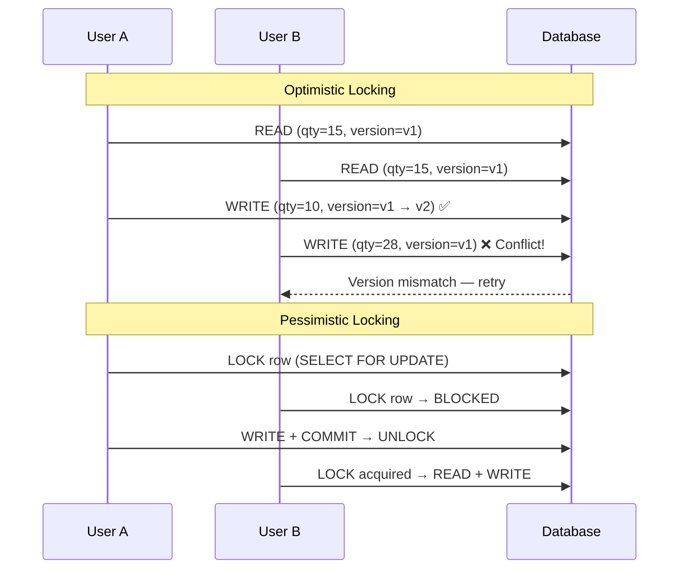

### Comparison Table

| Dimension | Optimistic Locking | Pessimistic Locking |
|---|---|---|
| **Assumption** | Conflicts are rare | Conflicts are frequent |
| **Mechanism** | Version number / timestamp check at write | Database row lock (SELECT FOR UPDATE) |
| **Throughput** | High — no blocking on reads | Lower — readers blocked by writers |
| **Conflict handling** | Retry on version mismatch | Wait for lock release |
| **Deadlock risk** | None | Yes — if lock order not managed |
| **Use case** | Read-heavy, low-contention (e-commerce browsing) | Write-heavy, high-contention (bank transfers) |
| **DB support** | Application-level version column | Native DB locking (Postgres, MySQL) |

### Code Example

```python
# Optimistic locking with version column
def update_inventory(product_id: int, new_qty: int, current_version: int):
    rows_affected = db.execute(
        "UPDATE inventory SET qty = %s, version = version + 1 "
        "WHERE id = %s AND version = %s",
        (new_qty, product_id, current_version)
    )
    if rows_affected == 0:
        raise ConflictError("Version mismatch — retry")

# Pessimistic locking
def transfer_funds(from_id: int, to_id: int, amount: float):
    with db.transaction():
        db.execute("SELECT * FROM accounts WHERE id = %s FOR UPDATE", from_id)
        db.execute("SELECT * FROM accounts WHERE id = %s FOR UPDATE", to_id)
        db.execute("UPDATE accounts SET balance = balance - %s WHERE id = %s", amount, from_id)
        db.execute("UPDATE accounts SET balance = balance + %s WHERE id = %s", amount, to_id)
```

### Interview Q&A

| Question | Answer |
|---|---|
| When would you choose optimistic over pessimistic locking? | Optimistic when reads far outnumber writes and conflicts are rare (e.g., product catalog). Pessimistic when writes are frequent and data integrity is non-negotiable (banking). |
| How does a version number prevent lost updates? | The UPDATE WHERE version = current_version clause ensures only one writer succeeds; all others receive 0 rows_affected and must retry. |
| What is a "lost update" problem? | Two users read the same value, both modify it, and one overwrites the other's change — net effect: one update is silently lost. |
| Can you implement optimistic locking without a version column? | Yes — use a timestamp column. But timestamps have millisecond precision collisions; version integers are safer. |
| How does JPA/Hibernate handle optimistic locking? | The `@Version` annotation on an entity field; Hibernate generates version-checked UPDATEs automatically. |

---

## 6. LMAX Disruptor — Lock-Free Ring Buffer

### Overview

The LMAX Disruptor is a high-performance inter-thread messaging library designed to replace traditional blocking queues. It powers LMAX Exchange's trading system and achieves millions of operations per second by using a pre-allocated ring buffer with lock-free coordination via memory barriers and atomic Compare-And-Swap (CAS) operations. It eliminates garbage collection pressure through object preallocation and maximizes CPU cache efficiency through contiguous memory layout.

**Source:** Facebook Reel by Packetory

### Architecture Diagram

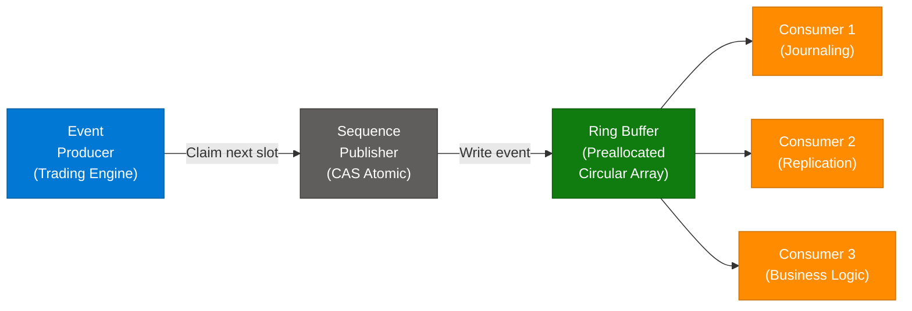

### Why It's Fast — Key Principles

| Principle | Detail |
|---|---|
| **Preallocation** | Ring buffer slots allocated at startup; zero GC pressure during operation |
| **Lock-Free** | CAS atomic operations replace synchronized/mutex; no OS context switches |
| **Cache Friendly** | Contiguous memory array maximizes L1/L2/L3 CPU cache hit rate |
| **Mechanical Sympathy** | Designed around how modern CPUs actually work (cache lines, memory barriers) |
| **Single Writer Principle** | Only one producer writes to each slot; eliminates write contention |

### Interview Q&A

| Question | Answer |
|---|---|
| What problem does the LMAX Disruptor solve? | Traditional BlockingQueue uses locks causing contention, GC pressure, and cache misses. Disruptor eliminates all three with a preallocated ring buffer and CAS-based sequencing. |
| What is a Ring Buffer? | A fixed-size circular array where old slots are overwritten once all consumers have processed them. Index wraps via modulo: `index = sequence & (size - 1)`. |
| How does the Disruptor prevent a producer from overwriting unread data? | A sequence barrier tracks the minimum consumer sequence; producer can only advance if it won't lap the slowest consumer. |
| What is "mechanical sympathy"? | Writing software to match the underlying hardware's behavior — exploiting CPU caches, branch predictors, and memory models for maximum throughput. |
| When would you NOT use the Disruptor? | When you need cross-process or cross-machine messaging (Kafka is better); Disruptor is purely intra-JVM. |

---

## 7. Synchronous vs. Asynchronous Communication

### Overview

The choice between synchronous and asynchronous communication is one of the most consequential architectural decisions in microservices design. Synchronous coupling chains failure — if any downstream service is slow, the caller blocks. Asynchronous decoupling via message queues allows services to operate independently, enabling fault isolation, backpressure handling, and elastic scaling.

**Source:** Facebook Reel by MyLecture — "The Coffee Shop Nightmare"

### Architecture Diagram

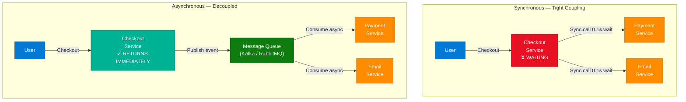

### Comparison Table

| Dimension | Synchronous | Asynchronous |
|---|---|---|
| **Coupling** | Tight — caller blocks until response | Loose — fire and forget |
| **Latency** | Additive (sum of all downstream latencies) | Checkout returns immediately |
| **Fault isolation** | Failure cascades to caller | Producer unaffected by consumer failure |
| **Throughput** | Limited by slowest dependency | Can burst; queue absorbs spikes |
| **Complexity** | Simple request-response | Requires message broker, idempotency, dead-letter handling |
| **Use when** | Real-time response required (e.g., auth, payment confirmation) | Non-critical side effects (email, notifications, analytics) |

### Interview Q&A

| Question | Answer |
|---|---|
| When is synchronous communication the right choice? | When the caller needs the result to proceed — e.g., payment authorization, inventory check before order confirmation. |
| What is the risk of full async architectures? | Eventual consistency: downstream services may lag; compensating for partial failures requires saga patterns and dead-letter queues. |
| How does Kafka differ from RabbitMQ for async communication? | Kafka is a durable, replayable log (event streaming); RabbitMQ is a traditional message broker with push delivery. Kafka suits high-volume event sourcing; RabbitMQ suits task queues with complex routing. |
| What is the "Checkout Service Nightmare" pattern? | Checkout blocks waiting for Payment + Email sequentially; 0.1s each = 0.2s minimum; any downstream spike multiplies user-facing latency. |

---

## 8. Cuckoo Filters

### Overview

Cuckoo Filters are a probabilistic data structure that improves on Bloom Filters by supporting **deletion** of elements while maintaining comparable space efficiency and false positive rates. They use cuckoo hashing — when a fingerprint cannot be inserted into its primary bucket, it "kicks out" the existing occupant, which must then move to its alternate bucket. This mechanism enables O(1) lookup, insertion, and deletion with a configurable false positive rate.

**Source:** Facebook Reel by Packetory

### Architecture Diagram

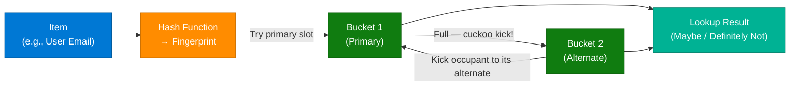

### Bloom Filter vs. Cuckoo Filter

| Feature | Bloom Filter | Cuckoo Filter |
|---|---|---|
| **Deletion** | ❌ Not supported | ✅ Supported |
| **False positives** | Yes (configurable) | Yes (configurable) |
| **False negatives** | Never | Never |
| **Lookup** | O(k) hash functions | O(1) — 2 bucket checks |
| **Space efficiency** | ~1.44× at optimal FPR | ~1.05× bits per item |
| **Counting** | Needs Counting Bloom Filter | Native counting variant exists |
| **Best for** | Set membership (no deletion) | Cache eviction, deduplication with deletions |

### Interview Q&A

| Question | Answer |
|---|---|
| Why can't you delete from a standard Bloom Filter? | Bits are shared across multiple items via independent hash functions; clearing a bit for one item may unset a bit needed by another item. |
| What is a "fingerprint" in a Cuckoo Filter? | A small hash of the item (e.g., 8–16 bits) stored in the bucket instead of the item itself — this is what enables deletion by exact match. |
| What happens when cuckoo kicks reach an infinite loop? | The filter signals "full" — this is rare but handled by increasing capacity or rehashing the entire structure. |
| Name a real-world use case for Cuckoo Filters. | Redis caching: before checking if a key exists in the cache, consult the Cuckoo Filter to skip expired/deleted keys with O(1) pre-check. |
| What is the false positive rate formula for a Cuckoo Filter? | Approximately `2b / 2^f` where b is bucket size and f is fingerprint length in bits. Increasing f exponentially reduces FPR. |

---

## 9. Distributed Tracing & Request Tracing

### Overview

In a microservice architecture, a single user request triggers a chain of calls across dozens of services. When a request fails or becomes slow, pinpointing the bottleneck requires **distributed tracing** — a mechanism that attaches a unique Correlation/Trace ID to every request and propagates it through all service hops, enabling end-to-end visibility of the request path.

**Source:** Facebook Reels by Packetory & Codewithsushant (Turns 8, 11, 13 — merged)

**Interview Prompt (from video):** *"How would you implement request tracing across microservices for debugging production issues?"*

### Architecture Diagram

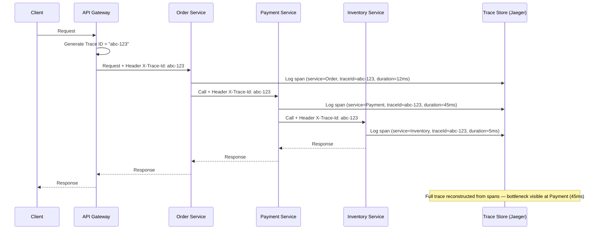

### Implementation Steps

1. **Generate Trace ID** at the entry point (API Gateway) — UUID or Snowflake ID.
2. **Inject into headers** — `X-Trace-Id: abc-123` on every outbound call.
3. **Propagate downstream** — every service reads and re-passes the header.
4. **Log with context** — each service logs: `{ traceId, spanId, service, duration, status }`.
5. **Centralize** — ship logs to a trace backend (Jaeger, Zipkin, Datadog, OpenTelemetry).
6. **Visualize** — trace timeline shows each span's duration and dependencies.

### Key Components

| Component | Role | Technology |
|---|---|---|
| **Trace ID** | Unique per-request identifier | UUID v4 / Snowflake |
| **Span** | Single operation within a trace (one service call) | OpenTelemetry SDK |
| **Span Context** | Carrier of traceId + spanId across service boundaries | HTTP headers / gRPC metadata |
| **Trace Backend** | Stores and indexes all spans | Jaeger, Zipkin, Datadog |
| **Visualization** | Timeline view of the full request path | Jaeger UI, Grafana Tempo |

### Code Example

```python
import uuid
from fastapi import FastAPI, Request, Response
import httpx

app = FastAPI()

@app.middleware("http")
async def tracing_middleware(request: Request, call_next):
    trace_id = request.headers.get("X-Trace-Id") or str(uuid.uuid4())
    request.state.trace_id = trace_id
    logger.info({"traceId": trace_id, "path": request.url.path, "event": "request"})
    response: Response = await call_next(request)
    response.headers["X-Trace-Id"] = trace_id
    logger.info({"traceId": trace_id, "status": response.status_code, "event": "response"})
    return response

# Downstream call propagates Trace ID
async def call_payment_service(trace_id: str, payload: dict):
    async with httpx.AsyncClient() as client:
        return await client.post(
            "http://payment-service/charge",
            json=payload,
            headers={"X-Trace-Id": trace_id}
        )
```

### Interview Q&A

| Question | Answer |
|---|---|
| What is the difference between a Trace ID and a Span ID? | Trace ID identifies the entire request journey end-to-end. Span ID identifies one unit of work within that trace (one service call). A trace contains many spans. |
| What is OpenTelemetry? | A vendor-neutral standard (SDK + collector) for instrumenting services to emit traces, metrics, and logs. Replaces proprietary SDKs for Jaeger/Zipkin/Datadog. |
| How does distributed tracing differ from centralized logging? | Logging records events per service in isolation. Tracing correlates events across services via the shared Trace ID, enabling end-to-end visibility. Both are complementary. |
| What is sampling in distributed tracing? | Not every request needs to be traced (too expensive). Sampling traces 1% (or error paths at 100%) to balance cost vs. observability. |
| How do you trace async/event-driven flows? | Inject the Trace ID into the message payload or Kafka headers; each consumer reads and propagates it when publishing further events. |

---

## 10. PACELC Theorem

### Overview

The PACELC theorem extends the CAP theorem to address latency trade-offs in **normal operation** (no partition). CAP only describes behavior during a network partition; PACELC adds that even when the system is healthy, you must choose between **Latency (L)** and **Consistency (C)**. This makes PACELC a more complete framework for selecting distributed databases.

**Source:** Facebook Reel by Packetory

### The Acronym

```
P  →  A/C    :   During a Partition, choose Availability or Consistency
E  →  L/C    :   Else (normal operation), choose Latency or Consistency
```

### Architecture Diagram

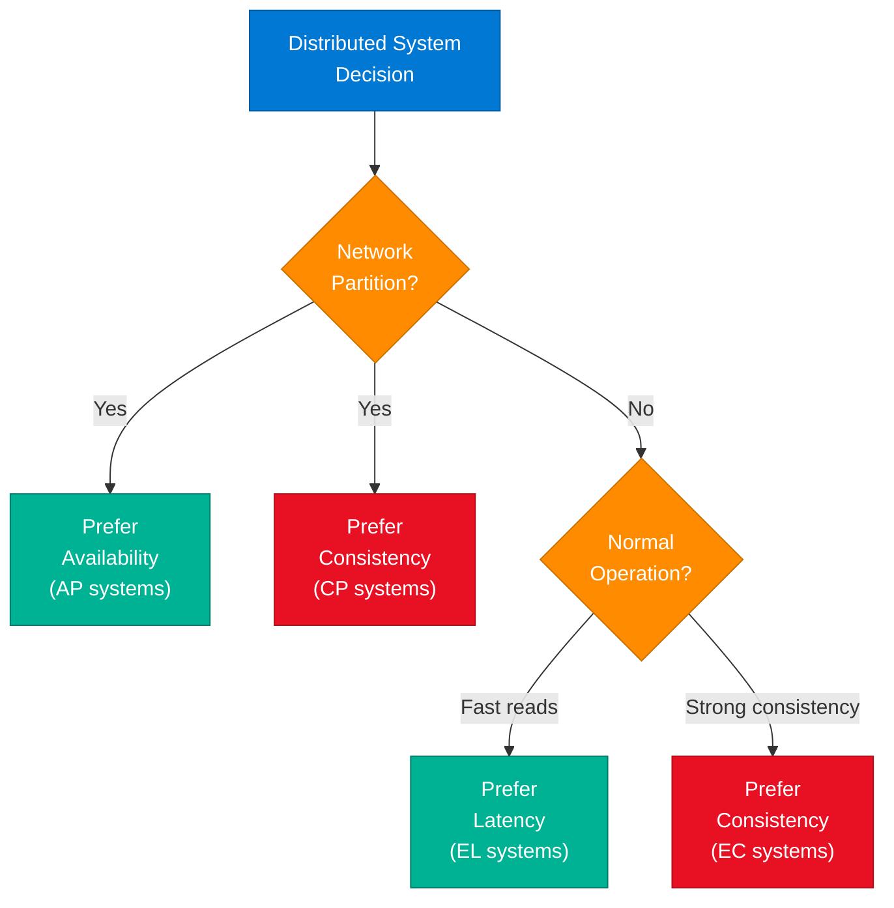

### Database Classification

| Database | Partition behavior | Normal operation | Classification |
|---|---|---|---|
| DynamoDB | PA (available) | EL (low latency) | PA/EL |
| Cassandra | PA | EL | PA/EL |
| MongoDB | PC (consistent) | EC | PC/EC |
| PostgreSQL | PC | EC | PC/EC |
| CockroachDB | PC | EC | PC/EC |
| HBase | PC | EC | PC/EC |
| Riak | PA | EL | PA/EL |

### Interview Q&A

| Question | Answer |
|---|---|
| How does PACELC improve on CAP? | CAP only describes partition behavior. PACELC adds the latency-vs-consistency trade-off for normal operation, which is where most systems spend 99.9% of their time. |
| Why is a pure CP+EC system slow? | Every write must be acknowledged by a quorum of nodes before returning (linearizability); this adds network round-trips, increasing latency even under normal conditions. |
| When would you accept eventual consistency? | Social media likes, analytics counters, DNS propagation — anywhere stale reads are acceptable and low latency is critical. |
| What does "Else" (E) mean in PACELC? | Else = no partition is occurring. The system is healthy; now you must choose: serve reads fast from local replica (latency) or ensure all replicas agree first (consistency). |
| Give an example of PA/EL in practice. | DynamoDB with eventually consistent reads: writes propagate asynchronously to replicas; read requests return immediately from the closest node. |

---

## 11. Instagram Feed — Fan-Out Push Model

### Overview

Instagram serves billions of feed reads per day with sub-100ms latency not by computing feeds on demand, but by pre-computing them. When a user posts, the system **fans out** the post to the pre-built feed caches of all followers. Reading your feed is then a simple key-value lookup — no joins, no real-time computation.

**Source:** Facebook Reel by Bhavesh Vaswani

**Interview Prompt:** *"How does Instagram load your feed instantly with so much data? You should know this as a backend developer."*

### Architecture Diagram

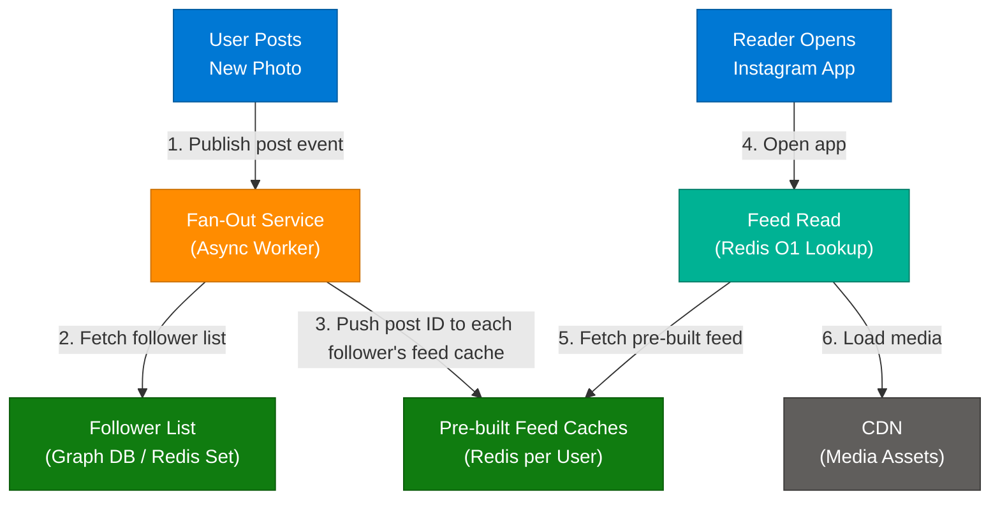

### Fan-Out Models Compared

| Model | How It Works | Pro | Con |
|---|---|---|---|
| **Push (Fan-out on write)** | Post triggers writes to all follower caches | O(1) read; instant feed | Write amplification for celebrities (10M followers = 10M writes) |
| **Pull (Fan-out on read)** | Feed assembled at read time by fetching each followee's latest | No write amplification | High read latency; expensive JOINs |
| **Hybrid** | Push for regular users; pull for celebrities | Balanced | More complex routing logic |

### Interview Q&A

| Question | Answer |
|---|---|
| How does Instagram handle celebrity accounts with 100M followers? | Hybrid model: regular users get push fan-out; celebrity posts are pulled at read time and merged with the pre-built feed. |
| What data structure is a user's feed stored as in Redis? | A sorted set (ZSET) keyed by user ID, with post IDs as members and timestamp as score — enables chronological ordering with O(log N) inserts. |
| How does Instagram handle posts from accounts you follow but who rarely post? | Redis TTL evicts stale feed entries; cold accounts' posts are pulled on demand and merged. |
| What is the write amplification problem? | A celebrity with 10M followers triggers 10M Redis write operations for a single post — this can overwhelm the fan-out service. |
| What consistency model does the feed use? | Eventual consistency — your feed may lag by seconds after a post, which is acceptable for social media. |

---

## 12. Circuit Breaker Pattern

### Overview

The Circuit Breaker Pattern prevents **cascading failures** in distributed systems by acting as a protective proxy between services. When a downstream service fails repeatedly, the circuit "trips" open, immediately rejecting new requests without attempting the failing call. This prevents resource exhaustion in the caller and gives the failing service time to recover. Netflix's Hystrix library popularized this pattern, though Resilience4j is the modern standard.

**Source:** Facebook Reel by Darpan Sharma

### State Machine

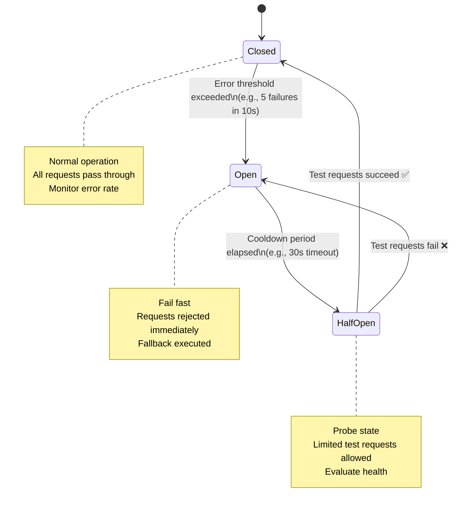

### How It Works

1. **Closed (Normal):** All requests flow to the dependency. The breaker counts errors.
2. **Open (Tripped):** Error threshold crossed. Requests immediately return fallback (cached result, error message, or default). No calls to failing service.
3. **Half-Open (Recovery probe):** After cooldown, a few test requests are allowed through.
4. **Reset:** Test succeeds → Closed. Test fails → back to Open.

### Code Example

```python
# Using Resilience4j-style logic in Python
from circuitbreaker import circuit

@circuit(failure_threshold=5, recovery_timeout=30, expected_exception=ServiceUnavailable)
def call_payment_service(payload: dict) -> dict:
    return requests.post("http://payment-service/charge", json=payload, timeout=2).json()

def process_payment(payload: dict) -> dict:
    try:
        return call_payment_service(payload)
    except CircuitBreakerError:
        return {"status": "deferred", "message": "Payment service temporarily unavailable"}
```

### Interview Q&A

| Question | Answer |
|---|---|
| What is the difference between a Circuit Breaker and a Retry? | Retry resends the request immediately after failure — it amplifies load on a struggling service. Circuit Breaker stops retries entirely after the threshold, giving the downstream service breathing room. |
| What is a "fallback" in circuit breaker context? | The alternative response when the circuit is open: cached data, a default value, a graceful error message, or routing to a secondary service. |
| How does the Half-Open state prevent premature closure? | It only allows a controlled number of test requests. Only after `n` consecutive successes does the breaker fully close, preventing a flapping circuit. |
| Name production implementations of the Circuit Breaker. | Hystrix (Netflix, now in maintenance), Resilience4j (Java), Polly (.NET), `circuitbreaker` (Python), Envoy proxy (service mesh level). |
| Can you implement a circuit breaker at the infrastructure layer? | Yes — service meshes like Istio/Envoy implement circuit breaking at the sidecar proxy level, transparent to application code. |

---

## 13. JWT Logout — Token Blacklisting

### Overview

JWTs are stateless — the server has no record of issued tokens, making logout non-trivial. A user can log out, but the token remains cryptographically valid until expiry. The solution is a **Token Blacklist (Denylist)** stored in Redis: on logout, the token is added to the blacklist with TTL matching the token's remaining validity. Every request checks the blacklist before proceeding.

**Source:** Facebook Reel by Codewithsushant

**Interview Prompt:** *"A user logs out, but their token is still valid. How will you handle this?"*

### Architecture Diagram

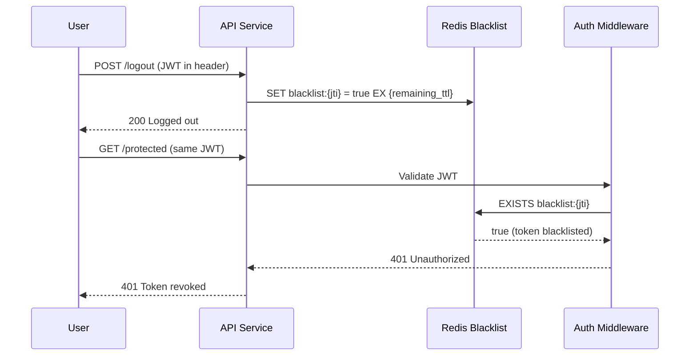

### Implementation Details

| Step | Detail |
|---|---|
| **Extract JTI** | JWT has a `jti` (JWT ID) claim — unique identifier per token |
| **Compute remaining TTL** | `remaining = exp_timestamp - now()` — Redis key auto-expires |
| **Redis key pattern** | `blacklist:{jti}` → value: `1`, TTL: remaining seconds |
| **Check on every request** | Auth middleware checks `EXISTS blacklist:{jti}` before processing |
| **Memory footprint** | Only active (not-yet-expired) blacklisted tokens consume space |

### Interview Q&A

| Question | Answer |
|---|---|
| Why not just shorten JWT expiry instead of blacklisting? | Short expiry (e.g., 5 min) improves security but degrades UX — users must re-login frequently. Blacklisting enables logout-on-demand with longer token lifetimes. |
| What is the JTI claim? | `jti` (JWT ID) — a unique identifier embedded in the JWT payload to distinguish individual tokens from the same user. Required for per-token blacklisting. |
| How does Redis TTL help here? | Redis automatically deletes the blacklist entry when the token would have expired anyway — no cleanup job needed. |
| What happens if Redis goes down? | If the blacklist is unavailable, blacklisted tokens could pass validation. Mitigate with Redis Sentinel/Cluster for HA, or fail-closed (reject all requests if Redis is unreachable). |
| Is there a stateless alternative to blacklisting? | Refresh token rotation: short-lived access tokens (5 min) + revocable refresh tokens stored server-side. Logout invalidates the refresh token. |

---

## 14. Saga Pattern — Microservice Transaction Failures

### Overview

In microservices, a business transaction (e.g., place order) spans multiple services — Order, Payment, Inventory. Standard ACID transactions don't work across service boundaries. The **Saga Pattern** breaks the transaction into local transactions per service, each publishing an event. If a step fails, **compensating transactions** undo the preceding steps, maintaining eventual consistency without distributed locks.

**Source:** Facebook Reel by BlackCask

**Interview Prompt:** *"What happens when one microservice fails in a transaction flow?"*

### Architecture Diagram

```mermaid
flowchart TD
    subgraph happyPath["Happy Path"]
        O1["Order\nService\n✅ Create Order"] -->|"OrderCreated event"| P1["Payment\nService\n✅ Charge Card"]
        P1 -->|"PaymentCompleted event"| I1["Inventory\nService\n✅ Reserve Stock"]
        I1 -->|"StockReserved event"| Done["Order\nConfirmed ✅"]
    end

    subgraph failurePath["Failure Path — Inventory Fails"]
        O2["Order\nService\n✅ Create Order"] -->|"OrderCreated event"| P2["Payment\nService\n✅ Charge Card"]
        P2 -->|"PaymentCompleted event"| I2["Inventory\nService\n❌ Out of Stock"]
        I2 -->|"CompensatePayment event"| CP["Payment\nService\n↩ Refund Card"]
        CP -->|"CompensateOrder event"| CO["Order\nService\n↩ Cancel Order"]
    end

    classDef outputNode  fill:#00B294,stroke:#007D68,color:#fff
    classDef processNode fill:#FF8C00,stroke:#CC7000,color:#fff
    classDef errorNode   fill:#E81123,stroke:#B30D1A,color:#fff
    classDef dataNode    fill:#107C10,stroke:#0A5C0A,color:#fff

    class O1,P1,I1 outputNode
    class Done outputNode
    class O2,P2 processNode
    class I2 errorNode
    class CP,CO dataNode
```

### Saga Orchestration vs. Choreography

| Approach | How | Pro | Con |
|---|---|---|---|
| **Choreography** | Each service publishes events; others react | No central coordinator; loosely coupled | Hard to track overall flow; debugging complex |
| **Orchestration** | Central Saga Orchestrator sends commands to each service | Clear flow visibility; easy rollback | Orchestrator becomes a coupling point |

### Interview Q&A

| Question | Answer |
|---|---|
| Why can't you use a distributed transaction (2PC) across microservices? | 2PC requires all participants to lock resources during the prepare phase, creating tight coupling, blocking, and single-point-of-failure risk across service boundaries. |
| What is a compensating transaction? | A business operation that logically undoes a previous step — e.g., refund a charge, release a reserved stock, cancel an order. Not a DB rollback. |
| How do you ensure a compensating transaction runs exactly once? | Idempotency: each compensation operation is idempotent (running it twice has the same effect as once), protected by an idempotency key stored in the DB. |
| What is the "happy path" in a Saga? | The sequence of local transactions that all succeed, leading to the final committed state. No compensations are triggered. |
| How does the Saga Pattern achieve eventual consistency? | Each local transaction commits immediately; compensations restore consistency after failure. The system is temporarily inconsistent but converges. |

---

## 15. Concurrency vs. Parallelism vs. Async

### Overview

Three terms often confused in interviews: **Concurrency** is about managing multiple tasks by interleaving them (time-sharing); **Parallelism** is about executing multiple tasks simultaneously on multiple CPU cores; **Async** is about non-blocking I/O — releasing the thread while waiting for external operations. Understanding which bottleneck you have determines which strategy to apply.

**Source:** Facebook Reel by BlackCask

**Interview Prompt:** *"Your app is slow because of 100k+ requests. What will you choose: Concurrency, Parallelism, or Async?"*

### Decision Diagram

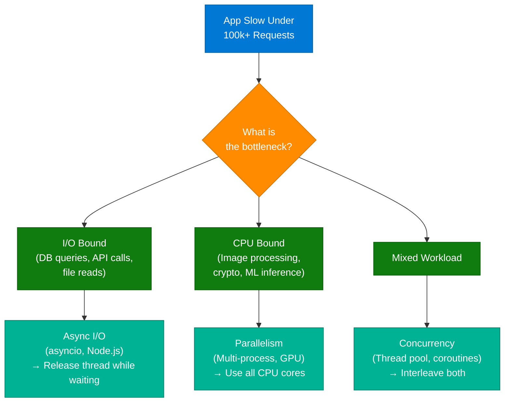

### Comparison Table

| Dimension | Concurrency | Parallelism | Async |
|---|---|---|---|
| **Definition** | Managing multiple tasks by switching between them | Executing multiple tasks simultaneously | Non-blocking execution; release thread on I/O wait |
| **CPU cores used** | 1+ (interleaved on single core possible) | Multiple cores required | 1 (event loop model) or many |
| **Best for** | Mixed I/O + CPU workloads | CPU-bound (image processing, ML) | I/O-bound (DB, API, file reads) |
| **Python** | `threading` | `multiprocessing` | `asyncio` |
| **Java** | `ExecutorService` | Fork/Join pool | `CompletableFuture` |
| **.NET** | `Task.Run` | `Parallel.For` | `async/await` |

### Interview Q&A

| Question | Answer |
|---|---|
| If your app has 100k+ I/O-bound requests, what's the best approach? | Async I/O with an event loop (Node.js, Python asyncio, .NET async/await) — a single thread handles thousands of concurrent requests by yielding on each I/O wait. |
| What is the Global Interpreter Lock (GIL) in Python and how does it affect parallelism? | The GIL prevents true multi-threaded CPU parallelism in CPython. For CPU-bound tasks, use `multiprocessing` (separate processes) or offload to native C extensions. |
| When would concurrency cause problems? | When shared mutable state is accessed without synchronization — race conditions, deadlocks, and data corruption result. Use locks, semaphores, or immutable data structures. |
| What is the event loop? | A single-threaded loop that processes events (I/O completions, timers) and dispatches callbacks/coroutines. Used by Node.js, asyncio, and Nginx. |

---

## 16. Event Sourcing Pattern

### Overview

Event Sourcing stores the **history of state changes** (events) rather than just the current state snapshot. The current state is derived by replaying all events in order. This provides a complete audit log, enables temporal queries ("what was the state at time T?"), and naturally integrates with CQRS. The trade-off is that reads require event replay (mitigated by periodic snapshots).

**Source:** Facebook Post by Codewithsushant

**Key Insight from Post:** *"Stop storing data... Start storing HISTORY!"*

### Architecture Diagram

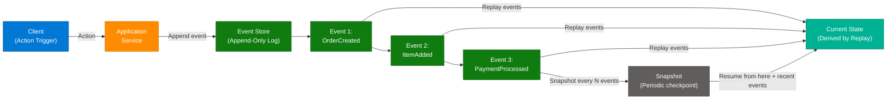

### Classic vs. Event Sourcing

| Dimension | Traditional (CRUD) | Event Sourcing |
|---|---|---|
| **What is stored** | Current state only | All events that produced the state |
| **Audit trail** | Requires separate audit log table | Intrinsic — event log IS the audit trail |
| **Temporal query** | Hard — requires log tables | Easy — replay events up to any timestamp |
| **Storage** | Low (only current state) | Higher (all events accumulate) |
| **Complexity** | Low | Higher — event schema versioning, replay performance |
| **Best for** | Simple CRUD apps | Financial, e-commerce, compliance-heavy domains |

### Interview Q&A

| Question | Answer |
|---|---|
| How do you query current state in an event-sourced system efficiently? | Maintain a read model (projection) — a denormalized view updated by event handlers. Queries hit the projection, not the event log. This is the CQRS pattern. |
| What is a "snapshot" in event sourcing? | A point-in-time serialization of the aggregate state, stored alongside events. On replay, start from the latest snapshot + apply only subsequent events — avoids full replay. |
| What is event schema versioning? | As your system evolves, event shapes change. Use upcasters (schema migrations for events) to transform old event formats when replaying. |
| Name a production system that uses event sourcing. | Financial systems (account ledgers), e-commerce (order lifecycle), Kafka as a durable event log, EventStoreDB (purpose-built event store). |
| How does Event Sourcing integrate with CQRS? | Event Sourcing handles the write side (appending events). CQRS separates read and write models — projections (read models) are built by consuming events from the event store. |

---

## 17. Zero-Downtime Deployments

### Overview

Zero-downtime deployment is the practice of releasing new application versions without interrupting user traffic. Large-scale platforms like Instagram deploy dozens of times per day without users experiencing outages. The three primary strategies — Blue-Green, Canary, and Rolling — each offer different trade-offs between risk, speed, and infrastructure cost.

**Source:** Facebook Reel by Ecogrowthpath

**Interview Prompt:** *"How do large-scale platforms like Instagram achieve zero-downtime deployments while continuously releasing new features?"*

### Architecture Diagram

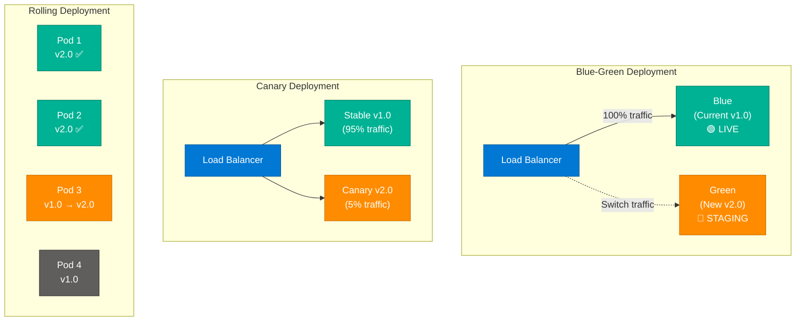

### Strategy Comparison

| Strategy | How | Rollback | Infrastructure cost | Risk window |
|---|---|---|---|---|
| **Blue-Green** | Flip traffic from old to new environment | Instant — flip back | 2× infrastructure | Zero — atomic switch |
| **Canary** | Gradually shift % of traffic to new version | Reduce canary % to 0 | Minimal overhead | Partial — only canary users affected |
| **Rolling** | Replace instances one by one | Re-deploy old version | No extra infra | Window where v1 + v2 run simultaneously |
| **Feature Flags** | Ship code off; toggle on per segment | Toggle off | No extra infra | None for infrastructure; code risk exists |

### Interview Q&A

| Question | Answer |
|---|---|
| What is the biggest risk in a Blue-Green deployment? | Database schema migrations — if v2.0 requires schema changes incompatible with v1.0, you cannot roll back without a database rollback. Use expand-contract (additive) migrations. |
| What is a canary deployment? | Routing a small percentage (1–5%) of real user traffic to the new version. Monitor error rates and latency before expanding rollout. |
| How do Kubernetes rolling deployments work? | Kubernetes replaces pods one (or N) at a time, keeping `maxUnavailable` pods below threshold. Health checks gate each replacement. |
| What is the "expand-contract" pattern for DB migrations? | Phase 1 (expand): add new column/table keeping old schema valid. Deploy new code. Phase 2 (contract): remove old column after all pods run new code. Enables rollback at any phase. |
| How does a feature flag differ from a canary? | Feature flags are code-level switches; canarying is infrastructure-level traffic routing. Flags enable per-user/segment rollout without new infra. |

---

## 18. Caching Layers in System Design

### Overview

Caching is applied at multiple layers of the stack, each targeting a different bottleneck. A single cache layer is rarely sufficient; production systems layer browser cache, CDN, API cache, and database query cache to minimize latency at every hop. The question "where to add caching?" requires identifying the bottleneck layer first.

**Source:** Facebook Reel by Quick2knowledge

**Interview Prompt:** *"Your application takes 5 seconds to load. Where will you add caching?"*

### Architecture Diagram

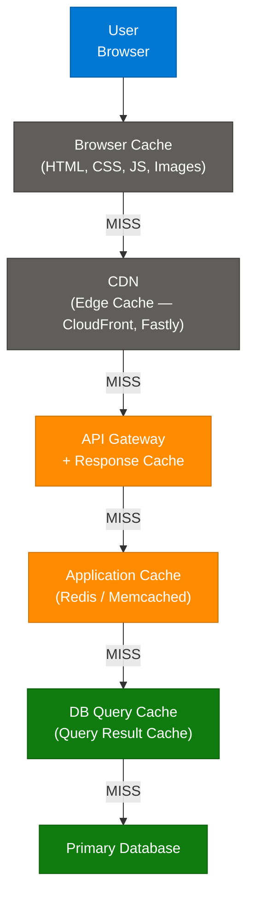

### Cache Layer Reference

| Layer | What is cached | TTL | Technology |
|---|---|---|---|
| Browser | Static assets (JS, CSS, images) | Hours–days | Cache-Control headers |
| CDN | Static + dynamic content at edge | Minutes–hours | CloudFront, Fastly, Akamai |
| API Gateway | Response cache for identical requests | Seconds–minutes | AWS API GW, Kong |
| Application | DB query results, computed objects | Minutes | Redis, Memcached |
| Database | Query result cache | Session | MySQL query cache, pg_cache |

### Interview Q&A

| Question | Answer |
|---|---|
| If an app takes 5s to load, what's your first caching addition? | Profile first. If DB queries dominate → Redis application cache. If static assets → CDN. If API calls → API Gateway response caching. Never add caching before identifying the bottleneck. |
| How does a CDN cache dynamic content? | Via surrogate keys: each response tagged with resource identifiers. On update, a cache purge request invalidates all CDN edges holding that key. |
| What is cache warming? | Pre-populating a cache after a cold start (restart or deployment) to avoid thundering herd on the database. Run a warm-up job or use a background loader. |
| What is stale-while-revalidate? | HTTP cache directive: serve the stale cached response immediately, then revalidate in the background. Eliminates cache miss latency for end users. |

---

## 19. Handling Traffic Spikes in Microservices

### Overview

Sudden traffic spikes are a common operational challenge in microservices — a viral event, a flash sale, or a DDoS can overwhelm any individual service. A structured 5-step response strategy ensures stability: detect, throttle, scale, shed load, and recover.

**Source:** Facebook Reel by BlackCask

**Interview Prompt:** *"If a microservice suddenly starts receiving a high number of requests, how would you handle it?"*

### Response Strategy Diagram

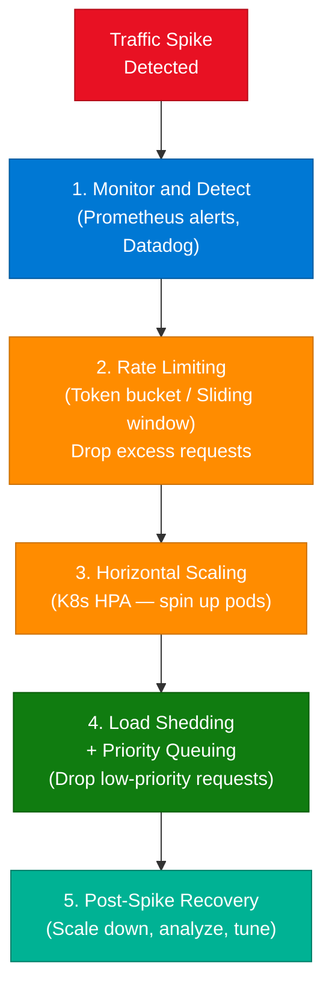

### 5-Step Response Playbook

| Step | Action | Technology |
|---|---|---|
| 1. **Detect** | Alert on p99 latency or error rate spike | Prometheus + Alertmanager, Datadog |
| 2. **Rate Limit** | Throttle requests at API Gateway / service level | Token Bucket (smooth), Leaky Bucket (strict), Sliding Window |
| 3. **Horizontal Scale** | Auto-scale pods/instances | K8s HPA, AWS Auto Scaling |
| 4. **Load Shed** | Drop or queue low-priority requests | Priority queues, circuit breaker fallback |
| 5. **Recover** | Scale down after spike; run post-mortem | Grafana dashboards, runbooks |

### Interview Q&A

| Question | Answer |
|---|---|
| What is the difference between rate limiting and load shedding? | Rate limiting controls the *input* rate — excess requests are rejected at the gate. Load shedding drops in-flight or queued requests when the system is overwhelmed — it's the last line of defense. |
| What rate limiting algorithm would you use for a smooth user experience? | Token Bucket: allows bursting (tokens accumulate up to a max) while enforcing average rate. Leaky Bucket enforces strict average with no bursting. |
| How does Kubernetes HPA work? | Horizontal Pod Autoscaler watches CPU/memory (or custom metrics). When threshold is exceeded, it increases replica count; scales down when load drops. |
| What is a "priority queue" in load shedding? | Requests are tagged with priority (e.g., premium user vs. free tier). Under load, only high-priority requests are processed; low-priority requests are dropped or queued. |
| What is a thundering herd and how do you prevent it? | After a cache flush or service restart, thousands of requests simultaneously hit the backend. Prevent with jittered TTLs, mutex/locking on first miss, or staggered startup. |

---

## 20. Snowflake IDs — Distributed ID Generation

### Overview

Snowflake IDs solve the distributed ID generation problem: how do you create globally unique, time-sortable IDs across thousands of servers without a central coordinator? Twitter's Snowflake algorithm packs a 64-bit integer with timestamp, machine ID, and sequence number, enabling each node to generate IDs independently at millions per second.

**Source:** Facebook Reel by Packetory (Turns 22 & 23 — merged)

### The Problem: Auto-Increment in Distributed Systems

```
Single DB:  ID = 1, 2, 3, 4...  ✅ Simple, sequential
Sharded DB: Shard A generates 1, 2...  Shard B also generates 1, 2...  ❌ COLLISION
```

### Snowflake ID Anatomy (64-bit)

```
| 0 | 41 bits timestamp | 10 bits machine ID | 12 bits sequence |
  ^         ^                    ^                    ^
Sign    Milliseconds         Server/node         Counter per ms
(0)   since custom epoch     identifier          (0–4095 per ms)
```

### Architecture Diagram

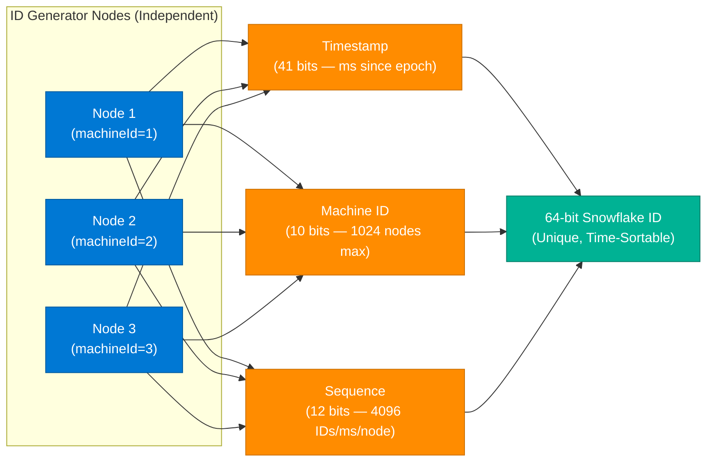

### Key Properties

| Property | Detail |
|---|---|
| **Capacity** | 41-bit timestamp → ~69 years; 10-bit machine ID → 1024 nodes; 12-bit sequence → 4096 IDs/ms/node |
| **Throughput** | Up to 4096 × 1024 = ~4M IDs/ms across the cluster |
| **Decentralized** | No coordination between nodes; no central bottleneck |
| **Time-sortable** | IDs are naturally ordered by time → efficient B-tree indexing |
| **Monotonic** | IDs increase over time → append-friendly for write-heavy databases |

### Code Example

```python
import time

EPOCH = 1288834974657  # Twitter's custom epoch (Nov 4, 2010)
MACHINE_ID = 1         # Unique per node (from config/Zookeeper)
sequence = 0
last_ms = -1

def generate_snowflake_id() -> int:
    global sequence, last_ms
    now_ms = int(time.time() * 1000) - EPOCH

    if now_ms == last_ms:
        sequence = (sequence + 1) & 0xFFF  # 12 bits max = 4095
        if sequence == 0:
            while int(time.time() * 1000) - EPOCH <= last_ms:
                pass  # Wait for next millisecond
            now_ms = int(time.time() * 1000) - EPOCH
    else:
        sequence = 0

    last_ms = now_ms
    return (now_ms << 22) | (MACHINE_ID << 12) | sequence
```

### Interview Q&A

| Question | Answer |
|---|---|
| Why are Snowflake IDs better than UUIDs for database primary keys? | UUIDs are random (128-bit), causing random B-tree inserts and page splits. Snowflake IDs are time-sorted (64-bit), enabling sequential inserts and better index locality. |
| What happens if two nodes have the same Machine ID? | Collisions occur — IDs from different nodes in the same millisecond could be identical. Machine IDs must be assigned uniquely (via Zookeeper, etcd, or configuration management). |
| How does the sequence number handle multiple IDs in the same millisecond? | It increments per ID within the same millisecond (0–4095). If exhausted, the generator waits for the next millisecond. |
| What is clock skew and how does it affect Snowflake IDs? | If a node's system clock moves backward (NTP correction), it could generate duplicate IDs. Solution: detect backward clock, refuse to generate IDs until clock catches up, or throw an exception. |
| How do you extract the timestamp from a Snowflake ID? | `timestamp_ms = (snowflake_id >> 22) + EPOCH` — since the top 41 bits are the millisecond timestamp, right-shifting removes the lower 22 bits. |

---

## 21. Centralized Logging System

### Overview

A centralized logging system (ELK/EFK Stack) aggregates logs from all microservices into a single searchable store. Without centralization, debugging a distributed system requires logging into each pod individually — impractical at scale. The architecture follows a three-tier pipeline: **Collect → Store → Visualize**.

**Source:** Facebook Reel by KodeKloud

### Architecture Diagram

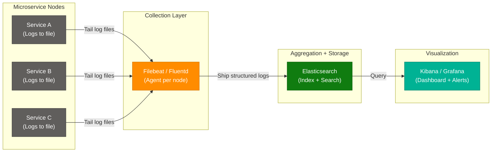

### ELK/EFK Stack Components

| Component | Role | Examples |
|---|---|---|
| **Collection (Agent)** | Reads log files from each node; ships to aggregator | Filebeat, Fluentd, Logstash, Fluent Bit |
| **Storage (Index)** | Receives, indexes, and stores logs for search | Elasticsearch, OpenSearch, Loki |
| **Visualization** | Dashboards, search UI, alerts | Kibana, Grafana, OpenSearch Dashboards |

### Interview Q&A

| Question | Answer |
|---|---|
| What is the difference between ELK and EFK? | ELK: Elasticsearch + Logstash + Kibana. EFK: Elasticsearch + Fluentd + Kibana. Fluentd is lighter than Logstash; EFK is preferred in Kubernetes environments. |
| Why use Elasticsearch for log storage instead of a relational DB? | Elasticsearch is optimized for full-text search and time-series queries across billions of unstructured log lines — far faster than SQL for this use case. |
| How do you handle log volume spikes without dropping entries? | Add a message queue (Kafka, Redis) between collection and Elasticsearch: agents → Kafka → Elasticsearch. The queue buffers spikes. |
| What is the retention strategy for logs? | Hot tier (recent logs, SSD): 7–30 days. Warm tier (older logs, HDD): 30–90 days. Cold tier (compliance archive, S3/Glacier): years. Automated ILM (Index Lifecycle Management) moves data between tiers. |
| What structured format should logs use? | JSON with mandatory fields: `timestamp`, `service`, `level`, `traceId`, `message`. JSON enables field-level indexing and structured search in Kibana. |

---

## 22. Logging via Middleware / Interceptors

### Overview

Logging every request and response in a production application requires a cross-cutting approach that doesn't pollute business logic. The solution is **middleware or interceptors** — components that sit at the entry/exit point of the application and capture telemetry before forwarding to a centralized logging system, always asynchronously to avoid adding latency.

**Source:** Facebook Reel by BlackCask

**Interview Prompt:** *"How would you implement logging of every request and response in your application?"*

### Architecture Diagram

```mermaid
sequenceDiagram
    participant Client as Client
    participant MW as Logging Middleware
    participant Handler as Business Handler
    participant Logger as Async Logger
    participant ELK as ELK Stack

    Client->>MW: HTTP Request
    MW->>MW: Extract: timestamp, traceId,\nuserId, method, path, headers
    MW->>Logger: Log request (async, non-blocking)
    MW->>Handler: Forward request
    Handler-->>MW: Response (status, body)
    MW->>MW: Extract: status, latency, response size
    MW->>Logger: Log response (async)
    MW-->>Client: Return response
    Logger->>ELK: Batch ship logs
```

### Log Payload Schema

```json
{
  "timestamp": "2026-07-09T10:20:00.123Z",
  "traceId": "abc-123-def-456",
  "requestId": "req-789",
  "userId": "u-42",
  "method": "POST",
  "path": "/api/orders",
  "statusCode": 201,
  "latencyMs": 45,
  "userAgent": "Mozilla/5.0",
  "ip": "192.168.1.1",
  "requestBody": "[REDACTED — contains PII]",
  "responseSize": 1024
}
```

### Code Example

```python
import time, uuid
from fastapi import FastAPI, Request, Response

app = FastAPI()

@app.middleware("http")
async def request_response_logger(request: Request, call_next):
    trace_id = request.headers.get("X-Trace-Id", str(uuid.uuid4()))
    start = time.monotonic()

    # Log request (async via background task or queue)
    await async_logger.log({
        "event": "request",
        "traceId": trace_id,
        "method": request.method,
        "path": str(request.url.path),
    })

    response: Response = await call_next(request)
    latency_ms = int((time.monotonic() - start) * 1000)

    await async_logger.log({
        "event": "response",
        "traceId": trace_id,
        "status": response.status_code,
        "latencyMs": latency_ms,
    })

    response.headers["X-Trace-Id"] = trace_id
    return response
```

### Interview Q&A

| Question | Answer |
|---|---|
| Why must logging be asynchronous? | Synchronous logging blocks the request thread until the log is written — adding latency directly experienced by the user. Async logging decouples log shipping from request processing. |
| What data should you mask/redact in logs? | Passwords, credit card numbers, SSNs, API keys, full JWT tokens, PII (names, emails in some jurisdictions). Log only the last 4 digits of card numbers, hash PII if needed. |
| Where should the middleware be placed in a microservice? | At the outermost layer — before business logic and after authentication. Typically at the API Gateway for cross-service logging, and as a service-level interceptor for service-specific detail. |
| How do you handle high log throughput without packet loss? | Buffer logs locally (in-memory or disk), batch-ship to Elasticsearch via Kafka queue. Use backpressure to signal when the queue is full. |
| What is correlation ID vs. trace ID vs. request ID? | Correlation ID: links related requests across user sessions. Trace ID: links all spans in a single distributed request. Request ID: unique per individual HTTP request. All three can coexist in logs. |

---

## 23. Interview Q&A Cheatsheet

**Q: What is the difference between cache-aside and read-through caching?**
> Cache-aside: the application manages cache population — on miss, it queries the DB and writes to cache. Read-through: the cache library auto-fetches from DB on miss, transparent to the application. Cache-aside gives more control; read-through simplifies application code.

**Q: How does the Circuit Breaker Pattern prevent cascading failures?**
> When a downstream service fails beyond a threshold, the breaker trips to Open state, immediately returning a fallback without attempting the call. This prevents resource exhaustion (threads, connections) in the caller and gives the failing service time to recover before the breaker enters Half-Open probe state.

**Q: Explain PACELC in one minute.**
> PACELC extends CAP: during a **P**artition, choose **A**vailability or **C**onsistency. **E**lse (normal operation), choose **L**atency or **C**onsistency. Example: DynamoDB is PA/EL — stays available during partitions, prioritizes low latency in normal operation (eventual consistency). PostgreSQL is PC/EC — consistent always, higher latency.

**Q: What is a Snowflake ID and why is it better than UUID for DB keys?**
> A 64-bit integer composed of millisecond timestamp (41 bits), machine ID (10 bits), and sequence (12 bits). Time-sortable → sequential B-tree inserts with no page splits. 8 bytes vs UUID's 16 bytes. No central coordinator needed — each node generates IDs independently.

**Q: How does the Saga Pattern handle distributed transaction failures?**
> Saga breaks the transaction into local steps, each publishing an event. On failure, compensating transactions (business-level undos) are triggered in reverse order — e.g., refund payment, release inventory, cancel order. Two approaches: choreography (event-driven) or orchestration (central Saga coordinator).

**Q: How do you implement logout for a JWT-based system?**
> Add a Redis-backed token blacklist. On logout, store the JWT's `jti` claim in Redis with TTL equal to the token's remaining validity. On every request, auth middleware checks `EXISTS blacklist:{jti}` before processing. Redis auto-expires the key when the token would have expired anyway.

**Q: What is Event Sourcing and when would you use it?**
> Store every state change as an immutable event in an append-only log; current state is derived by replaying events. Use when you need a complete audit trail (finance, compliance), temporal queries ("what was the state at T?"), or integration with CQRS. Trade-off: higher storage, event schema versioning complexity.

**Q: How does Instagram serve feeds instantly to 2B users?**
> Fan-out on write (push model): when a user posts, the system asynchronously pushes the post ID to the pre-built Redis sorted-set feed caches of all followers. Reading your feed is an O(1) Redis ZRANGE lookup. Celebrity accounts (10M+ followers) use a hybrid pull model to avoid write amplification.

**Q: Concurrency vs. parallelism vs. async — when to use each?**
> **Async**: I/O-bound workloads (DB, API) — release thread while waiting (asyncio, async/await). **Parallelism**: CPU-bound workloads (image processing, ML) — use multiple cores (multiprocessing, worker processes). **Concurrency**: mixed workloads — interleave multiple tasks (thread pools, coroutines). Identify your bottleneck before choosing.

**Q: What are the three states of a Circuit Breaker?**
> **Closed**: normal operation; requests flow, errors monitored. **Open**: threshold exceeded; requests immediately return fallback, no calls to failing service. **Half-Open**: after cooldown, limited test requests probe health; success → Closed, failure → Open.

**Q: How does a Cuckoo Filter support deletion when a Bloom Filter cannot?**
> A Cuckoo Filter stores small fingerprints (not full items) in two possible buckets. Deletion removes the exact fingerprint from the bucket. A Bloom Filter uses shared bit arrays — clearing a bit for one item may remove a bit shared by another item, causing false negatives. Cuckoo's per-slot fingerprints avoid this collision.

**Q: What is the difference between Blue-Green and Canary deployments?**
> Blue-Green: maintain two identical environments; flip 100% of traffic atomically. Instant rollback by flipping back. Requires 2× infrastructure. Canary: gradually route a small % (1–5%) of traffic to the new version; expand after monitoring. Lower infrastructure cost; risk exposure limited to canary users.

---

*Extracted from Gemini shared session · July 9, 2026 · GeminiShareToMD Agent v1.0*

---

```
═══════════════════════════════════════════════════════════
Token Usage Report
═══════════════════════════════════════════════════════════
Estimated without optimization:  ~17,250 tokens (raw session: ~69,000 chars ÷ 4)
Actual (with optimization):      ~12,000 tokens (enriched file: ~48,000 chars ÷ 4)
Savings (raw extraction phase):  ~2,800 tokens (stripped UI chrome, boilerplate prompts,
                                               merged 3 duplicate turns)
Techniques applied:              Stripped "Convert chat to PDF / Open in Acrobat" UI chrome;
                                 removed 25× repeated boilerplate user prompts;
                                 merged turns 11+13 (Request Tracing duplicates);
                                 merged turns 22+23 (Snowflake ID duplicates);
                                 deduplicated caching concept across turns 1 and 20
═══════════════════════════════════════════════════════════
* Estimates: prose chars ÷ 4, code chars ÷ 3. Actual API usage varies by model.
```
