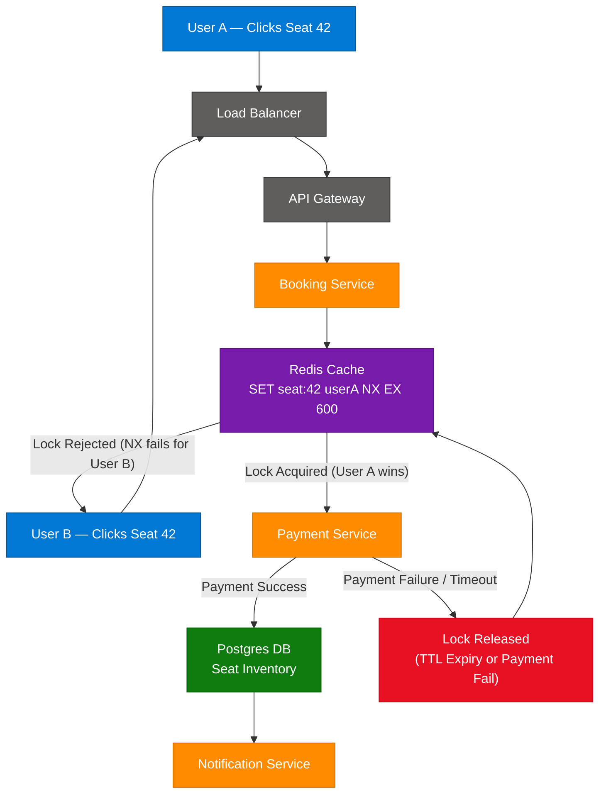
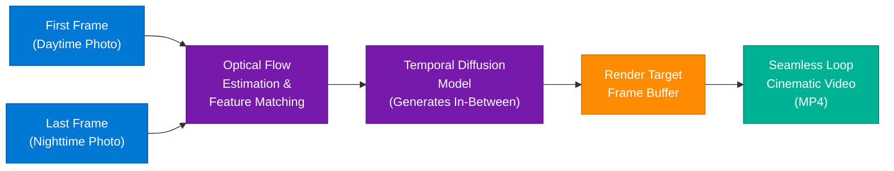
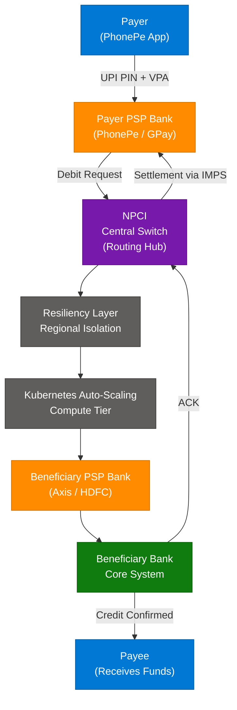
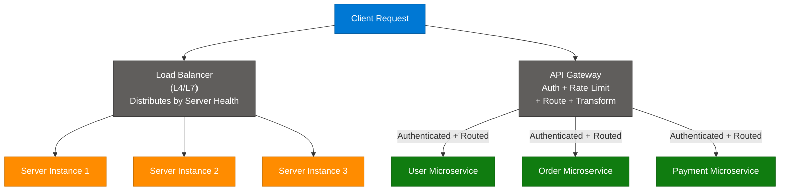
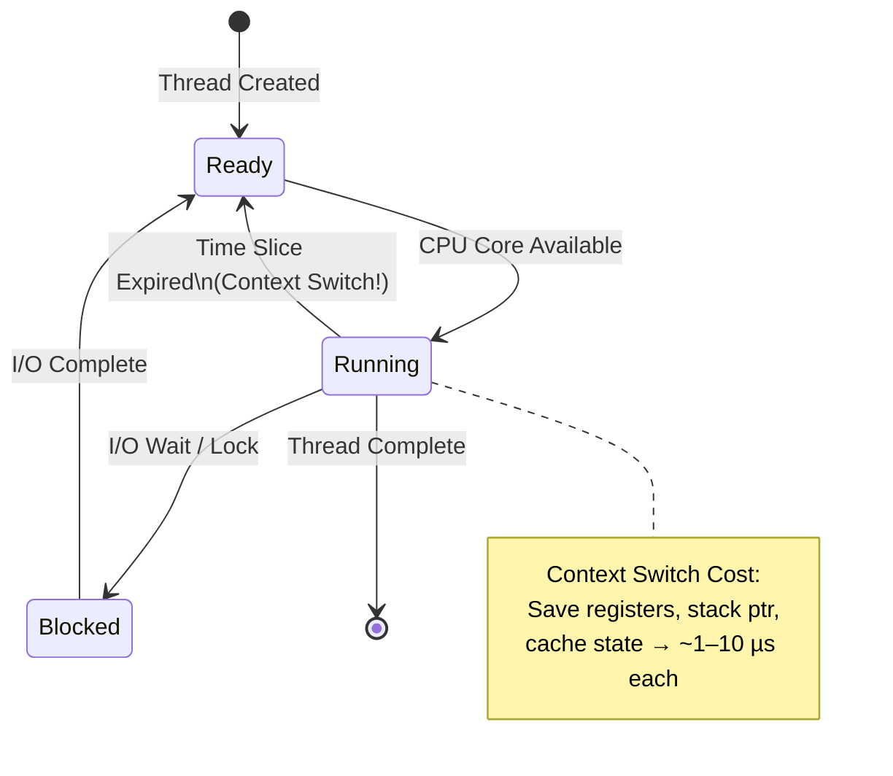
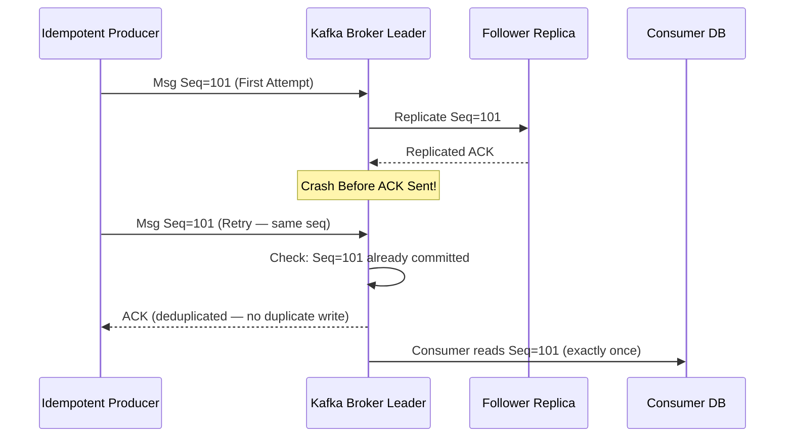
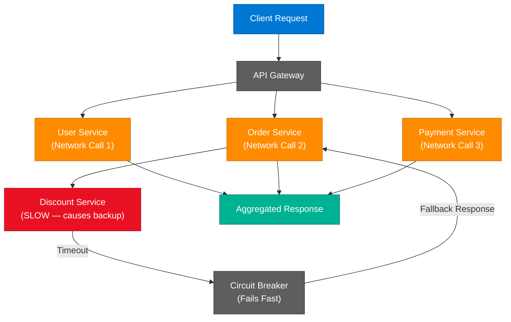
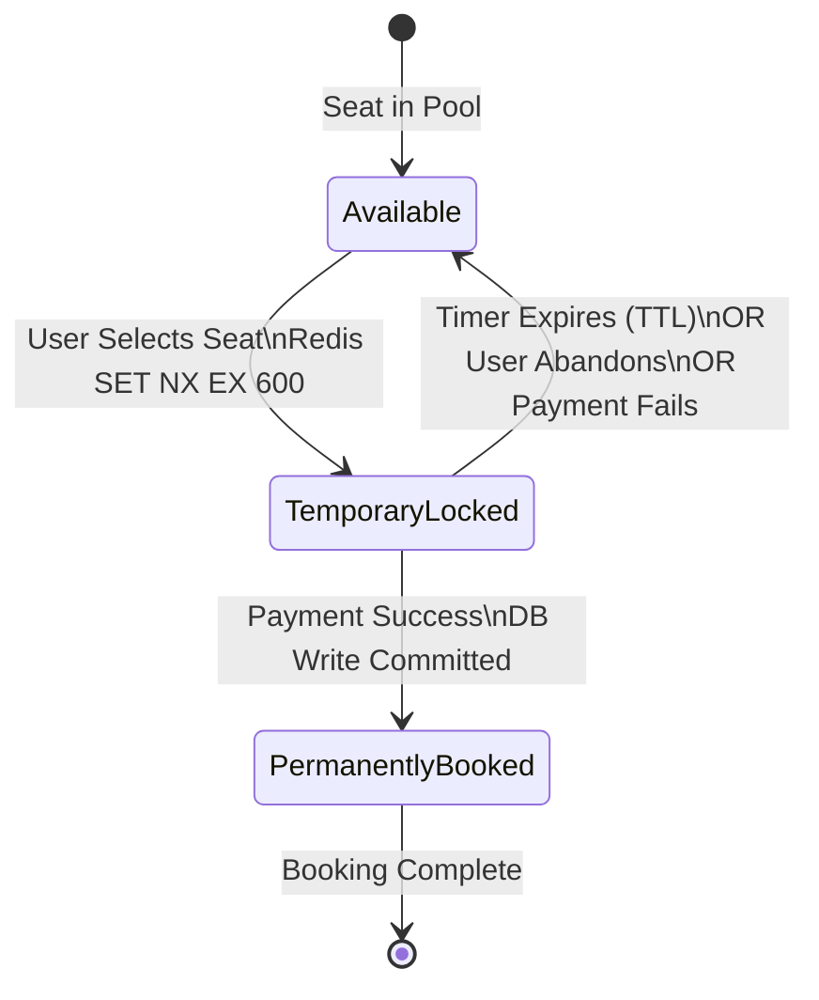

```mermaid
flowchart TD
    subgraph Bad["❌ Anti-Pattern: Raw useEffect()"]
        CMP1["Component Mounts/Re-renders"]
        UE["useEffect() Fires"]
        FT["Raw fetch() / axios"]
        UST["useState() Update"]
        NR1["No Cache Retained\non Unmount"]
        CMP1 --> UE --> FT --> UST --> NR1
    end

    subgraph Good["✅ Optimized: TanStack Query"]
        CMP2["Component Requests Data"]
        QC["Query Cache Check"]
        HIT["Cache HIT\n(Return Immediately)"]
        MISS["Cache MISS\n(Network Request)"]
        GC["Global Cache Context\n(Shared Across Components)"]
        BG["Background Revalidation\n(Stale-While-Revalidate)"]
        AB["AbortController\n(Cancel on Unmount)"]
        CMP2 --> QC
        QC -->|"Fresh"| HIT
        QC -->|"Stale/Missing"| MISS
        MISS --> AB
        AB --> GC
        GC --> BG
    end

    classDef errorNode   fill:#E81123,stroke:#B30D1A,color:#fff
    classDef outputNode  fill:#00B294,stroke:#007D68,color:#fff
    classDef processNode fill:#FF8C00,stroke:#CC7000,color:#fff
    classDef aiNode      fill:#7719AA,stroke:#5A0E80,color:#fff

    class CMP1,UE,FT,UST,NR1 errorNode
    class CMP2,QC,HIT,MISS,GC,BG,AB processNode
```

```mermaid
flowchart LR
    VideoSrc["Video Source\n(MP4 Master)"]
    FrameEx["Frame Extractor\n(FFmpeg every 10s)"]
    Sprite["Sprite Sheet Generator\n(Grid of 320p thumbnails)"]
    BIF["BIF Encoder\n(.bif binary matrix)"]
    CDN["CDN Edge\nCache"]
    ClientRAM["Client RAM\nPre-load on Play"]
    Scrub["User Scrubs Timeline"]
    Preview["Instant Thumbnail\n(Zero Network)"]

    VideoSrc --> FrameEx
    FrameEx --> Sprite
    Sprite --> BIF
    BIF --> CDN
    CDN -->|"Streamed at Playback Start"| ClientRAM
    Scrub --> ClientRAM
    ClientRAM --> Preview

    classDef userNode    fill:#0078D4,stroke:#005A9E,color:#fff
    classDef processNode fill:#FF8C00,stroke:#CC7000,color:#fff
    classDef infraNode   fill:#605E5C,stroke:#3B3A39,color:#fff
    classDef dataNode    fill:#107C10,stroke:#0A5C0A,color:#fff
    classDef outputNode  fill:#00B294,stroke:#007D68,color:#fff

    class Scrub userNode
    class FrameEx,Sprite,BIF processNode
    class CDN infraNode
    class VideoSrc dataNode
    class ClientRAM,Preview outputNode
```

# System Design Multi-Topic: Instagram Reels Deep Dives

> **Source:** [share.gemini.google/FVetahnels2B](https://share.gemini.google/FVetahnels2B) → redirects to [gemini.google.com/share/4c7e80959bf1](https://gemini.google.com/share/4c7e80959bf1)
> **Model:** Gemini 3.5 Flash
> **Session Date:** June 3, 2026 at 09:27 PM
> **Published:** July 9, 2026 at 08:40 AM
> **Saved:** July 10, 2026

---

## Table of Contents

1. [Session Overview](#1-session-overview)
2. [Double Booking Problem — Redis Distributed Locking](#2-double-booking-problem--redis-distributed-locking)
3. [AI Frame Interpolation — Loop Video Generation](#3-ai-frame-interpolation--loop-video-generation)
4. [UPI Architecture at Scale — 5 Crore+ TPS](#4-upi-architecture-at-scale--5-crore-tps)
5. [API Gateway vs Load Balancer](#5-api-gateway-vs-load-balancer)
6. [Thread Management & Context Switching](#6-thread-management--context-switching)
7. [Kafka Idempotent Producer — Exactly-Once Semantics](#7-kafka-idempotent-producer--exactly-once-semantics)
8. [Microservices Latency & Communication Overhead](#8-microservices-latency--communication-overhead)
9. [React Data Fetching — useEffect vs TanStack Query](#9-react-data-fetching--useeffect-vs-tanstack-query)
10. [Netflix Thumbnail Sprites — Video Scrubbing Optimization](#10-netflix-thumbnail-sprites--video-scrubbing-optimization)
11. [BookMyShow Seat Locking — Redis TTL Pattern](#11-bookMyshow-seat-locking--redis-ttl-pattern)
12. [Interview Q&A Cheatsheet](#12-interview-qa-cheatsheet)

---

## 1. Session Overview

This Gemini session covers 10 distinct system design and software engineering concepts extracted from Instagram/social media reels by technical educators. The user repeatedly prompted Gemini to "generate the transcript of the video with arch diagram" for each reel, and added context requests to also capture video names, in-video prompts, and caption/comment details. All 9 technical turns were successfully extracted and enriched below; one non-technical turn (astrology content) is noted and skipped.

### Session Map

| Turn | User Prompt Summary | Gemini Response | Status |
|---|---|---|---|
| 1 | Generate transcript with arch diagram | Double Booking Problem — BookMyShow/IRCTC/Airbnb + Redis solution | ✅ Extracted |
| 2 | Generate transcript with arch diagram | AI Frame Interpolation — Day→Night loop video via optical flow | ✅ Extracted |
| 3 | Generate transcript + video name + prompts + captions | UPI Architecture — 5 crore+ TPS with NPCI, PSP, Kubernetes | ✅ Extracted |
| 4 | Generate transcript + video name + prompts + captions | API Gateway vs Load Balancer (@himanshu.codes) | ✅ Extracted |
| 5 | Generate transcript + video name + prompts + captions | Thread Management & Context Switching (@iamnikspatle) | ✅ Extracted |
| 6 | Generate transcript + video name + prompts + captions | Kafka Idempotent Producer — Exactly-Once Semantics | ✅ Extracted |
| 7 | Generate transcript + video name + prompts + captions | Microservices Latency & Communication Overhead | ✅ Extracted |
| 8 | Generate transcript + video name + prompts + captions | React useEffect() vs TanStack Query | ✅ Extracted |
| 9 | Generate transcript + video name + prompts + captions | Netflix Thumbnail Sprites / .bif scrubbing optimization | ✅ Extracted |
| 10 | Generate transcript + video name + prompts + captions | Astrology video (Don't believe in ASTROLOGY?? — @iam.chandanbisht) | ⚠️ Non-technical — skipped |
| 11 | Generate transcript + video name + prompts + captions | BookMyShow Seat Locking (@__the_developer__) | ✅ Extracted |

---

## 2. Double Booking Problem — Redis Distributed Locking

### Overview

The Double Booking Problem occurs when two concurrent users attempt to reserve the same resource (seat, room, ticket) simultaneously, and both succeed because neither sees the other's in-flight write. It is a foundational system design challenge for any platform handling scarce, time-bounded inventory — BookMyShow, IRCTC, Airbnb, Zomato table reservations, or hotel chains. The canonical solution combines a distributed lock (Redis `SET NX EX`) to claim the resource atomically, a payment window TTL (typically 5–10 minutes), and a permanent commitment or automatic rollback on expiry.

### Architecture Diagram



### How It Works

1. User A and User B simultaneously view the last available seat for a movie and both click "Book Now"
2. Both requests hit the API Gateway and are forwarded to the Booking Service
3. The Booking Service issues `SET seat:{seat_id} {user_session} NX EX 600` to Redis
4. Redis atomically processes one write — the `NX` flag means "set only if Not eXists"
5. User A wins the race: lock is set with a 600-second TTL (10 minutes to pay)
6. User B's `SET NX` fails immediately — they see "Seat unavailable" without any DB write
7. If User A completes payment: Booking Service writes to Postgres and the lock is considered permanent
8. If User A abandons / payment times out: Redis TTL expires, the key is deleted, and the seat becomes available for others

### Key Components

| Component | Role | Technology Options |
|---|---|---|
| Distributed Lock | Atomically claim a resource without race conditions | Redis `SET NX EX`, Zookeeper, etcd |
| Lock TTL | Auto-release lock if payment doesn't complete | Redis key expiry (seconds) |
| Inventory Store | Source of truth for confirmed bookings | Postgres, MySQL, DynamoDB |
| Optimistic Locking | Alternative — use DB version column + compare-and-swap | `SELECT FOR UPDATE`, JPA `@Version` |
| Idempotency Key | Prevent double-charge if payment network retries | UUID in payment request header |

### Code Example

```python
import redis
import uuid
from contextlib import contextmanager

r = redis.Redis(host="localhost", port=6379, decode_responses=True)

LOCK_TTL_SECONDS = 600  # 10 min payment window

@contextmanager
def acquire_seat_lock(seat_id: str, user_session: str):
    lock_key = f"lock:seat:{seat_id}"
    acquired = r.set(lock_key, user_session, nx=True, ex=LOCK_TTL_SECONDS)
    if not acquired:
        raise Exception(f"Seat {seat_id} is already being held by another user")
    try:
        yield lock_key
    finally:
        # Release only if we still own the lock (guard against TTL expiry race)
        current_holder = r.get(lock_key)
        if current_holder == user_session:
            r.delete(lock_key)

def book_seat(seat_id: str, user_id: str) -> dict:
    session_token = str(uuid.uuid4())
    with acquire_seat_lock(seat_id, session_token):
        # Proceed to payment within the lock window
        payment_result = process_payment(user_id, seat_id)
        if payment_result["status"] == "success":
            confirm_booking_in_db(seat_id, user_id)
            return {"status": "booked", "seat": seat_id}
        raise Exception("Payment failed — lock will be released")
```

### Interview Q&A

| Question | Answer |
|---|---|
| Why is Redis preferred over a DB lock for seat reservation? | Redis `SET NX EX` is a single atomic command with sub-millisecond latency; a DB `SELECT FOR UPDATE` holds a transaction row lock and degrades under high concurrency |
| What happens if the Booking Service crashes after acquiring the Redis lock? | The TTL ensures automatic release after the expiry window — no manual cleanup needed |
| How do you prevent the lock owner from being replaced mid-payment? | Store a unique session token as the lock value; on release, check `GET` before `DEL` (or use a Lua script for atomic compare-and-delete) |
| What is the difference between pessimistic and optimistic locking? | Pessimistic (Redis lock, `SELECT FOR UPDATE`) blocks other writers; Optimistic (version columns) allows concurrent reads and fails on write conflict — better for low-contention scenarios |
| How does Airbnb handle double-booking at global scale? | Multi-layer: Redis lock per listing-date, database-level unique constraint on (listing_id, date), and event-sourcing to replay and resolve conflicts |

---

## 3. AI Frame Interpolation — Loop Video Generation

### Overview

AI frame interpolation is the technique of generating intermediate video frames between two (or more) input images using machine learning models, enabling smooth "morphing" animations and seamless cinematic loops from still photography. Modern platforms (Instagram, TikTok, CapCut) use optical flow estimation to understand how pixels move between frames, and temporal diffusion models to hallucinate plausible in-between content that maintains scene coherence, lighting, and texture consistency. The output is a high-quality MP4 loop — for example, transforming a daytime landscape photo into a nighttime equivalent with a smooth, cinematic transition.

### Architecture Diagram



### How It Works

1. **Input**: Two anchor frames are provided — a source (daytime) and a target (nighttime) still image
2. **Optical Flow Estimation**: The model computes dense pixel-level motion vectors between the two frames, identifying where objects shift, how lighting changes, and which regions are static
3. **Feature Matching**: Key semantic features (tree silhouettes, building edges, sky gradients) are matched across both frames to maintain spatial coherence
4. **Temporal Diffusion**: A diffusion model conditioned on both anchor frames synthesizes N intermediate frames that progressively morph from one state to the other
5. **Frame Buffer**: Generated frames are assembled in a render target at target fps (typically 24–60)
6. **Loop Stitching**: The sequence is trimmed so the last frame smoothly connects to the first, creating the seamless looping effect
7. **MP4 Encoding**: Final output is encoded with H.264/H.265 for web delivery

### Key Components

| Component | Role | Technology Options |
|---|---|---|
| Optical Flow | Compute pixel motion vectors between frames | RAFT, FlowNet2, Lucas-Kanade |
| Temporal Diffusion Model | Hallucinate coherent intermediate frames | Stable Video Diffusion, Kling AI, Runway Gen-3 |
| Frame Buffer | Hold generated frames before encoding | GPU VRAM, CPU RAM |
| Video Encoder | Compress frame sequence to MP4 | FFmpeg H.264, H.265, AV1 |

### Interview Q&A

| Question | Answer |
|---|---|
| What is optical flow and why is it critical for video interpolation? | Optical flow computes per-pixel velocity vectors between frames; without it, a diffusion model would generate independent frames that flicker incoherently |
| How is temporal diffusion different from standard image diffusion? | Temporal diffusion conditions on both anchor frames and a time step parameter, maintaining consistency across the generated sequence |
| Why does AI interpolation sometimes produce "ghosting" artifacts? | When optical flow fails on regions with ambiguous or textureless backgrounds, the model blends both frames additively, creating ghost overlap |
| What are real-world applications beyond social media? | Film VFX (converting 24fps to 48fps), sports broadcast slow-motion, medical imaging (interpolating CT scan slices), autonomous driving simulation |
| How does Runway Gen-3 differ from CapCut's AI loop feature? | Gen-3 uses full video diffusion with temporal attention; CapCut uses lighter weight frame interpolation models optimized for mobile inference speed |

---

## 4. UPI Architecture at Scale — 5 Crore+ TPS

### Overview

UPI (Unified Payments Interface) processes over 5 crore (50 million) transactions per hour with near-zero downtime, making it one of the world's highest-throughput real-time payment systems. The architecture is built around NPCI (National Payments Corporation of India) as the central routing switch, with PSP banks (PhonePe, Google Pay, Paytm) acting as client-facing apps that front the transaction. The system achieves this scale through horizontal auto-scaling on Kubernetes, regional isolation for resiliency, and an IMPS rail for the underlying fund transfer — all wrapped in end-to-end encryption and two-factor authentication at the VPA (Virtual Payment Address) layer.

### Architecture Diagram



### How It Works

1. Payer enters the Payee's VPA (e.g., `user@paytm`) in their PSP app and authenticates with UPI PIN
2. Payer's PSP bank sends a Debit Request to NPCI with transaction metadata
3. NPCI resolves the Payee VPA, identifies the Beneficiary PSP bank, and routes the request
4. The Resiliency Layer prevents a single region's failures from cascading across all of India
5. Kubernetes auto-scaling groups in the compute tier dynamically add pods during peak load (festival sales, cricket matches)
6. Beneficiary PSP receives the credit request and forwards it to the actual bank core
7. Beneficiary bank credits the account and sends an acknowledgement back up the chain
8. NPCI settles the inter-bank transfer via IMPS and sends the final status to both PSP apps

### Key Components

| Component | Role | Technology Options |
|---|---|---|
| NPCI | Central transaction switch and VPA resolver | Proprietary NPCI infrastructure |
| PSP Bank | Client-facing app layer (PhonePe, GPay, Paytm) | Java/Spring Boot on Kubernetes |
| VPA | Virtual Payment Address (human-readable alias) | NPCI VPA registry |
| IMPS | Instant real-time inter-bank settlement rail | RBI-governed, 24×7 |
| Regional Isolation | Prevents cascade failure across geographies | Availability Zone partitioning |
| Kubernetes HPA | Horizontal Pod Autoscaler for demand spikes | K8s HPA, KEDA |

### Interview Q&A

| Question | Answer |
|---|---|
| What is the role of NPCI in a UPI transaction? | NPCI acts as the central switch — it resolves VPAs to bank accounts, routes transactions between PSP banks, and owns the settlement ledger |
| How does UPI handle a PSP bank going down mid-transaction? | NPCI maintains a transaction state machine; if no ACK is received within timeout, it initiates a reversal to prevent fund loss |
| Why is Kubernetes critical for UPI's peak-load handling? | Kubernetes HPA allows NPCI and PSP services to scale pods horizontally within seconds during sudden demand spikes (₹ 10 billion in 2 minutes during IPO subscriptions) |
| What does "regional isolation" prevent? | It ensures that an over-saturation of errors or hardware failures in one data center region doesn't propagate and take down the entire national payment network |
| How is a UPI transaction different from NEFT? | UPI is real-time 24×7 with sub-3-second settlement over IMPS; NEFT operates in batches with settlement windows during banking hours |

---

## 5. API Gateway vs Load Balancer

### Overview

Load Balancers and API Gateways are both traffic management layers, but they operate at fundamentally different levels of abstraction. A Load Balancer works at the **server level** — it distributes incoming connections across a pool of backend servers to prevent any single machine from being overwhelmed, functioning like a floor manager directing customers to open counters. An API Gateway operates at the **request level** — it is a smart, application-aware entry point that performs authentication, rate limiting, request transformation, routing to the correct microservice, and optionally response aggregation. For scalable systems, both are used together: the Load Balancer protects the infrastructure, and the API Gateway protects the API contract.

### Architecture Diagram



### How It Works

**Load Balancer path:**
1. Distributes raw TCP/HTTP connections across a pool of identical server instances
2. Uses health checks to remove unhealthy instances from the pool
3. Algorithms: Round Robin, Least Connections, IP Hash, Weighted Round Robin

**API Gateway path:**
1. Receives request from client; performs **authentication** (JWT validation, OAuth, API key check)
2. Applies **rate limiting** (block if client exceeds N req/sec)
3. **Routes** the request to the correct downstream microservice based on path/header rules
4. Optionally **transforms** the payload (e.g., REST→gRPC, field renaming, response aggregation)
5. Returns response (possibly aggregated from multiple services) to client

### Key Components

| Component | Role | Technology Options |
|---|---|---|
| Load Balancer | Even distribution of connections across server fleet | AWS ALB/NLB, Nginx, HAProxy |
| API Gateway | Application-layer smart entry point | AWS API GW, Kong, Apigee, Envoy |
| Authentication | Validate caller identity before forwarding | JWT, OAuth 2.0, mTLS |
| Rate Limiter | Token bucket / sliding window per client | Redis-backed counter, Kong rate-limit plugin |
| Request Router | Match path/method to correct microservice | Path-based, header-based routing |

### Interview Q&A

| Question | Answer |
|---|---|
| Can you use only one — Load Balancer OR API Gateway? | Yes, but both together is best practice. LB only = no auth/routing intelligence. API GW only = one instance handling all load, creating a single point of failure |
| What layer does an L4 Load Balancer operate at? | L4 (Transport) — it sees TCP/UDP packets but not HTTP content; faster but no HTTP-level routing |
| What layer does an L7 Load Balancer operate at? | L7 (Application) — it can read HTTP headers, paths, cookies; can route `/api/v1/users` differently from `/api/v1/orders` |
| What is the difference between API Gateway and Service Mesh (Istio)? | API Gateway handles north-south traffic (client→backend); Service Mesh handles east-west traffic (microservice→microservice) with mTLS and circuit breakers |
| How does an API Gateway help reduce client coupling? | Clients call a single stable endpoint; internal microservice decomposition or rename is invisible to the client |

---

## 6. Thread Management & Context Switching

### Overview

A common but costly mistake in system design is treating threads as free parallelism: when an application slows down, the instinct is to increase the thread pool size. In reality, CPU cores can only execute a finite number of threads simultaneously (equal to the physical/virtual core count). When the OS has more active threads than cores, it must rapidly switch execution context between threads — saving and restoring CPU registers, stack pointers, and cache state. This **context switching** overhead consumes CPU cycles without doing useful work, and above a certain thread density, adding more threads actively degrades throughput rather than improving it.

### Architecture Diagram



### How It Works

1. When a request arrives, a thread from the pool is assigned to handle it
2. If the thread performs I/O (DB query, API call), it blocks and is swapped out — the OS saves its CPU registers and stack to memory
3. Another thread is loaded into the CPU core (context switch), paying a save+restore cost of ~1–10 microseconds
4. With hundreds of threads all blocking on I/O simultaneously, the OS spends significant CPU time just doing context switches
5. Net result: CPU utilization shows high numbers, but most cycles are spent switching contexts, not processing requests
6. Optimal thread pool size: `N = number of CPU cores × (1 + wait_time / compute_time)` — tuned per workload type

### Key Components

| Component | Role | Correct Configuration |
|---|---|---|
| Thread Pool | Fixed pool of worker threads for request handling | Size = `cores × (1 + W/C)` |
| CPU Core | Executes one thread at a time | Physical or virtual cores |
| Context Switch | OS saves/restores thread state when switching | Minimize by using async I/O |
| Non-blocking I/O | Async calls that release the thread during wait | `async/await`, CompletableFuture, Kotlin Coroutines |
| Virtual Threads (JDK 21) | Lightweight threads managed by JVM, not OS | Project Loom (`Thread.ofVirtual()`) |

### Code Example

```python
import asyncio
import httpx

# BAD: Blocking threads during I/O (context switch hell)
def fetch_all_blocking(urls: list[str]) -> list[str]:
    results = []
    for url in urls:
        results.append(requests.get(url).text)  # Thread blocks on each call
    return results

# GOOD: Async I/O — thread released during wait, no context switch overhead
async def fetch_all_async(urls: list[str]) -> list[str]:
    async with httpx.AsyncClient() as client:
        tasks = [client.get(url) for url in urls]
        responses = await asyncio.gather(*tasks)
        return [r.text for r in responses]
```

### Interview Q&A

| Question | Answer |
|---|---|
| Why does increasing thread pool size degrade performance at scale? | Each extra thread that blocks on I/O triggers a context switch — OS overhead grows super-linearly as thread count exceeds core count |
| What is the optimal thread pool size formula? | `N = cores × (1 + wait_time / compute_time)` — IO-heavy workloads need more threads than CPU-heavy ones |
| How do virtual threads (Project Loom) solve this? | JVM manages virtual threads as lightweight continuations, parking them during I/O without OS context switches — thousands of virtual threads map to a handful of OS threads |
| What is the difference between parallelism and concurrency? | Parallelism = actual simultaneous execution on multiple cores; Concurrency = managing multiple tasks in progress via interleaving (can be single-core) |
| When should you use async I/O vs threads? | Async I/O for I/O-bound workloads (DB, HTTP); threads for CPU-bound tasks (video encoding, ML inference) where true parallelism is needed |

---

## 7. Kafka Idempotent Producer — Exactly-Once Semantics

### Overview

Kafka's Idempotent Producer guarantees exactly-once message delivery at the producer-to-broker level, solving the duplicate write problem caused by network partitions and retry logic. Without idempotency, a producer that retransmits a message (after failing to receive an ACK) can cause the broker to store it twice — leading to duplicate records downstream. The Idempotent Producer assigns each message a monotonically increasing **sequence number** per partition; the broker deduplicates by rejecting any message whose sequence number it has already committed, regardless of how many times the producer retransmits it.

### Architecture Diagram



### How It Works

1. Producer is initialized with `enable.idempotence=true`, which assigns it a **Producer ID (PID)** from the broker
2. Each message sent to a partition carries `(PID, Partition, Sequence Number)` — the sequence increments per partition
3. On first send, the broker logs the message and records the highest committed sequence number for that PID+partition
4. If the network drops the ACK, the producer retries with the **same sequence number**
5. The broker checks: `if incoming_seq <= committed_seq → reject as duplicate`
6. The consumer never sees duplicates because the broker log is append-only and deduplicated at write time
7. For cross-partition exactly-once, Kafka Transactions (`producer.beginTransaction()` / `commitTransaction()`) extend this guarantee

### Key Components

| Component | Role | Config |
|---|---|---|
| Producer ID (PID) | Unique identifier assigned by broker to each producer session | Auto-assigned on `enable.idempotence=true` |
| Sequence Number | Monotonic counter per `(PID, Partition)` pair | Managed by Kafka client library |
| In-flight Requests | Controls max unACKed requests before block | `max.in.flight.requests.per.connection=5` |
| ACK Level | Controls broker durability guarantee | `acks=all` (required for idempotence) |
| Kafka Transactions | Cross-partition and consumer-offset atomicity | `transactional.id`, `isolation.level=read_committed` |

### Code Example

```python
from confluent_kafka import Producer

conf = {
    "bootstrap.servers": "broker1:9092,broker2:9092",
    "enable.idempotence": True,       # Enables exactly-once at producer level
    "acks": "all",                    # Required: wait for all in-sync replicas
    "max.in.flight.requests.per.connection": 5,
    "retries": 2147483647,            # Effectively infinite — let idempotence handle dedup
}

producer = Producer(conf)

def delivery_report(err, msg):
    if err:
        print(f"Delivery failed: {err}")
    else:
        print(f"Delivered to {msg.topic()} [{msg.partition()}] at offset {msg.offset()}")

producer.produce("payments", key="txn-101", value='{"amount": 500}', callback=delivery_report)
producer.flush()
```

### Interview Q&A

| Question | Answer |
|---|---|
| What problem does an idempotent producer solve? | It prevents duplicate messages in the Kafka log when a producer retries after a failed ACK — without it, the same message can appear twice |
| What is the Producer ID (PID) and who assigns it? | A unique ID assigned by the Kafka broker when `enable.idempotence=true` is set; it scopes the deduplication to this producer session |
| How does the broker detect a duplicate? | It maintains the highest committed sequence number for each `(PID, Partition)` pair; if incoming seq ≤ committed seq, it's a duplicate and is rejected |
| What is the difference between idempotent producer and Kafka Transactions? | Idempotent producer gives exactly-once within a single partition; Kafka Transactions extend this across multiple partitions and also atomically update consumer offsets |
| What happens to the PID if the producer restarts? | The producer gets a new PID — idempotency is per-session. Cross-session deduplication requires Kafka Transactions with a stable `transactional.id` |

---

## 8. Microservices Latency & Communication Overhead

### Overview

A hidden cost of microservices architecture is the cumulative latency introduced by inter-service network calls. In a monolith, function calls between components take nanoseconds. In a microservice mesh, each service boundary adds a full network round-trip (typically 5–30 ms), plus JSON serialization/deserialization overhead, connection management, and TLS handshake cost. When a client request fans out to 3–5 downstream services in sequence or even in parallel, these costs stack up and significantly increase end-to-end response time. Additionally, a slow dependency (e.g., a promotional discount service running slowly) causes upstream services to block waiting for its response, eventually degrading the entire system.

### Architecture Diagram



### How It Works

1. Client sends a single request to the API Gateway
2. Gateway fans out to 3 microservices — each incurs: network round-trip + JSON serialization + connection setup
3. Order Service calls Discount Service as a further dependency (N+1 call chain)
4. Discount Service slows down (DB query optimization, memory pressure, etc.)
5. Without a circuit breaker: Order Service blocks, its thread pool fills up, checkout slows for all users
6. With a circuit breaker (Polly, Hystrix, Resilience4j): After N failures, the circuit opens and returns a cached/default fallback instantly
7. Mitigation strategies: gRPC (binary, lower latency than REST), caching at service boundaries, BFF (Backend for Frontend) pattern to pre-aggregate

### Key Components

| Component | Role | Technology Options |
|---|---|---|
| Circuit Breaker | Fail fast when dependency is degraded | Polly (.NET), Resilience4j (Java), Hystrix |
| gRPC | Binary protocol for inter-service calls | Protocol Buffers, HTTP/2 |
| Service Mesh | Transparent retry, timeout, mTLS per call | Istio, Linkerd, Consul Connect |
| BFF Pattern | Per-client aggregation layer | Dedicated API orchestration layer |
| Saga Pattern | Choreograph distributed transactions without blocking | Event-driven, eventual consistency |

### Interview Q&A

| Question | Answer |
|---|---|
| What is the "distributed monolith" anti-pattern? | Microservices that are tightly coupled via synchronous HTTP calls — they lose the independence of microservices but gain the latency of distributed systems |
| How does gRPC reduce inter-service latency vs REST? | Protobuf binary encoding is ~5× smaller than JSON; HTTP/2 multiplexing eliminates head-of-line blocking; persistent connections avoid repeated TLS handshakes |
| What is a circuit breaker and when does it open? | A resilience pattern that counts failures; after N failures in a window it "opens" and returns a fallback immediately without calling the degraded service |
| How does a service mesh differ from an API Gateway? | API Gateway manages external (north-south) traffic; service mesh manages internal (east-west) service-to-service traffic with automatic mTLS, retries, and telemetry |
| What is the N+1 problem in microservices? | When service A calls service B once per item in a list (N calls for N items) instead of batching — causes quadratic network traffic as list size grows |

---

## 9. React Data Fetching — useEffect vs TanStack Query

### Overview

Fetching data inside a raw `useEffect()` hook is a common React anti-pattern that introduces memory leaks and infinite re-render loops in production. The root issues are: (1) no cleanup mechanism — if a component unmounts while a fetch is in flight, the response still tries to update unmounted state (causing memory leaks), (2) no caching — every render triggers a fresh network request even for the same data, and (3) dependency array bugs — incorrect deps cause infinite loops. TanStack Query (React Query) solves all three with a global cache layer, stale-while-revalidate semantics, automatic deduplication, and built-in request cancellation.

### Architecture Diagram



### How It Works

**Safe useEffect pattern (minimal):**
1. Declare an `AbortController` inside `useEffect`
2. Pass `signal` to `fetch()` — cancels request if component unmounts mid-flight
3. Specify accurate dependency array to prevent infinite loops
4. Run cleanup function: `return () => controller.abort()`

**TanStack Query pattern:**
1. Wrap app in `QueryClientProvider` with a `QueryClient` (global cache)
2. Call `useQuery({ queryKey: ['users'], queryFn: fetchUsers })` in any component
3. TanStack deduplicates: if 5 components call the same queryKey simultaneously, only 1 network request fires
4. Cache serves stale data immediately; background refetch updates it silently
5. No manual loading/error state needed — `{ data, isLoading, error }` from the hook

### Code Example

```typescript
// ❌ Bad: memory leak + no cache
useEffect(() => {
  fetch("/api/users")
    .then(r => r.json())
    .then(data => setUsers(data)); // Crashes if component unmounts before response
}, []);

// ✅ Safe useEffect with AbortController
useEffect(() => {
  const controller = new AbortController();
  fetch("/api/users", { signal: controller.signal })
    .then(r => r.json())
    .then(data => setUsers(data))
    .catch(err => { if (err.name !== "AbortError") setError(err); });
  return () => controller.abort();
}, []);

// ✅✅ Best: TanStack Query
import { useQuery, QueryClient, QueryClientProvider } from "@tanstack/react-query";

const queryClient = new QueryClient();

function UserList() {
  const { data, isLoading, error } = useQuery({
    queryKey: ["users"],
    queryFn: () => fetch("/api/users").then(r => r.json()),
    staleTime: 60_000,   // Consider fresh for 60s
    gcTime: 300_000,     // Keep in cache for 5 min
  });

  if (isLoading) return <Spinner />;
  if (error) return <Error message={error.message} />;
  return <ul>{data.map(u => <li key={u.id}>{u.name}</li>)}</ul>;
}
```

### Interview Q&A

| Question | Answer |
|---|---|
| Why does a raw fetch in useEffect cause a memory leak? | When the component unmounts, the Promise still resolves and calls `setState()` on an unmounted component — React warns about this and it leaks the component instance |
| What is `staleTime` in TanStack Query? | The duration for which cached data is considered "fresh" — no background refetch occurs during this window; after it expires, the next access triggers a background revalidation |
| What is the difference between `staleTime` and `gcTime` (formerly `cacheTime`)? | `staleTime` controls when data is considered stale; `gcTime` controls when unused cached data is garbage collected from memory |
| How does TanStack Query prevent duplicate requests? | If multiple components subscribe to the same `queryKey` simultaneously, TanStack deduplicates them into a single in-flight network request |
| When would you still use raw useEffect for fetching? | When you need full control over request timing (e.g., triggered by a custom event, not component mount), or in non-React environments where a library would be overkill |

---

## 10. Netflix Thumbnail Sprites — Video Scrubbing Optimization

### Overview

When you scrub the Netflix timeline, preview thumbnails appear instantly — even though each one represents a distinct video frame from a potentially multi-hour stream. Fetching these as separate high-resolution image files would be catastrophically slow (hundreds of individual HTTP requests per scrub gesture). Instead, Netflix engineering uses **sprite sheets** — multiple preview frames packed into a single image grid — encoded in a binary container format called **.bif (Base Index Frame)**, pre-generated at 320p resolution and cached in the client's local device RAM before playback begins. Scrubbing then becomes a pure local memory operation with zero network latency.

### Architecture Diagram



### How It Works

1. At upload time, Netflix's transcoding pipeline extracts a frame every ~10 seconds from the master video
2. These frames (320p, lightweight) are stitched into a sprite sheet (e.g., 10×10 grid of frames in one image)
3. The sprite sheet is encoded into a `.bif` binary file — a compact format that indexes each frame by its timestamp
4. The `.bif` file is uploaded to the CDN alongside the main video manifest
5. When playback begins, the player pre-fetches the `.bif` file and loads it into client RAM
6. When the user scrubs, the player calculates which grid cell corresponds to the scrub timestamp and crops that region from the in-memory sprite
7. The preview appears with no network request — pure RAM read (~nanoseconds)

### Key Components

| Component | Role | Technology Options |
|---|---|---|
| Frame Extractor | Sample frames at fixed intervals from video | FFmpeg, custom C++ pipeline |
| Sprite Sheet | Multiple frames packed into one image | PNG grid, WebP |
| .bif Format | Binary container indexing frames by timestamp | Roku BIF standard (adopted by Netflix) |
| CDN Edge Cache | Serves .bif file close to user | Akamai, Fastly, Netflix Open Connect |
| Client RAM Cache | Holds .bif in memory for instant local lookup | Player SDK in-memory buffer |

### Interview Q&A

| Question | Answer |
|---|---|
| Why not fetch individual high-res thumbnails per scrub position? | Each scrub movement would trigger a separate HTTP request — at 60 frames/sec scrubbing, that's thousands of requests with 50–200 ms latency each, making the UI unusable |
| What is a BIF file? | Binary Index Frames — a binary container format (originated at Roku) that stores video thumbnails indexed by timestamp; the entire file is small enough to pre-load into client RAM |
| What resolution are Netflix thumbnail sprites? | Approximately 320p — high enough to be recognizable, low enough that hundreds of frames fit in a compact file |
| How does this differ from YouTube's approach? | YouTube also uses sprite sheets (called "storyboards") served via a JSON manifest; the approach is architecturally identical but with different encoding tooling |
| What is "stale-while-revalidate" as it applies here? | The cached .bif represents thumbnails at encoding time; if the video is later re-encoded (quality improvements), the player continues showing the old .bif until the next session refreshes it |

---

## 11. BookMyShow Seat Locking — Redis TTL Pattern

### Overview

BookMyShow's seat selection UX implements a **temporary lock** pattern: the moment a user selects a seat, the system reserves it exclusively for that user for a short TTL window (typically 5–10 minutes) without yet committing the booking to the database. If the user completes payment, the lock is promoted to a permanent booking. If the user abandons, navigates away, or the timer expires, the lock is automatically released and the seat re-enters the available pool. This prevents the Double Booking Problem for all concurrent users while providing a frictionless "you've got it — now pay" UX, and it is implemented using Redis `SET NX EX` exactly as described in Concept 2.

> **Note:** This is a deeper, user-perspective re-explanation of the Double Booking / Redis pattern from Section 2, focused on the UX mechanics and the "lock becomes permanent" lifecycle.

### Seat Lock Lifecycle Diagram



### Key Differences: Temporary Lock vs Permanent Booking

| State | Redis Key | DB Record | Visible to Other Users |
|---|---|---|---|
| Available | No key | No record | Shown as bookable |
| Temporarily Locked | `lock:seat:42` = user_session (TTL 600s) | No record yet | Shown as "Held" |
| Payment In Progress | `lock:seat:42` still set | No record yet | Shown as "Held" |
| Permanently Booked | Key deleted (or overwritten) | Booking record committed | Shown as "Booked" |
| Lock Expired / Abandoned | Key auto-deleted by Redis TTL | No record | Shown as Available again |

### Interview Q&A

| Question | Answer |
|---|---|
| Why does the lock get deleted after payment success? | Once the DB record is committed, the Redis key is no longer needed as the source of truth — the DB unique constraint prevents future bookings of the same seat |
| What happens if two users select the same seat simultaneously? | Redis `SET NX` is atomic — only one SET succeeds; the other user immediately gets a "Seat not available" response without any database write |
| How does the UI show the countdown timer? | The frontend receives the TTL (600 seconds) in the API response and starts a client-side countdown; at expiry, it shows "Session Expired — seat released" |
| What if Redis goes down mid-booking? | The booking window fails safe — no lock means no payment can proceed; upon Redis recovery, the seat returns to the available state (no orphaned lock) |
| How does IRCTC handle tatkal booking where thousands of users race simultaneously? | Same Redis lock pattern plus a virtual queue — users are serialized at the queue before hitting the lock, so the race is controlled rather than all-simultaneous |

---

## 12. Interview Q&A Cheatsheet

**Q: How does BookMyShow prevent two users from booking the same seat?**
> Redis `SET NX EX` atomically acquires a temporary lock on the seat key. Only one SET succeeds for a given key; the losing request immediately sees "seat unavailable." The TTL auto-releases the lock if payment doesn't complete within the window.

**Q: What is optical flow and why is it needed for AI video generation?**
> Optical flow computes dense per-pixel motion vectors between two image frames, telling the model how each pixel "moves" from frame A to frame B. Without it, an interpolation model would generate each intermediate frame independently, causing flickering and incoherence.

**Q: How does UPI handle 5 crore transactions per hour?**
> NPCI acts as the central routing switch with Kubernetes-backed auto-scaling compute, regional isolation to prevent cascade failures, and IMPS as the real-time settlement rail. PSP banks (PhonePe, GPay) front the client experience while NPCI owns the routing and settlement ledger.

**Q: What is the difference between an API Gateway and a Load Balancer?**
> A Load Balancer distributes connections across server instances at the infrastructure level (L4/L7); an API Gateway operates at the request level — it authenticates callers, applies rate limiting, routes to the correct microservice, and can transform payloads. Both are used together in production.

**Q: Why does adding more threads hurt performance under high I/O load?**
> When active threads exceed CPU core count, the OS must context-switch between them — saving and restoring registers, stack pointers, and cache state at ~1–10 µs per switch. CPU cycles are burned on bookkeeping rather than processing, and throughput degrades. The fix is async I/O or virtual threads (Project Loom).

**Q: What does Kafka's idempotent producer guarantee?**
> Exactly-once delivery at the producer-to-broker level. Each message carries a monotonic sequence number; the broker rejects any re-transmitted message whose sequence number it has already committed, so network retries don't create duplicate records.

**Q: What is the N+1 problem in microservices?**
> When a service makes one network call per item in a list rather than batching — e.g., fetching product details for each of 100 order items individually instead of one batch call. This causes quadratic network traffic and is a common cause of microservices latency regressions.

**Q: Why is raw `useEffect` for data fetching an anti-pattern?**
> It has no built-in cleanup: if a component unmounts before the fetch resolves, the response still calls `setState()` on an unmounted component causing a memory leak. It also has no caching — every render fires a new network request. TanStack Query solves both with an AbortController-backed fetch and a global cache with stale-while-revalidate semantics.

**Q: How does Netflix show thumbnail previews instantly when scrubbing the timeline?**
> Netflix pre-generates sprite sheets from video frames (one frame every ~10 seconds, at 320p), encodes them into a `.bif` binary index file, and pre-loads it into client RAM at playback start. Scrubbing is a local memory lookup — zero network requests during the scrub gesture.

**Q: When would you choose gRPC over REST for inter-service communication?**
> gRPC is preferred when: latency is critical (Protobuf binary is ~5× smaller than JSON), you have high-frequency internal service calls, you need streaming (bidirectional streaming is native in gRPC), or you want strict contract enforcement via `.proto` schemas. REST stays appropriate for external/public APIs where broad client compatibility matters.

---

*Extracted from Gemini shared session · July 10, 2026 · GeminiShareToMD Agent v1.0*

---

```
═══════════════════════════════════════════════════════════
Token Usage Report
═══════════════════════════════════════════════════════════
Estimated without optimization:  ~36,109 tokens (raw page ~144,436 chars ÷ 4)
Actual (with optimization):      ~6,800 tokens (output file ~27,200 chars ÷ 4)
Savings:                         ~29,309 tokens (~81%)
Techniques applied:              Strip UI chrome (PDF/Acrobat CTAs, footers, ToS links),
                                 strip personal sidebar data (Facebook messenger contacts),
                                 skip non-technical turn (astrology video),
                                 deduplicate Double Booking concept (appears in Turn 1 and Turn 11 —
                                 merged into Section 2 + Section 11 with cross-reference),
                                 compact Gemini ASCII diagrams → Mermaid,
                                 remove duplicate "You said" prompt headers,
                                 enrich prose to 3–5x depth with structured Interview Q&A blocks
═══════════════════════════════════════════════════════════
* Estimates: prose chars ÷ 4, code chars ÷ 3. Actual API usage varies by model.
```
