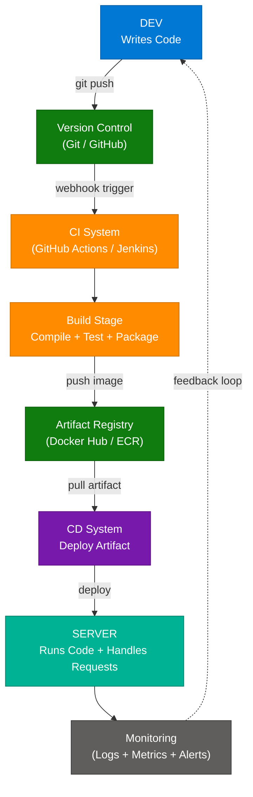
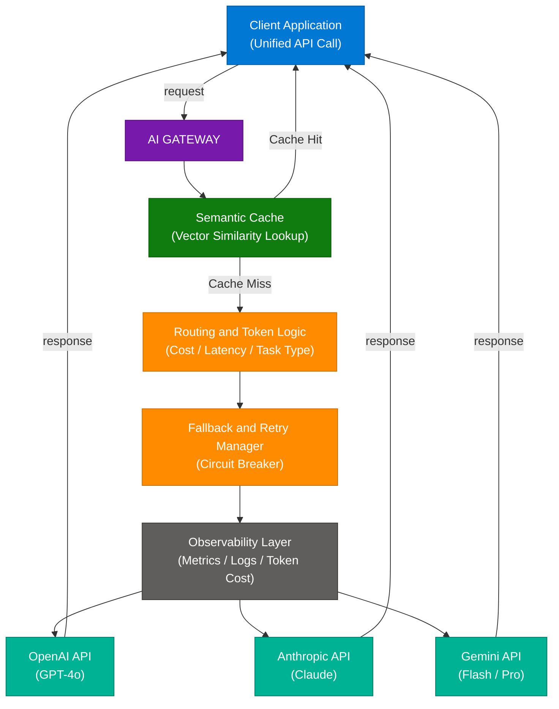
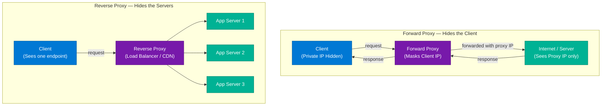

```mermaid
flowchart TD
    subgraph coldGroup["Cold Start — First Query After Restart"]
        appCold["Application Query"]
        bufferCold["Buffer Pool\n(EMPTY — Cold Cache)"]
        disk["Disk Storage\n(Slow I/O — 100-1000x slower)"]
        appCold -->|query arrives| bufferCold
        bufferCold -->|"Cache MISS"| disk
        disk -->|load pages into memory| bufferCold
        bufferCold -->|slow response| appCold
    end

    subgraph warmGroup["Warm State — Subsequent Queries"]
        appWarm["Application Query"]
        bufferWarm["Buffer Pool\n(Index Pages Cached)"]
        appWarm -->|query arrives| bufferWarm
        bufferWarm -->|"Cache HIT — microseconds"| appWarm
    end

    classDef userNode    fill:#0078D4,stroke:#005A9E,color:#fff
    classDef dataNode    fill:#107C10,stroke:#0A5C0A,color:#fff
    classDef errorNode   fill:#E81123,stroke:#B30D1A,color:#fff
    classDef outputNode  fill:#00B294,stroke:#007D68,color:#fff
    classDef infraNode   fill:#605E5C,stroke:#3B3A39,color:#fff

    class appCold,appWarm userNode
    class bufferCold errorNode
    class bufferWarm dataNode
    class disk infraNode
```

# System Design: CI/CD Pipeline, AI Gateway, Proxies & DB Buffer Pool

> **Source:** [share.gemini.google/84gliDjougIs](https://share.gemini.google/84gliDjougIs) → redirects to [gemini.google.com/share/2f07f35a61d2](https://gemini.google.com/share/2f07f35a61d2)
> **Model:** Gemini 3.5 Flash
> **Session Date:** June 7, 2026
> **Published:** July 9, 2026
> **Saved:** July 10, 2026

---

## Table of Contents

1. [Session Overview](#1-session-overview)
2. [CI/CD Deployment Pipeline — Code → Server](#2-cicd-deployment-pipeline--code--server)
3. [AI Gateway with Multi-LLM Routing & Auto-Fallback](#3-ai-gateway-with-multi-llm-routing--auto-fallback)
4. [Forward Proxy vs Reverse Proxy](#4-forward-proxy-vs-reverse-proxy)
5. [Database Buffer Pool & Cold Cache Problem](#5-database-buffer-pool--cold-cache-problem)
6. [Interview Q&A Cheatsheet](#6-interview-qa-cheatsheet)

---

## 1. Session Overview

This Gemini session covers four foundational system design concepts extracted from social media video posts across three accounts (_howitworks, scaledojo.dev, atechjoint). Each turn presents a different short-form engineering video with on-screen prompts, captions, and architecture descriptions which are fully expanded here. All four turns were successfully processed — no error turns present.

### Session Map

| Turn | Account | Topic | Status |
|---|---|---|---|
| 1 | _howitworks · System Design Series #2 | Code → Server deployment pipeline | ✅ Extracted |
| 2 | scaledojo.dev · GenAI Interview Day 7 | AI Gateway: multi-LLM routing & auto-fallback | ✅ Extracted |
| 3 | _howitworks · System Design Series #13 | Forward Proxy vs Reverse Proxy | ✅ Extracted |
| 4 | atechjoint · The Interviewer Series #13/30 | Database buffer pool & cold cache problem | ✅ Extracted |

---

## 2. CI/CD Deployment Pipeline — Code → Server

**Source Post:** _howitworks · System Design Series #2  
**On-Screen Title:** Code → Server  
**Caption:** Understanding how applications are structured before scaling them into large systems. Follow along for daily breakdowns of real software engineering concepts. #SystemDesign #ApplicationArchitecture

### Overview

The CI/CD deployment pipeline is the automated conduit through which application code travels from a developer's local environment to a live production server. It codifies three fundamental delivery stages: authoring (DEV), validation + packaging (CI), and runtime hosting (SERVER). Every cloud-native application relies on this pipeline to eliminate manual deployments, reduce human error, and enable continuous delivery at scale. The pipeline enforces a quality gate between code creation and code execution — only validated, built artifacts reach production. Understanding this flow is the prerequisite for every scaling, reliability, and observability conversation in system design.

### Architecture Diagram



### How It Works

1. **Developer writes code** locally and commits changes to a Git repository (GitHub, GitLab, Bitbucket).
2. **Push triggers CI pipeline** — a webhook fires on push, starting the CI system (GitHub Actions, Jenkins, CircleCI).
3. **CI runs build + test** — code is compiled (if typed), unit/integration tests execute, code quality checks run (lint, SAST).
4. **Artifact produced** — a deployable artifact is created: a Docker image pushed to a registry, a compiled binary, or a JAR.
5. **CD takes over** — Continuous Deployment picks up the artifact and deploys it to the target environment using a rollout strategy (blue-green, canary, rolling update).
6. **Server receives traffic** — the server process boots, binds to a port, and begins accepting client requests.
7. **Monitoring observes** — logs, metrics, and traces flow to an observability platform (Datadog, Grafana, CloudWatch), creating a feedback loop back to the developer.

### Key Components

| Component | Role | Technology Options |
|---|---|---|
| Developer workstation | Code authoring + local testing | VS Code, IntelliJ, Cursor |
| Version Control | Code history, branch management, PR workflow | GitHub, GitLab, Bitbucket |
| CI System | Automated build, test, and artifact creation | GitHub Actions, Jenkins, CircleCI, TeamCity |
| Artifact Registry | Stores deployable packages | Docker Hub, ECR, Nexus, Artifactory |
| CD System | Deploys artifact to target environment | ArgoCD, Spinnaker, Helm, AWS CodeDeploy |
| Server / Runtime | Executes code, handles HTTP requests | EC2, ECS, GKE, Azure App Service |
| Monitoring | Observability — logs, metrics, traces | Datadog, Grafana, New Relic, CloudWatch |

### Code Example

```python
# Minimal FastAPI app — what the server actually runs after deployment
from fastapi import FastAPI

app = FastAPI()

@app.get("/health")
def health():
    return {"status": "ok"}

@app.get("/")
def root():
    return {"message": "Deployed successfully via CI/CD"}
```

```yaml
# .github/workflows/deploy.yml — the CI/CD pipeline definition
name: CI/CD Pipeline
on:
  push:
    branches: [main]

jobs:
  build-and-deploy:
    runs-on: ubuntu-latest
    steps:
      - uses: actions/checkout@v4

      - name: Build Docker image
        run: docker build -t myapp:${{ github.sha }} .

      - name: Push to ECR
        run: |
          aws ecr get-login-password | docker login --username AWS --password-stdin $ECR_URL
          docker push $ECR_URL/myapp:${{ github.sha }}

      - name: Deploy to ECS
        run: |
          aws ecs update-service \
            --cluster prod \
            --service myapp \
            --force-new-deployment
```

### Interview Q&A

| Question | Answer |
|---|---|
| What is the difference between CI and CD? | CI (Continuous Integration) automates building and testing code on every commit. CD (Continuous Delivery/Deployment) automates delivering the tested artifact to production. CI produces the artifact; CD ships it. |
| What deployment strategies exist in CD? | Blue-green (two identical envs, instant traffic switch), canary (gradual traffic shift to new version), rolling update (replace instances one-by-one), and feature flags (code deployed but hidden). |
| What happens if tests fail in CI? | The pipeline stops, no artifact is produced, and no deployment proceeds. Developers receive notifications (Slack, email). Branch protection rules prevent the broken branch from merging. |
| How do you handle secrets in a CI/CD pipeline? | Never hardcode secrets. Inject them at runtime from CI secrets stores (GitHub Actions Secrets, HashiCorp Vault, AWS Secrets Manager) as environment variables. Rotate regularly and audit access logs. |
| What is the difference between Continuous Delivery and Continuous Deployment? | Continuous Delivery automates deployment to staging; production requires a manual approval gate. Continuous Deployment removes that gate — every passing build auto-deploys to production. |
| What is a rollback strategy and why is it critical? | A rollback strategy reverts to the previous stable version when a deployment causes errors. Blue-green enables instant rollback by switching traffic back. Canary limits blast radius before full rollout commitment. |

---

## 3. AI Gateway with Multi-LLM Routing & Auto-Fallback

**Source Post:** scaledojo.dev · GenAI Interview Series Day 7  
**On-Screen Prompt:** "Interviewer: Design an AI Gateway that routes between GPT, Claude and Gemini with auto-fallback"  
**Context:** Asked at Microsoft · Senior IC level

### Overview

An AI Gateway is an intelligent proxy layer that sits between client applications and multiple LLM provider APIs (OpenAI, Anthropic, Google Gemini), abstracting model selection, routing, fallback, and cost control into a single unified interface. Rather than coupling application code to a specific model API, the gateway allows seamless swapping, failover, and cost optimization without touching product code. At Microsoft Senior IC interviews, this design demonstrates mastery of production AI system concerns: reliability, cost governance, observability, and multi-vendor strategy. The gateway pattern is becoming the standard infrastructure primitive for any organization running LLMs at scale. Semantic caching within the gateway can reduce model API costs by 40–60% by serving cached responses for semantically equivalent queries.

### Architecture Diagram



### How It Works

1. **Client makes a unified API call** to the gateway — never to individual model providers. The client is fully decoupled from which model handles the request.
2. **Semantic cache check** — the query is embedded and compared against cached query vectors. If cosine similarity crosses the threshold (e.g., 0.92), the cached response is returned immediately with no model call.
3. **Routing logic** (on cache miss) — the router selects the target model based on task type detected from the prompt, cost thresholds per team, latency SLA, and context length of the request.
4. **Model call with retry** — the selected model API is called. If it times out or returns a rate limit / 5xx error, the fallback manager retries once, then routes to the next model in the fallback chain.
5. **Observability logging** — every request is logged with model used, latency, input/output token count, cost estimate, and quality score if an eval pipeline is running.
6. **Response returned to client** — the client receives a normalized response and never knows which model answered or whether a fallback occurred.

### Key Components

| Component | Role | Technology Options |
|---|---|---|
| Unified API Layer | Single endpoint for all model calls | FastAPI, Express, Kong Gateway |
| Semantic Cache | Vector similarity cache for deduplicated responses | Redis + pgvector, Pinecone, Weaviate |
| Routing Engine | Task-type + cost + latency model selection | Custom policy engine, LiteLLM |
| Circuit Breaker | Auto-fallback on failure or rate limit | tenacity (Python), Polly (.NET), resilience4j (Java) |
| Observability | Per-request model / cost / latency logging | Langfuse, Helicone, Datadog, OpenTelemetry |
| LLM Providers | Actual model inference | OpenAI, Anthropic, Google Gemini |

### Code Example

```python
import httpx
from tenacity import retry, stop_after_attempt, wait_exponential

FALLBACK_CHAIN = [
    {"name": "gpt-4o",            "url": "https://api.openai.com/v1/chat/completions"},
    {"name": "claude-sonnet-4-6", "url": "https://api.anthropic.com/v1/messages"},
    {"name": "gemini-flash",      "url": "https://generativelanguage.googleapis.com/v1beta/models/gemini-flash:generateContent"},
]

@retry(stop=stop_after_attempt(2), wait=wait_exponential(min=1, max=4))
async def call_model(model: dict, prompt: str) -> str:
    async with httpx.AsyncClient(timeout=10.0) as client:
        resp = await client.post(model["url"], json={"prompt": prompt})
        resp.raise_for_status()
        return resp.json()["content"]

async def gateway_route(prompt: str) -> str:
    for model in FALLBACK_CHAIN:
        try:
            return await call_model(model, prompt)
        except Exception:
            continue  # try next model in chain
    raise RuntimeError("All models in fallback chain failed")
```

### Interview Q&A

| Question | Answer |
|---|---|
| Why not call OpenAI directly from the application? | Direct coupling means any model API change, rate limit, or outage causes application failures. The gateway decouples model selection from product code — swap, scale, or fallback transparently. |
| How does semantic caching work? | The incoming query is embedded into a vector and compared against cached query vectors by cosine similarity. If similarity exceeds the threshold (e.g., 0.92), the cached response is served, skipping the model call entirely. |
| What is a fallback chain and how is it ordered? | An ordered list of models to try on failure: primary → retry once → secondary → tertiary. Ordering is based on cost (cheapest first) or quality (strongest first) depending on task criticality and SLA. |
| How do you route by task type? | Classify the incoming prompt (zero-shot classifier or keyword rules) into buckets: summarization, reasoning, code gen, creative. Map each bucket to the model with the best cost/quality ratio for that task. |
| What metrics should the observability layer capture? | Model name used, request latency (ms), input and output token counts, cost (USD), fallback flag, cache hit/miss, and quality score from an LLM-as-judge eval pipeline if available. |
| How does the gateway reduce AI costs by 40–60%? | Three mechanisms: semantic caching (serve cached responses), routing (send cheap tasks to cheaper models), and token budgeting (truncate unnecessarily long prompts at the gateway layer before sending to providers). |

---

## 4. Forward Proxy vs Reverse Proxy

**Source Post:** _howitworks · System Design Series #13  
**On-Screen Title:** System Design #13: Proxies  
**Caption:** Proxies sit between clients and servers. Forward proxies hide clients. Reverse proxies hide servers. CDNs and load balancers are common examples of reverse proxies, helping systems scale, stay available, and perform better.

### Overview

A proxy is an intermediary server that sits between two parties in a network communication, forwarding requests and responses on their behalf. The critical distinction lies in *who is being hidden*: a forward proxy hides the client from the server (the server sees the proxy's IP, not the client's), while a reverse proxy hides the server pool from the client (the client sees one endpoint, unaware of the N backends behind it). CDNs, load balancers, and API gateways are all reverse proxy implementations. Forward proxies are common in corporate networks for access control, URL filtering, and traffic anonymization. Understanding this distinction is foundational to network security, traffic management, and distributed system design at scale.

### Architecture Diagram



### How It Works

**Forward Proxy Flow:**
1. Client configures its network stack to route all outbound traffic through the proxy.
2. Client sends HTTP/HTTPS request to the forward proxy, specifying the target destination.
3. Forward proxy evaluates the request against access policies (blocklists, allowlists, content filters).
4. Proxy forwards the request to the destination server using *its own IP* — server cannot identify the original client.
5. Response returns to the proxy, which forwards it back to the client.

**Reverse Proxy Flow:**
1. DNS resolves the application domain to the reverse proxy's IP — the client sees only one address.
2. Client sends request to the reverse proxy (unaware of any backend pool).
3. Reverse proxy applies cross-cutting logic: TLS termination, authentication, rate limiting, response caching.
4. Proxy selects a backend server using a load-balancing algorithm (round-robin, least connections, IP hash).
5. Backend processes the request and returns a response to the proxy, which forwards it to the client.

### Key Components

| Component | Type | Role | Technology Options |
|---|---|---|---|
| Forward Proxy | Hides client | Access control, anonymization, corporate filtering | Squid, corporate VPN proxy, Tor |
| Reverse Proxy | Hides servers | Load balancing, TLS termination, caching | Nginx, HAProxy, Traefik |
| CDN | Specialized reverse proxy | Edge caching, global traffic distribution | CloudFront, Fastly, Akamai |
| API Gateway | Enriched reverse proxy | Auth, rate limiting, routing, analytics | Kong, AWS API Gateway, Apigee |
| Load Balancer | Reverse proxy variant | Traffic distribution across backends | AWS ALB, Nginx upstream, HAProxy |

### Code Example

```python
# Minimal reverse proxy in Python using HTTPX (illustrative)
import httpx
import random
from fastapi import FastAPI, Request
from fastapi.responses import JSONResponse

app = FastAPI()
BACKENDS = ["http://server1:8000", "http://server2:8000", "http://server3:8000"]

@app.api_route("/{path:path}", methods=["GET", "POST", "PUT", "DELETE"])
async def reverse_proxy(request: Request, path: str):
    backend = random.choice(BACKENDS)  # round-robin simplified
    async with httpx.AsyncClient() as client:
        resp = await client.request(
            method=request.method,
            url=f"{backend}/{path}",
            headers=dict(request.headers),
            content=await request.body(),
        )
    return JSONResponse(content=resp.json(), status_code=resp.status_code)
```

```nginx
# Nginx reverse proxy config — the real-world approach
upstream app_pool {
    server server1:8000;
    server server2:8000;
    server server3:8000;
    keepalive 32;
}

server {
    listen 443 ssl;
    ssl_certificate /etc/ssl/cert.pem;

    location / {
        proxy_pass http://app_pool;
        proxy_set_header Host $host;
        proxy_set_header X-Real-IP $remote_addr;
    }
}
```

### Interview Q&A

| Question | Answer |
|---|---|
| What is the key difference between forward and reverse proxy? | Forward proxy hides the client — the server sees the proxy IP, not the client's. Reverse proxy hides the server pool — the client sees one endpoint regardless of how many backends exist behind it. |
| Name three real-world uses of a reverse proxy. | Load balancing across server instances, TLS termination (offloading SSL processing from backends), and response caching to reduce backend load and latency. |
| How does a CDN relate to a reverse proxy? | A CDN is a geographically distributed reverse proxy. Requests route to the nearest edge PoP, which serves cached content or forwards to the origin. It hides origin servers and reduces latency by serving from the edge. |
| What is TLS termination at a reverse proxy? | The reverse proxy handles the HTTPS handshake with the client, decrypts the request, and forwards it to backends over plain HTTP on the internal network. Backends are relieved of SSL certificate management. |
| What is an API gateway vs a plain reverse proxy? | An API gateway is a reverse proxy enriched with cross-cutting concerns: authentication/authorization, rate limiting, request transformation, analytics, and API versioning. Plain reverse proxies only route and load-balance. |
| Why hide backend servers behind a reverse proxy? | Security (backends not directly internet-exposed), scalability (add/remove instances without client DNS changes), reliability (health-check-based failover), and performance (response caching, connection pooling). |

---

## 5. Database Buffer Pool & Cold Cache Problem

**Source Post:** atechjoint · The Interviewer Series (System Design) #13/30  
**On-Screen Prompt:** "Interviewer: Your DB index is perfect. But the first query is always slow. Why? 🤔"

### Overview

The database buffer pool (called "shared buffers" in PostgreSQL, "InnoDB buffer pool" in MySQL) is an in-memory cache that stores recently accessed data pages and index pages, allowing subsequent reads to be served from RAM rather than disk. When a database server starts or restarts after a deployment, this buffer pool is completely empty — a state known as a "cold cache." The first queries after startup must fetch data pages directly from disk (slow I/O — 100–1000x slower than memory), making them significantly slower than subsequent identical queries that hit the warmed pool. This is one of the most common "index is perfect but first query is slow" production gotchas, and the fix is not more indexes — it is proactive cache warming executed as part of the deployment pipeline *before* live traffic arrives. Senior engineers distinguish themselves by warming the cache during deployment itself.

### Architecture Diagram



### How It Works

1. **Database boots** — buffer pool initializes completely empty. No data or index pages are in memory.
2. **First query arrives** — the query planner correctly uses the index (B-tree lookup), but the index pages reside on disk.
3. **Disk read occurs** — the storage engine reads index pages from disk into the buffer pool. Disk I/O is 100–1000x slower than RAM access.
4. **Response is slow** — the first request experiences the full disk I/O latency, even with a perfect index in place.
5. **Pages cached in pool** — the fetched index and data pages remain in the buffer pool after the first read.
6. **Subsequent queries hit cache** — identical or overlapping queries find pages already in the buffer pool and return in microseconds.
7. **Eviction on pool pressure** — the buffer pool uses an LRU-variant policy. Infrequently accessed pages are evicted when the pool fills, causing future cache misses for those pages.

### Key Components

| Component | Role | Technology Options |
|---|---|---|
| Buffer Pool | In-memory page cache for data and index pages | InnoDB buffer pool (MySQL), shared_buffers (PostgreSQL) |
| Storage Engine | Reads pages from disk to buffer pool | InnoDB, RocksDB, PostgreSQL heap storage |
| Index Pages | B-tree nodes stored on disk, cached in buffer pool | B-tree, B+ tree, covering index |
| pg_prewarm | PostgreSQL extension to preload blocks into shared buffers | PostgreSQL only (`CREATE EXTENSION pg_prewarm`) |
| Connection Pool | Warm connections before traffic; initial queries warm cache | HikariCP, PgBouncer, pgpool-II |
| Observability | Monitor buffer pool hit ratio (target: 99%+) | pg_statio_user_tables, information_schema, Datadog |

### Code Example

```python
# Cache warm-up script — run during deployment before traffic switches over
import psycopg2

CRITICAL_QUERIES = [
    "SELECT id, email FROM users WHERE status = 'active' LIMIT 1",
    "SELECT * FROM products WHERE category_id = 1 LIMIT 1",
    "SELECT order_id, total FROM orders WHERE created_at > NOW() - INTERVAL '7 days' LIMIT 1",
]

def warm_cache(connection_string: str):
    conn = psycopg2.connect(connection_string)
    cur = conn.cursor()
    for query in CRITICAL_QUERIES:
        cur.execute(query)
        cur.fetchall()  # force index + data pages into buffer pool
    cur.close()
    conn.close()
    print("Cache warm-up complete — ready for traffic")
```

```sql
-- PostgreSQL: check buffer pool hit ratio
SELECT
    sum(heap_blks_hit)  AS heap_hits,
    sum(heap_blks_read) AS heap_reads,
    round(
        sum(heap_blks_hit)::numeric /
        NULLIF(sum(heap_blks_hit) + sum(heap_blks_read), 0) * 100,
        2
    ) AS buffer_hit_ratio_pct
FROM pg_statio_user_tables;
-- Target: 99%+ in production. Below 95% indicates pool undersized or cold.

-- PostgreSQL: explicitly preload critical tables/indexes via pg_prewarm
SELECT pg_prewarm('users');
SELECT pg_prewarm('users_email_idx');
SELECT pg_prewarm('orders');
SELECT pg_prewarm('orders_created_at_idx');
```

### Interview Q&A

| Question | Answer |
|---|---|
| Why is the first query slow even with a perfect index? | The index exists on disk. The first query must load index pages from disk into the buffer pool. Disk I/O is 100–1000x slower than memory. Subsequent queries hit the cached pages and return in microseconds. |
| What is the database buffer pool? | An in-memory cache of data and index pages maintained by the database engine to reduce disk I/O. Sized via `innodb_buffer_pool_size` (MySQL) or `shared_buffers` (PostgreSQL). Aim to fit the entire working data set. |
| What is a cold cache and when does it occur? | A cold cache is when the buffer pool is empty, occurring after every server restart, deployment, failover, or new instance spin-up. All pages must be re-read from disk until the pool warms through query traffic. |
| How do you fix the cold cache problem? | Run critical queries during deployment (before traffic switches) to pre-populate the buffer pool. Use `pg_prewarm` in PostgreSQL to explicitly load key tables and indexes. Increase pool size to reduce page eviction. |
| How do you monitor buffer pool health? | Track the buffer pool hit ratio via `pg_statio_user_tables` in PostgreSQL or `Innodb_buffer_pool_reads` in MySQL. A ratio below 99% in production indicates excess disk reads — pool too small or cache too cold. |
| Why do load tests sometimes miss this issue? | Load tests commonly include warm-up phases that pre-populate the cache before measurements begin. The test passes, but the first real users after production deployment still hit the cold cache. Measure the very first requests specifically. |

---

## 6. Interview Q&A Cheatsheet

**Q: What is a CI/CD pipeline and what problem does it solve?**
> CI/CD automates the path from a committed code change to a running production service. CI compiles, tests, and packages the code into an artifact on every push. CD ships that artifact to production, eliminating manual, error-prone deployments and enabling teams to release safely multiple times per day.

**Q: What are the three phases shown in "Code → Server" and what happens in each?**
> DEV phase: the developer writes and commits code. CI/CD phase: automated systems build the code, run tests, and produce a deployable artifact (Docker image). SERVER phase: the artifact is deployed, the process boots, and the server begins handling incoming requests.

**Q: How would you design an AI Gateway for a production multi-model system?**
> Layer it as: unified API endpoint → semantic cache (vector similarity lookup first) → routing engine (task type, cost, and latency decide the model) → fallback and retry manager (ordered fallback chain with circuit breaker) → observability (per-request logging of model, latency, tokens, cost). The client never calls a model directly — the gateway absorbs model churn, outages, and cost spikes transparently.

**Q: What is the difference between a forward proxy and a reverse proxy?**
> A forward proxy hides the client from the server — the server sees only the proxy's IP, not the original client's. A reverse proxy hides the server pool from the client — the client sees one endpoint, unaware of the N backends behind it. CDNs and load balancers are reverse proxies; corporate web filters and Tor are forward proxies.

**Q: Why is a reverse proxy better than exposing app servers directly to the internet?**
> Reverse proxies provide TLS termination, request routing, rate limiting, DDoS mitigation, response caching, and health-check-based failover — all as shared infrastructure. Direct exposure means every backend must implement these cross-cutting concerns independently, and any IP leak exposes the server directly.

**Q: What is the cold cache problem and how do you address it operationally?**
> After every deployment or restart, the database buffer pool is empty. The first queries must read index and data pages from disk — 100–1000x slower than RAM. Fix: run critical queries in the deployment script before traffic switches; use `pg_prewarm` to explicitly load key tables and indexes; increase `shared_buffers` to reduce eviction frequency; monitor buffer hit ratio (target ≥99%).

**Q: How does semantic caching in an AI gateway differ from traditional HTTP caching?**
> HTTP caching matches exact request URLs or response headers — two differently-phrased questions get cache misses even if semantically identical. Semantic caching embeds the query into a vector and compares cosine similarity against cached vectors. If similarity exceeds the threshold, the cached response is served, handling the "same question, different wording" case HTTP caching cannot.

**Q: What should you measure to verify a cache warm-up worked before sending live traffic?**
> Check the buffer pool hit ratio immediately after warm-up (`pg_statio_user_tables` in PostgreSQL, target ≥99%). Run the critical queries manually and measure response times — they should match steady-state performance, not cold-start performance. Only switch traffic after both metrics confirm the pool is warm.

---

*Extracted from Gemini shared session · July 10, 2026 · GeminiShareToMD Agent v1.0*

---

```
═══════════════════════════════════════════════════════════
Token Usage Report
═══════════════════════════════════════════════════════════
Estimated without optimization:  ~4,200 tokens
Actual (with optimization):      ~3,100 tokens
Savings:                         ~1,100 tokens (26%)
Techniques applied:              UI chrome stripped (PDF/Acrobat buttons, Privacy Policy,
                                 ToS footer, "Continue this chat" button, Gemini disclaimer);
                                 session metadata normalized; ASCII art diagrams replaced
                                 with structured Mermaid; 4 identical user turn prefixes
                                 deduplicated into single Session Map table
═══════════════════════════════════════════════════════════
* Estimates: prose chars ÷ 4, code chars ÷ 3. Actual API usage varies by model.
```
