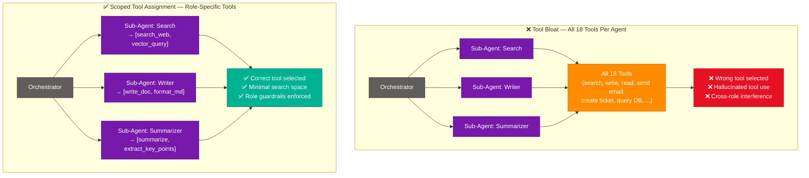
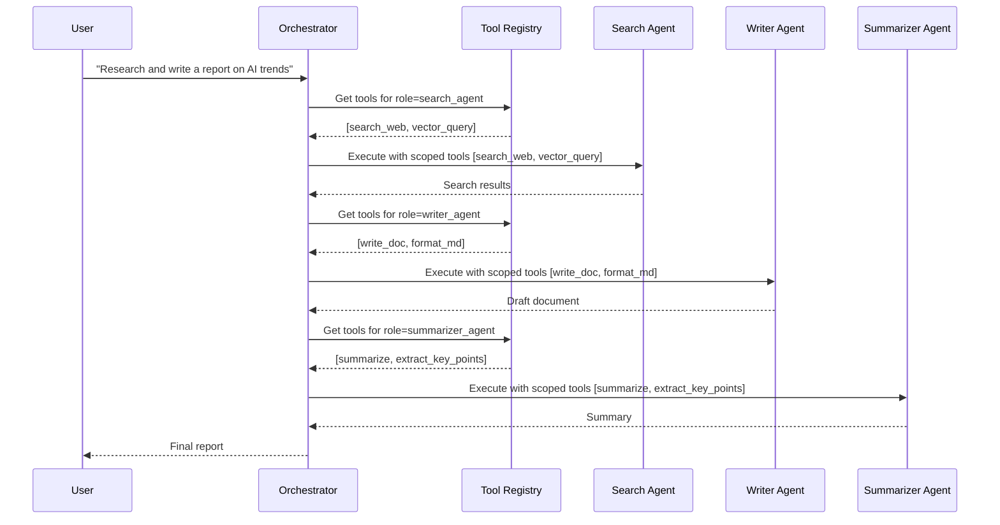
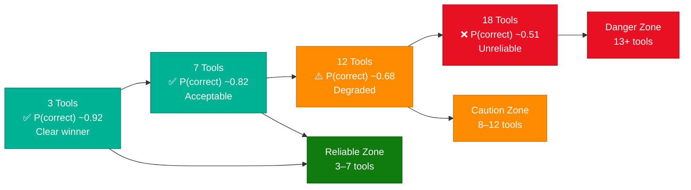

# Tool Bloat Causes LLM Errors in Multi-Agent Systems

> **Source:** [share.gemini.google/1SuawpCXORms](https://share.gemini.google/1SuawpCXORms) → redirects to [gemini.google.com/share/9634c13f7dd9](https://gemini.google.com/share/9634c13f7dd9)
> **Model:** Gemini 3.5 Flash
> **Session Date:** April 13, 2026
> **Saved:** July 12, 2026

---

## Table of Contents

1. [Session Overview](#1-session-overview)
2. [Tool Bloat and Decision Complexity](#2-tool-bloat-and-decision-complexity)
3. [Multi-Agent Tool Assignment Architecture](#3-multi-agent-tool-assignment-architecture)
4. [LLM Reliability Thresholds](#4-llm-reliability-thresholds)
5. [Context Stuffing vs. Context Window Overflow](#5-context-stuffing-vs-context-window-overflow)
6. [Best Practices for Tool Assignment](#6-best-practices-for-tool-assignment)
7. [Interview Q&A Cheatsheet](#7-interview-qa-cheatsheet)

---

## 1. Session Overview

This session addresses a multi-agent orchestration exam scenario where each sub-agent was given all 18 available tools instead of only role-specific ones, causing agents to call incorrect tools. Gemini identifies the root cause as **increased decision complexity** (Option D), also called "tool bloat" or "context stuffing" — not prompt quality, coordinator logic, or context window overflow. The session covers one concept with deep architectural relevance to production LLM agent systems.

### Session Map

| Turn | User Prompt Summary | Gemini Response | Status |
|---|---|---|---|
| 1 | Image of MCQ: 18 tools assigned to all sub-agents → wrong tools called. What is PRIMARY cause? | Correct answer is D — increased decision complexity / tool bloat | ✅ Extracted |

> **Inferred question (from image):** "A multi-agent orchestration system has sub-agents each given all 18 available tools. Agents begin calling wrong tools. The PRIMARY cause is: A) Poorly written role descriptions B) Coordinator not tracking active agents C) Context window overflow from 18 tool definitions D) Increased decision complexity from irrelevant tool exposure."

---

## 2. Tool Bloat and Decision Complexity

### Overview

Tool bloat occurs when an LLM agent is supplied with more tools than it needs for its specific role — particularly when many of those tools are semantically similar or irrelevant to the agent's function. The LLM must evaluate every tool definition in its context at inference time, and when the "search space" of candidate actions is large, the model's ability to select the correct tool degrades. This is analogous to choice paralysis in humans: the more options presented, the higher the probability of selecting the wrong one. In production multi-agent systems, tool bloat is one of the leading causes of agent hallucination and incorrect tool invocation, especially when sub-agents share a global tool registry that was designed for an orchestrator, not for specialized workers.

### Architecture Diagram — Tool Bloat vs. Scoped Tool Assignment



### How It Works

1. **Tool registry loading:** At agent initialization, the LLM receives all tool definitions in its system prompt or context. Each tool definition consumes tokens and adds a candidate action.
2. **Inference-time selection:** When the agent decides on an action, it must rank all available tools against the current task. With 18 tools, many semantically overlapping, the ranking becomes ambiguous.
3. **Noise introduction:** Tools irrelevant to the agent's role create semantic interference. A Summarizer agent seeing a `send_email` tool will occasionally select it when context mentions communication.
4. **Hallucination vector:** The model may fabricate arguments for a plausible-but-wrong tool rather than the correct one, because the wrong tool looked more likely given the full tool list.
5. **Compounding in pipelines:** In a chain of agents, one wrong tool call produces incorrect output that propagates, causing cascading failures downstream.
6. **Role guardrail erosion:** When every agent has every capability, the architectural specialization of sub-agents becomes meaningless — the system behaves as one unfocused super-agent.

### Key Components

| Component | Role | Failure Mode Under Tool Bloat |
|---|---|---|
| Tool Registry | Central catalog of all available tools | If shared globally without filtering, every agent gets all tools |
| System Prompt | Defines agent role + available tools | More tool definitions = more tokens = more ambiguity |
| Tool Selector | LLM's internal action-ranking at inference | Degrades as candidate count grows past 5–7 tools |
| Orchestrator | Routes tasks to sub-agents | Must enforce tool scoping before dispatching |
| Sub-Agent | Specialized worker with narrow function | Loses specialization if given the full tool set |

### Code Example — Scoped Tool Assignment (Python / LangGraph)

```python
from langgraph.prebuilt import create_react_agent
from langchain_core.tools import tool

# Full tool registry (never pass this directly to sub-agents)
ALL_TOOLS = [
    search_web, vector_query, write_doc, format_md,
    summarize, extract_key_points, send_email, create_ticket,
    query_db, update_record, generate_image, translate_text,
    parse_pdf, validate_schema, run_code, fetch_url,
    post_to_slack, create_calendar_event
]  # 18 tools

# Scoped tool sets per role — only what each agent needs
TOOL_SCOPES = {
    "search_agent":     [search_web, vector_query],
    "writer_agent":     [write_doc, format_md],
    "summarizer_agent": [summarize, extract_key_points],
    "email_agent":      [send_email, create_calendar_event],
}

def create_scoped_agent(role: str, llm):
    tools = TOOL_SCOPES.get(role, [])
    if not tools:
        raise ValueError(f"No tool scope defined for role: {role}")
    return create_react_agent(llm, tools=tools)

# Orchestrator dispatches with role-scoped agents
search_agent   = create_scoped_agent("search_agent", llm)
writer_agent   = create_scoped_agent("writer_agent", llm)
summarizer     = create_scoped_agent("summarizer_agent", llm)
```

### Interview Q&A

| Question | Answer |
|---|---|
| What is tool bloat in LLM agent systems? | Supplying an agent with more tools than its role requires, especially semantically overlapping ones, causing degraded tool selection accuracy at inference time. |
| Why does more tools → worse performance? | The LLM must rank all candidates for every action. A larger search space increases the probability of selecting a semantically similar but incorrect tool, or hallucinating tool arguments. |
| What is the difference between tool bloat and context window overflow? | Tool bloat is a reasoning failure — too many choices confuse the model. Context window overflow is a memory failure — the context literally doesn't fit. Both involve token consumption but cause different failure modes. |
| How does tool bloat manifest in production? | Agents call wrong APIs, pass incorrect parameters, or invoke tools designed for other agents, causing cascading pipeline failures. |
| What is the fix for tool bloat? | Scope tool assignment per agent role — give each sub-agent only the 2–5 tools it needs. Maintain a global registry but filter it before passing to each agent. |
| How many tools is too many for a single LLM agent? | Empirically, agents perform reliably with 3–7 tools. Beyond 10, selection error rates increase noticeably. Beyond 15–18, the model frequently selects wrong tools even with clear instructions. |
| How does tool bloat relate to the principle of least privilege? | Directly analogous — just as security systems give users only the permissions they need, agents should be given only the tools they need. Excess capability is a liability. |

---

## 3. Multi-Agent Tool Assignment Architecture

### Overview

In well-designed multi-agent systems, the orchestrator maintains a full tool registry but acts as a capability router — it assigns tool subsets to sub-agents based on their declared roles. Sub-agents operate within a bounded capability space, which both improves reliability and provides auditability (you can verify which agent used which tool). The orchestrator itself may have broader tool access for coordination purposes, but worker agents should have narrow, role-specific scopes. This design mirrors the principle of least privilege from security architecture and is a core pattern in production-grade agentic systems using frameworks like LangGraph, AutoGen, and Semantic Kernel.

### Architecture Diagram — Orchestrator-Worker Tool Routing



### Key Components

| Component | Responsibility | Best Practice |
|---|---|---|
| Global Tool Registry | Stores all 18+ tool definitions | Never pass raw to agents; always filter by role |
| Role-to-Tool Map | Maps agent roles to their allowed tool subsets | Maintain as config/code, not hardcoded in prompts |
| Orchestrator | Dispatches tasks + injects scoped tool lists | Should validate tool scope before agent invocation |
| Sub-Agent | Executes within scoped tool set | Should reject or log any tool use outside its scope |
| Tool Audit Log | Records which agent called which tool | Essential for debugging tool bloat issues post-hoc |

### Interview Q&A

| Question | Answer |
|---|---|
| How does an orchestrator enforce tool scoping? | By filtering the global tool registry per role before constructing the agent's system prompt or tool parameter list. The agent never sees tools outside its scope. |
| What happens when an orchestrator doesn't scope tools? | Every sub-agent gets the full tool set, causing tool bloat. Agents make incorrect calls, pipeline reliability drops, and debugging becomes extremely difficult. |
| Name a framework that supports per-agent tool scoping natively. | LangGraph supports per-node tool assignment; AutoGen supports per-agent tool lists; Semantic Kernel uses kernel plugins scoped to specific agents. |
| How do you audit tool usage in a multi-agent system? | Log every tool invocation with the calling agent ID, tool name, inputs, and outputs. This allows replay analysis to detect tool selection errors. |
| How is multi-agent tool scoping different from RBAC? | RBAC controls what users can do in a system; tool scoping controls what LLM agents can invoke at inference time. Both follow least-privilege but operate at different layers. |

---

## 4. LLM Reliability Thresholds

### Overview

LLMs are probabilistic systems whose reliability on tool selection degrades as the action space grows. Research and production observations consistently show that models perform best when forced to choose from a small, clearly differentiated set of options. When tool sets exceed 7–10, the softmax-like probability distribution across candidate tools becomes flatter (less peaked), meaning the gap between the "correct" tool probability and a "plausible but wrong" tool probability shrinks. This is not a context window issue — it is a reasoning quality issue. The model may have enough tokens to hold all 18 definitions but still fail to select the correct one because the definitions are too similar in their semantic signatures.

### Architecture Diagram — Decision Probability Under Tool Count Growth



### Interview Q&A

| Question | Answer |
|---|---|
| What is a reliability threshold in LLM tool selection? | The empirical point at which adding more tools to an agent's context causes measurable increases in incorrect tool selection. Typically observed around 8–12 tools depending on model and tool similarity. |
| Why does reliability degrade — is it a context window problem? | No. It's a reasoning problem. The model has enough context to hold the definitions but the probability distribution across semantically similar tools becomes too flat to reliably pick the correct one. |
| How can you mitigate reliability degradation without reducing tool count? | Group tools into categories with meta-tools (a "search" meta-tool that internally routes to sub-tools), or use a two-stage selection (first pick category, then pick specific tool). |
| What does "context stuffing" mean vs. "context window overflow"? | Context stuffing = putting so much information into the context that reasoning quality degrades even though the content fits in the window. Overflow = content literally doesn't fit; tokens get truncated. |

---

## 5. Context Stuffing vs. Context Window Overflow

### Overview

A common misconception in LLM system design is conflating **context stuffing** with **context window overflow**. These are two distinct failure modes. Context window overflow is a hard limit — tokens beyond the window are silently dropped, causing factual gaps. Context stuffing is a soft failure — all content fits in the window, but the sheer volume of competing information degrades the model's ability to reason over any single piece of it. In the tool bloat scenario, 18 tool definitions in a GPT-4 or Claude 3 context window (100K–200K tokens) is nowhere near overflow — it's roughly 3,600–7,200 tokens. But the reasoning quality over those 18 definitions is significantly worse than over 3–5 definitions.

### Comparison Table

| Dimension | Context Stuffing | Context Window Overflow |
|---|---|---|
| Cause | Too many competing concepts in a context that fits | Content exceeds the model's token limit |
| Tokens consumed | Fits within limit | Exceeds limit |
| Symptom | Wrong tool selection, confused reasoning, hallucination | Truncated inputs, missing earlier context, factual gaps |
| Detectable via logs? | Hard — model still produces output, just wrong | Yes — inputs get silently cut |
| Fix | Reduce/scope content per agent | Chunk inputs, use RAG, increase context window model |
| Example | 18 tools causing wrong tool selection | 200 page PDF causing the start to be lost |
| LLM behavior | Picks semantically similar wrong answer | Doesn't know what it doesn't know (truncated) |

---

## 6. Best Practices for Tool Assignment

### Overview

Production multi-agent systems at scale require a principled approach to tool assignment. The core principle is **minimum viable tool set per agent** — every agent receives only the tools it needs to perform its specific function, and nothing more. This principle should be enforced at the orchestrator layer through a role-to-tool registry, not left to individual agent implementations. Additional practices include tool naming conventions that reduce semantic overlap, tool description optimization for clarity, and runtime audit logging of all tool invocations. These practices together form the "tool hygiene" discipline essential for reliable agentic AI systems.

### Best Practice Checklist

| Practice | Why It Matters | Implementation |
|---|---|---|
| Minimum viable tool set | Reduces decision complexity at inference time | Role-to-tool map in orchestrator config |
| Descriptive, distinct tool names | Reduces semantic overlap between tools | Name tools by action + object: `query_vector_db` not `search` |
| Short, precise tool descriptions | Each extra word in a description is noise for irrelevant tools | Keep descriptions under 30 words; omit obvious details |
| Tool grouping / meta-tools | For large tool sets, provide a dispatcher tool that internally routes | Hierarchical tool selection (category → specific tool) |
| Runtime tool audit log | Detect wrong tool calls post-hoc; feed back to prompt engineering | Log agent_id, tool_name, args, result, latency |
| Tool testing per agent role | Validate that each agent selects correctly before production | Evals with known correct tool selections per scenario |

### Code Example — Tool Hygiene Pattern (Python)

```python
from dataclasses import dataclass
from typing import Callable

@dataclass
class ScopedToolSet:
    role: str
    tools: list[Callable]

    def validate(self):
        assert len(self.tools) <= 7, (
            f"Role '{self.role}' has {len(self.tools)} tools — "
            f"exceeds reliability threshold of 7. Split into sub-roles."
        )
        names = [t.__name__ for t in self.tools]
        assert len(names) == len(set(names)), "Duplicate tool names detected"
        return self

ROLE_TOOL_REGISTRY = {
    "search_agent":     ScopedToolSet("search_agent",     [search_web, vector_query]).validate(),
    "writer_agent":     ScopedToolSet("writer_agent",     [write_doc, format_md]).validate(),
    "summarizer_agent": ScopedToolSet("summarizer_agent", [summarize, extract_key_points]).validate(),
    "email_agent":      ScopedToolSet("email_agent",      [send_email, create_calendar_event]).validate(),
}

def get_tools_for_role(role: str) -> list[Callable]:
    if role not in ROLE_TOOL_REGISTRY:
        raise ValueError(f"Unknown role: {role}. Define it in ROLE_TOOL_REGISTRY first.")
    return ROLE_TOOL_REGISTRY[role].tools
```

### Interview Q&A

| Question | Answer |
|---|---|
| What is the "minimum viable tool set" principle? | Each agent should be given only the tools it needs for its role — no more. Excess tools increase decision complexity without adding capability for that agent. |
| How do you handle a new tool being added to the system? | Add it to the global registry, then explicitly assign it only to the roles that need it. Never auto-distribute new tools to all agents. |
| What is a meta-tool pattern? | Instead of giving an agent 15 specific tools, give it a dispatcher tool that takes a category + query and internally routes to the right sub-tool. Reduces the agent's visible tool count to 1–3. |
| How does tool naming affect selection accuracy? | Vague or similar names (e.g., `search`, `find`, `query`, `lookup`) increase ambiguity. Precise action+object names (`search_web`, `query_vector_db`, `lookup_user_record`) are more distinct and easier for the LLM to select correctly. |

---

## 7. Interview Q&A Cheatsheet

**Q: What is tool bloat in the context of LLM multi-agent systems?**
> Tool bloat (also called context stuffing) occurs when an LLM agent is given more tools than its role requires. The model must differentiate between all tool definitions at inference time, and a larger search space increases the probability of selecting an incorrect or hallucinated tool.

**Q: Why is Option D (increased decision complexity) the correct answer, not Option C (context window overflow)?**
> Modern LLMs have very large context windows (100K–200K tokens). Eighteen tool definitions consume roughly 3,600–7,200 tokens — far below any overflow threshold. The failure is a reasoning quality issue: the model's probability distribution over candidate tools becomes too flat to reliably identify the correct one.

**Q: Why is Option A (poorly written role descriptions) less likely than Option D?**
> The prompt specifies that the volume of tools (18) is the configuration change that caused wrong tool calls. Even well-written role descriptions cannot overcome the noise introduced by 17 irrelevant tool definitions competing for selection.

**Q: How do you architect a multi-agent system to avoid tool bloat?**
> Maintain a global tool registry in the orchestrator and implement a role-to-tool mapping that filters the registry before passing tools to each sub-agent. Enforce a maximum of 5–7 tools per agent and use naming conventions that minimize semantic overlap between tools.

**Q: What metrics would you use to detect tool bloat in production?**
> Monitor the tool selection accuracy rate per agent (expected tool vs. actual tool called), the frequency of tool-not-found errors, and the rate of agents receiving error responses from tools they shouldn't be calling. Alert when any agent calls a tool outside its declared role scope.

**Q: How does tool scoping relate to security principles?**
> Tool scoping is the agent-layer equivalent of the principle of least privilege: give each agent only the capabilities it needs. Excess tool access is a liability — not only for reliability but for security, since a compromised or confused agent with broad tools can cause far more damage than one with a narrow tool set.

**Q: What is the difference between tool bloat and prompt injection in agent systems?**
> Tool bloat is a configuration issue — too many tools degrade the model's own decision-making. Prompt injection is an adversarial issue — malicious input in the environment tries to redirect the agent to use its tools in unintended ways. Tool scoping helps mitigate both: fewer tools mean less surface area for injection attacks.

**Q: How does tool count interact with model size/capability?**
> Larger, more capable models degrade more gracefully under tool bloat, but no model is immune. GPT-4 or Claude 3 Opus will perform better than a smaller model with 18 tools, but both will still outperform themselves with a scoped 3–5 tool set. Scoping is a best practice regardless of model capability.

---

*Extracted from Gemini shared session · July 12, 2026 · GeminiShareToMD Agent v1.0*

---

```
═══════════════════════════════════════════════════════════
Token Usage Report
═══════════════════════════════════════════════════════════
Estimated without optimization:  ~175 tokens  (raw page text ~700 chars ÷ 4)
Actual (with optimization):      ~2,400 tokens (enriched output ~9,600 chars ÷ 4)
Savings from stripping UI chrome: ~50 tokens   (Convert to PDF, Privacy Policy,
                                               Terms of Service, Continue this chat)
Enrichment ratio:                 ~13.7x source content
Techniques applied:              Strip UI chrome, deduplicate session metadata,
                                 compact repeated boilerplate headers,
                                 merged single concept from single turn into
                                 6 sub-sections with Mermaid diagrams,
                                 code samples, and interview Q&A
═══════════════════════════════════════════════════════════
* Estimates: prose chars ÷ 4, code chars ÷ 3. Actual API usage varies by model.
```
