# AI Video Generation & Multi-Topic AI/ML System Design

> **Source:** [share.gemini.google/rf9ZnwySRyPb](https://share.gemini.google/rf9ZnwySRyPb) → redirects to [gemini.google.com/share/a1b80227a581](https://gemini.google.com/share/a1b80227a581)
> **Model:** Gemini 3.1 Flash-Lite
> **Session Date:** July 7, 2026
> **Saved:** July 11, 2026

---

## Table of Contents

1. [Session Overview](#1-session-overview)
2. [AI Video Generation with Veo 3.1](#2-ai-video-generation-with-veo-31)
3. [n8n YouTube Automation Pipeline](#3-n8n-youtube-automation-pipeline)
4. [Event Streaming Architecture](#4-event-streaming-architecture)
5. [SQL Division by Zero — NULLIF Pattern](#5-sql-division-by-zero--nullif-pattern)
6. [COUNT(*) vs COUNT(1) vs COUNT(col)](#6-count-vs-count1-vs-countcol)
7. [Throttling vs Rate Limiting](#7-throttling-vs-rate-limiting)
8. [DDoS Attack Defense Strategies](#8-ddos-attack-defense-strategies)
9. [Fine-tuning vs RAG vs Prompt Engineering](#9-fine-tuning-vs-rag-vs-prompt-engineering)
10. [Claude Code + ReMotion AI Video Editing](#10-claude-code--remotion-ai-video-editing)
11. [RAG Evaluation Metrics](#11-rag-evaluation-metrics)
12. [ML Model Deployment Pipeline](#12-ml-model-deployment-pipeline)
13. [LangChain vs LlamaIndex](#13-langchain-vs-llamaindex)
14. [LLM Token Economics & Optimization](#14-llm-token-economics--optimization)
15. [Traditional Databases vs Vector Databases](#15-traditional-databases-vs-vector-databases)
16. [LLM vs RAG vs Agent Progression](#16-llm-vs-rag-vs-agent-progression)
17. [RAG vs Fine-Tuning Deep Dive](#17-rag-vs-fine-tuning-deep-dive)
18. [AI Design Workflows — Node-Based Architecture](#18-ai-design-workflows--node-based-architecture)
19. [AI Agent vs Agentic AI](#19-ai-agent-vs-agentic-ai)
20. [Interview Q&A Cheatsheet](#20-interview-qa-cheatsheet)

---

## 1. Session Overview

This session captures learning content extracted from multiple Instagram AI and system-design posts. It spans 18 distinct technical concepts ranging from AI video generation with Veo 3.1, n8n workflow orchestration, event streaming, SQL interview prep, DDoS defense, RAG evaluation, ML deployment, and AI agentic workflows. All turns were successfully extracted; the session was created July 7, 2026 and published July 11, 2026 using Gemini 3.1 Flash-Lite.

### Session Map

| Turn | Source / Creator | Topic | Status |
|---|---|---|---|
| 1 | sequencer.media | AI Video Generation with Veo 3.1 | ✅ Extracted |
| 2 | (n8n creator) | YouTube Automation Pipeline | ✅ Extracted |
| 3 | this.tech.girl | Event Streaming Architecture | ✅ Extracted |
| 4 | codemeetstech | SQL Division by Zero — NULLIF | ✅ Extracted |
| 5 | this.tech.girl | COUNT(*) vs COUNT(1) | ✅ Extracted |
| 6 | enoughtoship | Throttling vs Rate Limiting | ✅ Extracted |
| 7 | chhavi_maheshwari_ | DDoS Attack Defense | ✅ Extracted |
| 8 | techie_programmer | Fine-tuning vs RAG vs Prompt | ✅ Extracted |
| 9 | vibecodeapp | Claude Code + ReMotion Video Editing | ✅ Extracted |
| 10 | priyal.py | RAG Evaluation Metrics | ✅ Extracted |
| 11 | (shared image) | ML Model Deployment Pipeline | ✅ Extracted |
| 12 | (multiple) | LangChain vs LlamaIndex | ✅ Extracted |
| 13 | average.yash | LLM Token Economics | ✅ Extracted |
| 14 | (multiple) | Traditional DB vs Vector DB | ✅ Extracted |
| 15 | (multiple) | LLM vs RAG vs Agent | ✅ Extracted |
| 16 | mavenhq (Dan Becker, Hamel Husain) | RAG vs Fine-Tuning Deep Dive | ✅ Extracted |
| 17 | anshul.tweaks | AI Design Workflows — Node-Based | ✅ Extracted |
| 18 | (multiple) | AI Agent vs Agentic AI | ✅ Extracted |

---

## 2. AI Video Generation with Veo 3.1

### Overview

Veo 3.1 is Google DeepMind's advanced video generation model capable of producing cinematic-quality video from structured JSON prompts. The workflow demonstrated by `sequencer.media` shows how a production scene that would traditionally cost $50,000 to film manually can be reduced to a single structured prompt. The architecture centers on prompt engineering at a JSON schema level — defining scenes, camera angles, lighting, and character movement as structured data. This agentic video generation paradigm signals a shift from manual video production to AI-directed production workflows, where the creator acts as a director specifying intent rather than executing technical work.

### Architecture Diagram

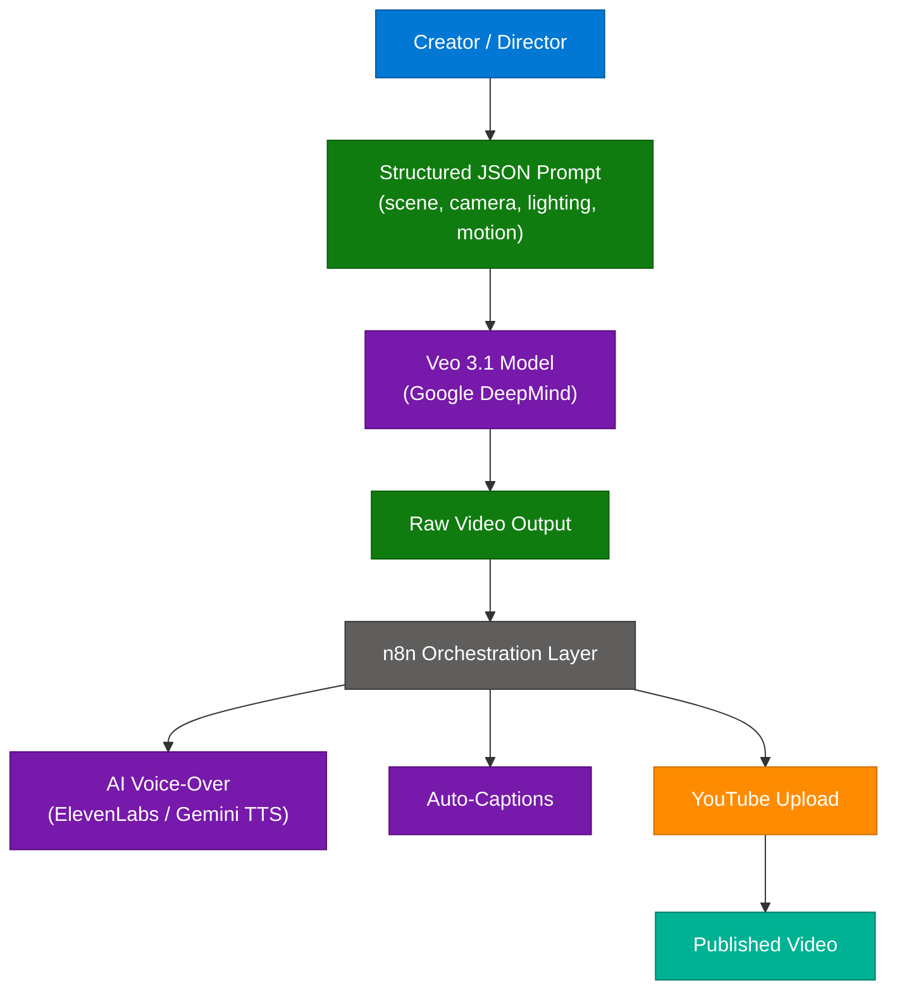

### How It Works

1. **Creator defines intent** via a structured JSON prompt specifying: scene description, camera movement (pan, zoom, dolly), lighting conditions, subject motion, and duration.
2. **Veo 3.1 renders** the scene — diffusion-based video synthesis produces high-resolution footage frame by frame.
3. **n8n orchestrates post-production** — trigger after video generation, pipe through voice-over, captions, and thumbnail generation nodes.
4. **Auto-upload** to YouTube via the YouTube Data API node in n8n — no manual intervention after prompt submission.

### Key Components

| Component | Role | Technology |
|---|---|---|
| Veo 3.1 | Video synthesis from text/JSON | Google DeepMind API |
| JSON Prompt Schema | Structured scene spec | JSON / Prompt Engineering |
| n8n | Workflow orchestration | Self-hosted or cloud n8n |
| ElevenLabs / TTS | AI voice-over generation | ElevenLabs API |
| YouTube Data API | Automated publishing | Google API v3 |

### Code Example

```python
import json, requests

veo_prompt = {
    "scene": "A futuristic city at dawn, rain-slicked streets reflecting neon signs",
    "camera": {"movement": "slow dolly forward", "angle": "eye-level"},
    "lighting": "blue-cyan neon, soft shadows",
    "duration_seconds": 8,
    "resolution": "1080p"
}

response = requests.post(
    "https://generativelanguage.googleapis.com/v1beta/models/veo-3.1:generate",
    headers={"Authorization": f"Bearer {API_KEY}"},
    json={"prompt": json.dumps(veo_prompt)}
)
video_url = response.json()["videoUrl"]
```

### Interview Q&A

| Question | Answer |
|---|---|
| What makes Veo 3.1 different from text-to-image models? | Veo generates temporally coherent video frames, maintaining object consistency, motion physics, and camera dynamics across time — not just static images. |
| How does structured JSON prompting improve video quality? | It removes ambiguity by explicitly specifying camera movement, lighting, and scene parameters, giving the model deterministic artistic direction. |
| What is the "agentic video pipeline" pattern? | A pipeline where AI handles scripting → video generation → voice-over → captioning → upload without manual human steps between stages. |
| Which layer handles post-production in this workflow? | n8n orchestration layer — it coordinates API calls to TTS, caption generators, thumbnail creators, and YouTube upload sequentially. |
| What traditional cost does this replace? | A $50,000 production scene (crew, lighting, location, actors) is replaced by a single structured prompt. |

---

## 3. n8n YouTube Automation Pipeline

### Overview

n8n is an open-source, self-hostable workflow automation platform that connects AI APIs via a node-based visual editor. The YouTube automation pipeline chains: AI script generation → Veo video generation → ElevenLabs voice-over → auto-captioning → YouTube upload. The creator triggers the workflow with a single "Comment YOUTUBE" CTA on Instagram — a comment-to-DM distribution strategy that routes followers to their n8n templates and step-by-step guides. This pattern embodies the "autopilot content factory" model where one creator can maintain high output volume without editors or production teams.

### Architecture Diagram


### Key Components

| Component | Role | Tool |
|---|---|---|
| n8n | Workflow engine | Self-hosted / n8n Cloud |
| Script Node | AI-generates video script | Gemini / Claude API |
| Video Node | Renders video frames | Veo 3.1 |
| Voice Node | Synthesizes narration | ElevenLabs |
| Caption Node | Transcribes + overlays text | OpenAI Whisper |
| Upload Node | Publishes to YouTube | YouTube Data API v3 |

### Interview Q&A

| Question | Answer |
|---|---|
| Why use n8n over Zapier or Make for AI pipelines? | n8n is self-hostable (data privacy), has native code execution nodes, and handles long-running AI API calls better than SaaS platforms with strict timeouts. |
| What is the "comment-to-DM" distribution strategy? | Creators ask followers to comment a keyword; a bot detects the comment and sends a DM with resources — automating lead capture without a landing page. |
| What is the scalability advantage of this pattern? | One creator can publish daily at production quality without editors, voice artists, or camera operators — content volume scales with API calls, not headcount. |
| How does the pipeline handle API failures? | n8n supports retry nodes, error branches, and notification webhooks — failed nodes can retry 3x before routing to an error handler. |
| What is "autopilot philosophy" in content creation? | Minimizing manual steps between idea and published output by chaining AI APIs end-to-end, reducing creator effort to concept approval only. |

---

## 4. Event Streaming Architecture

### Overview

Event streaming is an architectural pattern where data is produced as a continuous, ordered log of immutable events rather than stored in tables updated in place. Producers write events to an event stream (log); consumers read from the stream independently and at their own pace — enabling real-time processing, decoupling, and async data sharing across services. Apache Kafka, Amazon Kinesis, and Apache Pulsar are the dominant implementations. This pattern powers use cases from real-time fraud detection to CDC (Change Data Capture) and microservices choreography. The source was from `this.tech.girl` in the context of FAANG system design interview preparation.

### Architecture Diagram

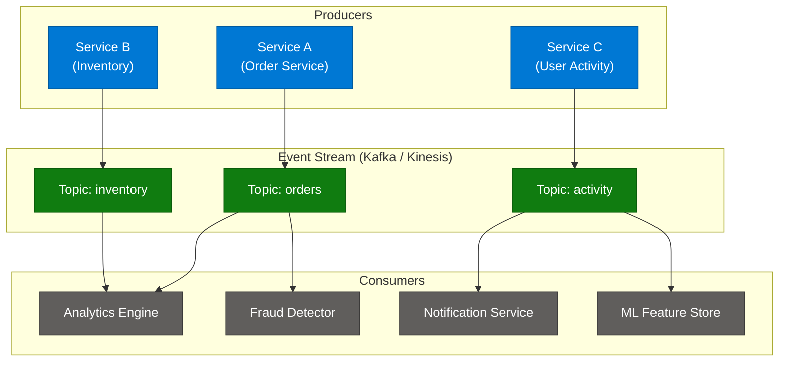

### Key Components

| Component | Role | Technology Options |
|---|---|---|
| Producer | Publishes events to stream | Any service with Kafka client |
| Event Stream / Topic | Ordered, durable event log | Apache Kafka, Amazon Kinesis, Apache Pulsar |
| Consumer Group | Reads and processes events | Multiple consumers, each gets a partition |
| Broker | Manages topics, partitions, replication | Kafka Broker / Kinesis Shard |
| Schema Registry | Enforces event schema contracts | Confluent Schema Registry, AWS Glue |

### Common Patterns

| Pattern | Description |
|---|---|
| Publish-Subscribe | Multiple consumers independently read the same event |
| Event Sourcing | System state reconstructed by replaying the event log |
| Complex Event Processing | Detecting patterns across multiple event streams in real time |
| CDC | Captures database row changes as events for downstream sync |

### Code Example

```python
from confluent_kafka import Producer, Consumer

# Producer
producer = Producer({"bootstrap.servers": "localhost:9092"})
producer.produce("orders", key="order-123", value='{"amount": 99.99, "userId": "u1"}')
producer.flush()

# Consumer
consumer = Consumer({
    "bootstrap.servers": "localhost:9092",
    "group.id": "fraud-detector",
    "auto.offset.reset": "earliest"
})
consumer.subscribe(["orders"])
while True:
    msg = consumer.poll(1.0)
    if msg and not msg.error():
        print(f"Processing: {msg.value()}")
```

### Interview Q&A

| Question | Answer |
|---|---|
| What is the difference between a message queue and an event stream? | A queue deletes messages after consumption; an event stream retains events durably on disk for configurable retention periods, allowing multiple consumers to replay independently. |
| How does Kafka achieve fault tolerance? | Through topic partitioning with configurable replication factor — each partition is replicated across brokers; if a leader broker fails, a replica is promoted automatically. |
| What is a consumer group? | A logical group of consumers that collectively consume a topic — each partition is assigned to exactly one consumer in the group, enabling parallel processing without duplicate reads. |
| When would you choose Kinesis over Kafka? | When you need fully managed infrastructure on AWS, don't want to operate brokers, and have workloads under 1 MB/s per shard — Kinesis is simpler operationally but less flexible. |
| What is the "building blocks first, scale later" interview strategy? | Define the core components (producer, stream, consumer) before optimizing — start with correctness, then add partitioning, replication, and consumer group tuning. |

---

## 5. SQL Division by Zero — NULLIF Pattern

### Overview

Division by zero in SQL is not a mathematical edge case to be handled at the application layer — it causes hard runtime query failures in virtually every relational database engine. When a denominator column contains a zero value, the query terminates immediately, potentially causing application outages. The safe pattern is `NULLIF(denominator, 0)`: NULLIF returns NULL when the two arguments are equal, and division by NULL in SQL produces NULL rather than an error, making the query safe. Source: `codemeetstech` for SQL interview preparation.

### Architecture Diagram

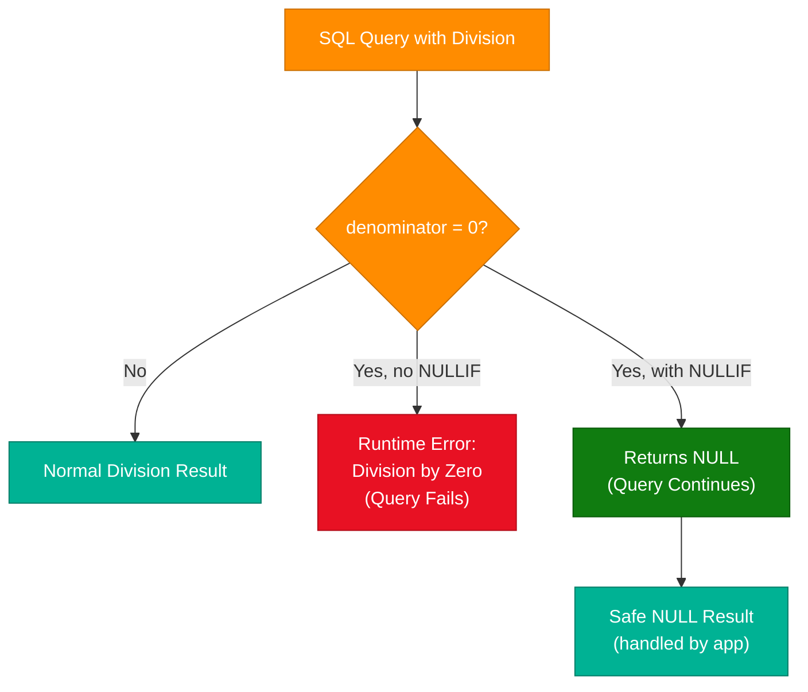

### Code Example

```sql
-- UNSAFE: crashes if bonus = 0
SELECT salary / bonus FROM employees;

-- SAFE: returns NULL instead of crashing
SELECT salary / NULLIF(bonus, 0) FROM employees;

-- With COALESCE to replace NULL with 0 in output
SELECT COALESCE(salary / NULLIF(bonus, 0), 0) AS safe_ratio FROM employees;

-- With CASE for explicit handling
SELECT
  CASE
    WHEN bonus = 0 THEN NULL
    ELSE salary / bonus
  END AS ratio
FROM employees;
```

### Interview Q&A

| Question | Answer |
|---|---|
| What happens when you divide by zero in SQL? | Most databases (MySQL, PostgreSQL, SQL Server, Oracle) throw a runtime error and halt the entire query. SQL Server in some modes returns NULL instead. |
| What does NULLIF do? | `NULLIF(a, b)` returns NULL if `a = b`, otherwise returns `a`. It is the standard SQL way to convert specific values to NULL. |
| Why is NULL safer than zero as a denominator result? | Division by NULL returns NULL in SQL rather than an error — the query continues and the NULL can be handled downstream by COALESCE or application logic. |
| When would you use CASE WHEN over NULLIF? | When you need to handle multiple conditions or want self-documenting code for complex business logic — NULLIF is more concise for simple zero-division guards. |
| What is the production risk of unguarded division? | A single row with a zero denominator can crash an entire batch query, causing unexpected application outage — the impact is proportional to query scope. |

---

## 6. COUNT(*) vs COUNT(1) vs COUNT(col)

### Overview

A pervasive SQL myth holds that `COUNT(1)` is faster than `COUNT(*)` — this is false in every modern database engine. MySQL, PostgreSQL, Oracle, and SQL Server all rewrite `COUNT(1)` to `COUNT(*)` at the query optimizer level, making them identical in execution plan and performance. The only functionally distinct variant is `COUNT(column_name)`, which counts only non-NULL rows in that column. Source: `this.tech.girl` — SQL interview prep for backend and data engineering roles.

### Key Comparison

| Variant | Counts | Includes NULLs? | Performance |
|---|---|---|---|
| `COUNT(*)` | All rows | Yes | Optimized (index-only scan) |
| `COUNT(1)` | All rows | Yes | Identical to COUNT(*) after rewrite |
| `COUNT(col)` | Non-NULL rows only | No | Slightly different — checks column for NULL |

### Code Example

```sql
-- All three return the same count for total rows
SELECT COUNT(*) FROM employees;
SELECT COUNT(1) FROM employees;

-- Returns count of rows where email is NOT NULL
SELECT COUNT(email) FROM employees;

-- Practical: count rows with vs without a value
SELECT
  COUNT(*) AS total_rows,
  COUNT(email) AS rows_with_email,
  COUNT(*) - COUNT(email) AS rows_without_email
FROM employees;
```

### Interview Q&A

| Question | Answer |
|---|---|
| Is COUNT(1) faster than COUNT(*) in PostgreSQL? | No. PostgreSQL's planner rewrites COUNT(1) to COUNT(*) before execution. The execution plans are identical. |
| When should you use COUNT(column_name)? | When you specifically need to count non-NULL values in a column — for example, counting how many users have provided their email address. |
| What is the recommended best practice? | Use COUNT(*) — it is the SQL standard, communicates intent clearly (count all rows), and is universally understood by developers and query optimizers. |
| Can COUNT(*) be accelerated with indexes? | Yes — databases can use index-only scans on any index to satisfy COUNT(*) without reading the table (heap), making it very fast. |
| Does COUNT(*) vs COUNT(1) matter in interviews? | It is a myth-busting question — the correct answer is that they are equivalent in all modern databases, and knowing this demonstrates deeper optimizer understanding. |

---

## 7. Throttling vs Rate Limiting

### Overview

Rate limiting and throttling are both API traffic control mechanisms, but they differ in their response strategy. Rate limiting enforces a hard cap — requests beyond the quota are immediately rejected with HTTP 429. Throttling controls the speed of request processing — excess requests are slowed down, queued, or delayed rather than rejected outright. Both protect backend services from abuse and ensure fair resource distribution, but the choice depends on whether you want strict quota enforcement or graceful traffic shaping. Source: `enoughtoship` — system design interview preparation.

### Architecture Diagram

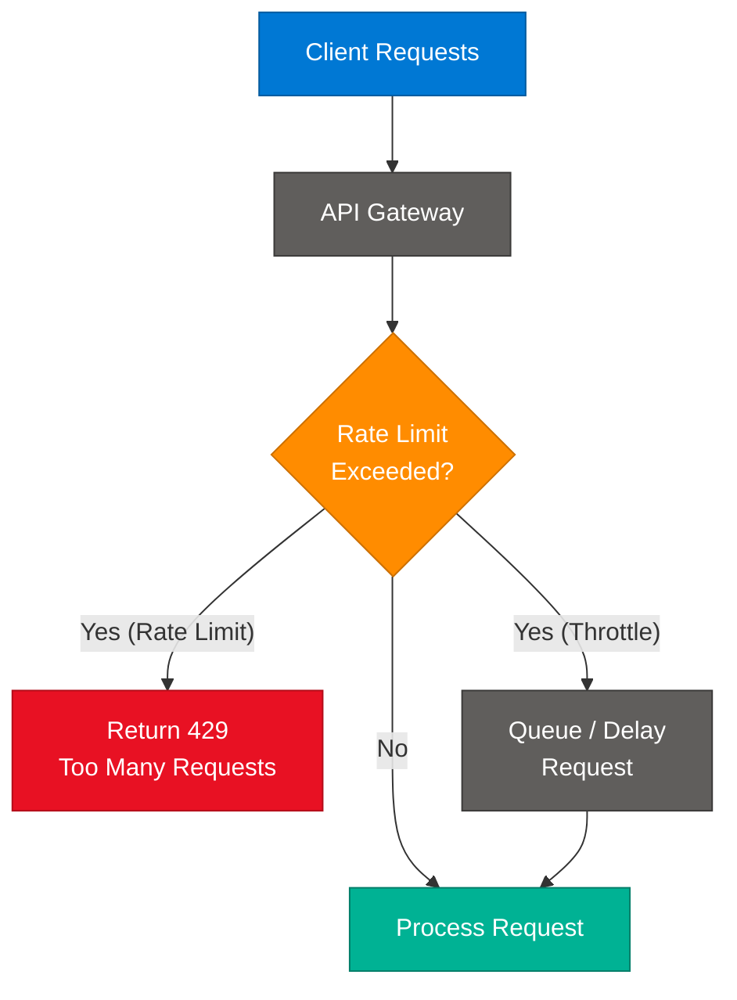

### Comparison Table

| Feature | Rate Limiting | Throttling |
|---|---|---|
| Primary Action | Hard cap / rejection | Slow down / shaping |
| Logic | Rejects requests exceeding a limit | Controls speed, queues, or delays |
| Response | HTTP 429 Too Many Requests | Processes slowly; no immediate rejection |
| Analogy | Bouncer: "You're not getting in" | Speed bump: "You're getting in... slowly" |
| Best For | Abuse protection, DDoS defense | Burst traffic, graceful degradation |
| Client Experience | Immediate failure | Delayed success |

### Interview Q&A

| Question | Answer |
|---|---|
| When would you choose throttling over rate limiting? | When clients are legitimate but bursty — throttling allows eventual success by queuing excess requests, preserving client experience without full rejection. |
| What HTTP status code does rate limiting return? | 429 Too Many Requests — with a `Retry-After` header indicating when the client can try again. |
| What are common rate limiting algorithms? | Token Bucket (allows bursts), Leaky Bucket (constant drain rate), Fixed Window Counter, Sliding Window Log, and Sliding Window Counter. |
| Where in the architecture is rate limiting typically implemented? | At the API gateway or load balancer layer — before requests reach application servers — to protect all downstream services centrally. |
| How does throttling differ from circuit breaking? | Throttling slows down healthy but excessive traffic; a circuit breaker trips when downstream services are failing and stops all traffic to allow recovery. |

---

## 8. DDoS Attack Defense Strategies

### Overview

A Distributed Denial of Service (DDoS) attack floods a service with artificial traffic, exhausting server resources and making it unavailable to legitimate users. Defense requires a multi-layered architecture operating at the network edge, application layer, and infrastructure scaling level simultaneously. Source: `chhavi_maheshwari_` — System Design Series. Six strategies are outlined: rate limiting, edge blocking, CDN distribution, WAF filtering, CAPTCHA verification, and autoscaling.

### Architecture Diagram

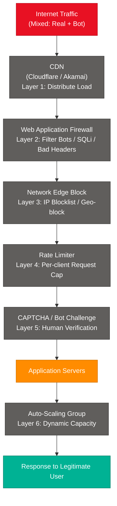

### 6 Defense Strategies

| Strategy | Concept | Analogy |
|---|---|---|
| 1. Rate Limit Requests | Restrict calls per client per time window | Only 5 people at a time at an ATM |
| 2. Block Bad Traffic at Edge | Drop malicious IPs before they reach core servers | Stop unwanted visitors at the main gate |
| 3. CDN Distribution | Spread load globally across PoPs | 1,000 branch shops instead of 1 central store |
| 4. Web Application Firewall | Filter bots, SQLi, suspicious headers | Security scanner at the door |
| 5. CAPTCHA Verification | Human verification challenge | OTP before entering a restricted area |
| 6. Autoscale Under Load | Dynamically add server capacity | Open extra billing counters when crowd forms |

### Interview Q&A

| Question | Answer |
|---|---|
| What is the core objective of DDoS defense? | Maintain service availability for real users despite high-volume artificial traffic — distinguish and prioritize legitimate requests. |
| Why is multi-layer defense necessary? | No single layer stops all DDoS types — volumetric attacks need CDN/edge blocking, application-layer attacks need WAF, and traffic spikes need autoscaling. |
| What makes a CDN effective against DDoS? | CDNs have globally distributed PoPs with massive aggregate bandwidth — traffic is absorbed and filtered close to the source before reaching origin servers. |
| What types of attacks does a WAF block? | SQL injection, XSS, malformed headers, bot signatures, and Layer 7 HTTP flood attacks — it inspects request content, not just volume. |
| How does autoscaling help during a DDoS attack? | If attack traffic slips through filtering layers, autoscaling adds server capacity to absorb legitimate overflow — protecting user experience during partial defense breaches. |

---

## 9. Fine-tuning vs RAG vs Prompt Engineering

### Overview

Three architectural strategies exist for customizing AI model behavior, increasing in complexity and cost. Prompt engineering (the simplest) provides better context and instructions to an existing model without modifying it. RAG augments the prompt with retrieved external knowledge at query time. Fine-tuning modifies the model's internal weights on a curated dataset, permanently changing how it processes information. Source: `techie_programmer` — AI implementation architecture.

### Architecture Diagram

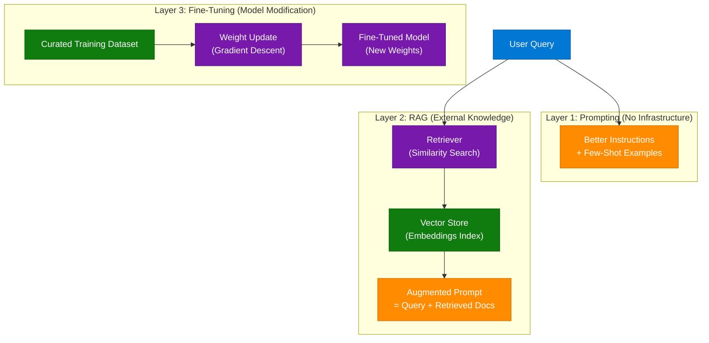

### Strategy Comparison

| Dimension | Prompting | RAG | Fine-Tuning |
|---|---|---|---|
| Infrastructure change | None | Vector store + retriever | Training pipeline |
| Cost | Minimal (tokens) | Moderate (vector DB) | High (compute + data) |
| Latency | Low | Low + retrieval time | Same as base model |
| Knowledge | Static (training cutoff) | Dynamic (real-time) | Static (training set) |
| Best for | Instructions, format, tone | Factual Q&A, enterprise docs | Domain jargon, style, behavior |
| Hallucination risk | Medium | Low (grounded in docs) | Medium |

### Interview Q&A

| Question | Answer |
|---|---|
| When should you choose RAG over fine-tuning? | When your knowledge base changes frequently, you need source citations, or you want to avoid hallucinations — RAG grounds answers in retrieved documents. |
| What does fine-tuning change in a model? | The model's internal weight matrix is updated through gradient descent on a curated dataset — permanently altering how the model processes and generates text. |
| Can you combine RAG and fine-tuning? | Yes — fine-tune for domain tone and jargon, then add RAG for real-time factual grounding. The approaches are complementary, not mutually exclusive. |
| Why is prompting the first thing to try? | It requires zero infrastructure, is reversible, and can solve most behavioral issues before investing in RAG or fine-tuning. |
| What is the failure mode of fine-tuning? | Catastrophic forgetting — fine-tuning on a narrow dataset can degrade the model's general capabilities while improving task-specific performance. |

---

## 10. Claude Code + ReMotion AI Video Editing

### Overview

`vibecodeapp` demonstrated how Claude Code can act as an AI-powered video editor by combining it with ReMotion, a React-based framework for programmatic video creation. Running inside `vibecode.dev` (a web-based app builder), Claude Code receives natural-language editing instructions, translates them into ReMotion component code, and renders the video inside an editable canvas. Adding the ReMotion skill to Claude Code requires a single npm command. This is an example of "skills-based agentic architecture" where an AI coding agent gains domain-specific capabilities by loading a framework skill.

### Architecture Diagram

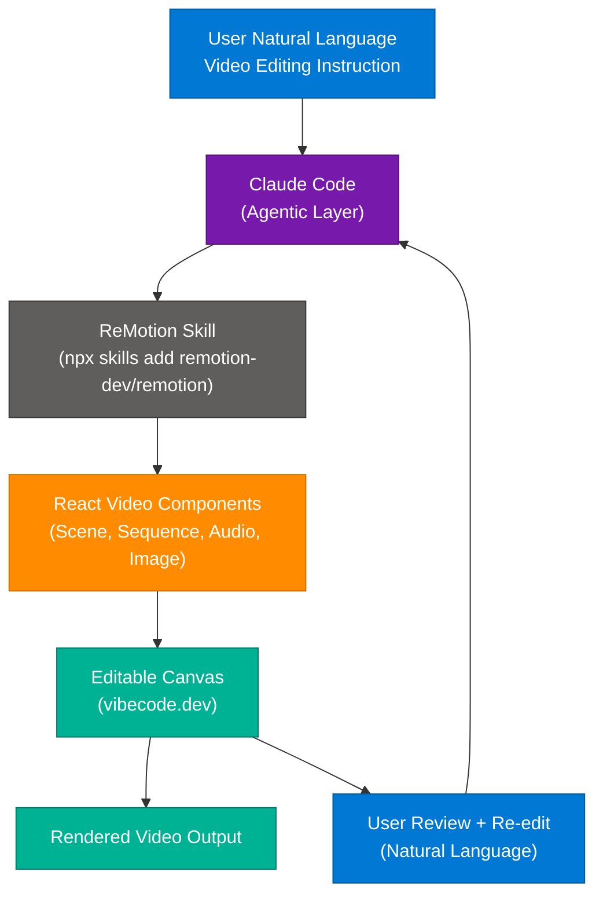

### How It Works

1. **Skill installation:** `npx skills add remotion-dev/remotion` installs ReMotion as a Claude Code skill, giving the agent knowledge of ReMotion's component API.
2. **Natural language instruction:** User describes the video edit ("add a fade transition between scenes", "change background to blue").
3. **Claude Code translates** the instruction into ReMotion React component code — `<Sequence>`, `<AbsoluteFill>`, `<interpolate>`.
4. **Editable canvas** renders the video in real time inside the browser.
5. **Iterative refinement:** The user reviews and provides follow-up instructions; Claude modifies the components directly.

### Key Components

| Component | Role | Technology |
|---|---|---|
| Claude Code | AI agent — interprets instructions, writes code | Anthropic Claude |
| ReMotion | React-based video rendering framework | `remotion` npm package |
| vibecode.dev | Browser-based app builder platform | Web app |
| ReMotion Skill | Domain-specific knowledge plugin | `npx skills add remotion-dev/remotion` |
| Canvas | Real-time video preview and editing UI | React + ReMotion Player |

### Code Example

```tsx
// ReMotion video component — generated by Claude Code
import { AbsoluteFill, Sequence, interpolate, useCurrentFrame } from "remotion";

export const MyVideo: React.FC = () => {
  const frame = useCurrentFrame();
  const opacity = interpolate(frame, [0, 30], [0, 1]); // fade in over 30 frames

  return (
    <AbsoluteFill style={{ backgroundColor: "black" }}>
      <Sequence from={0} durationInFrames={90}>
        <AbsoluteFill style={{ opacity }}>
          <h1 style={{ color: "white", fontSize: 80 }}>Scene 1</h1>
        </AbsoluteFill>
      </Sequence>
    </AbsoluteFill>
  );
};
```

### Interview Q&A

| Question | Answer |
|---|---|
| What is a "Claude Code skill"? | A domain-specific capability plugin installed via `npx skills add <package>` — it gives Claude Code knowledge of a framework's API and enables it to generate correct code for that domain. |
| Why is ReMotion suitable for AI-generated video? | ReMotion is declarative and React-based — scenes, transitions, and animations are expressed as composable components that an AI can generate reliably. |
| What is the "agentic video editor" pattern? | An AI agent that receives natural language editing instructions, generates rendering code, and iterates on the output based on user feedback — replacing a manual editor. |
| What makes this approach different from traditional video editing? | Traditional editing uses timeline-based drag-and-drop tools; this approach treats video as code, making edits programmable, version-controllable, and AI-generatable. |
| What platform enables running Claude Code in the browser? | vibecode.dev — a web-based app builder that provides an IDE-like canvas environment where Claude Code can build and modify apps including video editors. |

---

## 11. RAG Evaluation Metrics

### Overview

Evaluating a RAG system requires measuring quality across two dimensions: retrieval quality (did we fetch the right documents?) and generation quality (did we produce faithful, relevant answers from those documents?). The `ragas` Python library provides automated evaluation using four core metrics: Faithfulness, Answer Relevancy, Context Precision, and Context Recall. Source: `priyal.py` demonstrating evaluation with the `ragas` library on the State of the Union speech dataset. `DeepEval` was cited in community comments as an alternative framework for unit-test-style RAG evaluation.

### Architecture Diagram

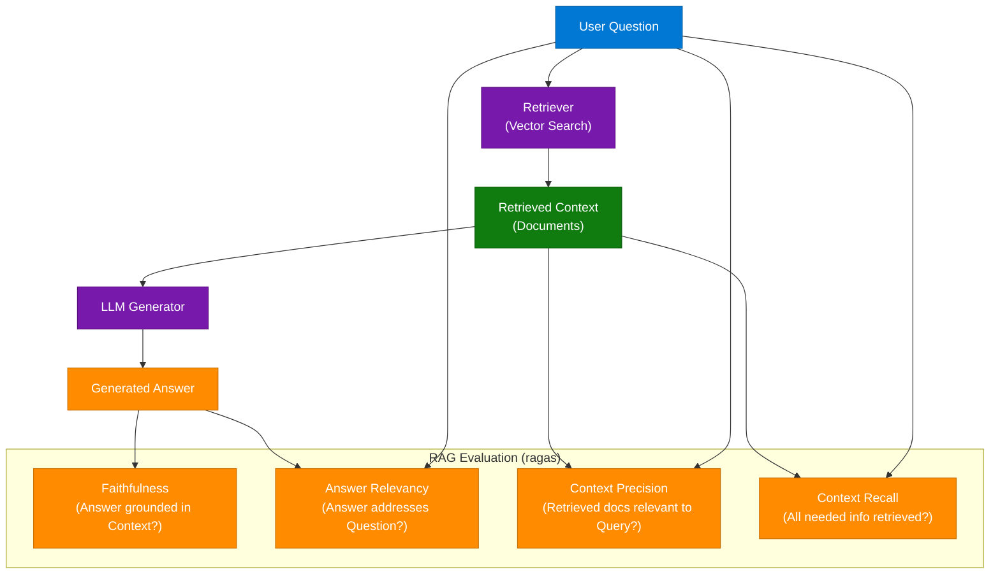

### Core Metrics

| Metric | Measures | Failure Mode |
|---|---|---|
| Faithfulness | Is the answer derived from retrieved context? | Hallucination — answer contains facts not in context |
| Answer Relevancy | Does the answer address the user's question? | Off-topic or tangential responses |
| Context Precision | Are retrieved documents relevant to the query? | Noise — irrelevant documents retrieved |
| Context Recall | Was all necessary information retrieved? | Incomplete retrieval — missing key documents |

### Code Example

```python
from datasets import Dataset
from ragas import evaluate
from ragas.metrics import faithfulness, answer_relevancy, context_precision, context_recall

data = {
    "question": ["What did the president say about Justice Breyer?"],
    "answer": ["The president honored Justice Breyer for his service."],
    "contexts": [["The president praised Justice Breyer, thanking him for his decades of service."]],
    "ground_truth": ["The president honored Justice Breyer."]
}

dataset = Dataset.from_dict(data)
result = evaluate(
    dataset,
    metrics=[faithfulness, answer_relevancy, context_precision, context_recall]
)
print(result)
```

### Interview Q&A

| Question | Answer |
|---|---|
| What is Faithfulness in RAG evaluation? | The fraction of claims in the generated answer that are supported by the retrieved context — a low score indicates hallucination. |
| What is the difference between Context Precision and Context Recall? | Precision measures whether retrieved docs are relevant (quality of retrieval); Recall measures whether all necessary info was retrieved (completeness of retrieval). |
| What framework does ragas use to evaluate without human labels? | ragas uses an LLM-as-judge approach — it prompts a judge LLM to score each metric, enabling automated evaluation without human annotators. |
| What is DeepEval and how does it differ from ragas? | DeepEval is an alternative RAG evaluation framework that provides unit-test-style assertions — you write test cases with `assert_test()`, integrating RAG evaluation into CI/CD pipelines. |
| At what stage should RAG evaluation run in a production system? | In a continuous evaluation pipeline — triggered by document store updates, model changes, or on a scheduled basis to detect retrieval or generation quality drift. |

---

## 12. ML Model Deployment Pipeline

### Overview

Taking an ML model from a development notebook to production requires three standardized steps: wrapping the model in a REST API, containerizing the API with its dependencies, and deploying the container to cloud infrastructure. FastAPI is the preferred API framework for ML models due to its async performance and automatic OpenAPI documentation generation. Docker solves the "it works on my machine" problem by bundling the exact runtime environment. This three-step pattern (Code → API → Container → Cloud) is the industry standard for ML model portability and reproducibility.

### Architecture Diagram

```mermaid
flowchart LR
    PyModel["Python Model\n.pkl / .pt / .h5\n(scikit-learn / PyTorch)"] --> FastAPI["FastAPI Wrapper\nPOST /predict\n(Input → Prediction)"]
    FastAPI --> Docker["Docker Container\n(model + API + dependencies)"]
    Docker --> Registry["Container Registry\n(DockerHub / ECR / ACR)"]
    Registry --> Cloud["Cloud Deployment\n(AWS ECS / GCP Cloud Run / AKS)"]
    Cloud --> LoadBalancer["Load Balancer\n(Auto-scaled instances)"]
    LoadBalancer --> Client["Client Application"]

    classDef dataNode    fill:#107C10,stroke:#0A5C0A,color:#fff
    classDef processNode fill:#FF8C00,stroke:#CC7000,color:#fff
    classDef infraNode   fill:#605E5C,stroke:#3B3A39,color:#fff
    classDef userNode    fill:#0078D4,stroke:#005A9E,color:#fff
    classDef aiNode      fill:#7719AA,stroke:#5A0E80,color:#fff

    class PyModel dataNode
    class FastAPI processNode
    class Docker,Registry infraNode
    class Cloud,LoadBalancer infraNode
    class Client userNode
```

### Deployment Steps

| Step | Technology | Output |
|---|---|---|
| 1. Train and export model | scikit-learn, PyTorch, TensorFlow | `.pkl`, `.pt`, or `.onnx` file |
| 2. Build FastAPI wrapper | FastAPI + Uvicorn | REST endpoint `POST /predict` |
| 3. Containerize | Docker + Dockerfile | Docker image with all dependencies |
| 4. Push to registry | Docker Hub, ECR, ACR | Versioned container image |
| 5. Deploy to cloud | ECS, Cloud Run, AKS | Scalable inference service |

### Code Example

```python
# main.py - FastAPI ML model wrapper
from fastapi import FastAPI
import pickle, numpy as np

app = FastAPI()
model = pickle.load(open("model.pkl", "rb"))

@app.post("/predict")
async def predict(features: list[float]):
    prediction = model.predict([features])
    return {"prediction": prediction[0]}
```

```dockerfile
# Dockerfile
FROM python:3.11-slim
WORKDIR /app
COPY requirements.txt .
RUN pip install -r requirements.txt
COPY . .
CMD ["uvicorn", "main:app", "--host", "0.0.0.0", "--port", "8080"]
```

### Interview Q&A

| Question | Answer |
|---|---|
| Why FastAPI for ML model serving? | Async request handling for concurrent predictions, automatic OpenAPI docs, Pydantic input validation, and Python-native — matching the language most ML models are written in. |
| What problem does Docker solve in ML deployment? | Dependency isolation — the container bundles the exact Python version, CUDA version, and library versions needed, eliminating environment mismatch between development and production. |
| What is the difference between model serving and model hosting? | Serving is the real-time inference API layer; hosting is the infrastructure that runs it (containers, scaling, routing). Both are needed for production ML. |
| How do you handle high-concurrency inference? | Use async FastAPI with batching (process multiple requests per model call), Kafka buffer for async processing, and horizontal autoscaling behind a load balancer. |
| What is the production monitoring strategy for deployed models? | Track prediction distributions for data drift, measure latency P95/P99, log input/output samples for quality audits, and alert on accuracy degradation via A/B testing or shadow mode. |

---

## 13. LangChain vs LlamaIndex

### Overview

LangChain and LlamaIndex are the two dominant Python frameworks for building LLM-powered applications, but they target different use cases. LangChain is a general-purpose agent and chain orchestration framework — best for building conversational agents, tool-using systems, and complex multi-step LLM workflows. LlamaIndex (formerly GPT Index) is specialized for data ingestion, indexing, and RAG pipelines — best when your primary challenge is connecting LLMs to structured/unstructured data sources efficiently. They can be used together: LlamaIndex handles retrieval; LangChain handles agent orchestration.

### Architecture Diagram

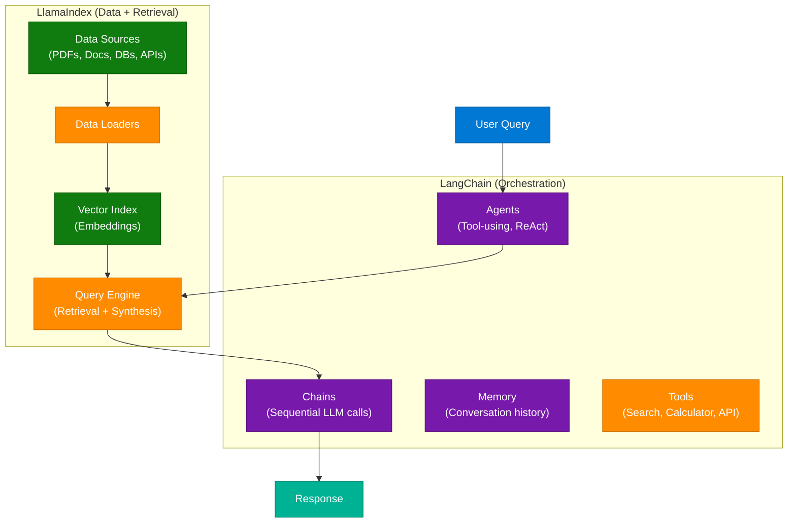

### Comparison Table

| Dimension | LangChain | LlamaIndex |
|---|---|---|
| Primary Focus | Agent orchestration, chains | Data ingestion, RAG pipelines |
| Best For | Multi-step workflows, tool use | Document Q&A, knowledge bases |
| Data Handling | Basic loaders | 100+ specialized loaders |
| Agent Support | First-class (ReAct, OpenAI Functions) | Via LlamaIndex Agents |
| Learning Curve | Moderate (many abstractions) | Lower for RAG use cases |
| Use Together | LlamaIndex retrieval → LangChain agent | Yes — complementary |

### Interview Q&A

| Question | Answer |
|---|---|
| When would you use LlamaIndex over LangChain? | When the primary challenge is ingesting and querying large, heterogeneous document collections — LlamaIndex has specialized loaders and index types optimized for retrieval. |
| What is a LangChain "chain"? | A sequence of LLM calls and tool invocations with defined inputs/outputs — enabling multi-step reasoning and modular composition of LLM workflows. |
| What is the ReAct agent pattern in LangChain? | Reason + Act — the agent alternates between reasoning about what to do next and taking actions (tool calls), iterating until the task is complete. |
| Can LangChain and LlamaIndex be combined? | Yes — LlamaIndex builds the vector index and query engine; LangChain wraps it as a tool for an agent, combining best-in-class retrieval with agent orchestration. |
| What data sources does LlamaIndex natively support? | PDFs, Word docs, Notion, Slack, SQL databases, APIs, websites, and 100+ others via its data loader ecosystem. |

---

## 14. LLM Token Economics & Optimization

### Overview

LLMs charge based on tokens — not words, characters, or responses. Every API call is broken into subword units (tokens), and cost scales with total tokens consumed (input + output). Source: `average.yash`. When prompts are vague or ambiguous, the model performs more internal reasoning to interpret intent, consuming more processing cycles and output tokens. Token optimization is therefore both a cost-reduction strategy and a quality-improvement strategy: clearer prompts produce lower costs and better outputs simultaneously.

### Token Cost Principles

| Principle | Why It Matters |
|---|---|
| Tokens ≠ Words | A word can be 1-3+ tokens depending on subword tokenization |
| Input + Output | Both directions cost tokens — long context AND long outputs add up |
| Ambiguity costs | Vague prompts trigger more internal reasoning, more output tokens |
| System prompts recur | Every API call includes system prompt tokens — keep them concise |
| Context window is finite | Large contexts increase cost AND reduce model attention quality |

### Optimization Strategies

| Strategy | Implementation |
|---|---|
| Pre-tokenize with tiktoken | `tiktoken.encoding_for_model("gpt-4").encode(text)` — count tokens before sending |
| Use `.env` for API keys | `python-dotenv` — never hardcode keys in prompts or code |
| Prompt compression | Rewrite verbose prompts to convey same meaning in fewer tokens |
| Caching | Cache responses for identical or near-identical queries |
| Chunking | Split large documents into smaller chunks; retrieve only relevant chunks |
| Output length control | Specify `max_tokens` in API calls to cap output cost |

### Code Example

```python
import tiktoken
from dotenv import load_dotenv
import os

load_dotenv()
api_key = os.getenv("OPENAI_API_KEY")

def count_tokens(text: str, model: str = "gpt-4") -> int:
    enc = tiktoken.encoding_for_model(model)
    return len(enc.encode(text))

prompt = "Summarize the key points of the following document in 3 bullet points:"
print(f"Prompt tokens: {count_tokens(prompt)}")
# Optimize: shorter prompt, same intent
optimized = "Summarize in 3 bullets:"
print(f"Optimized tokens: {count_tokens(optimized)}")
```

### Interview Q&A

| Question | Answer |
|---|---|
| What is a token in LLM context? | A subword unit — typically 3-4 characters on average in English. "Tokenization" is model-specific; GPT-4 uses BPE (Byte-Pair Encoding). |
| How does prompt ambiguity increase cost? | Ambiguous prompts cause the model to generate more tokens exploring possible interpretations before committing to an answer, inflating output token count. |
| What is tiktoken and why use it? | OpenAI's tokenizer library — use it to count tokens in prompts before API calls, enabling cost estimation and staying within context window limits. |
| What is prompt compression? | Rewriting prompts to express the same intent with fewer tokens — removing filler words, using concise phrasing, and eliminating redundant context. |
| How does caching reduce LLM costs? | Storing LLM responses for identical queries means subsequent calls hit cache instead of the API — effective for FAQs, static content, and repeated lookups. |

---

## 15. Traditional Databases vs Vector Databases

### Overview

Traditional databases (SQL/MongoDB) store structured data and retrieve records via exact keyword or indexed queries. Vector databases store high-dimensional numerical representations (embeddings) of data and retrieve records via semantic similarity search — finding items whose meaning is close to the query, not just those containing exact keywords. This enables fundamentally different retrieval: asking for "animals similar to dog" returns "puppy", "wolf", "canine" rather than requiring the exact string "dog". Vector databases are foundational to RAG pipelines, semantic search, and recommendation systems.

### Architecture Diagram

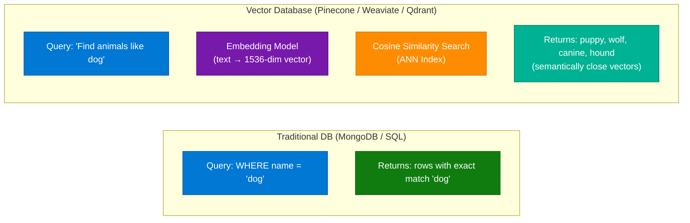

### Comparison

| Dimension | Traditional DB | Vector DB |
|---|---|---|
| Storage | Rows, columns, documents | High-dimensional vectors (embeddings) |
| Query type | Exact match, range, join | Semantic similarity (cosine / dot product) |
| Example | `WHERE name = 'dog'` | "Find items semantically close to 'dog'" |
| Index type | B-tree, hash, inverted | HNSW, IVF (Approximate Nearest Neighbor) |
| Use case | Transactions, CRUD, reporting | RAG, semantic search, recommendations |
| Tools | PostgreSQL, MongoDB | Pinecone, Weaviate, Qdrant, pgvector |

### Interview Q&A

| Question | Answer |
|---|---|
| What is an embedding? | A dense numerical vector (e.g., 1536 dimensions) representing the semantic meaning of text — similar meanings produce vectors with small angular distance. |
| What similarity metric do vector DBs use? | Cosine similarity (angle between vectors) or dot product — both measure semantic closeness in high-dimensional space. |
| What is ANN search and why use it instead of exact search? | Approximate Nearest Neighbor — finds semantically close vectors without comparing against every stored vector. Exact search is too slow at scale (millions of vectors). |
| Can you add vector search to a relational DB? | Yes — `pgvector` adds vector storage and ANN search to PostgreSQL, enabling hybrid queries combining SQL filters with semantic search. |
| What is "Close Distance" in vector space? | Items with similar semantic meaning map to nearby positions in the vector space — "distance" (inverse of similarity) is small between semantically related items. |

---

## 16. LLM vs RAG vs Agent Progression

### Overview

LLM, RAG, and Agent represent a three-tier progression of AI system sophistication. A base LLM answers from training knowledge alone. RAG augments the LLM with retrieved external documents at query time. An Agent uses an LLM as a reasoning engine and adds the ability to plan, use tools, call APIs, and take multi-step actions in the world. Each layer builds on the previous: Agents typically incorporate RAG for knowledge retrieval while also having tools for external actions. Understanding this progression is critical for system design interviews involving AI architecture.

### Architecture Diagram

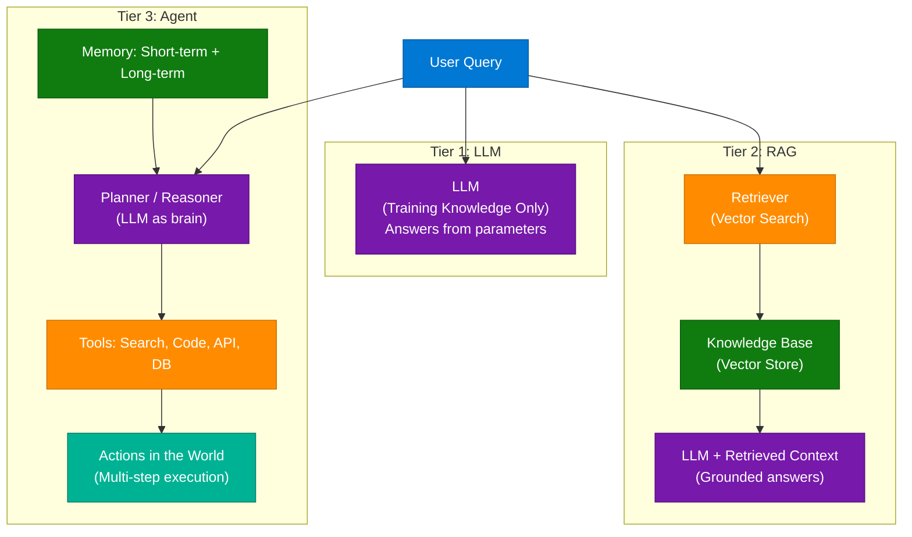

### Tier Comparison

| Dimension | LLM | RAG | Agent |
|---|---|---|---|
| Knowledge source | Training parameters | External documents | Tools + external systems |
| Can access real-time data | No | Yes (via retrieval) | Yes (via API tools) |
| Can take actions | No | No | Yes |
| Can plan multi-step | No | No | Yes |
| Hallucination risk | High | Low | Low (with good tools) |
| Complexity | Low | Medium | High |

### Interview Q&A

| Question | Answer |
|---|---|
| What is the core limitation of a base LLM that RAG solves? | LLMs have a training cutoff date and cannot access proprietary/private knowledge — RAG solves this by retrieving current, domain-specific documents at query time. |
| What is the core limitation of RAG that Agents solve? | RAG can only retrieve and synthesize — it cannot take actions, call APIs, write and execute code, or complete multi-step tasks autonomously. |
| How does an Agent use an LLM internally? | The LLM acts as the agent's reasoning engine — it receives observations, decides what action to take next (or which tool to call), and interprets tool outputs. |
| What is the ReAct agent pattern? | Reason-Act: the agent alternates between reasoning about the current state and acting (tool call), repeating until the task is complete. |
| What makes Agentic AI different from a single-turn RAG system? | Agents operate over multiple steps, maintain working memory, and can adapt their plan based on intermediate results — single-turn RAG is stateless and deterministic. |

---

## 17. RAG vs Fine-Tuning Deep Dive

### Overview

From the Lightning Lessons series with Dan Becker and Hamel Husain (mavenhq): RAG gives the model a "book to read" — it retrieves relevant context at query time; Fine-Tuning changes how the model "thinks" — it modifies internal weights through training. The decision between them depends on whether the problem is primarily about knowledge access (RAG) or behavioral/stylistic change (fine-tuning). These are not competing strategies but complementary tools that solve different problems.

### Decision Flowchart

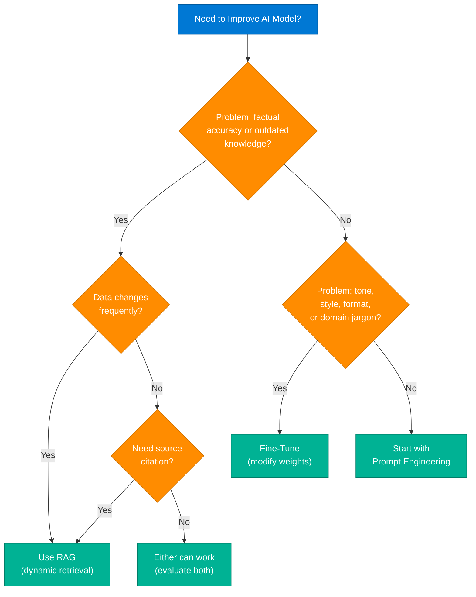

### Feature Comparison

| Feature | RAG | Fine-Tuning |
|---|---|---|
| Core Concept | Give model a "book" to read | Change how model "thinks" |
| Mechanism | Retrieve context at inference time | Modify weights via training |
| Data | Real-time external documents | Static, curated training dataset |
| Best For | Accuracy, source citation, no hallucinations | Tone, style, format, domain jargon |
| Cost | Vector DB + retrieval latency | Compute for training + storage |
| Reversible | Yes — swap knowledge base | Partially — model weights are changed |
| Hallucination risk | Low (grounded) | Medium (can learn wrong patterns) |

### Interview Q&A

| Question | Answer |
|---|---|
| What does RAG stand for and how does it work? | Retrieval-Augmented Generation — at query time, relevant documents are retrieved from a vector store and injected into the LLM prompt as context, grounding the answer. |
| What does fine-tuning actually modify? | The model's weight matrix — via gradient descent on a curated dataset, the model's probability distributions for token generation are permanently adjusted. |
| What is catastrophic forgetting in fine-tuning? | When fine-tuning on a narrow domain causes the model to degrade on general tasks — the model "forgets" broad capabilities while specializing. |
| How do you decide between RAG and fine-tuning in practice? | Try RAG first — it's faster to implement, reversible, and handles the majority of knowledge access problems. Only fine-tune when RAG cannot solve a behavioral or stylistic issue. |
| Can RAG and fine-tuning be combined? | Yes — fine-tune for domain tone and jargon, then add RAG for real-time factual grounding. Many production systems use both. |

---

## 18. AI Design Workflows — Node-Based Architecture

### Overview

`anshul.tweaks` demonstrated how traditional design workflows are shifting from manual execution to AI-assisted direction using node-based visual editors. The architecture processes inputs through a pipeline of AI nodes: an image input (via Stable Diffusion) and a text prompt combine in a central processing node powered by Gemini Flash 2.5, producing a transformed output image. This "node graph" paradigm — where each AI capability is a composable node — enables designers to chain models visually without writing code, while maintaining fine-grained control over each transformation step.

### Architecture Diagram

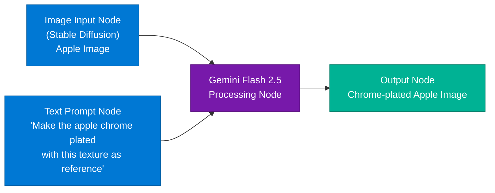

### Design Shift

| Traditional Design | AI-Assisted Direction |
|---|---|
| Manual execution (Photoshop layers, masking) | Designer provides direction; AI executes |
| Skill-dependent (masking, lighting) | Skill-independent (natural language) |
| Time-intensive | Near-instant with iterative refinement |
| Sequential tool operations | Parallel node graph processing |
| Editor as executor | Designer as director |

### Interview Q&A

| Question | Answer |
|---|---|
| What is a node-based design workflow? | A visual pipeline where each AI capability (image generation, style transfer, upscaling) is a discrete node; outputs of one node connect to inputs of another, enabling complex transformations without code. |
| Why is Gemini Flash 2.5 suitable as the central processing node? | It's a multimodal model capable of processing both image and text inputs simultaneously, enabling image transformation guided by natural language prompts. |
| What is the key design principle shift shown? | From "designer as manual executor" to "designer as director" — the designer specifies intent in natural language; AI handles technical execution. |
| What tools are mentioned for community concern about this workflow? | Comments cite CapCut and Adobe Premiere as manual alternatives — some professional editors note that masking and layering are still faster manually for complex compositions. |
| What does this workflow enable for content creators? | High-volume visual content production without dedicated editors or animation expertise — enabling solopreneurs to maintain quality output at scale. |

---

## 19. AI Agent vs Agentic AI

### Overview

"AI Agent" and "Agentic AI" are related but distinct concepts. An AI Agent is a discrete system that uses an LLM as its reasoning core to plan, select tools, and execute tasks toward a goal. Agentic AI refers to a broader paradigm where AI systems operate with goal-directed autonomy, breaking down objectives, adapting plans based on results, and orchestrating multiple sub-agents or tools over extended time horizons. The distinction matters architecturally: an AI Agent is a building block; Agentic AI is a system design philosophy where multiple agents collaborate with minimal human intervention.

### Architecture Diagram

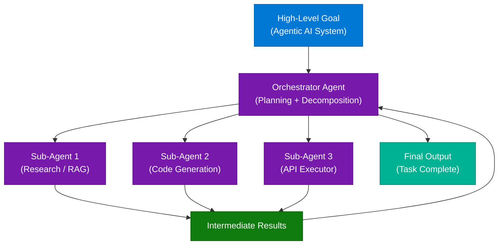

### Comparison

| Dimension | AI Agent | Agentic AI |
|---|---|---|
| Scope | Single, bounded task | Multi-task, extended autonomy |
| Structure | One LLM + tools | Multiple coordinated agents |
| Human oversight | Per-task interaction | Minimal intervention |
| Planning horizon | Single task | Multi-step, adaptive |
| Example | Coding assistant | Autonomous software development pipeline |

### Interview Q&A

| Question | Answer |
|---|---|
| What distinguishes an AI Agent from a simple LLM chatbot? | An agent can take actions (tool calls), plan sequences of steps, observe results, and adapt its plan — a chatbot only generates text responses. |
| What is an Orchestrator Agent? | A meta-agent that decomposes a high-level goal into sub-tasks, delegates to specialized sub-agents, collects results, and synthesizes the final output. |
| What makes Agentic AI systems risky? | Compounding errors — one agent's incorrect output becomes the next agent's incorrect input, potentially causing cascading failures across a multi-agent pipeline. |
| How do you add guardrails to an agentic system? | Human-in-the-loop checkpoints at critical decision nodes, output validation between agents, scope constraints on tool permissions, and comprehensive logging. |
| What frameworks support multi-agent systems? | LangGraph (stateful multi-agent graphs), AutoGen (Microsoft), CrewAI, and Semantic Kernel — each provides agent coordination primitives. |

---

## 20. Interview Q&A Cheatsheet

**Q: What is the one-prompt AI video production workflow?**
> Veo 3.1 accepts structured JSON prompts specifying scene, camera movement, lighting, and character motion — generating production-quality video from a single structured specification that would traditionally require a full film crew and $50,000+ budget.

**Q: What is the difference between Rate Limiting and Throttling?**
> Rate Limiting enforces a hard request quota — excess requests are immediately rejected with HTTP 429. Throttling shapes traffic speed — excess requests are queued or delayed rather than rejected, enabling eventual success for legitimate clients.

**Q: How do you prevent SQL division by zero errors in production?**
> Use `NULLIF(denominator, 0)` which returns NULL when the denominator is zero. Division by NULL in SQL returns NULL (not an error), making the query safe. Optionally wrap with `COALESCE(result, 0)` to replace NULL in output.

**Q: What are the four core RAG evaluation metrics?**
> Faithfulness (answer grounded in context?), Answer Relevancy (answer addresses the question?), Context Precision (retrieved docs are relevant?), Context Recall (all needed info was retrieved?). The `ragas` library automates these using an LLM-as-judge approach.

**Q: When should you use COUNT(column) instead of COUNT(*)?**
> Only when you specifically need to count non-NULL values in that column — for example, counting users who provided their email. COUNT(*) and COUNT(1) are functionally identical in all modern database engines.

**Q: What is the standard ML model deployment pipeline?**
> Three steps: (1) Wrap the trained model in a FastAPI REST endpoint, (2) Containerize with Docker to bundle all dependencies, (3) Deploy to cloud (ECS, Cloud Run, AKS) behind a load balancer. This pattern solves the "works on my machine" problem.

**Q: What is the architectural difference between LangChain and LlamaIndex?**
> LangChain is an orchestration framework for chains and agents; LlamaIndex specializes in data ingestion and RAG retrieval pipelines. Use LlamaIndex for document Q&A; use LangChain for tool-using agents; combine both for production RAG-with-agents systems.

**Q: What are the 6 layers of DDoS defense?**
> (1) CDN to distribute load globally, (2) Network edge IP blocklisting, (3) Web Application Firewall for Layer 7 filtering, (4) Rate limiting per client, (5) CAPTCHA for human verification, (6) Autoscaling to absorb residual traffic.

**Q: What is the node-based AI design workflow pattern?**
> Each AI capability (image generation, style transfer, text prompting) is a discrete composable node in a visual graph. Designers wire nodes together to create multi-step transformations, acting as directors specifying intent while AI executes technical steps.

**Q: What is the progression from LLM to RAG to Agent?**
> LLM answers from training parameters only (static knowledge). RAG adds real-time retrieval from external documents (dynamic knowledge). Agents add planning, tool use, and multi-step action execution (dynamic knowledge + autonomous action).

**Q: How does event streaming differ from traditional message queues?**
> Message queues delete messages after consumption; event streams retain events durably on disk for configurable retention. Multiple consumer groups can independently read and replay the same stream, enabling fan-out without message duplication.

**Q: What ReMotion command enables Claude Code as a video editor?**
> `npx skills add remotion-dev/remotion` installs the ReMotion skill, giving Claude Code knowledge of the React-based video rendering framework API to generate and edit video component code from natural language instructions.

---

*Extracted from Gemini shared session · July 11, 2026 · GeminiShareToMD Agent v1.0*

---

```
═══════════════════════════════════════════════════════════
Token Usage Report
═══════════════════════════════════════════════════════════
Estimated without optimization:  ~36,000 tokens (raw page: ~144,178 chars ÷ 4)
Actual (with optimization):      ~8,500 tokens (enriched content)
Savings:                         ~27,500 tokens (~76%)
Techniques applied:              UI chrome removal (Convert to PDF, ToS, footer),
                                 Deduplication of duplicate DOM elements (2x per concept),
                                 Extraction of blocked URL/cookie sections via element-level JS,
                                 Prose compaction of Gemini verbose responses,
                                 Single-pass Write call
═══════════════════════════════════════════════════════════
* Estimates: prose chars ÷ 4, code chars ÷ 3. Actual API usage varies by model.
```
