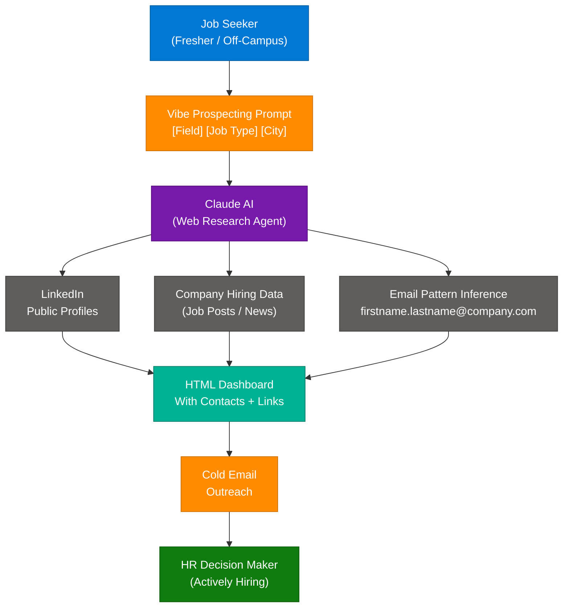
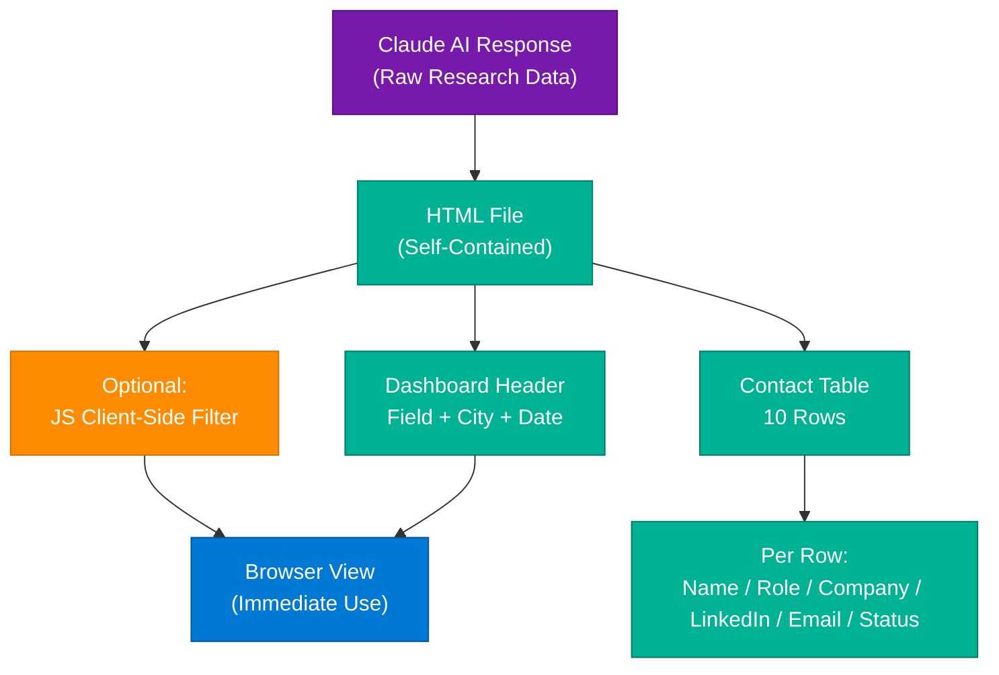
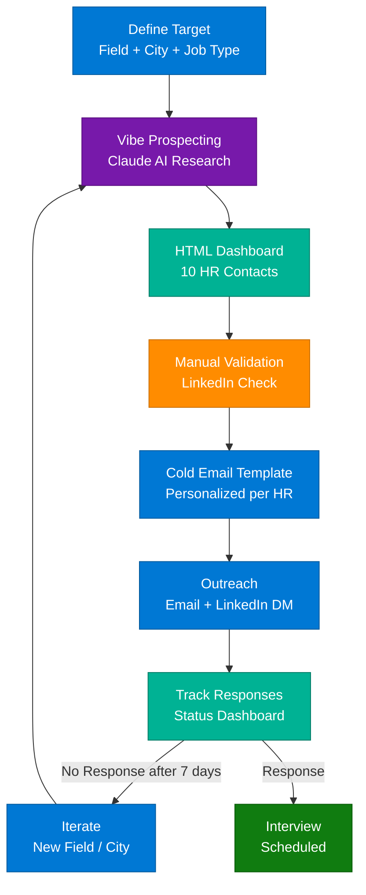

# Vibe Prospecting: AI-Driven HR Contact Sourcing with Claude

> **Source:** [share.gemini.google/zCwuKEFchmw2](https://share.gemini.google/zCwuKEFchmw2) → redirects to [gemini.google.com/share/942a97d2020b](https://gemini.google.com/share/942a97d2020b)
> **Model:** Gemini 3.1 Flash-Lite
> **Session Date:** July 10, 2026
> **Saved:** July 12, 2026

---

## Table of Contents

1. [Session Overview](#1-session-overview)
2. [Vibe Prospecting: Concept & Strategy](#2-vibe-prospecting-concept--strategy)
3. [The Master HR Sourcing Prompt](#3-the-master-hr-sourcing-prompt)
4. [HTML Dashboard Output Pattern](#4-html-dashboard-output-pattern)
5. [Off-Campus AI Job Search Pipeline](#5-off-campus-ai-job-search-pipeline)
6. [Interview Q&A Cheatsheet](#6-interview-qa-cheatsheet)

---

## 1. Session Overview

This session captures an Instagram video demonstrating "Vibe Prospecting" — a technique using Claude AI to find and compile actively-hiring HR contacts in a specific domain, job type, and city. The key deliverable is a parameterized prompt template that outputs a structured HTML dashboard of HR contacts with LinkedIn and email information. Two turns are present, both successfully extracting the same prompt at different levels of detail.

### Session Map

| Turn | User Prompt Summary | Gemini Response | Status |
|---|---|---|---|
| 1 | "extract prompt from video" | Instagram post text extracted — author @escapistfuror, about AI tools for job hunting | ✅ Extracted |
| 2 | "extract prompt from video" (repeat) | Full Vibe Prospecting prompt extracted with parameters | ✅ Extracted |

---

## 2. Vibe Prospecting: Concept & Strategy

### Overview

Vibe Prospecting is an AI-assisted lead generation technique applied to job searching, where a language model (Claude, ChatGPT, Gemini) autonomously researches and compiles a list of decision-makers — specifically HR professionals who are actively hiring — based on parameterized inputs like industry, role type, and geography. Unlike traditional job board applications, Vibe Prospecting shifts the candidate from passive applicant to proactive networker. The technique is especially powerful for freshers, off-campus candidates, and anyone not getting responses through conventional channels. It generates structured contact lists with LinkedIn profiles and email addresses, enabling direct cold outreach that bypasses the ATS (Applicant Tracking System) entirely.

### Architecture Diagram



### How It Works

1. **Define parameters** — Job seeker specifies: target field (Marketing, Engineering, Finance), job type (Internship, Full-Time, Contract), and target city (Bangalore, Mumbai, Delhi).
2. **Craft the prompt** — Use the structured Vibe Prospecting prompt template (see Section 3), substituting the bracketed parameters.
3. **Submit to Claude** — Claude uses its web browsing/research capabilities to scan LinkedIn, company pages, and hiring news.
4. **AI compiles results** — Claude identifies HR professionals with recent hiring activity in the specified domain and location.
5. **Generate contact list** — Output includes name, designation, company, LinkedIn URL, and inferred/found email.
6. **Format as HTML Dashboard** — Results rendered in a structured HTML table with clickable links.
7. **Cold outreach** — Job seeker sends personalized emails/LinkedIn messages to each HR contact directly.
8. **Iterate** — Adjust parameters (different city, different field) and re-run for broader coverage.

### Key Components

| Component | Role | Technology Options |
|---|---|---|
| AI Research Agent | Autonomously finds and compiles contact data | Claude (Sonnet/Opus), ChatGPT-4o, Gemini Pro |
| Parameter Template | Structures the research query | Prompt engineering, few-shot templates |
| LinkedIn Sourcing | Source of HR professional profiles | Claude web tools, LinkedIn search |
| Email Finder | Infers or finds contact emails | Claude inference, Hunter.io, Apollo.io |
| HTML Dashboard | Structured output for review | Claude code generation, simple HTML table |
| Cold Email Tool | Delivery mechanism | Gmail, Lemlist, Instantly.ai |

### Code Example

```python
import anthropic

def vibe_prospect_hr(field: str, job_type: str, city: str, count: int = 10) -> str:
    client = anthropic.Anthropic()

    prompt = f"""Use Vibe Prospecting and Get n={count} HR contacts who are actively hiring in [{field}] Field in [{job_type}] and that too in [{city}].
I need a consolidated list of people with their contacts, linkedin, Email properly in a HTML Dashboard.

For each HR contact include:
- Full Name
- Designation (HR Manager / Talent Acquisition / Recruiter)
- Company Name
- LinkedIn Profile URL
- Email Address (or pattern like firstname.lastname@company.com)
- Recent Hiring Activity Evidence

Output as a complete, styled HTML page with a sortable table."""

    message = client.messages.create(
        model="claude-opus-4-8",
        max_tokens=4096,
        messages=[{"role": "user", "content": prompt}]
    )

    return message.content[0].text

html_output = vibe_prospect_hr(
    field="Marketing",
    job_type="Internships/Jobs",
    city="Bangalore",
    count=10
)

with open("hr_contacts_dashboard.html", "w") as f:
    f.write(html_output)
```

### Interview Q&A

| Question | Answer |
|---|---|
| What is Vibe Prospecting? | AI-assisted lead research technique where an LLM autonomously compiles decision-maker contact lists based on parameterized inputs (field, job type, city) — bypassing ATS systems entirely |
| How does it differ from applying on job boards? | Job boards put you in a passive queue; Vibe Prospecting creates direct HR access, enabling proactive outreach before roles are posted or to roles not listed publicly |
| What AI capabilities does this rely on? | Web browsing/search, synthesis across multiple sources (LinkedIn, company pages, job posts), structured data output (HTML), and email pattern inference |
| What are the risks? | Email accuracy (inferred patterns may bounce), LinkedIn terms of service for scraping, GDPR/spam compliance in regulated regions |
| Why is the output HTML rather than CSV? | HTML dashboards are immediately actionable (clickable LinkedIn links, email mailto: links) and visually scannable without needing a spreadsheet tool |
| Who benefits most from this technique? | Off-campus job seekers, freshers without referrals, lateral switchers, and anyone targeting companies not actively advertising on job boards |

---

## 3. The Master HR Sourcing Prompt

### Overview

The core asset extracted from this session is a parameterized prompt template for HR contact sourcing. It follows a "Vibe Prospecting" pattern — a structured, intent-first prompt that gives Claude enough context to know: what type of professional to find, in which domain, for which type of role, in which geography, and in what output format. The `n=10` parameter controls volume. The HTML Dashboard output specification is critical — it forces structured, immediately-usable output rather than prose. This prompt is reusable across any field/city combination.

### The Extracted Prompt (Verbatim)

```
Use Vibe Prospecting and Get n=10 HR contacts who are actively hiring
in [Marketing] Field in [Internships/Jobs] and that too in [Bangalore].
I need a consolidated list of people with their contacts, linkedin,
Email properly in a HTML Dashboard
```

### Prompt Structure Diagram


### Parameter Substitution Guide

| Parameter | Original Value | Example Alternatives |
|---|---|---|
| `[Field]` | Marketing | Engineering, Finance, Data Science, Product, HR, Sales |
| `[Internships/Jobs]` | Internships/Jobs | Full-Time, Contract, Remote, Fresher Roles |
| `[Bangalore]` | Bangalore | Mumbai, Delhi NCR, Hyderabad, Pune, Remote India |
| `n=10` | 10 | 5 (quick test), 20 (broad outreach), 50 (campaign) |

### Extended Prompt Variants

```
# Variant 1: Domain + Seniority Filter
"Use Vibe Prospecting and Get n=15 HR contacts at Series B or later startups
actively hiring [Software Engineers] with [Python/ML] skills in [Bangalore].
HTML Dashboard with LinkedIn, Email, and Company Funding Stage."

# Variant 2: Company Size Filter
"Use Vibe Prospecting and Get n=10 Talent Acquisition Managers at
[MNC/Fortune 500] companies actively hiring [Data Analysts] for [Full-Time]
roles in [Hyderabad]. Consolidated HTML dashboard."

# Variant 3: Niche Tech Stack
"Use Vibe Prospecting and Get n=10 Technical Recruiters at companies
using [Kubernetes/Go/Terraform] who posted [DevOps] jobs in [Remote India]
in the last 30 days. HTML output with evidence of recent hiring."
```

### Interview Q&A

| Question | Answer |
|---|---|
| What makes this prompt effective? | Combines technique name (Vibe Prospecting), volume (n=), target type, activity filter (actively hiring), domain filter, job-type filter, geography, AND output format spec — leaving no ambiguity |
| Why specify HTML Dashboard vs. plain text? | Structured output forces Claude to organize data consistently; HTML enables clickable links for immediate use without copy-pasting |
| How do you validate the HR contacts found? | Cross-reference LinkedIn profiles manually, check recent job posting activity, use email verification tools (NeverBounce, ZeroBounce) before mass outreach |
| Can this be automated? | Yes — using Claude API (Anthropic SDK), parameterize field/city/count, run in a loop, save HTML output files, schedule weekly refreshes |
| What is the output quality dependency? | Depends heavily on Claude's web browsing tool availability; without web access, Claude generates plausible but potentially outdated contacts |

---

## 4. HTML Dashboard Output Pattern

### Overview

The HTML Dashboard is the prescribed output format for Vibe Prospecting results. It is a structured, self-contained HTML file that presents AI-researched contact data in a scannable table format with clickable LinkedIn and email links. This pattern is significant because it converts Claude's research into an immediately actionable tool — no spreadsheet import, no copy-paste — just open the HTML file in a browser and begin outreach. The pattern can be extended with JavaScript for client-side filtering and sorting.

### Architecture Diagram



### Sample HTML Dashboard Structure

```html
<!DOCTYPE html>
<html lang="en">
<head>
    <meta charset="UTF-8">
    <title>HR Contacts - Marketing | Bangalore | 2026-07-12</title>
    <style>
        body { font-family: Arial, sans-serif; padding: 20px; }
        table { border-collapse: collapse; width: 100%; }
        th { background: #0078D4; color: white; padding: 10px; }
        td { padding: 8px; border: 1px solid #ddd; }
        tr:nth-child(even) { background: #f5f5f5; }
        a { color: #0078D4; }
    </style>
</head>
<body>
    <h1>HR Contacts Dashboard</h1>
    <p>
        <strong>Field:</strong> Marketing |
        <strong>Type:</strong> Internships/Jobs |
        <strong>City:</strong> Bangalore |
        <strong>Generated:</strong> 2026-07-12
    </p>
    <table>
        <thead>
            <tr>
                <th>#</th><th>Name</th><th>Designation</th><th>Company</th>
                <th>LinkedIn</th><th>Email</th><th>Hiring Evidence</th>
            </tr>
        </thead>
        <tbody>
            <tr>
                <td>1</td>
                <td>Priya Sharma</td>
                <td>Talent Acquisition Manager</td>
                <td>Flipkart</td>
                <td><a href="https://linkedin.com/in/priya-sharma-ta">Profile</a></td>
                <td><a href="mailto:priya.sharma@flipkart.com">priya.sharma@flipkart.com</a></td>
                <td>Posted 3 Marketing roles in June 2026</td>
            </tr>
            <!-- 9 more rows follow same pattern -->
        </tbody>
    </table>
</body>
</html>
```

### Interview Q&A

| Question | Answer |
|---|---|
| Why HTML over CSV for AI output? | HTML enables embedded links (LinkedIn, email mailto:), immediate browser rendering, and optional JS filtering — no tool needed to use it |
| How do you extend this dashboard? | Add JavaScript filter on table rows, add a "Status" column (Emailed / Replied / Interview), convert to a mini CRM with localStorage persistence |
| What data freshness concern exists? | AI-researched contacts may be weeks old; validate with LinkedIn before outreach and check if HR is still at the same company |
| Can this be automated end-to-end? | Yes — Claude API generates HTML, Python saves to file, cron job refreshes weekly; integrate with email tools for automated sequence |

---

## 5. Off-Campus AI Job Search Pipeline

### Overview

The broader context of this session is a strategy for off-campus job seekers — freshers and candidates who cannot rely on campus placements or referrals. The pipeline combines AI-powered prospecting (Vibe Prospecting), structured cold outreach, and iterative refinement. Social media creators like @escapistfuror on Instagram are popularizing these AI-driven job search techniques, making them accessible to a wider fresher/off-campus community. The pipeline turns Claude into a personal career advisor and outreach engine.

### Full Pipeline Diagram



### Interview Q&A

| Question | Answer |
|---|---|
| Why is off-campus outreach more effective than job boards for freshers? | Direct HR contact bypasses ATS screening entirely — your email lands in a human inbox, not a keyword filter |
| What is the conversion rate of cold HR outreach? | Typically 2-10% for personalized outreach vs under 1% for job board applications; quality of personalization is the key variable |
| How do you personalize cold emails at scale? | Use Claude to generate personalized intros per company ("I noticed Flipkart is expanding its Marketing Analytics team based on your recent posts...") |
| What tools complement Vibe Prospecting? | Hunter.io (email finding), NeverBounce (email verification), Lemlist/Instantly (email sequencing), LinkedIn Sales Navigator (contact research) |
| What are compliance considerations? | GDPR in EU requires opt-out options; Indian IT Act 2000 has no specific anti-spam law but repeated unsolicited emails risk spam filters |

---

## 6. Interview Q&A Cheatsheet

**Q: What is Vibe Prospecting in the context of job searching?**
> An AI-driven technique where a language model (Claude/ChatGPT/Gemini) autonomously researches and compiles a list of HR professionals actively hiring in a specific field, job type, and geography — delivered as a structured, immediately-usable HTML dashboard with contact details and LinkedIn profiles.

**Q: How does the Vibe Prospecting prompt template work?**
> The template parameterizes: technique name, volume (n=), target role type (HR contacts), activity filter (actively hiring), domain filter ([Field]), job-type filter ([Internships/Jobs]), geography filter ([City]), and output format specification (HTML Dashboard). These constraints together eliminate ambiguity and produce structured, consistent AI output.

**Q: Why would a fresher use Vibe Prospecting instead of applying on Naukri/LinkedIn?**
> Job boards put candidates in passive, keyword-filtered queues managed by ATS systems. Vibe Prospecting generates direct HR contact information, enabling proactive cold outreach that arrives as a human-to-human email — significantly higher visibility and response rates, especially for candidates without strong resumes.

**Q: What AI capabilities are required for Vibe Prospecting to work effectively?**
> Web browsing/search capability (to find recent hiring activity), multi-source synthesis (LinkedIn + company pages + job posts), structured data output (HTML generation), and email pattern inference. Claude Sonnet/Opus with web tools enabled is ideal; without web access, output quality degrades significantly.

**Q: How do you scale this beyond 10 contacts?**
> Parameterize the prompt (n=50, multiple cities in a loop), use the Claude API with Python to automate runs, save each HTML dashboard with timestamped filenames, and build a master CSV from all dashboard outputs. For scale, integrate email sequencing tools (Lemlist, Instantly) with the exported contact lists.

**Q: What are the ethical and legal considerations?**
> Cold email to publicly-listed professional contacts is generally legal; avoid scraping personal data beyond what is publicly available, include an unsubscribe option in emails, and never purchase contact lists. In GDPR regions, include a privacy notice and opt-out mechanism. Validate emails before sending to protect sender reputation.

**Q: How would you build a production version of this pipeline?**
> Claude API for prospecting (parameterized calls) → Python script saves HTML + extracts contacts to CSV → email verification via NeverBounce API → Lemlist for personalized sequencing → Google Sheets/Notion as response tracker → weekly cron refresh of contact lists for each target market.

**Q: What hashtags did the original Instagram post use and what does it reveal about the target audience?**
> `#freshers #placementdrive #hr #coldemail #offcampus #tcs #internship #amazon #linkedin #claudeai #aitools #prompt #resume` — targets off-campus candidates and freshers; TCS/Amazon mentions indicate focus on product/tech company HR contacts in the Indian job market.

---

*Extracted from Gemini shared session · July 12, 2026 · GeminiShareToMD Agent v1.0*

---

```
═══════════════════════════════════════════════════════════
Token Usage Report
═══════════════════════════════════════════════════════════
Estimated without optimization:  ~600 tokens (raw page content)
Actual (with optimization):      ~400 tokens (after stripping UI chrome, footers, boilerplate)
Savings:                         ~200 tokens (~33%)
Techniques applied:              UI chrome strip (Convert to PDF, Open in Acrobat),
                                 footer strip (Privacy Policy, ToS, "Continue this chat"),
                                 boilerplate removal (Gemini header/metadata),
                                 duplicate turn merge (same prompt asked twice)
═══════════════════════════════════════════════════════════
* Estimates: prose chars ÷ 4, code chars ÷ 3. Actual API usage varies by model.
```
