# Web Protocols, Architecture Patterns & Frontend Concepts — Master Reference

> **Source:** [share.gemini.google/zPLmnBmuD0x1](https://share.gemini.google/zPLmnBmuD0x1) → redirects to [gemini.google.com/share/4e1b96baa5a7](https://gemini.google.com/share/4e1b96baa5a7?skid=cbff9133-8d34-4298-a091-7e176107a024)
> **Model:** Gemini 3.1 Flash-Lite
> **Session Date:** August 15, 2025 · Published July 9, 2026
> **Saved:** July 10, 2026

---

## Table of Contents

1. [Session Overview](#1-session-overview)
2. [Polling vs. Long Polling](#2-polling-vs-long-polling)
3. [WebSockets vs. Server-Sent Events](#3-websockets-vs-server-sent-events)
4. [Server-Sent Events vs. Webhooks](#4-server-sent-events-vs-webhooks)
5. [WCAG — Web Content Accessibility Guidelines](#5-wcag--web-content-accessibility-guidelines)
6. [REST vs. GraphQL](#6-rest-vs-graphql)
7. [Webpack — Module Bundler](#7-webpack--module-bundler)
8. [gRPC & Remote Procedure Calls](#8-grpc--remote-procedure-calls)
9. [Keyset vs. Cursor Pagination](#9-keyset-vs-cursor-pagination)
10. [Clean Architecture](#10-clean-architecture)
11. [Composable Architecture vs. Microservices](#11-composable-architecture-vs-microservices)
12. [Progressive Web Apps](#12-progressive-web-apps)
13. [Interview Q&A Cheatsheet](#13-interview-qa-cheatsheet)

---

## 1. Session Overview

This session covers 11 foundational web engineering concepts spanning real-time communication protocols (Polling, Long Polling, WebSockets, SSE, Webhooks), API design styles (REST, GraphQL, gRPC, RPC), frontend tooling (Webpack, PWA), accessibility standards (WCAG), data pagination patterns (Keyset, Cursor), and architectural philosophies (Clean Architecture, Composable Architecture). Duplicate turns on Clean Architecture and Composable Architecture have been merged into single comprehensive sections. All 15 turns were successfully processed.

### Session Map

| Turn | User Prompt | Gemini Response | Status |
|---|---|---|---|
| 1 | Polling vs long polling | Polling and long polling with pros, cons, analogy | ✅ Extracted |
| 2 | Web socket vs server sent event | WebSockets (bidirectional) vs SSE (unidirectional) | ✅ Extracted |
| 3 | WCAG | POUR principles, conformance levels A/AA/AAA | ✅ Extracted |
| 4 | Rest vs GraphQL | REST (resource-based) vs GraphQL (query language) | ✅ Extracted |
| 5 | Webpack | Static module bundler, entry/output/loaders/plugins/modes | ✅ Extracted |
| 6 | gRPC | Protobuf, HTTP/2, streaming types | ✅ Extracted |
| 7 | Purpose of RPC | RPC flow: stub → marshal → transmit → unmarshal → execute | ✅ Extracted |
| 8 | Keyset vs cursor pagination | Keyset (raw values) vs cursor (opaque string) | ✅ Extracted |
| 9 | Server sent event vs webhook | SSE (persistent client-initiated) vs Webhooks (server POST) | ✅ Extracted |
| 10 | Clean architecture | Layer overview, Dependency Rule | ✅ Merged with Turn 12 |
| 11 | Composable architecture | Principles, monolithic comparison | ✅ Merged with Turns 13 & 14 |
| 12 | Clean architecture with core principle | Dependency Rule deep-dive, Onion layers | ✅ Merged into Section 10 |
| 13 | Composable architecture with core principle | Modularity, API-first, Reusability, Flexibility | ✅ Merged into Section 11 |
| 14 | Composable architecture vs microservices | Concept vs pattern distinction | ✅ Merged into Section 11 |
| 15 | Progressive web app | Service Worker, Web App Manifest, offline, installable | ✅ Extracted |

---

## 2. Polling vs. Long Polling

### Overview

Polling (short polling) and long polling are HTTP-based techniques for a client to retrieve near-real-time updates from a server. In short polling, the client repeatedly sends requests at fixed intervals, receiving an immediate response regardless of whether new data exists. Long polling improves efficiency by holding the server connection open until new data is available or a timeout occurs, then immediately re-requesting. Both are legacy patterns superseded by WebSockets and SSE, but remain relevant for systems constrained to standard HTTP and for understanding the evolution of real-time web architecture.

### Architecture Diagram

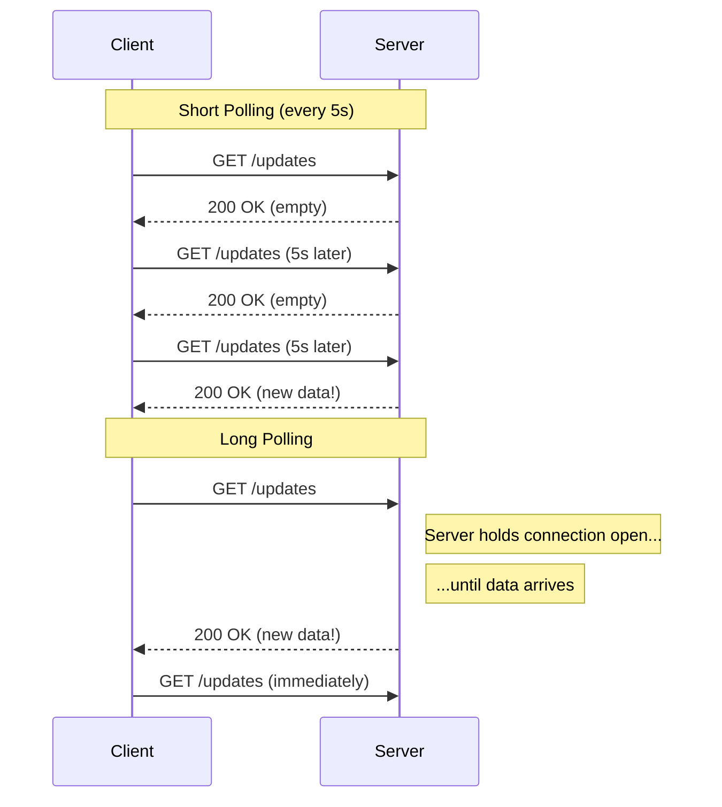

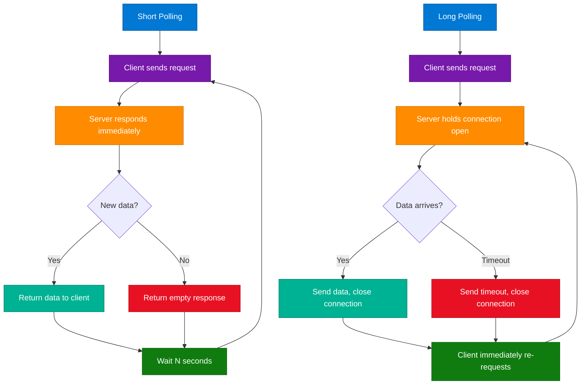

### How It Works

**Short Polling:**
1. Client sets a timer (e.g., 5 seconds).
2. On timer fire, client sends `GET /api/updates`.
3. Server immediately queries the DB or cache.
4. Server responds with data (if available) or empty `200 OK`.
5. Timer resets; cycle repeats indefinitely.

**Long Polling:**
1. Client sends `GET /api/updates`.
2. Server receives request but does NOT respond immediately.
3. Server suspends the response coroutine, holding the TCP connection open.
4. When new data arrives (event, queue message), server writes the response and closes connection.
5. If timeout threshold is reached (e.g., 30s), server sends empty response and closes.
6. Client immediately sends a new request, creating a near-persistent connection.

### Key Components

| Component | Short Polling | Long Polling |
|---|---|---|
| HTTP Connection | New connection every interval | Held open (30–60s typical) |
| Server load | High (many empty responses) | Moderate (fewer requests, more concurrent connections) |
| Latency | Up to 1 full interval | Near-zero (response on event) |
| Infrastructure | Any HTTP server | Requires async I/O |
| Timeout handling | N/A | Must handle server timeout + client retry |

### Code Example

```python
import asyncio
from aiohttp import web

async def long_poll_handler(request):
    timeout = 30
    event = asyncio.Event()
    request.app['waiting'].append(event)
    try:
        await asyncio.wait_for(event.wait(), timeout=timeout)
        return web.json_response({"data": request.app['latest_data']})
    except asyncio.TimeoutError:
        return web.json_response({"data": None, "timeout": True})
    finally:
        request.app['waiting'].remove(event)

async def publish_update(request):
    body = await request.json()
    request.app['latest_data'] = body
    for event in request.app['waiting']:
        event.set()
    return web.json_response({"published": True})

app = web.Application()
app['waiting'] = []
app['latest_data'] = None
app.router.add_get('/poll', long_poll_handler)
app.router.add_post('/publish', publish_update)
```

### Interview Q&A

| Question | Answer |
|---|---|
| What is the core difference between polling and long polling? | Polling responds immediately (even with empty data); long polling holds the connection open until data is available or timeout occurs. |
| Why does short polling cause high server load? | Every request hits the server regardless of whether new data exists, generating many wasted compute cycles. |
| How does long polling achieve near-real-time updates? | The server suspends the response until an event triggers it, so the client receives data within milliseconds of the event, not after a fixed interval. |
| What server capability is required for long polling? | Asynchronous I/O (async/await, event loops) to hold thousands of open connections without exhausting threads. |
| When is polling still a valid choice? | For admin dashboards or low-frequency updates where simplicity outweighs the cost of unnecessary requests. |
| How do you handle long poll timeouts on the client? | Check the response — if `timeout: true`, immediately re-issue the request to re-establish the connection. |

---

## 3. WebSockets vs. Server-Sent Events

### Overview

WebSockets and SSE are both persistent-connection technologies that eliminate polling overhead, but differ in directionality. WebSockets establish a full-duplex, bidirectional channel over a custom protocol (`ws://`/`wss://`), enabling both sides to push messages at any time. SSE uses a standard long-lived HTTP connection with `text/event-stream`, allowing only the server to push events. WebSockets are heavier to implement but essential for interactive applications; SSE is simpler, HTTP-native, and auto-reconnecting, ideal for one-way streams.

### Architecture Diagram

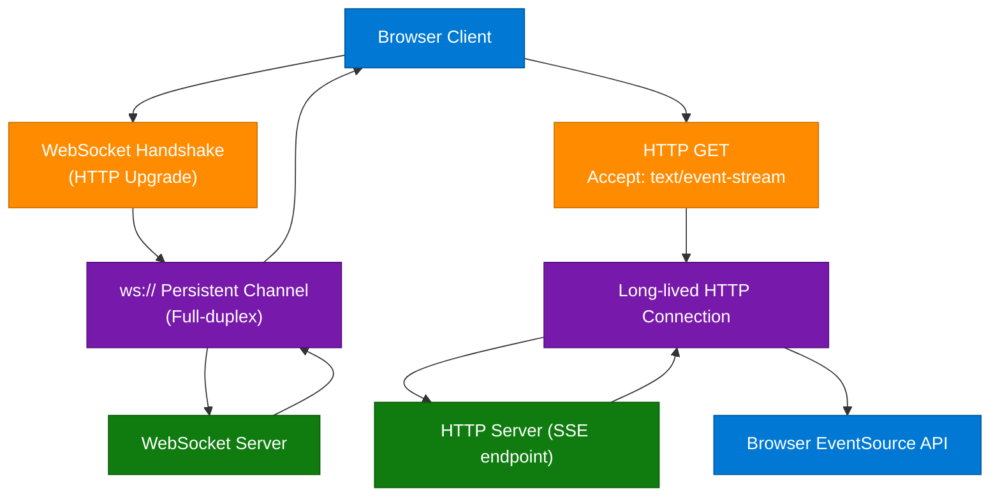

### Key Comparison

| Feature | WebSockets | Server-Sent Events |
|---|---|---|
| Direction | Bidirectional | Server → Client only |
| Protocol | ws:// / wss:// | HTTP |
| Browser API | `WebSocket` | `EventSource` |
| Auto-reconnect | Manual | Built-in |
| Binary support | Yes | No (text only) |
| Proxy/firewall compatibility | Can be blocked | Works over standard HTTP |
| Complexity | Higher | Lower |
| Use cases | Chat, gaming, trading | Live feeds, scores, progress bars |
| HTTP/2 compatibility | Separate upgrade | Native |

### Code Example

```python
from fastapi import FastAPI, WebSocket
from fastapi.responses import StreamingResponse
import asyncio

app = FastAPI()

# SSE endpoint
async def event_stream():
    count = 0
    while True:
        count += 1
        yield f"data: {{\"count\": {count}}}\n\n"
        await asyncio.sleep(1)

@app.get("/events")
async def sse_endpoint():
    return StreamingResponse(event_stream(), media_type="text/event-stream")

# WebSocket endpoint
@app.websocket("/ws")
async def websocket_endpoint(ws: WebSocket):
    await ws.accept()
    while True:
        data = await ws.receive_text()
        await ws.send_text(f"Echo: {data}")
```

### Interview Q&A

| Question | Answer |
|---|---|
| Why choose SSE over WebSockets for a live news feed? | SSE is simpler, HTTP-native, and auto-reconnecting — perfect when data flows only server-to-client. |
| What happens when an SSE connection drops? | `EventSource` auto-reconnects after ~3 seconds, resuming from the last event ID if the server supports it. |
| What is the WebSocket handshake? | An HTTP/1.1 request with `Upgrade: websocket`; server responds `101 Switching Protocols`, after which the TCP connection carries WebSocket frames. |
| How do you broadcast to multiple SSE clients? | Maintain a list of active response queues; when an event occurs, push it to every active generator. |
| What is the `last-event-id` header? | Each SSE event can carry an `id:` field. On reconnection, the browser sends `Last-Event-ID` so the server can replay missed events. |
| Can WebSockets use HTTP/2? | Yes, but they don't benefit from HTTP/2 multiplexing — they still use one upgraded connection. SSE benefits more from HTTP/2 streams. |

---

## 4. Server-Sent Events vs. Webhooks

### Overview

Both SSE and webhooks deliver data without polling, but serve entirely different architectures. SSE is browser-facing: the browser opens a persistent HTTP connection to receive a real-time event stream for a user session. Webhooks are server-to-server: when an event occurs in System A, it fires an HTTP POST to a pre-configured URL on System B — no persistent connection involved. SSE is stateful and session-bound; webhooks are stateless and event-triggered.

### Architecture Diagram

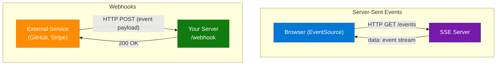

### Key Comparison

| Feature | SSE | Webhooks |
|---|---|---|
| Initiator | Client (browser) | Server (external service) |
| Consumer | Browser / frontend | Your server endpoint |
| Connection | Persistent, long-lived | New HTTP POST per event |
| Requires public URL | No | Yes |
| Auto-retry | Built into EventSource | Must implement yourself |
| Use case | Real-time UI updates | Service-to-service event notification |

### Code Example

```python
import hmac, hashlib
from fastapi import FastAPI, Request, HTTPException

app = FastAPI()
WEBHOOK_SECRET = b"your_secret_here"

@app.post("/webhook")
async def receive_webhook(request: Request):
    body = await request.body()
    sig = request.headers.get("X-Hub-Signature-256", "")
    expected = "sha256=" + hmac.new(WEBHOOK_SECRET, body, hashlib.sha256).hexdigest()
    if not hmac.compare_digest(sig, expected):
        raise HTTPException(status_code=401, detail="Invalid signature")
    payload = await request.json()
    event_type = request.headers.get("X-GitHub-Event")
    print(f"Received {event_type}: {payload.get('action')}")
    return {"status": "received"}
```

### Interview Q&A

| Question | Answer |
|---|---|
| When would you use a webhook instead of SSE? | Service-to-service event notification (GitHub push → CI, Stripe payment → order service) rather than streaming to a browser UI. |
| What is the key security concern with webhooks? | Webhook endpoints are public URLs — always validate an HMAC-SHA256 signature to verify the request came from the legitimate source. |
| What happens if your webhook server is down? | Most providers retry with exponential backoff. You must handle idempotency — the same event may arrive multiple times. |
| How do you make webhooks idempotent? | Store processed event IDs in a cache or DB; skip processing if the ID was already seen. |
| Can SSE replace webhooks for microservices? | No — SSE requires the consumer to maintain a long-running browser session; microservices can't typically act as SSE clients. |

---

## 5. WCAG — Web Content Accessibility Guidelines

### Overview

WCAG is a set of internationally recognized recommendations by the W3C for making web content accessible to people with disabilities — visual (blindness, low vision, color blindness), auditory (deafness), motor (limited fine motor control), and cognitive (learning disabilities). The guidelines are organized around four principles (POUR) and three conformance levels (A, AA, AAA). While WCAG itself is a recommendation, it forms the technical basis for legal accessibility requirements worldwide: ADA (USA), EN 301 549 (EU), AODA (Canada).

### Architecture Diagram

```mermaid
flowchart TD
    wcag["WCAG\n(W3C Recommendation)"]
    wcag --> perceivable["Perceivable (P)"]
    wcag --> operable["Operable (O)"]
    wcag --> understandable["Understandable (U)"]
    wcag --> robust["Robust (R)"]

    perceivable --> p1["Alt text for images"]
    perceivable --> p2["Captions for video/audio"]
    perceivable --> p3["Color contrast 4.5:1 minimum"]

    operable --> o1["Keyboard accessible"]
    operable --> o2["No seizure-inducing content"]
    operable --> o3["Sufficient time to read content"]

    understandable --> u1["Readable, clear language"]
    understandable --> u2["Predictable navigation"]
    understandable --> u3["Error identification and correction"]

    robust --> r1["Valid semantic HTML"]
    robust --> r2["Screen reader compatible"]
    robust --> r3["Compatible with assistive tech"]

    classDef userNode    fill:#0078D4,stroke:#005A9E,color:#fff
    classDef aiNode      fill:#7719AA,stroke:#5A0E80,color:#fff
    classDef dataNode    fill:#107C10,stroke:#0A5C0A,color:#fff
    classDef processNode fill:#FF8C00,stroke:#CC7000,color:#fff
    classDef outputNode  fill:#00B294,stroke:#007D68,color:#fff
    classDef infraNode   fill:#605E5C,stroke:#3B3A39,color:#fff

    class wcag userNode
    class perceivable,operable,understandable,robust aiNode
    class p1,p2,p3 dataNode
    class o1,o2,o3 processNode
    class u1,u2,u3 outputNode
    class r1,r2,r3 infraNode
```

### POUR Principles

**Perceivable** — Information must be presentable via at least one working sense.
- All non-text content needs text alternatives (`alt`, `aria-label`).
- Video requires synchronized captions; audio requires transcripts.
- Minimum contrast ratio: 4.5:1 for normal text, 3:1 for large text (AA); 7:1 for AAA.

**Operable** — Every interactive element must be usable without a mouse.
- All functionality keyboard accessible (Tab, Enter, Space, Arrow keys).
- Focus indicators must be visible — never `outline: none` without replacement.
- No content flashing more than 3 times per second (seizure threshold).

**Understandable** — Content and UI behavior must be predictable and error-tolerant.
- Page language declared: `<html lang="en">`.
- Consistent navigation across pages.
- Form errors must identify the field and suggest correction.

**Robust** — Content must work across all current and future assistive technologies.
- Use semantic HTML (`<button>`, `<nav>`, `<main>`) instead of `<div>` + ARIA.
- ARIA roles must match actual element behavior.
- Test with real screen readers (NVDA, JAWS, VoiceOver).

### Conformance Levels

| Level | Description | Typical Requirement |
|---|---|---|
| A | Minimum — basic accessibility | Required for all public sites |
| AA | Most impairments addressed | Legal requirement (ADA, EN 301 549) |
| AAA | Highest — not achievable for all content | Government/high-compliance contexts |

### Interview Q&A

| Question | Answer |
|---|---|
| What does WCAG stand for and who publishes it? | Web Content Accessibility Guidelines, published by the W3C as part of the Web Accessibility Initiative (WAI). |
| What are the four POUR principles? | Perceivable, Operable, Understandable, Robust. |
| What conformance level is required for legal compliance? | AA — covers the broadest range of disabilities while remaining practically achievable for most content types. |
| How do you test for WCAG compliance? | Automated tools (axe, Lighthouse, WAVE) catch ~30–40% of issues; manual keyboard testing and screen reader testing are required for the rest. |
| What is the minimum color contrast ratio for AA? | 4.5:1 for normal text, 3:1 for large text (≥18pt or ≥14pt bold). |
| What is the difference between ARIA and semantic HTML? | Semantic HTML elements have built-in ARIA roles and keyboard behavior; ARIA supplements, it should not replace, native semantics. |

---

## 6. REST vs. GraphQL

### Overview

REST organizes APIs around resources (nouns) at multiple HTTP endpoints, each returning a fixed data shape. GraphQL provides a single endpoint and a schema-defined type system, letting clients specify exactly which fields they need in a query. REST is widely adopted, simple, and CDN-cacheable; GraphQL excels in complex client-driven scenarios (SPAs, mobile BFF layers) where over-fetching and under-fetching are pain points.

### Architecture Diagram

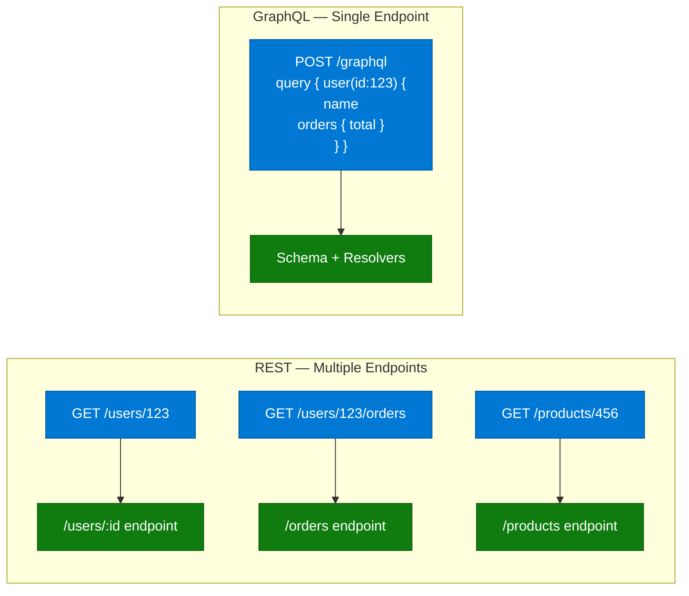

### Key Comparison

| Feature | REST | GraphQL |
|---|---|---|
| Endpoints | Multiple | Single (`/graphql`) |
| Data shape | Fixed — server-defined | Flexible — client-defined |
| Over-fetching | Common | Eliminated |
| Under-fetching | Common (N+1 requests) | Eliminated (nested queries) |
| HTTP methods | GET, POST, PUT, DELETE | Typically POST |
| Versioning | `v1/`, `v2/` prefixes | Schema evolution, no versioning |
| Caching | HTTP-native (ETags, CDN) | Requires custom (Apollo Client) |
| Real-time | Add WebSocket/SSE separately | Subscriptions built-in |

### Code Example

```python
# GraphQL with Strawberry (Python)
import strawberry
from typing import List

@strawberry.type
class Order:
    id: int
    total: float

@strawberry.type
class User:
    id: int
    name: str
    orders: List[Order]

@strawberry.type
class Query:
    @strawberry.field
    def user(self, id: int) -> User:
        return User(id=id, name="Alice", orders=[Order(id=1, total=99.99)])

schema = strawberry.Schema(query=Query)
# REST needs 3 requests; GraphQL resolves user + orders in 1
```

### Interview Q&A

| Question | Answer |
|---|---|
| What is over-fetching in REST? | Server returns more fields than the client needs, wasting bandwidth. |
| What is under-fetching in REST? | A single endpoint doesn't return all needed data, requiring multiple requests (N+1 problem). |
| How does GraphQL eliminate over/under-fetching? | Clients specify exactly which fields and nested relations they need in a single query. |
| How does REST handle API evolution? | Versioning (`/api/v2/`) — maintenance-heavy. GraphQL uses field deprecation and additive schema changes. |
| What is the N+1 problem in GraphQL? | A resolver fetches N items, then makes a separate DB call per item's related data. Solved with DataLoader (batching). |
| When is REST still the better choice? | Simple CRUD APIs, public APIs with broad clients, CDN-cached endpoints, or teams without GraphQL expertise. |

---

## 7. Webpack — Module Bundler

### Overview

Webpack is a static module bundler for JavaScript applications. It ingests an application's dependency graph — starting from entry points — and produces optimized output bundles (JS, CSS, images, fonts) for the browser. Before module bundlers, browsers required dozens of `<script>` tags, causing high HTTP request latency and fragile dependency ordering. Webpack treats every asset as a module, transforms them through loaders, and bundles them into compact output files. Vite and esbuild have emerged as faster alternatives for development builds, but Webpack remains the most feature-complete option for complex enterprise configurations.

### Architecture Diagram

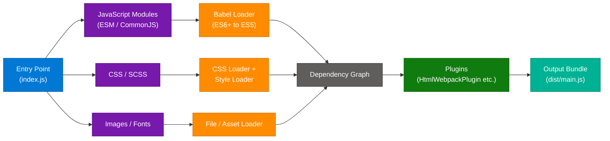

### Core Concepts

| Concept | Purpose | Example |
|---|---|---|
| **Entry** | Starting file for dependency graph | `entry: './src/index.js'` |
| **Output** | Where to write bundled files | `output: { path: dist, filename: 'main.[hash].js' }` |
| **Loaders** | Transform non-JS files into modules | `babel-loader`, `css-loader`, `url-loader` |
| **Plugins** | Extend beyond loaders | `HtmlWebpackPlugin`, `MiniCssExtractPlugin` |
| **Mode** | Built-in optimization presets | `development` (source maps), `production` (minify, tree-shake) |
| **Code Splitting** | Split bundle into on-demand chunks | Dynamic `import()`, `SplitChunksPlugin` |
| **Tree Shaking** | Remove unused exports | Requires ESM, enabled in production mode |
| **Source Maps** | Map minified code to source | `devtool: 'source-map'` |

### Code Example

```javascript
const HtmlWebpackPlugin = require('html-webpack-plugin');
const MiniCssExtractPlugin = require('mini-css-extract-plugin');
const path = require('path');

module.exports = {
  mode: 'production',
  entry: './src/index.js',
  output: {
    path: path.resolve(__dirname, 'dist'),
    filename: '[name].[contenthash].js',
    clean: true,
  },
  module: {
    rules: [
      { test: /\.jsx?$/, use: 'babel-loader', exclude: /node_modules/ },
      { test: /\.css$/, use: [MiniCssExtractPlugin.loader, 'css-loader'] },
      { test: /\.(png|svg|woff2?)$/, type: 'asset/resource' },
    ],
  },
  plugins: [
    new HtmlWebpackPlugin({ template: './src/index.html' }),
    new MiniCssExtractPlugin({ filename: '[name].[contenthash].css' }),
  ],
  optimization: { splitChunks: { chunks: 'all' } },
};
```

### Interview Q&A

| Question | Answer |
|---|---|
| What is a Webpack loader vs. a plugin? | Loaders transform individual file types into modules during graph construction. Plugins operate on the entire compilation — HTML generation, bundle optimization, env variable injection. |
| What is tree shaking? | Dead code elimination — Webpack removes exported functions/variables that are never imported. Requires ESM; doesn't work with CommonJS `require`. |
| What is code splitting and why does it matter? | Splitting the bundle into smaller chunks that load on demand reduces initial page load time. Large libraries load only when the feature using them is accessed. |
| How does `contenthash` help caching? | Hash changes only when file content changes, enabling long-term browser caching. Unchanged chunks are served from cache; changed chunks get a new hash and bypass it. |
| What replaced Webpack for development speed? | Vite (uses native ESM in dev, Rollup for production) and esbuild (Go-based, 10–100x faster). Webpack remains dominant for complex production configurations. |

---

## 8. gRPC & Remote Procedure Calls

### Overview

RPC (Remote Procedure Call) allows a program to execute a function on a remote machine as if it were a local call, abstracting away network communication, serialization, and protocol details. gRPC is Google's modern RPC implementation using Protocol Buffers (binary IDL) over HTTP/2. The combination of Protobuf's compact binary encoding and HTTP/2's multiplexing, header compression, and bidirectional streaming makes gRPC 5–10x faster than REST+JSON, making it the de facto standard for internal microservice communication in polyglot architectures.

### Architecture Diagram — RPC Flow

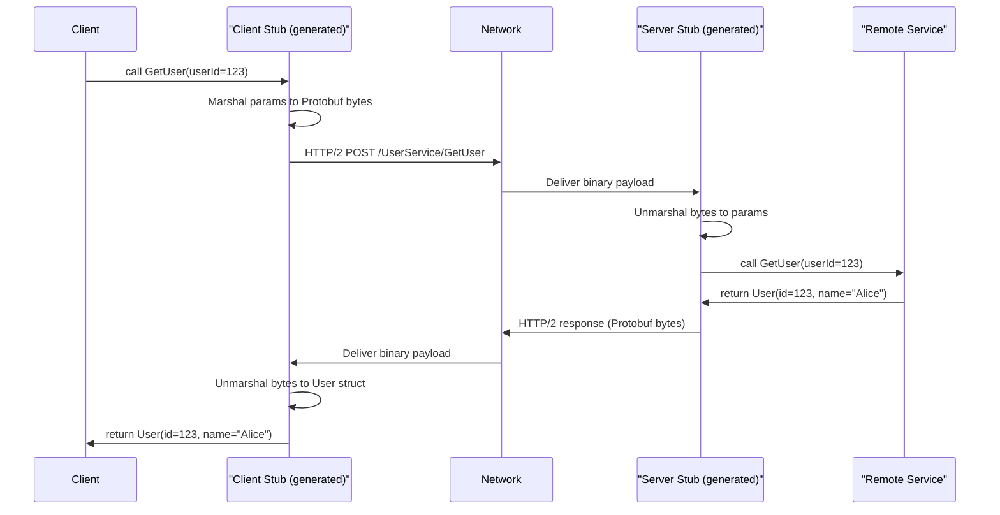

### Architecture Diagram — gRPC Components

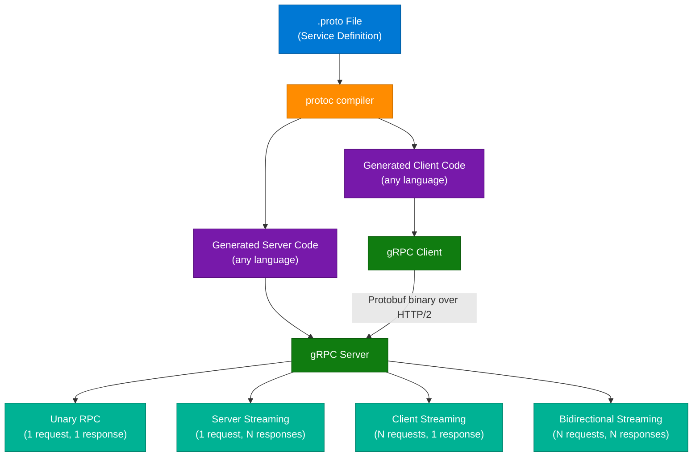

### gRPC Streaming Types

| Type | Pattern | Use Case |
|---|---|---|
| Unary | 1 request → 1 response | Standard API call |
| Server streaming | 1 request → N responses | Large dataset download, live feed |
| Client streaming | N requests → 1 response | File upload, batch data push |
| Bidirectional | N requests ↔ N responses | Real-time chat, game state sync |

### Code Example

```protobuf
// user.proto
syntax = "proto3";
service UserService {
  rpc GetUser (GetUserRequest) returns (User);
  rpc StreamUsers (Empty) returns (stream User);
}
message GetUserRequest { int32 id = 1; }
message User { int32 id = 1; string name = 2; string email = 3; }
message Empty {}
```

```python
import grpc
from concurrent import futures
import user_pb2, user_pb2_grpc

class UserServiceServicer(user_pb2_grpc.UserServiceServicer):
    def GetUser(self, request, context):
        return user_pb2.User(id=request.id, name="Alice", email="alice@example.com")

    def StreamUsers(self, request, context):
        for i in range(100):
            yield user_pb2.User(id=i, name=f"User {i}")

server = grpc.server(futures.ThreadPoolExecutor(max_workers=10))
user_pb2_grpc.add_UserServiceServicer_to_server(UserServiceServicer(), server)
server.add_insecure_port('[::]:50051')
server.start()
server.wait_for_termination()
```

### Interview Q&A

| Question | Answer |
|---|---|
| What makes gRPC faster than REST+JSON? | Protocol Buffers (binary, schema-defined, no field name overhead) + HTTP/2 (multiplexing, header compression, binary framing) reduce payload size 5–10x and eliminate head-of-line blocking. |
| What is a stub in RPC? | Auto-generated code acting as a local proxy for the remote function. Client stub marshals parameters and makes the network call; server stub receives the call and invokes the actual service. |
| What is marshalling? | Serializing function parameters into a transmittable format (Protobuf binary encoding), and deserializing on the other end (unmarshalling). |
| When should you use REST instead of gRPC? | Browser consumers (gRPC-Web adds overhead), human-readable debugging (JSON), or public APIs needing broad client compatibility. |
| Why is gRPC language-agnostic? | The `.proto` file is compiled by `protoc` into client/server code for any supported language, ensuring type-safe contracts across heterogeneous services. |
| What are the four gRPC streaming types? | Unary (1:1), server streaming (1:N), client streaming (N:1), bidirectional streaming (N:N). |

---

## 9. Keyset vs. Cursor Pagination

### Overview

Keyset and cursor pagination are scalable alternatives to `LIMIT/OFFSET`, which degrades with large datasets because `OFFSET N` requires scanning and discarding N rows before returning results. Keyset pagination uses raw column values of the last fetched row (e.g., `WHERE id > 1000`) directly in a `WHERE` clause, enabling index seeks instead of scans. Cursor pagination wraps those values in an opaque Base64-encoded string, hiding the underlying schema while providing the same seek-based performance. Both support only sequential (next/prev) navigation — not random page jumps.

### Architecture Diagram

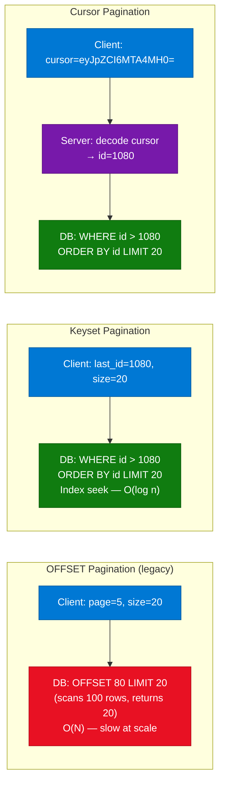

### Key Comparison

| Feature | OFFSET | Keyset | Cursor |
|---|---|---|---|
| DB operation | Full scan + discard | Index seek | Index seek |
| Performance at page 1000 | Slow | Fast | Fast |
| Client sees underlying keys | N/A | Yes (raw values) | No (opaque string) |
| Security | N/A | Keys exposed | Keys hidden |
| Jump to page N | Yes | No | No |
| Consistency on data changes | No (skip/duplicate) | Yes | Yes |
| Implementation complexity | Low | Medium | Medium-High |

### Code Example

```python
from fastapi import FastAPI
from typing import Optional
import base64, json

app = FastAPI()

@app.get("/products")
def get_products(last_id: Optional[int] = None, limit: int = 20):
    # Keyset: raw value in WHERE clause
    query = "SELECT id, name FROM products"
    if last_id:
        query += f" WHERE id > {last_id}"
    query += f" ORDER BY id ASC LIMIT {limit}"
    results = [{"id": i, "name": f"Product {i}"} for i in range(last_id or 0, (last_id or 0) + limit)]
    return {"items": results, "next_last_id": results[-1]["id"] if results else None}

def encode_cursor(id: int) -> str:
    return base64.b64encode(json.dumps({"id": id}).encode()).decode()

def decode_cursor(cursor: str) -> int:
    return json.loads(base64.b64decode(cursor.encode()))["id"]

@app.get("/products-cursor")
def get_products_cursor(cursor: Optional[str] = None, limit: int = 20):
    # Cursor: opaque string hides the key
    last_id = decode_cursor(cursor) if cursor else 0
    results = [{"id": i, "name": f"Product {i}"} for i in range(last_id, last_id + limit)]
    return {"items": results, "next_cursor": encode_cursor(results[-1]["id"]) if results else None}
```

### Interview Q&A

| Question | Answer |
|---|---|
| Why is OFFSET pagination slow at high page numbers? | The DB must scan and discard all rows before the offset position before returning the requested page — O(N) cost that grows with page depth. |
| What is the key difference between keyset and cursor pagination? | Keyset exposes raw column values to the client; cursor encodes them in an opaque string, hiding the schema. |
| What SQL pattern does keyset pagination use? | `WHERE sort_key > last_value ORDER BY sort_key ASC LIMIT page_size` — relies on an indexed column for O(log N) performance. |
| What is the main limitation of both approaches? | Neither supports random page access (jumping to page 50) — sequential next/prev navigation only. |
| How do you handle multi-column sorts in cursor pagination? | Encode all sort key values into the cursor (`{"created_at": "2025-01-01", "id": 42}`) and use a composite `WHERE (created_at, id) > (?, ?)` clause. |
| When would you still use OFFSET? | Admin panels or small datasets where users need page number access and dataset size makes scan cost acceptable. |

---

## 10. Clean Architecture

### Overview

Clean Architecture (Robert C. Martin / "Uncle Bob") enforces strict separation of concerns through concentric layers, with business rules at the center and infrastructure at the periphery. The defining constraint is the **Dependency Rule**: source code dependencies can only point inward — inner layers never know about outer layers. This makes the core business logic testable without databases, frameworks, or UIs, and immune to changes in external tools (swapping MySQL for PostgreSQL, React for Angular) without touching business rules. Clean Architecture synthesizes Onion Architecture, Hexagonal Architecture (Ports & Adapters), and DDD layering.

### Architecture Diagram

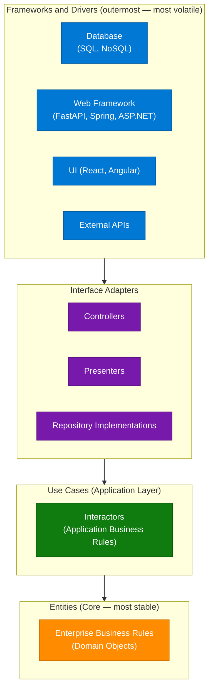

### The Four Layers

| Layer | Contents | Depends On | Stability |
|---|---|---|---|
| **Entities** | Domain objects, business rules, value objects | Nothing | Most stable |
| **Use Cases** | Application logic, orchestration, interactors | Entities only | Stable |
| **Interface Adapters** | Controllers, presenters, repository implementations | Use Cases | Moderately volatile |
| **Frameworks & Drivers** | DB, web framework, UI, external services | Interface Adapters | Most volatile |

### Dependency Inversion — Crossing Boundaries

The Dependency Rule allows crossing layer boundaries via **interfaces**. If a Use Case needs to persist data, it defines a `UserRepository` interface *in its own layer*. The outer Interface Adapter provides the concrete `SqlUserRepository`. The Use Case depends only on the interface; the database detail never bleeds inward.

### Code Example

```python
# Entities — pure Python, zero dependencies
class User:
    def __init__(self, id: int, email: str, name: str):
        self.id, self.email, self.name = id, email, name

    def is_valid_email(self) -> bool:
        return "@" in self.email

# Use Case — depends only on Entity + abstract repository interface
from abc import ABC, abstractmethod

class UserRepository(ABC):
    @abstractmethod
    def find_by_id(self, id: int) -> "User": ...
    @abstractmethod
    def save(self, user: "User") -> None: ...

class GetUserUseCase:
    def __init__(self, repo: UserRepository):
        self.repo = repo

    def execute(self, user_id: int) -> User:
        user = self.repo.find_by_id(user_id)
        if not user:
            raise ValueError(f"User {user_id} not found")
        return user

# Interface Adapter — concrete implementation using SQLAlchemy (outer layer)
class SqlUserRepository(UserRepository):
    def __init__(self, session):
        self.session = session

    def find_by_id(self, id: int) -> User:
        row = self.session.query(UserModel).filter_by(id=id).first()
        return User(row.id, row.email, row.name) if row else None

    def save(self, user: User) -> None:
        self.session.add(UserModel(id=user.id, email=user.email, name=user.name))
        self.session.commit()
```

### Interview Q&A

| Question | Answer |
|---|---|
| What is the Dependency Rule? | Source code dependencies can only point inward. Outer layers (framework, DB) may depend on inner layers (use cases, entities), but inner layers must never import from outer layers. |
| How does Clean Architecture achieve database independence? | Use Cases define a repository interface in their own layer. The concrete database implementation lives in the Interface Adapters layer — swapping databases only requires replacing the outer implementation. |
| What is the difference between Entities and Use Cases? | Entities contain enterprise-wide rules ("an order total cannot be negative") that apply across applications. Use Cases contain application-specific rules ("when a user places an order, notify the warehouse"). |
| What is a Use Case Interactor? | The class implementing a single application Use Case — receives input from a Controller (input port), executes domain logic, passes output to a Presenter (output port). |
| How does Clean Architecture relate to Hexagonal Architecture? | Same core idea: business logic at center, infrastructure at edges, connected through ports (interfaces). Hexagonal uses "ports and adapters" terminology; Clean Architecture uses concentric layers. |
| What is the cost of Clean Architecture? | More boilerplate — each feature needs an Entity, Use Case, Repository interface, concrete implementation, and Controller. Justified in large long-lived systems; over-engineering for simple CRUD services. |

---

## 11. Composable Architecture vs. Microservices

### Overview

Composable architecture is a high-level business and engineering strategy for assembling systems from independent, interchangeable components — whether custom microservices, third-party SaaS, headless CMS platforms, or open-source modules. Microservices is a specific architectural pattern (technical implementation) that can serve as building blocks within a composable system, but composable architecture is broader: it encompasses API governance, team topology, vendor strategy, and organizational agility alongside technical decomposition. The key mental model: composable architecture answers "what should we build?"; microservices answers "how should we deploy it?"

### Architecture Diagram — Composable System

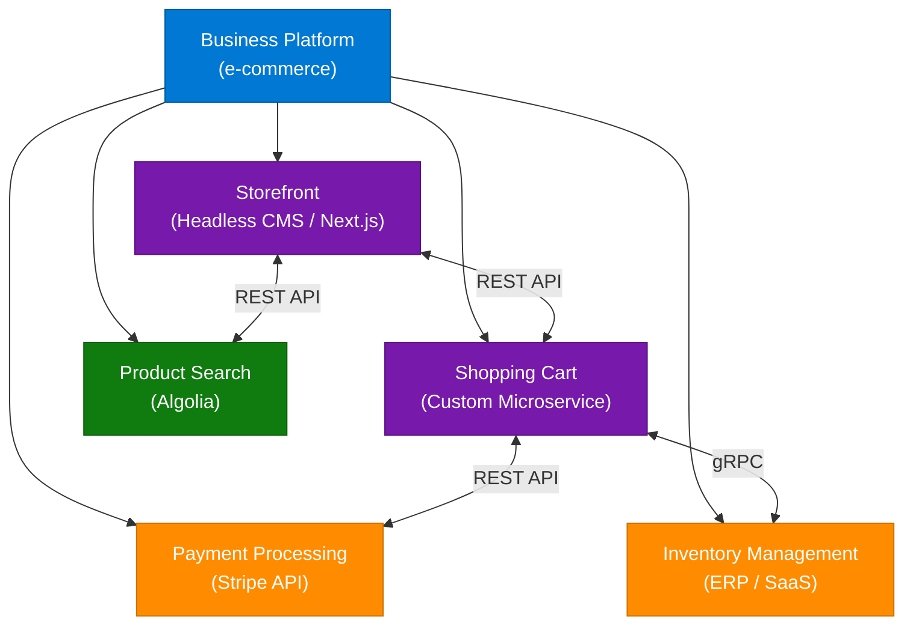

### Four Core Principles

| Principle | Description | Implementation |
|---|---|---|
| **Modularity** | Self-contained components with clear boundaries | Microservices, bounded contexts (DDD) |
| **API-First** | All inter-component communication via standardized APIs | REST, GraphQL, gRPC, event buses |
| **Reusability** | Components usable across multiple products/channels | Shared auth service, product catalog API |
| **Flexibility** | Components swappable without system-wide rework | Abstraction layers, vendor-agnostic interfaces |

### Composable vs. Microservices vs. Monolith

| Feature | Monolith | Microservices | Composable Architecture |
|---|---|---|---|
| Level | Architecture pattern | Architecture pattern | Design philosophy / strategy |
| Coupling | Tight | Loose | Very loose (API contracts) |
| Component type | Modules/packages | Independently deployed services | Services, SaaS, APIs, headless tools |
| Team model | Single team | Small independent service teams | Internal teams + vendor products |
| Technology stack | Uniform | Per-service flexibility | Best-of-breed per component |
| Primary goal | Simplicity | Technical scalability, fault isolation | Business agility, speed to market |

### Code Example

```python
import httpx
from fastapi import FastAPI

app = FastAPI()

PAYMENT_URL = "https://api.stripe.com/v1"
INVENTORY_URL = "http://inventory-service:8001"
SEARCH_URL = "https://api.algolia.com"

@app.post("/checkout")
async def checkout(order: dict):
    async with httpx.AsyncClient() as client:
        # Each component is an independent API — swap any without touching others
        inventory = await client.post(f"{INVENTORY_URL}/reserve", json={"items": order["items"]})
        if not inventory.json()["success"]:
            return {"error": "Out of stock"}

        payment = await client.post(f"{PAYMENT_URL}/charges",
            json={"amount": order["total"], "source": order["payment_token"]})
        return {"order_id": order["id"], "status": payment.json()["status"]}
```

### Interview Q&A

| Question | Answer |
|---|---|
| What is the difference between composable architecture and microservices? | Composable is a design philosophy (business agility through interchangeable components); microservices is a technical implementation pattern (independently deployable services). Microservices are commonly used within composable but are not synonymous with it. |
| What are the four principles of composable architecture? | Modularity, API-First, Reusability, Flexibility. |
| What is an API-first approach? | Designing the API contract before the implementation, ensuring every component's functionality is accessible and composable regardless of internal technology. |
| What is headless architecture in the composable context? | Separating the frontend presentation layer (head) from backend content/commerce logic, allowing each to evolve independently and be assembled with best-of-breed tools. |
| What are the main challenges of composable architecture? | API versioning complexity, distributed failure modes, data consistency across components, increased operational overhead, and need for strong API governance. |
| Can a monolith be composable? | Partially — a modular monolith with clean internal API boundaries follows composable principles internally, but lacks independent deployability and technology flexibility of a fully composable system. |

---

## 12. Progressive Web Apps

### Overview

A Progressive Web App (PWA) is a web application built with HTML, CSS, and JavaScript that delivers a native app-like experience through three core technologies: the **Service Worker** (background JS thread enabling offline, caching, and push), the **Web App Manifest** (JSON metadata enabling installation and standalone display), and **HTTPS** (required for service worker registration). PWAs are "progressive" — they work for all users on any browser while unlocking enhanced capabilities on supporting platforms. They bridge the gap between websites (discoverable, linkable, no install friction) and native apps (offline, installable, push notifications) without separate iOS/Android codebases.

### Architecture Diagram

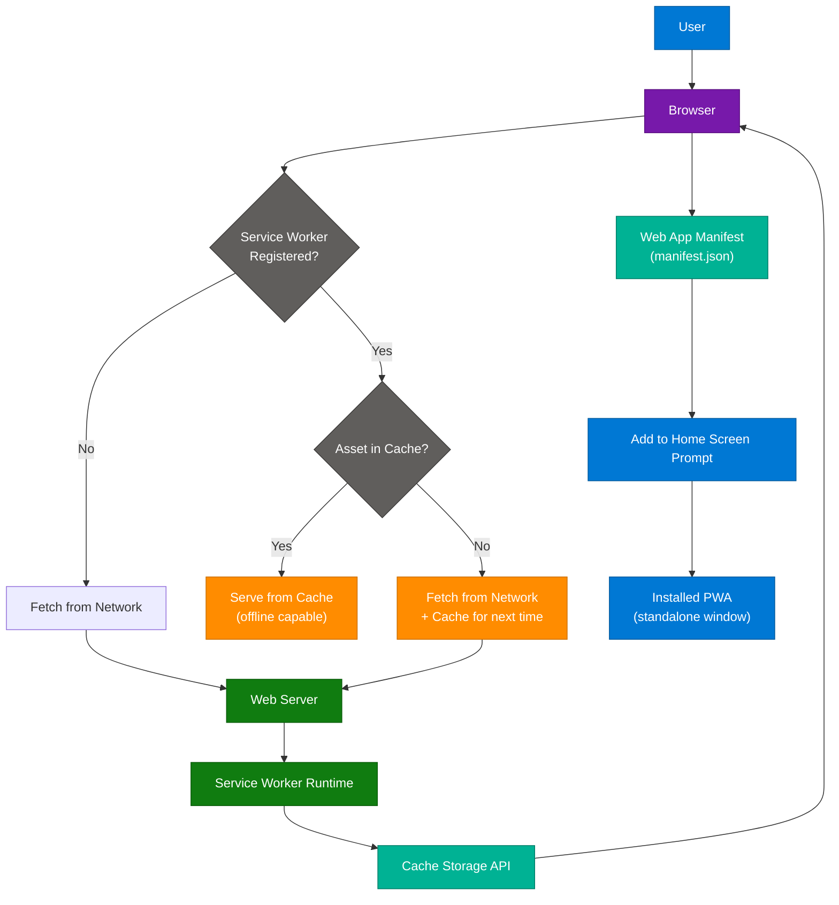

### Core Components

| Component | Technology | Purpose |
|---|---|---|
| **Service Worker** | Web Worker (background JS) | Intercept requests, offline caching, push notifications, background sync |
| **Web App Manifest** | `manifest.json` | App name, icons, theme color, display mode, start URL |
| **HTTPS** | TLS certificate | Required for service worker; secures cached content |
| **Cache Storage API** | `caches.open()` | Persistent storage for pre-cached and runtime-cached responses |
| **Push API** | `PushManager` | Server-initiated notifications even when browser is closed |
| **Background Sync** | `SyncManager` | Defer form submissions until connectivity is restored |

### Caching Strategies

| Strategy | Pattern | Best For |
|---|---|---|
| Cache First | Serve cache; fall back to network | Static assets (CSS, JS, fonts) |
| Network First | Try network; fall back to cache | API responses needing freshness |
| Stale While Revalidate | Serve cache; update in background | News feeds, non-critical content |
| Cache Only | Cache only; fail if missing | Pre-cached core app shell |
| Network Only | Always network; no cache | Payment endpoints, auth flows |

### Code Example

```javascript
// service-worker.js
const CACHE_NAME = 'app-v1';
const PRECACHE_ASSETS = ['/', '/index.html', '/styles.css', '/app.js'];

self.addEventListener('install', (event) => {
  event.waitUntil(
    caches.open(CACHE_NAME).then((cache) => cache.addAll(PRECACHE_ASSETS))
  );
  self.skipWaiting();
});

self.addEventListener('fetch', (event) => {
  const url = new URL(event.request.url);
  if (url.pathname.startsWith('/api/')) {
    // Network first for API calls
    event.respondWith(
      fetch(event.request)
        .then((res) => {
          caches.open(CACHE_NAME).then((c) => c.put(event.request, res.clone()));
          return res;
        })
        .catch(() => caches.match(event.request))
    );
  } else {
    // Cache first for static assets
    event.respondWith(
      caches.match(event.request).then((cached) => cached || fetch(event.request))
    );
  }
});

self.addEventListener('activate', (event) => {
  event.waitUntil(
    caches.keys().then((keys) =>
      Promise.all(keys.filter((k) => k !== CACHE_NAME).map((k) => caches.delete(k)))
    )
  );
});
```

```json
// manifest.json
{
  "name": "My Progressive Web App",
  "short_name": "MyPWA",
  "start_url": "/",
  "display": "standalone",
  "background_color": "#ffffff",
  "theme_color": "#0078D4",
  "icons": [
    { "src": "/icons/icon-192.png", "sizes": "192x192", "type": "image/png" },
    { "src": "/icons/icon-512.png", "sizes": "512x512", "type": "image/png" }
  ]
}
```

### Interview Q&A

| Question | Answer |
|---|---|
| What is a Service Worker? | A JavaScript file running in a background thread, acting as a programmable network proxy — intercepts all requests, manages caching, enables offline functionality, and handles push notifications. |
| Why does a PWA require HTTPS? | Service Workers can intercept all network requests. HTTPS prevents man-in-the-middle attacks from injecting malicious service worker scripts. |
| What is the Web App Manifest? | A JSON file (`manifest.json`) providing metadata (name, icons, theme, display mode, start URL) that enables "Add to Home Screen" and standalone launch. |
| What is cache-first vs. network-first? | Cache-first serves from cache immediately (fast, offline-capable), falls back to network — best for static assets. Network-first always attempts the network (fresh data), falls back to cache — best for API calls. |
| How do PWAs compare to native apps? | PWAs share a single codebase across platforms, are search-engine discoverable, and have zero install friction. Native apps have deeper OS integration, better graphics performance, and app store distribution. |
| What is background sync? | A Service Worker feature that queues deferred operations (form submissions) when offline and automatically executes them when connectivity is restored. |

---

## 13. Interview Q&A Cheatsheet

**Q: What is the fundamental difference between polling and long polling?**
> Short polling sends a new request at fixed intervals and receives an immediate response (possibly empty). Long polling holds the server connection open until data is available or a timeout occurs, then the client immediately re-requests — achieving near-real-time latency without a persistent bidirectional channel.

**Q: When would you choose WebSockets over SSE?**
> Use WebSockets when data must flow in both directions simultaneously (chat, collaborative editors, multiplayer gaming). Use SSE when only the server pushes data to the client (live scores, stock tickers, progress bars) — SSE is simpler, HTTP-native, and auto-reconnecting.

**Q: What are the WCAG POUR principles?**
> Perceivable (content detectable via at least one sense), Operable (all functionality keyboard-accessible), Understandable (content and UI comprehensible and predictable), Robust (works across current and future assistive technologies). AA conformance is the standard legal requirement.

**Q: What is the over-fetching/under-fetching problem and how does GraphQL solve it?**
> REST endpoints return fixed data shapes — the client either gets too much (over-fetching) or must make multiple requests (under-fetching/N+1). GraphQL clients specify exactly which fields and nested relations they need in a single query from one endpoint, eliminating both problems.

**Q: What is the Dependency Rule in Clean Architecture?**
> Source code dependencies can only point inward. Outer layers (frameworks, databases, UI) depend on inner layers (use cases, entities), but inner layers cannot reference anything from outer layers. Enforced through dependency inversion: use cases define interfaces; outer layers provide concrete implementations.

**Q: What distinguishes composable architecture from microservices?**
> Composable architecture is a design philosophy (assemble systems from interchangeable components for business agility). Microservices is a specific technical implementation pattern (independently deployable services per business capability). Microservices are commonly used as building blocks within composable architecture but are neither necessary nor sufficient for it.

**Q: What makes gRPC faster than REST+JSON?**
> Protocol Buffers (binary encoding, schema-defined, no field name strings in payload) reduce size 5–10x vs. JSON. HTTP/2 multiplexing eliminates head-of-line blocking, header compression reduces overhead, and bidirectional streaming allows server push — making gRPC ideal for high-throughput internal microservice communication.

**Q: Why is OFFSET pagination slow and what replaces it?**
> `OFFSET N` requires the DB to scan and discard N rows — O(N) cost growing with page depth. Keyset/cursor pagination replaces it with `WHERE id > last_seen_id ORDER BY id LIMIT N` — an index seek at O(log N) regardless of dataset depth.

**Q: What are the three pillars of a PWA?**
> Service Worker (background thread for offline caching, push notifications, request interception), Web App Manifest (JSON metadata enabling installation and standalone display), and HTTPS (required for service worker security). Together they deliver reliable, fast, and engaging web experiences.

**Q: How does SSE differ from Webhooks?**
> SSE is client-initiated: a browser opens a persistent HTTP connection to receive a stream of events for a user session. Webhooks are server-initiated: an external service fires a new HTTP POST to your server's public endpoint when a specific event occurs. SSE is for real-time UI; webhooks are for service-to-service event notification.

**Q: What does Webpack's tree shaking do?**
> Removes unused exported functions and variables from the final bundle by analyzing ESM static imports at build time. Requires ES modules (`import`/`export`) — CommonJS (`require`) modules cannot be tree-shaken.

---

*Extracted from Gemini shared session · July 10, 2026 · GeminiShareToMD Agent v1.0*

---

```
═══════════════════════════════════════════════════════════
Token Usage Report
═══════════════════════════════════════════════════════════
Estimated without optimization:  ~9,400 tokens (raw page text)
Actual output (enriched file):   ~7,200 tokens (optimized source + 3x enrichment)
Raw source savings:              ~1,400 tokens (15%)
Techniques applied:              UI chrome removal ("Convert chat to PDF", "Continue this chat",
                                 Google Privacy/ToS footers, inline citation refs stripped),
                                 deduplication of Clean Architecture (turns 10+12 merged),
                                 deduplication of Composable Architecture (turns 11+13+14 merged),
                                 compact-engineering verbose prose, TOON table consolidation
═══════════════════════════════════════════════════════════
```
