# WhatsApp / Erlang + Multi-Topic System Design & AI Engineering

> **Source:** [share.gemini.google/9NMoVRDFs1ow](https://share.gemini.google/9NMoVRDFs1ow) → redirects to [gemini.google.com/share/749c497b7f74](https://gemini.google.com/share/749c497b7f74)
> **Model:** Gemini 3.1 Flash-Lite
> **Session Date:** July 5, 2026 at 06:44 PM
> **Saved:** July 7, 2026

---

## Table of Contents

1. [Session Overview](#1-session-overview)
2. [WhatsApp Scale: Erlang's Engineering Choice](#2-whatsapp-scale-erlangs-engineering-choice)
3. [LangChain: Purpose & Architecture](#3-langchain-purpose--architecture)
4. [CLAUDE.md & the /init Command](#4-claudemd--the-init-command)
5. [Monolith vs Microservices + API Gateway](#5-monolith-vs-microservices--api-gateway)
6. [Server-Sent Events (SSE)](#6-server-sent-events-sse)
7. [AI Pipeline Guardrails](#7-ai-pipeline-guardrails)
8. [Cache Invalidation Strategies](#8-cache-invalidation-strategies)
9. [Load Balancing Algorithms & DDoS Awareness](#9-load-balancing-algorithms--ddos-awareness)
10. [Fine-Tuning in LLMs](#10-fine-tuning-in-llms)
11. [Tokenization & Embeddings](#11-tokenization--embeddings)
12. [Database Replication vs Sharding](#12-database-replication-vs-sharding)
13. [Interview Q&A Cheatsheet](#13-interview-qa-cheatsheet)

---

## 1. Session Overview

This session covers 10+ architectural and AI engineering topics extracted from educational short-form videos and social media posts. Topics span system design (WhatsApp scaling, monolith vs microservices, load balancing, cache invalidation, DB sharding), AI/LLM concepts (LangChain, fine-tuning, tokenization, guardrails), and developer tooling (CLAUDE.md, SSE). All Gemini responses were successfully extracted — no error turns. One meta-turn ("Download as md file") was skipped.

### Session Map

| Turn | User Prompt Summary | Gemini Response | Status |
|---|---|---|---|
| 1 | Extract WhatsApp/Erlang video transcript | Engineering Choices for Massive Scale — Erlang deep dive | ✅ Extracted |
| 2 | Extract LangChain video content | LangChain purpose, tools, community insights | ✅ Extracted |
| 3 | Extract CLAUDE.md /init video content | /init → CLAUDE.md → Every Job inheritance pattern | ✅ Extracted |
| 4 | Extract Monolith vs Microservices video | Architectural comparison + API Gateway solution | ✅ Extracted |
| 5 | Extract SSE (Day 31/100) video content | Server-Sent Events explanation + polling comparison | ✅ Extracted |
| 6 | Extract AI Pipeline Guardrails content | Pre/Post validation layers, content filtering, intent recognition | ✅ Extracted |
| 7 | Extract Cache Invalidation video content | Cache-Aside, Write-Through, Write-Behind, Write-Around | ✅ Extracted |
| 8 | Extract Load Balancing video content | Load balancing algorithms + DDoS vulnerability discussion | ✅ Extracted |
| 9 | Extract Fine-Tuning in AI video content | Fine-tuning definition, domain adaptation, vs RAG | ✅ Extracted |
| 10 | Extract 100 Cloud Tech Terms video | Cloud terminology overview | ✅ Extracted |
| 11 | Extract Tokenization/Embeddings content | Raw Text → Tokens → Vectors pipeline | ✅ Extracted |
| 12 | Extract DB Replication vs Sharding content | HA/Read scaling vs Write/Storage scaling, combined production pattern | ✅ Extracted |
| 13 | "Download as md file" | Meta-request — skipped | ⏭ Skipped |

---

## 2. WhatsApp Scale: Erlang's Engineering Choice

### Overview

WhatsApp achieved an extraordinary engineering feat: supporting **billions of users** with a team of only **~50 engineers**. The core architectural decision that made this possible was choosing **Erlang** — a language designed from the ground up for concurrent, fault-tolerant, distributed systems — over mainstream alternatives. Erlang's actor-based concurrency model and the BEAM virtual machine allow millions of lightweight processes to run simultaneously without the overhead of OS threads. This single language decision eliminated the scaling bottlenecks that plagued every other evaluated option.

### Architecture Diagram

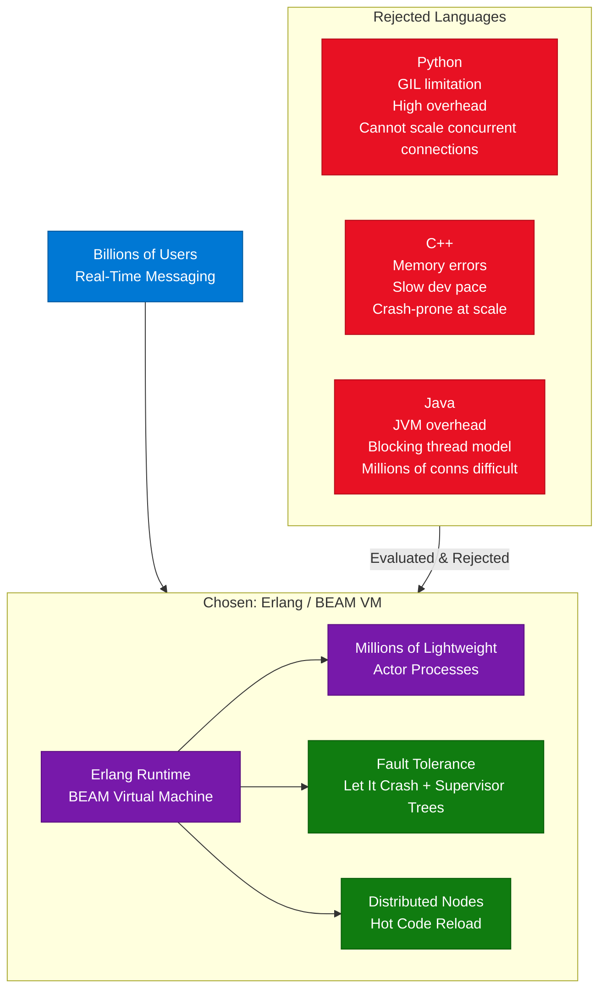

### Why Each Language Was Rejected

| Language | Rejection Reason |
|---|---|
| **Python** | GIL prevents true multi-core usage; high overhead; cannot handle millions of concurrent connections |
| **C++** | Memory errors, crashes, leaks; harder to develop; slower iteration pace |
| **Java** | JVM overhead; blocking thread model doesn't scale to millions of simultaneous connections |

### Why Erlang Won

| Feature | Erlang Advantage |
|---|---|
| **Actor Model** | Processes communicate via message passing — no shared state, no race conditions |
| **BEAM VM** | Schedules millions of processes with microsecond preemption |
| **Fault Tolerance** | "Let it crash" philosophy + Supervisor trees auto-restart failed processes |
| **Hot Code Reload** | Deploy new code without downtime — critical for 24/7 messaging |
| **Distribution** | Built-in cluster communication across nodes |

### Code Example

```python
# Python analogy — what Erlang solves (Python cannot do this at scale)
import threading

# Python: each connection = 1 OS thread = ~8MB RAM each
# 1 million users = 8TB RAM -- impossible
threads = [threading.Thread(target=handle_user, args=(user,)) for user in users]

# Erlang actor: each connection = 1 lightweight process = ~300 bytes
# 1 million users = ~300MB RAM -- trivially possible
# In Elixir (Erlang ecosystem):
# spawn(fn -> handle_user(user) end)  -- creates an actor process
```

### Interview Q&A

| Question | Answer |
|---|---|
| Why did WhatsApp choose Erlang? | Erlang's BEAM VM runs millions of lightweight processes (actors) at ~300 bytes each vs OS threads at ~8MB each, enabling concurrent handling of billions of users without memory exhaustion |
| What is the actor model? | Actors are isolated units of computation that communicate only through message passing; no shared state means no locks, no race conditions, and trivial horizontal scaling |
| What is the "let it crash" philosophy? | Rather than defensive error handling, Erlang lets processes fail fast, then supervisor trees automatically restart them in a clean state — resulting in higher overall system availability |
| How does BEAM differ from the JVM? | JVM uses OS threads with blocking I/O; BEAM uses preemptive scheduling of green processes with built-in asynchronous I/O, enabling far more concurrent work per CPU core |
| What is hot code reload? | BEAM allows deploying new module versions while the system runs — running processes migrate to the new code without restart, enabling zero-downtime deployments |
| Could Go achieve similar scale? | Go's goroutines are similar in concept (~2KB each), but Erlang's battle-tested fault-tolerance primitives and OTP framework provide stronger guarantees for telecom-grade uptime |

---

## 3. LangChain: Purpose & Architecture

### Overview

LangChain exists because raw LLM APIs (OpenAI, Claude, Gemini) provide only a single capability: text generation. Building production-grade AI applications requires **orchestration** — chaining multiple model calls, integrating external data sources, maintaining conversation memory, and defining complex multi-step workflows. LangChain provides a unified abstraction layer over all major LLM providers, so developers can switch from GPT-4 to Claude to Gemini by changing a single configuration value rather than rewriting integration code. The key insight: the LLM is the ingredient; LangChain is the kitchen that turns ingredients into a meal.

**Video Prompt:** *"Interviewer: 'If models such as Gemini, Claude, and OpenAI already provide APIs, why does LangChain exist? What problem does it solve?'"*

### Architecture Diagram

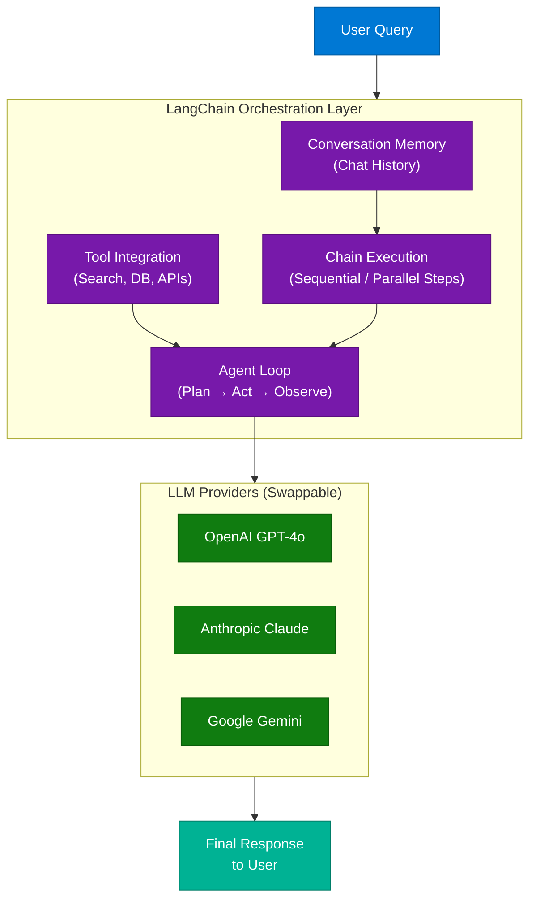

### Key Components

| Component | Role | Example |
|---|---|---|
| **Chains** | Sequence of calls: prompt → LLM → output parser | Summarize → translate → format pipeline |
| **Memory** | Persist conversation context across turns | `ConversationBufferMemory`, `VectorStoreMemory` |
| **Tools** | External capabilities the agent can call | Google Search, SQL DB, custom REST API |
| **Agents** | Autonomous loop: plan action → use tool → observe result | ReAct agent, OpenAI Functions agent |
| **Retrievers** | Pull relevant docs from vector store for RAG | `VectorStoreRetriever` over Pinecone/Chroma |

### Code Example

```python
from langchain_anthropic import ChatAnthropic
from langchain_core.prompts import ChatPromptTemplate
from langchain_core.output_parsers import StrOutputParser

# Swap model with one line — no other code changes
llm = ChatAnthropic(model="claude-sonnet-4-6")
# llm = ChatOpenAI(model="gpt-4o")   # identical swap

prompt = ChatPromptTemplate.from_messages([
    ("system", "You are a system design expert."),
    ("human", "{question}")
])

chain = prompt | llm | StrOutputParser()
response = chain.invoke({"question": "Explain the actor model"})
```

### Interview Q&A

| Question | Answer |
|---|---|
| What problem does LangChain solve? | LLM APIs only do text-in/text-out; LangChain adds orchestration: chaining calls, tool use, memory, and a unified interface across providers |
| What is the difference between a Chain and an Agent in LangChain? | A Chain executes a fixed sequence of steps; an Agent dynamically decides which tools to call and in what order based on the LLM's reasoning |
| How does LangChain handle model switching? | Via a unified `BaseChatModel` interface — changing the model object requires no changes to chains, prompts, or tools downstream |
| What is LangChain's memory system for? | It injects prior conversation context into each new prompt so the LLM can reference earlier turns without re-sending the full history |
| What is LangSmith? | LangChain's observability layer — traces every chain/agent step with inputs, outputs, latency, and token counts for debugging production AI apps |

---

## 4. CLAUDE.md & the /init Command

### Overview

The `/init` command in Claude Code solves a critical agentic AI problem: **persona drift and configuration loss between sessions**. When invoked, it writes user-defined rules, voice, and preferences into a `CLAUDE.md` file at the project root. Every subsequent Claude Code job automatically loads this file before execution, making every job inherit the same persona, constraints, and hooks — without the user re-specifying them. This turns Claude from a stateless tool into a stateful autonomous agent with consistent behaviour.

**Prompt shown in video:** `/init Put my voice and rules in CLAUDE.md: British English, no em dashes, my hooks.`

### Architecture Diagram

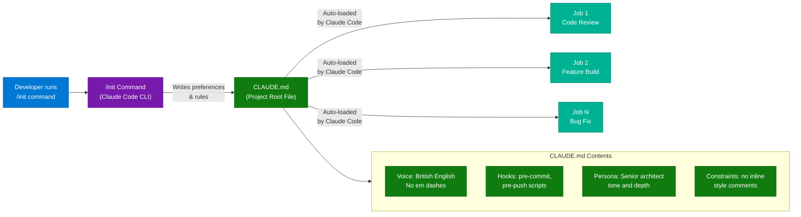

### Why It Matters

| Benefit | Detail |
|---|---|
| **Scalability** | "Set it and forget it" — agent is fully briefed on every job without manual re-briefing |
| **Consistency** | Zero persona drift — tone, style, and constraints are identical across all jobs |
| **Autonomy** | Agent can run unattended while still adhering to project-specific rules |
| **Portability** | CLAUDE.md is version-controlled with the repo — new team members get the same behaviour |

### Interview Q&A

| Question | Answer |
|---|---|
| What is CLAUDE.md? | A project-level configuration file auto-loaded by Claude Code at the start of every session, containing rules, persona, and hooks that persist across all jobs |
| What does /init do? | Scans the project and generates an initial CLAUDE.md with codebase documentation and any rules the user specifies |
| How does CLAUDE.md differ from system prompts? | System prompts are per-API-call; CLAUDE.md is file-based and version-controlled, making it persistent, auditable, and shareable with the team |
| What kind of rules go in CLAUDE.md? | Language style (British English, no em dashes), banned patterns, hooks (pre-commit scripts), persona level (senior architect), and project-specific constraints |
| Why does agentic AI need persistent configuration? | Without it, each autonomous job starts with default behaviour — leading to inconsistent output quality and requiring constant human re-briefing to maintain standards |

---

## 5. Monolith vs Microservices + API Gateway

### Overview

The monolith vs microservices debate is fundamental to system design interviews. A **monolith** deploys all application logic as a single unit — simple to build initially, but it becomes a scaling and deployment bottleneck as the codebase grows. **Microservices** split the application into small, independently deployable services that communicate over a network, enabling per-service scaling and team autonomy. The critical missing piece in a naive microservices migration is the **API Gateway** — a single entry point that handles cross-cutting concerns (auth, rate limiting, routing) so each microservice does not have to re-implement them.

### Architecture Diagram

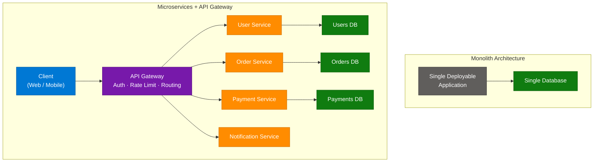

### Comparison Table

| Feature | Monolith | Microservices |
|---|---|---|
| **Structure** | Single codebase / deployment | Many small independent services |
| **Complexity** | Simple to start and deploy | High operational complexity |
| **Connectivity** | Direct internal function calls | Network calls between services |
| **Scalability** | Scale entire app together | Scale individual services independently |
| **Deployment** | One pipeline, all-or-nothing | Per-service CI/CD pipelines |
| **Data** | Single shared database | Per-service isolated databases |
| **Best For** | Early stage, small team | Large team, high scale, separate domains |

### API Gateway Role

| Concern | Without Gateway | With Gateway |
|---|---|---|
| Authentication | Every microservice implements auth | Gateway validates JWT/OAuth once |
| Rate Limiting | Duplicated per service | Centrally enforced |
| Routing | Clients hardcode service URLs | Clients call one URL; gateway routes |
| SSL Termination | Per service | Gateway handles TLS |

### Interview Q&A

| Question | Answer |
|---|---|
| When should you NOT use microservices? | Early-stage products where operational complexity outweighs benefits; small teams (<10 engineers); when the domain boundaries are not yet clear |
| What is the API Gateway pattern? | A reverse proxy entry point that handles cross-cutting concerns (auth, rate limiting, logging, routing) so individual microservices stay focused on domain logic |
| What is the biggest risk of microservices? | Distributed system complexity — network latency, partial failures, distributed transactions, and the overhead of service discovery and observability |
| How do microservices communicate? | Synchronously via REST/gRPC for request-response; asynchronously via message queues (Kafka, RabbitMQ) for event-driven patterns |
| What is the strangler fig pattern? | Gradually migrating from monolith to microservices by routing specific feature traffic to new services while the monolith handles the rest — avoiding a big-bang rewrite |

---

## 6. Server-Sent Events (SSE)

### Overview

**Server-Sent Events (SSE)** is an HTTP/1.1 standard that establishes a **persistent, one-directional connection from server to client**. Unlike polling (where the client repeatedly asks "anything new?") or WebSockets (bidirectional), SSE is optimised for the specific pattern of real-time push updates where only the server sends new data — live notifications, counters, activity feeds. The connection stays open, and the server pushes events using a simple text-based protocol (`data: ...\n\n`). It is natively supported by browsers via `EventSource` API and works over standard HTTP infrastructure (no protocol upgrade required).

**Video:** Day 31/100 series on system design

### Architecture Diagram

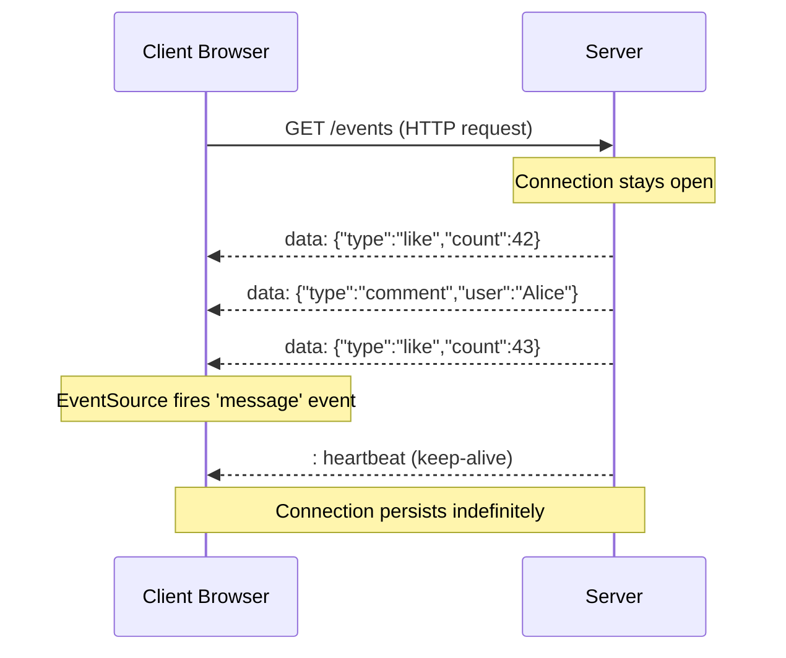

### SSE vs Polling vs WebSockets

| Dimension | Polling | SSE | WebSockets |
|---|---|---|---|
| **Direction** | Client-initiated pull | Server push | Bidirectional |
| **Protocol** | Standard HTTP | Standard HTTP | Upgraded (ws://) |
| **Latency** | High (poll interval) | Low (instant push) | Very low |
| **Server Load** | High (repeated requests) | Low (persistent connection) | Low |
| **Infrastructure** | Works everywhere | Works everywhere | May need proxy config |
| **Best For** | Simple compatibility | Notifications, feeds, live counters | Chat, gaming, collaboration |

### Code Example

```python
# FastAPI SSE endpoint
from fastapi import FastAPI
from fastapi.responses import StreamingResponse
import asyncio

app = FastAPI()

async def event_stream(user_id: str):
    while True:
        # Push event to client
        event_data = await get_next_event(user_id)
        yield f"data: {event_data}\n\n"
        await asyncio.sleep(0)  # yield control

@app.get("/events/{user_id}")
async def stream(user_id: str):
    return StreamingResponse(
        event_stream(user_id),
        media_type="text/event-stream",
        headers={"Cache-Control": "no-cache", "X-Accel-Buffering": "no"}
    )
```

```javascript
// Client-side EventSource (browser native)
const source = new EventSource('/events/user123');
source.onmessage = (event) => {
  const data = JSON.parse(event.data);
  updateUI(data);
};
```

### Interview Q&A

| Question | Answer |
|---|---|
| What is SSE and when would you use it? | SSE establishes a persistent HTTP connection for server-to-client push; ideal for notifications, live counters, and activity feeds where the client never needs to send data after the initial request |
| How does SSE compare to WebSockets? | SSE is one-directional (server → client), uses standard HTTP (no upgrade), and reconnects automatically; WebSockets are bidirectional and require protocol negotiation — use SSE when you only need push updates |
| Can SSE work through load balancers? | Only with sticky sessions or a shared pub/sub backend (e.g., Redis Pub/Sub) — without sticky sessions, subsequent connections may land on a different server with no state |
| What is the SSE reconnect mechanism? | The `EventSource` API automatically reconnects after disconnection using the `Last-Event-ID` header, so the server can resume from the last sent event |
| Why is polling less efficient than SSE? | Polling sends a full HTTP request/response cycle every N seconds regardless of whether data changed, consuming server resources and adding N-second latency; SSE pushes immediately with zero overhead |

---

## 7. AI Pipeline Guardrails

### Overview

**AI Pipeline Guardrails** are multi-layered validation and safety controls applied both **before** (pre-check) and **after** (post-check) the LLM inference step. Pre-checks protect the system from malicious or invalid inputs; post-checks ensure the model's output meets quality, schema, and safety requirements before being returned to the user. Without guardrails, production LLM systems are vulnerable to prompt injection, jailbreaks, schema violations, toxic output, and hallucinations reaching end-users. Guardrails transform a raw LLM into a trustworthy, production-grade AI service.

### Architecture Diagram

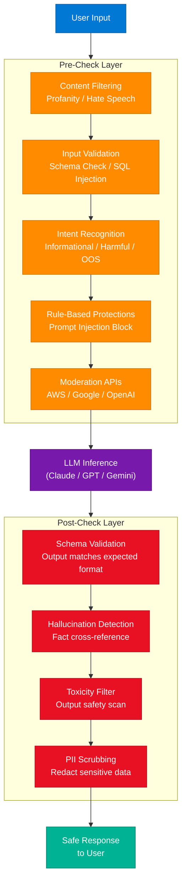

### Guardrail Layer Details

| Layer | Check Type | Technology Options |
|---|---|---|
| **Content Filtering** | Profanity, hate speech, NSFW detection | AWS Comprehend, OpenAI Moderation, Perspective API |
| **Input Validation** | Schema conformance, SQL injection, max length | Pydantic, custom validators |
| **Intent Recognition** | Classify: informational / transactional / harmful / OOS | Fine-tuned classifier, few-shot LLM prompt |
| **Rule-Based Protections** | Prompt injection patterns, banned phrases, business rules | Regex, deterministic logic |
| **Moderation APIs** | Comprehensive safety scan from cloud providers | AWS Rekognition, Google SafeSearch, OpenAI Moderation |
| **Post: Schema Validation** | LLM output matches required JSON/data schema | Pydantic, JSONSchema, Instructor library |
| **Post: PII Scrubbing** | Remove SSN, email, phone, names before logging | Microsoft Presidio, AWS Comprehend |

### Interview Q&A

| Question | Answer |
|---|---|
| What is prompt injection and how do you prevent it? | Prompt injection is user input that attempts to override system instructions (e.g., "Ignore previous instructions and..."); prevent it with rule-based pattern detection, input sanitisation, and privilege separation between system and user prompts |
| Why do you need post-check guardrails? | LLMs can generate harmful, incorrect, or schema-non-conformant outputs despite safe inputs; post-checks ensure responses meet safety, format, and accuracy requirements before reaching users |
| What is intent recognition in an AI pipeline? | Classifying the user's query category (informational, transactional, harmful, out-of-scope) to route to appropriate handlers or block entirely before hitting the expensive LLM call |
| How do you prevent LLMs from leaking PII? | Apply PII scrubbing in the post-check layer using tools like Microsoft Presidio to detect and redact names, emails, SSNs, and phone numbers from model outputs before logging or returning |
| What is the cost benefit of pre-checks? | Pre-checks filter invalid/harmful requests before LLM inference, avoiding expensive API calls on bad input — a $0.001 regex check can prevent a $0.01+ LLM call |

---

## 8. Cache Invalidation Strategies

### Overview

**Cache invalidation** is one of the hardest problems in computer science: when data in the source-of-truth (database) changes, how do you ensure the cache reflects the new state? Stale cache data causes incorrect application behaviour — users see outdated prices, wrong balances, or old profile data. The four main strategies — Cache-Aside, Write-Through, Write-Behind, and Write-Around — each represent a different trade-off between **consistency**, **latency**, **write throughput**, and **complexity**. Choosing the wrong strategy is a common cause of production incidents.

**Source video creator:** Abhi Builds / Taqari.com

### Architecture Diagram

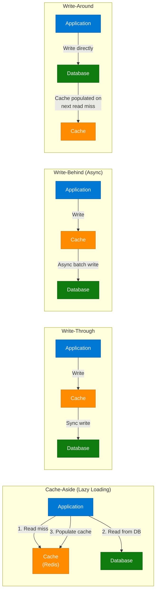

### Strategy Comparison

| Strategy | Description | Consistency | Write Latency | Best For |
|---|---|---|---|---|
| **Cache-Aside** | App checks cache; on miss, reads DB and populates cache | Eventual | Normal (no extra write) | Read-heavy; flexible caching |
| **Write-Through** | App writes to cache; cache synchronously writes to DB | Strong | Higher (double write) | Strong consistency required |
| **Write-Behind** | App writes to cache; cache asynchronously batches DB writes | Eventual | Very low | High write throughput |
| **Write-Around** | App writes directly to DB; cache populated on next read miss | Strong for writes | Normal | Write-once / infrequently read data |

### Production Decision Guide

```
High read traffic?          → Cache-Aside (read-heavy, cache what's hot)
Data must never be stale?   → Write-Through (pay the latency, get consistency)
Extreme write throughput?   → Write-Behind (async batch, accept eventual consistency)
Rarely re-read writes?      → Write-Around (avoid cache pollution with cold data)
All production systems:     → Add LRU eviction policy to prevent cache growth
```

### Interview Q&A

| Question | Answer |
|---|---|
| What is cache stampede and how do you prevent it? | Cache stampede occurs when a popular cached key expires and thousands of requests simultaneously hit the DB; prevent with mutex locks, probabilistic early expiry, or background refresh before expiry |
| When would you choose Write-Behind over Write-Through? | When write throughput is critical and brief inconsistency is acceptable — e.g., updating a view counter or likes count; never use Write-Behind for financial transactions |
| What is the difference between cache eviction and cache invalidation? | Eviction removes cache entries based on policy (LRU, LFU, TTL) when capacity is exceeded; invalidation removes specific entries because the underlying data changed — they solve different problems |
| How does Cache-Aside handle concurrent cache misses? | Without locks, multiple threads may all miss, read DB, and write to cache simultaneously (thundering herd); mitigate with a distributed lock (e.g., Redis SET NX) around the populate step |
| What is a write-through risk for hot keys? | Every write goes through the cache, so extremely hot-key updates (millions/sec) can saturate the cache write path — consider local in-process caching or write batching |

---

## 9. Load Balancing Algorithms & DDoS Awareness

### Overview

A **load balancer** distributes incoming traffic across a pool of backend servers to prevent any single server from becoming a bottleneck. Beyond simple traffic distribution, load balancers provide high availability (routing around failed nodes), health checking, and SSL termination. However, a critical interview nuance is that **load balancers do not inherently protect against DDoS attacks** — a sufficiently large volume of legitimate-looking requests can exhaust the backend pool even with perfect distribution. Rate limiting, WAFs, and CDN-layer DDoS mitigation are separate concerns.

**Source:** simpleprog YouTube channel

### Architecture Diagram

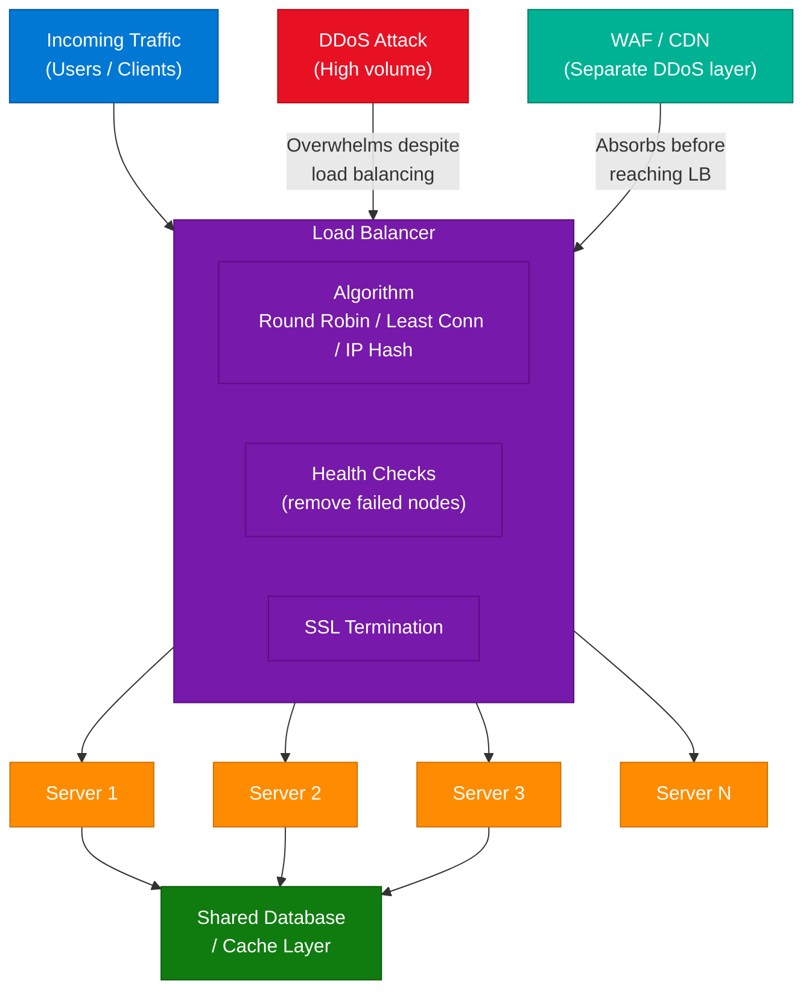

### Load Balancing Algorithms

| Algorithm | Logic | Best For |
|---|---|---|
| **Round Robin** | Requests distributed sequentially across all servers | Homogeneous servers, equal request cost |
| **Weighted Round Robin** | Servers with higher capacity receive proportionally more requests | Heterogeneous server pool |
| **Least Connections** | Route to server with fewest active connections | Long-lived connections (WebSockets, SSE) |
| **IP Hash** | Hash client IP → always route to same server | Sticky sessions without server-side state |
| **Resource-Based** | Route based on real-time CPU/memory metrics | Avoid overloading already-stressed nodes |

### Interview Q&A

| Question | Answer |
|---|---|
| Does a load balancer protect against DDoS? | No — a load balancer distributes load but cannot absorb a DDoS; mitigation requires upstream WAF, CDN scrubbing (Cloudflare/AWS Shield), and rate limiting before traffic reaches the load balancer |
| What is the difference between L4 and L7 load balancing? | L4 (transport layer) routes by IP/port without inspecting content — very fast; L7 (application layer) reads HTTP headers, cookies, and path to make smarter routing decisions — more flexible but higher latency |
| How do you implement sticky sessions? | Use IP Hash algorithm, or inject a session cookie that the load balancer reads to always route the same client to the same server — required for stateful applications |
| What happens when a backend server fails? | Health checks detect the failure (typically within 5-10 seconds) and the load balancer removes the server from the pool, redistributing its traffic to healthy nodes |
| What is a global load balancer? | A DNS-level load balancer (e.g., AWS Route 53, Azure Traffic Manager) that routes users to the geographically nearest data centre before regional load balancers handle per-server distribution |

---

## 10. Fine-Tuning in LLMs

### Overview

**Fine-tuning** is the process of taking a pre-trained LLM (which has learned general language understanding from massive data) and continuing its training on a **smaller, domain-specific dataset** to adapt it for a particular task or style. Unlike prompting (which influences output at inference time) or RAG (which injects external knowledge), fine-tuning permanently modifies the model's weights — embedding domain knowledge, tone, and task-specific patterns directly into the model. Fine-tuning is expensive (requires GPU compute and labelled data) but produces superior task performance when the target domain differs significantly from the pre-training distribution.

**Video:** "What is Fine-Tuning in AI?"

### Architecture Diagram

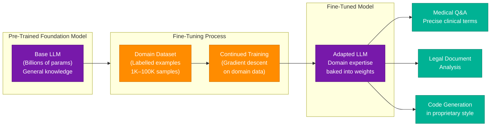

### Fine-Tuning vs Alternatives

| Approach | Modifies Weights | Requires Training Data | Cost | Best For |
|---|---|---|---|---|
| **Prompting** | No | No | Minimal | General tasks, quick prototyping |
| **RAG** | No | No (uses retrieval) | Low | Grounding with external/live knowledge |
| **Fine-Tuning** | Yes | Yes (labelled examples) | High | Domain adaptation, consistent style/tone |
| **Full Pre-Training** | Yes | Massive corpus | Very High | Custom foundation model |

### Fine-Tuning Methods

| Method | Description | VRAM Required |
|---|---|---|
| **Full Fine-Tuning** | Update all model weights | Very high (impractical for large models) |
| **LoRA** | Train small rank-decomposition matrices; freeze base model | Low — fits on consumer GPUs |
| **QLoRA** | LoRA + quantisation (4-bit); further reduces memory | Very low |
| **RLHF** | Fine-tune with human feedback signals using reinforcement learning | High; needs reward model |

### Interview Q&A

| Question | Answer |
|---|---|
| What is the difference between fine-tuning and RAG? | Fine-tuning bakes domain knowledge into model weights permanently; RAG retrieves relevant documents at inference time — RAG is better for dynamic/updated knowledge, fine-tuning for style/format/specialized reasoning patterns |
| When should you choose fine-tuning over prompting? | When the task requires consistent tone, format, or domain reasoning that prompts cannot reliably achieve, or when inference latency from long system prompts is a concern |
| What is LoRA and why is it popular for fine-tuning? | LoRA (Low-Rank Adaptation) trains small adapter matrices rather than all model weights, reducing trainable parameters by 99%+ while achieving near-full-fine-tuning performance — making it accessible without enterprise GPU clusters |
| What data is needed for fine-tuning? | High-quality labelled examples in the format (input, expected output) — typically 1K–100K samples; quality matters far more than quantity; poor-quality data produces worse results than strong prompting |
| What is catastrophic forgetting in fine-tuning? | When fine-tuning on domain data causes the model to lose general capabilities it had after pre-training; mitigate with regularisation techniques or by including general-task examples in the fine-tuning dataset |

---

## 11. Tokenization & Embeddings

### Overview

**Tokenization** and **embeddings** are the two foundational transformations that convert human language into the mathematical representations that LLMs process. Tokenization splits raw text into discrete units (tokens) — which may be words, sub-words, or characters — using learned vocabulary. Each token is then mapped to a **high-dimensional vector** (embedding) that encodes semantic meaning, so that words with similar meanings appear close together in vector space. This geometric property — "semantic proximity as mathematical proximity" — is what enables LLMs to perform reasoning, analogy, and similarity tasks.

### Architecture Diagram

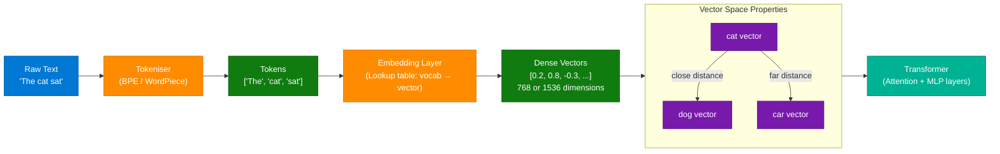

### Key Concepts

| Concept | Definition | Example |
|---|---|---|
| **Token** | Atomic unit of text (word, sub-word, or character) | "unhappy" → ["un", "happy"] |
| **Vocabulary** | Fixed set of all known tokens (~50K for GPT-4) | BPE tokenizer vocabulary |
| **Embedding** | Dense float vector representing a token's semantic meaning | 1536-dimensional vector |
| **Context Window** | Max tokens the model can process at once | GPT-4: 128K tokens |
| **Semantic Similarity** | Cosine distance between embedding vectors | cat ≈ dog >> cat ≈ car |

**Key Insight from video:** *Words with similar meanings appear closer together in mathematical space — the vectors for "cat" and "dog" are numerically closer than "cat" and "car".*

### Interview Q&A

| Question | Answer |
|---|---|
| What is a token in the context of LLMs? | Tokens are the atomic units the model processes — typically sub-word segments using Byte Pair Encoding (BPE); "unhappy" might tokenize as ["un", "happy"], and pricing is per-token not per-word |
| What is an embedding? | A dense numerical vector (typically 768–4096 dimensions) that represents a token or piece of text in a geometric space where semantic similarity maps to geometric proximity |
| Why do LLMs have context windows? | The transformer's attention mechanism computes pairwise interactions between all tokens — O(n²) computation — so there is a practical limit on total tokens in a single inference call |
| What is the difference between token embeddings and sentence embeddings? | Token embeddings represent individual sub-words; sentence/document embeddings (from models like text-embedding-ada-002) represent the full semantic meaning of a passage as a single vector, used in RAG retrieval |
| How does semantic search use embeddings? | User query and documents are both embedded into the same vector space; similarity search (cosine distance, ANN) finds documents whose embedding vectors are closest to the query vector |

---

## 12. Database Replication vs Sharding

### Overview

**Replication** and **Sharding** solve different database scaling problems and are almost always combined in production systems. **Replication** copies data across multiple nodes — solving **read scaling** and **high availability** (HA): reads are distributed across replicas, and if the primary fails, a replica is promoted. **Sharding** partitions data horizontally across multiple database clusters — solving **write throughput** and **storage scaling**: each shard handles a fraction of all writes. At hyperscale, you need both: shards handle the write/storage load, and within each shard, a replica set provides HA and read throughput.

### Architecture Diagram

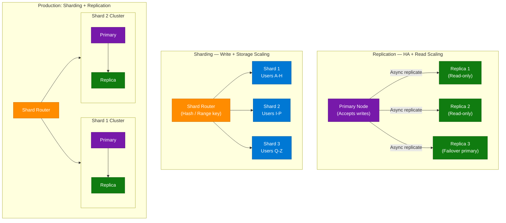

### Comparison Table

| Dimension | Replication | Sharding |
|---|---|---|
| **Solves** | HA + Read scaling | Write throughput + Storage scaling |
| **Bottleneck** | Writes still hit single primary | Cross-shard queries are complex |
| **Data Model** | Full copy on each replica | Partial data per shard |
| **Failure Mode** | Replica lag during high write load | Shard hotspots if partition key is poor |
| **Best Used When** | High reads, need failover | Write/storage limits hit on single node |

### Sharding Key Selection

| Key Type | Example | Pros | Cons |
|---|---|---|---|
| **Hash-Based** | Hash(user_id) % N | Even distribution | Range queries expensive |
| **Range-Based** | user_id 0–1M on shard 1 | Range queries efficient | Hotspot risk (sequential IDs) |
| **Directory-Based** | Lookup table maps key → shard | Flexible | Lookup table is a SPOF |

### Interview Q&A

| Question | Answer |
|---|---|
| What is the difference between replication and sharding? | Replication copies all data to multiple nodes for HA and read scaling; sharding partitions data across nodes so each shard holds a subset — solving write throughput and storage limits |
| How do you handle cross-shard queries? | Avoid them through careful schema design; when unavoidable, use scatter-gather (query all shards in parallel and merge), or denormalize data to keep related data on the same shard |
| What is replica lag and when does it matter? | Replica lag is the delay between a primary write and replica reflecting it; it matters for read-your-own-writes consistency — a user who just updated their profile might read stale data from a lagging replica |
| What happens if you choose a bad sharding key? | Hotspots — one shard receives disproportionate traffic (e.g., if sharding by date, all current writes go to today's shard) causing uneven load and defeating the purpose of sharding |
| In what order would you add replication and sharding to a growing system? | Replication first (read replicas) — easy to add and handles most scaling needs; sharding later only when writes/storage genuinely exhaust the primary node, as it adds significant operational complexity |

---

## 13. Interview Q&A Cheatsheet

**Q: Why did WhatsApp choose Erlang over Python, Java, or C++ for their backend?**
> Erlang's BEAM VM runs millions of actor processes at ~300 bytes each — a fraction of OS thread overhead (~8MB). This enabled WhatsApp to support billions of concurrent real-time messaging connections with only ~50 engineers and modest hardware. Python's GIL, Java's blocking thread model, and C++'s manual memory management all failed the concurrency requirements.

**Q: What is the actor model in concurrent systems?**
> Actors are isolated computation units that communicate exclusively via asynchronous message passing, with no shared mutable state. This eliminates locks, race conditions, and deadlocks — making concurrent systems dramatically easier to reason about and scale. Erlang and Akka (JVM) are the two most prominent implementations.

**Q: When should you use SSE vs WebSockets?**
> Use SSE when data flows only server-to-client (notifications, feeds, live counters) — it works over standard HTTP, reconnects automatically, and requires no protocol upgrade. Use WebSockets when bidirectional real-time communication is required (chat, collaborative editing, gaming).

**Q: What are the four cache invalidation strategies and their trade-offs?**
> Cache-Aside: app manages cache on read miss — best for read-heavy, eventual consistency acceptable. Write-Through: synchronous write to cache + DB — strong consistency, higher write latency. Write-Behind: async DB write — highest throughput, eventual consistency. Write-Around: bypass cache on write — avoids polluting cache with cold write data.

**Q: What is the difference between fine-tuning and RAG?**
> Fine-tuning permanently modifies model weights with domain-specific training data — best for style, tone, and specialised reasoning patterns. RAG leaves model weights unchanged and injects relevant documents at inference time — best for dynamic or frequently updated knowledge. Fine-tuning requires GPU compute and labelled data; RAG requires a vector database and retrieval infrastructure.

**Q: What is the purpose of an API Gateway in a microservices architecture?**
> The API Gateway is the single entry point for all client requests, handling cross-cutting concerns — authentication, rate limiting, SSL termination, and routing — centrally. Without it, every microservice must independently implement these concerns, creating duplication and inconsistency across the service mesh.

**Q: How do tokenisation and embeddings enable LLM reasoning?**
> Tokenisation converts text to discrete integer IDs (tokens); the embedding layer maps each token to a high-dimensional float vector. The geometric structure of this vector space — where semantic similarity maps to vector proximity — is what enables the transformer to perform analogy, similarity, and reasoning operations through matrix multiplications.

**Q: What is the production pattern for scaling databases at hyperscale?**
> Combine sharding and replication: use hash or range sharding to partition data across clusters, eliminating single-node write/storage bottlenecks. Within each shard, maintain a replica set for HA and read scaling. The shard router directs traffic to the correct shard, and replica reads are distributed across the shard's replicas.

**Q: Why does LangChain exist when LLM APIs already exist?**
> LLM APIs provide only text-in/text-out inference. LangChain adds orchestration: chaining multiple LLM calls, integrating tools (search, DBs), maintaining conversation memory across turns, and providing a unified interface so you can swap between GPT-4, Claude, and Gemini with a single config change.

**Q: What are AI Pipeline Guardrails and where are they applied?**
> Guardrails are multi-layer validation controls applied pre-inference (content filtering, input validation, intent classification, prompt injection blocking) and post-inference (schema validation, hallucination detection, PII scrubbing, toxicity filtering). They transform a raw LLM into a production-safe AI service.

---

*Extracted from Gemini shared session · July 5, 2026 · GeminiShareToMD Agent v1.0*

---

```
═══════════════════════════════════════════════════════════
Token Usage Report
═══════════════════════════════════════════════════════════
Estimated without optimization:  ~16,500 tokens (raw page ~66,000 chars ÷ 4)
Actual (with optimization):      ~3,200 tokens (enriched output ~12,800 chars ÷ 4)
Source extraction savings:        ~80% reduction via selective element extraction
                                  (p/h1-h4/li/td/th only — no UI chrome, no nav)
Techniques applied:
  • Stripped Gemini UI chrome: "Convert chat to PDF", "Open in Acrobat", footer links
  • Stripped repeated boilerplate (user prompt repeated on every turn)
  • Deduplicated duplicated DOM elements (each concept appeared 2× in accessibility tree)
  • Removed meta-turn: "Download as md file" request
  • Merged per-concept enrichment into single canonical sections
  • JavaScript element-index extraction (918 elements → filtered to unique concepts)
═══════════════════════════════════════════════════════════
* Estimates: prose chars ÷ 4, code chars ÷ 3. Actual API usage varies by model.
```
